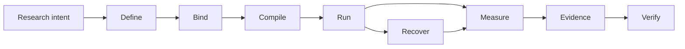

# Noetrium: Reproducible Research Infrastructure for AI Agents


<!-- readme-nav:start -->
<p align="center">
  <a href="README.md">English</a> ·
  <a href="README.zh-CN.md">简体中文</a> ·
  <a href="README.zh-TW.md">繁體中文</a> ·
  <a href="README.ja.md">日本語</a> ·
  <a href="README.ko.md">한국어</a> ·
  <a href="README.es.md">Español</a> ·
  <a href="README.pt-BR.md">Português (Brasil)</a> ·
  <a href="README.fr.md">Français</a> ·
  <strong>Deutsch</strong> ·
  <a href="README.ru.md">Русский</a>
</p>
<!-- readme-nav:end -->


<!-- readme-locale:de -->

<!-- readme-source-sha256:5004893a513f37199b753185cd47233c275b01de996c9d6fb2fcc5a8ffca5f78 -->

<p align="center">
  <strong>Agents bauen. Experimente ausführen. Ergebnisse verifizieren.</strong><br>
  Eine rigorose Systeminfrastruktur für reproduzierbare, evidenzbasierte Forschung mit KI-Agenten.
</p>

<p align="center">
  <a href="#quick-start">Schnellstart</a> ·
  <a href="examples/README.md">Beispiel</a> ·
  <a href="docs/architecture/PLATFORM_ARCHITECTURE.md">Architektur</a> ·
  <a href="docs/INDEX.md">Docs</a> ·
  <a href="#verification">Verifikation</a>
</p>

<p align="center">
  <a href="https://www.python.org/">=3.11" src="https://img.shields.io/badge/Python-%3E%3D3.11-3776AB?logo=python&logoColor=white"></a>
  <a href="pyproject.toml"></a>
  <a href="docs/architecture/PLATFORM_ARCHITECTURE.md"></a>
  <a href="LICENSE"></a>
</p>

<!-- readme-section:overview -->

## Überblick

Noetrium ist Forschungsinfrastruktur für langlebige KI-Agenten-Experimente, bei denen bloße Ausführung nicht genügt: Es muss nachvollziehbar sein, was exakt lief, mit welchen Bindings, was Fehler überstand und welche Evidence das Ergebnis trägt.

Die Plattform umfasst Agents, Modelle, Umgebungen, Experimente, Artifacts, Recovery, Observability und Governance, ohne projektspezifische wissenschaftliche Semantik in die Plattform zu zwingen.

**Noetrium ist besonders sinnvoll, wenn Sie Folgendes benötigen:**

- reproduzierbare Experiment-Identity über Varianten, Seeds, Modelle und Umgebungen;
- Recovery, die Effect Certainty bewahrt statt nach einem Crash zu raten;
- Evidence und Lineage bis zu exakten Source-/Runtime-Identitäten;
- Governance Gates, die vor Veröffentlichung oder Release fail-closed arbeiten.

<!-- readme-section:why -->

## Warum Noetrium?

Die meisten Agent-Frameworks konzentrieren sich darauf, wie Agents handeln oder zusammenarbeiten. Noetrium konzentriert sich darauf, dass Forschungsausführungen zurechenbar, wiederherstellbar, reproduzierbar und an Evidence gebunden bleiben. Es kann unter oder neben Orchestrierungs-Frameworks eingesetzt werden, statt sie zu ersetzen.

### Wo Noetrium einzuordnen ist

| Project | Hauptfokus | Was Noetrium ergänzt |
| --- | --- | --- |
| [LangGraph](https://github.com/langchain-ai/langgraph) | Langlebige stateful Agent-Orchestrierung | Research Identity, Evidence, Recovery und Governance um die Ausführung |
| [AutoGen](https://github.com/microsoft/autogen) | Multi-Agent-Anwendungen | Experiment Protocol, Reproducibility und Release Evidence |
| [CrewAI](https://github.com/crewAIInc/crewAI) | Agent-Teams und Event Flows | Scientific Run Identity, Lineage und fail-closed Recovery |
| [OpenHands](https://github.com/All-Hands-AI/OpenHands) | KI-getriebene Softwareentwicklung | Allgemeine Forschungsinfrastruktur über Agents, Modelle und Umgebungen hinweg |
| **Noetrium** | Reproduzierbare Forschungsinfrastruktur für KI-Agenten | Die Research-Systems-Schicht selbst |

Noetrium ist bewusst breiter als eine Agent-Workflow-Bibliothek: Experimentdesign, Modell-/Umgebungsidentität, Runtime Effects, Checkpoints, Evidence und Release Authority werden als ein gemeinsames Research-Systems-Problem behandelt.

<!-- readme-section:capabilities -->

## Kernfunktionen

- Rekursive Architektur — explizites ownership, schmale öffentliche APIs, typed ports und composition-time provider binding.
- Experiment-Infrastruktur — Study, Run, Branch, Task, Variant, Workload, Checkpoint, Resume und Reproduzierbarkeits-identities.
- Agent Runtime — Grenzen für Participant, Capability, Action, Memory, Workflow und Execution ohne versteckten global lookup.
- Modell-Infrastruktur — catalog, revision, qualification, serving identity, request envelope und prompt binding.
- Environment-Infrastruktur — specification, lifecycle, readiness, observation, effects, snapshots und recovery.
- Prozess/Server-Runtime — supervision, sessions, toolchains, Remote Execution, lifecycle control und journals.
- Dauerhafte Daten/Artifacts — checksummed state, WAL recovery, lineage, retention und content-addressed evidence.
- Reliability — failure classification, effect certainty, reconciliation, replay, incidents und fail-closed recovery.
- Observability — strukturierte Logs, events, metrics, traces, diagnostics, projections und health signals.
- Governance — Gates für architecture, dependency, algorithm, concurrency, performance, forensic, release und no-degradation.

<!-- noetrium-interface-catalog:start -->
### Public interface catalog

Noetrium is a general-purpose research-systems platform for long-running agents, stateful environments, model providers, experiments, and other evidence-driven workloads. The complete downstream interface is generated from the canonical registry, so the list stays synchronized with the code.

- 172 registered system surfaces; 500 public API modules; 3659 public symbols.
- Full machine-readable catalog: noetrium/contracts/downstream_capability_catalog.json
- Full human-readable catalog: docs/architecture/DOWNSTREAM_CAPABILITY_CATALOG.md
- Import rule: use noetrium.contracts.systems.<system-slug>; do not import noetrium_platform implementation modules.

| Capability domain | Registered surfaces |
| --- | ---: |
| artifact | 7 |
| components | 1 |
| data | 8 |
| environment | 18 |
| execution | 7 |
| experimentation | 15 |
| governance | 13 |
| model | 16 |
| observability | 27 |
| operator | 8 |
| orchestration | 1 |
| participant | 8 |
| platform | 5 |
| portfolio | 5 |
| reliability | 7 |
| resource | 6 |
| runtime | 13 |
| scope | 7 |

Discover a capability in the catalog, import its generated facade, and inject its typed ports in downstream composition:

    from noetrium.contracts.systems.environment__minecraft import MinecraftBridgePort
    from noetrium.contracts.systems.participant__agent import AgentMemoryPort

After changing a registry descriptor or public API export, run python scripts/update_generated_docs.py; CI fails on generated-surface or README drift.
<!-- noetrium-interface-catalog:end -->

<!-- readme-section:architecture -->

## Architektur

Das kürzeste mentale Modell ist eine evidenzerhaltende Forschungspipeline:



Jeder Übergang soll Identity erhalten oder Evidence dafür erzeugen, warum sie sich geändert hat. Composition, Execution und Observation bleiben getrennte Authority Planes; Runtime-Code erhält schmale injizierte Ports statt Provider global zu suchen.

Jeder Durable State hat genau einen Owner; unsichere externe Effects bleiben `UNKNOWN`, bis Reconciliation das Gegenteil beweist.

`noetrium_platform/foundation/governance/system_registry/catalog.json`

<!-- readme-section:downstream -->

## Plattform und Downstream-Projekte

Dieses Repository ist ein unabhängig nutzbares Plattformpaket. Forschungsmethoden, task suites, projektspezifische Environment-Komposition, Experimentmatrizen, Model-Auswahl, Deployment-Inventare und wissenschaftliche Interpretation gehören downstream.

```text
noetrium
        │
        ├── install as a dependency, or
        └── fork as a platform baseline
                 │
                 ▼
       downstream research repository
       ├── project-specific method
       ├── experiment composition
       ├── task/environment bindings
       └── project evidence and results
```

Downstream-Code konsumiert öffentliche Platform-Contracts und liefert eigene Implementierungen; die Plattform darf kein Downstream-Projekt importieren, um wissenschaftliche Bedeutung oder Deployment-Policy zu bestimmen.

<!-- readme-section:quick-start -->

<a id="quick-start"></a>

## Schnellstart

Das erste Beispiel ist deterministisch und benötigt weder API Key, Model Endpoint noch externen Dienst.

### 1. Klonen und installieren

```bash
git clone https://github.com/Xalzeroph/noetrium.git
cd noetrium
python -m venv .venv
source .venv/bin/activate
# Windows PowerShell: .venv\Scripts\Activate.ps1
python -m pip install --upgrade pip
python -m pip install -e ".[test]"
```

### 2. Den ersten reproduzierbaren Experiment Plan kompilieren

```bash
python examples/quickstart_experiment_plan.py
```

Das Beispiel friert ein Scientific Protocol ein, bindet explizite Provider-Identitäten, kompiliert einen Immutable Plan und verifiziert dessen Digest.

```text
study=noetrium-quickstart
variants=control,treatment
repetitions=3
protocol_digest=<sha256>
plan_digest=<sha256>
plan_consistent=true
```

### 3. Checkout verifizieren

```bash
noetrium-architecture-gate
python scripts/check_readme_i18n.py
```

Downstream-Code importiert stabile Contracts und wiederverwendbare Components aus `noetrium`; behandeln Sie `noetrium_platform` nicht als Projekt-Erweiterungs-API. Für ein author-first-Projektskelett verwenden Sie `noetrium project create <project-id> <destination> --version <version>`, führen danach `noetrium project doctor --project <destination>` und `noetrium project test --project <destination>` aus und fügen erst dann eigene Provider oder Methods hinzu.

<!-- readme-section:containers -->

## Container-Workflow

Ein wiederverwendbares Linux-Image und eine Compose-Definition werden unter `deploy/` gepflegt.

```bash
cp deploy/.env.example deploy/.env
docker compose -f deploy/compose.yaml config
docker compose -f deploy/compose.yaml build
docker compose -f deploy/compose.yaml run --rm platform-runtime doctor
```

Die Deployment-Schicht trennt immutable software von mutable runtime state; host-spezifische paths und secrets bleiben außerhalb des versionierten composition code.

### Mitgelieferter Minecraft Provider

Minecraft ist ein wiederverwendbarer first-party Environment Provider. Task suites und wissenschaftliche Composition bleiben downstream.

```bash
docker compose -f deploy/compose.yaml -f deploy/compose.minecraft.yaml build platform-runtime
docker compose -f deploy/compose.yaml -f deploy/compose.minecraft.yaml run --rm platform-runtime minecraft-doctor
```

[Minecraft infrastructure](docs/infrastructure/minecraft/README.md)

<!-- readme-section:repository-layout -->

## Repository-Struktur

| Path | Responsibility |
| --- | --- |
| `noetrium/` | Öffentliche Facade, Contracts, Reference-Single-Agent-Components und Multi-Agent-Orchestration |
| `noetrium_platform/` | Interne Semantic-Plane-Implementierung, Provider und Governance-Tooling; keine Downstream-Erweiterungs-API |
| `configs/` | Versionierte Konfigurationsbeispiele und secret-freie Templates |
| `deploy/` | Container-Image, Compose Runtime und Deployment-Bootstrap |
| `docs/` | Dokumentation für architecture, infrastructure, governance, status und history |
| `scripts/` | Dünne operator-, audit-, release- und maintenance-Einstiegspunkte |
| `tests/` | Hierarchische Regression- und Contract-Tests |
| `noetrium_platform/capabilities/environment/minecraft/` | Wiederverwendbarer Minecraft Environment Provider |
| `LICENSE` / `NOTICE` / `THIRD_PARTY_NOTICES.md` | Apache-2.0- und Drittanbieter-Lizenzhinweise |

Behandeln Sie `noetrium/` als unterstützte Package Boundary für Downstream-Projekte. `noetrium_platform/` ist ein internes Implementierungs-Namespace; projektspezifischer Code bleibt Downstream.

<!-- readme-section:testing -->

<a id="verification"></a>

## Tests und Verifikation

Führen Sie Regression und Governance-Gates für die bewertete exact revision aus.

```bash
python -m pytest -q
python scripts/architecture_gate.py
python scripts/public_contract_audit.py
python scripts/no_degradation_audit.py
python scripts/check_readme_i18n.py
```

Ein historisch grünes Ergebnis beweist nicht den aktuellen Tree. Führen Sie die relevanten Gates für die exact revision erneut aus, die veröffentlicht oder deployed werden soll.

Das Repository verwendet eine hierarchische Test-Taxonomie, damit jeder Test einem expliziten contract level zugeordnet ist und release evidence den tatsächlich geprüften Umfang nachweisen kann. See `tests/TEST_SYSTEM.json`.

<!-- readme-section:principles -->

## Designprinzipien

1. Ein owner pro durable state.
2. Composition vor execution.
3. Schmale runtime ports.
4. Externe effects tragen evidence.
5. Recovery ist identity-aware.
6. Keine silent degradation.
7. Observation ist keine authority.
8. Performance-Änderungen erhalten Semantik.
9. Dokumentation folgt der Implementierung.
10. Projekte bleiben downstream.

<!-- readme-section:extending -->

## Plattform erweitern

Fügen Sie Fähigkeiten an der kleinsten owning boundary hinzu. Wenn der öffentliche Contract bereits existiert, bevorzugen Sie einen neuen provider; ein neuer Contract ist nur nötig, wenn die Fähigkeit selbst neu ist.

```text
<system>/
├── api/          public contracts and identities
├── runtime/      lifecycle and execution semantics
├── providers/    replaceable adapters owned by the system
└── composition/  provider-to-port binding
```

Vermeiden Sie generische Wrapper, die unabhängige Algorithmen, provider discovery oder externe effects hinter einer einzigen Schnittstelle verstecken.

<!-- readme-section:documentation -->

## Dokumentation

Beginnen Sie mit dem Dokumentationsindex.

### Wichtige Referenzen

- [Documentation index](docs/INDEX.md)
- [Examples](examples/README.md)
- [Contributing](CONTRIBUTING.md)
- [Security policy](SECURITY.md)
- [Support](SUPPORT.md)
- [Citation metadata](CITATION.cff)
- [Code of Conduct](CODE_OF_CONDUCT.md)
- [Platform architecture](docs/architecture/PLATFORM_ARCHITECTURE.md)
- [Detailed system map](docs/architecture/VNEXT_DETAILED_SYSTEM_MAP.md)
- [Architecture migration contract](docs/architecture/FINAL_ARCHITECTURE_MIGRATION_CONTRACT.md)
- [Infrastructure documentation](docs/infrastructure/README.md)
- [Governance documentation](docs/governance/README.md)
- [Current status](docs/status/README.md)
- [Engineering history](docs/history/README.md)

Architecture-Dokumente definieren wiederverwendbares ownership und contracts; status-Dokumente beschreiben den aktuellen Development Tree; history bewahrt Evidenz des Zustands zum Zeitpunkt der Erstellung.

<!-- readme-section:security -->

## Sicherheit und Konfiguration

- Nie Passwörter, private Schlüssel, Tokens, runtime secrets oder lokale Credentials committen.
- Host-spezifische paths und secrets in ignorierten lokalen profiles oder environment-bound stores halten.
- Für Remote-Automation key/agent-basierte unbeaufsichtigte Authentifizierung bevorzugen.
- External-effect commands müssen typed, bounded, journaled und einer operation identity zuordenbar sein.
- Logs und evidence als potenziell sensible Betriebsdaten behandeln.

<!-- readme-section:contributing -->

## Mitwirken

Änderungen sollen entlang der ownership boundary reviewbar sein und die nötigen Tests und Dokumentation enthalten.

### Vor dem Öffnen eines Pull Requests

```bash
python -m pytest -q
python scripts/architecture_gate.py
python scripts/check_readme_i18n.py
```

- system ownership und public-contract boundaries bewahren
- fokussierte Regression-Coverage hinzufügen oder aktualisieren
- Owner-Dokumentation im selben change set aktualisieren
- keine unabhängigen Refactors im selben Commit
- fail-closed für unsichere externe effects bewahren
- beabsichtigte Semantik- oder Kompatibilitätsänderungen explizit dokumentieren

[Documentation Change Policy](docs/governance/DOCUMENTATION_CHANGE_POLICY.md)

<!-- readme-section:license -->

## Lizenz

Noetrium steht unter der Apache License 2.0. Rechtlich maßgeblich ist die LICENSE-Datei im Repository-Root.

Drittanbieter-Komponenten unterliegen weiterhin ihren eigenen Lizenzen; siehe THIRD_PARTY_NOTICES.md. Separat verteilte Model Weights, Datasets oder Benchmark-Assets können eigene Bedingungen angeben.

[`LICENSE`](LICENSE) · [`NOTICE`](NOTICE) · [`THIRD_PARTY_NOTICES.md`](THIRD_PARTY_NOTICES.md)

<!-- readme-section:status -->

## Entwicklungsstatus

Die Plattform befindet sich weiterhin in aktiver Architektur- und Runtime-Entwicklung.

Für Produktion, Veröffentlichung oder wissenschaftliche Aussagen müssen die relevanten Gates erneut ausgeführt und release evidence der exact source revision geprüft werden; ein altes grünes Ergebnis reicht nicht aus.

Historische Änderungen werden bewusst nicht in dieses README aufgenommen; unveränderliche Engineering-Aufzeichnungen liegen unter `docs/history/`.

Die aktuelle Entwicklungswahrheit steht in `docs/status/CURRENT_DEVELOPMENT_BASELINE.md`; Release- und Forschungsaussagen müssen an Evidenz der exakt bewerteten Revision gebunden sein.

`docs/status/` · `docs/history/`
