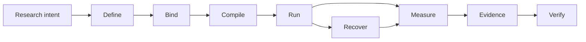

# Noetrium: Reproducible Research Infrastructure for AI Agents


<!-- readme-nav:start -->
<p align="center">
  <a href="README.md">English</a> ·
  <a href="README.zh-CN.md">简体中文</a> ·
  <a href="README.zh-TW.md">繁體中文</a> ·
  <a href="README.ja.md">日本語</a> ·
  <a href="README.ko.md">한국어</a> ·
  <strong>Español</strong> ·
  <a href="README.pt-BR.md">Português (Brasil)</a> ·
  <a href="README.fr.md">Français</a> ·
  <a href="README.de.md">Deutsch</a> ·
  <a href="README.ru.md">Русский</a>
</p>
<!-- readme-nav:end -->


<!-- readme-locale:es -->

<!-- readme-source-sha256:e13fb8ae0d3beaa4b86e2989d1704546b758ab6dfe98f27886545a2a359ce03e -->

<p align="center">
  <strong>Construye agentes. Ejecuta experimentos. Verifica resultados.</strong><br>
  Infraestructura rigurosa para investigación reproducible y basada en evidencia con agentes de IA.
</p>

<p align="center">
  <a href="#quick-start">Inicio rápido</a> ·
  <a href="examples/README.md">Ejemplo</a> ·
  <a href="docs/architecture/PLATFORM_ARCHITECTURE.md">Arquitectura</a> ·
  <a href="docs/INDEX.md">Docs</a> ·
  <a href="#verification">Verificación</a>
</p>

<p align="center">
  <a href="https://www.python.org/">=3.11" src="https://img.shields.io/badge/Python-%3E%3D3.11-3776AB?logo=python&logoColor=white"></a>
  <a href="pyproject.toml"></a>
  <a href="docs/architecture/PLATFORM_ARCHITECTURE.md"></a>
  <a href="LICENSE"></a>
</p>

<!-- readme-section:overview -->

## Descripción general

Noetrium es infraestructura de investigación para experimentos de larga duración con agentes de IA en los que ejecutar no basta: necesitas saber exactamente qué se ejecutó, con qué bindings, qué sobrevivió a un fallo y qué evidencia respalda el resultado.

Abarca agentes, modelos, entornos, experimentos, Artifacts, recuperación, observabilidad y gobernanza sin imponer semántica científica específica de un proyecto dentro de la plataforma.

**Usa Noetrium cuando necesites:**

- identidad experimental reproducible entre variantes, seeds, modelos y entornos;
- recuperación que conserve effect certainty en vez de adivinar tras un crash;
- evidence y lineage vinculados a identidades exactas de source/runtime;
- governance gates capaces de fallar de forma cerrada antes de publicar o liberar.

<!-- readme-section:why -->

## ¿Por qué Noetrium?

La mayoría de frameworks de agentes se centran en cómo actúan o colaboran los agentes. Noetrium se centra en que las ejecuciones de investigación sigan siendo atribuibles, recuperables, reproducibles y ligadas a evidence. Puede colocarse debajo o junto a frameworks de orquestación en lugar de sustituirlos.

### Dónde encaja Noetrium

| Project | Enfoque principal | Lo que añade Noetrium |
| --- | --- | --- |
| [LangGraph](https://github.com/langchain-ai/langgraph) | Orquestación stateful de agentes de larga duración | Research identity, evidence, recovery y governance alrededor de la ejecución |
| [AutoGen](https://github.com/microsoft/autogen) | Aplicaciones multi-agent | Experiment protocol, reproducibility y release evidence |
| [CrewAI](https://github.com/crewAIInc/crewAI) | Equipos de agentes y event flows | Scientific run identity, lineage y recuperación fail-closed |
| [OpenHands](https://github.com/All-Hands-AI/OpenHands) | Desarrollo de software impulsado por IA | Infraestructura general de investigación para agentes, modelos y entornos |
| **Noetrium** | Infraestructura reproducible para investigación con agentes de IA | La propia capa de research systems |

Noetrium es deliberadamente más amplio que una biblioteca de agent workflows: diseño experimental, identidad de modelo/entorno, runtime effects, checkpoints, evidence y release authority se tratan como un único problema de research systems.

<!-- readme-section:capabilities -->

## Capacidades principales

- Arquitectura recursiva — ownership explícito, API pública estrecha, typed ports y provider binding en composición.
- Infraestructura experimental — Study, Run, Branch, Task, Variant, Workload, Checkpoint, Resume e identidades de reproducibilidad.
- Runtime de agentes — límites de Participant, Capability, Action, Memory, Workflow y Execution sin lookup global oculto.
- Infraestructura de modelos — catalog, revision, qualification, serving identity, request envelope y prompt binding.
- Infraestructura de entorno — specification, lifecycle, readiness, observation, effects, snapshots y recovery.
- Runtime de procesos/servidores — supervision, sessions, toolchains, ejecución remota, control de lifecycle y journals.
- Datos/Artifacts durables — estado con checksum, recuperación WAL, lineage, retention y evidencia content-addressed.
- Fiabilidad — clasificación de fallos, effect certainty, reconciliation, replay, incidents y recuperación fail-closed.
- Observabilidad — logs estructurados, events, metrics, traces, diagnostics, projections y señales de salud.
- Gobernanza — gates de architecture, dependency, algorithm, concurrency, performance, forensic, release y no-degradation.

<!-- noetrium-interface-catalog:start -->
### Public interface catalog

Noetrium is a general-purpose research-systems platform for long-running agents, stateful environments, model providers, experiments, and other evidence-driven workloads. The complete downstream interface is generated from the canonical registry, so the list stays synchronized with the code.

- 172 registered system surfaces; 501 public API modules; 3697 public symbols.
- Full machine-readable catalog: noetrium/contracts/downstream_capability_catalog.json
- Full human-readable catalog: docs/architecture/DOWNSTREAM_CAPABILITY_CATALOG.md
- Import rule: use noetrium.contracts.systems.<system-slug>; do not import noetrium_platform implementation modules.

| Capability domain | Registered surfaces |
| --- | ---: |
| artifact | 7 |
| components | 1 |
| data | 8 |
| environment | 18 |
| execution | 7 |
| experimentation | 15 |
| governance | 13 |
| model | 16 |
| observability | 27 |
| operator | 8 |
| orchestration | 1 |
| participant | 8 |
| platform | 5 |
| portfolio | 5 |
| reliability | 7 |
| resource | 6 |
| runtime | 13 |
| scope | 7 |

Discover a capability in the catalog, import its generated facade, and inject its typed ports in downstream composition:

    from noetrium.contracts.systems.environment__minecraft import MinecraftBridgePort
    from noetrium.contracts.systems.participant__agent import AgentMemoryPort

After changing a registry descriptor or public API export, run python scripts/update_generated_docs.py; CI fails on generated-surface or README drift.
<!-- noetrium-interface-catalog:end -->

<!-- readme-section:architecture -->

## Arquitectura

El modelo mental más corto es una canalización de investigación que preserva evidence:



Cada transición debe conservar identity o producir evidence que explique por qué cambió. Composition, Execution y Observation permanecen como authority planes separados; el runtime recibe ports estrechos inyectados en vez de descubrir providers globalmente.

Cada durable state tiene un único owner y los efectos externos inciertos permanecen `UNKNOWN` hasta que reconciliation demuestre lo contrario.

`noetrium_platform/foundation/governance/system_registry/catalog.json`

<!-- readme-section:downstream -->

## Plataforma y proyectos downstream

Este repositorio es un paquete de plataforma reutilizable e independiente. Métodos de investigación, task suites, composición de entorno específica, matrices experimentales, selección de modelos, inventarios de despliegue e interpretación científica pertenecen downstream.

```text
noetrium
        │
        ├── install as a dependency, or
        └── fork as a platform baseline
                 │
                 ▼
       downstream research repository
       ├── project-specific method
       ├── experiment composition
       ├── task/environment bindings
       └── project evidence and results
```

El código downstream consume contratos públicos de la plataforma y aporta implementaciones propias; la plataforma no debe importar un proyecto downstream para decidir significado científico o política de despliegue.

<!-- readme-section:quick-start -->

<a id="quick-start"></a>

## Inicio rápido

El primer ejemplo es determinista y no requiere API key, model endpoint ni servicio externo.

### 1. Clonar e instalar

```bash
git clone https://github.com/Xalzeroph/noetrium.git
cd noetrium
python -m venv .venv
source .venv/bin/activate
# Windows PowerShell: .venv\Scripts\Activate.ps1
python -m pip install --upgrade pip
python -m pip install -e ".[test]"
```

### 2. Compilar tu primer experiment plan reproducible

```bash
python examples/quickstart_experiment_plan.py
```

El ejemplo congela un scientific protocol, enlaza identidades explícitas de provider, compila un immutable plan y verifica su digest.

```text
study=noetrium-quickstart
variants=control,treatment
repetitions=3
protocol_digest=<sha256>
plan_digest=<sha256>
plan_consistent=true
```

### 3. Verificar el checkout

```bash
noetrium-architecture-gate
python scripts/check_readme_i18n.py
```

El código downstream importa contracts estables y componentes reutilizables desde `noetrium`; no trates `noetrium_platform` como una API de extensión del proyecto. Para generar un esqueleto de proyecto author-first, usa `noetrium project create <project-id> <destination> --version <version>`, ejecuta después `noetrium project doctor --project <destination>` y `noetrium project test --project <destination>`, y añade entonces tus propios providers o methods.

<!-- readme-section:containers -->

## Flujo de contenedores

La imagen Linux reutilizable y la definición Compose se mantienen en `deploy/`.

```bash
cp deploy/.env.example deploy/.env
docker compose -f deploy/compose.yaml config
docker compose -f deploy/compose.yaml build
docker compose -f deploy/compose.yaml run --rm platform-runtime doctor
```

La capa de deployment separa software inmutable de runtime state mutable; paths del host y secrets quedan fuera del composition code versionado.

### Provider Minecraft incluido

Minecraft es un Provider de entorno reutilizable de primera parte. Task suites y composición científica permanecen downstream.

```bash
docker compose -f deploy/compose.yaml -f deploy/compose.minecraft.yaml build platform-runtime
docker compose -f deploy/compose.yaml -f deploy/compose.minecraft.yaml run --rm platform-runtime minecraft-doctor
```

[Minecraft infrastructure](docs/infrastructure/minecraft/README.md)

<!-- readme-section:repository-layout -->

## Estructura del repositorio

| Path | Responsibility |
| --- | --- |
| `noetrium/` | Facade pública, contracts, componentes reference single-agent y orchestration multi-agent |
| `noetrium_platform/` | Implementación interna del semantic plane, providers y governance tooling; no es una API de extensión downstream |
| `configs/` | Ejemplos de configuración versionados y plantillas sin secretos |
| `deploy/` | Imagen de contenedor, runtime Compose y bootstrap de despliegue |
| `docs/` | Documentación de architecture, infrastructure, governance, status e history |
| `scripts/` | Entradas ligeras de operator, audit, release y mantenimiento |
| `tests/` | Pruebas jerárquicas de regresión y contratos |
| `noetrium_platform/capabilities/environment/minecraft/` | Provider reutilizable de entorno Minecraft |
| `LICENSE` / `NOTICE` / `THIRD_PARTY_NOTICES.md` | Avisos Apache-2.0 y licencias de terceros |

Trata `noetrium/` como el package boundary soportado para downstream. `noetrium_platform/` es un namespace de implementación interna; el código específico del proyecto permanece downstream.

<!-- readme-section:testing -->

<a id="verification"></a>

## Pruebas y verificación

Ejecuta la regresión y los governance gates sobre la exact revision evaluada.

```bash
python -m pytest -q
python scripts/architecture_gate.py
python scripts/public_contract_audit.py
python scripts/no_degradation_audit.py
python scripts/check_readme_i18n.py
```

Un resultado verde histórico no demuestra el árbol actual. Vuelve a ejecutar los gates relevantes para la exact revision que quieras publicar o desplegar.

El repositorio usa una taxonomía jerárquica de pruebas para asignar cada test a un contract level explícito y permitir que release evidence demuestre qué se ejercitó realmente. See `tests/TEST_SYSTEM.json`.

<!-- readme-section:principles -->

## Principios de diseño

1. Un owner por durable state.
2. Composition antes de execution.
3. Runtime ports estrechos.
4. Los efectos externos llevan evidence.
5. Recovery es identity-aware.
6. Sin silent degradation.
7. Observation no es authority.
8. Los cambios de rendimiento conservan semántica.
9. La documentación cambia con la implementación.
10. Los proyectos permanecen downstream.

<!-- readme-section:extending -->

## Extender la plataforma

Añade capacidades en el límite del owner más pequeño. Si el contrato público ya existe, prefiere un nuevo provider; crea un nuevo contract solo cuando la capacidad sea realmente nueva.

```text
<system>/
├── api/          public contracts and identities
├── runtime/      lifecycle and execution semantics
├── providers/    replaceable adapters owned by the system
└── composition/  provider-to-port binding
```

Evita wrappers genéricos que oculten algoritmos no relacionados, provider discovery o efectos externos tras una sola interfaz.

<!-- readme-section:documentation -->

## Documentación

Empieza por el índice de documentación.

### Referencias clave

- [Documentation index](docs/INDEX.md)
- [Examples](examples/README.md)
- [Contributing](CONTRIBUTING.md)
- [Security policy](SECURITY.md)
- [Support](SUPPORT.md)
- [Citation metadata](CITATION.cff)
- [Code of Conduct](CODE_OF_CONDUCT.md)
- [Platform architecture](docs/architecture/PLATFORM_ARCHITECTURE.md)
- [Detailed system map](docs/architecture/VNEXT_DETAILED_SYSTEM_MAP.md)
- [Architecture migration contract](docs/architecture/FINAL_ARCHITECTURE_MIGRATION_CONTRACT.md)
- [Infrastructure documentation](docs/infrastructure/README.md)
- [Governance documentation](docs/governance/README.md)
- [Current status](docs/status/README.md)
- [Engineering history](docs/history/README.md)

Los documentos de architecture definen ownership y contracts reutilizables; los documentos de status describen el árbol actual; history conserva evidencia del estado existente cuando fue escrito.

<!-- readme-section:security -->

## Seguridad y configuración

- Nunca hagas commit de contraseñas, claves privadas, tokens, runtime secrets o credenciales locales.
- Mantén paths específicos del host y secrets en perfiles locales ignorados o stores ligados al entorno.
- Prefiere autenticación no atendida basada en key/agent para automatización remota.
- Los comandos con efectos externos deben ser typed, bounded, journaled y atribuibles a una operation identity.
- Trata logs y evidence como datos operativos potencialmente sensibles.

<!-- readme-section:contributing -->

## Contribuir

Los cambios deben poder revisarse por ownership boundary e incluir tests y documentación suficientes para demostrarlos.

### Antes de abrir un Pull Request

```bash
python -m pytest -q
python scripts/architecture_gate.py
python scripts/check_readme_i18n.py
```

- preservar system ownership y public-contract boundaries
- añadir o actualizar cobertura de regresión enfocada
- actualizar la documentación del owner en el mismo change set
- evitar refactors no relacionados en el mismo commit
- preservar fail-closed para efectos externos inciertos
- documentar explícitamente cambios intencionales de semántica o compatibilidad

[Documentation Change Policy](docs/governance/DOCUMENTATION_CHANGE_POLICY.md)

<!-- readme-section:license -->

## Licencia

Noetrium se distribuye bajo Apache License 2.0. El texto legal autoritativo es el archivo LICENSE en la raíz.

Los componentes de terceros conservan sus propias licencias; consulta THIRD_PARTY_NOTICES.md. Pesos de modelos, datasets o assets de benchmark distribuidos de forma independiente pueden declarar términos separados.

[`LICENSE`](LICENSE) · [`NOTICE`](NOTICE) · [`THIRD_PARTY_NOTICES.md`](THIRD_PARTY_NOTICES.md)

<!-- readme-section:status -->

## Estado de desarrollo

La plataforma continúa en desarrollo activo de arquitectura y runtime.

Para producción, publicación o afirmaciones científicas, vuelve a ejecutar los gates pertinentes y revisa release evidence vinculada a la exact source revision, en lugar de confiar en un resultado verde antiguo.

Los cambios históricos se mantienen intencionadamente fuera de este README; usa `docs/history/` para los registros de ingeniería inmutables.

La fuente vigente del estado de desarrollo es `docs/status/CURRENT_DEVELOPMENT_BASELINE.md`; las afirmaciones de publicación o investigación deben vincularse a evidencia de la revisión exacta evaluada.

`docs/status/` · `docs/history/`
