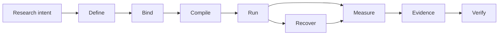

# Noetrium: Reproducible Research Infrastructure for AI Agents


<!-- readme-nav:start -->
<p align="center">
  <a href="README.md">English</a> ·
  <a href="README.zh-CN.md">简体中文</a> ·
  <a href="README.zh-TW.md">繁體中文</a> ·
  <a href="README.ja.md">日本語</a> ·
  <a href="README.ko.md">한국어</a> ·
  <a href="README.es.md">Español</a> ·
  <a href="README.pt-BR.md">Português (Brasil)</a> ·
  <strong>Français</strong> ·
  <a href="README.de.md">Deutsch</a> ·
  <a href="README.ru.md">Русский</a>
</p>
<!-- readme-nav:end -->


<!-- readme-locale:fr -->

<!-- readme-source-sha256:145c0cfcb1d6b183dd096579dd0f23dbfdac92c360dbeec1c01a525d9aa672bc -->

<p align="center">
  <strong>Construisez des agents. Exécutez des expériences. Vérifiez les résultats.</strong><br>
  Une infrastructure rigoureuse pour la recherche reproductible et fondée sur des preuves avec des agents IA.
</p>

<p align="center">
  <a href="#quick-start">Démarrage rapide</a> ·
  <a href="examples/README.md">Exemple</a> ·
  <a href="docs/architecture/PLATFORM_ARCHITECTURE.md">Architecture</a> ·
  <a href="docs/INDEX.md">Docs</a> ·
  <a href="#verification">Vérification</a>
</p>

<p align="center">
  <a href="https://www.python.org/">=3.11" src="https://img.shields.io/badge/Python-%3E%3D3.11-3776AB?logo=python&logoColor=white"></a>
  <a href="pyproject.toml"></a>
  <a href="docs/architecture/PLATFORM_ARCHITECTURE.md"></a>
  <a href="LICENSE"></a>
</p>

<!-- readme-section:overview -->

## Vue d’ensemble

Noetrium est une infrastructure de recherche pour les expériences de longue durée avec des agents IA où l’exécution seule ne suffit pas : il faut savoir exactement ce qui a tourné, avec quels bindings, ce qui a survécu aux pannes et quelles preuves soutiennent le résultat.

Elle couvre agents, modèles, environnements, expériences, Artifacts, récupération, observabilité et gouvernance sans imposer la sémantique scientifique propre à un projet dans la plateforme.

**Utilisez Noetrium lorsque vous avez besoin de :**

- une identité expérimentale reproductible entre variants, seeds, modèles et environnements ;
- une récupération qui conserve l’effect certainty au lieu de deviner après un crash ;
- des evidence et lineage reliés aux identités exactes source/runtime ;
- des governance gates capables de fail-closed avant publication ou release.

<!-- readme-section:why -->

## Pourquoi Noetrium ?

La plupart des frameworks d’agents se concentrent sur la façon dont les agents agissent ou collaborent. Noetrium se concentre sur des exécutions de recherche qui restent attribuables, récupérables, reproductibles et liées aux evidence. Il peut se placer sous ou à côté des frameworks d’orchestration plutôt que les remplacer.

### Où se situe Noetrium

| Project | Objectif principal | Ce que Noetrium ajoute |
| --- | --- | --- |
| [LangGraph](https://github.com/langchain-ai/langgraph) | Orchestration stateful d’agents longue durée | Research identity, evidence, recovery et governance autour de l’exécution |
| [AutoGen](https://github.com/microsoft/autogen) | Applications multi-agent | Experiment protocol, reproducibility et release evidence |
| [CrewAI](https://github.com/crewAIInc/crewAI) | Équipes d’agents et event flows | Scientific run identity, lineage et recovery fail-closed |
| [OpenHands](https://github.com/All-Hands-AI/OpenHands) | Développement logiciel piloté par IA | Infrastructure de recherche générale pour agents, modèles et environnements |
| **Noetrium** | Infrastructure reproductible pour la recherche sur les agents IA | La couche research systems elle-même |

Noetrium est volontairement plus large qu’une bibliothèque de agent workflows : design expérimental, identité des modèles/environnements, runtime effects, checkpoints, evidence et release authority sont traités comme un seul problème de research systems.

<!-- readme-section:capabilities -->

## Capacités principales

- Architecture récursive — ownership explicite, API publiques étroites, typed ports et provider binding à la composition.
- Infrastructure d'expérimentation — Study, Run, Branch, Task, Variant, Workload, Checkpoint, Resume et identités de reproductibilité.
- Runtime Agent — frontières Participant, Capability, Action, Memory, Workflow et Execution sans lookup global caché.
- Infrastructure modèle — catalog, revision, qualification, serving identity, request envelope et prompt binding.
- Infrastructure environnement — specification, lifecycle, readiness, observation, effects, snapshots et recovery.
- Runtime processus/serveur — supervision, sessions, toolchains, exécution distante, contrôle du lifecycle et journals.
- Données/Artifacts durables — état checksummé, récupération WAL, lineage, retention et preuves content-addressed.
- Fiabilité — classification des échecs, effect certainty, reconciliation, replay, incidents et récupération fail-closed.
- Observabilité — logs structurés, events, metrics, traces, diagnostics, projections et signaux de santé.
- Gouvernance — gates architecture, dependency, algorithm, concurrency, performance, forensic, release et no-degradation.

<!-- noetrium-interface-catalog:start -->
### Public interface catalog

Noetrium exposes one high-level Research OS API. Registered lower systems remain internal composition authorities and are listed here only as architecture metadata.

- 31 registered system surfaces; 1 public API modules; 142 public symbols.
- Full machine-readable catalog: noetrium/contracts/downstream_capability_catalog.json
- Full human-readable catalog: docs/architecture/DOWNSTREAM_CAPABILITY_CATALOG.md
- Import rule: downstream code uses only noetrium.api; lower system facades are internal registry material.

| Capability domain | Registered surfaces |
| --- | ---: |
| artifact | 1 |
| data | 3 |
| environment | 6 |
| execution | 2 |
| experimentation | 1 |
| governance | 3 |
| model | 1 |
| observability | 2 |
| operator | 1 |
| participant | 1 |
| platform | 1 |
| portfolio | 1 |
| reliability | 3 |
| research_os | 1 |
| resource | 2 |
| runtime | 1 |
| scope | 1 |

Author and control research through the same top-level API:

    from noetrium import api
    program = api.ResearchProgramBuilder("paper")
    research_os = api.ResearchOS(port)

After changing a registry descriptor or public API export, run python scripts/update_generated_docs.py; CI fails on generated-surface or README drift.
<!-- noetrium-interface-catalog:end -->

<!-- readme-section:architecture -->

## Architecture

Le modèle mental le plus simple est un pipeline de recherche qui préserve les evidence :


```mermaid
flowchart LR
    A["Research intent"] --> B["Define"]
    B --> C["Bind"]
    C --> D["Compile"]
    D --> E["Run"]
    E --> F["Recover"]
    E --> G["Measure"]
    F --> G
    G --> H["Evidence"]
    H --> I["Verify"]
```

Chaque transition doit préserver l’identity ou produire des evidence expliquant pourquoi elle a changé. Composition, Execution et Observation restent des authority planes séparés ; le runtime reçoit des ports étroits injectés au lieu de découvrir globalement les providers.

Chaque durable state a un owner unique et les effets externes incertains restent `UNKNOWN` jusqu’à ce que reconciliation prouve le contraire.

`noetrium_platform/foundation/governance/system_registry/catalog.json`

<!-- readme-section:downstream -->

## Plateforme et projets downstream

Ce dépôt est un package de plateforme réutilisable et indépendant. Méthodes de recherche, task suites, composition d'environnement spécifique, matrices expérimentales, choix de modèles, inventaires de déploiement et interprétation scientifique appartiennent aux projets downstream.

```text
noetrium
        │
        ├── install as a dependency, or
        └── fork as a platform baseline
                 │
                 ▼
       downstream research repository
       ├── project-specific method
       ├── experiment composition
       ├── task/environment bindings
       └── project evidence and results
```

Le code downstream consomme les contracts publics de la plateforme et fournit ses propres implémentations ; la plateforme ne doit pas importer un projet downstream pour décider du sens scientifique ou de la politique de déploiement.

<!-- readme-section:quick-start -->

<a id="quick-start"></a>

## Démarrage rapide

Le premier exemple est déterministe et ne nécessite ni API key, ni model endpoint, ni service externe.

### 1. Cloner et installer

```bash
git clone https://github.com/Xalzeroph/noetrium.git
cd noetrium
python -m venv .venv
source .venv/bin/activate
# Windows PowerShell: .venv\Scripts\Activate.ps1
python -m pip install --upgrade pip
python -m pip install -e ".[test]"
```

### 2. Compiler votre premier experiment plan reproductible

```bash
python examples/quickstart_experiment_plan.py
```

L’exemple fige un scientific protocol, lie des identités explicites de provider, compile un immutable plan et vérifie son digest.

```text
study=noetrium-quickstart
variants=control,treatment
repetitions=3
protocol_digest=<sha256>
plan_digest=<sha256>
plan_consistent=true
```

### 3. Vérifier le checkout

```bash
noetrium-architecture-gate
python scripts/check_readme_i18n.py
```

Le code downstream importe les contracts stables et les components réutilisables depuis `noetrium` ; ne traitez pas `noetrium_platform` comme une API d’extension de projet. Pour générer un squelette de projet author-first, utilisez `noetrium project create <project-id>`, puis exécutez `noetrium project doctor --project <destination>` et `noetrium project test --project <destination>` avant d’ajouter vos propres providers ou methods.

<!-- readme-section:containers -->

## Flux de conteneurs et d’environnements

Noetrium traite les environnements d’exécution comme une flotte révisionnée, et non comme un conteneur mutable par article. Le contrat hôte se limite à Docker + Compose ; Python n’est pas requis sur l’hôte.

Le point d’entrée serveur canonique est `./deploy/noetrium`. `./deploy/noetrium run` enchaîne avec les droits d’un utilisateur ordinaire la qualification Docker/Compose, la construction ou réutilisation exacte de l’environnement, la matérialisation des authorities de la flotte, le preflight et l’exécution de Research OS en mode fail-close. Il n’invoque jamais `sudo` ; le compte doit seulement accéder au Docker daemon actif (groupe Docker ou Docker rootless), et les hôtes GPU doivent disposer du NVIDIA container runtime. Les deux chemins de fleet authority factory reçoivent le même typed execution context, empêchant les providers downstream de créer des authorities parallèles pour Docker, endpoint, compute/GPU, environment, model, workspace ou execution pool.

La Resource authority contrôle l’allocation dynamique des ports hôte : elle demande des candidates au kernel, vérifie la disponibilité réelle du bind, évite les endpoints occupés ou leased, applique un fencing atomique, renouvelle les leases actives et rend le port physique réutilisable après release. Les endpoints automatiques sont platform-managed par défaut. Papers, model replicas, branches Minecraft et environment providers déclarent seulement leur besoin d’un endpoint ; ils ne choisissent pas le port concret.

Chaque state root appartient à un seul `ManagedResearchRuntime`, protégé par `managed-research-runtime.lock`. Lors d’un arrêt normal, les workloads Experiment et Model-I/O sont d’abord scellés puis physiquement joints ; les processus de modèles sont ensuite arrêtés sans modifier le durable desired state, puis les conteneurs Docker gérés, générations d’EnvironmentInstance et allocations endpoint/compute/GPU sont nettoyés, et le verrou est libéré en dernier. Si la convergence du workload ne peut pas être prouvée, le cleanup échoue de manière sûre et ne libère pas les ressources sous un travail potentiellement vivant. HUP/INT/TERM supprime aussi le bootstrap container jetable. SIGKILL, une panne du daemon, une perte SSH ou une coupure hôte ne peuvent exécuter le cleanup au moment exact de la panne ; le kernel libère le verrou, les heartbeats cessent, les leases expirent, puis le prochain démarrage réconcilie synchroniquement l’état physique et durable avant d’admettre du travail. Les bootstrap containers disposent aussi d’un orphan reaper fondé sur PID + boot-id + process-start generation. Workspaces, checkpoints, artifacts, evidence et Machine Journals sont des supports durables de recovery, nettoyés seulement par retention/GC explicite après recovery et evidence closure.

```bash
./deploy/build-environments.sh validate
./deploy/build-environments.sh list
./deploy/build-environments.sh build
```

The environment registry is `deploy/environments/catalog.json`. It is dynamic: the builder does not contain a fixed list of environment names. Every category has an active default profile revision, while draining and retired revisions remain available for already-pinned execution or explicit historical recovery.

The sharing rule is strict:

> **Share immutable content; isolate every mutable execution state.**

Noetrium therefore reuses the qualified base image, environment image layers and content-addressed assets across papers, while each execution gets a private workspace, temporary/runtime state, secrets, process/network namespace, ports, browser/world/application state and other writable overlays. A warm environment may be reused only after its overlay is destroyed or a provider emits an explicit cleanliness proof; uncertain instances are destroyed rather than recycled.

```text
host substrate
  -> evidence-bound Noetrium base
  -> reusable environment capability profile
  -> immutable content-addressed workload assets
  -> private per-execution writable overlay
  -> immutable artifacts / evidence / Machine Journal
```

Environment identity is pinned at runtime as `profile_id + profile_revision`, separate from the stable category such as `web`, `minecraft`, `gui`, `embodied`, `software` or `text_world`. This allows a new profile revision to become active without changing or contaminating executions that started on an older revision.

Retirement is logical deletion: new work stops binding the revision, but historical identity is retained. Physical image/cache garbage collection is only safe after there are no active or resumable references and no retained evidence depends on the revision.

Profile-specific readiness checks are image-local hooks rather than a central switch statement. A new environment category can therefore be added with a registry row, image recipe, optional Compose overlay and doctor hook without editing central deployment code.

[Environment profile registry](deploy/environments/README.md)

### Bundled Minecraft provider

Minecraft is a first-party reusable environment capability profile. Java, Node and Mineflayer prerequisites are shared; benchmark worlds, task suites, paper methods and writable world state stay downstream or per execution.

```bash
./deploy/build-environments.sh build --profiles minecraft
```

[Minecraft infrastructure](docs/infrastructure/minecraft/README.md)

<!-- readme-section:repository-layout -->

## Structure du dépôt

| Path | Responsibility |
| --- | --- |
| `noetrium/` | Facade publique, contracts, components reference single-agent et orchestration multi-agent |
| `noetrium_platform/` | Implémentation interne du semantic plane, providers et governance tooling ; pas une API d’extension downstream |
| `configs/` | Exemples de configuration versionnés et modèles sans secrets |
| `deploy/` | Image conteneur, runtime Compose et bootstrap de déploiement |
| `docs/` | Documentation architecture, infrastructure, governance, status et history |
| `scripts/` | Entrées fines operator, audit, release et maintenance |
| `tests/` | Tests hiérarchiques de régression et de contrats |
| `noetrium_platform/capabilities/environment/minecraft/` | Provider d'environnement Minecraft réutilisable |
| `LICENSE` / `NOTICE` / `THIRD_PARTY_NOTICES.md` | Avis Apache-2.0 et licences tierces |

Traitez `noetrium/` comme le package boundary pris en charge pour downstream. `noetrium_platform/` est un namespace d’implémentation interne ; le code spécifique au projet reste downstream.

<!-- readme-section:testing -->

<a id="verification"></a>

## Tests et vérification

Exécutez la régression et les governance gates sur l'exact revision évaluée.

```bash
python -m pytest -q
python scripts/architecture_gate.py
python scripts/public_contract_audit.py
python scripts/no_degradation_audit.py
python scripts/check_readme_i18n.py
```

Un résultat vert historique ne prouve pas l'arbre actuel. Relancez les gates pertinents pour l'exact revision que vous souhaitez publier ou déployer.

Le dépôt utilise une taxonomie hiérarchique des tests afin que chaque test appartienne à un contract level explicite et que release evidence puisse prouver ce qui a réellement été exécuté. See `tests/TEST_SYSTEM.json`.

<!-- readme-section:principles -->

## Principes de conception

1. Un owner par durable state.
2. Composition avant execution.
3. Runtime ports étroits.
4. Les effets externes portent des evidence.
5. Recovery est identity-aware.
6. Aucune silent degradation.
7. Observation n'est pas authority.
8. Les optimisations préservent la sémantique.
9. La documentation évolue avec l'implémentation.
10. Les projets restent downstream.

<!-- readme-section:extending -->

## Étendre la plateforme

Ajoutez une capacité à la plus petite frontière de ownership. Si le contract public existe déjà, préférez un nouveau provider ; n'ajoutez un contract que lorsque la capacité elle-même est nouvelle.

```text
<system>/
├── api/          public contracts and identities
├── runtime/      lifecycle and execution semantics
├── providers/    replaceable adapters owned by the system
└── composition/  provider-to-port binding
```

Évitez les wrappers génériques qui cachent des algorithmes sans rapport, provider discovery ou des effets externes derrière une seule interface.

<!-- readme-section:documentation -->

## Documentation

Commencez par l'index de documentation.

### Références principales

- [Documentation index](docs/INDEX.md)
- [Examples](examples/README.md)
- [Contributing](CONTRIBUTING.md)
- [Security policy](SECURITY.md)
- [Support](SUPPORT.md)
- [Citation metadata](CITATION.cff)
- [Code of Conduct](CODE_OF_CONDUCT.md)
- [Platform architecture](docs/architecture/PLATFORM_ARCHITECTURE.md)
- [Detailed system map](docs/architecture/VNEXT_DETAILED_SYSTEM_MAP.md)
- [Architecture migration contract](docs/architecture/FINAL_ARCHITECTURE_MIGRATION_CONTRACT.md)
- [Infrastructure documentation](docs/infrastructure/README.md)
- [Governance documentation](docs/governance/README.md)
- [Current status](docs/status/README.md)
- [Engineering history](docs/history/README.md)

Les documents d'architecture définissent ownership et contracts réutilisables ; les documents de status décrivent l'arbre actuel ; history conserve les preuves de l'état existant lors de leur rédaction.

<!-- readme-section:security -->

## Sécurité et configuration

- Ne committez jamais mots de passe, clés privées, tokens, runtime secrets ou credentials locales.
- Gardez paths spécifiques aux hôtes et secrets dans des profils locaux ignorés ou stores liés à l'environnement.
- Préférez une authentification non interactive par key/agent pour l'automatisation distante.
- Les commandes à effets externes doivent être typed, bounded, journaled et attribuables à une operation identity.
- Considérez logs et evidence comme des données opérationnelles potentiellement sensibles.

<!-- readme-section:contributing -->

## Contribuer

Les changements doivent être révisables par ownership boundary et inclure les tests et la documentation nécessaires pour les prouver.

### Avant d'ouvrir une Pull Request

```bash
python -m pytest -q
python scripts/architecture_gate.py
python scripts/check_readme_i18n.py
```

- préserver system ownership et public-contract boundaries
- ajouter ou mettre à jour une couverture de régression ciblée
- mettre à jour la documentation de l'owner dans le même change set
- éviter les refactors sans rapport dans le même commit
- préserver fail-closed pour les effets externes incertains
- documenter explicitement tout changement volontaire de sémantique ou compatibilité

[Documentation Change Policy](docs/governance/DOCUMENTATION_CHANGE_POLICY.md)

<!-- readme-section:license -->

## Licence

Noetrium est sous Apache License 2.0. Le texte juridique faisant autorité est le fichier LICENSE à la racine.

Les composants tiers restent régis par leurs propres licences ; voir THIRD_PARTY_NOTICES.md. Les poids de modèles, datasets ou assets de benchmark distribués séparément peuvent déclarer des conditions distinctes.

[`LICENSE`](LICENSE) · [`NOTICE`](NOTICE) · [`THIRD_PARTY_NOTICES.md`](THIRD_PARTY_NOTICES.md)

<!-- readme-section:status -->

## État du développement

La plateforme reste en développement actif d'architecture et de runtime.

Pour la production, la publication ou les affirmations scientifiques, relancez les gates pertinents et examinez release evidence liée à l'exact source revision plutôt que de vous fier à un ancien résultat vert.

Les changements historiques sont volontairement exclus de ce README ; utilisez `docs/history/` pour les archives d’ingénierie immuables.

La source de vérité de l’état de développement est `docs/status/CURRENT_DEVELOPMENT_BASELINE.md` ; toute affirmation de publication ou de recherche doit être liée aux preuves de la révision exacte évaluée.

`docs/status/` · `docs/history/`
