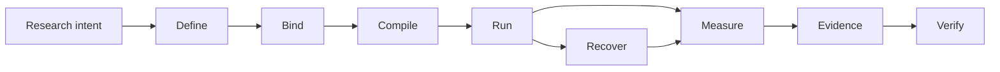

# Noetrium: Reproducible Research Infrastructure for AI Agents


<!-- readme-nav:start -->
<p align="center">
  <a href="README.md">English</a> ·
  <a href="README.zh-CN.md">简体中文</a> ·
  <a href="README.zh-TW.md">繁體中文</a> ·
  <strong>日本語</strong> ·
  <a href="README.ko.md">한국어</a> ·
  <a href="README.es.md">Español</a> ·
  <a href="README.pt-BR.md">Português (Brasil)</a> ·
  <a href="README.fr.md">Français</a> ·
  <a href="README.de.md">Deutsch</a> ·
  <a href="README.ru.md">Русский</a>
</p>
<!-- readme-nav:end -->


<!-- readme-locale:ja -->

<!-- readme-source-sha256:1200f1f42e9e52fc5829e36a43cd022c9ec93e45e2e531f4cc56c3180c42fb8b -->

<p align="center">
  <strong>Agent を構築する。実験を走らせる。結果を検証する。</strong><br>
  再現可能で証拠駆動の AI エージェント研究のための厳密なシステム基盤。
</p>

<p align="center">
  <a href="#quick-start">クイックスタート</a> ·
  <a href="examples/README.md">例</a> ·
  <a href="docs/architecture/PLATFORM_ARCHITECTURE.md">アーキテクチャ</a> ·
  <a href="docs/INDEX.md">ドキュメント</a> ·
  <a href="#verification">検証</a>
</p>

<p align="center">
  <a href="https://www.python.org/">=3.11" src="https://img.shields.io/badge/Python-%3E%3D3.11-3776AB?logo=python&logoColor=white"></a>
  <a href="pyproject.toml"></a>
  <a href="docs/architecture/PLATFORM_ARCHITECTURE.md"></a>
  <a href="LICENSE"></a>
</p>

<!-- readme-section:overview -->

## 概要

Noetrium は、長時間稼働する AI エージェント実験のための研究基盤です。この種の実験では、単に実行できるだけでは不十分です。何が実行され、どの binding が使われ、障害後に何が残り、どの evidence が結果を支えるのかを追跡できる必要があります。

Agent、model、environment、experiment、Artifact、recovery、observability、governance を一つの基盤で扱いながら、プロジェクト固有の科学的意味をプラットフォームへ押し込みません。

**次の要件があるとき Noetrium が有効です：**

- variant、seed、model、environment をまたぐ再現可能な experiment identity；
- crash 後に推測せず effect certainty を保持する recovery；
- exact source/runtime identity まで追跡できる evidence と lineage；
- publication/release 前に fail-closed できる governance gate。

<!-- readme-section:why -->

## なぜ Noetrium なのか

多くの Agent フレームワークは「Agent がどう行動・協調するか」に重点を置きます。Noetrium は研究実行が attribution、recovery、reproducibility、evidence binding を維持できるかに重点を置きます。Orchestration framework の代替ではなく、その下層または横に配置できます。

### エコシステムでの位置付け

| Project | 主な焦点 | Noetrium が追加するもの |
| --- | --- | --- |
| [LangGraph](https://github.com/langchain-ai/langgraph) | 長時間・stateful な Agent orchestration | 実行を囲む research identity、evidence、recovery、governance |
| [AutoGen](https://github.com/microsoft/autogen) | Multi-agent application | Experiment protocol、reproducibility、release evidence |
| [CrewAI](https://github.com/crewAIInc/crewAI) | Agent team と event flow | Scientific run identity、lineage、fail-closed recovery |
| [OpenHands](https://github.com/All-Hands-AI/OpenHands) | AI 駆動ソフトウェア開発 | Agent・model・environment をまたぐ汎用研究基盤 |
| **Noetrium** | 再現可能な AI Agent 研究基盤 | Research systems layer そのもの |

Noetrium は意図的に Agent workflow library より広く、experiment design、model/environment identity、runtime effect、checkpoint、evidence、release authority を一つの research-systems 問題として扱います。

<!-- readme-section:capabilities -->

## 主な機能

- 再帰的アーキテクチャ — 明示的 ownership、狭い公開 API、typed port、composition-time provider binding。
- 実験基盤 — Study、Run、Branch、Task、Variant、Workload、Checkpoint、Resume、再現性 identity。
- Agent runtime — Participant、Capability、Action、Memory、Workflow、Execution の境界。隠れたグローバル lookup は使用しません。
- モデル基盤 — catalog、revision、qualification、serving identity、request envelope、prompt binding。
- 環境基盤 — specification、lifecycle、readiness、observation、effect、snapshot、recovery。
- プロセス/サーバー runtime — supervision、session、toolchain、remote execution、lifecycle control、journal。
- 永続データ/Artifact — checksum 状態、WAL recovery、lineage、retention、content-addressed evidence。
- 信頼性 — failure classification、effect certainty、reconciliation、replay、incident、fail-closed recovery。
- 可観測性 — 構造化 log、event、metric、trace、diagnostic、projection、health signal。
- ガバナンス — architecture、dependency、algorithm、concurrency、performance、forensic、release、no-degradation gate。

<!-- noetrium-interface-catalog:start -->
### Public interface catalog

Noetrium is a general-purpose research-systems platform for long-running agents, stateful environments, model providers, experiments, and other evidence-driven workloads. The complete downstream interface is generated from the canonical registry, so the list stays synchronized with the code.

- 172 registered system surfaces; 499 public API modules; 3602 public symbols.
- Full machine-readable catalog: noetrium/contracts/downstream_capability_catalog.json
- Full human-readable catalog: docs/architecture/DOWNSTREAM_CAPABILITY_CATALOG.md
- Import rule: use noetrium.contracts.systems.<system-slug>; do not import noetrium_platform implementation modules.

| Capability domain | Registered surfaces |
| --- | ---: |
| artifact | 7 |
| components | 1 |
| data | 8 |
| environment | 18 |
| execution | 7 |
| experimentation | 15 |
| governance | 13 |
| model | 16 |
| observability | 27 |
| operator | 8 |
| orchestration | 1 |
| participant | 8 |
| platform | 5 |
| portfolio | 5 |
| reliability | 7 |
| resource | 6 |
| runtime | 13 |
| scope | 7 |

Discover a capability in the catalog, import its generated facade, and inject its typed ports in downstream composition:

    from noetrium.contracts.systems.environment__minecraft import MinecraftBridgePort
    from noetrium.contracts.systems.participant__agent import AgentMemoryPort

After changing a registry descriptor or public API export, run python scripts/update_generated_docs.py; CI fails on generated-surface or README drift.
<!-- noetrium-interface-catalog:end -->

<!-- readme-section:architecture -->

## アーキテクチャ

最短のメンタルモデルは evidence を保持する研究パイプラインです：



各遷移は identity を保持するか、なぜ identity が変わったのかを説明する evidence を生成します。Composition、Execution、Observation は独立した authority plane のままで、runtime は provider をグローバル探索せず、注入された狭い port のみを利用します。

durable state には一つの owner があり、不確実な外部 effect は reconciliation で証明されるまで `UNKNOWN` のままです。

`noetrium_platform/foundation/governance/system_registry/catalog.json`

<!-- readme-section:downstream -->

## プラットフォームと下流プロジェクト

このリポジトリは独立して再利用できるプラットフォームパッケージです。研究手法、タスク群、プロジェクト固有の環境構成、実験行列、モデル選択、配備 inventory、科学的解釈は下流に属します。

```text
noetrium
        │
        ├── install as a dependency, or
        └── fork as a platform baseline
                 │
                 ▼
       downstream research repository
       ├── project-specific method
       ├── experiment composition
       ├── task/environment bindings
       └── project evidence and results
```

下流コードは公開 platform contract を利用してプロジェクト所有の実装を提供します。プラットフォームが下流プロジェクトを import して科学的意味や配備ポリシーを決めることはありません。

<!-- readme-section:quick-start -->

<a id="quick-start"></a>

## クイックスタート

最初の例は deterministic で、API key、model endpoint、外部サービスは不要です。

### 1. Clone とインストール

```bash
git clone https://github.com/Xalzeroph/noetrium.git
cd noetrium
python -m venv .venv
source .venv/bin/activate
# Windows PowerShell: .venv\Scripts\Activate.ps1
python -m pip install --upgrade pip
python -m pip install -e ".[test]"
```

### 2. 最初の再現可能な experiment plan をコンパイル

```bash
python examples/quickstart_experiment_plan.py
```

例では scientific protocol を固定し、明示的な provider identity を binding し、immutable plan を compile して digest を検証します。

```text
study=noetrium-quickstart
variants=control,treatment
repetitions=3
protocol_digest=<sha256>
plan_digest=<sha256>
plan_consistent=true
```

### 3. Checkout を検証

```bash
noetrium-architecture-gate
python scripts/check_readme_i18n.py
```

下流コードは `noetrium` から安定した contract と再利用可能な component を import します。`noetrium_platform` はプロジェクト拡張 API として扱わないでください。author-first のプロジェクト骨格を生成するには `noetrium project create <project-id> <destination> --version <version>` を使い、その後 `noetrium project doctor --project <destination>` と `noetrium project test --project <destination>` を実行してから、プロジェクト固有の provider や method を追加します。

<!-- readme-section:containers -->

## コンテナワークフロー

再利用可能な Linux image と Compose 定義は `deploy/` で管理します。

```bash
cp deploy/.env.example deploy/.env
docker compose -f deploy/compose.yaml config
docker compose -f deploy/compose.yaml build
docker compose -f deploy/compose.yaml run --rm platform-runtime doctor
```

Deployment 層は immutable software と mutable runtime state を分離し、host 固有 path と secret を commit 済み composition code に入れません。

### 同梱 Minecraft Provider

Minecraft は first-party の再利用可能な environment Provider です。Task suite と科学的 composition は downstream に残します。

```bash
docker compose -f deploy/compose.yaml -f deploy/compose.minecraft.yaml build platform-runtime
docker compose -f deploy/compose.yaml -f deploy/compose.minecraft.yaml run --rm platform-runtime minecraft-doctor
```

[Minecraft infrastructure](docs/infrastructure/minecraft/README.md)

<!-- readme-section:repository-layout -->

## リポジトリ構成

| Path | Responsibility |
| --- | --- |
| `noetrium/` | 公開 facade、contract、reference single-agent component、multi-agent orchestration |
| `noetrium_platform/` | 内部 semantic-plane implementation、provider、governance tooling。下流の extension API ではない |
| `configs/` | バージョン管理された設定例と非機密テンプレート |
| `deploy/` | コンテナイメージ、Compose runtime、deployment bootstrap |
| `docs/` | Architecture、infrastructure、governance、status、history 文書 |
| `scripts/` | 薄い operator、audit、release、maintenance entry point |
| `tests/` | 階層型 regression / contract tests |
| `noetrium_platform/capabilities/environment/minecraft/` | 再利用可能な Minecraft environment provider |
| `LICENSE` / `NOTICE` / `THIRD_PARTY_NOTICES.md` | Apache-2.0 と第三者ライセンス通知 |

`noetrium/` を下流向けのサポート対象 package boundary として扱ってください。`noetrium_platform/` は内部実装 namespace であり、プロジェクト固有コードは downstream に置きます。

<!-- readme-section:testing -->

<a id="verification"></a>

## テストと検証

評価対象の exact revision に対して regression suite と governance gate を実行します。

```bash
python -m pytest -q
python scripts/architecture_gate.py
python scripts/public_contract_audit.py
python scripts/no_degradation_audit.py
python scripts/check_readme_i18n.py
```

過去の green result は現在の tree を証明しません。公開・配備する exact revision に対して必要な gate を再実行してください。

リポジトリは階層型 test taxonomy を使い、各テストを明示的な contract level に割り当て、release evidence が実際の検証範囲を証明できるようにします。 See `tests/TEST_SYSTEM.json`.

<!-- readme-section:principles -->

## 設計原則

1. durable state ごとに owner は一つ。
2. Execution より先に composition。
3. Runtime port は狭く保つ。
4. 外部 effect は evidence を持つ。
5. Recovery は identity-aware。
6. silent degradation を許さない。
7. Observation は authority ではない。
8. 性能最適化で意味を変えない。
9. 実装変更と文書更新を同時に行う。
10. プロジェクト固有意味は downstream に置く。

<!-- readme-section:extending -->

## プラットフォームの拡張

最小の owner boundary に機能を追加します。公開 contract が既にある場合は新しい provider を優先し、能力そのものが新しい場合のみ contract を追加します。

```text
<system>/
├── api/          public contracts and identities
├── runtime/      lifecycle and execution semantics
├── providers/    replaceable adapters owned by the system
└── composition/  provider-to-port binding
```

無関係な algorithm、provider discovery、外部 effect を一つの汎用 wrapper に隠さないでください。

<!-- readme-section:documentation -->

## ドキュメント

documentation index から開始してください。

### 主要リファレンス

- [Documentation index](docs/INDEX.md)
- [Examples](examples/README.md)
- [Contributing](CONTRIBUTING.md)
- [Security policy](SECURITY.md)
- [Support](SUPPORT.md)
- [Citation metadata](CITATION.cff)
- [Code of Conduct](CODE_OF_CONDUCT.md)
- [Platform architecture](docs/architecture/PLATFORM_ARCHITECTURE.md)
- [Detailed system map](docs/architecture/VNEXT_DETAILED_SYSTEM_MAP.md)
- [Architecture migration contract](docs/architecture/FINAL_ARCHITECTURE_MIGRATION_CONTRACT.md)
- [Infrastructure documentation](docs/infrastructure/README.md)
- [Governance documentation](docs/governance/README.md)
- [Current status](docs/status/README.md)
- [Engineering history](docs/history/README.md)

Architecture 文書は再利用可能な ownership と contract を定義し、status 文書は現在の開発 tree を表し、history は記録時点の状態証拠を保存します。

<!-- readme-section:security -->

## セキュリティと設定

- password、private key、access token、runtime secret、端末固有 credential を commit しない。
- host 固有 path と secret は無視対象 local profile または environment-bound store に置く。
- remote automation では key/agent ベースの無人認証を優先する。
- 外部 effect command は typed、bounded、journaled で operation identity に帰属させる。
- logs と evidence は機密運用データを含み得るものとして扱う。

<!-- readme-section:contributing -->

## コントリビューション

変更は ownership boundary 単位でレビュー可能にし、証明に必要な tests と documentation を含めます。

### Pull Request を作成する前に

```bash
python -m pytest -q
python scripts/architecture_gate.py
python scripts/check_readme_i18n.py
```

- system ownership と public-contract boundary を守る
- focused regression coverage を追加・更新する
- 同じ change set で owner 文書を更新する
- 同一 commit に無関係な refactor を混ぜない
- 不確実な外部 effect で fail-closed を守る
- 意図的な semantic/compatibility change を明示する

[Documentation Change Policy](docs/governance/DOCUMENTATION_CHANGE_POLICY.md)

<!-- readme-section:license -->

## ライセンス

Noetrium は Apache License 2.0 でライセンスされています。法的に権威のある本文はルートの LICENSE です。

第三者コンポーネントにはそれぞれのライセンスが適用されます。THIRD_PARTY_NOTICES.md を参照してください。独立配布されるモデル重み、データセット、benchmark 資産には別条件が設定される場合があります。

[`LICENSE`](LICENSE) · [`NOTICE`](NOTICE) · [`THIRD_PARTY_NOTICES.md`](THIRD_PARTY_NOTICES.md)

<!-- readme-section:status -->

## 開発状況

プラットフォームは現在もアーキテクチャと runtime の継続的な開発中です。

本番利用、公開、科学的主張では、古い green result に依存せず、関連 gate を再実行し exact source revision に結び付いた release evidence を確認してください。

履歴変更は意図的にこの README へ入れません。不変の engineering record は `docs/history/` を参照してください。

現在の開発上の正本は `docs/status/CURRENT_DEVELOPMENT_BASELINE.md` です。リリースや研究上の主張は、評価対象の正確なリビジョンに結び付いた証拠に基づく必要があります。

`docs/status/` · `docs/history/`
