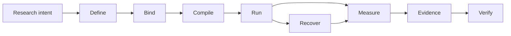

# Noetrium: Reproducible Research Infrastructure for AI Agents


<!-- readme-nav:start -->
<p align="center">
  <a href="README.md">English</a> ·
  <a href="README.zh-CN.md">简体中文</a> ·
  <a href="README.zh-TW.md">繁體中文</a> ·
  <a href="README.ja.md">日本語</a> ·
  <strong>한국어</strong> ·
  <a href="README.es.md">Español</a> ·
  <a href="README.pt-BR.md">Português (Brasil)</a> ·
  <a href="README.fr.md">Français</a> ·
  <a href="README.de.md">Deutsch</a> ·
  <a href="README.ru.md">Русский</a>
</p>
<!-- readme-nav:end -->


<!-- readme-locale:ko -->

<!-- readme-source-sha256:5004893a513f37199b753185cd47233c275b01de996c9d6fb2fcc5a8ffca5f78 -->

<p align="center">
  <strong>Agent를 구축하고, 실험하고, 결과를 검증하세요.</strong><br>
  재현 가능하고 증거 중심적인 AI 에이전트 연구를 위한 엄격한 시스템 인프라.
</p>

<p align="center">
  <a href="#quick-start">빠른 시작</a> ·
  <a href="examples/README.md">예제</a> ·
  <a href="docs/architecture/PLATFORM_ARCHITECTURE.md">아키텍처</a> ·
  <a href="docs/INDEX.md">문서</a> ·
  <a href="#verification">검증</a>
</p>

<p align="center">
  <a href="https://www.python.org/">=3.11" src="https://img.shields.io/badge/Python-%3E%3D3.11-3776AB?logo=python&logoColor=white"></a>
  <a href="pyproject.toml"></a>
  <a href="docs/architecture/PLATFORM_ARCHITECTURE.md"></a>
  <a href="LICENSE"></a>
</p>

<!-- readme-section:overview -->

## 개요

Noetrium은 장시간 실행되는 AI 에이전트 실험을 위한 연구 인프라입니다. 단순히 실행되는 것만으로는 충분하지 않습니다. 무엇이 실행됐는지, 어떤 binding이 사용됐는지, 장애 후 무엇이 보존됐는지, 어떤 evidence가 결과를 뒷받침하는지 알아야 합니다.

Agent, model, environment, experiment, Artifact, recovery, observability, governance를 하나의 기반에서 다루되 프로젝트별 과학적 의미를 플랫폼에 강제하지 않습니다.

**다음이 필요할 때 Noetrium이 특히 유용합니다:**

- variant, seed, model, environment 전반의 재현 가능한 experiment identity;
- crash 이후 추측 대신 effect certainty를 보존하는 recovery;
- exact source/runtime identity까지 연결되는 evidence와 lineage;
- publication/release 전에 fail-closed할 수 있는 governance gate.

<!-- readme-section:why -->

## 왜 Noetrium인가?

대부분의 Agent 프레임워크는 Agent가 어떻게 행동하거나 협력하는지에 집중합니다. Noetrium은 연구 실행이 attribution, recovery, reproducibility, evidence binding을 유지하는지에 집중합니다. Orchestration framework를 대체하기보다 그 아래나 옆에서 함께 사용할 수 있습니다.

### 생태계에서의 위치

| Project | 주요 초점 | Noetrium이 더하는 것 |
| --- | --- | --- |
| [LangGraph](https://github.com/langchain-ai/langgraph) | 장기 실행 stateful Agent orchestration | 실행 주위의 research identity, evidence, recovery, governance |
| [AutoGen](https://github.com/microsoft/autogen) | Multi-agent application | Experiment protocol, reproducibility, release evidence |
| [CrewAI](https://github.com/crewAIInc/crewAI) | Agent team과 event flow | Scientific run identity, lineage, fail-closed recovery |
| [OpenHands](https://github.com/All-Hands-AI/OpenHands) | AI 기반 소프트웨어 개발 | Agent, model, environment 전반의 범용 연구 인프라 |
| **Noetrium** | 재현 가능한 AI Agent 연구 인프라 | Research systems layer 자체 |

Noetrium은 의도적으로 Agent workflow library보다 범위가 넓습니다. Experiment design, model/environment identity, runtime effect, checkpoint, evidence, release authority를 하나의 research-systems 문제로 취급합니다.

<!-- readme-section:capabilities -->

## 핵심 기능

- 재귀 아키텍처 — 명시적 ownership, 좁은 public API, typed port, composition-time provider binding.
- 실험 인프라 — Study, Run, Branch, Task, Variant, Workload, Checkpoint, Resume, 재현성 identity.
- Agent runtime — Participant, Capability, Action, Memory, Workflow, Execution 경계와 숨은 global lookup 제거.
- 모델 인프라 — catalog, revision, qualification, serving identity, request envelope, prompt binding.
- 환경 인프라 — specification, lifecycle, readiness, observation, effect, snapshot, recovery.
- 프로세스/서버 runtime — supervision, session, toolchain, remote execution, lifecycle control, journal.
- 영속 데이터/Artifact — checksum 상태, WAL recovery, lineage, retention, content-addressed evidence.
- 신뢰성 — failure classification, effect certainty, reconciliation, replay, incident, fail-closed recovery.
- 관측성 — 구조화 log, event, metric, trace, diagnostic, projection, health signal.
- 거버넌스 — architecture, dependency, algorithm, concurrency, performance, forensic, release, no-degradation gate.

<!-- noetrium-interface-catalog:start -->
### Public interface catalog

Noetrium is a general-purpose research-systems platform for long-running agents, stateful environments, model providers, experiments, and other evidence-driven workloads. The complete downstream interface is generated from the canonical registry, so the list stays synchronized with the code.

- 172 registered system surfaces; 500 public API modules; 3659 public symbols.
- Full machine-readable catalog: noetrium/contracts/downstream_capability_catalog.json
- Full human-readable catalog: docs/architecture/DOWNSTREAM_CAPABILITY_CATALOG.md
- Import rule: use noetrium.contracts.systems.<system-slug>; do not import noetrium_platform implementation modules.

| Capability domain | Registered surfaces |
| --- | ---: |
| artifact | 7 |
| components | 1 |
| data | 8 |
| environment | 18 |
| execution | 7 |
| experimentation | 15 |
| governance | 13 |
| model | 16 |
| observability | 27 |
| operator | 8 |
| orchestration | 1 |
| participant | 8 |
| platform | 5 |
| portfolio | 5 |
| reliability | 7 |
| resource | 6 |
| runtime | 13 |
| scope | 7 |

Discover a capability in the catalog, import its generated facade, and inject its typed ports in downstream composition:

    from noetrium.contracts.systems.environment__minecraft import MinecraftBridgePort
    from noetrium.contracts.systems.participant__agent import AgentMemoryPort

After changing a registry descriptor or public API export, run python scripts/update_generated_docs.py; CI fails on generated-surface or README drift.
<!-- noetrium-interface-catalog:end -->

<!-- readme-section:architecture -->

## 아키텍처

가장 짧은 mental model은 evidence를 보존하는 연구 파이프라인입니다:



각 전이는 identity를 보존하거나 identity가 왜 바뀌었는지 설명하는 evidence를 만들어야 합니다. Composition, Execution, Observation은 서로 분리된 authority plane으로 유지되며 runtime은 provider를 전역 탐색하지 않고 주입된 좁은 port만 사용합니다.

각 durable state에는 하나의 owner만 있고, 불확실한 외부 effect는 reconciliation으로 증명되기 전까지 `UNKNOWN`으로 남습니다.

`noetrium_platform/foundation/governance/system_registry/catalog.json`

<!-- readme-section:downstream -->

## 플랫폼과 downstream 프로젝트

이 저장소는 독립적으로 재사용 가능한 플랫폼 패키지입니다. 연구 방법, task suite, 프로젝트별 환경 구성, 실험 행렬, 모델 선택, 배포 inventory, 과학적 해석은 downstream에 속합니다.

```text
noetrium
        │
        ├── install as a dependency, or
        └── fork as a platform baseline
                 │
                 ▼
       downstream research repository
       ├── project-specific method
       ├── experiment composition
       ├── task/environment bindings
       └── project evidence and results
```

Downstream 코드는 public platform contract를 사용하고 프로젝트 소유 구현을 제공합니다. 플랫폼이 downstream 프로젝트를 import하여 과학적 의미나 배포 정책을 결정해서는 안 됩니다.

<!-- readme-section:quick-start -->

<a id="quick-start"></a>

## 빠른 시작

첫 예제는 deterministic하며 API key, model endpoint, 외부 서비스가 필요하지 않습니다.

### 1. Clone 및 설치

```bash
git clone https://github.com/Xalzeroph/noetrium.git
cd noetrium
python -m venv .venv
source .venv/bin/activate
# Windows PowerShell: .venv\Scripts\Activate.ps1
python -m pip install --upgrade pip
python -m pip install -e ".[test]"
```

### 2. 첫 재현 가능한 experiment plan 컴파일

```bash
python examples/quickstart_experiment_plan.py
```

예제는 scientific protocol을 고정하고 명시적 provider identity를 binding한 뒤 immutable plan을 compile하고 digest를 검증합니다.

```text
study=noetrium-quickstart
variants=control,treatment
repetitions=3
protocol_digest=<sha256>
plan_digest=<sha256>
plan_consistent=true
```

### 3. Checkout 검증

```bash
noetrium-architecture-gate
python scripts/check_readme_i18n.py
```

다운스트림 코드는 `noetrium`에서 안정적인 contract와 재사용 가능한 component를 import합니다. `noetrium_platform`을 프로젝트 확장 API로 취급하지 마십시오. author-first 프로젝트 골격은 `noetrium project create <project-id> <destination> --version <version>`으로 생성한 뒤 `noetrium project doctor --project <destination>`과 `noetrium project test --project <destination>`를 실행하고, 프로젝트 고유 provider나 method를 추가합니다.

<!-- readme-section:containers -->

## 컨테이너 워크플로

재사용 가능한 Linux image와 Compose 정의는 `deploy/`에서 관리합니다.

```bash
cp deploy/.env.example deploy/.env
docker compose -f deploy/compose.yaml config
docker compose -f deploy/compose.yaml build
docker compose -f deploy/compose.yaml run --rm platform-runtime doctor
```

Deployment 계층은 immutable software와 mutable runtime state를 분리하고 host별 path와 secret을 commit된 composition code에 넣지 않습니다.

### 내장 Minecraft Provider

Minecraft는 first-party 재사용 environment Provider입니다. Task suite와 과학적 composition은 downstream에 둡니다.

```bash
docker compose -f deploy/compose.yaml -f deploy/compose.minecraft.yaml build platform-runtime
docker compose -f deploy/compose.yaml -f deploy/compose.minecraft.yaml run --rm platform-runtime minecraft-doctor
```

[Minecraft infrastructure](docs/infrastructure/minecraft/README.md)

<!-- readme-section:repository-layout -->

## 리포지토리 구조

| Path | Responsibility |
| --- | --- |
| `noetrium/` | 공개 facade, contract, reference single-agent component, multi-agent orchestration |
| `noetrium_platform/` | 내부 semantic-plane implementation, provider, governance tooling이며 다운스트림 extension API가 아님 |
| `configs/` | 버전 관리 설정 예제와 비밀이 아닌 템플릿 |
| `deploy/` | 컨테이너 이미지, Compose runtime, deployment bootstrap |
| `docs/` | Architecture, infrastructure, governance, status, history 문서 |
| `scripts/` | 얇은 operator, audit, release, maintenance entry point |
| `tests/` | 계층형 regression / contract tests |
| `noetrium_platform/capabilities/environment/minecraft/` | 재사용 가능한 Minecraft environment provider |
| `LICENSE` / `NOTICE` / `THIRD_PARTY_NOTICES.md` | Apache-2.0 및 서드파티 라이선스 고지 |

`noetrium/`을 지원되는 다운스트림 package boundary로 취급하십시오. `noetrium_platform/`은 내부 구현 namespace이며 프로젝트 고유 코드는 downstream에 둡니다.

<!-- readme-section:testing -->

<a id="verification"></a>

## 테스트와 검증

평가 중인 exact revision에 대해 regression suite와 governance gate를 실행합니다.

```bash
python -m pytest -q
python scripts/architecture_gate.py
python scripts/public_contract_audit.py
python scripts/no_degradation_audit.py
python scripts/check_readme_i18n.py
```

과거의 green result는 현재 tree를 증명하지 않습니다. 게시하거나 배포할 exact revision에 대해 필요한 gate를 다시 실행해야 합니다.

저장소는 계층형 test taxonomy를 사용하여 모든 테스트를 명시적 contract level에 배치하고 release evidence가 실제 검증 범위를 증명하게 합니다. See `tests/TEST_SYSTEM.json`.

<!-- readme-section:principles -->

## 설계 원칙

1. durable state마다 owner는 하나만 둔다.
2. Execution 전에 composition한다.
3. Runtime port를 좁게 유지한다.
4. 외부 effect는 evidence를 가져야 한다.
5. Recovery는 identity-aware여야 한다.
6. silent degradation을 허용하지 않는다.
7. Observation은 authority가 아니다.
8. 성능 변경은 의미를 보존한다.
9. 구현 변경과 문서 변경을 함께 한다.
10. 프로젝트 고유 의미는 downstream에 둔다.

<!-- readme-section:extending -->

## 플랫폼 확장

가장 작은 owner boundary에서 기능을 추가합니다. 공개 contract가 이미 있으면 새 provider를 우선하고, 능력 자체가 새로울 때만 contract를 추가합니다.

```text
<system>/
├── api/          public contracts and identities
├── runtime/      lifecycle and execution semantics
├── providers/    replaceable adapters owned by the system
└── composition/  provider-to-port binding
```

관련 없는 algorithm, provider discovery, 외부 effect를 하나의 범용 wrapper 뒤에 숨기지 마십시오.

<!-- readme-section:documentation -->

## 문서

documentation index에서 시작하십시오.

### 핵심 문서

- [Documentation index](docs/INDEX.md)
- [Examples](examples/README.md)
- [Contributing](CONTRIBUTING.md)
- [Security policy](SECURITY.md)
- [Support](SUPPORT.md)
- [Citation metadata](CITATION.cff)
- [Code of Conduct](CODE_OF_CONDUCT.md)
- [Platform architecture](docs/architecture/PLATFORM_ARCHITECTURE.md)
- [Detailed system map](docs/architecture/VNEXT_DETAILED_SYSTEM_MAP.md)
- [Architecture migration contract](docs/architecture/FINAL_ARCHITECTURE_MIGRATION_CONTRACT.md)
- [Infrastructure documentation](docs/infrastructure/README.md)
- [Governance documentation](docs/governance/README.md)
- [Current status](docs/status/README.md)
- [Engineering history](docs/history/README.md)

Architecture 문서는 재사용 가능한 ownership과 contract를 정의하고, status 문서는 현재 개발 tree를 설명하며, history는 작성 당시 상태의 증거를 보존합니다.

<!-- readme-section:security -->

## 보안과 설정

- password, private key, access token, runtime secret, 로컬 credential을 commit하지 않는다.
- host별 path와 secret은 ignore된 local profile 또는 environment-bound store에 둔다.
- remote automation은 key/agent 기반 무인 인증을 우선한다.
- 외부 effect command는 typed, bounded, journaled이며 operation identity에 귀속되어야 한다.
- logs와 evidence는 민감한 운영 데이터를 포함할 수 있다고 간주한다.

<!-- readme-section:contributing -->

## 기여

변경은 ownership boundary 기준으로 리뷰 가능해야 하며 이를 증명하는 tests와 documentation을 포함해야 합니다.

### Pull Request 전

```bash
python -m pytest -q
python scripts/architecture_gate.py
python scripts/check_readme_i18n.py
```

- system ownership과 public-contract boundary 유지
- focused regression coverage 추가 또는 갱신
- 같은 change set에서 owner 문서 갱신
- 같은 commit에 무관한 refactor를 섞지 않기
- 불확실한 외부 effect에서 fail-closed 유지
- 의도적인 semantic/compatibility 변경 명시

[Documentation Change Policy](docs/governance/DOCUMENTATION_CHANGE_POLICY.md)

<!-- readme-section:license -->

## 라이선스

Noetrium은 Apache License 2.0을 사용합니다. 법적 권위가 있는 본문은 루트 LICENSE 파일입니다.

서드파티 구성요소는 각자의 라이선스를 따릅니다. THIRD_PARTY_NOTICES.md를 참고하십시오. 독립 배포되는 모델 가중치, 데이터셋, benchmark 자산에는 별도 조건이 있을 수 있습니다.

[`LICENSE`](LICENSE) · [`NOTICE`](NOTICE) · [`THIRD_PARTY_NOTICES.md`](THIRD_PARTY_NOTICES.md)

<!-- readme-section:status -->

## 개발 상태

플랫폼은 아키텍처와 runtime을 계속 개발 중입니다.

프로덕션, 공개, 과학적 주장에서는 오래된 green result에 의존하지 말고 관련 gate를 다시 실행한 뒤 exact source revision에 바인딩된 release evidence를 확인하십시오.

역사적 변경 사항은 의도적으로 이 README에 넣지 않습니다. 불변 engineering record는 `docs/history/`를 사용하십시오.

현재 개발 기준 정보는 `docs/status/CURRENT_DEVELOPMENT_BASELINE.md` 입니다. 릴리스 및 연구 주장은 평가 중인 정확한 리비전에 바인딩된 증거를 사용해야 합니다.

`docs/status/` · `docs/history/`
