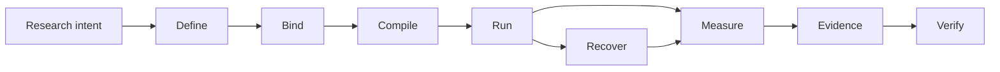

# Noetrium: Reproducible Research Infrastructure for AI Agents


<!-- readme-nav:start -->
<p align="center">
  <strong>English</strong> ·
  <a href="README.zh-CN.md">简体中文</a> ·
  <a href="README.zh-TW.md">繁體中文</a> ·
  <a href="README.ja.md">日本語</a> ·
  <a href="README.ko.md">한국어</a> ·
  <a href="README.es.md">Español</a> ·
  <a href="README.pt-BR.md">Português (Brasil)</a> ·
  <a href="README.fr.md">Français</a> ·
  <a href="README.de.md">Deutsch</a> ·
  <a href="README.ru.md">Русский</a>
</p>
<!-- readme-nav:end -->


<!-- readme-locale:en -->

<!-- readme-source-sha256:e13fb8ae0d3beaa4b86e2989d1704546b758ab6dfe98f27886545a2a359ce03e -->

<p align="center">
  <strong>Build agents. Run experiments. Verify results.</strong><br>
  A rigorous systems stack for reproducible, evidence-driven AI-agent research.
</p>

<p align="center">
  <a href="#quick-start">Quick Start</a> ·
  <a href="examples/README.md">Example</a> ·
  <a href="docs/architecture/PLATFORM_ARCHITECTURE.md">Architecture</a> ·
  <a href="docs/INDEX.md">Docs</a> ·
  <a href="#verification">Verification</a>
</p>

<p align="center">
  <a href="https://www.python.org/">=3.11" src="https://img.shields.io/badge/Python-%3E%3D3.11-3776AB?logo=python&logoColor=white"></a>
  <a href="pyproject.toml"></a>
  <a href="docs/architecture/PLATFORM_ARCHITECTURE.md"></a>
  <a href="LICENSE"></a>
</p>

<!-- readme-section:overview -->

## Overview

Noetrium is an open-source upstream platform for building, running, and verifying long-running AI-agent research. It gives downstream projects a small set of typed, explicit, inspectable seams for identity, binding, execution, effects, checkpoints, artifacts, recovery, and evidence.

It sits between an agent method and a claim-grade experiment. Noetrium owns reusable infrastructure and authority; a downstream project owns the method, tasks, scientific protocol, metrics, and conclusions.

**Noetrium provides:**

- reproducible identities across studies, variants, repetitions, models, environments, and source revisions;
- explicit contracts and replaceable providers instead of hidden global discovery;
- lifecycle, effect receipts, checkpoints, resume, reconciliation, artifact lineage, and release evidence;
- observability and governance that make failures, unknowns, and publication boundaries inspectable.

**A downstream project provides:**

- the research method, task suite, benchmark semantics, metrics, and experiment matrix;
- project-owned provider bindings, deployment inventory, credentials, and scientific interpretation;
- the claims and evidence policy appropriate to its paper, product, or internal study.

Noetrium deliberately does not contain paper-specific cognition, downstream experiment code, deployment secrets, or scientific conclusions.

<!-- readme-section:why -->

## Why Noetrium?

Most agent frameworks focus on how agents act or collaborate. Noetrium focuses on whether research executions remain attributable, recoverable, reproducible, and evidence-bound. It can sit underneath or alongside orchestration frameworks rather than replacing them.

### Where Noetrium fits

| Project | Primary focus | Noetrium adds |
| --- | --- | --- |
| [LangGraph](https://github.com/langchain-ai/langgraph) | Long-running stateful agent orchestration | Research identity, evidence, recovery, and governance around execution |
| [AutoGen](https://github.com/microsoft/autogen) | Multi-agent applications | Experiment protocol, reproducibility, and release evidence |
| [CrewAI](https://github.com/crewAIInc/crewAI) | Agent teams and event flows | Scientific run identity, lineage, and fail-closed recovery |
| [OpenHands](https://github.com/All-Hands-AI/OpenHands) | AI-driven software development | General research infrastructure across agents, models, and environments |
| **Noetrium** | Reproducible AI-agent research infrastructure | The research-systems layer itself |

Noetrium is deliberately broader than an agent workflow library: experiment design, model and environment identity, runtime effects, checkpoints, evidence, and release authority are treated as one research-systems problem. Existing orchestration frameworks can remain inside a downstream method or provider; Noetrium supplies the surrounding identity, lifecycle, and evidence boundary.

<!-- readme-section:capabilities -->

## Core capabilities

- Public authoring surface — `noetrium.contracts` and `noetrium.platform` expose stable identities, ports, specifications, and project-facing operations.
- Study compilation — `ExperimentRunSpec`, `ResearchStudyDefinition`, and `CompiledResearchPlan` make experiment intent explicit before any run starts.
- Run authority — `ExperimentRunApplication` owns lifecycle decisions; checkpoint, resume, reconcile, and evidence paths remain explicit and inspectable.
- Reusable method layers — `components` provides reference single-agent building blocks, while `orchestration` provides higher-level multi-agent topology and delivery policy.
- Provider seams — models, environments, resources, processes, servers, and toolchains bind through typed ports instead of hidden global discovery.
- Durable artifacts — `RunArtifactStore` records manifests, sequence, digests, lineage, raw facts, retention, and replayable evidence.
- Effect-safe recovery — external effects carry receipts and certainty; an unresolved effect stays `UNKNOWN` until reconciliation proves the outcome.
- Observability and governance — structured events, diagnostics, projections, forensics, architecture, concurrency, performance, release, and no-degradation gates make the system auditable.
- Long-running environments — world cut, branch, snapshot, checkpoint, and resume semantics support recoverable stateful providers, including the bundled Minecraft integration.

<!-- noetrium-interface-catalog:start -->
### Public interface catalog

Noetrium is a general-purpose research-systems platform for long-running agents, stateful environments, model providers, experiments, and other evidence-driven workloads. The complete downstream interface is generated from the canonical registry, so the list stays synchronized with the code.

- 172 registered system surfaces; 500 public API modules; 3663 public symbols.
- Full machine-readable catalog: noetrium/contracts/downstream_capability_catalog.json
- Full human-readable catalog: docs/architecture/DOWNSTREAM_CAPABILITY_CATALOG.md
- Import rule: use noetrium.contracts.systems.<system-slug>; do not import noetrium_platform implementation modules.

| Capability domain | Registered surfaces |
| --- | ---: |
| artifact | 7 |
| components | 1 |
| data | 8 |
| environment | 18 |
| execution | 7 |
| experimentation | 15 |
| governance | 13 |
| model | 16 |
| observability | 27 |
| operator | 8 |
| orchestration | 1 |
| participant | 8 |
| platform | 5 |
| portfolio | 5 |
| reliability | 7 |
| resource | 6 |
| runtime | 13 |
| scope | 7 |

Discover a capability in the catalog, import its generated facade, and inject its typed ports in downstream composition:

    from noetrium.contracts.systems.environment__minecraft import MinecraftBridgePort
    from noetrium.contracts.systems.participant__agent import AgentMemoryPort

After changing a registry descriptor or public API export, run python scripts/update_generated_docs.py; CI fails on generated-surface or README drift.
<!-- noetrium-interface-catalog:end -->

<!-- readme-section:architecture -->

## Architecture

The shortest mental model is an evidence-preserving research pipeline:



Every transition is expected to preserve identity or produce evidence about why it changed. The platform is intentionally split into three authority planes:

| Plane | Owns | Does not own |
| --- | --- | --- |
| Composition | study definitions, explicit bindings, provider selection, and port wiring | durable run truth or scientific conclusions |
| Runtime | lifecycle, action execution, effect receipts, checkpoints, recovery, and generation fencing | observation projections or scientific interpretation |
| Observation + evidence | events, diagnostics, artifact manifests, sequence/digest/lineage, forensics, and release proof | command authority or hidden state mutation |

An `ExperimentRunSpec` is compiled into an immutable plan and applied through an `ExperimentRunApplication`; a `StudyMatrixExecutor` schedules units through explicit `StudyUnitExecutionPort` implementations. The MC and non-MC paths may bind different execution ports while preserving the same identity and evidence discipline.

Long-running providers use world cut, branch, snapshot, checkpoint, and resume semantics where applicable. Durable state has one owner, and uncertain external effects remain `UNKNOWN` until reconciliation proves otherwise.

`noetrium_platform/foundation/governance/system_registry/catalog.json`

<!-- readme-section:downstream -->

## Platform vs. downstream projects

This repository is an independent upstream platform package. A downstream project should be able to replace its method, task suite, experiment matrix, providers, or deployment policy without editing platform internals.

```text
noetrium
        │
        ├── install as a dependency, or
        └── fork as a platform baseline
                 │
                 ▼
       downstream research repository
       ├── project-specific method
       ├── experiment composition
       ├── task/environment bindings
       └── project evidence and results
```

| You are changing... | Implement downstream... | Reuse from Noetrium... |
| --- | --- | --- |
| Research method | policy, method host, tools, memory, and prompts | reference components and lifecycle contracts |
| Task or benchmark | task suite, dataset adapter, metrics, and scientific protocol | study/run identity, execution ports, artifacts, and evidence |
| Provider or integration | typed model, environment, resource, process, or server provider | port contracts, composition, readiness, and recovery semantics |
| Multi-agent behavior | topology, node policy, message delivery, and coordination rules | orchestration primitives and run authority |

Use `noetrium.contracts`, `noetrium.platform`, `components`, and `orchestration` as the supported project-facing surfaces. `noetrium_platform` is the internal semantic-plane implementation namespace, not a downstream extension API. The platform must not import a downstream project to decide scientific meaning or deployment policy.

<!-- readme-section:quick-start -->

<a id="quick-start"></a>

## Quick start

The first example is deterministic and requires no API key, model endpoint, or external service. It is a platform-compilation smoke test; the public component-reuse example is shown in `examples/quickstart_agent_components.py` and documented in `examples/README.md`.

### 1. Clone and install

```bash
git clone https://github.com/Xalzeroph/noetrium.git
cd noetrium
python -m venv .venv
source .venv/bin/activate
# Windows PowerShell: .venv\Scripts\Activate.ps1
python -m pip install --upgrade pip
python -m pip install -e ".[test]"
```

### 2. Compile your first reproducible experiment plan

```bash
python examples/quickstart_experiment_plan.py
```

This example freezes a scientific protocol, binds explicit provider identities, compiles an immutable plan, and verifies its digest. It demonstrates the compilation seam; a downstream method can keep its own policy and use the same run/study contracts.

```text
study=noetrium-quickstart
variants=control,treatment
repetitions=3
protocol_digest=<sha256>
plan_digest=<sha256>
plan_consistent=true
```

### 3. Verify the checkout

```bash
noetrium-architecture-gate
python scripts/check_readme_i18n.py
```

Downstream code imports stable contracts and reusable components from `noetrium`; do not treat `noetrium_platform` as a project extension API. For an author-first project scaffold, use `noetrium project create <project-id> <destination> --version <version>`, then run `noetrium project doctor --project <destination>` and `noetrium project test --project <destination>` before adding project-owned providers or methods.

<!-- readme-section:containers -->

## Container workflow

A reusable Linux image and Compose definition are maintained under `deploy/`.

```bash
cp deploy/.env.example deploy/.env
docker compose -f deploy/compose.yaml config
docker compose -f deploy/compose.yaml build
docker compose -f deploy/compose.yaml run --rm platform-runtime doctor
```

The deployment layer separates immutable software from mutable runtime state; host-specific paths and secrets stay outside committed composition code.

### Bundled Minecraft provider

Minecraft is a first-party reusable environment provider. Task suites and scientific composition remain downstream.

```bash
docker compose -f deploy/compose.yaml -f deploy/compose.minecraft.yaml build platform-runtime
docker compose -f deploy/compose.yaml -f deploy/compose.minecraft.yaml run --rm platform-runtime minecraft-doctor
```

[Minecraft infrastructure](docs/infrastructure/minecraft/README.md)

<!-- readme-section:repository-layout -->

## Repository layout

| Path | Responsibility |
| --- | --- |
| `noetrium/` | Public facade, contracts, reference single-agent components, and multi-agent orchestration |
| `noetrium_platform/` | Internal semantic-plane implementation, providers, and governance tooling; not a downstream extension API |
| `configs/` | Versioned configuration examples and non-secret templates |
| `deploy/` | Container image, Compose runtime, and deployment bootstrap assets |
| `docs/` | Architecture, infrastructure, governance, status, and history |
| `scripts/` | Thin operator, audit, release, and maintenance entry points |
| `tests/` | Hierarchical regression and contract tests |
| `noetrium_platform/capabilities/environment/minecraft/` | Bundled reusable Minecraft environment provider |
| `LICENSE` / `NOTICE` / `THIRD_PARTY_NOTICES.md` | Apache-2.0 and third-party license notices |

Treat `noetrium/` as the supported downstream package boundary. Project-specific code stays downstream, and internal implementation details under `noetrium_platform/` may change behind the public contracts.

<!-- readme-section:testing -->

<a id="verification"></a>

## Testing and verification

Run the repository regression suite and governance gates on the exact revision being evaluated.

```bash
python -m pytest -q
python scripts/architecture_gate.py
python scripts/public_contract_audit.py
python scripts/no_degradation_audit.py
python scripts/check_readme_i18n.py
```

For focused checks, the installed console scripts include `noetrium-repository-boundary`, `noetrium-concurrency`, and `noetrium-performance`; use `python scripts/verify_release_evidence.py` to validate the source, manifest, evidence, and authority bindings for a release.

A historical green result does not prove the current tree. Re-run the gates that matter for the exact revision you intend to publish or deploy.

The repository uses a hierarchical test taxonomy so every test belongs to an explicit contract level and release evidence can prove what was actually exercised. See `tests/TEST_SYSTEM.json`.

<!-- readme-section:principles -->

## Design principles

1. One owner per durable state.
2. Composition before execution.
3. Narrow runtime ports.
4. External effects are evidence-bearing.
5. Recovery is identity-aware.
6. No silent degradation.
7. Observation is not authority.
8. Performance changes preserve semantics.
9. Documentation moves with implementation.
10. Downstream projects own scientific meaning and deployment policy.

<!-- readme-section:extending -->

## Extending the platform

Add a capability at the smallest owning boundary. Prefer a new provider when the pub