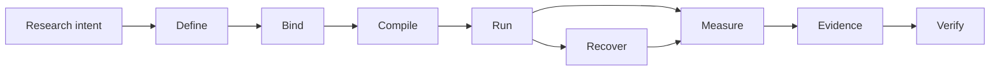

# Noetrium Research OS


<!-- readme-nav:start -->
<p align="center">
  <strong>English</strong> ·
  <a href="README.zh-CN.md">简体中文</a> ·
  <a href="README.zh-TW.md">繁體中文</a> ·
  <a href="README.ja.md">日本語</a> ·
  <a href="README.ko.md">한국어</a> ·
  <a href="README.es.md">Español</a> ·
  <a href="README.pt-BR.md">Português (Brasil)</a> ·
  <a href="README.fr.md">Français</a> ·
  <a href="README.de.md">Deutsch</a> ·
  <a href="README.ru.md">Русский</a>
</p>
<!-- readme-nav:end -->


<!-- readme-locale:en -->

<!-- readme-source-sha256:a72c2a84278eb563d068aa3ae44adae02da5fce6b30deffc3aaea198319a6e57 -->

<p align="center">
  <strong>Research infrastructure for attributable, recoverable, evidence-preserving AI-agent experiments.</strong><br>
  Compose research programs at the top. Keep one authority for every truth underneath.
</p>

<p align="center">
  <a href="#quick-start">Quick Start</a> ·
  <a href="examples/README.md">Example</a> ·
  <a href="docs/architecture/PLATFORM_ARCHITECTURE.md">Architecture</a> ·
  <a href="docs/INDEX.md">Docs</a> ·
  <a href="#verification">Verification</a>
</p>

<p align="center">
  <a href="https://www.python.org/">=3.11" src="https://img.shields.io/badge/Python-%3E%3D3.11-3776AB?logo=python&logoColor=white"></a>
  <a href="pyproject.toml"></a>
  <a href="docs/architecture/PLATFORM_ARCHITECTURE.md"></a>
  <a href="LICENSE"></a>
</p>

<!-- readme-section:overview -->

## Overview

Noetrium is a <strong>Research Operating System for AI-agent research</strong>. It is not another agent loop, workflow DSL, benchmark harness, or provider SDK. Its job is to make large research programs composable while keeping execution truth, scientific identity, effects, artifacts, resources, and evidence under explicit owners.

The end-state model is intentionally simple:

> <strong>Research OS composes research. Research Programs describe scientific semantics. MachineExecutor + Machine Journal accept scientific execution truth. Each domain system owns one authority. Platform kernel primitives are shared once. Composition wires systems together but never creates a second truth.</strong>

That model is designed for the point where a research repository stops being one script and becomes a matrix of papers, methods, benchmarks, environments, models, trials, resources, interruptions, retries, revisions, and publication evidence.

Noetrium separates five concerns that are often collapsed into one framework:

| Concern | Noetrium boundary |
| --- | --- |
| Research authoring | <code>noetrium.api</code>, Research OS, portfolios, graphs, studies, programs and explicit bindings |
| Scientific execution | Program interpreters propose work; <code>MachineExecutor</code> accepts transitions into the Machine Journal |
| Domain truth | Experimentation, resource, artifact, data, model, participant, environment and other authorities own their own facts |
| Reusable mechanisms | canonical identity, content addressing, durability, CAS/fencing, leases, checkpoints and other platform primitives |
| Observation | telemetry, diagnostics, projections and forensics observe authority; they do not replace it |

The dependency direction is one-way:

<strong>research intent -> explicit composition -> frozen identity -> admitted execution -> authoritative transition/effect/evidence -> recovery, replay, inspection and verification.</strong>

Noetrium owns the reusable research substrate: canonical identities, revision/binding truth, durable machine transitions, recovery boundaries, resource admission, effect certainty, artifacts, evidence, provenance, observability and governance. Downstream projects own the scientific novelty: methods, prompts, benchmark semantics, task policies, experiment hypotheses, statistical interpretation and claims.

A downstream paper should normally change only the top-level ResearchPortfolio/ResearchProgram declaration and its Method configuration, Study/Experiment specification, prompts, policies, or paper-owned handlers — <strong>not Noetrium internals</strong>. Lower execution, capability, runtime, resource, and infrastructure interfaces are consumed only by their adjacent Noetrium layer rather than by downstream research code.

<!-- readme-section:why -->

## Why Noetrium?

Agent research becomes difficult to trust when orchestration, scientific semantics, provider mechanics and persistence are implemented as one opaque loop. The common failure modes are structural: two runners both believe they own progress, a retry silently repeats an uncertain external effect, a checkpoint diverges from execution history, a scheduler becomes scientific truth, or an updated provider changes a supposedly identical experiment.

Noetrium addresses those failures by making authority explicit and machine-verifiable.

### Where Noetrium fits

| Project | Primary focus | Noetrium adds |
| --- | --- | --- |
| [LangGraph](https://github.com/langchain-ai/langgraph) | Long-running stateful agent orchestration | Research identity, evidence, recovery, and governance around execution |
| [AutoGen](https://github.com/microsoft/autogen) | Multi-agent applications | Experiment protocol, reproducibility, and release evidence |
| [CrewAI](https://github.com/crewAIInc/crewAI) | Agent teams and event flows | Scientific run identity, lineage, and fail-closed recovery |
| [OpenHands](https://github.com/All-Hands-AI/OpenHands) | AI-driven software development | General research infrastructure across agents, models, and environments |
| <strong>Noetrium</strong> | Reproducible AI-agent research infrastructure | The research-systems layer itself |

Existing orchestration frameworks can be used inside a downstream method or provider when that is scientifically appropriate. Noetrium does not need to replace them. It supplies the surrounding research identity, execution authority, resource/effect discipline, recovery and evidence closure that remain stable when the orchestration implementation changes.

<!-- readme-section:capabilities -->

## Core capabilities

- <strong>One public authoring surface</strong> — downstream code enters through <code>noetrium.api</code>; lower packages remain implementation and composition authorities rather than accidental extension APIs.
- <strong>Research OS composition</strong> — portfolios, research graphs, revisions, experiments, research runs and machine targets can be authored and controlled from one product-level surface without moving lower-domain truth upward.
- <strong>Universal Method aggregate</strong> — Method is the Agent Harness boundary. Agent loop, Memory, Context, Communication, Model Invocation, Tool/Capability mediation, Environment interaction, logical scheduling, synchronization, recovery, intervention, checkpointing, and related harness semantics are Method-owned components/programs executed by one shared Machine kernel rather than peer public APIs or independent runtimes.
- <strong>Nested Machines</strong> — one research computation can invoke another through explicit child-machine linkage instead of paper-local runners or hidden callback stacks.
- <strong>Single scientific execution truth</strong> — accepted Machine transitions are committed by <code>MachineExecutor</code> into the Machine Journal. Checkpoints and snapshots accelerate recovery; they are not parallel histories.
- <strong>Durable interruption and recovery</strong> — pause, resume, retry, reconcile and revision-aware continuation operate against accepted cuts and frozen identities rather than arbitrary in-memory state.
- <strong>Explicit effect certainty</strong> — effect intents, receipts and reconciliation keep <code>UNKNOWN</code> as a real state; transport success or timeout is never silently promoted into scientific certainty.
- <strong>Resource authority</strong> — admission, capacity, placement, lease/fencing and execution-resource ownership are centralized instead of recreated by graph, experiment or provider code.
- <strong>Artifact, data and provenance closure</strong> — immutable content identity, references, lineage, datasets, durable facts, metrics and evidence remain attributable to exact program/run/revision identities.
- <strong>Provider-neutral environments</strong> — Web, GUI, Software, Text World, Minecraft and embodied integrations are providers under the generic Environment authority rather than new top-level truth systems.
- <strong>Governed architecture</strong> — topology, concrete-boundary, compatibility, degradation, execution-resource, durable-execution and scale-readiness gates reject shadow implementations and authority leaks.
- <strong>Large-scale research scheduling</strong> — dependency-aware ResearchGraph execution, resource admission and isolated node attempts support many papers, methods and experiments without turning physical scheduling into paper semantics.

<!-- noetrium-interface-catalog:start -->
### Public interface catalog

Noetrium exposes one high-level Research OS API. Registered lower systems remain internal composition authorities and are listed here only as architecture metadata.

- 31 registered system surfaces; 1 public API module; 4 public root symbols.
- Full machine-readable catalog: noetrium/contracts/downstream_capability_catalog.json
- Full human-readable catalog: docs/architecture/DOWNSTREAM_CAPABILITY_CATALOG.md
- Import rule: downstream code uses only noetrium.api; lower system facades are internal registry material.

| Capability domain | Registered surfaces |
| --- | ---: |
| artifact | 1 |
| data | 3 |
| environment | 6 |
| execution | 2 |
| experimentation | 1 |
| governance | 3 |
| model | 1 |
| observability | 2 |
| operator | 1 |
| participant | 1 |
| platform | 1 |
| portfolio | 1 |
| reliability | 3 |
| research_os | 1 |
| resource | 2 |
| runtime | 1 |
| scope | 1 |

Author and control research through the same top-level API:

    from noetrium import api
    portfolio = api.ResearchPortfolioBuilder("paper")
    program = portfolio.program("paper")
    research_os = api.open_project(".")

After changing a registry descriptor or public API export, run python scripts/update_generated_docs.py; CI fails on generated-surface or README drift.
<!-- noetrium-interface-catalog:end -->

The catalog is an API map, not an authority registry that downstream code is expected to edit. A system surface declares what it owns, what it must not own, what it requires, what it provides, and which public facade exposes it. The generated facade is the downstream seam; internal implementation packages may be reorganized without turning implementation paths into accidental public contracts.

The catalog also makes the platform composable at the level of responsibility. A capability is added to its owning system, bound through a narrow port, and then exposed through the generated surface. This prevents the same durable fact, provider authority, or effect lifecycle from being reimplemented in several layers merely because different callers need different views.

<!-- readme-section:architecture -->

## Architecture

The shortest mental model is an evidence-preserving research pipeline:


```mermaid
flowchart LR
    A["Research intent"] --> B["Define"]
    B --> C["Bind"]
    C --> D["Compile"]
    D --> E["Run"]
    E --> F["Recover"]
    E --> G["Measure"]
    F --> G
    G --> H["Evidence"]
    H --> I["Verify"]
```

The current end-state hierarchy is:

<pre>
downstream
    │
    ▼
noetrium.api
    ├── ResearchPortfolioBuilder
    ├── ResearchPortfolio
    ├── ResearchOS
    └── open_project
    │
    ▼
Product / Research OS
ResearchPortfolio → ResearchProgram
    │
    ▼
Experimentation
Study / Experiment / Measurement / Trial semantics
    │
    ▼
Execution
Method aggregate
    ├── Method graph / control flow
    ├── Agent / multi-agent orchestration
    ├── Context
    ├── Memory
    ├── Communication
    ├── Model invocation
    ├── Tool / Capability mediation
    ├── Environment interaction
    ├── Logical scheduling / synchronization
    ├── Recovery / intervention
    └── Checkpoint / evidence / visibility
    │
    ▼
Agent loop / shared Machine kernel
    │
    ▼
Capability
    │
    ▼
Foundation → Infrastructure → Substrate
</pre>

The dependency rule is strict: <strong>every layer may consume only the adjacent lower-layer facade</strong>. Lower-layer interfaces are internal Noetrium contracts, not downstream APIs. Product cannot reach through Experimentation into Execution or Capability; Experimentation cannot reach around Execution; Method-owned components do not become peer top-level systems merely because they are complex.

### Authority model

Noetrium is <strong>authority-shaped</strong>, not directory-shaped. A package is an authority only when it accepts truth, owns irreducible mutable state, performs fenced/CAS mutation, owns scientific identity/equivalence, owns external-effect certainty, or owns an immutable binding/source cut. Schemas, projections, provider adapters, codecs, query services, CLIs and convenience wrappers do not become authorities merely because they have stateful Python objects.

| Layer | Owns | Must not become |
| --- | --- | --- |
| Research OS | top-level composition, portfolio/graph authoring and control | a duplicate domain authority |
| Experimentation | Study / Experiment / Run scientific hierarchy | a second Machine execution history |
| Research Programs | paper-programmable scientific semantics | independent persistence engines |
| MachineExecutor + Machine Journal | accepted scientific transition history | paper-specific semantics |
| Domain authorities | their canonical facts and bindings | hidden cross-domain coordinators |
| Platform kernel | shared irreducible mechanisms | domain business truth |
| Composition | wiring and provider selection | durable state owner |
| Observability / forensics | projections, diagnostics and evidence materialization | command authority |

### Method aggregate and the shared Machine kernel

Noetrium does not create one independent runtime for every Agent Harness concern. It uses one shared Machine execution kernel and one Method aggregate. Method-owned components may have their own programs, state and scientific semantics, but they execute through the same lifecycle, journal, checkpoint, effect, recovery and evidence machinery.

| Method-owned concern | Role |
| --- | --- |
| Method graph / control flow | paper algorithm, routing and node semantics |
| Agent / multi-agent topology | roles, orchestration and collaboration structure |
| Context | prompt/context construction and transformation |
| Memory | recall, write, consolidation, evolution and memory lifecycle |
| Communication | messages and paper-level coordination semantics |
| Model invocation | when/how a role invokes a model; physical serving remains below |
| Tool / Capability mediation | scientific use of tools/capabilities |
| Environment interaction | paper-level action/observation semantics |
| Scheduling / synchronization | logical order, barriers and quorum semantics |
| Recovery / intervention | method-level recovery and human/control semantics |
| Checkpoint / evidence / visibility | method-level scientific state and evidence obligations |

A complex component may compile to a child program, but that does not create a second execution engine or a peer downstream API. Physical Docker/process/GPU/port/model-serving/environment-instance lifecycle remains below Method in adjacent platform layers.

### Canonical execution path

<strong>Program -> interpreter / host -> command or proposal -> MachineExecutor -> Machine Journal -> evidence / artifact / effect references.</strong>

UMM remains the method interpreter; it is not a second durability authority. A model call, environment action, tool call, optimization step or experiment decision becomes authoritative only when the owning transition/effect/evidence boundary accepts it.

### One owner per mechanism

Shared primitives such as SQLite durability, content addressing, CAS/fencing, concurrency pools, leases, timers/heartbeats and checkpoints are centralized. Domain systems consume the primitive; they do not grow private copies because their call site is different.

Semantic scheduling and physical scheduling remain separate: Runtime may define paper-variable logical order, barriers or quorum semantics; resource and execution infrastructure own physical admission, worker capacity, leases and placement.

### One execution lifecycle

1. <strong>Define</strong> — express study, program, provider, resource and evidence intent.
2. <strong>Compose</strong> — bind capabilities and scopes explicitly.
3. <strong>Compile</strong> — freeze program, schema, implementation and configuration identity.
4. <strong>Admit</strong> — validate revision, resources, leases, scope and execution preconditions.
5. <strong>Execute</strong> — interpreters and providers propose typed work.
6. <strong>Commit</strong> — owning authorities accept transition/effect/artifact/evidence facts.
7. <strong>Recover / reconcile</strong> — resume from validated cuts and resolve uncertainty with evidence.
8. <strong>Inspect / verify</strong> — rebuild projections and verify exact-revision evidence closure.

A cache, log, checkpoint, telemetry stream, worker-local state or provider database may accelerate execution, but none can silently become the second source of scientific truth.

<code>noetrium_platform/foundation/governance/system_registry/catalog.json</code>

<!-- readme-section:downstream -->

## Platform vs. downstream projects

This repository is an independent upstream platform package. A downstream project should be able to replace its method, task suite, experiment matrix, providers, or deployment policy without editing platform internals.

```text
noetrium
        │
        ├── install as a dependency, or
        └── fork as a platform baseline
                 │
                 ▼
       downstream research repository
       ├── project-specific method
       ├── experiment composition
       ├── task/environment bindings
       └── project evidence and results
```

| You are changing... | Implement downstream... | Reuse from Noetrium... |
| --- | --- | --- |
| Research method | policy, method host, tools, memory, and prompts | reference components and lifecycle contracts |
| Task or benchmark | task suite, dataset adapter, metrics, and scientific protocol | study/run identity, execution ports, artifacts, and evidence |
| Provider or integration | typed model, environment, resource, process, or server provider | port contracts, composition, readiness, and recovery semantics |
| Multi-agent behavior | topology, node policy, message delivery, and coordination rules | orchestration primitives and run authority |

Use `noetrium.api` as the only supported downstream project-facing surface. Contract generation, reference components, orchestration, and platform composition remain internal aggregation layers behind that entrypoint. `noetrium_platform` is the internal semantic-plane implementation namespace, not a downstream extension API. The platform must not import a downstream project to decide scientific meaning or deployment policy.

<!-- readme-section:quick-start -->

<a id="quick-start"></a>

## Quick start: understand, author, deploy, run

This section is intentionally self-contained. A new contributor or research agent should read it before editing Platform code or creating a downstream paper.

### 0. Choose the correct entrypoint

Noetrium has two operational entrypoints with different purposes:

| Goal | Entry point | Responsibility |
| --- | --- | --- |
| Author or control one downstream Research OS project | <code>noetrium project ...</code> and <code>noetrium run/inspect/pause/... --project ...</code> | project scaffold, ResearchPortfolio loading, revision and control state |
| Deploy and execute the repository-wide reproduction fleet on Linux | <code>./deploy/noetrium ...</code> | Docker-only bootstrap, environment images, authority closure, whole-fleet preflight and execution |

Do not substitute one path for the other. <code>project create</code> is the canonical downstream authoring path. <code>./deploy/noetrium run</code> is the canonical Docker server path for this repository's reproduction fleet.

### 1. Architecture you must preserve

~~~text
downstream paper
      |
      v
noetrium.api
      |
      v
ResearchPortfolio / ResearchOS
      |
      v
ResearchProgram
      |
      v
Experiment / Study
      |
      v
Method
  +---+-------------------------------+
  | Agent loop / graph               |
  | Memory / Context / Communication |
  | Model / Tool / Environment use   |
  | Scheduling / Recovery / Evidence |
  +---+-------------------------------+
      |
      v
shared Machine kernel
      |
      v
Capability
      |
      v
Foundation -> Infrastructure -> Substrate
~~~

The rules behind that diagram are strict:

1. Downstream code imports only <code>noetrium.api</code>.
2. The only public root symbols are <code>ResearchPortfolioBuilder</code>, <code>ResearchPortfolio</code>, <code>ResearchOS</code>, and <code>open_project</code>.
3. A lower layer exposes interfaces only to its adjacent upper layer; those interfaces are not downstream APIs.
4. ResearchPortfolio/ResearchOS is the top-level research machine: it can express many papers, methods, Studies, Experiments, dependencies and revisions without making downstream code learn lower Noetrium contracts.
5. Method is the Agent Harness aggregate. Memory, Context, Communication, Model invocation, Tool use, Environment interaction, logical scheduling, synchronization, recovery, intervention and checkpoint semantics are Method-owned components rather than peer public systems.
6. All Method components execute on the shared Machine kernel. Do not create parallel journals, checkpoint engines, schedulers or component-specific runtimes.
7. Model/environment/resource/runtime physical mechanics stay below Method and are reached through adjacent platform layers.
8. Machine Journal remains the accepted scientific execution truth; checkpoints/caches accelerate recovery but do not replace it.
9. Logical research scheduling may be scientific semantics. CPU/GPU/process/port placement is infrastructure.
10. No compatibility shadow path is required during end-state convergence.

The live top-level ownership map is:

| System | Kind | Owns |
| --- | --- | --- |
| artifact | authority | immutable content identity, references, retention and catalog |
| data | authority | durable facts, datasets, canonical state and projections |
| environment | authority | environment specs, bindings, resolution and instances |
| execution | authority | workflow, ResearchGraph scheduling, node attempts/leases and operation orchestration |
| experimentation | authority | study, experiment, run, branch and checkpoint semantics |
| governance | facet | architecture, quality, release and system-topology rules |
| model | authority | model assets, assignments, deployments and serving identity |
| observability | projection | logs, metrics, traces, status and observation projections |
| operator | product surface | human-facing CLI and maintenance/query routing |
| participant | authority | participant definitions, bindings, sessions and capabilities |
| platform | authority | platform lifecycle, global identity and composition boundaries |
| portfolio | authority | workspace/program/project metadata and immutable revision DAGs |
| reliability | facet | effect/failure/recovery/forensic mechanisms over owning authorities |
| research_os | product surface | unified downstream authoring, revision and graph-control surface |
| resource | authority | inventory, compute, directories, leases, endpoint allocation and resolution |
| runtime | authority | server, process, service and session lifecycle |
| scope | authority | hierarchical scope identity, ancestry and ownership paths |

A package or class is not an authority merely because it stores state. Providers, adapters, projections, policies, codecs and product surfaces remain subordinate to the canonical authority named by the registry.

When architecture documents disagree, read them in this order:

~~~text
system registry
  -> NOETRIUM_AUTHORITY_CONSOLIDATION_EXECUTION_SPEC_20260916.md
  -> UNIVERSAL_RESEARCH_MACHINE_ARCHITECTURE_20260919.md
  -> NOETRIUM_RESEARCH_OS_END_STATE_ARCHITECTURE.md
  -> exact-source generated architecture/dataflow maps
  -> subsystem documents
~~~

The generated source-derived maps are:

~~~text
docs/architecture/DATAFLOW_MAP.md
docs/architecture/CODE_ARCHITECTURE_MAP.md
docs/architecture/CODE_ARCHITECTURE_INDEX.json
~~~

They are evidence for the source cut named in their headers. Regenerate them after architecture-changing source edits.

### 2. Local Platform checkout

For Platform development and repository tests:

~~~bash
git clone https://github.com/Xalzeroph/noetrium.git
cd noetrium
python -m venv .venv
source .venv/bin/activate
# Windows PowerShell: .venv\Scripts\Activate.ps1
python -m pip install --upgrade pip
python -m pip install -e ".[test]"
~~~

Run the deterministic smoke example and gates:

~~~bash
python examples/quickstart_experiment_plan.py
python -m pytest -q
python scripts/architecture_gate.py
python scripts/public_contract_audit.py
python scripts/no_degradation_audit.py
~~~

A historical green run proves only the source cut it tested.

### 3. Create a downstream project

Generate the shell instead of hand-creating it:

~~~bash
noetrium project create my-paper ./my-paper
cd ./my-paper
~~~

The create command is intentionally strict. The destination must either not exist or already be the byte-identical generated scaffold. Extra build artifacts, caches or user files make create fail closed. For an existing generated project, use <code>project sync</code>; do not rerun create over a developed tree.

Generated layout:

~~~text
my-paper/
├── .noetrium-template
├── project.manifest.json
├── pyproject.toml
├── README.md
├── src/
│   └── my_paper/
│       ├── __init__.py
│       ├── core.py          # USER OWNED
│       └── research.py      # PLATFORM GENERATED; DO NOT EDIT
└── tests/
    └── test_generated_project.py  # PLATFORM GENERATED
~~~

The only required user-owned entrypoint is:

~~~text
src/<package>/core.py::build_research()
~~~

It returns a `noetrium.api.ResearchPortfolio`, the highest public Research OS
authoring object. Authors start from `ResearchPortfolioBuilder` and descend through
objects returned by that root; they do not import lower builders or internal
Noetrium layers. One portfolio can contain one paper or many papers, arbitrary
ResearchPrograms, cross-program DAGs, Methods, Studies, Experiments, analyses and
explicit dependencies. Method internally absorbs Agent Harness concerns such as
Memory, Context, Model/Tool/Environment interaction, logical scheduling and recovery.

A minimal core is:

~~~python
from noetrium import api


def _bootstrap():
    return None


def build_research() -> api.ResearchPortfolio:
    portfolio = api.ResearchPortfolioBuilder("my-paper")
    program = portfolio.program("my-paper")
    program.custom_definition("bootstrap", implementation=_bootstrap)
    program.custom_node("root", definitions=("bootstrap",))
    return portfolio.freeze()
~~~

Replace the semantics-neutral body with the real research core. You may keep a
simple paper in one ResearchProgram or compose many programs and dependencies in the
same portfolio. The generated `research.py` only validates the portfolio identity
and exposes it to the Research OS; it never rewrites or lowers scientific topology.

ProjectManifest, binding manifests, machine-local provider composition, GPU/Docker/
port/resource mechanics, scheduling, checkpointing, evidence, recovery, and operator
plumbing remain Platform-owned. The scientific core begins at the four root symbols in `noetrium.api` and uses
the DSL objects returned by those roots. Internal builders and lower-layer
interfaces are intentionally not separately importable public APIs; there is no
second generated scientific contract.

### 4. Decide where scientific semantics belong

| Concern | Canonical home |
| --- | --- |
| multi-paper / multi-method / multi-experiment composition | ResearchPortfolio / ResearchOS |
| paper-level Study / Experiment protocol | ResearchProgram → Experimentation |
| paper method/control algorithm | Method |
| agent loop / multi-agent topology | Method |
| paper-defined memory evolution | Method-owned Memory component |
| context / communication / tool policy | Method-owned component |
| model invocation semantics | Method; serving/deployment remains below |
| environment interaction semantics | Method; environment instance/provider remains below |
| logical scheduling / synchronization | Method; physical scheduling remains infrastructure |
| recovery / intervention / checkpoint semantics | Method, executed by shared Machine kernel |
| benchmark tasks/worlds/datasets/prompts/claims | Study/Experiment declarations and downstream assets |
| Docker/process/GPU/port/storage mechanics | Platform infrastructure/resource/runtime authorities |

A concern does not become a new Machine merely because it is complicated. Prefer
a Method-owned component/program executed by the shared Machine kernel. Create a
separate authority only when the concern truly owns independent canonical truth
that cannot belong to Method or another existing adjacent-layer authority.

### 5. Sync, doctor and test a downstream project

When the Platform template changes:

~~~bash
noetrium project sync --project .
~~~

Sync regenerates Platform-owned shell/test files and, when the installed qualified Platform artifact changes, rebinds only the manifest's Platform provenance while preserving every project/scientific manifest facet. It intentionally does not parse or rewrite <code>core.py</code>.

Run:

~~~bash
noetrium project doctor --project .
noetrium project test --project .
~~~

Doctor checks template revision, project metadata, canonical platform manifest, exact installed Noetrium version, Platform artifact provenance, generated shell identity, the public import boundary, Program validity and the automatically lifted internal ResearchPortfolio.

Project test installs the project into an isolated temporary target and executes the generated contract tests against that isolated install.

If a generated shell drifts, do not hand-repair <code>research.py</code> or the generated test. Sync or regenerate it.

### 6. Control a generated project

Top-level Research OS lifecycle commands are:

~~~bash
noetrium run        --project .
noetrium inspect    --project .
noetrium pause      --project .
noetrium drain      --project .
noetrium interrupt  --project .
noetrium resume     --project .
noetrium retry      --project .
noetrium cancel     --project .
noetrium checkpoint --project .
noetrium reconcile  --project .
noetrium migrate    --project .
~~~

Node-scoped control supplies both identities:

~~~bash
noetrium pause --project . --program <program-id> --node <node-id>
~~~

Local project control state lives under:

~~~text
<project>/.noetrium/research-os/
~~~

Real provider-backed project execution uses the same canonical portfolio execution authorities as multi-program/fleet execution. The project remains provider-free; machine-local composition is selected with <code>--config</code>.

A project execution config is strict JSON:

~~~json
{
  "schema": "noetrium.project-execution-config.v1",
  "authority_factory": "deployment.authorities:build",
  "start_background_controllers": true,
  "authority_inputs": {
    "qualified_model_closure": "/data/models/qualified-model-closure.json",
    "benchmark_assets": "/data/benchmarks/my-paper"
  }
}
~~~

Run it with:

~~~bash
noetrium run --project . --config ./execution.json
~~~

The factory receives a Platform-owned execution context containing the one <code>ManagedResearchRuntime</code>, shared execution pool, Model/Environment/Resource authorities, immutable content authority, and any explicit <code>authority_inputs</code> from the execution config. Use those inputs only for machine-local facts that cannot be uniquely inferred—for example the path to a qualified model closure, a private benchmark asset root, or an exact world snapshot. The factory must validate those references and return <code>ResearchExecutionAuthorities</code>. Experiment execution binds Study/Experiment closure and the Method aggregate through platform-owned adjacent-layer composition. Downstream scientific code does not construct Method runtime inventories, Docker/GPU/port authorities, model endpoints, or environment-instance owners. All routes reuse the same physical authorities.

The authority factory is deployment/composition code, not scientific method semantics. Keep it outside the generated scientific <code>core.py</code>; do not work around the boundary by importing <code>noetrium_platform</code> from downstream scientific source or by constructing shadow Docker, endpoint, compute, model or journal authorities.

<!-- readme-section:containers -->

## Docker-first server deployment and large-scale execution

For Linux server execution, the intended host contract is Docker plus Compose. Host Python is not required for the canonical deployment path; control-plane Python executes inside the bootstrap container.

### 1. Host prerequisites

The ordinary deployment user must be able to run:

~~~bash
docker info
docker compose version
~~~

The canonical launcher never invokes sudo.

GPU hosts must already have a working NVIDIA driver and Docker GPU runtime. Noetrium does not mutate the host driver.

<code>deploy/install_workspace_docker_engine.sh</code> can install Docker binaries into the workspace, but starting that bundled rootful daemon requires host privileges. For an ordinary-user deployment, prefer the rootless manager described below. Rootless Docker still requires <code>dockerd-rootless.sh</code>, RootlessKit, slirp4netns, setuid <code>newuidmap/newgidmap</code>, subordinate UID/GID ranges and enabled unprivileged user namespaces. Noetrium checks these prerequisites and fails closed; it never emulates the privileged UID/GID mapping helpers in user space.

On a shared server, inspect current GPU and host load before launch. Existing foreign workloads are external ownership facts and must not be killed or preempted merely to make room for Noetrium.

### 2. Put mutable deployment state on the data disk

Redirect runtime state away from a small system partition:

~~~bash
export NOETRIUM_DEPLOYMENT_STATE_ROOT=/data/noetrium-runtime
mkdir -p "$NOETRIUM_DEPLOYMENT_STATE_ROOT"
~~~

The launcher uses:

~~~text
$NOETRIUM_DEPLOYMENT_STATE_ROOT/
├── environment-images/
└── reproduction-fleet/
~~~

Large model caches, world state and scientific outputs should likewise use an explicitly selected data volume.

This variable does **not** relocate the Docker daemon's own image/layer store. Before building on a server with a small system disk, inspect the active daemon storage:

~~~bash
docker info --format '{{.DockerRootDir}}'
~~~

If that path is on a nearly-full system partition, fix the daemon/rootless-Docker data root first. Otherwise image pulls and builds can still consume the system disk even though Noetrium state is on a data volume.

Noetrium can own a user-level rootless Docker daemon entirely on the selected data volume:

~~~bash
export NOETRIUM_DEPLOYMENT_STATE_ROOT=/data/noetrium-runtime
export NOETRIUM_DOCKER_DATA_ROOT=/data/noetrium-runtime/docker
export NOETRIUM_DOCKER_RUNTIME_ROOT=/data/noetrium-runtime/docker-runtime

./deploy/noetrium docker doctor
./deploy/noetrium docker start
eval "$(./deploy/noetrium docker env)"
./deploy/noetrium docker status
./deploy/noetrium doctor
~~~

When <code>NOETRIUM_DOCKER_DATA_ROOT</code> is set, normal deployment doctor/build/run paths verify that the active daemon's actual <code>DockerRootDir</code> equals that canonical path. A variable pointing at a data disk is not accepted as proof that Docker really moved. Stop only the exact user-owned daemon with <code>./deploy/noetrium docker stop</code>.

If <code>docker doctor</code> reports a missing privileged host prerequisite such as <code>newuidmap</code>, an administrator must install or enable that prerequisite once. Do not fall back to a nearly-full system DockerRootDir merely to continue a run.

The current evidence-bound image builder also requires real Git source metadata. It derives the source identity with Git and refuses a dirty checkout before building the qualified wheel/image. A source-only archive with no .git metadata is not currently sufficient for the formal image-build path. When transporting source without GitHub, preserve the repository metadata by copying the complete checkout or by using a verified Git bundle/local transport. Do not invent a source SHA or bypass the clean-source check.

Offline/local Git transport must also preserve tracked executable modes. The canonical
Linux launcher and its shell entrypoints are committed as executable files, so a
verified Git bundle/clone reproduces both source identity and executable bits. Do not
replace the formal server source cut with a filesystem copy that silently strips
Git mode metadata.

### 3. Verify Docker and environment-profile authority

From the repository root:

~~~bash
./deploy/noetrium doctor
./deploy/noetrium env list
./deploy/noetrium env show minecraft
./deploy/noetrium env validate
~~~

The profile authority is <code>deploy/environments/catalog.json</code>. Current reusable categories are text_world, web, minecraft, gui, embodied and software. The central builder does not hard-code that set.
### 4. Build or reuse exact environment images

Build every active default profile:

~~~bash
./deploy/noetrium build
~~~

Or one profile:

~~~bash
./deploy/noetrium env build --profiles minecraft
~~~

The build path is:

~~~text
exact clean source cut
  -> qualified Noetrium distribution/wheel
  -> evidence-bound base image
  -> exact upstream runtime image identities
  -> environment profile image
  -> image-local doctor
  -> provenance/build receipt
~~~

The base image is built from one formally prepared evidence-bound wheel, not from a mutable source-tree copy. Exact source, wheel and runtime identities are recorded and verified.

Profile revisions are immutable. A draining revision requires explicit recovery intent and a retired revision requires explicit historical-recovery intent:

~~~bash
./deploy/noetrium env build --profiles <profile> --allow-draining
./deploy/noetrium env build --profiles <profile> --allow-retired
~~~

### 5. Environment isolation

The invariant is:

> **Share immutable content; isolate all mutable execution state.**

Shared examples include image layers, content-addressed assets, dependency caches and immutable runtime artifacts.

Private per-execution state includes workspace, tmp, runtime state, secrets, process/network namespace, ports, browser profile, world state and application state.

A warm instance returns to a pool only after an explicit cleanliness proof. Otherwise it is destroyed.

The Minecraft profile provides Java 21, Node 22 and the lockfile-pinned Mineflayer runtime. Benchmark servers, worlds, tasks, methods, models and checkpoints stay downstream.

### 6. Plan the repository fleet before execution

Static planning starts no work:

~~~bash
./deploy/noetrium plan
~~~

The planner discovers reproduction definitions, compiles each ResearchProgram, resolves benchmark/study bindings and builds one top-level ResearchPortfolio/ResearchGraph. It reports compile failures, benchmark-authority gaps, reproduction-closure gaps, materialization readiness, study authority requirements and graph identities.

Having a directory below <code>research/reproductions/</code> does not by itself make a paper runnable. Execution requires exact closure.

### 7. Materialize owner-authority prerequisites

Emit the machine-readable prerequisite manifest:

~~~bash
./deploy/noetrium requirements
~~~

No materializer configuration is required for the normal repository path. <code>preflight</code> and <code>run</code> use Noetrium's built-in owner-authority materializer, which derives internal binding IR and deterministic platform-owned bindings from already-frozen programs/studies. Machine-local or external authority that cannot be inferred uniquely remains explicit: downstream project execution passes exact facts through <code>authority_inputs</code>, and repository fleet execution accepts the same kind of facts through repeatable <code>--authority-input KEY=VALUE</code> arguments. Specialized repository deployments may still replace the owner materializer with <code>NOETRIUM_FLEET_AUTHORITY_MATERIALIZER</code>.

When an authority input refers to host data that the Docker control plane must read, set <code>NOETRIUM_CONTROL_INPUT_ROOT</code> to the common host root. The bootstrap validates that root, refuses a symlink root, and mounts it at the same absolute path read-only. Benchmark-owned materializers then verify exact source revision, content digest and task-cut identity before registering a <code>BenchmarkResolutionRegistry</code> entry; a path alone is never authority proof.

~~~bash
export NOETRIUM_CONTROL_INPUT_ROOT=/data/noetrium-authority-assets
./deploy/noetrium plan --authority-audit \
  --authority-input benchmark.gsm8k.test_jsonl=/data/noetrium-authority-assets/gsm8k/test.jsonl
~~~

The launcher keeps stateful authority-audit work under <code>$NOETRIUM_DEPLOYMENT_STATE_ROOT/reproduction-fleet</code>; it never falls back to writable state inside the read-only source checkout. Authority inputs are deployment/composition facts, not a channel for paper semantics.

The automatic materializer never invents model, environment, GPU, endpoint, verifier or external-asset proof. A lane whose real owner authority cannot close is retained as a content-addressed <code>BLOCKED</code> lane while unrelated closed lanes continue into the runnable ResearchPortfolio.

An operator may replace the built-in resolver for a specialized deployment:

~~~bash
export NOETRIUM_FLEET_AUTHORITY_MATERIALIZER='your.module:factory'
~~~

The same optional override may be supplied by the control env file. The default is <code>deploy/.env</code>; set <code>NOETRIUM_CONTROL_ENV_FILE</code> to choose another file. The factory receives the typed fleet execution context and returns <code>ReproductionFleetAuthorityMaterializerPort</code>.

The override is a composition boundary, not paper semantics. It must materialize owner-authority truth and must not create shadow resource, execution or journal authorities.

### 8. Preflight the complete execution closure

~~~bash
./deploy/noetrium preflight
~~~

Preflight resolves exact authority closure, filters the authority-closed runnable subgraph, and performs admission without creating an execution cut or starting tasks. Source/materialization blockers and owner-authority gaps are reported per lane and do not abort unrelated lanes.

If no lane currently closes, preflight returns a structured <code>no-runnable-lanes</code> report instead of asking the operator to wire providers manually. Do not bypass blocked lanes with a paper-local runner.

### 9. Execute

~~~bash
./deploy/noetrium run
~~~

Unless <code>NOETRIUM_SKIP_ENVIRONMENT_BUILD=1</code> is intentionally set, the launcher builds/reuses active environment profiles first.

The real execution path is:

~~~text
./deploy/noetrium run
  -> host Docker/Compose doctor
  -> containerized control-plane bootstrap
  -> exact environment image build/reuse
  -> reproduction discovery
  -> ResearchPortfolio + ResearchGraph compile
  -> authority materialization
  -> whole-graph admission
  -> ManagedResearchRuntime
  -> ResearchGraphScheduler
  -> experiment/model/environment/provider execution
  -> Machine / Operation / Effect / Evidence authorities
  -> durable result/evidence closure
~~~

### 10. Large-scale scheduling and shared-host behavior

ResearchGraph scheduling is dependency-aware:

~~~text
pending
  -> dependency frontier
  -> ready set
  -> concurrent submission
  -> terminal result
  -> downstream unlock or BLOCKED propagation
~~~

Repository execution is also lane-fault-isolated before graph admission. Benchmark
or reproduction-closure failure in one paper does not abort unrelated papers.
Noetrium independently materializes every exact lane, compiles the closed subset
into the runnable ResearchPortfolio, and retains content-addressed BLOCKED records
for the rest. A lane with an externally selected benchmark split must match that
split exactly; a Study that owns its split internally may materialize its own
canonical split without inventing an external selection.

Bound reproduction ResearchProgram identities are content-addressed by the exact
execution-binding digest rather than by embedding free-form binding labels. This
keeps program IDs valid, deterministic and collision-resistant across arbitrary
paper-owned binding names.

Durable scheduling adds attempt identities, leases, retry timing, per-node control and reconciliation-required states.

ResearchExecutionPool separates control, orchestration, experiment and model-I/O domains. This prevents nested admission deadlock. Workload domains share one CPU worker provider and one residual-capacity reservation ledger so separate gates cannot spend the same RAM/PID/FD/storage headroom concurrently.

Lease heartbeats run through the independent control domain. Compute/GPU, endpoint, EnvironmentInstance and Docker-container fencing can therefore continue while workloads are quiescing.

On a shared host, use currently idle residual capacity while respecting pre-existing external workloads. Pressure blocks new admission; it does not normally kill already admitted Noetrium work.

### 11. GPU, endpoint and Docker ownership

Papers declare requirements; Platform resource authorities select physical identities.

Endpoint lifecycle is:

~~~text
candidate
  -> OS bind probe
  -> atomic reservation
  -> lease/fencing generation
  -> exact binding proof
  -> heartbeat
  -> physical convergence
  -> release/reuse
~~~

Compute/GPU ownership follows the same authority principle.

Docker-managed containers are generation-bound and reconciled against physical daemon state. Container convergence must be proven before dependent environment, endpoint or compute ownership is released.
### 12. Shutdown, crash and restart semantics

Normal ManagedResearchRuntime shutdown is ordered:

~~~text
quiesce background controllers
  -> quiesce experiment work
  -> quiesce model I/O
  -> close exact replica leases
  -> retire auto-managed model generations
  -> stop model processes
  -> reconcile/remove managed Docker containers
  -> reconcile EnvironmentInstance generations
  -> release endpoints
  -> release compute/GPU allocations
  -> close observability and pools
  -> release managed-runtime interprocess lock LAST
~~~

If a stage cannot prove convergence, later dependent resources remain fenced.

After SIGKILL, SSH loss or a crashed prior controller, the next exclusive managed runtime performs startup reconciliation before admitting new work. It converges abandoned physical owners before reclaiming lower resources.

Machine Journals, checkpoints, artifacts, evidence, immutable assets and recovery-required workspaces are durable recovery carriers, not ephemeral leaks. They follow retention/GC policy rather than crash cleanup.

### 13. Bootstrap-container crash handling

<code>deploy/build-environments.sh</code> runs control-plane Python inside a bootstrap container connected to the active host Docker daemon.

Bootstrap containers carry exact host owner identity: PID, boot id and process-start generation. Normal EXIT/HUP/INT/TERM performs cleanup. A later launcher removes only orphan bootstrap containers whose exact owner generation is proven gone. Docker <code>--rm</code> is treated as an optimization, not proof of physical convergence.

### 14. Upstream versus downstream

Keep reusable execution machinery upstream: Research OS/Machine substrate, resource admission and leases, process/service/container lifecycle, generic environment profiles/providers, model-serving mechanics, artifacts/evidence/data authorities, generic experiment/recovery mechanisms and deployment tooling.

Keep scientific novelty downstream: paper method, memory semantics, prompts/policies, benchmark/task semantics, task success criteria, paper worlds/assets, paper model selection, experiment hypotheses/matrices and claim interpretation.

Move a mechanism upstream only when it is genuinely reusable across papers and can be expressed without importing one paper's scientific claim into Platform authority.

### 15. Before adding a Runner, Manager, Controller or adapter

Check <code>noetrium.api</code>, the system registry and generated architecture map first.

If the need is paper-variable, prefer Program/sub-IR/policy/handler. If it is physical/provider mechanics, extend the owning typed provider. If an authority already exists, reuse it.

Do not add a second durable history, scheduler, lease registry, checkpoint authority, Docker owner or resource allocator.

### 16. Current execution status

Complete canonical paths today:

~~~text
project create (unconstrained ResearchPortfolio downstream scaffold)
project sync
project doctor
project test
cardinality-agnostic ResearchPortfolio execution
generated-project canonical provider binding
Docker-only environment build/reuse
repository reproduction fleet planning
automatic internal prerequisite/manifest compilation
automatic owner-authority materialization
lane-fault-isolated authority audit
authority-closed subgraph preflight
managed fleet execution
resource lifecycle/reconciliation
~~~

Normal repository execution is zero-glue at the operator boundary:
<code>./deploy/noetrium run</code>. The platform compiles internal Research OS and
binding IR, materializes what current owner authorities can prove, executes only
the closed subgraph, and retains exact BLOCKED diagnostics for unavailable lanes.
<code>NOETRIUM_FLEET_AUTHORITY_MATERIALIZER</code> is an optional advanced override,
not a prerequisite.

A lane may still be BLOCKED because its exact scientific assets do not exist on the
machine or in the repository—for example an unavailable paper-era checkpoint,
benchmark cut, verifier or environment. That is scientific/provenance truth, not
operator glue, and Noetrium does not silently substitute another asset.

[Environment profile registry](deploy/environments/README.md) ·
[Server workflow](docs/infrastructure/server/SERVER_FIRST_WORKFLOW.md) ·
[Canonical dataflow](docs/architecture/DATAFLOW_MAP.md) ·
[Architecture authority](docs/architecture/CURRENT_ARCHITECTURE_AUTHORITY.md)

<!-- readme-section:repository-layout -->

## Repository layout

| Path | Responsibility |
| --- | --- |
| `noetrium/` | Supported downstream Research OS facade, generated contracts, typing surface, and shell entrypoints |
| `components/` | Reusable component contracts, providers, runtime, and reference implementations |
| `orchestration/` | Reusable orchestration contracts/runtime, including multi-agent composition |
| `noetrium_platform/` | Internal semantic-plane implementation, providers, and governance tooling; not a downstream extension API |
| `configs/` | Versioned configuration examples and non-secret templates |
| `deploy/` | Canonical Docker-only server launcher, image profiles, Compose runtime, and bootstrap assets |
| `docs/` | Architecture, infrastructure, governance, status, and history |
| `scripts/` | Thin operator, audit, release, and maintenance entry points |
| `tests/` | Hierarchical regression and contract tests |
| `noetrium_platform/capabilities/environment/minecraft/` | Bundled reusable Minecraft environment provider |
| `LICENSE` / `NOTICE` / `THIRD_PARTY_NOTICES.md` | Apache-2.0 and third-party license notices |

Treat `noetrium/` as the supported downstream package boundary. Project-specific code stays downstream, and internal implementation details under `noetrium_platform/` may change behind the public contracts.

<!-- readme-section:testing -->

<a id="verification"></a>

## Testing and verification

Run the repository regression suite and governance gates on the exact revision being evaluated.

```bash
python -m pytest -q
python scripts/architecture_gate.py
python scripts/public_contract_audit.py
python scripts/no_degradation_audit.py
python scripts/check_readme_i18n.py
```

For focused checks, the installed console scripts include `noetrium-repository-boundary`, `noetrium-concurrency`, and `noetrium-performance`; use `python scripts/verify_release_evidence.py` to validate the source, manifest, evidence, and authority bindings for a release.

A historical green result does not prove the current tree. Re-run the gates that matter for the exact revision you intend to publish or deploy.

The repository uses a hierarchical test taxonomy so every test belongs to an explicit contract level and release evidence can prove what was actually exercised. See `tests/TEST_SYSTEM.json`.

<!-- readme-section:principles -->

## Design principles

1. <strong>One truth, one authority.</strong>
2. <strong>One mechanism, one canonical implementation.</strong>
3. <strong>Composition is wiring, not ownership.</strong>
4. <strong>Programs own paper-variable scientific semantics.</strong>
5. <strong>Machine Journal is scientific execution truth.</strong>
6. <strong>Effects are evidence-bearing; UNKNOWN remains unknown.</strong>
7. <strong>Physical scheduling is infrastructure, not paper semantics.</strong>
8. <strong>Observation is not authority.</strong>
9. <strong>Fail closed on ambiguity, stale identity and unsafe recovery.</strong>
10. <strong>No compatibility shadow path or silent downgrade.</strong>
11. <strong>Exact source/program/provider revision is part of reproducibility.</strong>
12. <strong>Downstream owns scientific novelty.</strong>
13. <strong>Architecture invariants are executable gates.</strong>
14. <strong>Performance optimization must preserve semantics.</strong>
15. <strong>Delete before adding during end-state convergence.</strong>

<!-- readme-section:extending -->

## Extending the platform

Add a capability at the smallest owning boundary. Prefer a new provider when the public contract already exists; add a new contract only when the capability itself is new.

A practical extension sequence is: select or define the public contract, implement the provider or component in the owning project, bind it explicitly during composition, record the resulting identity and evidence, then exercise recovery and reconciliation paths. This keeps a replaceable downstream method from becoming coupled to platform internals.

```text
<system>/
├── api/          public contracts and identities
├── runtime/      lifecycle and execution semantics
├── providers/    replaceable adapters owned by the system
└── composition/  provider-to-port binding
```

Avoid generic wrappers that hide unrelated algorithms, provider discovery or external effects behind one interface.

<!-- readme-section:documentation -->

## Documentation

Start with the documentation index.

### Key references

- [Documentation index](docs/INDEX.md)
- [Examples](examples/README.md)
- [Contributing](CONTRIBUTING.md)
- [Security policy](SECURITY.md)
- [Support](SUPPORT.md)
- [Citation metadata](CITATION.cff)
- [Code of Conduct](CODE_OF_CONDUCT.md)
- [Platform architecture](docs/architecture/PLATFORM_ARCHITECTURE.md)
- [Detailed system map](docs/architecture/VNEXT_DETAILED_SYSTEM_MAP.md)
- [Architecture migration contract](docs/architecture/FINAL_ARCHITECTURE_MIGRATION_CONTRACT.md)
- [Infrastructure documentation](docs/infrastructure/README.md)
- [Governance documentation](docs/governance/README.md)
- [Current status](docs/status/README.md)
- [Engineering history](docs/history/README.md)

Architecture documents define reusable ownership and contracts; status documents describe the current development tree; history preserves evidence for the state that existed when it was written. For implementation orientation, read `docs/architecture/COMPONENT_LAYERS.md` for the public component tiers and `docs/product/PUBLIC_FACADE_AND_CLI.md` for project authoring, doctor, and test flows.

<!-- readme-section:security -->

## Security and configuration

Noetrium treats identity, credentials, provider effects and evidence as part of the execution boundary rather than incidental application configuration.

- Never commit passwords, private keys, access tokens, runtime secrets or machine-local credentials.
- Keep host-specific paths and secrets in ignored local profiles or environment-bound stores.
- Prefer explicit provider bindings and scoped credentials over ambient global discovery.
- Keep external-effect commands typed, bounded, journaled and attributable to an operation identity.
- Preserve idempotency, receipt and reconciliation information for effectful operations.
- Treat logs, artifacts, traces, prompts and evidence as potentially sensitive research data.
- Fail closed when a credential, provider qualification, revision or authority binding cannot be proven.

<!-- readme-section:contributing -->

## Contributing

Changes should be reviewable by ownership boundary and include the tests and documentation needed to prove them.

### Before opening a pull request

```bash
python -m pytest -q
python scripts/architecture_gate.py
python scripts/check_readme_i18n.py
```

- preserve system ownership and public-contract boundaries
- add or update focused regression coverage
- update owning documentation in the same change set
- avoid unrelated refactors in the same commit
- preserve fail-closed behavior for uncertain external effects
- document intentional semantic or compatibility changes explicitly

[Documentation Change Policy](docs/governance/DOCUMENTATION_CHANGE_POLICY.md)

<!-- readme-section:license -->

## License

Noetrium is licensed under the Apache License, Version 2.0. The authoritative legal text is the root LICENSE file.

Third-party components remain governed by their own licenses; see THIRD_PARTY_NOTICES.md. Independently distributed model weights, datasets or benchmark assets may state separate terms.

[`LICENSE`](LICENSE) · [`NOTICE`](NOTICE) · [`THIRD_PARTY_NOTICES.md`](THIRD_PARTY_NOTICES.md)

<!-- readme-section:status -->

## Development status

Noetrium 0.44.0 is the current package baseline. The architecture is in <strong>end-state convergence</strong>: the top-level Research OS, programmable Machine model, canonical Machine execution path, domain authority boundaries and shared kernel mechanisms are established; active work is focused on eliminating duplicate implementations, compressing unnecessary contracts/subsystems, synchronizing generated projections with exact <code>main</code>, stress-testing failure/concurrency paths and closing release gates.

The project is no longer treating every new paper requirement as a reason to add another runner, storage path or system. The convergence rule is: <strong>merge, delete, centralize, inline, reuse, profile, benchmark, stress and gate</strong>.

Noetrium is not a hosted agent product and it does not own downstream scientific claims. Downstream projects bind their own methods, benchmarks, model choices, experiment matrices and interpretations. The platform supplies the reusable Research OS, execution/evidence substrate and authority discipline around those projects.

For production, publication or scientific claims, pin the exact source revision and re-run the relevant architecture, quality, research-core, scale-readiness and evidence gates for that revision. A historical green workflow, generated projection or release artifact proves only the source cut it names.

The current development truth is <code>docs/status/CURRENT_DEVELOPMENT_BASELINE.md</code>; exact release truth remains the release manifest/evidence generated for the revision being published.

<code>docs/status/</code> · <code>docs/history/</code>