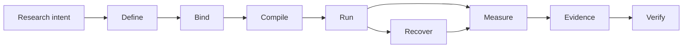

# Noetrium Research OS


<!-- readme-nav:start -->
<p align="center">
  <strong>English</strong> ·
  <a href="README.zh-CN.md">简体中文</a> ·
  <a href="README.zh-TW.md">繁體中文</a> ·
  <a href="README.ja.md">日本語</a> ·
  <a href="README.ko.md">한국어</a> ·
  <a href="README.es.md">Español</a> ·
  <a href="README.pt-BR.md">Português (Brasil)</a> ·
  <a href="README.fr.md">Français</a> ·
  <a href="README.de.md">Deutsch</a> ·
  <a href="README.ru.md">Русский</a>
</p>
<!-- readme-nav:end -->


<!-- readme-locale:en -->

<!-- readme-source-sha256:a9bd4d748e873475c1d79c09b05377525fa7c2a703c5cffe85a797db33d64c6a -->

<p align="center">
  <strong>Research infrastructure for attributable, recoverable, evidence-preserving AI-agent experiments.</strong><br>
  Compose research programs at the top. Keep one authority for every truth underneath.
</p>

<p align="center">
  <a href="#quick-start">Quick Start</a> ·
  <a href="examples/README.md">Example</a> ·
  <a href="docs/architecture/PLATFORM_ARCHITECTURE.md">Architecture</a> ·
  <a href="docs/INDEX.md">Docs</a> ·
  <a href="#verification">Verification</a>
</p>

<p align="center">
  <a href="https://www.python.org/">=3.11" src="https://img.shields.io/badge/Python-%3E%3D3.11-3776AB?logo=python&logoColor=white"></a>
  <a href="pyproject.toml"></a>
  <a href="docs/architecture/PLATFORM_ARCHITECTURE.md"></a>
  <a href="LICENSE"></a>
</p>

<!-- readme-section:overview -->

## Overview

Noetrium is a <strong>Research Operating System for AI-agent research</strong>. It is not another agent loop, workflow DSL, benchmark harness, or provider SDK. Its job is to make large research programs composable while keeping execution truth, scientific identity, effects, artifacts, resources, and evidence under explicit owners.

The end-state model is intentionally simple:

> <strong>Research OS composes research. Research Programs describe scientific semantics. MachineExecutor + Machine Journal accept scientific execution truth. Each domain system owns one authority. Platform kernel primitives are shared once. Composition wires systems together but never creates a second truth.</strong>

That model is designed for the point where a research repository stops being one script and becomes a matrix of papers, methods, benchmarks, environments, models, trials, resources, interruptions, retries, revisions, and publication evidence.

Noetrium separates five concerns that are often collapsed into one framework:

| Concern | Noetrium boundary |
| --- | --- |
| Research authoring | <code>noetrium.api</code>, Research OS, portfolios, graphs, studies, programs and explicit bindings |
| Scientific execution | Program interpreters propose work; <code>MachineExecutor</code> accepts transitions into the Machine Journal |
| Domain truth | Experimentation, resource, artifact, data, model, participant, environment and other authorities own their own facts |
| Reusable mechanisms | canonical identity, content addressing, durability, CAS/fencing, leases, checkpoints and other platform primitives |
| Observation | telemetry, diagnostics, projections and forensics observe authority; they do not replace it |

The dependency direction is one-way:

<strong>research intent -> explicit composition -> frozen identity -> admitted execution -> authoritative transition/effect/evidence -> recovery, replay, inspection and verification.</strong>

Noetrium owns the reusable research substrate: canonical identities, revision/binding truth, durable machine transitions, recovery boundaries, resource admission, effect certainty, artifacts, evidence, provenance, observability and governance. Downstream projects own the scientific novelty: methods, prompts, benchmark semantics, task policies, experiment hypotheses, statistical interpretation and claims.

A downstream paper should normally change a <code>MethodProgram</code>, <code>ResearchProgram</code>, rule set, policy, sub-IR, operation handler or provider binding — <strong>not the Noetrium kernel</strong>.

<!-- readme-section:why -->

## Why Noetrium?

Agent research becomes difficult to trust when orchestration, scientific semantics, provider mechanics and persistence are implemented as one opaque loop. The common failure modes are structural: two runners both believe they own progress, a retry silently repeats an uncertain external effect, a checkpoint diverges from execution history, a scheduler becomes scientific truth, or an updated provider changes a supposedly identical experiment.

Noetrium addresses those failures by making authority explicit and machine-verifiable.

### Where Noetrium fits

| Project | Primary focus | Noetrium adds |
| --- | --- | --- |
| [LangGraph](https://github.com/langchain-ai/langgraph) | Long-running stateful agent orchestration | Research identity, evidence, recovery, and governance around execution |
| [AutoGen](https://github.com/microsoft/autogen) | Multi-agent applications | Experiment protocol, reproducibility, and release evidence |
| [CrewAI](https://github.com/crewAIInc/crewAI) | Agent teams and event flows | Scientific run identity, lineage, and fail-closed recovery |
| [OpenHands](https://github.com/All-Hands-AI/OpenHands) | AI-driven software development | General research infrastructure across agents, models, and environments |
| <strong>Noetrium</strong> | Reproducible AI-agent research infrastructure | The research-systems layer itself |

Existing orchestration frameworks can be used inside a downstream method or provider when that is scientifically appropriate. Noetrium does not need to replace them. It supplies the surrounding research identity, execution authority, resource/effect discipline, recovery and evidence closure that remain stable when the orchestration implementation changes.

<!-- readme-section:capabilities -->

## Core capabilities

- <strong>One public authoring surface</strong> — downstream code enters through <code>noetrium.api</code>; lower packages remain implementation and composition authorities rather than accidental extension APIs.
- <strong>Research OS composition</strong> — portfolios, research graphs, revisions, experiments, research runs and machine targets can be authored and controlled from one product-level surface without moving lower-domain truth upward.
- <strong>Universal research programming</strong> — Method uses <code>MethodProgram</code> + UMM; Runtime, Participant, Environment, Memory, Evaluation, Optimization, Experiment and Research Run converge on the shared <code>ResearchProgram</code> host/interpreter substrate.
- <strong>Nested Machines</strong> — one research computation can invoke another through explicit child-machine linkage instead of paper-local runners or hidden callback stacks.
- <strong>Single scientific execution truth</strong> — accepted Machine transitions are committed by <code>MachineExecutor</code> into the Machine Journal. Checkpoints and snapshots accelerate recovery; they are not parallel histories.
- <strong>Durable interruption and recovery</strong> — pause, resume, retry, reconcile and revision-aware continuation operate against accepted cuts and frozen identities rather than arbitrary in-memory state.
- <strong>Explicit effect certainty</strong> — effect intents, receipts and reconciliation keep <code>UNKNOWN</code> as a real state; transport success or timeout is never silently promoted into scientific certainty.
- <strong>Resource authority</strong> — admission, capacity, placement, lease/fencing and execution-resource ownership are centralized instead of recreated by graph, experiment or provider code.
- <strong>Artifact, data and provenance closure</strong> — immutable content identity, references, lineage, datasets, durable facts, metrics and evidence remain attributable to exact program/run/revision identities.
- <strong>Provider-neutral environments</strong> — Web, GUI, Software, Text World, Minecraft and embodied integrations are providers under the generic Environment authority rather than new top-level truth systems.
- <strong>Governed architecture</strong> — topology, concrete-boundary, compatibility, degradation, execution-resource, durable-execution and scale-readiness gates reject shadow implementations and authority leaks.
- <strong>Large-scale research scheduling</strong> — dependency-aware ResearchGraph execution, resource admission and isolated node attempts support many papers, methods and experiments without turning physical scheduling into paper semantics.

<!-- noetrium-interface-catalog:start -->
### Public interface catalog

Noetrium exposes one high-level Research OS API. Registered lower systems remain internal composition authorities and are listed here only as architecture metadata.

- 31 registered system surfaces; 1 public API modules; 142 public symbols.
- Full machine-readable catalog: noetrium/contracts/downstream_capability_catalog.json
- Full human-readable catalog: docs/architecture/DOWNSTREAM_CAPABILITY_CATALOG.md
- Import rule: downstream code uses only noetrium.api; lower system facades are internal registry material.

| Capability domain | Registered surfaces |
| --- | ---: |
| artifact | 1 |
| data | 3 |
| environment | 6 |
| execution | 2 |
| experimentation | 1 |
| governance | 3 |
| model | 1 |
| observability | 2 |
| operator | 1 |
| participant | 1 |
| platform | 1 |
| portfolio | 1 |
| reliability | 3 |
| research_os | 1 |
| resource | 2 |
| runtime | 1 |
| scope | 1 |

Author and control research through the same top-level API:

    from noetrium import api
    program = api.ResearchProgramBuilder("paper")
    research_os = api.ResearchOS(port)

After changing a registry descriptor or public API export, run python scripts/update_generated_docs.py; CI fails on generated-surface or README drift.
<!-- noetrium-interface-catalog:end -->

The catalog is an API map, not an authority registry that downstream code is expected to edit. A system surface declares what it owns, what it must not own, what it requires, what it provides, and which public facade exposes it. The generated facade is the downstream seam; internal implementation packages may be reorganized without turning implementation paths into accidental public contracts.

The catalog also makes the platform composable at the level of responsibility. A capability is added to its owning system, bound through a narrow port, and then exposed through the generated surface. This prevents the same durable fact, provider authority, or effect lifecycle from being reimplemented in several layers merely because different callers need different views.

<!-- readme-section:architecture -->

## Architecture

The shortest mental model is an evidence-preserving research pipeline:


```mermaid
flowchart LR
    A["Research intent"] --> B["Define"]
    B --> C["Bind"]
    C --> D["Compile"]
    D --> E["Run"]
    E --> F["Recover"]
    E --> G["Measure"]
    F --> G
    G --> H["Evidence"]
    H --> I["Verify"]
```

The current end-state hierarchy is:

<pre>
noetrium.api
    │
    ▼
Research OS
Product / Authoring Surface
    │
    ├── ResearchPortfolio
    ├── ResearchGraph + Revision / Control
    └── Experimentation / Research Run
                │
                ▼
        Research Program Layer
                │
      ┌─────────┴──────────────────────────────┐
      │                                        │
MethodProgram + UMM              ResearchProgram family
                                 Runtime / Participant /
                                 Environment / Memory /
                                 Evaluation / Optimization /
                                 Experiment / Research Run
      │                                        │
      └────────────────────┬───────────────────┘
                           ▼
                    MachineExecutor
                           │
                           ▼
                    Machine Journal
              scientific execution truth
                           │
          ┌────────────────┼────────────────┐
          ▼                ▼                ▼
      Operation          Effect       Artifact / Data /
      authority        authority      Evidence authorities
          └────────────────┬────────────────┘
                           ▼
              providers / infrastructure
          model / environment / resource /
          compute / lifecycle / storage
</pre>

### Authority model

Noetrium is <strong>authority-shaped</strong>, not directory-shaped. A package is an authority only when it accepts truth, owns irreducible mutable state, performs fenced/CAS mutation, owns scientific identity/equivalence, owns external-effect certainty, or owns an immutable binding/source cut. Schemas, projections, provider adapters, codecs, query services, CLIs and convenience wrappers do not become authorities merely because they have stateful Python objects.

| Layer | Owns | Must not become |
| --- | --- | --- |
| Research OS | top-level composition, portfolio/graph authoring and control | a duplicate domain authority |
| Experimentation | Study / Experiment / Run scientific hierarchy | a second Machine execution history |
| Research Programs | paper-programmable scientific semantics | independent persistence engines |
| MachineExecutor + Machine Journal | accepted scientific transition history | paper-specific semantics |
| Domain authorities | their canonical facts and bindings | hidden cross-domain coordinators |
| Platform kernel | shared irreducible mechanisms | domain business truth |
| Composition | wiring and provider selection | durable state owner |
| Observability / forensics | projections, diagnostics and evidence materialization | command authority |

### Programmable Machine family

| Domain | Canonical program model |
| --- | --- |
| Method | <code>MethodProgram</code> + Universal Method Machine |
| Runtime | <code>ResearchProgram</code> with composable Runtime modules/sub-IR |
| Participant | <code>ResearchProgram</code> |
| Environment | <code>ResearchProgram</code> |
| Memory | <code>ResearchProgram</code> |
| Evaluation | <code>ResearchProgram</code> |
| Optimization | <code>ResearchProgram</code> |
| Experiment | <code>ResearchProgram</code> |
| Research Run | <code>ResearchProgram</code> |

A new paper-variable concern should first be represented as a Program, module, rule set, pure sub-IR, policy or injected operation handler. A new Machine domain is justified only when it needs independent durable scientific identity and transition history.

### Canonical execution path

<strong>Program -> interpreter / host -> command or proposal -> MachineExecutor -> Machine Journal -> evidence / artifact / effect references.</strong>

UMM remains the method interpreter; it is not a second durability authority. A model call, environment action, tool call, optimization step or experiment decision becomes authoritative only when the owning transition/effect/evidence boundary accepts it.

### One owner per mechanism

Shared primitives such as SQLite durability, content addressing, CAS/fencing, concurrency pools, leases, timers/heartbeats and checkpoints are centralized. Domain systems consume the primitive; they do not grow private copies because their call site is different.

Semantic scheduling and physical scheduling remain separate: Runtime may define paper-variable logical order, barriers or quorum semantics; resource and execution infrastructure own physical admission, worker capacity, leases and placement.

### One execution lifecycle

1. <strong>Define</strong> — express study, program, provider, resource and evidence intent.
2. <strong>Compose</strong> — bind capabilities and scopes explicitly.
3. <strong>Compile</strong> — freeze program, schema, implementation and configuration identity.
4. <strong>Admit</strong> — validate revision, resources, leases, scope and execution preconditions.
5. <strong>Execute</strong> — interpreters and providers propose typed work.
6. <strong>Commit</strong> — owning authorities accept transition/effect/artifact/evidence facts.
7. <strong>Recover / reconcile</strong> — resume from validated cuts and resolve uncertainty with evidence.
8. <strong>Inspect / verify</strong> — rebuild projections and verify exact-revision evidence closure.

A cache, log, checkpoint, telemetry stream, worker-local state or provider database may accelerate execution, but none can silently become the second source of scientific truth.

<code>noetrium_platform/foundation/governance/system_registry/catalog.json</code>

<!-- readme-section:downstream -->

## Platform vs. downstream projects

This repository is an independent upstream platform package. A downstream project should be able to replace its method, task suite, experiment matrix, providers, or deployment policy without editing platform internals.

```text
noetrium
        │
        ├── install as a dependency, or
        └── fork as a platform baseline
                 │
                 ▼
       downstream research repository
       ├── project-specific method
       ├── experiment composition
       ├── task/environment bindings
       └── project evidence and results
```

| You are changing... | Implement downstream... | Reuse from Noetrium... |
| --- | --- | --- |
| Research method | policy, method host, tools, memory, and prompts | reference components and lifecycle contracts |
| Task or benchmark | task suite, dataset adapter, metrics, and scientific protocol | study/run identity, execution ports, artifacts, and evidence |
| Provider or integration | typed model, environment, resource, process, or server provider | port contracts, composition, readiness, and recovery semantics |
| Multi-agent behavior | topology, node policy, message delivery, and coordination rules | orchestration primitives and run authority |

Use `noetrium.api` as the only supported downstream project-facing surface. Contract generation, reference components, orchestration, and platform composition remain internal aggregation layers behind that entrypoint. `noetrium_platform` is the internal semantic-plane implementation namespace, not a downstream extension API. The platform must not import a downstream project to decide scientific meaning or deployment policy.

<!-- readme-section:quick-start -->

<a id="quick-start"></a>

## Quick start

The first example is deterministic and requires no API key, model endpoint, or external service. It is a platform-compilation smoke test; the public component-reuse example is shown in `examples/quickstart_agent_components.py` and documented in `examples/README.md`.

### 1. Clone and install

```bash
git clone https://github.com/Xalzeroph/noetrium.git
cd noetrium
python -m venv .venv
source .venv/bin/activate
# Windows PowerShell: .venv\Scripts\Activate.ps1
python -m pip install --upgrade pip
python -m pip install -e ".[test]"
```

### 2. Compile your first reproducible experiment plan

```bash
python examples/quickstart_experiment_plan.py
```

This example freezes a scientific protocol, binds explicit provider identities, compiles an immutable plan, and verifies its digest. It demonstrates the compilation seam; a downstream method can keep its own policy and use the same run/study contracts.

```text
study=noetrium-quickstart
variants=control,treatment
repetitions=3
protocol_digest=<sha256>
plan_digest=<sha256>
plan_consistent=true
```

### 3. Verify the checkout

```bash
noetrium-architecture-gate
python scripts/check_readme_i18n.py
```

Downstream code imports stable contracts and reusable components from `noetrium`; do not treat `noetrium_platform` as a project extension API. For an author-first project scaffold, use `noetrium project create <project-id>`, then run `noetrium project doctor --project <destination>` and `noetrium project test --project <destination>` before adding project-owned providers or methods.

<!-- readme-section:containers -->

## Container workflow

Noetrium treats execution environments as a revisioned fleet, not as one mutable container per paper. The host contract is Docker + Compose; host Python is not required.

```bash
./deploy/build-environments.sh validate
./deploy/build-environments.sh list
./deploy/build-environments.sh build
```

The environment registry is `deploy/environments/catalog.json`. It is dynamic: the builder does not contain a fixed list of environment names. Every category has an active default profile revision, while draining and retired revisions remain available for already-pinned execution or explicit historical recovery.

The sharing rule is strict:

> **Share immutable content; isolate every mutable execution state.**

Noetrium therefore reuses the qualified base image, environment image layers and content-addressed assets across papers, while each execution gets a private workspace, temporary/runtime state, secrets, process/network namespace, ports, browser/world/application state and other writable overlays. A warm environment may be reused only after its overlay is destroyed or a provider emits an explicit cleanliness proof; uncertain instances are destroyed rather than recycled.

```text
host substrate
  -> evidence-bound Noetrium base
  -> reusable environment capability profile
  -> immutable content-addressed workload assets
  -> private per-execution writable overlay
  -> immutable artifacts / evidence / Machine Journal
```

Environment identity is pinned at runtime as `profile_id + profile_revision`, separate from the stable category such as `web`, `minecraft`, `gui`, `embodied`, `software` or `text_world`. This allows a new profile revision to become active without changing or contaminating executions that started on an older revision.

Retirement is logical deletion: new work stops binding the revision, but historical identity is retained. Physical image/cache garbage collection is only safe after there are no active or resumable references and no retained evidence depends on the revision.

Profile-specific readiness checks are image-local hooks rather than a central switch statement. A new environment category can therefore be added with a registry row, image recipe, optional Compose overlay and doctor hook without editing central deployment code.

[Environment profile registry](deploy/environments/README.md)

### Bundled Minecraft provider

Minecraft is a first-party reusable environment capability profile. Java, Node and Mineflayer prerequisites are shared; benchmark worlds, task suites, paper methods and writable world state stay downstream or per execution.

```bash
./deploy/build-environments.sh build --profiles minecraft
```

[Minecraft infrastructure](docs/infrastructure/minecraft/README.md)

<!-- readme-section:repository-layout -->

## Repository layout

| Path | Responsibility |
| --- | --- |
| `noetrium/` | Public facade, contracts, reference single-agent components, and multi-agent orchestration |
| `noetrium_platform/` | Internal semantic-plane implementation, providers, and governance tooling; not a downstream extension API |
| `configs/` | Versioned configuration examples and non-secret templates |
| `deploy/` | Container image, Compose runtime, and deployment bootstrap assets |
| `docs/` | Architecture, infrastructure, governance, status, and history |
| `scripts/` | Thin operator, audit, release, and maintenance entry points |
| `tests/` | Hierarchical regression and contract tests |
| `noetrium_platform/capabilities/environment/minecraft/` | Bundled reusable Minecraft environment provider |
| `LICENSE` / `NOTICE` / `THIRD_PARTY_NOTICES.md` | Apache-2.0 and third-party license notices |

Treat `noetrium/` as the supported downstream package boundary. Project-specific code stays downstream, and internal implementation details under `noetrium_platform/` may change behind the public contracts.

<!-- readme-section:testing -->

<a id="verification"></a>

## Testing and verification

Run the repository regression suite and governance gates on the exact revision being evaluated.

```bash
python -m pytest -q
python scripts/architecture_gate.py
python scripts/public_contract_audit.py
python scripts/no_degradation_audit.py
python scripts/check_readme_i18n.py
```

For focused checks, the installed console scripts include `noetrium-repository-boundary`, `noetrium-concurrency`, and `noetrium-performance`; use `python scripts/verify_release_evidence.py` to validate the source, manifest, evidence, and authority bindings for a release.

A historical green result does not prove the current tree. Re-run the gates that matter for the exact revision you intend to publish or deploy.

The repository uses a hierarchical test taxonomy so every test belongs to an explicit contract level and release evidence can prove what was actually exercised. See `tests/TEST_SYSTEM.json`.

<!-- readme-section:principles -->

## Design principles

1. <strong>One truth, one authority.</strong>
2. <strong>One mechanism, one canonical implementation.</strong>
3. <strong>Composition is wiring, not ownership.</strong>
4. <strong>Programs own paper-variable scientific semantics.</strong>
5. <strong>Machine Journal is scientific execution truth.</strong>
6. <strong>Effects are evidence-bearing; UNKNOWN remains unknown.</strong>
7. <strong>Physical scheduling is infrastructure, not paper semantics.</strong>
8. <strong>Observation is not authority.</strong>
9. <strong>Fail closed on ambiguity, stale identity and unsafe recovery.</strong>
10. <strong>No compatibility shadow path or silent downgrade.</strong>
11. <strong>Exact source/program/provider revision is part of reproducibility.</strong>
12. <strong>Downstream owns scientific novelty.</strong>
13. <strong>Architecture invariants are executable gates.</strong>
14. <strong>Performance optimization must preserve semantics.</strong>
15. <strong>Delete before adding during end-state convergence.</strong>

<!-- readme-section:extending -->

## Extending the platform

Add a capability at the smallest owning boundary. Prefer a new provider when the public contract already exists; add a new contract only when the capability itself is new.

A practical extension sequence is: select or define the public contract, implement the provider or component in the owning project, bind it explicitly during composition, record the resulting identity and evidence, then exercise recovery and reconciliation paths. This keeps a replaceable downstream method from becoming coupled to platform internals.

```text
<system>/
├── api/          public contracts and identities
├── runtime/      lifecycle and execution semantics
├── providers/    replaceable adapters owned by the system
└── composition/  provider-to-port binding
```

Avoid generic wrappers that hide unrelated algorithms, provider discovery or external effects behind one interface.

<!-- readme-section:documentation -->

## Documentation

Start with the documentation index.

### Key references

- [Documentation index](docs/INDEX.md)
- [Examples](examples/README.md)
- [Contributing](CONTRIBUTING.md)
- [Security policy](SECURITY.md)
- [Support](SUPPORT.md)
- [Citation metadata](CITATION.cff)
- [Code of Conduct](CODE_OF_CONDUCT.md)
- [Platform architecture](docs/architecture/PLATFORM_ARCHITECTURE.md)
- [Detailed system map](docs/architecture/VNEXT_DETAILED_SYSTEM_MAP.md)
- [Architecture migration contract](docs/architecture/FINAL_ARCHITECTURE_MIGRATION_CONTRACT.md)
- [Infrastructure documentation](docs/infrastructure/README.md)
- [Governance documentation](docs/governance/README.md)
- [Current status](docs/status/README.md)
- [Engineering history](docs/history/README.md)

Architecture documents define reusable ownership and contracts; status documents describe the current development tree; history preserves evidence for the state that existed when it was written. For implementation orientation, read `docs/architecture/COMPONENT_LAYERS.md` for the public component tiers and `docs/product/PUBLIC_FACADE_AND_CLI.md` for project authoring, doctor, and test flows.

<!-- readme-section:security -->

## Security and configuration

Noetrium treats identity, credentials, provider effects and evidence as part of the execution boundary rather than incidental application configuration.

- Never commit passwords, private keys, access tokens, runtime secrets or machine-local credentials.
- Keep host-specific paths and secrets in ignored local profiles or environment-bound stores.
- Prefer explicit provider bindings and scoped credentials over ambient global discovery.
- Keep external-effect commands typed, bounded, journaled and attributable to an operation identity.
- Preserve idempotency, receipt and reconciliation information for effectful operations.
- Treat logs, artifacts, traces, prompts and evidence as potentially sensitive research data.
- Fail closed when a credential, provider qualification, revision or authority binding cannot be proven.

<!-- readme-section:contributing -->

## Contributing

Changes should be reviewable by ownership boundary and include the tests and documentation needed to prove them.

### Before opening a pull request

```bash
python -m pytest -q
python scripts/architecture_gate.py
python scripts/check_readme_i18n.py
```

- preserve system ownership and public-contract boundaries
- add or update focused regression coverage
- update owning documentation in the same change set
- avoid unrelated refactors in the same commit
- preserve fail-closed behavior for uncertain external effects
- document intentional semantic or compatibility changes explicitly

[Documentation Change Policy](docs/governance/DOCUMENTATION_CHANGE_POLICY.md)

<!-- readme-section:license -->

## License

Noetrium is licensed under the Apache License, Version 2.0. The authoritative legal text is the root LICENSE file.

Third-party components remain governed by their own licenses; see THIRD_PARTY_NOTICES.md. Independently distributed model weights, datasets or benchmark assets may state separate terms.

[`LICENSE`](LICENSE) · [`NOTICE`](NOTICE) · [`THIRD_PARTY_NOTICES.md`](THIRD_PARTY_NOTICES.md)

<!-- readme-section:status -->

## Development status

Noetrium 0.44.0 is the current package baseline. The architecture is in <strong>end-state convergence</strong>: the top-level Research OS, programmable Machine model, canonical Machine execution path, domain authority boundaries and shared kernel mechanisms are established; active work is focused on eliminating duplicate implementations, compressing unnecessary contracts/subsystems, synchronizing generated projections with exact <code>main</code>, stress-testing failure/concurrency paths and closing release gates.

The project is no longer treating every new paper requirement as a reason to add another runner, storage path or system. The convergence rule is: <strong>merge, delete, centralize, inline, reuse, profile, benchmark, stress and gate</strong>.

Noetrium is not a hosted agent product and it does not own downstream scientific claims. Downstream projects bind their own methods, benchmarks, model choices, experiment matrices and interpretations. The platform supplies the reusable Research OS, execution/evidence substrate and authority discipline around those projects.

For production, publication or scientific claims, pin the exact source revision and re-run the relevant architecture, quality, research-core, scale-readiness and evidence gates for that revision. A historical green workflow, generated projection or release artifact proves only the source cut it names.

The current development truth is <code>docs/status/CURRENT_DEVELOPMENT_BASELINE.md</code>; exact release truth remains the release manifest/evidence generated for the revision being published.

<code>docs/status/</code> · <code>docs/history/</code>