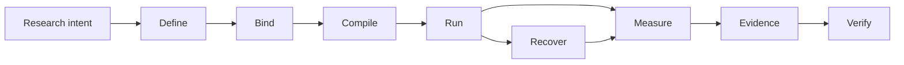

# Noetrium: Reproducible Research Infrastructure for AI Agents


<!-- readme-nav:start -->
<p align="center">
  <a href="README.md">English</a> ·
  <a href="README.zh-CN.md">简体中文</a> ·
  <a href="README.zh-TW.md">繁體中文</a> ·
  <a href="README.ja.md">日本語</a> ·
  <a href="README.ko.md">한국어</a> ·
  <a href="README.es.md">Español</a> ·
  <strong>Português (Brasil)</strong> ·
  <a href="README.fr.md">Français</a> ·
  <a href="README.de.md">Deutsch</a> ·
  <a href="README.ru.md">Русский</a>
</p>
<!-- readme-nav:end -->


<!-- readme-locale:pt-BR -->

<!-- readme-source-sha256:1b38056b542a8e9bcfaa94b4cd82fb1f14be71627f57d67b555f0446937a5690 -->

<p align="center">
  <strong>Construa agentes. Execute experimentos. Verifique resultados.</strong><br>
  Infraestrutura rigorosa para pesquisa reproduzível e orientada por evidências com agentes de IA.
</p>

<p align="center">
  <a href="#quick-start">Início rápido</a> ·
  <a href="examples/README.md">Exemplo</a> ·
  <a href="docs/architecture/PLATFORM_ARCHITECTURE.md">Arquitetura</a> ·
  <a href="docs/INDEX.md">Docs</a> ·
  <a href="#verification">Verificação</a>
</p>

<p align="center">
  <a href="https://www.python.org/">=3.11" src="https://img.shields.io/badge/Python-%3E%3D3.11-3776AB?logo=python&logoColor=white"></a>
  <a href="pyproject.toml"></a>
  <a href="docs/architecture/PLATFORM_ARCHITECTURE.md"></a>
  <a href="LICENSE"></a>
</p>

<!-- readme-section:overview -->

## Visão geral

Noetrium é infraestrutura de pesquisa para experimentos de longa duração com agentes de IA nos quais apenas executar não basta: você precisa saber exatamente o que rodou, com quais bindings, o que sobreviveu a falhas e quais evidências sustentam o resultado.

Ele cobre agentes, modelos, ambientes, experimentos, Artifacts, recuperação, observabilidade e governança sem impor semântica científica específica do projeto dentro da plataforma.

**Use Noetrium quando você precisar de:**

- identidade experimental reproduzível entre variantes, seeds, modelos e ambientes;
- recuperação que preserve effect certainty em vez de adivinhar após crashes;
- evidence e lineage ligados a identidades exatas de source/runtime;
- governance gates capazes de falhar de forma fechada antes de publicação ou release.

<!-- readme-section:why -->

## Por que Noetrium?

A maioria dos frameworks de agentes se concentra em como agentes agem ou colaboram. Noetrium se concentra em manter execuções de pesquisa atribuíveis, recuperáveis, reproduzíveis e ligadas a evidence. Ele pode ficar abaixo ou ao lado de frameworks de orquestração em vez de substituí-los.

### Onde Noetrium se encaixa

| Project | Foco principal | O que Noetrium adiciona |
| --- | --- | --- |
| [LangGraph](https://github.com/langchain-ai/langgraph) | Orquestração stateful de agentes de longa duração | Research identity, evidence, recovery e governance ao redor da execução |
| [AutoGen](https://github.com/microsoft/autogen) | Aplicações multi-agent | Experiment protocol, reproducibility e release evidence |
| [CrewAI](https://github.com/crewAIInc/crewAI) | Times de agentes e event flows | Scientific run identity, lineage e recovery fail-closed |
| [OpenHands](https://github.com/All-Hands-AI/OpenHands) | Desenvolvimento de software orientado por IA | Infraestrutura geral de pesquisa entre agentes, modelos e ambientes |
| **Noetrium** | Infraestrutura reproduzível para pesquisa com agentes de IA | A própria camada de research systems |

Noetrium é deliberadamente mais amplo que uma biblioteca de agent workflows: design experimental, identidade de modelo/ambiente, runtime effects, checkpoints, evidence e release authority são tratados como um único problema de research systems.

<!-- readme-section:capabilities -->

## Principais capacidades

- Arquitetura recursiva — ownership explícito, APIs públicas estreitas, typed ports e provider binding em composition-time.
- Infraestrutura experimental — Study, Run, Branch, Task, Variant, Workload, Checkpoint, Resume e identidades de reprodutibilidade.
- Runtime de agentes — limites de Participant, Capability, Action, Memory, Workflow e Execution sem lookup global oculto.
- Infraestrutura de modelos — catalog, revision, qualification, serving identity, request envelope e prompt binding.
- Infraestrutura de ambiente — specification, lifecycle, readiness, observation, effects, snapshots e recovery.
- Runtime de processos/servidores — supervision, sessions, toolchains, execução remota, controle de lifecycle e journals.
- Dados/Artifacts duráveis — estado com checksum, recuperação WAL, lineage, retention e evidência content-addressed.
- Confiabilidade — classificação de falhas, effect certainty, reconciliation, replay, incidents e recuperação fail-closed.
- Observabilidade — logs estruturados, events, metrics, traces, diagnostics, projections e sinais de saúde.
- Governança — gates de architecture, dependency, algorithm, concurrency, performance, forensic, release e no-degradation.

<!-- noetrium-interface-catalog:start -->
### Public interface catalog

Noetrium is a general-purpose research-systems platform for long-running agents, stateful environments, model providers, experiments, and other evidence-driven workloads. The complete downstream interface is generated from the canonical registry, so the list stays synchronized with the code.

- 172 registered system surfaces; 501 public API modules; 3697 public symbols.
- Full machine-readable catalog: noetrium/contracts/downstream_capability_catalog.json
- Full human-readable catalog: docs/architecture/DOWNSTREAM_CAPABILITY_CATALOG.md
- Import rule: use noetrium.contracts.systems.<system-slug>; do not import noetrium_platform implementation modules.

| Capability domain | Registered surfaces |
| --- | ---: |
| artifact | 7 |
| components | 1 |
| data | 8 |
| environment | 18 |
| execution | 7 |
| experimentation | 15 |
| governance | 13 |
| model | 16 |
| observability | 27 |
| operator | 8 |
| orchestration | 1 |
| participant | 8 |
| platform | 5 |
| portfolio | 5 |
| reliability | 7 |
| resource | 6 |
| runtime | 13 |
| scope | 7 |

Discover a capability in the catalog, import its generated facade, and inject its typed ports in downstream composition:

    from noetrium.contracts.systems.environment__minecraft import MinecraftBridgePort
    from noetrium.contracts.systems.participant__agent import AgentMemoryPort

After changing a registry descriptor or public API export, run python scripts/update_generated_docs.py; CI fails on generated-surface or README drift.
<!-- noetrium-interface-catalog:end -->

<!-- readme-section:architecture -->

## Arquitetura

O modelo mental mais curto é um pipeline de pesquisa que preserva evidence:



Cada transição deve preservar identity ou produzir evidence explicando por que ela mudou. Composition, Execution e Observation permanecem como authority planes separados; o runtime recebe ports estreitos injetados em vez de descobrir providers globalmente.

Cada durable state tem um único owner e efeitos externos incertos permanecem `UNKNOWN` até reconciliation provar o contrário.

`noetrium_platform/foundation/governance/system_registry/catalog.json`

<!-- readme-section:downstream -->

## Plataforma e projetos downstream

Este repositório é um pacote de plataforma reutilizável e independente. Métodos de pesquisa, task suites, composição de ambiente específica, matrizes experimentais, escolhas de modelos, inventários de deployment e interpretação científica pertencem aos projetos downstream.

```text
noetrium
        │
        ├── install as a dependency, or
        └── fork as a platform baseline
                 │
                 ▼
       downstream research repository
       ├── project-specific method
       ├── experiment composition
       ├── task/environment bindings
       └── project evidence and results
```

Código downstream consome contracts públicos da plataforma e fornece implementações próprias; a plataforma não deve importar um projeto downstream para decidir significado científico ou política de deployment.

<!-- readme-section:quick-start -->

<a id="quick-start"></a>

## Início rápido

O primeiro exemplo é determinístico e não exige API key, model endpoint ou serviço externo.

### 1. Clonar e instalar

```bash
git clone https://github.com/Xalzeroph/noetrium.git
cd noetrium
python -m venv .venv
source .venv/bin/activate
# Windows PowerShell: .venv\Scripts\Activate.ps1
python -m pip install --upgrade pip
python -m pip install -e ".[test]"
```

### 2. Compilar seu primeiro experiment plan reproduzível

```bash
python examples/quickstart_experiment_plan.py
```

O exemplo congela um scientific protocol, vincula identidades explícitas de provider, compila um immutable plan e verifica seu digest.

```text
study=noetrium-quickstart
variants=control,treatment
repetitions=3
protocol_digest=<sha256>
plan_digest=<sha256>
plan_consistent=true
```

### 3. Verificar o checkout

```bash
noetrium-architecture-gate
python scripts/check_readme_i18n.py
```

O código downstream importa contracts estáveis e componentes reutilizáveis de `noetrium`; não trate `noetrium_platform` como API de extensão do projeto. Para gerar um esqueleto de projeto author-first, use `noetrium project create <project-id> <destination> --version <version>`, execute `noetrium project doctor --project <destination>` e `noetrium project test --project <destination>`, e só então adicione seus próprios providers ou methods.

<!-- readme-section:containers -->

## Fluxo de containers

A imagem Linux reutilizável e a definição Compose ficam em `deploy/`.

```bash
cp deploy/.env.example deploy/.env
docker compose -f deploy/compose.yaml config
docker compose -f deploy/compose.yaml build
docker compose -f deploy/compose.yaml run --rm platform-runtime doctor
```

A camada de deployment separa software imutável de runtime state mutável; paths do host e secrets ficam fora do composition code versionado.

### Provider Minecraft incluído

Minecraft é um Provider de ambiente reutilizável de primeira parte. Task suites e composição científica permanecem downstream.

```bash
docker compose -f deploy/compose.yaml -f deploy/compose.minecraft.yaml build platform-runtime
docker compose -f deploy/compose.yaml -f deploy/compose.minecraft.yaml run --rm platform-runtime minecraft-doctor
```

[Minecraft infrastructure](docs/infrastructure/minecraft/README.md)

<!-- readme-section:repository-layout -->

## Estrutura do repositório

| Path | Responsibility |
| --- | --- |
| `noetrium/` | Facade pública, contracts, componentes reference single-agent e orchestration multi-agent |
| `noetrium_platform/` | Implementação interna do semantic plane, providers e governance tooling; não é API de extensão downstream |
| `configs/` | Exemplos de configuração versionados e templates sem segredos |
| `deploy/` | Imagem de container, runtime Compose e bootstrap de deployment |
| `docs/` | Documentação de architecture, infrastructure, governance, status e history |
| `scripts/` | Entradas finas de operator, audit, release e manutenção |
| `tests/` | Testes hierárquicos de regressão e contratos |
| `noetrium_platform/capabilities/environment/minecraft/` | Provider reutilizável de ambiente Minecraft |
| `LICENSE` / `NOTICE` / `THIRD_PARTY_NOTICES.md` | Avisos Apache-2.0 e licenças de terceiros |

Trate `noetrium/` como o package boundary suportado para downstream. `noetrium_platform/` é um namespace de implementação interna; o código específico do projeto permanece downstream.

<!-- readme-section:testing -->

<a id="verification"></a>

## Testes e verificação

Execute regressão e governance gates sobre a exact revision avaliada.

```bash
python -m pytest -q
python scripts/architecture_gate.py
python scripts/public_contract_audit.py
python scripts/no_degradation_audit.py
python scripts/check_readme_i18n.py
```

Um resultado verde histórico não prova a árvore atual. Execute novamente os gates relevantes para a exact revision que será publicada ou implantada.

O repositório usa uma taxonomia hierárquica de testes para atribuir cada teste a um contract level explícito e permitir que release evidence prove o que foi realmente exercitado. See `tests/TEST_SYSTEM.json`.

<!-- readme-section:principles -->

## Princípios de design

1. Um owner por durable state.
2. Composition antes de execution.
3. Runtime ports estreitos.
4. Effects externos carregam evidence.
5. Recovery é identity-aware.
6. Sem silent degradation.
7. Observation não é authority.
8. Mudanças de performance preservam semântica.
9. Documentação acompanha implementação.
10. Projetos permanecem downstream.

<!-- readme-section:extending -->

## Estendendo a plataforma

Adicione capacidades no menor limite de ownership possível. Se o contract público já existe, prefira um novo provider; adicione um contract apenas quando a capacidade em si for nova.

```text
<system>/
├── api/          public contracts and identities
├── runtime/      lifecycle and execution semantics
├── providers/    replaceable adapters owned by the system
└── composition/  provider-to-port binding
```

Evite wrappers genéricos que escondam algoritmos não relacionados, provider discovery ou effects externos atrás de uma única interface.

<!-- readme-section:documentation -->

## Documentação

Comece pelo índice de documentação.

### Referências principais

- [Documentation index](docs/INDEX.md)
- [Examples](examples/README.md)
- [Contributing](CONTRIBUTING.md)
- [Security policy](SECURITY.md)
- [Support](SUPPORT.md)
- [Citation metadata](CITATION.cff)
- [Code of Conduct](CODE_OF_CONDUCT.md)
- [Platform architecture](docs/architecture/PLATFORM_ARCHITECTURE.md)
- [Detailed system map](docs/architecture/VNEXT_DETAILED_SYSTEM_MAP.md)
- [Architecture migration contract](docs/architecture/FINAL_ARCHITECTURE_MIGRATION_CONTRACT.md)
- [Infrastructure documentation](docs/infrastructure/README.md)
- [Governance documentation](docs/governance/README.md)
- [Current status](docs/status/README.md)
- [Engineering history](docs/history/README.md)

Documentos de architecture definem ownership e contracts reutilizáveis; documentos de status descrevem a árvore atual; history preserva evidência do estado existente quando foi escrito.

<!-- readme-section:security -->

## Segurança e configuração

- Nunca faça commit de senhas, chaves privadas, tokens, runtime secrets ou credenciais locais.
- Mantenha paths específicos do host e secrets em profiles locais ignorados ou stores ligados ao ambiente.
- Prefira autenticação não assistida baseada em key/agent para automação remota.
- Comandos com effects externos devem ser typed, bounded, journaled e atribuídos a uma operation identity.
- Trate logs e evidence como dados operacionais potencialmente sensíveis.

<!-- readme-section:contributing -->

## Contribuindo

Mudanças devem ser revisáveis por ownership boundary e incluir tests e documentação suficientes para prová-las.

### Antes de abrir um Pull Request

```bash
python -m pytest -q
python scripts/architecture_gate.py
python scripts/check_readme_i18n.py
```

- preservar system ownership e public-contract boundaries
- adicionar ou atualizar cobertura de regressão focada
- atualizar documentação do owner no mesmo change set
- evitar refactors não relacionados no mesmo commit
- preservar fail-closed para effects externos incertos
- documentar explicitamente mudanças intencionais de semântica ou compatibilidade

[Documentation Change Policy](docs/governance/DOCUMENTATION_CHANGE_POLICY.md)

<!-- readme-section:license -->

## Licença

Noetrium é licenciado sob Apache License 2.0. O texto legal autoritativo é o arquivo LICENSE na raiz.

Componentes de terceiros continuam sob suas próprias licenças; consulte THIRD_PARTY_NOTICES.md. Pesos de modelos, datasets ou assets de benchmark distribuídos separadamente podem declarar termos próprios.

[`LICENSE`](LICENSE) · [`NOTICE`](NOTICE) · [`THIRD_PARTY_NOTICES.md`](THIRD_PARTY_NOTICES.md)

<!-- readme-section:status -->

## Status de desenvolvimento

A plataforma permanece em desenvolvimento ativo de arquitetura e runtime.

Para produção, publicação ou afirmações científicas, execute novamente os gates relevantes e examine release evidence vinculada à exact source revision em vez de confiar em um resultado verde histórico.

Mudanças históricas são mantidas intencionalmente fora deste README; use `docs/history/` para registros imutáveis de engenharia.

A fonte vigente do estado de desenvolvimento é `docs/status/CURRENT_DEVELOPMENT_BASELINE.md`; afirmações de release ou pesquisa devem estar vinculadas às evidências da revisão exata avaliada.

`docs/status/` · `docs/history/`
