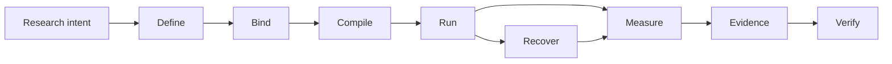

# Noetrium: Reproducible Research Infrastructure for AI Agents


<!-- readme-nav:start -->
<p align="center">
  <a href="README.md">English</a> ·
  <a href="README.zh-CN.md">简体中文</a> ·
  <a href="README.zh-TW.md">繁體中文</a> ·
  <a href="README.ja.md">日本語</a> ·
  <a href="README.ko.md">한국어</a> ·
  <a href="README.es.md">Español</a> ·
  <a href="README.pt-BR.md">Português (Brasil)</a> ·
  <a href="README.fr.md">Français</a> ·
  <a href="README.de.md">Deutsch</a> ·
  <strong>Русский</strong>
</p>
<!-- readme-nav:end -->


<!-- readme-locale:ru -->

<!-- readme-source-sha256:7895125ec5943a26b48eafc3377b00164904e55cfdb64bfa9eae799254b4a8a5 -->

<p align="center">
  <strong>Создавайте агентов. Запускайте эксперименты. Проверяйте результаты.</strong><br>
  Строгая системная инфраструктура для воспроизводимых исследований AI-агентов, основанных на доказательствах.
</p>

<p align="center">
  <a href="#quick-start">Быстрый старт</a> ·
  <a href="examples/README.md">Пример</a> ·
  <a href="docs/architecture/PLATFORM_ARCHITECTURE.md">Архитектура</a> ·
  <a href="docs/INDEX.md">Документация</a> ·
  <a href="#verification">Проверка</a>
</p>

<p align="center">
  <a href="https://www.python.org/">=3.11" src="https://img.shields.io/badge/Python-%3E%3D3.11-3776AB?logo=python&logoColor=white"></a>
  <a href="pyproject.toml"></a>
  <a href="docs/architecture/PLATFORM_ARCHITECTURE.md"></a>
  <a href="LICENSE"></a>
</p>

<!-- readme-section:overview -->

## Обзор

Noetrium — исследовательская инфраструктура для долгоживущих экспериментов с AI-агентами, где недостаточно просто выполнить задачу: нужно точно знать, что запускалось, с какими bindings, что сохранилось после сбоя и какие evidence подтверждают результат.

Она охватывает агентов, модели, среды, эксперименты, Artifacts, recovery, observability и governance, не встраивая проектно-специфическую научную семантику в саму платформу.

**Noetrium особенно полезен, когда нужны:**

- воспроизводимая experiment identity для variants, seeds, моделей и сред;
- recovery, сохраняющий effect certainty вместо догадок после crash;
- evidence и lineage, связанные с точными source/runtime identities;
- governance gates, способные fail-closed до публикации или release.

<!-- readme-section:why -->

## Почему Noetrium?

Большинство agent frameworks сосредоточены на том, как агенты действуют или взаимодействуют. Noetrium сосредоточен на том, чтобы исследовательские запуски оставались атрибутируемыми, восстанавливаемыми, воспроизводимыми и связанными с evidence. Он может работать под или рядом с orchestration frameworks, а не заменять их.

### Место Noetrium в экосистеме

| Project | Основной фокус | Что добавляет Noetrium |
| --- | --- | --- |
| [LangGraph](https://github.com/langchain-ai/langgraph) | Долгоживущая stateful orchestration агентов | Research identity, evidence, recovery и governance вокруг исполнения |
| [AutoGen](https://github.com/microsoft/autogen) | Multi-agent приложения | Experiment protocol, reproducibility и release evidence |
| [CrewAI](https://github.com/crewAIInc/crewAI) | Команды агентов и event flows | Scientific run identity, lineage и fail-closed recovery |
| [OpenHands](https://github.com/All-Hands-AI/OpenHands) | AI-ориентированная разработка ПО | Общая исследовательская инфраструктура для агентов, моделей и сред |
| **Noetrium** | Воспроизводимая инфраструктура исследований AI-агентов | Сам research-systems layer |

Noetrium намеренно шире библиотеки agent workflows: design эксперимента, identity моделей/сред, runtime effects, checkpoints, evidence и release authority рассматриваются как единая research-systems задача.

<!-- readme-section:capabilities -->

## Основные возможности

- Рекурсивная архитектура — явный ownership, узкие публичные API, typed ports и composition-time provider binding.
- Экспериментальная инфраструктура — Study, Run, Branch, Task, Variant, Workload, Checkpoint, Resume и identities воспроизводимости.
- Agent runtime — границы Participant, Capability, Action, Memory, Workflow и Execution без скрытого global lookup.
- Инфраструктура моделей — catalog, revision, qualification, serving identity, request envelope и prompt binding.
- Инфраструктура окружений — specification, lifecycle, readiness, observation, effects, snapshots и recovery.
- Runtime процессов/серверов — supervision, sessions, toolchains, удалённое выполнение, lifecycle control и journals.
- Долговечные данные/Artifacts — checksummed state, WAL recovery, lineage, retention и content-addressed evidence.
- Надёжность — классификация отказов, effect certainty, reconciliation, replay, incidents и fail-closed recovery.
- Наблюдаемость — структурированные logs, events, metrics, traces, diagnostics, projections и health signals.
- Governance — gates для architecture, dependency, algorithm, concurrency, performance, forensic, release и no-degradation.

<!-- noetrium-interface-catalog:start -->
### Public interface catalog

Noetrium is a general-purpose research-systems platform for long-running agents, stateful environments, model providers, experiments, and other evidence-driven workloads. The complete downstream interface is generated from the canonical registry, so the list stays synchronized with the code.

- 172 registered system surfaces; 503 public API modules; 3732 public symbols.
- Full machine-readable catalog: noetrium/contracts/downstream_capability_catalog.json
- Full human-readable catalog: docs/architecture/DOWNSTREAM_CAPABILITY_CATALOG.md
- Import rule: use noetrium.contracts.systems.<system-slug>; do not import noetrium_platform implementation modules.

| Capability domain | Registered surfaces |
| --- | ---: |
| artifact | 7 |
| components | 1 |
| data | 8 |
| environment | 18 |
| execution | 7 |
| experimentation | 15 |
| governance | 13 |
| model | 16 |
| observability | 27 |
| operator | 8 |
| orchestration | 1 |
| participant | 8 |
| platform | 5 |
| portfolio | 5 |
| reliability | 7 |
| resource | 6 |
| runtime | 13 |
| scope | 7 |

Discover a capability in the catalog, import its generated facade, and inject its typed ports in downstream composition:

    from noetrium.contracts.systems.environment__minecraft import MinecraftBridgePort
    from noetrium.contracts.systems.participant__agent import AgentMemoryPort

After changing a registry descriptor or public API export, run python scripts/update_generated_docs.py; CI fails on generated-surface or README drift.
<!-- noetrium-interface-catalog:end -->

<!-- readme-section:architecture -->

## Архитектура

Самая короткая mental model — исследовательский pipeline, сохраняющий evidence:



Каждый переход должен сохранять identity либо создавать evidence, объясняющие её изменение. Composition, Execution и Observation остаются отдельными authority planes; runtime получает узкие injected ports вместо глобального поиска providers.

У каждого durable state один owner, а неопределённые внешние effects остаются `UNKNOWN`, пока reconciliation не докажет обратное.

`noetrium_platform/foundation/governance/system_registry/catalog.json`

<!-- readme-section:downstream -->

## Платформа и downstream-проекты

Этот репозиторий является независимо используемым пакетом платформы. Методы исследования, task suites, проектная композиция окружения, экспериментальные матрицы, выбор моделей, deployment inventories и научная интерпретация принадлежат downstream-проектам.

```text
noetrium
        │
        ├── install as a dependency, or
        └── fork as a platform baseline
                 │
                 ▼
       downstream research repository
       ├── project-specific method
       ├── experiment composition
       ├── task/environment bindings
       └── project evidence and results
```

Downstream-код использует публичные platform contracts и предоставляет собственные реализации; платформа не должна импортировать downstream-проект, чтобы определять научный смысл или deployment policy.

<!-- readme-section:quick-start -->

<a id="quick-start"></a>

## Быстрый старт

Первый пример детерминирован и не требует API key, model endpoint или внешнего сервиса.

### 1. Клонирование и установка

```bash
git clone https://github.com/Xalzeroph/noetrium.git
cd noetrium
python -m venv .venv
source .venv/bin/activate
# Windows PowerShell: .venv\Scripts\Activate.ps1
python -m pip install --upgrade pip
python -m pip install -e ".[test]"
```

### 2. Компиляция первого воспроизводимого experiment plan

```bash
python examples/quickstart_experiment_plan.py
```

Пример фиксирует scientific protocol, связывает явные provider identities, компилирует immutable plan и проверяет его digest.

```text
study=noetrium-quickstart
variants=control,treatment
repetitions=3
protocol_digest=<sha256>
plan_digest=<sha256>
plan_consistent=true
```

### 3. Проверка checkout

```bash
noetrium-architecture-gate
python scripts/check_readme_i18n.py
```

Downstream-код импортирует стабильные contracts и повторно используемые components из `noetrium`; не рассматривайте `noetrium_platform` как API расширения проекта. Для создания author-first каркаса проекта используйте `noetrium project create <project-id> <destination> --version <version>`, затем выполните `noetrium project doctor --project <destination>` и `noetrium project test --project <destination>`, и только после этого добавляйте собственные providers или methods.

<!-- readme-section:containers -->

## Контейнерный workflow

Повторно используемый Linux image и Compose-описание находятся в `deploy/`.

```bash
cp deploy/.env.example deploy/.env
docker compose -f deploy/compose.yaml config
docker compose -f deploy/compose.yaml build
docker compose -f deploy/compose.yaml run --rm platform-runtime doctor
```

Deployment-слой отделяет immutable software от mutable runtime state; host-specific paths и secrets не попадают в versioned composition code.

### Встроенный Minecraft Provider

Minecraft — first-party повторно используемый Environment Provider. Task suites и научная composition остаются downstream.

```bash
docker compose -f deploy/compose.yaml -f deploy/compose.minecraft.yaml build platform-runtime
docker compose -f deploy/compose.yaml -f deploy/compose.minecraft.yaml run --rm platform-runtime minecraft-doctor
```

[Minecraft infrastructure](docs/infrastructure/minecraft/README.md)

<!-- readme-section:repository-layout -->

## Структура репозитория

| Path | Responsibility |
| --- | --- |
| `noetrium/` | Публичный facade, contracts, reference single-agent components и multi-agent orchestration |
| `noetrium_platform/` | Внутренняя реализация semantic plane, providers и governance tooling; не API расширения для downstream |
| `configs/` | Версионируемые примеры конфигурации и шаблоны без секретов |
| `deploy/` | Контейнерный образ, Compose runtime и deployment bootstrap |
| `docs/` | Документация architecture, infrastructure, governance, status и history |
| `scripts/` | Тонкие operator, audit, release и maintenance entry points |
| `tests/` | Иерархические regression и contract tests |
| `noetrium_platform/capabilities/environment/minecraft/` | Повторно используемый Minecraft environment provider |
| `LICENSE` / `NOTICE` / `THIRD_PARTY_NOTICES.md` | Уведомления Apache-2.0 и лицензии третьих сторон |

Считайте `noetrium/` поддерживаемой package boundary для downstream-проектов. `noetrium_platform/` — внутренний namespace реализации; код, специфичный для проекта, остаётся downstream.

<!-- readme-section:testing -->

<a id="verification"></a>

## Тестирование и проверка

Запускайте regression suite и governance gates на оцениваемой exact revision.

```bash
python -m pytest -q
python scripts/architecture_gate.py
python scripts/public_contract_audit.py
python scripts/no_degradation_audit.py
python scripts/check_readme_i18n.py
```

Исторически зелёный результат не доказывает текущее дерево. Повторно запустите необходимые gates для exact revision, которую планируется публиковать или развёртывать.

Репозиторий использует иерархическую test taxonomy, поэтому каждый тест принадлежит явному contract level, а release evidence может доказать фактический объём проверки. See `tests/TEST_SYSTEM.json`.

<!-- readme-section:principles -->

## Принципы проектирования

1. Один owner на каждый durable state.
2. Composition до execution.
3. Узкие runtime ports.
4. Внешние effects несут evidence.
5. Recovery должен быть identity-aware.
6. Никакой silent degradation.
7. Observation не является authority.
8. Изменения performance сохраняют семантику.
9. Документация меняется вместе с реализацией.
10. Проектная специфика остаётся downstream.

<!-- readme-section:extending -->

## Расширение платформы

Добавляйте способность на минимальной owning boundary. Если публичный contract уже существует, предпочтите новый provider; добавляйте новый contract только когда сама способность действительно новая.

```text
<system>/
├── api/          public contracts and identities
├── runtime/      lifecycle and execution semantics
├── providers/    replaceable adapters owned by the system
└── composition/  provider-to-port binding
```

Не используйте универсальные wrappers, скрывающие несвязанные алгоритмы, provider discovery или внешние effects за одним интерфейсом.

<!-- readme-section:documentation -->

## Документация

Начните с индекса документации.

### Основные документы

- [Documentation index](docs/INDEX.md)
- [Examples](examples/README.md)
- [Contributing](CONTRIBUTING.md)
- [Security policy](SECURITY.md)
- [Support](SUPPORT.md)
- [Citation metadata](CITATION.cff)
- [Code of Conduct](CODE_OF_CONDUCT.md)
- [Platform architecture](docs/architecture/PLATFORM_ARCHITECTURE.md)
- [Detailed system map](docs/architecture/VNEXT_DETAILED_SYSTEM_MAP.md)
- [Architecture migration contract](docs/architecture/FINAL_ARCHITECTURE_MIGRATION_CONTRACT.md)
- [Infrastructure documentation](docs/infrastructure/README.md)
- [Governance documentation](docs/governance/README.md)
- [Current status](docs/status/README.md)
- [Engineering history](docs/history/README.md)

Architecture-документы определяют повторно используемые ownership и contracts; status-документы описывают текущее дерево разработки; history сохраняет evidence состояния на момент записи.

<!-- readme-section:security -->

## Безопасность и конфигурация

- Никогда не коммитьте пароли, private keys, access tokens, runtime secrets или локальные credentials.
- Host-specific paths и secrets храните в игнорируемых local profiles или environment-bound stores.
- Для remote automation предпочитайте unattended authentication на основе key/agent.
- Команды с внешними effects должны быть typed, bounded, journaled и связаны с operation identity.
- Считайте logs и evidence потенциально чувствительными operational data.

<!-- readme-section:contributing -->

## Участие в разработке

Изменения должны быть проверяемы по ownership boundary и включать необходимые tests и documentation.

### Перед открытием Pull Request

```bash
python -m pytest -q
python scripts/architecture_gate.py
python scripts/check_readme_i18n.py
```

- сохранять system ownership и public-contract boundaries
- добавлять или обновлять focused regression coverage
- обновлять документацию owner в том же change set
- не смешивать несвязанные refactors в одном commit
- сохранять fail-closed для неопределённых внешних effects
- явно документировать намеренные semantic или compatibility изменения

[Documentation Change Policy](docs/governance/DOCUMENTATION_CHANGE_POLICY.md)

<!-- readme-section:license -->

## Лицензия

Noetrium распространяется по Apache License 2.0. Юридически авторитетный текст находится в корневом файле LICENSE.

Сторонние компоненты остаются под своими лицензиями; см. THIRD_PARTY_NOTICES.md. Отдельно распространяемые веса моделей, datasets или benchmark assets могут иметь собственные условия.

[`LICENSE`](LICENSE) · [`NOTICE`](NOTICE) · [`THIRD_PARTY_NOTICES.md`](THIRD_PARTY_NOTICES.md)

<!-- readme-section:status -->

## Статус разработки

Платформа продолжает активную разработку архитектуры и runtime.

Для production, публикации или научных утверждений повторно запускайте соответствующие gates и проверяйте release evidence, привязанное к exact source revision, вместо того чтобы полагаться на старый зелёный результат.

Исторические изменения намеренно не включаются в этот README; неизменяемые инженерные записи находятся в `docs/history/`.

Текущее достоверное состояние разработки зафиксировано в `docs/status/CURRENT_DEVELOPMENT_BASELINE.md`; утверждения о релизе или исследованиях должны опираться на свидетельства, привязанные к точной проверяемой ревизии.

`docs/status/` · `docs/history/`
