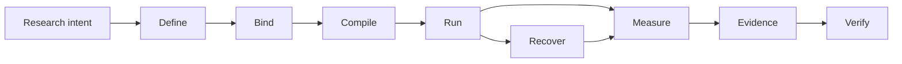

# Noetrium: Reproducible Research Infrastructure for AI Agents


<!-- readme-nav:start -->
<p align="center">
  <a href="README.md">English</a> ·
  <strong>简体中文</strong> ·
  <a href="README.zh-TW.md">繁體中文</a> ·
  <a href="README.ja.md">日本語</a> ·
  <a href="README.ko.md">한국어</a> ·
  <a href="README.es.md">Español</a> ·
  <a href="README.pt-BR.md">Português (Brasil)</a> ·
  <a href="README.fr.md">Français</a> ·
  <a href="README.de.md">Deutsch</a> ·
  <a href="README.ru.md">Русский</a>
</p>
<!-- readme-nav:end -->


<!-- readme-locale:zh-CN -->

<!-- readme-source-sha256:1b38056b542a8e9bcfaa94b4cd82fb1f14be71627f57d67b555f0446937a5690 -->

<p align="center">
  <strong>构建 Agent。运行实验。验证结果。</strong><br>
  面向可复现、证据驱动 AI Agent 研究的严谨系统基础设施。
</p>

<p align="center">
  <a href="#quick-start">快速开始</a> ·
  <a href="examples/README.md">示例</a> ·
  <a href="docs/architecture/PLATFORM_ARCHITECTURE.md">架构</a> ·
  <a href="docs/INDEX.md">文档</a> ·
  <a href="#verification">验证</a>
</p>

<p align="center">
  <a href="https://www.python.org/">=3.11" src="https://img.shields.io/badge/Python-%3E%3D3.11-3776AB?logo=python&logoColor=white"></a>
  <a href="pyproject.toml"></a>
  <a href="docs/architecture/PLATFORM_ARCHITECTURE.md"></a>
  <a href="LICENSE"></a>
</p>

<!-- readme-section:overview -->

## 项目概览

Noetrium 是一个开源的上游平台，用于构建、运行和验证长时运行的 AI Agent 研究。它为下游项目提供一组小而稳定的 typed、显式、可检查的接缝，覆盖 identity、binding、execution、effect、checkpoint、Artifact、恢复和 evidence。

它位于 Agent 方法与可支撑结论的实验之间：Noetrium 负责可复用的基础设施和 authority；下游项目负责方法、任务、scientific protocol、metric 与结论。

**Noetrium 提供：**

- 跨 study、variant、repetition、模型、环境和 source revision 的可复现实验 identity；
- 显式 contract 与可替换 provider，而不是隐藏的全局发现；
- lifecycle、effect receipt、checkpoint、resume、reconciliation、Artifact lineage 与 release evidence；
- 让 failure、unknown 和发表边界可检查的 observability 与 governance。

**下游项目提供：**

- research method、task suite、benchmark 语义、metric 与 experiment matrix；
- 项目自有的 provider binding、部署清单、credential 与科学解释；
- 适用于论文、产品或内部研究的 claims 与 evidence policy。

Noetrium 有意不包含论文特定的 cognition、下游实验代码、部署 secret 或科学结论。

<!-- readme-section:why -->

## 为什么选择 Noetrium？

多数 Agent 框架主要解决“Agent 如何行动或协作”。Noetrium 关注的是研究执行能否保持可归因、可恢复、可复现并与 evidence 绑定。它可以位于 orchestration framework 的下层或侧面，而不是把自己包装成它们的替代品。

### Noetrium 在生态中的位置

| Project | 主要关注点 | Noetrium 补充的能力 |
| --- | --- | --- |
| [LangGraph](https://github.com/langchain-ai/langgraph) | 长时、有状态 Agent orchestration | 围绕执行补上研究 identity、evidence、recovery 与 governance |
| [AutoGen](https://github.com/microsoft/autogen) | 多 Agent 应用 | 实验 protocol、reproducibility 与 release evidence |
| [CrewAI](https://github.com/crewAIInc/crewAI) | Agent team 与 event flow | 科学 run identity、lineage 与 fail-closed recovery |
| [OpenHands](https://github.com/All-Hands-AI/OpenHands) | AI 驱动的软件开发 | 跨 Agent、模型与环境的通用研究基础设施 |
| **Noetrium** | 可复现 AI Agent 研究基础设施 | Research systems layer 本身 |

Noetrium 刻意比 Agent workflow library 更宽：实验设计、模型/环境 identity、runtime effect、checkpoint、evidence 与 release authority 被视为同一个 research-systems 问题。已有的 orchestration framework 可以留在下游 method 或 provider 内部；Noetrium 提供外围的 identity、lifecycle 与 evidence 边界。

<!-- readme-section:capabilities -->

## 核心能力

- 公共 authoring surface — `noetrium.contracts` 与 `noetrium.platform` 暴露稳定的 identity、port、specification 和项目接口。
- Study 编译 — `ExperimentRunSpec`、`ResearchStudyDefinition` 与 `CompiledResearchPlan` 让实验意图在运行前明确化。
- Run authority — `ExperimentRunApplication` 负责 lifecycle 决策；checkpoint、resume、reconcile 与 evidence 路径都显式且可检查。
- 可复用 method 层 — `components` 提供 reference single-agent building blocks，`orchestration` 提供更高层的 multi-agent topology 与 delivery policy。
- Provider 接缝 — model、environment、resource、process、server 与 toolchain 通过 typed port 绑定，不依赖隐藏的全局发现。
- 持久 Artifact — `RunArtifactStore` 记录 manifest、sequence、digest、lineage、raw fact、retention 与可 replay 的 evidence。
- Effect-safe recovery — 外部 effect 携带 receipt 与 certainty；未解决的 effect 在 reconciliation 证明结果前保持 `UNKNOWN`。
- Observability 与 governance — 结构化 event、diagnostic、projection、forensic、architecture、concurrency、performance、release 与 no-degradation gate 让系统可审计。
- 长时运行环境 — 在适用时提供 world cut、branch、snapshot、checkpoint 与 resume 语义，包括内置 Minecraft integration。

<!-- noetrium-interface-catalog:start -->
### Public interface catalog

Noetrium is a general-purpose research-systems platform for long-running agents, stateful environments, model providers, experiments, and other evidence-driven workloads. The complete downstream interface is generated from the canonical registry, so the list stays synchronized with the code.

- 172 registered system surfaces; 501 public API modules; 3697 public symbols.
- Full machine-readable catalog: noetrium/contracts/downstream_capability_catalog.json
- Full human-readable catalog: docs/architecture/DOWNSTREAM_CAPABILITY_CATALOG.md
- Import rule: use noetrium.contracts.systems.<system-slug>; do not import noetrium_platform implementation modules.

| Capability domain | Registered surfaces |
| --- | ---: |
| artifact | 7 |
| components | 1 |
| data | 8 |
| environment | 18 |
| execution | 7 |
| experimentation | 15 |
| governance | 13 |
| model | 16 |
| observability | 27 |
| operator | 8 |
| orchestration | 1 |
| participant | 8 |
| platform | 5 |
| portfolio | 5 |
| reliability | 7 |
| resource | 6 |
| runtime | 13 |
| scope | 7 |

Discover a capability in the catalog, import its generated facade, and inject its typed ports in downstream composition:

    from noetrium.contracts.systems.environment__minecraft import MinecraftBridgePort
    from noetrium.contracts.systems.participant__agent import AgentMemoryPort

After changing a registry descriptor or public API export, run python scripts/update_generated_docs.py; CI fails on generated-surface or README drift.
<!-- noetrium-interface-catalog:end -->

<!-- readme-section:architecture -->

## 架构

最短的心智模型是一条保持 evidence 的研究流水线：



每个转换都必须保留 identity，或者产生能够解释 identity 为什么变化的 evidence。平台刻意拆分为三个 authority plane：

| Plane | 负责 | 不负责 |
| --- | --- | --- |
| Composition | study definition、显式 binding、provider 选择与 port wiring | durable run truth 或科学结论 |
| Runtime | lifecycle、action execution、effect receipt、checkpoint、recovery 与 generation fencing | observation projection 或科学解释 |
| Observation + evidence | event、diagnostic、Artifact manifest、sequence/digest/lineage、forensic 与 release proof | command authority 或隐藏状态变更 |

`ExperimentRunSpec` 会被编译成 immutable plan，再通过 `ExperimentRunApplication` 应用；`StudyMatrixExecutor` 通过显式的 `StudyUnitExecutionPort` implementation 调度 unit。MC 与 non-MC 路径可以绑定不同 execution port，同时保持相同的 identity 与 evidence discipline。

长时运行 provider 在适用时使用 world cut、branch、snapshot、checkpoint 与 resume 语义。每份 durable state 只有一个 owner；不确定的外部 effect 在 reconciliation 证明之前保持 `UNKNOWN`。

`noetrium_platform/foundation/governance/system_registry/catalog.json`

<!-- readme-section:downstream -->

## 平台与下游项目

本仓库是可独立复用的上游平台包。下游项目应当能够替换自己的 method、task suite、experiment matrix、provider 或部署策略，而不需要修改平台内部实现。

```text
noetrium
        │
        ├── install as a dependency, or
        └── fork as a platform baseline
                 │
                 ▼
       downstream research repository
       ├── project-specific method
       ├── experiment composition
       ├── task/environment bindings
       └── project evidence and results
```

| 你要改变的内容 | 下游负责实现 | 从 Noetrium 复用 |
| --- | --- | --- |
| Research method | policy、method host、tool、memory 与 prompt | reference component 与 lifecycle contract |
| Task 或 benchmark | task suite、dataset adapter、metric 与 scientific protocol | study/run identity、execution port、Artifact 与 evidence |
| Provider 或 integration | typed model、environment、resource、process 或 server provider | port contract、composition、readiness 与 recovery 语义 |
| Multi-agent 行为 | topology、node policy、message delivery 与 coordination rule | orchestration primitive 与 run authority |

使用 `noetrium.contracts`、`noetrium.platform`、`components` 与 `orchestration` 作为项目接口。`noetrium_platform` 是内部 semantic-plane implementation namespace，不是下游 extension API。平台不能反向 import 下游项目来决定科学语义或部署策略。

<!-- readme-section:quick-start -->

<a id="quick-start"></a>

## 快速开始

第一个示例是 deterministic 的，不需要 API key、模型 endpoint 或任何外部服务。它是平台编译流程的 smoke test；公共 component 复用示例见 `examples/quickstart_agent_components.py` 与 `examples/README.md`。

### 1. Clone 并安装

```bash
git clone https://github.com/Xalzeroph/noetrium.git
cd noetrium
python -m venv .venv
source .venv/bin/activate
# Windows PowerShell: .venv\Scripts\Activate.ps1
python -m pip install --upgrade pip
python -m pip install -e ".[test]"
```

### 2. 编译第一个可复现实验计划

```bash
python examples/quickstart_experiment_plan.py
```

示例会冻结 scientific protocol，绑定显式 provider identity，编译 immutable plan，并验证其 digest。它展示的是 compilation seam；下游 method 可以保留自己的 policy，同时复用相同的 run/study contract。

```text
study=noetrium-quickstart
variants=control,treatment
repetitions=3
protocol_digest=<sha256>
plan_digest=<sha256>
plan_consistent=true
```

### 3. 验证当前 checkout

```bash
noetrium-architecture-gate
python scripts/check_readme_i18n.py
```

下游代码从 `noetrium` 导入稳定 contract 与可复用 component；不要把 `noetrium_platform` 当作项目 extension API。若要生成 author-first 项目骨架，可使用 `noetrium project create <project-id> <destination> --version <version>`，再运行 `noetrium project doctor --project <destination>` 与 `noetrium project test --project <destination>`，然后添加项目自有 provider 或 method。

<!-- readme-section:containers -->

## 容器工作流

`deploy/` 下维护可复用 Linux 镜像与 Compose 定义。

```bash
cp deploy/.env.example deploy/.env
docker compose -f deploy/compose.yaml config
docker compose -f deploy/compose.yaml build
docker compose -f deploy/compose.yaml run --rm platform-runtime doctor
```

部署层把不可变软件与可变 runtime state 分离；主机路径和 secret 不进入已提交的 composition 代码。

### 内置 Minecraft Provider

Minecraft 是第一方可复用环境 Provider；任务集和科学组合继续留在下游。

```bash
docker compose -f deploy/compose.yaml -f deploy/compose.minecraft.yaml build platform-runtime
docker compose -f deploy/compose.yaml -f deploy/compose.minecraft.yaml run --rm platform-runtime minecraft-doctor
```

[Minecraft infrastructure](docs/infrastructure/minecraft/README.md)

<!-- readme-section:repository-layout -->

## 仓库结构

| Path | Responsibility |
| --- | --- |
| `noetrium/` | 公共 facade、contract、reference single-agent component 与 multi-agent orchestration |
| `noetrium_platform/` | 内部 semantic-plane implementation、provider 与 governance tooling；不是下游 extension API |
| `configs/` | 版本化配置示例与非机密模板 |
| `deploy/` | 容器镜像、Compose runtime 与部署引导资产 |
| `docs/` | 架构、基础设施、治理、状态与历史文档 |
| `scripts/` | 轻量 operator、audit、release 与维护入口 |
| `tests/` | 分层回归与 contract 测试 |
| `noetrium_platform/capabilities/environment/minecraft/` | 内置可复用 Minecraft 环境 Provider |
| `LICENSE` / `NOTICE` / `THIRD_PARTY_NOTICES.md` | Apache-2.0 与第三方许可说明 |

将 `noetrium/` 视为受支持的下游 package boundary。项目特定代码留在下游；`noetrium_platform/` 下的内部实现可以在公共 contract 不变的前提下演进。

<!-- readme-section:testing -->

<a id="verification"></a>

## 测试与验证

针对正在评估的 exact revision 运行仓库回归套件与治理 gate。

```bash
python -m pytest -q
python scripts/architecture_gate.py
python scripts/public_contract_audit.py
python scripts/no_degradation_audit.py
python scripts/check_readme_i18n.py
```

聚焦检查还可以使用已安装的 `noetrium-repository-boundary`、`noetrium-concurrency` 与 `noetrium-performance`；发布前使用 `python scripts/verify_release_evidence.py` 校验 source、manifest、evidence 与 authority 的绑定。

历史绿灯不能证明当前工作树。发布或部署前必须针对准备使用的 exact revision 重新运行相关 gate。

仓库使用分层测试 taxonomy，使每个测试都归属于明确 contract level，并让 release evidence 能证明实际执行了什么。详见 `tests/TEST_SYSTEM.json`。

<!-- readme-section:principles -->

## 设计原则

1. 每份 durable state 只有一个 owner。
2. 先 composition，后 execution。
3. Runtime port 必须保持窄接口。
4. 外部 effect 必须携带证据。
5. 恢复必须感知 identity。
6. 禁止静默降级。
7. Observation 不是 authority。
8. 性能优化必须保持语义。
9. 实现变化必须同步文档。
10. 科学语义与部署策略由下游项目负责。

<!-- readme-section:extending -->

## 扩展平台

在最小 owner 边界增加能力。已有公共 contract 时优先新增 provider；只有能力本身新增时才增加新 contract。

实用的扩展顺序是：选择或定义公共 contract，在 owner 项目中实现 provider 或 component，在 composition 阶段显式 binding，记录由此产生的 identity 与 evidence，最后验证 recovery 与 reconciliation 路径。这样下游 method 可以替换，而不会耦合到平台内部实现。

```text
<system>/
├── api/          public contracts and identities
├── runtime/      lifecycle and execution semantics
├── providers/    replaceable adapters owned by the system
└── composition/  provider-to-port binding
```

避免用通用 wrapper 把无关算法、provider discovery 或外部 effect 隐藏在一个接口后面。

<!-- readme-section:documentation -->

## 文档

从文档索引开始。

### 关键参考文档

- [Documentation index](docs/INDEX.md)
- [Examples](examples/README.md)
- [Contributing](CONTRIBUTING.md)
- [Security policy](SECURITY.md)
- [Support](SUPPORT.md)
- [Citation metadata](CITATION.cff)
- [Code of Conduct](CODE_OF_CONDUCT.md)
- [Platform architecture](docs/architecture/PLATFORM_ARCHITECTURE.md)
- [Detailed system map](docs/architecture/VNEXT_DETAILED_SYSTEM_MAP.md)
- [Architecture migration contract](docs/architecture/FINAL_ARCHITECTURE_MIGRATION_CONTRACT.md)
- [Infrastructure documentation](docs/infrastructure/README.md)
- [Governance documentation](docs/governance/README.md)
- [Current status](docs/status/README.md)
- [Engineering history](docs/history/README.md)

架构文档定义可复用 ownership 与 contract；status 文档描述当前开发树；history 保存其写入时刻对应状态的证据。想了解实现边界，可先读 `docs/architecture/COMPONENT_LAYERS.md` 的公共 component 分层，以及 `docs/product/PUBLIC_FACADE_AND_CLI.md` 的项目 authoring、doctor 与 test 流程。

<!-- readme-section:security -->

## 安全与配置

- 禁止提交密码、私钥、token、runtime secret 或机器本地凭据。
- 主机路径与 secret 放在忽略的本地 profile 或环境绑定存储中。
- 远程自动化优先使用 key/agent 无人值守认证。
- 外部 effect 命令必须 typed、bounded、journaled 并绑定 operation identity。
- 日志与 evidence 应视为可能包含敏感运维信息。

<!-- readme-section:contributing -->

## 贡献指南

变更应能按 ownership boundary 审查，并包含证明该变更所需的测试与文档。

### 提交 Pull Request 前

```bash
python -m pytest -q
python scripts/architecture_gate.py
python scripts/check_readme_i18n.py
```

- 保持 system ownership 与公共 contract 边界
- 增加或更新聚焦的回归覆盖
- 在同一 change set 更新 owner 文档
- 避免在同一 commit 混入无关重构
- 对不确定外部 effect 保持 fail-closed
- 明确记录有意的语义或兼容性变化

[Documentation Change Policy](docs/governance/DOCUMENTATION_CHANGE_POLICY.md)

<!-- readme-section:license -->

## 许可证

Noetrium 采用 Apache License 2.0。具有法律效力的权威文本是仓库根目录的 LICENSE。

第三方组件继续受各自许可证约束，详见 THIRD_PARTY_NOTICES.md；独立分发的模型权重、数据集或 benchmark 资产可以另行声明许可条款。

[`LICENSE`](LICENSE) · [`NOTICE`](NOTICE) · [`THIRD_PARTY_NOTICES.md`](THIRD_PARTY_NOTICES.md)

<!-- readme-section:status -->

## 开发状态

Noetrium 0.44.0 是当前发布的平台基线。项目仍处于持续的架构与 runtime 开发阶段，因此下游使用者应固定 exact revision，并在依赖之前验证对应 evidence。

Noetrium 不是托管式 Agent 产品，也不是开箱即用的科学 benchmark。下游项目绑定自己的 method、provider、protocol 与 claim；本仓库提供围绕它们的可复用 contract、runtime authority 与 evidence machinery。

对于生产、发布或科学结论，必须重新运行相关 gate，并检查与 exact source revision 绑定的 release evidence，而不能只依赖历史绿灯。历史变更有意不写入这份 README；不可变的工程记录请查看 `docs/history/`。

当前开发事实以 `docs/status/CURRENT_DEVELOPMENT_BASELINE.md` 为准；发布与科研结论必须绑定到被评估精确版本的证据。

`docs/status/` · `docs/history/`
