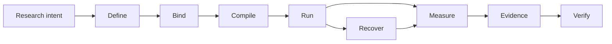

# Noetrium: Reproducible Research Infrastructure for AI Agents


<!-- readme-nav:start -->
<p align="center">
  <a href="README.md">English</a> ·
  <a href="README.zh-CN.md">简体中文</a> ·
  <strong>繁體中文</strong> ·
  <a href="README.ja.md">日本語</a> ·
  <a href="README.ko.md">한국어</a> ·
  <a href="README.es.md">Español</a> ·
  <a href="README.pt-BR.md">Português (Brasil)</a> ·
  <a href="README.fr.md">Français</a> ·
  <a href="README.de.md">Deutsch</a> ·
  <a href="README.ru.md">Русский</a>
</p>
<!-- readme-nav:end -->


<!-- readme-locale:zh-TW -->

<!-- readme-source-sha256:1200f1f42e9e52fc5829e36a43cd022c9ec93e45e2e531f4cc56c3180c42fb8b -->

<p align="center">
  <strong>建構 Agent。執行實驗。驗證結果。</strong><br>
  面向可重現、證據驅動 AI Agent 研究的嚴謹系統基礎設施。
</p>

<p align="center">
  <a href="#quick-start">快速開始</a> ·
  <a href="examples/README.md">範例</a> ·
  <a href="docs/architecture/PLATFORM_ARCHITECTURE.md">架構</a> ·
  <a href="docs/INDEX.md">文件</a> ·
  <a href="#verification">驗證</a>
</p>

<p align="center">
  <a href="https://www.python.org/">=3.11" src="https://img.shields.io/badge/Python-%3E%3D3.11-3776AB?logo=python&logoColor=white"></a>
  <a href="pyproject.toml"></a>
  <a href="docs/architecture/PLATFORM_ARCHITECTURE.md"></a>
  <a href="LICENSE"></a>
</p>

<!-- readme-section:overview -->

## 專案概覽

Noetrium 是面向長時間執行 AI Agent 實驗的研究基礎設施。對這類實驗而言，僅僅「跑起來」並不夠：你還需要知道實際執行了什麼、使用哪些 binding、故障後保留了什麼，以及結果由哪些 evidence 支撐。

它涵蓋 Agent、模型、環境、實驗、Artifact、復原、可觀測性與治理，同時不把專案特定的科學語義強塞進平台。

**當你需要以下能力時，Noetrium 最有價值：**

- 跨 variant、seed、模型與環境維持可重現的實驗 identity；
- 崩潰後保留 effect certainty，而不是靠猜測判定「是否已執行」；
- 將 evidence 與 lineage 追溯到精確 source/runtime identity；
- 在發表或發布前由 governance gate fail-closed。

<!-- readme-section:why -->

## 為什麼選擇 Noetrium？

多數 Agent 框架主要解決「Agent 如何行動或協作」。Noetrium 關注研究執行能否保持可歸因、可復原、可重現並與 evidence 綁定。它可以位於 orchestration framework 的下層或側面，而不是把自己包裝成它們的替代品。

### Noetrium 在生態中的位置

| Project | 主要關注點 | Noetrium 補充的能力 |
| --- | --- | --- |
| [LangGraph](https://github.com/langchain-ai/langgraph) | 長時間、有狀態 Agent orchestration | 圍繞執行補上研究 identity、evidence、recovery 與 governance |
| [AutoGen](https://github.com/microsoft/autogen) | 多 Agent 應用 | 實驗 protocol、reproducibility 與 release evidence |
| [CrewAI](https://github.com/crewAIInc/crewAI) | Agent team 與 event flow | 科學 run identity、lineage 與 fail-closed recovery |
| [OpenHands](https://github.com/All-Hands-AI/OpenHands) | AI 驅動的軟體開發 | 跨 Agent、模型與環境的通用研究基礎設施 |
| **Noetrium** | 可重現 AI Agent 研究基礎設施 | Research systems layer 本身 |

Noetrium 刻意比 Agent workflow library 更寬：實驗設計、模型/環境 identity、runtime effect、checkpoint、evidence 與 release authority 被視為同一個 research-systems 問題。

<!-- readme-section:capabilities -->

## 核心能力

- 遞迴架構 — 顯式 ownership、窄公共 API、typed port 與 composition-time provider binding。
- 實驗基礎設施 — Study、Run、Branch、Task、Variant、Workload、Checkpoint、Resume 與可重現 identity。
- Agent 執行期 — Participant、Capability、Action、Memory、Workflow 與 Execution 邊界，不依賴隱藏的全域查找。
- 模型基礎設施 — catalog、revision、qualification、serving identity、request envelope 與 prompt binding。
- 環境基礎設施 — specification、生命週期、readiness、observation、effect、snapshot 與 recovery。
- 程序/伺服器執行期 — supervision、session、toolchain、遠端執行、生命週期控制與 journal。
- 持久資料/Artifact — checksum 狀態、WAL 復原、lineage、retention 與內容尋址證據。
- 可靠性 — 故障分類、effect certainty、reconciliation、replay、incident 與 fail-closed 復原。
- 可觀測性 — 結構化日誌、event、metric、trace、diagnostic、projection 與健康訊號。
- 治理 — architecture、dependency、algorithm、concurrency、performance、forensic、release 與 no-degradation gate。

<!-- noetrium-interface-catalog:start -->
### Public interface catalog

Noetrium is a general-purpose research-systems platform for long-running agents, stateful environments, model providers, experiments, and other evidence-driven workloads. The complete downstream interface is generated from the canonical registry, so the list stays synchronized with the code.

- 172 registered system surfaces; 499 public API modules; 3602 public symbols.
- Full machine-readable catalog: noetrium/contracts/downstream_capability_catalog.json
- Full human-readable catalog: docs/architecture/DOWNSTREAM_CAPABILITY_CATALOG.md
- Import rule: use noetrium.contracts.systems.<system-slug>; do not import noetrium_platform implementation modules.

| Capability domain | Registered surfaces |
| --- | ---: |
| artifact | 7 |
| components | 1 |
| data | 8 |
| environment | 18 |
| execution | 7 |
| experimentation | 15 |
| governance | 13 |
| model | 16 |
| observability | 27 |
| operator | 8 |
| orchestration | 1 |
| participant | 8 |
| platform | 5 |
| portfolio | 5 |
| reliability | 7 |
| resource | 6 |
| runtime | 13 |
| scope | 7 |

Discover a capability in the catalog, import its generated facade, and inject its typed ports in downstream composition:

    from noetrium.contracts.systems.environment__minecraft import MinecraftBridgePort
    from noetrium.contracts.systems.participant__agent import AgentMemoryPort

After changing a registry descriptor or public API export, run python scripts/update_generated_docs.py; CI fails on generated-surface or README drift.
<!-- noetrium-interface-catalog:end -->

<!-- readme-section:architecture -->

## 架構

最短的心智模型是一條保留 evidence 的研究流水線：



每個轉換都必須保留 identity，或產生能解釋 identity 為何變化的 evidence。Composition、Execution 與 Observation 維持為彼此獨立的 authority plane；runtime 只接收窄的 injected port，而不是透過全域查找發現 provider。

每份 durable state 只有一個 owner；不確定的外部 effect 在 reconciliation 證明之前保持 `UNKNOWN`。

`noetrium_platform/foundation/governance/system_registry/catalog.json`

<!-- readme-section:downstream -->

## 平台與下游專案

本儲存庫是可獨立重用的平台套件。研究方法、任務集、專案特定環境組合、實驗矩陣、模型選擇、部署清單與科學解釋都屬於下游專案。

```text
noetrium
        │
        ├── install as a dependency, or
        └── fork as a platform baseline
                 │
                 ▼
       downstream research repository
       ├── project-specific method
       ├── experiment composition
       ├── task/environment bindings
       └── project evidence and results
```

下游程式碼消費平台公共 contract 並提供專案自有實作；平台不能反向 import 下游專案來決定科學語義或部署策略。

<!-- readme-section:quick-start -->

<a id="quick-start"></a>

## 快速開始

第一個範例是 deterministic 的，不需要 API key、模型 endpoint 或任何外部服務。

### 1. Clone 並安裝

```bash
git clone https://github.com/Xalzeroph/noetrium.git
cd noetrium
python -m venv .venv
source .venv/bin/activate
# Windows PowerShell: .venv\Scripts\Activate.ps1
python -m pip install --upgrade pip
python -m pip install -e ".[test]"
```

### 2. 編譯第一個可重現實驗計畫

```bash
python examples/quickstart_experiment_plan.py
```

範例會凍結 scientific protocol、綁定明確 provider identity、編譯 immutable plan，並驗證其 digest。

```text
study=noetrium-quickstart
variants=control,treatment
repetitions=3
protocol_digest=<sha256>
plan_digest=<sha256>
plan_consistent=true
```

### 3. 驗證目前 checkout

```bash
noetrium-architecture-gate
python scripts/check_readme_i18n.py
```

下游程式碼從 `noetrium` 匯入穩定 contract 與可重用 component；不要將 `noetrium_platform` 視為專案 extension API。若要產生 author-first 專案骨架，可使用 `noetrium project create <project-id> <destination> --version <version>`，再執行 `noetrium project doctor --project <destination>` 與 `noetrium project test --project <destination>`，然後加入專案自有 provider 或 method。

<!-- readme-section:containers -->

## 容器工作流程

`deploy/` 下維護可重用 Linux 映像與 Compose 定義。

```bash
cp deploy/.env.example deploy/.env
docker compose -f deploy/compose.yaml config
docker compose -f deploy/compose.yaml build
docker compose -f deploy/compose.yaml run --rm platform-runtime doctor
```

部署層將不可變軟體與可變 runtime state 分離；主機路徑與 secret 不進入已提交的 composition 程式碼。

### 內建 Minecraft Provider

Minecraft 是第一方可重用環境 Provider；任務集與科學組合繼續留在下游。

```bash
docker compose -f deploy/compose.yaml -f deploy/compose.minecraft.yaml build platform-runtime
docker compose -f deploy/compose.yaml -f deploy/compose.minecraft.yaml run --rm platform-runtime minecraft-doctor
```

[Minecraft infrastructure](docs/infrastructure/minecraft/README.md)

<!-- readme-section:repository-layout -->

## 儲存庫結構

| Path | Responsibility |
| --- | --- |
| `noetrium/` | 公共 facade、contract、reference single-agent component 與 multi-agent orchestration |
| `noetrium_platform/` | 內部 semantic-plane implementation、provider 與 governance tooling；不是下游 extension API |
| `configs/` | 版本化設定範例與非機密模板 |
| `deploy/` | 容器映像、Compose runtime 與部署引導資產 |
| `docs/` | 架構、基礎設施、治理、狀態與歷史文件 |
| `scripts/` | 輕量 operator、audit、release 與維護入口 |
| `tests/` | 分層回歸與 contract 測試 |
| `noetrium_platform/capabilities/environment/minecraft/` | 內建可重用 Minecraft 環境 Provider |
| `LICENSE` / `NOTICE` / `THIRD_PARTY_NOTICES.md` | Apache-2.0 與第三方授權說明 |

將 `noetrium_platform/` 視為受支援的內部實作 namespace；`noetrium/` 才是下游 package boundary，專案特定程式碼留在下游。

<!-- readme-section:testing -->

<a id="verification"></a>

## 測試與驗證

針對正在評估的 exact revision 執行儲存庫回歸套件與治理 gate。

```bash
python -m pytest -q
python scripts/architecture_gate.py
python scripts/public_contract_audit.py
python scripts/no_degradation_audit.py
python scripts/check_readme_i18n.py
```

歷史綠燈不能證明目前工作樹。發布或部署前必須針對準備使用的 exact revision 重新執行相關 gate。

儲存庫使用分層測試 taxonomy，使每個測試都歸屬於明確 contract level，並讓 release evidence 能證明實際執行了什麼。 See `tests/TEST_SYSTEM.json`.

<!-- readme-section:principles -->

## 設計原則

1. 每份 durable state 只有一個 owner。
2. 先 composition，後 execution。
3. Runtime port 必須保持窄介面。
4. 外部 effect 必須攜帶證據。
5. 復原必須感知 identity。
6. 禁止靜默降級。
7. Observation 不是 authority。
8. 效能最佳化必須保持語義。
9. 實作變化必須同步文件。
10. 專案特定語義必須留在下游。

<!-- readme-section:extending -->

## 擴充平台

在最小 owner 邊界增加能力。已有公共 contract 時優先新增 provider；只有能力本身新增時才增加新 contract。

```text
<system>/
├── api/          public contracts and identities
├── runtime/      lifecycle and execution semantics
├── providers/    replaceable adapters owned by the system
└── composition/  provider-to-port binding
```

避免用通用 wrapper 把無關演算法、provider discovery 或外部 effect 隱藏在一個介面後面。

<!-- readme-section:documentation -->

## 文件

從文件索引開始。

### 關鍵參考文件

- [Documentation index](docs/INDEX.md)
- [Examples](examples/README.md)
- [Contributing](CONTRIBUTING.md)
- [Security policy](SECURITY.md)
- [Support](SUPPORT.md)
- [Citation metadata](CITATION.cff)
- [Code of Conduct](CODE_OF_CONDUCT.md)
- [Platform architecture](docs/architecture/PLATFORM_ARCHITECTURE.md)
- [Detailed system map](docs/architecture/VNEXT_DETAILED_SYSTEM_MAP.md)
- [Architecture migration contract](docs/architecture/FINAL_ARCHITECTURE_MIGRATION_CONTRACT.md)
- [Infrastructure documentation](docs/infrastructure/README.md)
- [Governance documentation](docs/governance/README.md)
- [Current status](docs/status/README.md)
- [Engineering history](docs/history/README.md)

架構文件定義可重用 ownership 與 contract；status 文件描述目前開發樹；history 保存其寫入時刻對應狀態的證據。

<!-- readme-section:security -->

## 安全與設定

- 禁止提交密碼、私鑰、token、runtime secret 或機器本地憑證。
- 主機路徑與 secret 放在忽略的本地 profile 或環境綁定儲存中。
- 遠端自動化優先使用 key/agent 無人值守認證。
- 外部 effect 命令必須 typed、bounded、journaled 並綁定 operation identity。
- 日誌與 evidence 應視為可能包含敏感維運資訊。

<!-- readme-section:contributing -->

## 貢獻指南

變更應能按 ownership boundary 審查，並包含證明該變更所需的測試與文件。

### 提交 Pull Request 前

```bash
python -m pytest -q
python scripts/architecture_gate.py
python scripts/check_readme_i18n.py
```

- 保持 system ownership 與公共 contract 邊界
- 增加或更新聚焦的回歸覆蓋
- 在同一 change set 更新 owner 文件
- 避免在同一 commit 混入無關重構
- 對不確定外部 effect 保持 fail-closed
- 明確記錄有意的語義或相容性變化

[Documentation Change Policy](docs/governance/DOCUMENTATION_CHANGE_POLICY.md)

<!-- readme-section:license -->

## 授權條款

Noetrium 採用 Apache License 2.0。具有法律效力的權威文本是儲存庫根目錄的 LICENSE。

第三方元件繼續受各自授權條款約束，詳見 THIRD_PARTY_NOTICES.md；獨立散布的模型權重、資料集或 benchmark 資產可以另行聲明授權條款。

[`LICENSE`](LICENSE) · [`NOTICE`](NOTICE) · [`THIRD_PARTY_NOTICES.md`](THIRD_PARTY_NOTICES.md)

<!-- readme-section:status -->

## 開發狀態

平台仍處於持續的架構與 runtime 開發階段。

對於生產、發布或科學結論，必須重新執行相關 gate，並檢查與 exact source revision 綁定的 release evidence，而不能只依賴歷史綠燈。

歷史變更有意不寫入這份 README；不可變的工程記錄請查看 `docs/history/`。

目前開發事實以 `docs/status/CURRENT_DEVELOPMENT_BASELINE.md` 為準；發布與科研結論必須綁定到被評估精確版本的證據。

`docs/status/` · `docs/history/`
