# Noetrium Full Code Architecture Map

> AUTO-GENERATED by `scripts/generate_code_architecture_map.py`.
> Source Git SHA: `c9a05c625cced523f8d05fd101acc897e9adadf2`.

This document is source-derived. Class membership comes from Python AST; system ownership comes from the canonical system registry. Non-authority facets/providers/projections are shown as code boundaries, not promoted to durable authorities.

## Inventory

| Metric | Count |
|---|---:|
| `python_modules` | 2520 |
| `classes` | 3120 |
| `inheritance_edges` | 136 |
| `association_edges` | 3146 |
| `constructor_edges` | 850 |
| `module_import_edges` | 5435 |
| `top_level_systems` | 16 |
| `registry_nodes` | 172 |
| `registry_authorities` | 20 |
| `parse_errors` | 0 |

## Global system dependency topology

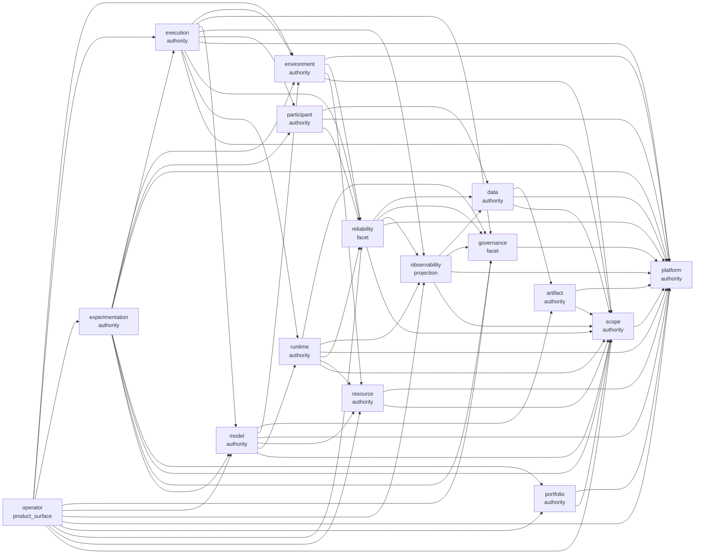

## Authority / non-authority projection map

```mermaid
flowchart LR
  A_C_1e5dcbb59b75["artifact"]
  A_C_a17c9aaa61e8["data"]
  A_C_0c7eebb08f43["data/fact"]
  A_C_17d811dc719a["data/state"]
  A_C_c6e454d960df["environment"]
  A_C_1e2147459888["execution"]
  A_C_2ca29a65afbc["execution/operation"]
  A_C_04bad6aedb36["experimentation"]
  A_C_3325a175f6b5["governance/release"]
  A_C_5b847ea0f76f["governance/system_registry"]
  A_C_1d06a0d76f00["model"]
  A_C_7a2110450a94["participant"]
  A_C_3c72abbe626f["platform"]
  A_C_5f1a041a173e["portfolio"]
  A_C_eac533569fc2["reliability/effect"]
  A_C_99ef58f40d11["reliability/failure"]
  A_C_7a1047389735["resource"]
  A_C_a96fe4418d33["resource/lease"]
  A_C_f2e18ffc17e2["runtime"]
  A_C_aacd3103f3f1["scope"]
  N_C_fe5f725d0cd6["artifact/catalog\nfacet"]
  N_C_fe5f725d0cd6 -.-> A_C_1e5dcbb59b75
  N_C_8e0aa643f61b["artifact/content\nfacet"]
  N_C_8e0aa643f61b -.-> A_C_1e5dcbb59b75
  N_C_ebdcdf985bb6["artifact/lineage\nfacet"]
  N_C_ebdcdf985bb6 -.-> A_C_1e5dcbb59b75
  N_C_a9c526416d6c["artifact/lineage/relation\nfacet"]
  N_C_a9c526416d6c -.-> A_C_1e5dcbb59b75
  N_C_b8498eb0e6d2["artifact/reference\nfacet"]
  N_C_b8498eb0e6d2 -.-> A_C_1e5dcbb59b75
  N_C_edf5d1a725f0["artifact/retention\nfacet"]
  N_C_edf5d1a725f0 -.-> A_C_1e5dcbb59b75
  N_C_b572a94d4413["data/dataset\nfacet"]
  N_C_b572a94d4413 -.-> A_C_a17c9aaa61e8
  N_C_e40d0bbe1372["data/projection\nprojection"]
  N_C_e40d0bbe1372 -.-> A_C_a17c9aaa61e8
  N_C_de1013ed7fa5["data/query\nprojection"]
  N_C_de1013ed7fa5 -.-> A_C_a17c9aaa61e8
  N_C_ff6e66515591["data/query/cross\nprojection"]
  N_C_ff6e66515591 -.-> A_C_a17c9aaa61e8
  N_C_dd567f5f1a4b["data/record\nfacet"]
  N_C_dd567f5f1a4b -.-> A_C_a17c9aaa61e8
  N_C_9bf17741887d["environment/binding\nfacet"]
  N_C_9bf17741887d -.-> A_C_c6e454d960df
  N_C_b5871ff35a39["environment/catalog\nfacet"]
  N_C_b5871ff35a39 -.-> A_C_c6e454d960df
  N_C_3e6b88bdfea9["environment/category\nfacet"]
  N_C_3e6b88bdfea9 -.-> A_C_c6e454d960df
  N_C_844609dbe056["environment/embodied\nfacet"]
  N_C_844609dbe056 -.-> A_C_c6e454d960df
  N_C_1324e4e84078["environment/gui\nprovider"]
  N_C_1324e4e84078 -.-> A_C_c6e454d960df
  N_C_af8302ad2a63["environment/instance\nfacet"]
  N_C_af8302ad2a63 -.-> A_C_c6e454d960df
  N_C_1aa4cadf27cb["environment/instance/identity\nfacet"]
  N_C_1aa4cadf27cb -.-> A_C_c6e454d960df
  N_C_dab35f372cf7["environment/instance/readiness\nfacet"]
  N_C_dab35f372cf7 -.-> A_C_c6e454d960df
  N_C_f76a6baf633f["environment/minecraft\nprovider"]
  N_C_f76a6baf633f -.-> A_C_c6e454d960df
  N_C_5c67dd470a54["environment/resolution\nadapter"]
  N_C_5c67dd470a54 -.-> A_C_c6e454d960df
  N_C_3dcbfda72629["environment/runtime\nadapter"]
  N_C_3dcbfda72629 -.-> A_C_c6e454d960df
  N_C_97e5232fbaef["environment/software\nprovider"]
  N_C_97e5232fbaef -.-> A_C_c6e454d960df
  N_C_9faf20f1fdc7["environment/specification\nfacet"]
  N_C_9faf20f1fdc7 -.-> A_C_c6e454d960df
  N_C_1950487402b8["environment/specification/digest\nfacet"]
  N_C_1950487402b8 -.-> A_C_c6e454d960df
  N_C_059d8d677039["environment/specification/schema\nfacet"]
  N_C_059d8d677039 -.-> A_C_c6e454d960df
  N_C_ed5e3aa24682["environment/text_world\nprovider"]
  N_C_ed5e3aa24682 -.-> A_C_c6e454d960df
  N_C_42bc112be9e3["environment/web\nprovider"]
  N_C_42bc112be9e3 -.-> A_C_c6e454d960df
  N_C_7e21cca01f37["execution/admission\npolicy"]
  N_C_7e21cca01f37 -.-> A_C_1e2147459888
  N_C_b853f215253f["execution/capability\nfacet"]
  N_C_b853f215253f -.-> A_C_1e2147459888
  N_C_4d21beedc563["execution/command\nfacet"]
  N_C_4d21beedc563 -.-> A_C_1e2147459888
  N_C_d7d7db9e03c3["execution/research_program\nfacet"]
  N_C_d7d7db9e03c3 -.-> A_C_1e2147459888
  N_C_0737046017f3["execution/scheduling\npolicy"]
  N_C_0737046017f3 -.-> A_C_1e2147459888
  N_C_48217f90e892["execution/workflow\nfacet"]
  N_C_48217f90e892 -.-> A_C_1e2147459888
  N_C_65151ca1f17b["experimentation/branch\nfacet"]
  N_C_65151ca1f17b -.-> A_C_04bad6aedb36
  N_C_0fc283f6ee3d["experimentation/catalog\nprojection"]
  N_C_0fc283f6ee3d -.-> A_C_04bad6aedb36
  N_C_ef36a0b0207d["experimentation/checkpoint\nfacet"]
  N_C_ef36a0b0207d -.-> A_C_04bad6aedb36
  N_C_d7561846b563["experimentation/evaluation\nfacet"]
  N_C_d7561846b563 -.-> A_C_04bad6aedb36
  N_C_74d331186d36["experimentation/experiment\nfacet"]
  N_C_74d331186d36 -.-> A_C_04bad6aedb36
  N_C_f60f20f392c0["experimentation/resource\nfacet"]
  N_C_f60f20f392c0 -.-> A_C_04bad6aedb36
  N_C_dfeefffc68d1["experimentation/run\nfacet"]
  N_C_dfeefffc68d1 -.-> A_C_04bad6aedb36
  N_C_fe979381f8d4["experimentation/run/control\nfacet"]
  N_C_fe979381f8d4 -.-> A_C_04bad6aedb36
  N_C_1d4b45276394["experimentation/run/identity\nfacet"]
  N_C_1d4b45276394 -.-> A_C_04bad6aedb36
  N_C_0e6df8ab9eeb["experimentation/run/lifecycle\nfacet"]
  N_C_0e6df8ab9eeb -.-> A_C_04bad6aedb36
  N_C_868e54c8b999["experimentation/run/manifest\nfacet"]
  N_C_868e54c8b999 -.-> A_C_04bad6aedb36
  N_C_3b5162f9f656["experimentation/study\nfacet"]
  N_C_3b5162f9f656 -.-> A_C_04bad6aedb36
  N_C_d6254f186046["experimentation/variant\nfacet"]
  N_C_d6254f186046 -.-> A_C_04bad6aedb36
  N_C_89506f5861b4["experimentation/workbench\nfacet"]
  N_C_89506f5861b4 -.-> A_C_04bad6aedb36
  N_C_702bf52424de["experimentation/workload\nadapter"]
  N_C_702bf52424de -.-> A_C_04bad6aedb36
  N_C_a62842aa83fe["model/asset\nfacet"]
  N_C_a62842aa83fe -.-> A_C_1d06a0d76f00
  N_C_a479edf54108["model/assignment\nfacet"]
  N_C_a479edf54108 -.-> A_C_1d06a0d76f00
  N_C_f060789a5f89["model/catalog\nfacet"]
  N_C_f060789a5f89 -.-> A_C_1d06a0d76f00
  N_C_fe443ef7a51d["model/catalog/family\nfacet"]
  N_C_fe443ef7a51d -.-> A_C_1d06a0d76f00
  N_C_1518031edba1["model/catalog/revision\nfacet"]
  N_C_1518031edba1 -.-> A_C_1d06a0d76f00
  N_C_471b8cd6dfa2["model/deployment\nfacet"]
  N_C_471b8cd6dfa2 -.-> A_C_1d06a0d76f00
  N_C_34d7fe143fa3["model/deployment/closure\nfacet"]
  N_C_34d7fe143fa3 -.-> A_C_1d06a0d76f00
  N_C_da9892e476d7["model/qualification\npolicy"]
  N_C_da9892e476d7 -.-> A_C_1d06a0d76f00
  N_C_9b55393b712c["model/request\nfacet"]
  N_C_9b55393b712c -.-> A_C_1d06a0d76f00
  N_C_e623564d7243["model/request/input\nfacet"]
  N_C_e623564d7243 -.-> A_C_1d06a0d76f00
  N_C_7f4fb7067e49["model/request/output\nfacet"]
  N_C_7f4fb7067e49 -.-> A_C_1d06a0d76f00
  N_C_eec344a27079["model/request/prompt\nfacet"]
  N_C_eec344a27079 -.-> A_C_1d06a0d76f00
  N_C_a01f84656b7e["model/serving\nadapter"]
  N_C_a01f84656b7e -.-> A_C_1d06a0d76f00
  N_C_8dbdca7ecb9d["model/serving/endpoint\nadapter"]
  N_C_8dbdca7ecb9d -.-> A_C_1d06a0d76f00
  N_C_c03dc1a253fa["model/stack\nfacet"]
  N_C_c03dc1a253fa -.-> A_C_1d06a0d76f00
  N_C_7eac146ee4a1["participant/agent\nfacet"]
  N_C_7eac146ee4a1 -.-> A_C_7a2110450a94
  N_C_bce16fc3cbcc["participant/binding\nfacet"]
  N_C_bce16fc3cbcc -.-> A_C_7a2110450a94
  N_C_9d542fdc0405["participant/capability\nfacet"]
  N_C_9d542fdc0405 -.-> A_C_7a2110450a94
  N_C_fdf521159182["participant/core\nfacet"]
  N_C_fdf521159182 -.-> A_C_7a2110450a94
  N_C_17fa7b09a147["participant/definition\nfacet"]
  N_C_17fa7b09a147 -.-> A_C_7a2110450a94
  N_C_bebb131dcb3f["participant/method\nfacet"]
  N_C_bebb131dcb3f -.-> A_C_7a2110450a94
  N_C_247c12832b69["participant/session\nfacet"]
  N_C_247c12832b69 -.-> A_C_7a2110450a94
  N_C_a15241321ace["platform/concurrency\nfacet"]
  N_C_a15241321ace -.-> A_C_3c72abbe626f
  N_C_8f14ce8e2d70["platform/configuration\nfacet"]
  N_C_8f14ce8e2d70 -.-> A_C_3c72abbe626f
  N_C_b6d29ca246b5["platform/identity\nfacet"]
  N_C_b6d29ca246b5 -.-> A_C_3c72abbe626f
  N_C_13751eabbb06["platform/lifecycle\nfacet"]
  N_C_13751eabbb06 -.-> A_C_3c72abbe626f
  N_C_4183ebbae221["portfolio/membership\nfacet"]
  N_C_4183ebbae221 -.-> A_C_5f1a041a173e
  N_C_3af4f645c2e7["portfolio/program\nfacet"]
  N_C_3af4f645c2e7 -.-> A_C_5f1a041a173e
  N_C_a81fce3be89f["portfolio/project\nfacet"]
  N_C_a81fce3be89f -.-> A_C_5f1a041a173e
  N_C_2f7fc9958e9e["portfolio/workspace\nfacet"]
  N_C_2f7fc9958e9e -.-> A_C_5f1a041a173e
  N_C_6bdf44fab33e["resource/allocation\nfacet"]
  N_C_6bdf44fab33e -.-> A_C_7a1047389735
  N_C_83a69960b5ec["resource/compute\nfacet"]
  N_C_83a69960b5ec -.-> A_C_7a1047389735
  N_C_9fa29f294eec["resource/directory\nfacet"]
  N_C_9fa29f294eec -.-> A_C_7a1047389735
  N_C_eacf5b4c8ff2["resource/resolution\npolicy"]
  N_C_eacf5b4c8ff2 -.-> A_C_7a1047389735
  N_C_0bdacd37d228["runtime/host\nfacet"]
  N_C_0bdacd37d228 -.-> A_C_f2e18ffc17e2
  N_C_76bacfc8e7dd["runtime/process\nfacet"]
  N_C_76bacfc8e7dd -.-> A_C_f2e18ffc17e2
  N_C_158a6142388e["runtime/process/supervision\nadapter"]
  N_C_158a6142388e -.-> A_C_f2e18ffc17e2
  N_C_97373376fa4a["runtime/python\nprovider"]
  N_C_97373376fa4a -.-> A_C_f2e18ffc17e2
  N_C_18571015e4a9["runtime/server\nfacet"]
  N_C_18571015e4a9 -.-> A_C_f2e18ffc17e2
  N_C_d3b8ee0b1a16["runtime/server/bootstrap\nfacet"]
  N_C_d3b8ee0b1a16 -.-> A_C_f2e18ffc17e2
  N_C_467996399b6f["runtime/server/health\nfacet"]
  N_C_467996399b6f -.-> A_C_f2e18ffc17e2
  N_C_fa0719e88559["runtime/server/identity\nfacet"]
  N_C_fa0719e88559 -.-> A_C_f2e18ffc17e2
  N_C_ea86d7f8acce["runtime/server/lifecycle\nfacet"]
  N_C_ea86d7f8acce -.-> A_C_f2e18ffc17e2
  N_C_5a2524a4e1fb["runtime/service\nfacet"]
  N_C_5a2524a4e1fb -.-> A_C_f2e18ffc17e2
  N_C_ab79d4218c4a["runtime/session\nfacet"]
  N_C_ab79d4218c4a -.-> A_C_f2e18ffc17e2
  N_C_58916395cb85["runtime/toolchain\nprovider"]
  N_C_58916395cb85 -.-> A_C_f2e18ffc17e2
  N_C_cc9e22c386fe["scope/hierarchy\nfacet"]
  N_C_cc9e22c386fe -.-> A_C_aacd3103f3f1
  N_C_78f0ff13c912["scope/identity\nfacet"]
  N_C_78f0ff13c912 -.-> A_C_aacd3103f3f1
  N_C_703a5aed90c4["scope/membership\nfacet"]
  N_C_703a5aed90c4 -.-> A_C_aacd3103f3f1
  N_C_a264970c0825["scope/ownership\nfacet"]
  N_C_a264970c0825 -.-> A_C_aacd3103f3f1
  N_C_fcf7d9e88ab0["scope/path\nfacet"]
  N_C_fcf7d9e88ab0 -.-> A_C_aacd3103f3f1
  N_C_92427b06b984["scope/resolution\nfacet"]
  N_C_92427b06b984 -.-> A_C_aacd3103f3f1
```

## Observed cross-system Python import graph

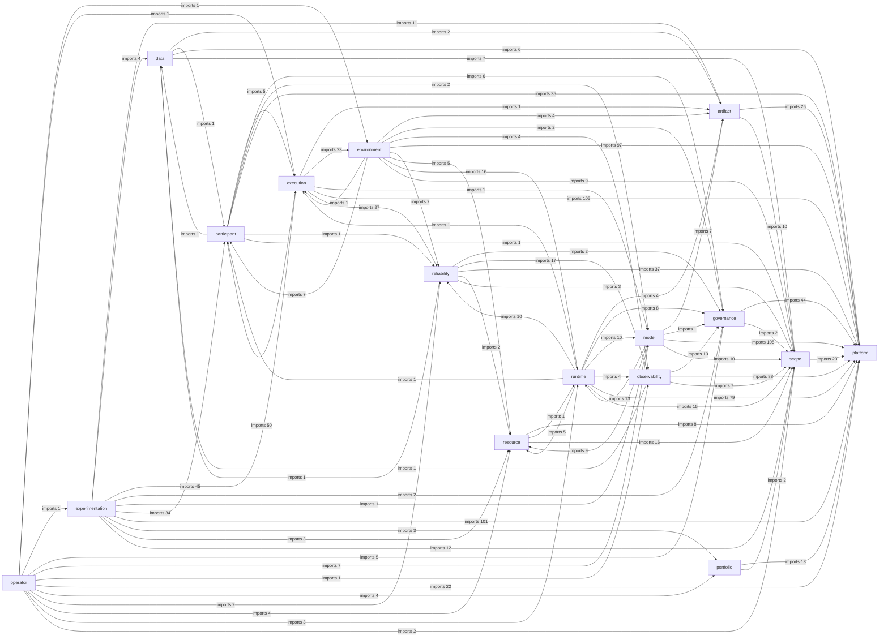

## Canonical end-to-end runtime/data flow

This flow is projected from the registered system responsibilities and verified against the source dependency graph; arrows describe data/control direction, not ownership transfer.

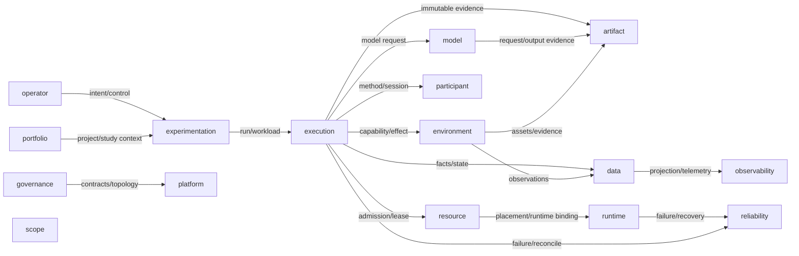

## Registry node inventory

| Path | Kind | Canonical authority | Parent | Downstream |
|---|---|---|---|---|
| `artifact` | `authority` | `artifact` | `None` | `public` |
| `artifact/catalog` | `facet` | `artifact` | `artifact` | `public` |
| `artifact/content` | `facet` | `artifact` | `artifact` | `public` |
| `artifact/lineage` | `facet` | `artifact` | `artifact` | `public` |
| `artifact/lineage/relation` | `facet` | `artifact` | `artifact.lineage` | `public` |
| `artifact/reference` | `facet` | `artifact` | `artifact` | `public` |
| `artifact/retention` | `facet` | `artifact` | `artifact` | `public` |
| `data` | `authority` | `data` | `None` | `public` |
| `data/dataset` | `facet` | `data` | `data` | `public` |
| `data/fact` | `authority` | `data/fact` | `data` | `public` |
| `data/projection` | `projection` | `data` | `data` | `metadata_only` |
| `data/query` | `projection` | `data` | `data` | `public` |
| `data/query/cross` | `projection` | `data` | `data.query` | `public` |
| `data/record` | `facet` | `data` | `data` | `public` |
| `data/state` | `authority` | `data/state` | `data` | `public` |
| `environment` | `authority` | `environment` | `None` | `public` |
| `environment/binding` | `facet` | `environment` | `environment` | `public` |
| `environment/catalog` | `facet` | `environment` | `environment` | `public` |
| `environment/category` | `facet` | `environment` | `environment` | `public` |
| `environment/embodied` | `facet` | `environment` | `environment` | `public` |
| `environment/gui` | `provider` | `environment` | `environment` | `metadata_only` |
| `environment/instance` | `facet` | `environment` | `environment` | `public` |
| `environment/instance/identity` | `facet` | `environment` | `environment.instance` | `public` |
| `environment/instance/readiness` | `facet` | `environment` | `environment.instance` | `public` |
| `environment/minecraft` | `provider` | `environment` | `environment` | `metadata_only` |
| `environment/resolution` | `adapter` | `environment` | `environment` | `metadata_only` |
| `environment/runtime` | `adapter` | `environment` | `environment` | `metadata_only` |
| `environment/software` | `provider` | `environment` | `environment` | `metadata_only` |
| `environment/specification` | `facet` | `environment` | `environment` | `public` |
| `environment/specification/digest` | `facet` | `environment` | `environment.specification` | `public` |
| `environment/specification/schema` | `facet` | `environment` | `environment.specification` | `public` |
| `environment/text_world` | `provider` | `environment` | `environment` | `metadata_only` |
| `environment/web` | `provider` | `environment` | `environment` | `metadata_only` |
| `execution` | `authority` | `execution` | `None` | `public` |
| `execution/admission` | `policy` | `execution` | `execution` | `public` |
| `execution/capability` | `facet` | `execution` | `execution` | `public` |
| `execution/command` | `facet` | `execution` | `execution` | `public` |
| `execution/operation` | `authority` | `execution/operation` | `execution` | `public` |
| `execution/research_program` | `facet` | `execution` | `execution` | `public` |
| `execution/scheduling` | `policy` | `execution` | `execution` | `public` |
| `execution/workflow` | `facet` | `execution` | `execution` | `public` |
| `experimentation` | `authority` | `experimentation` | `None` | `public` |
| `experimentation/branch` | `facet` | `experimentation` | `experimentation` | `public` |
| `experimentation/catalog` | `projection` | `experimentation` | `experimentation` | `metadata_only` |
| `experimentation/checkpoint` | `facet` | `experimentation` | `experimentation` | `public` |
| `experimentation/evaluation` | `facet` | `experimentation` | `experimentation` | `public` |
| `experimentation/experiment` | `facet` | `experimentation` | `experimentation` | `public` |
| `experimentation/resource` | `facet` | `experimentation` | `experimentation` | `public` |
| `experimentation/run` | `facet` | `experimentation` | `experimentation` | `public` |
| `experimentation/run/control` | `facet` | `experimentation` | `experimentation/run` | `public` |
| `experimentation/run/identity` | `facet` | `experimentation` | `experimentation.run` | `public` |
| `experimentation/run/lifecycle` | `facet` | `experimentation` | `experimentation.run` | `public` |
| `experimentation/run/manifest` | `facet` | `experimentation` | `experimentation.run` | `public` |
| `experimentation/study` | `facet` | `experimentation` | `experimentation` | `public` |
| `experimentation/variant` | `facet` | `experimentation` | `experimentation` | `public` |
| `experimentation/workbench` | `facet` | `experimentation` | `experimentation` | `public` |
| `experimentation/workload` | `adapter` | `experimentation` | `experimentation` | `metadata_only` |
| `governance` | `facet` | `None` | `None` | `public` |
| `governance/algorithm` | `tool` | `None` | `governance` | `metadata_only` |
| `governance/architecture` | `tool` | `None` | `governance` | `metadata_only` |
| `governance/concurrency` | `tool` | `None` | `governance` | `metadata_only` |
| `governance/evolution` | `policy` | `None` | `governance` | `public` |
| `governance/gate` | `policy` | `None` | `governance` | `public` |
| `governance/performance` | `tool` | `None` | `governance` | `metadata_only` |
| `governance/quality` | `tool` | `None` | `governance` | `metadata_only` |
| `governance/release` | `authority` | `governance/release` | `governance` | `public` |
| `governance/repository_boundary` | `tool` | `None` | `governance` | `metadata_only` |
| `governance/schema` | `policy` | `None` | `governance` | `public` |
| `governance/security` | `policy` | `None` | `governance` | `public` |
| `governance/system_registry` | `authority` | `governance/system_registry` | `governance` | `public` |
| `model` | `authority` | `model` | `None` | `public` |
| `model/asset` | `facet` | `model` | `model` | `public` |
| `model/assignment` | `facet` | `model` | `model` | `public` |
| `model/catalog` | `facet` | `model` | `model` | `public` |
| `model/catalog/family` | `facet` | `model` | `model.catalog` | `public` |
| `model/catalog/revision` | `facet` | `model` | `model.catalog` | `public` |
| `model/deployment` | `facet` | `model` | `model` | `public` |
| `model/deployment/closure` | `facet` | `model` | `model.deployment` | `public` |
| `model/qualification` | `policy` | `model` | `model` | `public` |
| `model/request` | `facet` | `model` | `model` | `public` |
| `model/request/input` | `facet` | `model` | `model.request` | `public` |
| `model/request/output` | `facet` | `model` | `model.request` | `public` |
| `model/request/prompt` | `facet` | `model` | `model/request` | `public` |
| `model/serving` | `adapter` | `model` | `model` | `metadata_only` |
| `model/serving/endpoint` | `adapter` | `model` | `model.serving` | `metadata_only` |
| `model/stack` | `facet` | `model` | `model` | `public` |
| `observability` | `projection` | `None` | `None` | `metadata_only` |
| `observability/capture` | `projection` | `None` | `observability` | `metadata_only` |
| `observability/diagnostic` | `projection` | `None` | `observability` | `metadata_only` |
| `observability/diagnostic/correlation` | `projection` | `None` | `observability.diagnostic` | `metadata_only` |
| `observability/diagnostic/query` | `projection` | `None` | `observability.diagnostic` | `metadata_only` |
| `observability/diagnostic/snapshot` | `projection` | `None` | `observability.diagnostic` | `metadata_only` |
| `observability/logging` | `projection` | `None` | `observability` | `metadata_only` |
| `observability/logging/capture` | `projection` | `None` | `observability.logging` | `metadata_only` |
| `observability/logging/context` | `projection` | `None` | `observability.logging` | `metadata_only` |
| `observability/logging/projection` | `projection` | `None` | `observability.logging` | `metadata_only` |
| `observability/logging/query` | `projection` | `None` | `observability.logging` | `metadata_only` |
| `observability/logging/record` | `projection` | `None` | `observability.logging` | `metadata_only` |
| `observability/logging/retention` | `projection` | `None` | `observability.logging` | `metadata_only` |
| `observability/logging/routing` | `projection` | `None` | `observability.logging` | `metadata_only` |
| `observability/logging/sink` | `provider` | `None` | `observability.logging` | `metadata_only` |
| `observability/logging/storage` | `provider` | `None` | `observability.logging` | `metadata_only` |
| `observability/projection` | `projection` | `None` | `observability` | `metadata_only` |
| `observability/status` | `projection` | `None` | `observability` | `metadata_only` |
| `observability/status/health` | `projection` | `None` | `observability.status` | `metadata_only` |
| `observability/status/lifecycle_view` | `projection` | `None` | `observability.status` | `metadata_only` |
| `observability/telemetry` | `projection` | `None` | `observability` | `metadata_only` |
| `observability/telemetry/event` | `projection` | `None` | `observability.telemetry` | `metadata_only` |
| `observability/telemetry/metric` | `projection` | `None` | `observability.telemetry` | `metadata_only` |
| `observability/tracing` | `projection` | `None` | `observability` | `metadata_only` |
| `observability/tracing/context` | `projection` | `None` | `observability.tracing` | `metadata_only` |
| `observability/tracing/propagation` | `projection` | `None` | `observability.tracing` | `metadata_only` |
| `observability/tracing/storage` | `provider` | `None` | `observability.tracing` | `metadata_only` |
| `operator` | `product_surface` | `None` | `None` | `metadata_only` |
| `operator/audit` | `product_surface` | `None` | `operator` | `metadata_only` |
| `operator/command` | `product_surface` | `None` | `operator` | `metadata_only` |
| `operator/command/intent` | `product_surface` | `None` | `operator.command` | `metadata_only` |
| `operator/incident` | `product_surface` | `None` | `operator` | `metadata_only` |
| `operator/maintenance` | `product_surface` | `None` | `operator` | `metadata_only` |
| `operator/query` | `product_surface` | `None` | `operator` | `metadata_only` |
| `operator/query/search` | `product_surface` | `None` | `operator.query` | `metadata_only` |
| `participant` | `authority` | `participant` | `None` | `public` |
| `participant/agent` | `facet` | `participant` | `participant` | `public` |
| `participant/binding` | `facet` | `participant` | `participant` | `public` |
| `participant/capability` | `facet` | `participant` | `participant` | `public` |
| `participant/core` | `facet` | `participant` | `participant` | `public` |
| `participant/definition` | `facet` | `participant` | `participant` | `public` |
| `participant/method` | `facet` | `participant` | `participant` | `public` |
| `participant/session` | `facet` | `participant` | `participant` | `public` |
| `platform` | `authority` | `platform` | `None` | `public` |
| `platform/concurrency` | `facet` | `platform` | `platform` | `public` |
| `platform/configuration` | `facet` | `platform` | `platform` | `public` |
| `platform/identity` | `facet` | `platform` | `platform` | `public` |
| `platform/lifecycle` | `facet` | `platform` | `platform` | `public` |
| `portfolio` | `authority` | `portfolio` | `None` | `public` |
| `portfolio/membership` | `facet` | `portfolio` | `portfolio` | `public` |
| `portfolio/program` | `facet` | `portfolio` | `portfolio` | `public` |
| `portfolio/project` | `facet` | `portfolio` | `portfolio` | `public` |
| `portfolio/workspace` | `facet` | `portfolio` | `portfolio` | `public` |
| `reliability` | `facet` | `None` | `None` | `public` |
| `reliability/diagnostics` | `projection` | `None` | `reliability` | `metadata_only` |
| `reliability/effect` | `authority` | `reliability/effect` | `reliability` | `public` |
| `reliability/failure` | `authority` | `reliability/failure` | `reliability` | `public` |
| `reliability/forensics` | `projection` | `None` | `reliability` | `metadata_only` |
| `reliability/recovery` | `adapter` | `None` | `reliability` | `metadata_only` |
| `reliability/recovery/execution` | `adapter` | `None` | `reliability.recovery` | `metadata_only` |
| `resource` | `authority` | `resource` | `None` | `public` |
| `resource/allocation` | `facet` | `resource` | `resource` | `public` |
| `resource/compute` | `facet` | `resource` | `resource` | `public` |
| `resource/directory` | `facet` | `resource` | `resource` | `public` |
| `resource/lease` | `authority` | `resource/lease` | `resource` | `public` |
| `resource/resolution` | `policy` | `resource` | `resource` | `public` |
| `runtime` | `authority` | `runtime` | `None` | `public` |
| `runtime/host` | `facet` | `runtime` | `runtime` | `public` |
| `runtime/process` | `facet` | `runtime` | `runtime` | `public` |
| `runtime/process/supervision` | `adapter` | `runtime` | `runtime.process` | `metadata_only` |
| `runtime/python` | `provider` | `runtime` | `runtime` | `metadata_only` |
| `runtime/server` | `facet` | `runtime` | `runtime` | `public` |
| `runtime/server/bootstrap` | `facet` | `runtime` | `runtime.server` | `public` |
| `runtime/server/health` | `facet` | `runtime` | `runtime.server` | `public` |
| `runtime/server/identity` | `facet` | `runtime` | `runtime.server` | `public` |
| `runtime/server/lifecycle` | `facet` | `runtime` | `runtime.server` | `public` |
| `runtime/service` | `facet` | `runtime` | `runtime` | `public` |
| `runtime/session` | `facet` | `runtime` | `runtime` | `public` |
| `runtime/toolchain` | `provider` | `runtime` | `runtime` | `metadata_only` |
| `scope` | `authority` | `scope` | `None` | `public` |
| `scope/hierarchy` | `facet` | `scope` | `scope` | `public` |
| `scope/identity` | `facet` | `scope` | `scope` | `public` |
| `scope/membership` | `facet` | `scope` | `scope` | `public` |
| `scope/ownership` | `facet` | `scope` | `scope` | `public` |
| `scope/path` | `facet` | `scope` | `scope` | `public` |
| `scope/resolution` | `facet` | `scope` | `scope` | `public` |

## Classes — `artifact`

Total classes: **67**.

```mermaid
classDiagram
direction LR
  class C_ed2a06f5056b["ArtifactContentIdentity"]
  <<dataclass>> C_ed2a06f5056b
  class C_9861b078ab08["ArtifactKind"]
  <<enum>> C_9861b078ab08
  class C_bbb8ca867b1d["ArtifactRetention"]
  <<enum>> C_bbb8ca867b1d
  class C_58a34e55e427["ArtifactRecord"]
  <<dataclass>> C_58a34e55e427
  class C_f92ae37f8498["ArtifactQuery"]
  <<dataclass>> C_f92ae37f8498
  class C_6e0a3d882247["ArtifactRegistryConflict"]
  class C_c0b23bc9ab5f["ArtifactRegistryCorruptionError"]
  class C_a5ec6b99b791["ArtifactNotFound"]
  class C_767a433a0548["ArtifactRegistryPort"]
  <<protocol>> C_767a433a0548
  class C_45f3b57fe641["SQLiteArtifactRegistry"]
  class C_a9799f75e845["InMemoryArtifactRegistry"]
  class C_06decefc14f6["ArtifactAcquisitionRequest"]
  <<dataclass>> C_06decefc14f6
  class C_85442b49ce4c["ArtifactAcquisitionResult"]
  <<dataclass>> C_85442b49ce4c
  class C_ae1a1210d67f["ArtifactAcquisitionError"]
  class C_e65c973ca3af["ArtifactHttpResponse"]
  <<protocol>> C_e65c973ca3af
  class C_fcb09f775fed["ArtifactAcquisitionPort"]
  <<protocol>> C_fcb09f775fed
  class C_650bc7f2406a["ArtifactBlobRef"]
  <<dataclass>> C_650bc7f2406a
  class C_3715dd3ec08f["ArtifactBlobStoreError"]
  class C_8e29f1bae933["ArtifactBlobStorePort"]
  <<protocol>> C_8e29f1bae933
  class C_fe835ac59c46["ArtifactContentIdentityVerificationError"]
  class C_e73a196a12b7["ArtifactContentIdentityResolverPort"]
  <<protocol>> C_e73a196a12b7
  class C_8b5bbc945401["ArchiveMaterializationRequest"]
  <<dataclass>> C_8b5bbc945401
  class C_87f46916ed39["ArchiveMaterializationResult"]
  <<dataclass>> C_87f46916ed39
  class C_8c05380079e6["MaterializedTreeInspection"]
  <<dataclass>> C_8c05380079e6
  class C_9a5f07e9f0d4["ArchiveMaterializationError"]
  class C_06c2c139f8ec["ArchiveMaterializationPort"]
  <<protocol>> C_06c2c139f8ec
  class C_aa2dc1927c39["MaterializedTreeInspectionPort"]
  <<protocol>> C_aa2dc1927c39
  class C_d6ed067f6f63["VerifiedArtifactStoragePlacement"]
  <<dataclass>> C_d6ed067f6f63
  class C_815f8d439752["ArtifactStorageVerificationError"]
  class C_73efb6fa015a["ArtifactStoragePlacementVerifierPort"]
  <<protocol>> C_73efb6fa015a
  class C_814d50edc3d6["ArtifactStorageBinding"]
  <<dataclass>> C_814d50edc3d6
  class C_7b6ee47974fc["ArtifactStorageBindingConflict"]
  class C_227eab32f459["ArtifactStorageBindingCorruptionError"]
  class C_78c59b63f876["ArtifactStorageBindingNotFound"]
  class C_5ae86635ec43["ArtifactStorageBindingPort"]
  <<protocol>> C_5ae86635ec43
  class C_ea8d1868b5ae["TensorContentRef"]
  <<dataclass>> C_ea8d1868b5ae
  class C_1e4ad7290ed7["TensorContentStorePort"]
  <<protocol>> C_1e4ad7290ed7
  class C_c4bfbc57769e["ArtifactAcquisitionAssembly"]
  <<dataclass>> C_c4bfbc57769e
  class C_ba36f1e81a62["_ComposedArtifactContentIdentityResolver"]
  <<dataclass>> C_ba36f1e81a62
  class C_65c3361def79["ArtifactStorageBindingAssembly"]
  <<dataclass>> C_65c3361def79
  class C_bb917b4ba154["PublicationLock"]
  class C_a06f6e549283["TarMemberPlan"]
  <<dataclass>> C_a06f6e549283
  class C_e1cc8feaaccf["TarArchivePlan"]
  <<dataclass>> C_e1cc8feaaccf
  class C_9c37ae1aaf98["DirectoryArtifactBlobStore"]
  class C_ac5494f5106b["HttpArtifactAcquirer"]
  class C_939ccaa50d11["FilesystemArtifactStoragePlacementVerifier"]
  class C_407c54abc3b5["SQLiteArtifactStorageBindingStore"]
  class C_ed4ae9f5c11a["SafeTarArchiveMaterializer"]
  class C_8a7432d25c0b["CanonicalJsonTensorContentStore"]
  class C_0138c0a0b1f1["ArtifactLineageEdge"]
  <<dataclass>> C_0138c0a0b1f1
  class C_c7cf277329ef["ArtifactLineageCycle"]
  class C_41cc19b6e8f2["ArtifactLineageConflict"]
  class C_9e9ff55fa607["ArtifactLineageCorruptionError"]
  class C_8f826f69dae3["ArtifactLineageRelationPort"]
  <<protocol>> C_8f826f69dae3
  class C_0a589813dcb0["SQLiteArtifactLineageStore"]
  class C_86e07abea59c["ArtifactReference"]
  <<dataclass>> C_86e07abea59c
  class C_9dc9b21dc714["ArtifactReferenceConflict"]
  class C_341edf213a69["ArtifactReferenceCorruptionError"]
  class C_dded56bcffa6["ArtifactReferenceNotFound"]
  class C_f1d5c52f6b57["ArtifactReferencePort"]
  <<protocol>> C_f1d5c52f6b57
  class C_76b4600c9718["SQLiteArtifactReferenceStore"]
  class C_d71a6114a474["ArtifactRetentionState"]
  <<dataclass>> C_d71a6114a474
  class C_1964532a8c69["ArtifactRetentionConflict"]
  class C_bfd21fef093d["ArtifactRetentionCorruptionError"]
  class C_1dc4c66da61f["ArtifactRetentionNotFound"]
  class C_86ac6adb6bef["ArtifactRetentionPort"]
  <<protocol>> C_86ac6adb6bef
  class C_c4f6d20418e3["SQLiteArtifactRetentionStore"]
  C_fcb09f775fed <|-- C_ac5494f5106b
  C_06c2c139f8ec <|-- C_ed4ae9f5c11a
  C_aa2dc1927c39 <|-- C_ed4ae9f5c11a
  C_767a433a0548 ..> C_f92ae37f8498 : constructs
  C_ea8d1868b5ae ..> C_650bc7f2406a : constructs
  C_ac5494f5106b ..> C_ae1a1210d67f : constructs
  C_ac5494f5106b ..> C_85442b49ce4c : constructs
  C_ac5494f5106b ..> C_bb917b4ba154 : constructs
  C_ed4ae9f5c11a ..> C_9a5f07e9f0d4 : constructs
  C_ed4ae9f5c11a ..> C_87f46916ed39 : constructs
  C_ed4ae9f5c11a ..> C_8c05380079e6 : constructs
```

| Module | Class | Kind | Bases | Fields | Methods |
|---|---|---|---|---:|---:|
| `noetrium_platform.evidence.artifact.api.contracts` | `ArtifactContentIdentity` | `dataclass` | `` | 2 | 1 |
| `noetrium_platform.evidence.artifact.catalog.api.contracts` | `ArtifactKind` | `enum` | `StrEnum` | 8 | 0 |
| `noetrium_platform.evidence.artifact.catalog.api.contracts` | `ArtifactRetention` | `enum` | `StrEnum` | 5 | 0 |
| `noetrium_platform.evidence.artifact.catalog.api.contracts` | `ArtifactRecord` | `dataclass` | `` | 10 | 1 |
| `noetrium_platform.evidence.artifact.catalog.api.contracts` | `ArtifactQuery` | `dataclass` | `` | 4 | 1 |
| `noetrium_platform.evidence.artifact.catalog.api.errors` | `ArtifactRegistryConflict` | `class` | `RuntimeError` | 0 | 0 |
| `noetrium_platform.evidence.artifact.catalog.api.errors` | `ArtifactRegistryCorruptionError` | `class` | `RuntimeError` | 0 | 0 |
| `noetrium_platform.evidence.artifact.catalog.api.errors` | `ArtifactNotFound` | `class` | `KeyError` | 0 | 0 |
| `noetrium_platform.evidence.artifact.catalog.api.ports` | `ArtifactRegistryPort` | `protocol` | `Protocol` | 0 | 3 |
| `noetrium_platform.evidence.artifact.catalog.providers.sqlite` | `SQLiteArtifactRegistry` | `class` | `` | 0 | 12 |
| `noetrium_platform.evidence.artifact.catalog.runtime.registry` | `InMemoryArtifactRegistry` | `class` | `` | 0 | 4 |
| `noetrium_platform.evidence.artifact.content.api.acquisition` | `ArtifactAcquisitionRequest` | `dataclass` | `` | 14 | 1 |
| `noetrium_platform.evidence.artifact.content.api.acquisition` | `ArtifactAcquisitionResult` | `dataclass` | `` | 7 | 1 |
| `noetrium_platform.evidence.artifact.content.api.acquisition` | `ArtifactAcquisitionError` | `class` | `RuntimeError` | 0 | 1 |
| `noetrium_platform.evidence.artifact.content.api.acquisition` | `ArtifactHttpResponse` | `protocol` | `Protocol` | 1 | 2 |
| `noetrium_platform.evidence.artifact.content.api.acquisition` | `ArtifactAcquisitionPort` | `protocol` | `Protocol` | 0 | 1 |
| `noetrium_platform.evidence.artifact.content.api.blob` | `ArtifactBlobRef` | `dataclass` | `` | 3 | 1 |
| `noetrium_platform.evidence.artifact.content.api.blob` | `ArtifactBlobStoreError` | `class` | `RuntimeError` | 0 | 0 |
| `noetrium_platform.evidence.artifact.content.api.blob` | `ArtifactBlobStorePort` | `protocol` | `Protocol` | 1 | 3 |
| `noetrium_platform.evidence.artifact.content.api.identity` | `ArtifactContentIdentityVerificationError` | `class` | `RuntimeError` | 0 | 1 |
| `noetrium_platform.evidence.artifact.content.api.identity` | `ArtifactContentIdentityResolverPort` | `protocol` | `Protocol` | 0 | 3 |
| `noetrium_platform.evidence.artifact.content.api.materialization` | `ArchiveMaterializationRequest` | `dataclass` | `` | 5 | 1 |
| `noetrium_platform.evidence.artifact.content.api.materialization` | `ArchiveMaterializationResult` | `dataclass` | `` | 5 | 0 |
| `noetrium_platform.evidence.artifact.content.api.materialization` | `MaterializedTreeInspection` | `dataclass` | `` | 3 | 0 |
| `noetrium_platform.evidence.artifact.content.api.materialization` | `ArchiveMaterializationError` | `class` | `RuntimeError` | 0 | 1 |
| `noetrium_platform.evidence.artifact.content.api.materialization` | `ArchiveMaterializationPort` | `protocol` | `Protocol` | 0 | 1 |
| `noetrium_platform.evidence.artifact.content.api.materialization` | `MaterializedTreeInspectionPort` | `protocol` | `Protocol` | 0 | 1 |
| `noetrium_platform.evidence.artifact.content.api.storage` | `VerifiedArtifactStoragePlacement` | `dataclass` | `` | 5 | 1 |
| `noetrium_platform.evidence.artifact.content.api.storage` | `ArtifactStorageVerificationError` | `class` | `RuntimeError` | 0 | 1 |
| `noetrium_platform.evidence.artifact.content.api.storage` | `ArtifactStoragePlacementVerifierPort` | `protocol` | `Protocol` | 0 | 1 |
| `noetrium_platform.evidence.artifact.content.api.storage` | `ArtifactStorageBinding` | `dataclass` | `` | 5 | 1 |
| `noetrium_platform.evidence.artifact.content.api.storage` | `ArtifactStorageBindingConflict` | `class` | `RuntimeError` | 0 | 0 |
| `noetrium_platform.evidence.artifact.content.api.storage` | `ArtifactStorageBindingCorruptionError` | `class` | `RuntimeError` | 0 | 0 |
| `noetrium_platform.evidence.artifact.content.api.storage` | `ArtifactStorageBindingNotFound` | `class` | `KeyError` | 0 | 0 |
| `noetrium_platform.evidence.artifact.content.api.storage` | `ArtifactStorageBindingPort` | `protocol` | `Protocol` | 0 | 3 |
| `noetrium_platform.evidence.artifact.content.api.tensor` | `TensorContentRef` | `dataclass` | `` | 7 | 3 |
| `noetrium_platform.evidence.artifact.content.api.tensor` | `TensorContentStorePort` | `protocol` | `Protocol` | 0 | 4 |
| `noetrium_platform.evidence.artifact.content.composition.acquisition` | `ArtifactAcquisitionAssembly` | `dataclass` | `` | 1 | 0 |
| `noetrium_platform.evidence.artifact.content.composition.identity` | `_ComposedArtifactContentIdentityResolver` | `dataclass` | `` | 4 | 3 |
| `noetrium_platform.evidence.artifact.content.composition.storage` | `ArtifactStorageBindingAssembly` | `dataclass` | `` | 2 | 0 |
| `noetrium_platform.evidence.artifact.content.providers._publication` | `PublicationLock` | `class` | `InterprocessFileLock` | 0 | 1 |
| `noetrium_platform.evidence.artifact.content.providers._tar_plan` | `TarMemberPlan` | `dataclass` | `` | 5 | 0 |
| `noetrium_platform.evidence.artifact.content.providers._tar_plan` | `TarArchivePlan` | `dataclass` | `` | 3 | 0 |
| `noetrium_platform.evidence.artifact.content.providers.blob_store` | `DirectoryArtifactBlobStore` | `class` | `ArtifactBlobStorePort` | 1 | 6 |
| `noetrium_platform.evidence.artifact.content.providers.download` | `HttpArtifactAcquirer` | `class` | `ArtifactAcquisitionPort` | 0 | 6 |
| `noetrium_platform.evidence.artifact.content.providers.filesystem_storage` | `FilesystemArtifactStoragePlacementVerifier` | `class` | `ArtifactStoragePlacementVerifierPort` | 1 | 1 |
| `noetrium_platform.evidence.artifact.content.providers.sqlite_storage` | `SQLiteArtifactStorageBindingStore` | `class` | `` | 0 | 15 |
| `noetrium_platform.evidence.artifact.content.providers.tar_archive` | `SafeTarArchiveMaterializer` | `class` | `ArchiveMaterializationPort, MaterializedTreeInspectionPort` | 0 | 2 |
| `noetrium_platform.evidence.artifact.content.providers.tensor_store` | `CanonicalJsonTensorContentStore` | `class` | `TensorContentStorePort` | 0 | 5 |
| `noetrium_platform.evidence.artifact.lineage.relation.api.contracts` | `ArtifactLineageEdge` | `dataclass` | `` | 4 | 2 |
| `noetrium_platform.evidence.artifact.lineage.relation.api.contracts` | `ArtifactLineageCycle` | `class` | `RuntimeError` | 0 | 0 |
| `noetrium_platform.evidence.artifact.lineage.relation.api.contracts` | `ArtifactLineageConflict` | `class` | `RuntimeError` | 0 | 0 |
| `noetrium_platform.evidence.artifact.lineage.relation.api.contracts` | `ArtifactLineageCorruptionError` | `class` | `RuntimeError` | 0 | 0 |
| `noetrium_platform.evidence.artifact.lineage.relation.api.ports` | `ArtifactLineageRelationPort` | `protocol` | `Protocol` | 0 | 3 |
| `noetrium_platform.evidence.artifact.lineage.relation.providers.sqlite` | `SQLiteArtifactLineageStore` | `class` | `` | 0 | 13 |
| `noetrium_platform.evidence.artifact.reference.api.contracts` | `ArtifactReference` | `dataclass` | `` | 4 | 1 |
| `noetrium_platform.evidence.artifact.reference.api.contracts` | `ArtifactReferenceConflict` | `class` | `RuntimeError` | 0 | 0 |
| `noetrium_platform.evidence.artifact.reference.api.contracts` | `ArtifactReferenceCorruptionError` | `class` | `RuntimeError` | 0 | 0 |
| `noetrium_platform.evidence.artifact.reference.api.contracts` | `ArtifactReferenceNotFound` | `class` | `KeyError` | 0 | 0 |
| `noetrium_platform.evidence.artifact.reference.api.ports` | `ArtifactReferencePort` | `protocol` | `Protocol` | 0 | 2 |
| `noetrium_platform.evidence.artifact.reference.providers.sqlite` | `SQLiteArtifactReferenceStore` | `class` | `` | 0 | 11 |
| `noetrium_platform.evidence.artifact.retention.api.contracts` | `ArtifactRetentionState` | `dataclass` | `` | 5 | 1 |
| `noetrium_platform.evidence.artifact.retention.api.contracts` | `ArtifactRetentionConflict` | `class` | `RuntimeError` | 0 | 0 |
| `noetrium_platform.evidence.artifact.retention.api.contracts` | `ArtifactRetentionCorruptionError` | `class` | `RuntimeError` | 0 | 0 |
| `noetrium_platform.evidence.artifact.retention.api.contracts` | `ArtifactRetentionNotFound` | `class` | `KeyError` | 0 | 0 |
| `noetrium_platform.evidence.artifact.retention.api.ports` | `ArtifactRetentionPort` | `protocol` | `Protocol` | 0 | 2 |
| `noetrium_platform.evidence.artifact.retention.providers.sqlite` | `SQLiteArtifactRetentionStore` | `class` | `` | 0 | 11 |

## Classes — `data`

Total classes: **74**.

```mermaid
classDiagram
direction LR
  class C_9ff662c616cb["DatasetIdentity"]
  <<dataclass>> C_9ff662c616cb
  class C_69bbed9ab0ab["DatasetVersion"]
  <<dataclass>> C_69bbed9ab0ab
  class C_b30084103131["DatasetQuery"]
  <<dataclass>> C_b30084103131
  class C_563ff9cb1783["DatasetRegistryConflict"]
  class C_31b1b7b6321c["DatasetRegistryCorruptionError"]
  class C_843c2e6ef9d0["DatasetNotFound"]
  class C_1ee90dcc0423["DatasetRegistryPort"]
  <<protocol>> C_1ee90dcc0423
  class C_340ad6e1257a["SQLiteDatasetRegistry"]
  class C_04a130f41f22["InMemoryDatasetRegistry"]
  class C_b2c7d601c036["FactSchema"]
  <<dataclass>> C_b2c7d601c036
  class C_e825333f6e1e["FactCriticality"]
  <<enum>> C_e825333f6e1e
  class C_6f0d954e17dd["DurableFact"]
  <<dataclass>> C_6f0d954e17dd
  class C_2f2e5b37217b["DurableFactReceipt"]
  <<dataclass>> C_2f2e5b37217b
  class C_93e05a97bbf0["UnknownRequiredFact"]
  class C_840f3b5708a2["DurableFactConflict"]
  class C_72413e146004["DurableFactCorruptionError"]
  class C_f5447b74ac33["DurableFactNotFound"]
  class C_b495999d3985["DurableFactSinkPort"]
  <<protocol>> C_b495999d3985
  class C_94d748637895["DurableFactStorePort"]
  <<protocol>> C_94d748637895
  class C_fc7adc0611b6["FactDecoderPort"]
  class C_19ce3a211a8b["SQLiteDurableFactStore"]
  class C_9255b1d31456["FactDecoderRegistry"]
  class C_b8f9da34ec78["ProjectionCursor"]
  <<dataclass>> C_b8f9da34ec78
  class C_ca94a40bd808["ProjectionTail"]
  <<dataclass>> C_ca94a40bd808
  class C_d92b84a36999["ProjectionCheckpoint"]
  <<dataclass>> C_d92b84a36999
  class C_7852db0953ad["ProjectionReducerPort"]
  <<protocol>> C_7852db0953ad
  class C_1d531df4380f["ProjectionCheckpointStorePort"]
  <<protocol>> C_1d531df4380f
  class C_db50da7ceb9d["SemanticSourceReference"]
  <<dataclass>> C_db50da7ceb9d
  class C_928c399ddad4["SemanticProjectionEntry"]
  <<dataclass>> C_928c399ddad4
  class C_9e1e4debbb13["SemanticProjectionSnapshot"]
  <<dataclass>> C_9e1e4debbb13
  class C_f9a6874e3b22["ProjectionSourceDrift"]
  class C_87350582a60b["IncrementalProjectionRuntime"]
  class C_68a72310492e["InMemoryProjectionCheckpointStore"]
  class C_f47f95c24162["ResearchDimensionKind"]
  <<enum>> C_f47f95c24162
  class C_fdbb6d0b9883["ResearchResultKind"]
  <<enum>> C_fdbb6d0b9883
  class C_6be858b56447["ResearchSourceDisposition"]
  <<enum>> C_6be858b56447
  class C_3f62e4bb213a["ResearchQueryGapKind"]
  <<enum>> C_3f62e4bb213a
  class C_4c44671dee07["ResearchDimension"]
  <<dataclass>> C_4c44671dee07
  class C_d5aaccc87b55["ResearchResultReference"]
  <<dataclass>> C_d5aaccc87b55
  class C_56c566fcecbf["ResearchResultRecord"]
  <<dataclass>> C_56c566fcecbf
  class C_c16e40be9b89["ResearchSourceCut"]
  <<dataclass>> C_c16e40be9b89
  class C_379c2d92e57e["ResearchResultQuery"]
  <<dataclass>> C_379c2d92e57e
  class C_0b1c1c82373a["ResearchSourceSnapshot"]
  <<dataclass>> C_0b1c1c82373a
  class C_918cc3f60b68["ResearchSourceStatus"]
  <<dataclass>> C_918cc3f60b68
  class C_07fdcbbf2a75["ResearchQueryGap"]
  <<dataclass>> C_07fdcbbf2a75
  class C_f4c6c78b1b25["ResearchResultPage"]
  <<dataclass>> C_f4c6c78b1b25
  class C_9d18a9f2d4a1["ResearchQuerySourceError"]
  class C_09ae457d029b["ResearchResultSourcePort"]
  <<protocol>> C_09ae457d029b
  class C_65537e761a2f["ResearchResultQueryPort"]
  <<protocol>> C_65537e761a2f
  class C_ffc8b625f308["SemanticSimilarityMetric"]
  <<enum>> C_ffc8b625f308
  class C_4c74aa428d0f["SemanticSimilarityQuery"]
  <<dataclass>> C_4c74aa428d0f
  class C_ce6046d73202["SemanticSimilarityMatch"]
  <<dataclass>> C_ce6046d73202
  class C_4831b9a78896["SemanticSimilarityResult"]
  <<dataclass>> C_4831b9a78896
  class C_09b3534d87d6["SemanticSimilarityQueryPort"]
  <<protocol>> C_09b3534d87d6
  class C_1dcedbc43b51["SemanticSimilarityCapabilityBinding"]
  class C_14fb766e3ef5["ArtifactCatalogResearchResultSource"]
  class C_fce7f62448fc["DatasetResearchResultSource"]
  class C_b1239b7d9a6b["CrossAuthorityResearchResultQuery"]
  class C_daad4cda0eda["SemanticRetrievalEngine"]
  class C_d945ace8335f["ExecutionRecordPlane"]
  <<enum>> C_d945ace8335f
  class C_40594c00f692["RecordPlaneTagged"]
  <<protocol>> C_40594c00f692
  class C_d686d32b9a3b["AggregateValue"]
  <<dataclass>> C_d686d32b9a3b
  class C_4de82deeb4ba["AtomicMutation"]
  <<dataclass>> C_4de82deeb4ba
  class C_c4ee7ba0b653["StateVersionConflict"]
  class C_2f3d4851d051["StateCorruptionError"]
  class C_121720ccdc56["StateBootstrapConflict"]
  class C_f89981e2111e["AtomicStateStorePort"]
  <<protocol>> C_f89981e2111e
  class C_dae3a9f8481c["InMemoryAtomicStateStore"]
  class C_92046a53ed6c["EncodedAggregate"]
  <<dataclass>> C_92046a53ed6c
  class C_0f4c66aaca98["SQLiteStateWriteSession"]
  class C_b12cf1613433["SQLiteStateBackend"]
  class C_8b43b8bf9b67["StatePayloadCodec"]
  <<protocol>> C_8b43b8bf9b67
  class C_0357fd4eb721["StrictJsonStatePayloadCodec"]
  class C_f5ff9b974b26["SQLiteAtomicStateStore"]
  C_b495999d3985 <|-- C_94d748637895
  C_1ee90dcc0423 ..> C_b30084103131 : constructs
  C_87350582a60b ..> C_f9a6874e3b22 : constructs
  C_65537e761a2f ..> C_379c2d92e57e : constructs
  C_b12cf1613433 ..> C_92046a53ed6c : constructs
  C_b12cf1613433 ..> C_0f4c66aaca98 : constructs
  C_f5ff9b974b26 ..> C_92046a53ed6c : constructs
  C_f5ff9b974b26 ..> C_b12cf1613433 : constructs
  C_f5ff9b974b26 ..> C_0357fd4eb721 : constructs
```

| Module | Class | Kind | Bases | Fields | Methods |
|---|---|---|---|---:|---:|
| `noetrium_platform.evidence.data.dataset.api.contracts` | `DatasetIdentity` | `dataclass` | `` | 2 | 2 |
| `noetrium_platform.evidence.data.dataset.api.contracts` | `DatasetVersion` | `dataclass` | `` | 7 | 1 |
| `noetrium_platform.evidence.data.dataset.api.contracts` | `DatasetQuery` | `dataclass` | `` | 4 | 1 |
| `noetrium_platform.evidence.data.dataset.api.errors` | `DatasetRegistryConflict` | `class` | `RuntimeError` | 0 | 0 |
| `noetrium_platform.evidence.data.dataset.api.errors` | `DatasetRegistryCorruptionError` | `class` | `RuntimeError` | 0 | 0 |
| `noetrium_platform.evidence.data.dataset.api.errors` | `DatasetNotFound` | `class` | `KeyError` | 0 | 0 |
| `noetrium_platform.evidence.data.dataset.api.ports` | `DatasetRegistryPort` | `protocol` | `Protocol` | 0 | 3 |
| `noetrium_platform.evidence.data.dataset.providers.sqlite` | `SQLiteDatasetRegistry` | `class` | `` | 0 | 14 |
| `noetrium_platform.evidence.data.dataset.runtime.registry` | `InMemoryDatasetRegistry` | `class` | `` | 0 | 4 |
| `noetrium_platform.evidence.data.fact.api.contracts` | `FactSchema` | `dataclass` | `Generic[TDecoded_co]` | 2 | 1 |
| `noetrium_platform.evidence.data.fact.api.contracts` | `FactCriticality` | `enum` | `StrEnum` | 2 | 0 |
| `noetrium_platform.evidence.data.fact.api.contracts` | `DurableFact` | `dataclass` | `` | 7 | 2 |
| `noetrium_platform.evidence.data.fact.api.contracts` | `DurableFactReceipt` | `dataclass` | `` | 3 | 1 |
| `noetrium_platform.evidence.data.fact.api.contracts` | `UnknownRequiredFact` | `class` | `RuntimeError` | 0 | 0 |
| `noetrium_platform.evidence.data.fact.api.contracts` | `DurableFactConflict` | `class` | `RuntimeError` | 0 | 0 |
| `noetrium_platform.evidence.data.fact.api.contracts` | `DurableFactCorruptionError` | `class` | `RuntimeError` | 0 | 0 |
| `noetrium_platform.evidence.data.fact.api.contracts` | `DurableFactNotFound` | `class` | `KeyError` | 0 | 0 |
| `noetrium_platform.evidence.data.fact.api.contracts` | `DurableFactSinkPort` | `protocol` | `Protocol` | 0 | 1 |
| `noetrium_platform.evidence.data.fact.api.contracts` | `DurableFactStorePort` | `protocol` | `DurableFactSinkPort, Protocol` | 0 | 2 |
| `noetrium_platform.evidence.data.fact.api.contracts` | `FactDecoderPort` | `class` | `Protocol[TDecoded_co]` | 1 | 1 |
| `noetrium_platform.evidence.data.fact.providers.sqlite` | `SQLiteDurableFactStore` | `class` | `` | 0 | 10 |
| `noetrium_platform.evidence.data.fact.runtime.decoder_registry` | `FactDecoderRegistry` | `class` | `` | 0 | 4 |
| `noetrium_platform.evidence.data.projection.api.contracts` | `ProjectionCursor` | `dataclass` | `` | 3 | 1 |
| `noetrium_platform.evidence.data.projection.api.contracts` | `ProjectionTail` | `dataclass` | `Generic[T]` | 3 | 1 |
| `noetrium_platform.evidence.data.projection.api.contracts` | `ProjectionCheckpoint` | `dataclass` | `Generic[P]` | 5 | 0 |
| `noetrium_platform.evidence.data.projection.api.contracts` | `ProjectionReducerPort` | `protocol` | `Protocol, Generic[T, P]` | 2 | 3 |
| `noetrium_platform.evidence.data.projection.api.contracts` | `ProjectionCheckpointStorePort` | `protocol` | `Protocol, Generic[P]` | 0 | 2 |
| `noetrium_platform.evidence.data.projection.api.semantic` | `SemanticSourceReference` | `dataclass` | `` | 3 | 1 |
| `noetrium_platform.evidence.data.projection.api.semantic` | `SemanticProjectionEntry` | `dataclass` | `` | 2 | 1 |
| `noetrium_platform.evidence.data.projection.api.semantic` | `SemanticProjectionSnapshot` | `dataclass` | `` | 7 | 1 |
| `noetrium_platform.evidence.data.projection.runtime.engine` | `ProjectionSourceDrift` | `class` | `RuntimeError` | 0 | 0 |
| `noetrium_platform.evidence.data.projection.runtime.engine` | `IncrementalProjectionRuntime` | `class` | `` | 0 | 1 |
| `noetrium_platform.evidence.data.projection.runtime.memory` | `InMemoryProjectionCheckpointStore` | `class` | `` | 0 | 3 |
| `noetrium_platform.evidence.data.query.api.contracts` | `ResearchDimensionKind` | `enum` | `StrEnum` | 18 | 0 |
| `noetrium_platform.evidence.data.query.api.contracts` | `ResearchResultKind` | `enum` | `StrEnum` | 12 | 0 |
| `noetrium_platform.evidence.data.query.api.contracts` | `ResearchSourceDisposition` | `enum` | `StrEnum` | 4 | 0 |
| `noetrium_platform.evidence.data.query.api.contracts` | `ResearchQueryGapKind` | `enum` | `StrEnum` | 3 | 0 |
| `noetrium_platform.evidence.data.query.api.contracts` | `ResearchDimension` | `dataclass` | `` | 3 | 1 |
| `noetrium_platform.evidence.data.query.api.contracts` | `ResearchResultReference` | `dataclass` | `` | 3 | 1 |
| `noetrium_platform.evidence.data.query.api.contracts` | `ResearchResultRecord` | `dataclass` | `` | 6 | 1 |
| `noetrium_platform.evidence.data.query.api.contracts` | `ResearchSourceCut` | `dataclass` | `` | 4 | 1 |
| `noetrium_platform.evidence.data.query.api.contracts` | `ResearchResultQuery` | `dataclass` | `` | 4 | 1 |
| `noetrium_platform.evidence.data.query.api.contracts` | `ResearchSourceSnapshot` | `dataclass` | `` | 3 | 1 |
| `noetrium_platform.evidence.data.query.api.contracts` | `ResearchSourceStatus` | `dataclass` | `` | 4 | 1 |
| `noetrium_platform.evidence.data.query.api.contracts` | `ResearchQueryGap` | `dataclass` | `` | 3 | 1 |
| `noetrium_platform.evidence.data.query.api.contracts` | `ResearchResultPage` | `dataclass` | `` | 8 | 1 |
| `noetrium_platform.evidence.data.query.api.contracts` | `ResearchQuerySourceError` | `class` | `RuntimeError` | 0 | 1 |
| `noetrium_platform.evidence.data.query.api.ports` | `ResearchResultSourcePort` | `protocol` | `Protocol` | 0 | 4 |
| `noetrium_platform.evidence.data.query.api.ports` | `ResearchResultQueryPort` | `protocol` | `Protocol` | 0 | 1 |
| `noetrium_platform.evidence.data.query.api.semantic` | `SemanticSimilarityMetric` | `enum` | `StrEnum` | 2 | 0 |
| `noetrium_platform.evidence.data.query.api.semantic` | `SemanticSimilarityQuery` | `dataclass` | `` | 5 | 1 |
| `noetrium_platform.evidence.data.query.api.semantic` | `SemanticSimilarityMatch` | `dataclass` | `` | 3 | 1 |
| `noetrium_platform.evidence.data.query.api.semantic` | `SemanticSimilarityResult` | `dataclass` | `` | 6 | 1 |
| `noetrium_platform.evidence.data.query.api.semantic` | `SemanticSimilarityQueryPort` | `protocol` | `Protocol` | 0 | 1 |
| `noetrium_platform.evidence.data.query.composition.semantic_capability` | `SemanticSimilarityCapabilityBinding` | `class` | `` | 0 | 5 |
| `noetrium_platform.evidence.data.query.cross.composition.artifact` | `ArtifactCatalogResearchResultSource` | `class` | `` | 3 | 4 |
| `noetrium_platform.evidence.data.query.cross.providers.dataset` | `DatasetResearchResultSource` | `class` | `` | 3 | 3 |
| `noetrium_platform.evidence.data.query.cross.runtime.federation` | `CrossAuthorityResearchResultQuery` | `class` | `` | 0 | 3 |
| `noetrium_platform.evidence.data.query.runtime.semantic` | `SemanticRetrievalEngine` | `class` | `` | 0 | 3 |
| `noetrium_platform.evidence.data.record.api.contracts` | `ExecutionRecordPlane` | `enum` | `StrEnum` | 3 | 0 |
| `noetrium_platform.evidence.data.record.api.contracts` | `RecordPlaneTagged` | `protocol` | `Protocol` | 0 | 1 |
| `noetrium_platform.evidence.data.state.api.contracts` | `AggregateValue` | `dataclass` | `` | 5 | 1 |
| `noetrium_platform.evidence.data.state.api.contracts` | `AtomicMutation` | `dataclass` | `` | 6 | 1 |
| `noetrium_platform.evidence.data.state.api.errors` | `StateVersionConflict` | `class` | `RuntimeError` | 0 | 0 |
| `noetrium_platform.evidence.data.state.api.errors` | `StateCorruptionError` | `class` | `RuntimeError` | 0 | 0 |
| `noetrium_platform.evidence.data.state.api.errors` | `StateBootstrapConflict` | `class` | `RuntimeError` | 0 | 0 |
| `noetrium_platform.evidence.data.state.api.ports` | `AtomicStateStorePort` | `protocol` | `Protocol` | 0 | 2 |
| `noetrium_platform.evidence.data.state.runtime.memory` | `InMemoryAtomicStateStore` | `class` | `` | 0 | 3 |
| `noetrium_platform.evidence.data.state.runtime.sqlite_backend` | `EncodedAggregate` | `dataclass` | `` | 6 | 0 |
| `noetrium_platform.evidence.data.state.runtime.sqlite_backend` | `SQLiteStateWriteSession` | `class` | `AbstractContextManager['SQLiteStateWriteSession']` | 0 | 7 |
| `noetrium_platform.evidence.data.state.runtime.sqlite_backend` | `SQLiteStateBackend` | `class` | `` | 1 | 11 |
| `noetrium_platform.evidence.data.state.runtime.sqlite_codec` | `StatePayloadCodec` | `protocol` | `Protocol` | 0 | 2 |
| `noetrium_platform.evidence.data.state.runtime.sqlite_codec` | `StrictJsonStatePayloadCodec` | `class` | `` | 0 | 2 |
| `noetrium_platform.evidence.data.state.runtime.sqlite_store` | `SQLiteAtomicStateStore` | `class` | `` | 0 | 8 |

## Classes — `environment`

Total classes: **261**.

```mermaid
classDiagram
direction LR
  class C_b90f5841190c["ActionIdentityViolation"]
  class C_d97a020b6e9e["ActionSemanticIdentity"]
  <<dataclass>> C_d97a020b6e9e
  class C_14ffb1a47b4d["EnvironmentBranchStateMismatch"]
  class C_ae1690b78c4b["EnvironmentBranchState"]
  <<dataclass>> C_ae1690b78c4b
  class C_315040f324d1["EnvironmentBranchStatePort"]
  <<protocol>> C_315040f324d1
  class C_2b41d1989848["EnvironmentConformanceProbe"]
  <<dataclass>> C_2b41d1989848
  class C_38d09fe5c729["EnvironmentProviderConformanceReceipt"]
  <<dataclass>> C_38d09fe5c729
  class C_6f47d5467752["EnvironmentIdentity"]
  <<dataclass>> C_6f47d5467752
  class C_9c7a80161d4a["EnvironmentAssignmentIdentity"]
  <<dataclass>> C_9c7a80161d4a
  class C_9bf5b8099864["EnvironmentAssignmentIsolationReceipt"]
  <<dataclass>> C_9bf5b8099864
  class C_ba6a08b801e5["EnvironmentAssignmentIsolationPort"]
  <<protocol>> C_ba6a08b801e5
  class C_9eb5c66128f6["Observation"]
  <<dataclass>> C_9eb5c66128f6
  class C_5ea2157f8bca["ActionRequest"]
  <<dataclass>> C_5ea2157f8bca
  class C_2b9e35960bdc["ActionResult"]
  <<dataclass>> C_2b9e35960bdc
  class C_418f68a53906["ActionReconciliationDisposition"]
  <<enum>> C_418f68a53906
  class C_4b77bb3ffe9f["ActionReconciliationResult"]
  <<dataclass>> C_4b77bb3ffe9f
  class C_d014c1ced13d["DurablePreparedActionSession"]
  <<protocol>> C_d014c1ced13d
  class C_1a2eda37ea0c["EnvironmentSession"]
  <<protocol>> C_1a2eda37ea0c
  class C_7e750b580c5b["EnvironmentImplementation"]
  <<protocol>> C_7e750b580c5b
  class C_b2c808026306["ActionRecoveryRequired"]
  class C_5a035d2f3089["ActionNotApplied"]
  class C_f305261919c4["ActionSafetyCapabilityMissing"]
  class C_9b8a71c0340e["ActionScientificCommitContradiction"]
  class C_ee589534606f["EnvironmentCapabilityUnsupported"]
  class C_7e29c0e1632f["EnvironmentActionPhase"]
  <<enum>> C_7e29c0e1632f
  class C_401e5e37e51e["EnvironmentQueryKind"]
  <<enum>> C_401e5e37e51e
  class C_73832ea7b061["EnvironmentCapabilityDescriptor"]
  <<dataclass>> C_73832ea7b061
  class C_c5d7eb5bdafe["EnvironmentQuery"]
  <<dataclass>> C_c5d7eb5bdafe
  class C_0cad9a7dea7d["EnvironmentQueryResult"]
  <<dataclass>> C_0cad9a7dea7d
  class C_d54099add367["EnvironmentActionLifecycle"]
  <<dataclass>> C_d54099add367
  class C_c6488e9b1233["EnvironmentRawEventRecord"]
  <<dataclass>> C_c6488e9b1233
  class C_b16ea11d74da["EnvironmentRawEventReceipt"]
  <<dataclass>> C_b16ea11d74da
  class C_0cd946d329b6["EnvironmentQueryPort"]
  <<protocol>> C_0cd946d329b6
  class C_141c3d80973f["EnvironmentCapabilityPort"]
  <<protocol>> C_141c3d80973f
  class C_b72b41e99457["EnvironmentRawRecordSinkPort"]
  <<protocol>> C_b72b41e99457
  class C_a32b3f9c31c6["EnvironmentCoordinationRequest"]
  <<dataclass>> C_a32b3f9c31c6
  class C_98cec2917852["EnvironmentCoordinationReceipt"]
  <<dataclass>> C_98cec2917852
  class C_2ebd447f9fcc["EnvironmentCoordinationPort"]
  <<protocol>> C_2ebd447f9fcc
  class C_24e38ad96fee["EnvironmentCapability"]
  <<enum>> C_24e38ad96fee
  class C_73f580937fcc["EnvironmentProviderCapabilities"]
  <<dataclass>> C_73f580937fcc
  class C_1226c557b2e8["EnvironmentSessionServices"]
  <<protocol>> C_1226c557b2e8
  class C_b4607b4f4332["EnvironmentSessionDiagnostics"]
  <<dataclass>> C_b4607b4f4332
  class C_e14f2c33133c["EnvironmentDiagnosticsPort"]
  <<protocol>> C_e14f2c33133c
  class C_3feefeb6cb2d["EnvironmentProviderPort"]
  <<protocol>> C_3feefeb6cb2d
  class C_73581519c12a["EnvironmentRecoverySession"]
  <<protocol>> C_73581519c12a
  class C_c3d74bc2eb5f["EnvironmentResetPort"]
  <<protocol>> C_c3d74bc2eb5f
  class C_5cb9e5660a80["StateMachineDynamicsIdentity"]
  <<dataclass>> C_5cb9e5660a80
  class C_e5c44c7f9225["StateMachineEnvironmentSpec"]
  <<dataclass>> C_e5c44c7f9225
  class C_fc46ab092985["StateTransition"]
  <<dataclass>> C_fc46ab092985
  class C_6fc1094ff740["StateMachineDynamicsPort"]
  <<protocol>> C_6fc1094ff740
  class C_31198c1d5ae3["ExecutionEnvironmentKind"]
  <<enum>> C_31198c1d5ae3
  class C_da3be0a54f5a["EnvironmentTemplate"]
  <<dataclass>> C_da3be0a54f5a
  class C_04ee0d904437["EnvironmentSpec"]
  <<dataclass>> C_04ee0d904437
  class C_227d80c2420e["EnvironmentOverlay"]
  <<dataclass>> C_227d80c2420e
  class C_d5fc1a37eb2f["EnvironmentAssignment"]
  <<dataclass>> C_d5fc1a37eb2f
  class C_8f2182997bbf["ResolvedEnvironmentSpec"]
  <<dataclass>> C_8f2182997bbf
  class C_50357cf4189a["EnvironmentInstance"]
  <<dataclass>> C_50357cf4189a
  class C_5022656010e2["EnvironmentBinding"]
  <<dataclass>> C_5022656010e2
  class C_3ef00d4dfc21["ExecutionEnvironmentCatalogPort"]
  <<protocol>> C_3ef00d4dfc21
  class C_5ef0b4e4ab19["EnvironmentCatalogConflict"]
  class C_5a76aede28b6["EnvironmentCatalogNotFound"]
  class C_beb423ca200d["ExecutionEnvironmentCatalog"]
  class C_4306988b214b["SQLiteExecutionEnvironmentCatalog"]
  class C_5e08d413291b["EnvironmentCategoryId"]
  <<enum>> C_5e08d413291b
  class C_cf588f396011["EnvironmentCategoryStatus"]
  <<enum>> C_cf588f396011
  class C_caf7f5ce50f0["EnvironmentCategoryDescriptor"]
  <<dataclass>> C_caf7f5ce50f0
  class C_a11657c107bf["EnvironmentImplementationDescriptor"]
  <<dataclass>> C_a11657c107bf
  class C_94dd1fd49b6c["EnvironmentCategoryCatalogPort"]
  <<protocol>> C_94dd1fd49b6c
  class C_2e91a6f0dbc7["DefaultEnvironmentCategoryCatalog"]
  <<dataclass>> C_2e91a6f0dbc7
  class C_9f24b1a10dd0["EnvironmentSessionCapabilityAdapter"]
  class C_008c831d3414["EnvironmentBranchCapabilityBinding"]
  class C_305f02fa0a12["EnvironmentQueryCapabilityBinding"]
  class C_171abaa3d61d["EnvironmentResetCapabilityBinding"]
  class C_ed76d9d45c32["EmbodimentKind"]
  <<enum>> C_ed76d9d45c32
  class C_b91439d29a62["SensorModality"]
  <<enum>> C_b91439d29a62
  class C_45d80938a932["ActionKind"]
  <<enum>> C_45d80938a932
  class C_46a17ce74052["EmbodiedEventKind"]
  <<enum>> C_46a17ce74052
  class C_64f6158f3b9b["SensorSpec"]
  <<dataclass>> C_64f6158f3b9b
  class C_b835b9f9b083["ActionSpec"]
  <<dataclass>> C_b835b9f9b083
  class C_735196684717["EmbodimentSpec"]
  <<dataclass>> C_735196684717
  class C_5871cc86854f["EpisodeSpec"]
  <<dataclass>> C_5871cc86854f
  class C_a939f7044add["EmbodiedActionCommand"]
  <<dataclass>> C_a939f7044add
  class C_686cb605c430["EmbodiedEvent"]
  <<dataclass>> C_686cb605c430
  class C_ea87080b5c3e["EmbodiedCaptureReceipt"]
  <<dataclass>> C_ea87080b5c3e
  class C_640f499a7bef["EmbodiedEnvironmentPort"]
  <<protocol>> C_640f499a7bef
  class C_bb84adc53a81["EmbodiedTrajectorySinkPort"]
  <<protocol>> C_bb84adc53a81
  class C_4b440f622b10["EmbodiedCheckpointPort"]
  <<protocol>> C_4b440f622b10
  class C_3db89df31647["EmbodiedQueryPort"]
  <<protocol>> C_3db89df31647
  class C_a1cd256279b2["EmbodiedCapabilityPort"]
  <<protocol>> C_a1cd256279b2
  class C_e92d42f7d4c7["EmbodiedEnvironmentProviderAdapter"]
  class C_6cb0f65ba38f["_EmbodiedSessionAdapter"]
  class C_b4dda5a17b79["RegistryBoundEmbodiedTrajectorySink"]
  class C_d10a331a7bdc["SimulatorObservation"]
  <<dataclass>> C_d10a331a7bdc
  class C_47bffa163a6b["SimulatorStep"]
  <<dataclass>> C_47bffa163a6b
  class C_431ed8b137fc["EmbodiedSimulatorBackendPort"]
  <<protocol>> C_431ed8b137fc
  class C_702c5f8640eb["EmbodiedSimulatorEnvironment"]
  class C_c4b6036bb0c8["GuiActionKind"]
  <<enum>> C_c4b6036bb0c8
  class C_e3c8b06cd122["GuiEnvironmentSpec"]
  <<dataclass>> C_e3c8b06cd122
  class C_7207111b7614["GuiWorldPort"]
  <<protocol>> C_7207111b7614
  class C_24a75899141f["MinecraftActionContractError"]
  class C_8fcc720fa321["MinecraftActionCodec"]
  <<protocol>> C_8fcc720fa321
  class C_24ce3dff01b1["MinecraftActionCategory"]
  <<enum>> C_24ce3dff01b1
  class C_0b0f86fabe43["MinecraftActionOutcomeStatus"]
  <<enum>> C_0b0f86fabe43
  class C_f252888785f7["MinecraftPlannerActionContract"]
  <<dataclass>> C_f252888785f7
  class C_8350187efcd6["MinecraftActionSpec"]
  <<dataclass>> C_8350187efcd6
  class C_8b6d953998a6["MinecraftEndpointSpec"]
  <<dataclass>> C_8b6d953998a6
  class C_8a19fcb037b5["MinecraftAgentSpec"]
  <<dataclass>> C_8a19fcb037b5
  class C_f494076b0937["MinecraftBridgeSpec"]
  <<dataclass>> C_f494076b0937
  class C_aa6f297f60ff["MinecraftEnvironmentSpec"]
  <<dataclass>> C_aa6f297f60ff
  class C_b21ed4f6830b["MinecraftSessionRuntimeIdentity"]
  <<dataclass>> C_b21ed4f6830b
  class C_eb3653586a65["MinecraftServerSpec"]
  <<dataclass>> C_eb3653586a65
  class C_9b86572c0ac2["MinecraftServerPreparedFiles"]
  <<dataclass>> C_9b86572c0ac2
  class C_e22b8e38dc17["MinecraftRconEndpoint"]
  <<dataclass>> C_e22b8e38dc17
  class C_095b0483915c["MinecraftConsoleCommandResult"]
  <<dataclass>> C_095b0483915c
  class C_b7e633338735["MinecraftWorldQuiescence"]
  <<dataclass>> C_b7e633338735
  class C_2d2595827b8c["MinecraftWorldCut"]
  <<dataclass>> C_2d2595827b8c
  class C_96ac72809aa2["MinecraftWorldBranch"]
  <<dataclass>> C_96ac72809aa2
  class C_2f1f0a7d34be["MinecraftBranchRuntimeRequest"]
  <<dataclass>> C_2f1f0a7d34be
  class C_98dda77f7d52["MinecraftObservationEvent"]
  <<dataclass>> C_98dda77f7d52
  class C_d63a94215693["MinecraftActionResultEvidence"]
  <<dataclass>> C_d63a94215693
  class C_114af1e35be7["MinecraftBridgeEnvelope"]
  <<dataclass>> C_114af1e35be7
  class C_2f50d33d0fa1["MinecraftServerLifecyclePort"]
  <<protocol>> C_2f50d33d0fa1
  class C_3dbe5d6a48c8["MinecraftServerEndpointBindingPort"]
  <<protocol>> C_3dbe5d6a48c8
  class C_e5ed2251d11c["MinecraftSessionServices"]
  <<protocol>> C_e5ed2251d11c
  class C_75f5eb797133["MinecraftBranchServerFactoryPort"]
  <<protocol>> C_75f5eb797133
  class C_e6f1b0c50f9e["MinecraftBranchRuntimePort"]
  <<protocol>> C_e6f1b0c50f9e
  class C_6b6f59dbecde["MinecraftBranchRuntimeFactoryPort"]
  <<protocol>> C_6b6f59dbecde
  class C_c75a62cc83bb["MinecraftBridgeCommandResult"]
  <<dataclass>> C_c75a62cc83bb
  class C_898615642fb7["MinecraftReconciliation"]
  <<dataclass>> C_898615642fb7
  class C_6bc934846b39["MinecraftBridgePort"]
  <<protocol>> C_6bc934846b39
  class C_e0360087b964["MinecraftDiagnosticsPort"]
  <<protocol>> C_e0360087b964
  class C_480cd2422b46["MinecraftCheckpointPort"]
  <<protocol>> C_480cd2422b46
  class C_c1e142417ba1["MinecraftServerConsolePort"]
  <<protocol>> C_c1e142417ba1
  class C_4b2d96d17787["MinecraftScenarioProvisioningPort"]
  <<protocol>> C_4b2d96d17787
  class C_307da7f7307a["MinecraftWorldQuiescencePort"]
  <<protocol>> C_307da7f7307a
  class C_54d7d5658243["MinecraftWorldCutPort"]
  <<protocol>> C_54d7d5658243
  class C_b9f5a4a1198a["MinecraftWorldCutMetadataStorePort"]
  <<protocol>> C_b9f5a4a1198a
  class C_d0d92d01b97c["MinecraftExperimentHostPort"]
  <<protocol>> C_d0d92d01b97c
  class C_f25f7dad793c["MinecraftRawControlObservation"]
  <<dataclass>> C_f25f7dad793c
  class C_0aec12603988["MinecraftRawControlCommand"]
  <<dataclass>> C_0aec12603988
  class C_5b5f5bec9303["MinecraftRawControlBackendPort"]
  <<protocol>> C_5b5f5bec9303
  class C_14ad1082ccad["MinecraftScenarioStep"]
  <<dataclass>> C_14ad1082ccad
  class C_72b2eb009510["MinecraftScenarioSpec"]
  <<dataclass>> C_72b2eb009510
  class C_a92089a566a3["MinecraftScenarioStepReceipt"]
  <<dataclass>> C_a92089a566a3
  class C_49f01a9e7335["MinecraftScenarioReceipt"]
  <<dataclass>> C_49f01a9e7335
  class C_018b961520b8["MinecraftAgentObservationPort"]
  class C_b453b0a2f257["MinecraftAgentActionExecutor"]
  class C_d5d44d595d16["MinecraftBranchAssignmentIsolation"]
  class C_e0f302db770b["MinecraftBranchAssignmentIsolationFactory"]
  class C_7f11791dc8aa["MinecraftBranchRuntimeError"]
  class C_e9b6f18c6831["MinecraftBranchEnvironmentFactoryPort"]
  <<protocol>> C_e9b6f18c6831
  class C_840f7adc6cfe["MinecraftBranchCheckpointFactoryPort"]
  <<protocol>> C_840f7adc6cfe
  class C_a433cae48756["_EndpointGenerationAllocationPort"]
  <<protocol>> C_a433cae48756
  class C_c26987854d49["_MinecraftEndpointBindingAuthority"]
  class C_73637319463e["_LeaseGuardedEnvironmentSession"]
  class C_81725ebe21ce["_LeaseGuardedPreparedEnvironmentSession"]
  class C_283c991299b1["MinecraftBranchRuntimeBinding"]
  class C_15d19e1c700b["MinecraftBranchRuntimeFactory"]
  class C_79d59894be47["MinecraftFailureMaterializer"]
  <<protocol>> C_79d59894be47
  class C_c76ae26b5109["MinecraftDiagnosticContext"]
  <<protocol>> C_c76ae26b5109
  class C_bad496bac5ea["StructuredMinecraftDiagnostics"]
  class C_afef03888f7b["MinecraftEnvironmentAssembly"]
  <<dataclass>> C_afef03888f7b
  class C_1e1cb77fb83e["MinecraftSourceServerPort"]
  <<protocol>> C_1e1cb77fb83e
  class C_1e3a66e3f953["_SourceProcessState"]
  <<dataclass>> C_1e3a66e3f953
  class C_20b33a7cb414["MinecraftExperimentHostInputs"]
  <<dataclass>> C_20b33a7cb414
  class C_6d27dce0d11a["MinecraftExperimentHost"]
  class C_163ca28774e5["_MissingEndpointLeaseGuardFactory"]
  class C_179b024c5696["LocalMinecraftExperimentHostFactory"]
  class C_0ee1bdc25e93["MinecraftParticipantRuntimeAdapter"]
  <<dataclass>> C_0ee1bdc25e93
  class C_2ab5c72a8d0c["MinecraftServerArtifactAssembly"]
  <<dataclass>> C_2ab5c72a8d0c
  class C_9e247f89189d["MinecraftServerServiceError"]
  class C_26e122ec0d67["MinecraftTcpReadinessProbe"]
  class C_07445fcd0500["MinecraftServerReadinessProbe"]
  class C_a68022354fda["MinecraftServerServiceController"]
  <<dataclass>> C_a68022354fda
  class C_935a3b86b2d9["MinecraftServerServiceFactoryConfig"]
  <<dataclass>> C_935a3b86b2d9
  class C_cf09cc89f7df["MinecraftServerServiceFactory"]
  class C_c0fb40ceae69["FilesystemMinecraftBranchCheckpointProvider"]
  class C_a2c35ac52cbc["FilesystemMinecraftBranchCheckpointFactory"]
  class C_462b6accca26["MinecraftBranchCheckpointError"]
  class C_fee69a10dc35["ContractDigestFactory"]
  <<protocol>> C_fee69a10dc35
  class C_75bf50dfbc63["MinecraftBranchRestoreJournal"]
  class C_97ed87fa45f5["JsonlMinecraftBridge"]
  class C_71286f784d4b["MinecraftBridgeError"]
  class C_d0f7709d51d8["JsonlProcess"]
  <<protocol>> C_d0f7709d51d8
  class C_7d8e6245f7af["ProcessFactory"]
  <<protocol>> C_7d8e6245f7af
  class C_7ab5f917a20f["FailureReporter"]
  <<protocol>> C_7ab5f917a20f
  class C_d07c3c92cc98["JsonlBridgeMessage"]
  <<dataclass>> C_d07c3c92cc98
  class C_aafd272d53d9["JsonlProcessTransport"]
  class C_43eac783d8c5["MinecraftRawControlProvider"]
  class C_b30b01bc3fac["_MinecraftRawControlSession"]
  class C_d231e6590ea1["MinecraftRconError"]
  class C_82cc72f39039["_RconSocket"]
  <<protocol>> C_82cc72f39039
  class C_7081323d84f9["MinecraftRconConsole"]
  class C_7db27555a623["MinecraftReadinessProbe"]
  <<dataclass>> C_7db27555a623
  class C_ac5588cdd8bf["MinecraftReadinessError"]
  class C_40252eaa0b46["MinecraftReadinessCommandRunner"]
  <<protocol>> C_40252eaa0b46
  class C_b3f2ccf04289["_CommandAttempt"]
  <<dataclass>> C_b3f2ccf04289
  class C_8fc5438ea973["MinecraftScenarioProvisioningError"]
  class C_de8a0b6fcd69["RconMinecraftScenarioProvisioner"]
  class C_82375ea11112["MinecraftServerDownloadInfo"]
  <<dataclass>> C_82375ea11112
  class C_99bc675531ca["MinecraftServerArtifactError"]
  class C_06d72cac950a["OfficialMinecraftServerArtifactProvider"]
  class C_ceb20ce417ca["MinecraftServerPreparationError"]
  class C_3dc0ddfb79d9["MinecraftWorldCopier"]
  <<protocol>> C_3dc0ddfb79d9
  class C_cfaa9f7b9fee["MinecraftWorldCopyCommandRunner"]
  <<protocol>> C_cfaa9f7b9fee
  class C_2824f969f1db["FilesystemMinecraftWorldCopier"]
  class C_fd8a9c8f18d7["ReflinkMinecraftWorldCopier"]
  class C_5a6b64fa42cb["MinecraftWorldCutError"]
  class C_c512a88ebdb9["_CallableMetadataStore"]
  class C_17be5dfc6775["FilesystemMinecraftWorldCutMetadataStore"]
  class C_04f070ae0ce2["FilesystemMinecraftWorldCutProvider"]
  class C_0a477c465fe5["MinecraftWorldQuiescenceError"]
  class C_2271f406c3d1["MinecraftSaveQuiescenceProvider"]
  class C_cc88503d1aa1["EventLogger"]
  <<protocol>> C_cc88503d1aa1
  class C_0d16248432eb["FailureLogger"]
  <<protocol>> C_0d16248432eb
  class C_4f04caefa62b["EventIngester"]
  <<protocol>> C_4f04caefa62b
  class C_29950781c252["ObservationFactory"]
  <<protocol>> C_29950781c252
  class C_667488411e50["StatePayloadFactory"]
  <<protocol>> C_667488411e50
  class C_0f36b539ec0f["LastObservationFactory"]
  <<protocol>> C_0f36b539ec0f
  class C_8c1f7d64281b["MinecraftActionCoordinatorBindings"]
  <<dataclass>> C_8c1f7d64281b
  class C_d745d8d4f033["MinecraftActionCoordinator"]
  class C_2bc6ff1bb54e["MinecraftActionLedger"]
  class C_2dee1cb161d8["MinecraftPreparedAction"]
  <<dataclass>> C_2dee1cb161d8
  class C_35fe5f0205a9["MinecraftActionRecoveryCodec"]
  class C_5fb4c477ab91["MinecraftActionVerification"]
  <<dataclass>> C_5fb4c477ab91
  class C_0e4fff792480["MinecraftCheckpointSnapshot"]
  <<dataclass>> C_0e4fff792480
  class C_ed8740453e99["MinecraftSessionCheckpointPort"]
  <<protocol>> C_ed8740453e99
  class C_efdd399214b0["MinecraftCheckpointCodec"]
  class C_f27018a781ed["MinecraftCheckpointCoordinator"]
  class C_b1edd22f0a7a["MinecraftCheckpointUnavailable"]
  class C_6337613223e4["MinecraftEnvironmentFailure"]
  class C_65e04f720151["SubstringAggregatePlan"]
  <<dataclass>> C_65e04f720151
  class C_5f340ad08d22["MinecraftBridgeFactory"]
  <<protocol>> C_5f340ad08d22
  class C_a8943affde97["MinecraftEnvironmentImplementation"]
  <<dataclass>> C_a8943affde97
  class C_10a6adb7ed12["MinecraftEnvironmentSession"]
  class C_1b475e05fc22["MinecraftEnvironmentRuntime"]
  class C_312b9b22ee22["MinecraftSessionDiagnosticRecorder"]
  class C_1c5ac99d73a3["MinecraftStateProjection"]
  <<dataclass>> C_1c5ac99d73a3
  class C_021f09835315["MinecraftEntityState"]
  <<dataclass>> C_021f09835315
  class C_0f4362f4f991["MinecraftEntityMatch"]
  <<dataclass>> C_0f4362f4f991
  class C_c3eb503c99f5["MinecraftWorldQuery"]
  class C_d327af366c91["ReferenceCounterDynamics"]
  class C_a019c28c6df2["StateMachineEnvironmentAssembly"]
  <<dataclass>> C_a019c28c6df2
  class C_a9d1040763d5["StateMachineEnvironmentImplementation"]
  <<dataclass>> C_a9d1040763d5
  class C_c71c0f6d993b["StateMachineEnvironmentSession"]
  class C_5cc8f5ab0b90["StateMachineEnvironmentRuntime"]
  class C_81723280ad77["StateMachineCheckpointError"]
  class C_a422bdefb5ab["AppliedStateMachineAction"]
  <<dataclass>> C_a422bdefb5ab
  class C_7c8921c28a52["DecodedStateMachineCheckpoint"]
  <<dataclass>> C_7c8921c28a52
  class C_b9262b9f47ed["StateMachineCheckpointCodec"]
  class C_3a93f285181f["SoftwareActionKind"]
  <<enum>> C_3a93f285181f
  class C_a8822110ad5b["SoftwareEnvironmentSpec"]
  <<dataclass>> C_a8822110ad5b
  class C_c27b5820fdc1["SoftwareWorldPort"]
  <<protocol>> C_c27b5820fdc1
  class C_14a9da69edf9["LocalRepositorySoftwareProvider"]
  class C_fa8fe78b2800["_LocalRepositorySoftwareSession"]
  class C_5c91ec2cf7a5["TextWorldActionKind"]
  <<enum>> C_5c91ec2cf7a5
  class C_96e202f47316["TextWorldEnvironmentSpec"]
  <<dataclass>> C_96e202f47316
  class C_6fdd7d7d2ca8["TextWorldPort"]
  <<protocol>> C_6fdd7d7d2ca8
  class C_94fba90af12c["WebActionKind"]
  <<enum>> C_94fba90af12c
  class C_31784fb586aa["WebEnvironmentSpec"]
  <<dataclass>> C_31784fb586aa
  class C_845857819567["WebWorldPort"]
  <<protocol>> C_845857819567
  C_b2c808026306 <|-- C_5a035d2f3089
  C_b2c808026306 <|-- C_9b8a71c0340e
  C_beb423ca200d <|-- C_4306988b214b
  C_73637319463e <|-- C_81725ebe21ce
  C_d97a020b6e9e ..> C_b90f5841190c : constructs
  C_ae1690b78c4b ..> C_14ffb1a47b4d : constructs
  C_73f580937fcc ..> C_ee589534606f : constructs
  C_beb423ca200d ..> C_5ef0b4e4ab19 : constructs
  C_beb423ca200d ..> C_5a76aede28b6 : constructs
  C_e92d42f7d4c7 ..> C_6cb0f65ba38f : constructs
  C_d63a94215693 ..> C_0b0f86fabe43 : constructs
  C_8350187efcd6 ..> C_f252888785f7 : constructs
  C_114af1e35be7 ..> C_98dda77f7d52 : constructs
  C_d5d44d595d16 ..> C_7f11791dc8aa : constructs
  C_e0f302db770b ..> C_d5d44d595d16 : constructs
  C_283c991299b1 ..> C_7f11791dc8aa : constructs
  C_283c991299b1 ..> C_73637319463e : constructs
  C_283c991299b1 ..> C_81725ebe21ce : constructs
  C_15d19e1c700b ..> C_283c991299b1 : constructs
  C_15d19e1c700b ..> C_7f11791dc8aa : constructs
  C_15d19e1c700b ..> C_c26987854d49 : constructs
  C_c26987854d49 ..> C_7f11791dc8aa : constructs
  C_179b024c5696 ..> C_15d19e1c700b : constructs
  C_179b024c5696 ..> C_6d27dce0d11a : constructs
  C_179b024c5696 ..> C_163ca28774e5 : constructs
  C_179b024c5696 ..> C_1e3a66e3f953 : constructs
  C_179b024c5696 ..> C_2271f406c3d1 : constructs
  C_07445fcd0500 ..> C_9e247f89189d : constructs
  C_cf09cc89f7df ..> C_a68022354fda : constructs
  C_cf09cc89f7df ..> C_9e247f89189d : constructs
  C_26e122ec0d67 ..> C_9e247f89189d : constructs
  C_c0fb40ceae69 ..> C_462b6accca26 : constructs
  C_c0fb40ceae69 ..> C_75bf50dfbc63 : constructs
  C_a2c35ac52cbc ..> C_c0fb40ceae69 : constructs
  C_a2c35ac52cbc ..> C_462b6accca26 : constructs
  C_a2c35ac52cbc ..> C_7081323d84f9 : constructs
  C_a2c35ac52cbc ..> C_2824f969f1db : constructs
  C_a2c35ac52cbc ..> C_04f070ae0ce2 : constructs
  C_a2c35ac52cbc ..> C_2271f406c3d1 : constructs
  C_75bf50dfbc63 ..> C_462b6accca26 : constructs
  C_97ed87fa45f5 ..> C_aafd272d53d9 : constructs
  C_97ed87fa45f5 ..> C_71286f784d4b : constructs
  C_aafd272d53d9 ..> C_d07c3c92cc98 : constructs
  C_aafd272d53d9 ..> C_71286f784d4b : constructs
  C_43eac783d8c5 ..> C_b30b01bc3fac : constructs
  C_b30b01bc3fac ..> C_0aec12603988 : constructs
  C_7081323d84f9 ..> C_d231e6590ea1 : constructs
  C_de8a0b6fcd69 ..> C_8fc5438ea973 : constructs
  C_06d72cac950a ..> C_99bc675531ca : constructs
  C_06d72cac950a ..> C_82375ea11112 : constructs
  C_2824f969f1db ..> C_5a6b64fa42cb : constructs
  C_fd8a9c8f18d7 ..> C_5a6b64fa42cb : constructs
  C_04f070ae0ce2 ..> C_2824f969f1db : constructs
  C_04f070ae0ce2 ..> C_5a6b64fa42cb : constructs
  C_04f070ae0ce2 ..> C_17be5dfc6775 : constructs
  C_04f070ae0ce2 ..> C_c512a88ebdb9 : constructs
  C_2271f406c3d1 ..> C_0a477c465fe5 : constructs
  C_d745d8d4f033 ..> C_2bc6ff1bb54e : constructs
  C_d745d8d4f033 ..> C_6337613223e4 : constructs
  C_2bc6ff1bb54e ..> C_5fb4c477ab91 : constructs
  C_35fe5f0205a9 ..> C_2dee1cb161d8 : constructs
  C_efdd399214b0 ..> C_5fb4c477ab91 : constructs
  C_efdd399214b0 ..> C_0e4fff792480 : constructs
  C_1b475e05fc22 ..> C_10a6adb7ed12 : constructs
  C_10a6adb7ed12 ..> C_d745d8d4f033 : constructs
  C_10a6adb7ed12 ..> C_8c1f7d64281b : constructs
  C_10a6adb7ed12 ..> C_f27018a781ed : constructs
  C_10a6adb7ed12 ..> C_b1edd22f0a7a : constructs
  C_10a6adb7ed12 ..> C_6337613223e4 : constructs
  C_10a6adb7ed12 ..> C_312b9b22ee22 : constructs
  C_10a6adb7ed12 ..> C_1c5ac99d73a3 : constructs
  C_c3eb503c99f5 ..> C_0f4362f4f991 : constructs
  C_a019c28c6df2 ..> C_73f580937fcc : constructs
  C_5cc8f5ab0b90 ..> C_c71c0f6d993b : constructs
  C_c71c0f6d993b ..> C_a422bdefb5ab : constructs
  C_c71c0f6d993b ..> C_b9262b9f47ed : constructs
  C_b9262b9f47ed ..> C_a422bdefb5ab : constructs
  C_b9262b9f47ed ..> C_7c8921c28a52 : constructs
  C_b9262b9f47ed ..> C_81723280ad77 : constructs
  C_14a9da69edf9 ..> C_fa8fe78b2800 : constructs
```

| Module | Class | Kind | Bases | Fields | Methods |
|---|---|---|---|---:|---:|
| `noetrium_platform.capabilities.environment.api.action_identity` | `ActionIdentityViolation` | `class` | `ValueError` | 0 | 0 |
| `noetrium_platform.capabilities.environment.api.action_identity` | `ActionSemanticIdentity` | `dataclass` | `` | 2 | 3 |
| `noetrium_platform.capabilities.environment.api.branch_state` | `EnvironmentBranchStateMismatch` | `class` | `RuntimeError` | 0 | 0 |
| `noetrium_platform.capabilities.environment.api.branch_state` | `EnvironmentBranchState` | `dataclass` | `` | 8 | 4 |
| `noetrium_platform.capabilities.environment.api.branch_state` | `EnvironmentBranchStatePort` | `protocol` | `Protocol` | 0 | 2 |
| `noetrium_platform.capabilities.environment.api.conformance` | `EnvironmentConformanceProbe` | `dataclass` | `` | 3 | 1 |
| `noetrium_platform.capabilities.environment.api.conformance` | `EnvironmentProviderConformanceReceipt` | `dataclass` | `` | 9 | 1 |
| `noetrium_platform.capabilities.environment.api.contracts` | `EnvironmentIdentity` | `dataclass` | `` | 5 | 0 |
| `noetrium_platform.capabilities.environment.api.contracts` | `EnvironmentAssignmentIdentity` | `dataclass` | `` | 7 | 2 |
| `noetrium_platform.capabilities.environment.api.contracts` | `EnvironmentAssignmentIsolationReceipt` | `dataclass` | `` | 6 | 1 |
| `noetrium_platform.capabilities.environment.api.contracts` | `EnvironmentAssignmentIsolationPort` | `protocol` | `Protocol` | 0 | 2 |
| `noetrium_platform.capabilities.environment.api.contracts` | `Observation` | `dataclass` | `` | 4 | 0 |
| `noetrium_platform.capabilities.environment.api.contracts` | `ActionRequest` | `dataclass` | `` | 4 | 0 |
| `noetrium_platform.capabilities.environment.api.contracts` | `ActionResult` | `dataclass` | `` | 5 | 0 |
| `noetrium_platform.capabilities.environment.api.contracts` | `ActionReconciliationDisposition` | `enum` | `StrEnum` | 4 | 0 |
| `noetrium_platform.capabilities.environment.api.contracts` | `ActionReconciliationResult` | `dataclass` | `` | 4 | 0 |
| `noetrium_platform.capabilities.environment.api.contracts` | `DurablePreparedActionSession` | `protocol` | `Protocol` | 1 | 3 |
| `noetrium_platform.capabilities.environment.api.contracts` | `EnvironmentSession` | `protocol` | `Protocol` | 0 | 4 |
| `noetrium_platform.capabilities.environment.api.contracts` | `EnvironmentImplementation` | `protocol` | `Protocol` | 0 | 1 |
| `noetrium_platform.capabilities.environment.api.errors` | `ActionRecoveryRequired` | `class` | `RuntimeError` | 0 | 0 |
| `noetrium_platform.capabilities.environment.api.errors` | `ActionNotApplied` | `class` | `ActionRecoveryRequired` | 0 | 0 |
| `noetrium_platform.capabilities.environment.api.errors` | `ActionSafetyCapabilityMissing` | `class` | `RuntimeError` | 0 | 0 |
| `noetrium_platform.capabilities.environment.api.errors` | `ActionScientificCommitContradiction` | `class` | `ActionRecoveryRequired` | 0 | 0 |
| `noetrium_platform.capabilities.environment.api.errors` | `EnvironmentCapabilityUnsupported` | `class` | `RuntimeError` | 0 | 1 |
| `noetrium_platform.capabilities.environment.api.interaction` | `EnvironmentActionPhase` | `enum` | `StrEnum` | 7 | 0 |
| `noetrium_platform.capabilities.environment.api.interaction` | `EnvironmentQueryKind` | `enum` | `StrEnum` | 6 | 0 |
| `noetrium_platform.capabilities.environment.api.interaction` | `EnvironmentCapabilityDescriptor` | `dataclass` | `` | 5 | 1 |
| `noetrium_platform.capabilities.environment.api.interaction` | `EnvironmentQuery` | `dataclass` | `` | 4 | 1 |
| `noetrium_platform.capabilities.environment.api.interaction` | `EnvironmentQueryResult` | `dataclass` | `` | 5 | 1 |
| `noetrium_platform.capabilities.environment.api.interaction` | `EnvironmentActionLifecycle` | `dataclass` | `` | 7 | 1 |
| `noetrium_platform.capabilities.environment.api.interaction` | `EnvironmentRawEventRecord` | `dataclass` | `` | 11 | 3 |
| `noetrium_platform.capabilities.environment.api.interaction` | `EnvironmentRawEventReceipt` | `dataclass` | `` | 5 | 1 |
| `noetrium_platform.capabilities.environment.api.interaction` | `EnvironmentQueryPort` | `protocol` | `Protocol` | 0 | 1 |
| `noetrium_platform.capabilities.environment.api.interaction` | `EnvironmentCapabilityPort` | `protocol` | `Protocol` | 0 | 1 |
| `noetrium_platform.capabilities.environment.api.interaction` | `EnvironmentRawRecordSinkPort` | `protocol` | `Protocol` | 0 | 1 |
| `noetrium_platform.capabilities.environment.api.interaction` | `EnvironmentCoordinationRequest` | `dataclass` | `` | 4 | 1 |
| `noetrium_platform.capabilities.environment.api.interaction` | `EnvironmentCoordinationReceipt` | `dataclass` | `` | 4 | 0 |
| `noetrium_platform.capabilities.environment.api.interaction` | `EnvironmentCoordinationPort` | `protocol` | `Protocol` | 0 | 1 |
| `noetrium_platform.capabilities.environment.api.provider` | `EnvironmentCapability` | `enum` | `StrEnum` | 11 | 0 |
| `noetrium_platform.capabilities.environment.api.provider` | `EnvironmentProviderCapabilities` | `dataclass` | `` | 1 | 4 |
| `noetrium_platform.capabilities.environment.api.provider` | `EnvironmentSessionServices` | `protocol` | `Protocol` | 0 | 0 |
| `noetrium_platform.capabilities.environment.api.provider` | `EnvironmentSessionDiagnostics` | `dataclass` | `` | 8 | 1 |
| `noetrium_platform.capabilities.environment.api.provider` | `EnvironmentDiagnosticsPort` | `protocol` | `Protocol` | 0 | 1 |
| `noetrium_platform.capabilities.environment.api.provider` | `EnvironmentProviderPort` | `protocol` | `Protocol` | 0 | 3 |
| `noetrium_platform.capabilities.environment.api.recovery` | `EnvironmentRecoverySession` | `protocol` | `Protocol` | 0 | 2 |
| `noetrium_platform.capabilities.environment.api.reset` | `EnvironmentResetPort` | `protocol` | `Protocol` | 0 | 1 |
| `noetrium_platform.capabilities.environment.api.state_machine` | `StateMachineDynamicsIdentity` | `dataclass` | `` | 3 | 1 |
| `noetrium_platform.capabilities.environment.api.state_machine` | `StateMachineEnvironmentSpec` | `dataclass` | `` | 7 | 2 |
| `noetrium_platform.capabilities.environment.api.state_machine` | `StateTransition` | `dataclass` | `` | 4 | 1 |
| `noetrium_platform.capabilities.environment.api.state_machine` | `StateMachineDynamicsPort` | `protocol` | `Protocol` | 0 | 2 |
| `noetrium_platform.capabilities.environment.catalog.api.contracts` | `ExecutionEnvironmentKind` | `enum` | `StrEnum` | 7 | 0 |
| `noetrium_platform.capabilities.environment.catalog.api.contracts` | `EnvironmentTemplate` | `dataclass` | `` | 5 | 0 |
| `noetrium_platform.capabilities.environment.catalog.api.contracts` | `EnvironmentSpec` | `dataclass` | `` | 8 | 0 |
| `noetrium_platform.capabilities.environment.catalog.api.contracts` | `EnvironmentOverlay` | `dataclass` | `` | 5 | 0 |
| `noetrium_platform.capabilities.environment.catalog.api.contracts` | `EnvironmentAssignment` | `dataclass` | `` | 4 | 0 |
| `noetrium_platform.capabilities.environment.catalog.api.contracts` | `ResolvedEnvironmentSpec` | `dataclass` | `` | 8 | 0 |
| `noetrium_platform.capabilities.environment.catalog.api.contracts` | `EnvironmentInstance` | `dataclass` | `` | 5 | 0 |
| `noetrium_platform.capabilities.environment.catalog.api.contracts` | `EnvironmentBinding` | `dataclass` | `` | 4 | 0 |
| `noetrium_platform.capabilities.environment.catalog.api.ports` | `ExecutionEnvironmentCatalogPort` | `protocol` | `Protocol` | 0 | 8 |
| `noetrium_platform.capabilities.environment.catalog.runtime.catalog` | `EnvironmentCatalogConflict` | `class` | `RuntimeError` | 0 | 0 |
| `noetrium_platform.capabilities.environment.catalog.runtime.catalog` | `EnvironmentCatalogNotFound` | `class` | `KeyError` | 0 | 0 |
| `noetrium_platform.capabilities.environment.catalog.runtime.catalog` | `ExecutionEnvironmentCatalog` | `class` | `` | 0 | 12 |
| `noetrium_platform.capabilities.environment.catalog.runtime.catalog` | `SQLiteExecutionEnvironmentCatalog` | `class` | `ExecutionEnvironmentCatalog` | 1 | 23 |
| `noetrium_platform.capabilities.environment.category.api.contracts` | `EnvironmentCategoryId` | `enum` | `StrEnum` | 6 | 0 |
| `noetrium_platform.capabilities.environment.category.api.contracts` | `EnvironmentCategoryStatus` | `enum` | `StrEnum` | 2 | 0 |
| `noetrium_platform.capabilities.environment.category.api.contracts` | `EnvironmentCategoryDescriptor` | `dataclass` | `` | 10 | 3 |
| `noetrium_platform.capabilities.environment.category.api.contracts` | `EnvironmentImplementationDescriptor` | `dataclass` | `` | 9 | 3 |
| `noetrium_platform.capabilities.environment.category.api.ports` | `EnvironmentCategoryCatalogPort` | `protocol` | `Protocol` | 0 | 5 |
| `noetrium_platform.capabilities.environment.category.composition.default` | `DefaultEnvironmentCategoryCatalog` | `dataclass` | `` | 2 | 6 |
| `noetrium_platform.capabilities.environment.composition.action_capability` | `EnvironmentSessionCapabilityAdapter` | `class` | `` | 0 | 18 |
| `noetrium_platform.capabilities.environment.composition.branch_capability` | `EnvironmentBranchCapabilityBinding` | `class` | `` | 0 | 8 |
| `noetrium_platform.capabilities.environment.composition.query_capability` | `EnvironmentQueryCapabilityBinding` | `class` | `` | 0 | 4 |
| `noetrium_platform.capabilities.environment.composition.reset_capability` | `EnvironmentResetCapabilityBinding` | `class` | `` | 0 | 4 |
| `noetrium_platform.capabilities.environment.embodied.api.contracts` | `EmbodimentKind` | `enum` | `StrEnum` | 6 | 0 |
| `noetrium_platform.capabilities.environment.embodied.api.contracts` | `SensorModality` | `enum` | `StrEnum` | 9 | 0 |
| `noetrium_platform.capabilities.environment.embodied.api.contracts` | `ActionKind` | `enum` | `StrEnum` | 6 | 0 |
| `noetrium_platform.capabilities.environment.embodied.api.contracts` | `EmbodiedEventKind` | `enum` | `StrEnum` | 8 | 0 |
| `noetrium_platform.capabilities.environment.embodied.api.contracts` | `SensorSpec` | `dataclass` | `` | 9 | 2 |
| `noetrium_platform.capabilities.environment.embodied.api.contracts` | `ActionSpec` | `dataclass` | `` | 8 | 2 |
| `noetrium_platform.capabilities.environment.embodied.api.contracts` | `EmbodimentSpec` | `dataclass` | `` | 7 | 3 |
| `noetrium_platform.capabilities.environment.embodied.api.contracts` | `EpisodeSpec` | `dataclass` | `` | 8 | 3 |
| `noetrium_platform.capabilities.environment.embodied.api.contracts` | `EmbodiedActionCommand` | `dataclass` | `` | 8 | 2 |
| `noetrium_platform.capabilities.environment.embodied.api.contracts` | `EmbodiedEvent` | `dataclass` | `` | 19 | 3 |
| `noetrium_platform.capabilities.environment.embodied.api.contracts` | `EmbodiedCaptureReceipt` | `dataclass` | `` | 6 | 1 |
| `noetrium_platform.capabilities.environment.embodied.api.ports` | `EmbodiedEnvironmentPort` | `protocol` | `Protocol` | 0 | 4 |
| `noetrium_platform.capabilities.environment.embodied.api.ports` | `EmbodiedTrajectorySinkPort` | `protocol` | `Protocol` | 0 | 1 |
| `noetrium_platform.capabilities.environment.embodied.api.ports` | `EmbodiedCheckpointPort` | `protocol` | `Protocol` | 0 | 2 |
| `noetrium_platform.capabilities.environment.embodied.api.ports` | `EmbodiedQueryPort` | `protocol` | `Protocol` | 0 | 1 |
| `noetrium_platform.capabilities.environment.embodied.api.ports` | `EmbodiedCapabilityPort` | `protocol` | `Protocol` | 0 | 1 |
| `noetrium_platform.capabilities.environment.embodied.composition.provider_adapter` | `EmbodiedEnvironmentProviderAdapter` | `class` | `` | 0 | 5 |
| `noetrium_platform.capabilities.environment.embodied.composition.provider_adapter` | `_EmbodiedSessionAdapter` | `class` | `EnvironmentDiagnosticsPort` | 0 | 15 |
| `noetrium_platform.capabilities.environment.embodied.composition.raw_trajectory` | `RegistryBoundEmbodiedTrajectorySink` | `class` | `` | 2 | 2 |
| `noetrium_platform.capabilities.environment.embodied.providers.simulator` | `SimulatorObservation` | `dataclass` | `` | 8 | 1 |
| `noetrium_platform.capabilities.environment.embodied.providers.simulator` | `SimulatorStep` | `dataclass` | `` | 3 | 1 |
| `noetrium_platform.capabilities.environment.embodied.providers.simulator` | `EmbodiedSimulatorBackendPort` | `protocol` | `Protocol` | 0 | 4 |
| `noetrium_platform.capabilities.environment.embodied.providers.simulator` | `EmbodiedSimulatorEnvironment` | `class` | `EmbodiedEnvironmentPort` | 0 | 10 |
| `noetrium_platform.capabilities.environment.gui.api.contracts` | `GuiActionKind` | `enum` | `StrEnum` | 6 | 0 |
| `noetrium_platform.capabilities.environment.gui.api.contracts` | `GuiEnvironmentSpec` | `dataclass` | `` | 6 | 2 |
| `noetrium_platform.capabilities.environment.gui.api.ports` | `GuiWorldPort` | `protocol` | `EnvironmentSession, Protocol` | 0 | 4 |
| `noetrium_platform.capabilities.environment.minecraft.api.action_codec_support` | `MinecraftActionContractError` | `class` | `ValueError` | 0 | 1 |
| `noetrium_platform.capabilities.environment.minecraft.api.action_codec_support` | `MinecraftActionCodec` | `protocol` | `Protocol` | 0 | 1 |
| `noetrium_platform.capabilities.environment.minecraft.api.contracts` | `MinecraftActionCategory` | `enum` | `StrEnum` | 6 | 0 |
| `noetrium_platform.capabilities.environment.minecraft.api.contracts` | `MinecraftActionOutcomeStatus` | `enum` | `StrEnum` | 3 | 0 |
| `noetrium_platform.capabilities.environment.minecraft.api.contracts` | `MinecraftPlannerActionContract` | `dataclass` | `` | 5 | 1 |
| `noetrium_platform.capabilities.environment.minecraft.api.contracts` | `MinecraftActionSpec` | `dataclass` | `` | 6 | 2 |
| `noetrium_platform.capabilities.environment.minecraft.api.contracts` | `MinecraftEndpointSpec` | `dataclass` | `` | 2 | 1 |
| `noetrium_platform.capabilities.environment.minecraft.api.contracts` | `MinecraftAgentSpec` | `dataclass` | `` | 3 | 1 |
| `noetrium_platform.capabilities.environment.minecraft.api.contracts` | `MinecraftBridgeSpec` | `dataclass` | `` | 7 | 1 |
| `noetrium_platform.capabilities.environment.minecraft.api.contracts` | `MinecraftEnvironmentSpec` | `dataclass` | `` | 9 | 3 |
| `noetrium_platform.capabilities.environment.minecraft.api.contracts` | `MinecraftSessionRuntimeIdentity` | `dataclass` | `` | 4 | 1 |
| `noetrium_platform.capabilities.environment.minecraft.api.contracts` | `MinecraftServerSpec` | `dataclass` | `` | 12 | 2 |
| `noetrium_platform.capabilities.environment.minecraft.api.contracts` | `MinecraftServerPreparedFiles` | `dataclass` | `` | 4 | 1 |
| `noetrium_platform.capabilities.environment.minecraft.api.contracts` | `MinecraftRconEndpoint` | `dataclass` | `` | 3 | 1 |
| `noetrium_platform.capabilities.environment.minecraft.api.contracts` | `MinecraftConsoleCommandResult` | `dataclass` | `` | 3 | 1 |
| `noetrium_platform.capabilities.environment.minecraft.api.contracts` | `MinecraftWorldQuiescence` | `dataclass` | `` | 5 | 2 |
| `noetrium_platform.capabilities.environment.minecraft.api.contracts` | `MinecraftWorldCut` | `dataclass` | `` | 8 | 2 |
| `noetrium_platform.capabilities.environment.minecraft.api.contracts` | `MinecraftWorldBranch` | `dataclass` | `` | 6 | 1 |
| `noetrium_platform.capabilities.environment.minecraft.api.contracts` | `MinecraftBranchRuntimeRequest` | `dataclass` | `` | 6 | 1 |
| `noetrium_platform.capabilities.environment.minecraft.api.contracts` | `MinecraftObservationEvent` | `dataclass` | `` | 6 | 1 |
| `noetrium_platform.capabilities.environment.minecraft.api.contracts` | `MinecraftActionResultEvidence` | `dataclass` | `` | 5 | 1 |
| `noetrium_platform.capabilities.environment.minecraft.api.contracts` | `MinecraftBridgeEnvelope` | `dataclass` | `` | 6 | 2 |
| `noetrium_platform.capabilities.environment.minecraft.api.ports` | `MinecraftServerLifecyclePort` | `protocol` | `Protocol` | 0 | 3 |
| `noetrium_platform.capabilities.environment.minecraft.api.ports` | `MinecraftServerEndpointBindingPort` | `protocol` | `Protocol` | 0 | 1 |
| `noetrium_platform.capabilities.environment.minecraft.api.ports` | `MinecraftSessionServices` | `protocol` | `Protocol` | 0 | 0 |
| `noetrium_platform.capabilities.environment.minecraft.api.ports` | `MinecraftBranchServerFactoryPort` | `protocol` | `Protocol` | 0 | 1 |
| `noetrium_platform.capabilities.environment.minecraft.api.ports` | `MinecraftBranchRuntimePort` | `protocol` | `Protocol` | 0 | 3 |
| `noetrium_platform.capabilities.environment.minecraft.api.ports` | `MinecraftBranchRuntimeFactoryPort` | `protocol` | `Protocol` | 0 | 1 |
| `noetrium_platform.capabilities.environment.minecraft.api.ports` | `MinecraftBridgeCommandResult` | `dataclass` | `` | 5 | 0 |
| `noetrium_platform.capabilities.environment.minecraft.api.ports` | `MinecraftReconciliation` | `dataclass` | `` | 4 | 0 |
| `noetrium_platform.capabilities.environment.minecraft.api.ports` | `MinecraftBridgePort` | `protocol` | `Protocol` | 0 | 7 |
| `noetrium_platform.capabilities.environment.minecraft.api.ports` | `MinecraftDiagnosticsPort` | `protocol` | `Protocol` | 0 | 3 |
| `noetrium_platform.capabilities.environment.minecraft.api.ports` | `MinecraftCheckpointPort` | `protocol` | `Protocol` | 0 | 2 |
| `noetrium_platform.capabilities.environment.minecraft.api.ports` | `MinecraftServerConsolePort` | `protocol` | `Protocol` | 0 | 1 |
| `noetrium_platform.capabilities.environment.minecraft.api.ports` | `MinecraftScenarioProvisioningPort` | `protocol` | `Protocol` | 0 | 1 |
| `noetrium_platform.capabilities.environment.minecraft.api.ports` | `MinecraftWorldQuiescencePort` | `protocol` | `Protocol` | 0 | 2 |
| `noetrium_platform.capabilities.environment.minecraft.api.ports` | `MinecraftWorldCutPort` | `protocol` | `Protocol` | 0 | 3 |
| `noetrium_platform.capabilities.environment.minecraft.api.ports` | `MinecraftWorldCutMetadataStorePort` | `protocol` | `Protocol` | 0 | 1 |
| `noetrium_platform.capabilities.environment.minecraft.api.ports` | `MinecraftExperimentHostPort` | `protocol` | `Protocol` | 3 | 3 |
| `noetrium_platform.capabilities.environment.minecraft.api.raw_control` | `MinecraftRawControlObservation` | `dataclass` | `` | 8 | 3 |
| `noetrium_platform.capabilities.environment.minecraft.api.raw_control` | `MinecraftRawControlCommand` | `dataclass` | `` | 4 | 1 |
| `noetrium_platform.capabilities.environment.minecraft.api.raw_control` | `MinecraftRawControlBackendPort` | `protocol` | `Protocol` | 0 | 4 |
| `noetrium_platform.capabilities.environment.minecraft.api.scenario` | `MinecraftScenarioStep` | `dataclass` | `` | 5 | 2 |
| `noetrium_platform.capabilities.environment.minecraft.api.scenario` | `MinecraftScenarioSpec` | `dataclass` | `` | 3 | 2 |
| `noetrium_platform.capabilities.environment.minecraft.api.scenario` | `MinecraftScenarioStepReceipt` | `dataclass` | `` | 6 | 1 |
| `noetrium_platform.capabilities.environment.minecraft.api.scenario` | `MinecraftScenarioReceipt` | `dataclass` | `` | 4 | 2 |
| `noetrium_platform.capabilities.environment.minecraft.composition.agent_io` | `MinecraftAgentObservationPort` | `class` | `` | 0 | 2 |
| `noetrium_platform.capabilities.environment.minecraft.composition.agent_io` | `MinecraftAgentActionExecutor` | `class` | `AgentActionExecutorPort` | 0 | 2 |
| `noetrium_platform.capabilities.environment.minecraft.composition.assignment_isolation` | `MinecraftBranchAssignmentIsolation` | `class` | `EnvironmentAssignmentIsolationPort` | 0 | 7 |
| `noetrium_platform.capabilities.environment.minecraft.composition.assignment_isolation` | `MinecraftBranchAssignmentIsolationFactory` | `class` | `` | 0 | 2 |
| `noetrium_platform.capabilities.environment.minecraft.composition.branch_runtime` | `MinecraftBranchRuntimeError` | `class` | `RuntimeError` | 0 | 1 |
| `noetrium_platform.capabilities.environment.minecraft.composition.branch_runtime` | `MinecraftBranchEnvironmentFactoryPort` | `protocol` | `Protocol` | 0 | 1 |
| `noetrium_platform.capabilities.environment.minecraft.composition.branch_runtime` | `MinecraftBranchCheckpointFactoryPort` | `protocol` | `Protocol` | 0 | 1 |
| `noetrium_platform.capabilities.environment.minecraft.composition.branch_runtime` | `_EndpointGenerationAllocationPort` | `protocol` | `EndpointAllocationPort, Protocol` | 0 | 1 |
| `noetrium_platform.capabilities.environment.minecraft.composition.branch_runtime` | `_MinecraftEndpointBindingAuthority` | `class` | `MinecraftServerEndpointBindingPort` | 0 | 4 |
| `noetrium_platform.capabilities.environment.minecraft.composition.branch_runtime` | `_LeaseGuardedEnvironmentSession` | `class` | `` | 0 | 11 |
| `noetrium_platform.capabilities.environment.minecraft.composition.branch_runtime` | `_LeaseGuardedPreparedEnvironmentSession` | `class` | `_LeaseGuardedEnvironmentSession` | 0 | 5 |
| `noetrium_platform.capabilities.environment.minecraft.composition.branch_runtime` | `MinecraftBranchRuntimeBinding` | `class` | `MinecraftBranchRuntimePort` | 0 | 8 |
| `noetrium_platform.capabilities.environment.minecraft.composition.branch_runtime` | `MinecraftBranchRuntimeFactory` | `class` | `MinecraftBranchRuntimeFactoryPort` | 0 | 2 |
| `noetrium_platform.capabilities.environment.minecraft.composition.diagnostics` | `MinecraftFailureMaterializer` | `protocol` | `Protocol` | 0 | 1 |
| `noetrium_platform.capabilities.environment.minecraft.composition.diagnostics` | `MinecraftDiagnosticContext` | `protocol` | `Protocol` | 0 | 1 |
| `noetrium_platform.capabilities.environment.minecraft.composition.diagnostics` | `StructuredMinecraftDiagnostics` | `class` | `MinecraftDiagnosticsPort` | 0 | 7 |
| `noetrium_platform.capabilities.environment.minecraft.composition.environment` | `MinecraftEnvironmentAssembly` | `dataclass` | `` | 2 | 0 |
| `noetrium_platform.capabilities.environment.minecraft.composition.experiment_host` | `MinecraftSourceServerPort` | `protocol` | `Protocol` | 1 | 3 |
| `noetrium_platform.capabilities.environment.minecraft.composition.experiment_host` | `_SourceProcessState` | `dataclass` | `` | 1 | 0 |
| `noetrium_platform.capabilities.environment.minecraft.composition.experiment_host` | `MinecraftExperimentHostInputs` | `dataclass` | `` | 13 | 1 |
| `noetrium_platform.capabilities.environment.minecraft.composition.experiment_host` | `MinecraftExperimentHost` | `class` | `` | 0 | 7 |
| `noetrium_platform.capabilities.environment.minecraft.composition.experiment_host` | `_MissingEndpointLeaseGuardFactory` | `class` | `` | 0 | 1 |
| `noetrium_platform.capabilities.environment.minecraft.composition.experiment_host` | `LocalMinecraftExperimentHostFactory` | `class` | `` | 0 | 3 |
| `noetrium_platform.capabilities.environment.minecraft.composition.participant_runtime` | `MinecraftParticipantRuntimeAdapter` | `dataclass` | `` | 1 | 2 |
| `noetrium_platform.capabilities.environment.minecraft.composition.server_artifact` | `MinecraftServerArtifactAssembly` | `dataclass` | `` | 1 | 0 |
| `noetrium_platform.capabilities.environment.minecraft.composition.server_service` | `MinecraftServerServiceError` | `class` | `RuntimeError` | 0 | 0 |
| `noetrium_platform.capabilities.environment.minecraft.composition.server_service` | `MinecraftTcpReadinessProbe` | `class` | `` | 0 | 3 |
| `noetrium_platform.capabilities.environment.minecraft.composition.server_service` | `MinecraftServerReadinessProbe` | `class` | `` | 0 | 2 |
| `noetrium_platform.capabilities.environment.minecraft.composition.server_service` | `MinecraftServerServiceController` | `dataclass` | `` | 5 | 6 |
| `noetrium_platform.capabilities.environment.minecraft.composition.server_service` | `MinecraftServerServiceFactoryConfig` | `dataclass` | `` | 12 | 1 |
| `noetrium_platform.capabilities.environment.minecraft.composition.server_service` | `MinecraftServerServiceFactory` | `class` | `` | 0 | 2 |
| `noetrium_platform.capabilities.environment.minecraft.providers.branch_checkpoint` | `FilesystemMinecraftBranchCheckpointProvider` | `class` | `MinecraftCheckpointPort` | 0 | 11 |
| `noetrium_platform.capabilities.environment.minecraft.providers.branch_checkpoint_factory` | `FilesystemMinecraftBranchCheckpointFactory` | `class` | `` | 0 | 3 |
| `noetrium_platform.capabilities.environment.minecraft.providers.branch_restore_journal` | `MinecraftBranchCheckpointError` | `class` | `RuntimeError` | 0 | 0 |
| `noetrium_platform.capabilities.environment.minecraft.providers.branch_restore_journal` | `ContractDigestFactory` | `protocol` | `Protocol` | 0 | 1 |
| `noetrium_platform.capabilities.environment.minecraft.providers.branch_restore_journal` | `MinecraftBranchRestoreJournal` | `class` | `` | 2 | 9 |
| `noetrium_platform.capabilities.environment.minecraft.providers.jsonl_bridge` | `JsonlMinecraftBridge` | `class` | `MinecraftBridgePort` | 0 | 20 |
| `noetrium_platform.capabilities.environment.minecraft.providers.jsonl_transport` | `MinecraftBridgeError` | `class` | `RuntimeError` | 0 | 1 |
| `noetrium_platform.capabilities.environment.minecraft.providers.jsonl_transport` | `JsonlProcess` | `protocol` | `Protocol` | 4 | 4 |
| `noetrium_platform.capabilities.environment.minecraft.providers.jsonl_transport` | `ProcessFactory` | `protocol` | `Protocol` | 0 | 1 |
| `noetrium_platform.capabilities.environment.minecraft.providers.jsonl_transport` | `FailureReporter` | `protocol` | `Protocol` | 0 | 1 |
| `noetrium_platform.capabilities.environment.minecraft.providers.jsonl_transport` | `JsonlBridgeMessage` | `dataclass` | `` | 2 | 0 |
| `noetrium_platform.capabilities.environment.minecraft.providers.jsonl_transport` | `JsonlProcessTransport` | `class` | `` | 0 | 16 |
| `noetrium_platform.capabilities.environment.minecraft.providers.raw_control` | `MinecraftRawControlProvider` | `class` | `EnvironmentProviderPort` | 1 | 5 |
| `noetrium_platform.capabilities.environment.minecraft.providers.raw_control` | `_MinecraftRawControlSession` | `class` | `EnvironmentSession, EnvironmentDiagnosticsPort` | 0 | 8 |
| `noetrium_platform.capabilities.environment.minecraft.providers.rcon` | `MinecraftRconError` | `class` | `RuntimeError` | 0 | 1 |
| `noetrium_platform.capabilities.environment.minecraft.providers.rcon` | `_RconSocket` | `protocol` | `Protocol` | 0 | 5 |
| `noetrium_platform.capabilities.environment.minecraft.providers.rcon` | `MinecraftRconConsole` | `class` | `MinecraftServerConsolePort` | 0 | 3 |
| `noetrium_platform.capabilities.environment.minecraft.providers.readiness` | `MinecraftReadinessProbe` | `dataclass` | `` | 6 | 1 |
| `noetrium_platform.capabilities.environment.minecraft.providers.readiness` | `MinecraftReadinessError` | `class` | `RuntimeError` | 0 | 0 |
| `noetrium_platform.capabilities.environment.minecraft.providers.readiness` | `MinecraftReadinessCommandRunner` | `protocol` | `Protocol` | 0 | 1 |
| `noetrium_platform.capabilities.environment.minecraft.providers.readiness` | `_CommandAttempt` | `dataclass` | `` | 2 | 0 |
| `noetrium_platform.capabilities.environment.minecraft.providers.scenario` | `MinecraftScenarioProvisioningError` | `class` | `RuntimeError` | 0 | 1 |
| `noetrium_platform.capabilities.environment.minecraft.providers.scenario` | `RconMinecraftScenarioProvisioner` | `class` | `` | 0 | 2 |
| `noetrium_platform.capabilities.environment.minecraft.providers.server_artifact` | `MinecraftServerDownloadInfo` | `dataclass` | `` | 5 | 0 |
| `noetrium_platform.capabilities.environment.minecraft.providers.server_artifact` | `MinecraftServerArtifactError` | `class` | `RuntimeError` | 0 | 1 |
| `noetrium_platform.capabilities.environment.minecraft.providers.server_artifact` | `OfficialMinecraftServerArtifactProvider` | `class` | `` | 0 | 3 |
| `noetrium_platform.capabilities.environment.minecraft.providers.server_files` | `MinecraftServerPreparationError` | `class` | `RuntimeError` | 0 | 1 |
| `noetrium_platform.capabilities.environment.minecraft.providers.world_copy` | `MinecraftWorldCopier` | `protocol` | `Protocol` | 0 | 1 |
| `noetrium_platform.capabilities.environment.minecraft.providers.world_copy` | `MinecraftWorldCopyCommandRunner` | `protocol` | `Protocol` | 0 | 1 |
| `noetrium_platform.capabilities.environment.minecraft.providers.world_copy` | `FilesystemMinecraftWorldCopier` | `class` | `` | 0 | 1 |
| `noetrium_platform.capabilities.environment.minecraft.providers.world_copy` | `ReflinkMinecraftWorldCopier` | `class` | `` | 0 | 3 |
| `noetrium_platform.capabilities.environment.minecraft.providers.world_cut_integrity` | `MinecraftWorldCutError` | `class` | `RuntimeError` | 0 | 1 |
| `noetrium_platform.capabilities.environment.minecraft.providers.world_cut_provider` | `_CallableMetadataStore` | `class` | `MinecraftWorldCutMetadataStorePort` | 0 | 2 |
| `noetrium_platform.capabilities.environment.minecraft.providers.world_cut_provider` | `FilesystemMinecraftWorldCutMetadataStore` | `class` | `MinecraftWorldCutMetadataStorePort` | 0 | 1 |
| `noetrium_platform.capabilities.environment.minecraft.providers.world_cut_provider` | `FilesystemMinecraftWorldCutProvider` | `class` | `MinecraftWorldCutPort` | 0 | 8 |
| `noetrium_platform.capabilities.environment.minecraft.providers.world_quiescence` | `MinecraftWorldQuiescenceError` | `class` | `RuntimeError` | 0 | 1 |
| `noetrium_platform.capabilities.environment.minecraft.providers.world_quiescence` | `MinecraftSaveQuiescenceProvider` | `class` | `MinecraftWorldQuiescencePort` | 0 | 6 |
| `noetrium_platform.capabilities.environment.minecraft.runtime.action_coordinator` | `EventLogger` | `protocol` | `Protocol` | 0 | 1 |
| `noetrium_platform.capabilities.environment.minecraft.runtime.action_coordinator` | `FailureLogger` | `protocol` | `Protocol` | 0 | 1 |
| `noetrium_platform.capabilities.environment.minecraft.runtime.action_coordinator` | `EventIngester` | `protocol` | `Protocol` | 0 | 1 |
| `noetrium_platform.capabilities.environment.minecraft.runtime.action_coordinator` | `ObservationFactory` | `protocol` | `Protocol` | 0 | 1 |
| `noetrium_platform.capabilities.environment.minecraft.runtime.action_coordinator` | `StatePayloadFactory` | `protocol` | `Protocol` | 0 | 1 |
| `noetrium_platform.capabilities.environment.minecraft.runtime.action_coordinator` | `LastObservationFactory` | `protocol` | `Protocol` | 0 | 1 |
| `noetrium_platform.capabilities.environment.minecraft.runtime.action_coordinator` | `MinecraftActionCoordinatorBindings` | `dataclass` | `` | 6 | 0 |
| `noetrium_platform.capabilities.environment.minecraft.runtime.action_coordinator` | `MinecraftActionCoordinator` | `class` | `` | 0 | 9 |
| `noetrium_platform.capabilities.environment.minecraft.runtime.action_ledger` | `MinecraftActionLedger` | `class` | `` | 0 | 6 |
| `noetrium_platform.capabilities.environment.minecraft.runtime.action_recovery` | `MinecraftPreparedAction` | `dataclass` | `` | 5 | 0 |
| `noetrium_platform.capabilities.environment.minecraft.runtime.action_recovery` | `MinecraftActionRecoveryCodec` | `class` | `` | 1 | 3 |
| `noetrium_platform.capabilities.environment.minecraft.runtime.checkpoint` | `MinecraftActionVerification` | `dataclass` | `` | 3 | 0 |
| `noetrium_platform.capabilities.environment.minecraft.runtime.checkpoint` | `MinecraftCheckpointSnapshot` | `dataclass` | `` | 5 | 0 |
| `noetrium_platform.capabilities.environment.minecraft.runtime.checkpoint` | `MinecraftSessionCheckpointPort` | `protocol` | `Protocol` | 1 | 2 |
| `noetrium_platform.capabilities.environment.minecraft.runtime.checkpoint` | `MinecraftCheckpointCodec` | `class` | `` | 1 | 3 |
| `noetrium_platform.capabilities.environment.minecraft.runtime.checkpoint` | `MinecraftCheckpointCoordinator` | `class` | `` | 1 | 2 |
| `noetrium_platform.capabilities.environment.minecraft.runtime.errors` | `MinecraftCheckpointUnavailable` | `class` | `RuntimeError` | 0 | 0 |
| `noetrium_platform.capabilities.environment.minecraft.runtime.errors` | `MinecraftEnvironmentFailure` | `class` | `RuntimeError` | 0 | 1 |
| `noetrium_platform.capabilities.environment.minecraft.runtime.multi_pattern` | `SubstringAggregatePlan` | `dataclass` | `` | 5 | 2 |
| `noetrium_platform.capabilities.environment.minecraft.runtime.session` | `MinecraftBridgeFactory` | `protocol` | `Protocol` | 0 | 1 |
| `noetrium_platform.capabilities.environment.minecraft.runtime.session` | `MinecraftEnvironmentImplementation` | `dataclass` | `EnvironmentImplementation` | 4 | 1 |
| `noetrium_platform.capabilities.environment.minecraft.runtime.session` | `MinecraftEnvironmentSession` | `class` | `EnvironmentSession` | 0 | 25 |
| `noetrium_platform.capabilities.environment.minecraft.runtime.session` | `MinecraftEnvironmentRuntime` | `class` | `` | 3 | 3 |
| `noetrium_platform.capabilities.environment.minecraft.runtime.session_diagnostics` | `MinecraftSessionDiagnosticRecorder` | `class` | `` | 0 | 4 |
| `noetrium_platform.capabilities.environment.minecraft.runtime.state` | `MinecraftStateProjection` | `dataclass` | `` | 21 | 10 |
| `noetrium_platform.capabilities.environment.minecraft.runtime.state_views` | `MinecraftEntityState` | `dataclass` | `` | 6 | 3 |
| `noetrium_platform.capabilities.environment.minecraft.runtime.world` | `MinecraftEntityMatch` | `dataclass` | `` | 2 | 0 |
| `noetrium_platform.capabilities.environment.minecraft.runtime.world` | `MinecraftWorldQuery` | `class` | `` | 0 | 4 |
| `noetrium_platform.capabilities.environment.providers.reference` | `ReferenceCounterDynamics` | `class` | `` | 1 | 1 |
| `noetrium_platform.capabilities.environment.runtime.composition.state_machine` | `StateMachineEnvironmentAssembly` | `dataclass` | `` | 2 | 3 |
| `noetrium_platform.capabilities.environment.runtime.runtime.state_machine` | `StateMachineEnvironmentImplementation` | `dataclass` | `EnvironmentImplementation` | 2 | 2 |
| `noetrium_platform.capabilities.environment.runtime.runtime.state_machine` | `StateMachineEnvironmentSession` | `class` | `EnvironmentSession` | 0 | 16 |
| `noetrium_platform.capabilities.environment.runtime.runtime.state_machine` | `StateMachineEnvironmentRuntime` | `class` | `` | 0 | 2 |
| `noetrium_platform.capabilities.environment.runtime.runtime.state_machine_checkpoint` | `StateMachineCheckpointError` | `class` | `ValueError` | 0 | 0 |
| `noetrium_platform.capabilities.environment.runtime.runtime.state_machine_checkpoint` | `AppliedStateMachineAction` | `dataclass` | `` | 2 | 0 |
| `noetrium_platform.capabilities.environment.runtime.runtime.state_machine_checkpoint` | `DecodedStateMachineCheckpoint` | `dataclass` | `` | 3 | 0 |
| `noetrium_platform.capabilities.environment.runtime.runtime.state_machine_checkpoint` | `StateMachineCheckpointCodec` | `class` | `` | 1 | 6 |
| `noetrium_platform.capabilities.environment.software.api.contracts` | `SoftwareActionKind` | `enum` | `StrEnum` | 6 | 0 |
| `noetrium_platform.capabilities.environment.software.api.contracts` | `SoftwareEnvironmentSpec` | `dataclass` | `` | 6 | 2 |
| `noetrium_platform.capabilities.environment.software.api.ports` | `SoftwareWorldPort` | `protocol` | `EnvironmentSession, Protocol` | 0 | 4 |
| `noetrium_platform.capabilities.environment.software.providers.local_repository` | `LocalRepositorySoftwareProvider` | `class` | `EnvironmentProviderPort` | 0 | 5 |
| `noetrium_platform.capabilities.environment.software.providers.local_repository` | `_LocalRepositorySoftwareSession` | `class` | `SoftwareWorldPort, EnvironmentDiagnosticsPort` | 0 | 16 |
| `noetrium_platform.capabilities.environment.text_world.api.contracts` | `TextWorldActionKind` | `enum` | `StrEnum` | 4 | 0 |
| `noetrium_platform.capabilities.environment.text_world.api.contracts` | `TextWorldEnvironmentSpec` | `dataclass` | `` | 5 | 2 |
| `noetrium_platform.capabilities.environment.text_world.api.ports` | `TextWorldPort` | `protocol` | `EnvironmentSession, Protocol` | 0 | 4 |
| `noetrium_platform.capabilities.environment.web.api.contracts` | `WebActionKind` | `enum` | `StrEnum` | 6 | 0 |
| `noetrium_platform.capabilities.environment.web.api.contracts` | `WebEnvironmentSpec` | `dataclass` | `` | 6 | 2 |
| `noetrium_platform.capabilities.environment.web.api.ports` | `WebWorldPort` | `protocol` | `EnvironmentSession, Protocol` | 0 | 4 |

## Classes — `execution`

Total classes: **316**.

```mermaid
classDiagram
direction LR
  class C_845087143537["AdmissionMode"]
  <<enum>> C_845087143537
  class C_13c05716f081["AdmissionRejected"]
  class C_e0a46e3efd50["AdmissionBudget"]
  <<dataclass>> C_e0a46e3efd50
  class C_057e5dc3fdf0["AdmissionIdentity"]
  <<dataclass>> C_057e5dc3fdf0
  class C_6b91fa8682f5["AdmissionIntent"]
  <<dataclass>> C_6b91fa8682f5
  class C_ed045c16d69d["GroupAdmissionSnapshot"]
  <<dataclass>> C_ed045c16d69d
  class C_eed2be5dfe9c["TenantAdmissionSnapshot"]
  <<dataclass>> C_eed2be5dfe9c
  class C_cd3e775b208e["ResourceAdmissionSnapshot"]
  <<dataclass>> C_cd3e775b208e
  class C_6886ccc24b65["LaneAdmissionSnapshot"]
  <<dataclass>> C_6886ccc24b65
  class C_f69edffd243d["AdmissionTopologySnapshot"]
  <<dataclass>> C_f69edffd243d
  class C_d8f45ad5cadb["ExecutionAdmissionPort"]
  <<protocol>> C_d8f45ad5cadb
  class C_cd6803583fcb["_GroupIdentity"]
  <<dataclass>> C_cd6803583fcb
  class C_5a029accf0d9["_Waiter"]
  <<dataclass>> C_5a029accf0d9
  class C_384e0cfb74d6["_AdmissionLease"]
  class C_5dca40621669["HierarchicalAdmissionAuthority"]
  class C_4e09dfa1545f["ExecutionOperationIntent"]
  <<dataclass>> C_4e09dfa1545f
  class C_494844c91495["ExecutionIntentReceipt"]
  <<dataclass>> C_494844c91495
  class C_b84ac2e83462["ExecutionIntentPort"]
  <<protocol>> C_b84ac2e83462
  class C_d813e722c03d["DeploymentStatusIdentity"]
  <<dataclass>> C_d813e722c03d
  class C_1cc62677a26a["CapabilityInvocationPipelinePort"]
  <<protocol>> C_1cc62677a26a
  class C_5d7dc3638062["CapabilityInvocationPipelineFactoryPort"]
  <<protocol>> C_5d7dc3638062
  class C_f5b8db9b1a69["RegistrationKey"]
  <<dataclass>> C_f5b8db9b1a69
  class C_1dffd3489723["CapabilityLifetime"]
  <<enum>> C_1dffd3489723
  class C_384efd1c0f52["CapabilityRegistration"]
  <<dataclass>> C_384efd1c0f52
  class C_c07a108d6199["ScopeDisposed"]
  class C_0c40d254d726["RegistrationConflict"]
  class C_bdca737049a9["CapabilityTypeMismatch"]
  class C_ef08dea135af["RegistrationHandlePort"]
  <<protocol>> C_ef08dea135af
  class C_7965e4dc2c27["RegistrationLeasePort"]
  <<protocol>> C_7965e4dc2c27
  class C_b4f3b7fef250["RegistrationScopePort"]
  <<protocol>> C_b4f3b7fef250
  class C_22703eb4f40c["RegistrationScopeFactoryPort"]
  <<protocol>> C_22703eb4f40c
  class C_c81e1d561f2d["CapabilityInvocationPipeline"]
  class C_9bf6fa7ffc85["CapabilityInvocationPipelineFactory"]
  class C_0d1c14703648["_RegistrationHandle"]
  class C_a63b30b60436["ScopedRegistrationRuntime"]
  class C_0190f5d21cd6["ScopedRegistrationRuntimeFactory"]
  class C_d25d0138eae7["CommandId"]
  <<dataclass>> C_d25d0138eae7
  class C_34665b6656d8["CommandDeduplicationKey"]
  <<dataclass>> C_34665b6656d8
  class C_1e2f7d48814e["ExecutionCommand"]
  <<dataclass>> C_1e2f7d48814e
  class C_77a8578cfccd["CommandConflict"]
  class C_ef14861d8700["CommandCorruption"]
  class C_b8a498e1fd0b["CommandStorePort"]
  <<protocol>> C_b8a498e1fd0b
  class C_a92cc39a4be9["CommandIntentPort"]
  <<protocol>> C_a92cc39a4be9
  class C_55c88873c3ff["SQLiteCommandStore"]
  class C_15936b086b25["CommandIntentOwner"]
  class C_02560f8a241e["DecisionCycleIdentity"]
  <<dataclass>> C_02560f8a241e
  class C_c2a277880984["DecisionCycleIdentityProvider"]
  <<protocol>> C_c2a277880984
  class C_22ce389c4a6c["RandomDecisionCycleIdentityProvider"]
  class C_f11029fe6f15["FixedDecisionCycleIdentityProvider"]
  class C_ca866e737dbc["DecisionCycleResult"]
  <<dataclass>> C_ca866e737dbc
  class C_d5f242ff9435["CapabilityMediationStage"]
  <<enum>> C_d5f242ff9435
  class C_75f00b83c0c5["CapabilityMediationVerdict"]
  <<enum>> C_75f00b83c0c5
  class C_4f3e40531b2e["CapabilityRuleProgram"]
  <<dataclass>> C_4f3e40531b2e
  class C_9d88c95c80b8["CapabilityProgram"]
  <<dataclass>> C_9d88c95c80b8
  class C_0e5f10a3f507["CapabilityMediationRequest"]
  <<dataclass>> C_0e5f10a3f507
  class C_af502bfc425f["CapabilityMediationResult"]
  <<dataclass>> C_af502bfc425f
  class C_a75f7733c51f["CapabilityMediatorRegistryPort"]
  <<protocol>> C_a75f7733c51f
  class C_95ad40da18d1["CapabilityMediatorRegistry"]
  class C_99de869ea330["CapabilityMediationDenied"]
  class C_33acef737e75["CapabilityRuntimeBinding"]
  <<dataclass>> C_33acef737e75
  class C_7658846d55f0["ChildFailurePolicy"]
  <<enum>> C_7658846d55f0
  class C_29c1a2b54834["ChildResearchMachineRequest"]
  <<dataclass>> C_29c1a2b54834
  class C_d1c8540d44ee["RegisteredChildResearchHost"]
  <<dataclass>> C_d1c8540d44ee
  class C_66eca858d154["ChildResearchHostRegistryPort"]
  <<protocol>> C_66eca858d154
  class C_8758e04f28b9["ChildResearchHostRegistry"]
  class C_6fb03d792952["RegisteredChildResearchMachineExecutor"]
  class C_d50047e525ae["ChildResearchMachineExecution"]
  <<dataclass>> C_d50047e525ae
  class C_9fcefa3ff1bb["ChildResearchMachineExecutor"]
  class C_169876da8d71["ParticipantMessageKind"]
  <<enum>> C_169876da8d71
  class C_82e86751e544["CommunicationRuntimeSpec"]
  <<dataclass>> C_82e86751e544
  class C_28c475f98a19["ContextBlockProgram"]
  <<dataclass>> C_28c475f98a19
  class C_2997685865e4["ContextProgram"]
  <<dataclass>> C_2997685865e4
  class C_38a48e6acc52["ContextRenderRequest"]
  <<dataclass>> C_38a48e6acc52
  class C_7f6ea6d493e6["ContextRenderResult"]
  <<dataclass>> C_7f6ea6d493e6
  class C_efb15f28c4a9["ContextRendererRegistryPort"]
  <<protocol>> C_efb15f28c4a9
  class C_bbe95cbb2a03["ContextRendererRegistry"]
  class C_b43bdf386447["ContextBudgetExceeded"]
  class C_4c6b6fc3f7c9["ContextProjection"]
  <<dataclass>> C_4c6b6fc3f7c9
  class C_16402e925107["ContextRuntimeBinding"]
  <<dataclass>> C_16402e925107
  class C_04cbab2ea994["RuntimeConcern"]
  <<enum>> C_04cbab2ea994
  class C_1d240aefd408["ParticipantConcern"]
  <<enum>> C_1d240aefd408
  class C_36cfad520ffa["MemoryConcern"]
  <<enum>> C_36cfad520ffa
  class C_d47f75feb53f["EnvironmentConcern"]
  <<enum>> C_d47f75feb53f
  class C_4d7e25d2c280["EvaluationConcern"]
  <<enum>> C_4d7e25d2c280
  class C_af0b0a0c7785["OptimizationConcern"]
  <<enum>> C_af0b0a0c7785
  class C_fdb2ed74c3a1["ExperimentConcern"]
  <<enum>> C_fdb2ed74c3a1
  class C_6e9b5c98698f["RunConcern"]
  <<enum>> C_6e9b5c98698f
  class C_43cd8962852e["DomainProgramBuilder"]
  <<dataclass>> C_43cd8962852e
  class C_2cfd793d8cf0["RuntimeProgramBuilder"]
  class C_a4fa6fa12e95["ParticipantProgramBuilder"]
  class C_9f2661a9a225["EnvironmentProgramBuilder"]
  class C_460f382666a5["MemoryProgramBuilder"]
  class C_8726a8868c4e["EvaluationProgramBuilder"]
  class C_3129e5402321["OptimizationProgramBuilder"]
  class C_7639d38310f0["ExperimentProgramBuilder"]
  class C_1dcbf51c7d0b["ResearchRunProgramBuilder"]
  class C_b262571a9c0a["EnvironmentMachineSpec"]
  <<dataclass>> C_b262571a9c0a
  class C_4be276164832["InterventionKind"]
  <<enum>> C_4be276164832
  class C_bb090ff6ec19["InterventionTrigger"]
  <<dataclass>> C_bb090ff6ec19
  class C_1da53aae97d4["InterventionDecision"]
  <<dataclass>> C_1da53aae97d4
  class C_3ebd7d932973["InterventionPolicyRequest"]
  <<dataclass>> C_3ebd7d932973
  class C_fbe2585d0854["InterventionDeciderRegistryPort"]
  <<protocol>> C_fbe2585d0854
  class C_c7b0f9987307["InterventionDeciderRegistry"]
  class C_b09938cbb376["InterventionProgram"]
  <<dataclass>> C_b09938cbb376
  class C_0ffafc931798["InterventionResponse"]
  <<dataclass>> C_0ffafc931798
  class C_c7528c67f581["InterventionRuntimeBinding"]
  <<dataclass>> C_c7528c67f581
  class C_19ca9a86e284["LogicalSchedulingCandidate"]
  <<dataclass>> C_19ca9a86e284
  class C_53ac85cf9f43["LogicalSchedulingProgram"]
  <<dataclass>> C_53ac85cf9f43
  class C_4d35a56ece03["LogicalSchedulingRequest"]
  <<dataclass>> C_4d35a56ece03
  class C_1dc4363d71d3["LogicalSchedulingSelection"]
  <<dataclass>> C_1dc4363d71d3
  class C_a0293cbd6b01["LogicalSchedulingSelectorRegistryPort"]
  <<protocol>> C_a0293cbd6b01
  class C_6835269e3aeb["LogicalSchedulingSelectorRegistry"]
  class C_e7bd353e443d["LogicalSchedulingRuntimeBinding"]
  <<dataclass>> C_e7bd353e443d
  class C_2c44bc92f29b["MemoryPresetSpec"]
  <<dataclass>> C_2c44bc92f29b
  class C_3bc8a389985c["MemoryRecord"]
  <<dataclass>> C_3bc8a389985c
  class C_579a9d9e06ed["ModelInvocationMode"]
  <<enum>> C_579a9d9e06ed
  class C_832d40324c00["ModelInvocationCandidate"]
  <<dataclass>> C_832d40324c00
  class C_8b90a1480c6c["ModelInvocationProgram"]
  <<dataclass>> C_8b90a1480c6c
  class C_7aa2b31dffc0["ModelSelectionRequest"]
  <<dataclass>> C_7aa2b31dffc0
  class C_412c8129c0dc["ModelInvocationRequestFactoryPort"]
  <<protocol>> C_412c8129c0dc
  class C_5bc8f1095aa9["FunctionalModelInvocationRequestFactory"]
  <<dataclass>> C_5bc8f1095aa9
  class C_231fd749c0d2["ModelResponseSelectorRegistryPort"]
  <<protocol>> C_231fd749c0d2
  class C_c22b95dd5f85["ModelResponseSelectorRegistry"]
  class C_1f90a4051390["ModelInvocationOutcome"]
  <<dataclass>> C_1f90a4051390
  class C_35d2b0aeab5a["ModelInvocationRuntimeBinding"]
  <<dataclass>> C_35d2b0aeab5a
  class C_1fa63e726405["ModelInvocationRuntime"]
  class C_841554492873["ObjectiveDirection"]
  <<enum>> C_841554492873
  class C_e76523973b53["OptimizationObjective"]
  <<dataclass>> C_e76523973b53
  class C_e2d3fcf649d0["OptimizationPresetSpec"]
  <<dataclass>> C_e2d3fcf649d0
  class C_18916ae1067d["ProgramNode"]
  <<dataclass>> C_18916ae1067d
  class C_dbdd705a499e["ResearchProgram"]
  <<dataclass>> C_dbdd705a499e
  class C_90689ef1608a["ResearchProgramBuilder"]
  class C_35f8825876c4["ProgramNodeRequest"]
  <<dataclass>> C_35f8825876c4
  class C_760d97e80a84["ProgramNodeResult"]
  <<dataclass>> C_760d97e80a84
  class C_f2e140be851f["ProgramHandlerRegistryPort"]
  <<protocol>> C_f2e140be851f
  class C_6642cbde3c02["ProgramHandlerRegistry"]
  class C_553cd11f14d1["ProgrammableMachineInterpreter"]
  class C_a5221caba6e5["ResearchHostOperation"]
  <<dataclass>> C_a5221caba6e5
  class C_b466cf67ca94["ResearchHostExecution"]
  <<dataclass>> C_b466cf67ca94
  class C_81749e3ec033["ResearchProgramHost"]
  class C_75b242fdee66["RecoveryAction"]
  <<enum>> C_75b242fdee66
  class C_efbdfcf41450["RecoverySignal"]
  <<dataclass>> C_efbdfcf41450
  class C_9240de8ab8d4["RecoveryDecision"]
  <<dataclass>> C_9240de8ab8d4
  class C_ed823879e744["RecoveryRequest"]
  <<dataclass>> C_ed823879e744
  class C_cf8e9c6f33f7["RecoveryDeciderRegistryPort"]
  <<protocol>> C_cf8e9c6f33f7
  class C_93c51e341e13["RecoveryDeciderRegistry"]
  class C_54df47c73a32["RecoveryProgram"]
  <<dataclass>> C_54df47c73a32
  class C_356eb8b95c15["RecoveryRuntimeBinding"]
  <<dataclass>> C_356eb8b95c15
  class C_3739f4239d0d["RuleDispatchMode"]
  <<enum>> C_3739f4239d0d
  class C_419d5093ee63["UnhandledEventPolicy"]
  <<enum>> C_419d5093ee63
  class C_be85707fa3d1["MachineEvent"]
  <<dataclass>> C_be85707fa3d1
  class C_2b2cd1ec5df7["ProgramRule"]
  <<dataclass>> C_2b2cd1ec5df7
  class C_2b4b51cb8fab["ProgramRuleSet"]
  <<dataclass>> C_2b4b51cb8fab
  class C_337ddd65ec26["RuntimeModuleNode"]
  <<dataclass>> C_337ddd65ec26
  class C_b4136fd25332["RuntimeModule"]
  <<dataclass>> C_b4136fd25332
  class C_82b12f536329["RuntimeModuleBuilder"]
  class C_af6e9140be43["RuntimeModuleLink"]
  <<dataclass>> C_af6e9140be43
  class C_ee61423c4935["RuntimeProgramComposer"]
  class C_ecc0b7980f54["ResearchMachineRun"]
  <<dataclass>> C_ecc0b7980f54
  class C_2a777d23b851["ResearchMachineSession"]
  class C_0e95642ec851["SynchronizationAction"]
  <<enum>> C_0e95642ec851
  class C_1d7288064b81["SynchronizationMode"]
  <<enum>> C_1d7288064b81
  class C_c094ca032dd1["SynchronizationPoint"]
  <<dataclass>> C_c094ca032dd1
  class C_aee1114b2544["SynchronizationRequest"]
  <<dataclass>> C_aee1114b2544
  class C_c91d65b2122b["SynchronizationDecision"]
  <<dataclass>> C_c91d65b2122b
  class C_910b76a37e3d["SynchronizationDeciderRegistryPort"]
  <<protocol>> C_910b76a37e3d
  class C_3a00cb6cbc72["SynchronizationDeciderRegistry"]
  class C_b932a9a877f0["SynchronizationProgram"]
  <<dataclass>> C_b932a9a877f0
  class C_7f24d86b03e4["SynchronizationPresetSpec"]
  <<dataclass>> C_7f24d86b03e4
  class C_429d78bac9fb["SynchronizationRuntimeBinding"]
  <<dataclass>> C_429d78bac9fb
  class C_4f68b8785773["VisibilityDisposition"]
  <<enum>> C_4f68b8785773
  class C_d0c9fa2d667b["VisibilitySubject"]
  <<dataclass>> C_d0c9fa2d667b
  class C_eea276086e8d["VisibilityResource"]
  <<dataclass>> C_eea276086e8d
  class C_3c73196096d5["VisibilityRequest"]
  <<dataclass>> C_3c73196096d5
  class C_c657c983cd42["VisibilityDecision"]
  <<dataclass>> C_c657c983cd42
  class C_d9aa8e342d21["VisibilityDeciderRegistryPort"]
  <<protocol>> C_d9aa8e342d21
  class C_d87a6af110d5["VisibilityDeciderRegistry"]
  class C_81af232586e4["VisibilityProgram"]
  <<dataclass>> C_81af232586e4
  class C_560360fa4b42["VisibilityRuntimeBinding"]
  <<dataclass>> C_560360fa4b42
  class C_272d5bdd4398["OperationState"]
  <<enum>> C_272d5bdd4398
  class C_c20fedef82df["OperationEffectProfile"]
  <<enum>> C_c20fedef82df
  class C_7c4b0e1af4f0["OperationEffectCertainty"]
  <<enum>> C_7c4b0e1af4f0
  class C_dcf5bd3f7f3f["OperationFailureKind"]
  <<enum>> C_dcf5bd3f7f3f
  class C_0e4794d9b75c["OperationId"]
  <<dataclass>> C_0e4794d9b75c
  class C_089ab357e4ab["EffectId"]
  <<dataclass>> C_089ab357e4ab
  class C_d30f950f8746["OperationFailure"]
  <<dataclass>> C_d30f950f8746
  class C_eac0d7fba8f0["OperationSnapshot"]
  <<dataclass>> C_eac0d7fba8f0
  class C_7cd456cd3c64["IllegalOperationTransition"]
  class C_1f0476f347aa["OperationConflict"]
  class C_25e48bc21af2["OperationCorruption"]
  class C_5ef90f34027d["OperationStorePort"]
  <<protocol>> C_5ef90f34027d
  class C_d12c2404bd38["OperationSubmissionPort"]
  <<protocol>> C_d12c2404bd38
  class C_847b0f2c8361["OperationAdmissionPort"]
  <<protocol>> C_847b0f2c8361
  class C_8d1f01fa9705["OperationRecoveryPort"]
  <<protocol>> C_8d1f01fa9705
  class C_f1b5ee977a0f["OperationLifecyclePort"]
  <<protocol>> C_f1b5ee977a0f
  class C_e7e9e8362ab9["EffectReconciliationOutcome"]
  <<enum>> C_e7e9e8362ab9
  class C_706d5e899da5["EffectReconciliationVerdict"]
  <<dataclass>> C_706d5e899da5
  class C_726278e7cc08["SQLiteOperationStore"]
  class C_2f1a8f740078["OperationOwner"]
  class C_9ad85c9638e0["ParticipantCheckpointOperations"]
  class C_6fd23ee6a779["ParticipantResolutionOperations"]
  class C_7fe87b27401c["ParticipantSessionLifecycle"]
  class C_0368a3a59889["ExecutionIntentCoordinator"]
  class C_d545d97b7df4["ExecutionPriority"]
  <<enum>> C_d545d97b7df4
  class C_fbe921599227["SchedulingCandidate"]
  <<dataclass>> C_fbe921599227
  class C_c902974ded94["AdmissionSchedulingPolicyPort"]
  <<protocol>> C_c902974ded94
  class C_3be4495b5130["FairPrioritySchedulingPolicy"]
  class C_997e5d99b30b["OperationDispatchPort"]
  <<protocol>> C_997e5d99b30b
  class C_8fdb3006c010["OperationExecutionPort"]
  <<protocol>> C_8fdb3006c010
  class C_1b714efca82f["EffectIntentOperationPort"]
  <<protocol>> C_1b714efca82f
  class C_28565d0b5472["WorkflowParticipantRequirementError"]
  class C_85f737e98a83["WorkflowGraphError"]
  class C_d7905a41b137["WorkflowStep"]
  <<dataclass>> C_d7905a41b137
  class C_1d998a04e375["WorkflowGraph"]
  <<dataclass>> C_1d998a04e375
  class C_e2d5ab9b3d93["MethodNodeKind"]
  <<enum>> C_e2d5ab9b3d93
  class C_a0fc78a00134["MethodRunStatus"]
  <<enum>> C_a0fc78a00134
  class C_ae676e7c5ddc["MethodExecutionClass"]
  <<enum>> C_ae676e7c5ddc
  class C_598c343f7e34["MethodEvidenceStatus"]
  <<enum>> C_598c343f7e34
  class C_3c713ac99a6f["MethodEvent"]
  <<dataclass>> C_3c713ac99a6f
  class C_6a15c048548b["MethodInterrupt"]
  <<dataclass>> C_6a15c048548b
  class C_9d9bc09cf59e["MethodNodeResult"]
  <<dataclass>> C_9d9bc09cf59e
  class C_0743b5305391["MethodChildMachinePort"]
  <<protocol>> C_0743b5305391
  class C_5571bbfd60f1["MethodNodeRequest"]
  <<dataclass>> C_5571bbfd60f1
  class C_60c79f282967["MethodAgentRequest"]
  <<dataclass>> C_60c79f282967
  class C_0668f14fa2fb["MethodAgentResult"]
  <<dataclass>> C_0668f14fa2fb
  class C_252d85fcb4d1["MethodAgentLoopPort"]
  <<protocol>> C_252d85fcb4d1
  class C_cf485d2a80d0["AsyncMethodAgentLoopPort"]
  <<protocol>> C_cf485d2a80d0
  class C_8d1e3c8be157["MethodAuthoritativeState"]
  <<dataclass>> C_8d1e3c8be157
  class C_c38a86144dd2["MethodTransitionRecord"]
  <<dataclass>> C_c38a86144dd2
  class C_e7d7fbfb47b2["MethodControlRecord"]
  <<dataclass>> C_e7d7fbfb47b2
  class C_17904772b943["MethodTransitionAuthorityPort"]
  <<protocol>> C_17904772b943
  class C_02743138303a["MethodSchemaPort"]
  <<protocol>> C_02743138303a
  class C_0b5ca14bdace["MethodNodeSpec"]
  <<dataclass>> C_0b5ca14bdace
  class C_1677b3b2367e["MethodGraph"]
  <<dataclass>> C_1677b3b2367e
  class C_97f030244daf["MethodProgram"]
  <<dataclass>> C_97f030244daf
  class C_47ae0561a3dc["MethodProgramBuilder"]
  class C_7f5ee4a47489["MethodCheckpoint"]
  <<dataclass>> C_7f5ee4a47489
  class C_f84878e4275b["MethodCheckpointStorePort"]
  <<protocol>> C_f84878e4275b
  class C_ccaf322ae6e8["MethodRunResult"]
  <<dataclass>> C_ccaf322ae6e8
  class C_67a03584c2dd["MethodEvidencePort"]
  <<protocol>> C_67a03584c2dd
  class C_ca472e2ec9d7["MethodObservationPort"]
  <<protocol>> C_ca472e2ec9d7
  class C_6aac7c0e9626["MethodRuntimeContext"]
  <<dataclass>> C_6aac7c0e9626
  class C_5f8ef841186b["MethodMachinePort"]
  <<protocol>> C_5f8ef841186b
  class C_8d40be22b6e4["AsyncOperationDispatchPort"]
  <<protocol>> C_8d40be22b6e4
  class C_c90720e07cc7["WorkflowSurfaceBindingContext"]
  <<dataclass>> C_c90720e07cc7
  class C_c0d90179b5fb["WorkflowSurfaceReuseScope"]
  <<enum>> C_c0d90179b5fb
  class C_29d70318d426["WorkflowSurfaceFactory"]
  <<protocol>> C_29d70318d426
  class C_3dfca5cbf668["TrialCycleExecution"]
  <<dataclass>> C_3dfca5cbf668
  class C_fafca7ebea93["AgentTurnTrialOperations"]
  class C_e9341416b4ad["UnsafeEffectfulCapability"]
  class C_551496d6220c["UnresolvedCapabilityEffect"]
  class C_5dcacbf8c254["CapabilityEffectIdentityConflict"]
  class C_504df124d5d7["CapabilityEffectExecution"]
  <<dataclass>> C_504df124d5d7
  class C_c3b4103d0ac7["CapabilityEffectProviderOperations"]
  class C_fec85ded8b07["CapabilityEffectExecutor"]
  class C_414426145a71["CapabilityInvocationExecution"]
  <<dataclass>> C_414426145a71
  class C_47ce03cde484["CapabilityOperationAdapter"]
  class C_bf272bc222e5["CapabilityNotAvailable"]
  class C_d10534f52189["CapabilityAmbiguous"]
  class C_f1f347f0ea98["UnsafeGenericCapability"]
  class C_699dffdc4650["CapabilitySessionBinding"]
  <<dataclass>> C_699dffdc4650
  class C_b39b3fec401c["CapabilityRoute"]
  <<dataclass>> C_b39b3fec401c
  class C_dd94877a2d6b["StudyCapabilityRouter"]
  class C_a82551a9ce6c["AgentTurnOperationPort"]
  <<protocol>> C_a82551a9ce6c
  class C_3173af014c57["AgentTurnFailureClassifier"]
  class C_89381f8ce95a["AgentTurnSurfaceFactory"]
  class C_7e047dcd1594["ActionSafetyRuntime"]
  <<dataclass>> C_7e047dcd1594
  class C_c72f6c1fbc31["ActionSafetyAssembly"]
  class C_b0bb07f8b5b0["ActionAuthorizationBuilder"]
  class C_18cdb7abd96a["ActionRecoveryCapabilityGuard"]
  class C_fc47624f7674["SafeActionExecution"]
  <<dataclass>> C_fc47624f7674
  class C_cceb8c02f1b0["ActionPreflightProof"]
  <<dataclass>> C_cceb8c02f1b0
  class C_74bac93bcd34["ActionSafetyPermit"]
  <<dataclass>> C_74bac93bcd34
  class C_41dca21b81dc["PreparedSafeAction"]
  <<dataclass>> C_41dca21b81dc
  class C_c9a871ea2d83["ActionEffectProviderOperations"]
  class C_aa961fe52623["ActionExecutionCoordinator"]
  class C_4d9f2af55928["JournaledActionExecutor"]
  class C_8c762bc9772e["ActionPreparationCoordinator"]
  class C_32b10b0f6c15["ActionReconciliationPolicy"]
  class C_f44e614f31fb["ActionReconciliationOperations"]
  class C_be5c7daddc9d["ActionRecoveryRequestBinder"]
  class C_857979565b58["ActionCommittedRecoveryCoordinator"]
  class C_de182387cc4c["ActionSlotInspection"]
  <<dataclass>> C_de182387cc4c
  class C_a414a6651748["ActionSlotGuard"]
  class C_71c0d89416b7["CommittedActionRecovery"]
  class C_d6d427e6e3ac["CommittedCycleRecoveryCoordinator"]
  class C_5c473718bbe6["CommittedCycleRecovery"]
  <<dataclass>> C_5c473718bbe6
  class C_07f6a09adf2d["ContextActionTrialOperations"]
  class C_4f6e5836abe3["StudyTaskCompletionExecution"]
  <<dataclass>> C_4f6e5836abe3
  class C_2e2d1dec47cb["ContextActionOperationPort"]
  <<protocol>> C_2e2d1dec47cb
  class C_35db04e725e4["EnvironmentEffectUnresolved"]
  class C_7686820a13d6["EffectSafetyPolicy"]
  class C_8776a7fbea07["ContextActionFailureClassifier"]
  class C_6f8030decf86["StudyOperationFailureReferenceProjector"]
  class C_ffeb9db40457["MethodCompletionMutation"]
  <<dataclass>> C_ffeb9db40457
  class C_1096d9fbb054["MethodCompletionAdapter"]
  class C_94e3d866b33b["SafeEnvironmentActionExecutor"]
  class C_88a6812a0e3b["ContextActionSurfaceFactory"]
  class C_76c9c952ba95["MethodCheckpointCorruptionError"]
  class C_d721924c1b34["JsonMethodCheckpointStore"]
  class C_f6e02e6dab23["DurableOperationExecution"]
  <<dataclass>> C_f6e02e6dab23
  class C_41f0ed591de5["DurableKernelOperationDispatcher"]
  class C_06a87e2e21ec["EffectIntentOperations"]
  class C_2c39e823ba3b["_ResolvedMethodTransitionInterpreter"]
  class C_56d6128144e1["_MethodControlInterpreter"]
  class C_92719f1d46cd["MachineMethodTransitionAuthority"]
  class C_deb07fc9ebd3["InMemoryMethodCheckpointStore"]
  class C_75897540d81c["_ExecutionState"]
  <<dataclass>> C_75897540d81c
  class C_cd68d30bca26["UniversalMethodMachine"]
  class C_e554aeab769d["KernelOperationDispatcher"]
  class C_aae44e29d7d5["MethodNodeOperationAdapter"]
  class C_f5767439b46e["ProtectedOperationSemanticPolicy"]
  class C_2eaf65cedfcf["TrialProgramFrame"]
  <<dataclass>> C_2eaf65cedfcf
  class C_40734b677a30["TrialProgramOperation"]
  <<dataclass>> C_40734b677a30
  class C_0e357b0d9f77["_TrialBinding"]
  <<dataclass>> C_0e357b0d9f77
  class C_248d686e7939["RuntimeProgramTrialProtocol"]
  C_a75f7733c51f <|-- C_95ad40da18d1
  C_66eca858d154 <|-- C_8758e04f28b9
  C_efb15f28c4a9 <|-- C_bbe95cbb2a03
  C_43cd8962852e <|-- C_9f2661a9a225
  C_43cd8962852e <|-- C_8726a8868c4e
  C_43cd8962852e <|-- C_7639d38310f0
  C_43cd8962852e <|-- C_460f382666a5
  C_43cd8962852e <|-- C_3129e5402321
  C_43cd8962852e <|-- C_a4fa6fa12e95
  C_43cd8962852e <|-- C_1dcbf51c7d0b
  C_43cd8962852e <|-- C_2cfd793d8cf0
  C_fbe2585d0854 <|-- C_c7b0f9987307
  C_a0293cbd6b01 <|-- C_6835269e3aeb
  C_412c8129c0dc <|-- C_5bc8f1095aa9
  C_231fd749c0d2 <|-- C_c22b95dd5f85
  C_f2e140be851f <|-- C_6642cbde3c02
  C_cf8e9c6f33f7 <|-- C_93c51e341e13
  C_910b76a37e3d <|-- C_3a00cb6cbc72
  C_d9aa8e342d21 <|-- C_d87a6af110d5
  C_f84878e4275b <|-- C_d721924c1b34
  C_f84878e4275b <|-- C_deb07fc9ebd3
  C_d8f45ad5cadb ..> C_6b91fa8682f5 : constructs
  C_5dca40621669 ..> C_384e0cfb74d6 : constructs
  C_5dca40621669 ..> C_cd6803583fcb : constructs
  C_5dca40621669 ..> C_5a029accf0d9 : constructs
  C_9bf6fa7ffc85 ..> C_c81e1d561f2d : constructs
  C_a63b30b60436 ..> C_0d1c14703648 : constructs
  C_0190f5d21cd6 ..> C_a63b30b60436 : constructs
  C_1e2f7d48814e ..> C_34665b6656d8 : constructs
  C_1e2f7d48814e ..> C_d25d0138eae7 : constructs
  C_22ce389c4a6c ..> C_02560f8a241e : constructs
  C_8758e04f28b9 ..> C_d1c8540d44ee : constructs
  C_9fcefa3ff1bb ..> C_d50047e525ae : constructs
  C_29c1a2b54834 ..> C_7658846d55f0 : constructs
  C_6fb03d792952 ..> C_9fcefa3ff1bb : constructs
  C_43cd8962852e ..> C_90689ef1608a : constructs
  C_1fa63e726405 ..> C_1f90a4051390 : constructs
  C_1fa63e726405 ..> C_35d2b0aeab5a : constructs
  C_1fa63e726405 ..> C_81749e3ec033 : constructs
  C_1fa63e726405 ..> C_ee61423c4935 : constructs
  C_553cd11f14d1 ..> C_35f8825876c4 : constructs
  C_90689ef1608a ..> C_18916ae1067d : constructs
  C_90689ef1608a ..> C_dbdd705a499e : constructs
  C_81749e3ec033 ..> C_6642cbde3c02 : constructs
  C_81749e3ec033 ..> C_553cd11f14d1 : constructs
  C_81749e3ec033 ..> C_b466cf67ca94 : constructs
  C_81749e3ec033 ..> C_ecc0b7980f54 : constructs
  C_81749e3ec033 ..> C_2a777d23b851 : constructs
  C_82b12f536329 ..> C_b4136fd25332 : constructs
  C_82b12f536329 ..> C_337ddd65ec26 : constructs
  C_ee61423c4935 ..> C_af6e9140be43 : constructs
  C_2a777d23b851 ..> C_ecc0b7980f54 : constructs
  C_0368a3a59889 ..> C_494844c91495 : constructs
  C_1d998a04e375 ..> C_85f737e98a83 : constructs
  C_d7905a41b137 ..> C_85f737e98a83 : constructs
  C_47ae0561a3dc ..> C_1677b3b2367e : constructs
  C_47ae0561a3dc ..> C_0b5ca14bdace : constructs
  C_47ae0561a3dc ..> C_97f030244daf : constructs
  C_fafca7ebea93 ..> C_fec85ded8b07 : constructs
  C_fafca7ebea93 ..> C_47ce03cde484 : constructs
  C_fafca7ebea93 ..> C_699dffdc4650 : constructs
  C_fafca7ebea93 ..> C_dd94877a2d6b : constructs
  C_c3b4103d0ac7 ..> C_5dcacbf8c254 : constructs
  C_fec85ded8b07 ..> C_e9341416b4ad : constructs
  C_fec85ded8b07 ..> C_c3b4103d0ac7 : constructs
  C_47ce03cde484 ..> C_414426145a71 : constructs
  C_dd94877a2d6b ..> C_d10534f52189 : constructs
  C_dd94877a2d6b ..> C_bf272bc222e5 : constructs
  C_dd94877a2d6b ..> C_b39b3fec401c : constructs
  C_dd94877a2d6b ..> C_f1f347f0ea98 : constructs
  C_89381f8ce95a ..> C_fafca7ebea93 : constructs
  C_c72f6c1fbc31 ..> C_7e047dcd1594 : constructs
  C_c72f6c1fbc31 ..> C_c9a871ea2d83 : constructs
  C_c72f6c1fbc31 ..> C_aa961fe52623 : constructs
  C_c72f6c1fbc31 ..> C_8c762bc9772e : constructs
  C_c72f6c1fbc31 ..> C_32b10b0f6c15 : constructs
  C_c72f6c1fbc31 ..> C_f44e614f31fb : constructs
  C_c72f6c1fbc31 ..> C_857979565b58 : constructs
  C_c72f6c1fbc31 ..> C_71c0d89416b7 : constructs
  C_b0bb07f8b5b0 ..> C_74bac93bcd34 : constructs
  C_b0bb07f8b5b0 ..> C_41dca21b81dc : constructs
  C_b0bb07f8b5b0 ..> C_be5c7daddc9d : constructs
  C_aa961fe52623 ..> C_4d9f2af55928 : constructs
  C_4d9f2af55928 ..> C_fc47624f7674 : constructs
  C_8c762bc9772e ..> C_b0bb07f8b5b0 : constructs
  C_8c762bc9772e ..> C_18cdb7abd96a : constructs
  C_8c762bc9772e ..> C_a414a6651748 : constructs
  C_857979565b58 ..> C_fc47624f7674 : constructs
  C_a414a6651748 ..> C_de182387cc4c : constructs
  C_71c0d89416b7 ..> C_fc47624f7674 : constructs
  C_d6d427e6e3ac ..> C_5c473718bbe6 : constructs
  C_07f6a09adf2d ..> C_d6d427e6e3ac : constructs
  C_07f6a09adf2d ..> C_4f6e5836abe3 : constructs
  C_07f6a09adf2d ..> C_1096d9fbb054 : constructs
  C_07f6a09adf2d ..> C_94e3d866b33b : constructs
  C_7686820a13d6 ..> C_35db04e725e4 : constructs
  C_1096d9fbb054 ..> C_ffeb9db40457 : constructs
  C_94e3d866b33b ..> C_c72f6c1fbc31 : constructs
  C_94e3d866b33b ..> C_fc47624f7674 : constructs
  C_88a6812a0e3b ..> C_07f6a09adf2d : constructs
  C_d721924c1b34 ..> C_7f5ee4a47489 : constructs
  C_d721924c1b34 ..> C_76c9c952ba95 : constructs
  C_41f0ed591de5 ..> C_f6e02e6dab23 : constructs
  C_92719f1d46cd ..> C_8d1e3c8be157 : constructs
  C_92719f1d46cd ..> C_7f5ee4a47489 : constructs
  C_92719f1d46cd ..> C_3c713ac99a6f : constructs
  C_92719f1d46cd ..> C_56d6128144e1 : constructs
  C_92719f1d46cd ..> C_2c39e823ba3b : constructs
  C_cd68d30bca26 ..> C_60c79f282967 : constructs
  C_cd68d30bca26 ..> C_8d1e3c8be157 : constructs
  C_cd68d30bca26 ..> C_e7d7fbfb47b2 : constructs
  C_cd68d30bca26 ..> C_3c713ac99a6f : constructs
  C_cd68d30bca26 ..> C_6a15c048548b : constructs
  C_cd68d30bca26 ..> C_5571bbfd60f1 : constructs
  C_cd68d30bca26 ..> C_9d9bc09cf59e : constructs
  C_cd68d30bca26 ..> C_ccaf322ae6e8 : constructs
  C_cd68d30bca26 ..> C_c38a86144dd2 : constructs
  C_cd68d30bca26 ..> C_75897540d81c : constructs
  C_cd68d30bca26 ..> C_aae44e29d7d5 : constructs
  C_248d686e7939 ..> C_2eaf65cedfcf : constructs
  C_248d686e7939 ..> C_0e357b0d9f77 : constructs
  C_2eaf65cedfcf ..> C_3dfca5cbf668 : constructs
```

| Module | Class | Kind | Bases | Fields | Methods |
|---|---|---|---|---:|---:|
| `noetrium_platform.research.execution.admission.api.contracts` | `AdmissionMode` | `enum` | `StrEnum` | 2 | 0 |
| `noetrium_platform.research.execution.admission.api.contracts` | `AdmissionRejected` | `class` | `ExecutionPermitRejected` | 0 | 0 |
| `noetrium_platform.research.execution.admission.api.contracts` | `AdmissionBudget` | `dataclass` | `` | 8 | 2 |
| `noetrium_platform.research.execution.admission.api.contracts` | `AdmissionIdentity` | `dataclass` | `` | 2 | 1 |
| `noetrium_platform.research.execution.admission.api.contracts` | `AdmissionIntent` | `dataclass` | `` | 2 | 1 |
| `noetrium_platform.research.execution.admission.api.contracts` | `GroupAdmissionSnapshot` | `dataclass` | `` | 5 | 0 |
| `noetrium_platform.research.execution.admission.api.contracts` | `TenantAdmissionSnapshot` | `dataclass` | `` | 4 | 0 |
| `noetrium_platform.research.execution.admission.api.contracts` | `ResourceAdmissionSnapshot` | `dataclass` | `` | 5 | 0 |
| `noetrium_platform.research.execution.admission.api.contracts` | `LaneAdmissionSnapshot` | `dataclass` | `` | 4 | 0 |
| `noetrium_platform.research.execution.admission.api.contracts` | `AdmissionTopologySnapshot` | `dataclass` | `` | 19 | 0 |
| `noetrium_platform.research.execution.admission.api.ports` | `ExecutionAdmissionPort` | `protocol` | `Protocol` | 0 | 5 |
| `noetrium_platform.research.execution.admission.runtime.authority` | `_GroupIdentity` | `dataclass` | `` | 2 | 1 |
| `noetrium_platform.research.execution.admission.runtime.authority` | `_Waiter` | `dataclass` | `` | 5 | 0 |
| `noetrium_platform.research.execution.admission.runtime.authority` | `_AdmissionLease` | `class` | `` | 0 | 2 |
| `noetrium_platform.research.execution.admission.runtime.authority` | `HierarchicalAdmissionAuthority` | `class` | `` | 0 | 16 |
| `noetrium_platform.research.execution.api.intent` | `ExecutionOperationIntent` | `dataclass` | `` | 7 | 1 |
| `noetrium_platform.research.execution.api.intent` | `ExecutionIntentReceipt` | `dataclass` | `` | 4 | 0 |
| `noetrium_platform.research.execution.api.intent` | `ExecutionIntentPort` | `protocol` | `Protocol` | 0 | 1 |
| `noetrium_platform.research.execution.api.status` | `DeploymentStatusIdentity` | `dataclass` | `` | 3 | 0 |
| `noetrium_platform.research.execution.capability.api.invocation` | `CapabilityInvocationPipelinePort` | `protocol` | `Protocol` | 0 | 1 |
| `noetrium_platform.research.execution.capability.api.invocation` | `CapabilityInvocationPipelineFactoryPort` | `protocol` | `Protocol` | 0 | 1 |
| `noetrium_platform.research.execution.capability.api.registration` | `RegistrationKey` | `dataclass` | `` | 2 | 1 |
| `noetrium_platform.research.execution.capability.api.registration` | `CapabilityLifetime` | `enum` | `StrEnum` | 3 | 0 |
| `noetrium_platform.research.execution.capability.api.registration` | `CapabilityRegistration` | `dataclass` | `Generic[T]` | 4 | 1 |
| `noetrium_platform.research.execution.capability.api.registration` | `ScopeDisposed` | `class` | `RuntimeError` | 0 | 0 |
| `noetrium_platform.research.execution.capability.api.registration` | `RegistrationConflict` | `class` | `RuntimeError` | 0 | 0 |
| `noetrium_platform.research.execution.capability.api.registration` | `CapabilityTypeMismatch` | `class` | `TypeError` | 0 | 0 |
| `noetrium_platform.research.execution.capability.api.registration` | `RegistrationHandlePort` | `protocol` | `Protocol` | 0 | 2 |
| `noetrium_platform.research.execution.capability.api.registration` | `RegistrationLeasePort` | `protocol` | `Protocol, Generic[T]` | 0 | 2 |
| `noetrium_platform.research.execution.capability.api.registration` | `RegistrationScopePort` | `protocol` | `Protocol` | 0 | 5 |
| `noetrium_platform.research.execution.capability.api.registration` | `RegistrationScopeFactoryPort` | `protocol` | `Protocol` | 0 | 1 |
| `noetrium_platform.research.execution.capability.runtime.pipeline` | `CapabilityInvocationPipeline` | `class` | `` | 0 | 2 |
| `noetrium_platform.research.execution.capability.runtime.pipeline` | `CapabilityInvocationPipelineFactory` | `class` | `` | 0 | 2 |
| `noetrium_platform.research.execution.capability.runtime.scoped_registry` | `_RegistrationHandle` | `class` | `` | 0 | 3 |
| `noetrium_platform.research.execution.capability.runtime.scoped_registry` | `ScopedRegistrationRuntime` | `class` | `` | 0 | 13 |
| `noetrium_platform.research.execution.capability.runtime.scoped_registry` | `ScopedRegistrationRuntimeFactory` | `class` | `` | 0 | 1 |
| `noetrium_platform.research.execution.command.api.contracts` | `CommandId` | `dataclass` | `` | 1 | 1 |
| `noetrium_platform.research.execution.command.api.contracts` | `CommandDeduplicationKey` | `dataclass` | `` | 1 | 1 |
| `noetrium_platform.research.execution.command.api.contracts` | `ExecutionCommand` | `dataclass` | `` | 7 | 2 |
| `noetrium_platform.research.execution.command.api.ports` | `CommandConflict` | `class` | `RuntimeError` | 0 | 0 |
| `noetrium_platform.research.execution.command.api.ports` | `CommandCorruption` | `class` | `RuntimeError` | 0 | 0 |
| `noetrium_platform.research.execution.command.api.ports` | `CommandStorePort` | `protocol` | `Protocol` | 0 | 4 |
| `noetrium_platform.research.execution.command.api.ports` | `CommandIntentPort` | `protocol` | `Protocol` | 0 | 3 |
| `noetrium_platform.research.execution.command.providers.sqlite` | `SQLiteCommandStore` | `class` | `` | 0 | 11 |
| `noetrium_platform.research.execution.command.runtime.intent_owner` | `CommandIntentOwner` | `class` | `` | 0 | 5 |
| `noetrium_platform.research.execution.decision.cycle_identity` | `DecisionCycleIdentity` | `dataclass` | `` | 5 | 2 |
| `noetrium_platform.research.execution.decision.cycle_identity` | `DecisionCycleIdentityProvider` | `protocol` | `Protocol` | 0 | 1 |
| `noetrium_platform.research.execution.decision.cycle_identity` | `RandomDecisionCycleIdentityProvider` | `class` | `` | 0 | 1 |
| `noetrium_platform.research.execution.decision.cycle_identity` | `FixedDecisionCycleIdentityProvider` | `class` | `` | 0 | 2 |
| `noetrium_platform.research.execution.decision.cycle_result` | `DecisionCycleResult` | `dataclass` | `` | 6 | 0 |
| `noetrium_platform.research.execution.machines.capability_program` | `CapabilityMediationStage` | `enum` | `StrEnum` | 2 | 0 |
| `noetrium_platform.research.execution.machines.capability_program` | `CapabilityMediationVerdict` | `enum` | `StrEnum` | 2 | 0 |
| `noetrium_platform.research.execution.machines.capability_program` | `CapabilityRuleProgram` | `dataclass` | `` | 8 | 2 |
| `noetrium_platform.research.execution.machines.capability_program` | `CapabilityProgram` | `dataclass` | `` | 4 | 2 |
| `noetrium_platform.research.execution.machines.capability_program` | `CapabilityMediationRequest` | `dataclass` | `` | 4 | 1 |
| `noetrium_platform.research.execution.machines.capability_program` | `CapabilityMediationResult` | `dataclass` | `` | 4 | 1 |
| `noetrium_platform.research.execution.machines.capability_program` | `CapabilityMediatorRegistryPort` | `protocol` | `Protocol` | 0 | 3 |
| `noetrium_platform.research.execution.machines.capability_program` | `CapabilityMediatorRegistry` | `class` | `CapabilityMediatorRegistryPort` | 0 | 6 |
| `noetrium_platform.research.execution.machines.capability_program` | `CapabilityMediationDenied` | `class` | `PermissionError` | 0 | 1 |
| `noetrium_platform.research.execution.machines.capability_program` | `CapabilityRuntimeBinding` | `dataclass` | `` | 7 | 2 |
| `noetrium_platform.research.execution.machines.child_machine` | `ChildFailurePolicy` | `enum` | `StrEnum` | 3 | 0 |
| `noetrium_platform.research.execution.machines.child_machine` | `ChildResearchMachineRequest` | `dataclass` | `` | 9 | 3 |
| `noetrium_platform.research.execution.machines.child_machine` | `RegisteredChildResearchHost` | `dataclass` | `` | 3 | 2 |
| `noetrium_platform.research.execution.machines.child_machine` | `ChildResearchHostRegistryPort` | `protocol` | `Protocol` | 0 | 2 |
| `noetrium_platform.research.execution.machines.child_machine` | `ChildResearchHostRegistry` | `class` | `ChildResearchHostRegistryPort` | 0 | 5 |
| `noetrium_platform.research.execution.machines.child_machine` | `RegisteredChildResearchMachineExecutor` | `class` | `` | 0 | 4 |
| `noetrium_platform.research.execution.machines.child_machine` | `ChildResearchMachineExecution` | `dataclass` | `` | 2 | 3 |
| `noetrium_platform.research.execution.machines.child_machine` | `ChildResearchMachineExecutor` | `class` | `` | 0 | 4 |
| `noetrium_platform.research.execution.machines.communication_program` | `ParticipantMessageKind` | `enum` | `StrEnum` | 4 | 0 |
| `noetrium_platform.research.execution.machines.communication_program` | `CommunicationRuntimeSpec` | `dataclass` | `` | 2 | 2 |
| `noetrium_platform.research.execution.machines.context_program` | `ContextBlockProgram` | `dataclass` | `` | 5 | 1 |
| `noetrium_platform.research.execution.machines.context_program` | `ContextProgram` | `dataclass` | `` | 5 | 2 |
| `noetrium_platform.research.execution.machines.context_program` | `ContextRenderRequest` | `dataclass` | `` | 3 | 1 |
| `noetrium_platform.research.execution.machines.context_program` | `ContextRenderResult` | `dataclass` | `` | 3 | 1 |
| `noetrium_platform.research.execution.machines.context_program` | `ContextRendererRegistryPort` | `protocol` | `Protocol` | 0 | 3 |
| `noetrium_platform.research.execution.machines.context_program` | `ContextRendererRegistry` | `class` | `ContextRendererRegistryPort` | 0 | 6 |
| `noetrium_platform.research.execution.machines.context_program` | `ContextBudgetExceeded` | `class` | `ValueError` | 0 | 1 |
| `noetrium_platform.research.execution.machines.context_program` | `ContextProjection` | `dataclass` | `` | 7 | 1 |
| `noetrium_platform.research.execution.machines.context_program` | `ContextRuntimeBinding` | `dataclass` | `` | 2 | 2 |
| `noetrium_platform.research.execution.machines.domains` | `RuntimeConcern` | `enum` | `StrEnum` | 10 | 0 |
| `noetrium_platform.research.execution.machines.domains` | `ParticipantConcern` | `enum` | `StrEnum` | 10 | 0 |
| `noetrium_platform.research.execution.machines.domains` | `MemoryConcern` | `enum` | `StrEnum` | 8 | 0 |
| `noetrium_platform.research.execution.machines.domains` | `EnvironmentConcern` | `enum` | `StrEnum` | 8 | 0 |
| `noetrium_platform.research.execution.machines.domains` | `EvaluationConcern` | `enum` | `StrEnum` | 8 | 0 |
| `noetrium_platform.research.execution.machines.domains` | `OptimizationConcern` | `enum` | `StrEnum` | 8 | 0 |
| `noetrium_platform.research.execution.machines.domains` | `ExperimentConcern` | `enum` | `StrEnum` | 9 | 0 |
| `noetrium_platform.research.execution.machines.domains` | `RunConcern` | `enum` | `StrEnum` | 7 | 0 |
| `noetrium_platform.research.execution.machines.domains` | `DomainProgramBuilder` | `dataclass` | `` | 2 | 4 |
| `noetrium_platform.research.execution.machines.domains` | `RuntimeProgramBuilder` | `class` | `DomainProgramBuilder` | 0 | 2 |
| `noetrium_platform.research.execution.machines.domains` | `ParticipantProgramBuilder` | `class` | `DomainProgramBuilder` | 0 | 2 |
| `noetrium_platform.research.execution.machines.domains` | `EnvironmentProgramBuilder` | `class` | `DomainProgramBuilder` | 0 | 2 |
| `noetrium_platform.research.execution.machines.domains` | `MemoryProgramBuilder` | `class` | `DomainProgramBuilder` | 0 | 2 |
| `noetrium_platform.research.execution.machines.domains` | `EvaluationProgramBuilder` | `class` | `DomainProgramBuilder` | 0 | 2 |
| `noetrium_platform.research.execution.machines.domains` | `OptimizationProgramBuilder` | `class` | `DomainProgramBuilder` | 0 | 2 |
| `noetrium_platform.research.execution.machines.domains` | `ExperimentProgramBuilder` | `class` | `DomainProgramBuilder` | 0 | 2 |
| `noetrium_platform.research.execution.machines.domains` | `ResearchRunProgramBuilder` | `class` | `DomainProgramBuilder` | 0 | 2 |
| `noetrium_platform.research.execution.machines.environment_program` | `EnvironmentMachineSpec` | `dataclass` | `` | 8 | 1 |
| `noetrium_platform.research.execution.machines.intervention_program` | `InterventionKind` | `enum` | `StrEnum` | 7 | 0 |
| `noetrium_platform.research.execution.machines.intervention_program` | `InterventionTrigger` | `dataclass` | `` | 4 | 2 |
| `noetrium_platform.research.execution.machines.intervention_program` | `InterventionDecision` | `dataclass` | `` | 7 | 1 |
| `noetrium_platform.research.execution.machines.intervention_program` | `InterventionPolicyRequest` | `dataclass` | `` | 3 | 1 |
| `noetrium_platform.research.execution.machines.intervention_program` | `InterventionDeciderRegistryPort` | `protocol` | `Protocol` | 0 | 3 |
| `noetrium_platform.research.execution.machines.intervention_program` | `InterventionDeciderRegistry` | `class` | `InterventionDeciderRegistryPort` | 0 | 5 |
| `noetrium_platform.research.execution.machines.intervention_program` | `InterventionProgram` | `dataclass` | `` | 7 | 1 |
| `noetrium_platform.research.execution.machines.intervention_program` | `InterventionResponse` | `dataclass` | `` | 6 | 1 |
| `noetrium_platform.research.execution.machines.intervention_program` | `InterventionRuntimeBinding` | `dataclass` | `` | 4 | 2 |
| `noetrium_platform.research.execution.machines.logical_scheduling_program` | `LogicalSchedulingCandidate` | `dataclass` | `` | 5 | 3 |
| `noetrium_platform.research.execution.machines.logical_scheduling_program` | `LogicalSchedulingProgram` | `dataclass` | `` | 8 | 1 |
| `noetrium_platform.research.execution.machines.logical_scheduling_program` | `LogicalSchedulingRequest` | `dataclass` | `` | 6 | 1 |
| `noetrium_platform.research.execution.machines.logical_scheduling_program` | `LogicalSchedulingSelection` | `dataclass` | `` | 3 | 1 |
| `noetrium_platform.research.execution.machines.logical_scheduling_program` | `LogicalSchedulingSelectorRegistryPort` | `protocol` | `Protocol` | 0 | 3 |
| `noetrium_platform.research.execution.machines.logical_scheduling_program` | `LogicalSchedulingSelectorRegistry` | `class` | `LogicalSchedulingSelectorRegistryPort` | 0 | 5 |
| `noetrium_platform.research.execution.machines.logical_scheduling_program` | `LogicalSchedulingRuntimeBinding` | `dataclass` | `` | 3 | 2 |
| `noetrium_platform.research.execution.machines.memory_program` | `MemoryPresetSpec` | `dataclass` | `` | 4 | 2 |
| `noetrium_platform.research.execution.machines.memory_program` | `MemoryRecord` | `dataclass` | `` | 11 | 3 |
| `noetrium_platform.research.execution.machines.model_invocation_program` | `ModelInvocationMode` | `enum` | `StrEnum` | 3 | 0 |
| `noetrium_platform.research.execution.machines.model_invocation_program` | `ModelInvocationCandidate` | `dataclass` | `` | 2 | 1 |
| `noetrium_platform.research.execution.machines.model_invocation_program` | `ModelInvocationProgram` | `dataclass` | `` | 7 | 1 |
| `noetrium_platform.research.execution.machines.model_invocation_program` | `ModelSelectionRequest` | `dataclass` | `` | 3 | 1 |
| `noetrium_platform.research.execution.machines.model_invocation_program` | `ModelInvocationRequestFactoryPort` | `protocol` | `Protocol` | 2 | 1 |
| `noetrium_platform.research.execution.machines.model_invocation_program` | `FunctionalModelInvocationRequestFactory` | `dataclass` | `ModelInvocationRequestFactoryPort` | 3 | 2 |
| `noetrium_platform.research.execution.machines.model_invocation_program` | `ModelResponseSelectorRegistryPort` | `protocol` | `Protocol` | 0 | 2 |
| `noetrium_platform.research.execution.machines.model_invocation_program` | `ModelResponseSelectorRegistry` | `class` | `ModelResponseSelectorRegistryPort` | 0 | 5 |
| `noetrium_platform.research.execution.machines.model_invocation_program` | `ModelInvocationOutcome` | `dataclass` | `` | 5 | 2 |
| `noetrium_platform.research.execution.machines.model_invocation_program` | `ModelInvocationRuntimeBinding` | `dataclass` | `` | 9 | 4 |
| `noetrium_platform.research.execution.machines.model_invocation_program` | `ModelInvocationRuntime` | `class` | `` | 0 | 2 |
| `noetrium_platform.research.execution.machines.optimization_program` | `ObjectiveDirection` | `enum` | `StrEnum` | 2 | 0 |
| `noetrium_platform.research.execution.machines.optimization_program` | `OptimizationObjective` | `dataclass` | `` | 3 | 2 |
| `noetrium_platform.research.execution.machines.optimization_program` | `OptimizationPresetSpec` | `dataclass` | `` | 4 | 1 |
| `noetrium_platform.research.execution.machines.program` | `ProgramNode` | `dataclass` | `` | 5 | 1 |
| `noetrium_platform.research.execution.machines.program` | `ResearchProgram` | `dataclass` | `` | 8 | 3 |
| `noetrium_platform.research.execution.machines.program` | `ResearchProgramBuilder` | `class` | `` | 0 | 3 |
| `noetrium_platform.research.execution.machines.program` | `ProgramNodeRequest` | `dataclass` | `` | 7 | 1 |
| `noetrium_platform.research.execution.machines.program` | `ProgramNodeResult` | `dataclass` | `` | 12 | 1 |
| `noetrium_platform.research.execution.machines.program` | `ProgramHandlerRegistryPort` | `protocol` | `Protocol` | 0 | 3 |
| `noetrium_platform.research.execution.machines.program` | `ProgramHandlerRegistry` | `class` | `ProgramHandlerRegistryPort` | 0 | 6 |
| `noetrium_platform.research.execution.machines.program` | `ProgrammableMachineInterpreter` | `class` | `` | 0 | 3 |
| `noetrium_platform.research.execution.machines.program_host` | `ResearchHostOperation` | `dataclass` | `` | 3 | 1 |
| `noetrium_platform.research.execution.machines.program_host` | `ResearchHostExecution` | `dataclass` | `` | 7 | 0 |
| `noetrium_platform.research.execution.machines.program_host` | `ResearchProgramHost` | `class` | `` | 0 | 8 |
| `noetrium_platform.research.execution.machines.recovery_program` | `RecoveryAction` | `enum` | `StrEnum` | 8 | 0 |
| `noetrium_platform.research.execution.machines.recovery_program` | `RecoverySignal` | `dataclass` | `` | 6 | 2 |
| `noetrium_platform.research.execution.machines.recovery_program` | `RecoveryDecision` | `dataclass` | `` | 5 | 1 |
| `noetrium_platform.research.execution.machines.recovery_program` | `RecoveryRequest` | `dataclass` | `` | 4 | 1 |
| `noetrium_platform.research.execution.machines.recovery_program` | `RecoveryDeciderRegistryPort` | `protocol` | `Protocol` | 0 | 3 |
| `noetrium_platform.research.execution.machines.recovery_program` | `RecoveryDeciderRegistry` | `class` | `RecoveryDeciderRegistryPort` | 0 | 5 |
| `noetrium_platform.research.execution.machines.recovery_program` | `RecoveryProgram` | `dataclass` | `` | 7 | 1 |
| `noetrium_platform.research.execution.machines.recovery_program` | `RecoveryRuntimeBinding` | `dataclass` | `` | 3 | 2 |
| `noetrium_platform.research.execution.machines.rule_program` | `RuleDispatchMode` | `enum` | `StrEnum` | 2 | 0 |
| `noetrium_platform.research.execution.machines.rule_program` | `UnhandledEventPolicy` | `enum` | `StrEnum` | 3 | 0 |
| `noetrium_platform.research.execution.machines.rule_program` | `MachineEvent` | `dataclass` | `` | 3 | 3 |
| `noetrium_platform.research.execution.machines.rule_program` | `ProgramRule` | `dataclass` | `` | 8 | 2 |
| `noetrium_platform.research.execution.machines.rule_program` | `ProgramRuleSet` | `dataclass` | `` | 4 | 3 |
| `noetrium_platform.research.execution.machines.runtime_module` | `RuntimeModuleNode` | `dataclass` | `` | 5 | 1 |
| `noetrium_platform.research.execution.machines.runtime_module` | `RuntimeModule` | `dataclass` | `` | 5 | 3 |
| `noetrium_platform.research.execution.machines.runtime_module` | `RuntimeModuleBuilder` | `class` | `` | 0 | 13 |
| `noetrium_platform.research.execution.machines.runtime_module` | `RuntimeModuleLink` | `dataclass` | `` | 4 | 1 |
| `noetrium_platform.research.execution.machines.runtime_module` | `RuntimeProgramComposer` | `class` | `` | 0 | 5 |
| `noetrium_platform.research.execution.machines.session` | `ResearchMachineRun` | `dataclass` | `` | 3 | 1 |
| `noetrium_platform.research.execution.machines.session` | `ResearchMachineSession` | `class` | `` | 0 | 16 |
| `noetrium_platform.research.execution.machines.synchronization_program` | `SynchronizationAction` | `enum` | `StrEnum` | 3 | 0 |
| `noetrium_platform.research.execution.machines.synchronization_program` | `SynchronizationMode` | `enum` | `StrEnum` | 3 | 0 |
| `noetrium_platform.research.execution.machines.synchronization_program` | `SynchronizationPoint` | `dataclass` | `` | 6 | 3 |
| `noetrium_platform.research.execution.machines.synchronization_program` | `SynchronizationRequest` | `dataclass` | `` | 3 | 1 |
| `noetrium_platform.research.execution.machines.synchronization_program` | `SynchronizationDecision` | `dataclass` | `` | 5 | 1 |
| `noetrium_platform.research.execution.machines.synchronization_program` | `SynchronizationDeciderRegistryPort` | `protocol` | `Protocol` | 0 | 3 |
| `noetrium_platform.research.execution.machines.synchronization_program` | `SynchronizationDeciderRegistry` | `class` | `SynchronizationDeciderRegistryPort` | 0 | 5 |
| `noetrium_platform.research.execution.machines.synchronization_program` | `SynchronizationProgram` | `dataclass` | `` | 5 | 1 |
| `noetrium_platform.research.execution.machines.synchronization_program` | `SynchronizationPresetSpec` | `dataclass` | `` | 2 | 3 |
| `noetrium_platform.research.execution.machines.synchronization_program` | `SynchronizationRuntimeBinding` | `dataclass` | `` | 3 | 2 |
| `noetrium_platform.research.execution.machines.visibility_program` | `VisibilityDisposition` | `enum` | `StrEnum` | 4 | 0 |
| `noetrium_platform.research.execution.machines.visibility_program` | `VisibilitySubject` | `dataclass` | `` | 5 | 3 |
| `noetrium_platform.research.execution.machines.visibility_program` | `VisibilityResource` | `dataclass` | `` | 8 | 3 |
| `noetrium_platform.research.execution.machines.visibility_program` | `VisibilityRequest` | `dataclass` | `` | 5 | 1 |
| `noetrium_platform.research.execution.machines.visibility_program` | `VisibilityDecision` | `dataclass` | `` | 5 | 1 |
| `noetrium_platform.research.execution.machines.visibility_program` | `VisibilityDeciderRegistryPort` | `protocol` | `Protocol` | 0 | 3 |
| `noetrium_platform.research.execution.machines.visibility_program` | `VisibilityDeciderRegistry` | `class` | `VisibilityDeciderRegistryPort` | 0 | 5 |
| `noetrium_platform.research.execution.machines.visibility_program` | `VisibilityProgram` | `dataclass` | `` | 5 | 1 |
| `noetrium_platform.research.execution.machines.visibility_program` | `VisibilityRuntimeBinding` | `dataclass` | `` | 3 | 2 |
| `noetrium_platform.research.execution.operation.api.contracts` | `OperationState` | `enum` | `StrEnum` | 10 | 0 |
| `noetrium_platform.research.execution.operation.api.contracts` | `OperationEffectProfile` | `enum` | `StrEnum` | 4 | 0 |
| `noetrium_platform.research.execution.operation.api.contracts` | `OperationEffectCertainty` | `enum` | `StrEnum` | 3 | 0 |
| `noetrium_platform.research.execution.operation.api.contracts` | `OperationFailureKind` | `enum` | `StrEnum` | 12 | 0 |
| `noetrium_platform.research.execution.operation.api.contracts` | `OperationId` | `dataclass` | `` | 1 | 1 |
| `noetrium_platform.research.execution.operation.api.contracts` | `EffectId` | `dataclass` | `` | 1 | 1 |
| `noetrium_platform.research.execution.operation.api.contracts` | `OperationFailure` | `dataclass` | `` | 5 | 1 |
| `noetrium_platform.research.execution.operation.api.contracts` | `OperationSnapshot` | `dataclass` | `` | 16 | 1 |
| `noetrium_platform.research.execution.operation.api.contracts` | `IllegalOperationTransition` | `class` | `RuntimeError` | 0 | 0 |
| `noetrium_platform.research.execution.operation.api.ports` | `OperationConflict` | `class` | `RuntimeError` | 0 | 0 |
| `noetrium_platform.research.execution.operation.api.ports` | `OperationCorruption` | `class` | `RuntimeError` | 0 | 0 |
| `noetrium_platform.research.execution.operation.api.ports` | `OperationStorePort` | `protocol` | `Protocol` | 0 | 4 |
| `noetrium_platform.research.execution.operation.api.ports` | `OperationSubmissionPort` | `protocol` | `Protocol` | 0 | 1 |
| `noetrium_platform.research.execution.operation.api.ports` | `OperationAdmissionPort` | `protocol` | `Protocol` | 0 | 2 |
| `noetrium_platform.research.execution.operation.api.ports` | `OperationRecoveryPort` | `protocol` | `Protocol` | 0 | 4 |
| `noetrium_platform.research.execution.operation.api.ports` | `OperationLifecyclePort` | `protocol` | `Protocol` | 0 | 8 |
| `noetrium_platform.research.execution.operation.api.reconciliation` | `EffectReconciliationOutcome` | `enum` | `StrEnum` | 4 | 0 |
| `noetrium_platform.research.execution.operation.api.reconciliation` | `EffectReconciliationVerdict` | `dataclass` | `` | 5 | 1 |
| `noetrium_platform.research.execution.operation.providers.sqlite` | `SQLiteOperationStore` | `class` | `` | 0 | 12 |
| `noetrium_platform.research.execution.operation.runtime.operation_owner` | `OperationOwner` | `class` | `` | 0 | 16 |
| `noetrium_platform.research.execution.participants.checkpoint_operations` | `ParticipantCheckpointOperations` | `class` | `` | 0 | 5 |
| `noetrium_platform.research.execution.participants.resolution` | `ParticipantResolutionOperations` | `class` | `` | 0 | 3 |
| `noetrium_platform.research.execution.participants.session_lifecycle` | `ParticipantSessionLifecycle` | `class` | `` | 0 | 5 |
| `noetrium_platform.research.execution.runtime.intent_coordinator` | `ExecutionIntentCoordinator` | `class` | `` | 0 | 2 |
| `noetrium_platform.research.execution.scheduling.api.contracts` | `ExecutionPriority` | `enum` | `StrEnum` | 4 | 0 |
| `noetrium_platform.research.execution.scheduling.api.contracts` | `SchedulingCandidate` | `dataclass` | `` | 4 | 1 |
| `noetrium_platform.research.execution.scheduling.api.ports` | `AdmissionSchedulingPolicyPort` | `protocol` | `Protocol` | 0 | 1 |
| `noetrium_platform.research.execution.scheduling.runtime.fair_priority` | `FairPrioritySchedulingPolicy` | `class` | `AdmissionSchedulingPolicyPort` | 0 | 3 |
| `noetrium_platform.research.execution.workflow.api.dispatch` | `OperationDispatchPort` | `protocol` | `Protocol` | 0 | 3 |
| `noetrium_platform.research.execution.workflow.api.dispatch` | `OperationExecutionPort` | `protocol` | `Protocol` | 0 | 1 |
| `noetrium_platform.research.execution.workflow.api.effect_intents` | `EffectIntentOperationPort` | `protocol` | `Protocol` | 0 | 9 |
| `noetrium_platform.research.execution.workflow.api.errors` | `WorkflowParticipantRequirementError` | `class` | `RuntimeError` | 0 | 0 |
| `noetrium_platform.research.execution.workflow.api.graph` | `WorkflowGraphError` | `class` | `ValueError` | 0 | 0 |
| `noetrium_platform.research.execution.workflow.api.graph` | `WorkflowStep` | `dataclass` | `` | 4 | 1 |
| `noetrium_platform.research.execution.workflow.api.graph` | `WorkflowGraph` | `dataclass` | `` | 1 | 3 |
| `noetrium_platform.research.execution.workflow.api.method_machine` | `MethodNodeKind` | `enum` | `StrEnum` | 7 | 0 |
| `noetrium_platform.research.execution.workflow.api.method_machine` | `MethodRunStatus` | `enum` | `StrEnum` | 4 | 0 |
| `noetrium_platform.research.execution.workflow.api.method_machine` | `MethodExecutionClass` | `enum` | `StrEnum` | 4 | 0 |
| `noetrium_platform.research.execution.workflow.api.method_machine` | `MethodEvidenceStatus` | `enum` | `StrEnum` | 4 | 0 |
| `noetrium_platform.research.execution.workflow.api.method_machine` | `MethodEvent` | `dataclass` | `` | 2 | 1 |
| `noetrium_platform.research.execution.workflow.api.method_machine` | `MethodInterrupt` | `dataclass` | `` | 3 | 1 |
| `noetrium_platform.research.execution.workflow.api.method_machine` | `MethodNodeResult` | `dataclass` | `` | 12 | 1 |
| `noetrium_platform.research.execution.workflow.api.method_machine` | `MethodChildMachinePort` | `protocol` | `Protocol` | 0 | 3 |
| `noetrium_platform.research.execution.workflow.api.method_machine` | `MethodNodeRequest` | `dataclass` | `` | 11 | 1 |
| `noetrium_platform.research.execution.workflow.api.method_machine` | `MethodAgentRequest` | `dataclass` | `` | 7 | 1 |
| `noetrium_platform.research.execution.workflow.api.method_machine` | `MethodAgentResult` | `dataclass` | `` | 7 | 1 |
| `noetrium_platform.research.execution.workflow.api.method_machine` | `MethodAgentLoopPort` | `protocol` | `Protocol` | 0 | 1 |
| `noetrium_platform.research.execution.workflow.api.method_machine` | `AsyncMethodAgentLoopPort` | `protocol` | `Protocol` | 0 | 1 |
| `noetrium_platform.research.execution.workflow.api.method_machine` | `MethodAuthoritativeState` | `dataclass` | `` | 13 | 1 |
| `noetrium_platform.research.execution.workflow.api.method_machine` | `MethodTransitionRecord` | `dataclass` | `` | 6 | 1 |
| `noetrium_platform.research.execution.workflow.api.method_machine` | `MethodControlRecord` | `dataclass` | `` | 5 | 1 |
| `noetrium_platform.research.execution.workflow.api.method_machine` | `MethodTransitionAuthorityPort` | `protocol` | `Protocol` | 0 | 5 |
| `noetrium_platform.research.execution.workflow.api.method_machine` | `MethodSchemaPort` | `protocol` | `Protocol` | 0 | 1 |
| `noetrium_platform.research.execution.workflow.api.method_machine` | `MethodNodeSpec` | `dataclass` | `` | 18 | 1 |
| `noetrium_platform.research.execution.workflow.api.method_machine` | `MethodGraph` | `dataclass` | `` | 3 | 2 |
| `noetrium_platform.research.execution.workflow.api.method_machine` | `MethodProgram` | `dataclass` | `` | 12 | 1 |
| `noetrium_platform.research.execution.workflow.api.method_machine` | `MethodProgramBuilder` | `class` | `` | 0 | 12 |
| `noetrium_platform.research.execution.workflow.api.method_machine` | `MethodCheckpoint` | `dataclass` | `` | 10 | 1 |
| `noetrium_platform.research.execution.workflow.api.method_machine` | `MethodCheckpointStorePort` | `protocol` | `Protocol` | 0 | 2 |
| `noetrium_platform.research.execution.workflow.api.method_machine` | `MethodRunResult` | `dataclass` | `` | 20 | 1 |
| `noetrium_platform.research.execution.workflow.api.method_machine` | `MethodEvidencePort` | `protocol` | `Protocol` | 0 | 3 |
| `noetrium_platform.research.execution.workflow.api.method_machine` | `MethodObservationPort` | `protocol` | `Protocol` | 0 | 1 |
| `noetrium_platform.research.execution.workflow.api.method_machine` | `MethodRuntimeContext` | `dataclass` | `` | 13 | 2 |
| `noetrium_platform.research.execution.workflow.api.method_machine` | `MethodMachinePort` | `protocol` | `Protocol` | 0 | 2 |
| `noetrium_platform.research.execution.workflow.api.method_machine` | `AsyncOperationDispatchPort` | `protocol` | `Protocol` | 0 | 1 |
| `noetrium_platform.research.execution.workflow.api.surfaces` | `WorkflowSurfaceBindingContext` | `dataclass` | `` | 7 | 1 |
| `noetrium_platform.research.execution.workflow.api.surfaces` | `WorkflowSurfaceReuseScope` | `enum` | `StrEnum` | 2 | 0 |
| `noetrium_platform.research.execution.workflow.api.surfaces` | `WorkflowSurfaceFactory` | `protocol` | `Protocol` | 2 | 1 |
| `noetrium_platform.research.execution.workflow.api.trial` | `TrialCycleExecution` | `dataclass` | `` | 4 | 0 |
| `noetrium_platform.research.execution.workflow.implementations.agent_turn.agent_turn_operations` | `AgentTurnTrialOperations` | `class` | `` | 0 | 3 |
| `noetrium_platform.research.execution.workflow.implementations.agent_turn.capability_effect_contracts` | `UnsafeEffectfulCapability` | `class` | `RuntimeError` | 0 | 0 |
| `noetrium_platform.research.execution.workflow.implementations.agent_turn.capability_effect_contracts` | `UnresolvedCapabilityEffect` | `class` | `RuntimeError` | 0 | 0 |
| `noetrium_platform.research.execution.workflow.implementations.agent_turn.capability_effect_contracts` | `CapabilityEffectIdentityConflict` | `class` | `RuntimeError` | 0 | 0 |
| `noetrium_platform.research.execution.workflow.implementations.agent_turn.capability_effect_contracts` | `CapabilityEffectExecution` | `dataclass` | `` | 3 | 0 |
| `noetrium_platform.research.execution.workflow.implementations.agent_turn.capability_effect_provider` | `CapabilityEffectProviderOperations` | `class` | `` | 0 | 6 |
| `noetrium_platform.research.execution.workflow.implementations.agent_turn.capability_effects` | `CapabilityEffectExecutor` | `class` | `` | 0 | 2 |
| `noetrium_platform.research.execution.workflow.implementations.agent_turn.capability_operations` | `CapabilityInvocationExecution` | `dataclass` | `` | 2 | 0 |
| `noetrium_platform.research.execution.workflow.implementations.agent_turn.capability_operations` | `CapabilityOperationAdapter` | `class` | `` | 0 | 3 |
| `noetrium_platform.research.execution.workflow.implementations.agent_turn.capability_routing` | `CapabilityNotAvailable` | `class` | `LookupError` | 0 | 0 |
| `noetrium_platform.research.execution.workflow.implementations.agent_turn.capability_routing` | `CapabilityAmbiguous` | `class` | `RuntimeError` | 0 | 0 |
| `noetrium_platform.research.execution.workflow.implementations.agent_turn.capability_routing` | `UnsafeGenericCapability` | `class` | `RuntimeError` | 0 | 0 |
| `noetrium_platform.research.execution.workflow.implementations.agent_turn.capability_routing` | `CapabilitySessionBinding` | `dataclass` | `` | 4 | 1 |
| `noetrium_platform.research.execution.workflow.implementations.agent_turn.capability_routing` | `CapabilityRoute` | `dataclass` | `` | 2 | 0 |
| `noetrium_platform.research.execution.workflow.implementations.agent_turn.capability_routing` | `StudyCapabilityRouter` | `class` | `CapabilityPort` | 0 | 9 |
| `noetrium_platform.research.execution.workflow.implementations.agent_turn.contracts` | `AgentTurnOperationPort` | `protocol` | `Protocol` | 0 | 1 |
| `noetrium_platform.research.execution.workflow.implementations.agent_turn.failure_classifier` | `AgentTurnFailureClassifier` | `class` | `` | 0 | 1 |
| `noetrium_platform.research.execution.workflow.implementations.agent_turn.surface` | `AgentTurnSurfaceFactory` | `class` | `` | 2 | 2 |
| `noetrium_platform.research.execution.workflow.implementations.context_action.action_assembly` | `ActionSafetyRuntime` | `dataclass` | `` | 3 | 0 |
| `noetrium_platform.research.execution.workflow.implementations.context_action.action_assembly` | `ActionSafetyAssembly` | `class` | `` | 0 | 2 |
| `noetrium_platform.research.execution.workflow.implementations.context_action.action_authorization` | `ActionAuthorizationBuilder` | `class` | `` | 0 | 9 |
| `noetrium_platform.research.execution.workflow.implementations.context_action.action_capability` | `ActionRecoveryCapabilityGuard` | `class` | `` | 0 | 4 |
| `noetrium_platform.research.execution.workflow.implementations.context_action.action_contracts` | `SafeActionExecution` | `dataclass` | `` | 3 | 0 |
| `noetrium_platform.research.execution.workflow.implementations.context_action.action_contracts` | `ActionPreflightProof` | `dataclass` | `` | 6 | 5 |
| `noetrium_platform.research.execution.workflow.implementations.context_action.action_contracts` | `ActionSafetyPermit` | `dataclass` | `` | 5 | 0 |
| `noetrium_platform.research.execution.workflow.implementations.context_action.action_contracts` | `PreparedSafeAction` | `dataclass` | `` | 4 | 0 |
| `noetrium_platform.research.execution.workflow.implementations.context_action.action_effect_provider` | `ActionEffectProviderOperations` | `class` | `` | 0 | 10 |
| `noetrium_platform.research.execution.workflow.implementations.context_action.action_execution` | `ActionExecutionCoordinator` | `class` | `` | 0 | 2 |
| `noetrium_platform.research.execution.workflow.implementations.context_action.action_execution_journal` | `JournaledActionExecutor` | `class` | `` | 0 | 8 |
| `noetrium_platform.research.execution.workflow.implementations.context_action.action_preparation` | `ActionPreparationCoordinator` | `class` | `` | 0 | 6 |
| `noetrium_platform.research.execution.workflow.implementations.context_action.action_reconciliation` | `ActionReconciliationPolicy` | `class` | `` | 0 | 6 |
| `noetrium_platform.research.execution.workflow.implementations.context_action.action_reconciliation_operations` | `ActionReconciliationOperations` | `class` | `` | 0 | 4 |
| `noetrium_platform.research.execution.workflow.implementations.context_action.action_recovery_binding` | `ActionRecoveryRequestBinder` | `class` | `` | 0 | 3 |
| `noetrium_platform.research.execution.workflow.implementations.context_action.action_recovery_coordination` | `ActionCommittedRecoveryCoordinator` | `class` | `` | 0 | 2 |
| `noetrium_platform.research.execution.workflow.implementations.context_action.action_slot_guard` | `ActionSlotInspection` | `dataclass` | `` | 2 | 1 |
| `noetrium_platform.research.execution.workflow.implementations.context_action.action_slot_guard` | `ActionSlotGuard` | `class` | `` | 0 | 7 |
| `noetrium_platform.research.execution.workflow.implementations.context_action.committed_action_recovery` | `CommittedActionRecovery` | `class` | `` | 0 | 2 |
| `noetrium_platform.research.execution.workflow.implementations.context_action.committed_cycle_recovery` | `CommittedCycleRecoveryCoordinator` | `class` | `` | 0 | 3 |
| `noetrium_platform.research.execution.workflow.implementations.context_action.completion_recovery` | `CommittedCycleRecovery` | `dataclass` | `` | 4 | 0 |
| `noetrium_platform.research.execution.workflow.implementations.context_action.context_action_operations` | `ContextActionTrialOperations` | `class` | `` | 0 | 9 |
| `noetrium_platform.research.execution.workflow.implementations.context_action.contracts` | `StudyTaskCompletionExecution` | `dataclass` | `` | 2 | 0 |
| `noetrium_platform.research.execution.workflow.implementations.context_action.contracts` | `ContextActionOperationPort` | `protocol` | `Protocol` | 0 | 7 |
| `noetrium_platform.research.execution.workflow.implementations.context_action.effect_safety` | `EnvironmentEffectUnresolved` | `class` | `RuntimeError` | 0 | 0 |
| `noetrium_platform.research.execution.workflow.implementations.context_action.effect_safety` | `EffectSafetyPolicy` | `class` | `` | 0 | 2 |
| `noetrium_platform.research.execution.workflow.implementations.context_action.failure_classifier` | `ContextActionFailureClassifier` | `class` | `` | 0 | 2 |
| `noetrium_platform.research.execution.workflow.implementations.context_action.forensic_refs` | `StudyOperationFailureReferenceProjector` | `class` | `` | 0 | 2 |
| `noetrium_platform.research.execution.workflow.implementations.context_action.method_completion` | `MethodCompletionMutation` | `dataclass` | `` | 3 | 0 |
| `noetrium_platform.research.execution.workflow.implementations.context_action.method_completion` | `MethodCompletionAdapter` | `class` | `` | 0 | 9 |
| `noetrium_platform.research.execution.workflow.implementations.context_action.safe_action` | `SafeEnvironmentActionExecutor` | `class` | `` | 0 | 8 |
| `noetrium_platform.research.execution.workflow.implementations.context_action.surface` | `ContextActionSurfaceFactory` | `class` | `` | 2 | 1 |
| `noetrium_platform.research.execution.workflow.providers.method_checkpoint` | `MethodCheckpointCorruptionError` | `class` | `ValueError` | 0 | 0 |
| `noetrium_platform.research.execution.workflow.providers.method_checkpoint` | `JsonMethodCheckpointStore` | `class` | `MethodCheckpointStorePort` | 2 | 8 |
| `noetrium_platform.research.execution.workflow.runtime.durable_operation_dispatch` | `DurableOperationExecution` | `dataclass` | `` | 2 | 0 |
| `noetrium_platform.research.execution.workflow.runtime.durable_operation_dispatch` | `DurableKernelOperationDispatcher` | `class` | `` | 0 | 3 |
| `noetrium_platform.research.execution.workflow.runtime.effect_intents` | `EffectIntentOperations` | `class` | `` | 0 | 12 |
| `noetrium_platform.research.execution.workflow.runtime.machine_transition_authority` | `_ResolvedMethodTransitionInterpreter` | `class` | `` | 0 | 2 |
| `noetrium_platform.research.execution.workflow.runtime.machine_transition_authority` | `_MethodControlInterpreter` | `class` | `` | 0 | 2 |
| `noetrium_platform.research.execution.workflow.runtime.machine_transition_authority` | `MachineMethodTransitionAuthority` | `class` | `` | 0 | 10 |
| `noetrium_platform.research.execution.workflow.runtime.method_machine` | `InMemoryMethodCheckpointStore` | `class` | `MethodCheckpointStorePort` | 1 | 3 |
| `noetrium_platform.research.execution.workflow.runtime.method_machine` | `_ExecutionState` | `dataclass` | `` | 8 | 0 |
| `noetrium_platform.research.execution.workflow.runtime.method_machine` | `UniversalMethodMachine` | `class` | `` | 0 | 30 |
| `noetrium_platform.research.execution.workflow.runtime.operation_dispatch` | `KernelOperationDispatcher` | `class` | `` | 0 | 7 |
| `noetrium_platform.research.execution.workflow.runtime.operation_dispatch` | `MethodNodeOperationAdapter` | `class` | `` | 0 | 3 |
| `noetrium_platform.research.execution.workflow.runtime.operation_policy` | `ProtectedOperationSemanticPolicy` | `class` | `` | 1 | 1 |
| `noetrium_platform.research.execution.workflow.runtime.program_trial` | `TrialProgramFrame` | `dataclass` | `` | 8 | 1 |
| `noetrium_platform.research.execution.workflow.runtime.program_trial` | `TrialProgramOperation` | `dataclass` | `` | 3 | 1 |
| `noetrium_platform.research.execution.workflow.runtime.program_trial` | `_TrialBinding` | `dataclass` | `` | 2 | 0 |
| `noetrium_platform.research.execution.workflow.runtime.program_trial` | `RuntimeProgramTrialProtocol` | `class` | `` | 0 | 3 |

## Classes — `experimentation`

Total classes: **393**.

```mermaid
classDiagram
direction LR
  class C_8c85784525e7["ResearchCampaignStudy"]
  <<dataclass>> C_8c85784525e7
  class C_ed80e5994559["ResearchCampaignPlan"]
  <<dataclass>> C_ed80e5994559
  class C_73b59978cd3c["ResearchCampaignCompilationUnit"]
  <<dataclass>> C_73b59978cd3c
  class C_28e084a7e022["CompiledResearchCampaignLane"]
  <<dataclass>> C_28e084a7e022
  class C_79a865f721f9["CompiledResearchCampaign"]
  <<dataclass>> C_79a865f721f9
  class C_0658b0927374["ResearchCampaignStudyBinding"]
  <<dataclass>> C_0658b0927374
  class C_fa99638ad072["ResearchCampaignLaneState"]
  <<enum>> C_fa99638ad072
  class C_277ad52b5971["ResearchCampaignLaneResult"]
  <<dataclass>> C_277ad52b5971
  class C_9b1b82877c4b["ResearchCampaignExecutionReport"]
  <<dataclass>> C_9b1b82877c4b
  class C_3e5614b06f85["ResearchCampaignExecutionPort"]
  <<protocol>> C_3e5614b06f85
  class C_163c6ac84dbf["ProjectIdentityProjection"]
  <<protocol>> C_163c6ac84dbf
  class C_aab676c1df6f["ProjectManifestProjection"]
  <<protocol>> C_aab676c1df6f
  class C_cb93fa6d192b["ProjectRunDefinition"]
  <<dataclass>> C_cb93fa6d192b
  class C_7d6ed4a47a17["ResearchMethodHostPort"]
  <<protocol>> C_7d6ed4a47a17
  class C_fdd3c92bd695["ResearchMethodHost"]
  class C_ad0b11d1d56f["ExperimentBatchKind"]
  <<enum>> C_ad0b11d1d56f
  class C_f4d132cde78d["ExperimentBatch"]
  <<dataclass>> C_f4d132cde78d
  class C_a4ca91c65f0a["CompiledExperimentProgram"]
  <<dataclass>> C_a4ca91c65f0a
  class C_89f775aab5ab["ExperimentProgramBinding"]
  class C_c60ba3f58426["ResearchPlanDiff"]
  <<dataclass>> C_c60ba3f58426
  class C_8344e04f39fa["CompiledResearchPlan"]
  <<dataclass>> C_8344e04f39fa
  class C_18e71714ab74["ResearchParticipantRequirement"]
  <<dataclass>> C_18e71714ab74
  class C_2110a720539a["ResearchModelRoleRequirement"]
  <<dataclass>> C_2110a720539a
  class C_9fe4ab7e84d6["ResearchBindingRequirements"]
  <<dataclass>> C_9fe4ab7e84d6
  class C_a130a570eedb["ResearchRequirementResolution"]
  <<dataclass>> C_a130a570eedb
  class C_07c52d8ccc6a["ResearchCapabilityBinding"]
  <<dataclass>> C_07c52d8ccc6a
  class C_92c77ba8a8f6["ResearchParticipantBinding"]
  <<dataclass>> C_92c77ba8a8f6
  class C_11797e82d17e["ResearchModelRoleBinding"]
  <<dataclass>> C_11797e82d17e
  class C_f965cb09dd2d["ResearchBindingContribution"]
  <<dataclass>> C_f965cb09dd2d
  class C_b1727538a316["ExperimentationCatalogPort"]
  <<protocol>> C_b1727538a316
  class C_e5ce0b666a47["ExperimentationCatalogConflict"]
  class C_8ebf3dd3519e["ExperimentationCatalogNotFound"]
  class C_6c884c7396f7["InMemoryExperimentationCatalog"]
  class C_dcaee7446132["SQLiteExperimentationCatalog"]
  class C_8f614972e34a["RunParticipantSnapshotRef"]
  <<dataclass>> C_8f614972e34a
  class C_a26fccee6101["RunParticipantPayload"]
  <<dataclass>> C_a26fccee6101
  class C_39ee31043f70["RunCheckpointManifest"]
  <<dataclass>> C_39ee31043f70
  class C_d75ddbc90064["RunCheckpointBundle"]
  <<dataclass>> C_d75ddbc90064
  class C_b13ffbf6e1c0["RunCheckpointConflict"]
  class C_51970fb3f47a["RunCheckpointIntegrityError"]
  class C_162a28335758["RunCheckpointStore"]
  <<protocol>> C_162a28335758
  class C_25723a4efbd5["CheckpointTriggerKind"]
  <<enum>> C_25723a4efbd5
  class C_ada5c313290a["CheckpointTrigger"]
  <<dataclass>> C_ada5c313290a
  class C_b2ae80d13da3["CheckpointCapturePolicy"]
  <<dataclass>> C_b2ae80d13da3
  class C_584efa5b70d2["RunCheckpointCoordinatorPort"]
  <<protocol>> C_584efa5b70d2
  class C_834cb8f19f50["RunCheckpointResult"]
  <<dataclass>> C_834cb8f19f50
  class C_37430378791e["RunRestoreResult"]
  <<dataclass>> C_37430378791e
  class C_8cae25b30b01["WorkloadRestoreStateCertainty"]
  <<enum>> C_8cae25b30b01
  class C_8f9ff7ee836c["WorkloadCheckpointRestoreError"]
  class C_90ef04d46bcd["WorkloadExecutionCut"]
  <<dataclass>> C_90ef04d46bcd
  class C_277957cbbfd1["WorkloadCheckpointComponentRef"]
  <<dataclass>> C_277957cbbfd1
  class C_15695df0f49c["WorkloadCheckpointPayload"]
  <<dataclass>> C_15695df0f49c
  class C_5dc8348f52e2["WorkloadCheckpointManifest"]
  <<dataclass>> C_5dc8348f52e2
  class C_176cdb15c87a["WorkloadCheckpointBundle"]
  <<dataclass>> C_176cdb15c87a
  class C_f88be1b7aa89["WorkloadCheckpointStore"]
  <<protocol>> C_f88be1b7aa89
  class C_df8b052d5966["WorkloadCheckpointComponentPort"]
  <<protocol>> C_df8b052d5966
  class C_93dca2fb7723["WorkloadCheckpointBindingPort"]
  <<protocol>> C_93dca2fb7723
  class C_f0c5c1251e9a["WorkloadCheckpointPublicationPort"]
  <<protocol>> C_f0c5c1251e9a
  class C_781ec1f82eb8["WorkloadCheckpointCoordinatorPort"]
  <<protocol>> C_781ec1f82eb8
  class C_c1f7da3829c4["RunCheckpointManifestCodec"]
  class C_75d55fe3a0f9["DirectoryRunCheckpointStore"]
  class C_951ae263cb14["WorkloadCheckpointManifestCodec"]
  class C_a4a0ec82d80d["DirectoryWorkloadCheckpointStore"]
  class C_b3d6b23c274d["RunCheckpointCapture"]
  class C_0704c656f048["RunCheckpointCoordinator"]
  class C_ce9422ab2f23["RunCheckpointRestorer"]
  class C_ea89440f6b9a["RunCheckpointIdentityMismatch"]
  class C_6380e5316099["WorkloadCheckpointCoordinator"]
  class C_0b260b6bce0e["WorkloadCheckpointIdentityMismatch"]
  class C_140284d0f28e["_RestoreRow"]
  <<dataclass>> C_140284d0f28e
  class C_aca7f6c41110["BranchReceipt"]
  <<dataclass>> C_aca7f6c41110
  class C_8c3a03abca72["ComparabilityProof"]
  <<dataclass>> C_8c3a03abca72
  class C_34746dc0fa7b["PairedEvaluationResult"]
  <<dataclass>> C_34746dc0fa7b
  class C_5392068ed13c["ExperimentParticipantSpec"]
  <<dataclass>> C_5392068ed13c
  class C_01dfd3b30645["ExperimentModelRoleSpec"]
  <<dataclass>> C_01dfd3b30645
  class C_eefef06be306["ExperimentSpec"]
  <<dataclass>> C_eefef06be306
  class C_554cb9e913b8["ExperimentUnitKind"]
  <<enum>> C_554cb9e913b8
  class C_42758ca05185["ExecutionMode"]
  <<enum>> C_42758ca05185
  class C_0a60ea3c07dd["ObservationKind"]
  <<enum>> C_0a60ea3c07dd
  class C_d297d9421726["ExperimentLifecycleState"]
  <<enum>> C_d297d9421726
  class C_e12fd69fdbd2["FindingSeverity"]
  <<enum>> C_e12fd69fdbd2
  class C_f84a7345a1cb["ExperimentUnit"]
  <<dataclass>> C_f84a7345a1cb
  class C_c444bc61fcf4["ExperimentDefinition"]
  <<dataclass>> C_c444bc61fcf4
  class C_9f58d6cf0451["ExperimentPlan"]
  <<dataclass>> C_9f58d6cf0451
  class C_59daa29f431b["ObservationEnvelope"]
  <<dataclass>> C_59daa29f431b
  class C_faf3b4751a67["AnalysisPlan"]
  <<dataclass>> C_faf3b4751a67
  class C_eddff43aae53["ExperimentTransition"]
  <<dataclass>> C_eddff43aae53
  class C_a3d64eea0f97["DoctorFinding"]
  <<dataclass>> C_a3d64eea0f97
  class C_7f1c7e58e43b["ExperimentUnitPlannerPort"]
  <<protocol>> C_7f1c7e58e43b
  class C_11d9c3b49d50["ExperimentModePort"]
  <<protocol>> C_11d9c3b49d50
  class C_fa386b108ee8["ObservationSinkPort"]
  <<protocol>> C_fa386b108ee8
  class C_57199af2b8d3["ExperimentDoctorPort"]
  <<protocol>> C_57199af2b8d3
  class C_f5f439778b2a["UnitOutcomeState"]
  <<enum>> C_f5f439778b2a
  class C_8bb051cc7e66["UnitOutcome"]
  <<dataclass>> C_8bb051cc7e66
  class C_ecead87facf7["ExperimentRunReport"]
  <<dataclass>> C_ecead87facf7
  class C_8f042e67aca9["ExperimentUnitExecutorPort"]
  <<protocol>> C_8f042e67aca9
  class C_91da701e93fb["RawRecordStorePort"]
  <<protocol>> C_91da701e93fb
  class C_6b801d2dcf67["RawRecord"]
  <<dataclass>> C_6b801d2dcf67
  class C_d93525e6e2ed["MetricAggregation"]
  <<enum>> C_d93525e6e2ed
  class C_4e37ae230164["MetricMissingPolicy"]
  <<enum>> C_4e37ae230164
  class C_45938deea696["MetricPredicate"]
  <<dataclass>> C_45938deea696
  class C_91bbbed82641["MetricDefinition"]
  <<dataclass>> C_91bbbed82641
  class C_a454cc511a73["MetricValue"]
  <<dataclass>> C_a454cc511a73
  class C_db049e3cc849["MetricReport"]
  <<dataclass>> C_db049e3cc849
  class C_3e2cd0111bcd["FailureScope"]
  <<enum>> C_3e2cd0111bcd
  class C_38fee90a1622["FailureScopeRank"]
  <<enum>> C_38fee90a1622
  class C_8a3bd855a72b["ExperimentWorkloadFailure"]
  class C_bcfda9953678["ExperimentComponentBindingPort"]
  <<protocol>> C_bcfda9953678
  class C_93b340cb6761["ExperimentTrialCycleExecutorPort"]
  <<protocol>> C_93b340cb6761
  class C_245f8155369c["ExperimentTaskSpec"]
  <<dataclass>> C_245f8155369c
  class C_8dd8165b06e5["ExperimentParticipantTopology"]
  <<dataclass>> C_8dd8165b06e5
  class C_3e2704bfb493["ExperimentTrialProtocolIdentity"]
  <<dataclass>> C_3e2704bfb493
  class C_5316d350686d["ExperimentTrialProtocolIdentityMismatch"]
  class C_be4d0b4941a2["ExperimentComponentBinder"]
  class C_3020f867acb5["ExperimentRuntimeComponents"]
  <<dataclass>> C_3020f867acb5
  class C_7bfac1a43b65["ExperimentRuntime"]
  class C_8d44bd9650ff["ExperimentTrialCycleExecutor"]
  class C_44d3da1d1f1d["ExperimentWorkflowSurfaceRegistry"]
  class C_90e1348accfb["ModelRoleUsage"]
  <<enum>> C_90e1348accfb
  class C_1bb790acd8ef["ReplayLevel"]
  <<enum>> C_1bb790acd8ef
  class C_b952f8b84869["OptionalIdentityFacet"]
  <<dataclass>> C_b952f8b84869
  class C_12b728e23923["RunResearchSemanticsReference"]
  <<dataclass>> C_12b728e23923
  class C_f74222001225["DirectoryResearchPackageStore"]
  class C_089149d741e8["ResearchRunRecord"]
  <<dataclass>> C_089149d741e8
  class C_f7a5f6d3012b["ComparisonRecord"]
  <<dataclass>> C_f7a5f6d3012b
  class C_19b9a17c995f["ForkRecord"]
  <<dataclass>> C_19b9a17c995f
  class C_8354621b60dc["ResearchPackage"]
  <<dataclass>> C_8354621b60dc
  class C_c69133f230b6["ModelCapacityMode"]
  <<enum>> C_c69133f230b6
  class C_64c6467ca745["ComputeDemand"]
  <<dataclass>> C_64c6467ca745
  class C_e071d317b853["ResourcePolicy"]
  <<dataclass>> C_e071d317b853
  class C_804556ff3177["ResourceAllocationReceipt"]
  <<dataclass>> C_804556ff3177
  class C_a8ec0960b791["ResourceAllocationLeasePort"]
  <<protocol>> C_a8ec0960b791
  class C_378668faa559["ExperimentResourceBinderPort"]
  <<protocol>> C_378668faa559
  class C_eaa51e784f87["ResourceAllocationLease"]
  class C_dca0ec7e4d92["ExperimentResourceBinder"]
  class C_62a74a02ef42["RunArtifactKind"]
  <<enum>> C_62a74a02ef42
  class C_8a93655dd6f4["RunArtifactFinalizationError"]
  class C_ea20a987dca6["RunArtifactVerificationError"]
  class C_8862dddc2694["RunArtifactSealedError"]
  class C_dc09f3d31f2c["RunArtifactSnapshotReceipt"]
  <<dataclass>> C_dc09f3d31f2c
  class C_2b858bb91a3c["RunArtifactFinalizationPort"]
  <<protocol>> C_2b858bb91a3c
  class C_f997465c50f9["RunArtifactVerificationPort"]
  <<protocol>> C_f997465c50f9
  class C_6fdcdaa81471["RunArtifactWriteActorPort"]
  <<protocol>> C_6fdcdaa81471
  class C_e698a2f5277d["RunArtifactStorePort"]
  <<protocol>> C_e698a2f5277d
  class C_073efbf09290["RunDiagnosticsPort"]
  <<protocol>> C_073efbf09290
  class C_3b9697c86648["ExperimentRunResult"]
  <<dataclass>> C_3b9697c86648
  class C_be54874c6d2e["ExperimentRunExecutionPort"]
  <<protocol>> C_be54874c6d2e
  class C_df76e17f39c0["RunRuntimePort"]
  <<protocol>> C_df76e17f39c0
  class C_6a2d22f2ec2d["DecisionCycleRuntimePort"]
  <<protocol>> C_6a2d22f2ec2d
  class C_8986991a360f["ExperimentRunSpec"]
  <<dataclass>> C_8986991a360f
  class C_7e1696c3cd76["RunArtifactPublishCapabilityBinding"]
  class C_1ab284e10dc5["RunControlAction"]
  <<enum>> C_1ab284e10dc5
  class C_12b9103e6531["RunControlPhase"]
  <<enum>> C_12b9103e6531
  class C_33c204c1c56b["RunControlTarget"]
  <<dataclass>> C_33c204c1c56b
  class C_f1635b928085["RunControlRequest"]
  <<dataclass>> C_f1635b928085
  class C_bf8c277d7d6c["RunControlPreparedOperation"]
  <<dataclass>> C_bf8c277d7d6c
  class C_562654c3196a["RunExecutionOutcome"]
  <<enum>> C_562654c3196a
  class C_1f1866af4b48["RunTaskOutcome"]
  <<enum>> C_1f1866af4b48
  class C_f0ee18fa8dc5["RunEvidenceValidity"]
  <<enum>> C_f0ee18fa8dc5
  class C_49be060c4756["RunScientificValidity"]
  <<enum>> C_49be060c4756
  class C_80eb11df64ff["RunOutcomeProjection"]
  <<dataclass>> C_80eb11df64ff
  class C_6fec9c4c6000["RunControlReceipt"]
  <<dataclass>> C_6fec9c4c6000
  class C_2e8cd74fd5bc["RunControlTransitionOutcome"]
  <<dataclass>> C_2e8cd74fd5bc
  class C_6998658c3c8f["RunControlError"]
  class C_91d7643eb11f["RunControlNotFound"]
  class C_c875e412633f["RunControlConflict"]
  class C_bbf7c39e83c4["RunControlStaleRevision"]
  class C_b2eec2478e87["RunControlIntegrityError"]
  class C_9d9fbc076221["RunControlActionFailure"]
  class C_a41c511dca27["RunControlPort"]
  <<protocol>> C_a41c511dca27
  class C_d974b481f03c["RunControlCheckpointBundlePort"]
  <<protocol>> C_d974b481f03c
  class C_f7fac54b6c61["RunControlCheckpointStorePort"]
  <<protocol>> C_f7fac54b6c61
  class C_a26c0296f301["RunControlLifecyclePort"]
  <<protocol>> C_a26c0296f301
  class C_1738c0bacff9["RunControlReconciliationPort"]
  <<protocol>> C_1738c0bacff9
  class C_50c4f97bc191["RunControlEvidencePort"]
  <<protocol>> C_50c4f97bc191
  class C_dbb1c6b32107["RunControlResearchResultSource"]
  class C_ddd9751d2d81["DurableRunControl"]
  class C_70da80715471["RunIdentity"]
  <<dataclass>> C_70da80715471
  class C_179ff4033a39["RunIdentityProvider"]
  <<protocol>> C_179ff4033a39
  class C_55e10694d454["RandomRunIdentityProvider"]
  class C_6fbb0cb0db73["RunCleanupReport"]
  <<dataclass>> C_6fbb0cb0db73
  class C_182de5dbecd2["RunCleanupFailure"]
  class C_c44ac2f02141["RunClosed"]
  class C_1a0cdd391c84["RunRecoveryRequired"]
  class C_55ce55669f36["RunCycleExecutionPort"]
  <<protocol>> C_55ce55669f36
  class C_92a9780e5c27["RunCycleExecutorPort"]
  <<protocol>> C_92a9780e5c27
  class C_120a39078ef7["RunLifetimePort"]
  <<protocol>> C_120a39078ef7
  class C_bb1df6d77481["RunSessionPort"]
  <<protocol>> C_bb1df6d77481
  class C_113f73aa660d["RunCloser"]
  class C_e0d4e291b3a5["DefaultRunSessionFactory"]
  class C_172390418fd5["RunSession"]
  class C_3cc38c1d37ab["CompositionPlanReference"]
  <<dataclass>> C_3cc38c1d37ab
  class C_1aaa61426e9f["RunLaunchManifest"]
  <<dataclass>> C_1aaa61426e9f
  class C_d6b876aa5af1["EvidenceBundleStatus"]
  <<enum>> C_d6b876aa5af1
  class C_d07fdb92d0d3["EvidenceStreamDescriptor"]
  <<dataclass>> C_d07fdb92d0d3
  class C_b17aea034fb8["DerivedEvidenceArtifact"]
  <<dataclass>> C_b17aea034fb8
  class C_50a19a3add14["EvidenceBundleManifest"]
  <<dataclass>> C_50a19a3add14
  class C_027b6956329b["EvidenceBundleReceipt"]
  <<dataclass>> C_027b6956329b
  class C_bcecf28df174["EvidenceBundlePublisherPort"]
  <<protocol>> C_bcecf28df174
  class C_a78ae3fa86ea["RunLaunchManifestDecodeError"]
  class C_6241fd9b08a3["EvidenceBundleDecodeError"]
  class C_f8bdf052e122["RunArtifactEvidenceBundlePublisher"]
  class C_76411c55eead["DirectoryRunArtifactStore"]
  class C_506aeb47866e["RunAssembly"]
  class C_85709133c948["RunCoordinator"]
  class C_3b1b570e90a7["RunIdentityMismatch"]
  class C_670119ef7d85["RunCycleExecution"]
  <<dataclass>> C_670119ef7d85
  class C_8489396b4e39["RunCycleExecutor"]
  class C_5900c24f2f89["_CycleFrame"]
  <<dataclass>> C_5900c24f2f89
  class C_4a6452d0c2f5["DecisionCycleRuntime"]
  class C_abbfa73b49aa["JsonlRunDiagnostics"]
  class C_b08f60767e92["ExperimentRunApplication"]
  class C_9b4a22ec2e54["RunMachineBinding"]
  <<dataclass>> C_9b4a22ec2e54
  class C_0d09b64b47bb["RunPhase"]
  <<enum>> C_0d09b64b47bb
  class C_0afcaaa79dcf["RunMachineSession"]
  <<dataclass>> C_0afcaaa79dcf
  class C_a3a4663816f4["OpenRunResources"]
  <<dataclass>> C_a3a4663816f4
  class C_17f388f45da1["RunResourceAcquirer"]
  class C_e5052dbdeb30["RunInitialization"]
  <<dataclass>> C_e5052dbdeb30
  class C_ffc971d9d538["RunRestoreInitializer"]
  class C_1e0c40d47e45["_RunRuntimeFrame"]
  <<dataclass>> C_1e0c40d47e45
  class C_86c760d80f32["_RunRuntimeLifetime"]
  class C_83f433ed4954["RunRuntime"]
  class C_2f5ff864fdef["DatasetIdentityProjection"]
  <<protocol>> C_2f5ff864fdef
  class C_ccaafd8a2d81["DatasetVersionProjection"]
  <<protocol>> C_ccaafd8a2d81
  class C_7bf561670ec4["EvidenceStatusProjection"]
  <<protocol>> C_7bf561670ec4
  class C_643683f15e41["EvidenceManifestProjection"]
  <<protocol>> C_643683f15e41
  class C_a02625605522["MeasurementCut"]
  <<dataclass>> C_a02625605522
  class C_f4e90cb33fcd["AnalysisDefinition"]
  <<dataclass>> C_f4e90cb33fcd
  class C_885e67e9f487["AnalysisResult"]
  <<dataclass>> C_885e67e9f487
  class C_a4e45c13618f["StudyParticipant"]
  <<dataclass>> C_a4e45c13618f
  class C_a66af007fca7["StudyModel"]
  <<dataclass>> C_a66af007fca7
  class C_2a34d1097050["Study"]
  class C_c06fa447a21a["TaskVerifierIsolation"]
  <<enum>> C_c06fa447a21a
  class C_948132658d8a["TaskArtifactSpec"]
  <<dataclass>> C_948132658d8a
  class C_9c112287d16f["TaskPackageSpec"]
  <<dataclass>> C_9c112287d16f
  class C_daef2cc51161["TaskDefinition"]
  <<dataclass>> C_daef2cc51161
  class C_09ccf3bfe045["TaskGraphRelation"]
  <<enum>> C_09ccf3bfe045
  class C_a15c573cb38c["TaskGraphEdge"]
  <<dataclass>> C_a15c573cb38c
  class C_5e855adabed8["TaskGraph"]
  <<dataclass>> C_5e855adabed8
  class C_23dc6706db16["TrialBudget"]
  <<dataclass>> C_23dc6706db16
  class C_9d91143233fa["TaskSetSplit"]
  <<dataclass>> C_9d91143233fa
  class C_c8ab6c13e9a9["BenchmarkTaskSet"]
  <<dataclass>> C_c8ab6c13e9a9
  class C_f19aac741a3c["BenchmarkSourceKind"]
  <<enum>> C_f19aac741a3c
  class C_76b3e35fe53e["BenchmarkSourceSpec"]
  <<dataclass>> C_76b3e35fe53e
  class C_53a8a2a894be["BenchmarkSourceResolution"]
  <<dataclass>> C_53a8a2a894be
  class C_665a91002826["BenchmarkSourcePort"]
  <<protocol>> C_665a91002826
  class C_27b27fcaf869["InMemoryBenchmarkSource"]
  class C_f9d96f504b1b["VariantKind"]
  <<enum>> C_f9d96f504b1b
  class C_c2042a2f989e["StudyVariantSpec"]
  <<dataclass>> C_c2042a2f989e
  class C_5f7d0c1b0d70["StudyConcurrencyPolicy"]
  <<dataclass>> C_5f7d0c1b0d70
  class C_ffbdce52a180["StudyProtocol"]
  <<dataclass>> C_ffbdce52a180
  class C_babf5863e3ba["StudyAssignment"]
  <<dataclass>> C_babf5863e3ba
  class C_a3dbe1f48868["StudyExecutionUnit"]
  <<dataclass>> C_a3dbe1f48868
  class C_5d28c4993f5c["StudyMatrixExecutionReport"]
  <<dataclass>> C_5d28c4993f5c
  class C_b10ebf02573c["StudyMetricObservation"]
  <<dataclass>> C_b10ebf02573c
  class C_27de2c9b0333["StudyMetricAggregate"]
  <<dataclass>> C_27de2c9b0333
  class C_862a143a28f7["BenchmarkAssignmentMode"]
  <<enum>> C_862a143a28f7
  class C_d421224b71d8["FactorLevelSpec"]
  <<dataclass>> C_d421224b71d8
  class C_f9df6f1af5ae["StudyFactorSpec"]
  <<dataclass>> C_f9df6f1af5ae
  class C_58280103e1e0["FactorSelection"]
  <<dataclass>> C_58280103e1e0
  class C_4a50784f2add["StudyIntervention"]
  <<dataclass>> C_4a50784f2add
  class C_de0ce6c5fa05["ResearchRevision"]
  <<dataclass>> C_de0ce6c5fa05
  class C_4d5179947981["ParticipantSchedule"]
  <<dataclass>> C_4d5179947981
  class C_b291360d4106["StudyExecutionPolicy"]
  <<dataclass>> C_b291360d4106
  class C_253587f82d51["ResearchStudyDefinition"]
  <<dataclass>> C_253587f82d51
  class C_6613fcfe5cc8["PostHocEvaluationDefinition"]
  <<dataclass>> C_6613fcfe5cc8
  class C_07eec8bcea04["PostHocEvaluationResult"]
  <<dataclass>> C_07eec8bcea04
  class C_14bee2dfe285["MaterializedTaskVerifierArchive"]
  <<dataclass>> C_14bee2dfe285
  class C_e6b7804317bb["TaskVerifierArchiveMaterializationPort"]
  <<protocol>> C_e6b7804317bb
  class C_3ee7a2d788ab["MeasurementValueKind"]
  <<enum>> C_3ee7a2d788ab
  class C_fe15f05ef8a2["MeasurementContentReference"]
  <<dataclass>> C_fe15f05ef8a2
  class C_e26384a121ad["MeasurementDefinition"]
  <<dataclass>> C_e26384a121ad
  class C_5c92aabdd097["MeasurementProtocol"]
  <<dataclass>> C_5c92aabdd097
  class C_ef58aea770cc["MeasurementValue"]
  <<dataclass>> C_ef58aea770cc
  class C_64ebaa45a7a7["MeasurementRecord"]
  <<dataclass>> C_64ebaa45a7a7
  class C_60ca2b786aa3["VariantExecutionProvider"]
  <<protocol>> C_60ca2b786aa3
  class C_4e5a2d5ba549["VariantBinding"]
  <<dataclass>> C_4e5a2d5ba549
  class C_44c585e5cf5e["VariantExecutionRequest"]
  <<dataclass>> C_44c585e5cf5e
  class C_543d7eb183c7["ExperimentPlan"]
  <<dataclass>> C_543d7eb183c7
  class C_317e799f775d["StudyAssignmentPort"]
  <<protocol>> C_317e799f775d
  class C_8c842e2bc89b["StudyMetricAggregationPort"]
  <<protocol>> C_8c842e2bc89b
  class C_cc2568b9730d["BoundStudyExecutionPort"]
  <<protocol>> C_cc2568b9730d
  class C_ac6a2258bd96["StudyArtifactPublicationPort"]
  <<protocol>> C_ac6a2258bd96
  class C_1971dc3f58a3["StudyResearchReadSnapshot"]
  <<dataclass>> C_1971dc3f58a3
  class C_9444e11a5230["StudyResearchReadPort"]
  <<protocol>> C_9444e11a5230
  class C_6392af82ac1c["TaskVerifierArtifact"]
  <<dataclass>> C_6392af82ac1c
  class C_fba3afb19d4d["TaskVerifierRequest"]
  <<dataclass>> C_fba3afb19d4d
  class C_adfef69aec8c["TaskVerifierReceipt"]
  <<dataclass>> C_adfef69aec8c
  class C_fe85842fce27["TaskVerifierPort"]
  <<protocol>> C_fe85842fce27
  class C_bd9c2b8820a9["TrialExecutionRequest"]
  <<dataclass>> C_bd9c2b8820a9
  class C_c5b9f4683982["TrialExecutionStageReceipt"]
  <<dataclass>> C_c5b9f4683982
  class C_6ae8016e8dd8["TrialExecutionReceipt"]
  <<dataclass>> C_6ae8016e8dd8
  class C_fc482afb7d9c["TrialProviderPort"]
  <<protocol>> C_fc482afb7d9c
  class C_4bcd390b5ad5["TrialMatrixExecutionReport"]
  <<dataclass>> C_4bcd390b5ad5
  class C_e7bd24a786e5["StudyResearchResultSource"]
  class C_6d15267e8453["RunArtifactStudyPublication"]
  class C_a0589a685c68["StudyMatrixUniversalProjection"]
  class C_216854de7b44["StaticUnitPlanner"]
  class C_b7e7b731f8ee["InMemoryObservationProjection"]
  class C_3232e9f2632e["MetricEngine"]
  class C_5427d40522ac["DoctorReport"]
  <<dataclass>> C_5427d40522ac
  class C_e501d8db8449["ExperimentDoctor"]
  class C_6a6ca3960d32["UniversalExperimentKernel"]
  class C_3d169b250490["DeterministicStudyAssignment"]
  class C_d913ccf5c863["BasicStudyMetricAggregator"]
  class C_659197663f3d["TrialVerifierOrchestrator"]
  class C_8d9a3f94a8ec["CompiledTrialExperimentProgram"]
  <<dataclass>> C_8d9a3f94a8ec
  class C_2ff83041aacc["TrialExperimentProgramBinding"]
  class C_9c339e430795["StudySpec"]
  <<dataclass>> C_9c339e430795
  class C_cb3b903ea45e["StudyObservationTableAdapter"]
  class C_37854a5a15c4["MeasurementRecordTableAdapter"]
  class C_667181ebfa60["CandidateProgramIdentity"]
  <<dataclass>> C_667181ebfa60
  class C_38123ee1ee13["CandidateProgramExecutionRequest"]
  <<dataclass>> C_38123ee1ee13
  class C_1800123234a3["CandidateProgramExecutionStatus"]
  <<enum>> C_1800123234a3
  class C_3d0105d128b0["CandidateProgramExecutionReceipt"]
  <<dataclass>> C_3d0105d128b0
  class C_39238222466b["CandidateProgramExecutionPort"]
  <<protocol>> C_39238222466b
  class C_013b9351f8b1["CandidateProgramMeasurementProjection"]
  <<dataclass>> C_013b9351f8b1
  class C_204cbe6a3963["CandidateProgramSourcePublicationPort"]
  <<protocol>> C_204cbe6a3963
  class C_1535a9c8fd11["CandidateProgramMeasurementProjectionPort"]
  <<protocol>> C_1535a9c8fd11
  class C_9bc0737cc795["DataColumn"]
  <<dataclass>> C_9bc0737cc795
  class C_979092a7842f["DataTable"]
  <<dataclass>> C_979092a7842f
  class C_6eb51bc942fb["MissingValuePolicy"]
  <<enum>> C_6eb51bc942fb
  class C_3d8340431a0a["MultipleComparisonMethod"]
  <<enum>> C_3d8340431a0a
  class C_d78d2749906a["SplitStrategy"]
  <<enum>> C_d78d2749906a
  class C_bbb520e185fc["EvaluationStage"]
  <<enum>> C_bbb520e185fc
  class C_1dae831eabf9["EvaluationContext"]
  <<dataclass>> C_1dae831eabf9
  class C_71ca146049cf["BaselineSpec"]
  <<dataclass>> C_71ca146049cf
  class C_8ca58f40a6bd["BaselineRegistryPort"]
  <<protocol>> C_8ca58f40a6bd
  class C_24770e805006["AggregationFunction"]
  <<enum>> C_24770e805006
  class C_ea3a990ea8ff["AggregationSpec"]
  <<dataclass>> C_ea3a990ea8ff
  class C_7a8284b7b7a2["TableReaderPort"]
  <<protocol>> C_7a8284b7b7a2
  class C_4ad42edd1591["TableTransformPort"]
  <<protocol>> C_4ad42edd1591
  class C_38aada6d7ba9["TableAnalysisPort"]
  <<protocol>> C_38aada6d7ba9
  class C_ad4d3d488589["MetricSummary"]
  <<dataclass>> C_ad4d3d488589
  class C_b050526805ea["GroupComparison"]
  <<dataclass>> C_b050526805ea
  class C_a6ba01a9dfb0["InferenceResult"]
  <<dataclass>> C_a6ba01a9dfb0
  class C_8be7d21a759b["MultipleComparisonResult"]
  <<dataclass>> C_8be7d21a759b
  class C_835a659ccbbe["PairedComparison"]
  <<dataclass>> C_835a659ccbbe
  class C_dd818da64e11["FigureCategory"]
  <<enum>> C_dd818da64e11
  class C_15be6500f5bb["FigureKind"]
  <<enum>> C_15be6500f5bb
  class C_c14a085a7b32["FigureOutputFormat"]
  <<enum>> C_c14a085a7b32
  class C_842f00515b50["FigurePoint"]
  <<dataclass>> C_842f00515b50
  class C_b56e3e78f385["FigureSeries"]
  <<dataclass>> C_b56e3e78f385
  class C_eb9a2750275b["FigureCell"]
  <<dataclass>> C_eb9a2750275b
  class C_8b9102a57a4a["FigureStyle"]
  <<dataclass>> C_8b9102a57a4a
  class C_1be4035c60e6["FigureSpec"]
  <<dataclass>> C_1be4035c60e6
  class C_a45b6db1a34e["ResearchReport"]
  <<dataclass>> C_a45b6db1a34e
  class C_837623c82901["ResearchEvaluation"]
  <<dataclass>> C_837623c82901
  class C_2081cca961c4["RenderedResearchPackage"]
  <<dataclass>> C_2081cca961c4
  class C_aa0ea2d13035["ResearchTablePipelinePort"]
  <<protocol>> C_aa0ea2d13035
  class C_57501a1f66ad["ResearchStatisticsPort"]
  <<protocol>> C_57501a1f66ad
  class C_0335be22d937["ResearchFigureFactoryPort"]
  <<protocol>> C_0335be22d937
  class C_e62bac7a34a3["ResearchLifecyclePort"]
  <<protocol>> C_e62bac7a34a3
  class C_bf4bb389ad15["FigureRendererPort"]
  <<protocol>> C_bf4bb389ad15
  class C_97ae493b2757["ReportTableRendererPort"]
  <<protocol>> C_97ae493b2757
  class C_3d72400ec1df["TableExpressionKind"]
  <<enum>> C_3d72400ec1df
  class C_2512c768d941["TableExpression"]
  <<dataclass>> C_2512c768d941
  class C_267ed92e2117["TableStepKind"]
  <<enum>> C_267ed92e2117
  class C_acef694eeb43["TableProjectStep"]
  <<dataclass>> C_acef694eeb43
  class C_8ba34c4dade6["TableFilterStep"]
  <<dataclass>> C_8ba34c4dade6
  class C_78fe94c3bfb6["TableDeriveStep"]
  <<dataclass>> C_78fe94c3bfb6
  class C_c8d5709244f7["TableAggregateStep"]
  <<dataclass>> C_c8d5709244f7
  class C_c510dc05a6eb["TableJoinStep"]
  <<dataclass>> C_c510dc05a6eb
  class C_cb0d308ac0b2["TableProgram"]
  <<dataclass>> C_cb0d308ac0b2
  class C_7557dc0d7671["TableExecutionReceipt"]
  <<dataclass>> C_7557dc0d7671
  class C_e919a07585f4["TableExecutionResult"]
  <<dataclass>> C_e919a07585f4
  class C_f023e8d9d434["TableProgramExecutionPort"]
  <<protocol>> C_f023e8d9d434
  class C_50a2d5b00335["ResearchWorkbenchAssembly"]
  <<dataclass>> C_50a2d5b00335
  class C_32f48137d865["PdfFigureRenderer"]
  class C_6773381e3057["PublicationFigureRenderer"]
  class C_485321cd9976["CsvTableReader"]
  class C_d469fd8603c4["JsonlTableReader"]
  class C_f260735cf3c8["StandardTableRenderer"]
  class C_9ee80fe0ccbc["SvgFigureRenderer"]
  class C_f278f3fe43e0["CandidateProgramCapabilityBinding"]
  class C_c6d2604610c7["TablePipeline"]
  class C_5023283a188b["ScientificStatistics"]
  class C_902d894fbe17["InMemoryBaselineRegistry"]
  class C_71e3ebe40858["ResearchLifecycle"]
  class C_7774e49bf8b8["ResearchFigureFactory"]
  class C_dfcda9180b5b["TableProgramExecutor"]
  class C_fb2d0c3e9a45["WorkloadCompletionReceipt"]
  <<dataclass>> C_fb2d0c3e9a45
  class C_d160a0eef701["WorkloadMethodReceipt"]
  <<dataclass>> C_d160a0eef701
  class C_35233317fcc8["WorkloadEvaluation"]
  <<dataclass>> C_35233317fcc8
  class C_8a2ffc573fb4["WorkloadMethodInvocation"]
  <<dataclass>> C_8a2ffc573fb4
  class C_ebea2a3b60a9["WorkloadTaskResult"]
  <<dataclass>> C_ebea2a3b60a9
  class C_7a6397a57919["WorkloadTaskRunError"]
  class C_287cb0819cf0["WorkloadMethodCompilerPort"]
  <<protocol>> C_287cb0819cf0
  class C_ff07b2e53a1a["WorkloadMethodResultAdapterPort"]
  <<protocol>> C_ff07b2e53a1a
  class C_bdb484e7908f["WorkloadTaskExecutionPort"]
  <<protocol>> C_bdb484e7908f
  class C_987a5337178f["WorkloadDiagnosticEmitter"]
  class C_c75348010538["WorkloadFailureRouter"]
  class C_4099cab68b3f["WorkloadMethodBinding"]
  C_162a28335758 <|-- C_75d55fe3a0f9
  C_2b858bb91a3c <|-- C_e698a2f5277d
  C_f997465c50f9 <|-- C_e698a2f5277d
  C_6998658c3c8f <|-- C_9d9fbc076221
  C_6998658c3c8f <|-- C_c875e412633f
  C_6998658c3c8f <|-- C_b2eec2478e87
  C_6998658c3c8f <|-- C_91d7643eb11f
  C_c875e412633f <|-- C_bbf7c39e83c4
  C_e698a2f5277d <|-- C_76411c55eead
  C_073efbf09290 <|-- C_abbfa73b49aa
  C_665a91002826 <|-- C_27b27fcaf869
  C_57199af2b8d3 <|-- C_e501d8db8449
  C_fa386b108ee8 <|-- C_b7e7b731f8ee
  C_6c884c7396f7 ..> C_e5ce0b666a47 : constructs
  C_6c884c7396f7 ..> C_8ebf3dd3519e : constructs
  C_dcaee7446132 ..> C_e5ce0b666a47 : constructs
  C_dcaee7446132 ..> C_8ebf3dd3519e : constructs
  C_dcaee7446132 ..> C_01dfd3b30645 : constructs
  C_dcaee7446132 ..> C_5392068ed13c : constructs
  C_dcaee7446132 ..> C_eefef06be306 : constructs
  C_dcaee7446132 ..> C_90e1348accfb : constructs
  C_c1f7da3829c4 ..> C_51970fb3f47a : constructs
  C_75d55fe3a0f9 ..> C_d75ddbc90064 : constructs
  C_75d55fe3a0f9 ..> C_b13ffbf6e1c0 : constructs
  C_75d55fe3a0f9 ..> C_51970fb3f47a : constructs
  C_75d55fe3a0f9 ..> C_a26fccee6101 : constructs
  C_75d55fe3a0f9 ..> C_c1f7da3829c4 : constructs
  C_a4a0ec82d80d ..> C_75d55fe3a0f9 : constructs
  C_a4a0ec82d80d ..> C_951ae263cb14 : constructs
  C_b3d6b23c274d ..> C_a26fccee6101 : constructs
  C_b3d6b23c274d ..> C_8f614972e34a : constructs
  C_b3d6b23c274d ..> C_834cb8f19f50 : constructs
  C_0704c656f048 ..> C_b3d6b23c274d : constructs
  C_0704c656f048 ..> C_ce9422ab2f23 : constructs
  C_ce9422ab2f23 ..> C_37430378791e : constructs
  C_6380e5316099 ..> C_0b260b6bce0e : constructs
  C_8d44bd9650ff ..> C_44d3da1d1f1d : constructs
  C_dca0ec7e4d92 ..> C_eaa51e784f87 : constructs
  C_ddd9751d2d81 ..> C_1ab284e10dc5 : constructs
  C_ddd9751d2d81 ..> C_9d9fbc076221 : constructs
  C_ddd9751d2d81 ..> C_c875e412633f : constructs
  C_ddd9751d2d81 ..> C_b2eec2478e87 : constructs
  C_ddd9751d2d81 ..> C_91d7643eb11f : constructs
  C_ddd9751d2d81 ..> C_12b9103e6531 : constructs
  C_ddd9751d2d81 ..> C_bf8c277d7d6c : constructs
  C_ddd9751d2d81 ..> C_6fec9c4c6000 : constructs
  C_ddd9751d2d81 ..> C_bbf7c39e83c4 : constructs
  C_ddd9751d2d81 ..> C_80eb11df64ff : constructs
  C_55e10694d454 ..> C_70da80715471 : constructs
  C_113f73aa660d ..> C_182de5dbecd2 : constructs
  C_113f73aa660d ..> C_6fbb0cb0db73 : constructs
  C_e0d4e291b3a5 ..> C_113f73aa660d : constructs
  C_e0d4e291b3a5 ..> C_172390418fd5 : constructs
  C_e0d4e291b3a5 ..> C_9b4a22ec2e54 : constructs
  C_172390418fd5 ..> C_6fbb0cb0db73 : constructs
  C_76411c55eead ..> C_8a93655dd6f4 : constructs
  C_76411c55eead ..> C_62a74a02ef42 : constructs
  C_76411c55eead ..> C_8862dddc2694 : constructs
  C_76411c55eead ..> C_dc09f3d31f2c : constructs
  C_76411c55eead ..> C_ea20a987dca6 : constructs
  C_506aeb47866e ..> C_8489396b4e39 : constructs
  C_85709133c948 ..> C_506aeb47866e : constructs
  C_85709133c948 ..> C_17f388f45da1 : constructs
  C_85709133c948 ..> C_ffc971d9d538 : constructs
  C_8489396b4e39 ..> C_670119ef7d85 : constructs
  C_8489396b4e39 ..> C_3b1b570e90a7 : constructs
  C_4a6452d0c2f5 ..> C_5900c24f2f89 : constructs
  C_b08f60767e92 ..> C_89f775aab5ab : constructs
  C_0afcaaa79dcf ..> C_0d09b64b47bb : constructs
  C_17f388f45da1 ..> C_a3a4663816f4 : constructs
  C_ffc971d9d538 ..> C_e5052dbdeb30 : constructs
  C_83f433ed4954 ..> C_172390418fd5 : constructs
  C_83f433ed4954 ..> C_8489396b4e39 : constructs
  C_83f433ed4954 ..> C_1e0c40d47e45 : constructs
  C_83f433ed4954 ..> C_86c760d80f32 : constructs
  C_2a34d1097050 ..> C_9fe4ab7e84d6 : constructs
  C_2a34d1097050 ..> C_a66af007fca7 : constructs
  C_2a34d1097050 ..> C_253587f82d51 : constructs
  C_2a34d1097050 ..> C_5c92aabdd097 : constructs
  C_a66af007fca7 ..> C_2110a720539a : constructs
  C_a4e45c13618f ..> C_18e71714ab74 : constructs
  C_27b27fcaf869 ..> C_53a8a2a894be : constructs
  C_fba3afb19d4d ..> C_64ebaa45a7a7 : constructs
  C_e501d8db8449 ..> C_a3d64eea0f97 : constructs
  C_e501d8db8449 ..> C_5427d40522ac : constructs
  C_3232e9f2632e ..> C_db049e3cc849 : constructs
  C_216854de7b44 ..> C_9f58d6cf0451 : constructs
  C_a0589a685c68 ..> C_9f58d6cf0451 : constructs
  C_a0589a685c68 ..> C_f84a7345a1cb : constructs
  C_6a6ca3960d32 ..> C_e501d8db8449 : constructs
  C_6a6ca3960d32 ..> C_216854de7b44 : constructs
  C_2ff83041aacc ..> C_b952f8b84869 : constructs
  C_2ff83041aacc ..> C_659197663f3d : constructs
  C_37854a5a15c4 ..> C_9bc0737cc795 : constructs
  C_37854a5a15c4 ..> C_979092a7842f : constructs
  C_cb3b903ea45e ..> C_9bc0737cc795 : constructs
  C_cb3b903ea45e ..> C_979092a7842f : constructs
  C_6773381e3057 ..> C_32f48137d865 : constructs
  C_6773381e3057 ..> C_9ee80fe0ccbc : constructs
  C_71e3ebe40858 ..> C_902d894fbe17 : constructs
  C_71e3ebe40858 ..> C_5023283a188b : constructs
  C_71e3ebe40858 ..> C_c6d2604610c7 : constructs
  C_dfcda9180b5b ..> C_9bc0737cc795 : constructs
  C_dfcda9180b5b ..> C_979092a7842f : constructs
  C_dfcda9180b5b ..> C_7557dc0d7671 : constructs
  C_dfcda9180b5b ..> C_e919a07585f4 : constructs
```

| Module | Class | Kind | Bases | Fields | Methods |
|---|---|---|---|---:|---:|
| `noetrium_platform.research.experimentation.api.campaign` | `ResearchCampaignStudy` | `dataclass` | `` | 4 | 2 |
| `noetrium_platform.research.experimentation.api.campaign` | `ResearchCampaignPlan` | `dataclass` | `` | 3 | 1 |
| `noetrium_platform.research.experimentation.api.campaign` | `ResearchCampaignCompilationUnit` | `dataclass` | `` | 4 | 1 |
| `noetrium_platform.research.experimentation.api.campaign` | `CompiledResearchCampaignLane` | `dataclass` | `` | 2 | 1 |
| `noetrium_platform.research.experimentation.api.campaign` | `CompiledResearchCampaign` | `dataclass` | `` | 2 | 1 |
| `noetrium_platform.research.experimentation.api.campaign` | `ResearchCampaignStudyBinding` | `dataclass` | `` | 3 | 1 |
| `noetrium_platform.research.experimentation.api.campaign` | `ResearchCampaignLaneState` | `enum` | `StrEnum` | 2 | 0 |
| `noetrium_platform.research.experimentation.api.campaign` | `ResearchCampaignLaneResult` | `dataclass` | `` | 7 | 1 |
| `noetrium_platform.research.experimentation.api.campaign` | `ResearchCampaignExecutionReport` | `dataclass` | `` | 3 | 3 |
| `noetrium_platform.research.experimentation.api.campaign` | `ResearchCampaignExecutionPort` | `protocol` | `Protocol` | 0 | 1 |
| `noetrium_platform.research.experimentation.api.construction` | `ProjectIdentityProjection` | `protocol` | `Protocol` | 1 | 0 |
| `noetrium_platform.research.experimentation.api.construction` | `ProjectManifestProjection` | `protocol` | `Protocol` | 3 | 0 |
| `noetrium_platform.research.experimentation.api.construction` | `ProjectRunDefinition` | `dataclass` | `` | 7 | 3 |
| `noetrium_platform.research.experimentation.api.method_host` | `ResearchMethodHostPort` | `protocol` | `Protocol` | 0 | 1 |
| `noetrium_platform.research.experimentation.api.method_host` | `ResearchMethodHost` | `class` | `` | 0 | 1 |
| `noetrium_platform.research.experimentation.api.program` | `ExperimentBatchKind` | `enum` | `StrEnum` | 2 | 0 |
| `noetrium_platform.research.experimentation.api.program` | `ExperimentBatch` | `dataclass` | `` | 5 | 2 |
| `noetrium_platform.research.experimentation.api.program` | `CompiledExperimentProgram` | `dataclass` | `` | 4 | 1 |
| `noetrium_platform.research.experimentation.api.program` | `ExperimentProgramBinding` | `class` | `` | 0 | 6 |
| `noetrium_platform.research.experimentation.api.research_compiler` | `ResearchPlanDiff` | `dataclass` | `` | 9 | 1 |
| `noetrium_platform.research.experimentation.api.research_compiler` | `CompiledResearchPlan` | `dataclass` | `` | 19 | 2 |
| `noetrium_platform.research.experimentation.binding` | `ResearchParticipantRequirement` | `dataclass` | `` | 8 | 1 |
| `noetrium_platform.research.experimentation.binding` | `ResearchModelRoleRequirement` | `dataclass` | `` | 7 | 1 |
| `noetrium_platform.research.experimentation.binding` | `ResearchBindingRequirements` | `dataclass` | `` | 4 | 2 |
| `noetrium_platform.research.experimentation.binding` | `ResearchRequirementResolution` | `dataclass` | `` | 8 | 6 |
| `noetrium_platform.research.experimentation.binding` | `ResearchCapabilityBinding` | `dataclass` | `` | 3 | 1 |
| `noetrium_platform.research.experimentation.binding` | `ResearchParticipantBinding` | `dataclass` | `` | 4 | 1 |
| `noetrium_platform.research.experimentation.binding` | `ResearchModelRoleBinding` | `dataclass` | `` | 6 | 1 |
| `noetrium_platform.research.experimentation.binding` | `ResearchBindingContribution` | `dataclass` | `` | 5 | 5 |
| `noetrium_platform.research.experimentation.catalog.api.ports` | `ExperimentationCatalogPort` | `protocol` | `Protocol` | 0 | 6 |
| `noetrium_platform.research.experimentation.catalog.runtime.catalog` | `ExperimentationCatalogConflict` | `class` | `RuntimeError` | 0 | 0 |
| `noetrium_platform.research.experimentation.catalog.runtime.catalog` | `ExperimentationCatalogNotFound` | `class` | `KeyError` | 0 | 0 |
| `noetrium_platform.research.experimentation.catalog.runtime.catalog` | `InMemoryExperimentationCatalog` | `class` | `` | 0 | 8 |
| `noetrium_platform.research.experimentation.catalog.runtime.catalog` | `SQLiteExperimentationCatalog` | `class` | `` | 1 | 12 |
| `noetrium_platform.research.experimentation.checkpoint.api.contracts` | `RunParticipantSnapshotRef` | `dataclass` | `` | 2 | 2 |
| `noetrium_platform.research.experimentation.checkpoint.api.contracts` | `RunParticipantPayload` | `dataclass` | `` | 2 | 1 |
| `noetrium_platform.research.experimentation.checkpoint.api.contracts` | `RunCheckpointManifest` | `dataclass` | `` | 8 | 2 |
| `noetrium_platform.research.experimentation.checkpoint.api.contracts` | `RunCheckpointBundle` | `dataclass` | `` | 2 | 1 |
| `noetrium_platform.research.experimentation.checkpoint.api.contracts` | `RunCheckpointConflict` | `class` | `RuntimeError` | 0 | 0 |
| `noetrium_platform.research.experimentation.checkpoint.api.contracts` | `RunCheckpointIntegrityError` | `class` | `RuntimeError` | 0 | 0 |
| `noetrium_platform.research.experimentation.checkpoint.api.contracts` | `RunCheckpointStore` | `protocol` | `Protocol` | 1 | 2 |
| `noetrium_platform.research.experimentation.checkpoint.api.policy` | `CheckpointTriggerKind` | `enum` | `StrEnum` | 4 | 0 |
| `noetrium_platform.research.experimentation.checkpoint.api.policy` | `CheckpointTrigger` | `dataclass` | `` | 3 | 5 |
| `noetrium_platform.research.experimentation.checkpoint.api.policy` | `CheckpointCapturePolicy` | `dataclass` | `` | 2 | 2 |
| `noetrium_platform.research.experimentation.checkpoint.api.ports` | `RunCheckpointCoordinatorPort` | `protocol` | `Protocol` | 0 | 2 |
| `noetrium_platform.research.experimentation.checkpoint.api.results` | `RunCheckpointResult` | `dataclass` | `` | 2 | 0 |
| `noetrium_platform.research.experimentation.checkpoint.api.results` | `RunRestoreResult` | `dataclass` | `` | 2 | 0 |
| `noetrium_platform.research.experimentation.checkpoint.api.workload` | `WorkloadRestoreStateCertainty` | `enum` | `StrEnum` | 3 | 0 |
| `noetrium_platform.research.experimentation.checkpoint.api.workload` | `WorkloadCheckpointRestoreError` | `class` | `RuntimeError` | 0 | 1 |
| `noetrium_platform.research.experimentation.checkpoint.api.workload` | `WorkloadExecutionCut` | `dataclass` | `` | 4 | 2 |
| `noetrium_platform.research.experimentation.checkpoint.api.workload` | `WorkloadCheckpointComponentRef` | `dataclass` | `` | 5 | 1 |
| `noetrium_platform.research.experimentation.checkpoint.api.workload` | `WorkloadCheckpointPayload` | `dataclass` | `` | 2 | 1 |
| `noetrium_platform.research.experimentation.checkpoint.api.workload` | `WorkloadCheckpointManifest` | `dataclass` | `` | 14 | 2 |
| `noetrium_platform.research.experimentation.checkpoint.api.workload` | `WorkloadCheckpointBundle` | `dataclass` | `` | 2 | 1 |
| `noetrium_platform.research.experimentation.checkpoint.api.workload` | `WorkloadCheckpointStore` | `protocol` | `Protocol` | 1 | 2 |
| `noetrium_platform.research.experimentation.checkpoint.api.workload` | `WorkloadCheckpointComponentPort` | `protocol` | `Protocol` | 3 | 2 |
| `noetrium_platform.research.experimentation.checkpoint.api.workload` | `WorkloadCheckpointBindingPort` | `protocol` | `Protocol` | 9 | 1 |
| `noetrium_platform.research.experimentation.checkpoint.api.workload_ports` | `WorkloadCheckpointPublicationPort` | `protocol` | `Protocol` | 0 | 1 |
| `noetrium_platform.research.experimentation.checkpoint.api.workload_ports` | `WorkloadCheckpointCoordinatorPort` | `protocol` | `Protocol` | 0 | 2 |
| `noetrium_platform.research.experimentation.checkpoint.providers.codec` | `RunCheckpointManifestCodec` | `class` | `` | 0 | 2 |
| `noetrium_platform.research.experimentation.checkpoint.providers.directory_store` | `DirectoryRunCheckpointStore` | `class` | `RunCheckpointStore` | 1 | 7 |
| `noetrium_platform.research.experimentation.checkpoint.providers.workload_codec` | `WorkloadCheckpointManifestCodec` | `class` | `` | 0 | 2 |
| `noetrium_platform.research.experimentation.checkpoint.providers.workload_store` | `DirectoryWorkloadCheckpointStore` | `class` | `WorkloadCheckpointStore` | 1 | 5 |
| `noetrium_platform.research.experimentation.checkpoint.runtime.capture` | `RunCheckpointCapture` | `class` | `` | 0 | 3 |
| `noetrium_platform.research.experimentation.checkpoint.runtime.coordination` | `RunCheckpointCoordinator` | `class` | `` | 0 | 3 |
| `noetrium_platform.research.experimentation.checkpoint.runtime.restore` | `RunCheckpointRestorer` | `class` | `` | 0 | 3 |
| `noetrium_platform.research.experimentation.checkpoint.runtime.validation` | `RunCheckpointIdentityMismatch` | `class` | `RuntimeError` | 0 | 0 |
| `noetrium_platform.research.experimentation.checkpoint.runtime.workload` | `WorkloadCheckpointCoordinator` | `class` | `` | 0 | 4 |
| `noetrium_platform.research.experimentation.checkpoint.runtime.workload_restore` | `WorkloadCheckpointIdentityMismatch` | `class` | `RuntimeError` | 0 | 0 |
| `noetrium_platform.research.experimentation.checkpoint.runtime.workload_restore` | `_RestoreRow` | `dataclass` | `` | 3 | 0 |
| `noetrium_platform.research.experimentation.evaluation.api.contracts` | `BranchReceipt` | `dataclass` | `` | 9 | 1 |
| `noetrium_platform.research.experimentation.evaluation.api.contracts` | `ComparabilityProof` | `dataclass` | `` | 7 | 1 |
| `noetrium_platform.research.experimentation.evaluation.api.contracts` | `PairedEvaluationResult` | `dataclass` | `` | 3 | 1 |
| `noetrium_platform.research.experimentation.experiment.api.contracts` | `ExperimentParticipantSpec` | `dataclass` | `` | 5 | 2 |
| `noetrium_platform.research.experimentation.experiment.api.contracts` | `ExperimentModelRoleSpec` | `dataclass` | `` | 13 | 1 |
| `noetrium_platform.research.experimentation.experiment.api.contracts` | `ExperimentSpec` | `dataclass` | `` | 10 | 6 |
| `noetrium_platform.research.experimentation.experiment.api.contracts` | `ExperimentUnitKind` | `enum` | `StrEnum` | 8 | 0 |
| `noetrium_platform.research.experimentation.experiment.api.contracts` | `ExecutionMode` | `enum` | `StrEnum` | 8 | 0 |
| `noetrium_platform.research.experimentation.experiment.api.contracts` | `ObservationKind` | `enum` | `StrEnum` | 6 | 0 |
| `noetrium_platform.research.experimentation.experiment.api.contracts` | `ExperimentLifecycleState` | `enum` | `StrEnum` | 11 | 0 |
| `noetrium_platform.research.experimentation.experiment.api.contracts` | `FindingSeverity` | `enum` | `StrEnum` | 4 | 0 |
| `noetrium_platform.research.experimentation.experiment.api.contracts` | `ExperimentUnit` | `dataclass` | `` | 8 | 1 |
| `noetrium_platform.research.experimentation.experiment.api.contracts` | `ExperimentDefinition` | `dataclass` | `` | 14 | 1 |
| `noetrium_platform.research.experimentation.experiment.api.contracts` | `ExperimentPlan` | `dataclass` | `` | 5 | 2 |
| `noetrium_platform.research.experimentation.experiment.api.contracts` | `ObservationEnvelope` | `dataclass` | `` | 11 | 1 |
| `noetrium_platform.research.experimentation.experiment.api.contracts` | `AnalysisPlan` | `dataclass` | `` | 7 | 1 |
| `noetrium_platform.research.experimentation.experiment.api.contracts` | `ExperimentTransition` | `dataclass` | `` | 6 | 1 |
| `noetrium_platform.research.experimentation.experiment.api.contracts` | `DoctorFinding` | `dataclass` | `` | 7 | 1 |
| `noetrium_platform.research.experimentation.experiment.api.contracts` | `ExperimentUnitPlannerPort` | `protocol` | `Protocol` | 0 | 1 |
| `noetrium_platform.research.experimentation.experiment.api.contracts` | `ExperimentModePort` | `protocol` | `Protocol` | 0 | 1 |
| `noetrium_platform.research.experimentation.experiment.api.contracts` | `ObservationSinkPort` | `protocol` | `Protocol` | 0 | 1 |
| `noetrium_platform.research.experimentation.experiment.api.contracts` | `ExperimentDoctorPort` | `protocol` | `Protocol` | 0 | 1 |
| `noetrium_platform.research.experimentation.experiment.api.contracts` | `UnitOutcomeState` | `enum` | `StrEnum` | 4 | 0 |
| `noetrium_platform.research.experimentation.experiment.api.contracts` | `UnitOutcome` | `dataclass` | `` | 6 | 1 |
| `noetrium_platform.research.experimentation.experiment.api.contracts` | `ExperimentRunReport` | `dataclass` | `` | 7 | 1 |
| `noetrium_platform.research.experimentation.experiment.api.contracts` | `ExperimentUnitExecutorPort` | `protocol` | `Protocol` | 0 | 1 |
| `noetrium_platform.research.experimentation.experiment.api.contracts` | `RawRecordStorePort` | `protocol` | `Protocol` | 0 | 2 |
| `noetrium_platform.research.experimentation.experiment.api.contracts` | `RawRecord` | `dataclass` | `` | 37 | 1 |
| `noetrium_platform.research.experimentation.experiment.api.contracts` | `MetricAggregation` | `enum` | `StrEnum` | 11 | 0 |
| `noetrium_platform.research.experimentation.experiment.api.contracts` | `MetricMissingPolicy` | `enum` | `StrEnum` | 3 | 0 |
| `noetrium_platform.research.experimentation.experiment.api.contracts` | `MetricPredicate` | `dataclass` | `` | 3 | 1 |
| `noetrium_platform.research.experimentation.experiment.api.contracts` | `MetricDefinition` | `dataclass` | `` | 11 | 1 |
| `noetrium_platform.research.experimentation.experiment.api.contracts` | `MetricValue` | `dataclass` | `` | 6 | 1 |
| `noetrium_platform.research.experimentation.experiment.api.contracts` | `MetricReport` | `dataclass` | `` | 4 | 1 |
| `noetrium_platform.research.experimentation.experiment.api.failure` | `FailureScope` | `enum` | `StrEnum` | 5 | 0 |
| `noetrium_platform.research.experimentation.experiment.api.failure` | `FailureScopeRank` | `enum` | `IntEnum` | 5 | 0 |
| `noetrium_platform.research.experimentation.experiment.api.failure` | `ExperimentWorkloadFailure` | `class` | `RuntimeError` | 0 | 2 |
| `noetrium_platform.research.experimentation.experiment.api.ports` | `ExperimentComponentBindingPort` | `protocol` | `Protocol` | 0 | 1 |
| `noetrium_platform.research.experimentation.experiment.api.ports` | `ExperimentTrialCycleExecutorPort` | `protocol` | `Protocol` | 0 | 1 |
| `noetrium_platform.research.experimentation.experiment.api.tasks` | `ExperimentTaskSpec` | `dataclass` | `` | 9 | 1 |
| `noetrium_platform.research.experimentation.experiment.api.topology` | `ExperimentParticipantTopology` | `dataclass` | `` | 1 | 5 |
| `noetrium_platform.research.experimentation.experiment.api.trial_protocol` | `ExperimentTrialProtocolIdentity` | `dataclass` | `` | 2 | 2 |
| `noetrium_platform.research.experimentation.experiment.api.trial_protocol` | `ExperimentTrialProtocolIdentityMismatch` | `class` | `RuntimeError` | 0 | 0 |
| `noetrium_platform.research.experimentation.experiment.runtime.component_binding` | `ExperimentComponentBinder` | `class` | `` | 0 | 2 |
| `noetrium_platform.research.experimentation.experiment.runtime.components` | `ExperimentRuntimeComponents` | `dataclass` | `` | 3 | 0 |
| `noetrium_platform.research.experimentation.experiment.runtime.engine` | `ExperimentRuntime` | `class` | `` | 0 | 6 |
| `noetrium_platform.research.experimentation.experiment.runtime.trial_cycle` | `ExperimentTrialCycleExecutor` | `class` | `` | 0 | 3 |
| `noetrium_platform.research.experimentation.experiment.runtime.workflow_surfaces` | `ExperimentWorkflowSurfaceRegistry` | `class` | `` | 0 | 3 |
| `noetrium_platform.research.experimentation.identity` | `ModelRoleUsage` | `enum` | `StrEnum` | 3 | 2 |
| `noetrium_platform.research.experimentation.identity` | `ReplayLevel` | `enum` | `StrEnum` | 3 | 0 |
| `noetrium_platform.research.experimentation.identity` | `OptionalIdentityFacet` | `dataclass` | `` | 1 | 3 |
| `noetrium_platform.research.experimentation.identity` | `RunResearchSemanticsReference` | `dataclass` | `` | 10 | 3 |
| `noetrium_platform.research.experimentation.package_store` | `DirectoryResearchPackageStore` | `class` | `` | 1 | 7 |
| `noetrium_platform.research.experimentation.record` | `ResearchRunRecord` | `dataclass` | `` | 6 | 2 |
| `noetrium_platform.research.experimentation.record` | `ComparisonRecord` | `dataclass` | `` | 5 | 2 |
| `noetrium_platform.research.experimentation.record` | `ForkRecord` | `dataclass` | `` | 6 | 2 |
| `noetrium_platform.research.experimentation.record` | `ResearchPackage` | `dataclass` | `` | 7 | 4 |
| `noetrium_platform.research.experimentation.resource.api.contracts` | `ModelCapacityMode` | `enum` | `StrEnum` | 1 | 0 |
| `noetrium_platform.research.experimentation.resource.api.contracts` | `ComputeDemand` | `dataclass` | `` | 13 | 1 |
| `noetrium_platform.research.experimentation.resource.api.contracts` | `ResourcePolicy` | `dataclass` | `` | 5 | 1 |
| `noetrium_platform.research.experimentation.resource.api.contracts` | `ResourceAllocationReceipt` | `dataclass` | `` | 11 | 1 |
| `noetrium_platform.research.experimentation.resource.api.ports` | `ResourceAllocationLeasePort` | `protocol` | `Protocol` | 0 | 4 |
| `noetrium_platform.research.experimentation.resource.api.ports` | `ExperimentResourceBinderPort` | `protocol` | `Protocol` | 0 | 1 |
| `noetrium_platform.research.experimentation.resource.runtime.binding` | `ResourceAllocationLease` | `class` | `ResourceAllocationLeasePort` | 0 | 6 |
| `noetrium_platform.research.experimentation.resource.runtime.binding` | `ExperimentResourceBinder` | `class` | `` | 0 | 2 |
| `noetrium_platform.research.experimentation.run.api.artifacts` | `RunArtifactKind` | `enum` | `StrEnum` | 10 | 0 |
| `noetrium_platform.research.experimentation.run.api.artifacts` | `RunArtifactFinalizationError` | `class` | `RuntimeError` | 0 | 0 |
| `noetrium_platform.research.experimentation.run.api.artifacts` | `RunArtifactVerificationError` | `class` | `RuntimeError` | 0 | 0 |
| `noetrium_platform.research.experimentation.run.api.artifacts` | `RunArtifactSealedError` | `class` | `RuntimeError` | 0 | 0 |
| `noetrium_platform.research.experimentation.run.api.artifacts` | `RunArtifactSnapshotReceipt` | `dataclass` | `` | 7 | 1 |
| `noetrium_platform.research.experimentation.run.api.artifacts` | `RunArtifactFinalizationPort` | `protocol` | `Protocol` | 0 | 1 |
| `noetrium_platform.research.experimentation.run.api.artifacts` | `RunArtifactVerificationPort` | `protocol` | `Protocol` | 0 | 1 |
| `noetrium_platform.research.experimentation.run.api.artifacts` | `RunArtifactWriteActorPort` | `protocol` | `Protocol` | 0 | 1 |
| `noetrium_platform.research.experimentation.run.api.artifacts` | `RunArtifactStorePort` | `protocol` | `RunArtifactFinalizationPort, RunArtifactVerificationPort, Protocol` | 0 | 5 |
| `noetrium_platform.research.experimentation.run.api.diagnostics` | `RunDiagnosticsPort` | `protocol` | `Protocol` | 0 | 3 |
| `noetrium_platform.research.experimentation.run.api.execution` | `ExperimentRunResult` | `dataclass` | `` | 5 | 1 |
| `noetrium_platform.research.experimentation.run.api.execution` | `ExperimentRunExecutionPort` | `protocol` | `Protocol` | 0 | 1 |
| `noetrium_platform.research.experimentation.run.api.ports` | `RunRuntimePort` | `protocol` | `Protocol` | 0 | 1 |
| `noetrium_platform.research.experimentation.run.api.ports` | `DecisionCycleRuntimePort` | `protocol` | `Protocol` | 0 | 1 |
| `noetrium_platform.research.experimentation.run.api.spec` | `ExperimentRunSpec` | `dataclass` | `` | 11 | 4 |
| `noetrium_platform.research.experimentation.run.composition.artifact_capability` | `RunArtifactPublishCapabilityBinding` | `class` | `` | 0 | 4 |
| `noetrium_platform.research.experimentation.run.control.api.contracts` | `RunControlAction` | `enum` | `StrEnum` | 6 | 0 |
| `noetrium_platform.research.experimentation.run.control.api.contracts` | `RunControlPhase` | `enum` | `StrEnum` | 7 | 0 |
| `noetrium_platform.research.experimentation.run.control.api.contracts` | `RunControlTarget` | `dataclass` | `` | 3 | 1 |
| `noetrium_platform.research.experimentation.run.control.api.contracts` | `RunControlRequest` | `dataclass` | `` | 4 | 1 |
| `noetrium_platform.research.experimentation.run.control.api.contracts` | `RunControlPreparedOperation` | `dataclass` | `` | 9 | 2 |
| `noetrium_platform.research.experimentation.run.control.api.contracts` | `RunExecutionOutcome` | `enum` | `StrEnum` | 7 | 0 |
| `noetrium_platform.research.experimentation.run.control.api.contracts` | `RunTaskOutcome` | `enum` | `StrEnum` | 4 | 0 |
| `noetrium_platform.research.experimentation.run.control.api.contracts` | `RunEvidenceValidity` | `enum` | `StrEnum` | 3 | 0 |
| `noetrium_platform.research.experimentation.run.control.api.contracts` | `RunScientificValidity` | `enum` | `StrEnum` | 3 | 0 |
| `noetrium_platform.research.experimentation.run.control.api.contracts` | `RunOutcomeProjection` | `dataclass` | `` | 4 | 1 |
| `noetrium_platform.research.experimentation.run.control.api.contracts` | `RunControlReceipt` | `dataclass` | `` | 11 | 3 |
| `noetrium_platform.research.experimentation.run.control.api.contracts` | `RunControlTransitionOutcome` | `dataclass` | `` | 1 | 1 |
| `noetrium_platform.research.experimentation.run.control.api.contracts` | `RunControlError` | `class` | `RuntimeError` | 0 | 0 |
| `noetrium_platform.research.experimentation.run.control.api.contracts` | `RunControlNotFound` | `class` | `RunControlError` | 0 | 0 |
| `noetrium_platform.research.experimentation.run.control.api.contracts` | `RunControlConflict` | `class` | `RunControlError` | 0 | 0 |
| `noetrium_platform.research.experimentation.run.control.api.contracts` | `RunControlStaleRevision` | `class` | `RunControlConflict` | 0 | 0 |
| `noetrium_platform.research.experimentation.run.control.api.contracts` | `RunControlIntegrityError` | `class` | `RunControlError` | 0 | 0 |
| `noetrium_platform.research.experimentation.run.control.api.contracts` | `RunControlActionFailure` | `class` | `RunControlError` | 0 | 1 |
| `noetrium_platform.research.experimentation.run.control.api.contracts` | `RunControlPort` | `protocol` | `Protocol` | 0 | 1 |
| `noetrium_platform.research.experimentation.run.control.api.contracts` | `RunControlCheckpointBundlePort` | `protocol` | `Protocol` | 0 | 1 |
| `noetrium_platform.research.experimentation.run.control.api.contracts` | `RunControlCheckpointStorePort` | `protocol` | `Protocol` | 0 | 1 |
| `noetrium_platform.research.experimentation.run.control.api.contracts` | `RunControlLifecyclePort` | `protocol` | `Protocol` | 0 | 3 |
| `noetrium_platform.research.experimentation.run.control.api.contracts` | `RunControlReconciliationPort` | `protocol` | `Protocol` | 0 | 1 |
| `noetrium_platform.research.experimentation.run.control.api.contracts` | `RunControlEvidencePort` | `protocol` | `Protocol` | 0 | 1 |
| `noetrium_platform.research.experimentation.run.control.composition.research_result_source` | `RunControlResearchResultSource` | `class` | `` | 3 | 5 |
| `noetrium_platform.research.experimentation.run.control.runtime.controller` | `DurableRunControl` | `class` | `` | 0 | 21 |
| `noetrium_platform.research.experimentation.run.identity.api.contracts` | `RunIdentity` | `dataclass` | `` | 3 | 4 |
| `noetrium_platform.research.experimentation.run.identity.api.ports` | `RunIdentityProvider` | `protocol` | `Protocol` | 0 | 1 |
| `noetrium_platform.research.experimentation.run.identity.providers.random` | `RandomRunIdentityProvider` | `class` | `` | 0 | 1 |
| `noetrium_platform.research.experimentation.run.lifecycle.api.contracts` | `RunCleanupReport` | `dataclass` | `` | 1 | 1 |
| `noetrium_platform.research.experimentation.run.lifecycle.api.contracts` | `RunCleanupFailure` | `class` | `RuntimeError` | 0 | 1 |
| `noetrium_platform.research.experimentation.run.lifecycle.api.contracts` | `RunClosed` | `class` | `RuntimeError` | 0 | 0 |
| `noetrium_platform.research.experimentation.run.lifecycle.api.contracts` | `RunRecoveryRequired` | `class` | `RuntimeError` | 0 | 0 |
| `noetrium_platform.research.experimentation.run.lifecycle.api.ports` | `RunCycleExecutionPort` | `protocol` | `Protocol` | 0 | 3 |
| `noetrium_platform.research.experimentation.run.lifecycle.api.ports` | `RunCycleExecutorPort` | `protocol` | `Protocol` | 0 | 1 |
| `noetrium_platform.research.experimentation.run.lifecycle.api.ports` | `RunLifetimePort` | `protocol` | `Protocol` | 0 | 1 |
| `noetrium_platform.research.experimentation.run.lifecycle.api.ports` | `RunSessionPort` | `protocol` | `Protocol` | 0 | 4 |
| `noetrium_platform.research.experimentation.run.lifecycle.runtime.closer` | `RunCloser` | `class` | `` | 0 | 2 |
| `noetrium_platform.research.experimentation.run.lifecycle.runtime.factory` | `DefaultRunSessionFactory` | `class` | `` | 0 | 2 |
| `noetrium_platform.research.experimentation.run.lifecycle.runtime.session` | `RunSession` | `class` | `` | 0 | 11 |
| `noetrium_platform.research.experimentation.run.manifest.api.contracts` | `CompositionPlanReference` | `dataclass` | `` | 4 | 1 |
| `noetrium_platform.research.experimentation.run.manifest.api.contracts` | `RunLaunchManifest` | `dataclass` | `` | 18 | 4 |
| `noetrium_platform.research.experimentation.run.manifest.api.evidence` | `EvidenceBundleStatus` | `enum` | `StrEnum` | 2 | 0 |
| `noetrium_platform.research.experimentation.run.manifest.api.evidence` | `EvidenceStreamDescriptor` | `dataclass` | `` | 6 | 4 |
| `noetrium_platform.research.experimentation.run.manifest.api.evidence` | `DerivedEvidenceArtifact` | `dataclass` | `` | 5 | 1 |
| `noetrium_platform.research.experimentation.run.manifest.api.evidence` | `EvidenceBundleManifest` | `dataclass` | `` | 8 | 2 |
| `noetrium_platform.research.experimentation.run.manifest.api.evidence` | `EvidenceBundleReceipt` | `dataclass` | `` | 4 | 4 |
| `noetrium_platform.research.experimentation.run.manifest.api.evidence_ports` | `EvidenceBundlePublisherPort` | `protocol` | `Protocol` | 0 | 1 |
| `noetrium_platform.research.experimentation.run.manifest.runtime.codec` | `RunLaunchManifestDecodeError` | `class` | `ValueError` | 0 | 0 |
| `noetrium_platform.research.experimentation.run.manifest.runtime.evidence` | `EvidenceBundleDecodeError` | `class` | `ValueError` | 0 | 0 |
| `noetrium_platform.research.experimentation.run.manifest.runtime.evidence` | `RunArtifactEvidenceBundlePublisher` | `class` | `` | 0 | 3 |
| `noetrium_platform.research.experimentation.run.runtime.artifacts` | `DirectoryRunArtifactStore` | `class` | `RunArtifactStorePort` | 0 | 18 |
| `noetrium_platform.research.experimentation.run.runtime.assembly` | `RunAssembly` | `class` | `` | 0 | 2 |
| `noetrium_platform.research.experimentation.run.runtime.coordination` | `RunCoordinator` | `class` | `` | 0 | 2 |
| `noetrium_platform.research.experimentation.run.runtime.cycle` | `RunIdentityMismatch` | `class` | `RuntimeError` | 0 | 0 |
| `noetrium_platform.research.experimentation.run.runtime.cycle` | `RunCycleExecution` | `dataclass` | `` | 3 | 0 |
| `noetrium_platform.research.experimentation.run.runtime.cycle` | `RunCycleExecutor` | `class` | `` | 0 | 4 |
| `noetrium_platform.research.experimentation.run.runtime.decision_runtime` | `_CycleFrame` | `dataclass` | `` | 15 | 1 |
| `noetrium_platform.research.experimentation.run.runtime.decision_runtime` | `DecisionCycleRuntime` | `class` | `` | 0 | 2 |
| `noetrium_platform.research.experimentation.run.runtime.diagnostics` | `JsonlRunDiagnostics` | `class` | `RunDiagnosticsPort` | 0 | 5 |
| `noetrium_platform.research.experimentation.run.runtime.execution` | `ExperimentRunApplication` | `class` | `ExperimentRunExecutionPort` | 0 | 3 |
| `noetrium_platform.research.experimentation.run.runtime.program` | `RunMachineBinding` | `dataclass` | `` | 4 | 1 |
| `noetrium_platform.research.experimentation.run.runtime.program` | `RunPhase` | `enum` | `StrEnum` | 7 | 0 |
| `noetrium_platform.research.experimentation.run.runtime.program` | `RunMachineSession` | `dataclass` | `` | 2 | 31 |
| `noetrium_platform.research.experimentation.run.runtime.resources` | `OpenRunResources` | `dataclass` | `` | 4 | 1 |
| `noetrium_platform.research.experimentation.run.runtime.resources` | `RunResourceAcquirer` | `class` | `` | 0 | 6 |
| `noetrium_platform.research.experimentation.run.runtime.restore` | `RunInitialization` | `dataclass` | `` | 2 | 0 |
| `noetrium_platform.research.experimentation.run.runtime.restore` | `RunRestoreInitializer` | `class` | `` | 0 | 3 |
| `noetrium_platform.research.experimentation.run.runtime.run_runtime` | `_RunRuntimeFrame` | `dataclass` | `` | 17 | 1 |
| `noetrium_platform.research.experimentation.run.runtime.run_runtime` | `_RunRuntimeLifetime` | `class` | `` | 0 | 2 |
| `noetrium_platform.research.experimentation.run.runtime.run_runtime` | `RunRuntime` | `class` | `` | 0 | 2 |
| `noetrium_platform.research.experimentation.study.api.analysis` | `DatasetIdentityProjection` | `protocol` | `Protocol` | 0 | 1 |
| `noetrium_platform.research.experimentation.study.api.analysis` | `DatasetVersionProjection` | `protocol` | `Protocol` | 3 | 0 |
| `noetrium_platform.research.experimentation.study.api.analysis` | `EvidenceStatusProjection` | `protocol` | `Protocol` | 1 | 0 |
| `noetrium_platform.research.experimentation.study.api.analysis` | `EvidenceManifestProjection` | `protocol` | `Protocol` | 2 | 1 |
| `noetrium_platform.research.experimentation.study.api.analysis` | `MeasurementCut` | `dataclass` | `` | 5 | 1 |
| `noetrium_platform.research.experimentation.study.api.analysis` | `AnalysisDefinition` | `dataclass` | `` | 12 | 1 |
| `noetrium_platform.research.experimentation.study.api.analysis` | `AnalysisResult` | `dataclass` | `` | 6 | 2 |
| `noetrium_platform.research.experimentation.study.api.authoring` | `StudyParticipant` | `dataclass` | `` | 7 | 2 |
| `noetrium_platform.research.experimentation.study.api.authoring` | `StudyModel` | `dataclass` | `` | 5 | 2 |
| `noetrium_platform.research.experimentation.study.api.authoring` | `Study` | `class` | `` | 0 | 3 |
| `noetrium_platform.research.experimentation.study.api.benchmark` | `TaskVerifierIsolation` | `enum` | `StrEnum` | 2 | 0 |
| `noetrium_platform.research.experimentation.study.api.benchmark` | `TaskArtifactSpec` | `dataclass` | `` | 3 | 1 |
| `noetrium_platform.research.experimentation.study.api.benchmark` | `TaskPackageSpec` | `dataclass` | `` | 10 | 1 |
| `noetrium_platform.research.experimentation.study.api.benchmark` | `TaskDefinition` | `dataclass` | `` | 9 | 2 |
| `noetrium_platform.research.experimentation.study.api.benchmark` | `TaskGraphRelation` | `enum` | `StrEnum` | 3 | 0 |
| `noetrium_platform.research.experimentation.study.api.benchmark` | `TaskGraphEdge` | `dataclass` | `` | 3 | 1 |
| `noetrium_platform.research.experimentation.study.api.benchmark` | `TaskGraph` | `dataclass` | `` | 2 | 1 |
| `noetrium_platform.research.experimentation.study.api.benchmark` | `TrialBudget` | `dataclass` | `` | 11 | 1 |
| `noetrium_platform.research.experimentation.study.api.benchmark` | `TaskSetSplit` | `dataclass` | `` | 2 | 1 |
| `noetrium_platform.research.experimentation.study.api.benchmark` | `BenchmarkTaskSet` | `dataclass` | `` | 10 | 3 |
| `noetrium_platform.research.experimentation.study.api.benchmark` | `BenchmarkSourceKind` | `enum` | `StrEnum` | 5 | 0 |
| `noetrium_platform.research.experimentation.study.api.benchmark` | `BenchmarkSourceSpec` | `dataclass` | `` | 8 | 1 |
| `noetrium_platform.research.experimentation.study.api.benchmark` | `BenchmarkSourceResolution` | `dataclass` | `` | 3 | 2 |
| `noetrium_platform.research.experimentation.study.api.benchmark` | `BenchmarkSourcePort` | `protocol` | `Protocol` | 0 | 1 |
| `noetrium_platform.research.experimentation.study.api.benchmark` | `InMemoryBenchmarkSource` | `class` | `BenchmarkSourcePort` | 0 | 3 |
| `noetrium_platform.research.experimentation.study.api.contracts` | `VariantKind` | `enum` | `StrEnum` | 4 | 0 |
| `noetrium_platform.research.experimentation.study.api.contracts` | `StudyVariantSpec` | `dataclass` | `` | 6 | 1 |
| `noetrium_platform.research.experimentation.study.api.contracts` | `StudyConcurrencyPolicy` | `dataclass` | `` | 9 | 2 |
| `noetrium_platform.research.experimentation.study.api.contracts` | `StudyProtocol` | `dataclass` | `` | 10 | 1 |
| `noetrium_platform.research.experimentation.study.api.contracts` | `StudyAssignment` | `dataclass` | `` | 6 | 1 |
| `noetrium_platform.research.experimentation.study.api.contracts` | `StudyExecutionUnit` | `dataclass` | `` | 4 | 1 |
| `noetrium_platform.research.experimentation.study.api.contracts` | `StudyMatrixExecutionReport` | `dataclass` | `` | 5 | 1 |
| `noetrium_platform.research.experimentation.study.api.contracts` | `StudyMetricObservation` | `dataclass` | `` | 2 | 1 |
| `noetrium_platform.research.experimentation.study.api.contracts` | `StudyMetricAggregate` | `dataclass` | `` | 7 | 1 |
| `noetrium_platform.research.experimentation.study.api.design` | `BenchmarkAssignmentMode` | `enum` | `StrEnum` | 2 | 0 |
| `noetrium_platform.research.experimentation.study.api.design` | `FactorLevelSpec` | `dataclass` | `` | 4 | 1 |
| `noetrium_platform.research.experimentation.study.api.design` | `StudyFactorSpec` | `dataclass` | `` | 3 | 1 |
| `noetrium_platform.research.experimentation.study.api.design` | `FactorSelection` | `dataclass` | `` | 3 | 1 |
| `noetrium_platform.research.experimentation.study.api.design` | `StudyIntervention` | `dataclass` | `` | 3 | 2 |
| `noetrium_platform.research.experimentation.study.api.design` | `ResearchRevision` | `dataclass` | `` | 4 | 1 |
| `noetrium_platform.research.experimentation.study.api.design` | `ParticipantSchedule` | `dataclass` | `` | 2 | 1 |
| `noetrium_platform.research.experimentation.study.api.design` | `StudyExecutionPolicy` | `dataclass` | `` | 4 | 2 |
| `noetrium_platform.research.experimentation.study.api.design` | `ResearchStudyDefinition` | `dataclass` | `` | 20 | 1 |
| `noetrium_platform.research.experimentation.study.api.evaluation` | `PostHocEvaluationDefinition` | `dataclass` | `` | 10 | 3 |
| `noetrium_platform.research.experimentation.study.api.evaluation` | `PostHocEvaluationResult` | `dataclass` | `` | 7 | 1 |
| `noetrium_platform.research.experimentation.study.api.materialization` | `MaterializedTaskVerifierArchive` | `dataclass` | `` | 7 | 1 |
| `noetrium_platform.research.experimentation.study.api.materialization` | `TaskVerifierArchiveMaterializationPort` | `protocol` | `Protocol` | 0 | 1 |
| `noetrium_platform.research.experimentation.study.api.measurement` | `MeasurementValueKind` | `enum` | `StrEnum` | 9 | 0 |
| `noetrium_platform.research.experimentation.study.api.measurement` | `MeasurementContentReference` | `dataclass` | `` | 5 | 2 |
| `noetrium_platform.research.experimentation.study.api.measurement` | `MeasurementDefinition` | `dataclass` | `` | 10 | 2 |
| `noetrium_platform.research.experimentation.study.api.measurement` | `MeasurementProtocol` | `dataclass` | `` | 5 | 2 |
| `noetrium_platform.research.experimentation.study.api.measurement` | `MeasurementValue` | `dataclass` | `` | 10 | 2 |
| `noetrium_platform.research.experimentation.study.api.measurement` | `MeasurementRecord` | `dataclass` | `` | 17 | 2 |
| `noetrium_platform.research.experimentation.study.api.plan` | `VariantExecutionProvider` | `protocol` | `Protocol` | 0 | 1 |
| `noetrium_platform.research.experimentation.study.api.plan` | `VariantBinding` | `dataclass` | `` | 6 | 1 |
| `noetrium_platform.research.experimentation.study.api.plan` | `VariantExecutionRequest` | `dataclass` | `` | 4 | 1 |
| `noetrium_platform.research.experimentation.study.api.plan` | `ExperimentPlan` | `dataclass` | `` | 7 | 4 |
| `noetrium_platform.research.experimentation.study.api.ports` | `StudyAssignmentPort` | `protocol` | `Protocol` | 0 | 1 |
| `noetrium_platform.research.experimentation.study.api.ports` | `StudyMetricAggregationPort` | `protocol` | `Protocol` | 0 | 1 |
| `noetrium_platform.research.experimentation.study.api.ports` | `BoundStudyExecutionPort` | `protocol` | `Protocol` | 0 | 2 |
| `noetrium_platform.research.experimentation.study.api.ports` | `StudyArtifactPublicationPort` | `protocol` | `Protocol` | 0 | 3 |
| `noetrium_platform.research.experimentation.study.api.research_read` | `StudyResearchReadSnapshot` | `dataclass` | `` | 5 | 1 |
| `noetrium_platform.research.experimentation.study.api.research_read` | `StudyResearchReadPort` | `protocol` | `Protocol` | 0 | 1 |
| `noetrium_platform.research.experimentation.study.api.trial` | `TaskVerifierArtifact` | `dataclass` | `` | 3 | 1 |
| `noetrium_platform.research.experimentation.study.api.trial` | `TaskVerifierRequest` | `dataclass` | `` | 16 | 4 |
| `noetrium_platform.research.experimentation.study.api.trial` | `TaskVerifierReceipt` | `dataclass` | `` | 4 | 1 |
| `noetrium_platform.research.experimentation.study.api.trial` | `TaskVerifierPort` | `protocol` | `Protocol` | 0 | 1 |
| `noetrium_platform.research.experimentation.study.api.trial` | `TrialExecutionRequest` | `dataclass` | `` | 12 | 1 |
| `noetrium_platform.research.experimentation.study.api.trial` | `TrialExecutionStageReceipt` | `dataclass` | `` | 6 | 1 |
| `noetrium_platform.research.experimentation.study.api.trial` | `TrialExecutionReceipt` | `dataclass` | `` | 6 | 1 |
| `noetrium_platform.research.experimentation.study.api.trial` | `TrialProviderPort` | `protocol` | `Protocol` | 1 | 1 |
| `noetrium_platform.research.experimentation.study.api.trial` | `TrialMatrixExecutionReport` | `dataclass` | `` | 6 | 1 |
| `noetrium_platform.research.experimentation.study.composition.research_result_source` | `StudyResearchResultSource` | `class` | `` | 3 | 11 |
| `noetrium_platform.research.experimentation.study.providers.publication` | `RunArtifactStudyPublication` | `class` | `StudyArtifactPublicationPort` | 0 | 4 |
| `noetrium_platform.research.experimentation.study.runtime.matrix` | `StudyMatrixUniversalProjection` | `class` | `` | 0 | 1 |
| `noetrium_platform.research.experimentation.study.runtime.matrix` | `StaticUnitPlanner` | `class` | `` | 0 | 1 |
| `noetrium_platform.research.experimentation.study.runtime.matrix` | `InMemoryObservationProjection` | `class` | `UniversalObservationSinkPort` | 0 | 3 |
| `noetrium_platform.research.experimentation.study.runtime.matrix` | `MetricEngine` | `class` | `` | 0 | 1 |
| `noetrium_platform.research.experimentation.study.runtime.matrix` | `DoctorReport` | `dataclass` | `` | 1 | 1 |
| `noetrium_platform.research.experimentation.study.runtime.matrix` | `ExperimentDoctor` | `class` | `ExperimentDoctorPort` | 0 | 2 |
| `noetrium_platform.research.experimentation.study.runtime.matrix` | `UniversalExperimentKernel` | `class` | `` | 0 | 3 |
| `noetrium_platform.research.experimentation.study.runtime.protocol` | `DeterministicStudyAssignment` | `class` | `StudyAssignmentPort` | 0 | 1 |
| `noetrium_platform.research.experimentation.study.runtime.protocol` | `BasicStudyMetricAggregator` | `class` | `StudyMetricAggregationPort` | 0 | 1 |
| `noetrium_platform.research.experimentation.study.runtime.trial` | `TrialVerifierOrchestrator` | `class` | `` | 0 | 1 |
| `noetrium_platform.research.experimentation.study.runtime.trial` | `CompiledTrialExperimentProgram` | `dataclass` | `` | 2 | 1 |
| `noetrium_platform.research.experimentation.study.runtime.trial` | `TrialExperimentProgramBinding` | `class` | `` | 0 | 4 |
| `noetrium_platform.research.experimentation.study.spec` | `StudySpec` | `dataclass` | `` | 6 | 3 |
| `noetrium_platform.research.experimentation.workbench.api.adapters` | `StudyObservationTableAdapter` | `class` | `` | 0 | 1 |
| `noetrium_platform.research.experimentation.workbench.api.adapters` | `MeasurementRecordTableAdapter` | `class` | `` | 0 | 1 |
| `noetrium_platform.research.experimentation.workbench.api.candidate_program` | `CandidateProgramIdentity` | `dataclass` | `` | 8 | 1 |
| `noetrium_platform.research.experimentation.workbench.api.candidate_program` | `CandidateProgramExecutionRequest` | `dataclass` | `` | 7 | 1 |
| `noetrium_platform.research.experimentation.workbench.api.candidate_program` | `CandidateProgramExecutionStatus` | `enum` | `StrEnum` | 3 | 0 |
| `noetrium_platform.research.experimentation.workbench.api.candidate_program` | `CandidateProgramExecutionReceipt` | `dataclass` | `` | 8 | 1 |
| `noetrium_platform.research.experimentation.workbench.api.candidate_program` | `CandidateProgramExecutionPort` | `protocol` | `Protocol` | 0 | 1 |
| `noetrium_platform.research.experimentation.workbench.api.candidate_program` | `CandidateProgramMeasurementProjection` | `dataclass` | `` | 3 | 1 |
| `noetrium_platform.research.experimentation.workbench.api.candidate_program` | `CandidateProgramSourcePublicationPort` | `protocol` | `Protocol` | 0 | 1 |
| `noetrium_platform.research.experimentation.workbench.api.candidate_program` | `CandidateProgramMeasurementProjectionPort` | `protocol` | `Protocol` | 0 | 1 |
| `noetrium_platform.research.experimentation.workbench.api.contracts` | `DataColumn` | `dataclass` | `` | 3 | 1 |
| `noetrium_platform.research.experimentation.workbench.api.contracts` | `DataTable` | `dataclass` | `` | 7 | 4 |
| `noetrium_platform.research.experimentation.workbench.api.contracts` | `MissingValuePolicy` | `enum` | `StrEnum` | 2 | 0 |
| `noetrium_platform.research.experimentation.workbench.api.contracts` | `MultipleComparisonMethod` | `enum` | `StrEnum` | 4 | 0 |
| `noetrium_platform.research.experimentation.workbench.api.contracts` | `SplitStrategy` | `enum` | `StrEnum` | 4 | 0 |
| `noetrium_platform.research.experimentation.workbench.api.contracts` | `EvaluationStage` | `enum` | `StrEnum` | 5 | 0 |
| `noetrium_platform.research.experimentation.workbench.api.contracts` | `EvaluationContext` | `dataclass` | `` | 14 | 2 |
| `noetrium_platform.research.experimentation.workbench.api.contracts` | `BaselineSpec` | `dataclass` | `` | 11 | 1 |
| `noetrium_platform.research.experimentation.workbench.api.contracts` | `BaselineRegistryPort` | `protocol` | `Protocol` | 0 | 4 |
| `noetrium_platform.research.experimentation.workbench.api.contracts` | `AggregationFunction` | `enum` | `StrEnum` | 8 | 0 |
| `noetrium_platform.research.experimentation.workbench.api.contracts` | `AggregationSpec` | `dataclass` | `` | 4 | 1 |
| `noetrium_platform.research.experimentation.workbench.api.contracts` | `TableReaderPort` | `protocol` | `Protocol` | 0 | 1 |
| `noetrium_platform.research.experimentation.workbench.api.contracts` | `TableTransformPort` | `protocol` | `Protocol` | 0 | 1 |
| `noetrium_platform.research.experimentation.workbench.api.contracts` | `TableAnalysisPort` | `protocol` | `Protocol` | 0 | 1 |
| `noetrium_platform.research.experimentation.workbench.api.contracts` | `MetricSummary` | `dataclass` | `` | 12 | 1 |
| `noetrium_platform.research.experimentation.workbench.api.contracts` | `GroupComparison` | `dataclass` | `` | 13 | 1 |
| `noetrium_platform.research.experimentation.workbench.api.contracts` | `InferenceResult` | `dataclass` | `` | 10 | 1 |
| `noetrium_platform.research.experimentation.workbench.api.contracts` | `MultipleComparisonResult` | `dataclass` | `` | 6 | 1 |
| `noetrium_platform.research.experimentation.workbench.api.contracts` | `PairedComparison` | `dataclass` | `` | 10 | 1 |
| `noetrium_platform.research.experimentation.workbench.api.contracts` | `FigureCategory` | `enum` | `StrEnum` | 7 | 0 |
| `noetrium_platform.research.experimentation.workbench.api.contracts` | `FigureKind` | `enum` | `StrEnum` | 14 | 0 |
| `noetrium_platform.research.experimentation.workbench.api.contracts` | `FigureOutputFormat` | `enum` | `StrEnum` | 2 | 0 |
| `noetrium_platform.research.experimentation.workbench.api.contracts` | `FigurePoint` | `dataclass` | `` | 4 | 1 |
| `noetrium_platform.research.experimentation.workbench.api.contracts` | `FigureSeries` | `dataclass` | `` | 2 | 1 |
| `noetrium_platform.research.experimentation.workbench.api.contracts` | `FigureCell` | `dataclass` | `` | 3 | 1 |
| `noetrium_platform.research.experimentation.workbench.api.contracts` | `FigureStyle` | `dataclass` | `` | 14 | 3 |
| `noetrium_platform.research.experimentation.workbench.api.contracts` | `FigureSpec` | `dataclass` | `` | 14 | 2 |
| `noetrium_platform.research.experimentation.workbench.api.contracts` | `ResearchReport` | `dataclass` | `` | 5 | 1 |
| `noetrium_platform.research.experimentation.workbench.api.contracts` | `ResearchEvaluation` | `dataclass` | `` | 7 | 1 |
| `noetrium_platform.research.experimentation.workbench.api.contracts` | `RenderedResearchPackage` | `dataclass` | `` | 6 | 1 |
| `noetrium_platform.research.experimentation.workbench.api.contracts` | `ResearchTablePipelinePort` | `protocol` | `Protocol` | 0 | 6 |
| `noetrium_platform.research.experimentation.workbench.api.contracts` | `ResearchStatisticsPort` | `protocol` | `Protocol` | 0 | 3 |
| `noetrium_platform.research.experimentation.workbench.api.contracts` | `ResearchFigureFactoryPort` | `protocol` | `Protocol` | 0 | 8 |
| `noetrium_platform.research.experimentation.workbench.api.contracts` | `ResearchLifecyclePort` | `protocol` | `Protocol` | 0 | 8 |
| `noetrium_platform.research.experimentation.workbench.api.contracts` | `FigureRendererPort` | `protocol` | `Protocol` | 0 | 1 |
| `noetrium_platform.research.experimentation.workbench.api.contracts` | `ReportTableRendererPort` | `protocol` | `Protocol` | 0 | 1 |
| `noetrium_platform.research.experimentation.workbench.api.table_program` | `TableExpressionKind` | `enum` | `StrEnum` | 17 | 0 |
| `noetrium_platform.research.experimentation.workbench.api.table_program` | `TableExpression` | `dataclass` | `` | 5 | 6 |
| `noetrium_platform.research.experimentation.workbench.api.table_program` | `TableStepKind` | `enum` | `StrEnum` | 5 | 0 |
| `noetrium_platform.research.experimentation.workbench.api.table_program` | `TableProjectStep` | `dataclass` | `` | 3 | 2 |
| `noetrium_platform.research.experimentation.workbench.api.table_program` | `TableFilterStep` | `dataclass` | `` | 3 | 2 |
| `noetrium_platform.research.experimentation.workbench.api.table_program` | `TableDeriveStep` | `dataclass` | `` | 4 | 2 |
| `noetrium_platform.research.experimentation.workbench.api.table_program` | `TableAggregateStep` | `dataclass` | `` | 5 | 2 |
| `noetrium_platform.research.experimentation.workbench.api.table_program` | `TableJoinStep` | `dataclass` | `` | 5 | 2 |
| `noetrium_platform.research.experimentation.workbench.api.table_program` | `TableProgram` | `dataclass` | `` | 4 | 1 |
| `noetrium_platform.research.experimentation.workbench.api.table_program` | `TableExecutionReceipt` | `dataclass` | `` | 4 | 1 |
| `noetrium_platform.research.experimentation.workbench.api.table_program` | `TableExecutionResult` | `dataclass` | `` | 2 | 1 |
| `noetrium_platform.research.experimentation.workbench.api.table_program` | `TableProgramExecutionPort` | `protocol` | `Protocol` | 0 | 1 |
| `noetrium_platform.research.experimentation.workbench.composition` | `ResearchWorkbenchAssembly` | `dataclass` | `` | 9 | 0 |
| `noetrium_platform.research.experimentation.workbench.providers.pdf` | `PdfFigureRenderer` | `class` | `FigureRendererPort` | 0 | 9 |
| `noetrium_platform.research.experimentation.workbench.providers.publication` | `PublicationFigureRenderer` | `class` | `FigureRendererPort` | 0 | 2 |
| `noetrium_platform.research.experimentation.workbench.providers.stdlib` | `CsvTableReader` | `class` | `TableReaderPort` | 0 | 2 |
| `noetrium_platform.research.experimentation.workbench.providers.stdlib` | `JsonlTableReader` | `class` | `TableReaderPort` | 0 | 1 |
| `noetrium_platform.research.experimentation.workbench.providers.stdlib` | `StandardTableRenderer` | `class` | `ReportTableRendererPort` | 0 | 1 |
| `noetrium_platform.research.experimentation.workbench.providers.stdlib` | `SvgFigureRenderer` | `class` | `FigureRendererPort` | 0 | 7 |
| `noetrium_platform.research.experimentation.workbench.runtime.candidate_program_capability` | `CandidateProgramCapabilityBinding` | `class` | `` | 0 | 5 |
| `noetrium_platform.research.experimentation.workbench.runtime.engine` | `TablePipeline` | `class` | `` | 0 | 6 |
| `noetrium_platform.research.experimentation.workbench.runtime.engine` | `ScientificStatistics` | `class` | `` | 0 | 10 |
| `noetrium_platform.research.experimentation.workbench.runtime.engine` | `InMemoryBaselineRegistry` | `class` | `BaselineRegistryPort` | 0 | 5 |
| `noetrium_platform.research.experimentation.workbench.runtime.engine` | `ResearchLifecycle` | `class` | `` | 0 | 10 |
| `noetrium_platform.research.experimentation.workbench.runtime.plotting` | `ResearchFigureFactory` | `class` | `` | 0 | 11 |
| `noetrium_platform.research.experimentation.workbench.runtime.table_program` | `TableProgramExecutor` | `class` | `` | 0 | 6 |
| `noetrium_platform.research.experimentation.workload.api.contracts` | `WorkloadCompletionReceipt` | `dataclass` | `` | 3 | 1 |
| `noetrium_platform.research.experimentation.workload.api.contracts` | `WorkloadMethodReceipt` | `dataclass` | `` | 6 | 1 |
| `noetrium_platform.research.experimentation.workload.api.contracts` | `WorkloadEvaluation` | `dataclass` | `` | 6 | 1 |
| `noetrium_platform.research.experimentation.workload.api.contracts` | `WorkloadMethodInvocation` | `dataclass` | `` | 5 | 1 |
| `noetrium_platform.research.experimentation.workload.api.contracts` | `WorkloadTaskResult` | `dataclass` | `` | 13 | 1 |
| `noetrium_platform.research.experimentation.workload.api.contracts` | `WorkloadTaskRunError` | `class` | `ExperimentWorkloadFailure` | 0 | 1 |
| `noetrium_platform.research.experimentation.workload.api.ports` | `WorkloadMethodCompilerPort` | `protocol` | `Protocol` | 0 | 1 |
| `noetrium_platform.research.experimentation.workload.api.ports` | `WorkloadMethodResultAdapterPort` | `protocol` | `Protocol` | 0 | 1 |
| `noetrium_platform.research.experimentation.workload.api.ports` | `WorkloadTaskExecutionPort` | `protocol` | `Protocol` | 0 | 1 |
| `noetrium_platform.research.experimentation.workload.runtime.diagnostics` | `WorkloadDiagnosticEmitter` | `class` | `` | 0 | 7 |
| `noetrium_platform.research.experimentation.workload.runtime.diagnostics` | `WorkloadFailureRouter` | `class` | `` | 0 | 2 |
| `noetrium_platform.research.experimentation.workload.runtime.operation` | `WorkloadMethodBinding` | `class` | `` | 0 | 2 |

## Classes — `governance`

Total classes: **280**.

```mermaid
classDiagram
direction LR
  class C_3c40741a1149["AlgorithmLanguage"]
  <<enum>> C_3c40741a1149
  class C_2c5688e521cb["AlgorithmPriority"]
  <<enum>> C_2c5688e521cb
  class C_2b16def46179["SourceDocument"]
  <<dataclass>> C_2b16def46179
  class C_6d05f88ef443["AlgorithmMetrics"]
  <<dataclass>> C_6d05f88ef443
  class C_a0cba7090423["AlgorithmFinding"]
  <<dataclass>> C_a0cba7090423
  class C_4e3f1e2d6ecd["AlgorithmSymbol"]
  <<dataclass>> C_4e3f1e2d6ecd
  class C_523a2d38b5dc["LanguageCoverage"]
  <<dataclass>> C_523a2d38b5dc
  class C_034c7ce9694f["AlgorithmSnapshot"]
  <<dataclass>> C_034c7ce9694f
  class C_530c50f136c6["AlgorithmBaselineApproval"]
  <<dataclass>> C_530c50f136c6
  class C_40180c5205fb["AlgorithmComplexityMigrationApproval"]
  <<dataclass>> C_40180c5205fb
  class C_d60d3b23f5b5["AlgorithmGovernanceApprovalSet"]
  <<dataclass>> C_d60d3b23f5b5
  class C_590d4d95428d["SymbolDelta"]
  <<dataclass>> C_590d4d95428d
  class C_52a09f43f89b["AlgorithmDiff"]
  <<dataclass>> C_52a09f43f89b
  class C_13dcaf411d11["AlgorithmGateReport"]
  <<dataclass>> C_13dcaf411d11
  class C_14eaaf654b6f["FileAnalysis"]
  <<dataclass>> C_14eaaf654b6f
  class C_d341540519d6["SourceInventoryPort"]
  <<protocol>> C_d341540519d6
  class C_c883176d5f9e["LanguageAnalyzerPort"]
  <<protocol>> C_c883176d5f9e
  class C_5edd3f29a4f8["FileAnalysisCachePort"]
  <<protocol>> C_5edd3f29a4f8
  class C_177182e5f12c["AlgorithmSnapshotStorePort"]
  <<protocol>> C_177182e5f12c
  class C_631ad3b7a756["AlgorithmGovernanceApprovalError"]
  class C_55a92dd62b5c["RepositorySourceInventory"]
  class C_5c2d7015fd5b["FilesystemFileAnalysisCache"]
  class C_16bded32f6f6["FilesystemAlgorithmSnapshotStore"]
  class C_7e2a9599a0b5["_FunctionMetricsVisitor"]
  class C_f317a73137c8["PythonAlgorithmAnalyzer"]
  class C_5dda328baca0["AlgorithmScanner"]
  class C_a021c21170ca["AlgorithmBaselineMissing"]
  class C_96ebca5bd6a4["AlgorithmBaselineApprovalMissing"]
  class C_ea5e43b45e8b["AlgorithmGovernanceService"]
  <<dataclass>> C_ea5e43b45e8b
  class C_0e61e3d5190b["JavaScriptAlgorithmAnalyzer"]
  class C_3ea9d9c64f35["ShellAlgorithmAnalyzer"]
  class C_68295508289f["GovernanceBaselineLane"]
  <<enum>> C_68295508289f
  class C_5f7e09f28248["GovernanceBaselineApproval"]
  <<dataclass>> C_5f7e09f28248
  class C_4fcc7edf63ff["GovernanceBaselineApprovalSet"]
  <<dataclass>> C_4fcc7edf63ff
  class C_e39c2db8ef52["RepositorySourceFailureKind"]
  <<enum>> C_e39c2db8ef52
  class C_f44039d30eb9["RepositorySourceFailure"]
  <<dataclass>> C_f44039d30eb9
  class C_fcfec171f6a0["RepositorySourceIncompleteError"]
  class C_7562e0c3acf4["RepositorySourceBlob"]
  <<dataclass>> C_7562e0c3acf4
  class C_44b8ea36198c["RepositorySourcePort"]
  <<protocol>> C_44b8ea36198c
  class C_c02a144838ef["RepositorySourceIndexPort"]
  <<protocol>> C_c02a144838ef
  class C_587eac18f9ae["RepositorySourceSnapshot"]
  <<dataclass>> C_587eac18f9ae
  class C_33f7fe5c02f1["CompositionContractError"]
  class C_72370e65f369["CompositionTopologyError"]
  class C_09ab60651b0b["CapabilityBindingError"]
  class C_4b370369c10a["MissingCapabilityProvider"]
  class C_db55b1652a8f["AmbiguousCapabilityProvider"]
  class C_8b980f59ce5f["CapabilityInterfaceMismatch"]
  class C_3346847623b9["CapabilityDependencyCycle"]
  class C_a788ac35fd24["RequirementCardinality"]
  <<enum>> C_a788ac35fd24
  class C_cbe61c3adb86["BindingDiagnosticSeverity"]
  <<enum>> C_cbe61c3adb86
  class C_f22340d1b01f["BindingDiagnosticReferenceKind"]
  <<enum>> C_f22340d1b01f
  class C_06ec1a4ccb5e["BindingResolutionState"]
  <<enum>> C_06ec1a4ccb5e
  class C_b98de9f5c7cc["BindingRemediationCategory"]
  <<enum>> C_b98de9f5c7cc
  class C_7a0ad5ca62ae["BindingDiagnosticCode"]
  <<dataclass>> C_7a0ad5ca62ae
  class C_561fc0f7fed6["BindingDiagnosticReference"]
  <<dataclass>> C_561fc0f7fed6
  class C_08459eb5b10a["CompositionSubjectKind"]
  <<enum>> C_08459eb5b10a
  class C_6a0987a90a0e["CompositionSubject"]
  <<dataclass>> C_6a0987a90a0e
  class C_148e4fd982f0["CapabilityKey"]
  <<dataclass>> C_148e4fd982f0
  class C_276d36cc0568["RequirementAddress"]
  <<dataclass>> C_276d36cc0568
  class C_4dba58f6d7e5["BindingDiagnostic"]
  <<dataclass>> C_4dba58f6d7e5
  class C_7612232f2dc0["BindingProof"]
  <<dataclass>> C_7612232f2dc0
  class C_8db34bd7c671["BindingResolution"]
  <<dataclass>> C_8db34bd7c671
  class C_a2451fb70497["BindingResolverPort"]
  class C_b200e54a0964["CapabilityOffer"]
  <<dataclass>> C_b200e54a0964
  class C_bb8696203d9b["CapabilityRequirement"]
  <<dataclass>> C_bb8696203d9b
  class C_d59e4a0fd040["CompositionContract"]
  <<dataclass>> C_d59e4a0fd040
  class C_59b2031deb65["ProviderSelection"]
  <<dataclass>> C_59b2031deb65
  class C_5a956275cc6d["CompositionIdentity"]
  <<dataclass>> C_5a956275cc6d
  class C_783a91ee05e7["BindingEdge"]
  <<dataclass>> C_783a91ee05e7
  class C_fcc6f31539c2["BindingPlan"]
  <<dataclass>> C_fcc6f31539c2
  class C_b5172565c1a6["CapabilityCompositionPlannerPort"]
  <<protocol>> C_b5172565c1a6
  class C_7c5dab58bb2f["QualificationKind"]
  <<enum>> C_7c5dab58bb2f
  class C_9c42a1a1be19["QualificationEvidence"]
  <<dataclass>> C_9c42a1a1be19
  class C_7e63d137d632["ConsensusQualificationPort"]
  <<protocol>> C_7e63d137d632
  class C_eb63957b1a43["WorkerAttestationQualificationPort"]
  <<protocol>> C_eb63957b1a43
  class C_03446b6e84ca["IsolationQualificationPort"]
  <<protocol>> C_03446b6e84ca
  class C_0d6af93169ec["ExecutionQualificationPort"]
  <<protocol>> C_0d6af93169ec
  class C_aa6c15c6d61e["ProviderIngressContractError"]
  class C_43a553000344["ProviderRevisionKind"]
  <<enum>> C_43a553000344
  class C_6e26bcc086b1["ProviderIngressProtocol"]
  <<dataclass>> C_6e26bcc086b1
  class C_42b1a3e3446a["ProviderIngressBoundary"]
  <<dataclass>> C_42b1a3e3446a
  class C_73b859b4aa56["ProviderIngressViolation"]
  <<dataclass>> C_73b859b4aa56
  class C_5cfc9fbef43d["ProviderRevision"]
  <<dataclass>> C_5cfc9fbef43d
  class C_c67b8647a870["ProviderImplementationIdentity"]
  <<dataclass>> C_c67b8647a870
  class C_7998cdf35458["ProviderQualificationIdentity"]
  <<dataclass>> C_7998cdf35458
  class C_3dfaca2c04a3["SemanticBoundaryClassification"]
  <<enum>> C_3dfaca2c04a3
  class C_dc8a9c73ee4d["SemanticStateAuthorityKind"]
  <<enum>> C_dc8a9c73ee4d
  class C_edb599d629dd["SemanticBoundaryClaimError"]
  class C_16c6be2de305["SemanticBoundaryEvidence"]
  <<dataclass>> C_16c6be2de305
  class C_a21dccf9fbd1["SemanticBoundaryClaim"]
  <<dataclass>> C_a21dccf9fbd1
  class C_48d88d29a6d3["ComponentDescriptor"]
  <<dataclass>> C_48d88d29a6d3
  class C_cde8c051e6a8["AuditViolation"]
  <<dataclass>> C_cde8c051e6a8
  class C_1f1376654485["ArchitectureAudit"]
  class C_a33c1fa7ff22["AuthorityDispositionRow"]
  <<dataclass>> C_a33c1fa7ff22
  class C_afe452b33fef["ArchitectureComplexity"]
  <<dataclass>> C_afe452b33fef
  class C_506cb7f1eaf0["ArchitectureBaselineAuthority"]
  <<dataclass>> C_506cb7f1eaf0
  class C_839fea73ce8e["ArchitectureMigrationAllowance"]
  <<dataclass>> C_839fea73ce8e
  class C_81fbd5737389["ArchitectureMigrationApproval"]
  <<dataclass>> C_81fbd5737389
  class C_f79e3d7afc4d["ArchitectureMigrationApprovalSet"]
  <<dataclass>> C_f79e3d7afc4d
  class C_b636bc45982f["ArchitectureMigrationObservation"]
  <<dataclass>> C_b636bc45982f
  class C_d90c825707d9["ArchitectureComplexityBudget"]
  <<dataclass>> C_d90c825707d9
  class C_843233424220["ArchitectureBudgetViolation"]
  <<dataclass>> C_843233424220
  class C_a218ee94cab2["ArchitectureBudgetProvenanceError"]
  class C_4114f41b22d2["DataflowEdge"]
  <<dataclass>> C_4114f41b22d2
  class C_e41ddee5a7cc["DataflowAudit"]
  class C_6997c7eb8a85["ModuleHotspot"]
  <<dataclass>> C_6997c7eb8a85
  class C_c9f03808a8c3["ImportEdge"]
  <<dataclass>> C_c9f03808a8c3
  class C_83f0e8b19dba["ImportRule"]
  <<dataclass>> C_83f0e8b19dba
  class C_8562897f3daf["ImportViolation"]
  <<dataclass>> C_8562897f3daf
  class C_bc138d66dd57["LayerViolation"]
  <<dataclass>> C_bc138d66dd57
  class C_e97361261840["ModuleOptimizationProfile"]
  <<dataclass>> C_e97361261840
  class C_06d69859619b["OptimizationReport"]
  <<dataclass>> C_06d69859619b
  class C_6662b902cc20["OwnershipRow"]
  <<dataclass>> C_6662b902cc20
  class C_1275e2bb34f1["OwnershipMatrix"]
  <<dataclass>> C_1275e2bb34f1
  class C_a9f433ae91d3["ImportViolationRecord"]
  <<dataclass>> C_a9f433ae91d3
  class C_5930a7671c20["LayerViolationRecord"]
  <<dataclass>> C_5930a7671c20
  class C_52cac214d2b4["ArchitectureReport"]
  <<dataclass>> C_52cac214d2b4
  class C_ef7f9c0f64ba["_CapabilityOfferGroup"]
  <<dataclass>> C_ef7f9c0f64ba
  class C_26509adcb1c1["CapabilityCompositionPlanner"]
  class C_88752404060b["SeamEdge"]
  <<dataclass>> C_88752404060b
  class C_540bfdea0411["SourceAuthorityViolation"]
  <<dataclass>> C_540bfdea0411
  class C_7ad52b71c5f8["SourceAuthorityRule"]
  <<dataclass>> C_7ad52b71c5f8
  class C_c575b81b8797["ArchitectureSourceIndex"]
  <<dataclass>> C_c575b81b8797
  class C_a782652a86f5["SourceImportFact"]
  <<dataclass>> C_a782652a86f5
  class C_c87f62bd1151["ArchitectureSourceProfile"]
  <<dataclass>> C_c87f62bd1151
  class C_a1b1dadf381e["_OptimizationRaw"]
  <<dataclass>> C_a1b1dadf381e
  class C_df9b378b269e["SourceInvariantViolation"]
  <<dataclass>> C_df9b378b269e
  class C_2af2d2f83325["SystemGraphEdge"]
  <<dataclass>> C_2af2d2f83325
  class C_0a7f2406862f["SubsystemGraphEdge"]
  <<dataclass>> C_0a7f2406862f
  class C_93cef5627646["ConcurrencyLanguage"]
  <<enum>> C_93cef5627646
  class C_fb9a8ec6916b["ConcurrencyPriority"]
  <<enum>> C_fb9a8ec6916b
  class C_bab8a5b5e2c5["ConcurrencyFinding"]
  <<dataclass>> C_bab8a5b5e2c5
  class C_fec2009f29f1["ConcurrencyMetrics"]
  <<dataclass>> C_fec2009f29f1
  class C_0dc33fdf9eb9["ConcurrencyHotspot"]
  <<dataclass>> C_0dc33fdf9eb9
  class C_ab78e901df41["ConcurrencyCoverage"]
  <<dataclass>> C_ab78e901df41
  class C_f55bfc2bf958["ConcurrencySnapshot"]
  <<dataclass>> C_f55bfc2bf958
  class C_a995a2f0cca2["ConcurrencyDocument"]
  <<dataclass>> C_a995a2f0cca2
  class C_c3173f5019b7["ConcurrencyFileAnalysis"]
  <<dataclass>> C_c3173f5019b7
  class C_452759c03983["ConcurrencyBaseline"]
  <<dataclass>> C_452759c03983
  class C_c34905acc7a4["ConcurrencyGateReport"]
  <<dataclass>> C_c34905acc7a4
  class C_997005dfe9d4["ConcurrencySourceInventoryPort"]
  <<protocol>> C_997005dfe9d4
  class C_f2d4bbe6b2f1["ConcurrencyLanguageAnalyzerPort"]
  <<protocol>> C_f2d4bbe6b2f1
  class C_05538f0d022e["ConcurrencySnapshotStorePort"]
  <<protocol>> C_05538f0d022e
  class C_f02f62756326["RepositoryConcurrencySourceInventory"]
  class C_ff8e10836c5d["FilesystemConcurrencySnapshotStore"]
  class C_a3600ac4eb8f["PythonConcurrencyAnalyzer"]
  class C_deee325f73fa["BodyAnalyzer"]
  class C_62c9cf8eebb9["_FunctionSummaryVisitor"]
  class C_dbcf5a6e005d["LocalBlockingCatalog"]
  class C_146a6e6cd3b7["ConcurrencyScanner"]
  class C_35ca3da8aec0["ConcurrencyBaselineMissing"]
  class C_27acf8890c3f["ConcurrencyBaselineApprovalMissing"]
  class C_570939d36043["ConcurrencyGovernanceService"]
  <<dataclass>> C_570939d36043
  class C_065488084369["JavaScriptConcurrencyAnalyzer"]
  class C_473c5e5505fe["ShellConcurrencyAnalyzer"]
  class C_de15dab11bfa["ObservationOutcome"]
  <<enum>> C_de15dab11bfa
  class C_f0db91c0ec68["DriftKind"]
  <<enum>> C_f0db91c0ec68
  class C_192dc479b87f["SignalKind"]
  <<enum>> C_192dc479b87f
  class C_9bc46d16541a["EvolutionStage"]
  <<enum>> C_9bc46d16541a
  class C_de95cf91ac05["TopologyObservation"]
  <<dataclass>> C_de95cf91ac05
  class C_bd3608cb5b35["TopologyDrift"]
  <<dataclass>> C_bd3608cb5b35
  class C_52aeb70c3fee["DiscoveryReport"]
  <<dataclass>> C_52aeb70c3fee
  class C_1e2492ffbb9e["ImprovementSignal"]
  <<dataclass>> C_1e2492ffbb9e
  class C_525ac3fe0f04["EvolutionProposal"]
  <<dataclass>> C_525ac3fe0f04
  class C_e20955ba12d4["EvolutionAssessment"]
  <<dataclass>> C_e20955ba12d4
  class C_c46d091df950["EvolutionTransition"]
  <<dataclass>> C_c46d091df950
  class C_23668be033d9["SystemEvolutionPort"]
  <<protocol>> C_23668be033d9
  class C_2f9af52358aa["EvolutionStateStorePort"]
  <<protocol>> C_2f9af52358aa
  class C_2a4aeb10fd59["EvolutionStoreConflict"]
  class C_d5db9f1bfcf7["EvolutionStoreIntegrityError"]
  class C_808252bcf3f7["SQLiteEvolutionStore"]
  class C_b82a0635b797["RegistryDrivenEvolutionController"]
  class C_fa88fd0f9a9b["GateSeverity"]
  <<enum>> C_fa88fd0f9a9b
  class C_9796a7793ec5["GateRequest"]
  <<dataclass>> C_9796a7793ec5
  class C_774efc52be00["GateFinding"]
  <<dataclass>> C_774efc52be00
  class C_fc86fd472584["GateReport"]
  <<dataclass>> C_fc86fd472584
  class C_0c385ffeffd5["GatePort"]
  <<protocol>> C_0c385ffeffd5
  class C_baf247f5f013["GateCompositionPort"]
  <<protocol>> C_baf247f5f013
  class C_f60ca3777bab["ArchitectureReportGate"]
  class C_e21c562935bd["GateExecutionFailure"]
  class C_63a0ceb54c3f["CompositeGate"]
  <<dataclass>> C_63a0ceb54c3f
  class C_651eda3ec987["PerformanceLanguage"]
  <<enum>> C_651eda3ec987
  class C_6a219cdbc137["PerformancePriority"]
  <<enum>> C_6a219cdbc137
  class C_5ca04b6f7d11["PerformanceFinding"]
  <<dataclass>> C_5ca04b6f7d11
  class C_9ad3de49543e["PerformanceMetrics"]
  <<dataclass>> C_9ad3de49543e
  class C_6eb168bb3ca0["PerformanceHotspot"]
  <<dataclass>> C_6eb168bb3ca0
  class C_a2b7cdcc9557["PerformanceCoverage"]
  <<dataclass>> C_a2b7cdcc9557
  class C_478d3eb2784c["PerformanceSnapshot"]
  <<dataclass>> C_478d3eb2784c
  class C_731e1339bea3["PerformanceBaseline"]
  <<dataclass>> C_731e1339bea3
  class C_fc2c5cf3384b["PerformanceGateReport"]
  <<dataclass>> C_fc2c5cf3384b
  class C_fc7fa2610e6f["PerformanceDocument"]
  <<dataclass>> C_fc7fa2610e6f
  class C_242df5b0fa58["PerformanceFileAnalysis"]
  <<dataclass>> C_242df5b0fa58
  class C_9fef8377da20["PerformanceSourceInventoryPort"]
  <<protocol>> C_9fef8377da20
  class C_1188bb670897["PerformanceLanguageAnalyzerPort"]
  <<protocol>> C_1188bb670897
  class C_f3a253334a98["PerformanceSnapshotStorePort"]
  <<protocol>> C_f3a253334a98
  class C_6f1e5e460508["RepositoryPerformanceSourceInventory"]
  class C_aa2a193cd396["FilesystemPerformanceSnapshotStore"]
  class C_d927659c69db["_FunctionAnalyzer"]
  class C_9c0acbf28fe3["PythonPerformanceAnalyzer"]
  class C_10c9aae26851["PerformanceScanner"]
  class C_6d8b9b55b671["PerformanceBaselineMissing"]
  class C_d2b83f610b33["PerformanceBaselineApprovalMissing"]
  class C_f68b8624fec0["PerformanceGovernanceService"]
  <<dataclass>> C_f68b8624fec0
  class C_ec044a7fa195["_TextPerformanceAnalyzer"]
  class C_5840410f7efa["JavaScriptPerformanceAnalyzer"]
  class C_9f27c1e4301f["ShellPerformanceAnalyzer"]
  class C_12e46e6b1f04["GovernanceBaselineApprovalError"]
  class C_2c2e3ae09f1e["RepositorySourceTree"]
  class C_3dfca8f04eb1["RepositorySourceIndex"]
  class C_c2d9f1922852["GitRepositorySourceTree"]
  class C_240cfb9ce626["DegradationFinding"]
  <<dataclass>> C_240cfb9ce626
  class C_552a1798b7c9["SilentFailureFinding"]
  <<dataclass>> C_552a1798b7c9
  class C_9afdd16e7f4e["ActiveReleasePinned"]
  class C_a5b9c13ceec6["ActiveReleasePin"]
  <<dataclass>> C_a5b9c13ceec6
  class C_fb32df22d860["ReleaseConsumerQuiescence"]
  <<dataclass>> C_fb32df22d860
  class C_a6ac56cb40ec["ReleaseQuiescenceProof"]
  <<dataclass>> C_a6ac56cb40ec
  class C_a888788646c6["FileDigest"]
  <<dataclass>> C_a888788646c6
  class C_966d0bfd647b["ReleaseManifest"]
  <<dataclass>> C_966d0bfd647b
  class C_40f9e672380c["ReleaseQualityEvidence"]
  <<dataclass>> C_40f9e672380c
  class C_f35253378dbc["ReleaseRegressionEvidence"]
  <<dataclass>> C_f35253378dbc
  class C_28475aad0c42["ReleaseVerificationReport"]
  <<dataclass>> C_28475aad0c42
  class C_058ce76257bf["ReleaseVerificationIntegrityError"]
  class C_f5c47d9f1711["ReleaseVerificationEvidence"]
  <<dataclass>> C_f5c47d9f1711
  class C_6173a353a935["ReleaseQualityEvidencePort"]
  <<protocol>> C_6173a353a935
  class C_0fa60b0d499b["ReleaseRegressionPort"]
  <<protocol>> C_0fa60b0d499b
  class C_cc9ffcfaf7e2["ReleaseVerifierPort"]
  <<protocol>> C_cc9ffcfaf7e2
  class C_c7d5df7304a0["ReleaseVerificationEvidencePort"]
  <<protocol>> C_c7d5df7304a0
  class C_eeff83f0a44b["ReleasePinStorePort"]
  <<protocol>> C_eeff83f0a44b
  class C_37830d323a0c["ReleaseConsumerQuiescenceProbe"]
  <<protocol>> C_37830d323a0c
  class C_d2b6796a30f8["ReleaseQuiescenceProofProvider"]
  <<protocol>> C_d2b6796a30f8
  class C_62f8b0bbc1b1["ReleaseQuiescenceVerifier"]
  class C_da0b2e8c1cdc["ActiveReleasePinIntegrityError"]
  class C_39cb9913806d["ActiveReleasePinCodec"]
  class C_d83799ad6389["ActiveReleasePinStore"]
  class C_e9142688b4d9["ReleaseAuthorityMismatch"]
  class C_81374258b9ad["ReleaseAuthorityReceipt"]
  <<dataclass>> C_81374258b9ad
  class C_ae99d993f5be["ReleaseEvidenceMismatch"]
  class C_38eeaa0d0f55["ReleaseEvidence"]
  <<dataclass>> C_38eeaa0d0f55
  class C_e203e27a59e4["ReleaseFreezeBusy"]
  class C_774984c3e765["ReleaseFreezeLock"]
  class C_2e73be4ed03a["ReleaseEvidenceGenerationResult"]
  <<dataclass>> C_2e73be4ed03a
  class C_a8e661f58095["ReleaseEvidenceCoordinator"]
  class C_001e7034acd9["ReleaseManifestDecodeError"]
  class C_64a6b4e844e1["ReleasePackageVerificationReport"]
  <<dataclass>> C_64a6b4e844e1
  class C_212bfe933c42["_HashingWriteSink"]
  class C_59779c766a33["ReleasePackagingPolicy"]
  <<dataclass>> C_59779c766a33
  class C_d5ebd1dc5ecf["ReleasePackage"]
  <<dataclass>> C_d5ebd1dc5ecf
  class C_f1cdb5f2e7be["ReleasePackager"]
  class C_387c971455cd["ReleaseNotQuiescent"]
  class C_8e0640523dfc["ReleasePinRetirementReport"]
  <<dataclass>> C_8e0640523dfc
  class C_6ca40b9f42de["ActiveReleasePinRetirer"]
  class C_2a54d085e552["ReleasePipelineResult"]
  <<dataclass>> C_2a54d085e552
  class C_ca4a84e5a5c5["ReleasePipeline"]
  class C_0ab2e12aa28b["ProjectMetadata"]
  <<dataclass>> C_0ab2e12aa28b
  class C_e099328a3396["ReleaseRegressionShardPlan"]
  <<dataclass>> C_e099328a3396
  class C_718d53fde60f["ReleaseRegressionShardResult"]
  <<dataclass>> C_718d53fde60f
  class C_4860a6ed9167["ReleaseRegressionState"]
  <<dataclass>> C_4860a6ed9167
  class C_67231776489c["FileTiming"]
  <<dataclass>> C_67231776489c
  class C_63411854dc2e["ReleaseRegressionTimingHistory"]
  <<dataclass>> C_63411854dc2e
  class C_a7e3add4bee5["SourceTreeReleaseEvidenceReader"]
  class C_52fcad8452ae["SourceTreeReleaseVerifier"]
  class C_1e25043151c7["RepositoryBoundaryViolation"]
  <<dataclass>> C_1e25043151c7
  class C_3b88e3364a45["RepositoryBoundaryReport"]
  <<dataclass>> C_3b88e3364a45
  class C_0932348f07ac["RepositoryBoundaryAuditor"]
  <<protocol>> C_0932348f07ac
  class C_6ca8f15289fd["DownstreamImportKind"]
  <<enum>> C_6ca8f15289fd
  class C_29674ead42de["DownstreamImportObservation"]
  <<dataclass>> C_29674ead42de
  class C_8d10ad86e282["DownstreamProjectImportReport"]
  <<dataclass>> C_8d10ad86e282
  class C_8165f6f14c76["DownstreamSurfaceMode"]
  <<enum>> C_8165f6f14c76
  class C_42391884df6b["SystemNodeKind"]
  <<enum>> C_42391884df6b
  class C_f8ebb91fb3fa["SystemLayer"]
  <<enum>> C_f8ebb91fb3fa
  class C_40a9bbc0af63["SystemIdentity"]
  <<dataclass>> C_40a9bbc0af63
  class C_4de526a3b8bc["AuthorityDescriptor"]
  <<dataclass>> C_4de526a3b8bc
  class C_22dc247af94f["SystemDescriptor"]
  <<dataclass>> C_22dc247af94f
  class C_672cb12171c4["SystemRegistryChange"]
  <<dataclass>> C_672cb12171c4
  class C_fac39b711861["SystemRegistryPort"]
  <<protocol>> C_fac39b711861
  class C_ae54b4f3b21b["_CatalogSemantics"]
  <<dataclass>> C_ae54b4f3b21b
  class C_d9645411cadb["TopologySourceAudit"]
  <<dataclass>> C_d9645411cadb
  class C_73d71bf49c7d["SystemRegistryConflict"]
  class C_87b80d181cb8["SystemRegistryNotFound"]
  class C_b8eaf3d6af0b["InMemorySystemRegistry"]
  C_44b8ea36198c <|-- C_c02a144838ef
  C_09ab60651b0b <|-- C_db55b1652a8f
  C_33f7fe5c02f1 <|-- C_09ab60651b0b
  C_33f7fe5c02f1 <|-- C_3346847623b9
  C_09ab60651b0b <|-- C_8b980f59ce5f
  C_33f7fe5c02f1 <|-- C_72370e65f369
  C_09ab60651b0b <|-- C_4b370369c10a
  C_b5172565c1a6 <|-- C_26509adcb1c1
  C_ec044a7fa195 <|-- C_5840410f7efa
  C_ec044a7fa195 <|-- C_9f27c1e4301f
  C_f317a73137c8 ..> C_7e2a9599a0b5 : constructs
  C_ea5e43b45e8b ..> C_96ebca5bd6a4 : constructs
  C_ea5e43b45e8b ..> C_a021c21170ca : constructs
  C_4dba58f6d7e5 ..> C_33f7fe5c02f1 : constructs
  C_7a0ad5ca62ae ..> C_33f7fe5c02f1 : constructs
  C_561fc0f7fed6 ..> C_33f7fe5c02f1 : constructs
  C_7612232f2dc0 ..> C_33f7fe5c02f1 : constructs
  C_8db34bd7c671 ..> C_33f7fe5c02f1 : constructs
  C_148e4fd982f0 ..> C_33f7fe5c02f1 : constructs
  C_b200e54a0964 ..> C_33f7fe5c02f1 : constructs
  C_d59e4a0fd040 ..> C_33f7fe5c02f1 : constructs
  C_5a956275cc6d ..> C_33f7fe5c02f1 : constructs
  C_6a0987a90a0e ..> C_33f7fe5c02f1 : constructs
  C_59b2031deb65 ..> C_33f7fe5c02f1 : constructs
  C_276d36cc0568 ..> C_33f7fe5c02f1 : constructs
  C_c67b8647a870 ..> C_aa6c15c6d61e : constructs
  C_42b1a3e3446a ..> C_aa6c15c6d61e : constructs
  C_6e26bcc086b1 ..> C_aa6c15c6d61e : constructs
  C_7998cdf35458 ..> C_aa6c15c6d61e : constructs
  C_5cfc9fbef43d ..> C_aa6c15c6d61e : constructs
  C_1f1376654485 ..> C_cde8c051e6a8 : constructs
  C_26509adcb1c1 ..> C_db55b1652a8f : constructs
  C_26509adcb1c1 ..> C_783a91ee05e7 : constructs
  C_26509adcb1c1 ..> C_fcc6f31539c2 : constructs
  C_26509adcb1c1 ..> C_09ab60651b0b : constructs
  C_26509adcb1c1 ..> C_3346847623b9 : constructs
  C_26509adcb1c1 ..> C_8b980f59ce5f : constructs
  C_26509adcb1c1 ..> C_d59e4a0fd040 : constructs
  C_26509adcb1c1 ..> C_33f7fe5c02f1 : constructs
  C_26509adcb1c1 ..> C_72370e65f369 : constructs
  C_26509adcb1c1 ..> C_4b370369c10a : constructs
  C_a3600ac4eb8f ..> C_deee325f73fa : constructs
  C_a3600ac4eb8f ..> C_dbcf5a6e005d : constructs
  C_dbcf5a6e005d ..> C_62c9cf8eebb9 : constructs
  C_570939d36043 ..> C_27acf8890c3f : constructs
  C_570939d36043 ..> C_35ca3da8aec0 : constructs
  C_808252bcf3f7 ..> C_2a4aeb10fd59 : constructs
  C_808252bcf3f7 ..> C_d5db9f1bfcf7 : constructs
  C_b82a0635b797 ..> C_52aeb70c3fee : constructs
  C_b82a0635b797 ..> C_e20955ba12d4 : constructs
  C_b82a0635b797 ..> C_525ac3fe0f04 : constructs
  C_b82a0635b797 ..> C_c46d091df950 : constructs
  C_b82a0635b797 ..> C_1e2492ffbb9e : constructs
  C_b82a0635b797 ..> C_bd3608cb5b35 : constructs
  C_b82a0635b797 ..> C_de95cf91ac05 : constructs
  C_9c0acbf28fe3 ..> C_d927659c69db : constructs
  C_f68b8624fec0 ..> C_d2b83f610b33 : constructs
  C_f68b8624fec0 ..> C_6d8b9b55b671 : constructs
  C_c2d9f1922852 ..> C_3dfca8f04eb1 : constructs
  C_2c2e3ae09f1e ..> C_3dfca8f04eb1 : constructs
  C_39cb9913806d ..> C_da0b2e8c1cdc : constructs
  C_d83799ad6389 ..> C_39cb9913806d : constructs
  C_774984c3e765 ..> C_e203e27a59e4 : constructs
  C_a8e661f58095 ..> C_2e73be4ed03a : constructs
  C_f1cdb5f2e7be ..> C_ae99d993f5be : constructs
  C_f1cdb5f2e7be ..> C_d5ebd1dc5ecf : constructs
  C_f1cdb5f2e7be ..> C_59779c766a33 : constructs
  C_f1cdb5f2e7be ..> C_212bfe933c42 : constructs
  C_6ca40b9f42de ..> C_387c971455cd : constructs
  C_6ca40b9f42de ..> C_8e0640523dfc : constructs
  C_ca4a84e5a5c5 ..> C_f1cdb5f2e7be : constructs
  C_ca4a84e5a5c5 ..> C_2a54d085e552 : constructs
  C_63411854dc2e ..> C_67231776489c : constructs
  C_b8eaf3d6af0b ..> C_73d71bf49c7d : constructs
  C_b8eaf3d6af0b ..> C_87b80d181cb8 : constructs
```

| Module | Class | Kind | Bases | Fields | Methods |
|---|---|---|---|---:|---:|
| `noetrium_platform.foundation.governance.algorithm.api.contracts` | `AlgorithmLanguage` | `enum` | `StrEnum` | 3 | 0 |
| `noetrium_platform.foundation.governance.algorithm.api.contracts` | `AlgorithmPriority` | `enum` | `StrEnum` | 4 | 0 |
| `noetrium_platform.foundation.governance.algorithm.api.contracts` | `SourceDocument` | `dataclass` | `` | 4 | 0 |
| `noetrium_platform.foundation.governance.algorithm.api.contracts` | `AlgorithmMetrics` | `dataclass` | `` | 16 | 0 |
| `noetrium_platform.foundation.governance.algorithm.api.contracts` | `AlgorithmFinding` | `dataclass` | `` | 4 | 0 |
| `noetrium_platform.foundation.governance.algorithm.api.contracts` | `AlgorithmSymbol` | `dataclass` | `` | 8 | 0 |
| `noetrium_platform.foundation.governance.algorithm.api.contracts` | `LanguageCoverage` | `dataclass` | `` | 4 | 0 |
| `noetrium_platform.foundation.governance.algorithm.api.contracts` | `AlgorithmSnapshot` | `dataclass` | `` | 9 | 1 |
| `noetrium_platform.foundation.governance.algorithm.api.contracts` | `AlgorithmBaselineApproval` | `dataclass` | `` | 14 | 1 |
| `noetrium_platform.foundation.governance.algorithm.api.contracts` | `AlgorithmComplexityMigrationApproval` | `dataclass` | `` | 16 | 1 |
| `noetrium_platform.foundation.governance.algorithm.api.contracts` | `AlgorithmGovernanceApprovalSet` | `dataclass` | `` | 8 | 3 |
| `noetrium_platform.foundation.governance.algorithm.api.contracts` | `SymbolDelta` | `dataclass` | `` | 6 | 0 |
| `noetrium_platform.foundation.governance.algorithm.api.contracts` | `AlgorithmDiff` | `dataclass` | `` | 4 | 0 |
| `noetrium_platform.foundation.governance.algorithm.api.contracts` | `AlgorithmGateReport` | `dataclass` | `` | 4 | 0 |
| `noetrium_platform.foundation.governance.algorithm.api.contracts` | `FileAnalysis` | `dataclass` | `` | 6 | 0 |
| `noetrium_platform.foundation.governance.algorithm.api.ports` | `SourceInventoryPort` | `protocol` | `Protocol` | 0 | 1 |
| `noetrium_platform.foundation.governance.algorithm.api.ports` | `LanguageAnalyzerPort` | `protocol` | `Protocol` | 0 | 3 |
| `noetrium_platform.foundation.governance.algorithm.api.ports` | `FileAnalysisCachePort` | `protocol` | `Protocol` | 0 | 2 |
| `noetrium_platform.foundation.governance.algorithm.api.ports` | `AlgorithmSnapshotStorePort` | `protocol` | `Protocol` | 0 | 4 |
| `noetrium_platform.foundation.governance.algorithm.providers.approvals` | `AlgorithmGovernanceApprovalError` | `class` | `RuntimeError` | 0 | 0 |
| `noetrium_platform.foundation.governance.algorithm.providers.filesystem` | `RepositorySourceInventory` | `class` | `` | 0 | 2 |
| `noetrium_platform.foundation.governance.algorithm.providers.filesystem` | `FilesystemFileAnalysisCache` | `class` | `` | 0 | 4 |
| `noetrium_platform.foundation.governance.algorithm.providers.filesystem` | `FilesystemAlgorithmSnapshotStore` | `class` | `` | 0 | 6 |
| `noetrium_platform.foundation.governance.algorithm.runtime.python_analyzer` | `_FunctionMetricsVisitor` | `class` | `ast.NodeVisitor` | 0 | 24 |
| `noetrium_platform.foundation.governance.algorithm.runtime.python_analyzer` | `PythonAlgorithmAnalyzer` | `class` | `` | 2 | 2 |
| `noetrium_platform.foundation.governance.algorithm.runtime.scanner` | `AlgorithmScanner` | `class` | `` | 0 | 2 |
| `noetrium_platform.foundation.governance.algorithm.runtime.service` | `AlgorithmBaselineMissing` | `class` | `RuntimeError` | 0 | 0 |
| `noetrium_platform.foundation.governance.algorithm.runtime.service` | `AlgorithmBaselineApprovalMissing` | `class` | `RuntimeError` | 0 | 0 |
| `noetrium_platform.foundation.governance.algorithm.runtime.service` | `AlgorithmGovernanceService` | `dataclass` | `` | 4 | 5 |
| `noetrium_platform.foundation.governance.algorithm.runtime.text_analyzers` | `JavaScriptAlgorithmAnalyzer` | `class` | `` | 2 | 1 |
| `noetrium_platform.foundation.governance.algorithm.runtime.text_analyzers` | `ShellAlgorithmAnalyzer` | `class` | `` | 2 | 1 |
| `noetrium_platform.foundation.governance.api.baseline_authority` | `GovernanceBaselineLane` | `enum` | `StrEnum` | 2 | 0 |
| `noetrium_platform.foundation.governance.api.baseline_authority` | `GovernanceBaselineApproval` | `dataclass` | `` | 15 | 1 |
| `noetrium_platform.foundation.governance.api.baseline_authority` | `GovernanceBaselineApprovalSet` | `dataclass` | `` | 6 | 2 |
| `noetrium_platform.foundation.governance.api.repository_source` | `RepositorySourceFailureKind` | `enum` | `str, Enum` | 7 | 0 |
| `noetrium_platform.foundation.governance.api.repository_source` | `RepositorySourceFailure` | `dataclass` | `` | 3 | 0 |
| `noetrium_platform.foundation.governance.api.repository_source` | `RepositorySourceIncompleteError` | `class` | `RuntimeError` | 0 | 1 |
| `noetrium_platform.foundation.governance.api.repository_source` | `RepositorySourceBlob` | `dataclass` | `` | 4 | 0 |
| `noetrium_platform.foundation.governance.api.repository_source` | `RepositorySourcePort` | `protocol` | `Protocol` | 0 | 1 |
| `noetrium_platform.foundation.governance.api.repository_source` | `RepositorySourceIndexPort` | `protocol` | `RepositorySourcePort, Protocol` | 0 | 5 |
| `noetrium_platform.foundation.governance.api.repository_source` | `RepositorySourceSnapshot` | `dataclass` | `` | 1 | 3 |
| `noetrium_platform.foundation.governance.architecture.api.capability_composition` | `CompositionContractError` | `class` | `ValueError` | 0 | 0 |
| `noetrium_platform.foundation.governance.architecture.api.capability_composition` | `CompositionTopologyError` | `class` | `CompositionContractError` | 0 | 0 |
| `noetrium_platform.foundation.governance.architecture.api.capability_composition` | `CapabilityBindingError` | `class` | `CompositionContractError` | 0 | 1 |
| `noetrium_platform.foundation.governance.architecture.api.capability_composition` | `MissingCapabilityProvider` | `class` | `CapabilityBindingError` | 0 | 0 |
| `noetrium_platform.foundation.governance.architecture.api.capability_composition` | `AmbiguousCapabilityProvider` | `class` | `CapabilityBindingError` | 0 | 0 |
| `noetrium_platform.foundation.governance.architecture.api.capability_composition` | `CapabilityInterfaceMismatch` | `class` | `CapabilityBindingError` | 0 | 0 |
| `noetrium_platform.foundation.governance.architecture.api.capability_composition` | `CapabilityDependencyCycle` | `class` | `CompositionContractError` | 0 | 1 |
| `noetrium_platform.foundation.governance.architecture.api.capability_composition` | `RequirementCardinality` | `enum` | `StrEnum` | 2 | 0 |
| `noetrium_platform.foundation.governance.architecture.api.capability_composition` | `BindingDiagnosticSeverity` | `enum` | `StrEnum` | 3 | 0 |
| `noetrium_platform.foundation.governance.architecture.api.capability_composition` | `BindingDiagnosticReferenceKind` | `enum` | `StrEnum` | 2 | 0 |
| `noetrium_platform.foundation.governance.architecture.api.capability_composition` | `BindingResolutionState` | `enum` | `StrEnum` | 2 | 0 |
| `noetrium_platform.foundation.governance.architecture.api.capability_composition` | `BindingRemediationCategory` | `enum` | `StrEnum` | 9 | 0 |
| `noetrium_platform.foundation.governance.architecture.api.capability_composition` | `BindingDiagnosticCode` | `dataclass` | `` | 1 | 2 |
| `noetrium_platform.foundation.governance.architecture.api.capability_composition` | `BindingDiagnosticReference` | `dataclass` | `` | 2 | 1 |
| `noetrium_platform.foundation.governance.architecture.api.capability_composition` | `CompositionSubjectKind` | `enum` | `StrEnum` | 2 | 0 |
| `noetrium_platform.foundation.governance.architecture.api.capability_composition` | `CompositionSubject` | `dataclass` | `` | 3 | 4 |
| `noetrium_platform.foundation.governance.architecture.api.capability_composition` | `CapabilityKey` | `dataclass` | `` | 3 | 2 |
| `noetrium_platform.foundation.governance.architecture.api.capability_composition` | `RequirementAddress` | `dataclass` | `` | 2 | 2 |
| `noetrium_platform.foundation.governance.architecture.api.capability_composition` | `BindingDiagnostic` | `dataclass` | `` | 13 | 2 |
| `noetrium_platform.foundation.governance.architecture.api.capability_composition` | `BindingProof` | `dataclass` | `` | 7 | 2 |
| `noetrium_platform.foundation.governance.architecture.api.capability_composition` | `BindingResolution` | `dataclass` | `Generic[_BINDING_PAYLOAD]` | 3 | 5 |
| `noetrium_platform.foundation.governance.architecture.api.capability_composition` | `BindingResolverPort` | `class` | `Protocol[_BINDING_REQUIREMENT, _BINDING_PAYLOAD]` | 0 | 1 |
| `noetrium_platform.foundation.governance.architecture.api.capability_composition` | `CapabilityOffer` | `dataclass` | `` | 8 | 1 |
| `noetrium_platform.foundation.governance.architecture.api.capability_composition` | `CapabilityRequirement` | `dataclass` | `` | 6 | 1 |
| `noetrium_platform.foundation.governance.architecture.api.capability_composition` | `CompositionContract` | `dataclass` | `` | 4 | 1 |
| `noetrium_platform.foundation.governance.architecture.api.capability_composition` | `ProviderSelection` | `dataclass` | `` | 2 | 1 |
| `noetrium_platform.foundation.governance.architecture.api.capability_composition` | `CompositionIdentity` | `dataclass` | `` | 4 | 1 |
| `noetrium_platform.foundation.governance.architecture.api.capability_composition` | `BindingEdge` | `dataclass` | `` | 2 | 0 |
| `noetrium_platform.foundation.governance.architecture.api.capability_composition` | `BindingPlan` | `dataclass` | `` | 5 | 1 |
| `noetrium_platform.foundation.governance.architecture.api.capability_composition` | `CapabilityCompositionPlannerPort` | `protocol` | `Protocol` | 0 | 1 |
| `noetrium_platform.foundation.governance.architecture.api.execution_qualification` | `QualificationKind` | `enum` | `StrEnum` | 3 | 0 |
| `noetrium_platform.foundation.governance.architecture.api.execution_qualification` | `QualificationEvidence` | `dataclass` | `` | 6 | 1 |
| `noetrium_platform.foundation.governance.architecture.api.execution_qualification` | `ConsensusQualificationPort` | `protocol` | `Protocol` | 0 | 1 |
| `noetrium_platform.foundation.governance.architecture.api.execution_qualification` | `WorkerAttestationQualificationPort` | `protocol` | `Protocol` | 0 | 1 |
| `noetrium_platform.foundation.governance.architecture.api.execution_qualification` | `IsolationQualificationPort` | `protocol` | `Protocol` | 0 | 1 |
| `noetrium_platform.foundation.governance.architecture.api.execution_qualification` | `ExecutionQualificationPort` | `protocol` | `Protocol` | 0 | 1 |
| `noetrium_platform.foundation.governance.architecture.api.provider_ingress` | `ProviderIngressContractError` | `class` | `ValueError` | 0 | 0 |
| `noetrium_platform.foundation.governance.architecture.api.provider_ingress` | `ProviderRevisionKind` | `enum` | `StrEnum` | 5 | 0 |
| `noetrium_platform.foundation.governance.architecture.api.provider_ingress` | `ProviderIngressProtocol` | `dataclass` | `` | 1 | 1 |
| `noetrium_platform.foundation.governance.architecture.api.provider_ingress` | `ProviderIngressBoundary` | `dataclass` | `` | 4 | 1 |
| `noetrium_platform.foundation.governance.architecture.api.provider_ingress` | `ProviderIngressViolation` | `dataclass` | `` | 6 | 0 |
| `noetrium_platform.foundation.governance.architecture.api.provider_ingress` | `ProviderRevision` | `dataclass` | `` | 2 | 1 |
| `noetrium_platform.foundation.governance.architecture.api.provider_ingress` | `ProviderImplementationIdentity` | `dataclass` | `` | 3 | 2 |
| `noetrium_platform.foundation.governance.architecture.api.provider_ingress` | `ProviderQualificationIdentity` | `dataclass` | `` | 6 | 2 |
| `noetrium_platform.foundation.governance.architecture.api.semantic_boundary` | `SemanticBoundaryClassification` | `enum` | `str, Enum` | 3 | 0 |
| `noetrium_platform.foundation.governance.architecture.api.semantic_boundary` | `SemanticStateAuthorityKind` | `enum` | `str, Enum` | 3 | 0 |
| `noetrium_platform.foundation.governance.architecture.api.semantic_boundary` | `SemanticBoundaryClaimError` | `class` | `ValueError` | 0 | 0 |
| `noetrium_platform.foundation.governance.architecture.api.semantic_boundary` | `SemanticBoundaryEvidence` | `dataclass` | `` | 9 | 1 |
| `noetrium_platform.foundation.governance.architecture.api.semantic_boundary` | `SemanticBoundaryClaim` | `dataclass` | `` | 3 | 0 |
| `noetrium_platform.foundation.governance.architecture.audit` | `ComponentDescriptor` | `dataclass` | `` | 8 | 0 |
| `noetrium_platform.foundation.governance.architecture.audit` | `AuditViolation` | `dataclass` | `` | 3 | 0 |
| `noetrium_platform.foundation.governance.architecture.audit` | `ArchitectureAudit` | `class` | `` | 0 | 2 |
| `noetrium_platform.foundation.governance.architecture.authority_disposition` | `AuthorityDispositionRow` | `dataclass` | `` | 8 | 1 |
| `noetrium_platform.foundation.governance.architecture.budget` | `ArchitectureComplexity` | `dataclass` | `` | 5 | 0 |
| `noetrium_platform.foundation.governance.architecture.budget` | `ArchitectureBaselineAuthority` | `dataclass` | `` | 3 | 0 |
| `noetrium_platform.foundation.governance.architecture.budget` | `ArchitectureMigrationAllowance` | `dataclass` | `` | 6 | 0 |
| `noetrium_platform.foundation.governance.architecture.budget` | `ArchitectureMigrationApproval` | `dataclass` | `` | 13 | 1 |
| `noetrium_platform.foundation.governance.architecture.budget` | `ArchitectureMigrationApprovalSet` | `dataclass` | `` | 6 | 0 |
| `noetrium_platform.foundation.governance.architecture.budget` | `ArchitectureMigrationObservation` | `dataclass` | `` | 3 | 0 |
| `noetrium_platform.foundation.governance.architecture.budget` | `ArchitectureComplexityBudget` | `dataclass` | `` | 5 | 1 |
| `noetrium_platform.foundation.governance.architecture.budget` | `ArchitectureBudgetViolation` | `dataclass` | `` | 4 | 0 |
| `noetrium_platform.foundation.governance.architecture.budget` | `ArchitectureBudgetProvenanceError` | `class` | `RuntimeError` | 0 | 0 |
| `noetrium_platform.foundation.governance.architecture.dataflow` | `DataflowEdge` | `dataclass` | `` | 5 | 0 |
| `noetrium_platform.foundation.governance.architecture.dataflow` | `DataflowAudit` | `class` | `` | 0 | 2 |
| `noetrium_platform.foundation.governance.architecture.hotspots` | `ModuleHotspot` | `dataclass` | `` | 10 | 0 |
| `noetrium_platform.foundation.governance.architecture.import_graph` | `ImportEdge` | `dataclass` | `` | 4 | 0 |
| `noetrium_platform.foundation.governance.architecture.import_graph` | `ImportRule` | `dataclass` | `` | 3 | 0 |
| `noetrium_platform.foundation.governance.architecture.import_graph` | `ImportViolation` | `dataclass` | `` | 2 | 0 |
| `noetrium_platform.foundation.governance.architecture.import_graph` | `LayerViolation` | `dataclass` | `` | 4 | 0 |
| `noetrium_platform.foundation.governance.architecture.optimization` | `ModuleOptimizationProfile` | `dataclass` | `` | 12 | 0 |
| `noetrium_platform.foundation.governance.architecture.optimization` | `OptimizationReport` | `dataclass` | `` | 3 | 0 |
| `noetrium_platform.foundation.governance.architecture.ownership_matrix` | `OwnershipRow` | `dataclass` | `` | 12 | 3 |
| `noetrium_platform.foundation.governance.architecture.ownership_matrix` | `OwnershipMatrix` | `dataclass` | `` | 3 | 2 |
| `noetrium_platform.foundation.governance.architecture.report` | `ImportViolationRecord` | `dataclass` | `` | 5 | 1 |
| `noetrium_platform.foundation.governance.architecture.report` | `LayerViolationRecord` | `dataclass` | `` | 7 | 1 |
| `noetrium_platform.foundation.governance.architecture.report` | `ArchitectureReport` | `dataclass` | `` | 20 | 1 |
| `noetrium_platform.foundation.governance.architecture.runtime.capability_composition` | `_CapabilityOfferGroup` | `dataclass` | `` | 2 | 0 |
| `noetrium_platform.foundation.governance.architecture.runtime.capability_composition` | `CapabilityCompositionPlanner` | `class` | `CapabilityCompositionPlannerPort` | 0 | 14 |
| `noetrium_platform.foundation.governance.architecture.seam_graphs` | `SeamEdge` | `dataclass` | `` | 6 | 0 |
| `noetrium_platform.foundation.governance.architecture.source_authority_contracts` | `SourceAuthorityViolation` | `dataclass` | `` | 7 | 0 |
| `noetrium_platform.foundation.governance.architecture.source_authority_contracts` | `SourceAuthorityRule` | `dataclass` | `` | 4 | 0 |
| `noetrium_platform.foundation.governance.architecture.source_index` | `ArchitectureSourceIndex` | `dataclass` | `` | 7 | 15 |
| `noetrium_platform.foundation.governance.architecture.source_profile` | `SourceImportFact` | `dataclass` | `` | 2 | 0 |
| `noetrium_platform.foundation.governance.architecture.source_profile` | `ArchitectureSourceProfile` | `dataclass` | `` | 7 | 0 |
| `noetrium_platform.foundation.governance.architecture.source_profile` | `_OptimizationRaw` | `dataclass` | `` | 8 | 0 |
| `noetrium_platform.foundation.governance.architecture.source_scan` | `SourceInvariantViolation` | `dataclass` | `` | 4 | 0 |
| `noetrium_platform.foundation.governance.architecture.system_graphs` | `SystemGraphEdge` | `dataclass` | `` | 3 | 0 |
| `noetrium_platform.foundation.governance.architecture.system_graphs` | `SubsystemGraphEdge` | `dataclass` | `` | 8 | 0 |
| `noetrium_platform.foundation.governance.concurrency.api.contracts` | `ConcurrencyLanguage` | `enum` | `StrEnum` | 3 | 0 |
| `noetrium_platform.foundation.governance.concurrency.api.contracts` | `ConcurrencyPriority` | `enum` | `StrEnum` | 4 | 0 |
| `noetrium_platform.foundation.governance.concurrency.api.contracts` | `ConcurrencyFinding` | `dataclass` | `` | 4 | 1 |
| `noetrium_platform.foundation.governance.concurrency.api.contracts` | `ConcurrencyMetrics` | `dataclass` | `` | 17 | 0 |
| `noetrium_platform.foundation.governance.concurrency.api.contracts` | `ConcurrencyHotspot` | `dataclass` | `` | 8 | 0 |
| `noetrium_platform.foundation.governance.concurrency.api.contracts` | `ConcurrencyCoverage` | `dataclass` | `` | 4 | 0 |
| `noetrium_platform.foundation.governance.concurrency.api.contracts` | `ConcurrencySnapshot` | `dataclass` | `` | 9 | 3 |
| `noetrium_platform.foundation.governance.concurrency.api.contracts` | `ConcurrencyDocument` | `dataclass` | `` | 4 | 0 |
| `noetrium_platform.foundation.governance.concurrency.api.contracts` | `ConcurrencyFileAnalysis` | `dataclass` | `` | 6 | 0 |
| `noetrium_platform.foundation.governance.concurrency.api.contracts` | `ConcurrencyBaseline` | `dataclass` | `` | 8 | 1 |
| `noetrium_platform.foundation.governance.concurrency.api.contracts` | `ConcurrencyGateReport` | `dataclass` | `` | 3 | 0 |
| `noetrium_platform.foundation.governance.concurrency.api.ports` | `ConcurrencySourceInventoryPort` | `protocol` | `Protocol` | 0 | 1 |
| `noetrium_platform.foundation.governance.concurrency.api.ports` | `ConcurrencyLanguageAnalyzerPort` | `protocol` | `Protocol` | 0 | 3 |
| `noetrium_platform.foundation.governance.concurrency.api.ports` | `ConcurrencySnapshotStorePort` | `protocol` | `Protocol` | 0 | 4 |
| `noetrium_platform.foundation.governance.concurrency.providers.filesystem` | `RepositoryConcurrencySourceInventory` | `class` | `` | 0 | 2 |
| `noetrium_platform.foundation.governance.concurrency.providers.filesystem` | `FilesystemConcurrencySnapshotStore` | `class` | `` | 0 | 6 |
| `noetrium_platform.foundation.governance.concurrency.runtime.python_analyzer` | `PythonConcurrencyAnalyzer` | `class` | `` | 2 | 2 |
| `noetrium_platform.foundation.governance.concurrency.runtime.python_body` | `BodyAnalyzer` | `class` | `ast.NodeVisitor` | 2 | 9 |
| `noetrium_platform.foundation.governance.concurrency.runtime.python_call_graph` | `_FunctionSummaryVisitor` | `class` | `ast.NodeVisitor` | 1 | 4 |
| `noetrium_platform.foundation.governance.concurrency.runtime.python_call_graph` | `LocalBlockingCatalog` | `class` | `` | 0 | 5 |
| `noetrium_platform.foundation.governance.concurrency.runtime.scanner` | `ConcurrencyScanner` | `class` | `` | 0 | 2 |
| `noetrium_platform.foundation.governance.concurrency.runtime.service` | `ConcurrencyBaselineMissing` | `class` | `RuntimeError` | 0 | 0 |
| `noetrium_platform.foundation.governance.concurrency.runtime.service` | `ConcurrencyBaselineApprovalMissing` | `class` | `RuntimeError` | 0 | 0 |
| `noetrium_platform.foundation.governance.concurrency.runtime.service` | `ConcurrencyGovernanceService` | `dataclass` | `` | 4 | 3 |
| `noetrium_platform.foundation.governance.concurrency.runtime.text_analyzers` | `JavaScriptConcurrencyAnalyzer` | `class` | `` | 2 | 1 |
| `noetrium_platform.foundation.governance.concurrency.runtime.text_analyzers` | `ShellConcurrencyAnalyzer` | `class` | `` | 2 | 1 |
| `noetrium_platform.foundation.governance.evolution.api.contracts` | `ObservationOutcome` | `enum` | `StrEnum` | 4 | 0 |
| `noetrium_platform.foundation.governance.evolution.api.contracts` | `DriftKind` | `enum` | `StrEnum` | 3 | 0 |
| `noetrium_platform.foundation.governance.evolution.api.contracts` | `SignalKind` | `enum` | `StrEnum` | 3 | 0 |
| `noetrium_platform.foundation.governance.evolution.api.contracts` | `EvolutionStage` | `enum` | `StrEnum` | 5 | 0 |
| `noetrium_platform.foundation.governance.evolution.api.contracts` | `TopologyObservation` | `dataclass` | `` | 8 | 2 |
| `noetrium_platform.foundation.governance.evolution.api.contracts` | `TopologyDrift` | `dataclass` | `` | 7 | 2 |
| `noetrium_platform.foundation.governance.evolution.api.contracts` | `DiscoveryReport` | `dataclass` | `` | 7 | 2 |
| `noetrium_platform.foundation.governance.evolution.api.contracts` | `ImprovementSignal` | `dataclass` | `` | 9 | 2 |
| `noetrium_platform.foundation.governance.evolution.api.contracts` | `EvolutionProposal` | `dataclass` | `` | 9 | 2 |
| `noetrium_platform.foundation.governance.evolution.api.contracts` | `EvolutionAssessment` | `dataclass` | `` | 6 | 2 |
| `noetrium_platform.foundation.governance.evolution.api.contracts` | `EvolutionTransition` | `dataclass` | `` | 11 | 2 |
| `noetrium_platform.foundation.governance.evolution.api.ports` | `SystemEvolutionPort` | `protocol` | `Protocol` | 0 | 6 |
| `noetrium_platform.foundation.governance.evolution.api.ports` | `EvolutionStateStorePort` | `protocol` | `Protocol` | 0 | 7 |
| `noetrium_platform.foundation.governance.evolution.providers.sqlite_store` | `EvolutionStoreConflict` | `class` | `RuntimeError` | 0 | 0 |
| `noetrium_platform.foundation.governance.evolution.providers.sqlite_store` | `EvolutionStoreIntegrityError` | `class` | `RuntimeError` | 0 | 0 |
| `noetrium_platform.foundation.governance.evolution.providers.sqlite_store` | `SQLiteEvolutionStore` | `class` | `EvolutionStateStorePort` | 1 | 10 |
| `noetrium_platform.foundation.governance.evolution.runtime.controller` | `RegistryDrivenEvolutionController` | `class` | `` | 0 | 12 |
| `noetrium_platform.foundation.governance.gate.api.contracts` | `GateSeverity` | `enum` | `StrEnum` | 3 | 0 |
| `noetrium_platform.foundation.governance.gate.api.contracts` | `GateRequest` | `dataclass` | `` | 3 | 1 |
| `noetrium_platform.foundation.governance.gate.api.contracts` | `GateFinding` | `dataclass` | `` | 4 | 1 |
| `noetrium_platform.foundation.governance.gate.api.contracts` | `GateReport` | `dataclass` | `` | 3 | 2 |
| `noetrium_platform.foundation.governance.gate.api.ports` | `GatePort` | `protocol` | `Protocol` | 0 | 2 |
| `noetrium_platform.foundation.governance.gate.api.ports` | `GateCompositionPort` | `protocol` | `Protocol` | 0 | 1 |
| `noetrium_platform.foundation.governance.gate.composition` | `ArchitectureReportGate` | `class` | `GatePort` | 1 | 1 |
| `noetrium_platform.foundation.governance.gate.runtime.composite` | `GateExecutionFailure` | `class` | `RuntimeError` | 0 | 0 |
| `noetrium_platform.foundation.governance.gate.runtime.composite` | `CompositeGate` | `dataclass` | `GatePort` | 2 | 2 |
| `noetrium_platform.foundation.governance.performance.api.contracts` | `PerformanceLanguage` | `enum` | `StrEnum` | 3 | 0 |
| `noetrium_platform.foundation.governance.performance.api.contracts` | `PerformancePriority` | `enum` | `StrEnum` | 4 | 0 |
| `noetrium_platform.foundation.governance.performance.api.contracts` | `PerformanceFinding` | `dataclass` | `` | 4 | 1 |
| `noetrium_platform.foundation.governance.performance.api.contracts` | `PerformanceMetrics` | `dataclass` | `` | 26 | 0 |
| `noetrium_platform.foundation.governance.performance.api.contracts` | `PerformanceHotspot` | `dataclass` | `` | 8 | 0 |
| `noetrium_platform.foundation.governance.performance.api.contracts` | `PerformanceCoverage` | `dataclass` | `` | 4 | 0 |
| `noetrium_platform.foundation.governance.performance.api.contracts` | `PerformanceSnapshot` | `dataclass` | `` | 9 | 3 |
| `noetrium_platform.foundation.governance.performance.api.contracts` | `PerformanceBaseline` | `dataclass` | `` | 8 | 1 |
| `noetrium_platform.foundation.governance.performance.api.contracts` | `PerformanceGateReport` | `dataclass` | `` | 3 | 0 |
| `noetrium_platform.foundation.governance.performance.api.contracts` | `PerformanceDocument` | `dataclass` | `` | 4 | 0 |
| `noetrium_platform.foundation.governance.performance.api.contracts` | `PerformanceFileAnalysis` | `dataclass` | `` | 6 | 0 |
| `noetrium_platform.foundation.governance.performance.api.ports` | `PerformanceSourceInventoryPort` | `protocol` | `Protocol` | 0 | 1 |
| `noetrium_platform.foundation.governance.performance.api.ports` | `PerformanceLanguageAnalyzerPort` | `protocol` | `Protocol` | 0 | 3 |
| `noetrium_platform.foundation.governance.performance.api.ports` | `PerformanceSnapshotStorePort` | `protocol` | `Protocol` | 0 | 4 |
| `noetrium_platform.foundation.governance.performance.providers.filesystem` | `RepositoryPerformanceSourceInventory` | `class` | `` | 0 | 2 |
| `noetrium_platform.foundation.governance.performance.providers.filesystem` | `FilesystemPerformanceSnapshotStore` | `class` | `` | 0 | 6 |
| `noetrium_platform.foundation.governance.performance.runtime.python_analyzer` | `_FunctionAnalyzer` | `class` | `ast.NodeVisitor` | 3 | 8 |
| `noetrium_platform.foundation.governance.performance.runtime.python_analyzer` | `PythonPerformanceAnalyzer` | `class` | `` | 2 | 2 |
| `noetrium_platform.foundation.governance.performance.runtime.scanner` | `PerformanceScanner` | `class` | `` | 0 | 2 |
| `noetrium_platform.foundation.governance.performance.runtime.service` | `PerformanceBaselineMissing` | `class` | `RuntimeError` | 0 | 0 |
| `noetrium_platform.foundation.governance.performance.runtime.service` | `PerformanceBaselineApprovalMissing` | `class` | `RuntimeError` | 0 | 0 |
| `noetrium_platform.foundation.governance.performance.runtime.service` | `PerformanceGovernanceService` | `dataclass` | `` | 4 | 3 |
| `noetrium_platform.foundation.governance.performance.runtime.text_analyzers` | `_TextPerformanceAnalyzer` | `class` | `` | 3 | 1 |
| `noetrium_platform.foundation.governance.performance.runtime.text_analyzers` | `JavaScriptPerformanceAnalyzer` | `class` | `_TextPerformanceAnalyzer` | 2 | 0 |
| `noetrium_platform.foundation.governance.performance.runtime.text_analyzers` | `ShellPerformanceAnalyzer` | `class` | `_TextPerformanceAnalyzer` | 2 | 0 |
| `noetrium_platform.foundation.governance.providers.baseline_approvals` | `GovernanceBaselineApprovalError` | `class` | `RuntimeError` | 0 | 0 |
| `noetrium_platform.foundation.governance.providers.repository_source` | `RepositorySourceTree` | `class` | `` | 0 | 7 |
| `noetrium_platform.foundation.governance.providers.repository_source` | `RepositorySourceIndex` | `class` | `` | 0 | 9 |
| `noetrium_platform.foundation.governance.providers.repository_source` | `GitRepositorySourceTree` | `class` | `` | 0 | 11 |
| `noetrium_platform.foundation.governance.quality.api.contracts` | `DegradationFinding` | `dataclass` | `` | 4 | 0 |
| `noetrium_platform.foundation.governance.quality.api.contracts` | `SilentFailureFinding` | `dataclass` | `` | 4 | 0 |
| `noetrium_platform.foundation.governance.release.api.contracts` | `ActiveReleasePinned` | `class` | `RuntimeError` | 0 | 0 |
| `noetrium_platform.foundation.governance.release.api.contracts` | `ActiveReleasePin` | `dataclass` | `` | 4 | 2 |
| `noetrium_platform.foundation.governance.release.api.contracts` | `ReleaseConsumerQuiescence` | `dataclass` | `` | 4 | 0 |
| `noetrium_platform.foundation.governance.release.api.contracts` | `ReleaseQuiescenceProof` | `dataclass` | `` | 6 | 3 |
| `noetrium_platform.foundation.governance.release.api.contracts` | `FileDigest` | `dataclass` | `` | 3 | 0 |
| `noetrium_platform.foundation.governance.release.api.contracts` | `ReleaseManifest` | `dataclass` | `` | 5 | 1 |
| `noetrium_platform.foundation.governance.release.api.contracts` | `ReleaseQualityEvidence` | `dataclass` | `` | 13 | 2 |
| `noetrium_platform.foundation.governance.release.api.contracts` | `ReleaseRegressionEvidence` | `dataclass` | `` | 7 | 2 |
| `noetrium_platform.foundation.governance.release.api.contracts` | `ReleaseVerificationReport` | `dataclass` | `` | 5 | 0 |
| `noetrium_platform.foundation.governance.release.api.contracts` | `ReleaseVerificationIntegrityError` | `class` | `RuntimeError` | 0 | 0 |
| `noetrium_platform.foundation.governance.release.api.contracts` | `ReleaseVerificationEvidence` | `dataclass` | `` | 3 | 0 |
| `noetrium_platform.foundation.governance.release.api.ports` | `ReleaseQualityEvidencePort` | `protocol` | `Protocol` | 0 | 1 |
| `noetrium_platform.foundation.governance.release.api.ports` | `ReleaseRegressionPort` | `protocol` | `Protocol` | 0 | 1 |
| `noetrium_platform.foundation.governance.release.api.ports` | `ReleaseVerifierPort` | `protocol` | `Protocol` | 0 | 1 |
| `noetrium_platform.foundation.governance.release.api.ports` | `ReleaseVerificationEvidencePort` | `protocol` | `Protocol` | 0 | 1 |
| `noetrium_platform.foundation.governance.release.api.ports` | `ReleasePinStorePort` | `protocol` | `Protocol` | 0 | 6 |
| `noetrium_platform.foundation.governance.release.api.ports` | `ReleaseConsumerQuiescenceProbe` | `protocol` | `Protocol` | 0 | 1 |
| `noetrium_platform.foundation.governance.release.api.ports` | `ReleaseQuiescenceProofProvider` | `protocol` | `Protocol` | 0 | 1 |
| `noetrium_platform.foundation.governance.release.composition.retirement` | `ReleaseQuiescenceVerifier` | `class` | `` | 0 | 2 |
| `noetrium_platform.foundation.governance.release.runtime.active_pin_codec` | `ActiveReleasePinIntegrityError` | `class` | `DocumentIntegrityError` | 0 | 0 |
| `noetrium_platform.foundation.governance.release.runtime.active_pin_codec` | `ActiveReleasePinCodec` | `class` | `` | 0 | 2 |
| `noetrium_platform.foundation.governance.release.runtime.active_pin_store` | `ActiveReleasePinStore` | `class` | `` | 0 | 10 |
| `noetrium_platform.foundation.governance.release.runtime.authority` | `ReleaseAuthorityMismatch` | `class` | `RuntimeError` | 0 | 0 |
| `noetrium_platform.foundation.governance.release.runtime.authority` | `ReleaseAuthorityReceipt` | `dataclass` | `` | 3 | 3 |
| `noetrium_platform.foundation.governance.release.runtime.evidence` | `ReleaseEvidenceMismatch` | `class` | `RuntimeError` | 0 | 0 |
| `noetrium_platform.foundation.governance.release.runtime.evidence` | `ReleaseEvidence` | `dataclass` | `` | 26 | 3 |
| `noetrium_platform.foundation.governance.release.runtime.freeze_lock` | `ReleaseFreezeBusy` | `class` | `RuntimeError` | 0 | 0 |
| `noetrium_platform.foundation.governance.release.runtime.freeze_lock` | `ReleaseFreezeLock` | `class` | `` | 0 | 3 |
| `noetrium_platform.foundation.governance.release.runtime.generation` | `ReleaseEvidenceGenerationResult` | `dataclass` | `` | 4 | 0 |
| `noetrium_platform.foundation.governance.release.runtime.generation` | `ReleaseEvidenceCoordinator` | `class` | `` | 0 | 2 |
| `noetrium_platform.foundation.governance.release.runtime.manifest_io` | `ReleaseManifestDecodeError` | `class` | `ValueError` | 0 | 0 |
| `noetrium_platform.foundation.governance.release.runtime.package_verification` | `ReleasePackageVerificationReport` | `dataclass` | `` | 6 | 0 |
| `noetrium_platform.foundation.governance.release.runtime.packager` | `_HashingWriteSink` | `class` | `` | 0 | 6 |
| `noetrium_platform.foundation.governance.release.runtime.packager` | `ReleasePackagingPolicy` | `dataclass` | `` | 1 | 1 |
| `noetrium_platform.foundation.governance.release.runtime.packager` | `ReleasePackage` | `dataclass` | `` | 5 | 0 |
| `noetrium_platform.foundation.governance.release.runtime.packager` | `ReleasePackager` | `class` | `` | 1 | 4 |
| `noetrium_platform.foundation.governance.release.runtime.pin_retirement` | `ReleaseNotQuiescent` | `class` | `ActiveReleasePinned` | 0 | 0 |
| `noetrium_platform.foundation.governance.release.runtime.pin_retirement` | `ReleasePinRetirementReport` | `dataclass` | `` | 2 | 0 |
| `noetrium_platform.foundation.governance.release.runtime.pin_retirement` | `ActiveReleasePinRetirer` | `class` | `` | 0 | 2 |
| `noetrium_platform.foundation.governance.release.runtime.pipeline` | `ReleasePipelineResult` | `dataclass` | `` | 5 | 0 |
| `noetrium_platform.foundation.governance.release.runtime.pipeline` | `ReleasePipeline` | `class` | `` | 0 | 2 |
| `noetrium_platform.foundation.governance.release.runtime.project_metadata` | `ProjectMetadata` | `dataclass` | `` | 4 | 0 |
| `noetrium_platform.foundation.governance.release.runtime.regression_state` | `ReleaseRegressionShardPlan` | `dataclass` | `` | 3 | 3 |
| `noetrium_platform.foundation.governance.release.runtime.regression_state` | `ReleaseRegressionShardResult` | `dataclass` | `` | 8 | 1 |
| `noetrium_platform.foundation.governance.release.runtime.regression_state` | `ReleaseRegressionState` | `dataclass` | `` | 7 | 7 |
| `noetrium_platform.foundation.governance.release.runtime.regression_timing` | `FileTiming` | `dataclass` | `` | 2 | 1 |
| `noetrium_platform.foundation.governance.release.runtime.regression_timing` | `ReleaseRegressionTimingHistory` | `dataclass` | `` | 2 | 4 |
| `noetrium_platform.foundation.governance.release.runtime.verification` | `SourceTreeReleaseEvidenceReader` | `class` | `` | 0 | 2 |
| `noetrium_platform.foundation.governance.release.runtime.verification` | `SourceTreeReleaseVerifier` | `class` | `` | 0 | 2 |
| `noetrium_platform.foundation.governance.repository_boundary.api.contracts` | `RepositoryBoundaryViolation` | `dataclass` | `` | 3 | 0 |
| `noetrium_platform.foundation.governance.repository_boundary.api.contracts` | `RepositoryBoundaryReport` | `dataclass` | `` | 2 | 1 |
| `noetrium_platform.foundation.governance.repository_boundary.api.contracts` | `RepositoryBoundaryAuditor` | `protocol` | `Protocol` | 0 | 1 |
| `noetrium_platform.foundation.governance.repository_boundary.api.contracts` | `DownstreamImportKind` | `enum` | `StrEnum` | 4 | 0 |
| `noetrium_platform.foundation.governance.repository_boundary.api.contracts` | `DownstreamImportObservation` | `dataclass` | `` | 4 | 0 |
| `noetrium_platform.foundation.governance.repository_boundary.api.contracts` | `DownstreamProjectImportReport` | `dataclass` | `` | 3 | 1 |
| `noetrium_platform.foundation.governance.system_registry.api.contracts` | `DownstreamSurfaceMode` | `enum` | `StrEnum` | 2 | 0 |
| `noetrium_platform.foundation.governance.system_registry.api.contracts` | `SystemNodeKind` | `enum` | `StrEnum` | 8 | 0 |
| `noetrium_platform.foundation.governance.system_registry.api.contracts` | `SystemLayer` | `enum` | `StrEnum` | 20 | 1 |
| `noetrium_platform.foundation.governance.system_registry.api.contracts` | `SystemIdentity` | `dataclass` | `` | 2 | 5 |
| `noetrium_platform.foundation.governance.system_registry.api.contracts` | `AuthorityDescriptor` | `dataclass` | `` | 4 | 1 |
| `noetrium_platform.foundation.governance.system_registry.api.contracts` | `SystemDescriptor` | `dataclass` | `` | 13 | 3 |
| `noetrium_platform.foundation.governance.system_registry.api.contracts` | `SystemRegistryChange` | `dataclass` | `` | 3 | 1 |
| `noetrium_platform.foundation.governance.system_registry.api.ports` | `SystemRegistryPort` | `protocol` | `Protocol` | 0 | 13 |
| `noetrium_platform.foundation.governance.system_registry.api.topology` | `_CatalogSemantics` | `dataclass` | `` | 12 | 0 |
| `noetrium_platform.foundation.governance.system_registry.api.topology` | `TopologySourceAudit` | `dataclass` | `` | 5 | 1 |
| `noetrium_platform.foundation.governance.system_registry.runtime.registry` | `SystemRegistryConflict` | `class` | `RuntimeError` | 0 | 0 |
| `noetrium_platform.foundation.governance.system_registry.runtime.registry` | `SystemRegistryNotFound` | `class` | `KeyError` | 0 | 0 |
| `noetrium_platform.foundation.governance.system_registry.runtime.registry` | `InMemorySystemRegistry` | `class` | `` | 0 | 14 |

## Classes — `model`

Total classes: **396**.

```mermaid
classDiagram
direction LR
  class C_dfef14fa0a3e["ModelAuthorities"]
  <<dataclass>> C_dfef14fa0a3e
  class C_7e7fb68b0843["ModelCapabilityInput"]
  <<protocol>> C_7e7fb68b0843
  class C_5ee2a15451ea["ModelCapabilityOutput"]
  <<protocol>> C_5ee2a15451ea
  class C_e0d96bd10548["ModelCapabilityInvocation"]
  <<dataclass>> C_e0d96bd10548
  class C_a0066f981bde["ModelCapabilityResponse"]
  <<dataclass>> C_a0066f981bde
  class C_0fe8c9f313a8["ProjectModelCapabilityClientPort"]
  class C_15e26536ff2a["ProjectModelCapabilityProviderPort"]
  class C_524db52b6f2d["ModelCapabilityStreamChunk"]
  <<dataclass>> C_524db52b6f2d
  class C_5a210c0989ce["ModelCapabilityStreamDisposition"]
  <<enum>> C_5a210c0989ce
  class C_ae7c14f46e12["ModelCapabilityStreamTerminal"]
  <<dataclass>> C_ae7c14f46e12
  class C_6fbd57751555["ModelCapabilityStreamSession"]
  class C_074ef56511fd["ProjectModelStreamingCapabilityClientPort"]
  class C_048c4ec3e98d["ProjectModelStreamingCapabilityProviderPort"]
  class C_dcbb034d6663["EmbeddingInput"]
  <<dataclass>> C_dcbb034d6663
  class C_663ee9a6e94f["EmbeddingVector"]
  <<dataclass>> C_663ee9a6e94f
  class C_c29472e9dc45["EmbeddingOutput"]
  <<dataclass>> C_c29472e9dc45
  class C_9b8a8513e034["ScoringCandidate"]
  <<dataclass>> C_9b8a8513e034
  class C_f15fb7afe225["ScoringInput"]
  <<dataclass>> C_f15fb7afe225
  class C_23a15e53c4c1["ScoredCandidate"]
  <<dataclass>> C_23a15e53c4c1
  class C_525dab432ada["ScoringOutput"]
  <<dataclass>> C_525dab432ada
  class C_619d1f0a3ab0["NamedScalar"]
  <<dataclass>> C_619d1f0a3ab0
  class C_e10b3f2dd4c7["ValueInferenceInput"]
  <<dataclass>> C_e10b3f2dd4c7
  class C_79c97ad521f3["ValueInferenceOutput"]
  <<dataclass>> C_79c97ad521f3
  class C_d01d353849f1["StructuredGenerationOutput"]
  <<dataclass>> C_d01d353849f1
  class C_3d904e1b04ba["StructuredGenerationDecoderPort"]
  <<protocol>> C_3d904e1b04ba
  class C_00684108b12d["RankingCandidate"]
  <<dataclass>> C_00684108b12d
  class C_392dcb8d76ae["RankingInput"]
  <<dataclass>> C_392dcb8d76ae
  class C_f1a43041e41a["RankedCandidate"]
  <<dataclass>> C_f1a43041e41a
  class C_e31cfd1fba29["RankingOutput"]
  <<dataclass>> C_e31cfd1fba29
  class C_14363ea4246d["PolicyInferenceInput"]
  <<dataclass>> C_14363ea4246d
  class C_2568b7a8666d["PolicyActionProbability"]
  <<dataclass>> C_2568b7a8666d
  class C_2975917f40fd["PolicyInferenceOutput"]
  <<dataclass>> C_2975917f40fd
  class C_19ac7aca23af["MultimodalMethodSpec"]
  <<dataclass>> C_19ac7aca23af
  class C_249b00859bd9["MultimodalPart"]
  <<dataclass>> C_249b00859bd9
  class C_19f26f1889f6["MultimodalRequest"]
  <<dataclass>> C_19f26f1889f6
  class C_64717329ce00["MultimodalResponse"]
  <<dataclass>> C_64717329ce00
  class C_efd13b2d9718["MultimodalRequestCodecPort"]
  <<protocol>> C_efd13b2d9718
  class C_ff97a6b716da["ModelCapabilityRequirement"]
  <<dataclass>> C_ff97a6b716da
  class C_3125e1cf625b["MultimodalContent"]
  <<dataclass>> C_3125e1cf625b
  class C_878f4e64671d["MultimodalInferenceInput"]
  <<dataclass>> C_878f4e64671d
  class C_ce8828956e66["MultimodalInferenceOutput"]
  <<dataclass>> C_ce8828956e66
  class C_a1d7170a5d33["StructuredGenerationInput"]
  <<dataclass>> C_a1d7170a5d33
  class C_2bd5de2758da["ModelProjectDefinition"]
  <<dataclass>> C_2bd5de2758da
  class C_ee9f2bbb9ee2["ModelRequirementContribution"]
  <<dataclass>> C_ee9f2bbb9ee2
  class C_9bc4dae9d13e["ModelProviderProfile"]
  <<dataclass>> C_9bc4dae9d13e
  class C_87284fa5311e["ProjectModelBinding"]
  <<dataclass>> C_87284fa5311e
  class C_5727ddc9328a["ProjectModelBindingSet"]
  <<dataclass>> C_5727ddc9328a
  class C_028e2bffe090["ModelBindingSelectionReceipt"]
  <<dataclass>> C_028e2bffe090
  class C_226f9b554ecb["ProjectModelRequest"]
  <<dataclass>> C_226f9b554ecb
  class C_9c36e550a8aa["ProjectModelResponse"]
  <<dataclass>> C_9c36e550a8aa
  class C_87b241f09d96["ModelBindingDiagnosticSeverity"]
  <<enum>> C_87b241f09d96
  class C_b39ebbb20cb3["ModelBindingDiagnosticCode"]
  <<enum>> C_b39ebbb20cb3
  class C_debad64f3dd0["ModelBindingDiagnostic"]
  <<dataclass>> C_debad64f3dd0
  class C_b08595c7219e["ModelProjectBindingError"]
  class C_74ac67b6014e["ProjectModelClientPort"]
  <<protocol>> C_74ac67b6014e
  class C_4e6f140b5792["ProjectModelProviderPort"]
  <<protocol>> C_4e6f140b5792
  class C_e24031a7b2e6["ModelRequestTokenizationIdentity"]
  <<dataclass>> C_e24031a7b2e6
  class C_3c7103da20dc["ModelRequestTokenBudget"]
  <<dataclass>> C_3c7103da20dc
  class C_7a322951d859["ModelRequestContextExceeded"]
  class C_3cd8adbd07bd["ModelRequestTokenizationPort"]
  <<protocol>> C_3cd8adbd07bd
  class C_91ca9c6dc936["ModelRequestTokenizationProviderPort"]
  <<protocol>> C_91ca9c6dc936
  class C_5f66ff52cbd4["ModelAssetMode"]
  <<enum>> C_5f66ff52cbd4
  class C_2218f84578f5["ModelSourceSpec"]
  <<dataclass>> C_2218f84578f5
  class C_052213d47725["ModelAcquisitionReceipt"]
  <<dataclass>> C_052213d47725
  class C_2b3f40ee0536["ModelAssetOrigin"]
  <<dataclass>> C_2b3f40ee0536
  class C_5db882f07cfd["ManagedModelAsset"]
  <<dataclass>> C_5db882f07cfd
  class C_ebeafba2fc47["ModelStoragePoolStatus"]
  <<dataclass>> C_ebeafba2fc47
  class C_a355f80ffccd["ModelConfigSummary"]
  <<dataclass>> C_a355f80ffccd
  class C_9dcd16bcc554["ModelAssetStats"]
  <<dataclass>> C_9dcd16bcc554
  class C_a4ffab335681["ModelAssetUsage"]
  <<dataclass>> C_a4ffab335681
  class C_2886c613ef37["ModelAssetStoragePort"]
  <<protocol>> C_2886c613ef37
  class C_5db242560f10["ModelSourceBackend"]
  <<protocol>> C_5db242560f10
  class C_8a153c2d7495["ModelAssetReferencePort"]
  <<protocol>> C_8a153c2d7495
  class C_1bb508bd43fa["ModelAssetLookupPort"]
  <<protocol>> C_1bb508bd43fa
  class C_82e2b0c62ef7["ModelAssetUsagePort"]
  <<protocol>> C_82e2b0c62ef7
  class C_78b7904fa834["ModelAssetManagementPort"]
  <<protocol>> C_78b7904fa834
  class C_8e1e0beb2f83["HuggingFaceCliModelSource"]
  class C_d3a575dc81d8["ModelAssetManager"]
  class C_494787cfe7c7["ModelAssetRegistry"]
  class C_93e2716f28c0["LocalModelAssetStorage"]
  class C_2be46676a96f["ModelAssignment"]
  <<dataclass>> C_2be46676a96f
  class C_8839427ba82c["ResolvedModelAssignment"]
  <<dataclass>> C_8839427ba82c
  class C_b7feb3e39a5a["ModelAssignmentPort"]
  <<protocol>> C_b7feb3e39a5a
  class C_d5ac278d8596["ModelAssignmentManager"]
  class C_a3c4b5080d00["ModelRevisionConflictError"]
  class C_546a37d15e0f["ModelRevisionIntegrityError"]
  class C_174f77fa8492["ModelRevisionStateError"]
  class C_fb97132a70f7["ModelRevisionIdentity"]
  <<dataclass>> C_fb97132a70f7
  class C_49c12beb5135["ModelUpdateProposal"]
  <<dataclass>> C_49c12beb5135
  class C_51b935da6676["ModelRevisionEvidenceKind"]
  <<enum>> C_51b935da6676
  class C_3cbf6c0d5115["ModelRevisionEvidence"]
  <<dataclass>> C_3cbf6c0d5115
  class C_25bbc60151d9["PreparedModelRevision"]
  <<dataclass>> C_25bbc60151d9
  class C_10fce47a7c0f["ModelRevisionCommit"]
  <<dataclass>> C_10fce47a7c0f
  class C_3f354fc506b4["ModelPromotionDisposition"]
  <<enum>> C_3f354fc506b4
  class C_c0688eee02f6["ModelPromotionDecision"]
  <<dataclass>> C_c0688eee02f6
  class C_50989ab035d6["ModelPromotionReceipt"]
  <<dataclass>> C_50989ab035d6
  class C_bdd56aa0d38b["ModelRollbackReceipt"]
  <<dataclass>> C_bdd56aa0d38b
  class C_cb90d8092f8c["ModelRevisionAuthoritySnapshot"]
  <<dataclass>> C_cb90d8092f8c
  class C_6bcf1901f08b["ModelRevisionAuthorityPort"]
  <<protocol>> C_6bcf1901f08b
  class C_7e610413d613["ModelUpdateSource"]
  <<dataclass>> C_7e610413d613
  class C_4fa054cb2a71["ModelUpdatePlan"]
  <<dataclass>> C_4fa054cb2a71
  class C_805e3eb1d495["ModelUpdateBuildEvidence"]
  <<dataclass>> C_805e3eb1d495
  class C_a7f4cd7fe146["ModelUpdateBuildReceipt"]
  <<dataclass>> C_a7f4cd7fe146
  class C_052ca9b7564f["ModelUpdateProducerPort"]
  <<protocol>> C_052ca9b7564f
  class C_19ebc8bbfe04["SQLiteModelRevisionAuthority"]
  class C_6877c917ca90["FunctionalModelUpdateProducer"]
  class C_65d40e137601["DeploymentModelAssetReferences"]
  class C_50cc8b3ff675["ModelBindingResolutionAdapter"]
  class C_d11604db36d7["ModelDesiredState"]
  <<enum>> C_d11604db36d7
  class C_12dfca4aa79c["ModelControllerPhase"]
  <<enum>> C_12dfca4aa79c
  class C_6eca6aeda5a4["ModelRuntimeState"]
  <<enum>> C_6eca6aeda5a4
  class C_bc26125bb846["ModelDeploymentSpec"]
  <<dataclass>> C_bc26125bb846
  class C_084eb25e85a0["ModelDeploymentSelector"]
  <<dataclass>> C_084eb25e85a0
  class C_60335286bea9["ModelDeploymentStatus"]
  <<dataclass>> C_60335286bea9
  class C_32c000479700["ModelReconcileCycle"]
  <<dataclass>> C_32c000479700
  class C_e47d42b5a1ca["ModelControllerState"]
  <<dataclass>> C_e47d42b5a1ca
  class C_7c01d47d320d["ModelLogTail"]
  <<dataclass>> C_7c01d47d320d
  class C_8f7b7d6e9079["ModelGpuProcessBinding"]
  <<dataclass>> C_8f7b7d6e9079
  class C_066a3679ea8b["ModelEnvironmentUsage"]
  <<dataclass>> C_066a3679ea8b
  class C_c18f02a50110["ModelGpuAllocation"]
  <<dataclass>> C_c18f02a50110
  class C_e878bf751062["ModelGpuConflict"]
  <<dataclass>> C_e878bf751062
  class C_79cc7da979da["ModelDeploymentLogs"]
  <<dataclass>> C_79cc7da979da
  class C_fad60f52a8b6["ModelControlSnapshot"]
  <<dataclass>> C_fad60f52a8b6
  class C_ed1290cd79fe["ModelServiceRuntimeFactoryPort"]
  <<protocol>> C_ed1290cd79fe
  class C_7e8da22a80bd["ModelDeploymentCatalogPort"]
  <<protocol>> C_7e8da22a80bd
  class C_3ce5d9a1c60c["ModelDeploymentRuntimePort"]
  <<protocol>> C_3ce5d9a1c60c
  class C_d12d05cf96de["ModelFleetRuntimePort"]
  <<protocol>> C_d12d05cf96de
  class C_db1504a29cb7["ModelDeploymentLogPort"]
  <<protocol>> C_db1504a29cb7
  class C_4a5c4be9035c["ModelControllerStatePort"]
  <<protocol>> C_4a5c4be9035c
  class C_6363b1e10841["ModelControllerStopPort"]
  <<protocol>> C_6363b1e10841
  class C_030351f50893["ModelReconcileControllerPort"]
  <<protocol>> C_030351f50893
  class C_6e0298853bff["ModelResourceViewPort"]
  <<protocol>> C_6e0298853bff
  class C_9e79fdf79aeb["AppliedModelDeployment"]
  <<dataclass>> C_9e79fdf79aeb
  class C_351f3cb50839["AppliedModelDeploymentStore"]
  class C_a7d8cb85e7b3["ModelDesiredStateController"]
  class C_8cdca50e4b02["FileModelControllerStateStore"]
  class C_23f5716efcab["ModelDeploymentCatalog"]
  class C_c457ee0da4c1["ModelDeploymentLogReader"]
  class C_dd22f22fa281["ModelDeploymentRegistry"]
  class C_23c35ca6cf21["ModelDeploymentRuntime"]
  class C_866d5b03cb96["ModelFleetRuntime"]
  class C_4eaaa17f1fcb["ModelLaunchMaterializer"]
  class C_172caffd8bf6["ModelResourceView"]
  class C_eb2d8df16e8b["FunctionalModelCapabilityClient"]
  <<dataclass>> C_eb2d8df16e8b
  class C_c6f53ff1b558["FunctionalModelCapabilityProvider"]
  <<dataclass>> C_c6f53ff1b558
  class C_14f882c1f7f7["QualifiedStructuredGenerationCapabilityClient"]
  <<dataclass>> C_14f882c1f7f7
  class C_1d38ea8a8d81["QualifiedStructuredGenerationCapabilityProvider"]
  <<dataclass>> C_1d38ea8a8d81
  class C_ec5ae16d9d4a["_QualifiedProjectModelClient"]
  class C_6b820e3cfb5c["QualifiedModelProjectProvider"]
  class C_92a1e30d7466["CandidateDecision"]
  <<enum>> C_92a1e30d7466
  class C_927ffbd10988["QualificationMaterializationStatus"]
  <<enum>> C_927ffbd10988
  class C_97b671376bf9["DeploymentRuntimeQualificationStatus"]
  <<enum>> C_97b671376bf9
  class C_a16f1413f318["OperatingSystemFacts"]
  <<dataclass>> C_a16f1413f318
  class C_9267588aff32["CudaFacts"]
  <<dataclass>> C_9267588aff32
  class C_152b447f9852["GpuCapabilityFacts"]
  <<dataclass>> C_152b447f9852
  class C_ded478f8e0d8["HostExecutionFacts"]
  <<dataclass>> C_ded478f8e0d8
  class C_79b725713175["GpuFabricFacts"]
  <<dataclass>> C_79b725713175
  class C_71d16d201f41["StorageCapabilityFacts"]
  <<dataclass>> C_71d16d201f41
  class C_40a95736ac6d["PythonRuntimeFacts"]
  <<dataclass>> C_40a95736ac6d
  class C_9ec8461186a5["ModelArtifactFacts"]
  <<dataclass>> C_9ec8461186a5
  class C_9bef9489ca93["PackageArtifactFacts"]
  <<dataclass>> C_9bef9489ca93
  class C_d07e8607eeed["PackageDependencyNodeFacts"]
  <<dataclass>> C_d07e8607eeed
  class C_f8dd495695e8["PackageIndexFacts"]
  <<dataclass>> C_f8dd495695e8
  class C_e89eca1e3d68["DeploymentCapabilityFacts"]
  <<dataclass>> C_e89eca1e3d68
  class C_3dd8f8af3800["DeploymentQualificationRequest"]
  <<dataclass>> C_3dd8f8af3800
  class C_56591196941a["InstallPackage"]
  <<dataclass>> C_56591196941a
  class C_5f0e2481ad8f["BackendCandidatePlan"]
  <<dataclass>> C_5f0e2481ad8f
  class C_b0f9131b2d0c["DeploymentQualificationPlan"]
  <<dataclass>> C_b0f9131b2d0c
  class C_882e60e9e1ba["DeploymentQualificationEvidenceRecord"]
  <<dataclass>> C_882e60e9e1ba
  class C_1023d2494deb["DeploymentCapabilityProbePort"]
  <<protocol>> C_1023d2494deb
  class C_62eae524fbe2["DeploymentQualificationPort"]
  <<protocol>> C_62eae524fbe2
  class C_7526593cc2ee["DeploymentQualificationEvidenceStorePort"]
  <<protocol>> C_7526593cc2ee
  class C_de326ea43e59["DeploymentQualificationApplicationRequest"]
  <<dataclass>> C_de326ea43e59
  class C_a81e524eb82a["QualificationCommandReceipt"]
  <<dataclass>> C_a81e524eb82a
  class C_07cfbea5b6ae["DeploymentQualificationApplicationReceipt"]
  <<dataclass>> C_07cfbea5b6ae
  class C_41c70d99e063["DeploymentQualificationApplicationPort"]
  <<protocol>> C_41c70d99e063
  class C_5fa6b6a23ba7["QualificationPackageInstallerPort"]
  <<protocol>> C_5fa6b6a23ba7
  class C_e5ec3f653369["DeploymentQualificationApplicationStorePort"]
  <<protocol>> C_e5ec3f653369
  class C_287664d331f5["DeploymentQualificationRuntimeRequest"]
  <<dataclass>> C_287664d331f5
  class C_af87ecf95d26["RuntimeCheckReceipt"]
  <<dataclass>> C_af87ecf95d26
  class C_c6d7e058dcc5["DeploymentQualificationRuntimeReceipt"]
  <<dataclass>> C_c6d7e058dcc5
  class C_a85375558422["DeploymentQualificationRuntimePort"]
  <<protocol>> C_a85375558422
  class C_b4ce6cb8ded2["QualificationRuntimeProbePort"]
  <<protocol>> C_b4ce6cb8ded2
  class C_7ba120a4cb97["DeploymentQualificationRuntimeStorePort"]
  <<protocol>> C_7ba120a4cb97
  class C_b3bba146b678["LocalDeploymentQualification"]
  class C_669f43da7379["DeploymentQualificationAuthorities"]
  <<dataclass>> C_669f43da7379
  class C_24ce54891051["PythonEnvironmentQualificationPackageInstaller"]
  class C_39856c2db4f1["PythonEnvironmentRuntimeProbe"]
  class C_cce8d63a9109["AcceleratorFactsProbe"]
  class C_e46cf0b08252["QualificationApplicationIntegrityError"]
  class C_adedf60cee8d["FileDeploymentQualificationApplicationStore"]
  class C_653f6ec8bace["QualificationEvidenceIntegrityError"]
  class C_0922a8834d73["FileDeploymentQualificationEvidenceStore"]
  class C_8c82f7a15d5f["QualificationEvidenceCodecError"]
  class C_c6f53c26ca27["HostFactsProbe"]
  class C_b467580f6a68["TargetPackageIndexSnapshotProbe"]
  class C_b735ce8a5934["_KeyedLocks"]
  class C_7dda7889cc2e["_Links"]
  class C_6c60d7960a66["ModelArtifactProbe"]
  class C_2699e365526e["LocalDeploymentCapabilityProbe"]
  class C_524282ed0853["_PythonProbeInfo"]
  <<dataclass>> C_524282ed0853
  class C_133b4845ad00["PythonFactsProbe"]
  class C_d1e4e5dff708["QualificationRuntimeIntegrityError"]
  class C_f904c976700c["FileDeploymentQualificationRuntimeStore"]
  class C_df969e88c5b6["StorageFactsProbe"]
  class C_801c3ff9c497["DeploymentQualificationPlanApplier"]
  class C_4fc324622523["_QualificationFactView"]
  <<dataclass>> C_4fc324622523
  class C_fd6cc78ce4e7["DeploymentQualificationResolver"]
  class C_1bfb60db2f48["DeploymentQualificationRuntimeVerifier"]
  class C_23c28d90b6ec["ModelRequestEnvelope"]
  <<dataclass>> C_23c28d90b6ec
  class C_c1d4ac30ae2a["ReconstructedModelRequest"]
  <<dataclass>> C_c1d4ac30ae2a
  class C_ef6d52d89c10["ModelRequestLedgerPort"]
  <<protocol>> C_ef6d52d89c10
  class C_44146d2b3ec7["ModelRequestRecorderPort"]
  <<protocol>> C_44146d2b3ec7
  class C_07024d8e51a5["PromptDynamicBlock"]
  <<dataclass>> C_07024d8e51a5
  class C_5d7c51094ba2["PromptBodyContext"]
  <<dataclass>> C_5d7c51094ba2
  class C_46f05bd29f91["PromptBoundRequest"]
  <<dataclass>> C_46f05bd29f91
  class C_542b2790f021["PromptRequestBindingPort"]
  <<protocol>> C_542b2790f021
  class C_d09234020773["PromptSelectionIdentity"]
  <<dataclass>> C_d09234020773
  class C_978843a046d5["PromptSelectionPort"]
  <<protocol>> C_978843a046d5
  class C_e37b79c3d904["PromptTraceStage"]
  <<enum>> C_e37b79c3d904
  class C_aa33c76ec5d6["PromptTraceDescriptor"]
  <<dataclass>> C_aa33c76ec5d6
  class C_848adf6e4bd8["PromptTracePoint"]
  <<dataclass>> C_848adf6e4bd8
  class C_defe7f0cbae9["PromptTraceSummary"]
  <<dataclass>> C_defe7f0cbae9
  class C_582c005aceec["PromptTraceObserverPort"]
  <<protocol>> C_582c005aceec
  class C_8a6e58a90add["PromptTraceObserverFailure"]
  <<dataclass>> C_8a6e58a90add
  class C_136eb7c3d123["PromptTraceObserverFailureSink"]
  <<protocol>> C_136eb7c3d123
  class C_50a6283297b9["ActivePromptVerificationEvidence"]
  <<dataclass>> C_50a6283297b9
  class C_be5be9854ca2["ActivePromptEvidenceReadPort"]
  <<protocol>> C_be5be9854ca2
  class C_68156d37d229["PromptVerificationIntegrityError"]
  class C_c7b96e88afd2["FrozenPromptRequestBinding"]
  class C_2faee5709e96["RegistryPromptSelection"]
  class C_5b1c119a877a["ActivePromptPointer"]
  class C_05495e52f060["PromptBlockValidator"]
  class C_b02554f7a531["PromptBlockKind"]
  <<enum>> C_b02554f7a531
  class C_7734390d11da["PromptBlock"]
  <<dataclass>> C_7734390d11da
  class C_18b231a9f480["PromptBlockPolicy"]
  <<dataclass>> C_18b231a9f480
  class C_27bf1174a943["PromptCompilationReceipt"]
  <<dataclass>> C_27bf1174a943
  class C_d1acb068ff87["PromptCompilePipeline"]
  class C_0db76533773f["CompiledPrompt"]
  <<dataclass>> C_0db76533773f
  class C_adb84e3aefdd["PromptCompiler"]
  class C_e1149f0070ad["PromptExecutionContract"]
  <<dataclass>> C_e1149f0070ad
  class C_b47b86b3f039["EncodedGeneration"]
  <<dataclass>> C_b47b86b3f039
  class C_50176f15ebc9["PromptGenerationManifest"]
  <<dataclass>> C_50176f15ebc9
  class C_5db4b585c7a3["PromptGenerationReader"]
  class C_476f646964d8["PromptGenerationStager"]
  class C_58fecbd25ff6["PromptGenerationStore"]
  class C_117561602e82["PromptOutcomeLink"]
  <<dataclass>> C_117561602e82
  class C_b2109402e6a4["PromptOutcomeSummary"]
  <<dataclass>> C_b2109402e6a4
  class C_4ccf7f1f3469["PromptPromotionEvidence"]
  <<dataclass>> C_4ccf7f1f3469
  class C_d859df1d21c2["PromptPromotionRecord"]
  <<dataclass>> C_d859df1d21c2
  class C_bb8d20b02774["PromotionRecordStore"]
  class C_cd4a28d0ee38["PromptPromotionStore"]
  class C_40ccff92c0d3["PromptPromotionTransaction"]
  class C_6f9df83d4616["PromptPromotionValidator"]
  class C_dce8d4bbab19["PromptBundleCompiler"]
  class C_9531fb587fec["DurablePromptRegistry"]
  class C_1768c2d27ed0["PromptPublicationError"]
  class C_cdb3ae24f218["PromptPublicationLease"]
  class C_ddd048e958a6["PromptCanary"]
  <<dataclass>> C_ddd048e958a6
  class C_f6e6a6a06642["CanarySuite"]
  <<dataclass>> C_f6e6a6a06642
  class C_5010dfbaf820["CanaryObservation"]
  <<dataclass>> C_5010dfbaf820
  class C_4b36b5f878bb["PromptQualification"]
  <<dataclass>> C_4b36b5f878bb
  class C_036d365e1d56["PromptBlockStat"]
  <<dataclass>> C_036d365e1d56
  class C_e09990c2b1d7["PromptRenderResult"]
  <<dataclass>> C_e09990c2b1d7
  class C_51548d84d0ca["PromptRenderer"]
  class C_ccd7af6c0009["PromptBoundRequest"]
  <<dataclass>> C_ccd7af6c0009
  class C_ac6ce0d031ef["PromptRequestBuildTransaction"]
  class C_49597977b009["PromptRequestContract"]
  <<dataclass>> C_49597977b009
  class C_785c827699dc["PromptRegistry"]
  class C_04a2b52da3aa["ActivePromptGeneration"]
  <<dataclass>> C_04a2b52da3aa
  class C_397840a68fc6["ActivePromptGenerationCell"]
  class C_ef654f9428f1["ActivePromptBundle"]
  <<dataclass>> C_ef654f9428f1
  class C_0e2a8b6eb807["PromptResolution"]
  <<dataclass>> C_0e2a8b6eb807
  class C_d81b8c849c0c["OutputSchemaSpec"]
  <<dataclass>> C_d81b8c849c0c
  class C_dc00514eff33["OutputSchemaRegistry"]
  class C_1919d4d8f500["PromptSection"]
  <<dataclass>> C_1919d4d8f500
  class C_b35d3ad2148e["PromptSpec"]
  <<dataclass>> C_b35d3ad2148e
  class C_b0bdc4cbe304["PromptRequestTrace"]
  class C_1067c7ddc470["DirectoryModelRequestLedger"]
  class C_64ffdf89041e["ReconstructableModelRequestRecorder"]
  class C_70f85bb31f37["ModelAdmissionTimeout"]
  class C_51a6fb5d9c6d["ModelAdmissionClosed"]
  class C_6e66879dee58["ModelAdmissionLeasePort"]
  <<protocol>> C_6e66879dee58
  class C_8f45670d92b3["ModelAdmissionPort"]
  <<protocol>> C_8f45670d92b3
  class C_9216dc030c10["ModelAdmissionRegistryPort"]
  <<protocol>> C_9216dc030c10
  class C_ab701f48df9b["FrozenRoleAssignment"]
  <<dataclass>> C_ab701f48df9b
  class C_706bb34d31f7["FrozenDeploymentIdentity"]
  <<dataclass>> C_706bb34d31f7
  class C_d6b13e78c4e2["FrozenDeploymentSet"]
  <<dataclass>> C_d6b13e78c4e2
  class C_9547f744e5d2["RuntimeQualificationPublication"]
  <<dataclass>> C_9547f744e5d2
  class C_aef5cd87fd1f["RuntimeQualificationPublisherPort"]
  <<protocol>> C_aef5cd87fd1f
  class C_bd22356df8f7["ServiceHeartbeat"]
  <<dataclass>> C_bd22356df8f7
  class C_15201d419478["HostInventoryReceipt"]
  <<dataclass>> C_15201d419478
  class C_3ffd796a5e5d["HostResourceDelta"]
  <<dataclass>> C_3ffd796a5e5d
  class C_f8fbb75ef992["HostInventoryProvider"]
  <<protocol>> C_f8fbb75ef992
  class C_fb324e3d1832["HostInventoryEvidenceStorePort"]
  <<protocol>> C_fb324e3d1832
  class C_9f358a73f886["CPUNode"]
  <<dataclass>> C_9f358a73f886
  class C_0a55658a64be["CPUInventory"]
  <<dataclass>> C_0a55658a64be
  class C_2c80a4955cd1["GPUInventory"]
  <<dataclass>> C_2c80a4955cd1
  class C_dd17d943c51e["GPUFabricLink"]
  <<dataclass>> C_dd17d943c51e
  class C_50a2aadd48c7["MemoryInventory"]
  <<dataclass>> C_50a2aadd48c7
  class C_18e5b649fe0e["MountInventory"]
  <<dataclass>> C_18e5b649fe0e
  class C_6f3c28c85e83["RuntimeInventory"]
  <<dataclass>> C_6f3c28c85e83
  class C_c59ce4c1a501["HostLimits"]
  <<dataclass>> C_c59ce4c1a501
  class C_0279dab9216f["HostInventory"]
  <<dataclass>> C_0279dab9216f
  class C_1d3ce96ddcdf["DeploymentPlacement"]
  <<dataclass>> C_1d3ce96ddcdf
  class C_ddd1e4555564["GpuPlacementPolicyPort"]
  <<protocol>> C_ddd1e4555564
  class C_4a68a07be2eb["RoleCanaryResult"]
  <<dataclass>> C_4a68a07be2eb
  class C_c93b4487f45e["PerformanceSample"]
  <<dataclass>> C_c93b4487f45e
  class C_c1dce1686619["ResourceQualificationMeasurements"]
  <<dataclass>> C_c1dce1686619
  class C_5f34726d026d["QualificationEvidence"]
  <<dataclass>> C_5f34726d026d
  class C_1cf062d3727d["QualificationPolicy"]
  <<dataclass>> C_1cf062d3727d
  class C_866e4631eab7["QualificationDecision"]
  <<dataclass>> C_866e4631eab7
  class C_7df8bed1d28a["ResourceEnvelope"]
  <<dataclass>> C_7df8bed1d28a
  class C_24a652591483["QualificationCertificate"]
  <<dataclass>> C_24a652591483
  class C_bf6929c979e2["RoleModelAssignment"]
  <<dataclass>> C_bf6929c979e2
  class C_e8cd608af423["RoleModelManifest"]
  <<dataclass>> C_e8cd608af423
  class C_2b5648997f2f["QualifiedDeploymentManifest"]
  <<dataclass>> C_2b5648997f2f
  class C_acc38433d643["RecoveryStep"]
  <<enum>> C_acc38433d643
  class C_f94db1656682["RecoveryPlan"]
  <<dataclass>> C_f94db1656682
  class C_a3901205254c["DurableRecoveryObserverPort"]
  <<protocol>> C_a3901205254c
  class C_28dabc3f864d["RecoveryObserverFailure"]
  <<dataclass>> C_28dabc3f864d
  class C_38e539ece9ba["DurableRecoveryObserverFailureSink"]
  <<protocol>> C_38e539ece9ba
  class C_885d0d4138c3["DurableRecoveryStorePort"]
  <<protocol>> C_885d0d4138c3
  class C_2c1cf9722ec1["DurableRecoveryPhase"]
  <<enum>> C_2c1cf9722ec1
  class C_49b9635ca05e["DurableRecoveryAttempt"]
  <<dataclass>> C_49b9635ca05e
  class C_81d2145959e4["RecoveryResumeDecision"]
  <<dataclass>> C_81d2145959e4
  class C_80fb8e1e36aa["RuntimeCanaryContract"]
  <<dataclass>> C_80fb8e1e36aa
  class C_bc4d277b5269["RuntimeCanaryProbe"]
  <<dataclass>> C_bc4d277b5269
  class C_1b461fa397a6["RuntimeCanaryEvidence"]
  <<dataclass>> C_1b461fa397a6
  class C_982b7d79c835["RuntimeCanaryEvidenceStorePort"]
  <<protocol>> C_982b7d79c835
  class C_8104fd6cd9bd["RuntimeQualificationReceipt"]
  <<dataclass>> C_8104fd6cd9bd
  class C_3a6e33a62e26["RuntimeQualificationEvidenceStorePort"]
  <<protocol>> C_3a6e33a62e26
  class C_424bc29ac2e0["ModelPhase"]
  <<enum>> C_424bc29ac2e0
  class C_635d3410b5af["ModelRunState"]
  <<dataclass>> C_635d3410b5af
  class C_2b0915961c5e["ModelSupervisorStateStorePort"]
  <<protocol>> C_2b0915961c5e
  class C_bae3afe72f74["ModelEndpointRequest"]
  <<dataclass>> C_bae3afe72f74
  class C_6efe9d9c31c7["ModelEndpointRoute"]
  <<dataclass>> C_6efe9d9c31c7
  class C_7636364c87b0["JsonHttpResponse"]
  <<dataclass>> C_7636364c87b0
  class C_5f14c62ccb26["ModelEndpointObserverPort"]
  <<protocol>> C_5f14c62ccb26
  class C_b7237c447468["ModelEndpointResponse"]
  <<dataclass>> C_b7237c447468
  class C_7d1d420bee9e["ModelEndpointError"]
  class C_1ce396bb9546["AsyncJsonHttpTransportPort"]
  <<protocol>> C_1ce396bb9546
  class C_16c357e6f339["ModelEndpointPort"]
  <<protocol>> C_16c357e6f339
  class C_b3ce6e063322["ModelEndpointFactoryPort"]
  <<protocol>> C_b3ce6e063322
  class C_aebc144dea8f["QualifiedModelClosurePublication"]
  <<dataclass>> C_aebc144dea8f
  class C_18d788d45113["QualifiedModelClosurePublicationReceipt"]
  <<dataclass>> C_18d788d45113
  class C_b55ac59109fb["QualifiedModelEndpointBinding"]
  <<dataclass>> C_b55ac59109fb
  class C_c42c9fcc5593["QualifiedModelEndpointBindingPort"]
  <<protocol>> C_c42c9fcc5593
  class C_e9692b22c56c["FrozenEndpointBinding"]
  <<dataclass>> C_e9692b22c56c
  class C_7a068ace3540["FrozenDeploymentEndpointBinder"]
  class C_bef42f46cbbd["AsyncioJsonTransport"]
  class C_cbaec2a20025["OpenAICompatibleModelEndpoint"]
  class C_7bed310ac08a["QualifiedModelDeploymentClosure"]
  <<dataclass>> C_7bed310ac08a
  class C_2204bf0926d5["PersistedQualifiedModelEndpointBinding"]
  class C_885e12f5ad62["QualifiedClosureCodecError"]
  class C_1be26a9fc769["DecodedQualifiedClosure"]
  <<dataclass>> C_1be26a9fc769
  class C_7eb33e312dc7["QualifiedModelClosureReadError"]
  class C_a67154c37427["QualifiedModelClosurePublicationError"]
  class C_c3d0935f5d8b["DirectoryHostInventoryEvidenceStore"]
  class C_8b546ba81efe["RecoveryStateIntegrityError"]
  class C_ee217b099e6c["FileDurableRecoveryStore"]
  class C_cb40f13b814d["RuntimeCanaryEvidenceError"]
  class C_381060027ff8["DirectoryRuntimeCanaryEvidenceStore"]
  class C_729e7cef8e77["RuntimeQualificationEvidenceError"]
  class C_b11baa1318f0["DirectoryRuntimeQualificationEvidenceStore"]
  class C_ea1f13927e28["FileModelSupervisorStateStore"]
  class C_4572af4c61d8["ModelAdmissionOwnerSnapshot"]
  <<dataclass>> C_4572af4c61d8
  class C_852ef4948964["AdmissionSnapshot"]
  <<dataclass>> C_852ef4948964
  class C_c266334ee006["_Waiter"]
  <<dataclass>> C_c266334ee006
  class C_029d7ac5a294["AdmissionLease"]
  class C_9b2f8e557387["ModelAdmissionController"]
  class C_43d1330b56de["ModelAdmissionRegistry"]
  class C_791b98bf6439["HostQualificationMismatch"]
  class C_50ab5de898b2["PlacementCapacityError"]
  class C_834f9b0e551c["DeploymentRequirements"]
  <<dataclass>> C_834f9b0e551c
  class C_f477325bbd62["ExactCapacityPlan"]
  <<dataclass>> C_f477325bbd62
  class C_b71171bbeb20["ExactCapacityPlanner"]
  class C_e57967255a31["DurableRecoveryExecutor"]
  <<protocol>> C_e57967255a31
  class C_295b77d383de["DurableRecoveryReport"]
  <<dataclass>> C_295b77d383de
  class C_944f11cf9b2b["DurableExactRecoveryRunner"]
  class C_0749410ffb4a["ExactFabricPlacementPolicy"]
  class C_460adafef3c5["ProcessIdentity"]
  <<dataclass>> C_460adafef3c5
  class C_b8d17b60b046["ProcessIdentityReconciler"]
  class C_997688be36a4["RecoveryPlanner"]
  class C_734b6c7ce57b["RecoveryStepExecutor"]
  <<protocol>> C_734b6c7ce57b
  class C_a61460485e4a["RecoveryExecutionError"]
  class C_a4100e46e287["RecoveryStepEvidence"]
  <<dataclass>> C_a4100e46e287
  class C_1bafeff904a1["RecoveryExecutionReport"]
  <<dataclass>> C_1bafeff904a1
  class C_83d6749f93c1["ExactRecoveryCoordinator"]
  class C_ed9de871b3ee["RecoveryTxnState"]
  <<enum>> C_ed9de871b3ee
  class C_daa4f19f6cda["RecoveryTransaction"]
  <<dataclass>> C_daa4f19f6cda
  class C_f7c8a23e64b7["RuntimeQualificationPublisher"]
  class C_85f0b0e98d66["ModelSupervisor"]
  class C_520bf873087c["ModelArtifactClosure"]
  <<dataclass>> C_520bf873087c
  class C_c5f0839592de["RuntimeBuildIdentity"]
  <<dataclass>> C_c5f0839592de
  class C_c45bc64e9e6b["ModelStackSpec"]
  <<dataclass>> C_c45bc64e9e6b
  C_1bb508bd43fa <|-- C_78b7904fa834
  C_4e6f140b5792 <|-- C_6b820e3cfb5c
  C_ddd1e4555564 <|-- C_0749410ffb4a
  C_2bd5de2758da ..> C_ff97a6b716da : constructs
  C_2bd5de2758da ..> C_ee9f2bbb9ee2 : constructs
  C_5727ddc9328a ..> C_028e2bffe090 : constructs
  C_4fa054cb2a71 ..> C_49c12beb5135 : constructs
  C_19ebc8bbfe04 ..> C_50989ab035d6 : constructs
  C_19ebc8bbfe04 ..> C_cb90d8092f8c : constructs
  C_19ebc8bbfe04 ..> C_10fce47a7c0f : constructs
  C_19ebc8bbfe04 ..> C_a3c4b5080d00 : constructs
  C_19ebc8bbfe04 ..> C_546a37d15e0f : constructs
  C_19ebc8bbfe04 ..> C_174f77fa8492 : constructs
  C_19ebc8bbfe04 ..> C_bdd56aa0d38b : constructs
  C_19ebc8bbfe04 ..> C_25bbc60151d9 : constructs
  C_7e8da22a80bd ..> C_084eb25e85a0 : constructs
  C_23c35ca6cf21 ..> C_9e79fdf79aeb : constructs
  C_c6f53ff1b558 ..> C_eb2d8df16e8b : constructs
  C_1d38ea8a8d81 ..> C_14f882c1f7f7 : constructs
  C_6b820e3cfb5c ..> C_b08595c7219e : constructs
  C_6b820e3cfb5c ..> C_87284fa5311e : constructs
  C_6b820e3cfb5c ..> C_ec5ae16d9d4a : constructs
  C_ec5ae16d9d4a ..> C_9c36e550a8aa : constructs
  C_ec5ae16d9d4a ..> C_7a322951d859 : constructs
  C_e89eca1e3d68 ..> C_ded478f8e0d8 : constructs
  C_e89eca1e3d68 ..> C_71d16d201f41 : constructs
  C_adedf60cee8d ..> C_e46cf0b08252 : constructs
  C_0922a8834d73 ..> C_653f6ec8bace : constructs
  C_2699e365526e ..> C_cce8d63a9109 : constructs
  C_2699e365526e ..> C_c6f53c26ca27 : constructs
  C_2699e365526e ..> C_b467580f6a68 : constructs
  C_2699e365526e ..> C_6c60d7960a66 : constructs
  C_2699e365526e ..> C_133b4845ad00 : constructs
  C_2699e365526e ..> C_df969e88c5b6 : constructs
  C_f904c976700c ..> C_d1e4e5dff708 : constructs
  C_d1acb068ff87 ..> C_27bf1174a943 : constructs
  C_d1acb068ff87 ..> C_adb84e3aefdd : constructs
  C_adb84e3aefdd ..> C_05495e52f060 : constructs
  C_adb84e3aefdd ..> C_0db76533773f : constructs
  C_adb84e3aefdd ..> C_51548d84d0ca : constructs
  C_5db4b585c7a3 ..> C_50176f15ebc9 : constructs
  C_5db4b585c7a3 ..> C_1768c2d27ed0 : constructs
  C_476f646964d8 ..> C_50176f15ebc9 : constructs
  C_476f646964d8 ..> C_1768c2d27ed0 : constructs
  C_58fecbd25ff6 ..> C_5db4b585c7a3 : constructs
  C_58fecbd25ff6 ..> C_476f646964d8 : constructs
  C_58fecbd25ff6 ..> C_cdb3ae24f218 : constructs
  C_bb8d20b02774 ..> C_d859df1d21c2 : constructs
  C_bb8d20b02774 ..> C_1768c2d27ed0 : constructs
  C_cd4a28d0ee38 ..> C_40ccff92c0d3 : constructs
  C_cd4a28d0ee38 ..> C_6f9df83d4616 : constructs
  C_cd4a28d0ee38 ..> C_1768c2d27ed0 : constructs
  C_cd4a28d0ee38 ..> C_cdb3ae24f218 : constructs
  C_40ccff92c0d3 ..> C_d859df1d21c2 : constructs
  C_40ccff92c0d3 ..> C_1768c2d27ed0 : constructs
  C_6f9df83d4616 ..> C_1768c2d27ed0 : constructs
  C_dce8d4bbab19 ..> C_ef654f9428f1 : constructs
  C_9531fb587fec ..> C_1768c2d27ed0 : constructs
  C_cdb3ae24f218 ..> C_1768c2d27ed0 : constructs
  C_51548d84d0ca ..> C_036d365e1d56 : constructs
  C_51548d84d0ca ..> C_e09990c2b1d7 : constructs
  C_ac6ce0d031ef ..> C_ccd7af6c0009 : constructs
  C_785c827699dc ..> C_dce8d4bbab19 : constructs
  C_785c827699dc ..> C_397840a68fc6 : constructs
  C_397840a68fc6 ..> C_04a2b52da3aa : constructs
  C_397840a68fc6 ..> C_0e2a8b6eb807 : constructs
  C_7a068ace3540 ..> C_e9692b22c56c : constructs
  C_ee217b099e6c ..> C_8b546ba81efe : constructs
  C_381060027ff8 ..> C_cb40f13b814d : constructs
  C_b11baa1318f0 ..> C_729e7cef8e77 : constructs
  C_9b2f8e557387 ..> C_51a6fb5d9c6d : constructs
  C_9b2f8e557387 ..> C_70f85bb31f37 : constructs
  C_9b2f8e557387 ..> C_029d7ac5a294 : constructs
  C_9b2f8e557387 ..> C_852ef4948964 : constructs
  C_9b2f8e557387 ..> C_4572af4c61d8 : constructs
  C_9b2f8e557387 ..> C_c266334ee006 : constructs
  C_43d1330b56de ..> C_51a6fb5d9c6d : constructs
  C_43d1330b56de ..> C_9b2f8e557387 : constructs
  C_b71171bbeb20 ..> C_f477325bbd62 : constructs
  C_b71171bbeb20 ..> C_791b98bf6439 : constructs
  C_b71171bbeb20 ..> C_50ab5de898b2 : constructs
  C_b71171bbeb20 ..> C_0749410ffb4a : constructs
  C_944f11cf9b2b ..> C_295b77d383de : constructs
  C_997688be36a4 ..> C_f94db1656682 : constructs
  C_83d6749f93c1 ..> C_a61460485e4a : constructs
  C_83d6749f93c1 ..> C_1bafeff904a1 : constructs
  C_83d6749f93c1 ..> C_a4100e46e287 : constructs
  C_83d6749f93c1 ..> C_daa4f19f6cda : constructs
```

| Module | Class | Kind | Bases | Fields | Methods |
|---|---|---|---|---:|---:|
| `noetrium_platform.capabilities.model.api.authorities` | `ModelAuthorities` | `dataclass` | `` | 8 | 0 |
| `noetrium_platform.capabilities.model.api.capability` | `ModelCapabilityInput` | `protocol` | `Protocol` | 0 | 2 |
| `noetrium_platform.capabilities.model.api.capability` | `ModelCapabilityOutput` | `protocol` | `Protocol` | 0 | 2 |
| `noetrium_platform.capabilities.model.api.capability` | `ModelCapabilityInvocation` | `dataclass` | `Generic[InputT]` | 6 | 2 |
| `noetrium_platform.capabilities.model.api.capability` | `ModelCapabilityResponse` | `dataclass` | `Generic[OutputT]` | 5 | 1 |
| `noetrium_platform.capabilities.model.api.capability` | `ProjectModelCapabilityClientPort` | `class` | `Protocol[InputT, OutputT]` | 0 | 3 |
| `noetrium_platform.capabilities.model.api.capability` | `ProjectModelCapabilityProviderPort` | `class` | `Protocol[InputT, OutputT]` | 0 | 2 |
| `noetrium_platform.capabilities.model.api.capability` | `ModelCapabilityStreamChunk` | `dataclass` | `Generic[ChunkT]` | 7 | 1 |
| `noetrium_platform.capabilities.model.api.capability` | `ModelCapabilityStreamDisposition` | `enum` | `StrEnum` | 3 | 0 |
| `noetrium_platform.capabilities.model.api.capability` | `ModelCapabilityStreamTerminal` | `dataclass` | `Generic[OutputT]` | 7 | 1 |
| `noetrium_platform.capabilities.model.api.capability` | `ModelCapabilityStreamSession` | `class` | `Protocol[ChunkT, OutputT]` | 0 | 5 |
| `noetrium_platform.capabilities.model.api.capability` | `ProjectModelStreamingCapabilityClientPort` | `class` | `Protocol[InputT, ChunkT, OutputT]` | 0 | 3 |
| `noetrium_platform.capabilities.model.api.capability` | `ProjectModelStreamingCapabilityProviderPort` | `class` | `Protocol[InputT, ChunkT, OutputT]` | 0 | 2 |
| `noetrium_platform.capabilities.model.api.capability` | `EmbeddingInput` | `dataclass` | `` | 3 | 2 |
| `noetrium_platform.capabilities.model.api.capability` | `EmbeddingVector` | `dataclass` | `` | 1 | 1 |
| `noetrium_platform.capabilities.model.api.capability` | `EmbeddingOutput` | `dataclass` | `` | 3 | 2 |
| `noetrium_platform.capabilities.model.api.capability` | `ScoringCandidate` | `dataclass` | `` | 2 | 1 |
| `noetrium_platform.capabilities.model.api.capability` | `ScoringInput` | `dataclass` | `` | 3 | 2 |
| `noetrium_platform.capabilities.model.api.capability` | `ScoredCandidate` | `dataclass` | `` | 2 | 1 |
| `noetrium_platform.capabilities.model.api.capability` | `ScoringOutput` | `dataclass` | `` | 4 | 2 |
| `noetrium_platform.capabilities.model.api.capability` | `NamedScalar` | `dataclass` | `` | 2 | 1 |
| `noetrium_platform.capabilities.model.api.capability` | `ValueInferenceInput` | `dataclass` | `` | 3 | 2 |
| `noetrium_platform.capabilities.model.api.capability` | `ValueInferenceOutput` | `dataclass` | `` | 4 | 2 |
| `noetrium_platform.capabilities.model.api.capability` | `StructuredGenerationOutput` | `dataclass` | `` | 5 | 2 |
| `noetrium_platform.capabilities.model.api.capability` | `StructuredGenerationDecoderPort` | `protocol` | `Protocol` | 0 | 1 |
| `noetrium_platform.capabilities.model.api.capability` | `RankingCandidate` | `dataclass` | `` | 2 | 1 |
| `noetrium_platform.capabilities.model.api.capability` | `RankingInput` | `dataclass` | `` | 4 | 2 |
| `noetrium_platform.capabilities.model.api.capability` | `RankedCandidate` | `dataclass` | `` | 3 | 1 |
| `noetrium_platform.capabilities.model.api.capability` | `RankingOutput` | `dataclass` | `` | 3 | 2 |
| `noetrium_platform.capabilities.model.api.capability` | `PolicyInferenceInput` | `dataclass` | `` | 3 | 2 |
| `noetrium_platform.capabilities.model.api.capability` | `PolicyActionProbability` | `dataclass` | `` | 2 | 1 |
| `noetrium_platform.capabilities.model.api.capability` | `PolicyInferenceOutput` | `dataclass` | `` | 4 | 2 |
| `noetrium_platform.capabilities.model.api.multimodal` | `MultimodalMethodSpec` | `dataclass` | `` | 7 | 2 |
| `noetrium_platform.capabilities.model.api.multimodal` | `MultimodalPart` | `dataclass` | `` | 11 | 1 |
| `noetrium_platform.capabilities.model.api.multimodal` | `MultimodalRequest` | `dataclass` | `` | 5 | 2 |
| `noetrium_platform.capabilities.model.api.multimodal` | `MultimodalResponse` | `dataclass` | `` | 6 | 2 |
| `noetrium_platform.capabilities.model.api.multimodal` | `MultimodalRequestCodecPort` | `protocol` | `Protocol` | 0 | 1 |
| `noetrium_platform.capabilities.model.api.project` | `ModelCapabilityRequirement` | `dataclass` | `` | 10 | 3 |
| `noetrium_platform.capabilities.model.api.project` | `MultimodalContent` | `dataclass` | `` | 2 | 1 |
| `noetrium_platform.capabilities.model.api.project` | `MultimodalInferenceInput` | `dataclass` | `` | 3 | 2 |
| `noetrium_platform.capabilities.model.api.project` | `MultimodalInferenceOutput` | `dataclass` | `` | 4 | 2 |
| `noetrium_platform.capabilities.model.api.project` | `StructuredGenerationInput` | `dataclass` | `` | 4 | 2 |
| `noetrium_platform.capabilities.model.api.project` | `ModelProjectDefinition` | `dataclass` | `` | 8 | 5 |
| `noetrium_platform.capabilities.model.api.project` | `ModelRequirementContribution` | `dataclass` | `` | 2 | 2 |
| `noetrium_platform.capabilities.model.api.project` | `ModelProviderProfile` | `dataclass` | `` | 3 | 2 |
| `noetrium_platform.capabilities.model.api.project` | `ProjectModelBinding` | `dataclass` | `` | 20 | 2 |
| `noetrium_platform.capabilities.model.api.project` | `ProjectModelBindingSet` | `dataclass` | `` | 4 | 4 |
| `noetrium_platform.capabilities.model.api.project` | `ModelBindingSelectionReceipt` | `dataclass` | `` | 8 | 1 |
| `noetrium_platform.capabilities.model.api.project` | `ProjectModelRequest` | `dataclass` | `` | 4 | 1 |
| `noetrium_platform.capabilities.model.api.project` | `ProjectModelResponse` | `dataclass` | `` | 9 | 1 |
| `noetrium_platform.capabilities.model.api.project` | `ModelBindingDiagnosticSeverity` | `enum` | `StrEnum` | 3 | 0 |
| `noetrium_platform.capabilities.model.api.project` | `ModelBindingDiagnosticCode` | `enum` | `StrEnum` | 5 | 0 |
| `noetrium_platform.capabilities.model.api.project` | `ModelBindingDiagnostic` | `dataclass` | `` | 6 | 1 |
| `noetrium_platform.capabilities.model.api.project` | `ModelProjectBindingError` | `class` | `RuntimeError` | 0 | 1 |
| `noetrium_platform.capabilities.model.api.project` | `ProjectModelClientPort` | `protocol` | `Protocol` | 0 | 2 |
| `noetrium_platform.capabilities.model.api.project` | `ProjectModelProviderPort` | `protocol` | `Protocol` | 0 | 3 |
| `noetrium_platform.capabilities.model.api.tokenization` | `ModelRequestTokenizationIdentity` | `dataclass` | `` | 6 | 2 |
| `noetrium_platform.capabilities.model.api.tokenization` | `ModelRequestTokenBudget` | `dataclass` | `` | 4 | 4 |
| `noetrium_platform.capabilities.model.api.tokenization` | `ModelRequestContextExceeded` | `class` | `RuntimeError` | 0 | 1 |
| `noetrium_platform.capabilities.model.api.tokenization` | `ModelRequestTokenizationPort` | `protocol` | `Protocol` | 0 | 2 |
| `noetrium_platform.capabilities.model.api.tokenization` | `ModelRequestTokenizationProviderPort` | `protocol` | `Protocol` | 0 | 1 |
| `noetrium_platform.capabilities.model.asset.api.contracts` | `ModelAssetMode` | `enum` | `StrEnum` | 5 | 0 |
| `noetrium_platform.capabilities.model.asset.api.contracts` | `ModelSourceSpec` | `dataclass` | `` | 8 | 1 |
| `noetrium_platform.capabilities.model.asset.api.contracts` | `ModelAcquisitionReceipt` | `dataclass` | `` | 6 | 0 |
| `noetrium_platform.capabilities.model.asset.api.contracts` | `ModelAssetOrigin` | `dataclass` | `` | 3 | 0 |
| `noetrium_platform.capabilities.model.asset.api.contracts` | `ManagedModelAsset` | `dataclass` | `` | 9 | 0 |
| `noetrium_platform.capabilities.model.asset.api.contracts` | `ModelStoragePoolStatus` | `dataclass` | `` | 5 | 0 |
| `noetrium_platform.capabilities.model.asset.api.contracts` | `ModelConfigSummary` | `dataclass` | `` | 8 | 0 |
| `noetrium_platform.capabilities.model.asset.api.contracts` | `ModelAssetStats` | `dataclass` | `` | 5 | 0 |
| `noetrium_platform.capabilities.model.asset.api.contracts` | `ModelAssetUsage` | `dataclass` | `` | 3 | 0 |
| `noetrium_platform.capabilities.model.asset.api.ports` | `ModelAssetStoragePort` | `protocol` | `Protocol` | 0 | 4 |
| `noetrium_platform.capabilities.model.asset.api.ports` | `ModelSourceBackend` | `protocol` | `Protocol` | 1 | 1 |
| `noetrium_platform.capabilities.model.asset.api.ports` | `ModelAssetReferencePort` | `protocol` | `Protocol` | 0 | 2 |
| `noetrium_platform.capabilities.model.asset.api.ports` | `ModelAssetLookupPort` | `protocol` | `Protocol` | 0 | 1 |
| `noetrium_platform.capabilities.model.asset.api.ports` | `ModelAssetUsagePort` | `protocol` | `Protocol` | 0 | 1 |
| `noetrium_platform.capabilities.model.asset.api.ports` | `ModelAssetManagementPort` | `protocol` | `ModelAssetLookupPort, Protocol` | 0 | 9 |
| `noetrium_platform.capabilities.model.asset.providers.huggingface_cli` | `HuggingFaceCliModelSource` | `class` | `` | 1 | 2 |
| `noetrium_platform.capabilities.model.asset.runtime.manager` | `ModelAssetManager` | `class` | `` | 0 | 12 |
| `noetrium_platform.capabilities.model.asset.runtime.registry` | `ModelAssetRegistry` | `class` | `` | 0 | 6 |
| `noetrium_platform.capabilities.model.asset.runtime.storage` | `LocalModelAssetStorage` | `class` | `` | 0 | 7 |
| `noetrium_platform.capabilities.model.assignment.api.contracts` | `ModelAssignment` | `dataclass` | `` | 4 | 0 |
| `noetrium_platform.capabilities.model.assignment.api.contracts` | `ResolvedModelAssignment` | `dataclass` | `` | 4 | 0 |
| `noetrium_platform.capabilities.model.assignment.api.ports` | `ModelAssignmentPort` | `protocol` | `Protocol` | 0 | 2 |
| `noetrium_platform.capabilities.model.assignment.runtime.manager` | `ModelAssignmentManager` | `class` | `` | 0 | 3 |
| `noetrium_platform.capabilities.model.catalog.revision.api.contracts` | `ModelRevisionConflictError` | `class` | `RuntimeError` | 0 | 0 |
| `noetrium_platform.capabilities.model.catalog.revision.api.contracts` | `ModelRevisionIntegrityError` | `class` | `RuntimeError` | 0 | 0 |
| `noetrium_platform.capabilities.model.catalog.revision.api.contracts` | `ModelRevisionStateError` | `class` | `RuntimeError` | 0 | 0 |
| `noetrium_platform.capabilities.model.catalog.revision.api.contracts` | `ModelRevisionIdentity` | `dataclass` | `` | 4 | 2 |
| `noetrium_platform.capabilities.model.catalog.revision.api.contracts` | `ModelUpdateProposal` | `dataclass` | `` | 8 | 2 |
| `noetrium_platform.capabilities.model.catalog.revision.api.contracts` | `ModelRevisionEvidenceKind` | `enum` | `StrEnum` | 4 | 0 |
| `noetrium_platform.capabilities.model.catalog.revision.api.contracts` | `ModelRevisionEvidence` | `dataclass` | `` | 4 | 2 |
| `noetrium_platform.capabilities.model.catalog.revision.api.contracts` | `PreparedModelRevision` | `dataclass` | `` | 7 | 4 |
| `noetrium_platform.capabilities.model.catalog.revision.api.contracts` | `ModelRevisionCommit` | `dataclass` | `` | 3 | 5 |
| `noetrium_platform.capabilities.model.catalog.revision.api.contracts` | `ModelPromotionDisposition` | `enum` | `StrEnum` | 2 | 0 |
| `noetrium_platform.capabilities.model.catalog.revision.api.contracts` | `ModelPromotionDecision` | `dataclass` | `` | 9 | 2 |
| `noetrium_platform.capabilities.model.catalog.revision.api.contracts` | `ModelPromotionReceipt` | `dataclass` | `` | 2 | 4 |
| `noetrium_platform.capabilities.model.catalog.revision.api.contracts` | `ModelRollbackReceipt` | `dataclass` | `` | 5 | 2 |
| `noetrium_platform.capabilities.model.catalog.revision.api.contracts` | `ModelRevisionAuthoritySnapshot` | `dataclass` | `` | 4 | 2 |
| `noetrium_platform.capabilities.model.catalog.revision.api.contracts` | `ModelRevisionAuthorityPort` | `protocol` | `Protocol` | 0 | 7 |
| `noetrium_platform.capabilities.model.catalog.revision.api.update` | `ModelUpdateSource` | `dataclass` | `` | 3 | 2 |
| `noetrium_platform.capabilities.model.catalog.revision.api.update` | `ModelUpdatePlan` | `dataclass` | `` | 9 | 4 |
| `noetrium_platform.capabilities.model.catalog.revision.api.update` | `ModelUpdateBuildEvidence` | `dataclass` | `` | 4 | 2 |
| `noetrium_platform.capabilities.model.catalog.revision.api.update` | `ModelUpdateBuildReceipt` | `dataclass` | `` | 7 | 2 |
| `noetrium_platform.capabilities.model.catalog.revision.api.update` | `ModelUpdateProducerPort` | `protocol` | `Protocol` | 0 | 3 |
| `noetrium_platform.capabilities.model.catalog.revision.providers.sqlite_revision_authority` | `SQLiteModelRevisionAuthority` | `class` | `` | 0 | 21 |
| `noetrium_platform.capabilities.model.catalog.revision.providers.update` | `FunctionalModelUpdateProducer` | `class` | `` | 0 | 4 |
| `noetrium_platform.capabilities.model.composition.asset_references` | `DeploymentModelAssetReferences` | `class` | `` | 0 | 3 |
| `noetrium_platform.capabilities.model.composition.binding_resolution` | `ModelBindingResolutionAdapter` | `class` | `` | 0 | 2 |
| `noetrium_platform.capabilities.model.deployment.api.contracts` | `ModelDesiredState` | `enum` | `StrEnum` | 2 | 0 |
| `noetrium_platform.capabilities.model.deployment.api.contracts` | `ModelControllerPhase` | `enum` | `StrEnum` | 3 | 0 |
| `noetrium_platform.capabilities.model.deployment.api.contracts` | `ModelRuntimeState` | `enum` | `StrEnum` | 6 | 0 |
| `noetrium_platform.capabilities.model.deployment.api.contracts` | `ModelDeploymentSpec` | `dataclass` | `` | 17 | 1 |
| `noetrium_platform.capabilities.model.deployment.api.contracts` | `ModelDeploymentSelector` | `dataclass` | `` | 4 | 0 |
| `noetrium_platform.capabilities.model.deployment.api.contracts` | `ModelDeploymentStatus` | `dataclass` | `` | 6 | 0 |
| `noetrium_platform.capabilities.model.deployment.api.contracts` | `ModelReconcileCycle` | `dataclass` | `` | 3 | 0 |
| `noetrium_platform.capabilities.model.deployment.api.contracts` | `ModelControllerState` | `dataclass` | `` | 9 | 1 |
| `noetrium_platform.capabilities.model.deployment.api.contracts` | `ModelLogTail` | `dataclass` | `` | 5 | 0 |
| `noetrium_platform.capabilities.model.deployment.api.contracts` | `ModelGpuProcessBinding` | `dataclass` | `` | 4 | 0 |
| `noetrium_platform.capabilities.model.deployment.api.contracts` | `ModelEnvironmentUsage` | `dataclass` | `` | 3 | 0 |
| `noetrium_platform.capabilities.model.deployment.api.contracts` | `ModelGpuAllocation` | `dataclass` | `` | 3 | 0 |
| `noetrium_platform.capabilities.model.deployment.api.contracts` | `ModelGpuConflict` | `dataclass` | `` | 2 | 0 |
| `noetrium_platform.capabilities.model.deployment.api.contracts` | `ModelDeploymentLogs` | `dataclass` | `` | 3 | 0 |
| `noetrium_platform.capabilities.model.deployment.api.contracts` | `ModelControlSnapshot` | `dataclass` | `` | 8 | 0 |
| `noetrium_platform.capabilities.model.deployment.api.ports` | `ModelServiceRuntimeFactoryPort` | `protocol` | `Protocol` | 0 | 2 |
| `noetrium_platform.capabilities.model.deployment.api.ports` | `ModelDeploymentCatalogPort` | `protocol` | `Protocol` | 0 | 9 |
| `noetrium_platform.capabilities.model.deployment.api.ports` | `ModelDeploymentRuntimePort` | `protocol` | `Protocol` | 0 | 5 |
| `noetrium_platform.capabilities.model.deployment.api.ports` | `ModelFleetRuntimePort` | `protocol` | `Protocol` | 0 | 4 |
| `noetrium_platform.capabilities.model.deployment.api.ports` | `ModelDeploymentLogPort` | `protocol` | `Protocol` | 0 | 2 |
| `noetrium_platform.capabilities.model.deployment.api.ports` | `ModelControllerStatePort` | `protocol` | `Protocol` | 0 | 2 |
| `noetrium_platform.capabilities.model.deployment.api.ports` | `ModelControllerStopPort` | `protocol` | `Protocol` | 0 | 1 |
| `noetrium_platform.capabilities.model.deployment.api.ports` | `ModelReconcileControllerPort` | `protocol` | `Protocol` | 0 | 2 |
| `noetrium_platform.capabilities.model.deployment.api.ports` | `ModelResourceViewPort` | `protocol` | `Protocol` | 0 | 7 |
| `noetrium_platform.capabilities.model.deployment.runtime.applied` | `AppliedModelDeployment` | `dataclass` | `` | 3 | 0 |
| `noetrium_platform.capabilities.model.deployment.runtime.applied_store` | `AppliedModelDeploymentStore` | `class` | `` | 0 | 5 |
| `noetrium_platform.capabilities.model.deployment.runtime.controller` | `ModelDesiredStateController` | `class` | `` | 0 | 4 |
| `noetrium_platform.capabilities.model.deployment.runtime.controller_state` | `FileModelControllerStateStore` | `class` | `` | 0 | 6 |
| `noetrium_platform.capabilities.model.deployment.runtime.deployment_catalog` | `ModelDeploymentCatalog` | `class` | `` | 0 | 10 |
| `noetrium_platform.capabilities.model.deployment.runtime.deployment_logs` | `ModelDeploymentLogReader` | `class` | `` | 0 | 3 |
| `noetrium_platform.capabilities.model.deployment.runtime.deployment_registry` | `ModelDeploymentRegistry` | `class` | `` | 0 | 6 |
| `noetrium_platform.capabilities.model.deployment.runtime.deployment_runtime` | `ModelDeploymentRuntime` | `class` | `` | 0 | 6 |
| `noetrium_platform.capabilities.model.deployment.runtime.fleet` | `ModelFleetRuntime` | `class` | `` | 0 | 7 |
| `noetrium_platform.capabilities.model.deployment.runtime.launch_materializer` | `ModelLaunchMaterializer` | `class` | `` | 0 | 3 |
| `noetrium_platform.capabilities.model.deployment.runtime.resources` | `ModelResourceView` | `class` | `` | 0 | 8 |
| `noetrium_platform.capabilities.model.providers.capability` | `FunctionalModelCapabilityClient` | `dataclass` | `Generic[InputT, OutputT]` | 3 | 2 |
| `noetrium_platform.capabilities.model.providers.capability` | `FunctionalModelCapabilityProvider` | `dataclass` | `Generic[InputT, OutputT]` | 3 | 2 |
| `noetrium_platform.capabilities.model.providers.capability` | `QualifiedStructuredGenerationCapabilityClient` | `dataclass` | `` | 3 | 3 |
| `noetrium_platform.capabilities.model.providers.capability` | `QualifiedStructuredGenerationCapabilityProvider` | `dataclass` | `` | 2 | 2 |
| `noetrium_platform.capabilities.model.providers.project` | `_QualifiedProjectModelClient` | `class` | `` | 0 | 3 |
| `noetrium_platform.capabilities.model.providers.project` | `QualifiedModelProjectProvider` | `class` | `ProjectModelProviderPort` | 0 | 5 |
| `noetrium_platform.capabilities.model.qualification.api.qualification` | `CandidateDecision` | `enum` | `StrEnum` | 2 | 0 |
| `noetrium_platform.capabilities.model.qualification.api.qualification` | `QualificationMaterializationStatus` | `enum` | `StrEnum` | 3 | 0 |
| `noetrium_platform.capabilities.model.qualification.api.qualification` | `DeploymentRuntimeQualificationStatus` | `enum` | `StrEnum` | 3 | 0 |
| `noetrium_platform.capabilities.model.qualification.api.qualification` | `OperatingSystemFacts` | `dataclass` | `` | 5 | 0 |
| `noetrium_platform.capabilities.model.qualification.api.qualification` | `CudaFacts` | `dataclass` | `` | 7 | 0 |
| `noetrium_platform.capabilities.model.qualification.api.qualification` | `GpuCapabilityFacts` | `dataclass` | `` | 9 | 1 |
| `noetrium_platform.capabilities.model.qualification.api.qualification` | `HostExecutionFacts` | `dataclass` | `` | 14 | 0 |
| `noetrium_platform.capabilities.model.qualification.api.qualification` | `GpuFabricFacts` | `dataclass` | `` | 4 | 0 |
| `noetrium_platform.capabilities.model.qualification.api.qualification` | `StorageCapabilityFacts` | `dataclass` | `` | 9 | 0 |
| `noetrium_platform.capabilities.model.qualification.api.qualification` | `PythonRuntimeFacts` | `dataclass` | `` | 13 | 0 |
| `noetrium_platform.capabilities.model.qualification.api.qualification` | `ModelArtifactFacts` | `dataclass` | `` | 12 | 0 |
| `noetrium_platform.capabilities.model.qualification.api.qualification` | `PackageArtifactFacts` | `dataclass` | `` | 10 | 0 |
| `noetrium_platform.capabilities.model.qualification.api.qualification` | `PackageDependencyNodeFacts` | `dataclass` | `` | 4 | 0 |
| `noetrium_platform.capabilities.model.qualification.api.qualification` | `PackageIndexFacts` | `dataclass` | `` | 10 | 1 |
| `noetrium_platform.capabilities.model.qualification.api.qualification` | `DeploymentCapabilityFacts` | `dataclass` | `` | 11 | 3 |
| `noetrium_platform.capabilities.model.qualification.api.qualification` | `DeploymentQualificationRequest` | `dataclass` | `` | 8 | 2 |
| `noetrium_platform.capabilities.model.qualification.api.qualification` | `InstallPackage` | `dataclass` | `` | 3 | 1 |
| `noetrium_platform.capabilities.model.qualification.api.qualification` | `BackendCandidatePlan` | `dataclass` | `` | 6 | 1 |
| `noetrium_platform.capabilities.model.qualification.api.qualification` | `DeploymentQualificationPlan` | `dataclass` | `` | 5 | 1 |
| `noetrium_platform.capabilities.model.qualification.api.qualification` | `DeploymentQualificationEvidenceRecord` | `dataclass` | `` | 5 | 1 |
| `noetrium_platform.capabilities.model.qualification.api.qualification` | `DeploymentCapabilityProbePort` | `protocol` | `Protocol` | 0 | 1 |
| `noetrium_platform.capabilities.model.qualification.api.qualification` | `DeploymentQualificationPort` | `protocol` | `Protocol` | 0 | 1 |
| `noetrium_platform.capabilities.model.qualification.api.qualification` | `DeploymentQualificationEvidenceStorePort` | `protocol` | `Protocol` | 0 | 2 |
| `noetrium_platform.capabilities.model.qualification.api.qualification` | `DeploymentQualificationApplicationRequest` | `dataclass` | `` | 2 | 1 |
| `noetrium_platform.capabilities.model.qualification.api.qualification` | `QualificationCommandReceipt` | `dataclass` | `` | 5 | 1 |
| `noetrium_platform.capabilities.model.qualification.api.qualification` | `DeploymentQualificationApplicationReceipt` | `dataclass` | `` | 9 | 1 |
| `noetrium_platform.capabilities.model.qualification.api.qualification` | `DeploymentQualificationApplicationPort` | `protocol` | `Protocol` | 0 | 1 |
| `noetrium_platform.capabilities.model.qualification.api.qualification` | `QualificationPackageInstallerPort` | `protocol` | `Protocol` | 0 | 2 |
| `noetrium_platform.capabilities.model.qualification.api.qualification` | `DeploymentQualificationApplicationStorePort` | `protocol` | `Protocol` | 0 | 2 |
| `noetrium_platform.capabilities.model.qualification.api.qualification` | `DeploymentQualificationRuntimeRequest` | `dataclass` | `` | 1 | 1 |
| `noetrium_platform.capabilities.model.qualification.api.qualification` | `RuntimeCheckReceipt` | `dataclass` | `` | 7 | 1 |
| `noetrium_platform.capabilities.model.qualification.api.qualification` | `DeploymentQualificationRuntimeReceipt` | `dataclass` | `` | 8 | 1 |
| `noetrium_platform.capabilities.model.qualification.api.qualification` | `DeploymentQualificationRuntimePort` | `protocol` | `Protocol` | 0 | 1 |
| `noetrium_platform.capabilities.model.qualification.api.qualification` | `QualificationRuntimeProbePort` | `protocol` | `Protocol` | 0 | 1 |
| `noetrium_platform.capabilities.model.qualification.api.qualification` | `DeploymentQualificationRuntimeStorePort` | `protocol` | `Protocol` | 0 | 2 |
| `noetrium_platform.capabilities.model.qualification.composition.qualification` | `LocalDeploymentQualification` | `class` | `DeploymentQualificationPort` | 0 | 2 |
| `noetrium_platform.capabilities.model.qualification.composition.qualification` | `DeploymentQualificationAuthorities` | `dataclass` | `` | 6 | 0 |
| `noetrium_platform.capabilities.model.qualification.providers.python_package_installer` | `PythonEnvironmentQualificationPackageInstaller` | `class` | `QualificationPackageInstallerPort` | 0 | 4 |
| `noetrium_platform.capabilities.model.qualification.providers.python_runtime_probe` | `PythonEnvironmentRuntimeProbe` | `class` | `QualificationRuntimeProbePort` | 0 | 3 |
| `noetrium_platform.capabilities.model.qualification.providers.qualification_accelerator_probe` | `AcceleratorFactsProbe` | `class` | `` | 0 | 7 |
| `noetrium_platform.capabilities.model.qualification.providers.qualification_application` | `QualificationApplicationIntegrityError` | `class` | `RuntimeError` | 0 | 0 |
| `noetrium_platform.capabilities.model.qualification.providers.qualification_application` | `FileDeploymentQualificationApplicationStore` | `class` | `DeploymentQualificationApplicationStorePort` | 0 | 9 |
| `noetrium_platform.capabilities.model.qualification.providers.qualification_evidence` | `QualificationEvidenceIntegrityError` | `class` | `RuntimeError` | 0 | 0 |
| `noetrium_platform.capabilities.model.qualification.providers.qualification_evidence` | `FileDeploymentQualificationEvidenceStore` | `class` | `DeploymentQualificationEvidenceStorePort` | 0 | 4 |
| `noetrium_platform.capabilities.model.qualification.providers.qualification_evidence_codec` | `QualificationEvidenceCodecError` | `class` | `ValueError` | 0 | 0 |
| `noetrium_platform.capabilities.model.qualification.providers.qualification_host_probe` | `HostFactsProbe` | `class` | `` | 0 | 4 |
| `noetrium_platform.capabilities.model.qualification.providers.qualification_index_snapshot` | `TargetPackageIndexSnapshotProbe` | `class` | `` | 0 | 2 |
| `noetrium_platform.capabilities.model.qualification.providers.qualification_index_worker` | `_KeyedLocks` | `class` | `` | 0 | 2 |
| `noetrium_platform.capabilities.model.qualification.providers.qualification_index_worker` | `_Links` | `class` | `html.parser.HTMLParser` | 0 | 2 |
| `noetrium_platform.capabilities.model.qualification.providers.qualification_model_artifact_probe` | `ModelArtifactProbe` | `class` | `` | 0 | 3 |
| `noetrium_platform.capabilities.model.qualification.providers.qualification_probe` | `LocalDeploymentCapabilityProbe` | `class` | `DeploymentCapabilityProbePort` | 0 | 9 |
| `noetrium_platform.capabilities.model.qualification.providers.qualification_python_facts_probe` | `_PythonProbeInfo` | `dataclass` | `` | 7 | 0 |
| `noetrium_platform.capabilities.model.qualification.providers.qualification_python_facts_probe` | `PythonFactsProbe` | `class` | `` | 0 | 2 |
| `noetrium_platform.capabilities.model.qualification.providers.qualification_runtime` | `QualificationRuntimeIntegrityError` | `class` | `RuntimeError` | 0 | 0 |
| `noetrium_platform.capabilities.model.qualification.providers.qualification_runtime` | `FileDeploymentQualificationRuntimeStore` | `class` | `DeploymentQualificationRuntimeStorePort` | 0 | 7 |
| `noetrium_platform.capabilities.model.qualification.providers.qualification_storage_probe` | `StorageFactsProbe` | `class` | `` | 0 | 2 |
| `noetrium_platform.capabilities.model.qualification.runtime.application` | `DeploymentQualificationPlanApplier` | `class` | `DeploymentQualificationApplicationPort` | 0 | 3 |
| `noetrium_platform.capabilities.model.qualification.runtime.qualification` | `_QualificationFactView` | `dataclass` | `` | 4 | 3 |
| `noetrium_platform.capabilities.model.qualification.runtime.qualification` | `DeploymentQualificationResolver` | `class` | `` | 0 | 8 |
| `noetrium_platform.capabilities.model.qualification.runtime.runtime_qualification` | `DeploymentQualificationRuntimeVerifier` | `class` | `DeploymentQualificationRuntimePort` | 0 | 2 |
| `noetrium_platform.capabilities.model.request.api.contracts` | `ModelRequestEnvelope` | `dataclass` | `` | 14 | 1 |
| `noetrium_platform.capabilities.model.request.api.contracts` | `ReconstructedModelRequest` | `dataclass` | `` | 3 | 1 |
| `noetrium_platform.capabilities.model.request.api.contracts` | `ModelRequestLedgerPort` | `protocol` | `Protocol` | 1 | 2 |
| `noetrium_platform.capabilities.model.request.api.contracts` | `ModelRequestRecorderPort` | `protocol` | `Protocol` | 0 | 4 |
| `noetrium_platform.capabilities.model.request.prompt.api.request` | `PromptDynamicBlock` | `dataclass` | `` | 4 | 0 |
| `noetrium_platform.capabilities.model.request.prompt.api.request` | `PromptBodyContext` | `dataclass` | `` | 9 | 1 |
| `noetrium_platform.capabilities.model.request.prompt.api.request` | `PromptBoundRequest` | `dataclass` | `` | 5 | 1 |
| `noetrium_platform.capabilities.model.request.prompt.api.request` | `PromptRequestBindingPort` | `protocol` | `Protocol` | 0 | 1 |
| `noetrium_platform.capabilities.model.request.prompt.api.selection` | `PromptSelectionIdentity` | `dataclass` | `` | 4 | 2 |
| `noetrium_platform.capabilities.model.request.prompt.api.selection` | `PromptSelectionPort` | `protocol` | `Protocol` | 0 | 1 |
| `noetrium_platform.capabilities.model.request.prompt.api.trace` | `PromptTraceStage` | `enum` | `StrEnum` | 13 | 0 |
| `noetrium_platform.capabilities.model.request.prompt.api.trace` | `PromptTraceDescriptor` | `dataclass` | `` | 5 | 0 |
| `noetrium_platform.capabilities.model.request.prompt.api.trace` | `PromptTracePoint` | `dataclass` | `` | 3 | 1 |
| `noetrium_platform.capabilities.model.request.prompt.api.trace` | `PromptTraceSummary` | `dataclass` | `` | 14 | 1 |
| `noetrium_platform.capabilities.model.request.prompt.api.trace` | `PromptTraceObserverPort` | `protocol` | `Protocol` | 0 | 2 |
| `noetrium_platform.capabilities.model.request.prompt.api.trace` | `PromptTraceObserverFailure` | `dataclass` | `` | 2 | 1 |
| `noetrium_platform.capabilities.model.request.prompt.api.trace` | `PromptTraceObserverFailureSink` | `protocol` | `Protocol` | 0 | 1 |
| `noetrium_platform.capabilities.model.request.prompt.api.verification` | `ActivePromptVerificationEvidence` | `dataclass` | `` | 3 | 0 |
| `noetrium_platform.capabilities.model.request.prompt.api.verification` | `ActivePromptEvidenceReadPort` | `protocol` | `Protocol` | 0 | 1 |
| `noetrium_platform.capabilities.model.request.prompt.api.verification` | `PromptVerificationIntegrityError` | `class` | `RuntimeError` | 0 | 0 |
| `noetrium_platform.capabilities.model.request.prompt.composition.binding` | `FrozenPromptRequestBinding` | `class` | `PromptRequestBindingPort` | 0 | 5 |
| `noetrium_platform.capabilities.model.request.prompt.composition.selection` | `RegistryPromptSelection` | `class` | `PromptSelectionPort` | 0 | 2 |
| `noetrium_platform.capabilities.model.request.prompt.runtime.active_pointer` | `ActivePromptPointer` | `class` | `` | 0 | 3 |
| `noetrium_platform.capabilities.model.request.prompt.runtime.block_validation` | `PromptBlockValidator` | `class` | `` | 0 | 1 |
| `noetrium_platform.capabilities.model.request.prompt.runtime.blocks` | `PromptBlockKind` | `enum` | `StrEnum` | 7 | 0 |
| `noetrium_platform.capabilities.model.request.prompt.runtime.blocks` | `PromptBlock` | `dataclass` | `` | 4 | 0 |
| `noetrium_platform.capabilities.model.request.prompt.runtime.blocks` | `PromptBlockPolicy` | `dataclass` | `` | 4 | 1 |
| `noetrium_platform.capabilities.model.request.prompt.runtime.compile_pipeline` | `PromptCompilationReceipt` | `dataclass` | `` | 6 | 0 |
| `noetrium_platform.capabilities.model.request.prompt.runtime.compile_pipeline` | `PromptCompilePipeline` | `class` | `` | 0 | 2 |
| `noetrium_platform.capabilities.model.request.prompt.runtime.compiler` | `CompiledPrompt` | `dataclass` | `` | 8 | 0 |
| `noetrium_platform.capabilities.model.request.prompt.runtime.compiler` | `PromptCompiler` | `class` | `` | 0 | 2 |
| `noetrium_platform.capabilities.model.request.prompt.runtime.execution_contract` | `PromptExecutionContract` | `dataclass` | `` | 11 | 0 |
| `noetrium_platform.capabilities.model.request.prompt.runtime.generation_codec` | `EncodedGeneration` | `dataclass` | `` | 7 | 0 |
| `noetrium_platform.capabilities.model.request.prompt.runtime.generation_contracts` | `PromptGenerationManifest` | `dataclass` | `` | 5 | 0 |
| `noetrium_platform.capabilities.model.request.prompt.runtime.generation_reader` | `PromptGenerationReader` | `class` | `` | 0 | 3 |
| `noetrium_platform.capabilities.model.request.prompt.runtime.generation_staging` | `PromptGenerationStager` | `class` | `` | 0 | 4 |
| `noetrium_platform.capabilities.model.request.prompt.runtime.generation_store` | `PromptGenerationStore` | `class` | `` | 0 | 3 |
| `noetrium_platform.capabilities.model.request.prompt.runtime.outcome` | `PromptOutcomeLink` | `dataclass` | `` | 9 | 1 |
| `noetrium_platform.capabilities.model.request.prompt.runtime.outcome` | `PromptOutcomeSummary` | `dataclass` | `` | 6 | 1 |
| `noetrium_platform.capabilities.model.request.prompt.runtime.promotion_contracts` | `PromptPromotionEvidence` | `dataclass` | `` | 7 | 2 |
| `noetrium_platform.capabilities.model.request.prompt.runtime.promotion_contracts` | `PromptPromotionRecord` | `dataclass` | `` | 5 | 1 |
| `noetrium_platform.capabilities.model.request.prompt.runtime.promotion_record_store` | `PromotionRecordStore` | `class` | `` | 0 | 5 |
| `noetrium_platform.capabilities.model.request.prompt.runtime.promotion_store` | `PromptPromotionStore` | `class` | `` | 0 | 5 |
| `noetrium_platform.capabilities.model.request.prompt.runtime.promotion_transaction` | `PromptPromotionTransaction` | `class` | `` | 0 | 4 |
| `noetrium_platform.capabilities.model.request.prompt.runtime.promotion_validation` | `PromptPromotionValidator` | `class` | `` | 0 | 1 |
| `noetrium_platform.capabilities.model.request.prompt.runtime.prompt_bundle_compiler` | `PromptBundleCompiler` | `class` | `` | 0 | 1 |
| `noetrium_platform.capabilities.model.request.prompt.runtime.publication` | `DurablePromptRegistry` | `class` | `` | 0 | 5 |
| `noetrium_platform.capabilities.model.request.prompt.runtime.publication_common` | `PromptPublicationError` | `class` | `RuntimeError` | 0 | 0 |
| `noetrium_platform.capabilities.model.request.prompt.runtime.publication_common` | `PromptPublicationLease` | `class` | `` | 0 | 3 |
| `noetrium_platform.capabilities.model.request.prompt.runtime.qualification` | `PromptCanary` | `dataclass` | `` | 5 | 0 |
| `noetrium_platform.capabilities.model.request.prompt.runtime.qualification` | `CanarySuite` | `dataclass` | `` | 3 | 1 |
| `noetrium_platform.capabilities.model.request.prompt.runtime.qualification` | `CanaryObservation` | `dataclass` | `` | 5 | 0 |
| `noetrium_platform.capabilities.model.request.prompt.runtime.qualification` | `PromptQualification` | `dataclass` | `` | 9 | 1 |
| `noetrium_platform.capabilities.model.request.prompt.runtime.rendering` | `PromptBlockStat` | `dataclass` | `` | 4 | 0 |
| `noetrium_platform.capabilities.model.request.prompt.runtime.rendering` | `PromptRenderResult` | `dataclass` | `` | 6 | 0 |
| `noetrium_platform.capabilities.model.request.prompt.runtime.rendering` | `PromptRenderer` | `class` | `` | 0 | 1 |
| `noetrium_platform.capabilities.model.request.prompt.runtime.request_build` | `PromptBoundRequest` | `dataclass` | `` | 6 | 0 |
| `noetrium_platform.capabilities.model.request.prompt.runtime.request_build` | `PromptRequestBuildTransaction` | `class` | `` | 0 | 2 |
| `noetrium_platform.capabilities.model.request.prompt.runtime.request_contract` | `PromptRequestContract` | `dataclass` | `` | 10 | 1 |
| `noetrium_platform.capabilities.model.request.prompt.runtime.runtime` | `PromptRegistry` | `class` | `` | 0 | 5 |
| `noetrium_platform.capabilities.model.request.prompt.runtime.runtime_cell` | `ActivePromptGeneration` | `dataclass` | `` | 2 | 0 |
| `noetrium_platform.capabilities.model.request.prompt.runtime.runtime_cell` | `ActivePromptGenerationCell` | `class` | `` | 0 | 6 |
| `noetrium_platform.capabilities.model.request.prompt.runtime.runtime_contracts` | `ActivePromptBundle` | `dataclass` | `` | 10 | 1 |
| `noetrium_platform.capabilities.model.request.prompt.runtime.runtime_contracts` | `PromptResolution` | `dataclass` | `` | 2 | 0 |
| `noetrium_platform.capabilities.model.request.prompt.runtime.schema` | `OutputSchemaSpec` | `dataclass` | `` | 3 | 2 |
| `noetrium_platform.capabilities.model.request.prompt.runtime.schema` | `OutputSchemaRegistry` | `class` | `` | 0 | 3 |
| `noetrium_platform.capabilities.model.request.prompt.runtime.spec` | `PromptSection` | `dataclass` | `` | 3 | 0 |
| `noetrium_platform.capabilities.model.request.prompt.runtime.spec` | `PromptSpec` | `dataclass` | `` | 9 | 3 |
| `noetrium_platform.capabilities.model.request.prompt.runtime.trace` | `PromptRequestTrace` | `class` | `` | 0 | 8 |
| `noetrium_platform.capabilities.model.request.runtime.ledger` | `DirectoryModelRequestLedger` | `class` | `` | 1 | 12 |
| `noetrium_platform.capabilities.model.request.runtime.recorder` | `ReconstructableModelRequestRecorder` | `class` | `` | 0 | 5 |
| `noetrium_platform.capabilities.model.serving.api.admission` | `ModelAdmissionTimeout` | `class` | `TimeoutError` | 0 | 0 |
| `noetrium_platform.capabilities.model.serving.api.admission` | `ModelAdmissionClosed` | `class` | `RuntimeError` | 0 | 0 |
| `noetrium_platform.capabilities.model.serving.api.admission` | `ModelAdmissionLeasePort` | `protocol` | `Protocol` | 0 | 1 |
| `noetrium_platform.capabilities.model.serving.api.admission` | `ModelAdmissionPort` | `protocol` | `Protocol` | 0 | 1 |
| `noetrium_platform.capabilities.model.serving.api.admission` | `ModelAdmissionRegistryPort` | `protocol` | `Protocol` | 0 | 2 |
| `noetrium_platform.capabilities.model.serving.api.deployment` | `FrozenRoleAssignment` | `dataclass` | `` | 2 | 1 |
| `noetrium_platform.capabilities.model.serving.api.deployment` | `FrozenDeploymentIdentity` | `dataclass` | `` | 8 | 1 |
| `noetrium_platform.capabilities.model.serving.api.deployment` | `FrozenDeploymentSet` | `dataclass` | `` | 3 | 3 |
| `noetrium_platform.capabilities.model.serving.api.deployment` | `RuntimeQualificationPublication` | `dataclass` | `` | 3 | 0 |
| `noetrium_platform.capabilities.model.serving.api.deployment` | `RuntimeQualificationPublisherPort` | `protocol` | `Protocol` | 0 | 1 |
| `noetrium_platform.capabilities.model.serving.api.heartbeat` | `ServiceHeartbeat` | `dataclass` | `` | 8 | 2 |
| `noetrium_platform.capabilities.model.serving.api.host_verification` | `HostInventoryReceipt` | `dataclass` | `` | 11 | 1 |
| `noetrium_platform.capabilities.model.serving.api.host_verification` | `HostResourceDelta` | `dataclass` | `` | 11 | 1 |
| `noetrium_platform.capabilities.model.serving.api.host_verification_ports` | `HostInventoryProvider` | `protocol` | `Protocol` | 0 | 1 |
| `noetrium_platform.capabilities.model.serving.api.host_verification_ports` | `HostInventoryEvidenceStorePort` | `protocol` | `Protocol` | 0 | 3 |
| `noetrium_platform.capabilities.model.serving.api.inventory` | `CPUNode` | `dataclass` | `` | 3 | 0 |
| `noetrium_platform.capabilities.model.serving.api.inventory` | `CPUInventory` | `dataclass` | `` | 5 | 1 |
| `noetrium_platform.capabilities.model.serving.api.inventory` | `GPUInventory` | `dataclass` | `` | 8 | 1 |
| `noetrium_platform.capabilities.model.serving.api.inventory` | `GPUFabricLink` | `dataclass` | `` | 4 | 1 |
| `noetrium_platform.capabilities.model.serving.api.inventory` | `MemoryInventory` | `dataclass` | `` | 4 | 1 |
| `noetrium_platform.capabilities.model.serving.api.inventory` | `MountInventory` | `dataclass` | `` | 7 | 0 |
| `noetrium_platform.capabilities.model.serving.api.inventory` | `RuntimeInventory` | `dataclass` | `` | 9 | 0 |
| `noetrium_platform.capabilities.model.serving.api.inventory` | `HostLimits` | `dataclass` | `` | 3 | 0 |
| `noetrium_platform.capabilities.model.serving.api.inventory` | `HostInventory` | `dataclass` | `` | 10 | 3 |
| `noetrium_platform.capabilities.model.serving.api.placement` | `DeploymentPlacement` | `dataclass` | `` | 1 | 1 |
| `noetrium_platform.capabilities.model.serving.api.placement` | `GpuPlacementPolicyPort` | `protocol` | `Protocol` | 0 | 1 |
| `noetrium_platform.capabilities.model.serving.api.qualification` | `RoleCanaryResult` | `dataclass` | `` | 6 | 2 |
| `noetrium_platform.capabilities.model.serving.api.qualification` | `PerformanceSample` | `dataclass` | `` | 7 | 1 |
| `noetrium_platform.capabilities.model.serving.api.qualification` | `ResourceQualificationMeasurements` | `dataclass` | `` | 3 | 1 |
| `noetrium_platform.capabilities.model.serving.api.qualification` | `QualificationEvidence` | `dataclass` | `` | 6 | 1 |
| `noetrium_platform.capabilities.model.serving.api.qualification` | `QualificationPolicy` | `dataclass` | `` | 6 | 1 |
| `noetrium_platform.capabilities.model.serving.api.qualification` | `QualificationDecision` | `dataclass` | `` | 2 | 0 |
| `noetrium_platform.capabilities.model.serving.api.qualified_deployment` | `ResourceEnvelope` | `dataclass` | `` | 6 | 1 |
| `noetrium_platform.capabilities.model.serving.api.qualified_deployment` | `QualificationCertificate` | `dataclass` | `` | 5 | 1 |
| `noetrium_platform.capabilities.model.serving.api.qualified_deployment` | `RoleModelAssignment` | `dataclass` | `` | 2 | 0 |
| `noetrium_platform.capabilities.model.serving.api.qualified_deployment` | `RoleModelManifest` | `dataclass` | `` | 1 | 3 |
| `noetrium_platform.capabilities.model.serving.api.qualified_deployment` | `QualifiedDeploymentManifest` | `dataclass` | `` | 5 | 2 |
| `noetrium_platform.capabilities.model.serving.api.recovery` | `RecoveryStep` | `enum` | `StrEnum` | 10 | 0 |
| `noetrium_platform.capabilities.model.serving.api.recovery` | `RecoveryPlan` | `dataclass` | `` | 4 | 0 |
| `noetrium_platform.capabilities.model.serving.api.recovery_observer` | `DurableRecoveryObserverPort` | `protocol` | `Protocol` | 0 | 4 |
| `noetrium_platform.capabilities.model.serving.api.recovery_observer` | `RecoveryObserverFailure` | `dataclass` | `` | 2 | 1 |
| `noetrium_platform.capabilities.model.serving.api.recovery_observer` | `DurableRecoveryObserverFailureSink` | `protocol` | `Protocol` | 0 | 1 |
| `noetrium_platform.capabilities.model.serving.api.recovery_ports` | `DurableRecoveryStorePort` | `protocol` | `Protocol` | 0 | 5 |
| `noetrium_platform.capabilities.model.serving.api.recovery_state` | `DurableRecoveryPhase` | `enum` | `StrEnum` | 4 | 0 |
| `noetrium_platform.capabilities.model.serving.api.recovery_state` | `DurableRecoveryAttempt` | `dataclass` | `` | 10 | 1 |
| `noetrium_platform.capabilities.model.serving.api.recovery_state` | `RecoveryResumeDecision` | `dataclass` | `` | 3 | 0 |
| `noetrium_platform.capabilities.model.serving.api.runtime_canary` | `RuntimeCanaryContract` | `dataclass` | `` | 5 | 2 |
| `noetrium_platform.capabilities.model.serving.api.runtime_canary` | `RuntimeCanaryProbe` | `dataclass` | `` | 5 | 3 |
| `noetrium_platform.capabilities.model.serving.api.runtime_canary` | `RuntimeCanaryEvidence` | `dataclass` | `` | 16 | 1 |
| `noetrium_platform.capabilities.model.serving.api.runtime_canary_ports` | `RuntimeCanaryEvidenceStorePort` | `protocol` | `Protocol` | 0 | 2 |
| `noetrium_platform.capabilities.model.serving.api.runtime_qualification` | `RuntimeQualificationReceipt` | `dataclass` | `` | 12 | 2 |
| `noetrium_platform.capabilities.model.serving.api.runtime_qualification_ports` | `RuntimeQualificationEvidenceStorePort` | `protocol` | `Protocol` | 0 | 2 |
| `noetrium_platform.capabilities.model.serving.api.state` | `ModelPhase` | `enum` | `StrEnum` | 13 | 0 |
| `noetrium_platform.capabilities.model.serving.api.state` | `ModelRunState` | `dataclass` | `` | 10 | 3 |
| `noetrium_platform.capabilities.model.serving.api.supervisor_ports` | `ModelSupervisorStateStorePort` | `protocol` | `Protocol` | 0 | 1 |
| `noetrium_platform.capabilities.model.serving.endpoint.api.contracts` | `ModelEndpointRequest` | `dataclass` | `` | 4 | 2 |
| `noetrium_platform.capabilities.model.serving.endpoint.api.contracts` | `ModelEndpointRoute` | `dataclass` | `` | 5 | 2 |
| `noetrium_platform.capabilities.model.serving.endpoint.api.contracts` | `JsonHttpResponse` | `dataclass` | `` | 4 | 1 |
| `noetrium_platform.capabilities.model.serving.endpoint.api.contracts` | `ModelEndpointObserverPort` | `protocol` | `Protocol` | 1 | 2 |
| `noetrium_platform.capabilities.model.serving.endpoint.api.contracts` | `ModelEndpointResponse` | `dataclass` | `` | 9 | 1 |
| `noetrium_platform.capabilities.model.serving.endpoint.api.contracts` | `ModelEndpointError` | `class` | `RuntimeError` | 0 | 1 |
| `noetrium_platform.capabilities.model.serving.endpoint.api.ports` | `AsyncJsonHttpTransportPort` | `protocol` | `Protocol` | 0 | 1 |
| `noetrium_platform.capabilities.model.serving.endpoint.api.ports` | `ModelEndpointPort` | `protocol` | `Protocol` | 0 | 2 |
| `noetrium_platform.capabilities.model.serving.endpoint.api.ports` | `ModelEndpointFactoryPort` | `protocol` | `Protocol` | 0 | 1 |
| `noetrium_platform.capabilities.model.serving.endpoint.api.publication` | `QualifiedModelClosurePublication` | `dataclass` | `` | 8 | 1 |
| `noetrium_platform.capabilities.model.serving.endpoint.api.publication` | `QualifiedModelClosurePublicationReceipt` | `dataclass` | `` | 4 | 1 |
| `noetrium_platform.capabilities.model.serving.endpoint.api.qualification` | `QualifiedModelEndpointBinding` | `dataclass` | `` | 16 | 1 |
| `noetrium_platform.capabilities.model.serving.endpoint.api.qualification` | `QualifiedModelEndpointBindingPort` | `protocol` | `Protocol` | 0 | 1 |
| `noetrium_platform.capabilities.model.serving.endpoint.composition.binding` | `FrozenEndpointBinding` | `dataclass` | `` | 3 | 0 |
| `noetrium_platform.capabilities.model.serving.endpoint.composition.binding` | `FrozenDeploymentEndpointBinder` | `class` | `` | 0 | 2 |
| `noetrium_platform.capabilities.model.serving.endpoint.providers.openai_compatible` | `AsyncioJsonTransport` | `class` | `AsyncJsonHttpTransportPort` | 0 | 5 |
| `noetrium_platform.capabilities.model.serving.endpoint.providers.openai_compatible` | `OpenAICompatibleModelEndpoint` | `class` | `ModelEndpointPort` | 0 | 8 |
| `noetrium_platform.capabilities.model.serving.endpoint.providers.qualified_binding` | `QualifiedModelDeploymentClosure` | `dataclass` | `` | 7 | 0 |
| `noetrium_platform.capabilities.model.serving.endpoint.providers.qualified_binding` | `PersistedQualifiedModelEndpointBinding` | `class` | `QualifiedModelEndpointBindingPort` | 0 | 2 |
| `noetrium_platform.capabilities.model.serving.endpoint.providers.qualified_closure_codec` | `QualifiedClosureCodecError` | `class` | `ValueError` | 0 | 0 |
| `noetrium_platform.capabilities.model.serving.endpoint.providers.qualified_closure_codec` | `DecodedQualifiedClosure` | `dataclass` | `` | 9 | 0 |
| `noetrium_platform.capabilities.model.serving.endpoint.providers.qualified_closure_file` | `QualifiedModelClosureReadError` | `class` | `ValueError` | 0 | 0 |
| `noetrium_platform.capabilities.model.serving.endpoint.providers.qualified_closure_publication` | `QualifiedModelClosurePublicationError` | `class` | `RuntimeError` | 0 | 0 |
| `noetrium_platform.capabilities.model.serving.providers.host_verification_storage` | `DirectoryHostInventoryEvidenceStore` | `class` | `` | 0 | 6 |
| `noetrium_platform.capabilities.model.serving.providers.recovery_storage` | `RecoveryStateIntegrityError` | `class` | `RuntimeError` | 0 | 0 |
| `noetrium_platform.capabilities.model.serving.providers.recovery_storage` | `FileDurableRecoveryStore` | `class` | `` | 0 | 7 |
| `noetrium_platform.capabilities.model.serving.providers.runtime_canary_storage` | `RuntimeCanaryEvidenceError` | `class` | `RuntimeError` | 0 | 0 |
| `noetrium_platform.capabilities.model.serving.providers.runtime_canary_storage` | `DirectoryRuntimeCanaryEvidenceStore` | `class` | `` | 0 | 4 |
| `noetrium_platform.capabilities.model.serving.providers.runtime_qualification_storage` | `RuntimeQualificationEvidenceError` | `class` | `RuntimeError` | 0 | 0 |
| `noetrium_platform.capabilities.model.serving.providers.runtime_qualification_storage` | `DirectoryRuntimeQualificationEvidenceStore` | `class` | `` | 0 | 4 |
| `noetrium_platform.capabilities.model.serving.providers.supervisor_storage` | `FileModelSupervisorStateStore` | `class` | `` | 0 | 2 |
| `noetrium_platform.capabilities.model.serving.runtime.admission` | `ModelAdmissionOwnerSnapshot` | `dataclass` | `` | 3 | 0 |
| `noetrium_platform.capabilities.model.serving.runtime.admission` | `AdmissionSnapshot` | `dataclass` | `` | 4 | 0 |
| `noetrium_platform.capabilities.model.serving.runtime.admission` | `_Waiter` | `dataclass` | `` | 2 | 0 |
| `noetrium_platform.capabilities.model.serving.runtime.admission` | `AdmissionLease` | `class` | `` | 0 | 4 |
| `noetrium_platform.capabilities.model.serving.runtime.admission` | `ModelAdmissionController` | `class` | `` | 0 | 10 |
| `noetrium_platform.capabilities.model.serving.runtime.admission` | `ModelAdmissionRegistry` | `class` | `` | 0 | 4 |
| `noetrium_platform.capabilities.model.serving.runtime.capacity` | `HostQualificationMismatch` | `class` | `RuntimeError` | 0 | 0 |
| `noetrium_platform.capabilities.model.serving.runtime.capacity` | `PlacementCapacityError` | `class` | `RuntimeError` | 0 | 0 |
| `noetrium_platform.capabilities.model.serving.runtime.capacity` | `DeploymentRequirements` | `dataclass` | `` | 6 | 0 |
| `noetrium_platform.capabilities.model.serving.runtime.capacity` | `ExactCapacityPlan` | `dataclass` | `` | 13 | 0 |
| `noetrium_platform.capabilities.model.serving.runtime.capacity` | `ExactCapacityPlanner` | `class` | `` | 0 | 2 |
| `noetrium_platform.capabilities.model.serving.runtime.durable_recovery` | `DurableRecoveryExecutor` | `protocol` | `Protocol` | 0 | 1 |
| `noetrium_platform.capabilities.model.serving.runtime.durable_recovery` | `DurableRecoveryReport` | `dataclass` | `` | 3 | 0 |
| `noetrium_platform.capabilities.model.serving.runtime.durable_recovery` | `DurableExactRecoveryRunner` | `class` | `` | 0 | 5 |
| `noetrium_platform.capabilities.model.serving.runtime.placement_policy` | `ExactFabricPlacementPolicy` | `class` | `GpuPlacementPolicyPort` | 0 | 2 |
| `noetrium_platform.capabilities.model.serving.runtime.process_identity` | `ProcessIdentity` | `dataclass` | `` | 3 | 1 |
| `noetrium_platform.capabilities.model.serving.runtime.process_identity` | `ProcessIdentityReconciler` | `class` | `` | 0 | 1 |
| `noetrium_platform.capabilities.model.serving.runtime.recovery` | `RecoveryPlanner` | `class` | `` | 0 | 1 |
| `noetrium_platform.capabilities.model.serving.runtime.recovery_execution` | `RecoveryStepExecutor` | `protocol` | `Protocol` | 0 | 1 |
| `noetrium_platform.capabilities.model.serving.runtime.recovery_execution` | `RecoveryExecutionError` | `class` | `RuntimeError` | 0 | 2 |
| `noetrium_platform.capabilities.model.serving.runtime.recovery_execution` | `RecoveryStepEvidence` | `dataclass` | `` | 2 | 0 |
| `noetrium_platform.capabilities.model.serving.runtime.recovery_execution` | `RecoveryExecutionReport` | `dataclass` | `` | 3 | 0 |
| `noetrium_platform.capabilities.model.serving.runtime.recovery_execution` | `ExactRecoveryCoordinator` | `class` | `` | 0 | 2 |
| `noetrium_platform.capabilities.model.serving.runtime.recovery_transaction` | `RecoveryTxnState` | `enum` | `StrEnum` | 4 | 0 |
| `noetrium_platform.capabilities.model.serving.runtime.recovery_transaction` | `RecoveryTransaction` | `dataclass` | `` | 4 | 3 |
| `noetrium_platform.capabilities.model.serving.runtime.runtime_qualification_service` | `RuntimeQualificationPublisher` | `class` | `` | 0 | 3 |
| `noetrium_platform.capabilities.model.serving.runtime.supervisor` | `ModelSupervisor` | `class` | `` | 0 | 2 |
| `noetrium_platform.capabilities.model.stack.api.stack` | `ModelArtifactClosure` | `dataclass` | `` | 5 | 2 |
| `noetrium_platform.capabilities.model.stack.api.stack` | `RuntimeBuildIdentity` | `dataclass` | `` | 7 | 2 |
| `noetrium_platform.capabilities.model.stack.api.stack` | `ModelStackSpec` | `dataclass` | `` | 13 | 2 |

## Classes — `observability`

Total classes: **107**.

```mermaid
classDiagram
direction LR
  class C_6865951917af["OperationAuxiliaryFailureEventSink"]
  class C_5a1a2bce61c7["ObservationEmissionMode"]
  <<enum>> C_5a1a2bce61c7
  class C_8768f25e43be["EventEnvelope"]
  <<dataclass>> C_8768f25e43be
  class C_27859dc44644["EventSink"]
  <<protocol>> C_27859dc44644
  class C_b3ceaf314624["EventDeliveryFailure"]
  <<dataclass>> C_b3ceaf314624
  class C_df8e480e7d99["EventDeliveryError"]
  class C_91d264f58fe3["FanoutEventSink"]
  class C_a167b5435af4["ContextMetricSink"]
  <<protocol>> C_a167b5435af4
  class C_7a27afb89f2d["OperationLifecycleObserver"]
  class C_dc5fbf77f87b["ContextRawObservationSink"]
  <<protocol>> C_dc5fbf77f87b
  class C_62296b95dc57["RetentionClass"]
  <<enum>> C_62296b95dc57
  class C_b154d8b5eb21["RawObservationSchema"]
  <<dataclass>> C_b154d8b5eb21
  class C_0491a473dc0e["RawObservationReceipt"]
  <<dataclass>> C_0491a473dc0e
  class C_e62d1c204d66["RawObservationEnvelope"]
  <<dataclass>> C_e62d1c204d66
  class C_966ccd4c5c60["RawCaptureHealth"]
  <<dataclass>> C_966ccd4c5c60
  class C_55fc744b021f["RawObservationCorruptionError"]
  class C_554753786feb["RawObservationSinkPort"]
  <<protocol>> C_554753786feb
  class C_226925a4f761["RawObservationPersistencePort"]
  <<protocol>> C_226925a4f761
  class C_aa61ec9f4842["FileRawObservationPersistence"]
  class C_78ae4c02f098["RawSegmentCodecError"]
  class C_a8194538ede7["RawSegmentPool"]
  class C_a11750687bb1["RecoveredRawSegment"]
  <<dataclass>> C_a11750687bb1
  class C_6814e64d2eea["SegmentWriterState"]
  <<dataclass>> C_6814e64d2eea
  class C_9648e4eebec3["RawSegmentWriter"]
  class C_d7ba57193a32["RegistryBoundRawObservationGateway"]
  class C_a1b4eb92e1bf["RawObservationLake"]
  class C_d41924c71699["RawObservationRegistry"]
  class C_f33cc47293bc["AdmissionPressureDiagnostic"]
  <<dataclass>> C_f33cc47293bc
  class C_637feebf0ce4["GroupExecutionDiagnostic"]
  <<dataclass>> C_637feebf0ce4
  class C_4a2fd717510d["SerialMailboxDiagnostic"]
  <<dataclass>> C_4a2fd717510d
  class C_70f3eda44a5f["ExecutionCapacityDiagnosticSnapshot"]
  <<dataclass>> C_70f3eda44a5f
  class C_bbe691cd8c7c["LogSinkBinding"]
  <<dataclass>> C_bbe691cd8c7c
  class C_c78526b8a7e1["LogQueryBinding"]
  <<dataclass>> C_c78526b8a7e1
  class C_26f041e4f111["ExceptionDescriptorBinding"]
  <<dataclass>> C_26f041e4f111
  class C_012033f0aa09["RegistryBoundRawLogSink"]
  class C_502c35577251["DiagnosticAddress"]
  <<dataclass>> C_502c35577251
  class C_569e462d50d0["LogQueryPort"]
  <<protocol>> C_569e462d50d0
  class C_254b88982fcc["LoggingSystemBinding"]
  <<dataclass>> C_254b88982fcc
  class C_b7764d297931["LogLevel"]
  <<enum>> C_b7764d297931
  class C_2433cc4143ca["LogRecord"]
  <<dataclass>> C_2433cc4143ca
  class C_7e1be181933d["LogBatch"]
  <<dataclass>> C_7e1be181933d
  class C_33df94390864["ExceptionDescriptorPort"]
  <<protocol>> C_33df94390864
  class C_c103127ce05d["LogWriterPort"]
  <<protocol>> C_c103127ce05d
  class C_8ece4a3ae54b["ObservationBindingPort"]
  <<protocol>> C_8ece4a3ae54b
  class C_13349b4f7a01["ObservationFactoryPort"]
  <<protocol>> C_13349b4f7a01
  class C_6e8d5f4e19d8["LoggingSystemPort"]
  <<protocol>> C_6e8d5f4e19d8
  class C_fa222c560da2["KernelExceptionDescriptor"]
  class C_7fc398920294["StructuredLogger"]
  class C_a921f6a2e0b0["StructuredLoggingSystem"]
  class C_0a46709dcfad["SystemObservationBinding"]
  <<dataclass>> C_0a46709dcfad
  class C_99689a271090["SystemBoundMetricSink"]
  class C_b24161a4f586["SystemObservationFactory"]
  class C_eefcf3239123["LogRoutingPort"]
  <<protocol>> C_eefcf3239123
  class C_b7244a910c13["FanoutLogSink"]
  class C_c3892d2531f9["LogSinkPort"]
  <<protocol>> C_c3892d2531f9
  class C_a5d3c5f6c5e5["LogStorageWriteActorPort"]
  <<protocol>> C_a5d3c5f6c5e5
  class C_3c98d89bda66["InMemoryLogStore"]
  class C_f732325c2146["JsonlLogCorruptionError"]
  class C_94011b8dd06f["JsonlLogStore"]
  class C_1668e4e319ea["ExecutionAdmissionScopeFact"]
  <<dataclass>> C_1668e4e319ea
  class C_14c300c73061["ExecutionGroupFact"]
  <<dataclass>> C_14c300c73061
  class C_fcd38e9c6fb4["SerialMailboxFact"]
  <<dataclass>> C_fcd38e9c6fb4
  class C_aacfebfce7b8["ExecutionCapacityFacts"]
  <<dataclass>> C_aacfebfce7b8
  class C_f5a99465fdc4["HealthState"]
  <<enum>> C_f5a99465fdc4
  class C_bd225747c88e["SubsystemSnapshot"]
  <<dataclass>> C_bd225747c88e
  class C_9503a9ab9bd5["PlatformStatus"]
  <<dataclass>> C_9503a9ab9bd5
  class C_37a09904ce18["StatusEvent"]
  <<dataclass>> C_37a09904ce18
  class C_31035ff2f276["StatusEventSinkPort"]
  <<protocol>> C_31035ff2f276
  class C_33b0fa9074f9["StatusEventReaderPort"]
  <<protocol>> C_33b0fa9074f9
  class C_9f23e9ca4f65["SubsystemStatusProbePort"]
  <<protocol>> C_9f23e9ca4f65
  class C_3b5032843ca9["InMemoryStatusEventBus"]
  class C_c29fa35664f3["JsonStateStatusProbe"]
  class C_462aa03c324f["RecoveryLeaseStatusProbe"]
  class C_9c49e80de82c["PlatformStatusService"]
  class C_8e1a763181e3["EventDefinition"]
  <<dataclass>> C_8e1a763181e3
  class C_9d4369f3361e["RuntimeStage"]
  <<dataclass>> C_9d4369f3361e
  class C_e0fbb9da8fcc["EventRegistry"]
  class C_d39a83b57a7c["RuntimeStageAudit"]
  class C_22093b64c1b4["MetricKind"]
  <<enum>> C_22093b64c1b4
  class C_092741913667["MetricDefinition"]
  <<dataclass>> C_092741913667
  class C_bbfaab01dc25["MetricObservation"]
  <<dataclass>> C_bbfaab01dc25
  class C_6db8e710ebb8["TelemetryMetricCorruptionError"]
  class C_43bc15472021["MetricExportBatch"]
  <<dataclass>> C_43bc15472021
  class C_f3fabcec5fdd["MetricExportReceipt"]
  <<dataclass>> C_f3fabcec5fdd
  class C_ae140d12df12["MetricExporterPort"]
  <<protocol>> C_ae140d12df12
  class C_bdbd27d82e5b["TelemetryWriteActorPort"]
  <<protocol>> C_bdbd27d82e5b
  class C_07cf80581598["PendingMetricWriteSessionPort"]
  <<protocol>> C_07cf80581598
  class C_4c87f0475542["TelemetryBatchStorePort"]
  <<protocol>> C_4c87f0475542
  class C_9850626b17e0["TelemetryPersistenceWriteSessionPort"]
  <<protocol>> C_9850626b17e0
  class C_5aafc4fe360c["TelemetryPersistencePort"]
  <<protocol>> C_5aafc4fe360c
  class C_444e1bc7dbd5["ContextualMetricRow"]
  <<dataclass>> C_444e1bc7dbd5
  class C_6acca02f8329["PendingMetric"]
  <<dataclass>> C_6acca02f8329
  class C_4fe57700c970["MetricSummary"]
  <<dataclass>> C_4fe57700c970
  class C_9618aa4b9540["SQLiteTelemetryReader"]
  class C_8248ccd64c6c["TelemetrySQLiteBackend"]
  class C_63eead2c345c["TelemetryReadSession"]
  class C_3498cd342eb5["TelemetryWriteSession"]
  class C_1a25cfbf3779["CardinalityPolicy"]
  <<dataclass>> C_1a25cfbf3779
  class C_3c26d618d18c["TelemetryAudit"]
  class C_0b3c7f16aecd["TelemetryBatchRecorder"]
  class C_d4871ef7f409["MetricEmitterCoverage"]
  <<dataclass>> C_d4871ef7f409
  class C_bb8318a25399["MetricEmitterCoverageAudit"]
  class C_2ed0880a5f9d["BufferedMetricExportSink"]
  class C_cbb16e9350d4["InMemoryMetricRecorder"]
  class C_a408492cbf36["MetricRegistry"]
  class C_ca719f62e666["TelemetryStore"]
  class C_f64d022da9e4["TelemetryStoreWriteSession"]
  C_6865951917af ..> C_8768f25e43be : constructs
  C_91d264f58fe3 ..> C_df8e480e7d99 : constructs
  C_7a27afb89f2d ..> C_8768f25e43be : constructs
  C_aa61ec9f4842 ..> C_0491a473dc0e : constructs
  C_aa61ec9f4842 ..> C_a8194538ede7 : constructs
  C_a8194538ede7 ..> C_9648e4eebec3 : constructs
  C_9648e4eebec3 ..> C_6814e64d2eea : constructs
  C_d7ba57193a32 ..> C_966ccd4c5c60 : constructs
  C_a921f6a2e0b0 ..> C_7fc398920294 : constructs
  C_b24161a4f586 ..> C_99689a271090 : constructs
  C_b24161a4f586 ..> C_0a46709dcfad : constructs
  C_94011b8dd06f ..> C_f732325c2146 : constructs
  C_37a09904ce18 ..> C_bd225747c88e : constructs
  C_9618aa4b9540 ..> C_6db8e710ebb8 : constructs
  C_9618aa4b9540 ..> C_4fe57700c970 : constructs
  C_8248ccd64c6c ..> C_63eead2c345c : constructs
  C_8248ccd64c6c ..> C_3498cd342eb5 : constructs
  C_63eead2c345c ..> C_6db8e710ebb8 : constructs
  C_3c26d618d18c ..> C_1a25cfbf3779 : constructs
  C_bb8318a25399 ..> C_d4871ef7f409 : constructs
  C_2ed0880a5f9d ..> C_43bc15472021 : constructs
  C_2ed0880a5f9d ..> C_6acca02f8329 : constructs
  C_cbb16e9350d4 ..> C_bbfaab01dc25 : constructs
  C_ca719f62e666 ..> C_6acca02f8329 : constructs
  C_ca719f62e666 ..> C_f64d022da9e4 : constructs
```

| Module | Class | Kind | Bases | Fields | Methods |
|---|---|---|---|---:|---:|
| `noetrium_platform.evidence.observability.api.auxiliary_events` | `OperationAuxiliaryFailureEventSink` | `class` | `OperationAuxiliaryFailureSink` | 0 | 3 |
| `noetrium_platform.evidence.observability.api.emission` | `ObservationEmissionMode` | `enum` | `StrEnum` | 3 | 0 |
| `noetrium_platform.evidence.observability.api.events` | `EventEnvelope` | `dataclass` | `` | 10 | 2 |
| `noetrium_platform.evidence.observability.api.events` | `EventSink` | `protocol` | `Protocol` | 0 | 1 |
| `noetrium_platform.evidence.observability.api.fanout` | `EventDeliveryFailure` | `dataclass` | `` | 4 | 1 |
| `noetrium_platform.evidence.observability.api.fanout` | `EventDeliveryError` | `class` | `RuntimeError` | 0 | 1 |
| `noetrium_platform.evidence.observability.api.fanout` | `FanoutEventSink` | `class` | `` | 0 | 3 |
| `noetrium_platform.evidence.observability.api.metrics` | `ContextMetricSink` | `protocol` | `Protocol` | 0 | 1 |
| `noetrium_platform.evidence.observability.api.operation_events` | `OperationLifecycleObserver` | `class` | `` | 1 | 4 |
| `noetrium_platform.evidence.observability.api.raw` | `ContextRawObservationSink` | `protocol` | `Protocol` | 0 | 1 |
| `noetrium_platform.evidence.observability.capture.api.contracts` | `RetentionClass` | `enum` | `StrEnum` | 3 | 0 |
| `noetrium_platform.evidence.observability.capture.api.contracts` | `RawObservationSchema` | `dataclass` | `` | 5 | 1 |
| `noetrium_platform.evidence.observability.capture.api.contracts` | `RawObservationReceipt` | `dataclass` | `` | 7 | 1 |
| `noetrium_platform.evidence.observability.capture.api.contracts` | `RawObservationEnvelope` | `dataclass` | `` | 24 | 2 |
| `noetrium_platform.evidence.observability.capture.api.contracts` | `RawCaptureHealth` | `dataclass` | `` | 8 | 1 |
| `noetrium_platform.evidence.observability.capture.api.contracts` | `RawObservationCorruptionError` | `class` | `RuntimeError` | 0 | 0 |
| `noetrium_platform.evidence.observability.capture.api.ports` | `RawObservationSinkPort` | `protocol` | `Protocol` | 0 | 1 |
| `noetrium_platform.evidence.observability.capture.api.ports` | `RawObservationPersistencePort` | `protocol` | `Protocol` | 0 | 4 |
| `noetrium_platform.evidence.observability.capture.providers.file_persistence` | `FileRawObservationPersistence` | `class` | `` | 0 | 8 |
| `noetrium_platform.evidence.observability.capture.providers.segment_codec` | `RawSegmentCodecError` | `class` | `ValueError` | 0 | 0 |
| `noetrium_platform.evidence.observability.capture.providers.segment_pool` | `RawSegmentPool` | `class` | `` | 0 | 4 |
| `noetrium_platform.evidence.observability.capture.providers.segment_recovery` | `RecoveredRawSegment` | `dataclass` | `` | 4 | 0 |
| `noetrium_platform.evidence.observability.capture.providers.segment_writer` | `SegmentWriterState` | `dataclass` | `` | 3 | 0 |
| `noetrium_platform.evidence.observability.capture.providers.segment_writer` | `RawSegmentWriter` | `class` | `` | 0 | 6 |
| `noetrium_platform.evidence.observability.capture.runtime.gateway` | `RegistryBoundRawObservationGateway` | `class` | `` | 0 | 7 |
| `noetrium_platform.evidence.observability.capture.runtime.lake` | `RawObservationLake` | `class` | `` | 0 | 9 |
| `noetrium_platform.evidence.observability.capture.runtime.registry` | `RawObservationRegistry` | `class` | `` | 0 | 5 |
| `noetrium_platform.evidence.observability.diagnostic.snapshot.api.contracts` | `AdmissionPressureDiagnostic` | `dataclass` | `` | 6 | 0 |
| `noetrium_platform.evidence.observability.diagnostic.snapshot.api.contracts` | `GroupExecutionDiagnostic` | `dataclass` | `` | 13 | 0 |
| `noetrium_platform.evidence.observability.diagnostic.snapshot.api.contracts` | `SerialMailboxDiagnostic` | `dataclass` | `` | 11 | 0 |
| `noetrium_platform.evidence.observability.diagnostic.snapshot.api.contracts` | `ExecutionCapacityDiagnosticSnapshot` | `dataclass` | `` | 17 | 0 |
| `noetrium_platform.evidence.observability.logging.composition` | `LogSinkBinding` | `dataclass` | `` | 3 | 0 |
| `noetrium_platform.evidence.observability.logging.composition` | `LogQueryBinding` | `dataclass` | `` | 3 | 0 |
| `noetrium_platform.evidence.observability.logging.composition` | `ExceptionDescriptorBinding` | `dataclass` | `` | 3 | 0 |
| `noetrium_platform.evidence.observability.logging.composition.raw_sink` | `RegistryBoundRawLogSink` | `class` | `LogSinkPort` | 1 | 2 |
| `noetrium_platform.evidence.observability.logging.context.api.contracts` | `DiagnosticAddress` | `dataclass` | `` | 6 | 3 |
| `noetrium_platform.evidence.observability.logging.query.api.ports` | `LogQueryPort` | `protocol` | `Protocol` | 0 | 1 |
| `noetrium_platform.evidence.observability.logging.record.api.binding` | `LoggingSystemBinding` | `dataclass` | `` | 4 | 0 |
| `noetrium_platform.evidence.observability.logging.record.api.contracts` | `LogLevel` | `enum` | `StrEnum` | 7 | 0 |
| `noetrium_platform.evidence.observability.logging.record.api.contracts` | `LogRecord` | `dataclass` | `` | 12 | 2 |
| `noetrium_platform.evidence.observability.logging.record.api.contracts` | `LogBatch` | `dataclass` | `` | 1 | 1 |
| `noetrium_platform.evidence.observability.logging.record.api.ports` | `ExceptionDescriptorPort` | `protocol` | `Protocol` | 0 | 1 |
| `noetrium_platform.evidence.observability.logging.record.api.ports` | `LogWriterPort` | `protocol` | `Protocol` | 0 | 5 |
| `noetrium_platform.evidence.observability.logging.record.api.ports` | `ObservationBindingPort` | `protocol` | `Protocol` | 6 | 0 |
| `noetrium_platform.evidence.observability.logging.record.api.ports` | `ObservationFactoryPort` | `protocol` | `Protocol` | 0 | 2 |
| `noetrium_platform.evidence.observability.logging.record.api.ports` | `LoggingSystemPort` | `protocol` | `Protocol` | 0 | 2 |
| `noetrium_platform.evidence.observability.logging.record.providers.exception_descriptor` | `KernelExceptionDescriptor` | `class` | `` | 0 | 1 |
| `noetrium_platform.evidence.observability.logging.record.runtime.logger` | `StructuredLogger` | `class` | `LogWriterPort` | 0 | 10 |
| `noetrium_platform.evidence.observability.logging.record.runtime.system` | `StructuredLoggingSystem` | `class` | `LoggingSystemPort` | 0 | 4 |
| `noetrium_platform.evidence.observability.logging.record.runtime.system` | `SystemObservationBinding` | `dataclass` | `` | 6 | 0 |
| `noetrium_platform.evidence.observability.logging.record.runtime.system` | `SystemBoundMetricSink` | `class` | `` | 0 | 5 |
| `noetrium_platform.evidence.observability.logging.record.runtime.system` | `SystemObservationFactory` | `class` | `` | 0 | 7 |
| `noetrium_platform.evidence.observability.logging.routing.api.ports` | `LogRoutingPort` | `protocol` | `LogSinkPort, Protocol` | 0 | 0 |
| `noetrium_platform.evidence.observability.logging.routing.runtime.fanout` | `FanoutLogSink` | `class` | `LogRoutingPort` | 0 | 2 |
| `noetrium_platform.evidence.observability.logging.sink.api.ports` | `LogSinkPort` | `protocol` | `Protocol` | 0 | 1 |
| `noetrium_platform.evidence.observability.logging.storage.api.ports` | `LogStorageWriteActorPort` | `protocol` | `Protocol` | 0 | 1 |
| `noetrium_platform.evidence.observability.logging.storage.runtime.in_memory` | `InMemoryLogStore` | `class` | `LogSinkPort, LogQueryPort` | 0 | 3 |
| `noetrium_platform.evidence.observability.logging.storage.runtime.jsonl` | `JsonlLogCorruptionError` | `class` | `ValueError` | 0 | 0 |
| `noetrium_platform.evidence.observability.logging.storage.runtime.jsonl` | `JsonlLogStore` | `class` | `` | 3 | 16 |
| `noetrium_platform.evidence.observability.projection.api.execution_capacity` | `ExecutionAdmissionScopeFact` | `dataclass` | `` | 5 | 0 |
| `noetrium_platform.evidence.observability.projection.api.execution_capacity` | `ExecutionGroupFact` | `dataclass` | `` | 13 | 0 |
| `noetrium_platform.evidence.observability.projection.api.execution_capacity` | `SerialMailboxFact` | `dataclass` | `` | 13 | 0 |
| `noetrium_platform.evidence.observability.projection.api.execution_capacity` | `ExecutionCapacityFacts` | `dataclass` | `` | 17 | 0 |
| `noetrium_platform.evidence.observability.status.api.contracts` | `HealthState` | `enum` | `StrEnum` | 5 | 0 |
| `noetrium_platform.evidence.observability.status.api.contracts` | `SubsystemSnapshot` | `dataclass` | `` | 7 | 1 |
| `noetrium_platform.evidence.observability.status.api.contracts` | `PlatformStatus` | `dataclass` | `` | 1 | 3 |
| `noetrium_platform.evidence.observability.status.api.events` | `StatusEvent` | `dataclass` | `` | 7 | 1 |
| `noetrium_platform.evidence.observability.status.api.events` | `StatusEventSinkPort` | `protocol` | `Protocol` | 0 | 1 |
| `noetrium_platform.evidence.observability.status.api.events` | `StatusEventReaderPort` | `protocol` | `Protocol` | 0 | 1 |
| `noetrium_platform.evidence.observability.status.api.ports` | `SubsystemStatusProbePort` | `protocol` | `Protocol` | 0 | 1 |
| `noetrium_platform.evidence.observability.status.runtime.event_bus` | `InMemoryStatusEventBus` | `class` | `StatusEventSinkPort, StatusEventReaderPort` | 0 | 3 |
| `noetrium_platform.evidence.observability.status.runtime.json_probe` | `JsonStateStatusProbe` | `class` | `` | 0 | 3 |
| `noetrium_platform.evidence.observability.status.runtime.recovery_lease` | `RecoveryLeaseStatusProbe` | `class` | `` | 0 | 2 |
| `noetrium_platform.evidence.observability.status.runtime.service` | `PlatformStatusService` | `class` | `` | 0 | 2 |
| `noetrium_platform.evidence.observability.telemetry.event.api.contracts` | `EventDefinition` | `dataclass` | `` | 3 | 0 |
| `noetrium_platform.evidence.observability.telemetry.event.api.contracts` | `RuntimeStage` | `dataclass` | `` | 5 | 0 |
| `noetrium_platform.evidence.observability.telemetry.event.runtime.registry` | `EventRegistry` | `class` | `` | 0 | 5 |
| `noetrium_platform.evidence.observability.telemetry.event.runtime.stage_audit` | `RuntimeStageAudit` | `class` | `` | 0 | 2 |
| `noetrium_platform.evidence.observability.telemetry.metric.api.contracts` | `MetricKind` | `enum` | `StrEnum` | 3 | 0 |
| `noetrium_platform.evidence.observability.telemetry.metric.api.contracts` | `MetricDefinition` | `dataclass` | `` | 5 | 1 |
| `noetrium_platform.evidence.observability.telemetry.metric.api.contracts` | `MetricObservation` | `dataclass` | `` | 4 | 0 |
| `noetrium_platform.evidence.observability.telemetry.metric.api.errors` | `TelemetryMetricCorruptionError` | `class` | `ValueError` | 0 | 0 |
| `noetrium_platform.evidence.observability.telemetry.metric.api.export` | `MetricExportBatch` | `dataclass` | `` | 2 | 1 |
| `noetrium_platform.evidence.observability.telemetry.metric.api.export` | `MetricExportReceipt` | `dataclass` | `` | 2 | 1 |
| `noetrium_platform.evidence.observability.telemetry.metric.api.export` | `MetricExporterPort` | `protocol` | `Protocol` | 0 | 3 |
| `noetrium_platform.evidence.observability.telemetry.metric.api.ports` | `TelemetryWriteActorPort` | `protocol` | `Protocol` | 0 | 2 |
| `noetrium_platform.evidence.observability.telemetry.metric.api.ports` | `PendingMetricWriteSessionPort` | `protocol` | `Protocol` | 0 | 2 |
| `noetrium_platform.evidence.observability.telemetry.metric.api.ports` | `TelemetryBatchStorePort` | `protocol` | `Protocol` | 0 | 2 |
| `noetrium_platform.evidence.observability.telemetry.metric.api.ports` | `TelemetryPersistenceWriteSessionPort` | `protocol` | `Protocol` | 0 | 2 |
| `noetrium_platform.evidence.observability.telemetry.metric.api.ports` | `TelemetryPersistencePort` | `protocol` | `Protocol` | 0 | 4 |
| `noetrium_platform.evidence.observability.telemetry.metric.api.rows` | `ContextualMetricRow` | `dataclass` | `` | 6 | 0 |
| `noetrium_platform.evidence.observability.telemetry.metric.api.rows` | `PendingMetric` | `dataclass` | `` | 5 | 0 |
| `noetrium_platform.evidence.observability.telemetry.metric.providers.query` | `MetricSummary` | `dataclass` | `` | 8 | 0 |
| `noetrium_platform.evidence.observability.telemetry.metric.providers.query` | `SQLiteTelemetryReader` | `class` | `` | 0 | 5 |
| `noetrium_platform.evidence.observability.telemetry.metric.providers.sqlite_backend` | `TelemetrySQLiteBackend` | `class` | `` | 0 | 12 |
| `noetrium_platform.evidence.observability.telemetry.metric.providers.sqlite_reader` | `TelemetryReadSession` | `class` | `` | 0 | 7 |
| `noetrium_platform.evidence.observability.telemetry.metric.providers.sqlite_writer` | `TelemetryWriteSession` | `class` | `` | 0 | 7 |
| `noetrium_platform.evidence.observability.telemetry.metric.runtime.audit` | `CardinalityPolicy` | `dataclass` | `` | 1 | 0 |
| `noetrium_platform.evidence.observability.telemetry.metric.runtime.audit` | `TelemetryAudit` | `class` | `` | 0 | 2 |
| `noetrium_platform.evidence.observability.telemetry.metric.runtime.batch` | `TelemetryBatchRecorder` | `class` | `` | 0 | 8 |
| `noetrium_platform.evidence.observability.telemetry.metric.runtime.emitter_audit` | `MetricEmitterCoverage` | `dataclass` | `` | 3 | 0 |
| `noetrium_platform.evidence.observability.telemetry.metric.runtime.emitter_audit` | `MetricEmitterCoverageAudit` | `class` | `` | 0 | 3 |
| `noetrium_platform.evidence.observability.telemetry.metric.runtime.export` | `BufferedMetricExportSink` | `class` | `` | 0 | 8 |
| `noetrium_platform.evidence.observability.telemetry.metric.runtime.recorder` | `InMemoryMetricRecorder` | `class` | `` | 0 | 3 |
| `noetrium_platform.evidence.observability.telemetry.metric.runtime.registry` | `MetricRegistry` | `class` | `` | 0 | 6 |
| `noetrium_platform.evidence.observability.telemetry.metric.runtime.store` | `TelemetryStore` | `class` | `` | 0 | 7 |
| `noetrium_platform.evidence.observability.telemetry.metric.runtime.store` | `TelemetryStoreWriteSession` | `class` | `` | 0 | 5 |

## Classes — `operator`

Total classes: **36**.

```mermaid
classDiagram
direction LR
  class C_7d39eb1e4fa4["ResearchAction"]
  <<enum>> C_7d39eb1e4fa4
  class C_81b89c918859["ResearchRequest"]
  <<dataclass>> C_81b89c918859
  class C_9016ff0a581a["ResearchResult"]
  <<dataclass>> C_9016ff0a581a
  class C_f69da6909dcf["ResearchOperationFailure"]
  class C_83a71d1e2486["ResearchApplicationPort"]
  <<protocol>> C_83a71d1e2486
  class C_e01369e8b104["ResearchFacade"]
  class C_4016cacb2b6c["ProjectTemplateProfile"]
  <<enum>> C_4016cacb2b6c
  class C_ff483695c8bd["ProjectDoctorDisposition"]
  <<enum>> C_ff483695c8bd
  class C_8ac395a286e9["ProjectCreateRequest"]
  <<dataclass>> C_8ac395a286e9
  class C_a4dccdb1ddb9["ProjectCreateReceipt"]
  <<dataclass>> C_a4dccdb1ddb9
  class C_98fc319e4087["ProjectDoctorCheck"]
  <<dataclass>> C_98fc319e4087
  class C_ebb278b4974c["ProjectDoctorReport"]
  <<dataclass>> C_ebb278b4974c
  class C_de694c0cc0b7["ProjectTestStage"]
  <<enum>> C_de694c0cc0b7
  class C_be4969882ee4["ProjectTestStageReceipt"]
  <<dataclass>> C_be4969882ee4
  class C_4d038fea4cf9["ProjectTestReceipt"]
  <<dataclass>> C_4d038fea4cf9
  class C_e51782558177["ProjectExperiencePort"]
  <<protocol>> C_e51782558177
  class C_44d66232df61["ProjectFacade"]
  class C_051ffb7dc18d["OperatorRoutePort"]
  <<protocol>> C_051ffb7dc18d
  class C_7e8afa96eccb["OperatorHandlerPort"]
  <<protocol>> C_7e8afa96eccb
  class C_5a2b3e04b327["ControlAction"]
  <<enum>> C_5a2b3e04b327
  class C_a6547d0a332f["ControlStep"]
  <<dataclass>> C_a6547d0a332f
  class C_6c586cc47960["ServerStartupPlan"]
  <<dataclass>> C_6c586cc47960
  class C_c804989834d4["ManagementCommandContext"]
  <<dataclass>> C_c804989834d4
  class C_b51bbaf2e8e8["FailureCatalogView"]
  class C_a3982294d184["RecoveryStateView"]
  <<dataclass>> C_a3982294d184
  class C_5224667d3bc8["ReferencePhase"]
  <<enum>> C_5224667d3bc8
  class C_3aced4437a3a["ReferenceEvent"]
  <<dataclass>> C_3aced4437a3a
  class C_0b52afa3e269["ReferenceState"]
  <<dataclass>> C_0b52afa3e269
  class C_6a9fb0e36d23["ReferenceResearchApplication"]
  class C_9450ec28520c["ResearchApplicationFactorySpec"]
  <<dataclass>> C_9450ec28520c
  class C_e7ade4102615["OperatorHandler"]
  class C_55529f50f419["LoadedProjectApplication"]
  <<dataclass>> C_55529f50f419
  class C_137a46e936c8["LocalProjectExperience"]
  class C_6e0819350ac7["InstalledPlatformIdentity"]
  <<dataclass>> C_6e0819350ac7
  class C_70a18ab9f5ce["RunControlResearchBinding"]
  <<dataclass>> C_70a18ab9f5ce
  class C_975cf8309f28["RunControlResearchApplication"]
  C_e01369e8b104 ..> C_81b89c918859 : constructs
  C_44d66232df61 ..> C_8ac395a286e9 : constructs
  C_0b52afa3e269 ..> C_3aced4437a3a : constructs
```

| Module | Class | Kind | Bases | Fields | Methods |
|---|---|---|---|---:|---:|
| `noetrium_platform.product.operator.api.facade` | `ResearchAction` | `enum` | `StrEnum` | 6 | 0 |
| `noetrium_platform.product.operator.api.facade` | `ResearchRequest` | `dataclass` | `` | 3 | 1 |
| `noetrium_platform.product.operator.api.facade` | `ResearchResult` | `dataclass` | `` | 4 | 1 |
| `noetrium_platform.product.operator.api.facade` | `ResearchOperationFailure` | `class` | `RuntimeError` | 0 | 1 |
| `noetrium_platform.product.operator.api.facade` | `ResearchApplicationPort` | `protocol` | `Protocol` | 0 | 1 |
| `noetrium_platform.product.operator.api.facade` | `ResearchFacade` | `class` | `` | 0 | 8 |
| `noetrium_platform.product.operator.api.project_experience` | `ProjectTemplateProfile` | `enum` | `StrEnum` | 2 | 0 |
| `noetrium_platform.product.operator.api.project_experience` | `ProjectDoctorDisposition` | `enum` | `StrEnum` | 2 | 0 |
| `noetrium_platform.product.operator.api.project_experience` | `ProjectCreateRequest` | `dataclass` | `` | 5 | 1 |
| `noetrium_platform.product.operator.api.project_experience` | `ProjectCreateReceipt` | `dataclass` | `` | 9 | 0 |
| `noetrium_platform.product.operator.api.project_experience` | `ProjectDoctorCheck` | `dataclass` | `` | 4 | 1 |
| `noetrium_platform.product.operator.api.project_experience` | `ProjectDoctorReport` | `dataclass` | `` | 4 | 1 |
| `noetrium_platform.product.operator.api.project_experience` | `ProjectTestStage` | `enum` | `StrEnum` | 2 | 0 |
| `noetrium_platform.product.operator.api.project_experience` | `ProjectTestStageReceipt` | `dataclass` | `` | 3 | 1 |
| `noetrium_platform.product.operator.api.project_experience` | `ProjectTestReceipt` | `dataclass` | `` | 2 | 1 |
| `noetrium_platform.product.operator.api.project_experience` | `ProjectExperiencePort` | `protocol` | `Protocol` | 0 | 3 |
| `noetrium_platform.product.operator.api.project_experience` | `ProjectFacade` | `class` | `` | 0 | 4 |
| `noetrium_platform.product.operator.api.routes` | `OperatorRoutePort` | `protocol` | `Protocol` | 0 | 1 |
| `noetrium_platform.product.operator.api.routes` | `OperatorHandlerPort` | `protocol` | `Protocol` | 0 | 1 |
| `noetrium_platform.product.operator.maintenance.api.control_plan` | `ControlAction` | `enum` | `StrEnum` | 10 | 0 |
| `noetrium_platform.product.operator.maintenance.api.control_plan` | `ControlStep` | `dataclass` | `` | 3 | 0 |
| `noetrium_platform.product.operator.maintenance.api.control_plan` | `ServerStartupPlan` | `dataclass` | `` | 1 | 0 |
| `noetrium_platform.product.operator.maintenance.runtime.management.context` | `ManagementCommandContext` | `dataclass` | `` | 6 | 0 |
| `noetrium_platform.product.operator.query.runtime.failure_catalog` | `FailureCatalogView` | `class` | `` | 0 | 2 |
| `noetrium_platform.product.operator.query.runtime.recovery_inspect` | `RecoveryStateView` | `dataclass` | `` | 10 | 0 |
| `noetrium_platform.product.operator.reference.application` | `ReferencePhase` | `enum` | `StrEnum` | 2 | 0 |
| `noetrium_platform.product.operator.reference.application` | `ReferenceEvent` | `dataclass` | `` | 4 | 2 |
| `noetrium_platform.product.operator.reference.application` | `ReferenceState` | `dataclass` | `` | 4 | 4 |
| `noetrium_platform.product.operator.reference.application` | `ReferenceResearchApplication` | `class` | `` | 0 | 9 |
| `noetrium_platform.product.operator.runtime.application_loader` | `ResearchApplicationFactorySpec` | `dataclass` | `` | 2 | 1 |
| `noetrium_platform.product.operator.runtime.handlers` | `OperatorHandler` | `class` | `` | 0 | 2 |
| `noetrium_platform.product.operator.runtime.project_application_loader` | `LoadedProjectApplication` | `dataclass` | `` | 3 | 1 |
| `noetrium_platform.product.operator.runtime.project_experience` | `LocalProjectExperience` | `class` | `` | 0 | 4 |
| `noetrium_platform.product.operator.runtime.project_platform_identity` | `InstalledPlatformIdentity` | `dataclass` | `` | 2 | 0 |
| `noetrium_platform.product.operator.runtime.run_control_application` | `RunControlResearchBinding` | `dataclass` | `` | 3 | 1 |
| `noetrium_platform.product.operator.runtime.run_control_application` | `RunControlResearchApplication` | `class` | `` | 0 | 2 |

## Classes — `participant`

Total classes: **205**.

```mermaid
classDiagram
direction LR
  class C_abcd2b352c50["AgentLoopTerminationReason"]
  <<enum>> C_abcd2b352c50
  class C_0d131816cea6["AgentCognitionError"]
  class C_443f50073578["AgentSafetyDisposition"]
  <<enum>> C_443f50073578
  class C_8c612bfa54ec["AgentModeDisposition"]
  <<enum>> C_8c612bfa54ec
  class C_6e5ac420691d["AgentGoal"]
  <<dataclass>> C_6e5ac420691d
  class C_9d1df411a898["AgentObservation"]
  <<dataclass>> C_9d1df411a898
  class C_26cc5dcc502a["AgentMemoryContext"]
  <<dataclass>> C_26cc5dcc502a
  class C_2b0d1cefbc45["AgentActionSummary"]
  <<dataclass>> C_2b0d1cefbc45
  class C_3a5727fa6a39["AgentPlanningRequest"]
  <<dataclass>> C_3a5727fa6a39
  class C_08645945f30b["AgentSkillDescription"]
  <<dataclass>> C_08645945f30b
  class C_5ad863b023d8["AgentSkillSelection"]
  <<dataclass>> C_5ad863b023d8
  class C_2ca075091348["AgentSkillRecord"]
  <<dataclass>> C_2ca075091348
  class C_4cc33656c099["AgentActionStep"]
  <<dataclass>> C_4cc33656c099
  class C_3a68b1e0ac2d["AgentActionSequence"]
  <<dataclass>> C_3a68b1e0ac2d
  class C_f120ca0d9663["AgentSafetyDecision"]
  <<dataclass>> C_f120ca0d9663
  class C_6ef90fba3409["AgentModeDecision"]
  <<dataclass>> C_6ef90fba3409
  class C_60a95784c95a["AgentStepReceipt"]
  <<dataclass>> C_60a95784c95a
  class C_eba9a36b614a["AgentReceiptCheckpoint"]
  <<dataclass>> C_eba9a36b614a
  class C_83948410d14c["AgentLoopCheckpoint"]
  <<dataclass>> C_83948410d14c
  class C_cd52aee0876f["AgentLoopResult"]
  <<dataclass>> C_cd52aee0876f
  class C_1610e324f1fb["AgentObservationPort"]
  <<protocol>> C_1610e324f1fb
  class C_08d9b45f82ff["AgentPlannerPort"]
  <<protocol>> C_08d9b45f82ff
  class C_9d1d95295139["AgentSkillCatalogPort"]
  <<protocol>> C_9d1d95295139
  class C_7fd7c40286f7["AgentActionExecutorPort"]
  <<protocol>> C_7fd7c40286f7
  class C_130ed84fe93c["AgentMemoryPort"]
  <<protocol>> C_130ed84fe93c
  class C_43858663b7f5["AgentSafetySupervisorPort"]
  <<protocol>> C_43858663b7f5
  class C_7048f86926c8["AgentReactiveModePort"]
  <<protocol>> C_7048f86926c8
  class C_662e3be32b3e["AgentCompletionPort"]
  <<protocol>> C_662e3be32b3e
  class C_86de13fb280f["AgentEvidencePort"]
  <<protocol>> C_86de13fb280f
  class C_9a5a331504ea["AgentProgressPort"]
  <<protocol>> C_9a5a331504ea
  class C_5e7ceddf518e["AgentDiagnosticsPort"]
  <<protocol>> C_5e7ceddf518e
  class C_9364b56fc5b3["AgentCompletionDisposition"]
  <<enum>> C_9364b56fc5b3
  class C_37ad6df25868["AgentCompletionDecision"]
  <<dataclass>> C_37ad6df25868
  class C_723283057743["AgentIdentity"]
  <<dataclass>> C_723283057743
  class C_cde80f92c589["AgentSnapshot"]
  <<dataclass>> C_cde80f92c589
  class C_3813df2f6369["AgentTurnRequest"]
  <<dataclass>> C_3813df2f6369
  class C_22261edf010a["AgentTurnResult"]
  <<dataclass>> C_22261edf010a
  class C_c5e2af5ef2ac["AgentSession"]
  <<protocol>> C_c5e2af5ef2ac
  class C_9d83dbf44477["AgentImplementation"]
  <<protocol>> C_9d83dbf44477
  class C_604c6d9023f7["NoMemoryAgentMemory"]
  class C_39925aeecf66["MachineAgentMemory"]
  class C_c024b5db3c89["AgentActionHistoryProjectionReceipt"]
  <<dataclass>> C_c024b5db3c89
  class C_6aadd720e493["AgentActionHistoryProjection"]
  <<dataclass>> C_6aadd720e493
  class C_04e5e411a183["AgentMultimodalObservationProjector"]
  class C_c48d83f98f0a["AgentObservationPartSourcePort"]
  <<protocol>> C_c48d83f98f0a
  class C_a0b9262994be["MultimodalAgentObservationPort"]
  class C_8a953af1cc27["ParticipantMessageFactBinding"]
  <<dataclass>> C_8a953af1cc27
  class C_3bc40f77736d["CompiledAgentContext"]
  <<dataclass>> C_3bc40f77736d
  class C_1178adbfd45e["AgentContextBudgetExceeded"]
  class C_fb13e3cab1ed["AgentContextCompiler"]
  class C_892eb3c8fb56["ParticipantMessageRouteRequest"]
  <<dataclass>> C_892eb3c8fb56
  class C_f2670b701cbd["ParticipantMessageRecipientReceipt"]
  <<dataclass>> C_f2670b701cbd
  class C_4c257f1e02a1["ParticipantMessageRouteReceipt"]
  <<dataclass>> C_4c257f1e02a1
  class C_ae451eba3530["ParticipantMessageRouterPort"]
  <<protocol>> C_ae451eba3530
  class C_2a015b6a2a76["RuntimeParticipantMessageRouter"]
  class C_17b2e7a292c1["FactRecordingObservationPort"]
  class C_8f7aaca84fd2["FactRecordingPlannerPort"]
  class C_4044bd5d4335["FactRecordingActionExecutorPort"]
  class C_5d7c9c7c5e62["AgentTurnFactKind"]
  <<enum>> C_5d7c9c7c5e62
  class C_08eeadc57577["AgentTurnFact"]
  <<dataclass>> C_08eeadc57577
  class C_09786ae6915d["AgentTurnFactSink"]
  <<protocol>> C_09786ae6915d
  class C_38cd57b0ea6f["AgentTurnFactBuffer"]
  class C_abe49121df07["VisionFrame"]
  <<dataclass>> C_abe49121df07
  class C_22be8a31a5b5["VisionInterpretation"]
  <<dataclass>> C_22be8a31a5b5
  class C_5f8d801d1b72["AgentVisionProviderPort"]
  <<protocol>> C_5f8d801d1b72
  class C_59dfb574ab86["VisionObservationProjector"]
  class C_00128c93f9d4["ParticipantRequirement"]
  <<dataclass>> C_00128c93f9d4
  class C_ac90ed3f1adb["AgentProjectDefinition"]
  <<dataclass>> C_ac90ed3f1adb
  class C_29ba912d6735["MethodProjectDefinition"]
  <<dataclass>> C_29ba912d6735
  class C_f2a5e3f46b0d["ParticipantRequirementContribution"]
  <<dataclass>> C_f2a5e3f46b0d
  class C_2b1128f62135["ParticipantProviderProfile"]
  <<dataclass>> C_2b1128f62135
  class C_3dd3169a0b20["ProjectParticipantBinding"]
  <<dataclass>> C_3dd3169a0b20
  class C_e2188b02e62d["ParticipantBindingDiagnosticSeverity"]
  <<enum>> C_e2188b02e62d
  class C_d5b9a062cf8f["ParticipantBindingDiagnosticCode"]
  <<enum>> C_d5b9a062cf8f
  class C_956668a15a06["ParticipantBindingDiagnostic"]
  <<dataclass>> C_956668a15a06
  class C_c73b6764b521["ParticipantProjectBindingError"]
  class C_0fb2ad5b9778["ProjectParticipantProviderPort"]
  <<protocol>> C_0fb2ad5b9778
  class C_355767acabe7["ParticipantRevisionConflictError"]
  class C_b1262d8f0045["ParticipantRevisionIntegrityError"]
  class C_6beaa79b7ef6["ParticipantRevisionStateError"]
  class C_9b0ad8b0c4a5["ParticipantStateCompatibility"]
  <<dataclass>> C_9b0ad8b0c4a5
  class C_9c4d114c3d07["ParticipantStateRevision"]
  <<dataclass>> C_9c4d114c3d07
  class C_69c00d48bdb4["ParticipantStateTransition"]
  <<dataclass>> C_69c00d48bdb4
  class C_b1111f1c890b["ParticipantRevisionProposal"]
  <<dataclass>> C_b1111f1c890b
  class C_981a3272da48["ParticipantRevisionEvidenceKind"]
  <<enum>> C_981a3272da48
  class C_40f3f7896bf7["ParticipantRevisionEvidence"]
  <<dataclass>> C_40f3f7896bf7
  class C_3da656205374["PreparedParticipantRevision"]
  <<dataclass>> C_3da656205374
  class C_37a748e7b88e["ParticipantRevisionCommit"]
  <<dataclass>> C_37a748e7b88e
  class C_96aea3b96de9["ParticipantRevisionAuthoritySnapshot"]
  <<dataclass>> C_96aea3b96de9
  class C_e2c364e67ca3["ParticipantRevisionAuthorityPort"]
  <<protocol>> C_e2c364e67ca3
  class C_36cbc459ca97["ParticipantTopologyMember"]
  <<dataclass>> C_36cbc459ca97
  class C_44540a000dd3["ParticipantTopology"]
  <<dataclass>> C_44540a000dd3
  class C_9dbb4cdb1a6c["TopologyChangeKind"]
  <<enum>> C_9dbb4cdb1a6c
  class C_e045f1b5cdef["ParticipantTopologyChange"]
  <<dataclass>> C_e045f1b5cdef
  class C_b8fa23a48bf3["ParticipantTopologyTransition"]
  <<dataclass>> C_b8fa23a48bf3
  class C_4660340c242a["ParticipantMessageScheduleEntry"]
  <<dataclass>> C_4660340c242a
  class C_e5d9a544a8fd["ParticipantMessageSchedule"]
  <<dataclass>> C_e5d9a544a8fd
  class C_ca519e1991d0["ParticipantArchitectureComponent"]
  <<dataclass>> C_ca519e1991d0
  class C_c1ebc1594c14["ParticipantArchitectureRevision"]
  <<dataclass>> C_c1ebc1594c14
  class C_4fbec340bc37["ArchitectureChangeKind"]
  <<enum>> C_4fbec340bc37
  class C_0bfb5b968614["ParticipantArchitectureChange"]
  <<dataclass>> C_0bfb5b968614
  class C_7812a166bd7a["ParticipantArchitectureTransition"]
  <<dataclass>> C_7812a166bd7a
  class C_7a79aae99348["ParticipantImplementationRegistration"]
  <<protocol>> C_7a79aae99348
  class C_bb0ab1d68240["ParticipantImplementationCatalogPort"]
  <<protocol>> C_bb0ab1d68240
  class C_cd8a7f3b778c["ParticipantConfigurationCatalogPort"]
  <<protocol>> C_cd8a7f3b778c
  class C_d5734dc9f063["ParticipantSessionRuntimeRegistration"]
  <<protocol>> C_d5734dc9f063
  class C_e29d01305f70["ParticipantSessionRuntimeCatalogPort"]
  <<protocol>> C_e29d01305f70
  class C_65590e89549b["ParticipantBindingResolverPort"]
  <<protocol>> C_65590e89549b
  class C_25a0521257d0["ParticipantConfigurationCatalog"]
  class C_eb8b3e1f6240["LocalParticipantResolver"]
  class C_cfd3e81c126e["CapabilityProviderIdentity"]
  <<dataclass>> C_cfd3e81c126e
  class C_6aa7ca0186ce["CapabilityDescriptor"]
  <<dataclass>> C_6aa7ca0186ce
  class C_0102d58e3563["CapabilityRequest"]
  <<dataclass>> C_0102d58e3563
  class C_4e9d063f6206["CapabilityResult"]
  <<dataclass>> C_4e9d063f6206
  class C_31c679d31d1d["CapabilityEffectReconciliationResult"]
  <<dataclass>> C_31c679d31d1d
  class C_d3c1eaf2ccbd["DurablePreparedCapabilitySession"]
  <<protocol>> C_d3c1eaf2ccbd
  class C_622ea4f3216e["CapabilityPort"]
  <<protocol>> C_622ea4f3216e
  class C_1967a2b2fa6a["CapabilityExportSession"]
  <<protocol>> C_1967a2b2fa6a
  class C_702a49dca07f["CapabilityProviderSession"]
  <<protocol>> C_702a49dca07f
  class C_a253cabf3d3f["CapabilityProviderImplementation"]
  <<protocol>> C_a253cabf3d3f
  class C_08820a01e194["GuardVerdict"]
  <<enum>> C_08820a01e194
  class C_a50d2d6fce36["GuardDecision"]
  <<dataclass>> C_a50d2d6fce36
  class C_330817686313["CapabilityGuardPort"]
  <<protocol>> C_330817686313
  class C_4403adfde89a["CapabilityApprovalPort"]
  <<protocol>> C_4403adfde89a
  class C_d6b508d3100f["CapabilityPostPolicyPort"]
  <<protocol>> C_d6b508d3100f
  class C_720c38e3ff20["CapabilityPolicySet"]
  <<dataclass>> C_720c38e3ff20
  class C_e0ef0ed534b0["CapabilityPolicyDenied"]
  class C_906eade1129d["CapabilityApprovalDenied"]
  class C_c8f8d23aff3e["CapabilityPostPolicyViolation"]
  class C_0fbaa3c851e9["CapabilitySelectionReference"]
  <<dataclass>> C_0fbaa3c851e9
  class C_2cb85261738a["CapabilitySelectionView"]
  <<dataclass>> C_2cb85261738a
  class C_d9136856307d["CapabilityInputCarrier"]
  <<protocol>> C_d9136856307d
  class C_b010a5db71ec["CapabilityOutputCarrier"]
  <<protocol>> C_b010a5db71ec
  class C_6c0ff957c1b9["TypedCapabilityCarrierCodec"]
  class C_4371962551a7["TypedCarrierReference"]
  <<dataclass>> C_4371962551a7
  class C_99be1ab2a28c["CapabilityCarrierTransportPort"]
  <<protocol>> C_99be1ab2a28c
  class C_e27b0b4c20cb["FunctionalTypedCapabilityProvider"]
  class C_3ffcfc710961["ParticipantBindingResolutionAdapter"]
  class C_536e32bc6f05["BoundParticipant"]
  <<dataclass>> C_536e32bc6f05
  class C_3884afe98ff3["BoundParticipants"]
  <<dataclass>> C_3884afe98ff3
  class C_71f4b6a233a4["ParticipantSessionBinding"]
  <<dataclass>> C_71f4b6a233a4
  class C_db218dbfbd96["ParticipantCheckpointIdentityMismatch"]
  class C_18a8c138159d["ParticipantCheckpointRef"]
  <<dataclass>> C_18a8c138159d
  class C_3fe2b6d71b33["ParticipantCheckpoint"]
  <<dataclass>> C_3fe2b6d71b33
  class C_40a028c565fc["ParticipantImplementationIdentity"]
  <<dataclass>> C_40a028c565fc
  class C_d25a38d65bd8["ParticipantSessionRuntimeIdentity"]
  <<dataclass>> C_d25a38d65bd8
  class C_e731944b39fd["ParticipantRuntimeBinding"]
  <<dataclass>> C_e731944b39fd
  class C_89afd1cc3793["ParticipantConfigurationArtifact"]
  <<dataclass>> C_89afd1cc3793
  class C_3bf95935b169["ParticipantImplementationInventory"]
  <<dataclass>> C_3bf95935b169
  class C_b93651d0cfff["ParticipantRuntimeInventory"]
  <<dataclass>> C_b93651d0cfff
  class C_8e0b82b8828b["ParticipantRuntimeBindingManifest"]
  <<dataclass>> C_8e0b82b8828b
  class C_155571de50a2["ParticipantIdentityMismatch"]
  class C_5d060ab32742["ParticipantLifecycleAdapter"]
  <<protocol>> C_5d060ab32742
  class C_1d35f6f6d7d3["ParticipantLifecycleAdapterRegistry"]
  class C_68346b4ddbff["ParticipantSessionRuntime"]
  <<protocol>> C_68346b4ddbff
  class C_def69da81030["ParticipantRuntimeEndpoint"]
  <<protocol>> C_def69da81030
  class C_1eb54c2c88f2["ParticipantRuntimeHandle"]
  <<dataclass>> C_1eb54c2c88f2
  class C_19951a00734a["ParticipantResolverPort"]
  <<protocol>> C_19951a00734a
  class C_bb25f0c2bf67["ParticipantOperationContractError"]
  class C_1cb7fcbe82e1["ParticipantResolutionPort"]
  <<protocol>> C_1cb7fcbe82e1
  class C_129293ebaa88["ParticipantSessionLifecyclePort"]
  <<protocol>> C_129293ebaa88
  class C_fab22a8c0c64["ParticipantCheckpointRuntimePort"]
  <<protocol>> C_fab22a8c0c64
  class C_c3770f9f552c["ParticipantCheckpointOperationsPort"]
  <<protocol>> C_c3770f9f552c
  class C_6b7e457c45c1["RegisteredParticipantImplementation"]
  <<dataclass>> C_6b7e457c45c1
  class C_d41900d3abcc["ParticipantImplementationCatalogPort"]
  <<protocol>> C_d41900d3abcc
  class C_55dc185832dd["ParticipantImplementationCatalog"]
  class C_53316148237c["MethodSystemBinding"]
  <<dataclass>> C_53316148237c
  class C_4b60fd2e5b32["MethodIdentity"]
  <<dataclass>> C_4b60fd2e5b32
  class C_515821708233["MethodProgramIdentity"]
  <<dataclass>> C_515821708233
  class C_0b9f28152e8c["MethodProgramIdentityMismatch"]
  class C_5ff4ffd085ba["MethodSnapshot"]
  <<dataclass>> C_5ff4ffd085ba
  class C_0f86e3c4d734["RecallRequest"]
  <<dataclass>> C_0f86e3c4d734
  class C_ccd9922aa971["RecallResult"]
  <<dataclass>> C_ccd9922aa971
  class C_7f0bc4f2d474["MethodTaskOutcome"]
  <<dataclass>> C_7f0bc4f2d474
  class C_6240e7be6544["MethodTaskCompletionReceipt"]
  <<dataclass>> C_6240e7be6544
  class C_4833c37a4b4d["IdempotentTaskCompletionSession"]
  <<protocol>> C_4833c37a4b4d
  class C_0841500e8d0f["TaskCompletionReconciliationSession"]
  <<protocol>> C_0841500e8d0f
  class C_646e2444ab1b["MethodSession"]
  <<protocol>> C_646e2444ab1b
  class C_b597ab6b3df3["TaskCompletionSafetyCapabilityMissing"]
  class C_2bfd7129a75b["MethodObservation"]
  <<dataclass>> C_2bfd7129a75b
  class C_c9f30f943b01["MethodObservationDeliveryError"]
  class C_5d606e26136e["MethodObservationSink"]
  <<protocol>> C_5d606e26136e
  class C_8ff7beb915f9["MethodObservationOutboxPort"]
  <<protocol>> C_8ff7beb915f9
  class C_4f0cf06acbf0["MethodObservationOutboxFactoryPort"]
  <<protocol>> C_4f0cf06acbf0
  class C_8bf87d7d9f8a["MethodServices"]
  <<dataclass>> C_8bf87d7d9f8a
  class C_50af57a1a365["MethodRuntimeIdentity"]
  <<dataclass>> C_50af57a1a365
  class C_281bf76c1763["MethodRuntimeBinding"]
  <<dataclass>> C_281bf76c1763
  class C_1f09286a3aeb["MethodImplementation"]
  <<protocol>> C_1f09286a3aeb
  class C_88a2a990aba2["MethodSessionRuntime"]
  <<protocol>> C_88a2a990aba2
  class C_1feeaa9ad492["MethodEndpointPort"]
  <<protocol>> C_1feeaa9ad492
  class C_1aaf0c6e5791["MethodEndpointFactoryPort"]
  <<protocol>> C_1aaf0c6e5791
  class C_f86168a0f1e7["MethodCompositionPorts"]
  <<dataclass>> C_f86168a0f1e7
  class C_f40eeb06a804["MethodSystemProviders"]
  <<dataclass>> C_f40eeb06a804
  class C_b94694adf0a7["MethodRuntimeEndpoint"]
  <<dataclass>> C_b94694adf0a7
  class C_3c8a5d590da4["DefaultMethodEndpointFactory"]
  class C_807873755655["MethodObservationOutbox"]
  class C_6c28fbd2d138["DefaultMethodObservationOutboxFactory"]
  class C_7d996748f9b9["InMemoryMethodObservationSink"]
  class C_e034d0ea2b5d["RuntimeParticipantProjectProvider"]
  class C_7c3e77a646ce["SQLiteParticipantRevisionAuthority"]
  class C_5b2b3fe78e67["RegisteredParticipantSessionRuntime"]
  <<dataclass>> C_5b2b3fe78e67
  class C_979dd1ef087d["ParticipantSessionRuntimeCatalogPort"]
  <<protocol>> C_979dd1ef087d
  class C_1f0212801409["ParticipantCheckpointRuntime"]
  class C_ba6fae296012["ParticipantSessionRuntimeCatalog"]
  class C_09eda9e4ca9c["LocalParticipantRuntimeEndpoint"]
  <<dataclass>> C_09eda9e4ca9c
  C_130ed84fe93c <|-- C_39925aeecf66
  C_130ed84fe93c <|-- C_604c6d9023f7
  C_1610e324f1fb <|-- C_a0b9262994be
  C_ae451eba3530 <|-- C_2a015b6a2a76
  C_1967a2b2fa6a <|-- C_702a49dca07f
  C_1feeaa9ad492 <|-- C_b94694adf0a7
  C_0fb2ad5b9778 <|-- C_e034d0ea2b5d
  C_eba9a36b614a ..> C_60a95784c95a : constructs
  C_39925aeecf66 ..> C_26cc5dcc502a : constructs
  C_604c6d9023f7 ..> C_26cc5dcc502a : constructs
  C_04e5e411a183 ..> C_9d1df411a898 : constructs
  C_a0b9262994be ..> C_04e5e411a183 : constructs
  C_fb13e3cab1ed ..> C_1178adbfd45e : constructs
  C_fb13e3cab1ed ..> C_3bc40f77736d : constructs
  C_2a015b6a2a76 ..> C_f2670b701cbd : constructs
  C_2a015b6a2a76 ..> C_4c257f1e02a1 : constructs
  C_08eeadc57577 ..> C_5d7c9c7c5e62 : constructs
  C_59dfb574ab86 ..> C_9d1df411a898 : constructs
  C_ac90ed3f1adb ..> C_00128c93f9d4 : constructs
  C_ac90ed3f1adb ..> C_f2a5e3f46b0d : constructs
  C_ac90ed3f1adb ..> C_40a028c565fc : constructs
  C_29ba912d6735 ..> C_00128c93f9d4 : constructs
  C_29ba912d6735 ..> C_f2a5e3f46b0d : constructs
  C_29ba912d6735 ..> C_40a028c565fc : constructs
  C_eb8b3e1f6240 ..> C_1eb54c2c88f2 : constructs
  C_3fe2b6d71b33 ..> C_db218dbfbd96 : constructs
  C_3fe2b6d71b33 ..> C_18a8c138159d : constructs
  C_3c8a5d590da4 ..> C_b94694adf0a7 : constructs
  C_b94694adf0a7 ..> C_281bf76c1763 : constructs
  C_6c28fbd2d138 ..> C_807873755655 : constructs
  C_807873755655 ..> C_c9f30f943b01 : constructs
  C_e034d0ea2b5d ..> C_c73b6764b521 : constructs
  C_e034d0ea2b5d ..> C_e731944b39fd : constructs
  C_7c3e77a646ce ..> C_96aea3b96de9 : constructs
  C_7c3e77a646ce ..> C_37a748e7b88e : constructs
  C_7c3e77a646ce ..> C_355767acabe7 : constructs
  C_7c3e77a646ce ..> C_b1262d8f0045 : constructs
  C_7c3e77a646ce ..> C_6beaa79b7ef6 : constructs
  C_7c3e77a646ce ..> C_3da656205374 : constructs
```

| Module | Class | Kind | Bases | Fields | Methods |
|---|---|---|---|---:|---:|
| `noetrium_platform.capabilities.participant.agent.api.cognition` | `AgentLoopTerminationReason` | `enum` | `StrEnum` | 10 | 0 |
| `noetrium_platform.capabilities.participant.agent.api.cognition` | `AgentCognitionError` | `class` | `RuntimeError` | 0 | 1 |
| `noetrium_platform.capabilities.participant.agent.api.cognition` | `AgentSafetyDisposition` | `enum` | `StrEnum` | 4 | 0 |
| `noetrium_platform.capabilities.participant.agent.api.cognition` | `AgentModeDisposition` | `enum` | `StrEnum` | 4 | 0 |
| `noetrium_platform.capabilities.participant.agent.api.cognition` | `AgentGoal` | `dataclass` | `` | 8 | 2 |
| `noetrium_platform.capabilities.participant.agent.api.cognition` | `AgentObservation` | `dataclass` | `` | 7 | 1 |
| `noetrium_platform.capabilities.participant.agent.api.cognition` | `AgentMemoryContext` | `dataclass` | `` | 4 | 1 |
| `noetrium_platform.capabilities.participant.agent.api.cognition` | `AgentActionSummary` | `dataclass` | `` | 9 | 1 |
| `noetrium_platform.capabilities.participant.agent.api.cognition` | `AgentPlanningRequest` | `dataclass` | `` | 10 | 0 |
| `noetrium_platform.capabilities.participant.agent.api.cognition` | `AgentSkillDescription` | `dataclass` | `` | 7 | 1 |
| `noetrium_platform.capabilities.participant.agent.api.cognition` | `AgentSkillSelection` | `dataclass` | `` | 5 | 1 |
| `noetrium_platform.capabilities.participant.agent.api.cognition` | `AgentSkillRecord` | `dataclass` | `` | 8 | 1 |
| `noetrium_platform.capabilities.participant.agent.api.cognition` | `AgentActionStep` | `dataclass` | `` | 9 | 1 |
| `noetrium_platform.capabilities.participant.agent.api.cognition` | `AgentActionSequence` | `dataclass` | `` | 4 | 1 |
| `noetrium_platform.capabilities.participant.agent.api.cognition` | `AgentSafetyDecision` | `dataclass` | `` | 4 | 1 |
| `noetrium_platform.capabilities.participant.agent.api.cognition` | `AgentModeDecision` | `dataclass` | `` | 4 | 1 |
| `noetrium_platform.capabilities.participant.agent.api.cognition` | `AgentStepReceipt` | `dataclass` | `` | 11 | 1 |
| `noetrium_platform.capabilities.participant.agent.api.cognition` | `AgentReceiptCheckpoint` | `dataclass` | `` | 10 | 3 |
| `noetrium_platform.capabilities.participant.agent.api.cognition` | `AgentLoopCheckpoint` | `dataclass` | `` | 11 | 2 |
| `noetrium_platform.capabilities.participant.agent.api.cognition` | `AgentLoopResult` | `dataclass` | `` | 11 | 1 |
| `noetrium_platform.capabilities.participant.agent.api.cognition_ports` | `AgentObservationPort` | `protocol` | `Protocol` | 0 | 1 |
| `noetrium_platform.capabilities.participant.agent.api.cognition_ports` | `AgentPlannerPort` | `protocol` | `Protocol` | 0 | 1 |
| `noetrium_platform.capabilities.participant.agent.api.cognition_ports` | `AgentSkillCatalogPort` | `protocol` | `Protocol` | 0 | 2 |
| `noetrium_platform.capabilities.participant.agent.api.cognition_ports` | `AgentActionExecutorPort` | `protocol` | `Protocol` | 0 | 1 |
| `noetrium_platform.capabilities.participant.agent.api.cognition_ports` | `AgentMemoryPort` | `protocol` | `Protocol` | 0 | 3 |
| `noetrium_platform.capabilities.participant.agent.api.cognition_ports` | `AgentSafetySupervisorPort` | `protocol` | `Protocol` | 0 | 1 |
| `noetrium_platform.capabilities.participant.agent.api.cognition_ports` | `AgentReactiveModePort` | `protocol` | `Protocol` | 0 | 1 |
| `noetrium_platform.capabilities.participant.agent.api.cognition_ports` | `AgentCompletionPort` | `protocol` | `Protocol` | 0 | 1 |
| `noetrium_platform.capabilities.participant.agent.api.cognition_ports` | `AgentEvidencePort` | `protocol` | `Protocol` | 0 | 1 |
| `noetrium_platform.capabilities.participant.agent.api.cognition_ports` | `AgentProgressPort` | `protocol` | `Protocol` | 0 | 1 |
| `noetrium_platform.capabilities.participant.agent.api.cognition_ports` | `AgentDiagnosticsPort` | `protocol` | `Protocol` | 0 | 2 |
| `noetrium_platform.capabilities.participant.agent.api.completion` | `AgentCompletionDisposition` | `enum` | `StrEnum` | 3 | 0 |
| `noetrium_platform.capabilities.participant.agent.api.completion` | `AgentCompletionDecision` | `dataclass` | `` | 3 | 6 |
| `noetrium_platform.capabilities.participant.agent.api.contracts` | `AgentIdentity` | `dataclass` | `` | 5 | 1 |
| `noetrium_platform.capabilities.participant.agent.api.contracts` | `AgentSnapshot` | `dataclass` | `` | 6 | 0 |
| `noetrium_platform.capabilities.participant.agent.api.contracts` | `AgentTurnRequest` | `dataclass` | `` | 3 | 1 |
| `noetrium_platform.capabilities.participant.agent.api.contracts` | `AgentTurnResult` | `dataclass` | `` | 4 | 1 |
| `noetrium_platform.capabilities.participant.agent.api.contracts` | `AgentSession` | `protocol` | `Protocol` | 0 | 5 |
| `noetrium_platform.capabilities.participant.agent.api.contracts` | `AgentImplementation` | `protocol` | `Protocol` | 0 | 1 |
| `noetrium_platform.capabilities.participant.agent.runtime.memory` | `NoMemoryAgentMemory` | `class` | `AgentMemoryPort` | 0 | 3 |
| `noetrium_platform.capabilities.participant.agent.runtime.memory` | `MachineAgentMemory` | `class` | `AgentMemoryPort` | 0 | 12 |
| `noetrium_platform.capabilities.participant.agent.runtime.model_view` | `AgentActionHistoryProjectionReceipt` | `dataclass` | `` | 8 | 2 |
| `noetrium_platform.capabilities.participant.agent.runtime.model_view` | `AgentActionHistoryProjection` | `dataclass` | `` | 2 | 0 |
| `noetrium_platform.capabilities.participant.agent.runtime.multimodal` | `AgentMultimodalObservationProjector` | `class` | `` | 0 | 1 |
| `noetrium_platform.capabilities.participant.agent.runtime.multimodal_adapter` | `AgentObservationPartSourcePort` | `protocol` | `Protocol` | 0 | 1 |
| `noetrium_platform.capabilities.participant.agent.runtime.multimodal_adapter` | `MultimodalAgentObservationPort` | `class` | `AgentObservationPort` | 0 | 2 |
| `noetrium_platform.capabilities.participant.agent.runtime.participant_message_facts` | `ParticipantMessageFactBinding` | `dataclass` | `` | 10 | 3 |
| `noetrium_platform.capabilities.participant.agent.runtime.prompt` | `CompiledAgentContext` | `dataclass` | `` | 8 | 1 |
| `noetrium_platform.capabilities.participant.agent.runtime.prompt` | `AgentContextBudgetExceeded` | `class` | `ContextBudgetExceeded` | 0 | 0 |
| `noetrium_platform.capabilities.participant.agent.runtime.prompt` | `AgentContextCompiler` | `class` | `` | 0 | 2 |
| `noetrium_platform.capabilities.participant.agent.runtime.scheduled_messaging` | `ParticipantMessageRouteRequest` | `dataclass` | `` | 5 | 2 |
| `noetrium_platform.capabilities.participant.agent.runtime.scheduled_messaging` | `ParticipantMessageRecipientReceipt` | `dataclass` | `` | 3 | 1 |
| `noetrium_platform.capabilities.participant.agent.runtime.scheduled_messaging` | `ParticipantMessageRouteReceipt` | `dataclass` | `` | 5 | 3 |
| `noetrium_platform.capabilities.participant.agent.runtime.scheduled_messaging` | `ParticipantMessageRouterPort` | `protocol` | `Protocol` | 0 | 2 |
| `noetrium_platform.capabilities.participant.agent.runtime.scheduled_messaging` | `RuntimeParticipantMessageRouter` | `class` | `ParticipantMessageRouterPort` | 0 | 2 |
| `noetrium_platform.capabilities.participant.agent.runtime.turn_fact_ports` | `FactRecordingObservationPort` | `class` | `` | 0 | 2 |
| `noetrium_platform.capabilities.participant.agent.runtime.turn_fact_ports` | `FactRecordingPlannerPort` | `class` | `` | 0 | 2 |
| `noetrium_platform.capabilities.participant.agent.runtime.turn_fact_ports` | `FactRecordingActionExecutorPort` | `class` | `` | 0 | 2 |
| `noetrium_platform.capabilities.participant.agent.runtime.turn_facts` | `AgentTurnFactKind` | `enum` | `StrEnum` | 8 | 0 |
| `noetrium_platform.capabilities.participant.agent.runtime.turn_facts` | `AgentTurnFact` | `dataclass` | `` | 13 | 4 |
| `noetrium_platform.capabilities.participant.agent.runtime.turn_facts` | `AgentTurnFactSink` | `protocol` | `Protocol` | 0 | 1 |
| `noetrium_platform.capabilities.participant.agent.runtime.turn_facts` | `AgentTurnFactBuffer` | `class` | `` | 0 | 10 |
| `noetrium_platform.capabilities.participant.agent.runtime.vision` | `VisionFrame` | `dataclass` | `` | 6 | 1 |
| `noetrium_platform.capabilities.participant.agent.runtime.vision` | `VisionInterpretation` | `dataclass` | `` | 5 | 1 |
| `noetrium_platform.capabilities.participant.agent.runtime.vision` | `AgentVisionProviderPort` | `protocol` | `Protocol` | 0 | 1 |
| `noetrium_platform.capabilities.participant.agent.runtime.vision` | `VisionObservationProjector` | `class` | `` | 0 | 1 |
| `noetrium_platform.capabilities.participant.api.project` | `ParticipantRequirement` | `dataclass` | `` | 4 | 2 |
| `noetrium_platform.capabilities.participant.api.project` | `AgentProjectDefinition` | `dataclass` | `` | 4 | 4 |
| `noetrium_platform.capabilities.participant.api.project` | `MethodProjectDefinition` | `dataclass` | `` | 4 | 4 |
| `noetrium_platform.capabilities.participant.api.project` | `ParticipantRequirementContribution` | `dataclass` | `` | 2 | 2 |
| `noetrium_platform.capabilities.participant.api.project` | `ParticipantProviderProfile` | `dataclass` | `` | 4 | 2 |
| `noetrium_platform.capabilities.participant.api.project` | `ProjectParticipantBinding` | `dataclass` | `` | 4 | 3 |
| `noetrium_platform.capabilities.participant.api.project` | `ParticipantBindingDiagnosticSeverity` | `enum` | `StrEnum` | 3 | 0 |
| `noetrium_platform.capabilities.participant.api.project` | `ParticipantBindingDiagnosticCode` | `enum` | `StrEnum` | 4 | 0 |
| `noetrium_platform.capabilities.participant.api.project` | `ParticipantBindingDiagnostic` | `dataclass` | `` | 6 | 1 |
| `noetrium_platform.capabilities.participant.api.project` | `ParticipantProjectBindingError` | `class` | `RuntimeError` | 0 | 1 |
| `noetrium_platform.capabilities.participant.api.project` | `ProjectParticipantProviderPort` | `protocol` | `Protocol` | 0 | 3 |
| `noetrium_platform.capabilities.participant.api.revision` | `ParticipantRevisionConflictError` | `class` | `RuntimeError` | 0 | 0 |
| `noetrium_platform.capabilities.participant.api.revision` | `ParticipantRevisionIntegrityError` | `class` | `RuntimeError` | 0 | 0 |
| `noetrium_platform.capabilities.participant.api.revision` | `ParticipantRevisionStateError` | `class` | `RuntimeError` | 0 | 0 |
| `noetrium_platform.capabilities.participant.api.revision` | `ParticipantStateCompatibility` | `dataclass` | `` | 4 | 2 |
| `noetrium_platform.capabilities.participant.api.revision` | `ParticipantStateRevision` | `dataclass` | `` | 7 | 5 |
| `noetrium_platform.capabilities.participant.api.revision` | `ParticipantStateTransition` | `dataclass` | `` | 6 | 2 |
| `noetrium_platform.capabilities.participant.api.revision` | `ParticipantRevisionProposal` | `dataclass` | `` | 6 | 2 |
| `noetrium_platform.capabilities.participant.api.revision` | `ParticipantRevisionEvidenceKind` | `enum` | `StrEnum` | 2 | 0 |
| `noetrium_platform.capabilities.participant.api.revision` | `ParticipantRevisionEvidence` | `dataclass` | `` | 4 | 2 |
| `noetrium_platform.capabilities.participant.api.revision` | `PreparedParticipantRevision` | `dataclass` | `` | 7 | 4 |
| `noetrium_platform.capabilities.participant.api.revision` | `ParticipantRevisionCommit` | `dataclass` | `` | 3 | 4 |
| `noetrium_platform.capabilities.participant.api.revision` | `ParticipantRevisionAuthoritySnapshot` | `dataclass` | `` | 4 | 2 |
| `noetrium_platform.capabilities.participant.api.revision` | `ParticipantRevisionAuthorityPort` | `protocol` | `Protocol` | 0 | 5 |
| `noetrium_platform.capabilities.participant.api.topology` | `ParticipantTopologyMember` | `dataclass` | `` | 5 | 2 |
| `noetrium_platform.capabilities.participant.api.topology` | `ParticipantTopology` | `dataclass` | `` | 4 | 4 |
| `noetrium_platform.capabilities.participant.api.topology` | `TopologyChangeKind` | `enum` | `StrEnum` | 4 | 0 |
| `noetrium_platform.capabilities.participant.api.topology` | `ParticipantTopologyChange` | `dataclass` | `` | 4 | 1 |
| `noetrium_platform.capabilities.participant.api.topology` | `ParticipantTopologyTransition` | `dataclass` | `` | 5 | 2 |
| `noetrium_platform.capabilities.participant.api.topology` | `ParticipantMessageScheduleEntry` | `dataclass` | `` | 5 | 2 |
| `noetrium_platform.capabilities.participant.api.topology` | `ParticipantMessageSchedule` | `dataclass` | `` | 4 | 3 |
| `noetrium_platform.capabilities.participant.api.topology` | `ParticipantArchitectureComponent` | `dataclass` | `` | 5 | 2 |
| `noetrium_platform.capabilities.participant.api.topology` | `ParticipantArchitectureRevision` | `dataclass` | `` | 4 | 4 |
| `noetrium_platform.capabilities.participant.api.topology` | `ArchitectureChangeKind` | `enum` | `StrEnum` | 4 | 0 |
| `noetrium_platform.capabilities.participant.api.topology` | `ParticipantArchitectureChange` | `dataclass` | `` | 4 | 1 |
| `noetrium_platform.capabilities.participant.api.topology` | `ParticipantArchitectureTransition` | `dataclass` | `` | 6 | 2 |
| `noetrium_platform.capabilities.participant.binding.api.contracts` | `ParticipantImplementationRegistration` | `protocol` | `Protocol` | 2 | 0 |
| `noetrium_platform.capabilities.participant.binding.api.contracts` | `ParticipantImplementationCatalogPort` | `protocol` | `Protocol` | 0 | 1 |
| `noetrium_platform.capabilities.participant.binding.api.contracts` | `ParticipantConfigurationCatalogPort` | `protocol` | `Protocol` | 0 | 1 |
| `noetrium_platform.capabilities.participant.binding.api.contracts` | `ParticipantSessionRuntimeRegistration` | `protocol` | `Protocol` | 2 | 0 |
| `noetrium_platform.capabilities.participant.binding.api.contracts` | `ParticipantSessionRuntimeCatalogPort` | `protocol` | `Protocol` | 0 | 1 |
| `noetrium_platform.capabilities.participant.binding.api.contracts` | `ParticipantBindingResolverPort` | `protocol` | `Protocol` | 0 | 1 |
| `noetrium_platform.capabilities.participant.binding.runtime.configuration` | `ParticipantConfigurationCatalog` | `class` | `` | 0 | 3 |
| `noetrium_platform.capabilities.participant.binding.runtime.local_resolver` | `LocalParticipantResolver` | `class` | `` | 0 | 2 |
| `noetrium_platform.capabilities.participant.capability.api.contracts` | `CapabilityProviderIdentity` | `dataclass` | `` | 5 | 2 |
| `noetrium_platform.capabilities.participant.capability.api.contracts` | `CapabilityDescriptor` | `dataclass` | `` | 6 | 2 |
| `noetrium_platform.capabilities.participant.capability.api.contracts` | `CapabilityRequest` | `dataclass` | `` | 4 | 1 |
| `noetrium_platform.capabilities.participant.capability.api.contracts` | `CapabilityResult` | `dataclass` | `` | 8 | 2 |
| `noetrium_platform.capabilities.participant.capability.api.contracts` | `CapabilityEffectReconciliationResult` | `dataclass` | `` | 4 | 1 |
| `noetrium_platform.capabilities.participant.capability.api.contracts` | `DurablePreparedCapabilitySession` | `protocol` | `Protocol` | 1 | 3 |
| `noetrium_platform.capabilities.participant.capability.api.contracts` | `CapabilityPort` | `protocol` | `Protocol` | 0 | 2 |
| `noetrium_platform.capabilities.participant.capability.api.contracts` | `CapabilityExportSession` | `protocol` | `Protocol` | 0 | 2 |
| `noetrium_platform.capabilities.participant.capability.api.contracts` | `CapabilityProviderSession` | `protocol` | `CapabilityExportSession, Protocol` | 0 | 3 |
| `noetrium_platform.capabilities.participant.capability.api.contracts` | `CapabilityProviderImplementation` | `protocol` | `Protocol` | 0 | 1 |
| `noetrium_platform.capabilities.participant.capability.api.policy` | `GuardVerdict` | `enum` | `StrEnum` | 3 | 0 |
| `noetrium_platform.capabilities.participant.capability.api.policy` | `GuardDecision` | `dataclass` | `` | 3 | 2 |
| `noetrium_platform.capabilities.participant.capability.api.policy` | `CapabilityGuardPort` | `protocol` | `Protocol` | 2 | 1 |
| `noetrium_platform.capabilities.participant.capability.api.policy` | `CapabilityApprovalPort` | `protocol` | `Protocol` | 2 | 1 |
| `noetrium_platform.capabilities.participant.capability.api.policy` | `CapabilityPostPolicyPort` | `protocol` | `Protocol` | 2 | 1 |
| `noetrium_platform.capabilities.participant.capability.api.policy` | `CapabilityPolicySet` | `dataclass` | `` | 3 | 1 |
| `noetrium_platform.capabilities.participant.capability.api.policy` | `CapabilityPolicyDenied` | `class` | `PermissionError` | 0 | 1 |
| `noetrium_platform.capabilities.participant.capability.api.policy` | `CapabilityApprovalDenied` | `class` | `PermissionError` | 0 | 0 |
| `noetrium_platform.capabilities.participant.capability.api.policy` | `CapabilityPostPolicyViolation` | `class` | `RuntimeError` | 2 | 1 |
| `noetrium_platform.capabilities.participant.capability.api.selection` | `CapabilitySelectionReference` | `dataclass` | `` | 2 | 2 |
| `noetrium_platform.capabilities.participant.capability.api.selection` | `CapabilitySelectionView` | `dataclass` | `` | 4 | 1 |
| `noetrium_platform.capabilities.participant.capability.api.typed` | `CapabilityInputCarrier` | `protocol` | `Protocol` | 0 | 2 |
| `noetrium_platform.capabilities.participant.capability.api.typed` | `CapabilityOutputCarrier` | `protocol` | `Protocol` | 0 | 2 |
| `noetrium_platform.capabilities.participant.capability.api.typed` | `TypedCapabilityCarrierCodec` | `class` | `Protocol[InputCarrierT, OutputCarrierT]` | 5 | 4 |
| `noetrium_platform.capabilities.participant.capability.api.typed` | `TypedCarrierReference` | `dataclass` | `` | 8 | 3 |
| `noetrium_platform.capabilities.participant.capability.api.typed` | `CapabilityCarrierTransportPort` | `protocol` | `Protocol` | 0 | 2 |
| `noetrium_platform.capabilities.participant.capability.providers.typed` | `FunctionalTypedCapabilityProvider` | `class` | `Generic[InputCarrierT, OutputCarrierT]` | 0 | 8 |
| `noetrium_platform.capabilities.participant.composition.binding_resolution` | `ParticipantBindingResolutionAdapter` | `class` | `` | 0 | 2 |
| `noetrium_platform.capabilities.participant.core.api.bound` | `BoundParticipant` | `dataclass` | `` | 5 | 1 |
| `noetrium_platform.capabilities.participant.core.api.bound` | `BoundParticipants` | `dataclass` | `` | 2 | 4 |
| `noetrium_platform.capabilities.participant.core.api.bound` | `ParticipantSessionBinding` | `dataclass` | `` | 2 | 1 |
| `noetrium_platform.capabilities.participant.core.api.checkpoint` | `ParticipantCheckpointIdentityMismatch` | `class` | `RuntimeError` | 0 | 0 |
| `noetrium_platform.capabilities.participant.core.api.checkpoint` | `ParticipantCheckpointRef` | `dataclass` | `` | 5 | 2 |
| `noetrium_platform.capabilities.participant.core.api.checkpoint` | `ParticipantCheckpoint` | `dataclass` | `` | 2 | 2 |
| `noetrium_platform.capabilities.participant.core.api.contracts` | `ParticipantImplementationIdentity` | `dataclass` | `` | 6 | 2 |
| `noetrium_platform.capabilities.participant.core.api.contracts` | `ParticipantSessionRuntimeIdentity` | `dataclass` | `` | 4 | 2 |
| `noetrium_platform.capabilities.participant.core.api.contracts` | `ParticipantRuntimeBinding` | `dataclass` | `` | 4 | 2 |
| `noetrium_platform.capabilities.participant.core.api.contracts` | `ParticipantConfigurationArtifact` | `dataclass` | `` | 3 | 1 |
| `noetrium_platform.capabilities.participant.core.api.frozen_manifests` | `ParticipantImplementationInventory` | `dataclass` | `` | 2 | 3 |
| `noetrium_platform.capabilities.participant.core.api.frozen_manifests` | `ParticipantRuntimeInventory` | `dataclass` | `` | 2 | 3 |
| `noetrium_platform.capabilities.participant.core.api.frozen_manifests` | `ParticipantRuntimeBindingManifest` | `dataclass` | `` | 4 | 3 |
| `noetrium_platform.capabilities.participant.core.api.lifecycle` | `ParticipantIdentityMismatch` | `class` | `RuntimeError` | 0 | 0 |
| `noetrium_platform.capabilities.participant.core.api.lifecycle` | `ParticipantLifecycleAdapter` | `protocol` | `Protocol` | 1 | 8 |
| `noetrium_platform.capabilities.participant.core.api.lifecycle` | `ParticipantLifecycleAdapterRegistry` | `class` | `` | 0 | 3 |
| `noetrium_platform.capabilities.participant.core.api.runtime` | `ParticipantSessionRuntime` | `protocol` | `Protocol` | 0 | 2 |
| `noetrium_platform.capabilities.participant.core.api.runtime` | `ParticipantRuntimeEndpoint` | `protocol` | `Protocol` | 0 | 3 |
| `noetrium_platform.capabilities.participant.core.api.runtime` | `ParticipantRuntimeHandle` | `dataclass` | `` | 2 | 0 |
| `noetrium_platform.capabilities.participant.core.api.runtime` | `ParticipantResolverPort` | `protocol` | `Protocol` | 0 | 1 |
| `noetrium_platform.capabilities.participant.core.api.runtime_operations` | `ParticipantOperationContractError` | `class` | `ValueError` | 0 | 0 |
| `noetrium_platform.capabilities.participant.core.api.runtime_ports` | `ParticipantResolutionPort` | `protocol` | `Protocol` | 0 | 1 |
| `noetrium_platform.capabilities.participant.core.api.runtime_ports` | `ParticipantSessionLifecyclePort` | `protocol` | `Protocol` | 0 | 2 |
| `noetrium_platform.capabilities.participant.core.api.runtime_ports` | `ParticipantCheckpointRuntimePort` | `protocol` | `Protocol` | 0 | 2 |
| `noetrium_platform.capabilities.participant.core.api.runtime_ports` | `ParticipantCheckpointOperationsPort` | `protocol` | `Protocol` | 0 | 2 |
| `noetrium_platform.capabilities.participant.definition.api.contracts` | `RegisteredParticipantImplementation` | `dataclass` | `` | 2 | 0 |
| `noetrium_platform.capabilities.participant.definition.api.ports` | `ParticipantImplementationCatalogPort` | `protocol` | `Protocol` | 0 | 3 |
| `noetrium_platform.capabilities.participant.definition.runtime.catalog` | `ParticipantImplementationCatalog` | `class` | `ParticipantImplementationCatalogPort` | 0 | 4 |
| `noetrium_platform.capabilities.participant.method.api.binding` | `MethodSystemBinding` | `dataclass` | `` | 3 | 0 |
| `noetrium_platform.capabilities.participant.method.api.contracts` | `MethodIdentity` | `dataclass` | `` | 5 | 1 |
| `noetrium_platform.capabilities.participant.method.api.contracts` | `MethodProgramIdentity` | `dataclass` | `` | 2 | 2 |
| `noetrium_platform.capabilities.participant.method.api.contracts` | `MethodProgramIdentityMismatch` | `class` | `RuntimeError` | 0 | 0 |
| `noetrium_platform.capabilities.participant.method.api.contracts` | `MethodSnapshot` | `dataclass` | `` | 7 | 0 |
| `noetrium_platform.capabilities.participant.method.api.contracts` | `RecallRequest` | `dataclass` | `` | 3 | 0 |
| `noetrium_platform.capabilities.participant.method.api.contracts` | `RecallResult` | `dataclass` | `` | 3 | 0 |
| `noetrium_platform.capabilities.participant.method.api.contracts` | `MethodTaskOutcome` | `dataclass` | `` | 8 | 1 |
| `noetrium_platform.capabilities.participant.method.api.contracts` | `MethodTaskCompletionReceipt` | `dataclass` | `` | 3 | 1 |
| `noetrium_platform.capabilities.participant.method.api.contracts` | `IdempotentTaskCompletionSession` | `protocol` | `Protocol` | 1 | 1 |
| `noetrium_platform.capabilities.participant.method.api.contracts` | `TaskCompletionReconciliationSession` | `protocol` | `Protocol` | 0 | 1 |
| `noetrium_platform.capabilities.participant.method.api.contracts` | `MethodSession` | `protocol` | `Protocol` | 0 | 7 |
| `noetrium_platform.capabilities.participant.method.api.errors` | `TaskCompletionSafetyCapabilityMissing` | `class` | `RuntimeError` | 0 | 0 |
| `noetrium_platform.capabilities.participant.method.api.observability` | `MethodObservation` | `dataclass` | `` | 6 | 2 |
| `noetrium_platform.capabilities.participant.method.api.observability` | `MethodObservationDeliveryError` | `class` | `RuntimeError` | 0 | 1 |
| `noetrium_platform.capabilities.participant.method.api.observability` | `MethodObservationSink` | `protocol` | `Protocol` | 0 | 1 |
| `noetrium_platform.capabilities.participant.method.api.observability` | `MethodObservationOutboxPort` | `protocol` | `Protocol` | 0 | 5 |
| `noetrium_platform.capabilities.participant.method.api.observability` | `MethodObservationOutboxFactoryPort` | `protocol` | `Protocol` | 0 | 1 |
| `noetrium_platform.capabilities.participant.method.api.observability` | `MethodServices` | `dataclass` | `` | 1 | 0 |
| `noetrium_platform.capabilities.participant.method.api.ports` | `MethodRuntimeIdentity` | `dataclass` | `` | 4 | 1 |
| `noetrium_platform.capabilities.participant.method.api.ports` | `MethodRuntimeBinding` | `dataclass` | `` | 2 | 1 |
| `noetrium_platform.capabilities.participant.method.api.ports` | `MethodImplementation` | `protocol` | `Protocol` | 0 | 1 |
| `noetrium_platform.capabilities.participant.method.api.ports` | `MethodSessionRuntime` | `protocol` | `Protocol` | 0 | 2 |
| `noetrium_platform.capabilities.participant.method.api.ports` | `MethodEndpointPort` | `protocol` | `Protocol` | 0 | 5 |
| `noetrium_platform.capabilities.participant.method.api.ports` | `MethodEndpointFactoryPort` | `protocol` | `Protocol` | 0 | 1 |
| `noetrium_platform.capabilities.participant.method.api.ports` | `MethodCompositionPorts` | `dataclass` | `` | 2 | 0 |
| `noetrium_platform.capabilities.participant.method.composition` | `MethodSystemProviders` | `dataclass` | `` | 4 | 0 |
| `noetrium_platform.capabilities.participant.method.runtime.endpoint` | `MethodRuntimeEndpoint` | `dataclass` | `MethodEndpointPort` | 2 | 5 |
| `noetrium_platform.capabilities.participant.method.runtime.endpoint` | `DefaultMethodEndpointFactory` | `class` | `` | 0 | 1 |
| `noetrium_platform.capabilities.participant.method.runtime.observation_outbox` | `MethodObservationOutbox` | `class` | `` | 0 | 6 |
| `noetrium_platform.capabilities.participant.method.runtime.observation_outbox` | `DefaultMethodObservationOutboxFactory` | `class` | `` | 0 | 1 |
| `noetrium_platform.capabilities.participant.method.runtime.observation_sink` | `InMemoryMethodObservationSink` | `class` | `` | 0 | 3 |
| `noetrium_platform.capabilities.participant.providers.project` | `RuntimeParticipantProjectProvider` | `class` | `ProjectParticipantProviderPort` | 0 | 5 |
| `noetrium_platform.capabilities.participant.providers.sqlite_revision_authority` | `SQLiteParticipantRevisionAuthority` | `class` | `` | 0 | 19 |
| `noetrium_platform.capabilities.participant.session.api.contracts` | `RegisteredParticipantSessionRuntime` | `dataclass` | `` | 2 | 0 |
| `noetrium_platform.capabilities.participant.session.api.ports` | `ParticipantSessionRuntimeCatalogPort` | `protocol` | `Protocol` | 0 | 3 |
| `noetrium_platform.capabilities.participant.session.runtime.checkpoint_runtime` | `ParticipantCheckpointRuntime` | `class` | `ParticipantCheckpointRuntimePort` | 0 | 2 |
| `noetrium_platform.capabilities.participant.session.runtime.runtime_catalog` | `ParticipantSessionRuntimeCatalog` | `class` | `ParticipantSessionRuntimeCatalogPort` | 0 | 4 |
| `noetrium_platform.capabilities.participant.session.runtime.runtime_endpoint` | `LocalParticipantRuntimeEndpoint` | `dataclass` | `` | 4 | 2 |

## Classes — `platform`

Total classes: **212**.

```mermaid
classDiagram
direction LR
  class C_0db15a3e488b["PlatformIdentity"]
  <<dataclass>> C_0db15a3e488b
  class C_c9d14d24594f["PlatformManifest"]
  <<dataclass>> C_c9d14d24594f
  class C_968ea29b649e["PlatformSystemCatalogPort"]
  <<protocol>> C_968ea29b649e
  class C_5c6228336a82["ExecutionLaneKind"]
  <<enum>> C_5c6228336a82
  class C_e6e6d713cb48["SerialMailboxPolicy"]
  <<enum>> C_e6e6d713cb48
  class C_118729274365["TaskFailurePolicy"]
  <<enum>> C_118729274365
  class C_f3296320f5a5["TaskFailureScope"]
  <<enum>> C_f3296320f5a5
  class C_b59693e390a7["TaskState"]
  <<enum>> C_b59693e390a7
  class C_f8e1ac3a6497["TaskCancelled"]
  class C_d5ec204c2896["TaskDeadlineExceeded"]
  class C_5dc81f1db274["ExecutionPermitRejected"]
  class C_25c5a3a65d29["SerialMailboxRejected"]
  class C_308c6959dba4["ConcurrencyBudget"]
  <<dataclass>> C_308c6959dba4
  class C_b6361bae2681["Deadline"]
  <<dataclass>> C_b6361bae2681
  class C_50994d5f6812["ExecutionSpec"]
  <<dataclass>> C_50994d5f6812
  class C_7c97630c2c06["HeartbeatSpec"]
  <<dataclass>> C_7c97630c2c06
  class C_62cd08fc3a5a["ScheduledTaskSpec"]
  <<dataclass>> C_62cd08fc3a5a
  class C_d81fb0eb9852["TaskTopologySnapshot"]
  <<dataclass>> C_d81fb0eb9852
  class C_65c170f55e97["TaskGroupTopologySnapshot"]
  <<dataclass>> C_65c170f55e97
  class C_b8b7f717058f["SerialLaneTopologySnapshot"]
  <<dataclass>> C_b8b7f717058f
  class C_238e97795277["HeartbeatTopologySnapshot"]
  <<dataclass>> C_238e97795277
  class C_5b396469c84d["ConcurrencyTopologySnapshot"]
  <<dataclass>> C_5b396469c84d
  class C_9416cc9dac0c["CancellationTokenPort"]
  <<protocol>> C_9416cc9dac0c
  class C_f5a012d16be9["ExecutionPermitLeasePort"]
  <<protocol>> C_f5a012d16be9
  class C_dc432809bc96["ExecutionPermitPort"]
  <<protocol>> C_dc432809bc96
  class C_10b4097848fa["TaskContextPort"]
  <<protocol>> C_10b4097848fa
  class C_7377374a56e6["TaskHandlePort"]
  class C_18da8b6a9f43["ScheduledTaskHandlePort"]
  <<protocol>> C_18da8b6a9f43
  class C_14e4bbfdefdc["ExecutorPort"]
  <<protocol>> C_14e4bbfdefdc
  class C_db44a7db171d["SerialActorPort"]
  <<protocol>> C_db44a7db171d
  class C_97d90349d410["TaskGroupPort"]
  <<protocol>> C_97d90349d410
  class C_70b9335808d1["HeartbeatSchedulerPort"]
  <<protocol>> C_70b9335808d1
  class C_e796470c11e7["StructuredConcurrencyRuntimePort"]
  <<protocol>> C_e796470c11e7
  class C_1021b7008bd3["ExecutionAuthorityProviderPort"]
  <<protocol>> C_1021b7008bd3
  class C_02e69acfcd86["ExecutorProviderPort"]
  <<protocol>> C_02e69acfcd86
  class C_05f1045487f4["CpuWorkerPoolProviderPort"]
  <<protocol>> C_05f1045487f4
  class C_994336fe8123["SerialExecutionLaneProviderPort"]
  <<protocol>> C_994336fe8123
  class C_e9726a6ddf34["SerialExecutionLaneFactoryProviderPort"]
  <<protocol>> C_e9726a6ddf34
  class C_b7172621d9de["TimerSchedulerProviderPort"]
  <<protocol>> C_b7172621d9de
  class C_2b6af92963b0["_AsyncFutureHandle"]
  class C_e6af0ffd8c9f["AsyncIoExecutor"]
  class C_42c10f5f384a["_FutureHandle"]
  class C_68007c737e96["_BoundedExecutor"]
  class C_167f2f11e228["BoundedThreadExecutor"]
  class C_9db97c5fa830["BoundedProcessExecutor"]
  class C_7dc51a973bb7["_FutureHandle"]
  class C_09098d21999d["_WorkItem"]
  <<dataclass>> C_09098d21999d
  class C_fa5bfd8f65ab["SharedSerialExecutionLane"]
  class C_2c780c787638["SharedSerialExecutionLaneFactory"]
  class C_2417e65baecd["ScheduledTaskFailed"]
  class C_5f131d85961d["_Entry"]
  <<dataclass>> C_5f131d85961d
  class C_f449f596a499["_Handle"]
  class C_66b625aaee9f["HeapTimerScheduler"]
  class C_4e9a3f949ba6["SerialActor"]
  class C_9d6260cc7190["_DeadlineOwner"]
  <<enum>> C_9d6260cc7190
  class C_7a08ddb518f0["_CancellationState"]
  class C_a9b3e60f06ec["_AnyCancellation"]
  <<dataclass>> C_a9b3e60f06ec
  class C_535340976de1["_TaskContext"]
  <<dataclass>> C_535340976de1
  class C_cab277974dca["UnifiedExecutionAuthority"]
  class C_aa9665ff6b4b["_HeartbeatRecord"]
  <<dataclass>> C_aa9665ff6b4b
  class C_51b170387948["_HeartbeatHandle"]
  class C_3db2f8d51dc1["UnifiedHeartbeatScheduler"]
  class C_071a7119d66a["_OwnedLane"]
  <<dataclass>> C_071a7119d66a
  class C_9643d2218ff0["StructuredConcurrencyRuntime"]
  <<dataclass>> C_9643d2218ff0
  class C_f53aea131226["StructuredTaskGroup"]
  class C_4b4d8a8eda80["_OwnedTaskHandle"]
  class C_9a4692ff1f67["_OwnedScheduledHandle"]
  class C_73ba12d46efd["_CloseDisposition"]
  <<enum>> C_73ba12d46efd
  class C_8ba5071f4f30["_LifecycleSnapshot"]
  <<dataclass>> C_8ba5071f4f30
  class C_a0860d275471["_TaskGroupLifecycleAuthority"]
  class C_b4156a08d63e["_TaskRecord"]
  <<dataclass>> C_b4156a08d63e
  class C_44e3f40f5b27["_RecurringRecord"]
  <<dataclass>> C_44e3f40f5b27
  class C_221f1adae355["_TaskStateAuthority"]
  class C_54b406fb3f6a["MachineAuthorityError"]
  class C_f4f5edb5e334["MachineLeaseBusy"]
  class C_1bec966b4d1a["MachineLeaseLost"]
  class C_94bc5ef9a669["MachineLease"]
  <<dataclass>> C_94bc5ef9a669
  class C_cd18e8302ae1["MachineAuthorityPort"]
  <<protocol>> C_cd18e8302ae1
  class C_cf5de8611c87["InMemoryMachineAuthority"]
  class C_25adb6ee4e41["DirectoryMachineAuthority"]
  class C_ab3d18702806["OperationAuxiliaryFailureSink"]
  <<protocol>> C_ab3d18702806
  class C_39731e6eebc5["OperationAuxiliaryFailureReporter"]
  class C_936d5f3fc4f1["CanonicalEncodingError"]
  class C_ab0d6a3d5987["CanonicalDecodingFailureKind"]
  <<enum>> C_ab0d6a3d5987
  class C_f91c18ff6805["CanonicalDecodingError"]
  class C_ec4e1e0cd7fb["DigestValidationError"]
  class C_e32fd6129d47["Sha256Digest"]
  <<dataclass>> C_e32fd6129d47
  class C_402c609e6b90["ProgramSource"]
  <<dataclass>> C_402c609e6b90
  class C_e281e6bd9753["CompiledProgram"]
  <<dataclass>> C_e281e6bd9753
  class C_6c0bd3d3bbc7["NshCompiler"]
  class C_0b24c2828382["MachineConformanceError"]
  class C_4dee89b724b2["CommitProjection"]
  <<dataclass>> C_4dee89b724b2
  class C_384b4a2ba77a["ConformanceRun"]
  <<dataclass>> C_384b4a2ba77a
  class C_a5595ff2c79b["ConformanceReport"]
  <<dataclass>> C_a5595ff2c79b
  class C_16405a5ea4ca["MachineConformanceHarness"]
  class C_b14547b3d03d["ExecutionContext"]
  <<dataclass>> C_b14547b3d03d
  class C_be515702f597["CapabilityDescriptor"]
  <<dataclass>> C_be515702f597
  class C_81f6a6a7f85c["MachineAttempt"]
  <<dataclass>> C_81f6a6a7f85c
  class C_b8f472b2460f["RunBinding"]
  <<dataclass>> C_b8f472b2460f
  class C_61a33ed96463["ChildMachineLink"]
  <<dataclass>> C_61a33ed96463
  class C_56d72a6b010b["DeliveryStatus"]
  class C_0bef2cb3be57["MachineEnvelope"]
  <<dataclass>> C_0bef2cb3be57
  class C_10c89090a09d["DeliveryReceipt"]
  <<dataclass>> C_10c89090a09d
  class C_966f04038714["MachineOutboxPort"]
  <<protocol>> C_966f04038714
  class C_e146c3f2cb1f["MachineInboxPort"]
  <<protocol>> C_e146c3f2cb1f
  class C_2f012790eb9d["InMemoryMachineOutbox"]
  class C_6030ec787a43["InMemoryMachineInbox"]
  class C_66102bf887d0["DirectoryChildMachineSupervisor"]
  class C_2f90cb5fecf4["ChecksummedDocumentFailureCode"]
  <<enum>> C_2f90cb5fecf4
  class C_bb6fe2fa83d4["ChecksummedDocumentError"]
  class C_224085c09f4b["DecodedChecksummedDocument"]
  <<dataclass>> C_224085c09f4b
  class C_a6a70fd5b484["DurableObjectIdentity"]
  <<dataclass>> C_a6a70fd5b484
  class C_01d38aec0baf["DurableWriteReceipt"]
  <<dataclass>> C_01d38aec0baf
  class C_136e6067a48e["DurableObjectStorePort"]
  <<protocol>> C_136e6067a48e
  class C_6402037e5e44["DurableObjectStoreFactoryPort"]
  <<protocol>> C_6402037e5e44
  class C_0f737c1e0a51["DocumentIntegrityError"]
  class C_0da897b1c5e6["DurableAppendError"]
  class C_819ebfa49e64["DurableFileWriteError"]
  class C_ec361d3be98f["InterprocessLockUnavailable"]
  class C_c05cddacf0c9["InterprocessLockBusy"]
  class C_859d2b7e5be0["InterprocessFileLock"]
  class C_d070dce027ec["_DirectoryDeliveryStore"]
  class C_660f243455b4["DirectoryMachineOutbox"]
  class C_4333d413f142["DirectoryMachineInbox"]
  class C_88531ade8e44["SafeExceptionDescriptor"]
  <<dataclass>> C_88531ade8e44
  class C_5ca9561b96f5["SecondaryDeliveryFailure"]
  <<dataclass>> C_5ca9561b96f5
  class C_a4fae24bf64b["OperationFailure"]
  class C_2fbd68e2ad57["OperationExecutor"]
  class C_ee1535d04c4a["MachineExecutionError"]
  class C_bdb10745d921["MachineNotOpen"]
  class C_91eb65e1c713["MachineInterpreterPort"]
  <<protocol>> C_91eb65e1c713
  class C_b43d30d2279e["MachineExecutor"]
  class C_f5203eed16cf["FailureRecordReceipt"]
  <<dataclass>> C_f5203eed16cf
  class C_b1c0c9d51167["OperationFailureSink"]
  <<protocol>> C_b1c0c9d51167
  class C_25419f9e9575["FailureMaterialization"]
  <<dataclass>> C_25419f9e9575
  class C_26a98b5a4aca["FailureMaterializer"]
  class C_f16e147e0fa4["MachineFamilyDescriptor"]
  <<dataclass>> C_f16e147e0fa4
  class C_f6102908ff8e["MachineFamilyRegistryPort"]
  <<protocol>> C_f6102908ff8e
  class C_c22d62bc56af["InMemoryMachineFamilyRegistry"]
  class C_5b168a717ff9["ComponentIdentity"]
  <<dataclass>> C_5b168a717ff9
  class C_fc7bec5ad096["ImmutableModelIdentity"]
  <<dataclass>> C_fc7bec5ad096
  class C_e742f6053b48["SystemIdentity"]
  <<dataclass>> C_e742f6053b48
  class C_c73e2c55b5f4["SystemSpec"]
  <<dataclass>> C_c73e2c55b5f4
  class C_b96065aee1d3["SystemPort"]
  <<protocol>> C_b96065aee1d3
  class C_99482f6c8bd5["SystemService"]
  class C_deed32d1920b["MachineHistoryInspection"]
  <<dataclass>> C_deed32d1920b
  class C_123e1c1e58fc["JournalInspectionPort"]
  <<protocol>> C_123e1c1e58fc
  class C_7aee52e16b63["JournalInspectionService"]
  class C_1bb1f130ace2["MachineJournalPort"]
  <<protocol>> C_1bb1f130ace2
  class C_dd08ea74f605["_JournalRules"]
  class C_1e54b3aa915c["InMemoryMachineJournal"]
  class C_cb036525333d["DirectoryMachineJournal"]
  class C_40e798c8ebb8["LeafExecutionError"]
  class C_bc3a0706f62e["LeafHandler"]
  <<protocol>> C_bc3a0706f62e
  class C_dc8a38645e30["LeafExecutionResult"]
  <<dataclass>> C_dc8a38645e30
  class C_119c06335ebf["BoundSystemLeafRuntime"]
  <<dataclass>> C_119c06335ebf
  class C_1e4cb07baf32["SystemLeafContract"]
  <<dataclass>> C_1e4cb07baf32
  class C_18f046feec4e["SystemLeafRuntimeOwner"]
  <<dataclass>> C_18f046feec4e
  class C_54b36bc08ea9["SystemLeafProvider"]
  <<dataclass>> C_54b36bc08ea9
  class C_4415bc12e6f1["LeafFailureClass"]
  <<enum>> C_4415bc12e6f1
  class C_ada95ac43fd2["LeafFailureReceipt"]
  <<dataclass>> C_ada95ac43fd2
  class C_964ebda68393["MachineKind"]
  <<enum>> C_964ebda68393
  class C_673fb718e9ea["MachineStatus"]
  <<enum>> C_673fb718e9ea
  class C_1b0577325836["MachineError"]
  class C_4f6ae8e6cb25["MachineConflict"]
  class C_5e81f362ca26["MachineIntegrityError"]
  class C_1b71cf0ee5fc["MachineIdentity"]
  <<dataclass>> C_1b71cf0ee5fc
  class C_3a078b50437b["ProgramLock"]
  <<dataclass>> C_3a078b50437b
  class C_a09bd7042bb2["MachineProgramRef"]
  <<dataclass>> C_a09bd7042bb2
  class C_6d26fd8f5555["MachineCommand"]
  <<dataclass>> C_6d26fd8f5555
  class C_d2d651e16730["TransitionProposal"]
  <<dataclass>> C_d2d651e16730
  class C_f9b3246117d1["MachineCommit"]
  <<dataclass>> C_f9b3246117d1
  class C_bd028191fc95["MachineCut"]
  <<dataclass>> C_bd028191fc95
  class C_9cde503f55df["MachineSnapshot"]
  <<dataclass>> C_9cde503f55df
  class C_7367c2088cd0["MachineInspection"]
  <<dataclass>> C_7367c2088cd0
  class C_d1f47646fa18["MachinePort"]
  <<protocol>> C_d1f47646fa18
  class C_337c3ed88d4c["NIREnvelope"]
  <<dataclass>> C_337c3ed88d4c
  class C_a9fb5bd49dc2["OperationStatus"]
  <<enum>> C_a9fb5bd49dc2
  class C_fca19f860e7e["EffectClass"]
  <<enum>> C_fca19f860e7e
  class C_1b1dcc3d8a00["EffectCertainty"]
  <<enum>> C_1b1dcc3d8a00
  class C_44cc19d86fe4["EffectReceipt"]
  <<dataclass>> C_44cc19d86fe4
  class C_5dbca5ee2889["OperationRequest"]
  <<dataclass>> C_5dbca5ee2889
  class C_98c650cb6946["OperationAuxiliaryFailure"]
  <<dataclass>> C_98c650cb6946
  class C_2489aa4f9ed2["OperationResult"]
  <<dataclass>> C_2489aa4f9ed2
  class C_0aa9793c8f5e["OperationObserver"]
  <<protocol>> C_0aa9793c8f5e
  class C_ecb29bc66bb5["OperationObservationBus"]
  class C_4320fb2449db["PluginManifest"]
  <<dataclass>> C_4320fb2449db
  class C_a0658244d3ee["PluginRegistryPort"]
  <<protocol>> C_a0658244d3ee
  class C_a6c993338e9d["PluginSignatureVerifier"]
  <<protocol>> C_a6c993338e9d
  class C_6de701ce4ddb["InMemoryPluginRegistry"]
  class C_5602603d9a4a["ProjectRootNotFound"]
  class C_f8c7a703adb8["ProjectedOperationResult"]
  <<dataclass>> C_f8c7a703adb8
  class C_e836d6af6458["OperationResultProjector"]
  class C_dd512212d0a1["OperationSemanticPolicyViolation"]
  class C_38b9b43f7914["MachineSnapshotStorePort"]
  <<protocol>> C_38b9b43f7914
  class C_497b8bd4fc7e["InMemoryMachineSnapshotStore"]
  class C_8cefdcf99e98["DirectoryMachineSnapshotStore"]
  class C_a89f28a7413a["ChildMachineStatus"]
  <<enum>> C_a89f28a7413a
  class C_3434bc0a7465["ChildMachineRecord"]
  <<dataclass>> C_3434bc0a7465
  class C_85b33de584a4["ChildMachinePending"]
  class C_06f3e7b5d6ce["ChildMachineSupervisorPort"]
  <<protocol>> C_06f3e7b5d6ce
  class C_831e7cc7097f["InMemoryChildMachineSupervisor"]
  class C_017d2a74d3ad["WorkerAdmissionError"]
  class C_f7a50da8fb58["WorkerAuthenticationError"]
  class C_a461fe74e91a["WorkerAuthenticator"]
  <<dataclass>> C_a461fe74e91a
  class C_ed4c643d46fc["WorkerAdmissionPolicy"]
  <<dataclass>> C_ed4c643d46fc
  class C_6bc1919fb9c7["WorkerReply"]
  <<dataclass>> C_6bc1919fb9c7
  class C_632820c7c894["WorkerCandidate"]
  <<dataclass>> C_632820c7c894
  class C_4bedc116666d["RemoteWorkerPort"]
  <<protocol>> C_4bedc116666d
  class C_835532c85090["WorkerAdmission"]
  class C_9c0dbf35739d["AuthenticatedWorkerInterpreter"]
  class C_02d9db6fa75f["InMemoryPlatformRuntime"]
  C_02e69acfcd86 <|-- C_05f1045487f4
  C_9416cc9dac0c <|-- C_10b4097848fa
  C_14e4bbfdefdc <|-- C_97d90349d410
  C_68007c737e96 <|-- C_9db97c5fa830
  C_68007c737e96 <|-- C_167f2f11e228
  C_9416cc9dac0c <|-- C_a9b3e60f06ec
  C_9416cc9dac0c <|-- C_7a08ddb518f0
  C_10b4097848fa <|-- C_535340976de1
  C_18da8b6a9f43 <|-- C_9a4692ff1f67
  C_cf5de8611c87 <|-- C_25adb6ee4e41
  C_54b406fb3f6a <|-- C_f4f5edb5e334
  C_54b406fb3f6a <|-- C_1bec966b4d1a
  C_e146c3f2cb1f <|-- C_6030ec787a43
  C_966f04038714 <|-- C_2f012790eb9d
  C_06f3e7b5d6ce <|-- C_66102bf887d0
  C_831e7cc7097f <|-- C_66102bf887d0
  C_e146c3f2cb1f <|-- C_4333d413f142
  C_d070dce027ec <|-- C_4333d413f142
  C_966f04038714 <|-- C_660f243455b4
  C_d070dce027ec <|-- C_660f243455b4
  C_ee1535d04c4a <|-- C_bdb10745d921
  C_f6102908ff8e <|-- C_c22d62bc56af
  C_b96065aee1d3 <|-- C_99482f6c8bd5
  C_123e1c1e58fc <|-- C_7aee52e16b63
  C_1bb1f130ace2 <|-- C_cb036525333d
  C_1bb1f130ace2 <|-- C_1e54b3aa915c
  C_1b0577325836 <|-- C_4f6ae8e6cb25
  C_1b0577325836 <|-- C_5e81f362ca26
  C_a0658244d3ee <|-- C_6de701ce4ddb
  C_38b9b43f7914 <|-- C_8cefdcf99e98
  C_38b9b43f7914 <|-- C_497b8bd4fc7e
  C_06f3e7b5d6ce <|-- C_831e7cc7097f
  C_017d2a74d3ad <|-- C_f7a50da8fb58
  C_68007c737e96 ..> C_42c10f5f384a : constructs
  C_fa5bfd8f65ab ..> C_7dc51a973bb7 : constructs
  C_fa5bfd8f65ab ..> C_09098d21999d : constructs
  C_2c780c787638 ..> C_fa5bfd8f65ab : constructs
  C_66b625aaee9f ..> C_5f131d85961d : constructs
  C_66b625aaee9f ..> C_f449f596a499 : constructs
  C_f449f596a499 ..> C_2417e65baecd : constructs
  C_3db2f8d51dc1 ..> C_51b170387948 : constructs
  C_3db2f8d51dc1 ..> C_aa9665ff6b4b : constructs
  C_9643d2218ff0 ..> C_cab277974dca : constructs
  C_9643d2218ff0 ..> C_3db2f8d51dc1 : constructs
  C_9643d2218ff0 ..> C_071a7119d66a : constructs
  C_9643d2218ff0 ..> C_f53aea131226 : constructs
  C_f53aea131226 ..> C_4e9a3f949ba6 : constructs
  C_f53aea131226 ..> C_a9b3e60f06ec : constructs
  C_f53aea131226 ..> C_7a08ddb518f0 : constructs
  C_f53aea131226 ..> C_535340976de1 : constructs
  C_f53aea131226 ..> C_9a4692ff1f67 : constructs
  C_f53aea131226 ..> C_4b4d8a8eda80 : constructs
  C_f53aea131226 ..> C_a0860d275471 : constructs
  C_f53aea131226 ..> C_221f1adae355 : constructs
  C_a0860d275471 ..> C_8ba5071f4f30 : constructs
  C_221f1adae355 ..> C_44e3f40f5b27 : constructs
  C_221f1adae355 ..> C_b4156a08d63e : constructs
  C_25adb6ee4e41 ..> C_54b406fb3f6a : constructs
  C_25adb6ee4e41 ..> C_94bc5ef9a669 : constructs
  C_25adb6ee4e41 ..> C_f4f5edb5e334 : constructs
  C_25adb6ee4e41 ..> C_1bec966b4d1a : constructs
  C_25adb6ee4e41 ..> C_859d2b7e5be0 : constructs
  C_cf5de8611c87 ..> C_94bc5ef9a669 : constructs
  C_cf5de8611c87 ..> C_f4f5edb5e334 : constructs
  C_cf5de8611c87 ..> C_1bec966b4d1a : constructs
  C_6c0bd3d3bbc7 ..> C_e281e6bd9753 : constructs
  C_6c0bd3d3bbc7 ..> C_a09bd7042bb2 : constructs
  C_6c0bd3d3bbc7 ..> C_3a078b50437b : constructs
  C_16405a5ea4ca ..> C_a5595ff2c79b : constructs
  C_16405a5ea4ca ..> C_384b4a2ba77a : constructs
  C_16405a5ea4ca ..> C_0b24c2828382 : constructs
  C_16405a5ea4ca ..> C_6d26fd8f5555 : constructs
  C_6030ec787a43 ..> C_4f6ae8e6cb25 : constructs
  C_2f012790eb9d ..> C_10c89090a09d : constructs
  C_2f012790eb9d ..> C_0bef2cb3be57 : constructs
  C_2f012790eb9d ..> C_4f6ae8e6cb25 : constructs
  C_66102bf887d0 ..> C_3434bc0a7465 : constructs
  C_859d2b7e5be0 ..> C_c05cddacf0c9 : constructs
  C_859d2b7e5be0 ..> C_ec361d3be98f : constructs
  C_4333d413f142 ..> C_4f6ae8e6cb25 : constructs
  C_660f243455b4 ..> C_10c89090a09d : constructs
  C_660f243455b4 ..> C_0bef2cb3be57 : constructs
  C_660f243455b4 ..> C_4f6ae8e6cb25 : constructs
  C_660f243455b4 ..> C_5e81f362ca26 : constructs
  C_d070dce027ec ..> C_5e81f362ca26 : constructs
  C_2fbd68e2ad57 ..> C_39731e6eebc5 : constructs
  C_2fbd68e2ad57 ..> C_a4fae24bf64b : constructs
  C_2fbd68e2ad57 ..> C_26a98b5a4aca : constructs
  C_2fbd68e2ad57 ..> C_2489aa4f9ed2 : constructs
  C_2fbd68e2ad57 ..> C_ecb29bc66bb5 : constructs
  C_2fbd68e2ad57 ..> C_e836d6af6458 : constructs
  C_b43d30d2279e ..> C_ee1535d04c4a : constructs
  C_b43d30d2279e ..> C_bdb10745d921 : constructs
  C_b43d30d2279e ..> C_f9b3246117d1 : constructs
  C_b43d30d2279e ..> C_4f6ae8e6cb25 : constructs
  C_b43d30d2279e ..> C_7367c2088cd0 : constructs
  C_b43d30d2279e ..> C_5e81f362ca26 : constructs
  C_b43d30d2279e ..> C_9cde503f55df : constructs
  C_26a98b5a4aca ..> C_25419f9e9575 : constructs
  C_7aee52e16b63 ..> C_deed32d1920b : constructs
  C_cb036525333d ..> C_5e81f362ca26 : constructs
  C_dd08ea74f605 ..> C_4f6ae8e6cb25 : constructs
  C_119c06335ebf ..> C_40e798c8ebb8 : constructs
  C_119c06335ebf ..> C_dc8a38645e30 : constructs
  C_54b36bc08ea9 ..> C_18f046feec4e : constructs
  C_18f046feec4e ..> C_119c06335ebf : constructs
  C_18f046feec4e ..> C_40e798c8ebb8 : constructs
  C_bd028191fc95 ..> C_5e81f362ca26 : constructs
  C_337c3ed88d4c ..> C_6d26fd8f5555 : constructs
  C_e836d6af6458 ..> C_f8c7a703adb8 : constructs
  C_8cefdcf99e98 ..> C_4f6ae8e6cb25 : constructs
  C_8cefdcf99e98 ..> C_5e81f362ca26 : constructs
  C_497b8bd4fc7e ..> C_4f6ae8e6cb25 : constructs
  C_831e7cc7097f ..> C_85b33de584a4 : constructs
  C_831e7cc7097f ..> C_3434bc0a7465 : constructs
  C_835532c85090 ..> C_4f6ae8e6cb25 : constructs
  C_835532c85090 ..> C_017d2a74d3ad : constructs
  C_835532c85090 ..> C_f7a50da8fb58 : constructs
  C_835532c85090 ..> C_632820c7c894 : constructs
```

| Module | Class | Kind | Bases | Fields | Methods |
|---|---|---|---|---:|---:|
| `noetrium_platform.foundation.kernel.api.contracts` | `PlatformIdentity` | `dataclass` | `` | 2 | 1 |
| `noetrium_platform.foundation.kernel.api.contracts` | `PlatformManifest` | `dataclass` | `` | 3 | 1 |
| `noetrium_platform.foundation.kernel.api.ports` | `PlatformSystemCatalogPort` | `protocol` | `Protocol` | 0 | 1 |
| `noetrium_platform.foundation.kernel.concurrency.api.contracts` | `ExecutionLaneKind` | `enum` | `StrEnum` | 5 | 0 |
| `noetrium_platform.foundation.kernel.concurrency.api.contracts` | `SerialMailboxPolicy` | `enum` | `StrEnum` | 3 | 0 |
| `noetrium_platform.foundation.kernel.concurrency.api.contracts` | `TaskFailurePolicy` | `enum` | `StrEnum` | 2 | 0 |
| `noetrium_platform.foundation.kernel.concurrency.api.contracts` | `TaskFailureScope` | `enum` | `StrEnum` | 2 | 0 |
| `noetrium_platform.foundation.kernel.concurrency.api.contracts` | `TaskState` | `enum` | `StrEnum` | 5 | 0 |
| `noetrium_platform.foundation.kernel.concurrency.api.contracts` | `TaskCancelled` | `class` | `RuntimeError` | 0 | 0 |
| `noetrium_platform.foundation.kernel.concurrency.api.contracts` | `TaskDeadlineExceeded` | `class` | `TimeoutError` | 0 | 0 |
| `noetrium_platform.foundation.kernel.concurrency.api.contracts` | `ExecutionPermitRejected` | `class` | `RuntimeError` | 0 | 0 |
| `noetrium_platform.foundation.kernel.concurrency.api.contracts` | `SerialMailboxRejected` | `class` | `RuntimeError` | 0 | 0 |
| `noetrium_platform.foundation.kernel.concurrency.api.contracts` | `ConcurrencyBudget` | `dataclass` | `` | 8 | 1 |
| `noetrium_platform.foundation.kernel.concurrency.api.contracts` | `Deadline` | `dataclass` | `` | 1 | 4 |
| `noetrium_platform.foundation.kernel.concurrency.api.contracts` | `ExecutionSpec` | `dataclass` | `` | 7 | 1 |
| `noetrium_platform.foundation.kernel.concurrency.api.contracts` | `HeartbeatSpec` | `dataclass` | `` | 5 | 2 |
| `noetrium_platform.foundation.kernel.concurrency.api.contracts` | `ScheduledTaskSpec` | `dataclass` | `` | 3 | 1 |
| `noetrium_platform.foundation.kernel.concurrency.api.contracts` | `TaskTopologySnapshot` | `dataclass` | `` | 9 | 0 |
| `noetrium_platform.foundation.kernel.concurrency.api.contracts` | `TaskGroupTopologySnapshot` | `dataclass` | `` | 9 | 0 |
| `noetrium_platform.foundation.kernel.concurrency.api.contracts` | `SerialLaneTopologySnapshot` | `dataclass` | `` | 15 | 0 |
| `noetrium_platform.foundation.kernel.concurrency.api.contracts` | `HeartbeatTopologySnapshot` | `dataclass` | `` | 6 | 0 |
| `noetrium_platform.foundation.kernel.concurrency.api.contracts` | `ConcurrencyTopologySnapshot` | `dataclass` | `` | 7 | 0 |
| `noetrium_platform.foundation.kernel.concurrency.api.ports` | `CancellationTokenPort` | `protocol` | `Protocol` | 0 | 4 |
| `noetrium_platform.foundation.kernel.concurrency.api.ports` | `ExecutionPermitLeasePort` | `protocol` | `Protocol` | 0 | 1 |
| `noetrium_platform.foundation.kernel.concurrency.api.ports` | `ExecutionPermitPort` | `protocol` | `Protocol` | 0 | 1 |
| `noetrium_platform.foundation.kernel.concurrency.api.ports` | `TaskContextPort` | `protocol` | `CancellationTokenPort, Protocol` | 0 | 5 |
| `noetrium_platform.foundation.kernel.concurrency.api.ports` | `TaskHandlePort` | `class` | `Protocol[T]` | 0 | 6 |
| `noetrium_platform.foundation.kernel.concurrency.api.ports` | `ScheduledTaskHandlePort` | `protocol` | `Protocol` | 0 | 3 |
| `noetrium_platform.foundation.kernel.concurrency.api.ports` | `ExecutorPort` | `protocol` | `Protocol` | 0 | 1 |
| `noetrium_platform.foundation.kernel.concurrency.api.ports` | `SerialActorPort` | `protocol` | `Protocol` | 0 | 3 |
| `noetrium_platform.foundation.kernel.concurrency.api.ports` | `TaskGroupPort` | `protocol` | `ExecutorPort, Protocol` | 0 | 8 |
| `noetrium_platform.foundation.kernel.concurrency.api.ports` | `HeartbeatSchedulerPort` | `protocol` | `Protocol` | 0 | 2 |
| `noetrium_platform.foundation.kernel.concurrency.api.ports` | `StructuredConcurrencyRuntimePort` | `protocol` | `Protocol` | 0 | 6 |
| `noetrium_platform.foundation.kernel.concurrency.api.ports` | `ExecutionAuthorityProviderPort` | `protocol` | `Protocol` | 0 | 2 |
| `noetrium_platform.foundation.kernel.concurrency.api.ports` | `ExecutorProviderPort` | `protocol` | `Protocol` | 0 | 2 |
| `noetrium_platform.foundation.kernel.concurrency.api.ports` | `CpuWorkerPoolProviderPort` | `protocol` | `ExecutorProviderPort, Protocol` | 0 | 1 |
| `noetrium_platform.foundation.kernel.concurrency.api.ports` | `SerialExecutionLaneProviderPort` | `protocol` | `Protocol` | 0 | 7 |
| `noetrium_platform.foundation.kernel.concurrency.api.ports` | `SerialExecutionLaneFactoryProviderPort` | `protocol` | `Protocol` | 0 | 2 |
| `noetrium_platform.foundation.kernel.concurrency.api.ports` | `TimerSchedulerProviderPort` | `protocol` | `Protocol` | 0 | 3 |
| `noetrium_platform.foundation.kernel.concurrency.providers.async_io` | `_AsyncFutureHandle` | `class` | `Generic[T]` | 0 | 12 |
| `noetrium_platform.foundation.kernel.concurrency.providers.async_io` | `AsyncIoExecutor` | `class` | `` | 0 | 8 |
| `noetrium_platform.foundation.kernel.concurrency.providers.executors` | `_FutureHandle` | `class` | `Generic[T]` | 0 | 9 |
| `noetrium_platform.foundation.kernel.concurrency.providers.executors` | `_BoundedExecutor` | `class` | `` | 0 | 7 |
| `noetrium_platform.foundation.kernel.concurrency.providers.executors` | `BoundedThreadExecutor` | `class` | `_BoundedExecutor` | 0 | 1 |
| `noetrium_platform.foundation.kernel.concurrency.providers.executors` | `BoundedProcessExecutor` | `class` | `_BoundedExecutor` | 0 | 2 |
| `noetrium_platform.foundation.kernel.concurrency.providers.serial_lane` | `_FutureHandle` | `class` | `Generic[T]` | 0 | 9 |
| `noetrium_platform.foundation.kernel.concurrency.providers.serial_lane` | `_WorkItem` | `dataclass` | `` | 6 | 0 |
| `noetrium_platform.foundation.kernel.concurrency.providers.serial_lane` | `SharedSerialExecutionLane` | `class` | `` | 0 | 12 |
| `noetrium_platform.foundation.kernel.concurrency.providers.serial_lane` | `SharedSerialExecutionLaneFactory` | `class` | `` | 0 | 5 |
| `noetrium_platform.foundation.kernel.concurrency.providers.timer` | `ScheduledTaskFailed` | `class` | `RuntimeError` | 0 | 0 |
| `noetrium_platform.foundation.kernel.concurrency.providers.timer` | `_Entry` | `dataclass` | `` | 8 | 0 |
| `noetrium_platform.foundation.kernel.concurrency.providers.timer` | `_Handle` | `class` | `ScheduledTaskHandlePort` | 0 | 4 |
| `noetrium_platform.foundation.kernel.concurrency.providers.timer` | `HeapTimerScheduler` | `class` | `` | 0 | 10 |
| `noetrium_platform.foundation.kernel.concurrency.runtime.actor` | `SerialActor` | `class` | `` | 0 | 5 |
| `noetrium_platform.foundation.kernel.concurrency.runtime.cancellation` | `_DeadlineOwner` | `enum` | `Enum` | 3 | 0 |
| `noetrium_platform.foundation.kernel.concurrency.runtime.cancellation` | `_CancellationState` | `class` | `CancellationTokenPort` | 0 | 7 |
| `noetrium_platform.foundation.kernel.concurrency.runtime.cancellation` | `_AnyCancellation` | `dataclass` | `CancellationTokenPort` | 2 | 4 |
| `noetrium_platform.foundation.kernel.concurrency.runtime.cancellation` | `_TaskContext` | `dataclass` | `TaskContextPort` | 8 | 9 |
| `noetrium_platform.foundation.kernel.concurrency.runtime.execution` | `UnifiedExecutionAuthority` | `class` | `` | 0 | 7 |
| `noetrium_platform.foundation.kernel.concurrency.runtime.heartbeat` | `_HeartbeatRecord` | `dataclass` | `` | 4 | 0 |
| `noetrium_platform.foundation.kernel.concurrency.runtime.heartbeat` | `_HeartbeatHandle` | `class` | `ScheduledTaskHandlePort` | 0 | 4 |
| `noetrium_platform.foundation.kernel.concurrency.runtime.heartbeat` | `UnifiedHeartbeatScheduler` | `class` | `` | 0 | 6 |
| `noetrium_platform.foundation.kernel.concurrency.runtime.runtime` | `_OwnedLane` | `dataclass` | `` | 4 | 0 |
| `noetrium_platform.foundation.kernel.concurrency.runtime.runtime` | `StructuredConcurrencyRuntime` | `dataclass` | `` | 17 | 12 |
| `noetrium_platform.foundation.kernel.concurrency.runtime.task_group` | `StructuredTaskGroup` | `class` | `` | 0 | 41 |
| `noetrium_platform.foundation.kernel.concurrency.runtime.task_handles` | `_OwnedTaskHandle` | `class` | `Generic[T], TaskHandlePort[T]` | 0 | 7 |
| `noetrium_platform.foundation.kernel.concurrency.runtime.task_handles` | `_OwnedScheduledHandle` | `class` | `ScheduledTaskHandlePort` | 0 | 4 |
| `noetrium_platform.foundation.kernel.concurrency.runtime.task_lifecycle` | `_CloseDisposition` | `enum` | `Enum` | 3 | 0 |
| `noetrium_platform.foundation.kernel.concurrency.runtime.task_lifecycle` | `_LifecycleSnapshot` | `dataclass` | `` | 4 | 0 |
| `noetrium_platform.foundation.kernel.concurrency.runtime.task_lifecycle` | `_TaskGroupLifecycleAuthority` | `class` | `` | 0 | 10 |
| `noetrium_platform.foundation.kernel.concurrency.runtime.task_records` | `_TaskRecord` | `dataclass` | `` | 11 | 0 |
| `noetrium_platform.foundation.kernel.concurrency.runtime.task_records` | `_RecurringRecord` | `dataclass` | `` | 11 | 0 |
| `noetrium_platform.foundation.kernel.concurrency.runtime.task_state` | `_TaskStateAuthority` | `class` | `` | 0 | 36 |
| `noetrium_platform.foundation.kernel.kernel.authority` | `MachineAuthorityError` | `class` | `RuntimeError` | 0 | 0 |
| `noetrium_platform.foundation.kernel.kernel.authority` | `MachineLeaseBusy` | `class` | `MachineAuthorityError` | 0 | 0 |
| `noetrium_platform.foundation.kernel.kernel.authority` | `MachineLeaseLost` | `class` | `MachineAuthorityError` | 0 | 0 |
| `noetrium_platform.foundation.kernel.kernel.authority` | `MachineLease` | `dataclass` | `` | 7 | 2 |
| `noetrium_platform.foundation.kernel.kernel.authority` | `MachineAuthorityPort` | `protocol` | `Protocol` | 0 | 4 |
| `noetrium_platform.foundation.kernel.kernel.authority` | `InMemoryMachineAuthority` | `class` | `` | 0 | 6 |
| `noetrium_platform.foundation.kernel.kernel.authority` | `DirectoryMachineAuthority` | `class` | `InMemoryMachineAuthority` | 0 | 8 |
| `noetrium_platform.foundation.kernel.kernel.auxiliary_failures` | `OperationAuxiliaryFailureSink` | `protocol` | `Protocol` | 0 | 1 |
| `noetrium_platform.foundation.kernel.kernel.auxiliary_failures` | `OperationAuxiliaryFailureReporter` | `class` | `` | 0 | 2 |
| `noetrium_platform.foundation.kernel.kernel.canonical` | `CanonicalEncodingError` | `class` | `TypeError` | 0 | 0 |
| `noetrium_platform.foundation.kernel.kernel.canonical` | `CanonicalDecodingFailureKind` | `enum` | `StrEnum` | 5 | 0 |
| `noetrium_platform.foundation.kernel.kernel.canonical` | `CanonicalDecodingError` | `class` | `ValueError` | 0 | 1 |
| `noetrium_platform.foundation.kernel.kernel.canonical` | `DigestValidationError` | `class` | `ValueError` | 0 | 0 |
| `noetrium_platform.foundation.kernel.kernel.canonical` | `Sha256Digest` | `dataclass` | `` | 1 | 2 |
| `noetrium_platform.foundation.kernel.kernel.compiler` | `ProgramSource` | `dataclass` | `` | 8 | 2 |
| `noetrium_platform.foundation.kernel.kernel.compiler` | `CompiledProgram` | `dataclass` | `` | 3 | 1 |
| `noetrium_platform.foundation.kernel.kernel.compiler` | `NshCompiler` | `class` | `` | 0 | 3 |
| `noetrium_platform.foundation.kernel.kernel.conformance` | `MachineConformanceError` | `class` | `AssertionError` | 0 | 0 |
| `noetrium_platform.foundation.kernel.kernel.conformance` | `CommitProjection` | `dataclass` | `` | 6 | 0 |
| `noetrium_platform.foundation.kernel.kernel.conformance` | `ConformanceRun` | `dataclass` | `` | 3 | 1 |
| `noetrium_platform.foundation.kernel.kernel.conformance` | `ConformanceReport` | `dataclass` | `` | 2 | 0 |
| `noetrium_platform.foundation.kernel.kernel.conformance` | `MachineConformanceHarness` | `class` | `` | 0 | 2 |
| `noetrium_platform.foundation.kernel.kernel.context` | `ExecutionContext` | `dataclass` | `` | 15 | 4 |
| `noetrium_platform.foundation.kernel.kernel.contracts` | `CapabilityDescriptor` | `dataclass` | `` | 10 | 1 |
| `noetrium_platform.foundation.kernel.kernel.contracts` | `MachineAttempt` | `dataclass` | `` | 5 | 1 |
| `noetrium_platform.foundation.kernel.kernel.contracts` | `RunBinding` | `dataclass` | `` | 8 | 1 |
| `noetrium_platform.foundation.kernel.kernel.contracts` | `ChildMachineLink` | `dataclass` | `` | 9 | 2 |
| `noetrium_platform.foundation.kernel.kernel.delivery` | `DeliveryStatus` | `class` | `` | 4 | 0 |
| `noetrium_platform.foundation.kernel.kernel.delivery` | `MachineEnvelope` | `dataclass` | `` | 5 | 1 |
| `noetrium_platform.foundation.kernel.kernel.delivery` | `DeliveryReceipt` | `dataclass` | `` | 6 | 1 |
| `noetrium_platform.foundation.kernel.kernel.delivery` | `MachineOutboxPort` | `protocol` | `Protocol` | 0 | 4 |
| `noetrium_platform.foundation.kernel.kernel.delivery` | `MachineInboxPort` | `protocol` | `Protocol` | 0 | 2 |
| `noetrium_platform.foundation.kernel.kernel.delivery` | `InMemoryMachineOutbox` | `class` | `MachineOutboxPort` | 1 | 5 |
| `noetrium_platform.foundation.kernel.kernel.delivery` | `InMemoryMachineInbox` | `class` | `MachineInboxPort` | 1 | 3 |
| `noetrium_platform.foundation.kernel.kernel.directory_supervision` | `DirectoryChildMachineSupervisor` | `class` | `InMemoryChildMachineSupervisor, ChildMachineSupervisorPort` | 1 | 8 |
| `noetrium_platform.foundation.kernel.kernel.durability.checksummed_document` | `ChecksummedDocumentFailureCode` | `enum` | `StrEnum` | 6 | 0 |
| `noetrium_platform.foundation.kernel.kernel.durability.checksummed_document` | `ChecksummedDocumentError` | `class` | `RuntimeError` | 0 | 2 |
| `noetrium_platform.foundation.kernel.kernel.durability.checksummed_document` | `DecodedChecksummedDocument` | `dataclass` | `` | 1 | 0 |
| `noetrium_platform.foundation.kernel.kernel.durability.contracts` | `DurableObjectIdentity` | `dataclass` | `` | 3 | 2 |
| `noetrium_platform.foundation.kernel.kernel.durability.contracts` | `DurableWriteReceipt` | `dataclass` | `` | 3 | 1 |
| `noetrium_platform.foundation.kernel.kernel.durability.contracts` | `DurableObjectStorePort` | `protocol` | `Protocol, Generic[T]` | 0 | 3 |
| `noetrium_platform.foundation.kernel.kernel.durability.contracts` | `DurableObjectStoreFactoryPort` | `protocol` | `Protocol, Generic[T]` | 0 | 1 |
| `noetrium_platform.foundation.kernel.kernel.durability.document_integrity` | `DocumentIntegrityError` | `class` | `RuntimeError` | 0 | 3 |
| `noetrium_platform.foundation.kernel.kernel.durability.durable_append` | `DurableAppendError` | `class` | `RuntimeError` | 0 | 0 |
| `noetrium_platform.foundation.kernel.kernel.durability.durable_file` | `DurableFileWriteError` | `class` | `RuntimeError` | 0 | 0 |
| `noetrium_platform.foundation.kernel.kernel.durability.file_lock` | `InterprocessLockUnavailable` | `class` | `RuntimeError` | 0 | 0 |
| `noetrium_platform.foundation.kernel.kernel.durability.file_lock` | `InterprocessLockBusy` | `class` | `RuntimeError` | 0 | 0 |
| `noetrium_platform.foundation.kernel.kernel.durability.file_lock` | `InterprocessFileLock` | `class` | `` | 0 | 5 |
| `noetrium_platform.foundation.kernel.kernel.durable_delivery` | `_DirectoryDeliveryStore` | `class` | `` | 1 | 4 |
| `noetrium_platform.foundation.kernel.kernel.durable_delivery` | `DirectoryMachineOutbox` | `class` | `_DirectoryDeliveryStore, MachineOutboxPort` | 0 | 9 |
| `noetrium_platform.foundation.kernel.kernel.durable_delivery` | `DirectoryMachineInbox` | `class` | `_DirectoryDeliveryStore, MachineInboxPort` | 0 | 4 |
| `noetrium_platform.foundation.kernel.kernel.errors.contracts` | `SafeExceptionDescriptor` | `dataclass` | `` | 4 | 0 |
| `noetrium_platform.foundation.kernel.kernel.errors.isolation` | `SecondaryDeliveryFailure` | `dataclass` | `` | 2 | 0 |
| `noetrium_platform.foundation.kernel.kernel.execution` | `OperationFailure` | `class` | `RuntimeError` | 0 | 1 |
| `noetrium_platform.foundation.kernel.kernel.execution` | `OperationExecutor` | `class` | `Generic[T, R]` | 0 | 4 |
| `noetrium_platform.foundation.kernel.kernel.executor` | `MachineExecutionError` | `class` | `RuntimeError` | 0 | 0 |
| `noetrium_platform.foundation.kernel.kernel.executor` | `MachineNotOpen` | `class` | `MachineExecutionError` | 0 | 0 |
| `noetrium_platform.foundation.kernel.kernel.executor` | `MachineInterpreterPort` | `protocol` | `Protocol` | 0 | 1 |
| `noetrium_platform.foundation.kernel.kernel.executor` | `MachineExecutor` | `class` | `` | 0 | 13 |
| `noetrium_platform.foundation.kernel.kernel.failure_materialization` | `FailureRecordReceipt` | `dataclass` | `` | 2 | 0 |
| `noetrium_platform.foundation.kernel.kernel.failure_materialization` | `OperationFailureSink` | `protocol` | `Protocol` | 0 | 1 |
| `noetrium_platform.foundation.kernel.kernel.failure_materialization` | `FailureMaterialization` | `dataclass` | `` | 2 | 0 |
| `noetrium_platform.foundation.kernel.kernel.failure_materialization` | `FailureMaterializer` | `class` | `` | 0 | 2 |
| `noetrium_platform.foundation.kernel.kernel.family` | `MachineFamilyDescriptor` | `dataclass` | `` | 9 | 1 |
| `noetrium_platform.foundation.kernel.kernel.family` | `MachineFamilyRegistryPort` | `protocol` | `Protocol` | 0 | 3 |
| `noetrium_platform.foundation.kernel.kernel.family` | `InMemoryMachineFamilyRegistry` | `class` | `MachineFamilyRegistryPort` | 0 | 4 |
| `noetrium_platform.foundation.kernel.kernel.identity` | `ComponentIdentity` | `dataclass` | `` | 5 | 0 |
| `noetrium_platform.foundation.kernel.kernel.identity` | `ImmutableModelIdentity` | `dataclass` | `` | 9 | 1 |
| `noetrium_platform.foundation.kernel.kernel.identity` | `SystemIdentity` | `dataclass` | `` | 2 | 1 |
| `noetrium_platform.foundation.kernel.kernel.identity` | `SystemSpec` | `dataclass` | `` | 4 | 1 |
| `noetrium_platform.foundation.kernel.kernel.identity` | `SystemPort` | `protocol` | `Protocol` | 0 | 1 |
| `noetrium_platform.foundation.kernel.kernel.identity` | `SystemService` | `class` | `SystemPort` | 0 | 2 |
| `noetrium_platform.foundation.kernel.kernel.inspection` | `MachineHistoryInspection` | `dataclass` | `` | 11 | 1 |
| `noetrium_platform.foundation.kernel.kernel.inspection` | `JournalInspectionPort` | `protocol` | `Protocol` | 0 | 1 |
| `noetrium_platform.foundation.kernel.kernel.inspection` | `JournalInspectionService` | `class` | `JournalInspectionPort` | 0 | 2 |
| `noetrium_platform.foundation.kernel.kernel.journal` | `MachineJournalPort` | `protocol` | `Protocol` | 0 | 4 |
| `noetrium_platform.foundation.kernel.kernel.journal` | `_JournalRules` | `class` | `` | 0 | 1 |
| `noetrium_platform.foundation.kernel.kernel.journal` | `InMemoryMachineJournal` | `class` | `MachineJournalPort` | 1 | 5 |
| `noetrium_platform.foundation.kernel.kernel.journal` | `DirectoryMachineJournal` | `class` | `MachineJournalPort` | 1 | 11 |
| `noetrium_platform.foundation.kernel.kernel.leaf_contract` | `LeafExecutionError` | `class` | `RuntimeError` | 0 | 1 |
| `noetrium_platform.foundation.kernel.kernel.leaf_contract` | `LeafHandler` | `protocol` | `Protocol` | 0 | 1 |
| `noetrium_platform.foundation.kernel.kernel.leaf_contract` | `LeafExecutionResult` | `dataclass` | `` | 6 | 0 |
| `noetrium_platform.foundation.kernel.kernel.leaf_contract` | `BoundSystemLeafRuntime` | `dataclass` | `` | 2 | 2 |
| `noetrium_platform.foundation.kernel.kernel.leaf_contract` | `SystemLeafContract` | `dataclass` | `` | 10 | 2 |
| `noetrium_platform.foundation.kernel.kernel.leaf_contract` | `SystemLeafRuntimeOwner` | `dataclass` | `` | 1 | 4 |
| `noetrium_platform.foundation.kernel.kernel.leaf_contract` | `SystemLeafProvider` | `dataclass` | `` | 1 | 2 |
| `noetrium_platform.foundation.kernel.kernel.leaf_failure` | `LeafFailureClass` | `enum` | `StrEnum` | 5 | 0 |
| `noetrium_platform.foundation.kernel.kernel.leaf_failure` | `LeafFailureReceipt` | `dataclass` | `` | 7 | 0 |
| `noetrium_platform.foundation.kernel.kernel.machine` | `MachineKind` | `enum` | `StrEnum` | 9 | 0 |
| `noetrium_platform.foundation.kernel.kernel.machine` | `MachineStatus` | `enum` | `StrEnum` | 7 | 0 |
| `noetrium_platform.foundation.kernel.kernel.machine` | `MachineError` | `class` | `RuntimeError` | 0 | 0 |
| `noetrium_platform.foundation.kernel.kernel.machine` | `MachineConflict` | `class` | `MachineError` | 0 | 0 |
| `noetrium_platform.foundation.kernel.kernel.machine` | `MachineIntegrityError` | `class` | `MachineError` | 0 | 0 |
| `noetrium_platform.foundation.kernel.kernel.machine` | `MachineIdentity` | `dataclass` | `` | 4 | 1 |
| `noetrium_platform.foundation.kernel.kernel.machine` | `ProgramLock` | `dataclass` | `` | 7 | 1 |
| `noetrium_platform.foundation.kernel.kernel.machine` | `MachineProgramRef` | `dataclass` | `` | 5 | 1 |
| `noetrium_platform.foundation.kernel.kernel.machine` | `MachineCommand` | `dataclass` | `` | 10 | 1 |
| `noetrium_platform.foundation.kernel.kernel.machine` | `TransitionProposal` | `dataclass` | `` | 24 | 1 |
| `noetrium_platform.foundation.kernel.kernel.machine` | `MachineCommit` | `dataclass` | `` | 28 | 1 |
| `noetrium_platform.foundation.kernel.kernel.machine` | `MachineCut` | `dataclass` | `` | 5 | 3 |
| `noetrium_platform.foundation.kernel.kernel.machine` | `MachineSnapshot` | `dataclass` | `` | 6 | 1 |
| `noetrium_platform.foundation.kernel.kernel.machine` | `MachineInspection` | `dataclass` | `` | 7 | 1 |
| `noetrium_platform.foundation.kernel.kernel.machine` | `MachinePort` | `protocol` | `Protocol` | 0 | 6 |
| `noetrium_platform.foundation.kernel.kernel.nir` | `NIREnvelope` | `dataclass` | `` | 15 | 3 |
| `noetrium_platform.foundation.kernel.kernel.operation` | `OperationStatus` | `enum` | `StrEnum` | 4 | 0 |
| `noetrium_platform.foundation.kernel.kernel.operation` | `EffectClass` | `enum` | `StrEnum` | 4 | 0 |
| `noetrium_platform.foundation.kernel.kernel.operation` | `EffectCertainty` | `enum` | `StrEnum` | 5 | 0 |
| `noetrium_platform.foundation.kernel.kernel.operation` | `EffectReceipt` | `dataclass` | `` | 9 | 1 |
| `noetrium_platform.foundation.kernel.kernel.operation` | `OperationRequest` | `dataclass` | `Generic[T]` | 11 | 1 |
| `noetrium_platform.foundation.kernel.kernel.operation` | `OperationAuxiliaryFailure` | `dataclass` | `` | 5 | 1 |
| `noetrium_platform.foundation.kernel.kernel.operation` | `OperationResult` | `dataclass` | `Generic[R]` | 12 | 0 |
| `noetrium_platform.foundation.kernel.kernel.operation_observation` | `OperationObserver` | `protocol` | `Protocol` | 1 | 2 |
| `noetrium_platform.foundation.kernel.kernel.operation_observation` | `OperationObservationBus` | `class` | `` | 0 | 4 |
| `noetrium_platform.foundation.kernel.kernel.plugin` | `PluginManifest` | `dataclass` | `` | 13 | 2 |
| `noetrium_platform.foundation.kernel.kernel.plugin` | `PluginRegistryPort` | `protocol` | `Protocol` | 0 | 3 |
| `noetrium_platform.foundation.kernel.kernel.plugin` | `PluginSignatureVerifier` | `protocol` | `Protocol` | 0 | 1 |
| `noetrium_platform.foundation.kernel.kernel.plugin` | `InMemoryPluginRegistry` | `class` | `PluginRegistryPort` | 0 | 4 |
| `noetrium_platform.foundation.kernel.kernel.project_root` | `ProjectRootNotFound` | `class` | `RuntimeError` | 0 | 0 |
| `noetrium_platform.foundation.kernel.kernel.result_projection` | `ProjectedOperationResult` | `dataclass` | `Generic[R]` | 5 | 0 |
| `noetrium_platform.foundation.kernel.kernel.result_projection` | `OperationResultProjector` | `class` | `` | 0 | 1 |
| `noetrium_platform.foundation.kernel.kernel.semantic_policy` | `OperationSemanticPolicyViolation` | `class` | `RuntimeError` | 0 | 0 |
| `noetrium_platform.foundation.kernel.kernel.snapshot` | `MachineSnapshotStorePort` | `protocol` | `Protocol` | 0 | 2 |
| `noetrium_platform.foundation.kernel.kernel.snapshot` | `InMemoryMachineSnapshotStore` | `class` | `MachineSnapshotStorePort` | 1 | 3 |
| `noetrium_platform.foundation.kernel.kernel.snapshot` | `DirectoryMachineSnapshotStore` | `class` | `MachineSnapshotStorePort` | 1 | 7 |
| `noetrium_platform.foundation.kernel.kernel.supervision` | `ChildMachineStatus` | `enum` | `StrEnum` | 5 | 0 |
| `noetrium_platform.foundation.kernel.kernel.supervision` | `ChildMachineRecord` | `dataclass` | `` | 6 | 1 |
| `noetrium_platform.foundation.kernel.kernel.supervision` | `ChildMachinePending` | `class` | `RuntimeError` | 0 | 0 |
| `noetrium_platform.foundation.kernel.kernel.supervision` | `ChildMachineSupervisorPort` | `protocol` | `Protocol` | 0 | 5 |
| `noetrium_platform.foundation.kernel.kernel.supervision` | `InMemoryChildMachineSupervisor` | `class` | `ChildMachineSupervisorPort` | 1 | 6 |
| `noetrium_platform.foundation.kernel.kernel.worker` | `WorkerAdmissionError` | `class` | `RuntimeError` | 0 | 0 |
| `noetrium_platform.foundation.kernel.kernel.worker` | `WorkerAuthenticationError` | `class` | `WorkerAdmissionError` | 0 | 0 |
| `noetrium_platform.foundation.kernel.kernel.worker` | `WorkerAuthenticator` | `dataclass` | `` | 1 | 3 |
| `noetrium_platform.foundation.kernel.kernel.worker` | `WorkerAdmissionPolicy` | `dataclass` | `` | 6 | 1 |
| `noetrium_platform.foundation.kernel.kernel.worker` | `WorkerReply` | `dataclass` | `` | 2 | 1 |
| `noetrium_platform.foundation.kernel.kernel.worker` | `WorkerCandidate` | `dataclass` | `` | 5 | 1 |
| `noetrium_platform.foundation.kernel.kernel.worker` | `RemoteWorkerPort` | `protocol` | `Protocol` | 0 | 1 |
| `noetrium_platform.foundation.kernel.kernel.worker` | `WorkerAdmission` | `class` | `` | 0 | 2 |
| `noetrium_platform.foundation.kernel.kernel.worker` | `AuthenticatedWorkerInterpreter` | `class` | `` | 0 | 2 |
| `noetrium_platform.foundation.kernel.runtime.runtime` | `InMemoryPlatformRuntime` | `class` | `` | 0 | 5 |

## Classes — `portfolio`

Total classes: **21**.

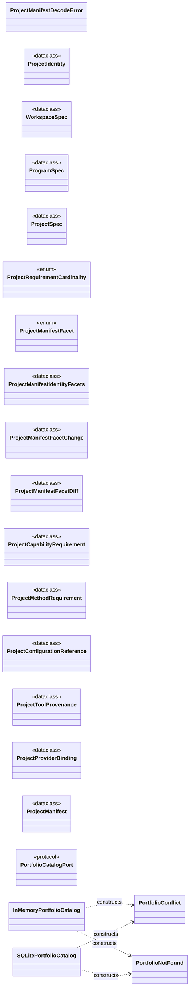

| Module | Class | Kind | Bases | Fields | Methods |
|---|---|---|---|---:|---:|
| `noetrium_platform.foundation.portfolio.api.contracts` | `ProjectManifestDecodeError` | `class` | `ValueError` | 0 | 0 |
| `noetrium_platform.foundation.portfolio.api.contracts` | `ProjectIdentity` | `dataclass` | `` | 2 | 3 |
| `noetrium_platform.foundation.portfolio.api.contracts` | `WorkspaceSpec` | `dataclass` | `` | 3 | 2 |
| `noetrium_platform.foundation.portfolio.api.contracts` | `ProgramSpec` | `dataclass` | `` | 4 | 2 |
| `noetrium_platform.foundation.portfolio.api.contracts` | `ProjectSpec` | `dataclass` | `` | 5 | 3 |
| `noetrium_platform.foundation.portfolio.api.contracts` | `ProjectRequirementCardinality` | `enum` | `StrEnum` | 2 | 0 |
| `noetrium_platform.foundation.portfolio.api.contracts` | `ProjectManifestFacet` | `enum` | `StrEnum` | 5 | 0 |
| `noetrium_platform.foundation.portfolio.api.contracts` | `ProjectManifestIdentityFacets` | `dataclass` | `` | 5 | 2 |
| `noetrium_platform.foundation.portfolio.api.contracts` | `ProjectManifestFacetChange` | `dataclass` | `` | 3 | 1 |
| `noetrium_platform.foundation.portfolio.api.contracts` | `ProjectManifestFacetDiff` | `dataclass` | `` | 3 | 2 |
| `noetrium_platform.foundation.portfolio.api.contracts` | `ProjectCapabilityRequirement` | `dataclass` | `` | 7 | 2 |
| `noetrium_platform.foundation.portfolio.api.contracts` | `ProjectMethodRequirement` | `dataclass` | `` | 3 | 1 |
| `noetrium_platform.foundation.portfolio.api.contracts` | `ProjectConfigurationReference` | `dataclass` | `` | 3 | 1 |
| `noetrium_platform.foundation.portfolio.api.contracts` | `ProjectToolProvenance` | `dataclass` | `` | 3 | 1 |
| `noetrium_platform.foundation.portfolio.api.contracts` | `ProjectProviderBinding` | `dataclass` | `` | 5 | 1 |
| `noetrium_platform.foundation.portfolio.api.contracts` | `ProjectManifest` | `dataclass` | `` | 8 | 5 |
| `noetrium_platform.foundation.portfolio.api.ports` | `PortfolioCatalogPort` | `protocol` | `Protocol` | 0 | 7 |
| `noetrium_platform.foundation.portfolio.runtime.catalog` | `PortfolioConflict` | `class` | `RuntimeError` | 0 | 0 |
| `noetrium_platform.foundation.portfolio.runtime.catalog` | `PortfolioNotFound` | `class` | `KeyError` | 0 | 0 |
| `noetrium_platform.foundation.portfolio.runtime.catalog` | `InMemoryPortfolioCatalog` | `class` | `` | 0 | 9 |
| `noetrium_platform.foundation.portfolio.runtime.catalog` | `SQLitePortfolioCatalog` | `class` | `` | 1 | 13 |

## Classes — `reliability`

Total classes: **169**.

```mermaid
classDiagram
direction LR
  class C_41c172eee984["IncidentPattern"]
  <<dataclass>> C_41c172eee984
  class C_b0317dc503c2["IncidentProjectionSync"]
  <<dataclass>> C_b0317dc503c2
  class C_bd809f56a872["IncidentProjectionPort"]
  <<protocol>> C_bd809f56a872
  class C_7d10d4320ecd["DiagnosticLogQueryPort"]
  <<protocol>> C_7d10d4320ecd
  class C_036a9859e243["MetricQueryRow"]
  class C_71acfe2dd2eb["DiagnosticIndexSessionPort"]
  <<protocol>> C_71acfe2dd2eb
  class C_ae467f6edf40["DiagnosticEvidencePort"]
  <<protocol>> C_ae467f6edf40
  class C_fab65ef660b7["MetricQueryPort"]
  <<protocol>> C_fab65ef660b7
  class C_aabac074536f["_FrozenJsonObject"]
  class C_f9acaa5d8ce1["DiagnosticObjectRecord"]
  <<dataclass>> C_f9acaa5d8ce1
  class C_5f3c671c051b["StateWriterRecord"]
  <<dataclass>> C_5f3c671c051b
  class C_7a9a561db159["OperationInvocationRecord"]
  <<dataclass>> C_7a9a561db159
  class C_b1f541faf06b["_FrozenAttributes"]
  class C_467fe1f8f84f["CausalNodeSnapshot"]
  <<dataclass>> C_467fe1f8f84f
  class C_e23d346e4ded["CausalEdge"]
  <<dataclass>> C_e23d346e4ded
  class C_6117002944b2["CausalGraphSnapshot"]
  <<dataclass>> C_6117002944b2
  class C_a8651100dfe4["CausalGraphService"]
  class C_fa02bc0d3b4e["_CausalNode"]
  <<dataclass>> C_fa02bc0d3b4e
  class C_885feace9f56["CausalGraph"]
  class C_4f4ef8a23d7f["PayloadProjector"]
  <<protocol>> C_4f4ef8a23d7f
  class C_fbda33dd1fb8["ContextProjector"]
  <<dataclass>> C_fbda33dd1fb8
  class C_1a02e861f14d["ReferenceProjector"]
  <<dataclass>> C_1a02e861f14d
  class C_bac969f4ff83["DebugSnapshot"]
  <<dataclass>> C_bac969f4ff83
  class C_72f16deb9993["DebugSnapshotService"]
  class C_48744cfdb738["FailureDiagnosis"]
  <<dataclass>> C_48744cfdb738
  class C_b681d1c16977["FailureDiagnosisService"]
  class C_70b8c85836b0["IncidentReport"]
  <<dataclass>> C_70b8c85836b0
  class C_473164ab8bbc["IncidentService"]
  class C_4c9f8030f284["DiagnosticLogQueryAdapter"]
  class C_912e90f51559["RuntimeAutomationAssessment"]
  <<dataclass>> C_912e90f51559
  class C_1e15a68af95e["RuntimeRecoveryDecisionService"]
  class C_9bbb3af012f3["RecoveryRule"]
  <<dataclass>> C_9bbb3af012f3
  class C_544bd1748c05["ForensicStatusProbe"]
  class C_21b457d3bfe1["TriageStep"]
  <<dataclass>> C_21b457d3bfe1
  class C_9d0688919480["DeterministicTriagePlan"]
  <<dataclass>> C_9d0688919480
  class C_10fdc19a0a6b["TriagePlanService"]
  class C_462b71079ea7["EvidenceVerificationReport"]
  <<dataclass>> C_462b71079ea7
  class C_d6671a75a75d["EvidenceVerifier"]
  class C_e76cf4aa3d7f["PreparedEffectHandle"]
  <<dataclass>> C_e76cf4aa3d7f
  class C_cf97bd01f4b8["EffectReconciliationDisposition"]
  <<enum>> C_cf97bd01f4b8
  class C_1b23774c6a05["EffectReconciliationProof"]
  <<dataclass>> C_1b23774c6a05
  class C_f05a91fa301b["EffectIntentPhase"]
  <<enum>> C_f05a91fa301b
  class C_ae8afba62eaf["EffectIntent"]
  <<dataclass>> C_ae8afba62eaf
  class C_79c7c86798e1["EffectCompletionEvidence"]
  <<dataclass>> C_79c7c86798e1
  class C_093e883b22cc["EffectIntentRecord"]
  <<dataclass>> C_093e883b22cc
  class C_407a3341d404["EffectIntentPrepareResult"]
  <<dataclass>> C_407a3341d404
  class C_90b7576f1527["EffectIntentConflict"]
  class C_69f5ce9dad0c["EffectJournalIntegrityError"]
  class C_c5bce99c8cac["EffectRecoveryRequired"]
  class C_cf24aedc0b76["EffectAlreadyConsumed"]
  class C_7453e0c5becd["PendingEffectRecoveryRequired"]
  class C_605489361aae["EffectRecoveryAnchorMissing"]
  class C_1aadbb927d8b["EffectIntentJournal"]
  <<protocol>> C_1aadbb927d8b
  class C_a1486fd681db["EffectJournalDocumentCodec"]
  class C_b9ac9a05af38["InMemoryEffectIntentJournal"]
  class C_820c6e979126["EncodedEffectIntentRecord"]
  <<dataclass>> C_820c6e979126
  class C_f341dc5e9e85["EffectJournalWriteSession"]
  <<protocol>> C_f341dc5e9e85
  class C_e682978316ee["EffectJournalPersistenceBackend"]
  <<protocol>> C_e682978316ee
  class C_3b4a8a3e7d36["EffectJournalCodec"]
  <<protocol>> C_3b4a8a3e7d36
  class C_758f79cad495["PersistentEffectIntentJournal"]
  class C_d3d9e3917bd3["EffectReconciliationProvider"]
  <<protocol>> C_d3d9e3917bd3
  class C_bc8e1e747d75["EffectReconciliationResult"]
  <<dataclass>> C_bc8e1e747d75
  class C_7ea5aab9ee47["EffectReconciliationService"]
  class C_a40ac5c6238d["SQLiteEffectIntentJournal"]
  class C_1bce15e5945b["SQLiteEffectJournalWriteSession"]
  class C_9ab241ae98d6["SQLiteEffectJournalBackend"]
  class C_f82d4fd111d5["FailureSpec"]
  <<dataclass>> C_f82d4fd111d5
  class C_2d78d7ed56c9["FailureCatalog"]
  class C_8e679a2c11d9["ClassifiedOperationFailure"]
  <<dataclass>> C_8e679a2c11d9
  class C_b8e7eb41eeb2["PartialOperationFailureClassifier"]
  <<protocol>> C_b8e7eb41eeb2
  class C_c24302523e46["RiskLevel"]
  <<enum>> C_c24302523e46
  class C_f6264e4910c6["RecoveryAction"]
  <<enum>> C_f6264e4910c6
  class C_ad5109d8ebd7["FailureEnvelope"]
  <<dataclass>> C_ad5109d8ebd7
  class C_51b785a6031d["FailureCorrelationSource"]
  <<protocol>> C_51b785a6031d
  class C_308a29e2a5af["FailureFingerprint"]
  <<dataclass>> C_308a29e2a5af
  class C_ca2d90171473["FailureLedgerPort"]
  <<protocol>> C_ca2d90171473
  class C_30380fd10278["OperationFailureReferenceProjection"]
  <<dataclass>> C_30380fd10278
  class C_cbbd0ab6c972["OperationFailureReferenceProjector"]
  <<protocol>> C_cbbd0ab6c972
  class C_14d98e395d38["CrashBundleManifest"]
  <<dataclass>> C_14d98e395d38
  class C_294e52306e30["CrashBundleVerification"]
  <<dataclass>> C_294e52306e30
  class C_272af0646be9["VerifiedLedgerCut"]
  <<dataclass>> C_272af0646be9
  class C_21555c7808ef["VerifiedLedgerSlice"]
  <<dataclass>> C_21555c7808ef
  class C_1d48128e802c["MutationRecord"]
  <<dataclass>> C_1d48128e802c
  class C_6a19c4294dd7["ForensicWriteActorPort"]
  <<protocol>> C_6a19c4294dd7
  class C_fb1d58cd2cfd["ForensicLedgerPort"]
  <<protocol>> C_fb1d58cd2cfd
  class C_f9b0566dc517["ForensicIndexReadSessionPort"]
  <<protocol>> C_f9b0566dc517
  class C_ee528f701ef2["ForensicIndexPort"]
  <<protocol>> C_ee528f701ef2
  class C_730f81bfe25b["ForensicEventWriteLanePort"]
  <<protocol>> C_730f81bfe25b
  class C_dffe9b9ed5ef["ForensicCriticalWriteLanePort"]
  <<protocol>> C_dffe9b9ed5ef
  class C_6c8ef1ef2c10["ForensicWriterLeasePort"]
  <<protocol>> C_6c8ef1ef2c10
  class C_bf2876410c73["ForensicStorePort"]
  <<protocol>> C_bf2876410c73
  class C_0c293ccc75c0["ForensicRuntimeParts"]
  <<dataclass>> C_0c293ccc75c0
  class C_c5332c10c9f3["ForensicIncidentProjection"]
  class C_be3e72050283["IncidentPatternIndex"]
  class C_d404c11e9620["IndexFreshnessReport"]
  <<dataclass>> C_d404c11e9620
  class C_cf83bdeead3c["IndexRebuildReport"]
  <<dataclass>> C_cf83bdeead3c
  class C_2aa1d0b932bc["ForensicStore"]
  class C_1c6aaa07299b["DirectoryChangeSignal"]
  class C_73467dc68ca7["WriterTail"]
  <<dataclass>> C_73467dc68ca7
  class C_3765c0c344ac["HashChainedJSONL"]
  class C_b180c6c584bd["HashChainError"]
  class C_a7f78a844818["_HashChainScan"]
  <<dataclass>> C_a7f78a844818
  class C_072b1eb533ec["HashTailStateCell"]
  class C_c96f5c07c606["HashLedgerWriter"]
  class C_7cccba29e184["IncidentSQLiteStore"]
  class C_ac649416dd19["IncidentProjectionWriter"]
  class C_e95a96693068["IncidentLedgerSynchronizer"]
  class C_0084596da8bb["ForensicIndex"]
  class C_17f2966f46ca["ForensicProjectionBackend"]
  class C_09f1c33d0164["ForensicIndexDB"]
  class C_e2f38b165d3f["ObjectProjection"]
  <<dataclass>> C_e2f38b165d3f
  class C_2845305990cd["StateWriterProjection"]
  <<dataclass>> C_2845305990cd
  class C_0576fb9e9c7f["ProjectionBundle"]
  <<dataclass>> C_0576fb9e9c7f
  class C_e12320947f27["ForensicIndexReader"]
  class C_3ea35fc63ccd["ForensicIndexReadSession"]
  class C_933906936e4b["ForensicIndexWriteSession"]
  class C_1a2fe557bb80["ForensicIndexWriter"]
  class C_bcacc6166f2f["ForensicWriterBusy"]
  class C_1f6283192e73["ForensicWriterLease"]
  class C_1f4e351eede7["_LinuxInotifyHub"]
  class C_08e1b7df8e08["LinuxDirectoryWatch"]
  class C_9976aead2a11["OperationInvocationProjection"]
  <<dataclass>> C_9976aead2a11
  class C_bb7ff3ec3ca4["SegmentScanSummary"]
  <<dataclass>> C_bb7ff3ec3ca4
  class C_465883e72e2d["SegmentScanResult"]
  <<dataclass>> C_465883e72e2d
  class C_054d802a8340["SegmentedHashChainedJSONL"]
  class C_087bd32473e1["SegmentSummary"]
  <<dataclass>> C_087bd32473e1
  class C_6c12f2c1f1fc["SegmentManifestStore"]
  class C_dbb4c91bf70c["SegmentWriterState"]
  <<dataclass>> C_dbb4c91bf70c
  class C_7ad8056fce14["SegmentStateCell"]
  class C_2f536ba4258f["SegmentedAppendReceipt"]
  <<dataclass>> C_2f536ba4258f
  class C_4c7faf56db31["SegmentedLedgerWriter"]
  class C_1d9f5904aa4b["FailureCatalogAuditReport"]
  <<dataclass>> C_1d9f5904aa4b
  class C_b81a48a372c7["FailureCatalogSourceAudit"]
  class C_e6f78fd15379["CrashBundleBuilder"]
  class C_9d06478eef68["ForensicDiagnosticEvidence"]
  class C_5aecfdc65121["EventProjectionBuffer"]
  class C_c53213e0c68e["Breadcrumb"]
  <<dataclass>> C_c53213e0c68e
  class C_887f1b2de804["BreadcrumbBuffer"]
  class C_0f2c03c3a8ca["ForensicRecordDegradation"]
  <<dataclass>> C_0f2c03c3a8ca
  class C_3e93c2389e50["FailureRecordOutcome"]
  <<dataclass>> C_3e93c2389e50
  class C_437b3260d8d7["FailureRecorder"]
  class C_6d71fe4b8477["ForensicRuntimeBundle"]
  <<dataclass>> C_6d71fe4b8477
  class C_5b2a2101ac29["ForensicRuntimeLifecycle"]
  <<dataclass>> C_5b2a2101ac29
  class C_8a88a4a8bfd5["TriageReport"]
  <<dataclass>> C_8a88a4a8bfd5
  class C_05f1690d4c23["ForensicProjectionError"]
  class C_3f602b0cd2bb["EventWriteLane"]
  class C_b8f708079383["CriticalWriteLane"]
  class C_953d31c873e2["CrashClass"]
  <<enum>> C_953d31c873e2
  class C_440bf165d6b0["CrashEvidence"]
  <<dataclass>> C_440bf165d6b0
  class C_41087b1cbc1a["CrashDiagnosis"]
  <<dataclass>> C_41087b1cbc1a
  class C_be1750a586e0["RuntimeFault"]
  class C_c47ab9206121["FrozenRuntimeIdentityViolation"]
  class C_ade650ef0fac["RuntimeOperationalHealthUnavailable"]
  class C_b344724444a5["RecoveryActionCode"]
  <<enum>> C_b344724444a5
  class C_c4818b308a86["RecoveryAutomation"]
  <<enum>> C_c4818b308a86
  class C_af64bb766ba6["RecoveryRecommendation"]
  <<dataclass>> C_af64bb766ba6
  class C_ac93ad42c36d["RecoveryDecisionReport"]
  <<dataclass>> C_ac93ad42c36d
  class C_85ac13f00805["RecoveryLease"]
  <<dataclass>> C_85ac13f00805
  class C_8aded49ecafe["RecoveryLeaseBusy"]
  class C_b81e65237aa8["RecoveryLeaseReadPort"]
  <<protocol>> C_b81e65237aa8
  class C_e7d11c2456c8["RecoveryLeaseStatusPort"]
  <<protocol>> C_e7d11c2456c8
  class C_a01f61cf01b1["RecoveryLeaseStatePort"]
  <<protocol>> C_a01f61cf01b1
  class C_dba1d50b409f["RecoveryExecutionPort"]
  <<protocol>> C_dba1d50b409f
  class C_3fce30f5c68d["RecoveryExecutionFactoryPort"]
  <<protocol>> C_3fce30f5c68d
  class C_a93ede6981ec["RecoveryLeaseStatusEventPublisher"]
  class C_72db87c6c31e["RecoveryLeaseStatusEventProjection"]
  class C_7485e551e92f["FileLockedRecoveryExecution"]
  class C_558cfd887312["FileLockedRecoveryExecutionFactory"]
  class C_4a849e161d00["RecoveryLeaseAdapter"]
  C_7d10d4320ecd <|-- C_4c9f8030f284
  C_c5bce99c8cac <|-- C_cf24aedc0b76
  C_c5bce99c8cac <|-- C_605489361aae
  C_c5bce99c8cac <|-- C_7453e0c5becd
  C_758f79cad495 <|-- C_a40ac5c6238d
  C_e682978316ee <|-- C_9ab241ae98d6
  C_f9b0566dc517 <|-- C_ee528f701ef2
  C_be1750a586e0 <|-- C_c47ab9206121
  C_be1750a586e0 <|-- C_ade650ef0fac
  C_b81e65237aa8 <|-- C_a01f61cf01b1
  C_b81e65237aa8 <|-- C_e7d11c2456c8
  C_a8651100dfe4 ..> C_6117002944b2 : constructs
  C_a8651100dfe4 ..> C_467fe1f8f84f : constructs
  C_a8651100dfe4 ..> C_885feace9f56 : constructs
  C_a8651100dfe4 ..> C_fbda33dd1fb8 : constructs
  C_a8651100dfe4 ..> C_1a02e861f14d : constructs
  C_885feace9f56 ..> C_e23d346e4ded : constructs
  C_885feace9f56 ..> C_fa02bc0d3b4e : constructs
  C_72f16deb9993 ..> C_a8651100dfe4 : constructs
  C_72f16deb9993 ..> C_bac969f4ff83 : constructs
  C_72f16deb9993 ..> C_b681d1c16977 : constructs
  C_b681d1c16977 ..> C_48744cfdb738 : constructs
  C_473164ab8bbc ..> C_70b8c85836b0 : constructs
  C_1e15a68af95e ..> C_912e90f51559 : constructs
  C_10fdc19a0a6b ..> C_9d0688919480 : constructs
  C_10fdc19a0a6b ..> C_21b457d3bfe1 : constructs
  C_d6671a75a75d ..> C_462b71079ea7 : constructs
  C_a1486fd681db ..> C_820c6e979126 : constructs
  C_758f79cad495 ..> C_a1486fd681db : constructs
  C_7ea5aab9ee47 ..> C_c5bce99c8cac : constructs
  C_7ea5aab9ee47 ..> C_bc8e1e747d75 : constructs
  C_a40ac5c6238d ..> C_9ab241ae98d6 : constructs
  C_9ab241ae98d6 ..> C_1bce15e5945b : constructs
  C_c5332c10c9f3 ..> C_be3e72050283 : constructs
  C_be3e72050283 ..> C_7cccba29e184 : constructs
  C_be3e72050283 ..> C_ac649416dd19 : constructs
  C_be3e72050283 ..> C_e95a96693068 : constructs
  C_2aa1d0b932bc ..> C_6d71fe4b8477 : constructs
  C_2aa1d0b932bc ..> C_5b2a2101ac29 : constructs
  C_3765c0c344ac ..> C_b180c6c584bd : constructs
  C_3765c0c344ac ..> C_072b1eb533ec : constructs
  C_3765c0c344ac ..> C_c96f5c07c606 : constructs
  C_072b1eb533ec ..> C_73467dc68ca7 : constructs
  C_0084596da8bb ..> C_09f1c33d0164 : constructs
  C_0084596da8bb ..> C_e12320947f27 : constructs
  C_0084596da8bb ..> C_1a2fe557bb80 : constructs
  C_17f2966f46ca ..> C_933906936e4b : constructs
  C_e12320947f27 ..> C_3ea35fc63ccd : constructs
  C_1a2fe557bb80 ..> C_17f2966f46ca : constructs
  C_1f6283192e73 ..> C_bcacc6166f2f : constructs
  C_054d802a8340 ..> C_1c6aaa07299b : constructs
  C_054d802a8340 ..> C_6c12f2c1f1fc : constructs
  C_054d802a8340 ..> C_087bd32473e1 : constructs
  C_054d802a8340 ..> C_7ad8056fce14 : constructs
  C_054d802a8340 ..> C_dbb4c91bf70c : constructs
  C_054d802a8340 ..> C_4c7faf56db31 : constructs
  C_7ad8056fce14 ..> C_dbb4c91bf70c : constructs
  C_4c7faf56db31 ..> C_dbb4c91bf70c : constructs
  C_4c7faf56db31 ..> C_2f536ba4258f : constructs
  C_b81a48a372c7 ..> C_1d9f5904aa4b : constructs
  C_e6f78fd15379 ..> C_14d98e395d38 : constructs
  C_887f1b2de804 ..> C_c53213e0c68e : constructs
  C_437b3260d8d7 ..> C_3e93c2389e50 : constructs
  C_6d71fe4b8477 ..> C_05f1690d4c23 : constructs
  C_b8f708079383 ..> C_05f1690d4c23 : constructs
  C_3f602b0cd2bb ..> C_5aecfdc65121 : constructs
  C_3f602b0cd2bb ..> C_05f1690d4c23 : constructs
  C_7485e551e92f ..> C_8aded49ecafe : constructs
  C_558cfd887312 ..> C_7485e551e92f : constructs
  C_4a849e161d00 ..> C_85ac13f00805 : constructs
  C_4a849e161d00 ..> C_8aded49ecafe : constructs
```

| Module | Class | Kind | Bases | Fields | Methods |
|---|---|---|---|---:|---:|
| `noetrium_platform.infrastructure.reliability.diagnostics.api.incidents` | `IncidentPattern` | `dataclass` | `` | 9 | 0 |
| `noetrium_platform.infrastructure.reliability.diagnostics.api.incidents` | `IncidentProjectionSync` | `dataclass` | `` | 4 | 0 |
| `noetrium_platform.infrastructure.reliability.diagnostics.api.incidents` | `IncidentProjectionPort` | `protocol` | `Protocol` | 0 | 2 |
| `noetrium_platform.infrastructure.reliability.diagnostics.api.logging` | `DiagnosticLogQueryPort` | `protocol` | `Protocol` | 0 | 1 |
| `noetrium_platform.infrastructure.reliability.diagnostics.api.ports` | `MetricQueryRow` | `class` | `TypedDict` | 12 | 0 |
| `noetrium_platform.infrastructure.reliability.diagnostics.api.ports` | `DiagnosticIndexSessionPort` | `protocol` | `Protocol` | 0 | 8 |
| `noetrium_platform.infrastructure.reliability.diagnostics.api.ports` | `DiagnosticEvidencePort` | `protocol` | `Protocol` | 0 | 10 |
| `noetrium_platform.infrastructure.reliability.diagnostics.api.ports` | `MetricQueryPort` | `protocol` | `Protocol` | 0 | 1 |
| `noetrium_platform.infrastructure.reliability.diagnostics.api.records` | `_FrozenJsonObject` | `class` | `dict[str, JsonValue]` | 5 | 1 |
| `noetrium_platform.infrastructure.reliability.diagnostics.api.records` | `DiagnosticObjectRecord` | `dataclass` | `` | 10 | 2 |
| `noetrium_platform.infrastructure.reliability.diagnostics.api.records` | `StateWriterRecord` | `dataclass` | `` | 13 | 2 |
| `noetrium_platform.infrastructure.reliability.diagnostics.api.records` | `OperationInvocationRecord` | `dataclass` | `` | 18 | 3 |
| `noetrium_platform.infrastructure.reliability.diagnostics.runtime.causal_contracts` | `_FrozenAttributes` | `class` | `dict[str, JsonScalar]` | 5 | 1 |
| `noetrium_platform.infrastructure.reliability.diagnostics.runtime.causal_contracts` | `CausalNodeSnapshot` | `dataclass` | `` | 3 | 1 |
| `noetrium_platform.infrastructure.reliability.diagnostics.runtime.causal_contracts` | `CausalEdge` | `dataclass` | `` | 3 | 1 |
| `noetrium_platform.infrastructure.reliability.diagnostics.runtime.causal_contracts` | `CausalGraphSnapshot` | `dataclass` | `` | 3 | 1 |
| `noetrium_platform.infrastructure.reliability.diagnostics.runtime.causal_graph` | `CausalGraphService` | `class` | `` | 0 | 3 |
| `noetrium_platform.infrastructure.reliability.diagnostics.runtime.causal_model` | `_CausalNode` | `dataclass` | `` | 3 | 0 |
| `noetrium_platform.infrastructure.reliability.diagnostics.runtime.causal_model` | `CausalGraph` | `class` | `` | 0 | 5 |
| `noetrium_platform.infrastructure.reliability.diagnostics.runtime.causal_projection` | `PayloadProjector` | `protocol` | `Protocol` | 0 | 1 |
| `noetrium_platform.infrastructure.reliability.diagnostics.runtime.causal_projection` | `ContextProjector` | `dataclass` | `` | 1 | 1 |
| `noetrium_platform.infrastructure.reliability.diagnostics.runtime.causal_projection` | `ReferenceProjector` | `dataclass` | `` | 1 | 1 |
| `noetrium_platform.infrastructure.reliability.diagnostics.runtime.debug_snapshot` | `DebugSnapshot` | `dataclass` | `` | 8 | 0 |
| `noetrium_platform.infrastructure.reliability.diagnostics.runtime.debug_snapshot` | `DebugSnapshotService` | `class` | `` | 0 | 2 |
| `noetrium_platform.infrastructure.reliability.diagnostics.runtime.diagnosis` | `FailureDiagnosis` | `dataclass` | `` | 10 | 0 |
| `noetrium_platform.infrastructure.reliability.diagnostics.runtime.diagnosis` | `FailureDiagnosisService` | `class` | `` | 0 | 5 |
| `noetrium_platform.infrastructure.reliability.diagnostics.runtime.incident` | `IncidentReport` | `dataclass` | `` | 13 | 0 |
| `noetrium_platform.infrastructure.reliability.diagnostics.runtime.incident` | `IncidentService` | `class` | `` | 0 | 2 |
| `noetrium_platform.infrastructure.reliability.diagnostics.runtime.logging` | `DiagnosticLogQueryAdapter` | `class` | `DiagnosticLogQueryPort` | 0 | 2 |
| `noetrium_platform.infrastructure.reliability.diagnostics.runtime.runtime_recovery` | `RuntimeAutomationAssessment` | `dataclass` | `` | 5 | 1 |
| `noetrium_platform.infrastructure.reliability.diagnostics.runtime.runtime_recovery` | `RuntimeRecoveryDecisionService` | `class` | `` | 0 | 2 |
| `noetrium_platform.infrastructure.reliability.diagnostics.runtime.runtime_recovery_rules` | `RecoveryRule` | `dataclass` | `` | 6 | 1 |
| `noetrium_platform.infrastructure.reliability.diagnostics.runtime.status_projection` | `ForensicStatusProbe` | `class` | `` | 0 | 2 |
| `noetrium_platform.infrastructure.reliability.diagnostics.runtime.triage` | `TriageStep` | `dataclass` | `` | 5 | 0 |
| `noetrium_platform.infrastructure.reliability.diagnostics.runtime.triage` | `DeterministicTriagePlan` | `dataclass` | `` | 6 | 0 |
| `noetrium_platform.infrastructure.reliability.diagnostics.runtime.triage` | `TriagePlanService` | `class` | `` | 0 | 2 |
| `noetrium_platform.infrastructure.reliability.diagnostics.runtime.verify` | `EvidenceVerificationReport` | `dataclass` | `` | 3 | 0 |
| `noetrium_platform.infrastructure.reliability.diagnostics.runtime.verify` | `EvidenceVerifier` | `class` | `` | 0 | 2 |
| `noetrium_platform.infrastructure.reliability.effect.api.contracts` | `PreparedEffectHandle` | `dataclass` | `` | 6 | 2 |
| `noetrium_platform.infrastructure.reliability.effect.api.contracts` | `EffectReconciliationDisposition` | `enum` | `StrEnum` | 4 | 0 |
| `noetrium_platform.infrastructure.reliability.effect.api.contracts` | `EffectReconciliationProof` | `dataclass` | `` | 4 | 0 |
| `noetrium_platform.infrastructure.reliability.effect.api.journal` | `EffectIntentPhase` | `enum` | `StrEnum` | 5 | 1 |
| `noetrium_platform.infrastructure.reliability.effect.api.journal` | `EffectIntent` | `dataclass` | `` | 14 | 1 |
| `noetrium_platform.infrastructure.reliability.effect.api.journal` | `EffectCompletionEvidence` | `dataclass` | `` | 4 | 1 |
| `noetrium_platform.infrastructure.reliability.effect.api.journal` | `EffectIntentRecord` | `dataclass` | `` | 6 | 0 |
| `noetrium_platform.infrastructure.reliability.effect.api.journal` | `EffectIntentPrepareResult` | `dataclass` | `` | 2 | 0 |
| `noetrium_platform.infrastructure.reliability.effect.api.journal` | `EffectIntentConflict` | `class` | `RuntimeError` | 0 | 0 |
| `noetrium_platform.infrastructure.reliability.effect.api.journal` | `EffectJournalIntegrityError` | `class` | `ValueError` | 0 | 0 |
| `noetrium_platform.infrastructure.reliability.effect.api.journal` | `EffectRecoveryRequired` | `class` | `RuntimeError` | 0 | 0 |
| `noetrium_platform.infrastructure.reliability.effect.api.journal` | `EffectAlreadyConsumed` | `class` | `EffectRecoveryRequired` | 0 | 0 |
| `noetrium_platform.infrastructure.reliability.effect.api.journal` | `PendingEffectRecoveryRequired` | `class` | `EffectRecoveryRequired` | 0 | 0 |
| `noetrium_platform.infrastructure.reliability.effect.api.journal` | `EffectRecoveryAnchorMissing` | `class` | `EffectRecoveryRequired` | 0 | 0 |
| `noetrium_platform.infrastructure.reliability.effect.api.journal` | `EffectIntentJournal` | `protocol` | `Protocol` | 1 | 7 |
| `noetrium_platform.infrastructure.reliability.effect.runtime.generic_codec` | `EffectJournalDocumentCodec` | `class` | `` | 1 | 13 |
| `noetrium_platform.infrastructure.reliability.effect.runtime.memory` | `InMemoryEffectIntentJournal` | `class` | `EffectIntentJournal` | 1 | 10 |
| `noetrium_platform.infrastructure.reliability.effect.runtime.persistence` | `EncodedEffectIntentRecord` | `dataclass` | `` | 11 | 0 |
| `noetrium_platform.infrastructure.reliability.effect.runtime.persistence` | `EffectJournalWriteSession` | `protocol` | `AbstractContextManager['EffectJournalWriteSession'], Protocol` | 0 | 4 |
| `noetrium_platform.infrastructure.reliability.effect.runtime.persistence` | `EffectJournalPersistenceBackend` | `protocol` | `Protocol` | 1 | 3 |
| `noetrium_platform.infrastructure.reliability.effect.runtime.persistent` | `EffectJournalCodec` | `protocol` | `Protocol` | 0 | 3 |
| `noetrium_platform.infrastructure.reliability.effect.runtime.persistent` | `PersistentEffectIntentJournal` | `class` | `EffectIntentJournal` | 0 | 10 |
| `noetrium_platform.infrastructure.reliability.effect.runtime.reconciliation` | `EffectReconciliationProvider` | `protocol` | `Protocol` | 0 | 1 |
| `noetrium_platform.infrastructure.reliability.effect.runtime.reconciliation` | `EffectReconciliationResult` | `dataclass` | `` | 4 | 0 |
| `noetrium_platform.infrastructure.reliability.effect.runtime.reconciliation` | `EffectReconciliationService` | `class` | `` | 0 | 3 |
| `noetrium_platform.infrastructure.reliability.effect.runtime.sqlite` | `SQLiteEffectIntentJournal` | `class` | `PersistentEffectIntentJournal` | 0 | 1 |
| `noetrium_platform.infrastructure.reliability.effect.runtime.sqlite_backend` | `SQLiteEffectJournalWriteSession` | `class` | `AbstractContextManager['SQLiteEffectJournalWriteSession']` | 0 | 6 |
| `noetrium_platform.infrastructure.reliability.effect.runtime.sqlite_backend` | `SQLiteEffectJournalBackend` | `class` | `EffectJournalPersistenceBackend` | 2 | 7 |
| `noetrium_platform.infrastructure.reliability.failure.api.catalog` | `FailureSpec` | `dataclass` | `` | 11 | 2 |
| `noetrium_platform.infrastructure.reliability.failure.api.catalog` | `FailureCatalog` | `class` | `` | 0 | 7 |
| `noetrium_platform.infrastructure.reliability.failure.api.classification` | `ClassifiedOperationFailure` | `dataclass` | `` | 2 | 0 |
| `noetrium_platform.infrastructure.reliability.failure.api.classification` | `PartialOperationFailureClassifier` | `protocol` | `Protocol` | 0 | 1 |
| `noetrium_platform.infrastructure.reliability.failure.api.contracts` | `RiskLevel` | `enum` | `StrEnum` | 5 | 0 |
| `noetrium_platform.infrastructure.reliability.failure.api.contracts` | `RecoveryAction` | `enum` | `StrEnum` | 13 | 0 |
| `noetrium_platform.infrastructure.reliability.failure.api.contracts` | `FailureEnvelope` | `dataclass` | `` | 32 | 1 |
| `noetrium_platform.infrastructure.reliability.failure.api.exception_refs` | `FailureCorrelationSource` | `protocol` | `Protocol` | 0 | 1 |
| `noetrium_platform.infrastructure.reliability.failure.api.fingerprint` | `FailureFingerprint` | `dataclass` | `` | 4 | 0 |
| `noetrium_platform.infrastructure.reliability.failure.api.ports` | `FailureLedgerPort` | `protocol` | `Protocol` | 0 | 1 |
| `noetrium_platform.infrastructure.reliability.failure.api.references` | `OperationFailureReferenceProjection` | `dataclass` | `` | 4 | 0 |
| `noetrium_platform.infrastructure.reliability.failure.api.references` | `OperationFailureReferenceProjector` | `protocol` | `Protocol` | 0 | 1 |
| `noetrium_platform.infrastructure.reliability.forensics.api.crash_bundle_contracts` | `CrashBundleManifest` | `dataclass` | `` | 10 | 0 |
| `noetrium_platform.infrastructure.reliability.forensics.api.crash_bundle_contracts` | `CrashBundleVerification` | `dataclass` | `` | 5 | 0 |
| `noetrium_platform.infrastructure.reliability.forensics.api.ledger` | `VerifiedLedgerCut` | `dataclass` | `` | 4 | 2 |
| `noetrium_platform.infrastructure.reliability.forensics.api.ledger` | `VerifiedLedgerSlice` | `dataclass` | `` | 5 | 2 |
| `noetrium_platform.infrastructure.reliability.forensics.api.mutation` | `MutationRecord` | `dataclass` | `` | 13 | 1 |
| `noetrium_platform.infrastructure.reliability.forensics.api.ports` | `ForensicWriteActorPort` | `protocol` | `Protocol` | 0 | 2 |
| `noetrium_platform.infrastructure.reliability.forensics.api.ports` | `ForensicLedgerPort` | `protocol` | `Protocol` | 0 | 7 |
| `noetrium_platform.infrastructure.reliability.forensics.api.ports` | `ForensicIndexReadSessionPort` | `protocol` | `Protocol` | 0 | 8 |
| `noetrium_platform.infrastructure.reliability.forensics.api.ports` | `ForensicIndexPort` | `protocol` | `ForensicIndexReadSessionPort, Protocol` | 0 | 13 |
| `noetrium_platform.infrastructure.reliability.forensics.api.ports` | `ForensicEventWriteLanePort` | `protocol` | `Protocol` | 0 | 4 |
| `noetrium_platform.infrastructure.reliability.forensics.api.ports` | `ForensicCriticalWriteLanePort` | `protocol` | `Protocol` | 0 | 1 |
| `noetrium_platform.infrastructure.reliability.forensics.api.ports` | `ForensicWriterLeasePort` | `protocol` | `Protocol` | 0 | 1 |
| `noetrium_platform.infrastructure.reliability.forensics.api.ports` | `ForensicStorePort` | `protocol` | `Protocol` | 0 | 13 |
| `noetrium_platform.infrastructure.reliability.forensics.api.runtime_parts` | `ForensicRuntimeParts` | `dataclass` | `` | 8 | 0 |
| `noetrium_platform.infrastructure.reliability.forensics.composition.incident_adapter` | `ForensicIncidentProjection` | `class` | `` | 0 | 3 |
| `noetrium_platform.infrastructure.reliability.forensics.composition.incident_index` | `IncidentPatternIndex` | `class` | `` | 0 | 4 |
| `noetrium_platform.infrastructure.reliability.forensics.composition.rebuild` | `IndexFreshnessReport` | `dataclass` | `` | 3 | 0 |
| `noetrium_platform.infrastructure.reliability.forensics.composition.rebuild` | `IndexRebuildReport` | `dataclass` | `` | 3 | 0 |
| `noetrium_platform.infrastructure.reliability.forensics.composition.store` | `ForensicStore` | `class` | `` | 1 | 19 |
| `noetrium_platform.infrastructure.reliability.forensics.providers.directory_change_signal` | `DirectoryChangeSignal` | `class` | `` | 0 | 9 |
| `noetrium_platform.infrastructure.reliability.forensics.providers.hashchain_core` | `WriterTail` | `dataclass` | `` | 5 | 2 |
| `noetrium_platform.infrastructure.reliability.forensics.providers.hashlog` | `HashChainedJSONL` | `class` | `` | 0 | 9 |
| `noetrium_platform.infrastructure.reliability.forensics.providers.hashlog_scanner` | `HashChainError` | `class` | `RuntimeError` | 0 | 0 |
| `noetrium_platform.infrastructure.reliability.forensics.providers.hashlog_scanner` | `_HashChainScan` | `dataclass` | `` | 4 | 0 |
| `noetrium_platform.infrastructure.reliability.forensics.providers.hashlog_state` | `HashTailStateCell` | `class` | `` | 0 | 4 |
| `noetrium_platform.infrastructure.reliability.forensics.providers.hashlog_writer` | `HashLedgerWriter` | `class` | `` | 0 | 2 |
| `noetrium_platform.infrastructure.reliability.forensics.providers.incident_db` | `IncidentSQLiteStore` | `class` | `` | 0 | 8 |
| `noetrium_platform.infrastructure.reliability.forensics.providers.incident_projection` | `IncidentProjectionWriter` | `class` | `` | 0 | 2 |
| `noetrium_platform.infrastructure.reliability.forensics.providers.incident_sync` | `IncidentLedgerSynchronizer` | `class` | `` | 0 | 2 |
| `noetrium_platform.infrastructure.reliability.forensics.providers.index` | `ForensicIndex` | `class` | `` | 0 | 26 |
| `noetrium_platform.infrastructure.reliability.forensics.providers.index_backend` | `ForensicProjectionBackend` | `class` | `` | 0 | 7 |
| `noetrium_platform.infrastructure.reliability.forensics.providers.index_db` | `ForensicIndexDB` | `class` | `` | 0 | 3 |
| `noetrium_platform.infrastructure.reliability.forensics.providers.index_projection` | `ObjectProjection` | `dataclass` | `` | 1 | 0 |
| `noetrium_platform.infrastructure.reliability.forensics.providers.index_projection` | `StateWriterProjection` | `dataclass` | `` | 1 | 0 |
| `noetrium_platform.infrastructure.reliability.forensics.providers.index_projection` | `ProjectionBundle` | `dataclass` | `` | 3 | 0 |
| `noetrium_platform.infrastructure.reliability.forensics.providers.index_reader` | `ForensicIndexReader` | `class` | `` | 0 | 11 |
| `noetrium_platform.infrastructure.reliability.forensics.providers.index_session` | `ForensicIndexReadSession` | `class` | `` | 0 | 14 |
| `noetrium_platform.infrastructure.reliability.forensics.providers.index_write_session` | `ForensicIndexWriteSession` | `class` | `` | 0 | 12 |
| `noetrium_platform.infrastructure.reliability.forensics.providers.index_writer` | `ForensicIndexWriter` | `class` | `` | 0 | 12 |
| `noetrium_platform.infrastructure.reliability.forensics.providers.lease` | `ForensicWriterBusy` | `class` | `RuntimeError` | 0 | 0 |
| `noetrium_platform.infrastructure.reliability.forensics.providers.lease` | `ForensicWriterLease` | `class` | `` | 0 | 5 |
| `noetrium_platform.infrastructure.reliability.forensics.providers.linux_directory_watch` | `_LinuxInotifyHub` | `class` | `` | 0 | 12 |
| `noetrium_platform.infrastructure.reliability.forensics.providers.linux_directory_watch` | `LinuxDirectoryWatch` | `class` | `` | 0 | 5 |
| `noetrium_platform.infrastructure.reliability.forensics.providers.operation_projection` | `OperationInvocationProjection` | `dataclass` | `` | 1 | 0 |
| `noetrium_platform.infrastructure.reliability.forensics.providers.segment_verifier` | `SegmentScanSummary` | `dataclass` | `` | 6 | 0 |
| `noetrium_platform.infrastructure.reliability.forensics.providers.segment_verifier` | `SegmentScanResult` | `dataclass` | `` | 3 | 0 |
| `noetrium_platform.infrastructure.reliability.forensics.providers.segmented_hashlog` | `SegmentedHashChainedJSONL` | `class` | `` | 0 | 15 |
| `noetrium_platform.infrastructure.reliability.forensics.providers.segmented_manifest` | `SegmentSummary` | `dataclass` | `` | 6 | 0 |
| `noetrium_platform.infrastructure.reliability.forensics.providers.segmented_manifest` | `SegmentManifestStore` | `class` | `` | 0 | 2 |
| `noetrium_platform.infrastructure.reliability.forensics.providers.segmented_state` | `SegmentWriterState` | `dataclass` | `` | 8 | 0 |
| `noetrium_platform.infrastructure.reliability.forensics.providers.segmented_state` | `SegmentStateCell` | `class` | `` | 0 | 3 |
| `noetrium_platform.infrastructure.reliability.forensics.providers.segmented_writer` | `SegmentedAppendReceipt` | `dataclass` | `` | 2 | 0 |
| `noetrium_platform.infrastructure.reliability.forensics.providers.segmented_writer` | `SegmentedLedgerWriter` | `class` | `` | 0 | 3 |
| `noetrium_platform.infrastructure.reliability.forensics.runtime.catalog_audit` | `FailureCatalogAuditReport` | `dataclass` | `` | 4 | 0 |
| `noetrium_platform.infrastructure.reliability.forensics.runtime.catalog_audit` | `FailureCatalogSourceAudit` | `class` | `` | 0 | 4 |
| `noetrium_platform.infrastructure.reliability.forensics.runtime.crash_bundle` | `CrashBundleBuilder` | `class` | `` | 1 | 5 |
| `noetrium_platform.infrastructure.reliability.forensics.runtime.diagnostic_adapter` | `ForensicDiagnosticEvidence` | `class` | `` | 0 | 11 |
| `noetrium_platform.infrastructure.reliability.forensics.runtime.event_projection_buffer` | `EventProjectionBuffer` | `class` | `` | 1 | 5 |
| `noetrium_platform.infrastructure.reliability.forensics.runtime.recorder` | `Breadcrumb` | `dataclass` | `` | 5 | 0 |
| `noetrium_platform.infrastructure.reliability.forensics.runtime.recorder` | `BreadcrumbBuffer` | `class` | `` | 0 | 3 |
| `noetrium_platform.infrastructure.reliability.forensics.runtime.recorder` | `ForensicRecordDegradation` | `dataclass` | `` | 4 | 1 |
| `noetrium_platform.infrastructure.reliability.forensics.runtime.recorder` | `FailureRecordOutcome` | `dataclass` | `` | 2 | 0 |
| `noetrium_platform.infrastructure.reliability.forensics.runtime.recorder` | `FailureRecorder` | `class` | `` | 0 | 2 |
| `noetrium_platform.infrastructure.reliability.forensics.runtime.runtime_bundle` | `ForensicRuntimeBundle` | `dataclass` | `` | 4 | 14 |
| `noetrium_platform.infrastructure.reliability.forensics.runtime.runtime_lifecycle` | `ForensicRuntimeLifecycle` | `dataclass` | `` | 2 | 1 |
| `noetrium_platform.infrastructure.reliability.forensics.runtime.triage` | `TriageReport` | `dataclass` | `` | 5 | 0 |
| `noetrium_platform.infrastructure.reliability.forensics.runtime.write_lanes` | `ForensicProjectionError` | `class` | `RuntimeError` | 0 | 1 |
| `noetrium_platform.infrastructure.reliability.forensics.runtime.write_lanes` | `EventWriteLane` | `class` | `` | 0 | 7 |
| `noetrium_platform.infrastructure.reliability.forensics.runtime.write_lanes` | `CriticalWriteLane` | `class` | `Generic[T]` | 0 | 2 |
| `noetrium_platform.infrastructure.reliability.primitives.crash` | `CrashClass` | `enum` | `StrEnum` | 7 | 0 |
| `noetrium_platform.infrastructure.reliability.primitives.crash` | `CrashEvidence` | `dataclass` | `` | 6 | 0 |
| `noetrium_platform.infrastructure.reliability.primitives.crash` | `CrashDiagnosis` | `dataclass` | `` | 3 | 0 |
| `noetrium_platform.infrastructure.reliability.primitives.runtime_faults` | `RuntimeFault` | `class` | `RuntimeError` | 0 | 0 |
| `noetrium_platform.infrastructure.reliability.primitives.runtime_faults` | `FrozenRuntimeIdentityViolation` | `class` | `ValueError, RuntimeFault` | 0 | 0 |
| `noetrium_platform.infrastructure.reliability.primitives.runtime_faults` | `RuntimeOperationalHealthUnavailable` | `class` | `RuntimeFault` | 0 | 0 |
| `noetrium_platform.infrastructure.reliability.recovery.api.contracts` | `RecoveryActionCode` | `enum` | `StrEnum` | 13 | 0 |
| `noetrium_platform.infrastructure.reliability.recovery.api.contracts` | `RecoveryAutomation` | `enum` | `StrEnum` | 3 | 0 |
| `noetrium_platform.infrastructure.reliability.recovery.api.contracts` | `RecoveryRecommendation` | `dataclass` | `` | 5 | 1 |
| `noetrium_platform.infrastructure.reliability.recovery.api.contracts` | `RecoveryDecisionReport` | `dataclass` | `` | 1 | 3 |
| `noetrium_platform.infrastructure.reliability.recovery.api.lease` | `RecoveryLease` | `dataclass` | `` | 4 | 1 |
| `noetrium_platform.infrastructure.reliability.recovery.api.lease` | `RecoveryLeaseBusy` | `class` | `RuntimeError` | 0 | 0 |
| `noetrium_platform.infrastructure.reliability.recovery.api.ports` | `RecoveryLeaseReadPort` | `protocol` | `Protocol` | 0 | 1 |
| `noetrium_platform.infrastructure.reliability.recovery.api.ports` | `RecoveryLeaseStatusPort` | `protocol` | `RecoveryLeaseReadPort, Protocol` | 0 | 1 |
| `noetrium_platform.infrastructure.reliability.recovery.api.ports` | `RecoveryLeaseStatePort` | `protocol` | `RecoveryLeaseReadPort, Protocol` | 0 | 4 |
| `noetrium_platform.infrastructure.reliability.recovery.api.ports` | `RecoveryExecutionPort` | `protocol` | `Protocol` | 0 | 4 |
| `noetrium_platform.infrastructure.reliability.recovery.api.ports` | `RecoveryExecutionFactoryPort` | `protocol` | `Protocol` | 0 | 1 |
| `noetrium_platform.infrastructure.reliability.recovery.composition.status_events` | `RecoveryLeaseStatusEventPublisher` | `class` | `` | 0 | 2 |
| `noetrium_platform.infrastructure.reliability.recovery.composition.status_events` | `RecoveryLeaseStatusEventProjection` | `class` | `SubsystemStatusProbePort` | 0 | 2 |
| `noetrium_platform.infrastructure.reliability.recovery.execution.runtime.file_lock` | `FileLockedRecoveryExecution` | `class` | `` | 0 | 5 |
| `noetrium_platform.infrastructure.reliability.recovery.execution.runtime.file_lock` | `FileLockedRecoveryExecutionFactory` | `class` | `` | 0 | 2 |
| `noetrium_platform.infrastructure.reliability.recovery.runtime.lease_adapter` | `RecoveryLeaseAdapter` | `class` | `` | 0 | 11 |

## Classes — `resource`

Total classes: **96**.

```mermaid
classDiagram
direction LR
  class C_1b9ce6f67638["EndpointProtocol"]
  <<enum>> C_1b9ce6f67638
  class C_e91cadf69669["EndpointAllocationState"]
  <<enum>> C_e91cadf69669
  class C_79c7127c9981["EndpointReservationStatus"]
  <<enum>> C_79c7127c9981
  class C_7104f8d94709["NetworkEndpoint"]
  <<dataclass>> C_7104f8d94709
  class C_2cac0c25b06f["EndpointAllocationRequest"]
  <<dataclass>> C_2cac0c25b06f
  class C_106c5a22a2d5["EndpointLeasePolicy"]
  <<dataclass>> C_106c5a22a2d5
  class C_f6046099b560["EndpointProbeResult"]
  <<dataclass>> C_f6046099b560
  class C_ebfd178616d2["EndpointBindingProof"]
  <<dataclass>> C_ebfd178616d2
  class C_94921283643b["EndpointAllocation"]
  <<dataclass>> C_94921283643b
  class C_0e50f135798d["EndpointReservationResult"]
  <<dataclass>> C_0e50f135798d
  class C_360dd68b5961["EndpointProbePort"]
  <<protocol>> C_360dd68b5961
  class C_d9b3e2ba354b["AtomicEndpointReservationPort"]
  <<protocol>> C_d9b3e2ba354b
  class C_4887f034610f["EndpointLeaseGuardPort"]
  <<protocol>> C_4887f034610f
  class C_175f8bd9741f["EndpointLeaseGuardFactoryPort"]
  <<protocol>> C_175f8bd9741f
  class C_93fb113063ec["EndpointAllocationPort"]
  <<protocol>> C_93fb113063ec
  class C_f258e53de373["SocketEndpointProbe"]
  class C_0dd6de239c03["EndpointAllocationConflict"]
  class C_56d2b1ff7699["EndpointAllocationUnavailable"]
  class C_aca9b6474760["AtomicEndpointAllocator"]
  class C_efbd95e48b3c["InMemoryEndpointAllocator"]
  class C_851c1b441784["EndpointLeaseHeartbeatError"]
  class C_3a4c5ff92753["EndpointLeaseHeartbeatGuard"]
  class C_0746174b320f["EndpointLeaseHeartbeatFactory"]
  class C_21ea7ad7c492["ComputeGPU"]
  <<dataclass>> C_21ea7ad7c492
  class C_b5f93d5d0f65["ComputeHost"]
  <<dataclass>> C_b5f93d5d0f65
  class C_b994d1fe76a9["ComputeCluster"]
  <<dataclass>> C_b994d1fe76a9
  class C_025dd490f2f0["ComputeLeasePolicy"]
  <<dataclass>> C_025dd490f2f0
  class C_0f72dad2c559["GpuSharingMode"]
  <<enum>> C_0f72dad2c559
  class C_9f82468e6622["ComputeRequirement"]
  <<dataclass>> C_9f82468e6622
  class C_6040c4b5d7f8["ComputeAllocation"]
  <<dataclass>> C_6040c4b5d7f8
  class C_cab19f4442c7["ComputeInventoryPort"]
  <<protocol>> C_cab19f4442c7
  class C_21fdc9dc9a5c["ComputeCandidatePort"]
  <<protocol>> C_21fdc9dc9a5c
  class C_0dad328ad032["ComputeLeaseGuardPort"]
  <<protocol>> C_0dad328ad032
  class C_42b744f238fc["ComputeLeaseGuardFactoryPort"]
  <<protocol>> C_42b744f238fc
  class C_80dab58a3ea4["ComputeSchedulerPort"]
  <<protocol>> C_80dab58a3ea4
  class C_bc9adc2f85f1["GpuDeviceStatus"]
  <<dataclass>> C_bc9adc2f85f1
  class C_dd95fd3d607b["GpuProcessStatus"]
  <<dataclass>> C_dd95fd3d607b
  class C_e0c2a2c6d0f3["GpuRuntimeSnapshot"]
  <<dataclass>> C_e0c2a2c6d0f3
  class C_8e65bfa2ad4a["HostRuntimeStatus"]
  <<dataclass>> C_8e65bfa2ad4a
  class C_0e03ccf45aaa["HostRuntimeSnapshot"]
  <<dataclass>> C_0e03ccf45aaa
  class C_5663be6765e0["HostRuntimeObserverPort"]
  <<protocol>> C_5663be6765e0
  class C_9fc40405a6b4["GpuRuntimeObserverPort"]
  <<protocol>> C_9fc40405a6b4
  class C_7ca7f12d02a8["InMemoryComputeStack"]
  <<dataclass>> C_7ca7f12d02a8
  class C_884fd7ab0f9b["LocalHostRuntimeObserver"]
  class C_d2c476f82383["NvidiaSmiGpuRuntimeObserver"]
  class C_63160e672057["InMemoryComputeInventory"]
  class C_3cf60fe243ed["SQLiteComputeInventory"]
  class C_01b311ccf47d["ComputeLeaseHeartbeatError"]
  class C_0f477f742174["ComputeLeaseHeartbeatGuard"]
  class C_82aad32cb5be["ComputeLeaseHeartbeatFactory"]
  class C_e5b122995e05["_HostUsage"]
  <<dataclass>> C_e5b122995e05
  class C_44711acc2eb4["InMemoryComputeScheduler"]
  class C_002884492cc4["SQLiteComputeScheduler"]
  class C_2a73d7059538["WorkspaceMetadataFailureCode"]
  <<enum>> C_2a73d7059538
  class C_a3d3ea1a3706["WorkspaceMetadataError"]
  class C_0d851271ac05["ManagedDirectoryKind"]
  <<enum>> C_0d851271ac05
  class C_cc037b6158c3["DirectoryLayout"]
  <<dataclass>> C_cc037b6158c3
  class C_ed1f89a1c7f3["WorkspaceAllocation"]
  <<dataclass>> C_ed1f89a1c7f3
  class C_e2f2dd6f7d57["DirectoryContentStats"]
  <<dataclass>> C_e2f2dd6f7d57
  class C_9e677543922e["DirectoryUsage"]
  <<dataclass>> C_9e677543922e
  class C_31f59b0f4ed5["DirectoryOverview"]
  <<dataclass>> C_31f59b0f4ed5
  class C_f447027454f2["DirectoryEntryStats"]
  <<dataclass>> C_f447027454f2
  class C_3d923b6f9bc6["DirectoryCleanupCandidate"]
  <<dataclass>> C_3d923b6f9bc6
  class C_0fe2ecb36304["DirectoryLayoutPort"]
  <<protocol>> C_0fe2ecb36304
  class C_101cbf820893["WorkspaceManagementPort"]
  <<protocol>> C_101cbf820893
  class C_f1a566b5798c["DirectoryInspectionPort"]
  <<protocol>> C_f1a566b5798c
  class C_567404023c2a["DirectoryCleanupPort"]
  <<protocol>> C_567404023c2a
  class C_3294bcd5f812["DirectoryManagementAuthorities"]
  <<dataclass>> C_3294bcd5f812
  class C_b136ee6d9df9["LocalDirectoryCleaner"]
  class C_f5fdd81bd7c6["LocalDirectoryInspector"]
  class C_17d08fb74b3d["LocalDirectoryLayout"]
  class C_c4dc80cfcf6c["LocalWorkspaceManager"]
  class C_bb449d77d0c8["ResourceKind"]
  <<enum>> C_bb449d77d0c8
  class C_4c79265105a3["ResourceOwnership"]
  <<enum>> C_4c79265105a3
  class C_c581fdda3369["LeaseState"]
  <<enum>> C_c581fdda3369
  class C_693522889232["ResourceIdentity"]
  <<dataclass>> C_693522889232
  class C_6a8d7ffa7251["ResourceOwner"]
  <<dataclass>> C_6a8d7ffa7251
  class C_ddbbb9ecf09d["ResourceLease"]
  <<dataclass>> C_ddbbb9ecf09d
  class C_fd3a6e0ab25e["ResourceOwnershipConflict"]
  class C_5705e4625c7f["ResourceLeaseConflict"]
  class C_13007feeae08["ResourceLeaseExpired"]
  class C_fd289c006738["ResourceOwnershipPort"]
  <<protocol>> C_fd289c006738
  class C_f418d16a4600["ResourceLeasePort"]
  <<protocol>> C_f418d16a4600
  class C_236c4809443d["InMemoryResourceLeaseRegistry"]
  class C_554e1f9438d7["SQLiteEndpointAllocationStore"]
  class C_55cb70e10ab0["SQLiteResourceLeaseRegistry"]
  class C_5436aab207a6["ResourceResolutionRequest"]
  <<dataclass>> C_5436aab207a6
  class C_6bcfcb58440f["ResolvedResourceBinding"]
  <<dataclass>> C_6bcfcb58440f
  class C_d24ae075a321["ResourceResolutionPort"]
  <<protocol>> C_d24ae075a321
  class C_cf7a409a4245["ResolutionPolicy"]
  <<enum>> C_cf7a409a4245
  class C_70b946facddb["ScopedValue"]
  <<dataclass>> C_70b946facddb
  class C_773a853ce49a["ResolvedValue"]
  <<dataclass>> C_773a853ce49a
  class C_cfc85cab92fe["ResourceNotResolved"]
  class C_27d7d9b97567["ResourceResolutionConflict"]
  class C_1bc66a50b89b["HierarchicalResourceResolver"]
  class C_3a44b412111c["LocalResourceResolver"]
  C_21fdc9dc9a5c <|-- C_80dab58a3ea4
  C_5705e4625c7f <|-- C_13007feeae08
  C_2cac0c25b06f ..> C_7104f8d94709 : constructs
  C_aca9b6474760 ..> C_0dd6de239c03 : constructs
  C_aca9b6474760 ..> C_56d2b1ff7699 : constructs
  C_efbd95e48b3c ..> C_0dd6de239c03 : constructs
  C_efbd95e48b3c ..> C_56d2b1ff7699 : constructs
  C_0746174b320f ..> C_3a4c5ff92753 : constructs
  C_3a4c5ff92753 ..> C_851c1b441784 : constructs
  C_82aad32cb5be ..> C_0f477f742174 : constructs
  C_0f477f742174 ..> C_01b311ccf47d : constructs
  C_44711acc2eb4 ..> C_e5b122995e05 : constructs
  C_002884492cc4 ..> C_e5b122995e05 : constructs
  C_1bc66a50b89b ..> C_773a853ce49a : constructs
  C_1bc66a50b89b ..> C_cfc85cab92fe : constructs
  C_1bc66a50b89b ..> C_27d7d9b97567 : constructs
```

| Module | Class | Kind | Bases | Fields | Methods |
|---|---|---|---|---:|---:|
| `noetrium_platform.infrastructure.resources.allocation.api.contracts` | `EndpointProtocol` | `enum` | `StrEnum` | 2 | 0 |
| `noetrium_platform.infrastructure.resources.allocation.api.contracts` | `EndpointAllocationState` | `enum` | `StrEnum` | 3 | 1 |
| `noetrium_platform.infrastructure.resources.allocation.api.contracts` | `EndpointReservationStatus` | `enum` | `StrEnum` | 4 | 0 |
| `noetrium_platform.infrastructure.resources.allocation.api.contracts` | `NetworkEndpoint` | `dataclass` | `` | 3 | 3 |
| `noetrium_platform.infrastructure.resources.allocation.api.contracts` | `EndpointAllocationRequest` | `dataclass` | `` | 8 | 3 |
| `noetrium_platform.infrastructure.resources.allocation.api.contracts` | `EndpointLeasePolicy` | `dataclass` | `` | 2 | 1 |
| `noetrium_platform.infrastructure.resources.allocation.api.contracts` | `EndpointProbeResult` | `dataclass` | `` | 3 | 1 |
| `noetrium_platform.infrastructure.resources.allocation.api.contracts` | `EndpointBindingProof` | `dataclass` | `` | 6 | 2 |
| `noetrium_platform.infrastructure.resources.allocation.api.contracts` | `EndpointAllocation` | `dataclass` | `` | 14 | 1 |
| `noetrium_platform.infrastructure.resources.allocation.api.contracts` | `EndpointReservationResult` | `dataclass` | `` | 4 | 1 |
| `noetrium_platform.infrastructure.resources.allocation.api.ports` | `EndpointProbePort` | `protocol` | `Protocol` | 0 | 1 |
| `noetrium_platform.infrastructure.resources.allocation.api.ports` | `AtomicEndpointReservationPort` | `protocol` | `Protocol` | 0 | 9 |
| `noetrium_platform.infrastructure.resources.allocation.api.ports` | `EndpointLeaseGuardPort` | `protocol` | `Protocol` | 0 | 3 |
| `noetrium_platform.infrastructure.resources.allocation.api.ports` | `EndpointLeaseGuardFactoryPort` | `protocol` | `Protocol` | 0 | 1 |
| `noetrium_platform.infrastructure.resources.allocation.api.ports` | `EndpointAllocationPort` | `protocol` | `Protocol` | 0 | 8 |
| `noetrium_platform.infrastructure.resources.allocation.providers.socket_probe` | `SocketEndpointProbe` | `class` | `` | 0 | 1 |
| `noetrium_platform.infrastructure.resources.allocation.runtime.endpoint_allocator` | `EndpointAllocationConflict` | `class` | `RuntimeError` | 0 | 0 |
| `noetrium_platform.infrastructure.resources.allocation.runtime.endpoint_allocator` | `EndpointAllocationUnavailable` | `class` | `RuntimeError` | 0 | 1 |
| `noetrium_platform.infrastructure.resources.allocation.runtime.endpoint_allocator` | `AtomicEndpointAllocator` | `class` | `EndpointAllocationPort` | 0 | 10 |
| `noetrium_platform.infrastructure.resources.allocation.runtime.endpoint_allocator` | `InMemoryEndpointAllocator` | `class` | `EndpointAllocationPort` | 0 | 11 |
| `noetrium_platform.infrastructure.resources.allocation.runtime.lease_heartbeat` | `EndpointLeaseHeartbeatError` | `class` | `RuntimeError` | 0 | 0 |
| `noetrium_platform.infrastructure.resources.allocation.runtime.lease_heartbeat` | `EndpointLeaseHeartbeatGuard` | `class` | `EndpointLeaseGuardPort` | 0 | 5 |
| `noetrium_platform.infrastructure.resources.allocation.runtime.lease_heartbeat` | `EndpointLeaseHeartbeatFactory` | `class` | `EndpointLeaseGuardFactoryPort` | 0 | 2 |
| `noetrium_platform.infrastructure.resources.compute.api.contracts` | `ComputeGPU` | `dataclass` | `` | 4 | 1 |
| `noetrium_platform.infrastructure.resources.compute.api.contracts` | `ComputeHost` | `dataclass` | `` | 7 | 1 |
| `noetrium_platform.infrastructure.resources.compute.api.contracts` | `ComputeCluster` | `dataclass` | `` | 4 | 1 |
| `noetrium_platform.infrastructure.resources.compute.api.contracts` | `ComputeLeasePolicy` | `dataclass` | `` | 2 | 1 |
| `noetrium_platform.infrastructure.resources.compute.api.contracts` | `GpuSharingMode` | `enum` | `StrEnum` | 2 | 0 |
| `noetrium_platform.infrastructure.resources.compute.api.contracts` | `ComputeRequirement` | `dataclass` | `` | 12 | 1 |
| `noetrium_platform.infrastructure.resources.compute.api.contracts` | `ComputeAllocation` | `dataclass` | `` | 8 | 2 |
| `noetrium_platform.infrastructure.resources.compute.api.ports` | `ComputeInventoryPort` | `protocol` | `Protocol` | 0 | 5 |
| `noetrium_platform.infrastructure.resources.compute.api.ports` | `ComputeCandidatePort` | `protocol` | `Protocol` | 0 | 1 |
| `noetrium_platform.infrastructure.resources.compute.api.ports` | `ComputeLeaseGuardPort` | `protocol` | `Protocol` | 0 | 3 |
| `noetrium_platform.infrastructure.resources.compute.api.ports` | `ComputeLeaseGuardFactoryPort` | `protocol` | `Protocol` | 0 | 2 |
| `noetrium_platform.infrastructure.resources.compute.api.ports` | `ComputeSchedulerPort` | `protocol` | `ComputeCandidatePort, Protocol` | 0 | 5 |
| `noetrium_platform.infrastructure.resources.compute.api.runtime_status` | `GpuDeviceStatus` | `dataclass` | `` | 7 | 0 |
| `noetrium_platform.infrastructure.resources.compute.api.runtime_status` | `GpuProcessStatus` | `dataclass` | `` | 4 | 0 |
| `noetrium_platform.infrastructure.resources.compute.api.runtime_status` | `GpuRuntimeSnapshot` | `dataclass` | `` | 5 | 0 |
| `noetrium_platform.infrastructure.resources.compute.api.runtime_status` | `HostRuntimeStatus` | `dataclass` | `` | 6 | 1 |
| `noetrium_platform.infrastructure.resources.compute.api.runtime_status` | `HostRuntimeSnapshot` | `dataclass` | `` | 3 | 1 |
| `noetrium_platform.infrastructure.resources.compute.api.runtime_status` | `HostRuntimeObserverPort` | `protocol` | `Protocol` | 0 | 1 |
| `noetrium_platform.infrastructure.resources.compute.api.runtime_status` | `GpuRuntimeObserverPort` | `protocol` | `Protocol` | 0 | 1 |
| `noetrium_platform.infrastructure.resources.compute.composition` | `InMemoryComputeStack` | `dataclass` | `` | 3 | 0 |
| `noetrium_platform.infrastructure.resources.compute.providers.local_host` | `LocalHostRuntimeObserver` | `class` | `` | 0 | 6 |
| `noetrium_platform.infrastructure.resources.compute.providers.nvidia_smi` | `NvidiaSmiGpuRuntimeObserver` | `class` | `` | 0 | 5 |
| `noetrium_platform.infrastructure.resources.compute.runtime.inventory` | `InMemoryComputeInventory` | `class` | `` | 0 | 6 |
| `noetrium_platform.infrastructure.resources.compute.runtime.inventory` | `SQLiteComputeInventory` | `class` | `` | 1 | 15 |
| `noetrium_platform.infrastructure.resources.compute.runtime.lease_heartbeat` | `ComputeLeaseHeartbeatError` | `class` | `RuntimeError` | 0 | 0 |
| `noetrium_platform.infrastructure.resources.compute.runtime.lease_heartbeat` | `ComputeLeaseHeartbeatGuard` | `class` | `` | 0 | 5 |
| `noetrium_platform.infrastructure.resources.compute.runtime.lease_heartbeat` | `ComputeLeaseHeartbeatFactory` | `class` | `` | 0 | 3 |
| `noetrium_platform.infrastructure.resources.compute.runtime.scheduler` | `_HostUsage` | `dataclass` | `` | 3 | 0 |
| `noetrium_platform.infrastructure.resources.compute.runtime.scheduler` | `InMemoryComputeScheduler` | `class` | `` | 0 | 11 |
| `noetrium_platform.infrastructure.resources.compute.runtime.scheduler` | `SQLiteComputeScheduler` | `class` | `` | 1 | 17 |
| `noetrium_platform.infrastructure.resources.directory.api.contracts` | `WorkspaceMetadataFailureCode` | `enum` | `StrEnum` | 3 | 0 |
| `noetrium_platform.infrastructure.resources.directory.api.contracts` | `WorkspaceMetadataError` | `class` | `RuntimeError` | 0 | 2 |
| `noetrium_platform.infrastructure.resources.directory.api.contracts` | `ManagedDirectoryKind` | `enum` | `StrEnum` | 10 | 0 |
| `noetrium_platform.infrastructure.resources.directory.api.contracts` | `DirectoryLayout` | `dataclass` | `` | 10 | 2 |
| `noetrium_platform.infrastructure.resources.directory.api.contracts` | `WorkspaceAllocation` | `dataclass` | `` | 6 | 0 |
| `noetrium_platform.infrastructure.resources.directory.api.contracts` | `DirectoryContentStats` | `dataclass` | `` | 4 | 0 |
| `noetrium_platform.infrastructure.resources.directory.api.contracts` | `DirectoryUsage` | `dataclass` | `` | 4 | 0 |
| `noetrium_platform.infrastructure.resources.directory.api.contracts` | `DirectoryOverview` | `dataclass` | `` | 5 | 0 |
| `noetrium_platform.infrastructure.resources.directory.api.contracts` | `DirectoryEntryStats` | `dataclass` | `` | 4 | 0 |
| `noetrium_platform.infrastructure.resources.directory.api.contracts` | `DirectoryCleanupCandidate` | `dataclass` | `` | 5 | 0 |
| `noetrium_platform.infrastructure.resources.directory.api.ports` | `DirectoryLayoutPort` | `protocol` | `Protocol` | 0 | 3 |
| `noetrium_platform.infrastructure.resources.directory.api.ports` | `WorkspaceManagementPort` | `protocol` | `Protocol` | 0 | 3 |
| `noetrium_platform.infrastructure.resources.directory.api.ports` | `DirectoryInspectionPort` | `protocol` | `Protocol` | 0 | 4 |
| `noetrium_platform.infrastructure.resources.directory.api.ports` | `DirectoryCleanupPort` | `protocol` | `Protocol` | 0 | 2 |
| `noetrium_platform.infrastructure.resources.directory.api.ports` | `DirectoryManagementAuthorities` | `dataclass` | `` | 4 | 0 |
| `noetrium_platform.infrastructure.resources.directory.runtime.cleanup` | `LocalDirectoryCleaner` | `class` | `` | 0 | 3 |
| `noetrium_platform.infrastructure.resources.directory.runtime.inspection` | `LocalDirectoryInspector` | `class` | `` | 0 | 6 |
| `noetrium_platform.infrastructure.resources.directory.runtime.layout` | `LocalDirectoryLayout` | `class` | `` | 0 | 4 |
| `noetrium_platform.infrastructure.resources.directory.runtime.workspaces` | `LocalWorkspaceManager` | `class` | `` | 0 | 8 |
| `noetrium_platform.infrastructure.resources.lease.api.contracts` | `ResourceKind` | `enum` | `StrEnum` | 10 | 0 |
| `noetrium_platform.infrastructure.resources.lease.api.contracts` | `ResourceOwnership` | `enum` | `StrEnum` | 3 | 0 |
| `noetrium_platform.infrastructure.resources.lease.api.contracts` | `LeaseState` | `enum` | `StrEnum` | 3 | 0 |
| `noetrium_platform.infrastructure.resources.lease.api.contracts` | `ResourceIdentity` | `dataclass` | `` | 2 | 2 |
| `noetrium_platform.infrastructure.resources.lease.api.contracts` | `ResourceOwner` | `dataclass` | `` | 3 | 0 |
| `noetrium_platform.infrastructure.resources.lease.api.contracts` | `ResourceLease` | `dataclass` | `` | 10 | 2 |
| `noetrium_platform.infrastructure.resources.lease.api.errors` | `ResourceOwnershipConflict` | `class` | `RuntimeError` | 0 | 0 |
| `noetrium_platform.infrastructure.resources.lease.api.errors` | `ResourceLeaseConflict` | `class` | `RuntimeError` | 0 | 0 |
| `noetrium_platform.infrastructure.resources.lease.api.errors` | `ResourceLeaseExpired` | `class` | `ResourceLeaseConflict` | 0 | 0 |
| `noetrium_platform.infrastructure.resources.lease.api.ports` | `ResourceOwnershipPort` | `protocol` | `Protocol` | 0 | 3 |
| `noetrium_platform.infrastructure.resources.lease.api.ports` | `ResourceLeasePort` | `protocol` | `Protocol` | 0 | 7 |
| `noetrium_platform.infrastructure.resources.lease.runtime.registry` | `InMemoryResourceLeaseRegistry` | `class` | `` | 0 | 14 |
| `noetrium_platform.infrastructure.resources.providers.sqlite_endpoint` | `SQLiteEndpointAllocationStore` | `class` | `AtomicEndpointReservationPort` | 1 | 15 |
| `noetrium_platform.infrastructure.resources.providers.sqlite_lease` | `SQLiteResourceLeaseRegistry` | `class` | `ResourceOwnershipPort, ResourceLeasePort` | 1 | 12 |
| `noetrium_platform.infrastructure.resources.resolution.api.contracts` | `ResourceResolutionRequest` | `dataclass` | `` | 5 | 2 |
| `noetrium_platform.infrastructure.resources.resolution.api.contracts` | `ResolvedResourceBinding` | `dataclass` | `` | 5 | 3 |
| `noetrium_platform.infrastructure.resources.resolution.api.ports` | `ResourceResolutionPort` | `protocol` | `Protocol` | 0 | 1 |
| `noetrium_platform.infrastructure.resources.resolution.contracts` | `ResolutionPolicy` | `enum` | `StrEnum` | 4 | 0 |
| `noetrium_platform.infrastructure.resources.resolution.contracts` | `ScopedValue` | `dataclass` | `Generic[T]` | 5 | 0 |
| `noetrium_platform.infrastructure.resources.resolution.contracts` | `ResolvedValue` | `dataclass` | `Generic[T]` | 5 | 0 |
| `noetrium_platform.infrastructure.resources.resolution.resolver` | `ResourceNotResolved` | `class` | `KeyError` | 0 | 0 |
| `noetrium_platform.infrastructure.resources.resolution.resolver` | `ResourceResolutionConflict` | `class` | `RuntimeError` | 0 | 0 |
| `noetrium_platform.infrastructure.resources.resolution.resolver` | `HierarchicalResourceResolver` | `class` | `Generic[T]` | 0 | 3 |
| `noetrium_platform.infrastructure.resources.resolution.runtime.resolver` | `LocalResourceResolver` | `class` | `ResourceResolutionPort` | 0 | 2 |

## Classes — `runtime`

Total classes: **405**.

```mermaid
classDiagram
direction LR
  class C_eb8b4f03c2b6["LifecyclePhase"]
  <<enum>> C_eb8b4f03c2b6
  class C_80bea3fc9355["LifecycleSpec"]
  <<dataclass>> C_80bea3fc9355
  class C_e46f13efad25["LifecycleEvidence"]
  <<dataclass>> C_e46f13efad25
  class C_ac5dc3167a82["LifecycleComponent"]
  <<protocol>> C_ac5dc3167a82
  class C_d3a9cc65d1f6["OperatingSystemFamily"]
  <<enum>> C_d3a9cc65d1f6
  class C_f9acbf35fc89["HostOperatingSystem"]
  <<dataclass>> C_f9acbf35fc89
  class C_7a678657a5ef["OperatingSystemRoute"]
  <<protocol>> C_7a678657a5ef
  class C_93478f67332c["ServerBootstrapPhase"]
  <<enum>> C_93478f67332c
  class C_7ad0d6d10e83["ServerBootstrapState"]
  <<dataclass>> C_7ad0d6d10e83
  class C_8bf8568dd8c9["ServerBootstrapIdentityConflict"]
  class C_5d7cf098c475["ServerBootstrapStateConflict"]
  class C_59ac0b671671["ServerBootstrapBlocked"]
  class C_1da26d506580["ServerBootstrapTransactionReport"]
  <<dataclass>> C_1da26d506580
  class C_023fe041fd6e["ServerBootstrapStatePort"]
  <<protocol>> C_023fe041fd6e
  class C_b7f3e5915a17["ServerBootstrapTransactionPort"]
  <<protocol>> C_b7f3e5915a17
  class C_f3a8c0ec94ca["ServerBootstrapStateIntegrityError"]
  class C_3272e84f883f["ServerBootstrapStateCodec"]
  class C_ba226f31a86b["DirectoryServerBootstrapStateStore"]
  class C_05a288685d98["ServerBootstrapTransaction"]
  class C_712d5ef80019["HostComposition"]
  <<dataclass>> C_712d5ef80019
  class C_3af964ce2f26["LocalOperatingSystemRoute"]
  class C_435ead634b60["RuntimeLaunchManifestPort"]
  <<protocol>> C_435ead634b60
  class C_4685ea20c1a0["RuntimeAction"]
  <<enum>> C_4685ea20c1a0
  class C_b3b870ca5951["RuntimeStep"]
  <<dataclass>> C_b3b870ca5951
  class C_62c70cbd4e20["RuntimePlan"]
  <<dataclass>> C_62c70cbd4e20
  class C_04b0939119a6["RuntimeActionEvidence"]
  <<dataclass>> C_04b0939119a6
  class C_ef794c355e8f["ServerRuntimeBindingPort"]
  <<protocol>> C_ef794c355e8f
  class C_c4ffd28fe6cf["ServerRuntimeAdapter"]
  class C_dc49a5747041["ServerRuntimeControlPlane"]
  class C_c43f9140cb06["RuntimeControlAdapter"]
  <<protocol>> C_c43f9140cb06
  class C_85e0406014a5["RuntimeControlReport"]
  <<dataclass>> C_85e0406014a5
  class C_d5996fb5f86e["RuntimeControlError"]
  class C_5430e34ac437["ExactRuntimeController"]
  class C_95c9b14a04d2["RuntimeActionExecutionGuard"]
  <<protocol>> C_95c9b14a04d2
  class C_36955a4b2924["RecoveryLeaseRuntimeActionGuard"]
  class C_a37f21474362["RuntimeFailureDecision"]
  <<dataclass>> C_a37f21474362
  class C_4a1b80cd6c72["ServiceHeartbeatIntegrityError"]
  class C_ac9636b775e1["ServiceHeartbeatCodec"]
  class C_a935d3eea322["ServiceHeartbeatReadPort"]
  <<protocol>> C_a935d3eea322
  class C_8f9042d9dfca["ServiceHeartbeatStorePort"]
  <<protocol>> C_8f9042d9dfca
  class C_195c412efe0f["FileServiceHeartbeatStore"]
  class C_166d985f95fc["_VerifiedAppendSession"]
  <<dataclass>> C_166d985f95fc
  class C_c9b7fbb45801["RuntimeHistory"]
  class C_18662108d2ca["HostRuntimeVerificationPort"]
  <<protocol>> C_18662108d2ca
  class C_a5f64d8b4312["ModelDeploymentStatusProbe"]
  class C_60b77c26afb5["FrozenDeploymentVerificationPort"]
  class C_eff6e1bf6d5a["HeartbeatRuntimeQualificationVerifier"]
  class C_391c4b32b8f6["OneClickRuntimeReport"]
  <<dataclass>> C_391c4b32b8f6
  class C_3881269fe49d["OneClickRuntimeManager"]
  class C_313d5ecc3a8b["ReleaseVerificationPort"]
  <<protocol>> C_313d5ecc3a8b
  class C_7099a7901be0["PromptPromotionVerificationPort"]
  <<protocol>> C_7099a7901be0
  class C_81aaa870f081["DeploymentVerificationPort"]
  <<protocol>> C_81aaa870f081
  class C_b73cd726dd02["ServiceRuntimePort"]
  <<protocol>> C_b73cd726dd02
  class C_f52b829227fc["RuntimeQualificationPort"]
  <<protocol>> C_f52b829227fc
  class C_29014c3e8bcd["ParticipantImplementationVerificationPort"]
  <<protocol>> C_29014c3e8bcd
  class C_7e13f1c84544["ParticipantRuntimeVerificationPort"]
  <<protocol>> C_7e13f1c84544
  class C_65337c535987["ParticipantBindingVerificationPort"]
  <<protocol>> C_65337c535987
  class C_05bd0b059436["RunProcessPort"]
  <<protocol>> C_05bd0b059436
  class C_00a0b24d8d71["RuntimePlatformAuthorities"]
  <<dataclass>> C_00a0b24d8d71
  class C_f78d550fab6a["RunLaunchIdentity"]
  <<dataclass>> C_f78d550fab6a
  class C_187f1ee2a639["RunProcessBinding"]
  <<dataclass>> C_187f1ee2a639
  class C_7c7d5501fcba["RunProcessBindingError"]
  class C_7943838fe48e["ExactRunProcessPort"]
  class C_803fe9f38c00["RuntimeResumeDecision"]
  <<dataclass>> C_803fe9f38c00
  class C_945189949d48["RuntimeControlTransactionPort"]
  <<protocol>> C_945189949d48
  class C_fcbdfc2d90ad["RuntimeControlRecoveryPort"]
  <<protocol>> C_fcbdfc2d90ad
  class C_b5f6e50eed9d["RuntimeControlStorePort"]
  <<protocol>> C_b5f6e50eed9d
  class C_9e7253fe4051["RuntimeHistoryProjectionKind"]
  <<enum>> C_9e7253fe4051
  class C_a0f208ada1f0["RuntimeHistoryIntegrityError"]
  class C_8217966c0d01["RuntimeHistoryEntry"]
  <<dataclass>> C_8217966c0d01
  class C_a189a9d1f113["RuntimeHistoryAppendSession"]
  <<protocol>> C_a189a9d1f113
  class C_f8babaeea861["RuntimeHistoryReadPort"]
  <<protocol>> C_f8babaeea861
  class C_c1b507bb2da8["RuntimeHistoryPort"]
  <<protocol>> C_c1b507bb2da8
  class C_aac00213145c["RuntimeHistoryStoragePort"]
  <<protocol>> C_aac00213145c
  class C_92299579eaf4["FileRuntimeHistoryStorage"]
  class C_9df07b76ba42["RuntimeControlObserverPort"]
  <<protocol>> C_9df07b76ba42
  class C_51fb34ebdf8a["RuntimeRecoveryObserverPort"]
  <<protocol>> C_51fb34ebdf8a
  class C_4cd52e9a29e3["RuntimeLifecycleObserverPort"]
  <<protocol>> C_4cd52e9a29e3
  class C_96f7f8eb0857["RuntimeObserverFailure"]
  <<dataclass>> C_96f7f8eb0857
  class C_d09b252dcbe0["RuntimeObserverFailureSink"]
  <<protocol>> C_d09b252dcbe0
  class C_1d7d9f78740e["RuntimeControlStateIntegrityError"]
  class C_9882522a36e0["RuntimeControlStateCodec"]
  class C_821adce12a48["RuntimeTxnPhase"]
  <<enum>> C_821adce12a48
  class C_a85e252f8d78["RuntimeControlState"]
  <<dataclass>> C_a85e252f8d78
  class C_9f08977d4b5c["RuntimeControlStateReadPort"]
  <<protocol>> C_9f08977d4b5c
  class C_4e767c2eb8cc["RuntimeControlStateStorePort"]
  <<protocol>> C_4e767c2eb8cc
  class C_35604729e7c4["FileRuntimeControlStateStore"]
  class C_ada70bb42c1c["RuntimeTransactionStatusProbe"]
  class C_c29bbaa9c17b["DeploymentServiceBinding"]
  <<dataclass>> C_c29bbaa9c17b
  class C_b134e66cda61["DeploymentServiceBindingError"]
  class C_6f087966bed0["ExactDeploymentServicePort"]
  class C_f0eafeb0d232["RuntimeControlStore"]
  class C_47f7509067cd["RuntimeControlStatusObservation"]
  <<dataclass>> C_47f7509067cd
  class C_5f5ce37de689["RuntimeControlStatusPort"]
  <<protocol>> C_5f5ce37de689
  class C_ec03e1909b32["ServiceHeartbeatObservation"]
  <<dataclass>> C_ec03e1909b32
  class C_89c09224393d["ServiceHeartbeatStatusPort"]
  <<protocol>> C_89c09224393d
  class C_e3809b85afed["RuntimeControlStatusReader"]
  class C_97ef6ad4acff["ServiceHeartbeatStatusReader"]
  class C_b6b5853bb398["FrozenReleaseVerifier"]
  class C_0fee56164353["ActivePromptPromotionVerifier"]
  class C_771bc3c2bd0a["FrozenParticipantImplementationVerificationPort"]
  class C_86d214514d16["FrozenParticipantRuntimeVerificationPort"]
  class C_afcfc50d8848["FrozenParticipantBindingVerificationPort"]
  class C_066c8e54ea88["ProcessByteCapturePort"]
  <<protocol>> C_066c8e54ea88
  class C_6e7e3d1d5f77["CaptureIntegrityError"]
  class C_933eafdb7ca4["ByteSegment"]
  <<dataclass>> C_933eafdb7ca4
  class C_6f89d58697d6["CaptureManifest"]
  <<dataclass>> C_6f89d58697d6
  class C_68c7813e058a["CaptureWriterState"]
  <<dataclass>> C_68c7813e058a
  class C_76d827a8ab71["CaptureRotationReceipt"]
  <<dataclass>> C_76d827a8ab71
  class C_e1fecb3812e1["CaptureSyncReceipt"]
  <<dataclass>> C_e1fecb3812e1
  class C_e6f735c97c70["LocalCommandResult"]
  <<dataclass>> C_e6f735c97c70
  class C_459d1de31005["LocalCommandExecutionError"]
  class C_f13f12df5251["LocalCommandTimeoutError"]
  class C_b2cf4c4e0efa["LocalCommandStartError"]
  class C_52d8f92c9faa["LocalCommandRunnerPort"]
  <<protocol>> C_52d8f92c9faa
  class C_763abff3b776["CaptureFD"]
  class C_c1476010a961["SegmentedByteCapture"]
  class C_338f30d25488["CaptureStateCell"]
  class C_e64b997fe9d8["CaptureStorage"]
  class C_c8b7a2903c72["BoundedTail"]
  class C_d3025af5ff3d["ActiveCaptureWriter"]
  class C_e8d5c3d4d505["ProcessTerminationPolicy"]
  <<dataclass>> C_e8d5c3d4d505
  class C_ee9adb376eaf["ProcessExitReceipt"]
  <<dataclass>> C_ee9adb376eaf
  class C_3215a48d5909["ProcessCommandResult"]
  <<dataclass>> C_3215a48d5909
  class C_32fca196a234["SupervisedProcessPort"]
  <<protocol>> C_32fca196a234
  class C_ce46bde27457["ProcessCommandRunnerPort"]
  <<protocol>> C_ce46bde27457
  class C_ce16ad1dd6e6["ProcessSupervisorPort"]
  <<protocol>> C_ce16ad1dd6e6
  class C_f3a8539ae13a["_BoundedPipeCollector"]
  <<dataclass>> C_f3a8539ae13a
  class C_51ad155fa079["AsyncProcessCommandRunner"]
  class C_d05d47f1ec61["AsyncLocalCommandRunner"]
  class C_224f5eb95067["AsyncProcessSupervisor"]
  class C_414142252420["WindowsProcessJobError"]
  class C_ecf2a99da2e3["_IoCounters"]
  class C_7eb341276a4f["_BasicLimitInformation"]
  class C_1a0974548a7a["_ExtendedLimitInformation"]
  class C_e043cc2fc24b["WindowsProcessJob"]
  class C_67c5d2829025["PythonEnvironmentState"]
  <<enum>> C_67c5d2829025
  class C_203bf5af5c28["PythonEnvironmentOwnership"]
  <<enum>> C_203bf5af5c28
  class C_69054b0e9deb["PythonEnvironmentSpec"]
  <<dataclass>> C_69054b0e9deb
  class C_122e0cd6c830["ManagedPythonEnvironment"]
  <<dataclass>> C_122e0cd6c830
  class C_4a2de238cd88["EnvironmentCommandResult"]
  <<dataclass>> C_4a2de238cd88
  class C_82d11375b7dd["InstalledPythonPackage"]
  <<dataclass>> C_82d11375b7dd
  class C_bc5361fbf85f["PythonEnvironmentCloneResult"]
  <<dataclass>> C_bc5361fbf85f
  class C_52d715422f37["EnvironmentCommandRunnerPort"]
  <<protocol>> C_52d715422f37
  class C_aa8883e59f23["PythonEnvironmentBackend"]
  <<protocol>> C_aa8883e59f23
  class C_a73b2f25082a["PythonEnvironmentLookupPort"]
  <<protocol>> C_a73b2f25082a
  class C_93fb8688b11b["PythonEnvironmentLifecyclePort"]
  <<protocol>> C_93fb8688b11b
  class C_631303f84080["PythonEnvironmentExecutionPort"]
  <<protocol>> C_631303f84080
  class C_def015499a04["PythonPackageManagementPort"]
  <<protocol>> C_def015499a04
  class C_98f565241c57["PythonEnvironmentAuthorities"]
  <<dataclass>> C_98f565241c57
  class C_aaf0dc294494["CondaEnvironmentBackend"]
  class C_74ca87f4bba0["PythonEnvironmentExecutor"]
  class C_f7d816e020ce["PythonEnvironmentLifecycle"]
  class C_941a1d7084ae["PythonEnvironmentLifecycleTransaction"]
  <<dataclass>> C_941a1d7084ae
  class C_ac9a2d935440["PythonEnvironmentLifecycleTransactionStore"]
  class C_6f0261be0101["PythonPackageManager"]
  class C_a7bea5351e70["PythonEnvironmentRegistry"]
  class C_afff81a7953e["SubprocessEnvironmentCommandRunner"]
  class C_d6b82eac3116["VenvEnvironmentBackend"]
  class C_59aecdbae98d["LifecycleGraphError"]
  class C_3b674688a1b0["RollbackFailure"]
  <<dataclass>> C_3b674688a1b0
  class C_6293d26f584c["LifecycleStartError"]
  class C_8b191c626d32["LifecycleStopError"]
  class C_30ed98419447["LifecycleRunReport"]
  <<dataclass>> C_30ed98419447
  class C_25eaaee06c8f["LifecycleExecutor"]
  class C_e6dade470006["HealthClassification"]
  <<enum>> C_e6dade470006
  class C_1dd26a8a9ca3["ResourceHealth"]
  <<dataclass>> C_1dd26a8a9ca3
  class C_4729ab334070["ComponentHealthRecord"]
  <<dataclass>> C_4729ab334070
  class C_6ce6d81a1e28["HealthAssessment"]
  <<dataclass>> C_6ce6d81a1e28
  class C_5bad3f8983a1["ComponentHealthStore"]
  class C_6a1bbde23be9["HealthMonitor"]
  class C_56e5b9a315fd["ServerOperationKind"]
  <<enum>> C_56e5b9a315fd
  class C_ecc891ed3292["ServerOperationState"]
  <<enum>> C_ecc891ed3292
  class C_59cab0297254["ServerOperationEffect"]
  <<enum>> C_59cab0297254
  class C_084e8acca88b["ServerOperationResolution"]
  <<enum>> C_084e8acca88b
  class C_267c56699e90["ServerOperationReconciliationRequired"]
  class C_0b89666f0e74["ServerOperationTransitionConflict"]
  class C_4da629517631["ServerMutationBusy"]
  class C_5509f6d55381["ServerTransportBusy"]
  class C_cc299d07c39f["ServerOperationStarted"]
  <<dataclass>> C_cc299d07c39f
  class C_a5a5da764fa8["ServerOperationFinished"]
  <<dataclass>> C_a5a5da764fa8
  class C_ad08d985c0da["ServerOperationResolved"]
  <<dataclass>> C_ad08d985c0da
  class C_10e22b0d5566["ServerOperationJournalPort"]
  <<protocol>> C_10e22b0d5566
  class C_85576d0a768c["ServerOperationRecord"]
  <<dataclass>> C_85576d0a768c
  class C_61501f9e7e97["ServerManagementComposition"]
  <<dataclass>> C_61501f9e7e97
  class C_fa69b8e1835f["ServerRuntimeHealthSpec"]
  <<dataclass>> C_fa69b8e1835f
  class C_f5dd574b6a44["ServerHealthReport"]
  <<dataclass>> C_f5dd574b6a44
  class C_d7b72c8404e8["ServerDiagnosticStatus"]
  <<enum>> C_d7b72c8404e8
  class C_476be0c7d2a8["ServerDiagnosticSeverity"]
  <<enum>> C_476be0c7d2a8
  class C_f977f2306561["ServerDiagnosticIssue"]
  <<dataclass>> C_f977f2306561
  class C_3fb74ef647e8["ServerSessionDiagnostic"]
  <<dataclass>> C_3fb74ef647e8
  class C_6117e6ffc254["ServerDiagnosticReport"]
  <<dataclass>> C_6117e6ffc254
  class C_33da03aa5de8["ServerHealthProbePort"]
  <<protocol>> C_33da03aa5de8
  class C_e312362534e7["ServerDiagnosticProjectorPort"]
  <<protocol>> C_e312362534e7
  class C_685b7f95ab52["SSHServerHealthProbe"]
  class C_3205c301e533["ServerDiagnosticProjector"]
  class C_043bea70e6e2["ServerIdentityConfigurationError"]
  class C_465fca0baf87["ServerProfileCatalogError"]
  class C_ee5b2e277663["ServerAuthenticationUnavailable"]
  class C_a88f631a2fce["ServerTransportFailureKind"]
  <<enum>> C_a88f631a2fce
  class C_91ccbf892a52["ServerConnectionProfile"]
  <<dataclass>> C_91ccbf892a52
  class C_c88dcbfb2c3a["ServerCommandResult"]
  <<dataclass>> C_c88dcbfb2c3a
  class C_03aab8bb8a93["ServerFileTransferResult"]
  <<dataclass>> C_03aab8bb8a93
  class C_7c9e0928bb40["ServerProfileCatalogEntry"]
  <<dataclass>> C_7c9e0928bb40
  class C_572ad37ed2fd["ServerProfileCatalog"]
  <<dataclass>> C_572ad37ed2fd
  class C_27def8a1dd7c["ServerConnectionPort"]
  <<protocol>> C_27def8a1dd7c
  class C_503552af97a1["ServerConnectionFactoryPort"]
  <<protocol>> C_503552af97a1
  class C_8b6fbfcb741f["ServerFileTransferPort"]
  <<protocol>> C_8b6fbfcb741f
  class C_cfbb51480007["ServerFileTransferFactoryPort"]
  <<protocol>> C_cfbb51480007
  class C_bf2a79d668a1["ServerIdentityComposition"]
  <<dataclass>> C_bf2a79d668a1
  class C_06ecb4bf0962["ServerProfileFileError"]
  class C_6795323a9c84["SSHServerConnection"]
  class C_5c61a533dbf0["EnvironmentSSHServerConnectionFactory"]
  class C_221266aa0980["EnvironmentSSHServerFileTransferFactory"]
  class C_ef264325ed06["OpenSSHArgumentPolicy"]
  <<dataclass>> C_ef264325ed06
  class C_2cda3293cf07["SSHServerFileTransfer"]
  class C_44d482623d21["ServerRepositoryCommandRequest"]
  <<dataclass>> C_44d482623d21
  class C_e47b88f7120e["ServerRepositoryCommandReceipt"]
  <<dataclass>> C_e47b88f7120e
  class C_205d647a3cfe["ServerReleaseDeploymentError"]
  class C_8bbc605f0c0e["ServerRemoteProfile"]
  <<dataclass>> C_8bbc605f0c0e
  class C_7d7d6a91f85f["ServerReleaseLayout"]
  <<dataclass>> C_7d7d6a91f85f
  class C_4b464b42edf3["ServerReleaseDeploymentRequest"]
  <<dataclass>> C_4b464b42edf3
  class C_4f7a1e2eec99["ServerReleaseDeploymentReceipt"]
  <<dataclass>> C_4f7a1e2eec99
  class C_9465f6f5c155["ServerReleaseLayoutError"]
  class C_fc94ab3c59b7["ServerSessionPolicyMismatch"]
  class C_ea794156c148["ServerRuntimeLaunchManifestMismatch"]
  class C_b411874bae30["ServerRuntimeLaunchManifestPort"]
  <<protocol>> C_b411874bae30
  class C_f8b782c133d5["ServerReleaseDeploymentPort"]
  <<protocol>> C_f8b782c133d5
  class C_b88f809d99b6["ServerReleaseDirectoryPort"]
  <<protocol>> C_b88f809d99b6
  class C_f0339c34980a["ServerRepositorySyncPort"]
  <<protocol>> C_f0339c34980a
  class C_97b44d9e1654["ServerRepositoryCommandPort"]
  <<protocol>> C_97b44d9e1654
  class C_1fa81e2706e8["ServerRepositorySyncError"]
  class C_4070e72fde38["ServerRepositorySyncRequest"]
  <<dataclass>> C_4070e72fde38
  class C_15ae18083e1d["ServerRepositorySyncReceipt"]
  <<dataclass>> C_15ae18083e1d
  class C_a3472f2b4232["ServerRepositoryStatus"]
  <<dataclass>> C_a3472f2b4232
  class C_ed014ca49d0d["SSHGitBundleRepositorySynchronizer"]
  class C_de914362678e["SSHGitRepositoryCommandRunner"]
  class C_7a8cf5bf70cb["SSHGitRepositorySynchronizer"]
  class C_b3640ffdbf5a["SSHServerReleasePublisher"]
  class C_f281c77f00ed["SSHServerReleaseDirectory"]
  class C_1151275da5d3["ImmutableServerReleaseLayout"]
  <<dataclass>> C_1151275da5d3
  class C_cdb607a8bd1c["ServerRuntimeLaunchReport"]
  <<dataclass>> C_cdb607a8bd1c
  class C_fa6c8b15f569["ServerRuntimeBootstrap"]
  class C_e3559af69986["ObservedServerConnection"]
  class C_461bf86db7dd["ObservedServerFileTransfer"]
  class C_416d102aa3de["ProfileBoundServerConnection"]
  class C_2e7231b9e4b0["_NonBlockingServerLock"]
  class C_c42aef694782["_NonBlockingOperationLock"]
  class C_2a5eae2ef99d["JsonlServerOperationJournal"]
  class C_c0378aff3e24["ServerOperationJournalIntegrityError"]
  class C_95132cad767a["DecodedServerOperationEnvelope"]
  <<dataclass>> C_95132cad767a
  class C_4eb0704e4d98["ServerOperationJournalCodec"]
  class C_28db34969ce1["ServiceLaunchContract"]
  <<dataclass>> C_28db34969ce1
  class C_807db9c24b10["ServiceProcessIdentity"]
  <<dataclass>> C_807db9c24b10
  class C_ac5c738b57a6["ServiceContractDrift"]
  class C_32fdeea262f5["ServiceReconcileObservation"]
  <<dataclass>> C_32fdeea262f5
  class C_a406a4d6f8fb["ServiceStartOutcome"]
  <<dataclass>> C_a406a4d6f8fb
  class C_47d5fd0d4dcf["ServiceStopOutcome"]
  <<dataclass>> C_47d5fd0d4dcf
  class C_11da11746ac5["ServiceReadyObservation"]
  <<dataclass>> C_11da11746ac5
  class C_996deeb798e1["ServiceEnvironmentPort"]
  <<protocol>> C_996deeb798e1
  class C_536435f9a3c3["ServiceLaunchPreflightReport"]
  <<dataclass>> C_536435f9a3c3
  class C_146249407fa3["ServiceLaunchPreflightPort"]
  <<protocol>> C_146249407fa3
  class C_993909d93321["ExactServiceRuntimePort"]
  <<protocol>> C_993909d93321
  class C_93c51a1225eb["UnsupportedHostProcessBackend"]
  class C_da9e8ce25ec1["LocalServiceRuntimeComposer"]
  class C_ca5b48094e17["ServiceCapturePaths"]
  <<dataclass>> C_ca5b48094e17
  class C_2567519697de["ServiceCapturePathProvider"]
  <<protocol>> C_2567519697de
  class C_9f7ea68ad734["DirectoryCapturePathProvider"]
  class C_f4864eee2c76["ServiceExitClass"]
  <<enum>> C_f4864eee2c76
  class C_8e295d1e5686["ServicePhase"]
  <<enum>> C_8e295d1e5686
  class C_d1a4686e1437["ServiceReadinessProofMismatch"]
  class C_43ada8b2cf1a["ServiceReadyEvidence"]
  <<dataclass>> C_43ada8b2cf1a
  class C_5f10809dd466["ServiceCrashEvidenceAdapter"]
  <<protocol>> C_5f10809dd466
  class C_9d222da33c2c["CaptureTailRef"]
  <<dataclass>> C_9d222da33c2c
  class C_d6f867b19e42["CrashCaptureEvidence"]
  <<dataclass>> C_d6f867b19e42
  class C_cc93935cf184["ServiceCrashReport"]
  <<dataclass>> C_cc93935cf184
  class C_ce1e8284c883["MaterializedServiceEnvironment"]
  <<dataclass>> C_ce1e8284c883
  class C_4e60a389a3fd["ServiceEnvironmentProvider"]
  <<protocol>> C_4e60a389a3fd
  class C_2f375b2ad51f["StaticServiceEnvironmentProvider"]
  class C_3a94e32a1358["LinuxProcessBackend"]
  class C_7f98943f9403["LinuxChildRegistry"]
  class C_c41fc3c95ceb["LinuxExactProcessVerifier"]
  class C_83cac6ccc62a["LinuxProcessFacts"]
  <<dataclass>> C_83cac6ccc62a
  class C_8cdb905cdaee["LinuxProcfsReader"]
  class C_2074e3092ed8["_ExactLinuxProcess"]
  <<dataclass>> C_2074e3092ed8
  class C_667c413cb9c4["LinuxProcessSignaler"]
  class C_7e2f44a193b3["_SpawnCleanupProcess"]
  class C_7c277d13e08b["LinuxProcessSpawner"]
  class C_109957ce4038["ServiceLaunchPreflightError"]
  class C_723b5c262d8e["LocalServiceLaunchPreflight"]
  class C_7ebdd91c6dad["ServiceStartRecoveryHandle"]
  <<dataclass>> C_7ebdd91c6dad
  class C_f817d546335d["PreparedServiceStartStatus"]
  <<enum>> C_f817d546335d
  class C_7e0701f6352c["PreparedServiceStartReconcileResult"]
  <<dataclass>> C_7e0701f6352c
  class C_a92a22eaa708["CrashDurableServiceStartAdapter"]
  <<protocol>> C_a92a22eaa708
  class C_0ba9658580bf["LocalServiceProcessAdapter"]
  class C_840fafd092d3["ProcessReconcileStatus"]
  <<enum>> C_840fafd092d3
  class C_60c6b91798eb["ProcessReconcileResult"]
  <<dataclass>> C_60c6b91798eb
  class C_424e8665880a["ServiceProcessDrift"]
  class C_839b8f2e4b79["ExactProcessBackend"]
  <<protocol>> C_839b8f2e4b79
  class C_c4e9c406673c["ServiceReadinessProbe"]
  <<protocol>> C_c4e9c406673c
  class C_f9bb5d0de7af["CrashDurablePreparedProcessBackend"]
  <<protocol>> C_f9bb5d0de7af
  class C_e5752c5e517a["ServiceQuiescenceObservation"]
  <<dataclass>> C_e5752c5e517a
  class C_48bf20b6ce37["ServiceRuntimeInspectionPort"]
  <<protocol>> C_48bf20b6ce37
  class C_dbf7e8939b54["ExactServiceQuiescenceProbe"]
  class C_2d62170d1267["ProcessAliveReadinessProbe"]
  class C_71e207d96b1b["HttpEndpointReadinessProbe"]
  class C_77b76bee2629["RestartHistory"]
  <<dataclass>> C_77b76bee2629
  class C_92069ffcb8a8["RestartDecision"]
  <<dataclass>> C_92069ffcb8a8
  class C_e71714d6a1c7["ExactRestartPolicy"]
  class C_d9b6246d1add["ExactServiceRuntimeEndpoint"]
  class C_fcf2bef90fe2["ServiceCrashTransitionCoordinator"]
  class C_c93356b54b9a["ServiceObservationCoordinator"]
  class C_c45c3983dfb8["ServiceStateIntegrityError"]
  class C_d8e477651842["ServiceSupervisorStateCodec"]
  class C_02253e4709f1["ServiceSupervisorState"]
  <<dataclass>> C_02253e4709f1
  class C_110f04752e6f["ServiceStopCoordinator"]
  class C_29f598b42b78["ServiceStartCoordinator"]
  class C_0a6f537b97ef["ServiceReadinessCommitter"]
  class C_b884e961d831["ServiceStartIntentIntegrityError"]
  class C_6139d12b7534["ServiceStartIntentCodec"]
  class C_93a5b9e5a5b5["ServiceStartIntentPhase"]
  <<enum>> C_93a5b9e5a5b5
  class C_ecfcd4762ac2["ServiceStartIntent"]
  <<dataclass>> C_ecfcd4762ac2
  class C_3a8f105756aa["ServiceStartIntentIndexIntegrityError"]
  class C_adaa930f4a27["DirectoryActiveStartIntentIndex"]
  class C_33017b301548["ServiceStartIntentReadPort"]
  <<protocol>> C_33017b301548
  class C_fd362bd46876["ServiceStartIntentStorePort"]
  <<protocol>> C_fd362bd46876
  class C_691f498cdf8d["ServiceStartIntentConflict"]
  class C_e5c28f8c20c2["DirectoryServiceStartIntentStore"]
  class C_e10df542f46c["ServiceStartJournal"]
  class C_180eac101d41["NewServiceStartFlow"]
  class C_2da7b2cbb037["ServicePreparedStartRecoveryRequired"]
  class C_46c89674d147["PreparedServiceStartRecoveryFlow"]
  class C_02851c5f96b7["ServiceStartDisposition"]
  <<enum>> C_02851c5f96b7
  class C_811942d2f8f8["ServiceStartResumeDecision"]
  <<dataclass>> C_811942d2f8f8
  class C_19a327e006a4["ServiceStartRecoveryRequired"]
  class C_079f8718aaf5["ServiceStateStorePort"]
  <<protocol>> C_079f8718aaf5
  class C_fdb3ac030604["FileServiceStateStore"]
  class C_b283072a221f["ServiceStateTransitionWriter"]
  class C_5e4c65565bae["ServiceOperationalStatusObservation"]
  <<dataclass>> C_5e4c65565bae
  class C_d317dff260d7["ServiceOperationalStatusPort"]
  <<protocol>> C_d317dff260d7
  class C_bc9da300f6ed["ServiceOperationalStatusProbe"]
  class C_afd299d5cdde["ServiceOperationalStatusReader"]
  class C_350d32b5eabc["ServiceStopDisposition"]
  <<enum>> C_350d32b5eabc
  class C_58de3ca4d0a1["ServiceStopResumeDecision"]
  <<dataclass>> C_58de3ca4d0a1
  class C_4c30608d7678["ServiceStopRecoveryRequired"]
  class C_bf71f892100a["ServiceProcessAdapter"]
  <<protocol>> C_bf71f892100a
  class C_5a6d0cf918be["ServiceStartReport"]
  <<dataclass>> C_5a6d0cf918be
  class C_814f765b465b["ExactServiceSupervisor"]
  class C_90b71e024683["SystemdUnitSpec"]
  <<dataclass>> C_90b71e024683
  class C_b45e50f97dd1["SystemdRenderer"]
  class C_3386c392fb0f["PersistentSessionBinding"]
  <<dataclass>> C_3386c392fb0f
  class C_1390fddd4e3a["PersistentSessionBindingStorePort"]
  <<protocol>> C_1390fddd4e3a
  class C_969acbf3f0d6["PersistentSessionReasonCode"]
  <<enum>> C_969acbf3f0d6
  class C_99a957994084["PersistentSessionDrift"]
  class C_ad399dc7f017["PersistentSessionEffectUncertain"]
  class C_5b0b15ff0e62["PersistentSessionSpec"]
  <<dataclass>> C_5b0b15ff0e62
  class C_7b377ce227a2["PersistentSessionSnapshot"]
  <<dataclass>> C_7b377ce227a2
  class C_876d1193276e["PersistentSessionReport"]
  <<dataclass>> C_876d1193276e
  class C_616ac8d0ea89["PersistentSessionObservationState"]
  <<enum>> C_616ac8d0ea89
  class C_1bd4a64e100f["PersistentSessionObservation"]
  <<dataclass>> C_1bd4a64e100f
  class C_2e7fc195b84a["ServerSessionPolicy"]
  <<dataclass>> C_2e7fc195b84a
  class C_68f9850b5c0e["PersistentSessionLaunchManifestPort"]
  <<protocol>> C_68f9850b5c0e
  class C_e9cea58a7330["RuntimeControllerCommand"]
  <<dataclass>> C_e9cea58a7330
  class C_4e65adb81f50["PersistentSessionControlPort"]
  <<protocol>> C_4e65adb81f50
  class C_346052220484["PersistentSessionRuntimePort"]
  <<protocol>> C_346052220484
  class C_cde5751f2e75["PersistentSessionStatusProbePort"]
  <<protocol>> C_cde5751f2e75
  class C_724da7843966["PersistentSessionHostPort"]
  <<protocol>> C_724da7843966
  class C_16d787ebfbf7["PersistentSessionBackendConfig"]
  <<dataclass>> C_16d787ebfbf7
  class C_f60b7a374a42["PersistentSessionStatusConfig"]
  <<dataclass>> C_f60b7a374a42
  class C_ed81a42b011c["SSHRemoteTmuxCommandRunner"]
  class C_4c49b5c3d31c["SSHRemoteTmuxSessionControl"]
  class C_6f0f2a437880["UnsupportedPersistentSessionBackend"]
  class C_d85fececb2fd["PersistentSessionBackendRegistry"]
  class C_28101bc1565d["PersistentSessionBindingIntegrityError"]
  class C_0b37d202a0d0["PersistentSessionBindingCodec"]
  class C_144da753ed27["DirectoryPersistentSessionBindingStore"]
  class C_bcde51dbe218["RuntimePersistentSessionHost"]
  class C_dc8723a8881e["ControllerEnvironmentFileError"]
  class C_1693c9dd700a["PersistentSessionHealthProbe"]
  class C_9f8241dc7749["PersistentSessionManager"]
  class C_8ca8af7edf99["BoundPersistentSessionStatusProbe"]
  class C_5b5978141f28["TmuxCommandCodec"]
  <<dataclass>> C_5b5978141f28
  class C_228f7c3e2bb3["TmuxCommandTimeout"]
  class C_dabcaf2db07b["TmuxCommandResult"]
  <<dataclass>> C_dabcaf2db07b
  class C_33b19e67c6c0["TmuxCommandRunner"]
  <<protocol>> C_33b19e67c6c0
  class C_b4f02410b873["TmuxBinaryIdentityMismatch"]
  class C_055bd44c7603["TmuxTransportIdentity"]
  <<dataclass>> C_055bd44c7603
  class C_0475d6309f95["TmuxSnapshotParseError"]
  class C_b9f641196b5a["TmuxCommandFailed"]
  class C_ae1a80f95b20["SubprocessTmuxCommandRunner"]
  class C_882ae6ae9eee["TmuxPersistentSessionControl"]
  class C_ee998259bed9["RuntimeToolchainError"]
  class C_63dc5da19fe1["JavaRuntimePlatform"]
  <<dataclass>> C_63dc5da19fe1
  class C_202c45230859["JavaRuntimeProvisioningRequest"]
  <<dataclass>> C_202c45230859
  class C_cd5481caf964["JavaRuntimeReceipt"]
  <<dataclass>> C_cd5481caf964
  class C_117c99018a62["JavaRuntimeProvisioningResult"]
  <<dataclass>> C_117c99018a62
  class C_4dc78c48d548["JavaRuntimeProvisioningPort"]
  <<protocol>> C_4dc78c48d548
  class C_6cba249345bd["JavaRuntimeToolchainAssembly"]
  <<dataclass>> C_6cba249345bd
  class C_cf6251af111a["EclipseAdoptiumTemurinProvider"]
  class C_c664b29e7b16["TemurinDownloadInfo"]
  <<dataclass>> C_c664b29e7b16
  class C_46c6ebbf8c30["TemurinMetadataResolverPort"]
  <<protocol>> C_46c6ebbf8c30
  class C_77cc30f04d70["AdoptiumMetadataResolver"]
  class C_898d6a805ccc["JavaExecutableVerification"]
  <<dataclass>> C_898d6a805ccc
  class C_8097cda2be21["JavaRuntimeVerifierPort"]
  <<protocol>> C_8097cda2be21
  class C_72c81f8866d8["JavaRuntimeVerifier"]
  C_c43f9140cb06 <|-- C_c4ffd28fe6cf
  C_c43f9140cb06 <|-- C_ef794c355e8f
  C_a935d3eea322 <|-- C_8f9042d9dfca
  C_fcbdfc2d90ad <|-- C_b5f6e50eed9d
  C_945189949d48 <|-- C_b5f6e50eed9d
  C_f8babaeea861 <|-- C_c1b507bb2da8
  C_9df07b76ba42 <|-- C_4cd52e9a29e3
  C_51fb34ebdf8a <|-- C_4cd52e9a29e3
  C_9f08977d4b5c <|-- C_4e767c2eb8cc
  C_459d1de31005 <|-- C_b2cf4c4e0efa
  C_459d1de31005 <|-- C_f13f12df5251
  C_a73b2f25082a <|-- C_93fb8688b11b
  C_33017b301548 <|-- C_fd362bd46876
  C_19a327e006a4 <|-- C_2da7b2cbb037
  C_33b19e67c6c0 <|-- C_ed81a42b011c
  C_882ae6ae9eee <|-- C_4c49b5c3d31c
  C_46c6ebbf8c30 <|-- C_77cc30f04d70
  C_8097cda2be21 <|-- C_72c81f8866d8
  C_3272e84f883f ..> C_f3a8c0ec94ca : constructs
  C_ba226f31a86b ..> C_3272e84f883f : constructs
  C_5430e34ac437 ..> C_d5996fb5f86e : constructs
  C_5430e34ac437 ..> C_85e0406014a5 : constructs
  C_ac9636b775e1 ..> C_4a1b80cd6c72 : constructs
  C_195c412efe0f ..> C_ac9636b775e1 : constructs
  C_c9b7fbb45801 ..> C_166d985f95fc : constructs
  C_c9b7fbb45801 ..> C_a0f208ada1f0 : constructs
  C_eff6e1bf6d5a ..> C_60b77c26afb5 : constructs
  C_3881269fe49d ..> C_36955a4b2924 : constructs
  C_3881269fe49d ..> C_391c4b32b8f6 : constructs
  C_7943838fe48e ..> C_7c7d5501fcba : constructs
  C_9882522a36e0 ..> C_1d7d9f78740e : constructs
  C_9882522a36e0 ..> C_a85e252f8d78 : constructs
  C_9882522a36e0 ..> C_821adce12a48 : constructs
  C_35604729e7c4 ..> C_9882522a36e0 : constructs
  C_6f087966bed0 ..> C_b134e66cda61 : constructs
  C_f0eafeb0d232 ..> C_a85e252f8d78 : constructs
  C_e3809b85afed ..> C_47f7509067cd : constructs
  C_97ef6ad4acff ..> C_ec03e1909b32 : constructs
  C_c1476010a961 ..> C_e64b997fe9d8 : constructs
  C_d3025af5ff3d ..> C_763abff3b776 : constructs
  C_d3025af5ff3d ..> C_338f30d25488 : constructs
  C_d3025af5ff3d ..> C_c8b7a2903c72 : constructs
  C_51ad155fa079 ..> C_f3a8539ae13a : constructs
  C_e043cc2fc24b ..> C_414142252420 : constructs
  C_e043cc2fc24b ..> C_1a0974548a7a : constructs
  C_f7d816e020ce ..> C_941a1d7084ae : constructs
  C_f7d816e020ce ..> C_ac9a2d935440 : constructs
  C_ac9a2d935440 ..> C_941a1d7084ae : constructs
  C_4729ab334070 ..> C_1dd26a8a9ca3 : constructs
  C_5bad3f8983a1 ..> C_eb8b4f03c2b6 : constructs
  C_5bad3f8983a1 ..> C_4729ab334070 : constructs
  C_5bad3f8983a1 ..> C_1dd26a8a9ca3 : constructs
  C_6a1bbde23be9 ..> C_6ce6d81a1e28 : constructs
  C_25eaaee06c8f ..> C_e46f13efad25 : constructs
  C_25eaaee06c8f ..> C_59aecdbae98d : constructs
  C_25eaaee06c8f ..> C_30ed98419447 : constructs
  C_25eaaee06c8f ..> C_6293d26f584c : constructs
  C_25eaaee06c8f ..> C_8b191c626d32 : constructs
  C_25eaaee06c8f ..> C_3b674688a1b0 : constructs
  C_91ccbf892a52 ..> C_043bea70e6e2 : constructs
  C_572ad37ed2fd ..> C_465fca0baf87 : constructs
  C_6795323a9c84 ..> C_ef264325ed06 : constructs
  C_5c61a533dbf0 ..> C_6795323a9c84 : constructs
  C_221266aa0980 ..> C_2cda3293cf07 : constructs
  C_2cda3293cf07 ..> C_ef264325ed06 : constructs
  C_ed014ca49d0d ..> C_7a8cf5bf70cb : constructs
  C_fa6c8b15f569 ..> C_cdb607a8bd1c : constructs
  C_2a5eae2ef99d ..> C_c42aef694782 : constructs
  C_2a5eae2ef99d ..> C_2e7231b9e4b0 : constructs
  C_2a5eae2ef99d ..> C_4eb0704e4d98 : constructs
  C_2a5eae2ef99d ..> C_c0378aff3e24 : constructs
  C_4eb0704e4d98 ..> C_95132cad767a : constructs
  C_4eb0704e4d98 ..> C_c0378aff3e24 : constructs
  C_da9e8ce25ec1 ..> C_9f7ea68ad734 : constructs
  C_da9e8ce25ec1 ..> C_2f375b2ad51f : constructs
  C_da9e8ce25ec1 ..> C_0ba9658580bf : constructs
  C_da9e8ce25ec1 ..> C_d9b6246d1add : constructs
  C_da9e8ce25ec1 ..> C_e5c28f8c20c2 : constructs
  C_da9e8ce25ec1 ..> C_fdb3ac030604 : constructs
  C_9f7ea68ad734 ..> C_ca5b48094e17 : constructs
  C_3a94e32a1358 ..> C_7f98943f9403 : constructs
  C_3a94e32a1358 ..> C_c41fc3c95ceb : constructs
  C_3a94e32a1358 ..> C_8cdb905cdaee : constructs
  C_3a94e32a1358 ..> C_667c413cb9c4 : constructs
  C_3a94e32a1358 ..> C_7c277d13e08b : constructs
  C_c41fc3c95ceb ..> C_60c6b91798eb : constructs
  C_8cdb905cdaee ..> C_83cac6ccc62a : constructs
  C_667c413cb9c4 ..> C_2074e3092ed8 : constructs
  C_2074e3092ed8 ..> C_424e8665880a : constructs
  C_7c277d13e08b ..> C_7e2f44a193b3 : constructs
  C_723b5c262d8e ..> C_109957ce4038 : constructs
  C_0ba9658580bf ..> C_43ada8b2cf1a : constructs
  C_0ba9658580bf ..> C_424e8665880a : constructs
  C_dbf7e8939b54 ..> C_e5752c5e517a : constructs
  C_e71714d6a1c7 ..> C_92069ffcb8a8 : constructs
  C_e71714d6a1c7 ..> C_77b76bee2629 : constructs
  C_fcf2bef90fe2 ..> C_cc93935cf184 : constructs
  C_d8e477651842 ..> C_f4864eee2c76 : constructs
  C_d8e477651842 ..> C_8e295d1e5686 : constructs
  C_d8e477651842 ..> C_c45c3983dfb8 : constructs
  C_d8e477651842 ..> C_02253e4709f1 : constructs
  C_110f04752e6f ..> C_4c30608d7678 : constructs
  C_29f598b42b78 ..> C_0a6f537b97ef : constructs
  C_29f598b42b78 ..> C_180eac101d41 : constructs
  C_29f598b42b78 ..> C_46c89674d147 : constructs
  C_29f598b42b78 ..> C_19a327e006a4 : constructs
  C_29f598b42b78 ..> C_b283072a221f : constructs
  C_0a6f537b97ef ..> C_d1a4686e1437 : constructs
  C_6139d12b7534 ..> C_7ebdd91c6dad : constructs
  C_6139d12b7534 ..> C_b884e961d831 : constructs
  C_6139d12b7534 ..> C_ecfcd4762ac2 : constructs
  C_6139d12b7534 ..> C_93a5b9e5a5b5 : constructs
  C_adaa930f4a27 ..> C_3a8f105756aa : constructs
  C_e5c28f8c20c2 ..> C_6139d12b7534 : constructs
  C_e5c28f8c20c2 ..> C_adaa930f4a27 : constructs
  C_e5c28f8c20c2 ..> C_691f498cdf8d : constructs
  C_e10df542f46c ..> C_ecfcd4762ac2 : constructs
  C_e10df542f46c ..> C_691f498cdf8d : constructs
  C_180eac101d41 ..> C_5a6d0cf918be : constructs
  C_46c89674d147 ..> C_2da7b2cbb037 : constructs
  C_46c89674d147 ..> C_5a6d0cf918be : constructs
  C_2da7b2cbb037 ..> C_811942d2f8f8 : constructs
  C_fdb3ac030604 ..> C_d8e477651842 : constructs
  C_afd299d5cdde ..> C_5e4c65565bae : constructs
  C_814f765b465b ..> C_fcf2bef90fe2 : constructs
  C_814f765b465b ..> C_c93356b54b9a : constructs
  C_814f765b465b ..> C_110f04752e6f : constructs
  C_814f765b465b ..> C_29f598b42b78 : constructs
  C_814f765b465b ..> C_b283072a221f : constructs
  C_ed81a42b011c ..> C_dabcaf2db07b : constructs
  C_4c49b5c3d31c ..> C_ed81a42b011c : constructs
  C_d85fececb2fd ..> C_6f0f2a437880 : constructs
  C_d85fececb2fd ..> C_144da753ed27 : constructs
  C_d85fececb2fd ..> C_8ca8af7edf99 : constructs
  C_144da753ed27 ..> C_0b37d202a0d0 : constructs
  C_0b37d202a0d0 ..> C_28101bc1565d : constructs
  C_055bd44c7603 ..> C_b4f02410b873 : constructs
  C_ae1a80f95b20 ..> C_dabcaf2db07b : constructs
  C_ae1a80f95b20 ..> C_228f7c3e2bb3 : constructs
  C_882ae6ae9eee ..> C_5b5978141f28 : constructs
  C_882ae6ae9eee ..> C_b9f641196b5a : constructs
  C_882ae6ae9eee ..> C_ae1a80f95b20 : constructs
  C_cd5481caf964 ..> C_63dc5da19fe1 : constructs
  C_72c81f8866d8 ..> C_898d6a805ccc : constructs
```

| Module | Class | Kind | Bases | Fields | Methods |
|---|---|---|---|---:|---:|
| `noetrium_platform.infrastructure.lifecycle.api.component` | `LifecyclePhase` | `enum` | `StrEnum` | 6 | 0 |
| `noetrium_platform.infrastructure.lifecycle.api.component` | `LifecycleSpec` | `dataclass` | `` | 5 | 1 |
| `noetrium_platform.infrastructure.lifecycle.api.component` | `LifecycleEvidence` | `dataclass` | `` | 3 | 1 |
| `noetrium_platform.infrastructure.lifecycle.api.component` | `LifecycleComponent` | `protocol` | `Protocol` | 0 | 3 |
| `noetrium_platform.infrastructure.lifecycle.host.api.contracts` | `OperatingSystemFamily` | `enum` | `StrEnum` | 4 | 0 |
| `noetrium_platform.infrastructure.lifecycle.host.api.contracts` | `HostOperatingSystem` | `dataclass` | `` | 4 | 0 |
| `noetrium_platform.infrastructure.lifecycle.host.api.ports` | `OperatingSystemRoute` | `protocol` | `Protocol` | 0 | 5 |
| `noetrium_platform.infrastructure.lifecycle.host.bootstrap.api.contracts` | `ServerBootstrapPhase` | `enum` | `StrEnum` | 6 | 0 |
| `noetrium_platform.infrastructure.lifecycle.host.bootstrap.api.contracts` | `ServerBootstrapState` | `dataclass` | `` | 11 | 3 |
| `noetrium_platform.infrastructure.lifecycle.host.bootstrap.api.contracts` | `ServerBootstrapIdentityConflict` | `class` | `RuntimeError` | 0 | 0 |
| `noetrium_platform.infrastructure.lifecycle.host.bootstrap.api.contracts` | `ServerBootstrapStateConflict` | `class` | `RuntimeError` | 0 | 0 |
| `noetrium_platform.infrastructure.lifecycle.host.bootstrap.api.contracts` | `ServerBootstrapBlocked` | `class` | `RuntimeError` | 0 | 0 |
| `noetrium_platform.infrastructure.lifecycle.host.bootstrap.api.contracts` | `ServerBootstrapTransactionReport` | `dataclass` | `` | 2 | 0 |
| `noetrium_platform.infrastructure.lifecycle.host.bootstrap.api.ports` | `ServerBootstrapStatePort` | `protocol` | `Protocol` | 0 | 2 |
| `noetrium_platform.infrastructure.lifecycle.host.bootstrap.api.ports` | `ServerBootstrapTransactionPort` | `protocol` | `Protocol` | 0 | 1 |
| `noetrium_platform.infrastructure.lifecycle.host.bootstrap.runtime.state_codec` | `ServerBootstrapStateIntegrityError` | `class` | `RuntimeError` | 0 | 0 |
| `noetrium_platform.infrastructure.lifecycle.host.bootstrap.runtime.state_codec` | `ServerBootstrapStateCodec` | `class` | `` | 0 | 2 |
| `noetrium_platform.infrastructure.lifecycle.host.bootstrap.runtime.state_store` | `DirectoryServerBootstrapStateStore` | `class` | `` | 0 | 6 |
| `noetrium_platform.infrastructure.lifecycle.host.bootstrap.runtime.transaction` | `ServerBootstrapTransaction` | `class` | `` | 0 | 3 |
| `noetrium_platform.infrastructure.lifecycle.host.composition.authorities` | `HostComposition` | `dataclass` | `` | 3 | 0 |
| `noetrium_platform.infrastructure.lifecycle.host.providers.os_route` | `LocalOperatingSystemRoute` | `class` | `` | 0 | 6 |
| `noetrium_platform.infrastructure.lifecycle.launch_control.contracts` | `RuntimeLaunchManifestPort` | `protocol` | `Protocol` | 15 | 1 |
| `noetrium_platform.infrastructure.lifecycle.launch_control.contracts` | `RuntimeAction` | `enum` | `StrEnum` | 14 | 0 |
| `noetrium_platform.infrastructure.lifecycle.launch_control.contracts` | `RuntimeStep` | `dataclass` | `` | 4 | 0 |
| `noetrium_platform.infrastructure.lifecycle.launch_control.contracts` | `RuntimePlan` | `dataclass` | `` | 1 | 0 |
| `noetrium_platform.infrastructure.lifecycle.launch_control.control_plane` | `RuntimeActionEvidence` | `dataclass` | `` | 2 | 0 |
| `noetrium_platform.infrastructure.lifecycle.launch_control.control_plane` | `ServerRuntimeBindingPort` | `protocol` | `RuntimeControlAdapter, Protocol` | 0 | 1 |
| `noetrium_platform.infrastructure.lifecycle.launch_control.control_plane` | `ServerRuntimeAdapter` | `class` | `RuntimeControlAdapter` | 0 | 6 |
| `noetrium_platform.infrastructure.lifecycle.launch_control.control_plane` | `ServerRuntimeControlPlane` | `class` | `` | 0 | 2 |
| `noetrium_platform.infrastructure.lifecycle.launch_control.controller` | `RuntimeControlAdapter` | `protocol` | `Protocol` | 0 | 1 |
| `noetrium_platform.infrastructure.lifecycle.launch_control.controller` | `RuntimeControlReport` | `dataclass` | `` | 3 | 0 |
| `noetrium_platform.infrastructure.lifecycle.launch_control.controller` | `RuntimeControlError` | `class` | `RuntimeError` | 0 | 1 |
| `noetrium_platform.infrastructure.lifecycle.launch_control.controller` | `ExactRuntimeController` | `class` | `` | 0 | 7 |
| `noetrium_platform.infrastructure.lifecycle.launch_control.execution_guard` | `RuntimeActionExecutionGuard` | `protocol` | `Protocol` | 0 | 2 |
| `noetrium_platform.infrastructure.lifecycle.launch_control.execution_guard` | `RecoveryLeaseRuntimeActionGuard` | `class` | `` | 0 | 3 |
| `noetrium_platform.infrastructure.lifecycle.launch_control.failure_policy` | `RuntimeFailureDecision` | `dataclass` | `` | 2 | 0 |
| `noetrium_platform.infrastructure.lifecycle.launch_control.heartbeat_codec` | `ServiceHeartbeatIntegrityError` | `class` | `DocumentIntegrityError` | 0 | 0 |
| `noetrium_platform.infrastructure.lifecycle.launch_control.heartbeat_codec` | `ServiceHeartbeatCodec` | `class` | `` | 1 | 2 |
| `noetrium_platform.infrastructure.lifecycle.launch_control.heartbeat_ports` | `ServiceHeartbeatReadPort` | `protocol` | `Protocol` | 0 | 3 |
| `noetrium_platform.infrastructure.lifecycle.launch_control.heartbeat_ports` | `ServiceHeartbeatStorePort` | `protocol` | `ServiceHeartbeatReadPort, Protocol` | 0 | 1 |
| `noetrium_platform.infrastructure.lifecycle.launch_control.heartbeat_storage` | `FileServiceHeartbeatStore` | `class` | `` | 0 | 6 |
| `noetrium_platform.infrastructure.lifecycle.launch_control.history` | `_VerifiedAppendSession` | `dataclass` | `` | 5 | 2 |
| `noetrium_platform.infrastructure.lifecycle.launch_control.history` | `RuntimeHistory` | `class` | `` | 0 | 9 |
| `noetrium_platform.infrastructure.lifecycle.launch_control.host_ports` | `HostRuntimeVerificationPort` | `protocol` | `Protocol` | 0 | 2 |
| `noetrium_platform.infrastructure.lifecycle.launch_control.model_deployment_status` | `ModelDeploymentStatusProbe` | `class` | `` | 0 | 2 |
| `noetrium_platform.infrastructure.lifecycle.launch_control.model_ports` | `FrozenDeploymentVerificationPort` | `class` | `` | 0 | 1 |
| `noetrium_platform.infrastructure.lifecycle.launch_control.model_ports` | `HeartbeatRuntimeQualificationVerifier` | `class` | `` | 0 | 3 |
| `noetrium_platform.infrastructure.lifecycle.launch_control.one_click` | `OneClickRuntimeReport` | `dataclass` | `` | 6 | 0 |
| `noetrium_platform.infrastructure.lifecycle.launch_control.one_click` | `OneClickRuntimeManager` | `class` | `` | 0 | 4 |
| `noetrium_platform.infrastructure.lifecycle.launch_control.platform_ports` | `ReleaseVerificationPort` | `protocol` | `Protocol` | 0 | 1 |
| `noetrium_platform.infrastructure.lifecycle.launch_control.platform_ports` | `PromptPromotionVerificationPort` | `protocol` | `Protocol` | 0 | 1 |
| `noetrium_platform.infrastructure.lifecycle.launch_control.platform_ports` | `DeploymentVerificationPort` | `protocol` | `Protocol` | 0 | 1 |
| `noetrium_platform.infrastructure.lifecycle.launch_control.platform_ports` | `ServiceRuntimePort` | `protocol` | `Protocol` | 0 | 4 |
| `noetrium_platform.infrastructure.lifecycle.launch_control.platform_ports` | `RuntimeQualificationPort` | `protocol` | `Protocol` | 0 | 1 |
| `noetrium_platform.infrastructure.lifecycle.launch_control.platform_ports` | `ParticipantImplementationVerificationPort` | `protocol` | `Protocol` | 0 | 1 |
| `noetrium_platform.infrastructure.lifecycle.launch_control.platform_ports` | `ParticipantRuntimeVerificationPort` | `protocol` | `Protocol` | 0 | 1 |
| `noetrium_platform.infrastructure.lifecycle.launch_control.platform_ports` | `ParticipantBindingVerificationPort` | `protocol` | `Protocol` | 0 | 1 |
| `noetrium_platform.infrastructure.lifecycle.launch_control.platform_ports` | `RunProcessPort` | `protocol` | `Protocol` | 0 | 3 |
| `noetrium_platform.infrastructure.lifecycle.launch_control.platform_ports` | `RuntimePlatformAuthorities` | `dataclass` | `` | 9 | 0 |
| `noetrium_platform.infrastructure.lifecycle.launch_control.run_process` | `RunLaunchIdentity` | `dataclass` | `` | 1 | 3 |
| `noetrium_platform.infrastructure.lifecycle.launch_control.run_process` | `RunProcessBinding` | `dataclass` | `` | 3 | 1 |
| `noetrium_platform.infrastructure.lifecycle.launch_control.run_process` | `RunProcessBindingError` | `class` | `FrozenRuntimeIdentityViolation` | 0 | 0 |
| `noetrium_platform.infrastructure.lifecycle.launch_control.run_process` | `ExactRunProcessPort` | `class` | `` | 0 | 5 |
| `noetrium_platform.infrastructure.lifecycle.launch_control.runtime_control_policy` | `RuntimeResumeDecision` | `dataclass` | `` | 2 | 0 |
| `noetrium_platform.infrastructure.lifecycle.launch_control.runtime_control_ports` | `RuntimeControlTransactionPort` | `protocol` | `Protocol` | 0 | 4 |
| `noetrium_platform.infrastructure.lifecycle.launch_control.runtime_control_ports` | `RuntimeControlRecoveryPort` | `protocol` | `Protocol` | 0 | 2 |
| `noetrium_platform.infrastructure.lifecycle.launch_control.runtime_control_ports` | `RuntimeControlStorePort` | `protocol` | `RuntimeControlTransactionPort, RuntimeControlRecoveryPort, Protocol` | 0 | 0 |
| `noetrium_platform.infrastructure.lifecycle.launch_control.runtime_history_contracts` | `RuntimeHistoryProjectionKind` | `enum` | `StrEnum` | 2 | 0 |
| `noetrium_platform.infrastructure.lifecycle.launch_control.runtime_history_contracts` | `RuntimeHistoryIntegrityError` | `class` | `RuntimeError` | 0 | 0 |
| `noetrium_platform.infrastructure.lifecycle.launch_control.runtime_history_contracts` | `RuntimeHistoryEntry` | `dataclass` | `` | 7 | 0 |
| `noetrium_platform.infrastructure.lifecycle.launch_control.runtime_history_ports` | `RuntimeHistoryAppendSession` | `protocol` | `Protocol` | 0 | 2 |
| `noetrium_platform.infrastructure.lifecycle.launch_control.runtime_history_ports` | `RuntimeHistoryReadPort` | `protocol` | `Protocol` | 0 | 3 |
| `noetrium_platform.infrastructure.lifecycle.launch_control.runtime_history_ports` | `RuntimeHistoryPort` | `protocol` | `RuntimeHistoryReadPort, Protocol` | 0 | 4 |
| `noetrium_platform.infrastructure.lifecycle.launch_control.runtime_history_ports` | `RuntimeHistoryStoragePort` | `protocol` | `Protocol` | 0 | 4 |
| `noetrium_platform.infrastructure.lifecycle.launch_control.runtime_history_storage` | `FileRuntimeHistoryStorage` | `class` | `` | 0 | 5 |
| `noetrium_platform.infrastructure.lifecycle.launch_control.runtime_observer` | `RuntimeControlObserverPort` | `protocol` | `Protocol` | 0 | 5 |
| `noetrium_platform.infrastructure.lifecycle.launch_control.runtime_observer` | `RuntimeRecoveryObserverPort` | `protocol` | `Protocol` | 0 | 4 |
| `noetrium_platform.infrastructure.lifecycle.launch_control.runtime_observer` | `RuntimeLifecycleObserverPort` | `protocol` | `RuntimeControlObserverPort, RuntimeRecoveryObserverPort, Protocol` | 0 | 0 |
| `noetrium_platform.infrastructure.lifecycle.launch_control.runtime_observer` | `RuntimeObserverFailure` | `dataclass` | `` | 2 | 1 |
| `noetrium_platform.infrastructure.lifecycle.launch_control.runtime_observer` | `RuntimeObserverFailureSink` | `protocol` | `Protocol` | 0 | 1 |
| `noetrium_platform.infrastructure.lifecycle.launch_control.runtime_state_codec` | `RuntimeControlStateIntegrityError` | `class` | `DocumentIntegrityError` | 0 | 0 |
| `noetrium_platform.infrastructure.lifecycle.launch_control.runtime_state_codec` | `RuntimeControlStateCodec` | `class` | `` | 1 | 2 |
| `noetrium_platform.infrastructure.lifecycle.launch_control.runtime_state_contracts` | `RuntimeTxnPhase` | `enum` | `StrEnum` | 5 | 0 |
| `noetrium_platform.infrastructure.lifecycle.launch_control.runtime_state_contracts` | `RuntimeControlState` | `dataclass` | `` | 11 | 0 |
| `noetrium_platform.infrastructure.lifecycle.launch_control.runtime_state_ports` | `RuntimeControlStateReadPort` | `protocol` | `Protocol` | 0 | 3 |
| `noetrium_platform.infrastructure.lifecycle.launch_control.runtime_state_ports` | `RuntimeControlStateStorePort` | `protocol` | `RuntimeControlStateReadPort, Protocol` | 0 | 1 |
| `noetrium_platform.infrastructure.lifecycle.launch_control.runtime_state_storage` | `FileRuntimeControlStateStore` | `class` | `` | 0 | 5 |
| `noetrium_platform.infrastructure.lifecycle.launch_control.runtime_transaction_status` | `RuntimeTransactionStatusProbe` | `class` | `` | 0 | 2 |
| `noetrium_platform.infrastructure.lifecycle.launch_control.service_binding` | `DeploymentServiceBinding` | `dataclass` | `` | 3 | 0 |
| `noetrium_platform.infrastructure.lifecycle.launch_control.service_binding` | `DeploymentServiceBindingError` | `class` | `FrozenRuntimeIdentityViolation` | 0 | 0 |
| `noetrium_platform.infrastructure.lifecycle.launch_control.service_binding` | `ExactDeploymentServicePort` | `class` | `` | 0 | 8 |
| `noetrium_platform.infrastructure.lifecycle.launch_control.state` | `RuntimeControlStore` | `class` | `` | 0 | 8 |
| `noetrium_platform.infrastructure.lifecycle.launch_control.status_ports` | `RuntimeControlStatusObservation` | `dataclass` | `` | 4 | 0 |
| `noetrium_platform.infrastructure.lifecycle.launch_control.status_ports` | `RuntimeControlStatusPort` | `protocol` | `Protocol` | 0 | 1 |
| `noetrium_platform.infrastructure.lifecycle.launch_control.status_ports` | `ServiceHeartbeatObservation` | `dataclass` | `` | 2 | 0 |
| `noetrium_platform.infrastructure.lifecycle.launch_control.status_ports` | `ServiceHeartbeatStatusPort` | `protocol` | `Protocol` | 0 | 1 |
| `noetrium_platform.infrastructure.lifecycle.launch_control.status_readers` | `RuntimeControlStatusReader` | `class` | `` | 0 | 2 |
| `noetrium_platform.infrastructure.lifecycle.launch_control.status_readers` | `ServiceHeartbeatStatusReader` | `class` | `` | 0 | 2 |
| `noetrium_platform.infrastructure.lifecycle.launch_control.verification_ports` | `FrozenReleaseVerifier` | `class` | `` | 0 | 2 |
| `noetrium_platform.infrastructure.lifecycle.launch_control.verification_ports` | `ActivePromptPromotionVerifier` | `class` | `` | 0 | 2 |
| `noetrium_platform.infrastructure.lifecycle.launch_control.verification_ports` | `FrozenParticipantImplementationVerificationPort` | `class` | `` | 0 | 2 |
| `noetrium_platform.infrastructure.lifecycle.launch_control.verification_ports` | `FrozenParticipantRuntimeVerificationPort` | `class` | `` | 0 | 2 |
| `noetrium_platform.infrastructure.lifecycle.launch_control.verification_ports` | `FrozenParticipantBindingVerificationPort` | `class` | `` | 0 | 2 |
| `noetrium_platform.infrastructure.lifecycle.process.api.capture` | `ProcessByteCapturePort` | `protocol` | `Protocol` | 0 | 4 |
| `noetrium_platform.infrastructure.lifecycle.process.api.contracts` | `CaptureIntegrityError` | `class` | `RuntimeError` | 0 | 0 |
| `noetrium_platform.infrastructure.lifecycle.process.api.contracts` | `ByteSegment` | `dataclass` | `` | 6 | 0 |
| `noetrium_platform.infrastructure.lifecycle.process.api.contracts` | `CaptureManifest` | `dataclass` | `` | 6 | 0 |
| `noetrium_platform.infrastructure.lifecycle.process.api.contracts` | `CaptureWriterState` | `dataclass` | `` | 5 | 0 |
| `noetrium_platform.infrastructure.lifecycle.process.api.contracts` | `CaptureRotationReceipt` | `dataclass` | `` | 3 | 0 |
| `noetrium_platform.infrastructure.lifecycle.process.api.contracts` | `CaptureSyncReceipt` | `dataclass` | `` | 5 | 0 |
| `noetrium_platform.infrastructure.lifecycle.process.api.local_command` | `LocalCommandResult` | `dataclass` | `` | 4 | 0 |
| `noetrium_platform.infrastructure.lifecycle.process.api.local_command` | `LocalCommandExecutionError` | `class` | `RuntimeError` | 0 | 1 |
| `noetrium_platform.infrastructure.lifecycle.process.api.local_command` | `LocalCommandTimeoutError` | `class` | `LocalCommandExecutionError` | 0 | 0 |
| `noetrium_platform.infrastructure.lifecycle.process.api.local_command` | `LocalCommandStartError` | `class` | `LocalCommandExecutionError` | 0 | 0 |
| `noetrium_platform.infrastructure.lifecycle.process.api.local_command` | `LocalCommandRunnerPort` | `protocol` | `Protocol` | 0 | 1 |
| `noetrium_platform.infrastructure.lifecycle.process.capture.fd` | `CaptureFD` | `class` | `` | 0 | 5 |
| `noetrium_platform.infrastructure.lifecycle.process.capture.segmented` | `SegmentedByteCapture` | `class` | `` | 0 | 13 |
| `noetrium_platform.infrastructure.lifecycle.process.capture.state` | `CaptureStateCell` | `class` | `` | 0 | 6 |
| `noetrium_platform.infrastructure.lifecycle.process.capture.storage` | `CaptureStorage` | `class` | `` | 0 | 19 |
| `noetrium_platform.infrastructure.lifecycle.process.capture.tail` | `BoundedTail` | `class` | `` | 0 | 4 |
| `noetrium_platform.infrastructure.lifecycle.process.capture.writer` | `ActiveCaptureWriter` | `class` | `` | 0 | 10 |
| `noetrium_platform.infrastructure.lifecycle.process.supervision.api.contracts` | `ProcessTerminationPolicy` | `dataclass` | `` | 3 | 1 |
| `noetrium_platform.infrastructure.lifecycle.process.supervision.api.contracts` | `ProcessExitReceipt` | `dataclass` | `` | 4 | 1 |
| `noetrium_platform.infrastructure.lifecycle.process.supervision.api.contracts` | `ProcessCommandResult` | `dataclass` | `` | 9 | 1 |
| `noetrium_platform.infrastructure.lifecycle.process.supervision.api.ports` | `SupervisedProcessPort` | `protocol` | `Protocol` | 1 | 3 |
| `noetrium_platform.infrastructure.lifecycle.process.supervision.api.ports` | `ProcessCommandRunnerPort` | `protocol` | `Protocol` | 0 | 1 |
| `noetrium_platform.infrastructure.lifecycle.process.supervision.api.ports` | `ProcessSupervisorPort` | `protocol` | `Protocol` | 0 | 2 |
| `noetrium_platform.infrastructure.lifecycle.process.supervision.runtime.command_runner` | `_BoundedPipeCollector` | `dataclass` | `` | 3 | 3 |
| `noetrium_platform.infrastructure.lifecycle.process.supervision.runtime.command_runner` | `AsyncProcessCommandRunner` | `class` | `ProcessCommandRunnerPort` | 0 | 9 |
| `noetrium_platform.infrastructure.lifecycle.process.supervision.runtime.local_command` | `AsyncLocalCommandRunner` | `class` | `LocalCommandRunnerPort` | 0 | 2 |
| `noetrium_platform.infrastructure.lifecycle.process.supervision.runtime.supervisor` | `AsyncProcessSupervisor` | `class` | `ProcessSupervisorPort` | 0 | 6 |
| `noetrium_platform.infrastructure.lifecycle.process.supervision.runtime.windows_job` | `WindowsProcessJobError` | `class` | `RuntimeError` | 0 | 0 |
| `noetrium_platform.infrastructure.lifecycle.process.supervision.runtime.windows_job` | `_IoCounters` | `class` | `ctypes.Structure` | 0 | 0 |
| `noetrium_platform.infrastructure.lifecycle.process.supervision.runtime.windows_job` | `_BasicLimitInformation` | `class` | `ctypes.Structure` | 0 | 0 |
| `noetrium_platform.infrastructure.lifecycle.process.supervision.runtime.windows_job` | `_ExtendedLimitInformation` | `class` | `ctypes.Structure` | 0 | 0 |
| `noetrium_platform.infrastructure.lifecycle.process.supervision.runtime.windows_job` | `WindowsProcessJob` | `class` | `` | 0 | 7 |
| `noetrium_platform.infrastructure.lifecycle.python.api.contracts` | `PythonEnvironmentState` | `enum` | `StrEnum` | 3 | 0 |
| `noetrium_platform.infrastructure.lifecycle.python.api.contracts` | `PythonEnvironmentOwnership` | `enum` | `StrEnum` | 2 | 0 |
| `noetrium_platform.infrastructure.lifecycle.python.api.contracts` | `PythonEnvironmentSpec` | `dataclass` | `` | 7 | 2 |
| `noetrium_platform.infrastructure.lifecycle.python.api.contracts` | `ManagedPythonEnvironment` | `dataclass` | `` | 10 | 1 |
| `noetrium_platform.infrastructure.lifecycle.python.api.contracts` | `EnvironmentCommandResult` | `dataclass` | `` | 4 | 0 |
| `noetrium_platform.infrastructure.lifecycle.python.api.contracts` | `InstalledPythonPackage` | `dataclass` | `` | 2 | 0 |
| `noetrium_platform.infrastructure.lifecycle.python.api.contracts` | `PythonEnvironmentCloneResult` | `dataclass` | `` | 4 | 0 |
| `noetrium_platform.infrastructure.lifecycle.python.api.ports` | `EnvironmentCommandRunnerPort` | `protocol` | `Protocol` | 0 | 1 |
| `noetrium_platform.infrastructure.lifecycle.python.api.ports` | `PythonEnvironmentBackend` | `protocol` | `Protocol` | 1 | 3 |
| `noetrium_platform.infrastructure.lifecycle.python.api.ports` | `PythonEnvironmentLookupPort` | `protocol` | `Protocol` | 0 | 2 |
| `noetrium_platform.infrastructure.lifecycle.python.api.ports` | `PythonEnvironmentLifecyclePort` | `protocol` | `PythonEnvironmentLookupPort, Protocol` | 0 | 4 |
| `noetrium_platform.infrastructure.lifecycle.python.api.ports` | `PythonEnvironmentExecutionPort` | `protocol` | `Protocol` | 0 | 2 |
| `noetrium_platform.infrastructure.lifecycle.python.api.ports` | `PythonPackageManagementPort` | `protocol` | `Protocol` | 0 | 8 |
| `noetrium_platform.infrastructure.lifecycle.python.api.ports` | `PythonEnvironmentAuthorities` | `dataclass` | `` | 3 | 0 |
| `noetrium_platform.infrastructure.lifecycle.python.runtime.conda_backend` | `CondaEnvironmentBackend` | `class` | `` | 0 | 4 |
| `noetrium_platform.infrastructure.lifecycle.python.runtime.execution` | `PythonEnvironmentExecutor` | `class` | `` | 0 | 3 |
| `noetrium_platform.infrastructure.lifecycle.python.runtime.lifecycle` | `PythonEnvironmentLifecycle` | `class` | `` | 0 | 18 |
| `noetrium_platform.infrastructure.lifecycle.python.runtime.lifecycle_transaction` | `PythonEnvironmentLifecycleTransaction` | `dataclass` | `` | 11 | 3 |
| `noetrium_platform.infrastructure.lifecycle.python.runtime.lifecycle_transaction` | `PythonEnvironmentLifecycleTransactionStore` | `class` | `` | 0 | 7 |
| `noetrium_platform.infrastructure.lifecycle.python.runtime.packages` | `PythonPackageManager` | `class` | `` | 0 | 9 |
| `noetrium_platform.infrastructure.lifecycle.python.runtime.registry` | `PythonEnvironmentRegistry` | `class` | `` | 0 | 6 |
| `noetrium_platform.infrastructure.lifecycle.python.runtime.subprocess_runner` | `SubprocessEnvironmentCommandRunner` | `class` | `` | 0 | 2 |
| `noetrium_platform.infrastructure.lifecycle.python.runtime.venv_backend` | `VenvEnvironmentBackend` | `class` | `` | 1 | 4 |
| `noetrium_platform.infrastructure.lifecycle.runtime.component` | `LifecycleGraphError` | `class` | `RuntimeError` | 0 | 0 |
| `noetrium_platform.infrastructure.lifecycle.runtime.component` | `RollbackFailure` | `dataclass` | `` | 3 | 0 |
| `noetrium_platform.infrastructure.lifecycle.runtime.component` | `LifecycleStartError` | `class` | `RuntimeError` | 0 | 1 |
| `noetrium_platform.infrastructure.lifecycle.runtime.component` | `LifecycleStopError` | `class` | `RuntimeError` | 0 | 1 |
| `noetrium_platform.infrastructure.lifecycle.runtime.component` | `LifecycleRunReport` | `dataclass` | `` | 2 | 0 |
| `noetrium_platform.infrastructure.lifecycle.runtime.component` | `LifecycleExecutor` | `class` | `` | 0 | 5 |
| `noetrium_platform.infrastructure.lifecycle.runtime.component` | `HealthClassification` | `enum` | `StrEnum` | 6 | 0 |
| `noetrium_platform.infrastructure.lifecycle.runtime.component` | `ResourceHealth` | `dataclass` | `` | 5 | 0 |
| `noetrium_platform.infrastructure.lifecycle.runtime.component` | `ComponentHealthRecord` | `dataclass` | `` | 11 | 0 |
| `noetrium_platform.infrastructure.lifecycle.runtime.component` | `HealthAssessment` | `dataclass` | `` | 7 | 0 |
| `noetrium_platform.infrastructure.lifecycle.runtime.component` | `ComponentHealthStore` | `class` | `` | 0 | 3 |
| `noetrium_platform.infrastructure.lifecycle.runtime.component` | `HealthMonitor` | `class` | `` | 0 | 2 |
| `noetrium_platform.infrastructure.lifecycle.server.api.operations` | `ServerOperationKind` | `enum` | `StrEnum` | 4 | 0 |
| `noetrium_platform.infrastructure.lifecycle.server.api.operations` | `ServerOperationState` | `enum` | `StrEnum` | 4 | 0 |
| `noetrium_platform.infrastructure.lifecycle.server.api.operations` | `ServerOperationEffect` | `enum` | `StrEnum` | 3 | 0 |
| `noetrium_platform.infrastructure.lifecycle.server.api.operations` | `ServerOperationResolution` | `enum` | `StrEnum` | 2 | 0 |
| `noetrium_platform.infrastructure.lifecycle.server.api.operations` | `ServerOperationReconciliationRequired` | `class` | `RuntimeError` | 0 | 1 |
| `noetrium_platform.infrastructure.lifecycle.server.api.operations` | `ServerOperationTransitionConflict` | `class` | `RuntimeError` | 0 | 1 |
| `noetrium_platform.infrastructure.lifecycle.server.api.operations` | `ServerMutationBusy` | `class` | `RuntimeError` | 0 | 1 |
| `noetrium_platform.infrastructure.lifecycle.server.api.operations` | `ServerTransportBusy` | `class` | `RuntimeError` | 0 | 1 |
| `noetrium_platform.infrastructure.lifecycle.server.api.operations` | `ServerOperationStarted` | `dataclass` | `` | 8 | 0 |
| `noetrium_platform.infrastructure.lifecycle.server.api.operations` | `ServerOperationFinished` | `dataclass` | `` | 19 | 0 |
| `noetrium_platform.infrastructure.lifecycle.server.api.operations` | `ServerOperationResolved` | `dataclass` | `` | 9 | 0 |
| `noetrium_platform.infrastructure.lifecycle.server.api.operations` | `ServerOperationJournalPort` | `protocol` | `Protocol` | 0 | 8 |
| `noetrium_platform.infrastructure.lifecycle.server.api.operations` | `ServerOperationRecord` | `dataclass` | `` | 3 | 5 |
| `noetrium_platform.infrastructure.lifecycle.server.composition` | `ServerManagementComposition` | `dataclass` | `` | 7 | 0 |
| `noetrium_platform.infrastructure.lifecycle.server.health.api.contracts` | `ServerRuntimeHealthSpec` | `dataclass` | `` | 16 | 1 |
| `noetrium_platform.infrastructure.lifecycle.server.health.api.contracts` | `ServerHealthReport` | `dataclass` | `` | 10 | 0 |
| `noetrium_platform.infrastructure.lifecycle.server.health.api.contracts` | `ServerDiagnosticStatus` | `enum` | `StrEnum` | 3 | 0 |
| `noetrium_platform.infrastructure.lifecycle.server.health.api.contracts` | `ServerDiagnosticSeverity` | `enum` | `StrEnum` | 2 | 0 |
| `noetrium_platform.infrastructure.lifecycle.server.health.api.contracts` | `ServerDiagnosticIssue` | `dataclass` | `` | 5 | 0 |
| `noetrium_platform.infrastructure.lifecycle.server.health.api.contracts` | `ServerSessionDiagnostic` | `dataclass` | `` | 6 | 0 |
| `noetrium_platform.infrastructure.lifecycle.server.health.api.contracts` | `ServerDiagnosticReport` | `dataclass` | `` | 9 | 1 |
| `noetrium_platform.infrastructure.lifecycle.server.health.api.ports` | `ServerHealthProbePort` | `protocol` | `Protocol` | 0 | 1 |
| `noetrium_platform.infrastructure.lifecycle.server.health.api.ports` | `ServerDiagnosticProjectorPort` | `protocol` | `Protocol` | 0 | 1 |
| `noetrium_platform.infrastructure.lifecycle.server.health.providers.ssh_probe` | `SSHServerHealthProbe` | `class` | `ServerHealthProbePort` | 1 | 4 |
| `noetrium_platform.infrastructure.lifecycle.server.health.runtime.diagnostics` | `ServerDiagnosticProjector` | `class` | `ServerDiagnosticProjectorPort` | 0 | 3 |
| `noetrium_platform.infrastructure.lifecycle.server.identity.api.contracts` | `ServerIdentityConfigurationError` | `class` | `ValueError` | 0 | 0 |
| `noetrium_platform.infrastructure.lifecycle.server.identity.api.contracts` | `ServerProfileCatalogError` | `class` | `ValueError` | 0 | 0 |
| `noetrium_platform.infrastructure.lifecycle.server.identity.api.contracts` | `ServerAuthenticationUnavailable` | `class` | `RuntimeError` | 0 | 0 |
| `noetrium_platform.infrastructure.lifecycle.server.identity.api.contracts` | `ServerTransportFailureKind` | `enum` | `StrEnum` | 6 | 0 |
| `noetrium_platform.infrastructure.lifecycle.server.identity.api.contracts` | `ServerConnectionProfile` | `dataclass` | `` | 17 | 2 |
| `noetrium_platform.infrastructure.lifecycle.server.identity.api.contracts` | `ServerCommandResult` | `dataclass` | `` | 9 | 1 |
| `noetrium_platform.infrastructure.lifecycle.server.identity.api.contracts` | `ServerFileTransferResult` | `dataclass` | `` | 10 | 1 |
| `noetrium_platform.infrastructure.lifecycle.server.identity.api.contracts` | `ServerProfileCatalogEntry` | `dataclass` | `` | 5 | 2 |
| `noetrium_platform.infrastructure.lifecycle.server.identity.api.contracts` | `ServerProfileCatalog` | `dataclass` | `` | 3 | 4 |
| `noetrium_platform.infrastructure.lifecycle.server.identity.api.ports` | `ServerConnectionPort` | `protocol` | `Protocol` | 0 | 4 |
| `noetrium_platform.infrastructure.lifecycle.server.identity.api.ports` | `ServerConnectionFactoryPort` | `protocol` | `Protocol` | 0 | 1 |
| `noetrium_platform.infrastructure.lifecycle.server.identity.api.ports` | `ServerFileTransferPort` | `protocol` | `Protocol` | 0 | 4 |
| `noetrium_platform.infrastructure.lifecycle.server.identity.api.ports` | `ServerFileTransferFactoryPort` | `protocol` | `Protocol` | 0 | 1 |
| `noetrium_platform.infrastructure.lifecycle.server.identity.composition` | `ServerIdentityComposition` | `dataclass` | `` | 5 | 0 |
| `noetrium_platform.infrastructure.lifecycle.server.identity.providers.profile_file` | `ServerProfileFileError` | `class` | `ValueError` | 0 | 0 |
| `noetrium_platform.infrastructure.lifecycle.server.identity.providers.ssh_connection` | `SSHServerConnection` | `class` | `ServerConnectionPort` | 0 | 7 |
| `noetrium_platform.infrastructure.lifecycle.server.identity.providers.ssh_factories` | `EnvironmentSSHServerConnectionFactory` | `class` | `` | 0 | 2 |
| `noetrium_platform.infrastructure.lifecycle.server.identity.providers.ssh_factories` | `EnvironmentSSHServerFileTransferFactory` | `class` | `` | 0 | 2 |
| `noetrium_platform.infrastructure.lifecycle.server.identity.providers.ssh_policy` | `OpenSSHArgumentPolicy` | `dataclass` | `` | 1 | 5 |
| `noetrium_platform.infrastructure.lifecycle.server.identity.providers.ssh_transfer` | `SSHServerFileTransfer` | `class` | `ServerFileTransferPort` | 0 | 9 |
| `noetrium_platform.infrastructure.lifecycle.server.lifecycle.api.command` | `ServerRepositoryCommandRequest` | `dataclass` | `` | 4 | 1 |
| `noetrium_platform.infrastructure.lifecycle.server.lifecycle.api.command` | `ServerRepositoryCommandReceipt` | `dataclass` | `` | 8 | 1 |
| `noetrium_platform.infrastructure.lifecycle.server.lifecycle.api.contracts` | `ServerReleaseDeploymentError` | `class` | `RuntimeError` | 0 | 1 |
| `noetrium_platform.infrastructure.lifecycle.server.lifecycle.api.contracts` | `ServerRemoteProfile` | `dataclass` | `` | 28 | 2 |
| `noetrium_platform.infrastructure.lifecycle.server.lifecycle.api.contracts` | `ServerReleaseLayout` | `dataclass` | `` | 1 | 6 |
| `noetrium_platform.infrastructure.lifecycle.server.lifecycle.api.contracts` | `ServerReleaseDeploymentRequest` | `dataclass` | `` | 3 | 1 |
| `noetrium_platform.infrastructure.lifecycle.server.lifecycle.api.contracts` | `ServerReleaseDeploymentReceipt` | `dataclass` | `` | 8 | 0 |
| `noetrium_platform.infrastructure.lifecycle.server.lifecycle.api.errors` | `ServerReleaseLayoutError` | `class` | `RuntimeError` | 0 | 0 |
| `noetrium_platform.infrastructure.lifecycle.server.lifecycle.api.errors` | `ServerSessionPolicyMismatch` | `class` | `RuntimeError` | 0 | 0 |
| `noetrium_platform.infrastructure.lifecycle.server.lifecycle.api.errors` | `ServerRuntimeLaunchManifestMismatch` | `class` | `RuntimeError` | 0 | 0 |
| `noetrium_platform.infrastructure.lifecycle.server.lifecycle.api.ports` | `ServerRuntimeLaunchManifestPort` | `protocol` | `Protocol` | 5 | 1 |
| `noetrium_platform.infrastructure.lifecycle.server.lifecycle.api.ports` | `ServerReleaseDeploymentPort` | `protocol` | `Protocol` | 0 | 1 |
| `noetrium_platform.infrastructure.lifecycle.server.lifecycle.api.ports` | `ServerReleaseDirectoryPort` | `protocol` | `Protocol` | 0 | 1 |
| `noetrium_platform.infrastructure.lifecycle.server.lifecycle.api.ports` | `ServerRepositorySyncPort` | `protocol` | `Protocol` | 0 | 2 |
| `noetrium_platform.infrastructure.lifecycle.server.lifecycle.api.ports` | `ServerRepositoryCommandPort` | `protocol` | `Protocol` | 0 | 1 |
| `noetrium_platform.infrastructure.lifecycle.server.lifecycle.api.repository` | `ServerRepositorySyncError` | `class` | `RuntimeError` | 0 | 1 |
| `noetrium_platform.infrastructure.lifecycle.server.lifecycle.api.repository` | `ServerRepositorySyncRequest` | `dataclass` | `` | 3 | 1 |
| `noetrium_platform.infrastructure.lifecycle.server.lifecycle.api.repository` | `ServerRepositorySyncReceipt` | `dataclass` | `` | 7 | 0 |
| `noetrium_platform.infrastructure.lifecycle.server.lifecycle.api.repository` | `ServerRepositoryStatus` | `dataclass` | `` | 11 | 0 |
| `noetrium_platform.infrastructure.lifecycle.server.lifecycle.providers.git_bundle_repository` | `SSHGitBundleRepositorySynchronizer` | `class` | `` | 0 | 5 |
| `noetrium_platform.infrastructure.lifecycle.server.lifecycle.providers.git_command` | `SSHGitRepositoryCommandRunner` | `class` | `ServerRepositoryCommandPort` | 0 | 2 |
| `noetrium_platform.infrastructure.lifecycle.server.lifecycle.providers.git_repository` | `SSHGitRepositorySynchronizer` | `class` | `ServerRepositorySyncPort` | 0 | 3 |
| `noetrium_platform.infrastructure.lifecycle.server.lifecycle.providers.ssh_release` | `SSHServerReleasePublisher` | `class` | `ServerReleaseDeploymentPort` | 0 | 3 |
| `noetrium_platform.infrastructure.lifecycle.server.lifecycle.providers.ssh_runtime` | `SSHServerReleaseDirectory` | `class` | `` | 0 | 2 |
| `noetrium_platform.infrastructure.lifecycle.server.lifecycle.runtime.bootstrap` | `ImmutableServerReleaseLayout` | `dataclass` | `` | 1 | 3 |
| `noetrium_platform.infrastructure.lifecycle.server.lifecycle.runtime.bootstrap` | `ServerRuntimeLaunchReport` | `dataclass` | `` | 7 | 0 |
| `noetrium_platform.infrastructure.lifecycle.server.lifecycle.runtime.bootstrap` | `ServerRuntimeBootstrap` | `class` | `` | 1 | 3 |
| `noetrium_platform.infrastructure.lifecycle.server.providers.operation_observing` | `ObservedServerConnection` | `class` | `ServerConnectionPort` | 0 | 6 |
| `noetrium_platform.infrastructure.lifecycle.server.providers.operation_observing` | `ObservedServerFileTransfer` | `class` | `ServerFileTransferPort` | 0 | 6 |
| `noetrium_platform.infrastructure.lifecycle.server.providers.profile_bound_connection` | `ProfileBoundServerConnection` | `class` | `ServerConnectionPort` | 0 | 6 |
| `noetrium_platform.infrastructure.lifecycle.server.runtime.operation_journal` | `_NonBlockingServerLock` | `class` | `AbstractContextManager[object]` | 0 | 3 |
| `noetrium_platform.infrastructure.lifecycle.server.runtime.operation_journal` | `_NonBlockingOperationLock` | `class` | `AbstractContextManager[object]` | 0 | 3 |
| `noetrium_platform.infrastructure.lifecycle.server.runtime.operation_journal` | `JsonlServerOperationJournal` | `class` | `ServerOperationJournalPort` | 0 | 13 |
| `noetrium_platform.infrastructure.lifecycle.server.runtime.operation_journal_codec` | `ServerOperationJournalIntegrityError` | `class` | `RuntimeError` | 0 | 0 |
| `noetrium_platform.infrastructure.lifecycle.server.runtime.operation_journal_codec` | `DecodedServerOperationEnvelope` | `dataclass` | `` | 3 | 0 |
| `noetrium_platform.infrastructure.lifecycle.server.runtime.operation_journal_codec` | `ServerOperationJournalCodec` | `class` | `` | 0 | 2 |
| `noetrium_platform.infrastructure.lifecycle.service.api.contracts` | `ServiceLaunchContract` | `dataclass` | `` | 11 | 2 |
| `noetrium_platform.infrastructure.lifecycle.service.api.contracts` | `ServiceProcessIdentity` | `dataclass` | `` | 4 | 1 |
| `noetrium_platform.infrastructure.lifecycle.service.api.contracts` | `ServiceContractDrift` | `class` | `RuntimeError` | 0 | 0 |
| `noetrium_platform.infrastructure.lifecycle.service.api.ports` | `ServiceReconcileObservation` | `dataclass` | `` | 3 | 0 |
| `noetrium_platform.infrastructure.lifecycle.service.api.ports` | `ServiceStartOutcome` | `dataclass` | `` | 5 | 1 |
| `noetrium_platform.infrastructure.lifecycle.service.api.ports` | `ServiceStopOutcome` | `dataclass` | `` | 3 | 0 |
| `noetrium_platform.infrastructure.lifecycle.service.api.ports` | `ServiceReadyObservation` | `dataclass` | `` | 5 | 1 |
| `noetrium_platform.infrastructure.lifecycle.service.api.ports` | `ServiceEnvironmentPort` | `protocol` | `Protocol` | 0 | 1 |
| `noetrium_platform.infrastructure.lifecycle.service.api.ports` | `ServiceLaunchPreflightReport` | `dataclass` | `` | 3 | 1 |
| `noetrium_platform.infrastructure.lifecycle.service.api.ports` | `ServiceLaunchPreflightPort` | `protocol` | `Protocol` | 0 | 1 |
| `noetrium_platform.infrastructure.lifecycle.service.api.ports` | `ExactServiceRuntimePort` | `protocol` | `Protocol` | 0 | 4 |
| `noetrium_platform.infrastructure.lifecycle.service.composition.local_runtime` | `UnsupportedHostProcessBackend` | `class` | `RuntimeError` | 0 | 0 |
| `noetrium_platform.infrastructure.lifecycle.service.composition.local_runtime` | `LocalServiceRuntimeComposer` | `class` | `` | 0 | 3 |
| `noetrium_platform.infrastructure.lifecycle.service.runtime.capture_paths` | `ServiceCapturePaths` | `dataclass` | `` | 4 | 1 |
| `noetrium_platform.infrastructure.lifecycle.service.runtime.capture_paths` | `ServiceCapturePathProvider` | `protocol` | `Protocol` | 0 | 1 |
| `noetrium_platform.infrastructure.lifecycle.service.runtime.capture_paths` | `DirectoryCapturePathProvider` | `class` | `` | 0 | 2 |
| `noetrium_platform.infrastructure.lifecycle.service.runtime.contracts` | `ServiceExitClass` | `enum` | `IntEnum` | 5 | 0 |
| `noetrium_platform.infrastructure.lifecycle.service.runtime.contracts` | `ServicePhase` | `enum` | `StrEnum` | 11 | 0 |
| `noetrium_platform.infrastructure.lifecycle.service.runtime.contracts` | `ServiceReadinessProofMismatch` | `class` | `RuntimeError` | 0 | 0 |
| `noetrium_platform.infrastructure.lifecycle.service.runtime.contracts` | `ServiceReadyEvidence` | `dataclass` | `` | 6 | 1 |
| `noetrium_platform.infrastructure.lifecycle.service.runtime.crash_capture` | `ServiceCrashEvidenceAdapter` | `protocol` | `Protocol` | 0 | 2 |
| `noetrium_platform.infrastructure.lifecycle.service.runtime.crash_capture` | `CaptureTailRef` | `dataclass` | `` | 4 | 0 |
| `noetrium_platform.infrastructure.lifecycle.service.runtime.crash_capture` | `CrashCaptureEvidence` | `dataclass` | `` | 8 | 0 |
| `noetrium_platform.infrastructure.lifecycle.service.runtime.crash_capture` | `ServiceCrashReport` | `dataclass` | `` | 7 | 0 |
| `noetrium_platform.infrastructure.lifecycle.service.runtime.environment` | `MaterializedServiceEnvironment` | `dataclass` | `` | 2 | 4 |
| `noetrium_platform.infrastructure.lifecycle.service.runtime.environment` | `ServiceEnvironmentProvider` | `protocol` | `Protocol` | 0 | 1 |
| `noetrium_platform.infrastructure.lifecycle.service.runtime.environment` | `StaticServiceEnvironmentProvider` | `class` | `` | 0 | 2 |
| `noetrium_platform.infrastructure.lifecycle.service.runtime.linux_backend` | `LinuxProcessBackend` | `class` | `` | 1 | 5 |
| `noetrium_platform.infrastructure.lifecycle.service.runtime.linux_children` | `LinuxChildRegistry` | `class` | `` | 0 | 5 |
| `noetrium_platform.infrastructure.lifecycle.service.runtime.linux_identity` | `LinuxExactProcessVerifier` | `class` | `` | 0 | 5 |
| `noetrium_platform.infrastructure.lifecycle.service.runtime.linux_procfs` | `LinuxProcessFacts` | `dataclass` | `` | 6 | 0 |
| `noetrium_platform.infrastructure.lifecycle.service.runtime.linux_procfs` | `LinuxProcfsReader` | `class` | `` | 0 | 12 |
| `noetrium_platform.infrastructure.lifecycle.service.runtime.linux_signal` | `_ExactLinuxProcess` | `dataclass` | `` | 3 | 6 |
| `noetrium_platform.infrastructure.lifecycle.service.runtime.linux_signal` | `LinuxProcessSignaler` | `class` | `` | 0 | 3 |
| `noetrium_platform.infrastructure.lifecycle.service.runtime.linux_spawn` | `_SpawnCleanupProcess` | `class` | `` | 0 | 4 |
| `noetrium_platform.infrastructure.lifecycle.service.runtime.linux_spawn` | `LinuxProcessSpawner` | `class` | `` | 0 | 2 |
| `noetrium_platform.infrastructure.lifecycle.service.runtime.preflight` | `ServiceLaunchPreflightError` | `class` | `RuntimeError` | 0 | 1 |
| `noetrium_platform.infrastructure.lifecycle.service.runtime.preflight` | `LocalServiceLaunchPreflight` | `class` | `` | 0 | 3 |
| `noetrium_platform.infrastructure.lifecycle.service.runtime.prepared_start` | `ServiceStartRecoveryHandle` | `dataclass` | `` | 3 | 2 |
| `noetrium_platform.infrastructure.lifecycle.service.runtime.prepared_start` | `PreparedServiceStartStatus` | `enum` | `StrEnum` | 4 | 0 |
| `noetrium_platform.infrastructure.lifecycle.service.runtime.prepared_start` | `PreparedServiceStartReconcileResult` | `dataclass` | `` | 4 | 1 |
| `noetrium_platform.infrastructure.lifecycle.service.runtime.prepared_start` | `CrashDurableServiceStartAdapter` | `protocol` | `Protocol` | 1 | 3 |
| `noetrium_platform.infrastructure.lifecycle.service.runtime.process_adapter` | `LocalServiceProcessAdapter` | `class` | `` | 0 | 10 |
| `noetrium_platform.infrastructure.lifecycle.service.runtime.process_contracts` | `ProcessReconcileStatus` | `enum` | `StrEnum` | 3 | 0 |
| `noetrium_platform.infrastructure.lifecycle.service.runtime.process_contracts` | `ProcessReconcileResult` | `dataclass` | `` | 3 | 0 |
| `noetrium_platform.infrastructure.lifecycle.service.runtime.process_contracts` | `ServiceProcessDrift` | `class` | `RuntimeError` | 0 | 0 |
| `noetrium_platform.infrastructure.lifecycle.service.runtime.process_contracts` | `ExactProcessBackend` | `protocol` | `Protocol` | 0 | 4 |
| `noetrium_platform.infrastructure.lifecycle.service.runtime.process_contracts` | `ServiceReadinessProbe` | `protocol` | `Protocol` | 0 | 1 |
| `noetrium_platform.infrastructure.lifecycle.service.runtime.process_prepared` | `CrashDurablePreparedProcessBackend` | `protocol` | `Protocol` | 1 | 3 |
| `noetrium_platform.infrastructure.lifecycle.service.runtime.quiescence` | `ServiceQuiescenceObservation` | `dataclass` | `` | 4 | 0 |
| `noetrium_platform.infrastructure.lifecycle.service.runtime.quiescence` | `ServiceRuntimeInspectionPort` | `protocol` | `Protocol` | 0 | 3 |
| `noetrium_platform.infrastructure.lifecycle.service.runtime.quiescence` | `ExactServiceQuiescenceProbe` | `class` | `` | 0 | 2 |
| `noetrium_platform.infrastructure.lifecycle.service.runtime.readiness` | `ProcessAliveReadinessProbe` | `class` | `` | 0 | 3 |
| `noetrium_platform.infrastructure.lifecycle.service.runtime.readiness` | `HttpEndpointReadinessProbe` | `class` | `` | 0 | 4 |
| `noetrium_platform.infrastructure.lifecycle.service.runtime.restart` | `RestartHistory` | `dataclass` | `` | 1 | 0 |
| `noetrium_platform.infrastructure.lifecycle.service.runtime.restart` | `RestartDecision` | `dataclass` | `` | 3 | 0 |
| `noetrium_platform.infrastructure.lifecycle.service.runtime.restart` | `ExactRestartPolicy` | `class` | `` | 0 | 2 |
| `noetrium_platform.infrastructure.lifecycle.service.runtime.runtime_endpoint` | `ExactServiceRuntimeEndpoint` | `class` | `` | 0 | 5 |
| `noetrium_platform.infrastructure.lifecycle.service.runtime.service_crash_transition` | `ServiceCrashTransitionCoordinator` | `class` | `` | 0 | 5 |
| `noetrium_platform.infrastructure.lifecycle.service.runtime.service_observation` | `ServiceObservationCoordinator` | `class` | `` | 0 | 4 |
| `noetrium_platform.infrastructure.lifecycle.service.runtime.service_state_codec` | `ServiceStateIntegrityError` | `class` | `DocumentIntegrityError` | 0 | 0 |
| `noetrium_platform.infrastructure.lifecycle.service.runtime.service_state_codec` | `ServiceSupervisorStateCodec` | `class` | `` | 1 | 3 |
| `noetrium_platform.infrastructure.lifecycle.service.runtime.service_state_contracts` | `ServiceSupervisorState` | `dataclass` | `` | 13 | 2 |
| `noetrium_platform.infrastructure.lifecycle.service.runtime.service_stop` | `ServiceStopCoordinator` | `class` | `` | 0 | 2 |
| `noetrium_platform.infrastructure.lifecycle.service.runtime.start_coordination` | `ServiceStartCoordinator` | `class` | `` | 0 | 3 |
| `noetrium_platform.infrastructure.lifecycle.service.runtime.start_flow_common` | `ServiceReadinessCommitter` | `class` | `` | 0 | 2 |
| `noetrium_platform.infrastructure.lifecycle.service.runtime.start_intent_codec` | `ServiceStartIntentIntegrityError` | `class` | `DocumentIntegrityError` | 0 | 0 |
| `noetrium_platform.infrastructure.lifecycle.service.runtime.start_intent_codec` | `ServiceStartIntentCodec` | `class` | `` | 1 | 2 |
| `noetrium_platform.infrastructure.lifecycle.service.runtime.start_intent_contracts` | `ServiceStartIntentPhase` | `enum` | `StrEnum` | 4 | 0 |
| `noetrium_platform.infrastructure.lifecycle.service.runtime.start_intent_contracts` | `ServiceStartIntent` | `dataclass` | `` | 9 | 0 |
| `noetrium_platform.infrastructure.lifecycle.service.runtime.start_intent_index` | `ServiceStartIntentIndexIntegrityError` | `class` | `RuntimeError` | 0 | 0 |
| `noetrium_platform.infrastructure.lifecycle.service.runtime.start_intent_index` | `DirectoryActiveStartIntentIndex` | `class` | `` | 0 | 5 |
| `noetrium_platform.infrastructure.lifecycle.service.runtime.start_intent_ports` | `ServiceStartIntentReadPort` | `protocol` | `Protocol` | 0 | 1 |
| `noetrium_platform.infrastructure.lifecycle.service.runtime.start_intent_ports` | `ServiceStartIntentStorePort` | `protocol` | `ServiceStartIntentReadPort, Protocol` | 0 | 3 |
| `noetrium_platform.infrastructure.lifecycle.service.runtime.start_intent_store` | `ServiceStartIntentConflict` | `class` | `RuntimeError` | 0 | 0 |
| `noetrium_platform.infrastructure.lifecycle.service.runtime.start_intent_store` | `DirectoryServiceStartIntentStore` | `class` | `` | 0 | 13 |
| `noetrium_platform.infrastructure.lifecycle.service.runtime.start_journal` | `ServiceStartJournal` | `class` | `` | 0 | 6 |
| `noetrium_platform.infrastructure.lifecycle.service.runtime.start_new_flow` | `NewServiceStartFlow` | `class` | `` | 0 | 2 |
| `noetrium_platform.infrastructure.lifecycle.service.runtime.start_recovery_flow` | `ServicePreparedStartRecoveryRequired` | `class` | `ServiceStartRecoveryRequired` | 0 | 1 |
| `noetrium_platform.infrastructure.lifecycle.service.runtime.start_recovery_flow` | `PreparedServiceStartRecoveryFlow` | `class` | `` | 0 | 3 |
| `noetrium_platform.infrastructure.lifecycle.service.runtime.start_resume` | `ServiceStartDisposition` | `enum` | `StrEnum` | 4 | 0 |
| `noetrium_platform.infrastructure.lifecycle.service.runtime.start_resume` | `ServiceStartResumeDecision` | `dataclass` | `` | 2 | 1 |
| `noetrium_platform.infrastructure.lifecycle.service.runtime.start_resume` | `ServiceStartRecoveryRequired` | `class` | `RuntimeError` | 0 | 1 |
| `noetrium_platform.infrastructure.lifecycle.service.runtime.state_ports` | `ServiceStateStorePort` | `protocol` | `Protocol` | 0 | 4 |
| `noetrium_platform.infrastructure.lifecycle.service.runtime.state_storage` | `FileServiceStateStore` | `class` | `` | 0 | 5 |
| `noetrium_platform.infrastructure.lifecycle.service.runtime.state_transition` | `ServiceStateTransitionWriter` | `class` | `` | 0 | 3 |
| `noetrium_platform.infrastructure.lifecycle.service.runtime.status_ports` | `ServiceOperationalStatusObservation` | `dataclass` | `` | 3 | 0 |
| `noetrium_platform.infrastructure.lifecycle.service.runtime.status_ports` | `ServiceOperationalStatusPort` | `protocol` | `Protocol` | 0 | 1 |
| `noetrium_platform.infrastructure.lifecycle.service.runtime.status_projection` | `ServiceOperationalStatusProbe` | `class` | `` | 0 | 2 |
| `noetrium_platform.infrastructure.lifecycle.service.runtime.status_reader` | `ServiceOperationalStatusReader` | `class` | `` | 0 | 2 |
| `noetrium_platform.infrastructure.lifecycle.service.runtime.stop_resume` | `ServiceStopDisposition` | `enum` | `StrEnum` | 4 | 0 |
| `noetrium_platform.infrastructure.lifecycle.service.runtime.stop_resume` | `ServiceStopResumeDecision` | `dataclass` | `` | 2 | 1 |
| `noetrium_platform.infrastructure.lifecycle.service.runtime.stop_resume` | `ServiceStopRecoveryRequired` | `class` | `RuntimeError` | 0 | 1 |
| `noetrium_platform.infrastructure.lifecycle.service.runtime.supervision_contracts` | `ServiceProcessAdapter` | `protocol` | `Protocol` | 0 | 4 |
| `noetrium_platform.infrastructure.lifecycle.service.runtime.supervision_contracts` | `ServiceStartReport` | `dataclass` | `` | 2 | 0 |
| `noetrium_platform.infrastructure.lifecycle.service.runtime.supervisor` | `ExactServiceSupervisor` | `class` | `` | 0 | 9 |
| `noetrium_platform.infrastructure.lifecycle.service.runtime.systemd` | `SystemdUnitSpec` | `dataclass` | `` | 10 | 0 |
| `noetrium_platform.infrastructure.lifecycle.service.runtime.systemd` | `SystemdRenderer` | `class` | `` | 0 | 2 |
| `noetrium_platform.infrastructure.lifecycle.session.api.binding` | `PersistentSessionBinding` | `dataclass` | `` | 3 | 1 |
| `noetrium_platform.infrastructure.lifecycle.session.api.binding` | `PersistentSessionBindingStorePort` | `protocol` | `Protocol` | 0 | 2 |
| `noetrium_platform.infrastructure.lifecycle.session.api.contracts` | `PersistentSessionReasonCode` | `enum` | `StrEnum` | 11 | 0 |
| `noetrium_platform.infrastructure.lifecycle.session.api.contracts` | `PersistentSessionDrift` | `class` | `RuntimeError` | 0 | 1 |
| `noetrium_platform.infrastructure.lifecycle.session.api.contracts` | `PersistentSessionEffectUncertain` | `class` | `RuntimeError` | 0 | 1 |
| `noetrium_platform.infrastructure.lifecycle.session.api.contracts` | `PersistentSessionSpec` | `dataclass` | `` | 7 | 2 |
| `noetrium_platform.infrastructure.lifecycle.session.api.contracts` | `PersistentSessionSnapshot` | `dataclass` | `` | 7 | 0 |
| `noetrium_platform.infrastructure.lifecycle.session.api.contracts` | `PersistentSessionReport` | `dataclass` | `` | 5 | 0 |
| `noetrium_platform.infrastructure.lifecycle.session.api.contracts` | `PersistentSessionObservationState` | `enum` | `StrEnum` | 5 | 0 |
| `noetrium_platform.infrastructure.lifecycle.session.api.contracts` | `PersistentSessionObservation` | `dataclass` | `` | 7 | 0 |
| `noetrium_platform.infrastructure.lifecycle.session.api.contracts` | `ServerSessionPolicy` | `dataclass` | `` | 4 | 2 |
| `noetrium_platform.infrastructure.lifecycle.session.api.controller` | `PersistentSessionLaunchManifestPort` | `protocol` | `Protocol` | 0 | 1 |
| `noetrium_platform.infrastructure.lifecycle.session.api.controller` | `RuntimeControllerCommand` | `dataclass` | `` | 4 | 3 |
| `noetrium_platform.infrastructure.lifecycle.session.api.ports` | `PersistentSessionControlPort` | `protocol` | `Protocol` | 0 | 8 |
| `noetrium_platform.infrastructure.lifecycle.session.api.ports` | `PersistentSessionRuntimePort` | `protocol` | `Protocol` | 0 | 6 |
| `noetrium_platform.infrastructure.lifecycle.session.api.ports` | `PersistentSessionStatusProbePort` | `protocol` | `Protocol` | 0 | 1 |
| `noetrium_platform.infrastructure.lifecycle.session.api.ports` | `PersistentSessionHostPort` | `protocol` | `Protocol` | 0 | 4 |
| `noetrium_platform.infrastructure.lifecycle.session.api.status_config` | `PersistentSessionBackendConfig` | `dataclass` | `` | 2 | 2 |
| `noetrium_platform.infrastructure.lifecycle.session.api.status_config` | `PersistentSessionStatusConfig` | `dataclass` | `` | 3 | 1 |
| `noetrium_platform.infrastructure.lifecycle.session.providers.ssh` | `SSHRemoteTmuxCommandRunner` | `class` | `TmuxCommandRunner` | 0 | 4 |
| `noetrium_platform.infrastructure.lifecycle.session.providers.ssh` | `SSHRemoteTmuxSessionControl` | `class` | `TmuxPersistentSessionControl` | 0 | 2 |
| `noetrium_platform.infrastructure.lifecycle.session.runtime.backend_registry` | `UnsupportedPersistentSessionBackend` | `class` | `ValueError` | 0 | 0 |
| `noetrium_platform.infrastructure.lifecycle.session.runtime.backend_registry` | `PersistentSessionBackendRegistry` | `class` | `` | 0 | 3 |
| `noetrium_platform.infrastructure.lifecycle.session.runtime.binding` | `PersistentSessionBindingIntegrityError` | `class` | `RuntimeError` | 0 | 0 |
| `noetrium_platform.infrastructure.lifecycle.session.runtime.binding` | `PersistentSessionBindingCodec` | `class` | `` | 0 | 2 |
| `noetrium_platform.infrastructure.lifecycle.session.runtime.binding` | `DirectoryPersistentSessionBindingStore` | `class` | `` | 0 | 4 |
| `noetrium_platform.infrastructure.lifecycle.session.runtime.controller_host` | `RuntimePersistentSessionHost` | `class` | `` | 0 | 7 |
| `noetrium_platform.infrastructure.lifecycle.session.runtime.environment` | `ControllerEnvironmentFileError` | `class` | `ValueError` | 0 | 0 |
| `noetrium_platform.infrastructure.lifecycle.session.runtime.health_projection` | `PersistentSessionHealthProbe` | `class` | `` | 0 | 2 |
| `noetrium_platform.infrastructure.lifecycle.session.runtime.manager` | `PersistentSessionManager` | `class` | `` | 0 | 9 |
| `noetrium_platform.infrastructure.lifecycle.session.runtime.status` | `BoundPersistentSessionStatusProbe` | `class` | `` | 0 | 2 |
| `noetrium_platform.infrastructure.lifecycle.session.runtime.tmux_commands` | `TmuxCommandCodec` | `dataclass` | `` | 4 | 7 |
| `noetrium_platform.infrastructure.lifecycle.session.runtime.tmux_contracts` | `TmuxCommandTimeout` | `class` | `RuntimeError` | 0 | 0 |
| `noetrium_platform.infrastructure.lifecycle.session.runtime.tmux_contracts` | `TmuxCommandResult` | `dataclass` | `` | 3 | 0 |
| `noetrium_platform.infrastructure.lifecycle.session.runtime.tmux_contracts` | `TmuxCommandRunner` | `protocol` | `Protocol` | 0 | 1 |
| `noetrium_platform.infrastructure.lifecycle.session.runtime.tmux_identity` | `TmuxBinaryIdentityMismatch` | `class` | `RuntimeError` | 0 | 0 |
| `noetrium_platform.infrastructure.lifecycle.session.runtime.tmux_identity` | `TmuxTransportIdentity` | `dataclass` | `` | 6 | 3 |
| `noetrium_platform.infrastructure.lifecycle.session.runtime.tmux_parser` | `TmuxSnapshotParseError` | `class` | `RuntimeError` | 0 | 0 |
| `noetrium_platform.infrastructure.lifecycle.session.runtime.tmux_result_policy` | `TmuxCommandFailed` | `class` | `RuntimeError` | 0 | 1 |
| `noetrium_platform.infrastructure.lifecycle.session.runtime.tmux_subprocess` | `SubprocessTmuxCommandRunner` | `class` | `` | 0 | 2 |
| `noetrium_platform.infrastructure.lifecycle.session.runtime.tmux_transport` | `TmuxPersistentSessionControl` | `class` | `` | 1 | 13 |
| `noetrium_platform.infrastructure.lifecycle.toolchain.api.contracts` | `RuntimeToolchainError` | `class` | `RuntimeError` | 0 | 1 |
| `noetrium_platform.infrastructure.lifecycle.toolchain.api.contracts` | `JavaRuntimePlatform` | `dataclass` | `` | 2 | 2 |
| `noetrium_platform.infrastructure.lifecycle.toolchain.api.contracts` | `JavaRuntimeProvisioningRequest` | `dataclass` | `` | 8 | 1 |
| `noetrium_platform.infrastructure.lifecycle.toolchain.api.contracts` | `JavaRuntimeReceipt` | `dataclass` | `` | 19 | 2 |
| `noetrium_platform.infrastructure.lifecycle.toolchain.api.contracts` | `JavaRuntimeProvisioningResult` | `dataclass` | `` | 3 | 0 |
| `noetrium_platform.infrastructure.lifecycle.toolchain.api.ports` | `JavaRuntimeProvisioningPort` | `protocol` | `Protocol` | 0 | 1 |
| `noetrium_platform.infrastructure.lifecycle.toolchain.composition` | `JavaRuntimeToolchainAssembly` | `dataclass` | `` | 1 | 0 |
| `noetrium_platform.infrastructure.lifecycle.toolchain.providers.adoptium` | `EclipseAdoptiumTemurinProvider` | `class` | `JavaRuntimeProvisioningPort` | 0 | 4 |
| `noetrium_platform.infrastructure.lifecycle.toolchain.providers.adoptium_metadata` | `TemurinDownloadInfo` | `dataclass` | `` | 8 | 0 |
| `noetrium_platform.infrastructure.lifecycle.toolchain.providers.adoptium_metadata` | `TemurinMetadataResolverPort` | `protocol` | `Protocol` | 0 | 1 |
| `noetrium_platform.infrastructure.lifecycle.toolchain.providers.adoptium_metadata` | `AdoptiumMetadataResolver` | `class` | `TemurinMetadataResolverPort` | 0 | 2 |
| `noetrium_platform.infrastructure.lifecycle.toolchain.providers.java_verifier` | `JavaExecutableVerification` | `dataclass` | `` | 3 | 0 |
| `noetrium_platform.infrastructure.lifecycle.toolchain.providers.java_verifier` | `JavaRuntimeVerifierPort` | `protocol` | `Protocol` | 0 | 1 |
| `noetrium_platform.infrastructure.lifecycle.toolchain.providers.java_verifier` | `JavaRuntimeVerifier` | `class` | `JavaRuntimeVerifierPort` | 0 | 2 |

## Classes — `scope`

Total classes: **11**.

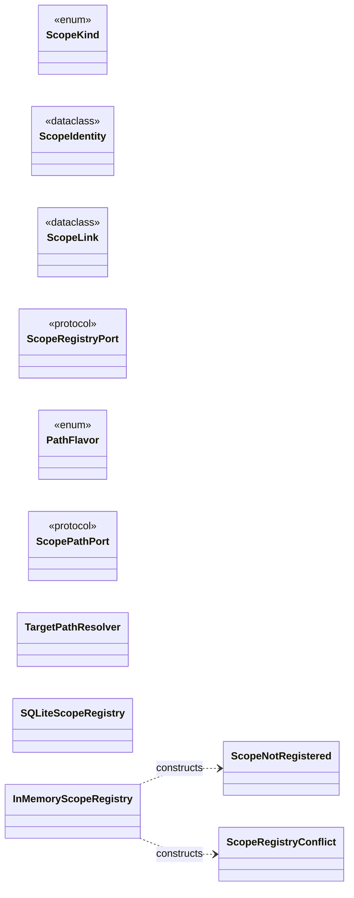

| Module | Class | Kind | Bases | Fields | Methods |
|---|---|---|---|---:|---:|
| `noetrium_platform.foundation.scope.api.contracts` | `ScopeKind` | `enum` | `StrEnum` | 11 | 0 |
| `noetrium_platform.foundation.scope.api.contracts` | `ScopeIdentity` | `dataclass` | `` | 2 | 3 |
| `noetrium_platform.foundation.scope.api.contracts` | `ScopeLink` | `dataclass` | `` | 2 | 1 |
| `noetrium_platform.foundation.scope.api.ports` | `ScopeRegistryPort` | `protocol` | `Protocol` | 0 | 5 |
| `noetrium_platform.foundation.scope.path.api.contracts` | `PathFlavor` | `enum` | `StrEnum` | 3 | 0 |
| `noetrium_platform.foundation.scope.path.api.ports` | `ScopePathPort` | `protocol` | `Protocol` | 0 | 3 |
| `noetrium_platform.foundation.scope.path.runtime.resolver` | `TargetPathResolver` | `class` | `` | 0 | 3 |
| `noetrium_platform.foundation.scope.providers.sqlite` | `SQLiteScopeRegistry` | `class` | `` | 2 | 11 |
| `noetrium_platform.foundation.scope.runtime.registry` | `ScopeRegistryConflict` | `class` | `RuntimeError` | 0 | 0 |
| `noetrium_platform.foundation.scope.runtime.registry` | `ScopeNotRegistered` | `class` | `KeyError` | 0 | 0 |
| `noetrium_platform.foundation.scope.runtime.registry` | `InMemoryScopeRegistry` | `class` | `` | 0 | 7 |

## Classes outside the canonical registry

- `noetrium_platform.composition.agent_turn_machine.AgentTurnMachineFactSink`
- `noetrium_platform.composition.agent_turn_model.AgentTurnModelFactRecorder`
- `noetrium_platform.composition.agent_turn_projection.AgentTurnJournalProjection`
- `noetrium_platform.composition.agent_turn_projection.AgentTurnTrajectory`
- `noetrium_platform.composition.concurrency.ExecutionConcurrencyAuthorities`
- `noetrium_platform.composition.environment_fork.EnvironmentForkReceipt`
- `noetrium_platform.composition.environment_replay.EnvironmentReplayError`
- `noetrium_platform.composition.environment_replay.EnvironmentReplayReceipt`
- `noetrium_platform.composition.execution_lineage.ExecutionForkReceipt`
- `noetrium_platform.composition.execution_lineage.ExecutionSourceCut`
- `noetrium_platform.composition.execution_lineage.ExecutionStateAnchor`
- `noetrium_platform.composition.experiment_observation.LakeBackedExperimentObservationLedger`
- `noetrium_platform.composition.experiment_observation.LakeBackedRawRecordStore`
- `noetrium_platform.composition.host_runtime_verification.HostInventoryRuntimeVerification`
- `noetrium_platform.composition.method_telemetry_sink.RawLakeMethodObservationSink`
- `noetrium_platform.composition.model_management.LocalModelServiceRuntimeFactory`
- `noetrium_platform.composition.model_management.ManagementPlaneAuthorities`
- `noetrium_platform.composition.model_raw_observation.RawLakeModelEndpointObserver`
- `noetrium_platform.composition.model_recovery_observability.MetricDurableRecoveryObserver`
- `noetrium_platform.composition.operation_forensics.CoreOperationFailureClassifier`
- `noetrium_platform.composition.operation_forensics.OperationFailureClassifierChain`
- `noetrium_platform.composition.operation_forensics.OperationForensicFailureSink`
- `noetrium_platform.composition.participant_message.ParticipantMessageOperationOutput`
- `noetrium_platform.composition.participant_message.ParticipantMessageOperations`
- `noetrium_platform.composition.participants.agent.AgentParticipantPolicy`
- `noetrium_platform.composition.participants.base.ParticipantDomainPolicy`
- `noetrium_platform.composition.participants.base.PolicyParticipantAdapter`
- `noetrium_platform.composition.participants.capability.CapabilityProviderParticipantPolicy`
- `noetrium_platform.composition.participants.environment.EnvironmentParticipantPolicy`
- `noetrium_platform.composition.participants.generic.RuntimeParticipantPolicy`
- `noetrium_platform.composition.participants.method.MethodParticipantPolicy`
- `noetrium_platform.composition.platform_meta.PlatformMetaAuthorities`
- `noetrium_platform.composition.prompt_trace_observability.PromptTelemetryObserver`
- `noetrium_platform.composition.release_quality.ReleaseQualityEvidenceProvider`
- `noetrium_platform.composition.release_quiescence.PersistentSessionReleaseConsumerProbe`
- `noetrium_platform.composition.release_quiescence.RecoveryLeaseReleaseConsumerProbe`
- `noetrium_platform.composition.release_quiescence.ServiceReleaseConsumerProbe`
- `noetrium_platform.composition.release_verification.PersistedReleaseVerificationReport`
- `noetrium_platform.composition.research_campaign.ResearchCampaignBinding`
- `noetrium_platform.composition.research_execution_pool.ResearchExecutionPool`
- `noetrium_platform.composition.runtime_observability.MetricRuntimeObserver`
- `noetrium_platform.composition.runtime_status_contracts.RuntimeStatusLayout`
- `noetrium_platform.composition.runtime_status_contracts.ServiceStatusBinding`
- `noetrium_platform.composition.service_crash.DurableServiceCrashCoordinator`
- `noetrium_platform.composition.service_crash_contracts.CrashHandoffPhase`
- `noetrium_platform.composition.service_crash_contracts.CrashHandoffReport`
- `noetrium_platform.composition.service_crash_contracts.DurableCrashHandoff`
- `noetrium_platform.composition.service_crash_failure.ServiceCrashDetected`
- `noetrium_platform.composition.service_crash_store.DurableCrashHandoffStore`
- `noetrium_platform.composition.system_catalog.RegistryPlatformSystemCatalog`
- `noetrium_platform.composition.text_world_agent.TextWorldAgentActionExecutorPort`
- `noetrium_platform.composition.text_world_agent.TextWorldAgentObservationPort`
- `noetrium_platform.platform.DirectoryRunArtifactBinding`
- `noetrium_platform.platform.ExperimentBinding`
- `noetrium_platform.platform.MinecraftEnvironmentBinding`
- `noetrium_platform.platform.QualifiedProjectModelBinding`
- `noetrium_platform.platform.ResearchWorkbenchBinding`
- `noetrium_platform.research.provenance.MethodSourceLane`
- `noetrium_platform.research.provenance.MethodSourceLaneKind`
- `noetrium_platform.research.provenance.MethodSourceRegistry`
- `noetrium_platform.research.provenance.PublicationSourceLane`
- `noetrium_platform.research.reproduction.ReferenceBaseline`
- `noetrium_platform.research.reproduction.ReportedResult`
- `noetrium_platform.research.reproduction.ReproductionAssetKind`
- `noetrium_platform.research.reproduction.ReproductionAssetRef`
- `noetrium_platform.research.reproduction.ReproductionCatalog`
- `noetrium_platform.research.reproduction.ReproductionDefinition`
- `noetrium_platform.research.reproduction.ReproductionDelta`
- `noetrium_platform.research.reproduction.ReproductionDeltaKind`
- `noetrium_platform.research.reproduction.ReproductionIdentity`
- `noetrium_platform.research.reproduction.ReproductionLifecycle`

## Cross-system class edges

The JSON sidecar contains every inheritance, annotation-reference and constructor edge. The table below keeps only edges crossing top-level system boundaries.

| Kind | Source | Target |
|---|---|---|
| `inherits` | `noetrium_platform.evidence.artifact.content.providers._publication.PublicationLock` | `noetrium_platform.foundation.kernel.kernel.durability.file_lock.InterprocessFileLock` |
| `inherits` | `noetrium_platform.evidence.observability.api.auxiliary_events.OperationAuxiliaryFailureEventSink` | `noetrium_platform.foundation.kernel.kernel.auxiliary_failures.OperationAuxiliaryFailureSink` |
| `inherits` | `noetrium_platform.foundation.governance.release.runtime.active_pin_codec.ActiveReleasePinIntegrityError` | `noetrium_platform.foundation.kernel.kernel.durability.document_integrity.DocumentIntegrityError` |
| `inherits` | `noetrium_platform.infrastructure.lifecycle.launch_control.heartbeat_codec.ServiceHeartbeatIntegrityError` | `noetrium_platform.foundation.kernel.kernel.durability.document_integrity.DocumentIntegrityError` |
| `inherits` | `noetrium_platform.infrastructure.lifecycle.launch_control.run_process.RunProcessBindingError` | `noetrium_platform.infrastructure.reliability.primitives.runtime_faults.FrozenRuntimeIdentityViolation` |
| `inherits` | `noetrium_platform.infrastructure.lifecycle.launch_control.runtime_state_codec.RuntimeControlStateIntegrityError` | `noetrium_platform.foundation.kernel.kernel.durability.document_integrity.DocumentIntegrityError` |
| `inherits` | `noetrium_platform.infrastructure.lifecycle.launch_control.service_binding.DeploymentServiceBindingError` | `noetrium_platform.infrastructure.reliability.primitives.runtime_faults.FrozenRuntimeIdentityViolation` |
| `inherits` | `noetrium_platform.infrastructure.lifecycle.service.runtime.service_state_codec.ServiceStateIntegrityError` | `noetrium_platform.foundation.kernel.kernel.durability.document_integrity.DocumentIntegrityError` |
| `inherits` | `noetrium_platform.infrastructure.lifecycle.service.runtime.start_intent_codec.ServiceStartIntentIntegrityError` | `noetrium_platform.foundation.kernel.kernel.durability.document_integrity.DocumentIntegrityError` |
| `references` | `noetrium_platform.capabilities.environment.api.contracts.ActionResult` | `noetrium_platform.foundation.kernel.kernel.operation.EffectReceipt` |
| `references` | `noetrium_platform.capabilities.environment.api.contracts.EnvironmentSession` | `noetrium_platform.foundation.kernel.kernel.operation.EffectReceipt` |
| `references` | `noetrium_platform.capabilities.environment.catalog.api.contracts.EnvironmentAssignment` | `noetrium_platform.infrastructure.resources.resolution.contracts.ResolutionPolicy` |
| `references` | `noetrium_platform.capabilities.environment.embodied.composition.raw_trajectory.RegistryBoundEmbodiedTrajectorySink` | `noetrium_platform.evidence.observability.capture.runtime.gateway.RegistryBoundRawObservationGateway` |
| `references` | `noetrium_platform.capabilities.environment.minecraft.api.ports.MinecraftExperimentHostPort` | `noetrium_platform.infrastructure.lifecycle.service.api.ports.ServiceStartOutcome` |
| `references` | `noetrium_platform.capabilities.environment.minecraft.api.ports.MinecraftExperimentHostPort` | `noetrium_platform.infrastructure.lifecycle.service.api.ports.ServiceStopOutcome` |
| `references` | `noetrium_platform.capabilities.environment.minecraft.api.ports.MinecraftServerEndpointBindingPort` | `noetrium_platform.infrastructure.lifecycle.service.api.ports.ServiceReadyObservation` |
| `references` | `noetrium_platform.capabilities.environment.minecraft.api.ports.MinecraftServerLifecyclePort` | `noetrium_platform.infrastructure.lifecycle.service.api.ports.ServiceReadyObservation` |
| `references` | `noetrium_platform.capabilities.environment.minecraft.api.ports.MinecraftServerLifecyclePort` | `noetrium_platform.infrastructure.lifecycle.service.api.ports.ServiceStartOutcome` |
| `references` | `noetrium_platform.capabilities.environment.minecraft.api.ports.MinecraftServerLifecyclePort` | `noetrium_platform.infrastructure.lifecycle.service.api.ports.ServiceStopOutcome` |
| `references` | `noetrium_platform.capabilities.environment.minecraft.composition.diagnostics.StructuredMinecraftDiagnostics` | `noetrium_platform.evidence.observability.api.metrics.ContextMetricSink` |
| `references` | `noetrium_platform.capabilities.environment.minecraft.composition.participant_runtime.MinecraftParticipantRuntimeAdapter` | `noetrium_platform.capabilities.participant.core.api.contracts.ParticipantSessionRuntimeIdentity` |
| `references` | `noetrium_platform.capabilities.environment.minecraft.composition.server_service.MinecraftServerReadinessProbe` | `noetrium_platform.infrastructure.lifecycle.service.runtime.process_contracts.ExactProcessBackend` |
| `references` | `noetrium_platform.capabilities.environment.minecraft.composition.server_service.MinecraftServerServiceFactoryConfig` | `noetrium_platform.infrastructure.lifecycle.service.runtime.environment.MaterializedServiceEnvironment` |
| `references` | `noetrium_platform.capabilities.environment.minecraft.composition.server_service.MinecraftServerServiceFactoryConfig` | `noetrium_platform.infrastructure.lifecycle.service.runtime.process_contracts.ExactProcessBackend` |
| `references` | `noetrium_platform.capabilities.environment.minecraft.composition.server_service.MinecraftTcpReadinessProbe` | `noetrium_platform.infrastructure.lifecycle.service.runtime.process_contracts.ExactProcessBackend` |
| `references` | `noetrium_platform.capabilities.model.assignment.api.contracts.ModelAssignment` | `noetrium_platform.infrastructure.resources.resolution.contracts.ResolutionPolicy` |
| `references` | `noetrium_platform.capabilities.model.deployment.api.ports.ModelServiceRuntimeFactoryPort` | `noetrium_platform.infrastructure.lifecycle.service.api.contracts.ServiceLaunchContract` |
| `references` | `noetrium_platform.capabilities.model.deployment.api.ports.ModelServiceRuntimeFactoryPort` | `noetrium_platform.infrastructure.lifecycle.service.api.ports.ExactServiceRuntimePort` |
| `references` | `noetrium_platform.capabilities.model.request.prompt.runtime.publication_common.PromptPublicationLease` | `noetrium_platform.foundation.kernel.kernel.durability.file_lock.InterprocessFileLock` |
| `references` | `noetrium_platform.capabilities.model.serving.api.recovery.RecoveryPlan` | `noetrium_platform.foundation.kernel.kernel.identity.ImmutableModelIdentity` |
| `references` | `noetrium_platform.capabilities.model.serving.api.state.ModelRunState` | `noetrium_platform.foundation.kernel.kernel.identity.ImmutableModelIdentity` |
| `references` | `noetrium_platform.capabilities.model.serving.runtime.recovery.RecoveryPlanner` | `noetrium_platform.foundation.kernel.kernel.identity.ImmutableModelIdentity` |
| `references` | `noetrium_platform.capabilities.model.stack.api.stack.ModelStackSpec` | `noetrium_platform.foundation.kernel.kernel.identity.ImmutableModelIdentity` |
| `references` | `noetrium_platform.capabilities.participant.agent.runtime.scheduled_messaging.ParticipantMessageRouteRequest` | `noetrium_platform.research.execution.machines.communication_program.ParticipantMessageKind` |
| `references` | `noetrium_platform.capabilities.participant.agent.runtime.scheduled_messaging.RuntimeParticipantMessageRouter` | `noetrium_platform.research.execution.machines.program_host.ResearchProgramHost` |
| `references` | `noetrium_platform.capabilities.participant.method.api.binding.MethodSystemBinding` | `noetrium_platform.foundation.governance.architecture.api.capability_composition.BindingPlan` |
| `references` | `noetrium_platform.capabilities.participant.method.api.binding.MethodSystemBinding` | `noetrium_platform.foundation.governance.architecture.api.capability_composition.CapabilityOffer` |
| `references` | `noetrium_platform.capabilities.participant.method.api.contracts.IdempotentTaskCompletionSession` | `noetrium_platform.foundation.kernel.kernel.context.ExecutionContext` |
| `references` | `noetrium_platform.capabilities.participant.method.api.contracts.MethodSession` | `noetrium_platform.foundation.kernel.kernel.context.ExecutionContext` |
| `references` | `noetrium_platform.capabilities.participant.method.api.contracts.RecallRequest` | `noetrium_platform.foundation.kernel.kernel.context.ExecutionContext` |
| `references` | `noetrium_platform.capabilities.participant.method.api.contracts.TaskCompletionReconciliationSession` | `noetrium_platform.foundation.kernel.kernel.context.ExecutionContext` |
| `references` | `noetrium_platform.evidence.observability.logging.record.api.binding.LoggingSystemBinding` | `noetrium_platform.foundation.governance.architecture.api.capability_composition.BindingPlan` |
| `references` | `noetrium_platform.evidence.observability.logging.record.api.binding.LoggingSystemBinding` | `noetrium_platform.foundation.governance.architecture.api.capability_composition.CapabilityOffer` |
| `references` | `noetrium_platform.foundation.governance.release.runtime.active_pin_store.ActiveReleasePinStore` | `noetrium_platform.foundation.kernel.kernel.durability.file_lock.InterprocessFileLock` |
| `references` | `noetrium_platform.infrastructure.lifecycle.host.bootstrap.runtime.state_store.DirectoryServerBootstrapStateStore` | `noetrium_platform.foundation.kernel.kernel.durability.file_lock.InterprocessFileLock` |
| `references` | `noetrium_platform.infrastructure.lifecycle.host.composition.authorities.HostComposition` | `noetrium_platform.foundation.governance.architecture.api.capability_composition.BindingPlan` |
| `references` | `noetrium_platform.infrastructure.lifecycle.host.composition.authorities.HostComposition` | `noetrium_platform.foundation.governance.architecture.api.capability_composition.CapabilityOffer` |
| `references` | `noetrium_platform.infrastructure.lifecycle.launch_control.execution_guard.RecoveryLeaseRuntimeActionGuard` | `noetrium_platform.infrastructure.reliability.recovery.api.ports.RecoveryExecutionPort` |
| `references` | `noetrium_platform.infrastructure.lifecycle.launch_control.one_click.OneClickRuntimeManager` | `noetrium_platform.infrastructure.reliability.recovery.api.ports.RecoveryExecutionFactoryPort` |
| `references` | `noetrium_platform.infrastructure.lifecycle.launch_control.one_click.OneClickRuntimeManager` | `noetrium_platform.infrastructure.reliability.recovery.api.ports.RecoveryExecutionPort` |
| `references` | `noetrium_platform.infrastructure.lifecycle.launch_control.runtime_history_storage.FileRuntimeHistoryStorage` | `noetrium_platform.foundation.kernel.kernel.durability.file_lock.InterprocessFileLock` |
| `references` | `noetrium_platform.infrastructure.lifecycle.launch_control.verification_ports.FrozenParticipantBindingVerificationPort` | `noetrium_platform.capabilities.participant.core.api.frozen_manifests.ParticipantRuntimeBindingManifest` |
| `references` | `noetrium_platform.infrastructure.lifecycle.launch_control.verification_ports.FrozenParticipantImplementationVerificationPort` | `noetrium_platform.capabilities.participant.core.api.frozen_manifests.ParticipantImplementationInventory` |
| `references` | `noetrium_platform.infrastructure.lifecycle.launch_control.verification_ports.FrozenParticipantRuntimeVerificationPort` | `noetrium_platform.capabilities.participant.core.api.frozen_manifests.ParticipantRuntimeInventory` |
| `references` | `noetrium_platform.infrastructure.lifecycle.server.identity.composition.ServerIdentityComposition` | `noetrium_platform.foundation.governance.architecture.api.capability_composition.BindingPlan` |
| `references` | `noetrium_platform.infrastructure.lifecycle.server.identity.composition.ServerIdentityComposition` | `noetrium_platform.foundation.governance.architecture.api.capability_composition.CapabilityOffer` |
| `references` | `noetrium_platform.infrastructure.reliability.failure.api.contracts.FailureEnvelope` | `noetrium_platform.foundation.kernel.kernel.context.ExecutionContext` |
| `references` | `noetrium_platform.infrastructure.reliability.forensics.api.mutation.MutationRecord` | `noetrium_platform.foundation.kernel.kernel.context.ExecutionContext` |
| `references` | `noetrium_platform.research.execution.machines.program.ProgramNodeRequest` | `noetrium_platform.foundation.kernel.kernel.machine.MachineSnapshot` |
| `references` | `noetrium_platform.research.execution.machines.program.ProgramNodeResult` | `noetrium_platform.foundation.kernel.kernel.contracts.ChildMachineLink` |
| `references` | `noetrium_platform.research.execution.machines.program.ProgramNodeResult` | `noetrium_platform.foundation.kernel.kernel.machine.MachineCommand` |
| `references` | `noetrium_platform.research.execution.machines.program.ProgramNodeResult` | `noetrium_platform.foundation.kernel.kernel.machine.MachineStatus` |
| `references` | `noetrium_platform.research.execution.machines.program.ProgrammableMachineInterpreter` | `noetrium_platform.foundation.kernel.kernel.machine.MachineCommand` |
| `references` | `noetrium_platform.research.execution.machines.program.ProgrammableMachineInterpreter` | `noetrium_platform.foundation.kernel.kernel.machine.MachineSnapshot` |
| `references` | `noetrium_platform.research.execution.machines.program.ProgrammableMachineInterpreter` | `noetrium_platform.foundation.kernel.kernel.machine.TransitionProposal` |
| `references` | `noetrium_platform.research.execution.machines.program.ResearchProgram` | `noetrium_platform.foundation.kernel.kernel.machine.MachineKind` |
| `references` | `noetrium_platform.research.execution.machines.program.ResearchProgram` | `noetrium_platform.foundation.kernel.kernel.machine.MachineProgramRef` |
| `references` | `noetrium_platform.research.execution.machines.program.ResearchProgram` | `noetrium_platform.foundation.kernel.kernel.machine.ProgramLock` |
| `references` | `noetrium_platform.research.execution.machines.program.ResearchProgramBuilder` | `noetrium_platform.foundation.kernel.kernel.machine.MachineKind` |
| `references` | `noetrium_platform.research.execution.participants.checkpoint_operations.ParticipantCheckpointOperations` | `noetrium_platform.capabilities.participant.core.api.checkpoint.ParticipantCheckpoint` |
| `references` | `noetrium_platform.research.execution.participants.checkpoint_operations.ParticipantCheckpointOperations` | `noetrium_platform.capabilities.participant.core.api.runtime_ports.ParticipantCheckpointRuntimePort` |
| `references` | `noetrium_platform.research.execution.participants.resolution.ParticipantResolutionOperations` | `noetrium_platform.capabilities.participant.core.api.contracts.ParticipantRuntimeBinding` |
| `references` | `noetrium_platform.research.execution.participants.resolution.ParticipantResolutionOperations` | `noetrium_platform.capabilities.participant.core.api.lifecycle.ParticipantLifecycleAdapterRegistry` |
| `references` | `noetrium_platform.research.experimentation.binding.ResearchModelRoleBinding` | `noetrium_platform.capabilities.model.api.project.ProjectModelBinding` |
| `references` | `noetrium_platform.research.experimentation.binding.ResearchParticipantBinding` | `noetrium_platform.capabilities.participant.api.project.ProjectParticipantBinding` |
| `references` | `noetrium_platform.research.experimentation.checkpoint.api.contracts.RunParticipantPayload` | `noetrium_platform.capabilities.participant.core.api.checkpoint.ParticipantCheckpoint` |
| `references` | `noetrium_platform.research.experimentation.checkpoint.api.contracts.RunParticipantSnapshotRef` | `noetrium_platform.capabilities.participant.core.api.checkpoint.ParticipantCheckpointRef` |
| `references` | `noetrium_platform.research.experimentation.checkpoint.api.ports.RunCheckpointCoordinatorPort` | `noetrium_platform.research.execution.decision.cycle_identity.DecisionCycleIdentity` |
| `references` | `noetrium_platform.research.experimentation.checkpoint.runtime.capture.RunCheckpointCapture` | `noetrium_platform.capabilities.participant.core.api.runtime_ports.ParticipantCheckpointOperationsPort` |
| `references` | `noetrium_platform.research.experimentation.checkpoint.runtime.capture.RunCheckpointCapture` | `noetrium_platform.research.execution.decision.cycle_identity.DecisionCycleIdentity` |
| `references` | `noetrium_platform.research.experimentation.checkpoint.runtime.coordination.RunCheckpointCoordinator` | `noetrium_platform.capabilities.participant.core.api.runtime_ports.ParticipantCheckpointOperationsPort` |
| `references` | `noetrium_platform.research.experimentation.checkpoint.runtime.coordination.RunCheckpointCoordinator` | `noetrium_platform.research.execution.decision.cycle_identity.DecisionCycleIdentity` |
| `references` | `noetrium_platform.research.experimentation.checkpoint.runtime.restore.RunCheckpointRestorer` | `noetrium_platform.capabilities.participant.core.api.runtime_ports.ParticipantCheckpointOperationsPort` |
| `references` | `noetrium_platform.research.experimentation.checkpoint.runtime.restore.RunCheckpointRestorer` | `noetrium_platform.research.execution.decision.cycle_identity.DecisionCycleIdentity` |
| `references` | `noetrium_platform.research.experimentation.experiment.api.contracts.ExperimentParticipantSpec` | `noetrium_platform.capabilities.participant.core.api.contracts.ParticipantImplementationIdentity` |
| `references` | `noetrium_platform.research.experimentation.experiment.api.contracts.ExperimentParticipantSpec` | `noetrium_platform.capabilities.participant.core.api.contracts.ParticipantRuntimeBinding` |
| `references` | `noetrium_platform.research.experimentation.experiment.api.contracts.ExperimentParticipantSpec` | `noetrium_platform.capabilities.participant.core.api.contracts.ParticipantSessionRuntimeIdentity` |
| `references` | `noetrium_platform.research.experimentation.experiment.runtime.component_binding.ExperimentComponentBinder` | `noetrium_platform.capabilities.participant.core.api.runtime_ports.ParticipantResolutionPort` |
| `references` | `noetrium_platform.research.experimentation.experiment.runtime.engine.ExperimentRuntime` | `noetrium_platform.research.execution.decision.cycle_identity.DecisionCycleIdentity` |
| `references` | `noetrium_platform.research.experimentation.experiment.runtime.engine.ExperimentRuntime` | `noetrium_platform.research.execution.decision.cycle_identity.DecisionCycleIdentityProvider` |
| `references` | `noetrium_platform.research.experimentation.experiment.runtime.engine.ExperimentRuntime` | `noetrium_platform.research.execution.decision.cycle_result.DecisionCycleResult` |
| `references` | `noetrium_platform.research.experimentation.experiment.runtime.trial_cycle.ExperimentTrialCycleExecutor` | `noetrium_platform.research.execution.workflow.runtime.program_trial.RuntimeProgramTrialProtocol` |
| `references` | `noetrium_platform.research.experimentation.run.api.ports.DecisionCycleRuntimePort` | `noetrium_platform.research.execution.decision.cycle_identity.DecisionCycleIdentity` |
| `references` | `noetrium_platform.research.experimentation.run.api.ports.DecisionCycleRuntimePort` | `noetrium_platform.research.execution.decision.cycle_result.DecisionCycleResult` |
| `references` | `noetrium_platform.research.experimentation.run.api.ports.RunRuntimePort` | `noetrium_platform.research.execution.decision.cycle_identity.DecisionCycleIdentity` |
| `references` | `noetrium_platform.research.experimentation.run.control.api.contracts.RunControlLifecyclePort` | `noetrium_platform.research.execution.decision.cycle_identity.DecisionCycleIdentity` |
| `references` | `noetrium_platform.research.experimentation.run.control.api.contracts.RunControlRequest` | `noetrium_platform.research.execution.decision.cycle_identity.DecisionCycleIdentity` |
| `references` | `noetrium_platform.research.experimentation.run.control.runtime.controller.DurableRunControl` | `noetrium_platform.research.execution.decision.cycle_identity.DecisionCycleIdentity` |
| `references` | `noetrium_platform.research.experimentation.run.identity.api.contracts.RunIdentity` | `noetrium_platform.research.execution.decision.cycle_identity.DecisionCycleIdentity` |
| `references` | `noetrium_platform.research.experimentation.run.lifecycle.api.ports.RunCycleExecutionPort` | `noetrium_platform.research.execution.decision.cycle_result.DecisionCycleResult` |
| `references` | `noetrium_platform.research.experimentation.run.lifecycle.api.ports.RunCycleExecutorPort` | `noetrium_platform.research.execution.decision.cycle_identity.DecisionCycleIdentity` |
| `references` | `noetrium_platform.research.experimentation.run.lifecycle.api.ports.RunSessionPort` | `noetrium_platform.research.execution.decision.cycle_identity.DecisionCycleIdentity` |
| `references` | `noetrium_platform.research.experimentation.run.lifecycle.api.ports.RunSessionPort` | `noetrium_platform.research.execution.decision.cycle_result.DecisionCycleResult` |
| `references` | `noetrium_platform.research.experimentation.run.lifecycle.runtime.closer.RunCloser` | `noetrium_platform.capabilities.participant.core.api.runtime_ports.ParticipantSessionLifecyclePort` |
| `references` | `noetrium_platform.research.experimentation.run.lifecycle.runtime.factory.DefaultRunSessionFactory` | `noetrium_platform.capabilities.participant.core.api.runtime_ports.ParticipantSessionLifecyclePort` |
| `references` | `noetrium_platform.research.experimentation.run.lifecycle.runtime.session.RunSession` | `noetrium_platform.research.execution.decision.cycle_identity.DecisionCycleIdentity` |
| `references` | `noetrium_platform.research.experimentation.run.lifecycle.runtime.session.RunSession` | `noetrium_platform.research.execution.decision.cycle_result.DecisionCycleResult` |
| `references` | `noetrium_platform.research.experimentation.run.runtime.assembly.RunAssembly` | `noetrium_platform.capabilities.participant.core.api.runtime_ports.ParticipantSessionLifecyclePort` |
| `references` | `noetrium_platform.research.experimentation.run.runtime.coordination.RunCoordinator` | `noetrium_platform.capabilities.participant.core.api.runtime_ports.ParticipantSessionLifecyclePort` |
| `references` | `noetrium_platform.research.experimentation.run.runtime.coordination.RunCoordinator` | `noetrium_platform.research.execution.decision.cycle_identity.DecisionCycleIdentity` |
| `references` | `noetrium_platform.research.experimentation.run.runtime.cycle.RunCycleExecution` | `noetrium_platform.research.execution.decision.cycle_result.DecisionCycleResult` |
| `references` | `noetrium_platform.research.experimentation.run.runtime.cycle.RunCycleExecutor` | `noetrium_platform.research.execution.decision.cycle_identity.DecisionCycleIdentity` |
| `references` | `noetrium_platform.research.experimentation.run.runtime.decision_runtime.DecisionCycleRuntime` | `noetrium_platform.capabilities.participant.core.api.runtime_ports.ParticipantSessionLifecyclePort` |
| `references` | `noetrium_platform.research.experimentation.run.runtime.decision_runtime.DecisionCycleRuntime` | `noetrium_platform.research.execution.decision.cycle_identity.DecisionCycleIdentity` |
| `references` | `noetrium_platform.research.experimentation.run.runtime.decision_runtime.DecisionCycleRuntime` | `noetrium_platform.research.execution.decision.cycle_result.DecisionCycleResult` |
| `references` | `noetrium_platform.research.experimentation.run.runtime.decision_runtime._CycleFrame` | `noetrium_platform.capabilities.participant.core.api.runtime_ports.ParticipantSessionLifecyclePort` |
| `references` | `noetrium_platform.research.experimentation.run.runtime.decision_runtime._CycleFrame` | `noetrium_platform.research.execution.decision.cycle_identity.DecisionCycleIdentity` |
| `references` | `noetrium_platform.research.experimentation.run.runtime.resources.RunResourceAcquirer` | `noetrium_platform.capabilities.participant.core.api.runtime_ports.ParticipantSessionLifecyclePort` |
| `references` | `noetrium_platform.research.experimentation.run.runtime.restore.RunRestoreInitializer` | `noetrium_platform.research.execution.decision.cycle_identity.DecisionCycleIdentity` |
| `references` | `noetrium_platform.research.experimentation.run.runtime.run_runtime.RunRuntime` | `noetrium_platform.capabilities.participant.core.api.runtime_ports.ParticipantSessionLifecyclePort` |
| `references` | `noetrium_platform.research.experimentation.run.runtime.run_runtime.RunRuntime` | `noetrium_platform.research.execution.decision.cycle_identity.DecisionCycleIdentity` |
| `references` | `noetrium_platform.research.experimentation.run.runtime.run_runtime._RunRuntimeFrame` | `noetrium_platform.capabilities.participant.core.api.runtime_ports.ParticipantSessionLifecyclePort` |
| `references` | `noetrium_platform.research.experimentation.run.runtime.run_runtime._RunRuntimeFrame` | `noetrium_platform.research.execution.decision.cycle_identity.DecisionCycleIdentity` |
| `constructs` | `noetrium_platform.capabilities.environment.minecraft.composition.participant_runtime.MinecraftParticipantRuntimeAdapter` | `noetrium_platform.capabilities.participant.core.api.contracts.ParticipantSessionRuntimeIdentity` |
| `constructs` | `noetrium_platform.capabilities.model.request.prompt.runtime.publication_common.PromptPublicationLease` | `noetrium_platform.foundation.kernel.kernel.durability.file_lock.InterprocessFileLock` |
| `constructs` | `noetrium_platform.capabilities.model.serving.providers.host_verification_storage.DirectoryHostInventoryEvidenceStore` | `noetrium_platform.foundation.kernel.kernel.durability.file_lock.InterprocessFileLock` |
| `constructs` | `noetrium_platform.capabilities.model.serving.providers.recovery_storage.FileDurableRecoveryStore` | `noetrium_platform.foundation.kernel.kernel.durability.file_lock.InterprocessFileLock` |
| `constructs` | `noetrium_platform.capabilities.model.serving.providers.runtime_canary_storage.DirectoryRuntimeCanaryEvidenceStore` | `noetrium_platform.foundation.kernel.kernel.durability.file_lock.InterprocessFileLock` |
| `constructs` | `noetrium_platform.capabilities.model.serving.providers.runtime_qualification_storage.DirectoryRuntimeQualificationEvidenceStore` | `noetrium_platform.foundation.kernel.kernel.durability.file_lock.InterprocessFileLock` |
| `constructs` | `noetrium_platform.capabilities.participant.agent.runtime.scheduled_messaging.RuntimeParticipantMessageRouter` | `noetrium_platform.research.execution.machines.rule_program.MachineEvent` |
| `constructs` | `noetrium_platform.evidence.observability.logging.storage.runtime.jsonl.JsonlLogStore` | `noetrium_platform.foundation.kernel.kernel.durability.file_lock.InterprocessFileLock` |
| `constructs` | `noetrium_platform.foundation.governance.release.runtime.active_pin_store.ActiveReleasePinStore` | `noetrium_platform.foundation.kernel.kernel.durability.file_lock.InterprocessFileLock` |
| `constructs` | `noetrium_platform.foundation.governance.release.runtime.freeze_lock.ReleaseFreezeLock` | `noetrium_platform.foundation.kernel.kernel.durability.file_lock.InterprocessFileLock` |
| `constructs` | `noetrium_platform.infrastructure.lifecycle.host.bootstrap.runtime.state_store.DirectoryServerBootstrapStateStore` | `noetrium_platform.foundation.kernel.kernel.durability.file_lock.InterprocessFileLock` |
| `constructs` | `noetrium_platform.infrastructure.lifecycle.launch_control.model_ports.FrozenDeploymentVerificationPort` | `noetrium_platform.infrastructure.reliability.primitives.runtime_faults.FrozenRuntimeIdentityViolation` |
| `constructs` | `noetrium_platform.infrastructure.lifecycle.launch_control.run_process.ExactRunProcessPort` | `noetrium_platform.infrastructure.reliability.primitives.runtime_faults.RuntimeOperationalHealthUnavailable` |
| `constructs` | `noetrium_platform.infrastructure.lifecycle.launch_control.runtime_history_storage.FileRuntimeHistoryStorage` | `noetrium_platform.foundation.kernel.kernel.durability.file_lock.InterprocessFileLock` |
| `constructs` | `noetrium_platform.infrastructure.lifecycle.launch_control.service_binding.ExactDeploymentServicePort` | `noetrium_platform.infrastructure.reliability.primitives.runtime_faults.RuntimeOperationalHealthUnavailable` |
| `constructs` | `noetrium_platform.infrastructure.lifecycle.launch_control.verification_ports.ActivePromptPromotionVerifier` | `noetrium_platform.infrastructure.reliability.primitives.runtime_faults.FrozenRuntimeIdentityViolation` |
| `constructs` | `noetrium_platform.infrastructure.lifecycle.launch_control.verification_ports.FrozenParticipantBindingVerificationPort` | `noetrium_platform.infrastructure.reliability.primitives.runtime_faults.FrozenRuntimeIdentityViolation` |
| `constructs` | `noetrium_platform.infrastructure.lifecycle.launch_control.verification_ports.FrozenParticipantImplementationVerificationPort` | `noetrium_platform.infrastructure.reliability.primitives.runtime_faults.FrozenRuntimeIdentityViolation` |
| `constructs` | `noetrium_platform.infrastructure.lifecycle.launch_control.verification_ports.FrozenParticipantRuntimeVerificationPort` | `noetrium_platform.infrastructure.reliability.primitives.runtime_faults.FrozenRuntimeIdentityViolation` |
| `constructs` | `noetrium_platform.infrastructure.lifecycle.launch_control.verification_ports.FrozenReleaseVerifier` | `noetrium_platform.infrastructure.reliability.primitives.runtime_faults.FrozenRuntimeIdentityViolation` |
| `constructs` | `noetrium_platform.infrastructure.lifecycle.python.runtime.lifecycle.PythonEnvironmentLifecycle` | `noetrium_platform.foundation.kernel.kernel.durability.file_lock.InterprocessFileLock` |
| `constructs` | `noetrium_platform.infrastructure.lifecycle.server.runtime.operation_journal.JsonlServerOperationJournal` | `noetrium_platform.foundation.kernel.kernel.durability.file_lock.InterprocessFileLock` |
| `constructs` | `noetrium_platform.infrastructure.lifecycle.server.runtime.operation_journal._NonBlockingOperationLock` | `noetrium_platform.foundation.kernel.kernel.durability.file_lock.InterprocessFileLock` |
| `constructs` | `noetrium_platform.infrastructure.lifecycle.server.runtime.operation_journal._NonBlockingServerLock` | `noetrium_platform.foundation.kernel.kernel.durability.file_lock.InterprocessFileLock` |
| `constructs` | `noetrium_platform.infrastructure.lifecycle.service.runtime.start_intent_store.DirectoryServiceStartIntentStore` | `noetrium_platform.foundation.kernel.kernel.durability.file_lock.InterprocessFileLock` |
| `constructs` | `noetrium_platform.infrastructure.lifecycle.session.runtime.binding.DirectoryPersistentSessionBindingStore` | `noetrium_platform.foundation.kernel.kernel.durability.file_lock.InterprocessFileLock` |
| `constructs` | `noetrium_platform.infrastructure.lifecycle.toolchain.providers.adoptium.EclipseAdoptiumTemurinProvider` | `noetrium_platform.foundation.kernel.kernel.durability.file_lock.InterprocessFileLock` |
| `constructs` | `noetrium_platform.infrastructure.reliability.forensics.providers.lease.ForensicWriterLease` | `noetrium_platform.foundation.kernel.kernel.durability.file_lock.InterprocessFileLock` |
| `constructs` | `noetrium_platform.infrastructure.reliability.recovery.execution.runtime.file_lock.FileLockedRecoveryExecution` | `noetrium_platform.foundation.kernel.kernel.durability.file_lock.InterprocessFileLock` |
| `constructs` | `noetrium_platform.research.execution.machines.program.ProgrammableMachineInterpreter` | `noetrium_platform.foundation.kernel.kernel.machine.TransitionProposal` |
| `constructs` | `noetrium_platform.research.execution.machines.program.ResearchProgram` | `noetrium_platform.foundation.kernel.kernel.machine.MachineProgramRef` |
| `constructs` | `noetrium_platform.research.experimentation.checkpoint.providers.directory_store.DirectoryRunCheckpointStore` | `noetrium_platform.capabilities.participant.core.api.checkpoint.ParticipantCheckpoint` |
| `constructs` | `noetrium_platform.research.experimentation.experiment.api.contracts.ExperimentParticipantSpec` | `noetrium_platform.capabilities.participant.core.api.contracts.ParticipantRuntimeBinding` |
| `constructs` | `noetrium_platform.research.experimentation.run.identity.api.contracts.RunIdentity` | `noetrium_platform.research.execution.decision.cycle_identity.DecisionCycleIdentity` |
| `constructs` | `noetrium_platform.research.experimentation.run.runtime.cycle.RunCycleExecutor` | `noetrium_platform.research.execution.decision.cycle_result.DecisionCycleResult` |
| `constructs` | `noetrium_platform.research.experimentation.run.runtime.decision_runtime.DecisionCycleRuntime` | `noetrium_platform.research.execution.decision.cycle_result.DecisionCycleResult` |

## Machine-readable sidecar

`docs/architecture/CODE_ARCHITECTURE_INDEX.json` contains the complete module/class/edge inventory, including all class methods and fields extracted from source.

