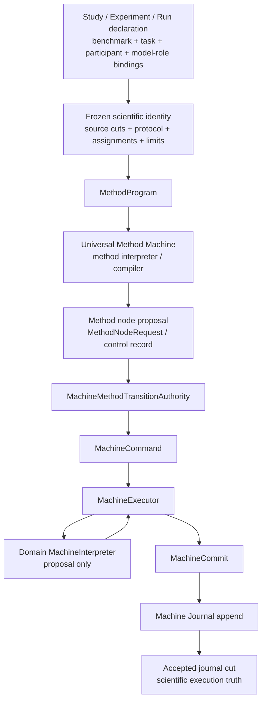

# Dataflow Map — Canonical Research OS Execution

> Status: current semantic dataflow map.
> Authority: interpret this document through `CURRENT_ARCHITECTURE_AUTHORITY.md` and
> `NOETRIUM_AUTHORITY_CONSOLIDATION_EXECUTION_SPEC_20260916.md`.
> This document describes control/data movement. Arrows never transfer durable authority.

## 1. Scientific execution acceptance path



The invariant is strict:

> A method, runner, provider, checkpoint, worker, projection, or observer may propose
> work or derive views, but scientific execution truth changes only when the owning
> Machine executor commits an accepted transition to the Machine Journal.

UMM therefore owns method interpretation, not durable method history. A method node
transition that is not Machine-committed is not accepted scientific execution truth.

## 2. One method-node execution cycle

```text
accepted Machine journal cut N
→ UMM reads frozen MethodProgram + accepted method state
→ node implementation computes a proposal / operation request
→ scoped participant + capability resolution
→ operation admission
→ effect intent prepare
→ external/provider execution
→ EffectReceipt + EffectCertainty
→ immutable output/evidence/artifact references
→ Method transition proposal referencing those results
→ MachineMethodTransitionAuthority
→ MachineExecutor.step(...)
→ interpreter proposes state delta only
→ immutable MachineCommit
→ journal.append(commit)
→ accepted Machine journal cut N+1
```

An irreversible effect is never inferred from exceptions. `UNKNOWN` remains
unretryable until the Reliability/effect authority reconciles it. Machine commits
reference effect/evidence identities; they do not duplicate the effect authority.

## 3. Model-visible request path

```text
accepted method state + pinned evidence source
→ prompt blocks
→ Prompt Request Build Transaction
→ canonical request body + compiled prompt + tool schema bundle
→ content-addressed durable references
→ frozen ModelRequestEnvelope
→ admitted model-role binding set
→ actual deployment/model selection
→ ModelBindingSelectionReceipt
→ reconstruct + verify exact model-visible request
→ model serving provider
→ immutable model output reference
→ method-node result
```

A provider fallback is legal only inside the previously admitted binding set. The
actual selected model/deployment and fallback cause are evidence; undeclared fallback
fails closed.

## 4. Participant and simulated-user path

```text
Study participant declarations
→ participant bindings
├── agent participant
├── user-simulator participant
├── evaluator/grader participant
└── other method-defined participants
→ participant sessions
→ model-role bindings
→ MethodProgram interaction
```

A user simulator is a Participant. It is never hidden mutable state inside an
Environment provider. Agent, simulated-user, grader, reflection, value, and world
models use the same explicit participant/model-role identity system.

## 5. Capability and external-effect path

```text
method node / participant decision
→ scoped capability resolution
→ registration lease
→ monotonic policy/guard decisions
→ operation dispatch
→ effect intent prepare
→ provider side effect
→ EffectReceipt + certainty
├── EXECUTED
├── NOT_EXECUTED
└── UNKNOWN → reconciliation required
→ operation completion/failure fact
→ method transition proposal
→ Machine commit references resulting facts
```

A post-policy rejection cannot erase an already executed effect. Policy, Operation,
Effect, and Machine each retain their own narrow authority; none may silently write
another authority's state.

## 6. Environment observation/action path

```text
Environment specification + frozen binding
→ provider session / readiness proof
→ observation
→ method-owned evidence admission
→ MethodProgram
→ capability-mediated action request
→ effect-safe provider execution
→ observation / effect receipt / artifact refs
→ Machine-accepted method transition
```

Environment providers own provider runtime mechanics, not method cognition, benchmark
scoring, user simulation, or scientific run truth.

## 7. Verifier isolation path

```text
TaskPackage
→ declared artifact allowlist
→ trial produces immutable ArtifactReference values
→ TaskVerifierRequest
   [frozen scientific identity + declared artifacts only]
→ isolated verifier execution
→ MeasurementRecord(s)
→ TaskVerifierReceipt
→ verifier isolation evidence
→ evaluation/result projection
```

The verifier does not receive the execution environment, participant session, method
state, work directory, or arbitrary provider internals. Separate verifier execution
must emit isolation evidence.

## 8. Evidence and projection path

```text
Machine / Operation / Effect / Failure / DurableFact / Artifact authorities
→ append-only authoritative records
→ verified source cut / cursor
→ ProjectionTail
→ projector version
→ rebuildable query / diagnostic / status / analytics projection
```

Projection mismatch, rewind, source-identity drift, or projector-version drift means
rebuild. A projection never patches or writes authoritative history.

Forensic indexes are disposable. Hash-chained evidence may be durable evidence, but
it does not become a second mutable business-state authority.

## 9. Replay and observability path

```text
Machine Journal
→ verified replay
→ reconstructed MachineSnapshot
→ replay-aware execution context
→ observability emission policy
├── suppress duplicate live-only telemetry
└── emit explicitly marked replay observations when required
```

Operational telemetry is a side plane. Replay must not duplicate old telemetry as
fresh execution, and telemetry is never a recovery source.

Native metric export follows an explicit non-authoritative handoff:

```text
live execution context
→ MetricRegistry validation
→ PendingMetric
→ deterministic MetricExportBatch
→ MetricExporterPort
→ exact MetricExportReceipt
```

A failed export keeps the pending rows for retry under the same batch identity.
An acknowledgement for a different batch or partial row count is rejected.
Exporter state never becomes scientific evidence or execution authority.

## 10. Checkpoint and recovery path

```text
accepted Machine journal cut
→ checkpoint trigger policy
→ verified snapshot/artifact
→ failure
→ failure taxonomy + mutation/effect history
→ reconcile UNKNOWN effects
→ validate frozen participant/model/environment/runtime identities
→ verify checkpoint is bound to accepted journal cut
→ reconstruct authoritative state from journal
→ use checkpoint only as acceleration
→ resume incomplete work
```

A checkpoint is not a competing history. If checkpoint state disagrees with the
journal, the journal wins and the checkpoint is rejected.

## 11. Record-plane rule

```text
DURABLE_FACT
    → accepted by an owning authority
    → reconstruction / replay / proof allowed

LIVE_INTERCEPTION
    → current-execution policy only
    → must emit a durable fact if it changes future authoritative/model-visible state

SIDE_PLANE_OBSERVATION
    → diagnostics / logs / metrics / traces only
    → never authoritative recovery state
```

## 12. Hard flow invariants

- No method/agent/experiment runner owns a second durable execution history.
- No provider or external framework writes Machine, Run, Effect, Artifact, or Data authority directly.
- No derived projection/cache becomes authoritative state.
- No model-visible request exists without a durable reconstructable request reference.
- No provider fallback changes frozen scientific identity silently.
- No capability policy bypasses the effect-certainty path.
- No hidden user simulator exists inside Environment.
- No verifier receives undeclared execution-private state.
- No replay emits old side-plane observations as fresh execution.
- No checkpoint can override an accepted Machine Journal cut.
- No operational telemetry backend owns scientific evidence.
