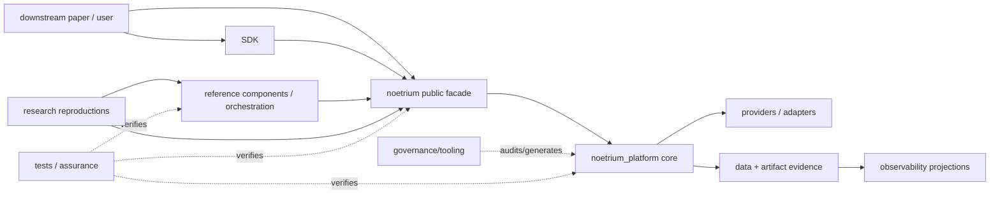
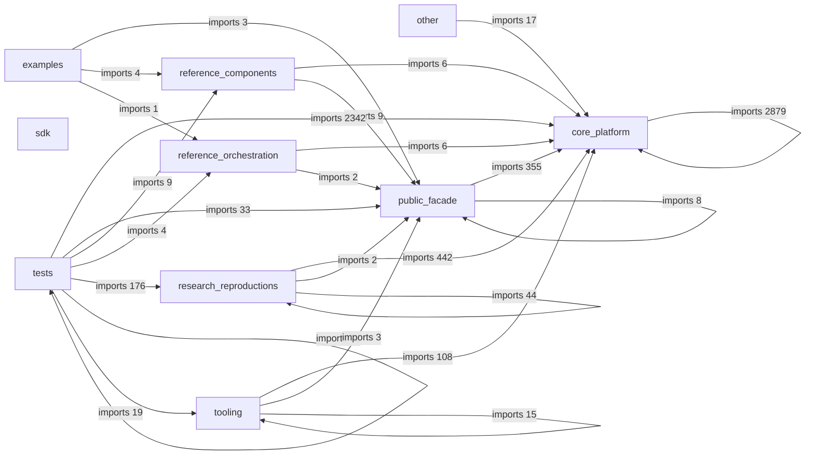
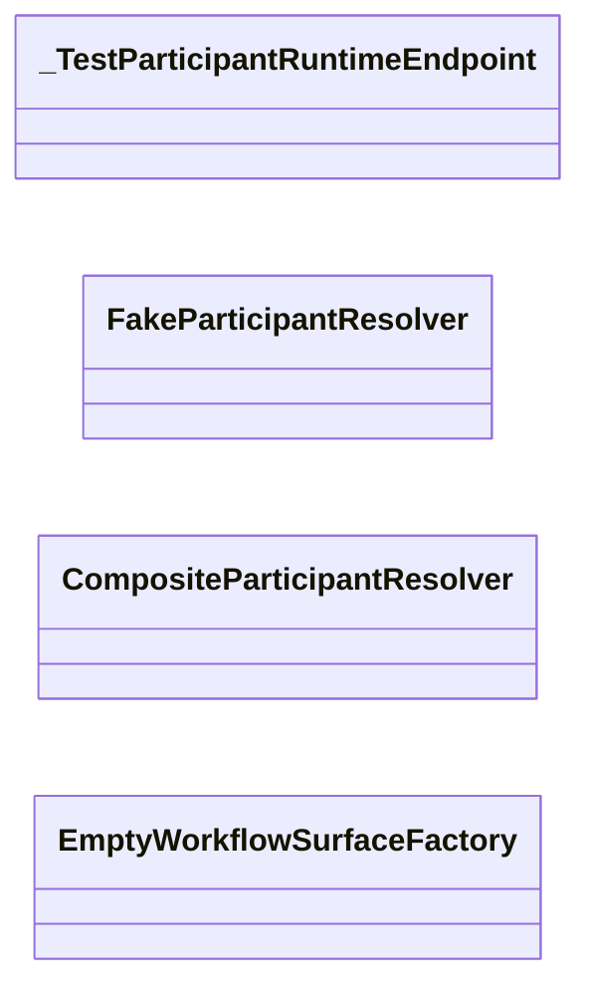
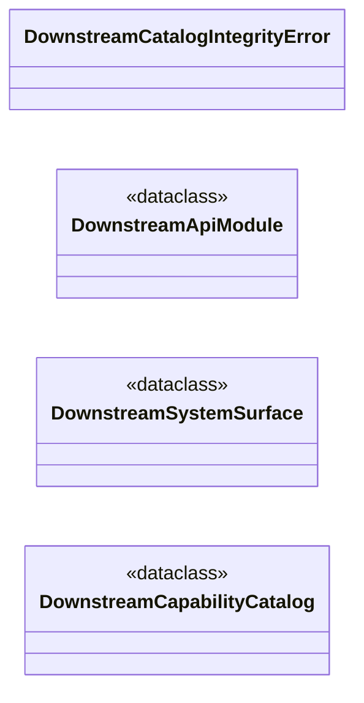
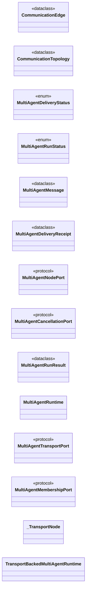
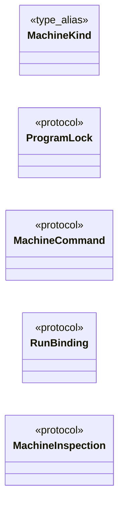

# Noetrium Whole-Repository Code Architecture Map

> AUTO-GENERATED by `scripts/generate_repository_code_architecture_map.py`.
> Source Git SHA: `c9a05c625cced523f8d05fd101acc897e9adadf2`.

This is the repository-wide companion to `CODE_ARCHITECTURE_MAP.md`. The core platform map provides fine-grained system/authority diagrams for every `noetrium_platform` class; this document adds public facade, reference implementations, reproductions, tooling, SDK and tests.

## Repository inventory

| Metric | Count |
|---|---:|
| `tracked_files` | 4178 |
| `python_files` | 3811 |
| `typescript_javascript_files` | 11 |
| `symbols` | 4371 |
| `python_import_edges` | 6559 |
| `parse_errors` | 0 |

### Symbols by role

| Role | Symbols | Python modules |
|---|---:|---:|
| `core_platform` | 3121 | 2520 |
| `examples` | 3 | 6 |
| `other` | 4 | 1 |
| `public_facade` | 4 | 188 |
| `reference_components` | 63 | 21 |
| `reference_orchestration` | 14 | 10 |
| `research_reproductions` | 262 | 373 |
| `sdk` | 5 | 0 |
| `tests` | 861 | 627 |
| `tooling` | 34 | 65 |

### Symbols by language

| Language | Symbols |
|---|---:|
| `javascript` | 1 |
| `python` | 4365 |
| `typescript` | 5 |

## Repository layer/data flow



## Observed cross-role Python dependency graph



## Core platform detail

Every `noetrium_platform` class, inheritance edge, annotation association, constructor edge, system import edge and authority projection is expanded in [`CODE_ARCHITECTURE_MAP.md`](./CODE_ARCHITECTURE_MAP.md). Its machine-readable sidecar is [`CODE_ARCHITECTURE_INDEX.json`](./CODE_ARCHITECTURE_INDEX.json).

## Repository role — `core_platform`

Total symbols: **3121**.

Core class diagrams are intentionally not duplicated here; see `CODE_ARCHITECTURE_MAP.md` for the full 16-system expansion.

| Language | Path | Symbol | Kind | Bases | Fields | Methods |
|---|---|---|---|---|---:|---:|
| `python` | `noetrium_platform/capabilities/environment/api/action_identity.py` | `noetrium_platform.capabilities.environment.api.action_identity.ActionIdentityViolation` | `class` | `ValueError` | 0 | 0 |
| `python` | `noetrium_platform/capabilities/environment/api/action_identity.py` | `noetrium_platform.capabilities.environment.api.action_identity.ActionSemanticIdentity` | `dataclass` | `` | 2 | 3 |
| `python` | `noetrium_platform/capabilities/environment/api/branch_state.py` | `noetrium_platform.capabilities.environment.api.branch_state.EnvironmentBranchStateMismatch` | `class` | `RuntimeError` | 0 | 0 |
| `python` | `noetrium_platform/capabilities/environment/api/branch_state.py` | `noetrium_platform.capabilities.environment.api.branch_state.EnvironmentBranchState` | `dataclass` | `` | 8 | 4 |
| `python` | `noetrium_platform/capabilities/environment/api/branch_state.py` | `noetrium_platform.capabilities.environment.api.branch_state.EnvironmentBranchStatePort` | `protocol` | `Protocol` | 0 | 2 |
| `python` | `noetrium_platform/capabilities/environment/api/conformance.py` | `noetrium_platform.capabilities.environment.api.conformance.EnvironmentConformanceProbe` | `dataclass` | `` | 3 | 1 |
| `python` | `noetrium_platform/capabilities/environment/api/conformance.py` | `noetrium_platform.capabilities.environment.api.conformance.EnvironmentProviderConformanceReceipt` | `dataclass` | `` | 9 | 1 |
| `python` | `noetrium_platform/capabilities/environment/api/contracts.py` | `noetrium_platform.capabilities.environment.api.contracts.EnvironmentIdentity` | `dataclass` | `` | 5 | 0 |
| `python` | `noetrium_platform/capabilities/environment/api/contracts.py` | `noetrium_platform.capabilities.environment.api.contracts.EnvironmentAssignmentIdentity` | `dataclass` | `` | 7 | 2 |
| `python` | `noetrium_platform/capabilities/environment/api/contracts.py` | `noetrium_platform.capabilities.environment.api.contracts.EnvironmentAssignmentIsolationReceipt` | `dataclass` | `` | 6 | 1 |
| `python` | `noetrium_platform/capabilities/environment/api/contracts.py` | `noetrium_platform.capabilities.environment.api.contracts.EnvironmentAssignmentIsolationPort` | `protocol` | `Protocol` | 0 | 2 |
| `python` | `noetrium_platform/capabilities/environment/api/contracts.py` | `noetrium_platform.capabilities.environment.api.contracts.Observation` | `dataclass` | `` | 4 | 0 |
| `python` | `noetrium_platform/capabilities/environment/api/contracts.py` | `noetrium_platform.capabilities.environment.api.contracts.ActionRequest` | `dataclass` | `` | 4 | 0 |
| `python` | `noetrium_platform/capabilities/environment/api/contracts.py` | `noetrium_platform.capabilities.environment.api.contracts.ActionResult` | `dataclass` | `` | 5 | 0 |
| `python` | `noetrium_platform/capabilities/environment/api/contracts.py` | `noetrium_platform.capabilities.environment.api.contracts.ActionReconciliationDisposition` | `enum` | `StrEnum` | 4 | 0 |
| `python` | `noetrium_platform/capabilities/environment/api/contracts.py` | `noetrium_platform.capabilities.environment.api.contracts.ActionReconciliationResult` | `dataclass` | `` | 4 | 0 |
| `python` | `noetrium_platform/capabilities/environment/api/contracts.py` | `noetrium_platform.capabilities.environment.api.contracts.DurablePreparedActionSession` | `protocol` | `Protocol` | 1 | 3 |
| `python` | `noetrium_platform/capabilities/environment/api/contracts.py` | `noetrium_platform.capabilities.environment.api.contracts.EnvironmentSession` | `protocol` | `Protocol` | 0 | 4 |
| `python` | `noetrium_platform/capabilities/environment/api/contracts.py` | `noetrium_platform.capabilities.environment.api.contracts.EnvironmentImplementation` | `protocol` | `Protocol` | 0 | 1 |
| `python` | `noetrium_platform/capabilities/environment/api/errors.py` | `noetrium_platform.capabilities.environment.api.errors.ActionRecoveryRequired` | `class` | `RuntimeError` | 0 | 0 |
| `python` | `noetrium_platform/capabilities/environment/api/errors.py` | `noetrium_platform.capabilities.environment.api.errors.ActionNotApplied` | `class` | `ActionRecoveryRequired` | 0 | 0 |
| `python` | `noetrium_platform/capabilities/environment/api/errors.py` | `noetrium_platform.capabilities.environment.api.errors.ActionSafetyCapabilityMissing` | `class` | `RuntimeError` | 0 | 0 |
| `python` | `noetrium_platform/capabilities/environment/api/errors.py` | `noetrium_platform.capabilities.environment.api.errors.ActionScientificCommitContradiction` | `class` | `ActionRecoveryRequired` | 0 | 0 |
| `python` | `noetrium_platform/capabilities/environment/api/errors.py` | `noetrium_platform.capabilities.environment.api.errors.EnvironmentCapabilityUnsupported` | `class` | `RuntimeError` | 0 | 1 |
| `python` | `noetrium_platform/capabilities/environment/api/interaction.py` | `noetrium_platform.capabilities.environment.api.interaction.EnvironmentActionPhase` | `enum` | `StrEnum` | 7 | 0 |
| `python` | `noetrium_platform/capabilities/environment/api/interaction.py` | `noetrium_platform.capabilities.environment.api.interaction.EnvironmentQueryKind` | `enum` | `StrEnum` | 6 | 0 |
| `python` | `noetrium_platform/capabilities/environment/api/interaction.py` | `noetrium_platform.capabilities.environment.api.interaction.EnvironmentCapabilityDescriptor` | `dataclass` | `` | 5 | 1 |
| `python` | `noetrium_platform/capabilities/environment/api/interaction.py` | `noetrium_platform.capabilities.environment.api.interaction.EnvironmentQuery` | `dataclass` | `` | 4 | 1 |
| `python` | `noetrium_platform/capabilities/environment/api/interaction.py` | `noetrium_platform.capabilities.environment.api.interaction.EnvironmentQueryResult` | `dataclass` | `` | 5 | 1 |
| `python` | `noetrium_platform/capabilities/environment/api/interaction.py` | `noetrium_platform.capabilities.environment.api.interaction.EnvironmentActionLifecycle` | `dataclass` | `` | 7 | 1 |
| `python` | `noetrium_platform/capabilities/environment/api/interaction.py` | `noetrium_platform.capabilities.environment.api.interaction.EnvironmentRawEventRecord` | `dataclass` | `` | 11 | 3 |
| `python` | `noetrium_platform/capabilities/environment/api/interaction.py` | `noetrium_platform.capabilities.environment.api.interaction.EnvironmentRawEventReceipt` | `dataclass` | `` | 5 | 1 |
| `python` | `noetrium_platform/capabilities/environment/api/interaction.py` | `noetrium_platform.capabilities.environment.api.interaction.EnvironmentQueryPort` | `protocol` | `Protocol` | 0 | 1 |
| `python` | `noetrium_platform/capabilities/environment/api/interaction.py` | `noetrium_platform.capabilities.environment.api.interaction.EnvironmentCapabilityPort` | `protocol` | `Protocol` | 0 | 1 |
| `python` | `noetrium_platform/capabilities/environment/api/interaction.py` | `noetrium_platform.capabilities.environment.api.interaction.EnvironmentRawRecordSinkPort` | `protocol` | `Protocol` | 0 | 1 |
| `python` | `noetrium_platform/capabilities/environment/api/interaction.py` | `noetrium_platform.capabilities.environment.api.interaction.EnvironmentCoordinationRequest` | `dataclass` | `` | 4 | 1 |
| `python` | `noetrium_platform/capabilities/environment/api/interaction.py` | `noetrium_platform.capabilities.environment.api.interaction.EnvironmentCoordinationReceipt` | `dataclass` | `` | 4 | 0 |
| `python` | `noetrium_platform/capabilities/environment/api/interaction.py` | `noetrium_platform.capabilities.environment.api.interaction.EnvironmentCoordinationPort` | `protocol` | `Protocol` | 0 | 1 |
| `python` | `noetrium_platform/capabilities/environment/api/provider.py` | `noetrium_platform.capabilities.environment.api.provider.EnvironmentCapability` | `enum` | `StrEnum` | 11 | 0 |
| `python` | `noetrium_platform/capabilities/environment/api/provider.py` | `noetrium_platform.capabilities.environment.api.provider.EnvironmentProviderCapabilities` | `dataclass` | `` | 1 | 4 |
| `python` | `noetrium_platform/capabilities/environment/api/provider.py` | `noetrium_platform.capabilities.environment.api.provider.EnvironmentSessionServices` | `protocol` | `Protocol` | 0 | 0 |
| `python` | `noetrium_platform/capabilities/environment/api/provider.py` | `noetrium_platform.capabilities.environment.api.provider.EnvironmentSessionDiagnostics` | `dataclass` | `` | 8 | 1 |
| `python` | `noetrium_platform/capabilities/environment/api/provider.py` | `noetrium_platform.capabilities.environment.api.provider.EnvironmentDiagnosticsPort` | `protocol` | `Protocol` | 0 | 1 |
| `python` | `noetrium_platform/capabilities/environment/api/provider.py` | `noetrium_platform.capabilities.environment.api.provider.EnvironmentProviderPort` | `protocol` | `Protocol` | 0 | 3 |
| `python` | `noetrium_platform/capabilities/environment/api/recovery.py` | `noetrium_platform.capabilities.environment.api.recovery.EnvironmentRecoverySession` | `protocol` | `Protocol` | 0 | 2 |
| `python` | `noetrium_platform/capabilities/environment/api/reset.py` | `noetrium_platform.capabilities.environment.api.reset.EnvironmentResetPort` | `protocol` | `Protocol` | 0 | 1 |
| `python` | `noetrium_platform/capabilities/environment/api/state_machine.py` | `noetrium_platform.capabilities.environment.api.state_machine.StateMachineDynamicsIdentity` | `dataclass` | `` | 3 | 1 |
| `python` | `noetrium_platform/capabilities/environment/api/state_machine.py` | `noetrium_platform.capabilities.environment.api.state_machine.StateMachineEnvironmentSpec` | `dataclass` | `` | 7 | 2 |
| `python` | `noetrium_platform/capabilities/environment/api/state_machine.py` | `noetrium_platform.capabilities.environment.api.state_machine.StateTransition` | `dataclass` | `` | 4 | 1 |
| `python` | `noetrium_platform/capabilities/environment/api/state_machine.py` | `noetrium_platform.capabilities.environment.api.state_machine.StateMachineDynamicsPort` | `protocol` | `Protocol` | 0 | 2 |
| `python` | `noetrium_platform/capabilities/environment/catalog/api/contracts.py` | `noetrium_platform.capabilities.environment.catalog.api.contracts.ExecutionEnvironmentKind` | `enum` | `StrEnum` | 7 | 0 |
| `python` | `noetrium_platform/capabilities/environment/catalog/api/contracts.py` | `noetrium_platform.capabilities.environment.catalog.api.contracts.EnvironmentTemplate` | `dataclass` | `` | 5 | 0 |
| `python` | `noetrium_platform/capabilities/environment/catalog/api/contracts.py` | `noetrium_platform.capabilities.environment.catalog.api.contracts.EnvironmentSpec` | `dataclass` | `` | 8 | 0 |
| `python` | `noetrium_platform/capabilities/environment/catalog/api/contracts.py` | `noetrium_platform.capabilities.environment.catalog.api.contracts.EnvironmentOverlay` | `dataclass` | `` | 5 | 0 |
| `python` | `noetrium_platform/capabilities/environment/catalog/api/contracts.py` | `noetrium_platform.capabilities.environment.catalog.api.contracts.EnvironmentAssignment` | `dataclass` | `` | 4 | 0 |
| `python` | `noetrium_platform/capabilities/environment/catalog/api/contracts.py` | `noetrium_platform.capabilities.environment.catalog.api.contracts.ResolvedEnvironmentSpec` | `dataclass` | `` | 8 | 0 |
| `python` | `noetrium_platform/capabilities/environment/catalog/api/contracts.py` | `noetrium_platform.capabilities.environment.catalog.api.contracts.EnvironmentInstance` | `dataclass` | `` | 5 | 0 |
| `python` | `noetrium_platform/capabilities/environment/catalog/api/contracts.py` | `noetrium_platform.capabilities.environment.catalog.api.contracts.EnvironmentBinding` | `dataclass` | `` | 4 | 0 |
| `python` | `noetrium_platform/capabilities/environment/catalog/api/ports.py` | `noetrium_platform.capabilities.environment.catalog.api.ports.ExecutionEnvironmentCatalogPort` | `protocol` | `Protocol` | 0 | 8 |
| `python` | `noetrium_platform/capabilities/environment/catalog/runtime/catalog.py` | `noetrium_platform.capabilities.environment.catalog.runtime.catalog.EnvironmentCatalogConflict` | `class` | `RuntimeError` | 0 | 0 |
| `python` | `noetrium_platform/capabilities/environment/catalog/runtime/catalog.py` | `noetrium_platform.capabilities.environment.catalog.runtime.catalog.EnvironmentCatalogNotFound` | `class` | `KeyError` | 0 | 0 |
| `python` | `noetrium_platform/capabilities/environment/catalog/runtime/catalog.py` | `noetrium_platform.capabilities.environment.catalog.runtime.catalog.ExecutionEnvironmentCatalog` | `class` | `` | 0 | 12 |
| `python` | `noetrium_platform/capabilities/environment/catalog/runtime/catalog.py` | `noetrium_platform.capabilities.environment.catalog.runtime.catalog.SQLiteExecutionEnvironmentCatalog` | `class` | `ExecutionEnvironmentCatalog` | 0 | 23 |
| `python` | `noetrium_platform/capabilities/environment/category/api/contracts.py` | `noetrium_platform.capabilities.environment.category.api.contracts.EnvironmentCategoryId` | `enum` | `StrEnum` | 6 | 0 |
| `python` | `noetrium_platform/capabilities/environment/category/api/contracts.py` | `noetrium_platform.capabilities.environment.category.api.contracts.EnvironmentCategoryStatus` | `enum` | `StrEnum` | 2 | 0 |
| `python` | `noetrium_platform/capabilities/environment/category/api/contracts.py` | `noetrium_platform.capabilities.environment.category.api.contracts.EnvironmentCategoryDescriptor` | `dataclass` | `` | 10 | 3 |
| `python` | `noetrium_platform/capabilities/environment/category/api/contracts.py` | `noetrium_platform.capabilities.environment.category.api.contracts.EnvironmentImplementationDescriptor` | `dataclass` | `` | 9 | 3 |
| `python` | `noetrium_platform/capabilities/environment/category/api/ports.py` | `noetrium_platform.capabilities.environment.category.api.ports.EnvironmentCategoryCatalogPort` | `protocol` | `Protocol` | 0 | 5 |
| `python` | `noetrium_platform/capabilities/environment/category/composition/default.py` | `noetrium_platform.capabilities.environment.category.composition.default.DefaultEnvironmentCategoryCatalog` | `dataclass` | `` | 2 | 6 |
| `python` | `noetrium_platform/capabilities/environment/composition/action_capability.py` | `noetrium_platform.capabilities.environment.composition.action_capability.EnvironmentSessionCapabilityAdapter` | `class` | `` | 0 | 18 |
| `python` | `noetrium_platform/capabilities/environment/composition/branch_capability.py` | `noetrium_platform.capabilities.environment.composition.branch_capability.EnvironmentBranchCapabilityBinding` | `class` | `` | 0 | 8 |
| `python` | `noetrium_platform/capabilities/environment/composition/query_capability.py` | `noetrium_platform.capabilities.environment.composition.query_capability.EnvironmentQueryCapabilityBinding` | `class` | `` | 0 | 4 |
| `python` | `noetrium_platform/capabilities/environment/composition/reset_capability.py` | `noetrium_platform.capabilities.environment.composition.reset_capability.EnvironmentResetCapabilityBinding` | `class` | `` | 0 | 4 |
| `python` | `noetrium_platform/capabilities/environment/embodied/api/contracts.py` | `noetrium_platform.capabilities.environment.embodied.api.contracts.EmbodimentKind` | `enum` | `StrEnum` | 6 | 0 |
| `python` | `noetrium_platform/capabilities/environment/embodied/api/contracts.py` | `noetrium_platform.capabilities.environment.embodied.api.contracts.SensorModality` | `enum` | `StrEnum` | 9 | 0 |
| `python` | `noetrium_platform/capabilities/environment/embodied/api/contracts.py` | `noetrium_platform.capabilities.environment.embodied.api.contracts.ActionKind` | `enum` | `StrEnum` | 6 | 0 |
| `python` | `noetrium_platform/capabilities/environment/embodied/api/contracts.py` | `noetrium_platform.capabilities.environment.embodied.api.contracts.EmbodiedEventKind` | `enum` | `StrEnum` | 8 | 0 |
| `python` | `noetrium_platform/capabilities/environment/embodied/api/contracts.py` | `noetrium_platform.capabilities.environment.embodied.api.contracts.SensorSpec` | `dataclass` | `` | 9 | 2 |
| `python` | `noetrium_platform/capabilities/environment/embodied/api/contracts.py` | `noetrium_platform.capabilities.environment.embodied.api.contracts.ActionSpec` | `dataclass` | `` | 8 | 2 |
| `python` | `noetrium_platform/capabilities/environment/embodied/api/contracts.py` | `noetrium_platform.capabilities.environment.embodied.api.contracts.EmbodimentSpec` | `dataclass` | `` | 7 | 3 |
| `python` | `noetrium_platform/capabilities/environment/embodied/api/contracts.py` | `noetrium_platform.capabilities.environment.embodied.api.contracts.EpisodeSpec` | `dataclass` | `` | 8 | 3 |
| `python` | `noetrium_platform/capabilities/environment/embodied/api/contracts.py` | `noetrium_platform.capabilities.environment.embodied.api.contracts.EmbodiedActionCommand` | `dataclass` | `` | 8 | 2 |
| `python` | `noetrium_platform/capabilities/environment/embodied/api/contracts.py` | `noetrium_platform.capabilities.environment.embodied.api.contracts.EmbodiedEvent` | `dataclass` | `` | 19 | 3 |
| `python` | `noetrium_platform/capabilities/environment/embodied/api/contracts.py` | `noetrium_platform.capabilities.environment.embodied.api.contracts.EmbodiedCaptureReceipt` | `dataclass` | `` | 6 | 1 |
| `python` | `noetrium_platform/capabilities/environment/embodied/api/ports.py` | `noetrium_platform.capabilities.environment.embodied.api.ports.EmbodiedEnvironmentPort` | `protocol` | `Protocol` | 0 | 4 |
| `python` | `noetrium_platform/capabilities/environment/embodied/api/ports.py` | `noetrium_platform.capabilities.environment.embodied.api.ports.EmbodiedTrajectorySinkPort` | `protocol` | `Protocol` | 0 | 1 |
| `python` | `noetrium_platform/capabilities/environment/embodied/api/ports.py` | `noetrium_platform.capabilities.environment.embodied.api.ports.EmbodiedCheckpointPort` | `protocol` | `Protocol` | 0 | 2 |
| `python` | `noetrium_platform/capabilities/environment/embodied/api/ports.py` | `noetrium_platform.capabilities.environment.embodied.api.ports.EmbodiedQueryPort` | `protocol` | `Protocol` | 0 | 1 |
| `python` | `noetrium_platform/capabilities/environment/embodied/api/ports.py` | `noetrium_platform.capabilities.environment.embodied.api.ports.EmbodiedCapabilityPort` | `protocol` | `Protocol` | 0 | 1 |
| `python` | `noetrium_platform/capabilities/environment/embodied/composition/provider_adapter.py` | `noetrium_platform.capabilities.environment.embodied.composition.provider_adapter.EmbodiedEnvironmentProviderAdapter` | `class` | `` | 0 | 5 |
| `python` | `noetrium_platform/capabilities/environment/embodied/composition/provider_adapter.py` | `noetrium_platform.capabilities.environment.embodied.composition.provider_adapter._EmbodiedSessionAdapter` | `class` | `EnvironmentDiagnosticsPort` | 0 | 15 |
| `python` | `noetrium_platform/capabilities/environment/embodied/composition/raw_trajectory.py` | `noetrium_platform.capabilities.environment.embodied.composition.raw_trajectory.RegistryBoundEmbodiedTrajectorySink` | `class` | `` | 0 | 2 |
| `python` | `noetrium_platform/capabilities/environment/embodied/providers/simulator.py` | `noetrium_platform.capabilities.environment.embodied.providers.simulator.SimulatorObservation` | `dataclass` | `` | 8 | 1 |
| `python` | `noetrium_platform/capabilities/environment/embodied/providers/simulator.py` | `noetrium_platform.capabilities.environment.embodied.providers.simulator.SimulatorStep` | `dataclass` | `` | 3 | 1 |
| `python` | `noetrium_platform/capabilities/environment/embodied/providers/simulator.py` | `noetrium_platform.capabilities.environment.embodied.providers.simulator.EmbodiedSimulatorBackendPort` | `protocol` | `Protocol` | 0 | 4 |
| `python` | `noetrium_platform/capabilities/environment/embodied/providers/simulator.py` | `noetrium_platform.capabilities.environment.embodied.providers.simulator.EmbodiedSimulatorEnvironment` | `class` | `EmbodiedEnvironmentPort` | 0 | 10 |
| `python` | `noetrium_platform/capabilities/environment/gui/api/contracts.py` | `noetrium_platform.capabilities.environment.gui.api.contracts.GuiActionKind` | `enum` | `StrEnum` | 6 | 0 |
| `python` | `noetrium_platform/capabilities/environment/gui/api/contracts.py` | `noetrium_platform.capabilities.environment.gui.api.contracts.GuiEnvironmentSpec` | `dataclass` | `` | 6 | 2 |
| `python` | `noetrium_platform/capabilities/environment/gui/api/ports.py` | `noetrium_platform.capabilities.environment.gui.api.ports.GuiWorldPort` | `protocol` | `EnvironmentSession, Protocol` | 0 | 4 |
| `python` | `noetrium_platform/capabilities/environment/minecraft/api/action_codec_support.py` | `noetrium_platform.capabilities.environment.minecraft.api.action_codec_support.MinecraftActionContractError` | `class` | `ValueError` | 0 | 1 |
| `python` | `noetrium_platform/capabilities/environment/minecraft/api/action_codec_support.py` | `noetrium_platform.capabilities.environment.minecraft.api.action_codec_support.MinecraftActionCodec` | `protocol` | `Protocol` | 0 | 1 |
| `python` | `noetrium_platform/capabilities/environment/minecraft/api/contracts.py` | `noetrium_platform.capabilities.environment.minecraft.api.contracts.MinecraftActionCategory` | `enum` | `StrEnum` | 6 | 0 |
| `python` | `noetrium_platform/capabilities/environment/minecraft/api/contracts.py` | `noetrium_platform.capabilities.environment.minecraft.api.contracts.MinecraftActionOutcomeStatus` | `enum` | `StrEnum` | 3 | 0 |
| `python` | `noetrium_platform/capabilities/environment/minecraft/api/contracts.py` | `noetrium_platform.capabilities.environment.minecraft.api.contracts.MinecraftPlannerActionContract` | `dataclass` | `` | 5 | 1 |
| `python` | `noetrium_platform/capabilities/environment/minecraft/api/contracts.py` | `noetrium_platform.capabilities.environment.minecraft.api.contracts.MinecraftActionSpec` | `dataclass` | `` | 6 | 2 |
| `python` | `noetrium_platform/capabilities/environment/minecraft/api/contracts.py` | `noetrium_platform.capabilities.environment.minecraft.api.contracts.MinecraftEndpointSpec` | `dataclass` | `` | 2 | 1 |
| `python` | `noetrium_platform/capabilities/environment/minecraft/api/contracts.py` | `noetrium_platform.capabilities.environment.minecraft.api.contracts.MinecraftAgentSpec` | `dataclass` | `` | 3 | 1 |
| `python` | `noetrium_platform/capabilities/environment/minecraft/api/contracts.py` | `noetrium_platform.capabilities.environment.minecraft.api.contracts.MinecraftBridgeSpec` | `dataclass` | `` | 7 | 1 |
| `python` | `noetrium_platform/capabilities/environment/minecraft/api/contracts.py` | `noetrium_platform.capabilities.environment.minecraft.api.contracts.MinecraftEnvironmentSpec` | `dataclass` | `` | 9 | 3 |
| `python` | `noetrium_platform/capabilities/environment/minecraft/api/contracts.py` | `noetrium_platform.capabilities.environment.minecraft.api.contracts.MinecraftSessionRuntimeIdentity` | `dataclass` | `` | 4 | 1 |
| `python` | `noetrium_platform/capabilities/environment/minecraft/api/contracts.py` | `noetrium_platform.capabilities.environment.minecraft.api.contracts.MinecraftServerSpec` | `dataclass` | `` | 12 | 2 |
| `python` | `noetrium_platform/capabilities/environment/minecraft/api/contracts.py` | `noetrium_platform.capabilities.environment.minecraft.api.contracts.MinecraftServerPreparedFiles` | `dataclass` | `` | 4 | 1 |
| `python` | `noetrium_platform/capabilities/environment/minecraft/api/contracts.py` | `noetrium_platform.capabilities.environment.minecraft.api.contracts.MinecraftRconEndpoint` | `dataclass` | `` | 3 | 1 |
| `python` | `noetrium_platform/capabilities/environment/minecraft/api/contracts.py` | `noetrium_platform.capabilities.environment.minecraft.api.contracts.MinecraftConsoleCommandResult` | `dataclass` | `` | 3 | 1 |
| `python` | `noetrium_platform/capabilities/environment/minecraft/api/contracts.py` | `noetrium_platform.capabilities.environment.minecraft.api.contracts.MinecraftWorldQuiescence` | `dataclass` | `` | 5 | 2 |
| `python` | `noetrium_platform/capabilities/environment/minecraft/api/contracts.py` | `noetrium_platform.capabilities.environment.minecraft.api.contracts.MinecraftWorldCut` | `dataclass` | `` | 8 | 2 |
| `python` | `noetrium_platform/capabilities/environment/minecraft/api/contracts.py` | `noetrium_platform.capabilities.environment.minecraft.api.contracts.MinecraftWorldBranch` | `dataclass` | `` | 6 | 1 |
| `python` | `noetrium_platform/capabilities/environment/minecraft/api/contracts.py` | `noetrium_platform.capabilities.environment.minecraft.api.contracts.MinecraftBranchRuntimeRequest` | `dataclass` | `` | 6 | 1 |
| `python` | `noetrium_platform/capabilities/environment/minecraft/api/contracts.py` | `noetrium_platform.capabilities.environment.minecraft.api.contracts.MinecraftObservationEvent` | `dataclass` | `` | 6 | 1 |
| `python` | `noetrium_platform/capabilities/environment/minecraft/api/contracts.py` | `noetrium_platform.capabilities.environment.minecraft.api.contracts.MinecraftActionResultEvidence` | `dataclass` | `` | 5 | 1 |
| `python` | `noetrium_platform/capabilities/environment/minecraft/api/contracts.py` | `noetrium_platform.capabilities.environment.minecraft.api.contracts.MinecraftBridgeEnvelope` | `dataclass` | `` | 6 | 2 |
| `python` | `noetrium_platform/capabilities/environment/minecraft/api/ports.py` | `noetrium_platform.capabilities.environment.minecraft.api.ports.MinecraftServerLifecyclePort` | `protocol` | `Protocol` | 0 | 3 |
| `python` | `noetrium_platform/capabilities/environment/minecraft/api/ports.py` | `noetrium_platform.capabilities.environment.minecraft.api.ports.MinecraftServerEndpointBindingPort` | `protocol` | `Protocol` | 0 | 1 |
| `python` | `noetrium_platform/capabilities/environment/minecraft/api/ports.py` | `noetrium_platform.capabilities.environment.minecraft.api.ports.MinecraftSessionServices` | `protocol` | `Protocol` | 0 | 0 |
| `python` | `noetrium_platform/capabilities/environment/minecraft/api/ports.py` | `noetrium_platform.capabilities.environment.minecraft.api.ports.MinecraftBranchServerFactoryPort` | `protocol` | `Protocol` | 0 | 1 |
| `python` | `noetrium_platform/capabilities/environment/minecraft/api/ports.py` | `noetrium_platform.capabilities.environment.minecraft.api.ports.MinecraftBranchRuntimePort` | `protocol` | `Protocol` | 0 | 3 |
| `python` | `noetrium_platform/capabilities/environment/minecraft/api/ports.py` | `noetrium_platform.capabilities.environment.minecraft.api.ports.MinecraftBranchRuntimeFactoryPort` | `protocol` | `Protocol` | 0 | 1 |
| `python` | `noetrium_platform/capabilities/environment/minecraft/api/ports.py` | `noetrium_platform.capabilities.environment.minecraft.api.ports.MinecraftBridgeCommandResult` | `dataclass` | `` | 5 | 0 |
| `python` | `noetrium_platform/capabilities/environment/minecraft/api/ports.py` | `noetrium_platform.capabilities.environment.minecraft.api.ports.MinecraftReconciliation` | `dataclass` | `` | 4 | 0 |
| `python` | `noetrium_platform/capabilities/environment/minecraft/api/ports.py` | `noetrium_platform.capabilities.environment.minecraft.api.ports.MinecraftBridgePort` | `protocol` | `Protocol` | 0 | 7 |
| `python` | `noetrium_platform/capabilities/environment/minecraft/api/ports.py` | `noetrium_platform.capabilities.environment.minecraft.api.ports.MinecraftDiagnosticsPort` | `protocol` | `Protocol` | 0 | 3 |
| `python` | `noetrium_platform/capabilities/environment/minecraft/api/ports.py` | `noetrium_platform.capabilities.environment.minecraft.api.ports.MinecraftCheckpointPort` | `protocol` | `Protocol` | 0 | 2 |
| `python` | `noetrium_platform/capabilities/environment/minecraft/api/ports.py` | `noetrium_platform.capabilities.environment.minecraft.api.ports.MinecraftServerConsolePort` | `protocol` | `Protocol` | 0 | 1 |
| `python` | `noetrium_platform/capabilities/environment/minecraft/api/ports.py` | `noetrium_platform.capabilities.environment.minecraft.api.ports.MinecraftScenarioProvisioningPort` | `protocol` | `Protocol` | 0 | 1 |
| `python` | `noetrium_platform/capabilities/environment/minecraft/api/ports.py` | `noetrium_platform.capabilities.environment.minecraft.api.ports.MinecraftWorldQuiescencePort` | `protocol` | `Protocol` | 0 | 2 |
| `python` | `noetrium_platform/capabilities/environment/minecraft/api/ports.py` | `noetrium_platform.capabilities.environment.minecraft.api.ports.MinecraftWorldCutPort` | `protocol` | `Protocol` | 0 | 3 |
| `python` | `noetrium_platform/capabilities/environment/minecraft/api/ports.py` | `noetrium_platform.capabilities.environment.minecraft.api.ports.MinecraftWorldCutMetadataStorePort` | `protocol` | `Protocol` | 0 | 1 |
| `python` | `noetrium_platform/capabilities/environment/minecraft/api/ports.py` | `noetrium_platform.capabilities.environment.minecraft.api.ports.MinecraftExperimentHostPort` | `protocol` | `Protocol` | 3 | 3 |
| `python` | `noetrium_platform/capabilities/environment/minecraft/api/raw_control.py` | `noetrium_platform.capabilities.environment.minecraft.api.raw_control.MinecraftRawControlObservation` | `dataclass` | `` | 8 | 3 |
| `python` | `noetrium_platform/capabilities/environment/minecraft/api/raw_control.py` | `noetrium_platform.capabilities.environment.minecraft.api.raw_control.MinecraftRawControlCommand` | `dataclass` | `` | 4 | 1 |
| `python` | `noetrium_platform/capabilities/environment/minecraft/api/raw_control.py` | `noetrium_platform.capabilities.environment.minecraft.api.raw_control.MinecraftRawControlBackendPort` | `protocol` | `Protocol` | 0 | 4 |
| `python` | `noetrium_platform/capabilities/environment/minecraft/api/scenario.py` | `noetrium_platform.capabilities.environment.minecraft.api.scenario.MinecraftScenarioStep` | `dataclass` | `` | 5 | 2 |
| `python` | `noetrium_platform/capabilities/environment/minecraft/api/scenario.py` | `noetrium_platform.capabilities.environment.minecraft.api.scenario.MinecraftScenarioSpec` | `dataclass` | `` | 3 | 2 |
| `python` | `noetrium_platform/capabilities/environment/minecraft/api/scenario.py` | `noetrium_platform.capabilities.environment.minecraft.api.scenario.MinecraftScenarioStepReceipt` | `dataclass` | `` | 6 | 1 |
| `python` | `noetrium_platform/capabilities/environment/minecraft/api/scenario.py` | `noetrium_platform.capabilities.environment.minecraft.api.scenario.MinecraftScenarioReceipt` | `dataclass` | `` | 4 | 2 |
| `python` | `noetrium_platform/capabilities/environment/minecraft/composition/agent_io.py` | `noetrium_platform.capabilities.environment.minecraft.composition.agent_io.MinecraftAgentObservationPort` | `class` | `` | 0 | 2 |
| `python` | `noetrium_platform/capabilities/environment/minecraft/composition/agent_io.py` | `noetrium_platform.capabilities.environment.minecraft.composition.agent_io.MinecraftAgentActionExecutor` | `class` | `AgentActionExecutorPort` | 0 | 2 |
| `python` | `noetrium_platform/capabilities/environment/minecraft/composition/assignment_isolation.py` | `noetrium_platform.capabilities.environment.minecraft.composition.assignment_isolation.MinecraftBranchAssignmentIsolation` | `class` | `EnvironmentAssignmentIsolationPort` | 0 | 7 |
| `python` | `noetrium_platform/capabilities/environment/minecraft/composition/assignment_isolation.py` | `noetrium_platform.capabilities.environment.minecraft.composition.assignment_isolation.MinecraftBranchAssignmentIsolationFactory` | `class` | `` | 0 | 2 |
| `python` | `noetrium_platform/capabilities/environment/minecraft/composition/branch_runtime.py` | `noetrium_platform.capabilities.environment.minecraft.composition.branch_runtime.MinecraftBranchRuntimeError` | `class` | `RuntimeError` | 0 | 1 |
| `python` | `noetrium_platform/capabilities/environment/minecraft/composition/branch_runtime.py` | `noetrium_platform.capabilities.environment.minecraft.composition.branch_runtime.MinecraftBranchEnvironmentFactoryPort` | `protocol` | `Protocol` | 0 | 1 |
| `python` | `noetrium_platform/capabilities/environment/minecraft/composition/branch_runtime.py` | `noetrium_platform.capabilities.environment.minecraft.composition.branch_runtime.MinecraftBranchCheckpointFactoryPort` | `protocol` | `Protocol` | 0 | 1 |
| `python` | `noetrium_platform/capabilities/environment/minecraft/composition/branch_runtime.py` | `noetrium_platform.capabilities.environment.minecraft.composition.branch_runtime._EndpointGenerationAllocationPort` | `protocol` | `EndpointAllocationPort, Protocol` | 0 | 1 |
| `python` | `noetrium_platform/capabilities/environment/minecraft/composition/branch_runtime.py` | `noetrium_platform.capabilities.environment.minecraft.composition.branch_runtime._MinecraftEndpointBindingAuthority` | `class` | `MinecraftServerEndpointBindingPort` | 0 | 4 |
| `python` | `noetrium_platform/capabilities/environment/minecraft/composition/branch_runtime.py` | `noetrium_platform.capabilities.environment.minecraft.composition.branch_runtime._LeaseGuardedEnvironmentSession` | `class` | `` | 0 | 11 |
| `python` | `noetrium_platform/capabilities/environment/minecraft/composition/branch_runtime.py` | `noetrium_platform.capabilities.environment.minecraft.composition.branch_runtime._LeaseGuardedPreparedEnvironmentSession` | `class` | `_LeaseGuardedEnvironmentSession` | 0 | 5 |
| `python` | `noetrium_platform/capabilities/environment/minecraft/composition/branch_runtime.py` | `noetrium_platform.capabilities.environment.minecraft.composition.branch_runtime.MinecraftBranchRuntimeBinding` | `class` | `MinecraftBranchRuntimePort` | 0 | 8 |
| `python` | `noetrium_platform/capabilities/environment/minecraft/composition/branch_runtime.py` | `noetrium_platform.capabilities.environment.minecraft.composition.branch_runtime.MinecraftBranchRuntimeFactory` | `class` | `MinecraftBranchRuntimeFactoryPort` | 0 | 2 |
| `python` | `noetrium_platform/capabilities/environment/minecraft/composition/diagnostics.py` | `noetrium_platform.capabilities.environment.minecraft.composition.diagnostics.MinecraftFailureMaterializer` | `protocol` | `Protocol` | 0 | 1 |
| `python` | `noetrium_platform/capabilities/environment/minecraft/composition/diagnostics.py` | `noetrium_platform.capabilities.environment.minecraft.composition.diagnostics.MinecraftDiagnosticContext` | `protocol` | `Protocol` | 0 | 1 |
| `python` | `noetrium_platform/capabilities/environment/minecraft/composition/diagnostics.py` | `noetrium_platform.capabilities.environment.minecraft.composition.diagnostics.StructuredMinecraftDiagnostics` | `class` | `MinecraftDiagnosticsPort` | 0 | 7 |
| `python` | `noetrium_platform/capabilities/environment/minecraft/composition/environment.py` | `noetrium_platform.capabilities.environment.minecraft.composition.environment.MinecraftEnvironmentAssembly` | `dataclass` | `` | 2 | 0 |
| `python` | `noetrium_platform/capabilities/environment/minecraft/composition/experiment_host.py` | `noetrium_platform.capabilities.environment.minecraft.composition.experiment_host.MinecraftSourceServerPort` | `protocol` | `Protocol` | 1 | 3 |
| `python` | `noetrium_platform/capabilities/environment/minecraft/composition/experiment_host.py` | `noetrium_platform.capabilities.environment.minecraft.composition.experiment_host._SourceProcessState` | `dataclass` | `` | 1 | 0 |
| `python` | `noetrium_platform/capabilities/environment/minecraft/composition/experiment_host.py` | `noetrium_platform.capabilities.environment.minecraft.composition.experiment_host.MinecraftExperimentHostInputs` | `dataclass` | `` | 13 | 1 |
| `python` | `noetrium_platform/capabilities/environment/minecraft/composition/experiment_host.py` | `noetrium_platform.capabilities.environment.minecraft.composition.experiment_host.MinecraftExperimentHost` | `class` | `` | 0 | 7 |
| `python` | `noetrium_platform/capabilities/environment/minecraft/composition/experiment_host.py` | `noetrium_platform.capabilities.environment.minecraft.composition.experiment_host._MissingEndpointLeaseGuardFactory` | `class` | `` | 0 | 1 |
| `python` | `noetrium_platform/capabilities/environment/minecraft/composition/experiment_host.py` | `noetrium_platform.capabilities.environment.minecraft.composition.experiment_host.LocalMinecraftExperimentHostFactory` | `class` | `` | 0 | 3 |
| `python` | `noetrium_platform/capabilities/environment/minecraft/composition/participant_runtime.py` | `noetrium_platform.capabilities.environment.minecraft.composition.participant_runtime.MinecraftParticipantRuntimeAdapter` | `dataclass` | `` | 1 | 2 |
| `python` | `noetrium_platform/capabilities/environment/minecraft/composition/server_artifact.py` | `noetrium_platform.capabilities.environment.minecraft.composition.server_artifact.MinecraftServerArtifactAssembly` | `dataclass` | `` | 1 | 0 |
| `python` | `noetrium_platform/capabilities/environment/minecraft/composition/server_service.py` | `noetrium_platform.capabilities.environment.minecraft.composition.server_service.MinecraftServerServiceError` | `class` | `RuntimeError` | 0 | 0 |
| `python` | `noetrium_platform/capabilities/environment/minecraft/composition/server_service.py` | `noetrium_platform.capabilities.environment.minecraft.composition.server_service.MinecraftTcpReadinessProbe` | `class` | `` | 0 | 3 |
| `python` | `noetrium_platform/capabilities/environment/minecraft/composition/server_service.py` | `noetrium_platform.capabilities.environment.minecraft.composition.server_service.MinecraftServerReadinessProbe` | `class` | `` | 0 | 2 |
| `python` | `noetrium_platform/capabilities/environment/minecraft/composition/server_service.py` | `noetrium_platform.capabilities.environment.minecraft.composition.server_service.MinecraftServerServiceController` | `dataclass` | `` | 5 | 6 |
| `python` | `noetrium_platform/capabilities/environment/minecraft/composition/server_service.py` | `noetrium_platform.capabilities.environment.minecraft.composition.server_service.MinecraftServerServiceFactoryConfig` | `dataclass` | `` | 12 | 1 |
| `python` | `noetrium_platform/capabilities/environment/minecraft/composition/server_service.py` | `noetrium_platform.capabilities.environment.minecraft.composition.server_service.MinecraftServerServiceFactory` | `class` | `` | 0 | 2 |
| `javascript` | `noetrium_platform/capabilities/environment/minecraft/providers/assets/mineflayer_bridge/action_recovery.js` | `noetrium_platform/capabilities/environment/minecraft/providers/assets/mineflayer_bridge/action_recovery.js::ActionRecoveryJournal` | `class` | `` | 0 | 0 |
| `python` | `noetrium_platform/capabilities/environment/minecraft/providers/branch_checkpoint.py` | `noetrium_platform.capabilities.environment.minecraft.providers.branch_checkpoint.FilesystemMinecraftBranchCheckpointProvider` | `class` | `MinecraftCheckpointPort` | 0 | 11 |
| `python` | `noetrium_platform/capabilities/environment/minecraft/providers/branch_checkpoint_factory.py` | `noetrium_platform.capabilities.environment.minecraft.providers.branch_checkpoint_factory.FilesystemMinecraftBranchCheckpointFactory` | `class` | `` | 0 | 3 |
| `python` | `noetrium_platform/capabilities/environment/minecraft/providers/branch_restore_journal.py` | `noetrium_platform.capabilities.environment.minecraft.providers.branch_restore_journal.MinecraftBranchCheckpointError` | `class` | `RuntimeError` | 0 | 0 |
| `python` | `noetrium_platform/capabilities/environment/minecraft/providers/branch_restore_journal.py` | `noetrium_platform.capabilities.environment.minecraft.providers.branch_restore_journal.ContractDigestFactory` | `protocol` | `Protocol` | 0 | 1 |
| `python` | `noetrium_platform/capabilities/environment/minecraft/providers/branch_restore_journal.py` | `noetrium_platform.capabilities.environment.minecraft.providers.branch_restore_journal.MinecraftBranchRestoreJournal` | `class` | `` | 0 | 9 |
| `python` | `noetrium_platform/capabilities/environment/minecraft/providers/jsonl_bridge.py` | `noetrium_platform.capabilities.environment.minecraft.providers.jsonl_bridge.JsonlMinecraftBridge` | `class` | `MinecraftBridgePort` | 0 | 20 |
| `python` | `noetrium_platform/capabilities/environment/minecraft/providers/jsonl_transport.py` | `noetrium_platform.capabilities.environment.minecraft.providers.jsonl_transport.MinecraftBridgeError` | `class` | `RuntimeError` | 0 | 1 |
| `python` | `noetrium_platform/capabilities/environment/minecraft/providers/jsonl_transport.py` | `noetrium_platform.capabilities.environment.minecraft.providers.jsonl_transport.JsonlProcess` | `protocol` | `Protocol` | 4 | 4 |
| `python` | `noetrium_platform/capabilities/environment/minecraft/providers/jsonl_transport.py` | `noetrium_platform.capabilities.environment.minecraft.providers.jsonl_transport.ProcessFactory` | `protocol` | `Protocol` | 0 | 1 |
| `python` | `noetrium_platform/capabilities/environment/minecraft/providers/jsonl_transport.py` | `noetrium_platform.capabilities.environment.minecraft.providers.jsonl_transport.FailureReporter` | `protocol` | `Protocol` | 0 | 1 |
| `python` | `noetrium_platform/capabilities/environment/minecraft/providers/jsonl_transport.py` | `noetrium_platform.capabilities.environment.minecraft.providers.jsonl_transport.JsonlBridgeMessage` | `dataclass` | `` | 2 | 0 |
| `python` | `noetrium_platform/capabilities/environment/minecraft/providers/jsonl_transport.py` | `noetrium_platform.capabilities.environment.minecraft.providers.jsonl_transport.JsonlProcessTransport` | `class` | `` | 0 | 16 |
| `python` | `noetrium_platform/capabilities/environment/minecraft/providers/raw_control.py` | `noetrium_platform.capabilities.environment.minecraft.providers.raw_control.MinecraftRawControlProvider` | `class` | `EnvironmentProviderPort` | 0 | 5 |
| `python` | `noetrium_platform/capabilities/environment/minecraft/providers/raw_control.py` | `noetrium_platform.capabilities.environment.minecraft.providers.raw_control._MinecraftRawControlSession` | `class` | `EnvironmentSession, EnvironmentDiagnosticsPort` | 0 | 8 |
| `python` | `noetrium_platform/capabilities/environment/minecraft/providers/rcon.py` | `noetrium_platform.capabilities.environment.minecraft.providers.rcon.MinecraftRconError` | `class` | `RuntimeError` | 0 | 1 |
| `python` | `noetrium_platform/capabilities/environment/minecraft/providers/rcon.py` | `noetrium_platform.capabilities.environment.minecraft.providers.rcon._RconSocket` | `protocol` | `Protocol` | 0 | 5 |
| `python` | `noetrium_platform/capabilities/environment/minecraft/providers/rcon.py` | `noetrium_platform.capabilities.environment.minecraft.providers.rcon.MinecraftRconConsole` | `class` | `MinecraftServerConsolePort` | 0 | 3 |
| `python` | `noetrium_platform/capabilities/environment/minecraft/providers/readiness.py` | `noetrium_platform.capabilities.environment.minecraft.providers.readiness.MinecraftReadinessProbe` | `dataclass` | `` | 6 | 1 |
| `python` | `noetrium_platform/capabilities/environment/minecraft/providers/readiness.py` | `noetrium_platform.capabilities.environment.minecraft.providers.readiness.MinecraftReadinessError` | `class` | `RuntimeError` | 0 | 0 |
| `python` | `noetrium_platform/capabilities/environment/minecraft/providers/readiness.py` | `noetrium_platform.capabilities.environment.minecraft.providers.readiness.MinecraftReadinessCommandRunner` | `protocol` | `Protocol` | 0 | 1 |
| `python` | `noetrium_platform/capabilities/environment/minecraft/providers/readiness.py` | `noetrium_platform.capabilities.environment.minecraft.providers.readiness._CommandAttempt` | `dataclass` | `` | 2 | 0 |
| `python` | `noetrium_platform/capabilities/environment/minecraft/providers/scenario.py` | `noetrium_platform.capabilities.environment.minecraft.providers.scenario.MinecraftScenarioProvisioningError` | `class` | `RuntimeError` | 0 | 1 |
| `python` | `noetrium_platform/capabilities/environment/minecraft/providers/scenario.py` | `noetrium_platform.capabilities.environment.minecraft.providers.scenario.RconMinecraftScenarioProvisioner` | `class` | `` | 0 | 2 |
| `python` | `noetrium_platform/capabilities/environment/minecraft/providers/server_artifact.py` | `noetrium_platform.capabilities.environment.minecraft.providers.server_artifact.MinecraftServerDownloadInfo` | `dataclass` | `` | 5 | 0 |
| `python` | `noetrium_platform/capabilities/environment/minecraft/providers/server_artifact.py` | `noetrium_platform.capabilities.environment.minecraft.providers.server_artifact.MinecraftServerArtifactError` | `class` | `RuntimeError` | 0 | 1 |
| `python` | `noetrium_platform/capabilities/environment/minecraft/providers/server_artifact.py` | `noetrium_platform.capabilities.environment.minecraft.providers.server_artifact.OfficialMinecraftServerArtifactProvider` | `class` | `` | 0 | 3 |
| `python` | `noetrium_platform/capabilities/environment/minecraft/providers/server_files.py` | `noetrium_platform.capabilities.environment.minecraft.providers.server_files.MinecraftServerPreparationError` | `class` | `RuntimeError` | 0 | 1 |
| `python` | `noetrium_platform/capabilities/environment/minecraft/providers/world_copy.py` | `noetrium_platform.capabilities.environment.minecraft.providers.world_copy.MinecraftWorldCopier` | `protocol` | `Protocol` | 0 | 1 |
| `python` | `noetrium_platform/capabilities/environment/minecraft/providers/world_copy.py` | `noetrium_platform.capabilities.environment.minecraft.providers.world_copy.MinecraftWorldCopyCommandRunner` | `protocol` | `Protocol` | 0 | 1 |
| `python` | `noetrium_platform/capabilities/environment/minecraft/providers/world_copy.py` | `noetrium_platform.capabilities.environment.minecraft.providers.world_copy.FilesystemMinecraftWorldCopier` | `class` | `` | 0 | 1 |
| `python` | `noetrium_platform/capabilities/environment/minecraft/providers/world_copy.py` | `noetrium_platform.capabilities.environment.minecraft.providers.world_copy.ReflinkMinecraftWorldCopier` | `class` | `` | 0 | 3 |
| `python` | `noetrium_platform/capabilities/environment/minecraft/providers/world_cut_integrity.py` | `noetrium_platform.capabilities.environment.minecraft.providers.world_cut_integrity.MinecraftWorldCutError` | `class` | `RuntimeError` | 0 | 1 |
| `python` | `noetrium_platform/capabilities/environment/minecraft/providers/world_cut_provider.py` | `noetrium_platform.capabilities.environment.minecraft.providers.world_cut_provider._CallableMetadataStore` | `class` | `MinecraftWorldCutMetadataStorePort` | 0 | 2 |
| `python` | `noetrium_platform/capabilities/environment/minecraft/providers/world_cut_provider.py` | `noetrium_platform.capabilities.environment.minecraft.providers.world_cut_provider.FilesystemMinecraftWorldCutMetadataStore` | `class` | `MinecraftWorldCutMetadataStorePort` | 0 | 1 |
| `python` | `noetrium_platform/capabilities/environment/minecraft/providers/world_cut_provider.py` | `noetrium_platform.capabilities.environment.minecraft.providers.world_cut_provider.FilesystemMinecraftWorldCutProvider` | `class` | `MinecraftWorldCutPort` | 0 | 8 |
| `python` | `noetrium_platform/capabilities/environment/minecraft/providers/world_quiescence.py` | `noetrium_platform.capabilities.environment.minecraft.providers.world_quiescence.MinecraftWorldQuiescenceError` | `class` | `RuntimeError` | 0 | 1 |
| `python` | `noetrium_platform/capabilities/environment/minecraft/providers/world_quiescence.py` | `noetrium_platform.capabilities.environment.minecraft.providers.world_quiescence.MinecraftSaveQuiescenceProvider` | `class` | `MinecraftWorldQuiescencePort` | 0 | 6 |
| `python` | `noetrium_platform/capabilities/environment/minecraft/runtime/action_coordinator.py` | `noetrium_platform.capabilities.environment.minecraft.runtime.action_coordinator.EventLogger` | `protocol` | `Protocol` | 0 | 1 |
| `python` | `noetrium_platform/capabilities/environment/minecraft/runtime/action_coordinator.py` | `noetrium_platform.capabilities.environment.minecraft.runtime.action_coordinator.FailureLogger` | `protocol` | `Protocol` | 0 | 1 |
| `python` | `noetrium_platform/capabilities/environment/minecraft/runtime/action_coordinator.py` | `noetrium_platform.capabilities.environment.minecraft.runtime.action_coordinator.EventIngester` | `protocol` | `Protocol` | 0 | 1 |
| `python` | `noetrium_platform/capabilities/environment/minecraft/runtime/action_coordinator.py` | `noetrium_platform.capabilities.environment.minecraft.runtime.action_coordinator.ObservationFactory` | `protocol` | `Protocol` | 0 | 1 |
| `python` | `noetrium_platform/capabilities/environment/minecraft/runtime/action_coordinator.py` | `noetrium_platform.capabilities.environment.minecraft.runtime.action_coordinator.StatePayloadFactory` | `protocol` | `Protocol` | 0 | 1 |
| `python` | `noetrium_platform/capabilities/environment/minecraft/runtime/action_coordinator.py` | `noetrium_platform.capabilities.environment.minecraft.runtime.action_coordinator.LastObservationFactory` | `protocol` | `Protocol` | 0 | 1 |
| `python` | `noetrium_platform/capabilities/environment/minecraft/runtime/action_coordinator.py` | `noetrium_platform.capabilities.environment.minecraft.runtime.action_coordinator.MinecraftActionCoordinatorBindings` | `dataclass` | `` | 6 | 0 |
| `python` | `noetrium_platform/capabilities/environment/minecraft/runtime/action_coordinator.py` | `noetrium_platform.capabilities.environment.minecraft.runtime.action_coordinator.MinecraftActionCoordinator` | `class` | `` | 0 | 9 |
| `python` | `noetrium_platform/capabilities/environment/minecraft/runtime/action_ledger.py` | `noetrium_platform.capabilities.environment.minecraft.runtime.action_ledger.MinecraftActionLedger` | `class` | `` | 0 | 6 |
| `python` | `noetrium_platform/capabilities/environment/minecraft/runtime/action_recovery.py` | `noetrium_platform.capabilities.environment.minecraft.runtime.action_recovery.MinecraftPreparedAction` | `dataclass` | `` | 5 | 0 |
| `python` | `noetrium_platform/capabilities/environment/minecraft/runtime/action_recovery.py` | `noetrium_platform.capabilities.environment.minecraft.runtime.action_recovery.MinecraftActionRecoveryCodec` | `class` | `` | 0 | 3 |
| `python` | `noetrium_platform/capabilities/environment/minecraft/runtime/checkpoint.py` | `noetrium_platform.capabilities.environment.minecraft.runtime.checkpoint.MinecraftActionVerification` | `dataclass` | `` | 3 | 0 |
| `python` | `noetrium_platform/capabilities/environment/minecraft/runtime/checkpoint.py` | `noetrium_platform.capabilities.environment.minecraft.runtime.checkpoint.MinecraftCheckpointSnapshot` | `dataclass` | `` | 5 | 0 |
| `python` | `noetrium_platform/capabilities/environment/minecraft/runtime/checkpoint.py` | `noetrium_platform.capabilities.environment.minecraft.runtime.checkpoint.MinecraftSessionCheckpointPort` | `protocol` | `Protocol` | 1 | 2 |
| `python` | `noetrium_platform/capabilities/environment/minecraft/runtime/checkpoint.py` | `noetrium_platform.capabilities.environment.minecraft.runtime.checkpoint.MinecraftCheckpointCodec` | `class` | `` | 0 | 3 |
| `python` | `noetrium_platform/capabilities/environment/minecraft/runtime/checkpoint.py` | `noetrium_platform.capabilities.environment.minecraft.runtime.checkpoint.MinecraftCheckpointCoordinator` | `class` | `` | 0 | 2 |
| `python` | `noetrium_platform/capabilities/environment/minecraft/runtime/errors.py` | `noetrium_platform.capabilities.environment.minecraft.runtime.errors.MinecraftCheckpointUnavailable` | `class` | `RuntimeError` | 0 | 0 |
| `python` | `noetrium_platform/capabilities/environment/minecraft/runtime/errors.py` | `noetrium_platform.capabilities.environment.minecraft.runtime.errors.MinecraftEnvironmentFailure` | `class` | `RuntimeError` | 0 | 1 |
| `python` | `noetrium_platform/capabilities/environment/minecraft/runtime/multi_pattern.py` | `noetrium_platform.capabilities.environment.minecraft.runtime.multi_pattern.SubstringAggregatePlan` | `dataclass` | `` | 5 | 2 |
| `python` | `noetrium_platform/capabilities/environment/minecraft/runtime/session.py` | `noetrium_platform.capabilities.environment.minecraft.runtime.session.MinecraftBridgeFactory` | `protocol` | `Protocol` | 0 | 1 |
| `python` | `noetrium_platform/capabilities/environment/minecraft/runtime/session.py` | `noetrium_platform.capabilities.environment.minecraft.runtime.session.MinecraftEnvironmentImplementation` | `dataclass` | `EnvironmentImplementation` | 4 | 1 |
| `python` | `noetrium_platform/capabilities/environment/minecraft/runtime/session.py` | `noetrium_platform.capabilities.environment.minecraft.runtime.session.MinecraftEnvironmentSession` | `class` | `EnvironmentSession` | 0 | 25 |
| `python` | `noetrium_platform/capabilities/environment/minecraft/runtime/session.py` | `noetrium_platform.capabilities.environment.minecraft.runtime.session.MinecraftEnvironmentRuntime` | `class` | `` | 0 | 3 |
| `python` | `noetrium_platform/capabilities/environment/minecraft/runtime/session_diagnostics.py` | `noetrium_platform.capabilities.environment.minecraft.runtime.session_diagnostics.MinecraftSessionDiagnosticRecorder` | `class` | `` | 0 | 4 |
| `python` | `noetrium_platform/capabilities/environment/minecraft/runtime/state.py` | `noetrium_platform.capabilities.environment.minecraft.runtime.state.MinecraftStateProjection` | `dataclass` | `` | 21 | 10 |
| `python` | `noetrium_platform/capabilities/environment/minecraft/runtime/state_views.py` | `noetrium_platform.capabilities.environment.minecraft.runtime.state_views.MinecraftEntityState` | `dataclass` | `` | 6 | 3 |
| `python` | `noetrium_platform/capabilities/environment/minecraft/runtime/world.py` | `noetrium_platform.capabilities.environment.minecraft.runtime.world.MinecraftEntityMatch` | `dataclass` | `` | 2 | 0 |
| `python` | `noetrium_platform/capabilities/environment/minecraft/runtime/world.py` | `noetrium_platform.capabilities.environment.minecraft.runtime.world.MinecraftWorldQuery` | `class` | `` | 0 | 4 |
| `python` | `noetrium_platform/capabilities/environment/providers/reference.py` | `noetrium_platform.capabilities.environment.providers.reference.ReferenceCounterDynamics` | `class` | `` | 0 | 1 |
| `python` | `noetrium_platform/capabilities/environment/runtime/composition/state_machine.py` | `noetrium_platform.capabilities.environment.runtime.composition.state_machine.StateMachineEnvironmentAssembly` | `dataclass` | `` | 2 | 3 |
| `python` | `noetrium_platform/capabilities/environment/runtime/runtime/state_machine.py` | `noetrium_platform.capabilities.environment.runtime.runtime.state_machine.StateMachineEnvironmentImplementation` | `dataclass` | `EnvironmentImplementation` | 2 | 2 |
| `python` | `noetrium_platform/capabilities/environment/runtime/runtime/state_machine.py` | `noetrium_platform.capabilities.environment.runtime.runtime.state_machine.StateMachineEnvironmentSession` | `class` | `EnvironmentSession` | 0 | 16 |
| `python` | `noetrium_platform/capabilities/environment/runtime/runtime/state_machine.py` | `noetrium_platform.capabilities.environment.runtime.runtime.state_machine.StateMachineEnvironmentRuntime` | `class` | `` | 0 | 2 |
| `python` | `noetrium_platform/capabilities/environment/runtime/runtime/state_machine_checkpoint.py` | `noetrium_platform.capabilities.environment.runtime.runtime.state_machine_checkpoint.StateMachineCheckpointError` | `class` | `ValueError` | 0 | 0 |
| `python` | `noetrium_platform/capabilities/environment/runtime/runtime/state_machine_checkpoint.py` | `noetrium_platform.capabilities.environment.runtime.runtime.state_machine_checkpoint.AppliedStateMachineAction` | `dataclass` | `` | 2 | 0 |
| `python` | `noetrium_platform/capabilities/environment/runtime/runtime/state_machine_checkpoint.py` | `noetrium_platform.capabilities.environment.runtime.runtime.state_machine_checkpoint.DecodedStateMachineCheckpoint` | `dataclass` | `` | 3 | 0 |
| `python` | `noetrium_platform/capabilities/environment/runtime/runtime/state_machine_checkpoint.py` | `noetrium_platform.capabilities.environment.runtime.runtime.state_machine_checkpoint.StateMachineCheckpointCodec` | `class` | `` | 0 | 6 |
| `python` | `noetrium_platform/capabilities/environment/software/api/contracts.py` | `noetrium_platform.capabilities.environment.software.api.contracts.SoftwareActionKind` | `enum` | `StrEnum` | 6 | 0 |
| `python` | `noetrium_platform/capabilities/environment/software/api/contracts.py` | `noetrium_platform.capabilities.environment.software.api.contracts.SoftwareEnvironmentSpec` | `dataclass` | `` | 6 | 2 |
| `python` | `noetrium_platform/capabilities/environment/software/api/ports.py` | `noetrium_platform.capabilities.environment.software.api.ports.SoftwareWorldPort` | `protocol` | `EnvironmentSession, Protocol` | 0 | 4 |
| `python` | `noetrium_platform/capabilities/environment/software/providers/local_repository.py` | `noetrium_platform.capabilities.environment.software.providers.local_repository.LocalRepositorySoftwareProvider` | `class` | `EnvironmentProviderPort` | 0 | 5 |
| `python` | `noetrium_platform/capabilities/environment/software/providers/local_repository.py` | `noetrium_platform.capabilities.environment.software.providers.local_repository._LocalRepositorySoftwareSession` | `class` | `SoftwareWorldPort, EnvironmentDiagnosticsPort` | 0 | 16 |
| `python` | `noetrium_platform/capabilities/environment/text_world/api/contracts.py` | `noetrium_platform.capabilities.environment.text_world.api.contracts.TextWorldActionKind` | `enum` | `StrEnum` | 4 | 0 |
| `python` | `noetrium_platform/capabilities/environment/text_world/api/contracts.py` | `noetrium_platform.capabilities.environment.text_world.api.contracts.TextWorldEnvironmentSpec` | `dataclass` | `` | 5 | 2 |
| `python` | `noetrium_platform/capabilities/environment/text_world/api/ports.py` | `noetrium_platform.capabilities.environment.text_world.api.ports.TextWorldPort` | `protocol` | `EnvironmentSession, Protocol` | 0 | 4 |
| `python` | `noetrium_platform/capabilities/environment/web/api/contracts.py` | `noetrium_platform.capabilities.environment.web.api.contracts.WebActionKind` | `enum` | `StrEnum` | 6 | 0 |
| `python` | `noetrium_platform/capabilities/environment/web/api/contracts.py` | `noetrium_platform.capabilities.environment.web.api.contracts.WebEnvironmentSpec` | `dataclass` | `` | 6 | 2 |
| `python` | `noetrium_platform/capabilities/environment/web/api/ports.py` | `noetrium_platform.capabilities.environment.web.api.ports.WebWorldPort` | `protocol` | `EnvironmentSession, Protocol` | 0 | 4 |
| `python` | `noetrium_platform/capabilities/model/api/authorities.py` | `noetrium_platform.capabilities.model.api.authorities.ModelAuthorities` | `dataclass` | `` | 8 | 0 |
| `python` | `noetrium_platform/capabilities/model/api/capability.py` | `noetrium_platform.capabilities.model.api.capability.ModelCapabilityInput` | `protocol` | `Protocol` | 0 | 2 |
| `python` | `noetrium_platform/capabilities/model/api/capability.py` | `noetrium_platform.capabilities.model.api.capability.ModelCapabilityOutput` | `protocol` | `Protocol` | 0 | 2 |
| `python` | `noetrium_platform/capabilities/model/api/capability.py` | `noetrium_platform.capabilities.model.api.capability.ModelCapabilityInvocation` | `dataclass` | `Generic[InputT]` | 6 | 2 |
| `python` | `noetrium_platform/capabilities/model/api/capability.py` | `noetrium_platform.capabilities.model.api.capability.ModelCapabilityResponse` | `dataclass` | `Generic[OutputT]` | 5 | 1 |
| `python` | `noetrium_platform/capabilities/model/api/capability.py` | `noetrium_platform.capabilities.model.api.capability.ProjectModelCapabilityClientPort` | `class` | `Protocol[InputT, OutputT]` | 0 | 3 |
| `python` | `noetrium_platform/capabilities/model/api/capability.py` | `noetrium_platform.capabilities.model.api.capability.ProjectModelCapabilityProviderPort` | `class` | `Protocol[InputT, OutputT]` | 0 | 2 |
| `python` | `noetrium_platform/capabilities/model/api/capability.py` | `noetrium_platform.capabilities.model.api.capability.ModelCapabilityStreamChunk` | `dataclass` | `Generic[ChunkT]` | 7 | 1 |
| `python` | `noetrium_platform/capabilities/model/api/capability.py` | `noetrium_platform.capabilities.model.api.capability.ModelCapabilityStreamDisposition` | `enum` | `StrEnum` | 3 | 0 |
| `python` | `noetrium_platform/capabilities/model/api/capability.py` | `noetrium_platform.capabilities.model.api.capability.ModelCapabilityStreamTerminal` | `dataclass` | `Generic[OutputT]` | 7 | 1 |
| `python` | `noetrium_platform/capabilities/model/api/capability.py` | `noetrium_platform.capabilities.model.api.capability.ModelCapabilityStreamSession` | `class` | `Protocol[ChunkT, OutputT]` | 0 | 5 |
| `python` | `noetrium_platform/capabilities/model/api/capability.py` | `noetrium_platform.capabilities.model.api.capability.ProjectModelStreamingCapabilityClientPort` | `class` | `Protocol[InputT, ChunkT, OutputT]` | 0 | 3 |
| `python` | `noetrium_platform/capabilities/model/api/capability.py` | `noetrium_platform.capabilities.model.api.capability.ProjectModelStreamingCapabilityProviderPort` | `class` | `Protocol[InputT, ChunkT, OutputT]` | 0 | 2 |
| `python` | `noetrium_platform/capabilities/model/api/capability.py` | `noetrium_platform.capabilities.model.api.capability.EmbeddingInput` | `dataclass` | `` | 3 | 2 |
| `python` | `noetrium_platform/capabilities/model/api/capability.py` | `noetrium_platform.capabilities.model.api.capability.EmbeddingVector` | `dataclass` | `` | 1 | 1 |
| `python` | `noetrium_platform/capabilities/model/api/capability.py` | `noetrium_platform.capabilities.model.api.capability.EmbeddingOutput` | `dataclass` | `` | 3 | 2 |
| `python` | `noetrium_platform/capabilities/model/api/capability.py` | `noetrium_platform.capabilities.model.api.capability.ScoringCandidate` | `dataclass` | `` | 2 | 1 |
| `python` | `noetrium_platform/capabilities/model/api/capability.py` | `noetrium_platform.capabilities.model.api.capability.ScoringInput` | `dataclass` | `` | 3 | 2 |
| `python` | `noetrium_platform/capabilities/model/api/capability.py` | `noetrium_platform.capabilities.model.api.capability.ScoredCandidate` | `dataclass` | `` | 2 | 1 |
| `python` | `noetrium_platform/capabilities/model/api/capability.py` | `noetrium_platform.capabilities.model.api.capability.ScoringOutput` | `dataclass` | `` | 4 | 2 |
| `python` | `noetrium_platform/capabilities/model/api/capability.py` | `noetrium_platform.capabilities.model.api.capability.NamedScalar` | `dataclass` | `` | 2 | 1 |
| `python` | `noetrium_platform/capabilities/model/api/capability.py` | `noetrium_platform.capabilities.model.api.capability.ValueInferenceInput` | `dataclass` | `` | 3 | 2 |
| `python` | `noetrium_platform/capabilities/model/api/capability.py` | `noetrium_platform.capabilities.model.api.capability.ValueInferenceOutput` | `dataclass` | `` | 4 | 2 |
| `python` | `noetrium_platform/capabilities/model/api/capability.py` | `noetrium_platform.capabilities.model.api.capability.StructuredGenerationOutput` | `dataclass` | `` | 5 | 2 |
| `python` | `noetrium_platform/capabilities/model/api/capability.py` | `noetrium_platform.capabilities.model.api.capability.StructuredGenerationDecoderPort` | `protocol` | `Protocol` | 0 | 1 |
| `python` | `noetrium_platform/capabilities/model/api/capability.py` | `noetrium_platform.capabilities.model.api.capability.RankingCandidate` | `dataclass` | `` | 2 | 1 |
| `python` | `noetrium_platform/capabilities/model/api/capability.py` | `noetrium_platform.capabilities.model.api.capability.RankingInput` | `dataclass` | `` | 4 | 2 |
| `python` | `noetrium_platform/capabilities/model/api/capability.py` | `noetrium_platform.capabilities.model.api.capability.RankedCandidate` | `dataclass` | `` | 3 | 1 |
| `python` | `noetrium_platform/capabilities/model/api/capability.py` | `noetrium_platform.capabilities.model.api.capability.RankingOutput` | `dataclass` | `` | 3 | 2 |
| `python` | `noetrium_platform/capabilities/model/api/capability.py` | `noetrium_platform.capabilities.model.api.capability.PolicyInferenceInput` | `dataclass` | `` | 3 | 2 |
| `python` | `noetrium_platform/capabilities/model/api/capability.py` | `noetrium_platform.capabilities.model.api.capability.PolicyActionProbability` | `dataclass` | `` | 2 | 1 |
| `python` | `noetrium_platform/capabilities/model/api/capability.py` | `noetrium_platform.capabilities.model.api.capability.PolicyInferenceOutput` | `dataclass` | `` | 4 | 2 |
| `python` | `noetrium_platform/capabilities/model/api/multimodal.py` | `noetrium_platform.capabilities.model.api.multimodal.MultimodalMethodSpec` | `dataclass` | `` | 7 | 2 |
| `python` | `noetrium_platform/capabilities/model/api/multimodal.py` | `noetrium_platform.capabilities.model.api.multimodal.MultimodalPart` | `dataclass` | `` | 11 | 1 |
| `python` | `noetrium_platform/capabilities/model/api/multimodal.py` | `noetrium_platform.capabilities.model.api.multimodal.MultimodalRequest` | `dataclass` | `` | 5 | 2 |
| `python` | `noetrium_platform/capabilities/model/api/multimodal.py` | `noetrium_platform.capabilities.model.api.multimodal.MultimodalResponse` | `dataclass` | `` | 6 | 2 |
| `python` | `noetrium_platform/capabilities/model/api/multimodal.py` | `noetrium_platform.capabilities.model.api.multimodal.MultimodalRequestCodecPort` | `protocol` | `Protocol` | 0 | 1 |
| `python` | `noetrium_platform/capabilities/model/api/project.py` | `noetrium_platform.capabilities.model.api.project.ModelCapabilityRequirement` | `dataclass` | `` | 10 | 3 |
| `python` | `noetrium_platform/capabilities/model/api/project.py` | `noetrium_platform.capabilities.model.api.project.MultimodalContent` | `dataclass` | `` | 2 | 1 |
| `python` | `noetrium_platform/capabilities/model/api/project.py` | `noetrium_platform.capabilities.model.api.project.MultimodalInferenceInput` | `dataclass` | `` | 3 | 2 |
| `python` | `noetrium_platform/capabilities/model/api/project.py` | `noetrium_platform.capabilities.model.api.project.MultimodalInferenceOutput` | `dataclass` | `` | 4 | 2 |
| `python` | `noetrium_platform/capabilities/model/api/project.py` | `noetrium_platform.capabilities.model.api.project.StructuredGenerationInput` | `dataclass` | `` | 4 | 2 |
| `python` | `noetrium_platform/capabilities/model/api/project.py` | `noetrium_platform.capabilities.model.api.project.ModelProjectDefinition` | `dataclass` | `` | 8 | 5 |
| `python` | `noetrium_platform/capabilities/model/api/project.py` | `noetrium_platform.capabilities.model.api.project.ModelRequirementContribution` | `dataclass` | `` | 2 | 2 |
| `python` | `noetrium_platform/capabilities/model/api/project.py` | `noetrium_platform.capabilities.model.api.project.ModelProviderProfile` | `dataclass` | `` | 3 | 2 |
| `python` | `noetrium_platform/capabilities/model/api/project.py` | `noetrium_platform.capabilities.model.api.project.ProjectModelBinding` | `dataclass` | `` | 20 | 2 |
| `python` | `noetrium_platform/capabilities/model/api/project.py` | `noetrium_platform.capabilities.model.api.project.ProjectModelBindingSet` | `dataclass` | `` | 4 | 4 |
| `python` | `noetrium_platform/capabilities/model/api/project.py` | `noetrium_platform.capabilities.model.api.project.ModelBindingSelectionReceipt` | `dataclass` | `` | 8 | 1 |
| `python` | `noetrium_platform/capabilities/model/api/project.py` | `noetrium_platform.capabilities.model.api.project.ProjectModelRequest` | `dataclass` | `` | 4 | 1 |
| `python` | `noetrium_platform/capabilities/model/api/project.py` | `noetrium_platform.capabilities.model.api.project.ProjectModelResponse` | `dataclass` | `` | 9 | 1 |
| `python` | `noetrium_platform/capabilities/model/api/project.py` | `noetrium_platform.capabilities.model.api.project.ModelBindingDiagnosticSeverity` | `enum` | `StrEnum` | 3 | 0 |
| `python` | `noetrium_platform/capabilities/model/api/project.py` | `noetrium_platform.capabilities.model.api.project.ModelBindingDiagnosticCode` | `enum` | `StrEnum` | 5 | 0 |
| `python` | `noetrium_platform/capabilities/model/api/project.py` | `noetrium_platform.capabilities.model.api.project.ModelBindingDiagnostic` | `dataclass` | `` | 6 | 1 |
| `python` | `noetrium_platform/capabilities/model/api/project.py` | `noetrium_platform.capabilities.model.api.project.ModelProjectBindingError` | `class` | `RuntimeError` | 0 | 1 |
| `python` | `noetrium_platform/capabilities/model/api/project.py` | `noetrium_platform.capabilities.model.api.project.ProjectModelClientPort` | `protocol` | `Protocol` | 0 | 2 |
| `python` | `noetrium_platform/capabilities/model/api/project.py` | `noetrium_platform.capabilities.model.api.project.ProjectModelProviderPort` | `protocol` | `Protocol` | 0 | 3 |
| `python` | `noetrium_platform/capabilities/model/api/tokenization.py` | `noetrium_platform.capabilities.model.api.tokenization.ModelRequestTokenizationIdentity` | `dataclass` | `` | 6 | 2 |
| `python` | `noetrium_platform/capabilities/model/api/tokenization.py` | `noetrium_platform.capabilities.model.api.tokenization.ModelRequestTokenBudget` | `dataclass` | `` | 4 | 4 |
| `python` | `noetrium_platform/capabilities/model/api/tokenization.py` | `noetrium_platform.capabilities.model.api.tokenization.ModelRequestContextExceeded` | `class` | `RuntimeError` | 0 | 1 |
| `python` | `noetrium_platform/capabilities/model/api/tokenization.py` | `noetrium_platform.capabilities.model.api.tokenization.ModelRequestTokenizationPort` | `protocol` | `Protocol` | 0 | 2 |
| `python` | `noetrium_platform/capabilities/model/api/tokenization.py` | `noetrium_platform.capabilities.model.api.tokenization.ModelRequestTokenizationProviderPort` | `protocol` | `Protocol` | 0 | 1 |
| `python` | `noetrium_platform/capabilities/model/asset/api/contracts.py` | `noetrium_platform.capabilities.model.asset.api.contracts.ModelAssetMode` | `enum` | `StrEnum` | 5 | 0 |
| `python` | `noetrium_platform/capabilities/model/asset/api/contracts.py` | `noetrium_platform.capabilities.model.asset.api.contracts.ModelSourceSpec` | `dataclass` | `` | 8 | 1 |
| `python` | `noetrium_platform/capabilities/model/asset/api/contracts.py` | `noetrium_platform.capabilities.model.asset.api.contracts.ModelAcquisitionReceipt` | `dataclass` | `` | 6 | 0 |
| `python` | `noetrium_platform/capabilities/model/asset/api/contracts.py` | `noetrium_platform.capabilities.model.asset.api.contracts.ModelAssetOrigin` | `dataclass` | `` | 3 | 0 |
| `python` | `noetrium_platform/capabilities/model/asset/api/contracts.py` | `noetrium_platform.capabilities.model.asset.api.contracts.ManagedModelAsset` | `dataclass` | `` | 9 | 0 |
| `python` | `noetrium_platform/capabilities/model/asset/api/contracts.py` | `noetrium_platform.capabilities.model.asset.api.contracts.ModelStoragePoolStatus` | `dataclass` | `` | 5 | 0 |
| `python` | `noetrium_platform/capabilities/model/asset/api/contracts.py` | `noetrium_platform.capabilities.model.asset.api.contracts.ModelConfigSummary` | `dataclass` | `` | 8 | 0 |
| `python` | `noetrium_platform/capabilities/model/asset/api/contracts.py` | `noetrium_platform.capabilities.model.asset.api.contracts.ModelAssetStats` | `dataclass` | `` | 5 | 0 |
| `python` | `noetrium_platform/capabilities/model/asset/api/contracts.py` | `noetrium_platform.capabilities.model.asset.api.contracts.ModelAssetUsage` | `dataclass` | `` | 3 | 0 |
| `python` | `noetrium_platform/capabilities/model/asset/api/ports.py` | `noetrium_platform.capabilities.model.asset.api.ports.ModelAssetStoragePort` | `protocol` | `Protocol` | 0 | 4 |
| `python` | `noetrium_platform/capabilities/model/asset/api/ports.py` | `noetrium_platform.capabilities.model.asset.api.ports.ModelSourceBackend` | `protocol` | `Protocol` | 1 | 1 |
| `python` | `noetrium_platform/capabilities/model/asset/api/ports.py` | `noetrium_platform.capabilities.model.asset.api.ports.ModelAssetReferencePort` | `protocol` | `Protocol` | 0 | 2 |
| `python` | `noetrium_platform/capabilities/model/asset/api/ports.py` | `noetrium_platform.capabilities.model.asset.api.ports.ModelAssetLookupPort` | `protocol` | `Protocol` | 0 | 1 |
| `python` | `noetrium_platform/capabilities/model/asset/api/ports.py` | `noetrium_platform.capabilities.model.asset.api.ports.ModelAssetUsagePort` | `protocol` | `Protocol` | 0 | 1 |
| `python` | `noetrium_platform/capabilities/model/asset/api/ports.py` | `noetrium_platform.capabilities.model.asset.api.ports.ModelAssetManagementPort` | `protocol` | `ModelAssetLookupPort, Protocol` | 0 | 9 |
| `python` | `noetrium_platform/capabilities/model/asset/providers/huggingface_cli.py` | `noetrium_platform.capabilities.model.asset.providers.huggingface_cli.HuggingFaceCliModelSource` | `class` | `` | 0 | 2 |
| `python` | `noetrium_platform/capabilities/model/asset/runtime/manager.py` | `noetrium_platform.capabilities.model.asset.runtime.manager.ModelAssetManager` | `class` | `` | 0 | 12 |
| `python` | `noetrium_platform/capabilities/model/asset/runtime/registry.py` | `noetrium_platform.capabilities.model.asset.runtime.registry.ModelAssetRegistry` | `class` | `` | 0 | 6 |
| `python` | `noetrium_platform/capabilities/model/asset/runtime/storage.py` | `noetrium_platform.capabilities.model.asset.runtime.storage.LocalModelAssetStorage` | `class` | `` | 0 | 7 |
| `python` | `noetrium_platform/capabilities/model/assignment/api/contracts.py` | `noetrium_platform.capabilities.model.assignment.api.contracts.ModelAssignment` | `dataclass` | `` | 4 | 0 |
| `python` | `noetrium_platform/capabilities/model/assignment/api/contracts.py` | `noetrium_platform.capabilities.model.assignment.api.contracts.ResolvedModelAssignment` | `dataclass` | `` | 4 | 0 |
| `python` | `noetrium_platform/capabilities/model/assignment/api/ports.py` | `noetrium_platform.capabilities.model.assignment.api.ports.ModelAssignmentPort` | `protocol` | `Protocol` | 0 | 2 |
| `python` | `noetrium_platform/capabilities/model/assignment/runtime/manager.py` | `noetrium_platform.capabilities.model.assignment.runtime.manager.ModelAssignmentManager` | `class` | `` | 0 | 3 |
| `python` | `noetrium_platform/capabilities/model/catalog/revision/api/contracts.py` | `noetrium_platform.capabilities.model.catalog.revision.api.contracts.ModelRevisionConflictError` | `class` | `RuntimeError` | 0 | 0 |
| `python` | `noetrium_platform/capabilities/model/catalog/revision/api/contracts.py` | `noetrium_platform.capabilities.model.catalog.revision.api.contracts.ModelRevisionIntegrityError` | `class` | `RuntimeError` | 0 | 0 |
| `python` | `noetrium_platform/capabilities/model/catalog/revision/api/contracts.py` | `noetrium_platform.capabilities.model.catalog.revision.api.contracts.ModelRevisionStateError` | `class` | `RuntimeError` | 0 | 0 |
| `python` | `noetrium_platform/capabilities/model/catalog/revision/api/contracts.py` | `noetrium_platform.capabilities.model.catalog.revision.api.contracts.ModelRevisionIdentity` | `dataclass` | `` | 4 | 2 |
| `python` | `noetrium_platform/capabilities/model/catalog/revision/api/contracts.py` | `noetrium_platform.capabilities.model.catalog.revision.api.contracts.ModelUpdateProposal` | `dataclass` | `` | 8 | 2 |
| `python` | `noetrium_platform/capabilities/model/catalog/revision/api/contracts.py` | `noetrium_platform.capabilities.model.catalog.revision.api.contracts.ModelRevisionEvidenceKind` | `enum` | `StrEnum` | 4 | 0 |
| `python` | `noetrium_platform/capabilities/model/catalog/revision/api/contracts.py` | `noetrium_platform.capabilities.model.catalog.revision.api.contracts.ModelRevisionEvidence` | `dataclass` | `` | 4 | 2 |
| `python` | `noetrium_platform/capabilities/model/catalog/revision/api/contracts.py` | `noetrium_platform.capabilities.model.catalog.revision.api.contracts.PreparedModelRevision` | `dataclass` | `` | 7 | 4 |
| `python` | `noetrium_platform/capabilities/model/catalog/revision/api/contracts.py` | `noetrium_platform.capabilities.model.catalog.revision.api.contracts.ModelRevisionCommit` | `dataclass` | `` | 3 | 5 |
| `python` | `noetrium_platform/capabilities/model/catalog/revision/api/contracts.py` | `noetrium_platform.capabilities.model.catalog.revision.api.contracts.ModelPromotionDisposition` | `enum` | `StrEnum` | 2 | 0 |
| `python` | `noetrium_platform/capabilities/model/catalog/revision/api/contracts.py` | `noetrium_platform.capabilities.model.catalog.revision.api.contracts.ModelPromotionDecision` | `dataclass` | `` | 9 | 2 |
| `python` | `noetrium_platform/capabilities/model/catalog/revision/api/contracts.py` | `noetrium_platform.capabilities.model.catalog.revision.api.contracts.ModelPromotionReceipt` | `dataclass` | `` | 2 | 4 |
| `python` | `noetrium_platform/capabilities/model/catalog/revision/api/contracts.py` | `noetrium_platform.capabilities.model.catalog.revision.api.contracts.ModelRollbackReceipt` | `dataclass` | `` | 5 | 2 |
| `python` | `noetrium_platform/capabilities/model/catalog/revision/api/contracts.py` | `noetrium_platform.capabilities.model.catalog.revision.api.contracts.ModelRevisionAuthoritySnapshot` | `dataclass` | `` | 4 | 2 |
| `python` | `noetrium_platform/capabilities/model/catalog/revision/api/contracts.py` | `noetrium_platform.capabilities.model.catalog.revision.api.contracts.ModelRevisionAuthorityPort` | `protocol` | `Protocol` | 0 | 7 |
| `python` | `noetrium_platform/capabilities/model/catalog/revision/api/update.py` | `noetrium_platform.capabilities.model.catalog.revision.api.update.ModelUpdateSource` | `dataclass` | `` | 3 | 2 |
| `python` | `noetrium_platform/capabilities/model/catalog/revision/api/update.py` | `noetrium_platform.capabilities.model.catalog.revision.api.update.ModelUpdatePlan` | `dataclass` | `` | 9 | 4 |
| `python` | `noetrium_platform/capabilities/model/catalog/revision/api/update.py` | `noetrium_platform.capabilities.model.catalog.revision.api.update.ModelUpdateBuildEvidence` | `dataclass` | `` | 4 | 2 |
| `python` | `noetrium_platform/capabilities/model/catalog/revision/api/update.py` | `noetrium_platform.capabilities.model.catalog.revision.api.update.ModelUpdateBuildReceipt` | `dataclass` | `` | 7 | 2 |
| `python` | `noetrium_platform/capabilities/model/catalog/revision/api/update.py` | `noetrium_platform.capabilities.model.catalog.revision.api.update.ModelUpdateProducerPort` | `protocol` | `Protocol` | 0 | 3 |
| `python` | `noetrium_platform/capabilities/model/catalog/revision/providers/sqlite_revision_authority.py` | `noetrium_platform.capabilities.model.catalog.revision.providers.sqlite_revision_authority.SQLiteModelRevisionAuthority` | `class` | `` | 0 | 21 |
| `python` | `noetrium_platform/capabilities/model/catalog/revision/providers/update.py` | `noetrium_platform.capabilities.model.catalog.revision.providers.update.FunctionalModelUpdateProducer` | `class` | `` | 0 | 4 |
| `python` | `noetrium_platform/capabilities/model/composition/asset_references.py` | `noetrium_platform.capabilities.model.composition.asset_references.DeploymentModelAssetReferences` | `class` | `` | 0 | 3 |
| `python` | `noetrium_platform/capabilities/model/composition/binding_resolution.py` | `noetrium_platform.capabilities.model.composition.binding_resolution.ModelBindingResolutionAdapter` | `class` | `` | 0 | 2 |
| `python` | `noetrium_platform/capabilities/model/deployment/api/contracts.py` | `noetrium_platform.capabilities.model.deployment.api.contracts.ModelDesiredState` | `enum` | `StrEnum` | 2 | 0 |
| `python` | `noetrium_platform/capabilities/model/deployment/api/contracts.py` | `noetrium_platform.capabilities.model.deployment.api.contracts.ModelControllerPhase` | `enum` | `StrEnum` | 3 | 0 |
| `python` | `noetrium_platform/capabilities/model/deployment/api/contracts.py` | `noetrium_platform.capabilities.model.deployment.api.contracts.ModelRuntimeState` | `enum` | `StrEnum` | 6 | 0 |
| `python` | `noetrium_platform/capabilities/model/deployment/api/contracts.py` | `noetrium_platform.capabilities.model.deployment.api.contracts.ModelDeploymentSpec` | `dataclass` | `` | 17 | 1 |
| `python` | `noetrium_platform/capabilities/model/deployment/api/contracts.py` | `noetrium_platform.capabilities.model.deployment.api.contracts.ModelDeploymentSelector` | `dataclass` | `` | 4 | 0 |
| `python` | `noetrium_platform/capabilities/model/deployment/api/contracts.py` | `noetrium_platform.capabilities.model.deployment.api.contracts.ModelDeploymentStatus` | `dataclass` | `` | 6 | 0 |
| `python` | `noetrium_platform/capabilities/model/deployment/api/contracts.py` | `noetrium_platform.capabilities.model.deployment.api.contracts.ModelReconcileCycle` | `dataclass` | `` | 3 | 0 |
| `python` | `noetrium_platform/capabilities/model/deployment/api/contracts.py` | `noetrium_platform.capabilities.model.deployment.api.contracts.ModelControllerState` | `dataclass` | `` | 9 | 1 |
| `python` | `noetrium_platform/capabilities/model/deployment/api/contracts.py` | `noetrium_platform.capabilities.model.deployment.api.contracts.ModelLogTail` | `dataclass` | `` | 5 | 0 |
| `python` | `noetrium_platform/capabilities/model/deployment/api/contracts.py` | `noetrium_platform.capabilities.model.deployment.api.contracts.ModelGpuProcessBinding` | `dataclass` | `` | 4 | 0 |
| `python` | `noetrium_platform/capabilities/model/deployment/api/contracts.py` | `noetrium_platform.capabilities.model.deployment.api.contracts.ModelEnvironmentUsage` | `dataclass` | `` | 3 | 0 |
| `python` | `noetrium_platform/capabilities/model/deployment/api/contracts.py` | `noetrium_platform.capabilities.model.deployment.api.contracts.ModelGpuAllocation` | `dataclass` | `` | 3 | 0 |
| `python` | `noetrium_platform/capabilities/model/deployment/api/contracts.py` | `noetrium_platform.capabilities.model.deployment.api.contracts.ModelGpuConflict` | `dataclass` | `` | 2 | 0 |
| `python` | `noetrium_platform/capabilities/model/deployment/api/contracts.py` | `noetrium_platform.capabilities.model.deployment.api.contracts.ModelDeploymentLogs` | `dataclass` | `` | 3 | 0 |
| `python` | `noetrium_platform/capabilities/model/deployment/api/contracts.py` | `noetrium_platform.capabilities.model.deployment.api.contracts.ModelControlSnapshot` | `dataclass` | `` | 8 | 0 |
| `python` | `noetrium_platform/capabilities/model/deployment/api/ports.py` | `noetrium_platform.capabilities.model.deployment.api.ports.ModelServiceRuntimeFactoryPort` | `protocol` | `Protocol` | 0 | 2 |
| `python` | `noetrium_platform/capabilities/model/deployment/api/ports.py` | `noetrium_platform.capabilities.model.deployment.api.ports.ModelDeploymentCatalogPort` | `protocol` | `Protocol` | 0 | 9 |
| `python` | `noetrium_platform/capabilities/model/deployment/api/ports.py` | `noetrium_platform.capabilities.model.deployment.api.ports.ModelDeploymentRuntimePort` | `protocol` | `Protocol` | 0 | 5 |
| `python` | `noetrium_platform/capabilities/model/deployment/api/ports.py` | `noetrium_platform.capabilities.model.deployment.api.ports.ModelFleetRuntimePort` | `protocol` | `Protocol` | 0 | 4 |
| `python` | `noetrium_platform/capabilities/model/deployment/api/ports.py` | `noetrium_platform.capabilities.model.deployment.api.ports.ModelDeploymentLogPort` | `protocol` | `Protocol` | 0 | 2 |
| `python` | `noetrium_platform/capabilities/model/deployment/api/ports.py` | `noetrium_platform.capabilities.model.deployment.api.ports.ModelControllerStatePort` | `protocol` | `Protocol` | 0 | 2 |
| `python` | `noetrium_platform/capabilities/model/deployment/api/ports.py` | `noetrium_platform.capabilities.model.deployment.api.ports.ModelControllerStopPort` | `protocol` | `Protocol` | 0 | 1 |
| `python` | `noetrium_platform/capabilities/model/deployment/api/ports.py` | `noetrium_platform.capabilities.model.deployment.api.ports.ModelReconcileControllerPort` | `protocol` | `Protocol` | 0 | 2 |
| `python` | `noetrium_platform/capabilities/model/deployment/api/ports.py` | `noetrium_platform.capabilities.model.deployment.api.ports.ModelResourceViewPort` | `protocol` | `Protocol` | 0 | 7 |
| `python` | `noetrium_platform/capabilities/model/deployment/runtime/applied.py` | `noetrium_platform.capabilities.model.deployment.runtime.applied.AppliedModelDeployment` | `dataclass` | `` | 3 | 0 |
| `python` | `noetrium_platform/capabilities/model/deployment/runtime/applied_store.py` | `noetrium_platform.capabilities.model.deployment.runtime.applied_store.AppliedModelDeploymentStore` | `class` | `` | 0 | 5 |
| `python` | `noetrium_platform/capabilities/model/deployment/runtime/controller.py` | `noetrium_platform.capabilities.model.deployment.runtime.controller.ModelDesiredStateController` | `class` | `` | 0 | 4 |
| `python` | `noetrium_platform/capabilities/model/deployment/runtime/controller_state.py` | `noetrium_platform.capabilities.model.deployment.runtime.controller_state.FileModelControllerStateStore` | `class` | `` | 0 | 6 |
| `python` | `noetrium_platform/capabilities/model/deployment/runtime/deployment_catalog.py` | `noetrium_platform.capabilities.model.deployment.runtime.deployment_catalog.ModelDeploymentCatalog` | `class` | `` | 0 | 10 |
| `python` | `noetrium_platform/capabilities/model/deployment/runtime/deployment_logs.py` | `noetrium_platform.capabilities.model.deployment.runtime.deployment_logs.ModelDeploymentLogReader` | `class` | `` | 0 | 3 |
| `python` | `noetrium_platform/capabilities/model/deployment/runtime/deployment_registry.py` | `noetrium_platform.capabilities.model.deployment.runtime.deployment_registry.ModelDeploymentRegistry` | `class` | `` | 0 | 6 |
| `python` | `noetrium_platform/capabilities/model/deployment/runtime/deployment_runtime.py` | `noetrium_platform.capabilities.model.deployment.runtime.deployment_runtime.ModelDeploymentRuntime` | `class` | `` | 0 | 6 |
| `python` | `noetrium_platform/capabilities/model/deployment/runtime/fleet.py` | `noetrium_platform.capabilities.model.deployment.runtime.fleet.ModelFleetRuntime` | `class` | `` | 0 | 7 |
| `python` | `noetrium_platform/capabilities/model/deployment/runtime/launch_materializer.py` | `noetrium_platform.capabilities.model.deployment.runtime.launch_materializer.ModelLaunchMaterializer` | `class` | `` | 0 | 3 |
| `python` | `noetrium_platform/capabilities/model/deployment/runtime/resources.py` | `noetrium_platform.capabilities.model.deployment.runtime.resources.ModelResourceView` | `class` | `` | 0 | 8 |
| `python` | `noetrium_platform/capabilities/model/providers/capability.py` | `noetrium_platform.capabilities.model.providers.capability.FunctionalModelCapabilityClient` | `dataclass` | `Generic[InputT, OutputT]` | 3 | 2 |
| `python` | `noetrium_platform/capabilities/model/providers/capability.py` | `noetrium_platform.capabilities.model.providers.capability.FunctionalModelCapabilityProvider` | `dataclass` | `Generic[InputT, OutputT]` | 3 | 2 |
| `python` | `noetrium_platform/capabilities/model/providers/capability.py` | `noetrium_platform.capabilities.model.providers.capability.QualifiedStructuredGenerationCapabilityClient` | `dataclass` | `` | 3 | 3 |
| `python` | `noetrium_platform/capabilities/model/providers/capability.py` | `noetrium_platform.capabilities.model.providers.capability.QualifiedStructuredGenerationCapabilityProvider` | `dataclass` | `` | 2 | 2 |
| `python` | `noetrium_platform/capabilities/model/providers/project.py` | `noetrium_platform.capabilities.model.providers.project._QualifiedProjectModelClient` | `class` | `` | 0 | 3 |
| `python` | `noetrium_platform/capabilities/model/providers/project.py` | `noetrium_platform.capabilities.model.providers.project.QualifiedModelProjectProvider` | `class` | `ProjectModelProviderPort` | 0 | 5 |
| `python` | `noetrium_platform/capabilities/model/qualification/api/qualification.py` | `noetrium_platform.capabilities.model.qualification.api.qualification.CandidateDecision` | `enum` | `StrEnum` | 2 | 0 |
| `python` | `noetrium_platform/capabilities/model/qualification/api/qualification.py` | `noetrium_platform.capabilities.model.qualification.api.qualification.QualificationMaterializationStatus` | `enum` | `StrEnum` | 3 | 0 |
| `python` | `noetrium_platform/capabilities/model/qualification/api/qualification.py` | `noetrium_platform.capabilities.model.qualification.api.qualification.DeploymentRuntimeQualificationStatus` | `enum` | `StrEnum` | 3 | 0 |
| `python` | `noetrium_platform/capabilities/model/qualification/api/qualification.py` | `noetrium_platform.capabilities.model.qualification.api.qualification.OperatingSystemFacts` | `dataclass` | `` | 5 | 0 |
| `python` | `noetrium_platform/capabilities/model/qualification/api/qualification.py` | `noetrium_platform.capabilities.model.qualification.api.qualification.CudaFacts` | `dataclass` | `` | 7 | 0 |
| `python` | `noetrium_platform/capabilities/model/qualification/api/qualification.py` | `noetrium_platform.capabilities.model.qualification.api.qualification.GpuCapabilityFacts` | `dataclass` | `` | 9 | 1 |
| `python` | `noetrium_platform/capabilities/model/qualification/api/qualification.py` | `noetrium_platform.capabilities.model.qualification.api.qualification.HostExecutionFacts` | `dataclass` | `` | 14 | 0 |
| `python` | `noetrium_platform/capabilities/model/qualification/api/qualification.py` | `noetrium_platform.capabilities.model.qualification.api.qualification.GpuFabricFacts` | `dataclass` | `` | 4 | 0 |
| `python` | `noetrium_platform/capabilities/model/qualification/api/qualification.py` | `noetrium_platform.capabilities.model.qualification.api.qualification.StorageCapabilityFacts` | `dataclass` | `` | 9 | 0 |
| `python` | `noetrium_platform/capabilities/model/qualification/api/qualification.py` | `noetrium_platform.capabilities.model.qualification.api.qualification.PythonRuntimeFacts` | `dataclass` | `` | 13 | 0 |
| `python` | `noetrium_platform/capabilities/model/qualification/api/qualification.py` | `noetrium_platform.capabilities.model.qualification.api.qualification.ModelArtifactFacts` | `dataclass` | `` | 12 | 0 |
| `python` | `noetrium_platform/capabilities/model/qualification/api/qualification.py` | `noetrium_platform.capabilities.model.qualification.api.qualification.PackageArtifactFacts` | `dataclass` | `` | 10 | 0 |
| `python` | `noetrium_platform/capabilities/model/qualification/api/qualification.py` | `noetrium_platform.capabilities.model.qualification.api.qualification.PackageDependencyNodeFacts` | `dataclass` | `` | 4 | 0 |
| `python` | `noetrium_platform/capabilities/model/qualification/api/qualification.py` | `noetrium_platform.capabilities.model.qualification.api.qualification.PackageIndexFacts` | `dataclass` | `` | 10 | 1 |
| `python` | `noetrium_platform/capabilities/model/qualification/api/qualification.py` | `noetrium_platform.capabilities.model.qualification.api.qualification.DeploymentCapabilityFacts` | `dataclass` | `` | 11 | 3 |
| `python` | `noetrium_platform/capabilities/model/qualification/api/qualification.py` | `noetrium_platform.capabilities.model.qualification.api.qualification.DeploymentQualificationRequest` | `dataclass` | `` | 8 | 2 |
| `python` | `noetrium_platform/capabilities/model/qualification/api/qualification.py` | `noetrium_platform.capabilities.model.qualification.api.qualification.InstallPackage` | `dataclass` | `` | 3 | 1 |
| `python` | `noetrium_platform/capabilities/model/qualification/api/qualification.py` | `noetrium_platform.capabilities.model.qualification.api.qualification.BackendCandidatePlan` | `dataclass` | `` | 6 | 1 |
| `python` | `noetrium_platform/capabilities/model/qualification/api/qualification.py` | `noetrium_platform.capabilities.model.qualification.api.qualification.DeploymentQualificationPlan` | `dataclass` | `` | 5 | 1 |
| `python` | `noetrium_platform/capabilities/model/qualification/api/qualification.py` | `noetrium_platform.capabilities.model.qualification.api.qualification.DeploymentQualificationEvidenceRecord` | `dataclass` | `` | 5 | 1 |
| `python` | `noetrium_platform/capabilities/model/qualification/api/qualification.py` | `noetrium_platform.capabilities.model.qualification.api.qualification.DeploymentCapabilityProbePort` | `protocol` | `Protocol` | 0 | 1 |
| `python` | `noetrium_platform/capabilities/model/qualification/api/qualification.py` | `noetrium_platform.capabilities.model.qualification.api.qualification.DeploymentQualificationPort` | `protocol` | `Protocol` | 0 | 1 |
| `python` | `noetrium_platform/capabilities/model/qualification/api/qualification.py` | `noetrium_platform.capabilities.model.qualification.api.qualification.DeploymentQualificationEvidenceStorePort` | `protocol` | `Protocol` | 0 | 2 |
| `python` | `noetrium_platform/capabilities/model/qualification/api/qualification.py` | `noetrium_platform.capabilities.model.qualification.api.qualification.DeploymentQualificationApplicationRequest` | `dataclass` | `` | 2 | 1 |
| `python` | `noetrium_platform/capabilities/model/qualification/api/qualification.py` | `noetrium_platform.capabilities.model.qualification.api.qualification.QualificationCommandReceipt` | `dataclass` | `` | 5 | 1 |
| `python` | `noetrium_platform/capabilities/model/qualification/api/qualification.py` | `noetrium_platform.capabilities.model.qualification.api.qualification.DeploymentQualificationApplicationReceipt` | `dataclass` | `` | 9 | 1 |
| `python` | `noetrium_platform/capabilities/model/qualification/api/qualification.py` | `noetrium_platform.capabilities.model.qualification.api.qualification.DeploymentQualificationApplicationPort` | `protocol` | `Protocol` | 0 | 1 |
| `python` | `noetrium_platform/capabilities/model/qualification/api/qualification.py` | `noetrium_platform.capabilities.model.qualification.api.qualification.QualificationPackageInstallerPort` | `protocol` | `Protocol` | 0 | 2 |
| `python` | `noetrium_platform/capabilities/model/qualification/api/qualification.py` | `noetrium_platform.capabilities.model.qualification.api.qualification.DeploymentQualificationApplicationStorePort` | `protocol` | `Protocol` | 0 | 2 |
| `python` | `noetrium_platform/capabilities/model/qualification/api/qualification.py` | `noetrium_platform.capabilities.model.qualification.api.qualification.DeploymentQualificationRuntimeRequest` | `dataclass` | `` | 1 | 1 |
| `python` | `noetrium_platform/capabilities/model/qualification/api/qualification.py` | `noetrium_platform.capabilities.model.qualification.api.qualification.RuntimeCheckReceipt` | `dataclass` | `` | 7 | 1 |
| `python` | `noetrium_platform/capabilities/model/qualification/api/qualification.py` | `noetrium_platform.capabilities.model.qualification.api.qualification.DeploymentQualificationRuntimeReceipt` | `dataclass` | `` | 8 | 1 |
| `python` | `noetrium_platform/capabilities/model/qualification/api/qualification.py` | `noetrium_platform.capabilities.model.qualification.api.qualification.DeploymentQualificationRuntimePort` | `protocol` | `Protocol` | 0 | 1 |
| `python` | `noetrium_platform/capabilities/model/qualification/api/qualification.py` | `noetrium_platform.capabilities.model.qualification.api.qualification.QualificationRuntimeProbePort` | `protocol` | `Protocol` | 0 | 1 |
| `python` | `noetrium_platform/capabilities/model/qualification/api/qualification.py` | `noetrium_platform.capabilities.model.qualification.api.qualification.DeploymentQualificationRuntimeStorePort` | `protocol` | `Protocol` | 0 | 2 |
| `python` | `noetrium_platform/capabilities/model/qualification/composition/qualification.py` | `noetrium_platform.capabilities.model.qualification.composition.qualification.LocalDeploymentQualification` | `class` | `DeploymentQualificationPort` | 0 | 2 |
| `python` | `noetrium_platform/capabilities/model/qualification/composition/qualification.py` | `noetrium_platform.capabilities.model.qualification.composition.qualification.DeploymentQualificationAuthorities` | `dataclass` | `` | 6 | 0 |
| `python` | `noetrium_platform/capabilities/model/qualification/providers/python_package_installer.py` | `noetrium_platform.capabilities.model.qualification.providers.python_package_installer.PythonEnvironmentQualificationPackageInstaller` | `class` | `QualificationPackageInstallerPort` | 0 | 4 |
| `python` | `noetrium_platform/capabilities/model/qualification/providers/python_runtime_probe.py` | `noetrium_platform.capabilities.model.qualification.providers.python_runtime_probe.PythonEnvironmentRuntimeProbe` | `class` | `QualificationRuntimeProbePort` | 0 | 3 |
| `python` | `noetrium_platform/capabilities/model/qualification/providers/qualification_accelerator_probe.py` | `noetrium_platform.capabilities.model.qualification.providers.qualification_accelerator_probe.AcceleratorFactsProbe` | `class` | `` | 0 | 7 |
| `python` | `noetrium_platform/capabilities/model/qualification/providers/qualification_application.py` | `noetrium_platform.capabilities.model.qualification.providers.qualification_application.QualificationApplicationIntegrityError` | `class` | `RuntimeError` | 0 | 0 |
| `python` | `noetrium_platform/capabilities/model/qualification/providers/qualification_application.py` | `noetrium_platform.capabilities.model.qualification.providers.qualification_application.FileDeploymentQualificationApplicationStore` | `class` | `DeploymentQualificationApplicationStorePort` | 0 | 9 |
| `python` | `noetrium_platform/capabilities/model/qualification/providers/qualification_evidence.py` | `noetrium_platform.capabilities.model.qualification.providers.qualification_evidence.QualificationEvidenceIntegrityError` | `class` | `RuntimeError` | 0 | 0 |
| `python` | `noetrium_platform/capabilities/model/qualification/providers/qualification_evidence.py` | `noetrium_platform.capabilities.model.qualification.providers.qualification_evidence.FileDeploymentQualificationEvidenceStore` | `class` | `DeploymentQualificationEvidenceStorePort` | 0 | 4 |
| `python` | `noetrium_platform/capabilities/model/qualification/providers/qualification_evidence_codec.py` | `noetrium_platform.capabilities.model.qualification.providers.qualification_evidence_codec.QualificationEvidenceCodecError` | `class` | `ValueError` | 0 | 0 |
| `python` | `noetrium_platform/capabilities/model/qualification/providers/qualification_host_probe.py` | `noetrium_platform.capabilities.model.qualification.providers.qualification_host_probe.HostFactsProbe` | `class` | `` | 0 | 4 |
| `python` | `noetrium_platform/capabilities/model/qualification/providers/qualification_index_snapshot.py` | `noetrium_platform.capabilities.model.qualification.providers.qualification_index_snapshot.TargetPackageIndexSnapshotProbe` | `class` | `` | 0 | 2 |
| `python` | `noetrium_platform/capabilities/model/qualification/providers/qualification_index_worker.py` | `noetrium_platform.capabilities.model.qualification.providers.qualification_index_worker._KeyedLocks` | `class` | `` | 0 | 2 |
| `python` | `noetrium_platform/capabilities/model/qualification/providers/qualification_index_worker.py` | `noetrium_platform.capabilities.model.qualification.providers.qualification_index_worker._Links` | `class` | `html.parser.HTMLParser` | 0 | 2 |
| `python` | `noetrium_platform/capabilities/model/qualification/providers/qualification_model_artifact_probe.py` | `noetrium_platform.capabilities.model.qualification.providers.qualification_model_artifact_probe.ModelArtifactProbe` | `class` | `` | 0 | 3 |
| `python` | `noetrium_platform/capabilities/model/qualification/providers/qualification_probe.py` | `noetrium_platform.capabilities.model.qualification.providers.qualification_probe.LocalDeploymentCapabilityProbe` | `class` | `DeploymentCapabilityProbePort` | 0 | 9 |
| `python` | `noetrium_platform/capabilities/model/qualification/providers/qualification_python_facts_probe.py` | `noetrium_platform.capabilities.model.qualification.providers.qualification_python_facts_probe._PythonProbeInfo` | `dataclass` | `` | 7 | 0 |
| `python` | `noetrium_platform/capabilities/model/qualification/providers/qualification_python_facts_probe.py` | `noetrium_platform.capabilities.model.qualification.providers.qualification_python_facts_probe.PythonFactsProbe` | `class` | `` | 0 | 2 |
| `python` | `noetrium_platform/capabilities/model/qualification/providers/qualification_runtime.py` | `noetrium_platform.capabilities.model.qualification.providers.qualification_runtime.QualificationRuntimeIntegrityError` | `class` | `RuntimeError` | 0 | 0 |
| `python` | `noetrium_platform/capabilities/model/qualification/providers/qualification_runtime.py` | `noetrium_platform.capabilities.model.qualification.providers.qualification_runtime.FileDeploymentQualificationRuntimeStore` | `class` | `DeploymentQualificationRuntimeStorePort` | 0 | 7 |
| `python` | `noetrium_platform/capabilities/model/qualification/providers/qualification_storage_probe.py` | `noetrium_platform.capabilities.model.qualification.providers.qualification_storage_probe.StorageFactsProbe` | `class` | `` | 0 | 2 |
| `python` | `noetrium_platform/capabilities/model/qualification/runtime/application.py` | `noetrium_platform.capabilities.model.qualification.runtime.application.DeploymentQualificationPlanApplier` | `class` | `DeploymentQualificationApplicationPort` | 0 | 3 |
| `python` | `noetrium_platform/capabilities/model/qualification/runtime/qualification.py` | `noetrium_platform.capabilities.model.qualification.runtime.qualification._QualificationFactView` | `dataclass` | `` | 4 | 3 |
| `python` | `noetrium_platform/capabilities/model/qualification/runtime/qualification.py` | `noetrium_platform.capabilities.model.qualification.runtime.qualification.DeploymentQualificationResolver` | `class` | `` | 0 | 8 |
| `python` | `noetrium_platform/capabilities/model/qualification/runtime/runtime_qualification.py` | `noetrium_platform.capabilities.model.qualification.runtime.runtime_qualification.DeploymentQualificationRuntimeVerifier` | `class` | `DeploymentQualificationRuntimePort` | 0 | 2 |
| `python` | `noetrium_platform/capabilities/model/request/api/contracts.py` | `noetrium_platform.capabilities.model.request.api.contracts.ModelRequestEnvelope` | `dataclass` | `` | 14 | 1 |
| `python` | `noetrium_platform/capabilities/model/request/api/contracts.py` | `noetrium_platform.capabilities.model.request.api.contracts.ReconstructedModelRequest` | `dataclass` | `` | 3 | 1 |
| `python` | `noetrium_platform/capabilities/model/request/api/contracts.py` | `noetrium_platform.capabilities.model.request.api.contracts.ModelRequestLedgerPort` | `protocol` | `Protocol` | 1 | 2 |
| `python` | `noetrium_platform/capabilities/model/request/api/contracts.py` | `noetrium_platform.capabilities.model.request.api.contracts.ModelRequestRecorderPort` | `protocol` | `Protocol` | 0 | 4 |
| `python` | `noetrium_platform/capabilities/model/request/prompt/api/request.py` | `noetrium_platform.capabilities.model.request.prompt.api.request.PromptDynamicBlock` | `dataclass` | `` | 4 | 0 |
| `python` | `noetrium_platform/capabilities/model/request/prompt/api/request.py` | `noetrium_platform.capabilities.model.request.prompt.api.request.PromptBodyContext` | `dataclass` | `` | 9 | 1 |
| `python` | `noetrium_platform/capabilities/model/request/prompt/api/request.py` | `noetrium_platform.capabilities.model.request.prompt.api.request.PromptBoundRequest` | `dataclass` | `` | 5 | 1 |
| `python` | `noetrium_platform/capabilities/model/request/prompt/api/request.py` | `noetrium_platform.capabilities.model.request.prompt.api.request.PromptRequestBindingPort` | `protocol` | `Protocol` | 0 | 1 |
| `python` | `noetrium_platform/capabilities/model/request/prompt/api/selection.py` | `noetrium_platform.capabilities.model.request.prompt.api.selection.PromptSelectionIdentity` | `dataclass` | `` | 4 | 2 |
| `python` | `noetrium_platform/capabilities/model/request/prompt/api/selection.py` | `noetrium_platform.capabilities.model.request.prompt.api.selection.PromptSelectionPort` | `protocol` | `Protocol` | 0 | 1 |
| `python` | `noetrium_platform/capabilities/model/request/prompt/api/trace.py` | `noetrium_platform.capabilities.model.request.prompt.api.trace.PromptTraceStage` | `enum` | `StrEnum` | 13 | 0 |
| `python` | `noetrium_platform/capabilities/model/request/prompt/api/trace.py` | `noetrium_platform.capabilities.model.request.prompt.api.trace.PromptTraceDescriptor` | `dataclass` | `` | 5 | 0 |
| `python` | `noetrium_platform/capabilities/model/request/prompt/api/trace.py` | `noetrium_platform.capabilities.model.request.prompt.api.trace.PromptTracePoint` | `dataclass` | `` | 3 | 1 |
| `python` | `noetrium_platform/capabilities/model/request/prompt/api/trace.py` | `noetrium_platform.capabilities.model.request.prompt.api.trace.PromptTraceSummary` | `dataclass` | `` | 14 | 1 |
| `python` | `noetrium_platform/capabilities/model/request/prompt/api/trace.py` | `noetrium_platform.capabilities.model.request.prompt.api.trace.PromptTraceObserverPort` | `protocol` | `Protocol` | 0 | 2 |
| `python` | `noetrium_platform/capabilities/model/request/prompt/api/trace.py` | `noetrium_platform.capabilities.model.request.prompt.api.trace.PromptTraceObserverFailure` | `dataclass` | `` | 2 | 1 |
| `python` | `noetrium_platform/capabilities/model/request/prompt/api/trace.py` | `noetrium_platform.capabilities.model.request.prompt.api.trace.PromptTraceObserverFailureSink` | `protocol` | `Protocol` | 0 | 1 |
| `python` | `noetrium_platform/capabilities/model/request/prompt/api/verification.py` | `noetrium_platform.capabilities.model.request.prompt.api.verification.ActivePromptVerificationEvidence` | `dataclass` | `` | 3 | 0 |
| `python` | `noetrium_platform/capabilities/model/request/prompt/api/verification.py` | `noetrium_platform.capabilities.model.request.prompt.api.verification.ActivePromptEvidenceReadPort` | `protocol` | `Protocol` | 0 | 1 |
| `python` | `noetrium_platform/capabilities/model/request/prompt/api/verification.py` | `noetrium_platform.capabilities.model.request.prompt.api.verification.PromptVerificationIntegrityError` | `class` | `RuntimeError` | 0 | 0 |
| `python` | `noetrium_platform/capabilities/model/request/prompt/composition/binding.py` | `noetrium_platform.capabilities.model.request.prompt.composition.binding.FrozenPromptRequestBinding` | `class` | `PromptRequestBindingPort` | 0 | 5 |
| `python` | `noetrium_platform/capabilities/model/request/prompt/composition/selection.py` | `noetrium_platform.capabilities.model.request.prompt.composition.selection.RegistryPromptSelection` | `class` | `PromptSelectionPort` | 0 | 2 |
| `python` | `noetrium_platform/capabilities/model/request/prompt/runtime/active_pointer.py` | `noetrium_platform.capabilities.model.request.prompt.runtime.active_pointer.ActivePromptPointer` | `class` | `` | 0 | 3 |
| `python` | `noetrium_platform/capabilities/model/request/prompt/runtime/block_validation.py` | `noetrium_platform.capabilities.model.request.prompt.runtime.block_validation.PromptBlockValidator` | `class` | `` | 0 | 1 |
| `python` | `noetrium_platform/capabilities/model/request/prompt/runtime/blocks.py` | `noetrium_platform.capabilities.model.request.prompt.runtime.blocks.PromptBlockKind` | `enum` | `StrEnum` | 7 | 0 |
| `python` | `noetrium_platform/capabilities/model/request/prompt/runtime/blocks.py` | `noetrium_platform.capabilities.model.request.prompt.runtime.blocks.PromptBlock` | `dataclass` | `` | 4 | 0 |
| `python` | `noetrium_platform/capabilities/model/request/prompt/runtime/blocks.py` | `noetrium_platform.capabilities.model.request.prompt.runtime.blocks.PromptBlockPolicy` | `dataclass` | `` | 4 | 1 |
| `python` | `noetrium_platform/capabilities/model/request/prompt/runtime/compile_pipeline.py` | `noetrium_platform.capabilities.model.request.prompt.runtime.compile_pipeline.PromptCompilationReceipt` | `dataclass` | `` | 6 | 0 |
| `python` | `noetrium_platform/capabilities/model/request/prompt/runtime/compile_pipeline.py` | `noetrium_platform.capabilities.model.request.prompt.runtime.compile_pipeline.PromptCompilePipeline` | `class` | `` | 0 | 2 |
| `python` | `noetrium_platform/capabilities/model/request/prompt/runtime/compiler.py` | `noetrium_platform.capabilities.model.request.prompt.runtime.compiler.CompiledPrompt` | `dataclass` | `` | 8 | 0 |
| `python` | `noetrium_platform/capabilities/model/request/prompt/runtime/compiler.py` | `noetrium_platform.capabilities.model.request.prompt.runtime.compiler.PromptCompiler` | `class` | `` | 0 | 2 |
| `python` | `noetrium_platform/capabilities/model/request/prompt/runtime/execution_contract.py` | `noetrium_platform.capabilities.model.request.prompt.runtime.execution_contract.PromptExecutionContract` | `dataclass` | `` | 11 | 0 |
| `python` | `noetrium_platform/capabilities/model/request/prompt/runtime/generation_codec.py` | `noetrium_platform.capabilities.model.request.prompt.runtime.generation_codec.EncodedGeneration` | `dataclass` | `` | 7 | 0 |
| `python` | `noetrium_platform/capabilities/model/request/prompt/runtime/generation_contracts.py` | `noetrium_platform.capabilities.model.request.prompt.runtime.generation_contracts.PromptGenerationManifest` | `dataclass` | `` | 5 | 0 |
| `python` | `noetrium_platform/capabilities/model/request/prompt/runtime/generation_reader.py` | `noetrium_platform.capabilities.model.request.prompt.runtime.generation_reader.PromptGenerationReader` | `class` | `` | 0 | 3 |
| `python` | `noetrium_platform/capabilities/model/request/prompt/runtime/generation_staging.py` | `noetrium_platform.capabilities.model.request.prompt.runtime.generation_staging.PromptGenerationStager` | `class` | `` | 0 | 4 |
| `python` | `noetrium_platform/capabilities/model/request/prompt/runtime/generation_store.py` | `noetrium_platform.capabilities.model.request.prompt.runtime.generation_store.PromptGenerationStore` | `class` | `` | 0 | 3 |
| `python` | `noetrium_platform/capabilities/model/request/prompt/runtime/outcome.py` | `noetrium_platform.capabilities.model.request.prompt.runtime.outcome.PromptOutcomeLink` | `dataclass` | `` | 9 | 1 |
| `python` | `noetrium_platform/capabilities/model/request/prompt/runtime/outcome.py` | `noetrium_platform.capabilities.model.request.prompt.runtime.outcome.PromptOutcomeSummary` | `dataclass` | `` | 6 | 1 |
| `python` | `noetrium_platform/capabilities/model/request/prompt/runtime/promotion_contracts.py` | `noetrium_platform.capabilities.model.request.prompt.runtime.promotion_contracts.PromptPromotionEvidence` | `dataclass` | `` | 7 | 2 |
| `python` | `noetrium_platform/capabilities/model/request/prompt/runtime/promotion_contracts.py` | `noetrium_platform.capabilities.model.request.prompt.runtime.promotion_contracts.PromptPromotionRecord` | `dataclass` | `` | 5 | 1 |
| `python` | `noetrium_platform/capabilities/model/request/prompt/runtime/promotion_record_store.py` | `noetrium_platform.capabilities.model.request.prompt.runtime.promotion_record_store.PromotionRecordStore` | `class` | `` | 0 | 5 |
| `python` | `noetrium_platform/capabilities/model/request/prompt/runtime/promotion_store.py` | `noetrium_platform.capabilities.model.request.prompt.runtime.promotion_store.PromptPromotionStore` | `class` | `` | 0 | 5 |
| `python` | `noetrium_platform/capabilities/model/request/prompt/runtime/promotion_transaction.py` | `noetrium_platform.capabilities.model.request.prompt.runtime.promotion_transaction.PromptPromotionTransaction` | `class` | `` | 0 | 4 |
| `python` | `noetrium_platform/capabilities/model/request/prompt/runtime/promotion_validation.py` | `noetrium_platform.capabilities.model.request.prompt.runtime.promotion_validation.PromptPromotionValidator` | `class` | `` | 0 | 1 |
| `python` | `noetrium_platform/capabilities/model/request/prompt/runtime/prompt_bundle_compiler.py` | `noetrium_platform.capabilities.model.request.prompt.runtime.prompt_bundle_compiler.PromptBundleCompiler` | `class` | `` | 0 | 1 |
| `python` | `noetrium_platform/capabilities/model/request/prompt/runtime/publication.py` | `noetrium_platform.capabilities.model.request.prompt.runtime.publication.DurablePromptRegistry` | `class` | `` | 0 | 5 |
| `python` | `noetrium_platform/capabilities/model/request/prompt/runtime/publication_common.py` | `noetrium_platform.capabilities.model.request.prompt.runtime.publication_common.PromptPublicationError` | `class` | `RuntimeError` | 0 | 0 |
| `python` | `noetrium_platform/capabilities/model/request/prompt/runtime/publication_common.py` | `noetrium_platform.capabilities.model.request.prompt.runtime.publication_common.PromptPublicationLease` | `class` | `` | 0 | 3 |
| `python` | `noetrium_platform/capabilities/model/request/prompt/runtime/qualification.py` | `noetrium_platform.capabilities.model.request.prompt.runtime.qualification.PromptCanary` | `dataclass` | `` | 5 | 0 |
| `python` | `noetrium_platform/capabilities/model/request/prompt/runtime/qualification.py` | `noetrium_platform.capabilities.model.request.prompt.runtime.qualification.CanarySuite` | `dataclass` | `` | 3 | 1 |
| `python` | `noetrium_platform/capabilities/model/request/prompt/runtime/qualification.py` | `noetrium_platform.capabilities.model.request.prompt.runtime.qualification.CanaryObservation` | `dataclass` | `` | 5 | 0 |
| `python` | `noetrium_platform/capabilities/model/request/prompt/runtime/qualification.py` | `noetrium_platform.capabilities.model.request.prompt.runtime.qualification.PromptQualification` | `dataclass` | `` | 9 | 1 |
| `python` | `noetrium_platform/capabilities/model/request/prompt/runtime/rendering.py` | `noetrium_platform.capabilities.model.request.prompt.runtime.rendering.PromptBlockStat` | `dataclass` | `` | 4 | 0 |
| `python` | `noetrium_platform/capabilities/model/request/prompt/runtime/rendering.py` | `noetrium_platform.capabilities.model.request.prompt.runtime.rendering.PromptRenderResult` | `dataclass` | `` | 6 | 0 |
| `python` | `noetrium_platform/capabilities/model/request/prompt/runtime/rendering.py` | `noetrium_platform.capabilities.model.request.prompt.runtime.rendering.PromptRenderer` | `class` | `` | 0 | 1 |
| `python` | `noetrium_platform/capabilities/model/request/prompt/runtime/request_build.py` | `noetrium_platform.capabilities.model.request.prompt.runtime.request_build.PromptBoundRequest` | `dataclass` | `` | 6 | 0 |
| `python` | `noetrium_platform/capabilities/model/request/prompt/runtime/request_build.py` | `noetrium_platform.capabilities.model.request.prompt.runtime.request_build.PromptRequestBuildTransaction` | `class` | `` | 0 | 2 |
| `python` | `noetrium_platform/capabilities/model/request/prompt/runtime/request_contract.py` | `noetrium_platform.capabilities.model.request.prompt.runtime.request_contract.PromptRequestContract` | `dataclass` | `` | 10 | 1 |
| `python` | `noetrium_platform/capabilities/model/request/prompt/runtime/runtime.py` | `noetrium_platform.capabilities.model.request.prompt.runtime.runtime.PromptRegistry` | `class` | `` | 0 | 5 |
| `python` | `noetrium_platform/capabilities/model/request/prompt/runtime/runtime_cell.py` | `noetrium_platform.capabilities.model.request.prompt.runtime.runtime_cell.ActivePromptGeneration` | `dataclass` | `` | 2 | 0 |
| `python` | `noetrium_platform/capabilities/model/request/prompt/runtime/runtime_cell.py` | `noetrium_platform.capabilities.model.request.prompt.runtime.runtime_cell.ActivePromptGenerationCell` | `class` | `` | 0 | 6 |
| `python` | `noetrium_platform/capabilities/model/request/prompt/runtime/runtime_contracts.py` | `noetrium_platform.capabilities.model.request.prompt.runtime.runtime_contracts.ActivePromptBundle` | `dataclass` | `` | 10 | 1 |
| `python` | `noetrium_platform/capabilities/model/request/prompt/runtime/runtime_contracts.py` | `noetrium_platform.capabilities.model.request.prompt.runtime.runtime_contracts.PromptResolution` | `dataclass` | `` | 2 | 0 |
| `python` | `noetrium_platform/capabilities/model/request/prompt/runtime/schema.py` | `noetrium_platform.capabilities.model.request.prompt.runtime.schema.OutputSchemaSpec` | `dataclass` | `` | 3 | 2 |
| `python` | `noetrium_platform/capabilities/model/request/prompt/runtime/schema.py` | `noetrium_platform.capabilities.model.request.prompt.runtime.schema.OutputSchemaRegistry` | `class` | `` | 0 | 3 |
| `python` | `noetrium_platform/capabilities/model/request/prompt/runtime/spec.py` | `noetrium_platform.capabilities.model.request.prompt.runtime.spec.PromptSection` | `dataclass` | `` | 3 | 0 |
| `python` | `noetrium_platform/capabilities/model/request/prompt/runtime/spec.py` | `noetrium_platform.capabilities.model.request.prompt.runtime.spec.PromptSpec` | `dataclass` | `` | 9 | 3 |
| `python` | `noetrium_platform/capabilities/model/request/prompt/runtime/trace.py` | `noetrium_platform.capabilities.model.request.prompt.runtime.trace.PromptRequestTrace` | `class` | `` | 0 | 8 |
| `python` | `noetrium_platform/capabilities/model/request/runtime/ledger.py` | `noetrium_platform.capabilities.model.request.runtime.ledger.DirectoryModelRequestLedger` | `class` | `` | 0 | 12 |
| `python` | `noetrium_platform/capabilities/model/request/runtime/recorder.py` | `noetrium_platform.capabilities.model.request.runtime.recorder.ReconstructableModelRequestRecorder` | `class` | `` | 0 | 5 |
| `python` | `noetrium_platform/capabilities/model/serving/api/admission.py` | `noetrium_platform.capabilities.model.serving.api.admission.ModelAdmissionTimeout` | `class` | `TimeoutError` | 0 | 0 |
| `python` | `noetrium_platform/capabilities/model/serving/api/admission.py` | `noetrium_platform.capabilities.model.serving.api.admission.ModelAdmissionClosed` | `class` | `RuntimeError` | 0 | 0 |
| `python` | `noetrium_platform/capabilities/model/serving/api/admission.py` | `noetrium_platform.capabilities.model.serving.api.admission.ModelAdmissionLeasePort` | `protocol` | `Protocol` | 0 | 1 |
| `python` | `noetrium_platform/capabilities/model/serving/api/admission.py` | `noetrium_platform.capabilities.model.serving.api.admission.ModelAdmissionPort` | `protocol` | `Protocol` | 0 | 1 |
| `python` | `noetrium_platform/capabilities/model/serving/api/admission.py` | `noetrium_platform.capabilities.model.serving.api.admission.ModelAdmissionRegistryPort` | `protocol` | `Protocol` | 0 | 2 |
| `python` | `noetrium_platform/capabilities/model/serving/api/deployment.py` | `noetrium_platform.capabilities.model.serving.api.deployment.FrozenRoleAssignment` | `dataclass` | `` | 2 | 1 |
| `python` | `noetrium_platform/capabilities/model/serving/api/deployment.py` | `noetrium_platform.capabilities.model.serving.api.deployment.FrozenDeploymentIdentity` | `dataclass` | `` | 8 | 1 |
| `python` | `noetrium_platform/capabilities/model/serving/api/deployment.py` | `noetrium_platform.capabilities.model.serving.api.deployment.FrozenDeploymentSet` | `dataclass` | `` | 3 | 3 |
| `python` | `noetrium_platform/capabilities/model/serving/api/deployment.py` | `noetrium_platform.capabilities.model.serving.api.deployment.RuntimeQualificationPublication` | `dataclass` | `` | 3 | 0 |
| `python` | `noetrium_platform/capabilities/model/serving/api/deployment.py` | `noetrium_platform.capabilities.model.serving.api.deployment.RuntimeQualificationPublisherPort` | `protocol` | `Protocol` | 0 | 1 |
| `python` | `noetrium_platform/capabilities/model/serving/api/heartbeat.py` | `noetrium_platform.capabilities.model.serving.api.heartbeat.ServiceHeartbeat` | `dataclass` | `` | 8 | 2 |
| `python` | `noetrium_platform/capabilities/model/serving/api/host_verification.py` | `noetrium_platform.capabilities.model.serving.api.host_verification.HostInventoryReceipt` | `dataclass` | `` | 11 | 1 |
| `python` | `noetrium_platform/capabilities/model/serving/api/host_verification.py` | `noetrium_platform.capabilities.model.serving.api.host_verification.HostResourceDelta` | `dataclass` | `` | 11 | 1 |
| `python` | `noetrium_platform/capabilities/model/serving/api/host_verification_ports.py` | `noetrium_platform.capabilities.model.serving.api.host_verification_ports.HostInventoryProvider` | `protocol` | `Protocol` | 0 | 1 |
| `python` | `noetrium_platform/capabilities/model/serving/api/host_verification_ports.py` | `noetrium_platform.capabilities.model.serving.api.host_verification_ports.HostInventoryEvidenceStorePort` | `protocol` | `Protocol` | 0 | 3 |
| `python` | `noetrium_platform/capabilities/model/serving/api/inventory.py` | `noetrium_platform.capabilities.model.serving.api.inventory.CPUNode` | `dataclass` | `` | 3 | 0 |
| `python` | `noetrium_platform/capabilities/model/serving/api/inventory.py` | `noetrium_platform.capabilities.model.serving.api.inventory.CPUInventory` | `dataclass` | `` | 5 | 1 |
| `python` | `noetrium_platform/capabilities/model/serving/api/inventory.py` | `noetrium_platform.capabilities.model.serving.api.inventory.GPUInventory` | `dataclass` | `` | 8 | 1 |
| `python` | `noetrium_platform/capabilities/model/serving/api/inventory.py` | `noetrium_platform.capabilities.model.serving.api.inventory.GPUFabricLink` | `dataclass` | `` | 4 | 1 |
| `python` | `noetrium_platform/capabilities/model/serving/api/inventory.py` | `noetrium_platform.capabilities.model.serving.api.inventory.MemoryInventory` | `dataclass` | `` | 4 | 1 |
| `python` | `noetrium_platform/capabilities/model/serving/api/inventory.py` | `noetrium_platform.capabilities.model.serving.api.inventory.MountInventory` | `dataclass` | `` | 7 | 0 |
| `python` | `noetrium_platform/capabilities/model/serving/api/inventory.py` | `noetrium_platform.capabilities.model.serving.api.inventory.RuntimeInventory` | `dataclass` | `` | 9 | 0 |
| `python` | `noetrium_platform/capabilities/model/serving/api/inventory.py` | `noetrium_platform.capabilities.model.serving.api.inventory.HostLimits` | `dataclass` | `` | 3 | 0 |
| `python` | `noetrium_platform/capabilities/model/serving/api/inventory.py` | `noetrium_platform.capabilities.model.serving.api.inventory.HostInventory` | `dataclass` | `` | 10 | 3 |
| `python` | `noetrium_platform/capabilities/model/serving/api/placement.py` | `noetrium_platform.capabilities.model.serving.api.placement.DeploymentPlacement` | `dataclass` | `` | 1 | 1 |
| `python` | `noetrium_platform/capabilities/model/serving/api/placement.py` | `noetrium_platform.capabilities.model.serving.api.placement.GpuPlacementPolicyPort` | `protocol` | `Protocol` | 0 | 1 |
| `python` | `noetrium_platform/capabilities/model/serving/api/qualification.py` | `noetrium_platform.capabilities.model.serving.api.qualification.RoleCanaryResult` | `dataclass` | `` | 6 | 2 |
| `python` | `noetrium_platform/capabilities/model/serving/api/qualification.py` | `noetrium_platform.capabilities.model.serving.api.qualification.PerformanceSample` | `dataclass` | `` | 7 | 1 |
| `python` | `noetrium_platform/capabilities/model/serving/api/qualification.py` | `noetrium_platform.capabilities.model.serving.api.qualification.ResourceQualificationMeasurements` | `dataclass` | `` | 3 | 1 |
| `python` | `noetrium_platform/capabilities/model/serving/api/qualification.py` | `noetrium_platform.capabilities.model.serving.api.qualification.QualificationEvidence` | `dataclass` | `` | 6 | 1 |
| `python` | `noetrium_platform/capabilities/model/serving/api/qualification.py` | `noetrium_platform.capabilities.model.serving.api.qualification.QualificationPolicy` | `dataclass` | `` | 6 | 1 |
| `python` | `noetrium_platform/capabilities/model/serving/api/qualification.py` | `noetrium_platform.capabilities.model.serving.api.qualification.QualificationDecision` | `dataclass` | `` | 2 | 0 |
| `python` | `noetrium_platform/capabilities/model/serving/api/qualified_deployment.py` | `noetrium_platform.capabilities.model.serving.api.qualified_deployment.ResourceEnvelope` | `dataclass` | `` | 6 | 1 |
| `python` | `noetrium_platform/capabilities/model/serving/api/qualified_deployment.py` | `noetrium_platform.capabilities.model.serving.api.qualified_deployment.QualificationCertificate` | `dataclass` | `` | 5 | 1 |
| `python` | `noetrium_platform/capabilities/model/serving/api/qualified_deployment.py` | `noetrium_platform.capabilities.model.serving.api.qualified_deployment.RoleModelAssignment` | `dataclass` | `` | 2 | 0 |
| `python` | `noetrium_platform/capabilities/model/serving/api/qualified_deployment.py` | `noetrium_platform.capabilities.model.serving.api.qualified_deployment.RoleModelManifest` | `dataclass` | `` | 1 | 3 |
| `python` | `noetrium_platform/capabilities/model/serving/api/qualified_deployment.py` | `noetrium_platform.capabilities.model.serving.api.qualified_deployment.QualifiedDeploymentManifest` | `dataclass` | `` | 5 | 2 |
| `python` | `noetrium_platform/capabilities/model/serving/api/recovery.py` | `noetrium_platform.capabilities.model.serving.api.recovery.RecoveryStep` | `enum` | `StrEnum` | 10 | 0 |
| `python` | `noetrium_platform/capabilities/model/serving/api/recovery.py` | `noetrium_platform.capabilities.model.serving.api.recovery.RecoveryPlan` | `dataclass` | `` | 4 | 0 |
| `python` | `noetrium_platform/capabilities/model/serving/api/recovery_observer.py` | `noetrium_platform.capabilities.model.serving.api.recovery_observer.DurableRecoveryObserverPort` | `protocol` | `Protocol` | 0 | 4 |
| `python` | `noetrium_platform/capabilities/model/serving/api/recovery_observer.py` | `noetrium_platform.capabilities.model.serving.api.recovery_observer.RecoveryObserverFailure` | `dataclass` | `` | 2 | 1 |
| `python` | `noetrium_platform/capabilities/model/serving/api/recovery_observer.py` | `noetrium_platform.capabilities.model.serving.api.recovery_observer.DurableRecoveryObserverFailureSink` | `protocol` | `Protocol` | 0 | 1 |
| `python` | `noetrium_platform/capabilities/model/serving/api/recovery_ports.py` | `noetrium_platform.capabilities.model.serving.api.recovery_ports.DurableRecoveryStorePort` | `protocol` | `Protocol` | 0 | 5 |
| `python` | `noetrium_platform/capabilities/model/serving/api/recovery_state.py` | `noetrium_platform.capabilities.model.serving.api.recovery_state.DurableRecoveryPhase` | `enum` | `StrEnum` | 4 | 0 |
| `python` | `noetrium_platform/capabilities/model/serving/api/recovery_state.py` | `noetrium_platform.capabilities.model.serving.api.recovery_state.DurableRecoveryAttempt` | `dataclass` | `` | 10 | 1 |
| `python` | `noetrium_platform/capabilities/model/serving/api/recovery_state.py` | `noetrium_platform.capabilities.model.serving.api.recovery_state.RecoveryResumeDecision` | `dataclass` | `` | 3 | 0 |
| `python` | `noetrium_platform/capabilities/model/serving/api/runtime_canary.py` | `noetrium_platform.capabilities.model.serving.api.runtime_canary.RuntimeCanaryContract` | `dataclass` | `` | 5 | 2 |
| `python` | `noetrium_platform/capabilities/model/serving/api/runtime_canary.py` | `noetrium_platform.capabilities.model.serving.api.runtime_canary.RuntimeCanaryProbe` | `dataclass` | `` | 5 | 3 |
| `python` | `noetrium_platform/capabilities/model/serving/api/runtime_canary.py` | `noetrium_platform.capabilities.model.serving.api.runtime_canary.RuntimeCanaryEvidence` | `dataclass` | `` | 16 | 1 |
| `python` | `noetrium_platform/capabilities/model/serving/api/runtime_canary_ports.py` | `noetrium_platform.capabilities.model.serving.api.runtime_canary_ports.RuntimeCanaryEvidenceStorePort` | `protocol` | `Protocol` | 0 | 2 |
| `python` | `noetrium_platform/capabilities/model/serving/api/runtime_qualification.py` | `noetrium_platform.capabilities.model.serving.api.runtime_qualification.RuntimeQualificationReceipt` | `dataclass` | `` | 12 | 2 |
| `python` | `noetrium_platform/capabilities/model/serving/api/runtime_qualification_ports.py` | `noetrium_platform.capabilities.model.serving.api.runtime_qualification_ports.RuntimeQualificationEvidenceStorePort` | `protocol` | `Protocol` | 0 | 2 |
| `python` | `noetrium_platform/capabilities/model/serving/api/state.py` | `noetrium_platform.capabilities.model.serving.api.state.ModelPhase` | `enum` | `StrEnum` | 13 | 0 |
| `python` | `noetrium_platform/capabilities/model/serving/api/state.py` | `noetrium_platform.capabilities.model.serving.api.state.ModelRunState` | `dataclass` | `` | 10 | 3 |
| `python` | `noetrium_platform/capabilities/model/serving/api/supervisor_ports.py` | `noetrium_platform.capabilities.model.serving.api.supervisor_ports.ModelSupervisorStateStorePort` | `protocol` | `Protocol` | 0 | 1 |
| `python` | `noetrium_platform/capabilities/model/serving/endpoint/api/contracts.py` | `noetrium_platform.capabilities.model.serving.endpoint.api.contracts.ModelEndpointRequest` | `dataclass` | `` | 4 | 2 |
| `python` | `noetrium_platform/capabilities/model/serving/endpoint/api/contracts.py` | `noetrium_platform.capabilities.model.serving.endpoint.api.contracts.ModelEndpointRoute` | `dataclass` | `` | 5 | 2 |
| `python` | `noetrium_platform/capabilities/model/serving/endpoint/api/contracts.py` | `noetrium_platform.capabilities.model.serving.endpoint.api.contracts.JsonHttpResponse` | `dataclass` | `` | 4 | 1 |
| `python` | `noetrium_platform/capabilities/model/serving/endpoint/api/contracts.py` | `noetrium_platform.capabilities.model.serving.endpoint.api.contracts.ModelEndpointObserverPort` | `protocol` | `Protocol` | 1 | 2 |
| `python` | `noetrium_platform/capabilities/model/serving/endpoint/api/contracts.py` | `noetrium_platform.capabilities.model.serving.endpoint.api.contracts.ModelEndpointResponse` | `dataclass` | `` | 9 | 1 |
| `python` | `noetrium_platform/capabilities/model/serving/endpoint/api/contracts.py` | `noetrium_platform.capabilities.model.serving.endpoint.api.contracts.ModelEndpointError` | `class` | `RuntimeError` | 0 | 1 |
| `python` | `noetrium_platform/capabilities/model/serving/endpoint/api/ports.py` | `noetrium_platform.capabilities.model.serving.endpoint.api.ports.AsyncJsonHttpTransportPort` | `protocol` | `Protocol` | 0 | 1 |
| `python` | `noetrium_platform/capabilities/model/serving/endpoint/api/ports.py` | `noetrium_platform.capabilities.model.serving.endpoint.api.ports.ModelEndpointPort` | `protocol` | `Protocol` | 0 | 2 |
| `python` | `noetrium_platform/capabilities/model/serving/endpoint/api/ports.py` | `noetrium_platform.capabilities.model.serving.endpoint.api.ports.ModelEndpointFactoryPort` | `protocol` | `Protocol` | 0 | 1 |
| `python` | `noetrium_platform/capabilities/model/serving/endpoint/api/publication.py` | `noetrium_platform.capabilities.model.serving.endpoint.api.publication.QualifiedModelClosurePublication` | `dataclass` | `` | 8 | 1 |
| `python` | `noetrium_platform/capabilities/model/serving/endpoint/api/publication.py` | `noetrium_platform.capabilities.model.serving.endpoint.api.publication.QualifiedModelClosurePublicationReceipt` | `dataclass` | `` | 4 | 1 |
| `python` | `noetrium_platform/capabilities/model/serving/endpoint/api/qualification.py` | `noetrium_platform.capabilities.model.serving.endpoint.api.qualification.QualifiedModelEndpointBinding` | `dataclass` | `` | 16 | 1 |
| `python` | `noetrium_platform/capabilities/model/serving/endpoint/api/qualification.py` | `noetrium_platform.capabilities.model.serving.endpoint.api.qualification.QualifiedModelEndpointBindingPort` | `protocol` | `Protocol` | 0 | 1 |
| `python` | `noetrium_platform/capabilities/model/serving/endpoint/composition/binding.py` | `noetrium_platform.capabilities.model.serving.endpoint.composition.binding.FrozenEndpointBinding` | `dataclass` | `` | 3 | 0 |
| `python` | `noetrium_platform/capabilities/model/serving/endpoint/composition/binding.py` | `noetrium_platform.capabilities.model.serving.endpoint.composition.binding.FrozenDeploymentEndpointBinder` | `class` | `` | 0 | 2 |
| `python` | `noetrium_platform/capabilities/model/serving/endpoint/providers/openai_compatible.py` | `noetrium_platform.capabilities.model.serving.endpoint.providers.openai_compatible.AsyncioJsonTransport` | `class` | `AsyncJsonHttpTransportPort` | 0 | 5 |
| `python` | `noetrium_platform/capabilities/model/serving/endpoint/providers/openai_compatible.py` | `noetrium_platform.capabilities.model.serving.endpoint.providers.openai_compatible.OpenAICompatibleModelEndpoint` | `class` | `ModelEndpointPort` | 0 | 8 |
| `python` | `noetrium_platform/capabilities/model/serving/endpoint/providers/qualified_binding.py` | `noetrium_platform.capabilities.model.serving.endpoint.providers.qualified_binding.QualifiedModelDeploymentClosure` | `dataclass` | `` | 7 | 0 |
| `python` | `noetrium_platform/capabilities/model/serving/endpoint/providers/qualified_binding.py` | `noetrium_platform.capabilities.model.serving.endpoint.providers.qualified_binding.PersistedQualifiedModelEndpointBinding` | `class` | `QualifiedModelEndpointBindingPort` | 0 | 2 |
| `python` | `noetrium_platform/capabilities/model/serving/endpoint/providers/qualified_closure_codec.py` | `noetrium_platform.capabilities.model.serving.endpoint.providers.qualified_closure_codec.QualifiedClosureCodecError` | `class` | `ValueError` | 0 | 0 |
| `python` | `noetrium_platform/capabilities/model/serving/endpoint/providers/qualified_closure_codec.py` | `noetrium_platform.capabilities.model.serving.endpoint.providers.qualified_closure_codec.DecodedQualifiedClosure` | `dataclass` | `` | 9 | 0 |
| `python` | `noetrium_platform/capabilities/model/serving/endpoint/providers/qualified_closure_file.py` | `noetrium_platform.capabilities.model.serving.endpoint.providers.qualified_closure_file.QualifiedModelClosureReadError` | `class` | `ValueError` | 0 | 0 |
| `python` | `noetrium_platform/capabilities/model/serving/endpoint/providers/qualified_closure_publication.py` | `noetrium_platform.capabilities.model.serving.endpoint.providers.qualified_closure_publication.QualifiedModelClosurePublicationError` | `class` | `RuntimeError` | 0 | 0 |
| `python` | `noetrium_platform/capabilities/model/serving/providers/host_verification_storage.py` | `noetrium_platform.capabilities.model.serving.providers.host_verification_storage.DirectoryHostInventoryEvidenceStore` | `class` | `` | 0 | 6 |
| `python` | `noetrium_platform/capabilities/model/serving/providers/recovery_storage.py` | `noetrium_platform.capabilities.model.serving.providers.recovery_storage.RecoveryStateIntegrityError` | `class` | `RuntimeError` | 0 | 0 |
| `python` | `noetrium_platform/capabilities/model/serving/providers/recovery_storage.py` | `noetrium_platform.capabilities.model.serving.providers.recovery_storage.FileDurableRecoveryStore` | `class` | `` | 0 | 7 |
| `python` | `noetrium_platform/capabilities/model/serving/providers/runtime_canary_storage.py` | `noetrium_platform.capabilities.model.serving.providers.runtime_canary_storage.RuntimeCanaryEvidenceError` | `class` | `RuntimeError` | 0 | 0 |
| `python` | `noetrium_platform/capabilities/model/serving/providers/runtime_canary_storage.py` | `noetrium_platform.capabilities.model.serving.providers.runtime_canary_storage.DirectoryRuntimeCanaryEvidenceStore` | `class` | `` | 0 | 4 |
| `python` | `noetrium_platform/capabilities/model/serving/providers/runtime_qualification_storage.py` | `noetrium_platform.capabilities.model.serving.providers.runtime_qualification_storage.RuntimeQualificationEvidenceError` | `class` | `RuntimeError` | 0 | 0 |
| `python` | `noetrium_platform/capabilities/model/serving/providers/runtime_qualification_storage.py` | `noetrium_platform.capabilities.model.serving.providers.runtime_qualification_storage.DirectoryRuntimeQualificationEvidenceStore` | `class` | `` | 0 | 4 |
| `python` | `noetrium_platform/capabilities/model/serving/providers/supervisor_storage.py` | `noetrium_platform.capabilities.model.serving.providers.supervisor_storage.FileModelSupervisorStateStore` | `class` | `` | 0 | 2 |
| `python` | `noetrium_platform/capabilities/model/serving/runtime/admission.py` | `noetrium_platform.capabilities.model.serving.runtime.admission.ModelAdmissionOwnerSnapshot` | `dataclass` | `` | 3 | 0 |
| `python` | `noetrium_platform/capabilities/model/serving/runtime/admission.py` | `noetrium_platform.capabilities.model.serving.runtime.admission.AdmissionSnapshot` | `dataclass` | `` | 4 | 0 |
| `python` | `noetrium_platform/capabilities/model/serving/runtime/admission.py` | `noetrium_platform.capabilities.model.serving.runtime.admission._Waiter` | `dataclass` | `` | 2 | 0 |
| `python` | `noetrium_platform/capabilities/model/serving/runtime/admission.py` | `noetrium_platform.capabilities.model.serving.runtime.admission.AdmissionLease` | `class` | `` | 0 | 4 |
| `python` | `noetrium_platform/capabilities/model/serving/runtime/admission.py` | `noetrium_platform.capabilities.model.serving.runtime.admission.ModelAdmissionController` | `class` | `` | 0 | 10 |
| `python` | `noetrium_platform/capabilities/model/serving/runtime/admission.py` | `noetrium_platform.capabilities.model.serving.runtime.admission.ModelAdmissionRegistry` | `class` | `` | 0 | 4 |
| `python` | `noetrium_platform/capabilities/model/serving/runtime/capacity.py` | `noetrium_platform.capabilities.model.serving.runtime.capacity.HostQualificationMismatch` | `class` | `RuntimeError` | 0 | 0 |
| `python` | `noetrium_platform/capabilities/model/serving/runtime/capacity.py` | `noetrium_platform.capabilities.model.serving.runtime.capacity.PlacementCapacityError` | `class` | `RuntimeError` | 0 | 0 |
| `python` | `noetrium_platform/capabilities/model/serving/runtime/capacity.py` | `noetrium_platform.capabilities.model.serving.runtime.capacity.DeploymentRequirements` | `dataclass` | `` | 6 | 0 |
| `python` | `noetrium_platform/capabilities/model/serving/runtime/capacity.py` | `noetrium_platform.capabilities.model.serving.runtime.capacity.ExactCapacityPlan` | `dataclass` | `` | 13 | 0 |
| `python` | `noetrium_platform/capabilities/model/serving/runtime/capacity.py` | `noetrium_platform.capabilities.model.serving.runtime.capacity.ExactCapacityPlanner` | `class` | `` | 0 | 2 |
| `python` | `noetrium_platform/capabilities/model/serving/runtime/durable_recovery.py` | `noetrium_platform.capabilities.model.serving.runtime.durable_recovery.DurableRecoveryExecutor` | `protocol` | `Protocol` | 0 | 1 |
| `python` | `noetrium_platform/capabilities/model/serving/runtime/durable_recovery.py` | `noetrium_platform.capabilities.model.serving.runtime.durable_recovery.DurableRecoveryReport` | `dataclass` | `` | 3 | 0 |
| `python` | `noetrium_platform/capabilities/model/serving/runtime/durable_recovery.py` | `noetrium_platform.capabilities.model.serving.runtime.durable_recovery.DurableExactRecoveryRunner` | `class` | `` | 0 | 5 |
| `python` | `noetrium_platform/capabilities/model/serving/runtime/placement_policy.py` | `noetrium_platform.capabilities.model.serving.runtime.placement_policy.ExactFabricPlacementPolicy` | `class` | `GpuPlacementPolicyPort` | 0 | 2 |
| `python` | `noetrium_platform/capabilities/model/serving/runtime/process_identity.py` | `noetrium_platform.capabilities.model.serving.runtime.process_identity.ProcessIdentity` | `dataclass` | `` | 3 | 1 |
| `python` | `noetrium_platform/capabilities/model/serving/runtime/process_identity.py` | `noetrium_platform.capabilities.model.serving.runtime.process_identity.ProcessIdentityReconciler` | `class` | `` | 0 | 1 |
| `python` | `noetrium_platform/capabilities/model/serving/runtime/recovery.py` | `noetrium_platform.capabilities.model.serving.runtime.recovery.RecoveryPlanner` | `class` | `` | 0 | 1 |
| `python` | `noetrium_platform/capabilities/model/serving/runtime/recovery_execution.py` | `noetrium_platform.capabilities.model.serving.runtime.recovery_execution.RecoveryStepExecutor` | `protocol` | `Protocol` | 0 | 1 |
| `python` | `noetrium_platform/capabilities/model/serving/runtime/recovery_execution.py` | `noetrium_platform.capabilities.model.serving.runtime.recovery_execution.RecoveryExecutionError` | `class` | `RuntimeError` | 0 | 2 |
| `python` | `noetrium_platform/capabilities/model/serving/runtime/recovery_execution.py` | `noetrium_platform.capabilities.model.serving.runtime.recovery_execution.RecoveryStepEvidence` | `dataclass` | `` | 2 | 0 |
| `python` | `noetrium_platform/capabilities/model/serving/runtime/recovery_execution.py` | `noetrium_platform.capabilities.model.serving.runtime.recovery_execution.RecoveryExecutionReport` | `dataclass` | `` | 3 | 0 |
| `python` | `noetrium_platform/capabilities/model/serving/runtime/recovery_execution.py` | `noetrium_platform.capabilities.model.serving.runtime.recovery_execution.ExactRecoveryCoordinator` | `class` | `` | 0 | 2 |
| `python` | `noetrium_platform/capabilities/model/serving/runtime/recovery_transaction.py` | `noetrium_platform.capabilities.model.serving.runtime.recovery_transaction.RecoveryTxnState` | `enum` | `StrEnum` | 4 | 0 |
| `python` | `noetrium_platform/capabilities/model/serving/runtime/recovery_transaction.py` | `noetrium_platform.capabilities.model.serving.runtime.recovery_transaction.RecoveryTransaction` | `dataclass` | `` | 4 | 3 |
| `python` | `noetrium_platform/capabilities/model/serving/runtime/runtime_qualification_service.py` | `noetrium_platform.capabilities.model.serving.runtime.runtime_qualification_service.RuntimeQualificationPublisher` | `class` | `` | 0 | 3 |
| `python` | `noetrium_platform/capabilities/model/serving/runtime/supervisor.py` | `noetrium_platform.capabilities.model.serving.runtime.supervisor.ModelSupervisor` | `class` | `` | 0 | 2 |
| `python` | `noetrium_platform/capabilities/model/stack/api/stack.py` | `noetrium_platform.capabilities.model.stack.api.stack.ModelArtifactClosure` | `dataclass` | `` | 5 | 2 |
| `python` | `noetrium_platform/capabilities/model/stack/api/stack.py` | `noetrium_platform.capabilities.model.stack.api.stack.RuntimeBuildIdentity` | `dataclass` | `` | 7 | 2 |
| `python` | `noetrium_platform/capabilities/model/stack/api/stack.py` | `noetrium_platform.capabilities.model.stack.api.stack.ModelStackSpec` | `dataclass` | `` | 13 | 2 |
| `python` | `noetrium_platform/capabilities/participant/agent/api/cognition.py` | `noetrium_platform.capabilities.participant.agent.api.cognition.AgentLoopTerminationReason` | `enum` | `StrEnum` | 10 | 0 |
| `python` | `noetrium_platform/capabilities/participant/agent/api/cognition.py` | `noetrium_platform.capabilities.participant.agent.api.cognition.AgentCognitionError` | `class` | `RuntimeError` | 0 | 1 |
| `python` | `noetrium_platform/capabilities/participant/agent/api/cognition.py` | `noetrium_platform.capabilities.participant.agent.api.cognition.AgentSafetyDisposition` | `enum` | `StrEnum` | 4 | 0 |
| `python` | `noetrium_platform/capabilities/participant/agent/api/cognition.py` | `noetrium_platform.capabilities.participant.agent.api.cognition.AgentModeDisposition` | `enum` | `StrEnum` | 4 | 0 |
| `python` | `noetrium_platform/capabilities/participant/agent/api/cognition.py` | `noetrium_platform.capabilities.participant.agent.api.cognition.AgentGoal` | `dataclass` | `` | 8 | 2 |
| `python` | `noetrium_platform/capabilities/participant/agent/api/cognition.py` | `noetrium_platform.capabilities.participant.agent.api.cognition.AgentObservation` | `dataclass` | `` | 7 | 1 |
| `python` | `noetrium_platform/capabilities/participant/agent/api/cognition.py` | `noetrium_platform.capabilities.participant.agent.api.cognition.AgentMemoryContext` | `dataclass` | `` | 4 | 1 |
| `python` | `noetrium_platform/capabilities/participant/agent/api/cognition.py` | `noetrium_platform.capabilities.participant.agent.api.cognition.AgentActionSummary` | `dataclass` | `` | 9 | 1 |
| `python` | `noetrium_platform/capabilities/participant/agent/api/cognition.py` | `noetrium_platform.capabilities.participant.agent.api.cognition.AgentPlanningRequest` | `dataclass` | `` | 10 | 0 |
| `python` | `noetrium_platform/capabilities/participant/agent/api/cognition.py` | `noetrium_platform.capabilities.participant.agent.api.cognition.AgentSkillDescription` | `dataclass` | `` | 7 | 1 |
| `python` | `noetrium_platform/capabilities/participant/agent/api/cognition.py` | `noetrium_platform.capabilities.participant.agent.api.cognition.AgentSkillSelection` | `dataclass` | `` | 5 | 1 |
| `python` | `noetrium_platform/capabilities/participant/agent/api/cognition.py` | `noetrium_platform.capabilities.participant.agent.api.cognition.AgentSkillRecord` | `dataclass` | `` | 8 | 1 |
| `python` | `noetrium_platform/capabilities/participant/agent/api/cognition.py` | `noetrium_platform.capabilities.participant.agent.api.cognition.AgentActionStep` | `dataclass` | `` | 9 | 1 |
| `python` | `noetrium_platform/capabilities/participant/agent/api/cognition.py` | `noetrium_platform.capabilities.participant.agent.api.cognition.AgentActionSequence` | `dataclass` | `` | 4 | 1 |
| `python` | `noetrium_platform/capabilities/participant/agent/api/cognition.py` | `noetrium_platform.capabilities.participant.agent.api.cognition.AgentSafetyDecision` | `dataclass` | `` | 4 | 1 |
| `python` | `noetrium_platform/capabilities/participant/agent/api/cognition.py` | `noetrium_platform.capabilities.participant.agent.api.cognition.AgentModeDecision` | `dataclass` | `` | 4 | 1 |
| `python` | `noetrium_platform/capabilities/participant/agent/api/cognition.py` | `noetrium_platform.capabilities.participant.agent.api.cognition.AgentStepReceipt` | `dataclass` | `` | 11 | 1 |
| `python` | `noetrium_platform/capabilities/participant/agent/api/cognition.py` | `noetrium_platform.capabilities.participant.agent.api.cognition.AgentReceiptCheckpoint` | `dataclass` | `` | 10 | 3 |
| `python` | `noetrium_platform/capabilities/participant/agent/api/cognition.py` | `noetrium_platform.capabilities.participant.agent.api.cognition.AgentLoopCheckpoint` | `dataclass` | `` | 11 | 2 |
| `python` | `noetrium_platform/capabilities/participant/agent/api/cognition.py` | `noetrium_platform.capabilities.participant.agent.api.cognition.AgentLoopResult` | `dataclass` | `` | 11 | 1 |
| `python` | `noetrium_platform/capabilities/participant/agent/api/cognition_ports.py` | `noetrium_platform.capabilities.participant.agent.api.cognition_ports.AgentObservationPort` | `protocol` | `Protocol` | 0 | 1 |
| `python` | `noetrium_platform/capabilities/participant/agent/api/cognition_ports.py` | `noetrium_platform.capabilities.participant.agent.api.cognition_ports.AgentPlannerPort` | `protocol` | `Protocol` | 0 | 1 |
| `python` | `noetrium_platform/capabilities/participant/agent/api/cognition_ports.py` | `noetrium_platform.capabilities.participant.agent.api.cognition_ports.AgentSkillCatalogPort` | `protocol` | `Protocol` | 0 | 2 |
| `python` | `noetrium_platform/capabilities/participant/agent/api/cognition_ports.py` | `noetrium_platform.capabilities.participant.agent.api.cognition_ports.AgentActionExecutorPort` | `protocol` | `Protocol` | 0 | 1 |
| `python` | `noetrium_platform/capabilities/participant/agent/api/cognition_ports.py` | `noetrium_platform.capabilities.participant.agent.api.cognition_ports.AgentMemoryPort` | `protocol` | `Protocol` | 0 | 3 |
| `python` | `noetrium_platform/capabilities/participant/agent/api/cognition_ports.py` | `noetrium_platform.capabilities.participant.agent.api.cognition_ports.AgentSafetySupervisorPort` | `protocol` | `Protocol` | 0 | 1 |
| `python` | `noetrium_platform/capabilities/participant/agent/api/cognition_ports.py` | `noetrium_platform.capabilities.participant.agent.api.cognition_ports.AgentReactiveModePort` | `protocol` | `Protocol` | 0 | 1 |
| `python` | `noetrium_platform/capabilities/participant/agent/api/cognition_ports.py` | `noetrium_platform.capabilities.participant.agent.api.cognition_ports.AgentCompletionPort` | `protocol` | `Protocol` | 0 | 1 |
| `python` | `noetrium_platform/capabilities/participant/agent/api/cognition_ports.py` | `noetrium_platform.capabilities.participant.agent.api.cognition_ports.AgentEvidencePort` | `protocol` | `Protocol` | 0 | 1 |
| `python` | `noetrium_platform/capabilities/participant/agent/api/cognition_ports.py` | `noetrium_platform.capabilities.participant.agent.api.cognition_ports.AgentProgressPort` | `protocol` | `Protocol` | 0 | 1 |
| `python` | `noetrium_platform/capabilities/participant/agent/api/cognition_ports.py` | `noetrium_platform.capabilities.participant.agent.api.cognition_ports.AgentDiagnosticsPort` | `protocol` | `Protocol` | 0 | 2 |
| `python` | `noetrium_platform/capabilities/participant/agent/api/completion.py` | `noetrium_platform.capabilities.participant.agent.api.completion.AgentCompletionDisposition` | `enum` | `StrEnum` | 3 | 0 |
| `python` | `noetrium_platform/capabilities/participant/agent/api/completion.py` | `noetrium_platform.capabilities.participant.agent.api.completion.AgentCompletionDecision` | `dataclass` | `` | 3 | 6 |
| `python` | `noetrium_platform/capabilities/participant/agent/api/contracts.py` | `noetrium_platform.capabilities.participant.agent.api.contracts.AgentIdentity` | `dataclass` | `` | 5 | 1 |
| `python` | `noetrium_platform/capabilities/participant/agent/api/contracts.py` | `noetrium_platform.capabilities.participant.agent.api.contracts.AgentSnapshot` | `dataclass` | `` | 6 | 0 |
| `python` | `noetrium_platform/capabilities/participant/agent/api/contracts.py` | `noetrium_platform.capabilities.participant.agent.api.contracts.AgentTurnRequest` | `dataclass` | `` | 3 | 1 |
| `python` | `noetrium_platform/capabilities/participant/agent/api/contracts.py` | `noetrium_platform.capabilities.participant.agent.api.contracts.AgentTurnResult` | `dataclass` | `` | 4 | 1 |
| `python` | `noetrium_platform/capabilities/participant/agent/api/contracts.py` | `noetrium_platform.capabilities.participant.agent.api.contracts.AgentSession` | `protocol` | `Protocol` | 0 | 5 |
| `python` | `noetrium_platform/capabilities/participant/agent/api/contracts.py` | `noetrium_platform.capabilities.participant.agent.api.contracts.AgentImplementation` | `protocol` | `Protocol` | 0 | 1 |
| `python` | `noetrium_platform/capabilities/participant/agent/runtime/memory.py` | `noetrium_platform.capabilities.participant.agent.runtime.memory.NoMemoryAgentMemory` | `class` | `AgentMemoryPort` | 0 | 3 |
| `python` | `noetrium_platform/capabilities/participant/agent/runtime/memory.py` | `noetrium_platform.capabilities.participant.agent.runtime.memory.MachineAgentMemory` | `class` | `AgentMemoryPort` | 0 | 12 |
| `python` | `noetrium_platform/capabilities/participant/agent/runtime/model_view.py` | `noetrium_platform.capabilities.participant.agent.runtime.model_view.AgentActionHistoryProjectionReceipt` | `dataclass` | `` | 8 | 2 |
| `python` | `noetrium_platform/capabilities/participant/agent/runtime/model_view.py` | `noetrium_platform.capabilities.participant.agent.runtime.model_view.AgentActionHistoryProjection` | `dataclass` | `` | 2 | 0 |
| `python` | `noetrium_platform/capabilities/participant/agent/runtime/multimodal.py` | `noetrium_platform.capabilities.participant.agent.runtime.multimodal.AgentMultimodalObservationProjector` | `class` | `` | 0 | 1 |
| `python` | `noetrium_platform/capabilities/participant/agent/runtime/multimodal_adapter.py` | `noetrium_platform.capabilities.participant.agent.runtime.multimodal_adapter.AgentObservationPartSourcePort` | `protocol` | `Protocol` | 0 | 1 |
| `python` | `noetrium_platform/capabilities/participant/agent/runtime/multimodal_adapter.py` | `noetrium_platform.capabilities.participant.agent.runtime.multimodal_adapter.MultimodalAgentObservationPort` | `class` | `AgentObservationPort` | 0 | 2 |
| `python` | `noetrium_platform/capabilities/participant/agent/runtime/participant_message_facts.py` | `noetrium_platform.capabilities.participant.agent.runtime.participant_message_facts.ParticipantMessageFactBinding` | `dataclass` | `` | 10 | 3 |
| `python` | `noetrium_platform/capabilities/participant/agent/runtime/prompt.py` | `noetrium_platform.capabilities.participant.agent.runtime.prompt.CompiledAgentContext` | `dataclass` | `` | 8 | 1 |
| `python` | `noetrium_platform/capabilities/participant/agent/runtime/prompt.py` | `noetrium_platform.capabilities.participant.agent.runtime.prompt.AgentContextBudgetExceeded` | `class` | `ContextBudgetExceeded` | 0 | 0 |
| `python` | `noetrium_platform/capabilities/participant/agent/runtime/prompt.py` | `noetrium_platform.capabilities.participant.agent.runtime.prompt.AgentContextCompiler` | `class` | `` | 0 | 2 |
| `python` | `noetrium_platform/capabilities/participant/agent/runtime/scheduled_messaging.py` | `noetrium_platform.capabilities.participant.agent.runtime.scheduled_messaging.ParticipantMessageRouteRequest` | `dataclass` | `` | 5 | 2 |
| `python` | `noetrium_platform/capabilities/participant/agent/runtime/scheduled_messaging.py` | `noetrium_platform.capabilities.participant.agent.runtime.scheduled_messaging.ParticipantMessageRecipientReceipt` | `dataclass` | `` | 3 | 1 |
| `python` | `noetrium_platform/capabilities/participant/agent/runtime/scheduled_messaging.py` | `noetrium_platform.capabilities.participant.agent.runtime.scheduled_messaging.ParticipantMessageRouteReceipt` | `dataclass` | `` | 5 | 3 |
| `python` | `noetrium_platform/capabilities/participant/agent/runtime/scheduled_messaging.py` | `noetrium_platform.capabilities.participant.agent.runtime.scheduled_messaging.ParticipantMessageRouterPort` | `protocol` | `Protocol` | 0 | 2 |
| `python` | `noetrium_platform/capabilities/participant/agent/runtime/scheduled_messaging.py` | `noetrium_platform.capabilities.participant.agent.runtime.scheduled_messaging.RuntimeParticipantMessageRouter` | `class` | `ParticipantMessageRouterPort` | 0 | 2 |
| `python` | `noetrium_platform/capabilities/participant/agent/runtime/turn_fact_ports.py` | `noetrium_platform.capabilities.participant.agent.runtime.turn_fact_ports.FactRecordingObservationPort` | `class` | `` | 0 | 2 |
| `python` | `noetrium_platform/capabilities/participant/agent/runtime/turn_fact_ports.py` | `noetrium_platform.capabilities.participant.agent.runtime.turn_fact_ports.FactRecordingPlannerPort` | `class` | `` | 0 | 2 |
| `python` | `noetrium_platform/capabilities/participant/agent/runtime/turn_fact_ports.py` | `noetrium_platform.capabilities.participant.agent.runtime.turn_fact_ports.FactRecordingActionExecutorPort` | `class` | `` | 0 | 2 |
| `python` | `noetrium_platform/capabilities/participant/agent/runtime/turn_facts.py` | `noetrium_platform.capabilities.participant.agent.runtime.turn_facts.AgentTurnFactKind` | `enum` | `StrEnum` | 8 | 0 |
| `python` | `noetrium_platform/capabilities/participant/agent/runtime/turn_facts.py` | `noetrium_platform.capabilities.participant.agent.runtime.turn_facts.AgentTurnFact` | `dataclass` | `` | 13 | 4 |
| `python` | `noetrium_platform/capabilities/participant/agent/runtime/turn_facts.py` | `noetrium_platform.capabilities.participant.agent.runtime.turn_facts.AgentTurnFactSink` | `protocol` | `Protocol` | 0 | 1 |
| `python` | `noetrium_platform/capabilities/participant/agent/runtime/turn_facts.py` | `noetrium_platform.capabilities.participant.agent.runtime.turn_facts.AgentTurnFactBuffer` | `class` | `` | 0 | 10 |
| `python` | `noetrium_platform/capabilities/participant/agent/runtime/vision.py` | `noetrium_platform.capabilities.participant.agent.runtime.vision.VisionFrame` | `dataclass` | `` | 6 | 1 |
| `python` | `noetrium_platform/capabilities/participant/agent/runtime/vision.py` | `noetrium_platform.capabilities.participant.agent.runtime.vision.VisionInterpretation` | `dataclass` | `` | 5 | 1 |
| `python` | `noetrium_platform/capabilities/participant/agent/runtime/vision.py` | `noetrium_platform.capabilities.participant.agent.runtime.vision.AgentVisionProviderPort` | `protocol` | `Protocol` | 0 | 1 |
| `python` | `noetrium_platform/capabilities/participant/agent/runtime/vision.py` | `noetrium_platform.capabilities.participant.agent.runtime.vision.VisionObservationProjector` | `class` | `` | 0 | 1 |
| `python` | `noetrium_platform/capabilities/participant/api/project.py` | `noetrium_platform.capabilities.participant.api.project.ParticipantRequirement` | `dataclass` | `` | 4 | 2 |
| `python` | `noetrium_platform/capabilities/participant/api/project.py` | `noetrium_platform.capabilities.participant.api.project.AgentProjectDefinition` | `dataclass` | `` | 4 | 4 |
| `python` | `noetrium_platform/capabilities/participant/api/project.py` | `noetrium_platform.capabilities.participant.api.project.MethodProjectDefinition` | `dataclass` | `` | 4 | 4 |
| `python` | `noetrium_platform/capabilities/participant/api/project.py` | `noetrium_platform.capabilities.participant.api.project.ParticipantRequirementContribution` | `dataclass` | `` | 2 | 2 |
| `python` | `noetrium_platform/capabilities/participant/api/project.py` | `noetrium_platform.capabilities.participant.api.project.ParticipantProviderProfile` | `dataclass` | `` | 4 | 2 |
| `python` | `noetrium_platform/capabilities/participant/api/project.py` | `noetrium_platform.capabilities.participant.api.project.ProjectParticipantBinding` | `dataclass` | `` | 4 | 3 |
| `python` | `noetrium_platform/capabilities/participant/api/project.py` | `noetrium_platform.capabilities.participant.api.project.ParticipantBindingDiagnosticSeverity` | `enum` | `StrEnum` | 3 | 0 |
| `python` | `noetrium_platform/capabilities/participant/api/project.py` | `noetrium_platform.capabilities.participant.api.project.ParticipantBindingDiagnosticCode` | `enum` | `StrEnum` | 4 | 0 |
| `python` | `noetrium_platform/capabilities/participant/api/project.py` | `noetrium_platform.capabilities.participant.api.project.ParticipantBindingDiagnostic` | `dataclass` | `` | 6 | 1 |
| `python` | `noetrium_platform/capabilities/participant/api/project.py` | `noetrium_platform.capabilities.participant.api.project.ParticipantProjectBindingError` | `class` | `RuntimeError` | 0 | 1 |
| `python` | `noetrium_platform/capabilities/participant/api/project.py` | `noetrium_platform.capabilities.participant.api.project.ProjectParticipantProviderPort` | `protocol` | `Protocol` | 0 | 3 |
| `python` | `noetrium_platform/capabilities/participant/api/revision.py` | `noetrium_platform.capabilities.participant.api.revision.ParticipantRevisionConflictError` | `class` | `RuntimeError` | 0 | 0 |
| `python` | `noetrium_platform/capabilities/participant/api/revision.py` | `noetrium_platform.capabilities.participant.api.revision.ParticipantRevisionIntegrityError` | `class` | `RuntimeError` | 0 | 0 |
| `python` | `noetrium_platform/capabilities/participant/api/revision.py` | `noetrium_platform.capabilities.participant.api.revision.ParticipantRevisionStateError` | `class` | `RuntimeError` | 0 | 0 |
| `python` | `noetrium_platform/capabilities/participant/api/revision.py` | `noetrium_platform.capabilities.participant.api.revision.ParticipantStateCompatibility` | `dataclass` | `` | 4 | 2 |
| `python` | `noetrium_platform/capabilities/participant/api/revision.py` | `noetrium_platform.capabilities.participant.api.revision.ParticipantStateRevision` | `dataclass` | `` | 7 | 5 |
| `python` | `noetrium_platform/capabilities/participant/api/revision.py` | `noetrium_platform.capabilities.participant.api.revision.ParticipantStateTransition` | `dataclass` | `` | 6 | 2 |
| `python` | `noetrium_platform/capabilities/participant/api/revision.py` | `noetrium_platform.capabilities.participant.api.revision.ParticipantRevisionProposal` | `dataclass` | `` | 6 | 2 |
| `python` | `noetrium_platform/capabilities/participant/api/revision.py` | `noetrium_platform.capabilities.participant.api.revision.ParticipantRevisionEvidenceKind` | `enum` | `StrEnum` | 2 | 0 |
| `python` | `noetrium_platform/capabilities/participant/api/revision.py` | `noetrium_platform.capabilities.participant.api.revision.ParticipantRevisionEvidence` | `dataclass` | `` | 4 | 2 |
| `python` | `noetrium_platform/capabilities/participant/api/revision.py` | `noetrium_platform.capabilities.participant.api.revision.PreparedParticipantRevision` | `dataclass` | `` | 7 | 4 |
| `python` | `noetrium_platform/capabilities/participant/api/revision.py` | `noetrium_platform.capabilities.participant.api.revision.ParticipantRevisionCommit` | `dataclass` | `` | 3 | 4 |
| `python` | `noetrium_platform/capabilities/participant/api/revision.py` | `noetrium_platform.capabilities.participant.api.revision.ParticipantRevisionAuthoritySnapshot` | `dataclass` | `` | 4 | 2 |
| `python` | `noetrium_platform/capabilities/participant/api/revision.py` | `noetrium_platform.capabilities.participant.api.revision.ParticipantRevisionAuthorityPort` | `protocol` | `Protocol` | 0 | 5 |
| `python` | `noetrium_platform/capabilities/participant/api/topology.py` | `noetrium_platform.capabilities.participant.api.topology.ParticipantTopologyMember` | `dataclass` | `` | 5 | 2 |
| `python` | `noetrium_platform/capabilities/participant/api/topology.py` | `noetrium_platform.capabilities.participant.api.topology.ParticipantTopology` | `dataclass` | `` | 4 | 4 |
| `python` | `noetrium_platform/capabilities/participant/api/topology.py` | `noetrium_platform.capabilities.participant.api.topology.TopologyChangeKind` | `enum` | `StrEnum` | 4 | 0 |
| `python` | `noetrium_platform/capabilities/participant/api/topology.py` | `noetrium_platform.capabilities.participant.api.topology.ParticipantTopologyChange` | `dataclass` | `` | 4 | 1 |
| `python` | `noetrium_platform/capabilities/participant/api/topology.py` | `noetrium_platform.capabilities.participant.api.topology.ParticipantTopologyTransition` | `dataclass` | `` | 5 | 2 |
| `python` | `noetrium_platform/capabilities/participant/api/topology.py` | `noetrium_platform.capabilities.participant.api.topology.ParticipantMessageScheduleEntry` | `dataclass` | `` | 5 | 2 |
| `python` | `noetrium_platform/capabilities/participant/api/topology.py` | `noetrium_platform.capabilities.participant.api.topology.ParticipantMessageSchedule` | `dataclass` | `` | 4 | 3 |
| `python` | `noetrium_platform/capabilities/participant/api/topology.py` | `noetrium_platform.capabilities.participant.api.topology.ParticipantArchitectureComponent` | `dataclass` | `` | 5 | 2 |
| `python` | `noetrium_platform/capabilities/participant/api/topology.py` | `noetrium_platform.capabilities.participant.api.topology.ParticipantArchitectureRevision` | `dataclass` | `` | 4 | 4 |
| `python` | `noetrium_platform/capabilities/participant/api/topology.py` | `noetrium_platform.capabilities.participant.api.topology.ArchitectureChangeKind` | `enum` | `StrEnum` | 4 | 0 |
| `python` | `noetrium_platform/capabilities/participant/api/topology.py` | `noetrium_platform.capabilities.participant.api.topology.ParticipantArchitectureChange` | `dataclass` | `` | 4 | 1 |
| `python` | `noetrium_platform/capabilities/participant/api/topology.py` | `noetrium_platform.capabilities.participant.api.topology.ParticipantArchitectureTransition` | `dataclass` | `` | 6 | 2 |
| `python` | `noetrium_platform/capabilities/participant/binding/api/contracts.py` | `noetrium_platform.capabilities.participant.binding.api.contracts.ParticipantImplementationRegistration` | `protocol` | `Protocol` | 2 | 0 |
| `python` | `noetrium_platform/capabilities/participant/binding/api/contracts.py` | `noetrium_platform.capabilities.participant.binding.api.contracts.ParticipantImplementationCatalogPort` | `protocol` | `Protocol` | 0 | 1 |
| `python` | `noetrium_platform/capabilities/participant/binding/api/contracts.py` | `noetrium_platform.capabilities.participant.binding.api.contracts.ParticipantConfigurationCatalogPort` | `protocol` | `Protocol` | 0 | 1 |
| `python` | `noetrium_platform/capabilities/participant/binding/api/contracts.py` | `noetrium_platform.capabilities.participant.binding.api.contracts.ParticipantSessionRuntimeRegistration` | `protocol` | `Protocol` | 2 | 0 |
| `python` | `noetrium_platform/capabilities/participant/binding/api/contracts.py` | `noetrium_platform.capabilities.participant.binding.api.contracts.ParticipantSessionRuntimeCatalogPort` | `protocol` | `Protocol` | 0 | 1 |
| `python` | `noetrium_platform/capabilities/participant/binding/api/contracts.py` | `noetrium_platform.capabilities.participant.binding.api.contracts.ParticipantBindingResolverPort` | `protocol` | `Protocol` | 0 | 1 |
| `python` | `noetrium_platform/capabilities/participant/binding/runtime/configuration.py` | `noetrium_platform.capabilities.participant.binding.runtime.configuration.ParticipantConfigurationCatalog` | `class` | `` | 0 | 3 |
| `python` | `noetrium_platform/capabilities/participant/binding/runtime/local_resolver.py` | `noetrium_platform.capabilities.participant.binding.runtime.local_resolver.LocalParticipantResolver` | `class` | `` | 0 | 2 |
| `python` | `noetrium_platform/capabilities/participant/capability/api/contracts.py` | `noetrium_platform.capabilities.participant.capability.api.contracts.CapabilityProviderIdentity` | `dataclass` | `` | 5 | 2 |
| `python` | `noetrium_platform/capabilities/participant/capability/api/contracts.py` | `noetrium_platform.capabilities.participant.capability.api.contracts.CapabilityDescriptor` | `dataclass` | `` | 6 | 2 |
| `python` | `noetrium_platform/capabilities/participant/capability/api/contracts.py` | `noetrium_platform.capabilities.participant.capability.api.contracts.CapabilityRequest` | `dataclass` | `` | 4 | 1 |
| `python` | `noetrium_platform/capabilities/participant/capability/api/contracts.py` | `noetrium_platform.capabilities.participant.capability.api.contracts.CapabilityResult` | `dataclass` | `` | 8 | 2 |
| `python` | `noetrium_platform/capabilities/participant/capability/api/contracts.py` | `noetrium_platform.capabilities.participant.capability.api.contracts.CapabilityEffectReconciliationResult` | `dataclass` | `` | 4 | 1 |
| `python` | `noetrium_platform/capabilities/participant/capability/api/contracts.py` | `noetrium_platform.capabilities.participant.capability.api.contracts.DurablePreparedCapabilitySession` | `protocol` | `Protocol` | 1 | 3 |
| `python` | `noetrium_platform/capabilities/participant/capability/api/contracts.py` | `noetrium_platform.capabilities.participant.capability.api.contracts.CapabilityPort` | `protocol` | `Protocol` | 0 | 2 |
| `python` | `noetrium_platform/capabilities/participant/capability/api/contracts.py` | `noetrium_platform.capabilities.participant.capability.api.contracts.CapabilityExportSession` | `protocol` | `Protocol` | 0 | 2 |
| `python` | `noetrium_platform/capabilities/participant/capability/api/contracts.py` | `noetrium_platform.capabilities.participant.capability.api.contracts.CapabilityProviderSession` | `protocol` | `CapabilityExportSession, Protocol` | 0 | 3 |
| `python` | `noetrium_platform/capabilities/participant/capability/api/contracts.py` | `noetrium_platform.capabilities.participant.capability.api.contracts.CapabilityProviderImplementation` | `protocol` | `Protocol` | 0 | 1 |
| `python` | `noetrium_platform/capabilities/participant/capability/api/policy.py` | `noetrium_platform.capabilities.participant.capability.api.policy.GuardVerdict` | `enum` | `StrEnum` | 3 | 0 |
| `python` | `noetrium_platform/capabilities/participant/capability/api/policy.py` | `noetrium_platform.capabilities.participant.capability.api.policy.GuardDecision` | `dataclass` | `` | 3 | 2 |
| `python` | `noetrium_platform/capabilities/participant/capability/api/policy.py` | `noetrium_platform.capabilities.participant.capability.api.policy.CapabilityGuardPort` | `protocol` | `Protocol` | 2 | 1 |
| `python` | `noetrium_platform/capabilities/participant/capability/api/policy.py` | `noetrium_platform.capabilities.participant.capability.api.policy.CapabilityApprovalPort` | `protocol` | `Protocol` | 2 | 1 |
| `python` | `noetrium_platform/capabilities/participant/capability/api/policy.py` | `noetrium_platform.capabilities.participant.capability.api.policy.CapabilityPostPolicyPort` | `protocol` | `Protocol` | 2 | 1 |
| `python` | `noetrium_platform/capabilities/participant/capability/api/policy.py` | `noetrium_platform.capabilities.participant.capability.api.policy.CapabilityPolicySet` | `dataclass` | `` | 3 | 1 |
| `python` | `noetrium_platform/capabilities/participant/capability/api/policy.py` | `noetrium_platform.capabilities.participant.capability.api.policy.CapabilityPolicyDenied` | `class` | `PermissionError` | 0 | 1 |
| `python` | `noetrium_platform/capabilities/participant/capability/api/policy.py` | `noetrium_platform.capabilities.participant.capability.api.policy.CapabilityApprovalDenied` | `class` | `PermissionError` | 0 | 0 |
| `python` | `noetrium_platform/capabilities/participant/capability/api/policy.py` | `noetrium_platform.capabilities.participant.capability.api.policy.CapabilityPostPolicyViolation` | `class` | `RuntimeError` | 0 | 1 |
| `python` | `noetrium_platform/capabilities/participant/capability/api/selection.py` | `noetrium_platform.capabilities.participant.capability.api.selection.CapabilitySelectionReference` | `dataclass` | `` | 2 | 2 |
| `python` | `noetrium_platform/capabilities/participant/capability/api/selection.py` | `noetrium_platform.capabilities.participant.capability.api.selection.CapabilitySelectionView` | `dataclass` | `` | 4 | 1 |
| `python` | `noetrium_platform/capabilities/participant/capability/api/typed.py` | `noetrium_platform.capabilities.participant.capability.api.typed.CapabilityInputCarrier` | `protocol` | `Protocol` | 0 | 2 |
| `python` | `noetrium_platform/capabilities/participant/capability/api/typed.py` | `noetrium_platform.capabilities.participant.capability.api.typed.CapabilityOutputCarrier` | `protocol` | `Protocol` | 0 | 2 |
| `python` | `noetrium_platform/capabilities/participant/capability/api/typed.py` | `noetrium_platform.capabilities.participant.capability.api.typed.TypedCapabilityCarrierCodec` | `class` | `Protocol[InputCarrierT, OutputCarrierT]` | 5 | 4 |
| `python` | `noetrium_platform/capabilities/participant/capability/api/typed.py` | `noetrium_platform.capabilities.participant.capability.api.typed.TypedCarrierReference` | `dataclass` | `` | 8 | 3 |
| `python` | `noetrium_platform/capabilities/participant/capability/api/typed.py` | `noetrium_platform.capabilities.participant.capability.api.typed.CapabilityCarrierTransportPort` | `protocol` | `Protocol` | 0 | 2 |
| `python` | `noetrium_platform/capabilities/participant/capability/providers/typed.py` | `noetrium_platform.capabilities.participant.capability.providers.typed.FunctionalTypedCapabilityProvider` | `class` | `Generic[InputCarrierT, OutputCarrierT]` | 0 | 8 |
| `python` | `noetrium_platform/capabilities/participant/composition/binding_resolution.py` | `noetrium_platform.capabilities.participant.composition.binding_resolution.ParticipantBindingResolutionAdapter` | `class` | `` | 0 | 2 |
| `python` | `noetrium_platform/capabilities/participant/core/api/bound.py` | `noetrium_platform.capabilities.participant.core.api.bound.BoundParticipant` | `dataclass` | `` | 5 | 1 |
| `python` | `noetrium_platform/capabilities/participant/core/api/bound.py` | `noetrium_platform.capabilities.participant.core.api.bound.BoundParticipants` | `dataclass` | `` | 2 | 4 |
| `python` | `noetrium_platform/capabilities/participant/core/api/bound.py` | `noetrium_platform.capabilities.participant.core.api.bound.ParticipantSessionBinding` | `dataclass` | `` | 2 | 1 |
| `python` | `noetrium_platform/capabilities/participant/core/api/checkpoint.py` | `noetrium_platform.capabilities.participant.core.api.checkpoint.ParticipantCheckpointIdentityMismatch` | `class` | `RuntimeError` | 0 | 0 |
| `python` | `noetrium_platform/capabilities/participant/core/api/checkpoint.py` | `noetrium_platform.capabilities.participant.core.api.checkpoint.ParticipantCheckpointRef` | `dataclass` | `` | 5 | 2 |
| `python` | `noetrium_platform/capabilities/participant/core/api/checkpoint.py` | `noetrium_platform.capabilities.participant.core.api.checkpoint.ParticipantCheckpoint` | `dataclass` | `` | 2 | 2 |
| `python` | `noetrium_platform/capabilities/participant/core/api/contracts.py` | `noetrium_platform.capabilities.participant.core.api.contracts.ParticipantImplementationIdentity` | `dataclass` | `` | 6 | 2 |
| `python` | `noetrium_platform/capabilities/participant/core/api/contracts.py` | `noetrium_platform.capabilities.participant.core.api.contracts.ParticipantSessionRuntimeIdentity` | `dataclass` | `` | 4 | 2 |
| `python` | `noetrium_platform/capabilities/participant/core/api/contracts.py` | `noetrium_platform.capabilities.participant.core.api.contracts.ParticipantRuntimeBinding` | `dataclass` | `` | 4 | 2 |
| `python` | `noetrium_platform/capabilities/participant/core/api/contracts.py` | `noetrium_platform.capabilities.participant.core.api.contracts.ParticipantConfigurationArtifact` | `dataclass` | `` | 3 | 1 |
| `python` | `noetrium_platform/capabilities/participant/core/api/frozen_manifests.py` | `noetrium_platform.capabilities.participant.core.api.frozen_manifests.ParticipantImplementationInventory` | `dataclass` | `` | 2 | 3 |
| `python` | `noetrium_platform/capabilities/participant/core/api/frozen_manifests.py` | `noetrium_platform.capabilities.participant.core.api.frozen_manifests.ParticipantRuntimeInventory` | `dataclass` | `` | 2 | 3 |
| `python` | `noetrium_platform/capabilities/participant/core/api/frozen_manifests.py` | `noetrium_platform.capabilities.participant.core.api.frozen_manifests.ParticipantRuntimeBindingManifest` | `dataclass` | `` | 4 | 3 |
| `python` | `noetrium_platform/capabilities/participant/core/api/lifecycle.py` | `noetrium_platform.capabilities.participant.core.api.lifecycle.ParticipantIdentityMismatch` | `class` | `RuntimeError` | 0 | 0 |
| `python` | `noetrium_platform/capabilities/participant/core/api/lifecycle.py` | `noetrium_platform.capabilities.participant.core.api.lifecycle.ParticipantLifecycleAdapter` | `protocol` | `Protocol` | 1 | 8 |
| `python` | `noetrium_platform/capabilities/participant/core/api/lifecycle.py` | `noetrium_platform.capabilities.participant.core.api.lifecycle.ParticipantLifecycleAdapterRegistry` | `class` | `` | 0 | 3 |
| `python` | `noetrium_platform/capabilities/participant/core/api/runtime.py` | `noetrium_platform.capabilities.participant.core.api.runtime.ParticipantSessionRuntime` | `protocol` | `Protocol` | 0 | 2 |
| `python` | `noetrium_platform/capabilities/participant/core/api/runtime.py` | `noetrium_platform.capabilities.participant.core.api.runtime.ParticipantRuntimeEndpoint` | `protocol` | `Protocol` | 0 | 3 |
| `python` | `noetrium_platform/capabilities/participant/core/api/runtime.py` | `noetrium_platform.capabilities.participant.core.api.runtime.ParticipantRuntimeHandle` | `dataclass` | `` | 2 | 0 |
| `python` | `noetrium_platform/capabilities/participant/core/api/runtime.py` | `noetrium_platform.capabilities.participant.core.api.runtime.ParticipantResolverPort` | `protocol` | `Protocol` | 0 | 1 |
| `python` | `noetrium_platform/capabilities/participant/core/api/runtime_operations.py` | `noetrium_platform.capabilities.participant.core.api.runtime_operations.ParticipantOperationContractError` | `class` | `ValueError` | 0 | 0 |
| `python` | `noetrium_platform/capabilities/participant/core/api/runtime_ports.py` | `noetrium_platform.capabilities.participant.core.api.runtime_ports.ParticipantResolutionPort` | `protocol` | `Protocol` | 0 | 1 |
| `python` | `noetrium_platform/capabilities/participant/core/api/runtime_ports.py` | `noetrium_platform.capabilities.participant.core.api.runtime_ports.ParticipantSessionLifecyclePort` | `protocol` | `Protocol` | 0 | 2 |
| `python` | `noetrium_platform/capabilities/participant/core/api/runtime_ports.py` | `noetrium_platform.capabilities.participant.core.api.runtime_ports.ParticipantCheckpointRuntimePort` | `protocol` | `Protocol` | 0 | 2 |
| `python` | `noetrium_platform/capabilities/participant/core/api/runtime_ports.py` | `noetrium_platform.capabilities.participant.core.api.runtime_ports.ParticipantCheckpointOperationsPort` | `protocol` | `Protocol` | 0 | 2 |
| `python` | `noetrium_platform/capabilities/participant/definition/api/contracts.py` | `noetrium_platform.capabilities.participant.definition.api.contracts.RegisteredParticipantImplementation` | `dataclass` | `` | 2 | 0 |
| `python` | `noetrium_platform/capabilities/participant/definition/api/ports.py` | `noetrium_platform.capabilities.participant.definition.api.ports.ParticipantImplementationCatalogPort` | `protocol` | `Protocol` | 0 | 3 |
| `python` | `noetrium_platform/capabilities/participant/definition/runtime/catalog.py` | `noetrium_platform.capabilities.participant.definition.runtime.catalog.ParticipantImplementationCatalog` | `class` | `ParticipantImplementationCatalogPort` | 0 | 4 |
| `python` | `noetrium_platform/capabilities/participant/method/api/binding.py` | `noetrium_platform.capabilities.participant.method.api.binding.MethodSystemBinding` | `dataclass` | `` | 3 | 0 |
| `python` | `noetrium_platform/capabilities/participant/method/api/contracts.py` | `noetrium_platform.capabilities.participant.method.api.contracts.MethodIdentity` | `dataclass` | `` | 5 | 1 |
| `python` | `noetrium_platform/capabilities/participant/method/api/contracts.py` | `noetrium_platform.capabilities.participant.method.api.contracts.MethodProgramIdentity` | `dataclass` | `` | 2 | 2 |
| `python` | `noetrium_platform/capabilities/participant/method/api/contracts.py` | `noetrium_platform.capabilities.participant.method.api.contracts.MethodProgramIdentityMismatch` | `class` | `RuntimeError` | 0 | 0 |
| `python` | `noetrium_platform/capabilities/participant/method/api/contracts.py` | `noetrium_platform.capabilities.participant.method.api.contracts.MethodSnapshot` | `dataclass` | `` | 7 | 0 |
| `python` | `noetrium_platform/capabilities/participant/method/api/contracts.py` | `noetrium_platform.capabilities.participant.method.api.contracts.RecallRequest` | `dataclass` | `` | 3 | 0 |
| `python` | `noetrium_platform/capabilities/participant/method/api/contracts.py` | `noetrium_platform.capabilities.participant.method.api.contracts.RecallResult` | `dataclass` | `` | 3 | 0 |
| `python` | `noetrium_platform/capabilities/participant/method/api/contracts.py` | `noetrium_platform.capabilities.participant.method.api.contracts.MethodTaskOutcome` | `dataclass` | `` | 8 | 1 |
| `python` | `noetrium_platform/capabilities/participant/method/api/contracts.py` | `noetrium_platform.capabilities.participant.method.api.contracts.MethodTaskCompletionReceipt` | `dataclass` | `` | 3 | 1 |
| `python` | `noetrium_platform/capabilities/participant/method/api/contracts.py` | `noetrium_platform.capabilities.participant.method.api.contracts.IdempotentTaskCompletionSession` | `protocol` | `Protocol` | 1 | 1 |
| `python` | `noetrium_platform/capabilities/participant/method/api/contracts.py` | `noetrium_platform.capabilities.participant.method.api.contracts.TaskCompletionReconciliationSession` | `protocol` | `Protocol` | 0 | 1 |
| `python` | `noetrium_platform/capabilities/participant/method/api/contracts.py` | `noetrium_platform.capabilities.participant.method.api.contracts.MethodSession` | `protocol` | `Protocol` | 0 | 7 |
| `python` | `noetrium_platform/capabilities/participant/method/api/errors.py` | `noetrium_platform.capabilities.participant.method.api.errors.TaskCompletionSafetyCapabilityMissing` | `class` | `RuntimeError` | 0 | 0 |
| `python` | `noetrium_platform/capabilities/participant/method/api/observability.py` | `noetrium_platform.capabilities.participant.method.api.observability.MethodObservation` | `dataclass` | `` | 6 | 2 |
| `python` | `noetrium_platform/capabilities/participant/method/api/observability.py` | `noetrium_platform.capabilities.participant.method.api.observability.MethodObservationDeliveryError` | `class` | `RuntimeError` | 0 | 1 |
| `python` | `noetrium_platform/capabilities/participant/method/api/observability.py` | `noetrium_platform.capabilities.participant.method.api.observability.MethodObservationSink` | `protocol` | `Protocol` | 0 | 1 |
| `python` | `noetrium_platform/capabilities/participant/method/api/observability.py` | `noetrium_platform.capabilities.participant.method.api.observability.MethodObservationOutboxPort` | `protocol` | `Protocol` | 0 | 5 |
| `python` | `noetrium_platform/capabilities/participant/method/api/observability.py` | `noetrium_platform.capabilities.participant.method.api.observability.MethodObservationOutboxFactoryPort` | `protocol` | `Protocol` | 0 | 1 |
| `python` | `noetrium_platform/capabilities/participant/method/api/observability.py` | `noetrium_platform.capabilities.participant.method.api.observability.MethodServices` | `dataclass` | `` | 1 | 0 |
| `python` | `noetrium_platform/capabilities/participant/method/api/ports.py` | `noetrium_platform.capabilities.participant.method.api.ports.MethodRuntimeIdentity` | `dataclass` | `` | 4 | 1 |
| `python` | `noetrium_platform/capabilities/participant/method/api/ports.py` | `noetrium_platform.capabilities.participant.method.api.ports.MethodRuntimeBinding` | `dataclass` | `` | 2 | 1 |
| `python` | `noetrium_platform/capabilities/participant/method/api/ports.py` | `noetrium_platform.capabilities.participant.method.api.ports.MethodImplementation` | `protocol` | `Protocol` | 0 | 1 |
| `python` | `noetrium_platform/capabilities/participant/method/api/ports.py` | `noetrium_platform.capabilities.participant.method.api.ports.MethodSessionRuntime` | `protocol` | `Protocol` | 0 | 2 |
| `python` | `noetrium_platform/capabilities/participant/method/api/ports.py` | `noetrium_platform.capabilities.participant.method.api.ports.MethodEndpointPort` | `protocol` | `Protocol` | 0 | 5 |
| `python` | `noetrium_platform/capabilities/participant/method/api/ports.py` | `noetrium_platform.capabilities.participant.method.api.ports.MethodEndpointFactoryPort` | `protocol` | `Protocol` | 0 | 1 |
| `python` | `noetrium_platform/capabilities/participant/method/api/ports.py` | `noetrium_platform.capabilities.participant.method.api.ports.MethodCompositionPorts` | `dataclass` | `` | 2 | 0 |
| `python` | `noetrium_platform/capabilities/participant/method/composition/__init__.py` | `noetrium_platform.capabilities.participant.method.composition.MethodSystemProviders` | `dataclass` | `` | 4 | 0 |
| `python` | `noetrium_platform/capabilities/participant/method/runtime/endpoint.py` | `noetrium_platform.capabilities.participant.method.runtime.endpoint.MethodRuntimeEndpoint` | `dataclass` | `MethodEndpointPort` | 2 | 5 |
| `python` | `noetrium_platform/capabilities/participant/method/runtime/endpoint.py` | `noetrium_platform.capabilities.participant.method.runtime.endpoint.DefaultMethodEndpointFactory` | `class` | `` | 0 | 1 |
| `python` | `noetrium_platform/capabilities/participant/method/runtime/observation_outbox.py` | `noetrium_platform.capabilities.participant.method.runtime.observation_outbox.MethodObservationOutbox` | `class` | `` | 0 | 6 |
| `python` | `noetrium_platform/capabilities/participant/method/runtime/observation_outbox.py` | `noetrium_platform.capabilities.participant.method.runtime.observation_outbox.DefaultMethodObservationOutboxFactory` | `class` | `` | 0 | 1 |
| `python` | `noetrium_platform/capabilities/participant/method/runtime/observation_sink.py` | `noetrium_platform.capabilities.participant.method.runtime.observation_sink.InMemoryMethodObservationSink` | `class` | `` | 0 | 3 |
| `python` | `noetrium_platform/capabilities/participant/providers/project.py` | `noetrium_platform.capabilities.participant.providers.project.RuntimeParticipantProjectProvider` | `class` | `ProjectParticipantProviderPort` | 0 | 5 |
| `python` | `noetrium_platform/capabilities/participant/providers/sqlite_revision_authority.py` | `noetrium_platform.capabilities.participant.providers.sqlite_revision_authority.SQLiteParticipantRevisionAuthority` | `class` | `` | 0 | 19 |
| `python` | `noetrium_platform/capabilities/participant/session/api/contracts.py` | `noetrium_platform.capabilities.participant.session.api.contracts.RegisteredParticipantSessionRuntime` | `dataclass` | `` | 2 | 0 |
| `python` | `noetrium_platform/capabilities/participant/session/api/ports.py` | `noetrium_platform.capabilities.participant.session.api.ports.ParticipantSessionRuntimeCatalogPort` | `protocol` | `Protocol` | 0 | 3 |
| `python` | `noetrium_platform/capabilities/participant/session/runtime/checkpoint_runtime.py` | `noetrium_platform.capabilities.participant.session.runtime.checkpoint_runtime.ParticipantCheckpointRuntime` | `class` | `ParticipantCheckpointRuntimePort` | 0 | 2 |
| `python` | `noetrium_platform/capabilities/participant/session/runtime/runtime_catalog.py` | `noetrium_platform.capabilities.participant.session.runtime.runtime_catalog.ParticipantSessionRuntimeCatalog` | `class` | `ParticipantSessionRuntimeCatalogPort` | 0 | 4 |
| `python` | `noetrium_platform/capabilities/participant/session/runtime/runtime_endpoint.py` | `noetrium_platform.capabilities.participant.session.runtime.runtime_endpoint.LocalParticipantRuntimeEndpoint` | `dataclass` | `` | 4 | 2 |
| `python` | `noetrium_platform/composition/agent_turn_machine.py` | `noetrium_platform.composition.agent_turn_machine.AgentTurnMachineFactSink` | `class` | `AgentTurnFactSink` | 0 | 8 |
| `python` | `noetrium_platform/composition/agent_turn_model.py` | `noetrium_platform.composition.agent_turn_model.AgentTurnModelFactRecorder` | `class` | `` | 0 | 4 |
| `python` | `noetrium_platform/composition/agent_turn_projection.py` | `noetrium_platform.composition.agent_turn_projection.AgentTurnTrajectory` | `dataclass` | `` | 7 | 3 |
| `python` | `noetrium_platform/composition/agent_turn_projection.py` | `noetrium_platform.composition.agent_turn_projection.AgentTurnJournalProjection` | `class` | `` | 0 | 5 |
| `python` | `noetrium_platform/composition/concurrency.py` | `noetrium_platform.composition.concurrency.ExecutionConcurrencyAuthorities` | `dataclass` | `` | 2 | 8 |
| `python` | `noetrium_platform/composition/environment_fork.py` | `noetrium_platform.composition.environment_fork.EnvironmentForkReceipt` | `dataclass` | `` | 9 | 1 |
| `python` | `noetrium_platform/composition/environment_replay.py` | `noetrium_platform.composition.environment_replay.EnvironmentReplayError` | `class` | `RuntimeError` | 0 | 0 |
| `python` | `noetrium_platform/composition/environment_replay.py` | `noetrium_platform.composition.environment_replay.EnvironmentReplayReceipt` | `dataclass` | `` | 8 | 1 |
| `python` | `noetrium_platform/composition/execution_lineage.py` | `noetrium_platform.composition.execution_lineage.ExecutionStateAnchor` | `dataclass` | `` | 3 | 2 |
| `python` | `noetrium_platform/composition/execution_lineage.py` | `noetrium_platform.composition.execution_lineage.ExecutionSourceCut` | `dataclass` | `` | 3 | 2 |
| `python` | `noetrium_platform/composition/execution_lineage.py` | `noetrium_platform.composition.execution_lineage.ExecutionForkReceipt` | `dataclass` | `` | 3 | 5 |
| `python` | `noetrium_platform/composition/experiment_observation.py` | `noetrium_platform.composition.experiment_observation.LakeBackedExperimentObservationLedger` | `class` | `ObservationSinkPort` | 0 | 3 |
| `python` | `noetrium_platform/composition/experiment_observation.py` | `noetrium_platform.composition.experiment_observation.LakeBackedRawRecordStore` | `class` | `RawRecordStorePort` | 0 | 3 |
| `python` | `noetrium_platform/composition/host_runtime_verification.py` | `noetrium_platform.composition.host_runtime_verification.HostInventoryRuntimeVerification` | `class` | `` | 0 | 3 |
| `python` | `noetrium_platform/composition/method_telemetry_sink.py` | `noetrium_platform.composition.method_telemetry_sink.RawLakeMethodObservationSink` | `class` | `` | 0 | 2 |
| `python` | `noetrium_platform/composition/model_management.py` | `noetrium_platform.composition.model_management.ManagementPlaneAuthorities` | `dataclass` | `` | 8 | 0 |
| `python` | `noetrium_platform/composition/model_management.py` | `noetrium_platform.composition.model_management.LocalModelServiceRuntimeFactory` | `class` | `` | 0 | 4 |
| `python` | `noetrium_platform/composition/model_raw_observation.py` | `noetrium_platform.composition.model_raw_observation.RawLakeModelEndpointObserver` | `class` | `ModelEndpointObserverPort` | 0 | 5 |
| `python` | `noetrium_platform/composition/model_recovery_observability.py` | `noetrium_platform.composition.model_recovery_observability.MetricDurableRecoveryObserver` | `class` | `` | 0 | 5 |
| `python` | `noetrium_platform/composition/operation_forensics.py` | `noetrium_platform.composition.operation_forensics.CoreOperationFailureClassifier` | `class` | `` | 0 | 2 |
| `python` | `noetrium_platform/composition/operation_forensics.py` | `noetrium_platform.composition.operation_forensics.OperationFailureClassifierChain` | `class` | `` | 0 | 2 |
| `python` | `noetrium_platform/composition/operation_forensics.py` | `noetrium_platform.composition.operation_forensics.OperationForensicFailureSink` | `class` | `` | 0 | 2 |
| `python` | `noetrium_platform/composition/participant_message.py` | `noetrium_platform.composition.participant_message.ParticipantMessageOperationOutput` | `dataclass` | `` | 2 | 1 |
| `python` | `noetrium_platform/composition/participant_message.py` | `noetrium_platform.composition.participant_message.ParticipantMessageOperations` | `class` | `` | 0 | 5 |
| `python` | `noetrium_platform/composition/participants/agent.py` | `noetrium_platform.composition.participants.agent.AgentParticipantPolicy` | `class` | `` | 0 | 6 |
| `python` | `noetrium_platform/composition/participants/base.py` | `noetrium_platform.composition.participants.base.ParticipantDomainPolicy` | `protocol` | `Protocol` | 1 | 4 |
| `python` | `noetrium_platform/composition/participants/base.py` | `noetrium_platform.composition.participants.base.PolicyParticipantAdapter` | `class` | `` | 0 | 10 |
| `python` | `noetrium_platform/composition/participants/capability.py` | `noetrium_platform.composition.participants.capability.CapabilityProviderParticipantPolicy` | `class` | `` | 0 | 6 |
| `python` | `noetrium_platform/composition/participants/environment.py` | `noetrium_platform.composition.participants.environment.EnvironmentParticipantPolicy` | `class` | `` | 0 | 6 |
| `python` | `noetrium_platform/composition/participants/generic.py` | `noetrium_platform.composition.participants.generic.RuntimeParticipantPolicy` | `class` | `` | 0 | 6 |
| `python` | `noetrium_platform/composition/participants/method.py` | `noetrium_platform.composition.participants.method.MethodParticipantPolicy` | `class` | `` | 0 | 6 |
| `python` | `noetrium_platform/composition/platform_meta.py` | `noetrium_platform.composition.platform_meta.PlatformMetaAuthorities` | `dataclass` | `` | 14 | 0 |
| `python` | `noetrium_platform/composition/prompt_trace_observability.py` | `noetrium_platform.composition.prompt_trace_observability.PromptTelemetryObserver` | `class` | `` | 0 | 4 |
| `python` | `noetrium_platform/composition/release_quality.py` | `noetrium_platform.composition.release_quality.ReleaseQualityEvidenceProvider` | `class` | `` | 0 | 2 |
| `python` | `noetrium_platform/composition/release_quiescence.py` | `noetrium_platform.composition.release_quiescence.PersistentSessionReleaseConsumerProbe` | `class` | `` | 0 | 2 |
| `python` | `noetrium_platform/composition/release_quiescence.py` | `noetrium_platform.composition.release_quiescence.RecoveryLeaseReleaseConsumerProbe` | `class` | `` | 0 | 2 |
| `python` | `noetrium_platform/composition/release_quiescence.py` | `noetrium_platform.composition.release_quiescence.ServiceReleaseConsumerProbe` | `class` | `` | 0 | 2 |
| `python` | `noetrium_platform/composition/release_verification.py` | `noetrium_platform.composition.release_verification.PersistedReleaseVerificationReport` | `dataclass` | `` | 7 | 0 |
| `python` | `noetrium_platform/composition/research_campaign.py` | `noetrium_platform.composition.research_campaign.ResearchCampaignBinding` | `class` | `` | 0 | 7 |
| `python` | `noetrium_platform/composition/research_execution_pool.py` | `noetrium_platform.composition.research_execution_pool.ResearchExecutionPool` | `class` | `` | 0 | 15 |
| `python` | `noetrium_platform/composition/runtime_observability.py` | `noetrium_platform.composition.runtime_observability.MetricRuntimeObserver` | `class` | `` | 0 | 11 |
| `python` | `noetrium_platform/composition/runtime_status_contracts.py` | `noetrium_platform.composition.runtime_status_contracts.ServiceStatusBinding` | `dataclass` | `` | 3 | 0 |
| `python` | `noetrium_platform/composition/runtime_status_contracts.py` | `noetrium_platform.composition.runtime_status_contracts.RuntimeStatusLayout` | `dataclass` | `` | 9 | 1 |
| `python` | `noetrium_platform/composition/service_crash.py` | `noetrium_platform.composition.service_crash.DurableServiceCrashCoordinator` | `class` | `` | 0 | 5 |
| `python` | `noetrium_platform/composition/service_crash_contracts.py` | `noetrium_platform.composition.service_crash_contracts.CrashHandoffPhase` | `enum` | `StrEnum` | 4 | 0 |
| `python` | `noetrium_platform/composition/service_crash_contracts.py` | `noetrium_platform.composition.service_crash_contracts.DurableCrashHandoff` | `dataclass` | `` | 12 | 0 |
| `python` | `noetrium_platform/composition/service_crash_contracts.py` | `noetrium_platform.composition.service_crash_contracts.CrashHandoffReport` | `dataclass` | `` | 2 | 0 |
| `python` | `noetrium_platform/composition/service_crash_failure.py` | `noetrium_platform.composition.service_crash_failure.ServiceCrashDetected` | `class` | `RuntimeError` | 0 | 1 |
| `python` | `noetrium_platform/composition/service_crash_store.py` | `noetrium_platform.composition.service_crash_store.DurableCrashHandoffStore` | `class` | `` | 0 | 4 |
| `python` | `noetrium_platform/composition/system_catalog.py` | `noetrium_platform.composition.system_catalog.RegistryPlatformSystemCatalog` | `class` | `PlatformSystemCatalogPort` | 0 | 2 |
| `python` | `noetrium_platform/composition/text_world_agent.py` | `noetrium_platform.composition.text_world_agent.TextWorldAgentObservationPort` | `class` | `` | 0 | 2 |
| `python` | `noetrium_platform/composition/text_world_agent.py` | `noetrium_platform.composition.text_world_agent.TextWorldAgentActionExecutorPort` | `class` | `` | 0 | 2 |
| `python` | `noetrium_platform/evidence/artifact/api/contracts.py` | `noetrium_platform.evidence.artifact.api.contracts.ArtifactContentIdentity` | `dataclass` | `` | 2 | 1 |
| `python` | `noetrium_platform/evidence/artifact/catalog/api/contracts.py` | `noetrium_platform.evidence.artifact.catalog.api.contracts.ArtifactKind` | `enum` | `StrEnum` | 8 | 0 |
| `python` | `noetrium_platform/evidence/artifact/catalog/api/contracts.py` | `noetrium_platform.evidence.artifact.catalog.api.contracts.ArtifactRetention` | `enum` | `StrEnum` | 5 | 0 |
| `python` | `noetrium_platform/evidence/artifact/catalog/api/contracts.py` | `noetrium_platform.evidence.artifact.catalog.api.contracts.ArtifactRecord` | `dataclass` | `` | 10 | 1 |
| `python` | `noetrium_platform/evidence/artifact/catalog/api/contracts.py` | `noetrium_platform.evidence.artifact.catalog.api.contracts.ArtifactQuery` | `dataclass` | `` | 4 | 1 |
| `python` | `noetrium_platform/evidence/artifact/catalog/api/errors.py` | `noetrium_platform.evidence.artifact.catalog.api.errors.ArtifactRegistryConflict` | `class` | `RuntimeError` | 0 | 0 |
| `python` | `noetrium_platform/evidence/artifact/catalog/api/errors.py` | `noetrium_platform.evidence.artifact.catalog.api.errors.ArtifactRegistryCorruptionError` | `class` | `RuntimeError` | 0 | 0 |
| `python` | `noetrium_platform/evidence/artifact/catalog/api/errors.py` | `noetrium_platform.evidence.artifact.catalog.api.errors.ArtifactNotFound` | `class` | `KeyError` | 0 | 0 |
| `python` | `noetrium_platform/evidence/artifact/catalog/api/ports.py` | `noetrium_platform.evidence.artifact.catalog.api.ports.ArtifactRegistryPort` | `protocol` | `Protocol` | 0 | 3 |
| `python` | `noetrium_platform/evidence/artifact/catalog/providers/sqlite.py` | `noetrium_platform.evidence.artifact.catalog.providers.sqlite.SQLiteArtifactRegistry` | `class` | `` | 0 | 12 |
| `python` | `noetrium_platform/evidence/artifact/catalog/runtime/registry.py` | `noetrium_platform.evidence.artifact.catalog.runtime.registry.InMemoryArtifactRegistry` | `class` | `` | 0 | 4 |
| `python` | `noetrium_platform/evidence/artifact/content/api/acquisition.py` | `noetrium_platform.evidence.artifact.content.api.acquisition.ArtifactAcquisitionRequest` | `dataclass` | `` | 14 | 1 |
| `python` | `noetrium_platform/evidence/artifact/content/api/acquisition.py` | `noetrium_platform.evidence.artifact.content.api.acquisition.ArtifactAcquisitionResult` | `dataclass` | `` | 7 | 1 |
| `python` | `noetrium_platform/evidence/artifact/content/api/acquisition.py` | `noetrium_platform.evidence.artifact.content.api.acquisition.ArtifactAcquisitionError` | `class` | `RuntimeError` | 0 | 1 |
| `python` | `noetrium_platform/evidence/artifact/content/api/acquisition.py` | `noetrium_platform.evidence.artifact.content.api.acquisition.ArtifactHttpResponse` | `protocol` | `Protocol` | 1 | 2 |
| `python` | `noetrium_platform/evidence/artifact/content/api/acquisition.py` | `noetrium_platform.evidence.artifact.content.api.acquisition.ArtifactAcquisitionPort` | `protocol` | `Protocol` | 0 | 1 |
| `python` | `noetrium_platform/evidence/artifact/content/api/blob.py` | `noetrium_platform.evidence.artifact.content.api.blob.ArtifactBlobRef` | `dataclass` | `` | 3 | 1 |
| `python` | `noetrium_platform/evidence/artifact/content/api/blob.py` | `noetrium_platform.evidence.artifact.content.api.blob.ArtifactBlobStoreError` | `class` | `RuntimeError` | 0 | 0 |
| `python` | `noetrium_platform/evidence/artifact/content/api/blob.py` | `noetrium_platform.evidence.artifact.content.api.blob.ArtifactBlobStorePort` | `protocol` | `Protocol` | 1 | 3 |
| `python` | `noetrium_platform/evidence/artifact/content/api/identity.py` | `noetrium_platform.evidence.artifact.content.api.identity.ArtifactContentIdentityVerificationError` | `class` | `RuntimeError` | 0 | 1 |
| `python` | `noetrium_platform/evidence/artifact/content/api/identity.py` | `noetrium_platform.evidence.artifact.content.api.identity.ArtifactContentIdentityResolverPort` | `protocol` | `Protocol` | 0 | 3 |
| `python` | `noetrium_platform/evidence/artifact/content/api/materialization.py` | `noetrium_platform.evidence.artifact.content.api.materialization.ArchiveMaterializationRequest` | `dataclass` | `` | 5 | 1 |
| `python` | `noetrium_platform/evidence/artifact/content/api/materialization.py` | `noetrium_platform.evidence.artifact.content.api.materialization.ArchiveMaterializationResult` | `dataclass` | `` | 5 | 0 |
| `python` | `noetrium_platform/evidence/artifact/content/api/materialization.py` | `noetrium_platform.evidence.artifact.content.api.materialization.MaterializedTreeInspection` | `dataclass` | `` | 3 | 0 |
| `python` | `noetrium_platform/evidence/artifact/content/api/materialization.py` | `noetrium_platform.evidence.artifact.content.api.materialization.ArchiveMaterializationError` | `class` | `RuntimeError` | 0 | 1 |
| `python` | `noetrium_platform/evidence/artifact/content/api/materialization.py` | `noetrium_platform.evidence.artifact.content.api.materialization.ArchiveMaterializationPort` | `protocol` | `Protocol` | 0 | 1 |
| `python` | `noetrium_platform/evidence/artifact/content/api/materialization.py` | `noetrium_platform.evidence.artifact.content.api.materialization.MaterializedTreeInspectionPort` | `protocol` | `Protocol` | 0 | 1 |
| `python` | `noetrium_platform/evidence/artifact/content/api/storage.py` | `noetrium_platform.evidence.artifact.content.api.storage.VerifiedArtifactStoragePlacement` | `dataclass` | `` | 5 | 1 |
| `python` | `noetrium_platform/evidence/artifact/content/api/storage.py` | `noetrium_platform.evidence.artifact.content.api.storage.ArtifactStorageVerificationError` | `class` | `RuntimeError` | 0 | 1 |
| `python` | `noetrium_platform/evidence/artifact/content/api/storage.py` | `noetrium_platform.evidence.artifact.content.api.storage.ArtifactStoragePlacementVerifierPort` | `protocol` | `Protocol` | 0 | 1 |
| `python` | `noetrium_platform/evidence/artifact/content/api/storage.py` | `noetrium_platform.evidence.artifact.content.api.storage.ArtifactStorageBinding` | `dataclass` | `` | 5 | 1 |
| `python` | `noetrium_platform/evidence/artifact/content/api/storage.py` | `noetrium_platform.evidence.artifact.content.api.storage.ArtifactStorageBindingConflict` | `class` | `RuntimeError` | 0 | 0 |
| `python` | `noetrium_platform/evidence/artifact/content/api/storage.py` | `noetrium_platform.evidence.artifact.content.api.storage.ArtifactStorageBindingCorruptionError` | `class` | `RuntimeError` | 0 | 0 |
| `python` | `noetrium_platform/evidence/artifact/content/api/storage.py` | `noetrium_platform.evidence.artifact.content.api.storage.ArtifactStorageBindingNotFound` | `class` | `KeyError` | 0 | 0 |
| `python` | `noetrium_platform/evidence/artifact/content/api/storage.py` | `noetrium_platform.evidence.artifact.content.api.storage.ArtifactStorageBindingPort` | `protocol` | `Protocol` | 0 | 3 |
| `python` | `noetrium_platform/evidence/artifact/content/api/tensor.py` | `noetrium_platform.evidence.artifact.content.api.tensor.TensorContentRef` | `dataclass` | `` | 7 | 3 |
| `python` | `noetrium_platform/evidence/artifact/content/api/tensor.py` | `noetrium_platform.evidence.artifact.content.api.tensor.TensorContentStorePort` | `protocol` | `Protocol` | 0 | 4 |
| `python` | `noetrium_platform/evidence/artifact/content/composition/acquisition.py` | `noetrium_platform.evidence.artifact.content.composition.acquisition.ArtifactAcquisitionAssembly` | `dataclass` | `` | 1 | 0 |
| `python` | `noetrium_platform/evidence/artifact/content/composition/identity.py` | `noetrium_platform.evidence.artifact.content.composition.identity._ComposedArtifactContentIdentityResolver` | `dataclass` | `` | 4 | 3 |
| `python` | `noetrium_platform/evidence/artifact/content/composition/storage.py` | `noetrium_platform.evidence.artifact.content.composition.storage.ArtifactStorageBindingAssembly` | `dataclass` | `` | 2 | 0 |
| `python` | `noetrium_platform/evidence/artifact/content/providers/_publication.py` | `noetrium_platform.evidence.artifact.content.providers._publication.PublicationLock` | `class` | `InterprocessFileLock` | 0 | 1 |
| `python` | `noetrium_platform/evidence/artifact/content/providers/_tar_plan.py` | `noetrium_platform.evidence.artifact.content.providers._tar_plan.TarMemberPlan` | `dataclass` | `` | 5 | 0 |
| `python` | `noetrium_platform/evidence/artifact/content/providers/_tar_plan.py` | `noetrium_platform.evidence.artifact.content.providers._tar_plan.TarArchivePlan` | `dataclass` | `` | 3 | 0 |
| `python` | `noetrium_platform/evidence/artifact/content/providers/blob_store.py` | `noetrium_platform.evidence.artifact.content.providers.blob_store.DirectoryArtifactBlobStore` | `class` | `ArtifactBlobStorePort` | 0 | 6 |
| `python` | `noetrium_platform/evidence/artifact/content/providers/download.py` | `noetrium_platform.evidence.artifact.content.providers.download.HttpArtifactAcquirer` | `class` | `ArtifactAcquisitionPort` | 0 | 6 |
| `python` | `noetrium_platform/evidence/artifact/content/providers/filesystem_storage.py` | `noetrium_platform.evidence.artifact.content.providers.filesystem_storage.FilesystemArtifactStoragePlacementVerifier` | `class` | `ArtifactStoragePlacementVerifierPort` | 0 | 1 |
| `python` | `noetrium_platform/evidence/artifact/content/providers/sqlite_storage.py` | `noetrium_platform.evidence.artifact.content.providers.sqlite_storage.SQLiteArtifactStorageBindingStore` | `class` | `` | 0 | 15 |
| `python` | `noetrium_platform/evidence/artifact/content/providers/tar_archive.py` | `noetrium_platform.evidence.artifact.content.providers.tar_archive.SafeTarArchiveMaterializer` | `class` | `ArchiveMaterializationPort, MaterializedTreeInspectionPort` | 0 | 2 |
| `python` | `noetrium_platform/evidence/artifact/content/providers/tensor_store.py` | `noetrium_platform.evidence.artifact.content.providers.tensor_store.CanonicalJsonTensorContentStore` | `class` | `TensorContentStorePort` | 0 | 5 |
| `python` | `noetrium_platform/evidence/artifact/lineage/relation/api/contracts.py` | `noetrium_platform.evidence.artifact.lineage.relation.api.contracts.ArtifactLineageEdge` | `dataclass` | `` | 4 | 2 |
| `python` | `noetrium_platform/evidence/artifact/lineage/relation/api/contracts.py` | `noetrium_platform.evidence.artifact.lineage.relation.api.contracts.ArtifactLineageCycle` | `class` | `RuntimeError` | 0 | 0 |
| `python` | `noetrium_platform/evidence/artifact/lineage/relation/api/contracts.py` | `noetrium_platform.evidence.artifact.lineage.relation.api.contracts.ArtifactLineageConflict` | `class` | `RuntimeError` | 0 | 0 |
| `python` | `noetrium_platform/evidence/artifact/lineage/relation/api/contracts.py` | `noetrium_platform.evidence.artifact.lineage.relation.api.contracts.ArtifactLineageCorruptionError` | `class` | `RuntimeError` | 0 | 0 |
| `python` | `noetrium_platform/evidence/artifact/lineage/relation/api/ports.py` | `noetrium_platform.evidence.artifact.lineage.relation.api.ports.ArtifactLineageRelationPort` | `protocol` | `Protocol` | 0 | 3 |
| `python` | `noetrium_platform/evidence/artifact/lineage/relation/providers/sqlite.py` | `noetrium_platform.evidence.artifact.lineage.relation.providers.sqlite.SQLiteArtifactLineageStore` | `class` | `` | 0 | 13 |
| `python` | `noetrium_platform/evidence/artifact/reference/api/contracts.py` | `noetrium_platform.evidence.artifact.reference.api.contracts.ArtifactReference` | `dataclass` | `` | 4 | 1 |
| `python` | `noetrium_platform/evidence/artifact/reference/api/contracts.py` | `noetrium_platform.evidence.artifact.reference.api.contracts.ArtifactReferenceConflict` | `class` | `RuntimeError` | 0 | 0 |
| `python` | `noetrium_platform/evidence/artifact/reference/api/contracts.py` | `noetrium_platform.evidence.artifact.reference.api.contracts.ArtifactReferenceCorruptionError` | `class` | `RuntimeError` | 0 | 0 |
| `python` | `noetrium_platform/evidence/artifact/reference/api/contracts.py` | `noetrium_platform.evidence.artifact.reference.api.contracts.ArtifactReferenceNotFound` | `class` | `KeyError` | 0 | 0 |
| `python` | `noetrium_platform/evidence/artifact/reference/api/ports.py` | `noetrium_platform.evidence.artifact.reference.api.ports.ArtifactReferencePort` | `protocol` | `Protocol` | 0 | 2 |
| `python` | `noetrium_platform/evidence/artifact/reference/providers/sqlite.py` | `noetrium_platform.evidence.artifact.reference.providers.sqlite.SQLiteArtifactReferenceStore` | `class` | `` | 0 | 11 |
| `python` | `noetrium_platform/evidence/artifact/retention/api/contracts.py` | `noetrium_platform.evidence.artifact.retention.api.contracts.ArtifactRetentionState` | `dataclass` | `` | 5 | 1 |
| `python` | `noetrium_platform/evidence/artifact/retention/api/contracts.py` | `noetrium_platform.evidence.artifact.retention.api.contracts.ArtifactRetentionConflict` | `class` | `RuntimeError` | 0 | 0 |
| `python` | `noetrium_platform/evidence/artifact/retention/api/contracts.py` | `noetrium_platform.evidence.artifact.retention.api.contracts.ArtifactRetentionCorruptionError` | `class` | `RuntimeError` | 0 | 0 |
| `python` | `noetrium_platform/evidence/artifact/retention/api/contracts.py` | `noetrium_platform.evidence.artifact.retention.api.contracts.ArtifactRetentionNotFound` | `class` | `KeyError` | 0 | 0 |
| `python` | `noetrium_platform/evidence/artifact/retention/api/ports.py` | `noetrium_platform.evidence.artifact.retention.api.ports.ArtifactRetentionPort` | `protocol` | `Protocol` | 0 | 2 |
| `python` | `noetrium_platform/evidence/artifact/retention/providers/sqlite.py` | `noetrium_platform.evidence.artifact.retention.providers.sqlite.SQLiteArtifactRetentionStore` | `class` | `` | 0 | 11 |
| `python` | `noetrium_platform/evidence/data/dataset/api/contracts.py` | `noetrium_platform.evidence.data.dataset.api.contracts.DatasetIdentity` | `dataclass` | `` | 2 | 2 |
| `python` | `noetrium_platform/evidence/data/dataset/api/contracts.py` | `noetrium_platform.evidence.data.dataset.api.contracts.DatasetVersion` | `dataclass` | `` | 7 | 1 |
| `python` | `noetrium_platform/evidence/data/dataset/api/contracts.py` | `noetrium_platform.evidence.data.dataset.api.contracts.DatasetQuery` | `dataclass` | `` | 4 | 1 |
| `python` | `noetrium_platform/evidence/data/dataset/api/errors.py` | `noetrium_platform.evidence.data.dataset.api.errors.DatasetRegistryConflict` | `class` | `RuntimeError` | 0 | 0 |
| `python` | `noetrium_platform/evidence/data/dataset/api/errors.py` | `noetrium_platform.evidence.data.dataset.api.errors.DatasetRegistryCorruptionError` | `class` | `RuntimeError` | 0 | 0 |
| `python` | `noetrium_platform/evidence/data/dataset/api/errors.py` | `noetrium_platform.evidence.data.dataset.api.errors.DatasetNotFound` | `class` | `KeyError` | 0 | 0 |
| `python` | `noetrium_platform/evidence/data/dataset/api/ports.py` | `noetrium_platform.evidence.data.dataset.api.ports.DatasetRegistryPort` | `protocol` | `Protocol` | 0 | 3 |
| `python` | `noetrium_platform/evidence/data/dataset/providers/sqlite.py` | `noetrium_platform.evidence.data.dataset.providers.sqlite.SQLiteDatasetRegistry` | `class` | `` | 0 | 14 |
| `python` | `noetrium_platform/evidence/data/dataset/runtime/registry.py` | `noetrium_platform.evidence.data.dataset.runtime.registry.InMemoryDatasetRegistry` | `class` | `` | 0 | 4 |
| `python` | `noetrium_platform/evidence/data/fact/api/contracts.py` | `noetrium_platform.evidence.data.fact.api.contracts.FactSchema` | `dataclass` | `Generic[TDecoded_co]` | 2 | 1 |
| `python` | `noetrium_platform/evidence/data/fact/api/contracts.py` | `noetrium_platform.evidence.data.fact.api.contracts.FactCriticality` | `enum` | `StrEnum` | 2 | 0 |
| `python` | `noetrium_platform/evidence/data/fact/api/contracts.py` | `noetrium_platform.evidence.data.fact.api.contracts.DurableFact` | `dataclass` | `` | 7 | 2 |
| `python` | `noetrium_platform/evidence/data/fact/api/contracts.py` | `noetrium_platform.evidence.data.fact.api.contracts.DurableFactReceipt` | `dataclass` | `` | 3 | 1 |
| `python` | `noetrium_platform/evidence/data/fact/api/contracts.py` | `noetrium_platform.evidence.data.fact.api.contracts.UnknownRequiredFact` | `class` | `RuntimeError` | 0 | 0 |
| `python` | `noetrium_platform/evidence/data/fact/api/contracts.py` | `noetrium_platform.evidence.data.fact.api.contracts.DurableFactConflict` | `class` | `RuntimeError` | 0 | 0 |
| `python` | `noetrium_platform/evidence/data/fact/api/contracts.py` | `noetrium_platform.evidence.data.fact.api.contracts.DurableFactCorruptionError` | `class` | `RuntimeError` | 0 | 0 |
| `python` | `noetrium_platform/evidence/data/fact/api/contracts.py` | `noetrium_platform.evidence.data.fact.api.contracts.DurableFactNotFound` | `class` | `KeyError` | 0 | 0 |
| `python` | `noetrium_platform/evidence/data/fact/api/contracts.py` | `noetrium_platform.evidence.data.fact.api.contracts.DurableFactSinkPort` | `protocol` | `Protocol` | 0 | 1 |
| `python` | `noetrium_platform/evidence/data/fact/api/contracts.py` | `noetrium_platform.evidence.data.fact.api.contracts.DurableFactStorePort` | `protocol` | `DurableFactSinkPort, Protocol` | 0 | 2 |
| `python` | `noetrium_platform/evidence/data/fact/api/contracts.py` | `noetrium_platform.evidence.data.fact.api.contracts.FactDecoderPort` | `class` | `Protocol[TDecoded_co]` | 1 | 1 |
| `python` | `noetrium_platform/evidence/data/fact/providers/sqlite.py` | `noetrium_platform.evidence.data.fact.providers.sqlite.SQLiteDurableFactStore` | `class` | `` | 0 | 10 |
| `python` | `noetrium_platform/evidence/data/fact/runtime/decoder_registry.py` | `noetrium_platform.evidence.data.fact.runtime.decoder_registry.FactDecoderRegistry` | `class` | `` | 0 | 4 |
| `python` | `noetrium_platform/evidence/data/projection/api/contracts.py` | `noetrium_platform.evidence.data.projection.api.contracts.ProjectionCursor` | `dataclass` | `` | 3 | 1 |
| `python` | `noetrium_platform/evidence/data/projection/api/contracts.py` | `noetrium_platform.evidence.data.projection.api.contracts.ProjectionTail` | `dataclass` | `Generic[T]` | 3 | 1 |
| `python` | `noetrium_platform/evidence/data/projection/api/contracts.py` | `noetrium_platform.evidence.data.projection.api.contracts.ProjectionCheckpoint` | `dataclass` | `Generic[P]` | 5 | 0 |
| `python` | `noetrium_platform/evidence/data/projection/api/contracts.py` | `noetrium_platform.evidence.data.projection.api.contracts.ProjectionReducerPort` | `protocol` | `Protocol, Generic[T, P]` | 2 | 3 |
| `python` | `noetrium_platform/evidence/data/projection/api/contracts.py` | `noetrium_platform.evidence.data.projection.api.contracts.ProjectionCheckpointStorePort` | `protocol` | `Protocol, Generic[P]` | 0 | 2 |
| `python` | `noetrium_platform/evidence/data/projection/api/semantic.py` | `noetrium_platform.evidence.data.projection.api.semantic.SemanticSourceReference` | `dataclass` | `` | 3 | 1 |
| `python` | `noetrium_platform/evidence/data/projection/api/semantic.py` | `noetrium_platform.evidence.data.projection.api.semantic.SemanticProjectionEntry` | `dataclass` | `` | 2 | 1 |
| `python` | `noetrium_platform/evidence/data/projection/api/semantic.py` | `noetrium_platform.evidence.data.projection.api.semantic.SemanticProjectionSnapshot` | `dataclass` | `` | 7 | 1 |
| `python` | `noetrium_platform/evidence/data/projection/runtime/engine.py` | `noetrium_platform.evidence.data.projection.runtime.engine.ProjectionSourceDrift` | `class` | `RuntimeError` | 0 | 0 |
| `python` | `noetrium_platform/evidence/data/projection/runtime/engine.py` | `noetrium_platform.evidence.data.projection.runtime.engine.IncrementalProjectionRuntime` | `class` | `` | 0 | 1 |
| `python` | `noetrium_platform/evidence/data/projection/runtime/memory.py` | `noetrium_platform.evidence.data.projection.runtime.memory.InMemoryProjectionCheckpointStore` | `class` | `` | 0 | 3 |
| `python` | `noetrium_platform/evidence/data/query/api/contracts.py` | `noetrium_platform.evidence.data.query.api.contracts.ResearchDimensionKind` | `enum` | `StrEnum` | 18 | 0 |
| `python` | `noetrium_platform/evidence/data/query/api/contracts.py` | `noetrium_platform.evidence.data.query.api.contracts.ResearchResultKind` | `enum` | `StrEnum` | 12 | 0 |
| `python` | `noetrium_platform/evidence/data/query/api/contracts.py` | `noetrium_platform.evidence.data.query.api.contracts.ResearchSourceDisposition` | `enum` | `StrEnum` | 4 | 0 |
| `python` | `noetrium_platform/evidence/data/query/api/contracts.py` | `noetrium_platform.evidence.data.query.api.contracts.ResearchQueryGapKind` | `enum` | `StrEnum` | 3 | 0 |
| `python` | `noetrium_platform/evidence/data/query/api/contracts.py` | `noetrium_platform.evidence.data.query.api.contracts.ResearchDimension` | `dataclass` | `` | 3 | 1 |
| `python` | `noetrium_platform/evidence/data/query/api/contracts.py` | `noetrium_platform.evidence.data.query.api.contracts.ResearchResultReference` | `dataclass` | `` | 3 | 1 |
| `python` | `noetrium_platform/evidence/data/query/api/contracts.py` | `noetrium_platform.evidence.data.query.api.contracts.ResearchResultRecord` | `dataclass` | `` | 6 | 1 |
| `python` | `noetrium_platform/evidence/data/query/api/contracts.py` | `noetrium_platform.evidence.data.query.api.contracts.ResearchSourceCut` | `dataclass` | `` | 4 | 1 |
| `python` | `noetrium_platform/evidence/data/query/api/contracts.py` | `noetrium_platform.evidence.data.query.api.contracts.ResearchResultQuery` | `dataclass` | `` | 4 | 1 |
| `python` | `noetrium_platform/evidence/data/query/api/contracts.py` | `noetrium_platform.evidence.data.query.api.contracts.ResearchSourceSnapshot` | `dataclass` | `` | 3 | 1 |
| `python` | `noetrium_platform/evidence/data/query/api/contracts.py` | `noetrium_platform.evidence.data.query.api.contracts.ResearchSourceStatus` | `dataclass` | `` | 4 | 1 |
| `python` | `noetrium_platform/evidence/data/query/api/contracts.py` | `noetrium_platform.evidence.data.query.api.contracts.ResearchQueryGap` | `dataclass` | `` | 3 | 1 |
| `python` | `noetrium_platform/evidence/data/query/api/contracts.py` | `noetrium_platform.evidence.data.query.api.contracts.ResearchResultPage` | `dataclass` | `` | 8 | 1 |
| `python` | `noetrium_platform/evidence/data/query/api/contracts.py` | `noetrium_platform.evidence.data.query.api.contracts.ResearchQuerySourceError` | `class` | `RuntimeError` | 0 | 1 |
| `python` | `noetrium_platform/evidence/data/query/api/ports.py` | `noetrium_platform.evidence.data.query.api.ports.ResearchResultSourcePort` | `protocol` | `Protocol` | 0 | 4 |
| `python` | `noetrium_platform/evidence/data/query/api/ports.py` | `noetrium_platform.evidence.data.query.api.ports.ResearchResultQueryPort` | `protocol` | `Protocol` | 0 | 1 |
| `python` | `noetrium_platform/evidence/data/query/api/semantic.py` | `noetrium_platform.evidence.data.query.api.semantic.SemanticSimilarityMetric` | `enum` | `StrEnum` | 2 | 0 |
| `python` | `noetrium_platform/evidence/data/query/api/semantic.py` | `noetrium_platform.evidence.data.query.api.semantic.SemanticSimilarityQuery` | `dataclass` | `` | 5 | 1 |
| `python` | `noetrium_platform/evidence/data/query/api/semantic.py` | `noetrium_platform.evidence.data.query.api.semantic.SemanticSimilarityMatch` | `dataclass` | `` | 3 | 1 |
| `python` | `noetrium_platform/evidence/data/query/api/semantic.py` | `noetrium_platform.evidence.data.query.api.semantic.SemanticSimilarityResult` | `dataclass` | `` | 6 | 1 |
| `python` | `noetrium_platform/evidence/data/query/api/semantic.py` | `noetrium_platform.evidence.data.query.api.semantic.SemanticSimilarityQueryPort` | `protocol` | `Protocol` | 0 | 1 |
| `python` | `noetrium_platform/evidence/data/query/composition/semantic_capability.py` | `noetrium_platform.evidence.data.query.composition.semantic_capability.SemanticSimilarityCapabilityBinding` | `class` | `` | 0 | 5 |
| `python` | `noetrium_platform/evidence/data/query/cross/composition/artifact.py` | `noetrium_platform.evidence.data.query.cross.composition.artifact.ArtifactCatalogResearchResultSource` | `class` | `` | 0 | 4 |
| `python` | `noetrium_platform/evidence/data/query/cross/providers/dataset.py` | `noetrium_platform.evidence.data.query.cross.providers.dataset.DatasetResearchResultSource` | `class` | `` | 0 | 3 |
| `python` | `noetrium_platform/evidence/data/query/cross/runtime/federation.py` | `noetrium_platform.evidence.data.query.cross.runtime.federation.CrossAuthorityResearchResultQuery` | `class` | `` | 0 | 3 |
| `python` | `noetrium_platform/evidence/data/query/runtime/semantic.py` | `noetrium_platform.evidence.data.query.runtime.semantic.SemanticRetrievalEngine` | `class` | `` | 0 | 3 |
| `python` | `noetrium_platform/evidence/data/record/api/contracts.py` | `noetrium_platform.evidence.data.record.api.contracts.ExecutionRecordPlane` | `enum` | `StrEnum` | 3 | 0 |
| `python` | `noetrium_platform/evidence/data/record/api/contracts.py` | `noetrium_platform.evidence.data.record.api.contracts.RecordPlaneTagged` | `protocol` | `Protocol` | 0 | 1 |
| `python` | `noetrium_platform/evidence/data/state/api/contracts.py` | `noetrium_platform.evidence.data.state.api.contracts.AggregateValue` | `dataclass` | `` | 5 | 1 |
| `python` | `noetrium_platform/evidence/data/state/api/contracts.py` | `noetrium_platform.evidence.data.state.api.contracts.AtomicMutation` | `dataclass` | `` | 6 | 1 |
| `python` | `noetrium_platform/evidence/data/state/api/errors.py` | `noetrium_platform.evidence.data.state.api.errors.StateVersionConflict` | `class` | `RuntimeError` | 0 | 0 |
| `python` | `noetrium_platform/evidence/data/state/api/errors.py` | `noetrium_platform.evidence.data.state.api.errors.StateCorruptionError` | `class` | `RuntimeError` | 0 | 0 |
| `python` | `noetrium_platform/evidence/data/state/api/errors.py` | `noetrium_platform.evidence.data.state.api.errors.StateBootstrapConflict` | `class` | `RuntimeError` | 0 | 0 |
| `python` | `noetrium_platform/evidence/data/state/api/ports.py` | `noetrium_platform.evidence.data.state.api.ports.AtomicStateStorePort` | `protocol` | `Protocol` | 0 | 2 |
| `python` | `noetrium_platform/evidence/data/state/runtime/memory.py` | `noetrium_platform.evidence.data.state.runtime.memory.InMemoryAtomicStateStore` | `class` | `` | 0 | 3 |
| `python` | `noetrium_platform/evidence/data/state/runtime/sqlite_backend.py` | `noetrium_platform.evidence.data.state.runtime.sqlite_backend.EncodedAggregate` | `dataclass` | `` | 6 | 0 |
| `python` | `noetrium_platform/evidence/data/state/runtime/sqlite_backend.py` | `noetrium_platform.evidence.data.state.runtime.sqlite_backend.SQLiteStateWriteSession` | `class` | `AbstractContextManager['SQLiteStateWriteSession']` | 0 | 7 |
| `python` | `noetrium_platform/evidence/data/state/runtime/sqlite_backend.py` | `noetrium_platform.evidence.data.state.runtime.sqlite_backend.SQLiteStateBackend` | `class` | `` | 0 | 11 |
| `python` | `noetrium_platform/evidence/data/state/runtime/sqlite_codec.py` | `noetrium_platform.evidence.data.state.runtime.sqlite_codec.StatePayloadCodec` | `protocol` | `Protocol` | 0 | 2 |
| `python` | `noetrium_platform/evidence/data/state/runtime/sqlite_codec.py` | `noetrium_platform.evidence.data.state.runtime.sqlite_codec.StrictJsonStatePayloadCodec` | `class` | `` | 0 | 2 |
| `python` | `noetrium_platform/evidence/data/state/runtime/sqlite_store.py` | `noetrium_platform.evidence.data.state.runtime.sqlite_store.SQLiteAtomicStateStore` | `class` | `` | 0 | 8 |
| `python` | `noetrium_platform/evidence/observability/api/auxiliary_events.py` | `noetrium_platform.evidence.observability.api.auxiliary_events.OperationAuxiliaryFailureEventSink` | `class` | `OperationAuxiliaryFailureSink` | 0 | 3 |
| `python` | `noetrium_platform/evidence/observability/api/emission.py` | `noetrium_platform.evidence.observability.api.emission.ObservationEmissionMode` | `enum` | `StrEnum` | 3 | 0 |
| `python` | `noetrium_platform/evidence/observability/api/events.py` | `noetrium_platform.evidence.observability.api.events.EventEnvelope` | `dataclass` | `` | 10 | 2 |
| `python` | `noetrium_platform/evidence/observability/api/events.py` | `noetrium_platform.evidence.observability.api.events.EventSink` | `protocol` | `Protocol` | 0 | 1 |
| `python` | `noetrium_platform/evidence/observability/api/fanout.py` | `noetrium_platform.evidence.observability.api.fanout.EventDeliveryFailure` | `dataclass` | `` | 4 | 1 |
| `python` | `noetrium_platform/evidence/observability/api/fanout.py` | `noetrium_platform.evidence.observability.api.fanout.EventDeliveryError` | `class` | `RuntimeError` | 0 | 1 |
| `python` | `noetrium_platform/evidence/observability/api/fanout.py` | `noetrium_platform.evidence.observability.api.fanout.FanoutEventSink` | `class` | `` | 0 | 3 |
| `python` | `noetrium_platform/evidence/observability/api/metrics.py` | `noetrium_platform.evidence.observability.api.metrics.ContextMetricSink` | `protocol` | `Protocol` | 0 | 1 |
| `python` | `noetrium_platform/evidence/observability/api/operation_events.py` | `noetrium_platform.evidence.observability.api.operation_events.OperationLifecycleObserver` | `class` | `` | 0 | 4 |
| `python` | `noetrium_platform/evidence/observability/api/raw.py` | `noetrium_platform.evidence.observability.api.raw.ContextRawObservationSink` | `protocol` | `Protocol` | 0 | 1 |
| `python` | `noetrium_platform/evidence/observability/capture/api/contracts.py` | `noetrium_platform.evidence.observability.capture.api.contracts.RetentionClass` | `enum` | `StrEnum` | 3 | 0 |
| `python` | `noetrium_platform/evidence/observability/capture/api/contracts.py` | `noetrium_platform.evidence.observability.capture.api.contracts.RawObservationSchema` | `dataclass` | `` | 5 | 1 |
| `python` | `noetrium_platform/evidence/observability/capture/api/contracts.py` | `noetrium_platform.evidence.observability.capture.api.contracts.RawObservationReceipt` | `dataclass` | `` | 7 | 1 |
| `python` | `noetrium_platform/evidence/observability/capture/api/contracts.py` | `noetrium_platform.evidence.observability.capture.api.contracts.RawObservationEnvelope` | `dataclass` | `` | 24 | 2 |
| `python` | `noetrium_platform/evidence/observability/capture/api/contracts.py` | `noetrium_platform.evidence.observability.capture.api.contracts.RawCaptureHealth` | `dataclass` | `` | 8 | 1 |
| `python` | `noetrium_platform/evidence/observability/capture/api/contracts.py` | `noetrium_platform.evidence.observability.capture.api.contracts.RawObservationCorruptionError` | `class` | `RuntimeError` | 0 | 0 |
| `python` | `noetrium_platform/evidence/observability/capture/api/ports.py` | `noetrium_platform.evidence.observability.capture.api.ports.RawObservationSinkPort` | `protocol` | `Protocol` | 0 | 1 |
| `python` | `noetrium_platform/evidence/observability/capture/api/ports.py` | `noetrium_platform.evidence.observability.capture.api.ports.RawObservationPersistencePort` | `protocol` | `Protocol` | 0 | 4 |
| `python` | `noetrium_platform/evidence/observability/capture/providers/file_persistence.py` | `noetrium_platform.evidence.observability.capture.providers.file_persistence.FileRawObservationPersistence` | `class` | `` | 0 | 8 |
| `python` | `noetrium_platform/evidence/observability/capture/providers/segment_codec.py` | `noetrium_platform.evidence.observability.capture.providers.segment_codec.RawSegmentCodecError` | `class` | `ValueError` | 0 | 0 |
| `python` | `noetrium_platform/evidence/observability/capture/providers/segment_pool.py` | `noetrium_platform.evidence.observability.capture.providers.segment_pool.RawSegmentPool` | `class` | `` | 0 | 4 |
| `python` | `noetrium_platform/evidence/observability/capture/providers/segment_recovery.py` | `noetrium_platform.evidence.observability.capture.providers.segment_recovery.RecoveredRawSegment` | `dataclass` | `` | 4 | 0 |
| `python` | `noetrium_platform/evidence/observability/capture/providers/segment_writer.py` | `noetrium_platform.evidence.observability.capture.providers.segment_writer.SegmentWriterState` | `dataclass` | `` | 3 | 0 |
| `python` | `noetrium_platform/evidence/observability/capture/providers/segment_writer.py` | `noetrium_platform.evidence.observability.capture.providers.segment_writer.RawSegmentWriter` | `class` | `` | 0 | 6 |
| `python` | `noetrium_platform/evidence/observability/capture/runtime/gateway.py` | `noetrium_platform.evidence.observability.capture.runtime.gateway.RegistryBoundRawObservationGateway` | `class` | `` | 0 | 7 |
| `python` | `noetrium_platform/evidence/observability/capture/runtime/lake.py` | `noetrium_platform.evidence.observability.capture.runtime.lake.RawObservationLake` | `class` | `` | 0 | 9 |
| `python` | `noetrium_platform/evidence/observability/capture/runtime/registry.py` | `noetrium_platform.evidence.observability.capture.runtime.registry.RawObservationRegistry` | `class` | `` | 0 | 5 |
| `python` | `noetrium_platform/evidence/observability/diagnostic/snapshot/api/contracts.py` | `noetrium_platform.evidence.observability.diagnostic.snapshot.api.contracts.AdmissionPressureDiagnostic` | `dataclass` | `` | 6 | 0 |
| `python` | `noetrium_platform/evidence/observability/diagnostic/snapshot/api/contracts.py` | `noetrium_platform.evidence.observability.diagnostic.snapshot.api.contracts.GroupExecutionDiagnostic` | `dataclass` | `` | 13 | 0 |
| `python` | `noetrium_platform/evidence/observability/diagnostic/snapshot/api/contracts.py` | `noetrium_platform.evidence.observability.diagnostic.snapshot.api.contracts.SerialMailboxDiagnostic` | `dataclass` | `` | 11 | 0 |
| `python` | `noetrium_platform/evidence/observability/diagnostic/snapshot/api/contracts.py` | `noetrium_platform.evidence.observability.diagnostic.snapshot.api.contracts.ExecutionCapacityDiagnosticSnapshot` | `dataclass` | `` | 17 | 0 |
| `python` | `noetrium_platform/evidence/observability/logging/composition/__init__.py` | `noetrium_platform.evidence.observability.logging.composition.LogSinkBinding` | `dataclass` | `` | 3 | 0 |
| `python` | `noetrium_platform/evidence/observability/logging/composition/__init__.py` | `noetrium_platform.evidence.observability.logging.composition.LogQueryBinding` | `dataclass` | `` | 3 | 0 |
| `python` | `noetrium_platform/evidence/observability/logging/composition/__init__.py` | `noetrium_platform.evidence.observability.logging.composition.ExceptionDescriptorBinding` | `dataclass` | `` | 3 | 0 |
| `python` | `noetrium_platform/evidence/observability/logging/composition/raw_sink.py` | `noetrium_platform.evidence.observability.logging.composition.raw_sink.RegistryBoundRawLogSink` | `class` | `LogSinkPort` | 0 | 2 |
| `python` | `noetrium_platform/evidence/observability/logging/context/api/contracts.py` | `noetrium_platform.evidence.observability.logging.context.api.contracts.DiagnosticAddress` | `dataclass` | `` | 6 | 3 |
| `python` | `noetrium_platform/evidence/observability/logging/query/api/ports.py` | `noetrium_platform.evidence.observability.logging.query.api.ports.LogQueryPort` | `protocol` | `Protocol` | 0 | 1 |
| `python` | `noetrium_platform/evidence/observability/logging/record/api/binding.py` | `noetrium_platform.evidence.observability.logging.record.api.binding.LoggingSystemBinding` | `dataclass` | `` | 4 | 0 |
| `python` | `noetrium_platform/evidence/observability/logging/record/api/contracts.py` | `noetrium_platform.evidence.observability.logging.record.api.contracts.LogLevel` | `enum` | `StrEnum` | 7 | 0 |
| `python` | `noetrium_platform/evidence/observability/logging/record/api/contracts.py` | `noetrium_platform.evidence.observability.logging.record.api.contracts.LogRecord` | `dataclass` | `` | 12 | 2 |
| `python` | `noetrium_platform/evidence/observability/logging/record/api/contracts.py` | `noetrium_platform.evidence.observability.logging.record.api.contracts.LogBatch` | `dataclass` | `` | 1 | 1 |
| `python` | `noetrium_platform/evidence/observability/logging/record/api/ports.py` | `noetrium_platform.evidence.observability.logging.record.api.ports.ExceptionDescriptorPort` | `protocol` | `Protocol` | 0 | 1 |
| `python` | `noetrium_platform/evidence/observability/logging/record/api/ports.py` | `noetrium_platform.evidence.observability.logging.record.api.ports.LogWriterPort` | `protocol` | `Protocol` | 0 | 5 |
| `python` | `noetrium_platform/evidence/observability/logging/record/api/ports.py` | `noetrium_platform.evidence.observability.logging.record.api.ports.ObservationBindingPort` | `protocol` | `Protocol` | 6 | 0 |
| `python` | `noetrium_platform/evidence/observability/logging/record/api/ports.py` | `noetrium_platform.evidence.observability.logging.record.api.ports.ObservationFactoryPort` | `protocol` | `Protocol` | 0 | 2 |
| `python` | `noetrium_platform/evidence/observability/logging/record/api/ports.py` | `noetrium_platform.evidence.observability.logging.record.api.ports.LoggingSystemPort` | `protocol` | `Protocol` | 0 | 2 |
| `python` | `noetrium_platform/evidence/observability/logging/record/providers/exception_descriptor.py` | `noetrium_platform.evidence.observability.logging.record.providers.exception_descriptor.KernelExceptionDescriptor` | `class` | `` | 0 | 1 |
| `python` | `noetrium_platform/evidence/observability/logging/record/runtime/logger.py` | `noetrium_platform.evidence.observability.logging.record.runtime.logger.StructuredLogger` | `class` | `LogWriterPort` | 0 | 10 |
| `python` | `noetrium_platform/evidence/observability/logging/record/runtime/system.py` | `noetrium_platform.evidence.observability.logging.record.runtime.system.StructuredLoggingSystem` | `class` | `LoggingSystemPort` | 0 | 4 |
| `python` | `noetrium_platform/evidence/observability/logging/record/runtime/system.py` | `noetrium_platform.evidence.observability.logging.record.runtime.system.SystemObservationBinding` | `dataclass` | `` | 6 | 0 |
| `python` | `noetrium_platform/evidence/observability/logging/record/runtime/system.py` | `noetrium_platform.evidence.observability.logging.record.runtime.system.SystemBoundMetricSink` | `class` | `` | 0 | 5 |
| `python` | `noetrium_platform/evidence/observability/logging/record/runtime/system.py` | `noetrium_platform.evidence.observability.logging.record.runtime.system.SystemObservationFactory` | `class` | `` | 0 | 7 |
| `python` | `noetrium_platform/evidence/observability/logging/routing/api/ports.py` | `noetrium_platform.evidence.observability.logging.routing.api.ports.LogRoutingPort` | `protocol` | `LogSinkPort, Protocol` | 0 | 0 |
| `python` | `noetrium_platform/evidence/observability/logging/routing/runtime/fanout.py` | `noetrium_platform.evidence.observability.logging.routing.runtime.fanout.FanoutLogSink` | `class` | `LogRoutingPort` | 0 | 2 |
| `python` | `noetrium_platform/evidence/observability/logging/sink/api/ports.py` | `noetrium_platform.evidence.observability.logging.sink.api.ports.LogSinkPort` | `protocol` | `Protocol` | 0 | 1 |
| `python` | `noetrium_platform/evidence/observability/logging/storage/api/ports.py` | `noetrium_platform.evidence.observability.logging.storage.api.ports.LogStorageWriteActorPort` | `protocol` | `Protocol` | 0 | 1 |
| `python` | `noetrium_platform/evidence/observability/logging/storage/runtime/in_memory.py` | `noetrium_platform.evidence.observability.logging.storage.runtime.in_memory.InMemoryLogStore` | `class` | `LogSinkPort, LogQueryPort` | 0 | 3 |
| `python` | `noetrium_platform/evidence/observability/logging/storage/runtime/jsonl.py` | `noetrium_platform.evidence.observability.logging.storage.runtime.jsonl.JsonlLogCorruptionError` | `class` | `ValueError` | 0 | 0 |
| `python` | `noetrium_platform/evidence/observability/logging/storage/runtime/jsonl.py` | `noetrium_platform.evidence.observability.logging.storage.runtime.jsonl.JsonlLogStore` | `class` | `` | 3 | 16 |
| `python` | `noetrium_platform/evidence/observability/projection/api/execution_capacity.py` | `noetrium_platform.evidence.observability.projection.api.execution_capacity.ExecutionAdmissionScopeFact` | `dataclass` | `` | 5 | 0 |
| `python` | `noetrium_platform/evidence/observability/projection/api/execution_capacity.py` | `noetrium_platform.evidence.observability.projection.api.execution_capacity.ExecutionGroupFact` | `dataclass` | `` | 13 | 0 |
| `python` | `noetrium_platform/evidence/observability/projection/api/execution_capacity.py` | `noetrium_platform.evidence.observability.projection.api.execution_capacity.SerialMailboxFact` | `dataclass` | `` | 13 | 0 |
| `python` | `noetrium_platform/evidence/observability/projection/api/execution_capacity.py` | `noetrium_platform.evidence.observability.projection.api.execution_capacity.ExecutionCapacityFacts` | `dataclass` | `` | 17 | 0 |
| `python` | `noetrium_platform/evidence/observability/status/api/contracts.py` | `noetrium_platform.evidence.observability.status.api.contracts.HealthState` | `enum` | `StrEnum` | 5 | 0 |
| `python` | `noetrium_platform/evidence/observability/status/api/contracts.py` | `noetrium_platform.evidence.observability.status.api.contracts.SubsystemSnapshot` | `dataclass` | `` | 7 | 1 |
| `python` | `noetrium_platform/evidence/observability/status/api/contracts.py` | `noetrium_platform.evidence.observability.status.api.contracts.PlatformStatus` | `dataclass` | `` | 1 | 3 |
| `python` | `noetrium_platform/evidence/observability/status/api/events.py` | `noetrium_platform.evidence.observability.status.api.events.StatusEvent` | `dataclass` | `` | 7 | 1 |
| `python` | `noetrium_platform/evidence/observability/status/api/events.py` | `noetrium_platform.evidence.observability.status.api.events.StatusEventSinkPort` | `protocol` | `Protocol` | 0 | 1 |
| `python` | `noetrium_platform/evidence/observability/status/api/events.py` | `noetrium_platform.evidence.observability.status.api.events.StatusEventReaderPort` | `protocol` | `Protocol` | 0 | 1 |
| `python` | `noetrium_platform/evidence/observability/status/api/ports.py` | `noetrium_platform.evidence.observability.status.api.ports.SubsystemStatusProbePort` | `protocol` | `Protocol` | 0 | 1 |
| `python` | `noetrium_platform/evidence/observability/status/runtime/event_bus.py` | `noetrium_platform.evidence.observability.status.runtime.event_bus.InMemoryStatusEventBus` | `class` | `StatusEventSinkPort, StatusEventReaderPort` | 0 | 3 |
| `python` | `noetrium_platform/evidence/observability/status/runtime/json_probe.py` | `noetrium_platform.evidence.observability.status.runtime.json_probe.JsonStateStatusProbe` | `class` | `` | 0 | 3 |
| `python` | `noetrium_platform/evidence/observability/status/runtime/recovery_lease.py` | `noetrium_platform.evidence.observability.status.runtime.recovery_lease.RecoveryLeaseStatusProbe` | `class` | `` | 0 | 2 |
| `python` | `noetrium_platform/evidence/observability/status/runtime/service.py` | `noetrium_platform.evidence.observability.status.runtime.service.PlatformStatusService` | `class` | `` | 0 | 2 |
| `python` | `noetrium_platform/evidence/observability/telemetry/event/api/contracts.py` | `noetrium_platform.evidence.observability.telemetry.event.api.contracts.EventDefinition` | `dataclass` | `` | 3 | 0 |
| `python` | `noetrium_platform/evidence/observability/telemetry/event/api/contracts.py` | `noetrium_platform.evidence.observability.telemetry.event.api.contracts.RuntimeStage` | `dataclass` | `` | 5 | 0 |
| `python` | `noetrium_platform/evidence/observability/telemetry/event/runtime/registry.py` | `noetrium_platform.evidence.observability.telemetry.event.runtime.registry.EventRegistry` | `class` | `` | 0 | 5 |
| `python` | `noetrium_platform/evidence/observability/telemetry/event/runtime/stage_audit.py` | `noetrium_platform.evidence.observability.telemetry.event.runtime.stage_audit.RuntimeStageAudit` | `class` | `` | 0 | 2 |
| `python` | `noetrium_platform/evidence/observability/telemetry/metric/api/contracts.py` | `noetrium_platform.evidence.observability.telemetry.metric.api.contracts.MetricKind` | `enum` | `StrEnum` | 3 | 0 |
| `python` | `noetrium_platform/evidence/observability/telemetry/metric/api/contracts.py` | `noetrium_platform.evidence.observability.telemetry.metric.api.contracts.MetricDefinition` | `dataclass` | `` | 5 | 1 |
| `python` | `noetrium_platform/evidence/observability/telemetry/metric/api/contracts.py` | `noetrium_platform.evidence.observability.telemetry.metric.api.contracts.MetricObservation` | `dataclass` | `` | 4 | 0 |
| `python` | `noetrium_platform/evidence/observability/telemetry/metric/api/errors.py` | `noetrium_platform.evidence.observability.telemetry.metric.api.errors.TelemetryMetricCorruptionError` | `class` | `ValueError` | 0 | 0 |
| `python` | `noetrium_platform/evidence/observability/telemetry/metric/api/export.py` | `noetrium_platform.evidence.observability.telemetry.metric.api.export.MetricExportBatch` | `dataclass` | `` | 2 | 1 |
| `python` | `noetrium_platform/evidence/observability/telemetry/metric/api/export.py` | `noetrium_platform.evidence.observability.telemetry.metric.api.export.MetricExportReceipt` | `dataclass` | `` | 2 | 1 |
| `python` | `noetrium_platform/evidence/observability/telemetry/metric/api/export.py` | `noetrium_platform.evidence.observability.telemetry.metric.api.export.MetricExporterPort` | `protocol` | `Protocol` | 0 | 3 |
| `python` | `noetrium_platform/evidence/observability/telemetry/metric/api/ports.py` | `noetrium_platform.evidence.observability.telemetry.metric.api.ports.TelemetryWriteActorPort` | `protocol` | `Protocol` | 0 | 2 |
| `python` | `noetrium_platform/evidence/observability/telemetry/metric/api/ports.py` | `noetrium_platform.evidence.observability.telemetry.metric.api.ports.PendingMetricWriteSessionPort` | `protocol` | `Protocol` | 0 | 2 |
| `python` | `noetrium_platform/evidence/observability/telemetry/metric/api/ports.py` | `noetrium_platform.evidence.observability.telemetry.metric.api.ports.TelemetryBatchStorePort` | `protocol` | `Protocol` | 0 | 2 |
| `python` | `noetrium_platform/evidence/observability/telemetry/metric/api/ports.py` | `noetrium_platform.evidence.observability.telemetry.metric.api.ports.TelemetryPersistenceWriteSessionPort` | `protocol` | `Protocol` | 0 | 2 |
| `python` | `noetrium_platform/evidence/observability/telemetry/metric/api/ports.py` | `noetrium_platform.evidence.observability.telemetry.metric.api.ports.TelemetryPersistencePort` | `protocol` | `Protocol` | 0 | 4 |
| `python` | `noetrium_platform/evidence/observability/telemetry/metric/api/rows.py` | `noetrium_platform.evidence.observability.telemetry.metric.api.rows.ContextualMetricRow` | `dataclass` | `` | 6 | 0 |
| `python` | `noetrium_platform/evidence/observability/telemetry/metric/api/rows.py` | `noetrium_platform.evidence.observability.telemetry.metric.api.rows.PendingMetric` | `dataclass` | `` | 5 | 0 |
| `python` | `noetrium_platform/evidence/observability/telemetry/metric/providers/query.py` | `noetrium_platform.evidence.observability.telemetry.metric.providers.query.MetricSummary` | `dataclass` | `` | 8 | 0 |
| `python` | `noetrium_platform/evidence/observability/telemetry/metric/providers/query.py` | `noetrium_platform.evidence.observability.telemetry.metric.providers.query.SQLiteTelemetryReader` | `class` | `` | 0 | 5 |
| `python` | `noetrium_platform/evidence/observability/telemetry/metric/providers/sqlite_backend.py` | `noetrium_platform.evidence.observability.telemetry.metric.providers.sqlite_backend.TelemetrySQLiteBackend` | `class` | `` | 0 | 12 |
| `python` | `noetrium_platform/evidence/observability/telemetry/metric/providers/sqlite_reader.py` | `noetrium_platform.evidence.observability.telemetry.metric.providers.sqlite_reader.TelemetryReadSession` | `class` | `` | 0 | 7 |
| `python` | `noetrium_platform/evidence/observability/telemetry/metric/providers/sqlite_writer.py` | `noetrium_platform.evidence.observability.telemetry.metric.providers.sqlite_writer.TelemetryWriteSession` | `class` | `` | 0 | 7 |
| `python` | `noetrium_platform/evidence/observability/telemetry/metric/runtime/audit.py` | `noetrium_platform.evidence.observability.telemetry.metric.runtime.audit.CardinalityPolicy` | `dataclass` | `` | 1 | 0 |
| `python` | `noetrium_platform/evidence/observability/telemetry/metric/runtime/audit.py` | `noetrium_platform.evidence.observability.telemetry.metric.runtime.audit.TelemetryAudit` | `class` | `` | 0 | 2 |
| `python` | `noetrium_platform/evidence/observability/telemetry/metric/runtime/batch.py` | `noetrium_platform.evidence.observability.telemetry.metric.runtime.batch.TelemetryBatchRecorder` | `class` | `` | 0 | 8 |
| `python` | `noetrium_platform/evidence/observability/telemetry/metric/runtime/emitter_audit.py` | `noetrium_platform.evidence.observability.telemetry.metric.runtime.emitter_audit.MetricEmitterCoverage` | `dataclass` | `` | 3 | 0 |
| `python` | `noetrium_platform/evidence/observability/telemetry/metric/runtime/emitter_audit.py` | `noetrium_platform.evidence.observability.telemetry.metric.runtime.emitter_audit.MetricEmitterCoverageAudit` | `class` | `` | 0 | 3 |
| `python` | `noetrium_platform/evidence/observability/telemetry/metric/runtime/export.py` | `noetrium_platform.evidence.observability.telemetry.metric.runtime.export.BufferedMetricExportSink` | `class` | `` | 0 | 8 |
| `python` | `noetrium_platform/evidence/observability/telemetry/metric/runtime/recorder.py` | `noetrium_platform.evidence.observability.telemetry.metric.runtime.recorder.InMemoryMetricRecorder` | `class` | `` | 0 | 3 |
| `python` | `noetrium_platform/evidence/observability/telemetry/metric/runtime/registry.py` | `noetrium_platform.evidence.observability.telemetry.metric.runtime.registry.MetricRegistry` | `class` | `` | 0 | 6 |
| `python` | `noetrium_platform/evidence/observability/telemetry/metric/runtime/store.py` | `noetrium_platform.evidence.observability.telemetry.metric.runtime.store.TelemetryStore` | `class` | `` | 0 | 7 |
| `python` | `noetrium_platform/evidence/observability/telemetry/metric/runtime/store.py` | `noetrium_platform.evidence.observability.telemetry.metric.runtime.store.TelemetryStoreWriteSession` | `class` | `` | 0 | 5 |
| `python` | `noetrium_platform/foundation/governance/algorithm/api/contracts.py` | `noetrium_platform.foundation.governance.algorithm.api.contracts.AlgorithmLanguage` | `enum` | `StrEnum` | 3 | 0 |
| `python` | `noetrium_platform/foundation/governance/algorithm/api/contracts.py` | `noetrium_platform.foundation.governance.algorithm.api.contracts.AlgorithmPriority` | `enum` | `StrEnum` | 4 | 0 |
| `python` | `noetrium_platform/foundation/governance/algorithm/api/contracts.py` | `noetrium_platform.foundation.governance.algorithm.api.contracts.SourceDocument` | `dataclass` | `` | 4 | 0 |
| `python` | `noetrium_platform/foundation/governance/algorithm/api/contracts.py` | `noetrium_platform.foundation.governance.algorithm.api.contracts.AlgorithmMetrics` | `dataclass` | `` | 16 | 0 |
| `python` | `noetrium_platform/foundation/governance/algorithm/api/contracts.py` | `noetrium_platform.foundation.governance.algorithm.api.contracts.AlgorithmFinding` | `dataclass` | `` | 4 | 0 |
| `python` | `noetrium_platform/foundation/governance/algorithm/api/contracts.py` | `noetrium_platform.foundation.governance.algorithm.api.contracts.AlgorithmSymbol` | `dataclass` | `` | 8 | 0 |
| `python` | `noetrium_platform/foundation/governance/algorithm/api/contracts.py` | `noetrium_platform.foundation.governance.algorithm.api.contracts.LanguageCoverage` | `dataclass` | `` | 4 | 0 |
| `python` | `noetrium_platform/foundation/governance/algorithm/api/contracts.py` | `noetrium_platform.foundation.governance.algorithm.api.contracts.AlgorithmSnapshot` | `dataclass` | `` | 9 | 1 |
| `python` | `noetrium_platform/foundation/governance/algorithm/api/contracts.py` | `noetrium_platform.foundation.governance.algorithm.api.contracts.AlgorithmBaselineApproval` | `dataclass` | `` | 14 | 1 |
| `python` | `noetrium_platform/foundation/governance/algorithm/api/contracts.py` | `noetrium_platform.foundation.governance.algorithm.api.contracts.AlgorithmComplexityMigrationApproval` | `dataclass` | `` | 16 | 1 |
| `python` | `noetrium_platform/foundation/governance/algorithm/api/contracts.py` | `noetrium_platform.foundation.governance.algorithm.api.contracts.AlgorithmGovernanceApprovalSet` | `dataclass` | `` | 8 | 3 |
| `python` | `noetrium_platform/foundation/governance/algorithm/api/contracts.py` | `noetrium_platform.foundation.governance.algorithm.api.contracts.SymbolDelta` | `dataclass` | `` | 6 | 0 |
| `python` | `noetrium_platform/foundation/governance/algorithm/api/contracts.py` | `noetrium_platform.foundation.governance.algorithm.api.contracts.AlgorithmDiff` | `dataclass` | `` | 4 | 0 |
| `python` | `noetrium_platform/foundation/governance/algorithm/api/contracts.py` | `noetrium_platform.foundation.governance.algorithm.api.contracts.AlgorithmGateReport` | `dataclass` | `` | 4 | 0 |
| `python` | `noetrium_platform/foundation/governance/algorithm/api/contracts.py` | `noetrium_platform.foundation.governance.algorithm.api.contracts.FileAnalysis` | `dataclass` | `` | 6 | 0 |
| `python` | `noetrium_platform/foundation/governance/algorithm/api/ports.py` | `noetrium_platform.foundation.governance.algorithm.api.ports.SourceInventoryPort` | `protocol` | `Protocol` | 0 | 1 |
| `python` | `noetrium_platform/foundation/governance/algorithm/api/ports.py` | `noetrium_platform.foundation.governance.algorithm.api.ports.LanguageAnalyzerPort` | `protocol` | `Protocol` | 0 | 3 |
| `python` | `noetrium_platform/foundation/governance/algorithm/api/ports.py` | `noetrium_platform.foundation.governance.algorithm.api.ports.FileAnalysisCachePort` | `protocol` | `Protocol` | 0 | 2 |
| `python` | `noetrium_platform/foundation/governance/algorithm/api/ports.py` | `noetrium_platform.foundation.governance.algorithm.api.ports.AlgorithmSnapshotStorePort` | `protocol` | `Protocol` | 0 | 4 |
| `python` | `noetrium_platform/foundation/governance/algorithm/providers/approvals.py` | `noetrium_platform.foundation.governance.algorithm.providers.approvals.AlgorithmGovernanceApprovalError` | `class` | `RuntimeError` | 0 | 0 |
| `python` | `noetrium_platform/foundation/governance/algorithm/providers/filesystem.py` | `noetrium_platform.foundation.governance.algorithm.providers.filesystem.RepositorySourceInventory` | `class` | `` | 0 | 2 |
| `python` | `noetrium_platform/foundation/governance/algorithm/providers/filesystem.py` | `noetrium_platform.foundation.governance.algorithm.providers.filesystem.FilesystemFileAnalysisCache` | `class` | `` | 0 | 4 |
| `python` | `noetrium_platform/foundation/governance/algorithm/providers/filesystem.py` | `noetrium_platform.foundation.governance.algorithm.providers.filesystem.FilesystemAlgorithmSnapshotStore` | `class` | `` | 0 | 6 |
| `python` | `noetrium_platform/foundation/governance/algorithm/runtime/python_analyzer.py` | `noetrium_platform.foundation.governance.algorithm.runtime.python_analyzer._FunctionMetricsVisitor` | `class` | `ast.NodeVisitor` | 0 | 24 |
| `python` | `noetrium_platform/foundation/governance/algorithm/runtime/python_analyzer.py` | `noetrium_platform.foundation.governance.algorithm.runtime.python_analyzer.PythonAlgorithmAnalyzer` | `class` | `` | 0 | 2 |
| `python` | `noetrium_platform/foundation/governance/algorithm/runtime/scanner.py` | `noetrium_platform.foundation.governance.algorithm.runtime.scanner.AlgorithmScanner` | `class` | `` | 0 | 2 |
| `python` | `noetrium_platform/foundation/governance/algorithm/runtime/service.py` | `noetrium_platform.foundation.governance.algorithm.runtime.service.AlgorithmBaselineMissing` | `class` | `RuntimeError` | 0 | 0 |
| `python` | `noetrium_platform/foundation/governance/algorithm/runtime/service.py` | `noetrium_platform.foundation.governance.algorithm.runtime.service.AlgorithmBaselineApprovalMissing` | `class` | `RuntimeError` | 0 | 0 |
| `python` | `noetrium_platform/foundation/governance/algorithm/runtime/service.py` | `noetrium_platform.foundation.governance.algorithm.runtime.service.AlgorithmGovernanceService` | `dataclass` | `` | 4 | 5 |
| `python` | `noetrium_platform/foundation/governance/algorithm/runtime/text_analyzers.py` | `noetrium_platform.foundation.governance.algorithm.runtime.text_analyzers.JavaScriptAlgorithmAnalyzer` | `class` | `` | 0 | 1 |
| `python` | `noetrium_platform/foundation/governance/algorithm/runtime/text_analyzers.py` | `noetrium_platform.foundation.governance.algorithm.runtime.text_analyzers.ShellAlgorithmAnalyzer` | `class` | `` | 0 | 1 |
| `python` | `noetrium_platform/foundation/governance/api/baseline_authority.py` | `noetrium_platform.foundation.governance.api.baseline_authority.GovernanceBaselineLane` | `enum` | `StrEnum` | 2 | 0 |
| `python` | `noetrium_platform/foundation/governance/api/baseline_authority.py` | `noetrium_platform.foundation.governance.api.baseline_authority.GovernanceBaselineApproval` | `dataclass` | `` | 15 | 1 |
| `python` | `noetrium_platform/foundation/governance/api/baseline_authority.py` | `noetrium_platform.foundation.governance.api.baseline_authority.GovernanceBaselineApprovalSet` | `dataclass` | `` | 6 | 2 |
| `python` | `noetrium_platform/foundation/governance/api/repository_source.py` | `noetrium_platform.foundation.governance.api.repository_source.RepositorySourceFailureKind` | `enum` | `str, Enum` | 7 | 0 |
| `python` | `noetrium_platform/foundation/governance/api/repository_source.py` | `noetrium_platform.foundation.governance.api.repository_source.RepositorySourceFailure` | `dataclass` | `` | 3 | 0 |
| `python` | `noetrium_platform/foundation/governance/api/repository_source.py` | `noetrium_platform.foundation.governance.api.repository_source.RepositorySourceIncompleteError` | `class` | `RuntimeError` | 0 | 1 |
| `python` | `noetrium_platform/foundation/governance/api/repository_source.py` | `noetrium_platform.foundation.governance.api.repository_source.RepositorySourceBlob` | `dataclass` | `` | 4 | 0 |
| `python` | `noetrium_platform/foundation/governance/api/repository_source.py` | `noetrium_platform.foundation.governance.api.repository_source.RepositorySourcePort` | `protocol` | `Protocol` | 0 | 1 |
| `python` | `noetrium_platform/foundation/governance/api/repository_source.py` | `noetrium_platform.foundation.governance.api.repository_source.RepositorySourceIndexPort` | `protocol` | `RepositorySourcePort, Protocol` | 0 | 5 |
| `python` | `noetrium_platform/foundation/governance/api/repository_source.py` | `noetrium_platform.foundation.governance.api.repository_source.RepositorySourceSnapshot` | `dataclass` | `` | 1 | 3 |
| `python` | `noetrium_platform/foundation/governance/architecture/api/capability_composition.py` | `noetrium_platform.foundation.governance.architecture.api.capability_composition.CompositionContractError` | `class` | `ValueError` | 0 | 0 |
| `python` | `noetrium_platform/foundation/governance/architecture/api/capability_composition.py` | `noetrium_platform.foundation.governance.architecture.api.capability_composition.CompositionTopologyError` | `class` | `CompositionContractError` | 0 | 0 |
| `python` | `noetrium_platform/foundation/governance/architecture/api/capability_composition.py` | `noetrium_platform.foundation.governance.architecture.api.capability_composition.CapabilityBindingError` | `class` | `CompositionContractError` | 0 | 1 |
| `python` | `noetrium_platform/foundation/governance/architecture/api/capability_composition.py` | `noetrium_platform.foundation.governance.architecture.api.capability_composition.MissingCapabilityProvider` | `class` | `CapabilityBindingError` | 0 | 0 |
| `python` | `noetrium_platform/foundation/governance/architecture/api/capability_composition.py` | `noetrium_platform.foundation.governance.architecture.api.capability_composition.AmbiguousCapabilityProvider` | `class` | `CapabilityBindingError` | 0 | 0 |
| `python` | `noetrium_platform/foundation/governance/architecture/api/capability_composition.py` | `noetrium_platform.foundation.governance.architecture.api.capability_composition.CapabilityInterfaceMismatch` | `class` | `CapabilityBindingError` | 0 | 0 |
| `python` | `noetrium_platform/foundation/governance/architecture/api/capability_composition.py` | `noetrium_platform.foundation.governance.architecture.api.capability_composition.CapabilityDependencyCycle` | `class` | `CompositionContractError` | 0 | 1 |
| `python` | `noetrium_platform/foundation/governance/architecture/api/capability_composition.py` | `noetrium_platform.foundation.governance.architecture.api.capability_composition.RequirementCardinality` | `enum` | `StrEnum` | 2 | 0 |
| `python` | `noetrium_platform/foundation/governance/architecture/api/capability_composition.py` | `noetrium_platform.foundation.governance.architecture.api.capability_composition.BindingDiagnosticSeverity` | `enum` | `StrEnum` | 3 | 0 |
| `python` | `noetrium_platform/foundation/governance/architecture/api/capability_composition.py` | `noetrium_platform.foundation.governance.architecture.api.capability_composition.BindingDiagnosticReferenceKind` | `enum` | `StrEnum` | 2 | 0 |
| `python` | `noetrium_platform/foundation/governance/architecture/api/capability_composition.py` | `noetrium_platform.foundation.governance.architecture.api.capability_composition.BindingResolutionState` | `enum` | `StrEnum` | 2 | 0 |
| `python` | `noetrium_platform/foundation/governance/architecture/api/capability_composition.py` | `noetrium_platform.foundation.governance.architecture.api.capability_composition.BindingRemediationCategory` | `enum` | `StrEnum` | 9 | 0 |
| `python` | `noetrium_platform/foundation/governance/architecture/api/capability_composition.py` | `noetrium_platform.foundation.governance.architecture.api.capability_composition.BindingDiagnosticCode` | `dataclass` | `` | 1 | 2 |
| `python` | `noetrium_platform/foundation/governance/architecture/api/capability_composition.py` | `noetrium_platform.foundation.governance.architecture.api.capability_composition.BindingDiagnosticReference` | `dataclass` | `` | 2 | 1 |
| `python` | `noetrium_platform/foundation/governance/architecture/api/capability_composition.py` | `noetrium_platform.foundation.governance.architecture.api.capability_composition.CompositionSubjectKind` | `enum` | `StrEnum` | 2 | 0 |
| `python` | `noetrium_platform/foundation/governance/architecture/api/capability_composition.py` | `noetrium_platform.foundation.governance.architecture.api.capability_composition.CompositionSubject` | `dataclass` | `` | 3 | 4 |
| `python` | `noetrium_platform/foundation/governance/architecture/api/capability_composition.py` | `noetrium_platform.foundation.governance.architecture.api.capability_composition.CapabilityKey` | `dataclass` | `` | 3 | 2 |
| `python` | `noetrium_platform/foundation/governance/architecture/api/capability_composition.py` | `noetrium_platform.foundation.governance.architecture.api.capability_composition.RequirementAddress` | `dataclass` | `` | 2 | 2 |
| `python` | `noetrium_platform/foundation/governance/architecture/api/capability_composition.py` | `noetrium_platform.foundation.governance.architecture.api.capability_composition.BindingDiagnostic` | `dataclass` | `` | 13 | 2 |
| `python` | `noetrium_platform/foundation/governance/architecture/api/capability_composition.py` | `noetrium_platform.foundation.governance.architecture.api.capability_composition.BindingProof` | `dataclass` | `` | 7 | 2 |
| `python` | `noetrium_platform/foundation/governance/architecture/api/capability_composition.py` | `noetrium_platform.foundation.governance.architecture.api.capability_composition.BindingResolution` | `dataclass` | `Generic[_BINDING_PAYLOAD]` | 3 | 5 |
| `python` | `noetrium_platform/foundation/governance/architecture/api/capability_composition.py` | `noetrium_platform.foundation.governance.architecture.api.capability_composition.BindingResolverPort` | `class` | `Protocol[_BINDING_REQUIREMENT, _BINDING_PAYLOAD]` | 0 | 1 |
| `python` | `noetrium_platform/foundation/governance/architecture/api/capability_composition.py` | `noetrium_platform.foundation.governance.architecture.api.capability_composition.CapabilityOffer` | `dataclass` | `` | 8 | 1 |
| `python` | `noetrium_platform/foundation/governance/architecture/api/capability_composition.py` | `noetrium_platform.foundation.governance.architecture.api.capability_composition.CapabilityRequirement` | `dataclass` | `` | 6 | 1 |
| `python` | `noetrium_platform/foundation/governance/architecture/api/capability_composition.py` | `noetrium_platform.foundation.governance.architecture.api.capability_composition.CompositionContract` | `dataclass` | `` | 4 | 1 |
| `python` | `noetrium_platform/foundation/governance/architecture/api/capability_composition.py` | `noetrium_platform.foundation.governance.architecture.api.capability_composition.ProviderSelection` | `dataclass` | `` | 2 | 1 |
| `python` | `noetrium_platform/foundation/governance/architecture/api/capability_composition.py` | `noetrium_platform.foundation.governance.architecture.api.capability_composition.CompositionIdentity` | `dataclass` | `` | 4 | 1 |
| `python` | `noetrium_platform/foundation/governance/architecture/api/capability_composition.py` | `noetrium_platform.foundation.governance.architecture.api.capability_composition.BindingEdge` | `dataclass` | `` | 2 | 0 |
| `python` | `noetrium_platform/foundation/governance/architecture/api/capability_composition.py` | `noetrium_platform.foundation.governance.architecture.api.capability_composition.BindingPlan` | `dataclass` | `` | 5 | 1 |
| `python` | `noetrium_platform/foundation/governance/architecture/api/capability_composition.py` | `noetrium_platform.foundation.governance.architecture.api.capability_composition.CapabilityCompositionPlannerPort` | `protocol` | `Protocol` | 0 | 1 |
| `python` | `noetrium_platform/foundation/governance/architecture/api/execution_qualification.py` | `noetrium_platform.foundation.governance.architecture.api.execution_qualification.QualificationKind` | `enum` | `StrEnum` | 3 | 0 |
| `python` | `noetrium_platform/foundation/governance/architecture/api/execution_qualification.py` | `noetrium_platform.foundation.governance.architecture.api.execution_qualification.QualificationEvidence` | `dataclass` | `` | 6 | 1 |
| `python` | `noetrium_platform/foundation/governance/architecture/api/execution_qualification.py` | `noetrium_platform.foundation.governance.architecture.api.execution_qualification.ConsensusQualificationPort` | `protocol` | `Protocol` | 0 | 1 |
| `python` | `noetrium_platform/foundation/governance/architecture/api/execution_qualification.py` | `noetrium_platform.foundation.governance.architecture.api.execution_qualification.WorkerAttestationQualificationPort` | `protocol` | `Protocol` | 0 | 1 |
| `python` | `noetrium_platform/foundation/governance/architecture/api/execution_qualification.py` | `noetrium_platform.foundation.governance.architecture.api.execution_qualification.IsolationQualificationPort` | `protocol` | `Protocol` | 0 | 1 |
| `python` | `noetrium_platform/foundation/governance/architecture/api/execution_qualification.py` | `noetrium_platform.foundation.governance.architecture.api.execution_qualification.ExecutionQualificationPort` | `protocol` | `Protocol` | 0 | 1 |
| `python` | `noetrium_platform/foundation/governance/architecture/api/provider_ingress.py` | `noetrium_platform.foundation.governance.architecture.api.provider_ingress.ProviderIngressContractError` | `class` | `ValueError` | 0 | 0 |
| `python` | `noetrium_platform/foundation/governance/architecture/api/provider_ingress.py` | `noetrium_platform.foundation.governance.architecture.api.provider_ingress.ProviderRevisionKind` | `enum` | `StrEnum` | 5 | 0 |
| `python` | `noetrium_platform/foundation/governance/architecture/api/provider_ingress.py` | `noetrium_platform.foundation.governance.architecture.api.provider_ingress.ProviderIngressProtocol` | `dataclass` | `` | 1 | 1 |
| `python` | `noetrium_platform/foundation/governance/architecture/api/provider_ingress.py` | `noetrium_platform.foundation.governance.architecture.api.provider_ingress.ProviderIngressBoundary` | `dataclass` | `` | 4 | 1 |
| `python` | `noetrium_platform/foundation/governance/architecture/api/provider_ingress.py` | `noetrium_platform.foundation.governance.architecture.api.provider_ingress.ProviderIngressViolation` | `dataclass` | `` | 6 | 0 |
| `python` | `noetrium_platform/foundation/governance/architecture/api/provider_ingress.py` | `noetrium_platform.foundation.governance.architecture.api.provider_ingress.ProviderRevision` | `dataclass` | `` | 2 | 1 |
| `python` | `noetrium_platform/foundation/governance/architecture/api/provider_ingress.py` | `noetrium_platform.foundation.governance.architecture.api.provider_ingress.ProviderImplementationIdentity` | `dataclass` | `` | 3 | 2 |
| `python` | `noetrium_platform/foundation/governance/architecture/api/provider_ingress.py` | `noetrium_platform.foundation.governance.architecture.api.provider_ingress.ProviderQualificationIdentity` | `dataclass` | `` | 6 | 2 |
| `python` | `noetrium_platform/foundation/governance/architecture/api/semantic_boundary.py` | `noetrium_platform.foundation.governance.architecture.api.semantic_boundary.SemanticBoundaryClassification` | `enum` | `str, Enum` | 3 | 0 |
| `python` | `noetrium_platform/foundation/governance/architecture/api/semantic_boundary.py` | `noetrium_platform.foundation.governance.architecture.api.semantic_boundary.SemanticStateAuthorityKind` | `enum` | `str, Enum` | 3 | 0 |
| `python` | `noetrium_platform/foundation/governance/architecture/api/semantic_boundary.py` | `noetrium_platform.foundation.governance.architecture.api.semantic_boundary.SemanticBoundaryClaimError` | `class` | `ValueError` | 0 | 0 |
| `python` | `noetrium_platform/foundation/governance/architecture/api/semantic_boundary.py` | `noetrium_platform.foundation.governance.architecture.api.semantic_boundary.SemanticBoundaryEvidence` | `dataclass` | `` | 9 | 1 |
| `python` | `noetrium_platform/foundation/governance/architecture/api/semantic_boundary.py` | `noetrium_platform.foundation.governance.architecture.api.semantic_boundary.SemanticBoundaryClaim` | `dataclass` | `` | 3 | 0 |
| `python` | `noetrium_platform/foundation/governance/architecture/audit.py` | `noetrium_platform.foundation.governance.architecture.audit.ComponentDescriptor` | `dataclass` | `` | 8 | 0 |
| `python` | `noetrium_platform/foundation/governance/architecture/audit.py` | `noetrium_platform.foundation.governance.architecture.audit.AuditViolation` | `dataclass` | `` | 3 | 0 |
| `python` | `noetrium_platform/foundation/governance/architecture/audit.py` | `noetrium_platform.foundation.governance.architecture.audit.ArchitectureAudit` | `class` | `` | 0 | 2 |
| `python` | `noetrium_platform/foundation/governance/architecture/authority_disposition.py` | `noetrium_platform.foundation.governance.architecture.authority_disposition.AuthorityDispositionRow` | `dataclass` | `` | 8 | 1 |
| `python` | `noetrium_platform/foundation/governance/architecture/budget.py` | `noetrium_platform.foundation.governance.architecture.budget.ArchitectureComplexity` | `dataclass` | `` | 5 | 0 |
| `python` | `noetrium_platform/foundation/governance/architecture/budget.py` | `noetrium_platform.foundation.governance.architecture.budget.ArchitectureBaselineAuthority` | `dataclass` | `` | 3 | 0 |
| `python` | `noetrium_platform/foundation/governance/architecture/budget.py` | `noetrium_platform.foundation.governance.architecture.budget.ArchitectureMigrationAllowance` | `dataclass` | `` | 6 | 0 |
| `python` | `noetrium_platform/foundation/governance/architecture/budget.py` | `noetrium_platform.foundation.governance.architecture.budget.ArchitectureMigrationApproval` | `dataclass` | `` | 13 | 1 |
| `python` | `noetrium_platform/foundation/governance/architecture/budget.py` | `noetrium_platform.foundation.governance.architecture.budget.ArchitectureMigrationApprovalSet` | `dataclass` | `` | 6 | 0 |
| `python` | `noetrium_platform/foundation/governance/architecture/budget.py` | `noetrium_platform.foundation.governance.architecture.budget.ArchitectureMigrationObservation` | `dataclass` | `` | 3 | 0 |
| `python` | `noetrium_platform/foundation/governance/architecture/budget.py` | `noetrium_platform.foundation.governance.architecture.budget.ArchitectureComplexityBudget` | `dataclass` | `` | 5 | 1 |
| `python` | `noetrium_platform/foundation/governance/architecture/budget.py` | `noetrium_platform.foundation.governance.architecture.budget.ArchitectureBudgetViolation` | `dataclass` | `` | 4 | 0 |
| `python` | `noetrium_platform/foundation/governance/architecture/budget.py` | `noetrium_platform.foundation.governance.architecture.budget.ArchitectureBudgetProvenanceError` | `class` | `RuntimeError` | 0 | 0 |
| `python` | `noetrium_platform/foundation/governance/architecture/dataflow.py` | `noetrium_platform.foundation.governance.architecture.dataflow.DataflowEdge` | `dataclass` | `` | 5 | 0 |
| `python` | `noetrium_platform/foundation/governance/architecture/dataflow.py` | `noetrium_platform.foundation.governance.architecture.dataflow.DataflowAudit` | `class` | `` | 0 | 2 |
| `python` | `noetrium_platform/foundation/governance/architecture/hotspots.py` | `noetrium_platform.foundation.governance.architecture.hotspots.ModuleHotspot` | `dataclass` | `` | 10 | 0 |
| `python` | `noetrium_platform/foundation/governance/architecture/import_graph.py` | `noetrium_platform.foundation.governance.architecture.import_graph.ImportEdge` | `dataclass` | `` | 4 | 0 |
| `python` | `noetrium_platform/foundation/governance/architecture/import_graph.py` | `noetrium_platform.foundation.governance.architecture.import_graph.ImportRule` | `dataclass` | `` | 3 | 0 |
| `python` | `noetrium_platform/foundation/governance/architecture/import_graph.py` | `noetrium_platform.foundation.governance.architecture.import_graph.ImportViolation` | `dataclass` | `` | 2 | 0 |
| `python` | `noetrium_platform/foundation/governance/architecture/import_graph.py` | `noetrium_platform.foundation.governance.architecture.import_graph.LayerViolation` | `dataclass` | `` | 4 | 0 |
| `python` | `noetrium_platform/foundation/governance/architecture/optimization.py` | `noetrium_platform.foundation.governance.architecture.optimization.ModuleOptimizationProfile` | `dataclass` | `` | 12 | 0 |
| `python` | `noetrium_platform/foundation/governance/architecture/optimization.py` | `noetrium_platform.foundation.governance.architecture.optimization.OptimizationReport` | `dataclass` | `` | 3 | 0 |
| `python` | `noetrium_platform/foundation/governance/architecture/ownership_matrix.py` | `noetrium_platform.foundation.governance.architecture.ownership_matrix.OwnershipRow` | `dataclass` | `` | 12 | 3 |
| `python` | `noetrium_platform/foundation/governance/architecture/ownership_matrix.py` | `noetrium_platform.foundation.governance.architecture.ownership_matrix.OwnershipMatrix` | `dataclass` | `` | 3 | 2 |
| `python` | `noetrium_platform/foundation/governance/architecture/report.py` | `noetrium_platform.foundation.governance.architecture.report.ImportViolationRecord` | `dataclass` | `` | 5 | 1 |
| `python` | `noetrium_platform/foundation/governance/architecture/report.py` | `noetrium_platform.foundation.governance.architecture.report.LayerViolationRecord` | `dataclass` | `` | 7 | 1 |
| `python` | `noetrium_platform/foundation/governance/architecture/report.py` | `noetrium_platform.foundation.governance.architecture.report.ArchitectureReport` | `dataclass` | `` | 20 | 1 |
| `python` | `noetrium_platform/foundation/governance/architecture/runtime/capability_composition.py` | `noetrium_platform.foundation.governance.architecture.runtime.capability_composition._CapabilityOfferGroup` | `dataclass` | `` | 2 | 0 |
| `python` | `noetrium_platform/foundation/governance/architecture/runtime/capability_composition.py` | `noetrium_platform.foundation.governance.architecture.runtime.capability_composition.CapabilityCompositionPlanner` | `class` | `CapabilityCompositionPlannerPort` | 0 | 14 |
| `python` | `noetrium_platform/foundation/governance/architecture/seam_graphs.py` | `noetrium_platform.foundation.governance.architecture.seam_graphs.SeamEdge` | `dataclass` | `` | 6 | 0 |
| `python` | `noetrium_platform/foundation/governance/architecture/source_authority_contracts.py` | `noetrium_platform.foundation.governance.architecture.source_authority_contracts.SourceAuthorityViolation` | `dataclass` | `` | 7 | 0 |
| `python` | `noetrium_platform/foundation/governance/architecture/source_authority_contracts.py` | `noetrium_platform.foundation.governance.architecture.source_authority_contracts.SourceAuthorityRule` | `dataclass` | `` | 4 | 0 |
| `python` | `noetrium_platform/foundation/governance/architecture/source_index.py` | `noetrium_platform.foundation.governance.architecture.source_index.ArchitectureSourceIndex` | `dataclass` | `` | 7 | 15 |
| `python` | `noetrium_platform/foundation/governance/architecture/source_profile.py` | `noetrium_platform.foundation.governance.architecture.source_profile.SourceImportFact` | `dataclass` | `` | 2 | 0 |
| `python` | `noetrium_platform/foundation/governance/architecture/source_profile.py` | `noetrium_platform.foundation.governance.architecture.source_profile.ArchitectureSourceProfile` | `dataclass` | `` | 7 | 0 |
| `python` | `noetrium_platform/foundation/governance/architecture/source_profile.py` | `noetrium_platform.foundation.governance.architecture.source_profile._OptimizationRaw` | `dataclass` | `` | 8 | 0 |
| `python` | `noetrium_platform/foundation/governance/architecture/source_scan.py` | `noetrium_platform.foundation.governance.architecture.source_scan.SourceInvariantViolation` | `dataclass` | `` | 4 | 0 |
| `python` | `noetrium_platform/foundation/governance/architecture/system_graphs.py` | `noetrium_platform.foundation.governance.architecture.system_graphs.SystemGraphEdge` | `dataclass` | `` | 3 | 0 |
| `python` | `noetrium_platform/foundation/governance/architecture/system_graphs.py` | `noetrium_platform.foundation.governance.architecture.system_graphs.SubsystemGraphEdge` | `dataclass` | `` | 8 | 0 |
| `python` | `noetrium_platform/foundation/governance/concurrency/api/contracts.py` | `noetrium_platform.foundation.governance.concurrency.api.contracts.ConcurrencyLanguage` | `enum` | `StrEnum` | 3 | 0 |
| `python` | `noetrium_platform/foundation/governance/concurrency/api/contracts.py` | `noetrium_platform.foundation.governance.concurrency.api.contracts.ConcurrencyPriority` | `enum` | `StrEnum` | 4 | 0 |
| `python` | `noetrium_platform/foundation/governance/concurrency/api/contracts.py` | `noetrium_platform.foundation.governance.concurrency.api.contracts.ConcurrencyFinding` | `dataclass` | `` | 4 | 1 |
| `python` | `noetrium_platform/foundation/governance/concurrency/api/contracts.py` | `noetrium_platform.foundation.governance.concurrency.api.contracts.ConcurrencyMetrics` | `dataclass` | `` | 17 | 0 |
| `python` | `noetrium_platform/foundation/governance/concurrency/api/contracts.py` | `noetrium_platform.foundation.governance.concurrency.api.contracts.ConcurrencyHotspot` | `dataclass` | `` | 8 | 0 |
| `python` | `noetrium_platform/foundation/governance/concurrency/api/contracts.py` | `noetrium_platform.foundation.governance.concurrency.api.contracts.ConcurrencyCoverage` | `dataclass` | `` | 4 | 0 |
| `python` | `noetrium_platform/foundation/governance/concurrency/api/contracts.py` | `noetrium_platform.foundation.governance.concurrency.api.contracts.ConcurrencySnapshot` | `dataclass` | `` | 9 | 3 |
| `python` | `noetrium_platform/foundation/governance/concurrency/api/contracts.py` | `noetrium_platform.foundation.governance.concurrency.api.contracts.ConcurrencyDocument` | `dataclass` | `` | 4 | 0 |
| `python` | `noetrium_platform/foundation/governance/concurrency/api/contracts.py` | `noetrium_platform.foundation.governance.concurrency.api.contracts.ConcurrencyFileAnalysis` | `dataclass` | `` | 6 | 0 |
| `python` | `noetrium_platform/foundation/governance/concurrency/api/contracts.py` | `noetrium_platform.foundation.governance.concurrency.api.contracts.ConcurrencyBaseline` | `dataclass` | `` | 8 | 1 |
| `python` | `noetrium_platform/foundation/governance/concurrency/api/contracts.py` | `noetrium_platform.foundation.governance.concurrency.api.contracts.ConcurrencyGateReport` | `dataclass` | `` | 3 | 0 |
| `python` | `noetrium_platform/foundation/governance/concurrency/api/ports.py` | `noetrium_platform.foundation.governance.concurrency.api.ports.ConcurrencySourceInventoryPort` | `protocol` | `Protocol` | 0 | 1 |
| `python` | `noetrium_platform/foundation/governance/concurrency/api/ports.py` | `noetrium_platform.foundation.governance.concurrency.api.ports.ConcurrencyLanguageAnalyzerPort` | `protocol` | `Protocol` | 0 | 3 |
| `python` | `noetrium_platform/foundation/governance/concurrency/api/ports.py` | `noetrium_platform.foundation.governance.concurrency.api.ports.ConcurrencySnapshotStorePort` | `protocol` | `Protocol` | 0 | 4 |
| `python` | `noetrium_platform/foundation/governance/concurrency/providers/filesystem.py` | `noetrium_platform.foundation.governance.concurrency.providers.filesystem.RepositoryConcurrencySourceInventory` | `class` | `` | 0 | 2 |
| `python` | `noetrium_platform/foundation/governance/concurrency/providers/filesystem.py` | `noetrium_platform.foundation.governance.concurrency.providers.filesystem.FilesystemConcurrencySnapshotStore` | `class` | `` | 0 | 6 |
| `python` | `noetrium_platform/foundation/governance/concurrency/runtime/python_analyzer.py` | `noetrium_platform.foundation.governance.concurrency.runtime.python_analyzer.PythonConcurrencyAnalyzer` | `class` | `` | 0 | 2 |
| `python` | `noetrium_platform/foundation/governance/concurrency/runtime/python_body.py` | `noetrium_platform.foundation.governance.concurrency.runtime.python_body.BodyAnalyzer` | `class` | `ast.NodeVisitor` | 0 | 9 |
| `python` | `noetrium_platform/foundation/governance/concurrency/runtime/python_call_graph.py` | `noetrium_platform.foundation.governance.concurrency.runtime.python_call_graph._FunctionSummaryVisitor` | `class` | `ast.NodeVisitor` | 0 | 4 |
| `python` | `noetrium_platform/foundation/governance/concurrency/runtime/python_call_graph.py` | `noetrium_platform.foundation.governance.concurrency.runtime.python_call_graph.LocalBlockingCatalog` | `class` | `` | 0 | 5 |
| `python` | `noetrium_platform/foundation/governance/concurrency/runtime/scanner.py` | `noetrium_platform.foundation.governance.concurrency.runtime.scanner.ConcurrencyScanner` | `class` | `` | 0 | 2 |
| `python` | `noetrium_platform/foundation/governance/concurrency/runtime/service.py` | `noetrium_platform.foundation.governance.concurrency.runtime.service.ConcurrencyBaselineMissing` | `class` | `RuntimeError` | 0 | 0 |
| `python` | `noetrium_platform/foundation/governance/concurrency/runtime/service.py` | `noetrium_platform.foundation.governance.concurrency.runtime.service.ConcurrencyBaselineApprovalMissing` | `class` | `RuntimeError` | 0 | 0 |
| `python` | `noetrium_platform/foundation/governance/concurrency/runtime/service.py` | `noetrium_platform.foundation.governance.concurrency.runtime.service.ConcurrencyGovernanceService` | `dataclass` | `` | 4 | 3 |
| `python` | `noetrium_platform/foundation/governance/concurrency/runtime/text_analyzers.py` | `noetrium_platform.foundation.governance.concurrency.runtime.text_analyzers.JavaScriptConcurrencyAnalyzer` | `class` | `` | 0 | 1 |
| `python` | `noetrium_platform/foundation/governance/concurrency/runtime/text_analyzers.py` | `noetrium_platform.foundation.governance.concurrency.runtime.text_analyzers.ShellConcurrencyAnalyzer` | `class` | `` | 0 | 1 |
| `python` | `noetrium_platform/foundation/governance/evolution/api/contracts.py` | `noetrium_platform.foundation.governance.evolution.api.contracts.ObservationOutcome` | `enum` | `StrEnum` | 4 | 0 |
| `python` | `noetrium_platform/foundation/governance/evolution/api/contracts.py` | `noetrium_platform.foundation.governance.evolution.api.contracts.DriftKind` | `enum` | `StrEnum` | 3 | 0 |
| `python` | `noetrium_platform/foundation/governance/evolution/api/contracts.py` | `noetrium_platform.foundation.governance.evolution.api.contracts.SignalKind` | `enum` | `StrEnum` | 3 | 0 |
| `python` | `noetrium_platform/foundation/governance/evolution/api/contracts.py` | `noetrium_platform.foundation.governance.evolution.api.contracts.EvolutionStage` | `enum` | `StrEnum` | 5 | 0 |
| `python` | `noetrium_platform/foundation/governance/evolution/api/contracts.py` | `noetrium_platform.foundation.governance.evolution.api.contracts.TopologyObservation` | `dataclass` | `` | 8 | 2 |
| `python` | `noetrium_platform/foundation/governance/evolution/api/contracts.py` | `noetrium_platform.foundation.governance.evolution.api.contracts.TopologyDrift` | `dataclass` | `` | 7 | 2 |
| `python` | `noetrium_platform/foundation/governance/evolution/api/contracts.py` | `noetrium_platform.foundation.governance.evolution.api.contracts.DiscoveryReport` | `dataclass` | `` | 7 | 2 |
| `python` | `noetrium_platform/foundation/governance/evolution/api/contracts.py` | `noetrium_platform.foundation.governance.evolution.api.contracts.ImprovementSignal` | `dataclass` | `` | 9 | 2 |
| `python` | `noetrium_platform/foundation/governance/evolution/api/contracts.py` | `noetrium_platform.foundation.governance.evolution.api.contracts.EvolutionProposal` | `dataclass` | `` | 9 | 2 |
| `python` | `noetrium_platform/foundation/governance/evolution/api/contracts.py` | `noetrium_platform.foundation.governance.evolution.api.contracts.EvolutionAssessment` | `dataclass` | `` | 6 | 2 |
| `python` | `noetrium_platform/foundation/governance/evolution/api/contracts.py` | `noetrium_platform.foundation.governance.evolution.api.contracts.EvolutionTransition` | `dataclass` | `` | 11 | 2 |
| `python` | `noetrium_platform/foundation/governance/evolution/api/ports.py` | `noetrium_platform.foundation.governance.evolution.api.ports.SystemEvolutionPort` | `protocol` | `Protocol` | 0 | 6 |
| `python` | `noetrium_platform/foundation/governance/evolution/api/ports.py` | `noetrium_platform.foundation.governance.evolution.api.ports.EvolutionStateStorePort` | `protocol` | `Protocol` | 0 | 7 |
| `python` | `noetrium_platform/foundation/governance/evolution/providers/sqlite_store.py` | `noetrium_platform.foundation.governance.evolution.providers.sqlite_store.EvolutionStoreConflict` | `class` | `RuntimeError` | 0 | 0 |
| `python` | `noetrium_platform/foundation/governance/evolution/providers/sqlite_store.py` | `noetrium_platform.foundation.governance.evolution.providers.sqlite_store.EvolutionStoreIntegrityError` | `class` | `RuntimeError` | 0 | 0 |
| `python` | `noetrium_platform/foundation/governance/evolution/providers/sqlite_store.py` | `noetrium_platform.foundation.governance.evolution.providers.sqlite_store.SQLiteEvolutionStore` | `class` | `EvolutionStateStorePort` | 0 | 10 |
| `python` | `noetrium_platform/foundation/governance/evolution/runtime/controller.py` | `noetrium_platform.foundation.governance.evolution.runtime.controller.RegistryDrivenEvolutionController` | `class` | `` | 0 | 12 |
| `python` | `noetrium_platform/foundation/governance/gate/api/contracts.py` | `noetrium_platform.foundation.governance.gate.api.contracts.GateSeverity` | `enum` | `StrEnum` | 3 | 0 |
| `python` | `noetrium_platform/foundation/governance/gate/api/contracts.py` | `noetrium_platform.foundation.governance.gate.api.contracts.GateRequest` | `dataclass` | `` | 3 | 1 |
| `python` | `noetrium_platform/foundation/governance/gate/api/contracts.py` | `noetrium_platform.foundation.governance.gate.api.contracts.GateFinding` | `dataclass` | `` | 4 | 1 |
| `python` | `noetrium_platform/foundation/governance/gate/api/contracts.py` | `noetrium_platform.foundation.governance.gate.api.contracts.GateReport` | `dataclass` | `` | 3 | 2 |
| `python` | `noetrium_platform/foundation/governance/gate/api/ports.py` | `noetrium_platform.foundation.governance.gate.api.ports.GatePort` | `protocol` | `Protocol` | 0 | 2 |
| `python` | `noetrium_platform/foundation/governance/gate/api/ports.py` | `noetrium_platform.foundation.governance.gate.api.ports.GateCompositionPort` | `protocol` | `Protocol` | 0 | 1 |
| `python` | `noetrium_platform/foundation/governance/gate/composition/__init__.py` | `noetrium_platform.foundation.governance.gate.composition.ArchitectureReportGate` | `class` | `GatePort` | 0 | 1 |
| `python` | `noetrium_platform/foundation/governance/gate/runtime/composite.py` | `noetrium_platform.foundation.governance.gate.runtime.composite.GateExecutionFailure` | `class` | `RuntimeError` | 0 | 0 |
| `python` | `noetrium_platform/foundation/governance/gate/runtime/composite.py` | `noetrium_platform.foundation.governance.gate.runtime.composite.CompositeGate` | `dataclass` | `GatePort` | 2 | 2 |
| `python` | `noetrium_platform/foundation/governance/performance/api/contracts.py` | `noetrium_platform.foundation.governance.performance.api.contracts.PerformanceLanguage` | `enum` | `StrEnum` | 3 | 0 |
| `python` | `noetrium_platform/foundation/governance/performance/api/contracts.py` | `noetrium_platform.foundation.governance.performance.api.contracts.PerformancePriority` | `enum` | `StrEnum` | 4 | 0 |
| `python` | `noetrium_platform/foundation/governance/performance/api/contracts.py` | `noetrium_platform.foundation.governance.performance.api.contracts.PerformanceFinding` | `dataclass` | `` | 4 | 1 |
| `python` | `noetrium_platform/foundation/governance/performance/api/contracts.py` | `noetrium_platform.foundation.governance.performance.api.contracts.PerformanceMetrics` | `dataclass` | `` | 26 | 0 |
| `python` | `noetrium_platform/foundation/governance/performance/api/contracts.py` | `noetrium_platform.foundation.governance.performance.api.contracts.PerformanceHotspot` | `dataclass` | `` | 8 | 0 |
| `python` | `noetrium_platform/foundation/governance/performance/api/contracts.py` | `noetrium_platform.foundation.governance.performance.api.contracts.PerformanceCoverage` | `dataclass` | `` | 4 | 0 |
| `python` | `noetrium_platform/foundation/governance/performance/api/contracts.py` | `noetrium_platform.foundation.governance.performance.api.contracts.PerformanceSnapshot` | `dataclass` | `` | 9 | 3 |
| `python` | `noetrium_platform/foundation/governance/performance/api/contracts.py` | `noetrium_platform.foundation.governance.performance.api.contracts.PerformanceBaseline` | `dataclass` | `` | 8 | 1 |
| `python` | `noetrium_platform/foundation/governance/performance/api/contracts.py` | `noetrium_platform.foundation.governance.performance.api.contracts.PerformanceGateReport` | `dataclass` | `` | 3 | 0 |
| `python` | `noetrium_platform/foundation/governance/performance/api/contracts.py` | `noetrium_platform.foundation.governance.performance.api.contracts.PerformanceDocument` | `dataclass` | `` | 4 | 0 |
| `python` | `noetrium_platform/foundation/governance/performance/api/contracts.py` | `noetrium_platform.foundation.governance.performance.api.contracts.PerformanceFileAnalysis` | `dataclass` | `` | 6 | 0 |
| `python` | `noetrium_platform/foundation/governance/performance/api/ports.py` | `noetrium_platform.foundation.governance.performance.api.ports.PerformanceSourceInventoryPort` | `protocol` | `Protocol` | 0 | 1 |
| `python` | `noetrium_platform/foundation/governance/performance/api/ports.py` | `noetrium_platform.foundation.governance.performance.api.ports.PerformanceLanguageAnalyzerPort` | `protocol` | `Protocol` | 0 | 3 |
| `python` | `noetrium_platform/foundation/governance/performance/api/ports.py` | `noetrium_platform.foundation.governance.performance.api.ports.PerformanceSnapshotStorePort` | `protocol` | `Protocol` | 0 | 4 |
| `python` | `noetrium_platform/foundation/governance/performance/providers/filesystem.py` | `noetrium_platform.foundation.governance.performance.providers.filesystem.RepositoryPerformanceSourceInventory` | `class` | `` | 0 | 2 |
| `python` | `noetrium_platform/foundation/governance/performance/providers/filesystem.py` | `noetrium_platform.foundation.governance.performance.providers.filesystem.FilesystemPerformanceSnapshotStore` | `class` | `` | 0 | 6 |
| `python` | `noetrium_platform/foundation/governance/performance/runtime/python_analyzer.py` | `noetrium_platform.foundation.governance.performance.runtime.python_analyzer._FunctionAnalyzer` | `class` | `ast.NodeVisitor` | 0 | 8 |
| `python` | `noetrium_platform/foundation/governance/performance/runtime/python_analyzer.py` | `noetrium_platform.foundation.governance.performance.runtime.python_analyzer.PythonPerformanceAnalyzer` | `class` | `` | 0 | 2 |
| `python` | `noetrium_platform/foundation/governance/performance/runtime/scanner.py` | `noetrium_platform.foundation.governance.performance.runtime.scanner.PerformanceScanner` | `class` | `` | 0 | 2 |
| `python` | `noetrium_platform/foundation/governance/performance/runtime/service.py` | `noetrium_platform.foundation.governance.performance.runtime.service.PerformanceBaselineMissing` | `class` | `RuntimeError` | 0 | 0 |
| `python` | `noetrium_platform/foundation/governance/performance/runtime/service.py` | `noetrium_platform.foundation.governance.performance.runtime.service.PerformanceBaselineApprovalMissing` | `class` | `RuntimeError` | 0 | 0 |
| `python` | `noetrium_platform/foundation/governance/performance/runtime/service.py` | `noetrium_platform.foundation.governance.performance.runtime.service.PerformanceGovernanceService` | `dataclass` | `` | 4 | 3 |
| `python` | `noetrium_platform/foundation/governance/performance/runtime/text_analyzers.py` | `noetrium_platform.foundation.governance.performance.runtime.text_analyzers._TextPerformanceAnalyzer` | `class` | `` | 3 | 1 |
| `python` | `noetrium_platform/foundation/governance/performance/runtime/text_analyzers.py` | `noetrium_platform.foundation.governance.performance.runtime.text_analyzers.JavaScriptPerformanceAnalyzer` | `class` | `_TextPerformanceAnalyzer` | 0 | 0 |
| `python` | `noetrium_platform/foundation/governance/performance/runtime/text_analyzers.py` | `noetrium_platform.foundation.governance.performance.runtime.text_analyzers.ShellPerformanceAnalyzer` | `class` | `_TextPerformanceAnalyzer` | 0 | 0 |
| `python` | `noetrium_platform/foundation/governance/providers/baseline_approvals.py` | `noetrium_platform.foundation.governance.providers.baseline_approvals.GovernanceBaselineApprovalError` | `class` | `RuntimeError` | 0 | 0 |
| `python` | `noetrium_platform/foundation/governance/providers/repository_source.py` | `noetrium_platform.foundation.governance.providers.repository_source.RepositorySourceTree` | `class` | `` | 0 | 7 |
| `python` | `noetrium_platform/foundation/governance/providers/repository_source.py` | `noetrium_platform.foundation.governance.providers.repository_source.RepositorySourceIndex` | `class` | `` | 0 | 9 |
| `python` | `noetrium_platform/foundation/governance/providers/repository_source.py` | `noetrium_platform.foundation.governance.providers.repository_source.GitRepositorySourceTree` | `class` | `` | 0 | 11 |
| `python` | `noetrium_platform/foundation/governance/quality/api/contracts.py` | `noetrium_platform.foundation.governance.quality.api.contracts.DegradationFinding` | `dataclass` | `` | 4 | 0 |
| `python` | `noetrium_platform/foundation/governance/quality/api/contracts.py` | `noetrium_platform.foundation.governance.quality.api.contracts.SilentFailureFinding` | `dataclass` | `` | 4 | 0 |
| `python` | `noetrium_platform/foundation/governance/release/api/contracts.py` | `noetrium_platform.foundation.governance.release.api.contracts.ActiveReleasePinned` | `class` | `RuntimeError` | 0 | 0 |
| `python` | `noetrium_platform/foundation/governance/release/api/contracts.py` | `noetrium_platform.foundation.governance.release.api.contracts.ActiveReleasePin` | `dataclass` | `` | 4 | 2 |
| `python` | `noetrium_platform/foundation/governance/release/api/contracts.py` | `noetrium_platform.foundation.governance.release.api.contracts.ReleaseConsumerQuiescence` | `dataclass` | `` | 4 | 0 |
| `python` | `noetrium_platform/foundation/governance/release/api/contracts.py` | `noetrium_platform.foundation.governance.release.api.contracts.ReleaseQuiescenceProof` | `dataclass` | `` | 6 | 3 |
| `python` | `noetrium_platform/foundation/governance/release/api/contracts.py` | `noetrium_platform.foundation.governance.release.api.contracts.FileDigest` | `dataclass` | `` | 3 | 0 |
| `python` | `noetrium_platform/foundation/governance/release/api/contracts.py` | `noetrium_platform.foundation.governance.release.api.contracts.ReleaseManifest` | `dataclass` | `` | 5 | 1 |
| `python` | `noetrium_platform/foundation/governance/release/api/contracts.py` | `noetrium_platform.foundation.governance.release.api.contracts.ReleaseQualityEvidence` | `dataclass` | `` | 13 | 2 |
| `python` | `noetrium_platform/foundation/governance/release/api/contracts.py` | `noetrium_platform.foundation.governance.release.api.contracts.ReleaseRegressionEvidence` | `dataclass` | `` | 7 | 2 |
| `python` | `noetrium_platform/foundation/governance/release/api/contracts.py` | `noetrium_platform.foundation.governance.release.api.contracts.ReleaseVerificationReport` | `dataclass` | `` | 5 | 0 |
| `python` | `noetrium_platform/foundation/governance/release/api/contracts.py` | `noetrium_platform.foundation.governance.release.api.contracts.ReleaseVerificationIntegrityError` | `class` | `RuntimeError` | 0 | 0 |
| `python` | `noetrium_platform/foundation/governance/release/api/contracts.py` | `noetrium_platform.foundation.governance.release.api.contracts.ReleaseVerificationEvidence` | `dataclass` | `` | 3 | 0 |
| `python` | `noetrium_platform/foundation/governance/release/api/ports.py` | `noetrium_platform.foundation.governance.release.api.ports.ReleaseQualityEvidencePort` | `protocol` | `Protocol` | 0 | 1 |
| `python` | `noetrium_platform/foundation/governance/release/api/ports.py` | `noetrium_platform.foundation.governance.release.api.ports.ReleaseRegressionPort` | `protocol` | `Protocol` | 0 | 1 |
| `python` | `noetrium_platform/foundation/governance/release/api/ports.py` | `noetrium_platform.foundation.governance.release.api.ports.ReleaseVerifierPort` | `protocol` | `Protocol` | 0 | 1 |
| `python` | `noetrium_platform/foundation/governance/release/api/ports.py` | `noetrium_platform.foundation.governance.release.api.ports.ReleaseVerificationEvidencePort` | `protocol` | `Protocol` | 0 | 1 |
| `python` | `noetrium_platform/foundation/governance/release/api/ports.py` | `noetrium_platform.foundation.governance.release.api.ports.ReleasePinStorePort` | `protocol` | `Protocol` | 0 | 6 |
| `python` | `noetrium_platform/foundation/governance/release/api/ports.py` | `noetrium_platform.foundation.governance.release.api.ports.ReleaseConsumerQuiescenceProbe` | `protocol` | `Protocol` | 0 | 1 |
| `python` | `noetrium_platform/foundation/governance/release/api/ports.py` | `noetrium_platform.foundation.governance.release.api.ports.ReleaseQuiescenceProofProvider` | `protocol` | `Protocol` | 0 | 1 |
| `python` | `noetrium_platform/foundation/governance/release/composition/retirement.py` | `noetrium_platform.foundation.governance.release.composition.retirement.ReleaseQuiescenceVerifier` | `class` | `` | 0 | 2 |
| `python` | `noetrium_platform/foundation/governance/release/runtime/active_pin_codec.py` | `noetrium_platform.foundation.governance.release.runtime.active_pin_codec.ActiveReleasePinIntegrityError` | `class` | `DocumentIntegrityError` | 0 | 0 |
| `python` | `noetrium_platform/foundation/governance/release/runtime/active_pin_codec.py` | `noetrium_platform.foundation.governance.release.runtime.active_pin_codec.ActiveReleasePinCodec` | `class` | `` | 0 | 2 |
| `python` | `noetrium_platform/foundation/governance/release/runtime/active_pin_store.py` | `noetrium_platform.foundation.governance.release.runtime.active_pin_store.ActiveReleasePinStore` | `class` | `` | 0 | 10 |
| `python` | `noetrium_platform/foundation/governance/release/runtime/authority.py` | `noetrium_platform.foundation.governance.release.runtime.authority.ReleaseAuthorityMismatch` | `class` | `RuntimeError` | 0 | 0 |
| `python` | `noetrium_platform/foundation/governance/release/runtime/authority.py` | `noetrium_platform.foundation.governance.release.runtime.authority.ReleaseAuthorityReceipt` | `dataclass` | `` | 3 | 3 |
| `python` | `noetrium_platform/foundation/governance/release/runtime/evidence.py` | `noetrium_platform.foundation.governance.release.runtime.evidence.ReleaseEvidenceMismatch` | `class` | `RuntimeError` | 0 | 0 |
| `python` | `noetrium_platform/foundation/governance/release/runtime/evidence.py` | `noetrium_platform.foundation.governance.release.runtime.evidence.ReleaseEvidence` | `dataclass` | `` | 26 | 3 |
| `python` | `noetrium_platform/foundation/governance/release/runtime/freeze_lock.py` | `noetrium_platform.foundation.governance.release.runtime.freeze_lock.ReleaseFreezeBusy` | `class` | `RuntimeError` | 0 | 0 |
| `python` | `noetrium_platform/foundation/governance/release/runtime/freeze_lock.py` | `noetrium_platform.foundation.governance.release.runtime.freeze_lock.ReleaseFreezeLock` | `class` | `` | 0 | 3 |
| `python` | `noetrium_platform/foundation/governance/release/runtime/generation.py` | `noetrium_platform.foundation.governance.release.runtime.generation.ReleaseEvidenceGenerationResult` | `dataclass` | `` | 4 | 0 |
| `python` | `noetrium_platform/foundation/governance/release/runtime/generation.py` | `noetrium_platform.foundation.governance.release.runtime.generation.ReleaseEvidenceCoordinator` | `class` | `` | 0 | 2 |
| `python` | `noetrium_platform/foundation/governance/release/runtime/manifest_io.py` | `noetrium_platform.foundation.governance.release.runtime.manifest_io.ReleaseManifestDecodeError` | `class` | `ValueError` | 0 | 0 |
| `python` | `noetrium_platform/foundation/governance/release/runtime/package_verification.py` | `noetrium_platform.foundation.governance.release.runtime.package_verification.ReleasePackageVerificationReport` | `dataclass` | `` | 6 | 0 |
| `python` | `noetrium_platform/foundation/governance/release/runtime/packager.py` | `noetrium_platform.foundation.governance.release.runtime.packager._HashingWriteSink` | `class` | `` | 0 | 6 |
| `python` | `noetrium_platform/foundation/governance/release/runtime/packager.py` | `noetrium_platform.foundation.governance.release.runtime.packager.ReleasePackagingPolicy` | `dataclass` | `` | 1 | 1 |
| `python` | `noetrium_platform/foundation/governance/release/runtime/packager.py` | `noetrium_platform.foundation.governance.release.runtime.packager.ReleasePackage` | `dataclass` | `` | 5 | 0 |
| `python` | `noetrium_platform/foundation/governance/release/runtime/packager.py` | `noetrium_platform.foundation.governance.release.runtime.packager.ReleasePackager` | `class` | `` | 0 | 4 |
| `python` | `noetrium_platform/foundation/governance/release/runtime/pin_retirement.py` | `noetrium_platform.foundation.governance.release.runtime.pin_retirement.ReleaseNotQuiescent` | `class` | `ActiveReleasePinned` | 0 | 0 |
| `python` | `noetrium_platform/foundation/governance/release/runtime/pin_retirement.py` | `noetrium_platform.foundation.governance.release.runtime.pin_retirement.ReleasePinRetirementReport` | `dataclass` | `` | 2 | 0 |
| `python` | `noetrium_platform/foundation/governance/release/runtime/pin_retirement.py` | `noetrium_platform.foundation.governance.release.runtime.pin_retirement.ActiveReleasePinRetirer` | `class` | `` | 0 | 2 |
| `python` | `noetrium_platform/foundation/governance/release/runtime/pipeline.py` | `noetrium_platform.foundation.governance.release.runtime.pipeline.ReleasePipelineResult` | `dataclass` | `` | 5 | 0 |
| `python` | `noetrium_platform/foundation/governance/release/runtime/pipeline.py` | `noetrium_platform.foundation.governance.release.runtime.pipeline.ReleasePipeline` | `class` | `` | 0 | 2 |
| `python` | `noetrium_platform/foundation/governance/release/runtime/project_metadata.py` | `noetrium_platform.foundation.governance.release.runtime.project_metadata.ProjectMetadata` | `dataclass` | `` | 4 | 0 |
| `python` | `noetrium_platform/foundation/governance/release/runtime/regression_state.py` | `noetrium_platform.foundation.governance.release.runtime.regression_state.ReleaseRegressionShardPlan` | `dataclass` | `` | 3 | 3 |
| `python` | `noetrium_platform/foundation/governance/release/runtime/regression_state.py` | `noetrium_platform.foundation.governance.release.runtime.regression_state.ReleaseRegressionShardResult` | `dataclass` | `` | 8 | 1 |
| `python` | `noetrium_platform/foundation/governance/release/runtime/regression_state.py` | `noetrium_platform.foundation.governance.release.runtime.regression_state.ReleaseRegressionState` | `dataclass` | `` | 7 | 7 |
| `python` | `noetrium_platform/foundation/governance/release/runtime/regression_timing.py` | `noetrium_platform.foundation.governance.release.runtime.regression_timing.FileTiming` | `dataclass` | `` | 2 | 1 |
| `python` | `noetrium_platform/foundation/governance/release/runtime/regression_timing.py` | `noetrium_platform.foundation.governance.release.runtime.regression_timing.ReleaseRegressionTimingHistory` | `dataclass` | `` | 2 | 4 |
| `python` | `noetrium_platform/foundation/governance/release/runtime/verification.py` | `noetrium_platform.foundation.governance.release.runtime.verification.SourceTreeReleaseEvidenceReader` | `class` | `` | 0 | 2 |
| `python` | `noetrium_platform/foundation/governance/release/runtime/verification.py` | `noetrium_platform.foundation.governance.release.runtime.verification.SourceTreeReleaseVerifier` | `class` | `` | 0 | 2 |
| `python` | `noetrium_platform/foundation/governance/repository_boundary/api/contracts.py` | `noetrium_platform.foundation.governance.repository_boundary.api.contracts.RepositoryBoundaryViolation` | `dataclass` | `` | 3 | 0 |
| `python` | `noetrium_platform/foundation/governance/repository_boundary/api/contracts.py` | `noetrium_platform.foundation.governance.repository_boundary.api.contracts.RepositoryBoundaryReport` | `dataclass` | `` | 2 | 1 |
| `python` | `noetrium_platform/foundation/governance/repository_boundary/api/contracts.py` | `noetrium_platform.foundation.governance.repository_boundary.api.contracts.RepositoryBoundaryAuditor` | `protocol` | `Protocol` | 0 | 1 |
| `python` | `noetrium_platform/foundation/governance/repository_boundary/api/contracts.py` | `noetrium_platform.foundation.governance.repository_boundary.api.contracts.DownstreamImportKind` | `enum` | `StrEnum` | 4 | 0 |
| `python` | `noetrium_platform/foundation/governance/repository_boundary/api/contracts.py` | `noetrium_platform.foundation.governance.repository_boundary.api.contracts.DownstreamImportObservation` | `dataclass` | `` | 4 | 0 |
| `python` | `noetrium_platform/foundation/governance/repository_boundary/api/contracts.py` | `noetrium_platform.foundation.governance.repository_boundary.api.contracts.DownstreamProjectImportReport` | `dataclass` | `` | 3 | 1 |
| `python` | `noetrium_platform/foundation/governance/system_registry/api/contracts.py` | `noetrium_platform.foundation.governance.system_registry.api.contracts.DownstreamSurfaceMode` | `enum` | `StrEnum` | 2 | 0 |
| `python` | `noetrium_platform/foundation/governance/system_registry/api/contracts.py` | `noetrium_platform.foundation.governance.system_registry.api.contracts.SystemNodeKind` | `enum` | `StrEnum` | 8 | 0 |
| `python` | `noetrium_platform/foundation/governance/system_registry/api/contracts.py` | `noetrium_platform.foundation.governance.system_registry.api.contracts.SystemLayer` | `enum` | `StrEnum` | 20 | 1 |
| `python` | `noetrium_platform/foundation/governance/system_registry/api/contracts.py` | `noetrium_platform.foundation.governance.system_registry.api.contracts.SystemIdentity` | `dataclass` | `` | 2 | 5 |
| `python` | `noetrium_platform/foundation/governance/system_registry/api/contracts.py` | `noetrium_platform.foundation.governance.system_registry.api.contracts.AuthorityDescriptor` | `dataclass` | `` | 4 | 1 |
| `python` | `noetrium_platform/foundation/governance/system_registry/api/contracts.py` | `noetrium_platform.foundation.governance.system_registry.api.contracts.SystemDescriptor` | `dataclass` | `` | 13 | 3 |
| `python` | `noetrium_platform/foundation/governance/system_registry/api/contracts.py` | `noetrium_platform.foundation.governance.system_registry.api.contracts.SystemRegistryChange` | `dataclass` | `` | 3 | 1 |
| `python` | `noetrium_platform/foundation/governance/system_registry/api/ports.py` | `noetrium_platform.foundation.governance.system_registry.api.ports.SystemRegistryPort` | `protocol` | `Protocol` | 0 | 13 |
| `python` | `noetrium_platform/foundation/governance/system_registry/api/topology.py` | `noetrium_platform.foundation.governance.system_registry.api.topology._CatalogSemantics` | `dataclass` | `` | 12 | 0 |
| `python` | `noetrium_platform/foundation/governance/system_registry/api/topology.py` | `noetrium_platform.foundation.governance.system_registry.api.topology.TopologySourceAudit` | `dataclass` | `` | 5 | 1 |
| `python` | `noetrium_platform/foundation/governance/system_registry/runtime/registry.py` | `noetrium_platform.foundation.governance.system_registry.runtime.registry.SystemRegistryConflict` | `class` | `RuntimeError` | 0 | 0 |
| `python` | `noetrium_platform/foundation/governance/system_registry/runtime/registry.py` | `noetrium_platform.foundation.governance.system_registry.runtime.registry.SystemRegistryNotFound` | `class` | `KeyError` | 0 | 0 |
| `python` | `noetrium_platform/foundation/governance/system_registry/runtime/registry.py` | `noetrium_platform.foundation.governance.system_registry.runtime.registry.InMemorySystemRegistry` | `class` | `` | 0 | 14 |
| `python` | `noetrium_platform/foundation/kernel/api/contracts.py` | `noetrium_platform.foundation.kernel.api.contracts.PlatformIdentity` | `dataclass` | `` | 2 | 1 |
| `python` | `noetrium_platform/foundation/kernel/api/contracts.py` | `noetrium_platform.foundation.kernel.api.contracts.PlatformManifest` | `dataclass` | `` | 3 | 1 |
| `python` | `noetrium_platform/foundation/kernel/api/ports.py` | `noetrium_platform.foundation.kernel.api.ports.PlatformSystemCatalogPort` | `protocol` | `Protocol` | 0 | 1 |
| `python` | `noetrium_platform/foundation/kernel/concurrency/api/contracts.py` | `noetrium_platform.foundation.kernel.concurrency.api.contracts.ExecutionLaneKind` | `enum` | `StrEnum` | 5 | 0 |
| `python` | `noetrium_platform/foundation/kernel/concurrency/api/contracts.py` | `noetrium_platform.foundation.kernel.concurrency.api.contracts.SerialMailboxPolicy` | `enum` | `StrEnum` | 3 | 0 |
| `python` | `noetrium_platform/foundation/kernel/concurrency/api/contracts.py` | `noetrium_platform.foundation.kernel.concurrency.api.contracts.TaskFailurePolicy` | `enum` | `StrEnum` | 2 | 0 |
| `python` | `noetrium_platform/foundation/kernel/concurrency/api/contracts.py` | `noetrium_platform.foundation.kernel.concurrency.api.contracts.TaskFailureScope` | `enum` | `StrEnum` | 2 | 0 |
| `python` | `noetrium_platform/foundation/kernel/concurrency/api/contracts.py` | `noetrium_platform.foundation.kernel.concurrency.api.contracts.TaskState` | `enum` | `StrEnum` | 5 | 0 |
| `python` | `noetrium_platform/foundation/kernel/concurrency/api/contracts.py` | `noetrium_platform.foundation.kernel.concurrency.api.contracts.TaskCancelled` | `class` | `RuntimeError` | 0 | 0 |
| `python` | `noetrium_platform/foundation/kernel/concurrency/api/contracts.py` | `noetrium_platform.foundation.kernel.concurrency.api.contracts.TaskDeadlineExceeded` | `class` | `TimeoutError` | 0 | 0 |
| `python` | `noetrium_platform/foundation/kernel/concurrency/api/contracts.py` | `noetrium_platform.foundation.kernel.concurrency.api.contracts.ExecutionPermitRejected` | `class` | `RuntimeError` | 0 | 0 |
| `python` | `noetrium_platform/foundation/kernel/concurrency/api/contracts.py` | `noetrium_platform.foundation.kernel.concurrency.api.contracts.SerialMailboxRejected` | `class` | `RuntimeError` | 0 | 0 |
| `python` | `noetrium_platform/foundation/kernel/concurrency/api/contracts.py` | `noetrium_platform.foundation.kernel.concurrency.api.contracts.ConcurrencyBudget` | `dataclass` | `` | 8 | 1 |
| `python` | `noetrium_platform/foundation/kernel/concurrency/api/contracts.py` | `noetrium_platform.foundation.kernel.concurrency.api.contracts.Deadline` | `dataclass` | `` | 1 | 4 |
| `python` | `noetrium_platform/foundation/kernel/concurrency/api/contracts.py` | `noetrium_platform.foundation.kernel.concurrency.api.contracts.ExecutionSpec` | `dataclass` | `` | 7 | 1 |
| `python` | `noetrium_platform/foundation/kernel/concurrency/api/contracts.py` | `noetrium_platform.foundation.kernel.concurrency.api.contracts.HeartbeatSpec` | `dataclass` | `` | 5 | 2 |
| `python` | `noetrium_platform/foundation/kernel/concurrency/api/contracts.py` | `noetrium_platform.foundation.kernel.concurrency.api.contracts.ScheduledTaskSpec` | `dataclass` | `` | 3 | 1 |
| `python` | `noetrium_platform/foundation/kernel/concurrency/api/contracts.py` | `noetrium_platform.foundation.kernel.concurrency.api.contracts.TaskTopologySnapshot` | `dataclass` | `` | 9 | 0 |
| `python` | `noetrium_platform/foundation/kernel/concurrency/api/contracts.py` | `noetrium_platform.foundation.kernel.concurrency.api.contracts.TaskGroupTopologySnapshot` | `dataclass` | `` | 9 | 0 |
| `python` | `noetrium_platform/foundation/kernel/concurrency/api/contracts.py` | `noetrium_platform.foundation.kernel.concurrency.api.contracts.SerialLaneTopologySnapshot` | `dataclass` | `` | 15 | 0 |
| `python` | `noetrium_platform/foundation/kernel/concurrency/api/contracts.py` | `noetrium_platform.foundation.kernel.concurrency.api.contracts.HeartbeatTopologySnapshot` | `dataclass` | `` | 6 | 0 |
| `python` | `noetrium_platform/foundation/kernel/concurrency/api/contracts.py` | `noetrium_platform.foundation.kernel.concurrency.api.contracts.ConcurrencyTopologySnapshot` | `dataclass` | `` | 7 | 0 |
| `python` | `noetrium_platform/foundation/kernel/concurrency/api/ports.py` | `noetrium_platform.foundation.kernel.concurrency.api.ports.CancellationTokenPort` | `protocol` | `Protocol` | 0 | 4 |
| `python` | `noetrium_platform/foundation/kernel/concurrency/api/ports.py` | `noetrium_platform.foundation.kernel.concurrency.api.ports.ExecutionPermitLeasePort` | `protocol` | `Protocol` | 0 | 1 |
| `python` | `noetrium_platform/foundation/kernel/concurrency/api/ports.py` | `noetrium_platform.foundation.kernel.concurrency.api.ports.ExecutionPermitPort` | `protocol` | `Protocol` | 0 | 1 |
| `python` | `noetrium_platform/foundation/kernel/concurrency/api/ports.py` | `noetrium_platform.foundation.kernel.concurrency.api.ports.TaskContextPort` | `protocol` | `CancellationTokenPort, Protocol` | 0 | 5 |
| `python` | `noetrium_platform/foundation/kernel/concurrency/api/ports.py` | `noetrium_platform.foundation.kernel.concurrency.api.ports.TaskHandlePort` | `class` | `Protocol[T]` | 0 | 6 |
| `python` | `noetrium_platform/foundation/kernel/concurrency/api/ports.py` | `noetrium_platform.foundation.kernel.concurrency.api.ports.ScheduledTaskHandlePort` | `protocol` | `Protocol` | 0 | 3 |
| `python` | `noetrium_platform/foundation/kernel/concurrency/api/ports.py` | `noetrium_platform.foundation.kernel.concurrency.api.ports.ExecutorPort` | `protocol` | `Protocol` | 0 | 1 |
| `python` | `noetrium_platform/foundation/kernel/concurrency/api/ports.py` | `noetrium_platform.foundation.kernel.concurrency.api.ports.SerialActorPort` | `protocol` | `Protocol` | 0 | 3 |
| `python` | `noetrium_platform/foundation/kernel/concurrency/api/ports.py` | `noetrium_platform.foundation.kernel.concurrency.api.ports.TaskGroupPort` | `protocol` | `ExecutorPort, Protocol` | 0 | 8 |
| `python` | `noetrium_platform/foundation/kernel/concurrency/api/ports.py` | `noetrium_platform.foundation.kernel.concurrency.api.ports.HeartbeatSchedulerPort` | `protocol` | `Protocol` | 0 | 2 |
| `python` | `noetrium_platform/foundation/kernel/concurrency/api/ports.py` | `noetrium_platform.foundation.kernel.concurrency.api.ports.StructuredConcurrencyRuntimePort` | `protocol` | `Protocol` | 0 | 6 |
| `python` | `noetrium_platform/foundation/kernel/concurrency/api/ports.py` | `noetrium_platform.foundation.kernel.concurrency.api.ports.ExecutionAuthorityProviderPort` | `protocol` | `Protocol` | 0 | 2 |
| `python` | `noetrium_platform/foundation/kernel/concurrency/api/ports.py` | `noetrium_platform.foundation.kernel.concurrency.api.ports.ExecutorProviderPort` | `protocol` | `Protocol` | 0 | 2 |
| `python` | `noetrium_platform/foundation/kernel/concurrency/api/ports.py` | `noetrium_platform.foundation.kernel.concurrency.api.ports.CpuWorkerPoolProviderPort` | `protocol` | `ExecutorProviderPort, Protocol` | 0 | 1 |
| `python` | `noetrium_platform/foundation/kernel/concurrency/api/ports.py` | `noetrium_platform.foundation.kernel.concurrency.api.ports.SerialExecutionLaneProviderPort` | `protocol` | `Protocol` | 0 | 7 |
| `python` | `noetrium_platform/foundation/kernel/concurrency/api/ports.py` | `noetrium_platform.foundation.kernel.concurrency.api.ports.SerialExecutionLaneFactoryProviderPort` | `protocol` | `Protocol` | 0 | 2 |
| `python` | `noetrium_platform/foundation/kernel/concurrency/api/ports.py` | `noetrium_platform.foundation.kernel.concurrency.api.ports.TimerSchedulerProviderPort` | `protocol` | `Protocol` | 0 | 3 |
| `python` | `noetrium_platform/foundation/kernel/concurrency/providers/async_io.py` | `noetrium_platform.foundation.kernel.concurrency.providers.async_io._AsyncFutureHandle` | `class` | `Generic[T]` | 0 | 12 |
| `python` | `noetrium_platform/foundation/kernel/concurrency/providers/async_io.py` | `noetrium_platform.foundation.kernel.concurrency.providers.async_io.AsyncIoExecutor` | `class` | `` | 0 | 8 |
| `python` | `noetrium_platform/foundation/kernel/concurrency/providers/executors.py` | `noetrium_platform.foundation.kernel.concurrency.providers.executors._FutureHandle` | `class` | `Generic[T]` | 0 | 9 |
| `python` | `noetrium_platform/foundation/kernel/concurrency/providers/executors.py` | `noetrium_platform.foundation.kernel.concurrency.providers.executors._BoundedExecutor` | `class` | `` | 0 | 7 |
| `python` | `noetrium_platform/foundation/kernel/concurrency/providers/executors.py` | `noetrium_platform.foundation.kernel.concurrency.providers.executors.BoundedThreadExecutor` | `class` | `_BoundedExecutor` | 0 | 1 |
| `python` | `noetrium_platform/foundation/kernel/concurrency/providers/executors.py` | `noetrium_platform.foundation.kernel.concurrency.providers.executors.BoundedProcessExecutor` | `class` | `_BoundedExecutor` | 0 | 2 |
| `python` | `noetrium_platform/foundation/kernel/concurrency/providers/serial_lane.py` | `noetrium_platform.foundation.kernel.concurrency.providers.serial_lane._FutureHandle` | `class` | `Generic[T]` | 0 | 9 |
| `python` | `noetrium_platform/foundation/kernel/concurrency/providers/serial_lane.py` | `noetrium_platform.foundation.kernel.concurrency.providers.serial_lane._WorkItem` | `dataclass` | `` | 6 | 0 |
| `python` | `noetrium_platform/foundation/kernel/concurrency/providers/serial_lane.py` | `noetrium_platform.foundation.kernel.concurrency.providers.serial_lane.SharedSerialExecutionLane` | `class` | `` | 0 | 12 |
| `python` | `noetrium_platform/foundation/kernel/concurrency/providers/serial_lane.py` | `noetrium_platform.foundation.kernel.concurrency.providers.serial_lane.SharedSerialExecutionLaneFactory` | `class` | `` | 0 | 5 |
| `python` | `noetrium_platform/foundation/kernel/concurrency/providers/timer.py` | `noetrium_platform.foundation.kernel.concurrency.providers.timer.ScheduledTaskFailed` | `class` | `RuntimeError` | 0 | 0 |
| `python` | `noetrium_platform/foundation/kernel/concurrency/providers/timer.py` | `noetrium_platform.foundation.kernel.concurrency.providers.timer._Entry` | `dataclass` | `` | 8 | 0 |
| `python` | `noetrium_platform/foundation/kernel/concurrency/providers/timer.py` | `noetrium_platform.foundation.kernel.concurrency.providers.timer._Handle` | `class` | `ScheduledTaskHandlePort` | 0 | 4 |
| `python` | `noetrium_platform/foundation/kernel/concurrency/providers/timer.py` | `noetrium_platform.foundation.kernel.concurrency.providers.timer.HeapTimerScheduler` | `class` | `` | 0 | 10 |
| `python` | `noetrium_platform/foundation/kernel/concurrency/runtime/actor.py` | `noetrium_platform.foundation.kernel.concurrency.runtime.actor.SerialActor` | `class` | `` | 0 | 5 |
| `python` | `noetrium_platform/foundation/kernel/concurrency/runtime/cancellation.py` | `noetrium_platform.foundation.kernel.concurrency.runtime.cancellation._DeadlineOwner` | `enum` | `Enum` | 3 | 0 |
| `python` | `noetrium_platform/foundation/kernel/concurrency/runtime/cancellation.py` | `noetrium_platform.foundation.kernel.concurrency.runtime.cancellation._CancellationState` | `class` | `CancellationTokenPort` | 0 | 7 |
| `python` | `noetrium_platform/foundation/kernel/concurrency/runtime/cancellation.py` | `noetrium_platform.foundation.kernel.concurrency.runtime.cancellation._AnyCancellation` | `dataclass` | `CancellationTokenPort` | 2 | 4 |
| `python` | `noetrium_platform/foundation/kernel/concurrency/runtime/cancellation.py` | `noetrium_platform.foundation.kernel.concurrency.runtime.cancellation._TaskContext` | `dataclass` | `TaskContextPort` | 8 | 9 |
| `python` | `noetrium_platform/foundation/kernel/concurrency/runtime/execution.py` | `noetrium_platform.foundation.kernel.concurrency.runtime.execution.UnifiedExecutionAuthority` | `class` | `` | 0 | 7 |
| `python` | `noetrium_platform/foundation/kernel/concurrency/runtime/heartbeat.py` | `noetrium_platform.foundation.kernel.concurrency.runtime.heartbeat._HeartbeatRecord` | `dataclass` | `` | 4 | 0 |
| `python` | `noetrium_platform/foundation/kernel/concurrency/runtime/heartbeat.py` | `noetrium_platform.foundation.kernel.concurrency.runtime.heartbeat._HeartbeatHandle` | `class` | `ScheduledTaskHandlePort` | 0 | 4 |
| `python` | `noetrium_platform/foundation/kernel/concurrency/runtime/heartbeat.py` | `noetrium_platform.foundation.kernel.concurrency.runtime.heartbeat.UnifiedHeartbeatScheduler` | `class` | `` | 0 | 6 |
| `python` | `noetrium_platform/foundation/kernel/concurrency/runtime/runtime.py` | `noetrium_platform.foundation.kernel.concurrency.runtime.runtime._OwnedLane` | `dataclass` | `` | 4 | 0 |
| `python` | `noetrium_platform/foundation/kernel/concurrency/runtime/runtime.py` | `noetrium_platform.foundation.kernel.concurrency.runtime.runtime.StructuredConcurrencyRuntime` | `dataclass` | `` | 17 | 12 |
| `python` | `noetrium_platform/foundation/kernel/concurrency/runtime/task_group.py` | `noetrium_platform.foundation.kernel.concurrency.runtime.task_group.StructuredTaskGroup` | `class` | `` | 0 | 41 |
| `python` | `noetrium_platform/foundation/kernel/concurrency/runtime/task_handles.py` | `noetrium_platform.foundation.kernel.concurrency.runtime.task_handles._OwnedTaskHandle` | `class` | `Generic[T], TaskHandlePort[T]` | 0 | 7 |
| `python` | `noetrium_platform/foundation/kernel/concurrency/runtime/task_handles.py` | `noetrium_platform.foundation.kernel.concurrency.runtime.task_handles._OwnedScheduledHandle` | `class` | `ScheduledTaskHandlePort` | 0 | 4 |
| `python` | `noetrium_platform/foundation/kernel/concurrency/runtime/task_lifecycle.py` | `noetrium_platform.foundation.kernel.concurrency.runtime.task_lifecycle._CloseDisposition` | `enum` | `Enum` | 3 | 0 |
| `python` | `noetrium_platform/foundation/kernel/concurrency/runtime/task_lifecycle.py` | `noetrium_platform.foundation.kernel.concurrency.runtime.task_lifecycle._LifecycleSnapshot` | `dataclass` | `` | 4 | 0 |
| `python` | `noetrium_platform/foundation/kernel/concurrency/runtime/task_lifecycle.py` | `noetrium_platform.foundation.kernel.concurrency.runtime.task_lifecycle._TaskGroupLifecycleAuthority` | `class` | `` | 0 | 10 |
| `python` | `noetrium_platform/foundation/kernel/concurrency/runtime/task_records.py` | `noetrium_platform.foundation.kernel.concurrency.runtime.task_records._TaskRecord` | `dataclass` | `` | 11 | 0 |
| `python` | `noetrium_platform/foundation/kernel/concurrency/runtime/task_records.py` | `noetrium_platform.foundation.kernel.concurrency.runtime.task_records._RecurringRecord` | `dataclass` | `` | 11 | 0 |
| `python` | `noetrium_platform/foundation/kernel/concurrency/runtime/task_state.py` | `noetrium_platform.foundation.kernel.concurrency.runtime.task_state._TaskStateAuthority` | `class` | `` | 0 | 36 |
| `python` | `noetrium_platform/foundation/kernel/kernel/authority.py` | `noetrium_platform.foundation.kernel.kernel.authority.MachineAuthorityError` | `class` | `RuntimeError` | 0 | 0 |
| `python` | `noetrium_platform/foundation/kernel/kernel/authority.py` | `noetrium_platform.foundation.kernel.kernel.authority.MachineLeaseBusy` | `class` | `MachineAuthorityError` | 0 | 0 |
| `python` | `noetrium_platform/foundation/kernel/kernel/authority.py` | `noetrium_platform.foundation.kernel.kernel.authority.MachineLeaseLost` | `class` | `MachineAuthorityError` | 0 | 0 |
| `python` | `noetrium_platform/foundation/kernel/kernel/authority.py` | `noetrium_platform.foundation.kernel.kernel.authority.MachineLease` | `dataclass` | `` | 7 | 2 |
| `python` | `noetrium_platform/foundation/kernel/kernel/authority.py` | `noetrium_platform.foundation.kernel.kernel.authority.MachineAuthorityPort` | `protocol` | `Protocol` | 0 | 4 |
| `python` | `noetrium_platform/foundation/kernel/kernel/authority.py` | `noetrium_platform.foundation.kernel.kernel.authority.InMemoryMachineAuthority` | `class` | `` | 0 | 6 |
| `python` | `noetrium_platform/foundation/kernel/kernel/authority.py` | `noetrium_platform.foundation.kernel.kernel.authority.DirectoryMachineAuthority` | `class` | `InMemoryMachineAuthority` | 0 | 8 |
| `python` | `noetrium_platform/foundation/kernel/kernel/auxiliary_failures.py` | `noetrium_platform.foundation.kernel.kernel.auxiliary_failures.OperationAuxiliaryFailureSink` | `protocol` | `Protocol` | 0 | 1 |
| `python` | `noetrium_platform/foundation/kernel/kernel/auxiliary_failures.py` | `noetrium_platform.foundation.kernel.kernel.auxiliary_failures.OperationAuxiliaryFailureReporter` | `class` | `` | 0 | 2 |
| `python` | `noetrium_platform/foundation/kernel/kernel/canonical.py` | `noetrium_platform.foundation.kernel.kernel.canonical.CanonicalEncodingError` | `class` | `TypeError` | 0 | 0 |
| `python` | `noetrium_platform/foundation/kernel/kernel/canonical.py` | `noetrium_platform.foundation.kernel.kernel.canonical.CanonicalDecodingFailureKind` | `enum` | `StrEnum` | 5 | 0 |
| `python` | `noetrium_platform/foundation/kernel/kernel/canonical.py` | `noetrium_platform.foundation.kernel.kernel.canonical.CanonicalDecodingError` | `class` | `ValueError` | 0 | 1 |
| `python` | `noetrium_platform/foundation/kernel/kernel/canonical.py` | `noetrium_platform.foundation.kernel.kernel.canonical.DigestValidationError` | `class` | `ValueError` | 0 | 0 |
| `python` | `noetrium_platform/foundation/kernel/kernel/canonical.py` | `noetrium_platform.foundation.kernel.kernel.canonical.Sha256Digest` | `dataclass` | `` | 1 | 2 |
| `python` | `noetrium_platform/foundation/kernel/kernel/compiler.py` | `noetrium_platform.foundation.kernel.kernel.compiler.ProgramSource` | `dataclass` | `` | 8 | 2 |
| `python` | `noetrium_platform/foundation/kernel/kernel/compiler.py` | `noetrium_platform.foundation.kernel.kernel.compiler.CompiledProgram` | `dataclass` | `` | 3 | 1 |
| `python` | `noetrium_platform/foundation/kernel/kernel/compiler.py` | `noetrium_platform.foundation.kernel.kernel.compiler.NshCompiler` | `class` | `` | 0 | 3 |
| `python` | `noetrium_platform/foundation/kernel/kernel/conformance.py` | `noetrium_platform.foundation.kernel.kernel.conformance.MachineConformanceError` | `class` | `AssertionError` | 0 | 0 |
| `python` | `noetrium_platform/foundation/kernel/kernel/conformance.py` | `noetrium_platform.foundation.kernel.kernel.conformance.CommitProjection` | `dataclass` | `` | 6 | 0 |
| `python` | `noetrium_platform/foundation/kernel/kernel/conformance.py` | `noetrium_platform.foundation.kernel.kernel.conformance.ConformanceRun` | `dataclass` | `` | 3 | 1 |
| `python` | `noetrium_platform/foundation/kernel/kernel/conformance.py` | `noetrium_platform.foundation.kernel.kernel.conformance.ConformanceReport` | `dataclass` | `` | 2 | 0 |
| `python` | `noetrium_platform/foundation/kernel/kernel/conformance.py` | `noetrium_platform.foundation.kernel.kernel.conformance.MachineConformanceHarness` | `class` | `` | 0 | 2 |
| `python` | `noetrium_platform/foundation/kernel/kernel/context.py` | `noetrium_platform.foundation.kernel.kernel.context.ExecutionContext` | `dataclass` | `` | 15 | 4 |
| `python` | `noetrium_platform/foundation/kernel/kernel/contracts.py` | `noetrium_platform.foundation.kernel.kernel.contracts.CapabilityDescriptor` | `dataclass` | `` | 10 | 1 |
| `python` | `noetrium_platform/foundation/kernel/kernel/contracts.py` | `noetrium_platform.foundation.kernel.kernel.contracts.MachineAttempt` | `dataclass` | `` | 5 | 1 |
| `python` | `noetrium_platform/foundation/kernel/kernel/contracts.py` | `noetrium_platform.foundation.kernel.kernel.contracts.RunBinding` | `dataclass` | `` | 8 | 1 |
| `python` | `noetrium_platform/foundation/kernel/kernel/contracts.py` | `noetrium_platform.foundation.kernel.kernel.contracts.ChildMachineLink` | `dataclass` | `` | 9 | 2 |
| `python` | `noetrium_platform/foundation/kernel/kernel/delivery.py` | `noetrium_platform.foundation.kernel.kernel.delivery.DeliveryStatus` | `class` | `` | 0 | 0 |
| `python` | `noetrium_platform/foundation/kernel/kernel/delivery.py` | `noetrium_platform.foundation.kernel.kernel.delivery.MachineEnvelope` | `dataclass` | `` | 5 | 1 |
| `python` | `noetrium_platform/foundation/kernel/kernel/delivery.py` | `noetrium_platform.foundation.kernel.kernel.delivery.DeliveryReceipt` | `dataclass` | `` | 6 | 1 |
| `python` | `noetrium_platform/foundation/kernel/kernel/delivery.py` | `noetrium_platform.foundation.kernel.kernel.delivery.MachineOutboxPort` | `protocol` | `Protocol` | 0 | 4 |
| `python` | `noetrium_platform/foundation/kernel/kernel/delivery.py` | `noetrium_platform.foundation.kernel.kernel.delivery.MachineInboxPort` | `protocol` | `Protocol` | 0 | 2 |
| `python` | `noetrium_platform/foundation/kernel/kernel/delivery.py` | `noetrium_platform.foundation.kernel.kernel.delivery.InMemoryMachineOutbox` | `class` | `MachineOutboxPort` | 0 | 5 |
| `python` | `noetrium_platform/foundation/kernel/kernel/delivery.py` | `noetrium_platform.foundation.kernel.kernel.delivery.InMemoryMachineInbox` | `class` | `MachineInboxPort` | 0 | 3 |
| `python` | `noetrium_platform/foundation/kernel/kernel/directory_supervision.py` | `noetrium_platform.foundation.kernel.kernel.directory_supervision.DirectoryChildMachineSupervisor` | `class` | `InMemoryChildMachineSupervisor, ChildMachineSupervisorPort` | 0 | 8 |
| `python` | `noetrium_platform/foundation/kernel/kernel/durability/checksummed_document.py` | `noetrium_platform.foundation.kernel.kernel.durability.checksummed_document.ChecksummedDocumentFailureCode` | `enum` | `StrEnum` | 6 | 0 |
| `python` | `noetrium_platform/foundation/kernel/kernel/durability/checksummed_document.py` | `noetrium_platform.foundation.kernel.kernel.durability.checksummed_document.ChecksummedDocumentError` | `class` | `RuntimeError` | 0 | 2 |
| `python` | `noetrium_platform/foundation/kernel/kernel/durability/checksummed_document.py` | `noetrium_platform.foundation.kernel.kernel.durability.checksummed_document.DecodedChecksummedDocument` | `dataclass` | `` | 1 | 0 |
| `python` | `noetrium_platform/foundation/kernel/kernel/durability/contracts.py` | `noetrium_platform.foundation.kernel.kernel.durability.contracts.DurableObjectIdentity` | `dataclass` | `` | 3 | 2 |
| `python` | `noetrium_platform/foundation/kernel/kernel/durability/contracts.py` | `noetrium_platform.foundation.kernel.kernel.durability.contracts.DurableWriteReceipt` | `dataclass` | `` | 3 | 1 |
| `python` | `noetrium_platform/foundation/kernel/kernel/durability/contracts.py` | `noetrium_platform.foundation.kernel.kernel.durability.contracts.DurableObjectStorePort` | `protocol` | `Protocol, Generic[T]` | 0 | 3 |
| `python` | `noetrium_platform/foundation/kernel/kernel/durability/contracts.py` | `noetrium_platform.foundation.kernel.kernel.durability.contracts.DurableObjectStoreFactoryPort` | `protocol` | `Protocol, Generic[T]` | 0 | 1 |
| `python` | `noetrium_platform/foundation/kernel/kernel/durability/document_integrity.py` | `noetrium_platform.foundation.kernel.kernel.durability.document_integrity.DocumentIntegrityError` | `class` | `RuntimeError` | 0 | 3 |
| `python` | `noetrium_platform/foundation/kernel/kernel/durability/durable_append.py` | `noetrium_platform.foundation.kernel.kernel.durability.durable_append.DurableAppendError` | `class` | `RuntimeError` | 0 | 0 |
| `python` | `noetrium_platform/foundation/kernel/kernel/durability/durable_file.py` | `noetrium_platform.foundation.kernel.kernel.durability.durable_file.DurableFileWriteError` | `class` | `RuntimeError` | 0 | 0 |
| `python` | `noetrium_platform/foundation/kernel/kernel/durability/file_lock.py` | `noetrium_platform.foundation.kernel.kernel.durability.file_lock.InterprocessLockUnavailable` | `class` | `RuntimeError` | 0 | 0 |
| `python` | `noetrium_platform/foundation/kernel/kernel/durability/file_lock.py` | `noetrium_platform.foundation.kernel.kernel.durability.file_lock.InterprocessLockBusy` | `class` | `RuntimeError` | 0 | 0 |
| `python` | `noetrium_platform/foundation/kernel/kernel/durability/file_lock.py` | `noetrium_platform.foundation.kernel.kernel.durability.file_lock.InterprocessFileLock` | `class` | `` | 0 | 5 |
| `python` | `noetrium_platform/foundation/kernel/kernel/durable_delivery.py` | `noetrium_platform.foundation.kernel.kernel.durable_delivery._DirectoryDeliveryStore` | `class` | `` | 0 | 4 |
| `python` | `noetrium_platform/foundation/kernel/kernel/durable_delivery.py` | `noetrium_platform.foundation.kernel.kernel.durable_delivery.DirectoryMachineOutbox` | `class` | `_DirectoryDeliveryStore, MachineOutboxPort` | 0 | 9 |
| `python` | `noetrium_platform/foundation/kernel/kernel/durable_delivery.py` | `noetrium_platform.foundation.kernel.kernel.durable_delivery.DirectoryMachineInbox` | `class` | `_DirectoryDeliveryStore, MachineInboxPort` | 0 | 4 |
| `python` | `noetrium_platform/foundation/kernel/kernel/errors/contracts.py` | `noetrium_platform.foundation.kernel.kernel.errors.contracts.SafeExceptionDescriptor` | `dataclass` | `` | 4 | 0 |
| `python` | `noetrium_platform/foundation/kernel/kernel/errors/isolation.py` | `noetrium_platform.foundation.kernel.kernel.errors.isolation.SecondaryDeliveryFailure` | `dataclass` | `` | 2 | 0 |
| `python` | `noetrium_platform/foundation/kernel/kernel/execution.py` | `noetrium_platform.foundation.kernel.kernel.execution.OperationFailure` | `class` | `RuntimeError` | 0 | 1 |
| `python` | `noetrium_platform/foundation/kernel/kernel/execution.py` | `noetrium_platform.foundation.kernel.kernel.execution.OperationExecutor` | `class` | `Generic[T, R]` | 0 | 4 |
| `python` | `noetrium_platform/foundation/kernel/kernel/executor.py` | `noetrium_platform.foundation.kernel.kernel.executor.MachineExecutionError` | `class` | `RuntimeError` | 0 | 0 |
| `python` | `noetrium_platform/foundation/kernel/kernel/executor.py` | `noetrium_platform.foundation.kernel.kernel.executor.MachineNotOpen` | `class` | `MachineExecutionError` | 0 | 0 |
| `python` | `noetrium_platform/foundation/kernel/kernel/executor.py` | `noetrium_platform.foundation.kernel.kernel.executor.MachineInterpreterPort` | `protocol` | `Protocol` | 0 | 1 |
| `python` | `noetrium_platform/foundation/kernel/kernel/executor.py` | `noetrium_platform.foundation.kernel.kernel.executor.MachineExecutor` | `class` | `` | 0 | 13 |
| `python` | `noetrium_platform/foundation/kernel/kernel/failure_materialization.py` | `noetrium_platform.foundation.kernel.kernel.failure_materialization.FailureRecordReceipt` | `dataclass` | `` | 2 | 0 |
| `python` | `noetrium_platform/foundation/kernel/kernel/failure_materialization.py` | `noetrium_platform.foundation.kernel.kernel.failure_materialization.OperationFailureSink` | `protocol` | `Protocol` | 0 | 1 |
| `python` | `noetrium_platform/foundation/kernel/kernel/failure_materialization.py` | `noetrium_platform.foundation.kernel.kernel.failure_materialization.FailureMaterialization` | `dataclass` | `` | 2 | 0 |
| `python` | `noetrium_platform/foundation/kernel/kernel/failure_materialization.py` | `noetrium_platform.foundation.kernel.kernel.failure_materialization.FailureMaterializer` | `class` | `` | 0 | 2 |
| `python` | `noetrium_platform/foundation/kernel/kernel/family.py` | `noetrium_platform.foundation.kernel.kernel.family.MachineFamilyDescriptor` | `dataclass` | `` | 9 | 1 |
| `python` | `noetrium_platform/foundation/kernel/kernel/family.py` | `noetrium_platform.foundation.kernel.kernel.family.MachineFamilyRegistryPort` | `protocol` | `Protocol` | 0 | 3 |
| `python` | `noetrium_platform/foundation/kernel/kernel/family.py` | `noetrium_platform.foundation.kernel.kernel.family.InMemoryMachineFamilyRegistry` | `class` | `MachineFamilyRegistryPort` | 0 | 4 |
| `python` | `noetrium_platform/foundation/kernel/kernel/identity.py` | `noetrium_platform.foundation.kernel.kernel.identity.ComponentIdentity` | `dataclass` | `` | 5 | 0 |
| `python` | `noetrium_platform/foundation/kernel/kernel/identity.py` | `noetrium_platform.foundation.kernel.kernel.identity.ImmutableModelIdentity` | `dataclass` | `` | 9 | 1 |
| `python` | `noetrium_platform/foundation/kernel/kernel/identity.py` | `noetrium_platform.foundation.kernel.kernel.identity.SystemIdentity` | `dataclass` | `` | 2 | 1 |
| `python` | `noetrium_platform/foundation/kernel/kernel/identity.py` | `noetrium_platform.foundation.kernel.kernel.identity.SystemSpec` | `dataclass` | `` | 4 | 1 |
| `python` | `noetrium_platform/foundation/kernel/kernel/identity.py` | `noetrium_platform.foundation.kernel.kernel.identity.SystemPort` | `protocol` | `Protocol` | 0 | 1 |
| `python` | `noetrium_platform/foundation/kernel/kernel/identity.py` | `noetrium_platform.foundation.kernel.kernel.identity.SystemService` | `class` | `SystemPort` | 0 | 2 |
| `python` | `noetrium_platform/foundation/kernel/kernel/inspection.py` | `noetrium_platform.foundation.kernel.kernel.inspection.MachineHistoryInspection` | `dataclass` | `` | 11 | 1 |
| `python` | `noetrium_platform/foundation/kernel/kernel/inspection.py` | `noetrium_platform.foundation.kernel.kernel.inspection.JournalInspectionPort` | `protocol` | `Protocol` | 0 | 1 |
| `python` | `noetrium_platform/foundation/kernel/kernel/inspection.py` | `noetrium_platform.foundation.kernel.kernel.inspection.JournalInspectionService` | `class` | `JournalInspectionPort` | 0 | 2 |
| `python` | `noetrium_platform/foundation/kernel/kernel/journal.py` | `noetrium_platform.foundation.kernel.kernel.journal.MachineJournalPort` | `protocol` | `Protocol` | 0 | 4 |
| `python` | `noetrium_platform/foundation/kernel/kernel/journal.py` | `noetrium_platform.foundation.kernel.kernel.journal._JournalRules` | `class` | `` | 0 | 1 |
| `python` | `noetrium_platform/foundation/kernel/kernel/journal.py` | `noetrium_platform.foundation.kernel.kernel.journal.InMemoryMachineJournal` | `class` | `MachineJournalPort` | 0 | 5 |
| `python` | `noetrium_platform/foundation/kernel/kernel/journal.py` | `noetrium_platform.foundation.kernel.kernel.journal.DirectoryMachineJournal` | `class` | `MachineJournalPort` | 0 | 11 |
| `python` | `noetrium_platform/foundation/kernel/kernel/leaf_contract.py` | `noetrium_platform.foundation.kernel.kernel.leaf_contract.LeafExecutionError` | `class` | `RuntimeError` | 0 | 1 |
| `python` | `noetrium_platform/foundation/kernel/kernel/leaf_contract.py` | `noetrium_platform.foundation.kernel.kernel.leaf_contract.LeafHandler` | `protocol` | `Protocol` | 0 | 1 |
| `python` | `noetrium_platform/foundation/kernel/kernel/leaf_contract.py` | `noetrium_platform.foundation.kernel.kernel.leaf_contract.LeafExecutionResult` | `dataclass` | `` | 6 | 0 |
| `python` | `noetrium_platform/foundation/kernel/kernel/leaf_contract.py` | `noetrium_platform.foundation.kernel.kernel.leaf_contract.BoundSystemLeafRuntime` | `dataclass` | `` | 2 | 2 |
| `python` | `noetrium_platform/foundation/kernel/kernel/leaf_contract.py` | `noetrium_platform.foundation.kernel.kernel.leaf_contract.SystemLeafContract` | `dataclass` | `` | 10 | 2 |
| `python` | `noetrium_platform/foundation/kernel/kernel/leaf_contract.py` | `noetrium_platform.foundation.kernel.kernel.leaf_contract.SystemLeafRuntimeOwner` | `dataclass` | `` | 1 | 4 |
| `python` | `noetrium_platform/foundation/kernel/kernel/leaf_contract.py` | `noetrium_platform.foundation.kernel.kernel.leaf_contract.SystemLeafProvider` | `dataclass` | `` | 1 | 2 |
| `python` | `noetrium_platform/foundation/kernel/kernel/leaf_failure.py` | `noetrium_platform.foundation.kernel.kernel.leaf_failure.LeafFailureClass` | `enum` | `StrEnum` | 5 | 0 |
| `python` | `noetrium_platform/foundation/kernel/kernel/leaf_failure.py` | `noetrium_platform.foundation.kernel.kernel.leaf_failure.LeafFailureReceipt` | `dataclass` | `` | 7 | 0 |
| `python` | `noetrium_platform/foundation/kernel/kernel/machine.py` | `noetrium_platform.foundation.kernel.kernel.machine.MachineKind` | `enum` | `StrEnum` | 9 | 0 |
| `python` | `noetrium_platform/foundation/kernel/kernel/machine.py` | `noetrium_platform.foundation.kernel.kernel.machine.MachineStatus` | `enum` | `StrEnum` | 7 | 0 |
| `python` | `noetrium_platform/foundation/kernel/kernel/machine.py` | `noetrium_platform.foundation.kernel.kernel.machine.MachineError` | `class` | `RuntimeError` | 0 | 0 |
| `python` | `noetrium_platform/foundation/kernel/kernel/machine.py` | `noetrium_platform.foundation.kernel.kernel.machine.MachineConflict` | `class` | `MachineError` | 0 | 0 |
| `python` | `noetrium_platform/foundation/kernel/kernel/machine.py` | `noetrium_platform.foundation.kernel.kernel.machine.MachineIntegrityError` | `class` | `MachineError` | 0 | 0 |
| `python` | `noetrium_platform/foundation/kernel/kernel/machine.py` | `noetrium_platform.foundation.kernel.kernel.machine.MachineIdentity` | `dataclass` | `` | 4 | 1 |
| `python` | `noetrium_platform/foundation/kernel/kernel/machine.py` | `noetrium_platform.foundation.kernel.kernel.machine.ProgramLock` | `dataclass` | `` | 7 | 1 |
| `python` | `noetrium_platform/foundation/kernel/kernel/machine.py` | `noetrium_platform.foundation.kernel.kernel.machine.MachineProgramRef` | `dataclass` | `` | 5 | 1 |
| `python` | `noetrium_platform/foundation/kernel/kernel/machine.py` | `noetrium_platform.foundation.kernel.kernel.machine.MachineCommand` | `dataclass` | `` | 10 | 1 |
| `python` | `noetrium_platform/foundation/kernel/kernel/machine.py` | `noetrium_platform.foundation.kernel.kernel.machine.TransitionProposal` | `dataclass` | `` | 24 | 1 |
| `python` | `noetrium_platform/foundation/kernel/kernel/machine.py` | `noetrium_platform.foundation.kernel.kernel.machine.MachineCommit` | `dataclass` | `` | 28 | 1 |
| `python` | `noetrium_platform/foundation/kernel/kernel/machine.py` | `noetrium_platform.foundation.kernel.kernel.machine.MachineCut` | `dataclass` | `` | 5 | 3 |
| `python` | `noetrium_platform/foundation/kernel/kernel/machine.py` | `noetrium_platform.foundation.kernel.kernel.machine.MachineSnapshot` | `dataclass` | `` | 6 | 1 |
| `python` | `noetrium_platform/foundation/kernel/kernel/machine.py` | `noetrium_platform.foundation.kernel.kernel.machine.MachineInspection` | `dataclass` | `` | 7 | 1 |
| `python` | `noetrium_platform/foundation/kernel/kernel/machine.py` | `noetrium_platform.foundation.kernel.kernel.machine.MachinePort` | `protocol` | `Protocol` | 0 | 6 |
| `python` | `noetrium_platform/foundation/kernel/kernel/nir.py` | `noetrium_platform.foundation.kernel.kernel.nir.NIREnvelope` | `dataclass` | `` | 15 | 3 |
| `python` | `noetrium_platform/foundation/kernel/kernel/operation.py` | `noetrium_platform.foundation.kernel.kernel.operation.OperationStatus` | `enum` | `StrEnum` | 4 | 0 |
| `python` | `noetrium_platform/foundation/kernel/kernel/operation.py` | `noetrium_platform.foundation.kernel.kernel.operation.EffectClass` | `enum` | `StrEnum` | 4 | 0 |
| `python` | `noetrium_platform/foundation/kernel/kernel/operation.py` | `noetrium_platform.foundation.kernel.kernel.operation.EffectCertainty` | `enum` | `StrEnum` | 5 | 0 |
| `python` | `noetrium_platform/foundation/kernel/kernel/operation.py` | `noetrium_platform.foundation.kernel.kernel.operation.EffectReceipt` | `dataclass` | `` | 9 | 1 |
| `python` | `noetrium_platform/foundation/kernel/kernel/operation.py` | `noetrium_platform.foundation.kernel.kernel.operation.OperationRequest` | `dataclass` | `Generic[T]` | 11 | 1 |
| `python` | `noetrium_platform/foundation/kernel/kernel/operation.py` | `noetrium_platform.foundation.kernel.kernel.operation.OperationAuxiliaryFailure` | `dataclass` | `` | 5 | 1 |
| `python` | `noetrium_platform/foundation/kernel/kernel/operation.py` | `noetrium_platform.foundation.kernel.kernel.operation.OperationResult` | `dataclass` | `Generic[R]` | 12 | 0 |
| `python` | `noetrium_platform/foundation/kernel/kernel/operation_observation.py` | `noetrium_platform.foundation.kernel.kernel.operation_observation.OperationObserver` | `protocol` | `Protocol` | 1 | 2 |
| `python` | `noetrium_platform/foundation/kernel/kernel/operation_observation.py` | `noetrium_platform.foundation.kernel.kernel.operation_observation.OperationObservationBus` | `class` | `` | 0 | 4 |
| `python` | `noetrium_platform/foundation/kernel/kernel/plugin.py` | `noetrium_platform.foundation.kernel.kernel.plugin.PluginManifest` | `dataclass` | `` | 13 | 2 |
| `python` | `noetrium_platform/foundation/kernel/kernel/plugin.py` | `noetrium_platform.foundation.kernel.kernel.plugin.PluginRegistryPort` | `protocol` | `Protocol` | 0 | 3 |
| `python` | `noetrium_platform/foundation/kernel/kernel/plugin.py` | `noetrium_platform.foundation.kernel.kernel.plugin.PluginSignatureVerifier` | `protocol` | `Protocol` | 0 | 1 |
| `python` | `noetrium_platform/foundation/kernel/kernel/plugin.py` | `noetrium_platform.foundation.kernel.kernel.plugin.InMemoryPluginRegistry` | `class` | `PluginRegistryPort` | 0 | 4 |
| `python` | `noetrium_platform/foundation/kernel/kernel/project_root.py` | `noetrium_platform.foundation.kernel.kernel.project_root.ProjectRootNotFound` | `class` | `RuntimeError` | 0 | 0 |
| `python` | `noetrium_platform/foundation/kernel/kernel/result_projection.py` | `noetrium_platform.foundation.kernel.kernel.result_projection.ProjectedOperationResult` | `dataclass` | `Generic[R]` | 5 | 0 |
| `python` | `noetrium_platform/foundation/kernel/kernel/result_projection.py` | `noetrium_platform.foundation.kernel.kernel.result_projection.OperationResultProjector` | `class` | `` | 0 | 1 |
| `python` | `noetrium_platform/foundation/kernel/kernel/semantic_policy.py` | `noetrium_platform.foundation.kernel.kernel.semantic_policy.OperationSemanticPolicyViolation` | `class` | `RuntimeError` | 0 | 0 |
| `python` | `noetrium_platform/foundation/kernel/kernel/snapshot.py` | `noetrium_platform.foundation.kernel.kernel.snapshot.MachineSnapshotStorePort` | `protocol` | `Protocol` | 0 | 2 |
| `python` | `noetrium_platform/foundation/kernel/kernel/snapshot.py` | `noetrium_platform.foundation.kernel.kernel.snapshot.InMemoryMachineSnapshotStore` | `class` | `MachineSnapshotStorePort` | 0 | 3 |
| `python` | `noetrium_platform/foundation/kernel/kernel/snapshot.py` | `noetrium_platform.foundation.kernel.kernel.snapshot.DirectoryMachineSnapshotStore` | `class` | `MachineSnapshotStorePort` | 0 | 7 |
| `python` | `noetrium_platform/foundation/kernel/kernel/supervision.py` | `noetrium_platform.foundation.kernel.kernel.supervision.ChildMachineStatus` | `enum` | `StrEnum` | 5 | 0 |
| `python` | `noetrium_platform/foundation/kernel/kernel/supervision.py` | `noetrium_platform.foundation.kernel.kernel.supervision.ChildMachineRecord` | `dataclass` | `` | 6 | 1 |
| `python` | `noetrium_platform/foundation/kernel/kernel/supervision.py` | `noetrium_platform.foundation.kernel.kernel.supervision.ChildMachinePending` | `class` | `RuntimeError` | 0 | 0 |
| `python` | `noetrium_platform/foundation/kernel/kernel/supervision.py` | `noetrium_platform.foundation.kernel.kernel.supervision.ChildMachineSupervisorPort` | `protocol` | `Protocol` | 0 | 5 |
| `python` | `noetrium_platform/foundation/kernel/kernel/supervision.py` | `noetrium_platform.foundation.kernel.kernel.supervision.InMemoryChildMachineSupervisor` | `class` | `ChildMachineSupervisorPort` | 0 | 6 |
| `python` | `noetrium_platform/foundation/kernel/kernel/worker.py` | `noetrium_platform.foundation.kernel.kernel.worker.WorkerAdmissionError` | `class` | `RuntimeError` | 0 | 0 |
| `python` | `noetrium_platform/foundation/kernel/kernel/worker.py` | `noetrium_platform.foundation.kernel.kernel.worker.WorkerAuthenticationError` | `class` | `WorkerAdmissionError` | 0 | 0 |
| `python` | `noetrium_platform/foundation/kernel/kernel/worker.py` | `noetrium_platform.foundation.kernel.kernel.worker.WorkerAuthenticator` | `dataclass` | `` | 1 | 3 |
| `python` | `noetrium_platform/foundation/kernel/kernel/worker.py` | `noetrium_platform.foundation.kernel.kernel.worker.WorkerAdmissionPolicy` | `dataclass` | `` | 6 | 1 |
| `python` | `noetrium_platform/foundation/kernel/kernel/worker.py` | `noetrium_platform.foundation.kernel.kernel.worker.WorkerReply` | `dataclass` | `` | 2 | 1 |
| `python` | `noetrium_platform/foundation/kernel/kernel/worker.py` | `noetrium_platform.foundation.kernel.kernel.worker.WorkerCandidate` | `dataclass` | `` | 5 | 1 |
| `python` | `noetrium_platform/foundation/kernel/kernel/worker.py` | `noetrium_platform.foundation.kernel.kernel.worker.RemoteWorkerPort` | `protocol` | `Protocol` | 0 | 1 |
| `python` | `noetrium_platform/foundation/kernel/kernel/worker.py` | `noetrium_platform.foundation.kernel.kernel.worker.WorkerAdmission` | `class` | `` | 0 | 2 |
| `python` | `noetrium_platform/foundation/kernel/kernel/worker.py` | `noetrium_platform.foundation.kernel.kernel.worker.AuthenticatedWorkerInterpreter` | `class` | `` | 0 | 2 |
| `python` | `noetrium_platform/foundation/kernel/runtime/runtime.py` | `noetrium_platform.foundation.kernel.runtime.runtime.InMemoryPlatformRuntime` | `class` | `` | 0 | 5 |
| `python` | `noetrium_platform/foundation/portfolio/api/contracts.py` | `noetrium_platform.foundation.portfolio.api.contracts.ProjectManifestDecodeError` | `class` | `ValueError` | 0 | 0 |
| `python` | `noetrium_platform/foundation/portfolio/api/contracts.py` | `noetrium_platform.foundation.portfolio.api.contracts.ProjectIdentity` | `dataclass` | `` | 2 | 3 |
| `python` | `noetrium_platform/foundation/portfolio/api/contracts.py` | `noetrium_platform.foundation.portfolio.api.contracts.WorkspaceSpec` | `dataclass` | `` | 3 | 2 |
| `python` | `noetrium_platform/foundation/portfolio/api/contracts.py` | `noetrium_platform.foundation.portfolio.api.contracts.ProgramSpec` | `dataclass` | `` | 4 | 2 |
| `python` | `noetrium_platform/foundation/portfolio/api/contracts.py` | `noetrium_platform.foundation.portfolio.api.contracts.ProjectSpec` | `dataclass` | `` | 5 | 3 |
| `python` | `noetrium_platform/foundation/portfolio/api/contracts.py` | `noetrium_platform.foundation.portfolio.api.contracts.ProjectRequirementCardinality` | `enum` | `StrEnum` | 2 | 0 |
| `python` | `noetrium_platform/foundation/portfolio/api/contracts.py` | `noetrium_platform.foundation.portfolio.api.contracts.ProjectManifestFacet` | `enum` | `StrEnum` | 5 | 0 |
| `python` | `noetrium_platform/foundation/portfolio/api/contracts.py` | `noetrium_platform.foundation.portfolio.api.contracts.ProjectManifestIdentityFacets` | `dataclass` | `` | 5 | 2 |
| `python` | `noetrium_platform/foundation/portfolio/api/contracts.py` | `noetrium_platform.foundation.portfolio.api.contracts.ProjectManifestFacetChange` | `dataclass` | `` | 3 | 1 |
| `python` | `noetrium_platform/foundation/portfolio/api/contracts.py` | `noetrium_platform.foundation.portfolio.api.contracts.ProjectManifestFacetDiff` | `dataclass` | `` | 3 | 2 |
| `python` | `noetrium_platform/foundation/portfolio/api/contracts.py` | `noetrium_platform.foundation.portfolio.api.contracts.ProjectCapabilityRequirement` | `dataclass` | `` | 7 | 2 |
| `python` | `noetrium_platform/foundation/portfolio/api/contracts.py` | `noetrium_platform.foundation.portfolio.api.contracts.ProjectMethodRequirement` | `dataclass` | `` | 3 | 1 |
| `python` | `noetrium_platform/foundation/portfolio/api/contracts.py` | `noetrium_platform.foundation.portfolio.api.contracts.ProjectConfigurationReference` | `dataclass` | `` | 3 | 1 |
| `python` | `noetrium_platform/foundation/portfolio/api/contracts.py` | `noetrium_platform.foundation.portfolio.api.contracts.ProjectToolProvenance` | `dataclass` | `` | 3 | 1 |
| `python` | `noetrium_platform/foundation/portfolio/api/contracts.py` | `noetrium_platform.foundation.portfolio.api.contracts.ProjectProviderBinding` | `dataclass` | `` | 5 | 1 |
| `python` | `noetrium_platform/foundation/portfolio/api/contracts.py` | `noetrium_platform.foundation.portfolio.api.contracts.ProjectManifest` | `dataclass` | `` | 8 | 5 |
| `python` | `noetrium_platform/foundation/portfolio/api/ports.py` | `noetrium_platform.foundation.portfolio.api.ports.PortfolioCatalogPort` | `protocol` | `Protocol` | 0 | 7 |
| `python` | `noetrium_platform/foundation/portfolio/runtime/catalog.py` | `noetrium_platform.foundation.portfolio.runtime.catalog.PortfolioConflict` | `class` | `RuntimeError` | 0 | 0 |
| `python` | `noetrium_platform/foundation/portfolio/runtime/catalog.py` | `noetrium_platform.foundation.portfolio.runtime.catalog.PortfolioNotFound` | `class` | `KeyError` | 0 | 0 |
| `python` | `noetrium_platform/foundation/portfolio/runtime/catalog.py` | `noetrium_platform.foundation.portfolio.runtime.catalog.InMemoryPortfolioCatalog` | `class` | `` | 0 | 9 |
| `python` | `noetrium_platform/foundation/portfolio/runtime/catalog.py` | `noetrium_platform.foundation.portfolio.runtime.catalog.SQLitePortfolioCatalog` | `class` | `` | 0 | 13 |
| `python` | `noetrium_platform/foundation/scope/api/contracts.py` | `noetrium_platform.foundation.scope.api.contracts.ScopeKind` | `enum` | `StrEnum` | 11 | 0 |
| `python` | `noetrium_platform/foundation/scope/api/contracts.py` | `noetrium_platform.foundation.scope.api.contracts.ScopeIdentity` | `dataclass` | `` | 2 | 3 |
| `python` | `noetrium_platform/foundation/scope/api/contracts.py` | `noetrium_platform.foundation.scope.api.contracts.ScopeLink` | `dataclass` | `` | 2 | 1 |
| `python` | `noetrium_platform/foundation/scope/api/ports.py` | `noetrium_platform.foundation.scope.api.ports.ScopeRegistryPort` | `protocol` | `Protocol` | 0 | 5 |
| `python` | `noetrium_platform/foundation/scope/path/api/contracts.py` | `noetrium_platform.foundation.scope.path.api.contracts.PathFlavor` | `enum` | `StrEnum` | 3 | 0 |
| `python` | `noetrium_platform/foundation/scope/path/api/ports.py` | `noetrium_platform.foundation.scope.path.api.ports.ScopePathPort` | `protocol` | `Protocol` | 0 | 3 |
| `python` | `noetrium_platform/foundation/scope/path/runtime/resolver.py` | `noetrium_platform.foundation.scope.path.runtime.resolver.TargetPathResolver` | `class` | `` | 0 | 3 |
| `python` | `noetrium_platform/foundation/scope/providers/sqlite.py` | `noetrium_platform.foundation.scope.providers.sqlite.SQLiteScopeRegistry` | `class` | `` | 0 | 11 |
| `python` | `noetrium_platform/foundation/scope/runtime/registry.py` | `noetrium_platform.foundation.scope.runtime.registry.ScopeRegistryConflict` | `class` | `RuntimeError` | 0 | 0 |
| `python` | `noetrium_platform/foundation/scope/runtime/registry.py` | `noetrium_platform.foundation.scope.runtime.registry.ScopeNotRegistered` | `class` | `KeyError` | 0 | 0 |
| `python` | `noetrium_platform/foundation/scope/runtime/registry.py` | `noetrium_platform.foundation.scope.runtime.registry.InMemoryScopeRegistry` | `class` | `` | 0 | 7 |
| `python` | `noetrium_platform/infrastructure/lifecycle/api/component.py` | `noetrium_platform.infrastructure.lifecycle.api.component.LifecyclePhase` | `enum` | `StrEnum` | 6 | 0 |
| `python` | `noetrium_platform/infrastructure/lifecycle/api/component.py` | `noetrium_platform.infrastructure.lifecycle.api.component.LifecycleSpec` | `dataclass` | `` | 5 | 1 |
| `python` | `noetrium_platform/infrastructure/lifecycle/api/component.py` | `noetrium_platform.infrastructure.lifecycle.api.component.LifecycleEvidence` | `dataclass` | `` | 3 | 1 |
| `python` | `noetrium_platform/infrastructure/lifecycle/api/component.py` | `noetrium_platform.infrastructure.lifecycle.api.component.LifecycleComponent` | `protocol` | `Protocol` | 0 | 3 |
| `python` | `noetrium_platform/infrastructure/lifecycle/host/api/contracts.py` | `noetrium_platform.infrastructure.lifecycle.host.api.contracts.OperatingSystemFamily` | `enum` | `StrEnum` | 4 | 0 |
| `python` | `noetrium_platform/infrastructure/lifecycle/host/api/contracts.py` | `noetrium_platform.infrastructure.lifecycle.host.api.contracts.HostOperatingSystem` | `dataclass` | `` | 4 | 0 |
| `python` | `noetrium_platform/infrastructure/lifecycle/host/api/ports.py` | `noetrium_platform.infrastructure.lifecycle.host.api.ports.OperatingSystemRoute` | `protocol` | `Protocol` | 0 | 5 |
| `python` | `noetrium_platform/infrastructure/lifecycle/host/bootstrap/api/contracts.py` | `noetrium_platform.infrastructure.lifecycle.host.bootstrap.api.contracts.ServerBootstrapPhase` | `enum` | `StrEnum` | 6 | 0 |
| `python` | `noetrium_platform/infrastructure/lifecycle/host/bootstrap/api/contracts.py` | `noetrium_platform.infrastructure.lifecycle.host.bootstrap.api.contracts.ServerBootstrapState` | `dataclass` | `` | 11 | 3 |
| `python` | `noetrium_platform/infrastructure/lifecycle/host/bootstrap/api/contracts.py` | `noetrium_platform.infrastructure.lifecycle.host.bootstrap.api.contracts.ServerBootstrapIdentityConflict` | `class` | `RuntimeError` | 0 | 0 |
| `python` | `noetrium_platform/infrastructure/lifecycle/host/bootstrap/api/contracts.py` | `noetrium_platform.infrastructure.lifecycle.host.bootstrap.api.contracts.ServerBootstrapStateConflict` | `class` | `RuntimeError` | 0 | 0 |
| `python` | `noetrium_platform/infrastructure/lifecycle/host/bootstrap/api/contracts.py` | `noetrium_platform.infrastructure.lifecycle.host.bootstrap.api.contracts.ServerBootstrapBlocked` | `class` | `RuntimeError` | 0 | 0 |
| `python` | `noetrium_platform/infrastructure/lifecycle/host/bootstrap/api/contracts.py` | `noetrium_platform.infrastructure.lifecycle.host.bootstrap.api.contracts.ServerBootstrapTransactionReport` | `dataclass` | `` | 2 | 0 |
| `python` | `noetrium_platform/infrastructure/lifecycle/host/bootstrap/api/ports.py` | `noetrium_platform.infrastructure.lifecycle.host.bootstrap.api.ports.ServerBootstrapStatePort` | `protocol` | `Protocol` | 0 | 2 |
| `python` | `noetrium_platform/infrastructure/lifecycle/host/bootstrap/api/ports.py` | `noetrium_platform.infrastructure.lifecycle.host.bootstrap.api.ports.ServerBootstrapTransactionPort` | `protocol` | `Protocol` | 0 | 1 |
| `python` | `noetrium_platform/infrastructure/lifecycle/host/bootstrap/runtime/state_codec.py` | `noetrium_platform.infrastructure.lifecycle.host.bootstrap.runtime.state_codec.ServerBootstrapStateIntegrityError` | `class` | `RuntimeError` | 0 | 0 |
| `python` | `noetrium_platform/infrastructure/lifecycle/host/bootstrap/runtime/state_codec.py` | `noetrium_platform.infrastructure.lifecycle.host.bootstrap.runtime.state_codec.ServerBootstrapStateCodec` | `class` | `` | 0 | 2 |
| `python` | `noetrium_platform/infrastructure/lifecycle/host/bootstrap/runtime/state_store.py` | `noetrium_platform.infrastructure.lifecycle.host.bootstrap.runtime.state_store.DirectoryServerBootstrapStateStore` | `class` | `` | 0 | 6 |
| `python` | `noetrium_platform/infrastructure/lifecycle/host/bootstrap/runtime/transaction.py` | `noetrium_platform.infrastructure.lifecycle.host.bootstrap.runtime.transaction.ServerBootstrapTransaction` | `class` | `` | 0 | 3 |
| `python` | `noetrium_platform/infrastructure/lifecycle/host/composition/authorities.py` | `noetrium_platform.infrastructure.lifecycle.host.composition.authorities.HostComposition` | `dataclass` | `` | 3 | 0 |
| `python` | `noetrium_platform/infrastructure/lifecycle/host/providers/os_route.py` | `noetrium_platform.infrastructure.lifecycle.host.providers.os_route.LocalOperatingSystemRoute` | `class` | `` | 0 | 6 |
| `python` | `noetrium_platform/infrastructure/lifecycle/launch_control/contracts.py` | `noetrium_platform.infrastructure.lifecycle.launch_control.contracts.RuntimeLaunchManifestPort` | `protocol` | `Protocol` | 15 | 1 |
| `python` | `noetrium_platform/infrastructure/lifecycle/launch_control/contracts.py` | `noetrium_platform.infrastructure.lifecycle.launch_control.contracts.RuntimeAction` | `enum` | `StrEnum` | 14 | 0 |
| `python` | `noetrium_platform/infrastructure/lifecycle/launch_control/contracts.py` | `noetrium_platform.infrastructure.lifecycle.launch_control.contracts.RuntimeStep` | `dataclass` | `` | 4 | 0 |
| `python` | `noetrium_platform/infrastructure/lifecycle/launch_control/contracts.py` | `noetrium_platform.infrastructure.lifecycle.launch_control.contracts.RuntimePlan` | `dataclass` | `` | 1 | 0 |
| `python` | `noetrium_platform/infrastructure/lifecycle/launch_control/control_plane.py` | `noetrium_platform.infrastructure.lifecycle.launch_control.control_plane.RuntimeActionEvidence` | `dataclass` | `` | 2 | 0 |
| `python` | `noetrium_platform/infrastructure/lifecycle/launch_control/control_plane.py` | `noetrium_platform.infrastructure.lifecycle.launch_control.control_plane.ServerRuntimeBindingPort` | `protocol` | `RuntimeControlAdapter, Protocol` | 0 | 1 |
| `python` | `noetrium_platform/infrastructure/lifecycle/launch_control/control_plane.py` | `noetrium_platform.infrastructure.lifecycle.launch_control.control_plane.ServerRuntimeAdapter` | `class` | `RuntimeControlAdapter` | 0 | 6 |
| `python` | `noetrium_platform/infrastructure/lifecycle/launch_control/control_plane.py` | `noetrium_platform.infrastructure.lifecycle.launch_control.control_plane.ServerRuntimeControlPlane` | `class` | `` | 0 | 2 |
| `python` | `noetrium_platform/infrastructure/lifecycle/launch_control/controller.py` | `noetrium_platform.infrastructure.lifecycle.launch_control.controller.RuntimeControlAdapter` | `protocol` | `Protocol` | 0 | 1 |
| `python` | `noetrium_platform/infrastructure/lifecycle/launch_control/controller.py` | `noetrium_platform.infrastructure.lifecycle.launch_control.controller.RuntimeControlReport` | `dataclass` | `` | 3 | 0 |
| `python` | `noetrium_platform/infrastructure/lifecycle/launch_control/controller.py` | `noetrium_platform.infrastructure.lifecycle.launch_control.controller.RuntimeControlError` | `class` | `RuntimeError` | 0 | 1 |
| `python` | `noetrium_platform/infrastructure/lifecycle/launch_control/controller.py` | `noetrium_platform.infrastructure.lifecycle.launch_control.controller.ExactRuntimeController` | `class` | `` | 0 | 7 |
| `python` | `noetrium_platform/infrastructure/lifecycle/launch_control/execution_guard.py` | `noetrium_platform.infrastructure.lifecycle.launch_control.execution_guard.RuntimeActionExecutionGuard` | `protocol` | `Protocol` | 0 | 2 |
| `python` | `noetrium_platform/infrastructure/lifecycle/launch_control/execution_guard.py` | `noetrium_platform.infrastructure.lifecycle.launch_control.execution_guard.RecoveryLeaseRuntimeActionGuard` | `class` | `` | 0 | 3 |
| `python` | `noetrium_platform/infrastructure/lifecycle/launch_control/failure_policy.py` | `noetrium_platform.infrastructure.lifecycle.launch_control.failure_policy.RuntimeFailureDecision` | `dataclass` | `` | 2 | 0 |
| `python` | `noetrium_platform/infrastructure/lifecycle/launch_control/heartbeat_codec.py` | `noetrium_platform.infrastructure.lifecycle.launch_control.heartbeat_codec.ServiceHeartbeatIntegrityError` | `class` | `DocumentIntegrityError` | 0 | 0 |
| `python` | `noetrium_platform/infrastructure/lifecycle/launch_control/heartbeat_codec.py` | `noetrium_platform.infrastructure.lifecycle.launch_control.heartbeat_codec.ServiceHeartbeatCodec` | `class` | `` | 0 | 2 |
| `python` | `noetrium_platform/infrastructure/lifecycle/launch_control/heartbeat_ports.py` | `noetrium_platform.infrastructure.lifecycle.launch_control.heartbeat_ports.ServiceHeartbeatReadPort` | `protocol` | `Protocol` | 0 | 3 |
| `python` | `noetrium_platform/infrastructure/lifecycle/launch_control/heartbeat_ports.py` | `noetrium_platform.infrastructure.lifecycle.launch_control.heartbeat_ports.ServiceHeartbeatStorePort` | `protocol` | `ServiceHeartbeatReadPort, Protocol` | 0 | 1 |
| `python` | `noetrium_platform/infrastructure/lifecycle/launch_control/heartbeat_storage.py` | `noetrium_platform.infrastructure.lifecycle.launch_control.heartbeat_storage.FileServiceHeartbeatStore` | `class` | `` | 0 | 6 |
| `python` | `noetrium_platform/infrastructure/lifecycle/launch_control/history.py` | `noetrium_platform.infrastructure.lifecycle.launch_control.history._VerifiedAppendSession` | `dataclass` | `` | 5 | 2 |
| `python` | `noetrium_platform/infrastructure/lifecycle/launch_control/history.py` | `noetrium_platform.infrastructure.lifecycle.launch_control.history.RuntimeHistory` | `class` | `` | 0 | 9 |
| `python` | `noetrium_platform/infrastructure/lifecycle/launch_control/host_ports.py` | `noetrium_platform.infrastructure.lifecycle.launch_control.host_ports.HostRuntimeVerificationPort` | `protocol` | `Protocol` | 0 | 2 |
| `python` | `noetrium_platform/infrastructure/lifecycle/launch_control/model_deployment_status.py` | `noetrium_platform.infrastructure.lifecycle.launch_control.model_deployment_status.ModelDeploymentStatusProbe` | `class` | `` | 0 | 2 |
| `python` | `noetrium_platform/infrastructure/lifecycle/launch_control/model_ports.py` | `noetrium_platform.infrastructure.lifecycle.launch_control.model_ports.FrozenDeploymentVerificationPort` | `class` | `` | 0 | 1 |
| `python` | `noetrium_platform/infrastructure/lifecycle/launch_control/model_ports.py` | `noetrium_platform.infrastructure.lifecycle.launch_control.model_ports.HeartbeatRuntimeQualificationVerifier` | `class` | `` | 0 | 3 |
| `python` | `noetrium_platform/infrastructure/lifecycle/launch_control/one_click.py` | `noetrium_platform.infrastructure.lifecycle.launch_control.one_click.OneClickRuntimeReport` | `dataclass` | `` | 6 | 0 |
| `python` | `noetrium_platform/infrastructure/lifecycle/launch_control/one_click.py` | `noetrium_platform.infrastructure.lifecycle.launch_control.one_click.OneClickRuntimeManager` | `class` | `` | 0 | 4 |
| `python` | `noetrium_platform/infrastructure/lifecycle/launch_control/platform_ports.py` | `noetrium_platform.infrastructure.lifecycle.launch_control.platform_ports.ReleaseVerificationPort` | `protocol` | `Protocol` | 0 | 1 |
| `python` | `noetrium_platform/infrastructure/lifecycle/launch_control/platform_ports.py` | `noetrium_platform.infrastructure.lifecycle.launch_control.platform_ports.PromptPromotionVerificationPort` | `protocol` | `Protocol` | 0 | 1 |
| `python` | `noetrium_platform/infrastructure/lifecycle/launch_control/platform_ports.py` | `noetrium_platform.infrastructure.lifecycle.launch_control.platform_ports.DeploymentVerificationPort` | `protocol` | `Protocol` | 0 | 1 |
| `python` | `noetrium_platform/infrastructure/lifecycle/launch_control/platform_ports.py` | `noetrium_platform.infrastructure.lifecycle.launch_control.platform_ports.ServiceRuntimePort` | `protocol` | `Protocol` | 0 | 4 |
| `python` | `noetrium_platform/infrastructure/lifecycle/launch_control/platform_ports.py` | `noetrium_platform.infrastructure.lifecycle.launch_control.platform_ports.RuntimeQualificationPort` | `protocol` | `Protocol` | 0 | 1 |
| `python` | `noetrium_platform/infrastructure/lifecycle/launch_control/platform_ports.py` | `noetrium_platform.infrastructure.lifecycle.launch_control.platform_ports.ParticipantImplementationVerificationPort` | `protocol` | `Protocol` | 0 | 1 |
| `python` | `noetrium_platform/infrastructure/lifecycle/launch_control/platform_ports.py` | `noetrium_platform.infrastructure.lifecycle.launch_control.platform_ports.ParticipantRuntimeVerificationPort` | `protocol` | `Protocol` | 0 | 1 |
| `python` | `noetrium_platform/infrastructure/lifecycle/launch_control/platform_ports.py` | `noetrium_platform.infrastructure.lifecycle.launch_control.platform_ports.ParticipantBindingVerificationPort` | `protocol` | `Protocol` | 0 | 1 |
| `python` | `noetrium_platform/infrastructure/lifecycle/launch_control/platform_ports.py` | `noetrium_platform.infrastructure.lifecycle.launch_control.platform_ports.RunProcessPort` | `protocol` | `Protocol` | 0 | 3 |
| `python` | `noetrium_platform/infrastructure/lifecycle/launch_control/platform_ports.py` | `noetrium_platform.infrastructure.lifecycle.launch_control.platform_ports.RuntimePlatformAuthorities` | `dataclass` | `` | 9 | 0 |
| `python` | `noetrium_platform/infrastructure/lifecycle/launch_control/run_process.py` | `noetrium_platform.infrastructure.lifecycle.launch_control.run_process.RunLaunchIdentity` | `dataclass` | `` | 1 | 3 |
| `python` | `noetrium_platform/infrastructure/lifecycle/launch_control/run_process.py` | `noetrium_platform.infrastructure.lifecycle.launch_control.run_process.RunProcessBinding` | `dataclass` | `` | 3 | 1 |
| `python` | `noetrium_platform/infrastructure/lifecycle/launch_control/run_process.py` | `noetrium_platform.infrastructure.lifecycle.launch_control.run_process.RunProcessBindingError` | `class` | `FrozenRuntimeIdentityViolation` | 0 | 0 |
| `python` | `noetrium_platform/infrastructure/lifecycle/launch_control/run_process.py` | `noetrium_platform.infrastructure.lifecycle.launch_control.run_process.ExactRunProcessPort` | `class` | `` | 0 | 5 |
| `python` | `noetrium_platform/infrastructure/lifecycle/launch_control/runtime_control_policy.py` | `noetrium_platform.infrastructure.lifecycle.launch_control.runtime_control_policy.RuntimeResumeDecision` | `dataclass` | `` | 2 | 0 |
| `python` | `noetrium_platform/infrastructure/lifecycle/launch_control/runtime_control_ports.py` | `noetrium_platform.infrastructure.lifecycle.launch_control.runtime_control_ports.RuntimeControlTransactionPort` | `protocol` | `Protocol` | 0 | 4 |
| `python` | `noetrium_platform/infrastructure/lifecycle/launch_control/runtime_control_ports.py` | `noetrium_platform.infrastructure.lifecycle.launch_control.runtime_control_ports.RuntimeControlRecoveryPort` | `protocol` | `Protocol` | 0 | 2 |
| `python` | `noetrium_platform/infrastructure/lifecycle/launch_control/runtime_control_ports.py` | `noetrium_platform.infrastructure.lifecycle.launch_control.runtime_control_ports.RuntimeControlStorePort` | `protocol` | `RuntimeControlTransactionPort, RuntimeControlRecoveryPort, Protocol` | 0 | 0 |
| `python` | `noetrium_platform/infrastructure/lifecycle/launch_control/runtime_history_contracts.py` | `noetrium_platform.infrastructure.lifecycle.launch_control.runtime_history_contracts.RuntimeHistoryProjectionKind` | `enum` | `StrEnum` | 2 | 0 |
| `python` | `noetrium_platform/infrastructure/lifecycle/launch_control/runtime_history_contracts.py` | `noetrium_platform.infrastructure.lifecycle.launch_control.runtime_history_contracts.RuntimeHistoryIntegrityError` | `class` | `RuntimeError` | 0 | 0 |
| `python` | `noetrium_platform/infrastructure/lifecycle/launch_control/runtime_history_contracts.py` | `noetrium_platform.infrastructure.lifecycle.launch_control.runtime_history_contracts.RuntimeHistoryEntry` | `dataclass` | `` | 7 | 0 |
| `python` | `noetrium_platform/infrastructure/lifecycle/launch_control/runtime_history_ports.py` | `noetrium_platform.infrastructure.lifecycle.launch_control.runtime_history_ports.RuntimeHistoryAppendSession` | `protocol` | `Protocol` | 0 | 2 |
| `python` | `noetrium_platform/infrastructure/lifecycle/launch_control/runtime_history_ports.py` | `noetrium_platform.infrastructure.lifecycle.launch_control.runtime_history_ports.RuntimeHistoryReadPort` | `protocol` | `Protocol` | 0 | 3 |
| `python` | `noetrium_platform/infrastructure/lifecycle/launch_control/runtime_history_ports.py` | `noetrium_platform.infrastructure.lifecycle.launch_control.runtime_history_ports.RuntimeHistoryPort` | `protocol` | `RuntimeHistoryReadPort, Protocol` | 0 | 4 |
| `python` | `noetrium_platform/infrastructure/lifecycle/launch_control/runtime_history_ports.py` | `noetrium_platform.infrastructure.lifecycle.launch_control.runtime_history_ports.RuntimeHistoryStoragePort` | `protocol` | `Protocol` | 0 | 4 |
| `python` | `noetrium_platform/infrastructure/lifecycle/launch_control/runtime_history_storage.py` | `noetrium_platform.infrastructure.lifecycle.launch_control.runtime_history_storage.FileRuntimeHistoryStorage` | `class` | `` | 0 | 5 |
| `python` | `noetrium_platform/infrastructure/lifecycle/launch_control/runtime_observer.py` | `noetrium_platform.infrastructure.lifecycle.launch_control.runtime_observer.RuntimeControlObserverPort` | `protocol` | `Protocol` | 0 | 5 |
| `python` | `noetrium_platform/infrastructure/lifecycle/launch_control/runtime_observer.py` | `noetrium_platform.infrastructure.lifecycle.launch_control.runtime_observer.RuntimeRecoveryObserverPort` | `protocol` | `Protocol` | 0 | 4 |
| `python` | `noetrium_platform/infrastructure/lifecycle/launch_control/runtime_observer.py` | `noetrium_platform.infrastructure.lifecycle.launch_control.runtime_observer.RuntimeLifecycleObserverPort` | `protocol` | `RuntimeControlObserverPort, RuntimeRecoveryObserverPort, Protocol` | 0 | 0 |
| `python` | `noetrium_platform/infrastructure/lifecycle/launch_control/runtime_observer.py` | `noetrium_platform.infrastructure.lifecycle.launch_control.runtime_observer.RuntimeObserverFailure` | `dataclass` | `` | 2 | 1 |
| `python` | `noetrium_platform/infrastructure/lifecycle/launch_control/runtime_observer.py` | `noetrium_platform.infrastructure.lifecycle.launch_control.runtime_observer.RuntimeObserverFailureSink` | `protocol` | `Protocol` | 0 | 1 |
| `python` | `noetrium_platform/infrastructure/lifecycle/launch_control/runtime_state_codec.py` | `noetrium_platform.infrastructure.lifecycle.launch_control.runtime_state_codec.RuntimeControlStateIntegrityError` | `class` | `DocumentIntegrityError` | 0 | 0 |
| `python` | `noetrium_platform/infrastructure/lifecycle/launch_control/runtime_state_codec.py` | `noetrium_platform.infrastructure.lifecycle.launch_control.runtime_state_codec.RuntimeControlStateCodec` | `class` | `` | 0 | 2 |
| `python` | `noetrium_platform/infrastructure/lifecycle/launch_control/runtime_state_contracts.py` | `noetrium_platform.infrastructure.lifecycle.launch_control.runtime_state_contracts.RuntimeTxnPhase` | `enum` | `StrEnum` | 5 | 0 |
| `python` | `noetrium_platform/infrastructure/lifecycle/launch_control/runtime_state_contracts.py` | `noetrium_platform.infrastructure.lifecycle.launch_control.runtime_state_contracts.RuntimeControlState` | `dataclass` | `` | 11 | 0 |
| `python` | `noetrium_platform/infrastructure/lifecycle/launch_control/runtime_state_ports.py` | `noetrium_platform.infrastructure.lifecycle.launch_control.runtime_state_ports.RuntimeControlStateReadPort` | `protocol` | `Protocol` | 0 | 3 |
| `python` | `noetrium_platform/infrastructure/lifecycle/launch_control/runtime_state_ports.py` | `noetrium_platform.infrastructure.lifecycle.launch_control.runtime_state_ports.RuntimeControlStateStorePort` | `protocol` | `RuntimeControlStateReadPort, Protocol` | 0 | 1 |
| `python` | `noetrium_platform/infrastructure/lifecycle/launch_control/runtime_state_storage.py` | `noetrium_platform.infrastructure.lifecycle.launch_control.runtime_state_storage.FileRuntimeControlStateStore` | `class` | `` | 0 | 5 |
| `python` | `noetrium_platform/infrastructure/lifecycle/launch_control/runtime_transaction_status.py` | `noetrium_platform.infrastructure.lifecycle.launch_control.runtime_transaction_status.RuntimeTransactionStatusProbe` | `class` | `` | 0 | 2 |
| `python` | `noetrium_platform/infrastructure/lifecycle/launch_control/service_binding.py` | `noetrium_platform.infrastructure.lifecycle.launch_control.service_binding.DeploymentServiceBinding` | `dataclass` | `` | 3 | 0 |
| `python` | `noetrium_platform/infrastructure/lifecycle/launch_control/service_binding.py` | `noetrium_platform.infrastructure.lifecycle.launch_control.service_binding.DeploymentServiceBindingError` | `class` | `FrozenRuntimeIdentityViolation` | 0 | 0 |
| `python` | `noetrium_platform/infrastructure/lifecycle/launch_control/service_binding.py` | `noetrium_platform.infrastructure.lifecycle.launch_control.service_binding.ExactDeploymentServicePort` | `class` | `` | 0 | 8 |
| `python` | `noetrium_platform/infrastructure/lifecycle/launch_control/state.py` | `noetrium_platform.infrastructure.lifecycle.launch_control.state.RuntimeControlStore` | `class` | `` | 0 | 8 |
| `python` | `noetrium_platform/infrastructure/lifecycle/launch_control/status_ports.py` | `noetrium_platform.infrastructure.lifecycle.launch_control.status_ports.RuntimeControlStatusObservation` | `dataclass` | `` | 4 | 0 |
| `python` | `noetrium_platform/infrastructure/lifecycle/launch_control/status_ports.py` | `noetrium_platform.infrastructure.lifecycle.launch_control.status_ports.RuntimeControlStatusPort` | `protocol` | `Protocol` | 0 | 1 |
| `python` | `noetrium_platform/infrastructure/lifecycle/launch_control/status_ports.py` | `noetrium_platform.infrastructure.lifecycle.launch_control.status_ports.ServiceHeartbeatObservation` | `dataclass` | `` | 2 | 0 |
| `python` | `noetrium_platform/infrastructure/lifecycle/launch_control/status_ports.py` | `noetrium_platform.infrastructure.lifecycle.launch_control.status_ports.ServiceHeartbeatStatusPort` | `protocol` | `Protocol` | 0 | 1 |
| `python` | `noetrium_platform/infrastructure/lifecycle/launch_control/status_readers.py` | `noetrium_platform.infrastructure.lifecycle.launch_control.status_readers.RuntimeControlStatusReader` | `class` | `` | 0 | 2 |
| `python` | `noetrium_platform/infrastructure/lifecycle/launch_control/status_readers.py` | `noetrium_platform.infrastructure.lifecycle.launch_control.status_readers.ServiceHeartbeatStatusReader` | `class` | `` | 0 | 2 |
| `python` | `noetrium_platform/infrastructure/lifecycle/launch_control/verification_ports.py` | `noetrium_platform.infrastructure.lifecycle.launch_control.verification_ports.FrozenReleaseVerifier` | `class` | `` | 0 | 2 |
| `python` | `noetrium_platform/infrastructure/lifecycle/launch_control/verification_ports.py` | `noetrium_platform.infrastructure.lifecycle.launch_control.verification_ports.ActivePromptPromotionVerifier` | `class` | `` | 0 | 2 |
| `python` | `noetrium_platform/infrastructure/lifecycle/launch_control/verification_ports.py` | `noetrium_platform.infrastructure.lifecycle.launch_control.verification_ports.FrozenParticipantImplementationVerificationPort` | `class` | `` | 0 | 2 |
| `python` | `noetrium_platform/infrastructure/lifecycle/launch_control/verification_ports.py` | `noetrium_platform.infrastructure.lifecycle.launch_control.verification_ports.FrozenParticipantRuntimeVerificationPort` | `class` | `` | 0 | 2 |
| `python` | `noetrium_platform/infrastructure/lifecycle/launch_control/verification_ports.py` | `noetrium_platform.infrastructure.lifecycle.launch_control.verification_ports.FrozenParticipantBindingVerificationPort` | `class` | `` | 0 | 2 |
| `python` | `noetrium_platform/infrastructure/lifecycle/process/api/capture.py` | `noetrium_platform.infrastructure.lifecycle.process.api.capture.ProcessByteCapturePort` | `protocol` | `Protocol` | 0 | 4 |
| `python` | `noetrium_platform/infrastructure/lifecycle/process/api/contracts.py` | `noetrium_platform.infrastructure.lifecycle.process.api.contracts.CaptureIntegrityError` | `class` | `RuntimeError` | 0 | 0 |
| `python` | `noetrium_platform/infrastructure/lifecycle/process/api/contracts.py` | `noetrium_platform.infrastructure.lifecycle.process.api.contracts.ByteSegment` | `dataclass` | `` | 6 | 0 |
| `python` | `noetrium_platform/infrastructure/lifecycle/process/api/contracts.py` | `noetrium_platform.infrastructure.lifecycle.process.api.contracts.CaptureManifest` | `dataclass` | `` | 6 | 0 |
| `python` | `noetrium_platform/infrastructure/lifecycle/process/api/contracts.py` | `noetrium_platform.infrastructure.lifecycle.process.api.contracts.CaptureWriterState` | `dataclass` | `` | 5 | 0 |
| `python` | `noetrium_platform/infrastructure/lifecycle/process/api/contracts.py` | `noetrium_platform.infrastructure.lifecycle.process.api.contracts.CaptureRotationReceipt` | `dataclass` | `` | 3 | 0 |
| `python` | `noetrium_platform/infrastructure/lifecycle/process/api/contracts.py` | `noetrium_platform.infrastructure.lifecycle.process.api.contracts.CaptureSyncReceipt` | `dataclass` | `` | 5 | 0 |
| `python` | `noetrium_platform/infrastructure/lifecycle/process/api/local_command.py` | `noetrium_platform.infrastructure.lifecycle.process.api.local_command.LocalCommandResult` | `dataclass` | `` | 4 | 0 |
| `python` | `noetrium_platform/infrastructure/lifecycle/process/api/local_command.py` | `noetrium_platform.infrastructure.lifecycle.process.api.local_command.LocalCommandExecutionError` | `class` | `RuntimeError` | 0 | 1 |
| `python` | `noetrium_platform/infrastructure/lifecycle/process/api/local_command.py` | `noetrium_platform.infrastructure.lifecycle.process.api.local_command.LocalCommandTimeoutError` | `class` | `LocalCommandExecutionError` | 0 | 0 |
| `python` | `noetrium_platform/infrastructure/lifecycle/process/api/local_command.py` | `noetrium_platform.infrastructure.lifecycle.process.api.local_command.LocalCommandStartError` | `class` | `LocalCommandExecutionError` | 0 | 0 |
| `python` | `noetrium_platform/infrastructure/lifecycle/process/api/local_command.py` | `noetrium_platform.infrastructure.lifecycle.process.api.local_command.LocalCommandRunnerPort` | `protocol` | `Protocol` | 0 | 1 |
| `python` | `noetrium_platform/infrastructure/lifecycle/process/capture/fd.py` | `noetrium_platform.infrastructure.lifecycle.process.capture.fd.CaptureFD` | `class` | `` | 0 | 5 |
| `python` | `noetrium_platform/infrastructure/lifecycle/process/capture/segmented.py` | `noetrium_platform.infrastructure.lifecycle.process.capture.segmented.SegmentedByteCapture` | `class` | `` | 0 | 13 |
| `python` | `noetrium_platform/infrastructure/lifecycle/process/capture/state.py` | `noetrium_platform.infrastructure.lifecycle.process.capture.state.CaptureStateCell` | `class` | `` | 0 | 6 |
| `python` | `noetrium_platform/infrastructure/lifecycle/process/capture/storage.py` | `noetrium_platform.infrastructure.lifecycle.process.capture.storage.CaptureStorage` | `class` | `` | 0 | 19 |
| `python` | `noetrium_platform/infrastructure/lifecycle/process/capture/tail.py` | `noetrium_platform.infrastructure.lifecycle.process.capture.tail.BoundedTail` | `class` | `` | 0 | 4 |
| `python` | `noetrium_platform/infrastructure/lifecycle/process/capture/writer.py` | `noetrium_platform.infrastructure.lifecycle.process.capture.writer.ActiveCaptureWriter` | `class` | `` | 0 | 10 |
| `python` | `noetrium_platform/infrastructure/lifecycle/process/supervision/api/contracts.py` | `noetrium_platform.infrastructure.lifecycle.process.supervision.api.contracts.ProcessTerminationPolicy` | `dataclass` | `` | 3 | 1 |
| `python` | `noetrium_platform/infrastructure/lifecycle/process/supervision/api/contracts.py` | `noetrium_platform.infrastructure.lifecycle.process.supervision.api.contracts.ProcessExitReceipt` | `dataclass` | `` | 4 | 1 |
| `python` | `noetrium_platform/infrastructure/lifecycle/process/supervision/api/contracts.py` | `noetrium_platform.infrastructure.lifecycle.process.supervision.api.contracts.ProcessCommandResult` | `dataclass` | `` | 9 | 1 |
| `python` | `noetrium_platform/infrastructure/lifecycle/process/supervision/api/ports.py` | `noetrium_platform.infrastructure.lifecycle.process.supervision.api.ports.SupervisedProcessPort` | `protocol` | `Protocol` | 1 | 3 |
| `python` | `noetrium_platform/infrastructure/lifecycle/process/supervision/api/ports.py` | `noetrium_platform.infrastructure.lifecycle.process.supervision.api.ports.ProcessCommandRunnerPort` | `protocol` | `Protocol` | 0 | 1 |
| `python` | `noetrium_platform/infrastructure/lifecycle/process/supervision/api/ports.py` | `noetrium_platform.infrastructure.lifecycle.process.supervision.api.ports.ProcessSupervisorPort` | `protocol` | `Protocol` | 0 | 2 |
| `python` | `noetrium_platform/infrastructure/lifecycle/process/supervision/runtime/command_runner.py` | `noetrium_platform.infrastructure.lifecycle.process.supervision.runtime.command_runner._BoundedPipeCollector` | `dataclass` | `` | 3 | 3 |
| `python` | `noetrium_platform/infrastructure/lifecycle/process/supervision/runtime/command_runner.py` | `noetrium_platform.infrastructure.lifecycle.process.supervision.runtime.command_runner.AsyncProcessCommandRunner` | `class` | `ProcessCommandRunnerPort` | 0 | 9 |
| `python` | `noetrium_platform/infrastructure/lifecycle/process/supervision/runtime/local_command.py` | `noetrium_platform.infrastructure.lifecycle.process.supervision.runtime.local_command.AsyncLocalCommandRunner` | `class` | `LocalCommandRunnerPort` | 0 | 2 |
| `python` | `noetrium_platform/infrastructure/lifecycle/process/supervision/runtime/supervisor.py` | `noetrium_platform.infrastructure.lifecycle.process.supervision.runtime.supervisor.AsyncProcessSupervisor` | `class` | `ProcessSupervisorPort` | 0 | 6 |
| `python` | `noetrium_platform/infrastructure/lifecycle/process/supervision/runtime/windows_job.py` | `noetrium_platform.infrastructure.lifecycle.process.supervision.runtime.windows_job.WindowsProcessJobError` | `class` | `RuntimeError` | 0 | 0 |
| `python` | `noetrium_platform/infrastructure/lifecycle/process/supervision/runtime/windows_job.py` | `noetrium_platform.infrastructure.lifecycle.process.supervision.runtime.windows_job._IoCounters` | `class` | `ctypes.Structure` | 0 | 0 |
| `python` | `noetrium_platform/infrastructure/lifecycle/process/supervision/runtime/windows_job.py` | `noetrium_platform.infrastructure.lifecycle.process.supervision.runtime.windows_job._BasicLimitInformation` | `class` | `ctypes.Structure` | 0 | 0 |
| `python` | `noetrium_platform/infrastructure/lifecycle/process/supervision/runtime/windows_job.py` | `noetrium_platform.infrastructure.lifecycle.process.supervision.runtime.windows_job._ExtendedLimitInformation` | `class` | `ctypes.Structure` | 0 | 0 |
| `python` | `noetrium_platform/infrastructure/lifecycle/process/supervision/runtime/windows_job.py` | `noetrium_platform.infrastructure.lifecycle.process.supervision.runtime.windows_job.WindowsProcessJob` | `class` | `` | 0 | 7 |
| `python` | `noetrium_platform/infrastructure/lifecycle/python/api/contracts.py` | `noetrium_platform.infrastructure.lifecycle.python.api.contracts.PythonEnvironmentState` | `enum` | `StrEnum` | 3 | 0 |
| `python` | `noetrium_platform/infrastructure/lifecycle/python/api/contracts.py` | `noetrium_platform.infrastructure.lifecycle.python.api.contracts.PythonEnvironmentOwnership` | `enum` | `StrEnum` | 2 | 0 |
| `python` | `noetrium_platform/infrastructure/lifecycle/python/api/contracts.py` | `noetrium_platform.infrastructure.lifecycle.python.api.contracts.PythonEnvironmentSpec` | `dataclass` | `` | 7 | 2 |
| `python` | `noetrium_platform/infrastructure/lifecycle/python/api/contracts.py` | `noetrium_platform.infrastructure.lifecycle.python.api.contracts.ManagedPythonEnvironment` | `dataclass` | `` | 10 | 1 |
| `python` | `noetrium_platform/infrastructure/lifecycle/python/api/contracts.py` | `noetrium_platform.infrastructure.lifecycle.python.api.contracts.EnvironmentCommandResult` | `dataclass` | `` | 4 | 0 |
| `python` | `noetrium_platform/infrastructure/lifecycle/python/api/contracts.py` | `noetrium_platform.infrastructure.lifecycle.python.api.contracts.InstalledPythonPackage` | `dataclass` | `` | 2 | 0 |
| `python` | `noetrium_platform/infrastructure/lifecycle/python/api/contracts.py` | `noetrium_platform.infrastructure.lifecycle.python.api.contracts.PythonEnvironmentCloneResult` | `dataclass` | `` | 4 | 0 |
| `python` | `noetrium_platform/infrastructure/lifecycle/python/api/ports.py` | `noetrium_platform.infrastructure.lifecycle.python.api.ports.EnvironmentCommandRunnerPort` | `protocol` | `Protocol` | 0 | 1 |
| `python` | `noetrium_platform/infrastructure/lifecycle/python/api/ports.py` | `noetrium_platform.infrastructure.lifecycle.python.api.ports.PythonEnvironmentBackend` | `protocol` | `Protocol` | 1 | 3 |
| `python` | `noetrium_platform/infrastructure/lifecycle/python/api/ports.py` | `noetrium_platform.infrastructure.lifecycle.python.api.ports.PythonEnvironmentLookupPort` | `protocol` | `Protocol` | 0 | 2 |
| `python` | `noetrium_platform/infrastructure/lifecycle/python/api/ports.py` | `noetrium_platform.infrastructure.lifecycle.python.api.ports.PythonEnvironmentLifecyclePort` | `protocol` | `PythonEnvironmentLookupPort, Protocol` | 0 | 4 |
| `python` | `noetrium_platform/infrastructure/lifecycle/python/api/ports.py` | `noetrium_platform.infrastructure.lifecycle.python.api.ports.PythonEnvironmentExecutionPort` | `protocol` | `Protocol` | 0 | 2 |
| `python` | `noetrium_platform/infrastructure/lifecycle/python/api/ports.py` | `noetrium_platform.infrastructure.lifecycle.python.api.ports.PythonPackageManagementPort` | `protocol` | `Protocol` | 0 | 8 |
| `python` | `noetrium_platform/infrastructure/lifecycle/python/api/ports.py` | `noetrium_platform.infrastructure.lifecycle.python.api.ports.PythonEnvironmentAuthorities` | `dataclass` | `` | 3 | 0 |
| `python` | `noetrium_platform/infrastructure/lifecycle/python/runtime/conda_backend.py` | `noetrium_platform.infrastructure.lifecycle.python.runtime.conda_backend.CondaEnvironmentBackend` | `class` | `` | 0 | 4 |
| `python` | `noetrium_platform/infrastructure/lifecycle/python/runtime/execution.py` | `noetrium_platform.infrastructure.lifecycle.python.runtime.execution.PythonEnvironmentExecutor` | `class` | `` | 0 | 3 |
| `python` | `noetrium_platform/infrastructure/lifecycle/python/runtime/lifecycle.py` | `noetrium_platform.infrastructure.lifecycle.python.runtime.lifecycle.PythonEnvironmentLifecycle` | `class` | `` | 0 | 18 |
| `python` | `noetrium_platform/infrastructure/lifecycle/python/runtime/lifecycle_transaction.py` | `noetrium_platform.infrastructure.lifecycle.python.runtime.lifecycle_transaction.PythonEnvironmentLifecycleTransaction` | `dataclass` | `` | 11 | 3 |
| `python` | `noetrium_platform/infrastructure/lifecycle/python/runtime/lifecycle_transaction.py` | `noetrium_platform.infrastructure.lifecycle.python.runtime.lifecycle_transaction.PythonEnvironmentLifecycleTransactionStore` | `class` | `` | 0 | 7 |
| `python` | `noetrium_platform/infrastructure/lifecycle/python/runtime/packages.py` | `noetrium_platform.infrastructure.lifecycle.python.runtime.packages.PythonPackageManager` | `class` | `` | 0 | 9 |
| `python` | `noetrium_platform/infrastructure/lifecycle/python/runtime/registry.py` | `noetrium_platform.infrastructure.lifecycle.python.runtime.registry.PythonEnvironmentRegistry` | `class` | `` | 0 | 6 |
| `python` | `noetrium_platform/infrastructure/lifecycle/python/runtime/subprocess_runner.py` | `noetrium_platform.infrastructure.lifecycle.python.runtime.subprocess_runner.SubprocessEnvironmentCommandRunner` | `class` | `` | 0 | 2 |
| `python` | `noetrium_platform/infrastructure/lifecycle/python/runtime/venv_backend.py` | `noetrium_platform.infrastructure.lifecycle.python.runtime.venv_backend.VenvEnvironmentBackend` | `class` | `` | 0 | 4 |
| `python` | `noetrium_platform/infrastructure/lifecycle/runtime/component.py` | `noetrium_platform.infrastructure.lifecycle.runtime.component.LifecycleGraphError` | `class` | `RuntimeError` | 0 | 0 |
| `python` | `noetrium_platform/infrastructure/lifecycle/runtime/component.py` | `noetrium_platform.infrastructure.lifecycle.runtime.component.RollbackFailure` | `dataclass` | `` | 3 | 0 |
| `python` | `noetrium_platform/infrastructure/lifecycle/runtime/component.py` | `noetrium_platform.infrastructure.lifecycle.runtime.component.LifecycleStartError` | `class` | `RuntimeError` | 0 | 1 |
| `python` | `noetrium_platform/infrastructure/lifecycle/runtime/component.py` | `noetrium_platform.infrastructure.lifecycle.runtime.component.LifecycleStopError` | `class` | `RuntimeError` | 0 | 1 |
| `python` | `noetrium_platform/infrastructure/lifecycle/runtime/component.py` | `noetrium_platform.infrastructure.lifecycle.runtime.component.LifecycleRunReport` | `dataclass` | `` | 2 | 0 |
| `python` | `noetrium_platform/infrastructure/lifecycle/runtime/component.py` | `noetrium_platform.infrastructure.lifecycle.runtime.component.LifecycleExecutor` | `class` | `` | 0 | 5 |
| `python` | `noetrium_platform/infrastructure/lifecycle/runtime/component.py` | `noetrium_platform.infrastructure.lifecycle.runtime.component.HealthClassification` | `enum` | `StrEnum` | 6 | 0 |
| `python` | `noetrium_platform/infrastructure/lifecycle/runtime/component.py` | `noetrium_platform.infrastructure.lifecycle.runtime.component.ResourceHealth` | `dataclass` | `` | 5 | 0 |
| `python` | `noetrium_platform/infrastructure/lifecycle/runtime/component.py` | `noetrium_platform.infrastructure.lifecycle.runtime.component.ComponentHealthRecord` | `dataclass` | `` | 11 | 0 |
| `python` | `noetrium_platform/infrastructure/lifecycle/runtime/component.py` | `noetrium_platform.infrastructure.lifecycle.runtime.component.HealthAssessment` | `dataclass` | `` | 7 | 0 |
| `python` | `noetrium_platform/infrastructure/lifecycle/runtime/component.py` | `noetrium_platform.infrastructure.lifecycle.runtime.component.ComponentHealthStore` | `class` | `` | 0 | 3 |
| `python` | `noetrium_platform/infrastructure/lifecycle/runtime/component.py` | `noetrium_platform.infrastructure.lifecycle.runtime.component.HealthMonitor` | `class` | `` | 0 | 2 |
| `python` | `noetrium_platform/infrastructure/lifecycle/server/api/operations.py` | `noetrium_platform.infrastructure.lifecycle.server.api.operations.ServerOperationKind` | `enum` | `StrEnum` | 4 | 0 |
| `python` | `noetrium_platform/infrastructure/lifecycle/server/api/operations.py` | `noetrium_platform.infrastructure.lifecycle.server.api.operations.ServerOperationState` | `enum` | `StrEnum` | 4 | 0 |
| `python` | `noetrium_platform/infrastructure/lifecycle/server/api/operations.py` | `noetrium_platform.infrastructure.lifecycle.server.api.operations.ServerOperationEffect` | `enum` | `StrEnum` | 3 | 0 |
| `python` | `noetrium_platform/infrastructure/lifecycle/server/api/operations.py` | `noetrium_platform.infrastructure.lifecycle.server.api.operations.ServerOperationResolution` | `enum` | `StrEnum` | 2 | 0 |
| `python` | `noetrium_platform/infrastructure/lifecycle/server/api/operations.py` | `noetrium_platform.infrastructure.lifecycle.server.api.operations.ServerOperationReconciliationRequired` | `class` | `RuntimeError` | 0 | 1 |
| `python` | `noetrium_platform/infrastructure/lifecycle/server/api/operations.py` | `noetrium_platform.infrastructure.lifecycle.server.api.operations.ServerOperationTransitionConflict` | `class` | `RuntimeError` | 0 | 1 |
| `python` | `noetrium_platform/infrastructure/lifecycle/server/api/operations.py` | `noetrium_platform.infrastructure.lifecycle.server.api.operations.ServerMutationBusy` | `class` | `RuntimeError` | 0 | 1 |
| `python` | `noetrium_platform/infrastructure/lifecycle/server/api/operations.py` | `noetrium_platform.infrastructure.lifecycle.server.api.operations.ServerTransportBusy` | `class` | `RuntimeError` | 0 | 1 |
| `python` | `noetrium_platform/infrastructure/lifecycle/server/api/operations.py` | `noetrium_platform.infrastructure.lifecycle.server.api.operations.ServerOperationStarted` | `dataclass` | `` | 8 | 0 |
| `python` | `noetrium_platform/infrastructure/lifecycle/server/api/operations.py` | `noetrium_platform.infrastructure.lifecycle.server.api.operations.ServerOperationFinished` | `dataclass` | `` | 19 | 0 |
| `python` | `noetrium_platform/infrastructure/lifecycle/server/api/operations.py` | `noetrium_platform.infrastructure.lifecycle.server.api.operations.ServerOperationResolved` | `dataclass` | `` | 9 | 0 |
| `python` | `noetrium_platform/infrastructure/lifecycle/server/api/operations.py` | `noetrium_platform.infrastructure.lifecycle.server.api.operations.ServerOperationJournalPort` | `protocol` | `Protocol` | 0 | 8 |
| `python` | `noetrium_platform/infrastructure/lifecycle/server/api/operations.py` | `noetrium_platform.infrastructure.lifecycle.server.api.operations.ServerOperationRecord` | `dataclass` | `` | 3 | 5 |
| `python` | `noetrium_platform/infrastructure/lifecycle/server/composition/__init__.py` | `noetrium_platform.infrastructure.lifecycle.server.composition.ServerManagementComposition` | `dataclass` | `` | 7 | 0 |
| `python` | `noetrium_platform/infrastructure/lifecycle/server/health/api/contracts.py` | `noetrium_platform.infrastructure.lifecycle.server.health.api.contracts.ServerRuntimeHealthSpec` | `dataclass` | `` | 16 | 1 |
| `python` | `noetrium_platform/infrastructure/lifecycle/server/health/api/contracts.py` | `noetrium_platform.infrastructure.lifecycle.server.health.api.contracts.ServerHealthReport` | `dataclass` | `` | 10 | 0 |
| `python` | `noetrium_platform/infrastructure/lifecycle/server/health/api/contracts.py` | `noetrium_platform.infrastructure.lifecycle.server.health.api.contracts.ServerDiagnosticStatus` | `enum` | `StrEnum` | 3 | 0 |
| `python` | `noetrium_platform/infrastructure/lifecycle/server/health/api/contracts.py` | `noetrium_platform.infrastructure.lifecycle.server.health.api.contracts.ServerDiagnosticSeverity` | `enum` | `StrEnum` | 2 | 0 |
| `python` | `noetrium_platform/infrastructure/lifecycle/server/health/api/contracts.py` | `noetrium_platform.infrastructure.lifecycle.server.health.api.contracts.ServerDiagnosticIssue` | `dataclass` | `` | 5 | 0 |
| `python` | `noetrium_platform/infrastructure/lifecycle/server/health/api/contracts.py` | `noetrium_platform.infrastructure.lifecycle.server.health.api.contracts.ServerSessionDiagnostic` | `dataclass` | `` | 6 | 0 |
| `python` | `noetrium_platform/infrastructure/lifecycle/server/health/api/contracts.py` | `noetrium_platform.infrastructure.lifecycle.server.health.api.contracts.ServerDiagnosticReport` | `dataclass` | `` | 9 | 1 |
| `python` | `noetrium_platform/infrastructure/lifecycle/server/health/api/ports.py` | `noetrium_platform.infrastructure.lifecycle.server.health.api.ports.ServerHealthProbePort` | `protocol` | `Protocol` | 0 | 1 |
| `python` | `noetrium_platform/infrastructure/lifecycle/server/health/api/ports.py` | `noetrium_platform.infrastructure.lifecycle.server.health.api.ports.ServerDiagnosticProjectorPort` | `protocol` | `Protocol` | 0 | 1 |
| `python` | `noetrium_platform/infrastructure/lifecycle/server/health/providers/ssh_probe.py` | `noetrium_platform.infrastructure.lifecycle.server.health.providers.ssh_probe.SSHServerHealthProbe` | `class` | `ServerHealthProbePort` | 0 | 4 |
| `python` | `noetrium_platform/infrastructure/lifecycle/server/health/runtime/diagnostics.py` | `noetrium_platform.infrastructure.lifecycle.server.health.runtime.diagnostics.ServerDiagnosticProjector` | `class` | `ServerDiagnosticProjectorPort` | 0 | 3 |
| `python` | `noetrium_platform/infrastructure/lifecycle/server/identity/api/contracts.py` | `noetrium_platform.infrastructure.lifecycle.server.identity.api.contracts.ServerIdentityConfigurationError` | `class` | `ValueError` | 0 | 0 |
| `python` | `noetrium_platform/infrastructure/lifecycle/server/identity/api/contracts.py` | `noetrium_platform.infrastructure.lifecycle.server.identity.api.contracts.ServerProfileCatalogError` | `class` | `ValueError` | 0 | 0 |
| `python` | `noetrium_platform/infrastructure/lifecycle/server/identity/api/contracts.py` | `noetrium_platform.infrastructure.lifecycle.server.identity.api.contracts.ServerAuthenticationUnavailable` | `class` | `RuntimeError` | 0 | 0 |
| `python` | `noetrium_platform/infrastructure/lifecycle/server/identity/api/contracts.py` | `noetrium_platform.infrastructure.lifecycle.server.identity.api.contracts.ServerTransportFailureKind` | `enum` | `StrEnum` | 6 | 0 |
| `python` | `noetrium_platform/infrastructure/lifecycle/server/identity/api/contracts.py` | `noetrium_platform.infrastructure.lifecycle.server.identity.api.contracts.ServerConnectionProfile` | `dataclass` | `` | 17 | 2 |
| `python` | `noetrium_platform/infrastructure/lifecycle/server/identity/api/contracts.py` | `noetrium_platform.infrastructure.lifecycle.server.identity.api.contracts.ServerCommandResult` | `dataclass` | `` | 9 | 1 |
| `python` | `noetrium_platform/infrastructure/lifecycle/server/identity/api/contracts.py` | `noetrium_platform.infrastructure.lifecycle.server.identity.api.contracts.ServerFileTransferResult` | `dataclass` | `` | 10 | 1 |
| `python` | `noetrium_platform/infrastructure/lifecycle/server/identity/api/contracts.py` | `noetrium_platform.infrastructure.lifecycle.server.identity.api.contracts.ServerProfileCatalogEntry` | `dataclass` | `` | 5 | 2 |
| `python` | `noetrium_platform/infrastructure/lifecycle/server/identity/api/contracts.py` | `noetrium_platform.infrastructure.lifecycle.server.identity.api.contracts.ServerProfileCatalog` | `dataclass` | `` | 3 | 4 |
| `python` | `noetrium_platform/infrastructure/lifecycle/server/identity/api/ports.py` | `noetrium_platform.infrastructure.lifecycle.server.identity.api.ports.ServerConnectionPort` | `protocol` | `Protocol` | 0 | 4 |
| `python` | `noetrium_platform/infrastructure/lifecycle/server/identity/api/ports.py` | `noetrium_platform.infrastructure.lifecycle.server.identity.api.ports.ServerConnectionFactoryPort` | `protocol` | `Protocol` | 0 | 1 |
| `python` | `noetrium_platform/infrastructure/lifecycle/server/identity/api/ports.py` | `noetrium_platform.infrastructure.lifecycle.server.identity.api.ports.ServerFileTransferPort` | `protocol` | `Protocol` | 0 | 4 |
| `python` | `noetrium_platform/infrastructure/lifecycle/server/identity/api/ports.py` | `noetrium_platform.infrastructure.lifecycle.server.identity.api.ports.ServerFileTransferFactoryPort` | `protocol` | `Protocol` | 0 | 1 |
| `python` | `noetrium_platform/infrastructure/lifecycle/server/identity/composition/__init__.py` | `noetrium_platform.infrastructure.lifecycle.server.identity.composition.ServerIdentityComposition` | `dataclass` | `` | 5 | 0 |
| `python` | `noetrium_platform/infrastructure/lifecycle/server/identity/providers/profile_file.py` | `noetrium_platform.infrastructure.lifecycle.server.identity.providers.profile_file.ServerProfileFileError` | `class` | `ValueError` | 0 | 0 |
| `python` | `noetrium_platform/infrastructure/lifecycle/server/identity/providers/ssh_connection.py` | `noetrium_platform.infrastructure.lifecycle.server.identity.providers.ssh_connection.SSHServerConnection` | `class` | `ServerConnectionPort` | 0 | 7 |
| `python` | `noetrium_platform/infrastructure/lifecycle/server/identity/providers/ssh_factories.py` | `noetrium_platform.infrastructure.lifecycle.server.identity.providers.ssh_factories.EnvironmentSSHServerConnectionFactory` | `class` | `` | 0 | 2 |
| `python` | `noetrium_platform/infrastructure/lifecycle/server/identity/providers/ssh_factories.py` | `noetrium_platform.infrastructure.lifecycle.server.identity.providers.ssh_factories.EnvironmentSSHServerFileTransferFactory` | `class` | `` | 0 | 2 |
| `python` | `noetrium_platform/infrastructure/lifecycle/server/identity/providers/ssh_policy.py` | `noetrium_platform.infrastructure.lifecycle.server.identity.providers.ssh_policy.OpenSSHArgumentPolicy` | `dataclass` | `` | 1 | 5 |
| `python` | `noetrium_platform/infrastructure/lifecycle/server/identity/providers/ssh_transfer.py` | `noetrium_platform.infrastructure.lifecycle.server.identity.providers.ssh_transfer.SSHServerFileTransfer` | `class` | `ServerFileTransferPort` | 0 | 9 |
| `python` | `noetrium_platform/infrastructure/lifecycle/server/lifecycle/api/command.py` | `noetrium_platform.infrastructure.lifecycle.server.lifecycle.api.command.ServerRepositoryCommandRequest` | `dataclass` | `` | 4 | 1 |
| `python` | `noetrium_platform/infrastructure/lifecycle/server/lifecycle/api/command.py` | `noetrium_platform.infrastructure.lifecycle.server.lifecycle.api.command.ServerRepositoryCommandReceipt` | `dataclass` | `` | 8 | 1 |
| `python` | `noetrium_platform/infrastructure/lifecycle/server/lifecycle/api/contracts.py` | `noetrium_platform.infrastructure.lifecycle.server.lifecycle.api.contracts.ServerReleaseDeploymentError` | `class` | `RuntimeError` | 0 | 1 |
| `python` | `noetrium_platform/infrastructure/lifecycle/server/lifecycle/api/contracts.py` | `noetrium_platform.infrastructure.lifecycle.server.lifecycle.api.contracts.ServerRemoteProfile` | `dataclass` | `` | 28 | 2 |
| `python` | `noetrium_platform/infrastructure/lifecycle/server/lifecycle/api/contracts.py` | `noetrium_platform.infrastructure.lifecycle.server.lifecycle.api.contracts.ServerReleaseLayout` | `dataclass` | `` | 1 | 6 |
| `python` | `noetrium_platform/infrastructure/lifecycle/server/lifecycle/api/contracts.py` | `noetrium_platform.infrastructure.lifecycle.server.lifecycle.api.contracts.ServerReleaseDeploymentRequest` | `dataclass` | `` | 3 | 1 |
| `python` | `noetrium_platform/infrastructure/lifecycle/server/lifecycle/api/contracts.py` | `noetrium_platform.infrastructure.lifecycle.server.lifecycle.api.contracts.ServerReleaseDeploymentReceipt` | `dataclass` | `` | 8 | 0 |
| `python` | `noetrium_platform/infrastructure/lifecycle/server/lifecycle/api/errors.py` | `noetrium_platform.infrastructure.lifecycle.server.lifecycle.api.errors.ServerReleaseLayoutError` | `class` | `RuntimeError` | 0 | 0 |
| `python` | `noetrium_platform/infrastructure/lifecycle/server/lifecycle/api/errors.py` | `noetrium_platform.infrastructure.lifecycle.server.lifecycle.api.errors.ServerSessionPolicyMismatch` | `class` | `RuntimeError` | 0 | 0 |
| `python` | `noetrium_platform/infrastructure/lifecycle/server/lifecycle/api/errors.py` | `noetrium_platform.infrastructure.lifecycle.server.lifecycle.api.errors.ServerRuntimeLaunchManifestMismatch` | `class` | `RuntimeError` | 0 | 0 |
| `python` | `noetrium_platform/infrastructure/lifecycle/server/lifecycle/api/ports.py` | `noetrium_platform.infrastructure.lifecycle.server.lifecycle.api.ports.ServerRuntimeLaunchManifestPort` | `protocol` | `Protocol` | 5 | 1 |
| `python` | `noetrium_platform/infrastructure/lifecycle/server/lifecycle/api/ports.py` | `noetrium_platform.infrastructure.lifecycle.server.lifecycle.api.ports.ServerReleaseDeploymentPort` | `protocol` | `Protocol` | 0 | 1 |
| `python` | `noetrium_platform/infrastructure/lifecycle/server/lifecycle/api/ports.py` | `noetrium_platform.infrastructure.lifecycle.server.lifecycle.api.ports.ServerReleaseDirectoryPort` | `protocol` | `Protocol` | 0 | 1 |
| `python` | `noetrium_platform/infrastructure/lifecycle/server/lifecycle/api/ports.py` | `noetrium_platform.infrastructure.lifecycle.server.lifecycle.api.ports.ServerRepositorySyncPort` | `protocol` | `Protocol` | 0 | 2 |
| `python` | `noetrium_platform/infrastructure/lifecycle/server/lifecycle/api/ports.py` | `noetrium_platform.infrastructure.lifecycle.server.lifecycle.api.ports.ServerRepositoryCommandPort` | `protocol` | `Protocol` | 0 | 1 |
| `python` | `noetrium_platform/infrastructure/lifecycle/server/lifecycle/api/repository.py` | `noetrium_platform.infrastructure.lifecycle.server.lifecycle.api.repository.ServerRepositorySyncError` | `class` | `RuntimeError` | 0 | 1 |
| `python` | `noetrium_platform/infrastructure/lifecycle/server/lifecycle/api/repository.py` | `noetrium_platform.infrastructure.lifecycle.server.lifecycle.api.repository.ServerRepositorySyncRequest` | `dataclass` | `` | 3 | 1 |
| `python` | `noetrium_platform/infrastructure/lifecycle/server/lifecycle/api/repository.py` | `noetrium_platform.infrastructure.lifecycle.server.lifecycle.api.repository.ServerRepositorySyncReceipt` | `dataclass` | `` | 7 | 0 |
| `python` | `noetrium_platform/infrastructure/lifecycle/server/lifecycle/api/repository.py` | `noetrium_platform.infrastructure.lifecycle.server.lifecycle.api.repository.ServerRepositoryStatus` | `dataclass` | `` | 11 | 0 |
| `python` | `noetrium_platform/infrastructure/lifecycle/server/lifecycle/providers/git_bundle_repository.py` | `noetrium_platform.infrastructure.lifecycle.server.lifecycle.providers.git_bundle_repository.SSHGitBundleRepositorySynchronizer` | `class` | `` | 0 | 5 |
| `python` | `noetrium_platform/infrastructure/lifecycle/server/lifecycle/providers/git_command.py` | `noetrium_platform.infrastructure.lifecycle.server.lifecycle.providers.git_command.SSHGitRepositoryCommandRunner` | `class` | `ServerRepositoryCommandPort` | 0 | 2 |
| `python` | `noetrium_platform/infrastructure/lifecycle/server/lifecycle/providers/git_repository.py` | `noetrium_platform.infrastructure.lifecycle.server.lifecycle.providers.git_repository.SSHGitRepositorySynchronizer` | `class` | `ServerRepositorySyncPort` | 0 | 3 |
| `python` | `noetrium_platform/infrastructure/lifecycle/server/lifecycle/providers/ssh_release.py` | `noetrium_platform.infrastructure.lifecycle.server.lifecycle.providers.ssh_release.SSHServerReleasePublisher` | `class` | `ServerReleaseDeploymentPort` | 0 | 3 |
| `python` | `noetrium_platform/infrastructure/lifecycle/server/lifecycle/providers/ssh_runtime.py` | `noetrium_platform.infrastructure.lifecycle.server.lifecycle.providers.ssh_runtime.SSHServerReleaseDirectory` | `class` | `` | 0 | 2 |
| `python` | `noetrium_platform/infrastructure/lifecycle/server/lifecycle/runtime/bootstrap.py` | `noetrium_platform.infrastructure.lifecycle.server.lifecycle.runtime.bootstrap.ImmutableServerReleaseLayout` | `dataclass` | `` | 1 | 3 |
| `python` | `noetrium_platform/infrastructure/lifecycle/server/lifecycle/runtime/bootstrap.py` | `noetrium_platform.infrastructure.lifecycle.server.lifecycle.runtime.bootstrap.ServerRuntimeLaunchReport` | `dataclass` | `` | 7 | 0 |
| `python` | `noetrium_platform/infrastructure/lifecycle/server/lifecycle/runtime/bootstrap.py` | `noetrium_platform.infrastructure.lifecycle.server.lifecycle.runtime.bootstrap.ServerRuntimeBootstrap` | `class` | `` | 0 | 3 |
| `python` | `noetrium_platform/infrastructure/lifecycle/server/providers/operation_observing.py` | `noetrium_platform.infrastructure.lifecycle.server.providers.operation_observing.ObservedServerConnection` | `class` | `ServerConnectionPort` | 0 | 6 |
| `python` | `noetrium_platform/infrastructure/lifecycle/server/providers/operation_observing.py` | `noetrium_platform.infrastructure.lifecycle.server.providers.operation_observing.ObservedServerFileTransfer` | `class` | `ServerFileTransferPort` | 0 | 6 |
| `python` | `noetrium_platform/infrastructure/lifecycle/server/providers/profile_bound_connection.py` | `noetrium_platform.infrastructure.lifecycle.server.providers.profile_bound_connection.ProfileBoundServerConnection` | `class` | `ServerConnectionPort` | 0 | 6 |
| `python` | `noetrium_platform/infrastructure/lifecycle/server/runtime/operation_journal.py` | `noetrium_platform.infrastructure.lifecycle.server.runtime.operation_journal._NonBlockingServerLock` | `class` | `AbstractContextManager[object]` | 0 | 3 |
| `python` | `noetrium_platform/infrastructure/lifecycle/server/runtime/operation_journal.py` | `noetrium_platform.infrastructure.lifecycle.server.runtime.operation_journal._NonBlockingOperationLock` | `class` | `AbstractContextManager[object]` | 0 | 3 |
| `python` | `noetrium_platform/infrastructure/lifecycle/server/runtime/operation_journal.py` | `noetrium_platform.infrastructure.lifecycle.server.runtime.operation_journal.JsonlServerOperationJournal` | `class` | `ServerOperationJournalPort` | 0 | 13 |
| `python` | `noetrium_platform/infrastructure/lifecycle/server/runtime/operation_journal_codec.py` | `noetrium_platform.infrastructure.lifecycle.server.runtime.operation_journal_codec.ServerOperationJournalIntegrityError` | `class` | `RuntimeError` | 0 | 0 |
| `python` | `noetrium_platform/infrastructure/lifecycle/server/runtime/operation_journal_codec.py` | `noetrium_platform.infrastructure.lifecycle.server.runtime.operation_journal_codec.DecodedServerOperationEnvelope` | `dataclass` | `` | 3 | 0 |
| `python` | `noetrium_platform/infrastructure/lifecycle/server/runtime/operation_journal_codec.py` | `noetrium_platform.infrastructure.lifecycle.server.runtime.operation_journal_codec.ServerOperationJournalCodec` | `class` | `` | 0 | 2 |
| `python` | `noetrium_platform/infrastructure/lifecycle/service/api/contracts.py` | `noetrium_platform.infrastructure.lifecycle.service.api.contracts.ServiceLaunchContract` | `dataclass` | `` | 11 | 2 |
| `python` | `noetrium_platform/infrastructure/lifecycle/service/api/contracts.py` | `noetrium_platform.infrastructure.lifecycle.service.api.contracts.ServiceProcessIdentity` | `dataclass` | `` | 4 | 1 |
| `python` | `noetrium_platform/infrastructure/lifecycle/service/api/contracts.py` | `noetrium_platform.infrastructure.lifecycle.service.api.contracts.ServiceContractDrift` | `class` | `RuntimeError` | 0 | 0 |
| `python` | `noetrium_platform/infrastructure/lifecycle/service/api/ports.py` | `noetrium_platform.infrastructure.lifecycle.service.api.ports.ServiceReconcileObservation` | `dataclass` | `` | 3 | 0 |
| `python` | `noetrium_platform/infrastructure/lifecycle/service/api/ports.py` | `noetrium_platform.infrastructure.lifecycle.service.api.ports.ServiceStartOutcome` | `dataclass` | `` | 5 | 1 |
| `python` | `noetrium_platform/infrastructure/lifecycle/service/api/ports.py` | `noetrium_platform.infrastructure.lifecycle.service.api.ports.ServiceStopOutcome` | `dataclass` | `` | 3 | 0 |
| `python` | `noetrium_platform/infrastructure/lifecycle/service/api/ports.py` | `noetrium_platform.infrastructure.lifecycle.service.api.ports.ServiceReadyObservation` | `dataclass` | `` | 5 | 1 |
| `python` | `noetrium_platform/infrastructure/lifecycle/service/api/ports.py` | `noetrium_platform.infrastructure.lifecycle.service.api.ports.ServiceEnvironmentPort` | `protocol` | `Protocol` | 0 | 1 |
| `python` | `noetrium_platform/infrastructure/lifecycle/service/api/ports.py` | `noetrium_platform.infrastructure.lifecycle.service.api.ports.ServiceLaunchPreflightReport` | `dataclass` | `` | 3 | 1 |
| `python` | `noetrium_platform/infrastructure/lifecycle/service/api/ports.py` | `noetrium_platform.infrastructure.lifecycle.service.api.ports.ServiceLaunchPreflightPort` | `protocol` | `Protocol` | 0 | 1 |
| `python` | `noetrium_platform/infrastructure/lifecycle/service/api/ports.py` | `noetrium_platform.infrastructure.lifecycle.service.api.ports.ExactServiceRuntimePort` | `protocol` | `Protocol` | 0 | 4 |
| `python` | `noetrium_platform/infrastructure/lifecycle/service/composition/local_runtime.py` | `noetrium_platform.infrastructure.lifecycle.service.composition.local_runtime.UnsupportedHostProcessBackend` | `class` | `RuntimeError` | 0 | 0 |
| `python` | `noetrium_platform/infrastructure/lifecycle/service/composition/local_runtime.py` | `noetrium_platform.infrastructure.lifecycle.service.composition.local_runtime.LocalServiceRuntimeComposer` | `class` | `` | 0 | 3 |
| `python` | `noetrium_platform/infrastructure/lifecycle/service/runtime/capture_paths.py` | `noetrium_platform.infrastructure.lifecycle.service.runtime.capture_paths.ServiceCapturePaths` | `dataclass` | `` | 4 | 1 |
| `python` | `noetrium_platform/infrastructure/lifecycle/service/runtime/capture_paths.py` | `noetrium_platform.infrastructure.lifecycle.service.runtime.capture_paths.ServiceCapturePathProvider` | `protocol` | `Protocol` | 0 | 1 |
| `python` | `noetrium_platform/infrastructure/lifecycle/service/runtime/capture_paths.py` | `noetrium_platform.infrastructure.lifecycle.service.runtime.capture_paths.DirectoryCapturePathProvider` | `class` | `` | 0 | 2 |
| `python` | `noetrium_platform/infrastructure/lifecycle/service/runtime/contracts.py` | `noetrium_platform.infrastructure.lifecycle.service.runtime.contracts.ServiceExitClass` | `enum` | `IntEnum` | 5 | 0 |
| `python` | `noetrium_platform/infrastructure/lifecycle/service/runtime/contracts.py` | `noetrium_platform.infrastructure.lifecycle.service.runtime.contracts.ServicePhase` | `enum` | `StrEnum` | 11 | 0 |
| `python` | `noetrium_platform/infrastructure/lifecycle/service/runtime/contracts.py` | `noetrium_platform.infrastructure.lifecycle.service.runtime.contracts.ServiceReadinessProofMismatch` | `class` | `RuntimeError` | 0 | 0 |
| `python` | `noetrium_platform/infrastructure/lifecycle/service/runtime/contracts.py` | `noetrium_platform.infrastructure.lifecycle.service.runtime.contracts.ServiceReadyEvidence` | `dataclass` | `` | 6 | 1 |
| `python` | `noetrium_platform/infrastructure/lifecycle/service/runtime/crash_capture.py` | `noetrium_platform.infrastructure.lifecycle.service.runtime.crash_capture.ServiceCrashEvidenceAdapter` | `protocol` | `Protocol` | 0 | 2 |
| `python` | `noetrium_platform/infrastructure/lifecycle/service/runtime/crash_capture.py` | `noetrium_platform.infrastructure.lifecycle.service.runtime.crash_capture.CaptureTailRef` | `dataclass` | `` | 4 | 0 |
| `python` | `noetrium_platform/infrastructure/lifecycle/service/runtime/crash_capture.py` | `noetrium_platform.infrastructure.lifecycle.service.runtime.crash_capture.CrashCaptureEvidence` | `dataclass` | `` | 8 | 0 |
| `python` | `noetrium_platform/infrastructure/lifecycle/service/runtime/crash_capture.py` | `noetrium_platform.infrastructure.lifecycle.service.runtime.crash_capture.ServiceCrashReport` | `dataclass` | `` | 7 | 0 |
| `python` | `noetrium_platform/infrastructure/lifecycle/service/runtime/environment.py` | `noetrium_platform.infrastructure.lifecycle.service.runtime.environment.MaterializedServiceEnvironment` | `dataclass` | `` | 2 | 4 |
| `python` | `noetrium_platform/infrastructure/lifecycle/service/runtime/environment.py` | `noetrium_platform.infrastructure.lifecycle.service.runtime.environment.ServiceEnvironmentProvider` | `protocol` | `Protocol` | 0 | 1 |
| `python` | `noetrium_platform/infrastructure/lifecycle/service/runtime/environment.py` | `noetrium_platform.infrastructure.lifecycle.service.runtime.environment.StaticServiceEnvironmentProvider` | `class` | `` | 0 | 2 |
| `python` | `noetrium_platform/infrastructure/lifecycle/service/runtime/linux_backend.py` | `noetrium_platform.infrastructure.lifecycle.service.runtime.linux_backend.LinuxProcessBackend` | `class` | `` | 0 | 5 |
| `python` | `noetrium_platform/infrastructure/lifecycle/service/runtime/linux_children.py` | `noetrium_platform.infrastructure.lifecycle.service.runtime.linux_children.LinuxChildRegistry` | `class` | `` | 0 | 5 |
| `python` | `noetrium_platform/infrastructure/lifecycle/service/runtime/linux_identity.py` | `noetrium_platform.infrastructure.lifecycle.service.runtime.linux_identity.LinuxExactProcessVerifier` | `class` | `` | 0 | 5 |
| `python` | `noetrium_platform/infrastructure/lifecycle/service/runtime/linux_procfs.py` | `noetrium_platform.infrastructure.lifecycle.service.runtime.linux_procfs.LinuxProcessFacts` | `dataclass` | `` | 6 | 0 |
| `python` | `noetrium_platform/infrastructure/lifecycle/service/runtime/linux_procfs.py` | `noetrium_platform.infrastructure.lifecycle.service.runtime.linux_procfs.LinuxProcfsReader` | `class` | `` | 0 | 12 |
| `python` | `noetrium_platform/infrastructure/lifecycle/service/runtime/linux_signal.py` | `noetrium_platform.infrastructure.lifecycle.service.runtime.linux_signal._ExactLinuxProcess` | `dataclass` | `` | 3 | 6 |
| `python` | `noetrium_platform/infrastructure/lifecycle/service/runtime/linux_signal.py` | `noetrium_platform.infrastructure.lifecycle.service.runtime.linux_signal.LinuxProcessSignaler` | `class` | `` | 0 | 3 |
| `python` | `noetrium_platform/infrastructure/lifecycle/service/runtime/linux_spawn.py` | `noetrium_platform.infrastructure.lifecycle.service.runtime.linux_spawn._SpawnCleanupProcess` | `class` | `` | 0 | 4 |
| `python` | `noetrium_platform/infrastructure/lifecycle/service/runtime/linux_spawn.py` | `noetrium_platform.infrastructure.lifecycle.service.runtime.linux_spawn.LinuxProcessSpawner` | `class` | `` | 0 | 2 |
| `python` | `noetrium_platform/infrastructure/lifecycle/service/runtime/preflight.py` | `noetrium_platform.infrastructure.lifecycle.service.runtime.preflight.ServiceLaunchPreflightError` | `class` | `RuntimeError` | 0 | 1 |
| `python` | `noetrium_platform/infrastructure/lifecycle/service/runtime/preflight.py` | `noetrium_platform.infrastructure.lifecycle.service.runtime.preflight.LocalServiceLaunchPreflight` | `class` | `` | 0 | 3 |
| `python` | `noetrium_platform/infrastructure/lifecycle/service/runtime/prepared_start.py` | `noetrium_platform.infrastructure.lifecycle.service.runtime.prepared_start.ServiceStartRecoveryHandle` | `dataclass` | `` | 3 | 2 |
| `python` | `noetrium_platform/infrastructure/lifecycle/service/runtime/prepared_start.py` | `noetrium_platform.infrastructure.lifecycle.service.runtime.prepared_start.PreparedServiceStartStatus` | `enum` | `StrEnum` | 4 | 0 |
| `python` | `noetrium_platform/infrastructure/lifecycle/service/runtime/prepared_start.py` | `noetrium_platform.infrastructure.lifecycle.service.runtime.prepared_start.PreparedServiceStartReconcileResult` | `dataclass` | `` | 4 | 1 |
| `python` | `noetrium_platform/infrastructure/lifecycle/service/runtime/prepared_start.py` | `noetrium_platform.infrastructure.lifecycle.service.runtime.prepared_start.CrashDurableServiceStartAdapter` | `protocol` | `Protocol` | 1 | 3 |
| `python` | `noetrium_platform/infrastructure/lifecycle/service/runtime/process_adapter.py` | `noetrium_platform.infrastructure.lifecycle.service.runtime.process_adapter.LocalServiceProcessAdapter` | `class` | `` | 0 | 10 |
| `python` | `noetrium_platform/infrastructure/lifecycle/service/runtime/process_contracts.py` | `noetrium_platform.infrastructure.lifecycle.service.runtime.process_contracts.ProcessReconcileStatus` | `enum` | `StrEnum` | 3 | 0 |
| `python` | `noetrium_platform/infrastructure/lifecycle/service/runtime/process_contracts.py` | `noetrium_platform.infrastructure.lifecycle.service.runtime.process_contracts.ProcessReconcileResult` | `dataclass` | `` | 3 | 0 |
| `python` | `noetrium_platform/infrastructure/lifecycle/service/runtime/process_contracts.py` | `noetrium_platform.infrastructure.lifecycle.service.runtime.process_contracts.ServiceProcessDrift` | `class` | `RuntimeError` | 0 | 0 |
| `python` | `noetrium_platform/infrastructure/lifecycle/service/runtime/process_contracts.py` | `noetrium_platform.infrastructure.lifecycle.service.runtime.process_contracts.ExactProcessBackend` | `protocol` | `Protocol` | 0 | 4 |
| `python` | `noetrium_platform/infrastructure/lifecycle/service/runtime/process_contracts.py` | `noetrium_platform.infrastructure.lifecycle.service.runtime.process_contracts.ServiceReadinessProbe` | `protocol` | `Protocol` | 0 | 1 |
| `python` | `noetrium_platform/infrastructure/lifecycle/service/runtime/process_prepared.py` | `noetrium_platform.infrastructure.lifecycle.service.runtime.process_prepared.CrashDurablePreparedProcessBackend` | `protocol` | `Protocol` | 1 | 3 |
| `python` | `noetrium_platform/infrastructure/lifecycle/service/runtime/quiescence.py` | `noetrium_platform.infrastructure.lifecycle.service.runtime.quiescence.ServiceQuiescenceObservation` | `dataclass` | `` | 4 | 0 |
| `python` | `noetrium_platform/infrastructure/lifecycle/service/runtime/quiescence.py` | `noetrium_platform.infrastructure.lifecycle.service.runtime.quiescence.ServiceRuntimeInspectionPort` | `protocol` | `Protocol` | 0 | 3 |
| `python` | `noetrium_platform/infrastructure/lifecycle/service/runtime/quiescence.py` | `noetrium_platform.infrastructure.lifecycle.service.runtime.quiescence.ExactServiceQuiescenceProbe` | `class` | `` | 0 | 2 |
| `python` | `noetrium_platform/infrastructure/lifecycle/service/runtime/readiness.py` | `noetrium_platform.infrastructure.lifecycle.service.runtime.readiness.ProcessAliveReadinessProbe` | `class` | `` | 0 | 3 |
| `python` | `noetrium_platform/infrastructure/lifecycle/service/runtime/readiness.py` | `noetrium_platform.infrastructure.lifecycle.service.runtime.readiness.HttpEndpointReadinessProbe` | `class` | `` | 0 | 4 |
| `python` | `noetrium_platform/infrastructure/lifecycle/service/runtime/restart.py` | `noetrium_platform.infrastructure.lifecycle.service.runtime.restart.RestartHistory` | `dataclass` | `` | 1 | 0 |
| `python` | `noetrium_platform/infrastructure/lifecycle/service/runtime/restart.py` | `noetrium_platform.infrastructure.lifecycle.service.runtime.restart.RestartDecision` | `dataclass` | `` | 3 | 0 |
| `python` | `noetrium_platform/infrastructure/lifecycle/service/runtime/restart.py` | `noetrium_platform.infrastructure.lifecycle.service.runtime.restart.ExactRestartPolicy` | `class` | `` | 0 | 2 |
| `python` | `noetrium_platform/infrastructure/lifecycle/service/runtime/runtime_endpoint.py` | `noetrium_platform.infrastructure.lifecycle.service.runtime.runtime_endpoint.ExactServiceRuntimeEndpoint` | `class` | `` | 0 | 5 |
| `python` | `noetrium_platform/infrastructure/lifecycle/service/runtime/service_crash_transition.py` | `noetrium_platform.infrastructure.lifecycle.service.runtime.service_crash_transition.ServiceCrashTransitionCoordinator` | `class` | `` | 0 | 5 |
| `python` | `noetrium_platform/infrastructure/lifecycle/service/runtime/service_observation.py` | `noetrium_platform.infrastructure.lifecycle.service.runtime.service_observation.ServiceObservationCoordinator` | `class` | `` | 0 | 4 |
| `python` | `noetrium_platform/infrastructure/lifecycle/service/runtime/service_state_codec.py` | `noetrium_platform.infrastructure.lifecycle.service.runtime.service_state_codec.ServiceStateIntegrityError` | `class` | `DocumentIntegrityError` | 0 | 0 |
| `python` | `noetrium_platform/infrastructure/lifecycle/service/runtime/service_state_codec.py` | `noetrium_platform.infrastructure.lifecycle.service.runtime.service_state_codec.ServiceSupervisorStateCodec` | `class` | `` | 0 | 3 |
| `python` | `noetrium_platform/infrastructure/lifecycle/service/runtime/service_state_contracts.py` | `noetrium_platform.infrastructure.lifecycle.service.runtime.service_state_contracts.ServiceSupervisorState` | `dataclass` | `` | 13 | 2 |
| `python` | `noetrium_platform/infrastructure/lifecycle/service/runtime/service_stop.py` | `noetrium_platform.infrastructure.lifecycle.service.runtime.service_stop.ServiceStopCoordinator` | `class` | `` | 0 | 2 |
| `python` | `noetrium_platform/infrastructure/lifecycle/service/runtime/start_coordination.py` | `noetrium_platform.infrastructure.lifecycle.service.runtime.start_coordination.ServiceStartCoordinator` | `class` | `` | 0 | 3 |
| `python` | `noetrium_platform/infrastructure/lifecycle/service/runtime/start_flow_common.py` | `noetrium_platform.infrastructure.lifecycle.service.runtime.start_flow_common.ServiceReadinessCommitter` | `class` | `` | 0 | 2 |
| `python` | `noetrium_platform/infrastructure/lifecycle/service/runtime/start_intent_codec.py` | `noetrium_platform.infrastructure.lifecycle.service.runtime.start_intent_codec.ServiceStartIntentIntegrityError` | `class` | `DocumentIntegrityError` | 0 | 0 |
| `python` | `noetrium_platform/infrastructure/lifecycle/service/runtime/start_intent_codec.py` | `noetrium_platform.infrastructure.lifecycle.service.runtime.start_intent_codec.ServiceStartIntentCodec` | `class` | `` | 0 | 2 |
| `python` | `noetrium_platform/infrastructure/lifecycle/service/runtime/start_intent_contracts.py` | `noetrium_platform.infrastructure.lifecycle.service.runtime.start_intent_contracts.ServiceStartIntentPhase` | `enum` | `StrEnum` | 4 | 0 |
| `python` | `noetrium_platform/infrastructure/lifecycle/service/runtime/start_intent_contracts.py` | `noetrium_platform.infrastructure.lifecycle.service.runtime.start_intent_contracts.ServiceStartIntent` | `dataclass` | `` | 9 | 0 |
| `python` | `noetrium_platform/infrastructure/lifecycle/service/runtime/start_intent_index.py` | `noetrium_platform.infrastructure.lifecycle.service.runtime.start_intent_index.ServiceStartIntentIndexIntegrityError` | `class` | `RuntimeError` | 0 | 0 |
| `python` | `noetrium_platform/infrastructure/lifecycle/service/runtime/start_intent_index.py` | `noetrium_platform.infrastructure.lifecycle.service.runtime.start_intent_index.DirectoryActiveStartIntentIndex` | `class` | `` | 0 | 5 |
| `python` | `noetrium_platform/infrastructure/lifecycle/service/runtime/start_intent_ports.py` | `noetrium_platform.infrastructure.lifecycle.service.runtime.start_intent_ports.ServiceStartIntentReadPort` | `protocol` | `Protocol` | 0 | 1 |
| `python` | `noetrium_platform/infrastructure/lifecycle/service/runtime/start_intent_ports.py` | `noetrium_platform.infrastructure.lifecycle.service.runtime.start_intent_ports.ServiceStartIntentStorePort` | `protocol` | `ServiceStartIntentReadPort, Protocol` | 0 | 3 |
| `python` | `noetrium_platform/infrastructure/lifecycle/service/runtime/start_intent_store.py` | `noetrium_platform.infrastructure.lifecycle.service.runtime.start_intent_store.ServiceStartIntentConflict` | `class` | `RuntimeError` | 0 | 0 |
| `python` | `noetrium_platform/infrastructure/lifecycle/service/runtime/start_intent_store.py` | `noetrium_platform.infrastructure.lifecycle.service.runtime.start_intent_store.DirectoryServiceStartIntentStore` | `class` | `` | 0 | 13 |
| `python` | `noetrium_platform/infrastructure/lifecycle/service/runtime/start_journal.py` | `noetrium_platform.infrastructure.lifecycle.service.runtime.start_journal.ServiceStartJournal` | `class` | `` | 0 | 6 |
| `python` | `noetrium_platform/infrastructure/lifecycle/service/runtime/start_new_flow.py` | `noetrium_platform.infrastructure.lifecycle.service.runtime.start_new_flow.NewServiceStartFlow` | `class` | `` | 0 | 2 |
| `python` | `noetrium_platform/infrastructure/lifecycle/service/runtime/start_recovery_flow.py` | `noetrium_platform.infrastructure.lifecycle.service.runtime.start_recovery_flow.ServicePreparedStartRecoveryRequired` | `class` | `ServiceStartRecoveryRequired` | 0 | 1 |
| `python` | `noetrium_platform/infrastructure/lifecycle/service/runtime/start_recovery_flow.py` | `noetrium_platform.infrastructure.lifecycle.service.runtime.start_recovery_flow.PreparedServiceStartRecoveryFlow` | `class` | `` | 0 | 3 |
| `python` | `noetrium_platform/infrastructure/lifecycle/service/runtime/start_resume.py` | `noetrium_platform.infrastructure.lifecycle.service.runtime.start_resume.ServiceStartDisposition` | `enum` | `StrEnum` | 4 | 0 |
| `python` | `noetrium_platform/infrastructure/lifecycle/service/runtime/start_resume.py` | `noetrium_platform.infrastructure.lifecycle.service.runtime.start_resume.ServiceStartResumeDecision` | `dataclass` | `` | 2 | 1 |
| `python` | `noetrium_platform/infrastructure/lifecycle/service/runtime/start_resume.py` | `noetrium_platform.infrastructure.lifecycle.service.runtime.start_resume.ServiceStartRecoveryRequired` | `class` | `RuntimeError` | 0 | 1 |
| `python` | `noetrium_platform/infrastructure/lifecycle/service/runtime/state_ports.py` | `noetrium_platform.infrastructure.lifecycle.service.runtime.state_ports.ServiceStateStorePort` | `protocol` | `Protocol` | 0 | 4 |
| `python` | `noetrium_platform/infrastructure/lifecycle/service/runtime/state_storage.py` | `noetrium_platform.infrastructure.lifecycle.service.runtime.state_storage.FileServiceStateStore` | `class` | `` | 0 | 5 |
| `python` | `noetrium_platform/infrastructure/lifecycle/service/runtime/state_transition.py` | `noetrium_platform.infrastructure.lifecycle.service.runtime.state_transition.ServiceStateTransitionWriter` | `class` | `` | 0 | 3 |
| `python` | `noetrium_platform/infrastructure/lifecycle/service/runtime/status_ports.py` | `noetrium_platform.infrastructure.lifecycle.service.runtime.status_ports.ServiceOperationalStatusObservation` | `dataclass` | `` | 3 | 0 |
| `python` | `noetrium_platform/infrastructure/lifecycle/service/runtime/status_ports.py` | `noetrium_platform.infrastructure.lifecycle.service.runtime.status_ports.ServiceOperationalStatusPort` | `protocol` | `Protocol` | 0 | 1 |
| `python` | `noetrium_platform/infrastructure/lifecycle/service/runtime/status_projection.py` | `noetrium_platform.infrastructure.lifecycle.service.runtime.status_projection.ServiceOperationalStatusProbe` | `class` | `` | 0 | 2 |
| `python` | `noetrium_platform/infrastructure/lifecycle/service/runtime/status_reader.py` | `noetrium_platform.infrastructure.lifecycle.service.runtime.status_reader.ServiceOperationalStatusReader` | `class` | `` | 0 | 2 |
| `python` | `noetrium_platform/infrastructure/lifecycle/service/runtime/stop_resume.py` | `noetrium_platform.infrastructure.lifecycle.service.runtime.stop_resume.ServiceStopDisposition` | `enum` | `StrEnum` | 4 | 0 |
| `python` | `noetrium_platform/infrastructure/lifecycle/service/runtime/stop_resume.py` | `noetrium_platform.infrastructure.lifecycle.service.runtime.stop_resume.ServiceStopResumeDecision` | `dataclass` | `` | 2 | 1 |
| `python` | `noetrium_platform/infrastructure/lifecycle/service/runtime/stop_resume.py` | `noetrium_platform.infrastructure.lifecycle.service.runtime.stop_resume.ServiceStopRecoveryRequired` | `class` | `RuntimeError` | 0 | 1 |
| `python` | `noetrium_platform/infrastructure/lifecycle/service/runtime/supervision_contracts.py` | `noetrium_platform.infrastructure.lifecycle.service.runtime.supervision_contracts.ServiceProcessAdapter` | `protocol` | `Protocol` | 0 | 4 |
| `python` | `noetrium_platform/infrastructure/lifecycle/service/runtime/supervision_contracts.py` | `noetrium_platform.infrastructure.lifecycle.service.runtime.supervision_contracts.ServiceStartReport` | `dataclass` | `` | 2 | 0 |
| `python` | `noetrium_platform/infrastructure/lifecycle/service/runtime/supervisor.py` | `noetrium_platform.infrastructure.lifecycle.service.runtime.supervisor.ExactServiceSupervisor` | `class` | `` | 0 | 9 |
| `python` | `noetrium_platform/infrastructure/lifecycle/service/runtime/systemd.py` | `noetrium_platform.infrastructure.lifecycle.service.runtime.systemd.SystemdUnitSpec` | `dataclass` | `` | 10 | 0 |
| `python` | `noetrium_platform/infrastructure/lifecycle/service/runtime/systemd.py` | `noetrium_platform.infrastructure.lifecycle.service.runtime.systemd.SystemdRenderer` | `class` | `` | 0 | 2 |
| `python` | `noetrium_platform/infrastructure/lifecycle/session/api/binding.py` | `noetrium_platform.infrastructure.lifecycle.session.api.binding.PersistentSessionBinding` | `dataclass` | `` | 3 | 1 |
| `python` | `noetrium_platform/infrastructure/lifecycle/session/api/binding.py` | `noetrium_platform.infrastructure.lifecycle.session.api.binding.PersistentSessionBindingStorePort` | `protocol` | `Protocol` | 0 | 2 |
| `python` | `noetrium_platform/infrastructure/lifecycle/session/api/contracts.py` | `noetrium_platform.infrastructure.lifecycle.session.api.contracts.PersistentSessionReasonCode` | `enum` | `StrEnum` | 11 | 0 |
| `python` | `noetrium_platform/infrastructure/lifecycle/session/api/contracts.py` | `noetrium_platform.infrastructure.lifecycle.session.api.contracts.PersistentSessionDrift` | `class` | `RuntimeError` | 0 | 1 |
| `python` | `noetrium_platform/infrastructure/lifecycle/session/api/contracts.py` | `noetrium_platform.infrastructure.lifecycle.session.api.contracts.PersistentSessionEffectUncertain` | `class` | `RuntimeError` | 0 | 1 |
| `python` | `noetrium_platform/infrastructure/lifecycle/session/api/contracts.py` | `noetrium_platform.infrastructure.lifecycle.session.api.contracts.PersistentSessionSpec` | `dataclass` | `` | 7 | 2 |
| `python` | `noetrium_platform/infrastructure/lifecycle/session/api/contracts.py` | `noetrium_platform.infrastructure.lifecycle.session.api.contracts.PersistentSessionSnapshot` | `dataclass` | `` | 7 | 0 |
| `python` | `noetrium_platform/infrastructure/lifecycle/session/api/contracts.py` | `noetrium_platform.infrastructure.lifecycle.session.api.contracts.PersistentSessionReport` | `dataclass` | `` | 5 | 0 |
| `python` | `noetrium_platform/infrastructure/lifecycle/session/api/contracts.py` | `noetrium_platform.infrastructure.lifecycle.session.api.contracts.PersistentSessionObservationState` | `enum` | `StrEnum` | 5 | 0 |
| `python` | `noetrium_platform/infrastructure/lifecycle/session/api/contracts.py` | `noetrium_platform.infrastructure.lifecycle.session.api.contracts.PersistentSessionObservation` | `dataclass` | `` | 7 | 0 |
| `python` | `noetrium_platform/infrastructure/lifecycle/session/api/contracts.py` | `noetrium_platform.infrastructure.lifecycle.session.api.contracts.ServerSessionPolicy` | `dataclass` | `` | 4 | 2 |
| `python` | `noetrium_platform/infrastructure/lifecycle/session/api/controller.py` | `noetrium_platform.infrastructure.lifecycle.session.api.controller.PersistentSessionLaunchManifestPort` | `protocol` | `Protocol` | 0 | 1 |
| `python` | `noetrium_platform/infrastructure/lifecycle/session/api/controller.py` | `noetrium_platform.infrastructure.lifecycle.session.api.controller.RuntimeControllerCommand` | `dataclass` | `` | 4 | 3 |
| `python` | `noetrium_platform/infrastructure/lifecycle/session/api/ports.py` | `noetrium_platform.infrastructure.lifecycle.session.api.ports.PersistentSessionControlPort` | `protocol` | `Protocol` | 0 | 8 |
| `python` | `noetrium_platform/infrastructure/lifecycle/session/api/ports.py` | `noetrium_platform.infrastructure.lifecycle.session.api.ports.PersistentSessionRuntimePort` | `protocol` | `Protocol` | 0 | 6 |
| `python` | `noetrium_platform/infrastructure/lifecycle/session/api/ports.py` | `noetrium_platform.infrastructure.lifecycle.session.api.ports.PersistentSessionStatusProbePort` | `protocol` | `Protocol` | 0 | 1 |
| `python` | `noetrium_platform/infrastructure/lifecycle/session/api/ports.py` | `noetrium_platform.infrastructure.lifecycle.session.api.ports.PersistentSessionHostPort` | `protocol` | `Protocol` | 0 | 4 |
| `python` | `noetrium_platform/infrastructure/lifecycle/session/api/status_config.py` | `noetrium_platform.infrastructure.lifecycle.session.api.status_config.PersistentSessionBackendConfig` | `dataclass` | `` | 2 | 2 |
| `python` | `noetrium_platform/infrastructure/lifecycle/session/api/status_config.py` | `noetrium_platform.infrastructure.lifecycle.session.api.status_config.PersistentSessionStatusConfig` | `dataclass` | `` | 3 | 1 |
| `python` | `noetrium_platform/infrastructure/lifecycle/session/providers/ssh.py` | `noetrium_platform.infrastructure.lifecycle.session.providers.ssh.SSHRemoteTmuxCommandRunner` | `class` | `TmuxCommandRunner` | 0 | 4 |
| `python` | `noetrium_platform/infrastructure/lifecycle/session/providers/ssh.py` | `noetrium_platform.infrastructure.lifecycle.session.providers.ssh.SSHRemoteTmuxSessionControl` | `class` | `TmuxPersistentSessionControl` | 0 | 2 |
| `python` | `noetrium_platform/infrastructure/lifecycle/session/runtime/backend_registry.py` | `noetrium_platform.infrastructure.lifecycle.session.runtime.backend_registry.UnsupportedPersistentSessionBackend` | `class` | `ValueError` | 0 | 0 |
| `python` | `noetrium_platform/infrastructure/lifecycle/session/runtime/backend_registry.py` | `noetrium_platform.infrastructure.lifecycle.session.runtime.backend_registry.PersistentSessionBackendRegistry` | `class` | `` | 0 | 3 |
| `python` | `noetrium_platform/infrastructure/lifecycle/session/runtime/binding.py` | `noetrium_platform.infrastructure.lifecycle.session.runtime.binding.PersistentSessionBindingIntegrityError` | `class` | `RuntimeError` | 0 | 0 |
| `python` | `noetrium_platform/infrastructure/lifecycle/session/runtime/binding.py` | `noetrium_platform.infrastructure.lifecycle.session.runtime.binding.PersistentSessionBindingCodec` | `class` | `` | 0 | 2 |
| `python` | `noetrium_platform/infrastructure/lifecycle/session/runtime/binding.py` | `noetrium_platform.infrastructure.lifecycle.session.runtime.binding.DirectoryPersistentSessionBindingStore` | `class` | `` | 0 | 4 |
| `python` | `noetrium_platform/infrastructure/lifecycle/session/runtime/controller_host.py` | `noetrium_platform.infrastructure.lifecycle.session.runtime.controller_host.RuntimePersistentSessionHost` | `class` | `` | 0 | 7 |
| `python` | `noetrium_platform/infrastructure/lifecycle/session/runtime/environment.py` | `noetrium_platform.infrastructure.lifecycle.session.runtime.environment.ControllerEnvironmentFileError` | `class` | `ValueError` | 0 | 0 |
| `python` | `noetrium_platform/infrastructure/lifecycle/session/runtime/health_projection.py` | `noetrium_platform.infrastructure.lifecycle.session.runtime.health_projection.PersistentSessionHealthProbe` | `class` | `` | 0 | 2 |
| `python` | `noetrium_platform/infrastructure/lifecycle/session/runtime/manager.py` | `noetrium_platform.infrastructure.lifecycle.session.runtime.manager.PersistentSessionManager` | `class` | `` | 0 | 9 |
| `python` | `noetrium_platform/infrastructure/lifecycle/session/runtime/status.py` | `noetrium_platform.infrastructure.lifecycle.session.runtime.status.BoundPersistentSessionStatusProbe` | `class` | `` | 0 | 2 |
| `python` | `noetrium_platform/infrastructure/lifecycle/session/runtime/tmux_commands.py` | `noetrium_platform.infrastructure.lifecycle.session.runtime.tmux_commands.TmuxCommandCodec` | `dataclass` | `` | 4 | 7 |
| `python` | `noetrium_platform/infrastructure/lifecycle/session/runtime/tmux_contracts.py` | `noetrium_platform.infrastructure.lifecycle.session.runtime.tmux_contracts.TmuxCommandTimeout` | `class` | `RuntimeError` | 0 | 0 |
| `python` | `noetrium_platform/infrastructure/lifecycle/session/runtime/tmux_contracts.py` | `noetrium_platform.infrastructure.lifecycle.session.runtime.tmux_contracts.TmuxCommandResult` | `dataclass` | `` | 3 | 0 |
| `python` | `noetrium_platform/infrastructure/lifecycle/session/runtime/tmux_contracts.py` | `noetrium_platform.infrastructure.lifecycle.session.runtime.tmux_contracts.TmuxCommandRunner` | `protocol` | `Protocol` | 0 | 1 |
| `python` | `noetrium_platform/infrastructure/lifecycle/session/runtime/tmux_identity.py` | `noetrium_platform.infrastructure.lifecycle.session.runtime.tmux_identity.TmuxBinaryIdentityMismatch` | `class` | `RuntimeError` | 0 | 0 |
| `python` | `noetrium_platform/infrastructure/lifecycle/session/runtime/tmux_identity.py` | `noetrium_platform.infrastructure.lifecycle.session.runtime.tmux_identity.TmuxTransportIdentity` | `dataclass` | `` | 6 | 3 |
| `python` | `noetrium_platform/infrastructure/lifecycle/session/runtime/tmux_parser.py` | `noetrium_platform.infrastructure.lifecycle.session.runtime.tmux_parser.TmuxSnapshotParseError` | `class` | `RuntimeError` | 0 | 0 |
| `python` | `noetrium_platform/infrastructure/lifecycle/session/runtime/tmux_result_policy.py` | `noetrium_platform.infrastructure.lifecycle.session.runtime.tmux_result_policy.TmuxCommandFailed` | `class` | `RuntimeError` | 0 | 1 |
| `python` | `noetrium_platform/infrastructure/lifecycle/session/runtime/tmux_subprocess.py` | `noetrium_platform.infrastructure.lifecycle.session.runtime.tmux_subprocess.SubprocessTmuxCommandRunner` | `class` | `` | 0 | 2 |
| `python` | `noetrium_platform/infrastructure/lifecycle/session/runtime/tmux_transport.py` | `noetrium_platform.infrastructure.lifecycle.session.runtime.tmux_transport.TmuxPersistentSessionControl` | `class` | `` | 0 | 13 |
| `python` | `noetrium_platform/infrastructure/lifecycle/toolchain/api/contracts.py` | `noetrium_platform.infrastructure.lifecycle.toolchain.api.contracts.RuntimeToolchainError` | `class` | `RuntimeError` | 0 | 1 |
| `python` | `noetrium_platform/infrastructure/lifecycle/toolchain/api/contracts.py` | `noetrium_platform.infrastructure.lifecycle.toolchain.api.contracts.JavaRuntimePlatform` | `dataclass` | `` | 2 | 2 |
| `python` | `noetrium_platform/infrastructure/lifecycle/toolchain/api/contracts.py` | `noetrium_platform.infrastructure.lifecycle.toolchain.api.contracts.JavaRuntimeProvisioningRequest` | `dataclass` | `` | 8 | 1 |
| `python` | `noetrium_platform/infrastructure/lifecycle/toolchain/api/contracts.py` | `noetrium_platform.infrastructure.lifecycle.toolchain.api.contracts.JavaRuntimeReceipt` | `dataclass` | `` | 19 | 2 |
| `python` | `noetrium_platform/infrastructure/lifecycle/toolchain/api/contracts.py` | `noetrium_platform.infrastructure.lifecycle.toolchain.api.contracts.JavaRuntimeProvisioningResult` | `dataclass` | `` | 3 | 0 |
| `python` | `noetrium_platform/infrastructure/lifecycle/toolchain/api/ports.py` | `noetrium_platform.infrastructure.lifecycle.toolchain.api.ports.JavaRuntimeProvisioningPort` | `protocol` | `Protocol` | 0 | 1 |
| `python` | `noetrium_platform/infrastructure/lifecycle/toolchain/composition/__init__.py` | `noetrium_platform.infrastructure.lifecycle.toolchain.composition.JavaRuntimeToolchainAssembly` | `dataclass` | `` | 1 | 0 |
| `python` | `noetrium_platform/infrastructure/lifecycle/toolchain/providers/adoptium.py` | `noetrium_platform.infrastructure.lifecycle.toolchain.providers.adoptium.EclipseAdoptiumTemurinProvider` | `class` | `JavaRuntimeProvisioningPort` | 0 | 4 |
| `python` | `noetrium_platform/infrastructure/lifecycle/toolchain/providers/adoptium_metadata.py` | `noetrium_platform.infrastructure.lifecycle.toolchain.providers.adoptium_metadata.TemurinDownloadInfo` | `dataclass` | `` | 8 | 0 |
| `python` | `noetrium_platform/infrastructure/lifecycle/toolchain/providers/adoptium_metadata.py` | `noetrium_platform.infrastructure.lifecycle.toolchain.providers.adoptium_metadata.TemurinMetadataResolverPort` | `protocol` | `Protocol` | 0 | 1 |
| `python` | `noetrium_platform/infrastructure/lifecycle/toolchain/providers/adoptium_metadata.py` | `noetrium_platform.infrastructure.lifecycle.toolchain.providers.adoptium_metadata.AdoptiumMetadataResolver` | `class` | `TemurinMetadataResolverPort` | 0 | 2 |
| `python` | `noetrium_platform/infrastructure/lifecycle/toolchain/providers/java_verifier.py` | `noetrium_platform.infrastructure.lifecycle.toolchain.providers.java_verifier.JavaExecutableVerification` | `dataclass` | `` | 3 | 0 |
| `python` | `noetrium_platform/infrastructure/lifecycle/toolchain/providers/java_verifier.py` | `noetrium_platform.infrastructure.lifecycle.toolchain.providers.java_verifier.JavaRuntimeVerifierPort` | `protocol` | `Protocol` | 0 | 1 |
| `python` | `noetrium_platform/infrastructure/lifecycle/toolchain/providers/java_verifier.py` | `noetrium_platform.infrastructure.lifecycle.toolchain.providers.java_verifier.JavaRuntimeVerifier` | `class` | `JavaRuntimeVerifierPort` | 0 | 2 |
| `python` | `noetrium_platform/infrastructure/reliability/diagnostics/api/incidents.py` | `noetrium_platform.infrastructure.reliability.diagnostics.api.incidents.IncidentPattern` | `dataclass` | `` | 9 | 0 |
| `python` | `noetrium_platform/infrastructure/reliability/diagnostics/api/incidents.py` | `noetrium_platform.infrastructure.reliability.diagnostics.api.incidents.IncidentProjectionSync` | `dataclass` | `` | 4 | 0 |
| `python` | `noetrium_platform/infrastructure/reliability/diagnostics/api/incidents.py` | `noetrium_platform.infrastructure.reliability.diagnostics.api.incidents.IncidentProjectionPort` | `protocol` | `Protocol` | 0 | 2 |
| `python` | `noetrium_platform/infrastructure/reliability/diagnostics/api/logging.py` | `noetrium_platform.infrastructure.reliability.diagnostics.api.logging.DiagnosticLogQueryPort` | `protocol` | `Protocol` | 0 | 1 |
| `python` | `noetrium_platform/infrastructure/reliability/diagnostics/api/ports.py` | `noetrium_platform.infrastructure.reliability.diagnostics.api.ports.MetricQueryRow` | `class` | `TypedDict` | 12 | 0 |
| `python` | `noetrium_platform/infrastructure/reliability/diagnostics/api/ports.py` | `noetrium_platform.infrastructure.reliability.diagnostics.api.ports.DiagnosticIndexSessionPort` | `protocol` | `Protocol` | 0 | 8 |
| `python` | `noetrium_platform/infrastructure/reliability/diagnostics/api/ports.py` | `noetrium_platform.infrastructure.reliability.diagnostics.api.ports.DiagnosticEvidencePort` | `protocol` | `Protocol` | 0 | 10 |
| `python` | `noetrium_platform/infrastructure/reliability/diagnostics/api/ports.py` | `noetrium_platform.infrastructure.reliability.diagnostics.api.ports.MetricQueryPort` | `protocol` | `Protocol` | 0 | 1 |
| `python` | `noetrium_platform/infrastructure/reliability/diagnostics/api/records.py` | `noetrium_platform.infrastructure.reliability.diagnostics.api.records._FrozenJsonObject` | `class` | `dict[str, JsonValue]` | 0 | 1 |
| `python` | `noetrium_platform/infrastructure/reliability/diagnostics/api/records.py` | `noetrium_platform.infrastructure.reliability.diagnostics.api.records.DiagnosticObjectRecord` | `dataclass` | `` | 10 | 2 |
| `python` | `noetrium_platform/infrastructure/reliability/diagnostics/api/records.py` | `noetrium_platform.infrastructure.reliability.diagnostics.api.records.StateWriterRecord` | `dataclass` | `` | 13 | 2 |
| `python` | `noetrium_platform/infrastructure/reliability/diagnostics/api/records.py` | `noetrium_platform.infrastructure.reliability.diagnostics.api.records.OperationInvocationRecord` | `dataclass` | `` | 18 | 3 |
| `python` | `noetrium_platform/infrastructure/reliability/diagnostics/runtime/causal_contracts.py` | `noetrium_platform.infrastructure.reliability.diagnostics.runtime.causal_contracts._FrozenAttributes` | `class` | `dict[str, JsonScalar]` | 0 | 1 |
| `python` | `noetrium_platform/infrastructure/reliability/diagnostics/runtime/causal_contracts.py` | `noetrium_platform.infrastructure.reliability.diagnostics.runtime.causal_contracts.CausalNodeSnapshot` | `dataclass` | `` | 3 | 1 |
| `python` | `noetrium_platform/infrastructure/reliability/diagnostics/runtime/causal_contracts.py` | `noetrium_platform.infrastructure.reliability.diagnostics.runtime.causal_contracts.CausalEdge` | `dataclass` | `` | 3 | 1 |
| `python` | `noetrium_platform/infrastructure/reliability/diagnostics/runtime/causal_contracts.py` | `noetrium_platform.infrastructure.reliability.diagnostics.runtime.causal_contracts.CausalGraphSnapshot` | `dataclass` | `` | 3 | 1 |
| `python` | `noetrium_platform/infrastructure/reliability/diagnostics/runtime/causal_graph.py` | `noetrium_platform.infrastructure.reliability.diagnostics.runtime.causal_graph.CausalGraphService` | `class` | `` | 0 | 3 |
| `python` | `noetrium_platform/infrastructure/reliability/diagnostics/runtime/causal_model.py` | `noetrium_platform.infrastructure.reliability.diagnostics.runtime.causal_model._CausalNode` | `dataclass` | `` | 3 | 0 |
| `python` | `noetrium_platform/infrastructure/reliability/diagnostics/runtime/causal_model.py` | `noetrium_platform.infrastructure.reliability.diagnostics.runtime.causal_model.CausalGraph` | `class` | `` | 0 | 5 |
| `python` | `noetrium_platform/infrastructure/reliability/diagnostics/runtime/causal_projection.py` | `noetrium_platform.infrastructure.reliability.diagnostics.runtime.causal_projection.PayloadProjector` | `protocol` | `Protocol` | 0 | 1 |
| `python` | `noetrium_platform/infrastructure/reliability/diagnostics/runtime/causal_projection.py` | `noetrium_platform.infrastructure.reliability.diagnostics.runtime.causal_projection.ContextProjector` | `dataclass` | `` | 1 | 1 |
| `python` | `noetrium_platform/infrastructure/reliability/diagnostics/runtime/causal_projection.py` | `noetrium_platform.infrastructure.reliability.diagnostics.runtime.causal_projection.ReferenceProjector` | `dataclass` | `` | 1 | 1 |
| `python` | `noetrium_platform/infrastructure/reliability/diagnostics/runtime/debug_snapshot.py` | `noetrium_platform.infrastructure.reliability.diagnostics.runtime.debug_snapshot.DebugSnapshot` | `dataclass` | `` | 8 | 0 |
| `python` | `noetrium_platform/infrastructure/reliability/diagnostics/runtime/debug_snapshot.py` | `noetrium_platform.infrastructure.reliability.diagnostics.runtime.debug_snapshot.DebugSnapshotService` | `class` | `` | 0 | 2 |
| `python` | `noetrium_platform/infrastructure/reliability/diagnostics/runtime/diagnosis.py` | `noetrium_platform.infrastructure.reliability.diagnostics.runtime.diagnosis.FailureDiagnosis` | `dataclass` | `` | 10 | 0 |
| `python` | `noetrium_platform/infrastructure/reliability/diagnostics/runtime/diagnosis.py` | `noetrium_platform.infrastructure.reliability.diagnostics.runtime.diagnosis.FailureDiagnosisService` | `class` | `` | 0 | 5 |
| `python` | `noetrium_platform/infrastructure/reliability/diagnostics/runtime/incident.py` | `noetrium_platform.infrastructure.reliability.diagnostics.runtime.incident.IncidentReport` | `dataclass` | `` | 13 | 0 |
| `python` | `noetrium_platform/infrastructure/reliability/diagnostics/runtime/incident.py` | `noetrium_platform.infrastructure.reliability.diagnostics.runtime.incident.IncidentService` | `class` | `` | 0 | 2 |
| `python` | `noetrium_platform/infrastructure/reliability/diagnostics/runtime/logging.py` | `noetrium_platform.infrastructure.reliability.diagnostics.runtime.logging.DiagnosticLogQueryAdapter` | `class` | `DiagnosticLogQueryPort` | 0 | 2 |
| `python` | `noetrium_platform/infrastructure/reliability/diagnostics/runtime/runtime_recovery.py` | `noetrium_platform.infrastructure.reliability.diagnostics.runtime.runtime_recovery.RuntimeAutomationAssessment` | `dataclass` | `` | 5 | 1 |
| `python` | `noetrium_platform/infrastructure/reliability/diagnostics/runtime/runtime_recovery.py` | `noetrium_platform.infrastructure.reliability.diagnostics.runtime.runtime_recovery.RuntimeRecoveryDecisionService` | `class` | `` | 0 | 2 |
| `python` | `noetrium_platform/infrastructure/reliability/diagnostics/runtime/runtime_recovery_rules.py` | `noetrium_platform.infrastructure.reliability.diagnostics.runtime.runtime_recovery_rules.RecoveryRule` | `dataclass` | `` | 6 | 1 |
| `python` | `noetrium_platform/infrastructure/reliability/diagnostics/runtime/status_projection.py` | `noetrium_platform.infrastructure.reliability.diagnostics.runtime.status_projection.ForensicStatusProbe` | `class` | `` | 0 | 2 |
| `python` | `noetrium_platform/infrastructure/reliability/diagnostics/runtime/triage.py` | `noetrium_platform.infrastructure.reliability.diagnostics.runtime.triage.TriageStep` | `dataclass` | `` | 5 | 0 |
| `python` | `noetrium_platform/infrastructure/reliability/diagnostics/runtime/triage.py` | `noetrium_platform.infrastructure.reliability.diagnostics.runtime.triage.DeterministicTriagePlan` | `dataclass` | `` | 6 | 0 |
| `python` | `noetrium_platform/infrastructure/reliability/diagnostics/runtime/triage.py` | `noetrium_platform.infrastructure.reliability.diagnostics.runtime.triage.TriagePlanService` | `class` | `` | 0 | 2 |
| `python` | `noetrium_platform/infrastructure/reliability/diagnostics/runtime/verify.py` | `noetrium_platform.infrastructure.reliability.diagnostics.runtime.verify.EvidenceVerificationReport` | `dataclass` | `` | 3 | 0 |
| `python` | `noetrium_platform/infrastructure/reliability/diagnostics/runtime/verify.py` | `noetrium_platform.infrastructure.reliability.diagnostics.runtime.verify.EvidenceVerifier` | `class` | `` | 0 | 2 |
| `python` | `noetrium_platform/infrastructure/reliability/effect/api/contracts.py` | `noetrium_platform.infrastructure.reliability.effect.api.contracts.PreparedEffectHandle` | `dataclass` | `` | 6 | 2 |
| `python` | `noetrium_platform/infrastructure/reliability/effect/api/contracts.py` | `noetrium_platform.infrastructure.reliability.effect.api.contracts.EffectReconciliationDisposition` | `enum` | `StrEnum` | 4 | 0 |
| `python` | `noetrium_platform/infrastructure/reliability/effect/api/contracts.py` | `noetrium_platform.infrastructure.reliability.effect.api.contracts.EffectReconciliationProof` | `dataclass` | `` | 4 | 0 |
| `python` | `noetrium_platform/infrastructure/reliability/effect/api/journal.py` | `noetrium_platform.infrastructure.reliability.effect.api.journal.EffectIntentPhase` | `enum` | `StrEnum` | 5 | 1 |
| `python` | `noetrium_platform/infrastructure/reliability/effect/api/journal.py` | `noetrium_platform.infrastructure.reliability.effect.api.journal.EffectIntent` | `dataclass` | `` | 14 | 1 |
| `python` | `noetrium_platform/infrastructure/reliability/effect/api/journal.py` | `noetrium_platform.infrastructure.reliability.effect.api.journal.EffectCompletionEvidence` | `dataclass` | `` | 4 | 1 |
| `python` | `noetrium_platform/infrastructure/reliability/effect/api/journal.py` | `noetrium_platform.infrastructure.reliability.effect.api.journal.EffectIntentRecord` | `dataclass` | `` | 6 | 0 |
| `python` | `noetrium_platform/infrastructure/reliability/effect/api/journal.py` | `noetrium_platform.infrastructure.reliability.effect.api.journal.EffectIntentPrepareResult` | `dataclass` | `` | 2 | 0 |
| `python` | `noetrium_platform/infrastructure/reliability/effect/api/journal.py` | `noetrium_platform.infrastructure.reliability.effect.api.journal.EffectIntentConflict` | `class` | `RuntimeError` | 0 | 0 |
| `python` | `noetrium_platform/infrastructure/reliability/effect/api/journal.py` | `noetrium_platform.infrastructure.reliability.effect.api.journal.EffectJournalIntegrityError` | `class` | `ValueError` | 0 | 0 |
| `python` | `noetrium_platform/infrastructure/reliability/effect/api/journal.py` | `noetrium_platform.infrastructure.reliability.effect.api.journal.EffectRecoveryRequired` | `class` | `RuntimeError` | 0 | 0 |
| `python` | `noetrium_platform/infrastructure/reliability/effect/api/journal.py` | `noetrium_platform.infrastructure.reliability.effect.api.journal.EffectAlreadyConsumed` | `class` | `EffectRecoveryRequired` | 0 | 0 |
| `python` | `noetrium_platform/infrastructure/reliability/effect/api/journal.py` | `noetrium_platform.infrastructure.reliability.effect.api.journal.PendingEffectRecoveryRequired` | `class` | `EffectRecoveryRequired` | 0 | 0 |
| `python` | `noetrium_platform/infrastructure/reliability/effect/api/journal.py` | `noetrium_platform.infrastructure.reliability.effect.api.journal.EffectRecoveryAnchorMissing` | `class` | `EffectRecoveryRequired` | 0 | 0 |
| `python` | `noetrium_platform/infrastructure/reliability/effect/api/journal.py` | `noetrium_platform.infrastructure.reliability.effect.api.journal.EffectIntentJournal` | `protocol` | `Protocol` | 1 | 7 |
| `python` | `noetrium_platform/infrastructure/reliability/effect/runtime/generic_codec.py` | `noetrium_platform.infrastructure.reliability.effect.runtime.generic_codec.EffectJournalDocumentCodec` | `class` | `` | 0 | 13 |
| `python` | `noetrium_platform/infrastructure/reliability/effect/runtime/memory.py` | `noetrium_platform.infrastructure.reliability.effect.runtime.memory.InMemoryEffectIntentJournal` | `class` | `EffectIntentJournal` | 0 | 10 |
| `python` | `noetrium_platform/infrastructure/reliability/effect/runtime/persistence.py` | `noetrium_platform.infrastructure.reliability.effect.runtime.persistence.EncodedEffectIntentRecord` | `dataclass` | `` | 11 | 0 |
| `python` | `noetrium_platform/infrastructure/reliability/effect/runtime/persistence.py` | `noetrium_platform.infrastructure.reliability.effect.runtime.persistence.EffectJournalWriteSession` | `protocol` | `AbstractContextManager['EffectJournalWriteSession'], Protocol` | 0 | 4 |
| `python` | `noetrium_platform/infrastructure/reliability/effect/runtime/persistence.py` | `noetrium_platform.infrastructure.reliability.effect.runtime.persistence.EffectJournalPersistenceBackend` | `protocol` | `Protocol` | 1 | 3 |
| `python` | `noetrium_platform/infrastructure/reliability/effect/runtime/persistent.py` | `noetrium_platform.infrastructure.reliability.effect.runtime.persistent.EffectJournalCodec` | `protocol` | `Protocol` | 0 | 3 |
| `python` | `noetrium_platform/infrastructure/reliability/effect/runtime/persistent.py` | `noetrium_platform.infrastructure.reliability.effect.runtime.persistent.PersistentEffectIntentJournal` | `class` | `EffectIntentJournal` | 0 | 10 |
| `python` | `noetrium_platform/infrastructure/reliability/effect/runtime/reconciliation.py` | `noetrium_platform.infrastructure.reliability.effect.runtime.reconciliation.EffectReconciliationProvider` | `protocol` | `Protocol` | 0 | 1 |
| `python` | `noetrium_platform/infrastructure/reliability/effect/runtime/reconciliation.py` | `noetrium_platform.infrastructure.reliability.effect.runtime.reconciliation.EffectReconciliationResult` | `dataclass` | `` | 4 | 0 |
| `python` | `noetrium_platform/infrastructure/reliability/effect/runtime/reconciliation.py` | `noetrium_platform.infrastructure.reliability.effect.runtime.reconciliation.EffectReconciliationService` | `class` | `` | 0 | 3 |
| `python` | `noetrium_platform/infrastructure/reliability/effect/runtime/sqlite.py` | `noetrium_platform.infrastructure.reliability.effect.runtime.sqlite.SQLiteEffectIntentJournal` | `class` | `PersistentEffectIntentJournal` | 0 | 1 |
| `python` | `noetrium_platform/infrastructure/reliability/effect/runtime/sqlite_backend.py` | `noetrium_platform.infrastructure.reliability.effect.runtime.sqlite_backend.SQLiteEffectJournalWriteSession` | `class` | `AbstractContextManager['SQLiteEffectJournalWriteSession']` | 0 | 6 |
| `python` | `noetrium_platform/infrastructure/reliability/effect/runtime/sqlite_backend.py` | `noetrium_platform.infrastructure.reliability.effect.runtime.sqlite_backend.SQLiteEffectJournalBackend` | `class` | `EffectJournalPersistenceBackend` | 0 | 7 |
| `python` | `noetrium_platform/infrastructure/reliability/failure/api/catalog.py` | `noetrium_platform.infrastructure.reliability.failure.api.catalog.FailureSpec` | `dataclass` | `` | 11 | 2 |
| `python` | `noetrium_platform/infrastructure/reliability/failure/api/catalog.py` | `noetrium_platform.infrastructure.reliability.failure.api.catalog.FailureCatalog` | `class` | `` | 0 | 7 |
| `python` | `noetrium_platform/infrastructure/reliability/failure/api/classification.py` | `noetrium_platform.infrastructure.reliability.failure.api.classification.ClassifiedOperationFailure` | `dataclass` | `` | 2 | 0 |
| `python` | `noetrium_platform/infrastructure/reliability/failure/api/classification.py` | `noetrium_platform.infrastructure.reliability.failure.api.classification.PartialOperationFailureClassifier` | `protocol` | `Protocol` | 0 | 1 |
| `python` | `noetrium_platform/infrastructure/reliability/failure/api/contracts.py` | `noetrium_platform.infrastructure.reliability.failure.api.contracts.RiskLevel` | `enum` | `StrEnum` | 5 | 0 |
| `python` | `noetrium_platform/infrastructure/reliability/failure/api/contracts.py` | `noetrium_platform.infrastructure.reliability.failure.api.contracts.RecoveryAction` | `enum` | `StrEnum` | 13 | 0 |
| `python` | `noetrium_platform/infrastructure/reliability/failure/api/contracts.py` | `noetrium_platform.infrastructure.reliability.failure.api.contracts.FailureEnvelope` | `dataclass` | `` | 32 | 1 |
| `python` | `noetrium_platform/infrastructure/reliability/failure/api/exception_refs.py` | `noetrium_platform.infrastructure.reliability.failure.api.exception_refs.FailureCorrelationSource` | `protocol` | `Protocol` | 0 | 1 |
| `python` | `noetrium_platform/infrastructure/reliability/failure/api/fingerprint.py` | `noetrium_platform.infrastructure.reliability.failure.api.fingerprint.FailureFingerprint` | `dataclass` | `` | 4 | 0 |
| `python` | `noetrium_platform/infrastructure/reliability/failure/api/ports.py` | `noetrium_platform.infrastructure.reliability.failure.api.ports.FailureLedgerPort` | `protocol` | `Protocol` | 0 | 1 |
| `python` | `noetrium_platform/infrastructure/reliability/failure/api/references.py` | `noetrium_platform.infrastructure.reliability.failure.api.references.OperationFailureReferenceProjection` | `dataclass` | `` | 4 | 0 |
| `python` | `noetrium_platform/infrastructure/reliability/failure/api/references.py` | `noetrium_platform.infrastructure.reliability.failure.api.references.OperationFailureReferenceProjector` | `protocol` | `Protocol` | 0 | 1 |
| `python` | `noetrium_platform/infrastructure/reliability/forensics/api/crash_bundle_contracts.py` | `noetrium_platform.infrastructure.reliability.forensics.api.crash_bundle_contracts.CrashBundleManifest` | `dataclass` | `` | 10 | 0 |
| `python` | `noetrium_platform/infrastructure/reliability/forensics/api/crash_bundle_contracts.py` | `noetrium_platform.infrastructure.reliability.forensics.api.crash_bundle_contracts.CrashBundleVerification` | `dataclass` | `` | 5 | 0 |
| `python` | `noetrium_platform/infrastructure/reliability/forensics/api/ledger.py` | `noetrium_platform.infrastructure.reliability.forensics.api.ledger.VerifiedLedgerCut` | `dataclass` | `` | 4 | 2 |
| `python` | `noetrium_platform/infrastructure/reliability/forensics/api/ledger.py` | `noetrium_platform.infrastructure.reliability.forensics.api.ledger.VerifiedLedgerSlice` | `dataclass` | `` | 5 | 2 |
| `python` | `noetrium_platform/infrastructure/reliability/forensics/api/mutation.py` | `noetrium_platform.infrastructure.reliability.forensics.api.mutation.MutationRecord` | `dataclass` | `` | 13 | 1 |
| `python` | `noetrium_platform/infrastructure/reliability/forensics/api/ports.py` | `noetrium_platform.infrastructure.reliability.forensics.api.ports.ForensicWriteActorPort` | `protocol` | `Protocol` | 0 | 2 |
| `python` | `noetrium_platform/infrastructure/reliability/forensics/api/ports.py` | `noetrium_platform.infrastructure.reliability.forensics.api.ports.ForensicLedgerPort` | `protocol` | `Protocol` | 0 | 7 |
| `python` | `noetrium_platform/infrastructure/reliability/forensics/api/ports.py` | `noetrium_platform.infrastructure.reliability.forensics.api.ports.ForensicIndexReadSessionPort` | `protocol` | `Protocol` | 0 | 8 |
| `python` | `noetrium_platform/infrastructure/reliability/forensics/api/ports.py` | `noetrium_platform.infrastructure.reliability.forensics.api.ports.ForensicIndexPort` | `protocol` | `ForensicIndexReadSessionPort, Protocol` | 0 | 13 |
| `python` | `noetrium_platform/infrastructure/reliability/forensics/api/ports.py` | `noetrium_platform.infrastructure.reliability.forensics.api.ports.ForensicEventWriteLanePort` | `protocol` | `Protocol` | 0 | 4 |
| `python` | `noetrium_platform/infrastructure/reliability/forensics/api/ports.py` | `noetrium_platform.infrastructure.reliability.forensics.api.ports.ForensicCriticalWriteLanePort` | `protocol` | `Protocol` | 0 | 1 |
| `python` | `noetrium_platform/infrastructure/reliability/forensics/api/ports.py` | `noetrium_platform.infrastructure.reliability.forensics.api.ports.ForensicWriterLeasePort` | `protocol` | `Protocol` | 0 | 1 |
| `python` | `noetrium_platform/infrastructure/reliability/forensics/api/ports.py` | `noetrium_platform.infrastructure.reliability.forensics.api.ports.ForensicStorePort` | `protocol` | `Protocol` | 0 | 13 |
| `python` | `noetrium_platform/infrastructure/reliability/forensics/api/runtime_parts.py` | `noetrium_platform.infrastructure.reliability.forensics.api.runtime_parts.ForensicRuntimeParts` | `dataclass` | `` | 8 | 0 |
| `python` | `noetrium_platform/infrastructure/reliability/forensics/composition/incident_adapter.py` | `noetrium_platform.infrastructure.reliability.forensics.composition.incident_adapter.ForensicIncidentProjection` | `class` | `` | 0 | 3 |
| `python` | `noetrium_platform/infrastructure/reliability/forensics/composition/incident_index.py` | `noetrium_platform.infrastructure.reliability.forensics.composition.incident_index.IncidentPatternIndex` | `class` | `` | 0 | 4 |
| `python` | `noetrium_platform/infrastructure/reliability/forensics/composition/rebuild.py` | `noetrium_platform.infrastructure.reliability.forensics.composition.rebuild.IndexFreshnessReport` | `dataclass` | `` | 3 | 0 |
| `python` | `noetrium_platform/infrastructure/reliability/forensics/composition/rebuild.py` | `noetrium_platform.infrastructure.reliability.forensics.composition.rebuild.IndexRebuildReport` | `dataclass` | `` | 3 | 0 |
| `python` | `noetrium_platform/infrastructure/reliability/forensics/composition/store.py` | `noetrium_platform.infrastructure.reliability.forensics.composition.store.ForensicStore` | `class` | `` | 0 | 19 |
| `python` | `noetrium_platform/infrastructure/reliability/forensics/providers/directory_change_signal.py` | `noetrium_platform.infrastructure.reliability.forensics.providers.directory_change_signal.DirectoryChangeSignal` | `class` | `` | 0 | 9 |
| `python` | `noetrium_platform/infrastructure/reliability/forensics/providers/hashchain_core.py` | `noetrium_platform.infrastructure.reliability.forensics.providers.hashchain_core.WriterTail` | `dataclass` | `` | 5 | 2 |
| `python` | `noetrium_platform/infrastructure/reliability/forensics/providers/hashlog.py` | `noetrium_platform.infrastructure.reliability.forensics.providers.hashlog.HashChainedJSONL` | `class` | `` | 0 | 9 |
| `python` | `noetrium_platform/infrastructure/reliability/forensics/providers/hashlog_scanner.py` | `noetrium_platform.infrastructure.reliability.forensics.providers.hashlog_scanner.HashChainError` | `class` | `RuntimeError` | 0 | 0 |
| `python` | `noetrium_platform/infrastructure/reliability/forensics/providers/hashlog_scanner.py` | `noetrium_platform.infrastructure.reliability.forensics.providers.hashlog_scanner._HashChainScan` | `dataclass` | `` | 4 | 0 |
| `python` | `noetrium_platform/infrastructure/reliability/forensics/providers/hashlog_state.py` | `noetrium_platform.infrastructure.reliability.forensics.providers.hashlog_state.HashTailStateCell` | `class` | `` | 0 | 4 |
| `python` | `noetrium_platform/infrastructure/reliability/forensics/providers/hashlog_writer.py` | `noetrium_platform.infrastructure.reliability.forensics.providers.hashlog_writer.HashLedgerWriter` | `class` | `` | 0 | 2 |
| `python` | `noetrium_platform/infrastructure/reliability/forensics/providers/incident_db.py` | `noetrium_platform.infrastructure.reliability.forensics.providers.incident_db.IncidentSQLiteStore` | `class` | `` | 0 | 8 |
| `python` | `noetrium_platform/infrastructure/reliability/forensics/providers/incident_projection.py` | `noetrium_platform.infrastructure.reliability.forensics.providers.incident_projection.IncidentProjectionWriter` | `class` | `` | 0 | 2 |
| `python` | `noetrium_platform/infrastructure/reliability/forensics/providers/incident_sync.py` | `noetrium_platform.infrastructure.reliability.forensics.providers.incident_sync.IncidentLedgerSynchronizer` | `class` | `` | 0 | 2 |
| `python` | `noetrium_platform/infrastructure/reliability/forensics/providers/index.py` | `noetrium_platform.infrastructure.reliability.forensics.providers.index.ForensicIndex` | `class` | `` | 0 | 26 |
| `python` | `noetrium_platform/infrastructure/reliability/forensics/providers/index_backend.py` | `noetrium_platform.infrastructure.reliability.forensics.providers.index_backend.ForensicProjectionBackend` | `class` | `` | 0 | 7 |
| `python` | `noetrium_platform/infrastructure/reliability/forensics/providers/index_db.py` | `noetrium_platform.infrastructure.reliability.forensics.providers.index_db.ForensicIndexDB` | `class` | `` | 0 | 3 |
| `python` | `noetrium_platform/infrastructure/reliability/forensics/providers/index_projection.py` | `noetrium_platform.infrastructure.reliability.forensics.providers.index_projection.ObjectProjection` | `dataclass` | `` | 1 | 0 |
| `python` | `noetrium_platform/infrastructure/reliability/forensics/providers/index_projection.py` | `noetrium_platform.infrastructure.reliability.forensics.providers.index_projection.StateWriterProjection` | `dataclass` | `` | 1 | 0 |
| `python` | `noetrium_platform/infrastructure/reliability/forensics/providers/index_projection.py` | `noetrium_platform.infrastructure.reliability.forensics.providers.index_projection.ProjectionBundle` | `dataclass` | `` | 3 | 0 |
| `python` | `noetrium_platform/infrastructure/reliability/forensics/providers/index_reader.py` | `noetrium_platform.infrastructure.reliability.forensics.providers.index_reader.ForensicIndexReader` | `class` | `` | 0 | 11 |
| `python` | `noetrium_platform/infrastructure/reliability/forensics/providers/index_session.py` | `noetrium_platform.infrastructure.reliability.forensics.providers.index_session.ForensicIndexReadSession` | `class` | `` | 0 | 14 |
| `python` | `noetrium_platform/infrastructure/reliability/forensics/providers/index_write_session.py` | `noetrium_platform.infrastructure.reliability.forensics.providers.index_write_session.ForensicIndexWriteSession` | `class` | `` | 0 | 12 |
| `python` | `noetrium_platform/infrastructure/reliability/forensics/providers/index_writer.py` | `noetrium_platform.infrastructure.reliability.forensics.providers.index_writer.ForensicIndexWriter` | `class` | `` | 0 | 12 |
| `python` | `noetrium_platform/infrastructure/reliability/forensics/providers/lease.py` | `noetrium_platform.infrastructure.reliability.forensics.providers.lease.ForensicWriterBusy` | `class` | `RuntimeError` | 0 | 0 |
| `python` | `noetrium_platform/infrastructure/reliability/forensics/providers/lease.py` | `noetrium_platform.infrastructure.reliability.forensics.providers.lease.ForensicWriterLease` | `class` | `` | 0 | 5 |
| `python` | `noetrium_platform/infrastructure/reliability/forensics/providers/linux_directory_watch.py` | `noetrium_platform.infrastructure.reliability.forensics.providers.linux_directory_watch._LinuxInotifyHub` | `class` | `` | 0 | 12 |
| `python` | `noetrium_platform/infrastructure/reliability/forensics/providers/linux_directory_watch.py` | `noetrium_platform.infrastructure.reliability.forensics.providers.linux_directory_watch.LinuxDirectoryWatch` | `class` | `` | 0 | 5 |
| `python` | `noetrium_platform/infrastructure/reliability/forensics/providers/operation_projection.py` | `noetrium_platform.infrastructure.reliability.forensics.providers.operation_projection.OperationInvocationProjection` | `dataclass` | `` | 1 | 0 |
| `python` | `noetrium_platform/infrastructure/reliability/forensics/providers/segment_verifier.py` | `noetrium_platform.infrastructure.reliability.forensics.providers.segment_verifier.SegmentScanSummary` | `dataclass` | `` | 6 | 0 |
| `python` | `noetrium_platform/infrastructure/reliability/forensics/providers/segment_verifier.py` | `noetrium_platform.infrastructure.reliability.forensics.providers.segment_verifier.SegmentScanResult` | `dataclass` | `` | 3 | 0 |
| `python` | `noetrium_platform/infrastructure/reliability/forensics/providers/segmented_hashlog.py` | `noetrium_platform.infrastructure.reliability.forensics.providers.segmented_hashlog.SegmentedHashChainedJSONL` | `class` | `` | 0 | 15 |
| `python` | `noetrium_platform/infrastructure/reliability/forensics/providers/segmented_manifest.py` | `noetrium_platform.infrastructure.reliability.forensics.providers.segmented_manifest.SegmentSummary` | `dataclass` | `` | 6 | 0 |
| `python` | `noetrium_platform/infrastructure/reliability/forensics/providers/segmented_manifest.py` | `noetrium_platform.infrastructure.reliability.forensics.providers.segmented_manifest.SegmentManifestStore` | `class` | `` | 0 | 2 |
| `python` | `noetrium_platform/infrastructure/reliability/forensics/providers/segmented_state.py` | `noetrium_platform.infrastructure.reliability.forensics.providers.segmented_state.SegmentWriterState` | `dataclass` | `` | 8 | 0 |
| `python` | `noetrium_platform/infrastructure/reliability/forensics/providers/segmented_state.py` | `noetrium_platform.infrastructure.reliability.forensics.providers.segmented_state.SegmentStateCell` | `class` | `` | 0 | 3 |
| `python` | `noetrium_platform/infrastructure/reliability/forensics/providers/segmented_writer.py` | `noetrium_platform.infrastructure.reliability.forensics.providers.segmented_writer.SegmentedAppendReceipt` | `dataclass` | `` | 2 | 0 |
| `python` | `noetrium_platform/infrastructure/reliability/forensics/providers/segmented_writer.py` | `noetrium_platform.infrastructure.reliability.forensics.providers.segmented_writer.SegmentedLedgerWriter` | `class` | `` | 0 | 3 |
| `python` | `noetrium_platform/infrastructure/reliability/forensics/runtime/catalog_audit.py` | `noetrium_platform.infrastructure.reliability.forensics.runtime.catalog_audit.FailureCatalogAuditReport` | `dataclass` | `` | 4 | 0 |
| `python` | `noetrium_platform/infrastructure/reliability/forensics/runtime/catalog_audit.py` | `noetrium_platform.infrastructure.reliability.forensics.runtime.catalog_audit.FailureCatalogSourceAudit` | `class` | `` | 0 | 4 |
| `python` | `noetrium_platform/infrastructure/reliability/forensics/runtime/crash_bundle.py` | `noetrium_platform.infrastructure.reliability.forensics.runtime.crash_bundle.CrashBundleBuilder` | `class` | `` | 0 | 5 |
| `python` | `noetrium_platform/infrastructure/reliability/forensics/runtime/diagnostic_adapter.py` | `noetrium_platform.infrastructure.reliability.forensics.runtime.diagnostic_adapter.ForensicDiagnosticEvidence` | `class` | `` | 0 | 11 |
| `python` | `noetrium_platform/infrastructure/reliability/forensics/runtime/event_projection_buffer.py` | `noetrium_platform.infrastructure.reliability.forensics.runtime.event_projection_buffer.EventProjectionBuffer` | `class` | `` | 0 | 5 |
| `python` | `noetrium_platform/infrastructure/reliability/forensics/runtime/recorder.py` | `noetrium_platform.infrastructure.reliability.forensics.runtime.recorder.Breadcrumb` | `dataclass` | `` | 5 | 0 |
| `python` | `noetrium_platform/infrastructure/reliability/forensics/runtime/recorder.py` | `noetrium_platform.infrastructure.reliability.forensics.runtime.recorder.BreadcrumbBuffer` | `class` | `` | 0 | 3 |
| `python` | `noetrium_platform/infrastructure/reliability/forensics/runtime/recorder.py` | `noetrium_platform.infrastructure.reliability.forensics.runtime.recorder.ForensicRecordDegradation` | `dataclass` | `` | 4 | 1 |
| `python` | `noetrium_platform/infrastructure/reliability/forensics/runtime/recorder.py` | `noetrium_platform.infrastructure.reliability.forensics.runtime.recorder.FailureRecordOutcome` | `dataclass` | `` | 2 | 0 |
| `python` | `noetrium_platform/infrastructure/reliability/forensics/runtime/recorder.py` | `noetrium_platform.infrastructure.reliability.forensics.runtime.recorder.FailureRecorder` | `class` | `` | 0 | 2 |
| `python` | `noetrium_platform/infrastructure/reliability/forensics/runtime/runtime_bundle.py` | `noetrium_platform.infrastructure.reliability.forensics.runtime.runtime_bundle.ForensicRuntimeBundle` | `dataclass` | `` | 4 | 14 |
| `python` | `noetrium_platform/infrastructure/reliability/forensics/runtime/runtime_lifecycle.py` | `noetrium_platform.infrastructure.reliability.forensics.runtime.runtime_lifecycle.ForensicRuntimeLifecycle` | `dataclass` | `` | 2 | 1 |
| `python` | `noetrium_platform/infrastructure/reliability/forensics/runtime/triage.py` | `noetrium_platform.infrastructure.reliability.forensics.runtime.triage.TriageReport` | `dataclass` | `` | 5 | 0 |
| `python` | `noetrium_platform/infrastructure/reliability/forensics/runtime/write_lanes.py` | `noetrium_platform.infrastructure.reliability.forensics.runtime.write_lanes.ForensicProjectionError` | `class` | `RuntimeError` | 0 | 1 |
| `python` | `noetrium_platform/infrastructure/reliability/forensics/runtime/write_lanes.py` | `noetrium_platform.infrastructure.reliability.forensics.runtime.write_lanes.EventWriteLane` | `class` | `` | 0 | 7 |
| `python` | `noetrium_platform/infrastructure/reliability/forensics/runtime/write_lanes.py` | `noetrium_platform.infrastructure.reliability.forensics.runtime.write_lanes.CriticalWriteLane` | `class` | `Generic[T]` | 0 | 2 |
| `python` | `noetrium_platform/infrastructure/reliability/primitives/crash.py` | `noetrium_platform.infrastructure.reliability.primitives.crash.CrashClass` | `enum` | `StrEnum` | 7 | 0 |
| `python` | `noetrium_platform/infrastructure/reliability/primitives/crash.py` | `noetrium_platform.infrastructure.reliability.primitives.crash.CrashEvidence` | `dataclass` | `` | 6 | 0 |
| `python` | `noetrium_platform/infrastructure/reliability/primitives/crash.py` | `noetrium_platform.infrastructure.reliability.primitives.crash.CrashDiagnosis` | `dataclass` | `` | 3 | 0 |
| `python` | `noetrium_platform/infrastructure/reliability/primitives/runtime_faults.py` | `noetrium_platform.infrastructure.reliability.primitives.runtime_faults.RuntimeFault` | `class` | `RuntimeError` | 0 | 0 |
| `python` | `noetrium_platform/infrastructure/reliability/primitives/runtime_faults.py` | `noetrium_platform.infrastructure.reliability.primitives.runtime_faults.FrozenRuntimeIdentityViolation` | `class` | `ValueError, RuntimeFault` | 0 | 0 |
| `python` | `noetrium_platform/infrastructure/reliability/primitives/runtime_faults.py` | `noetrium_platform.infrastructure.reliability.primitives.runtime_faults.RuntimeOperationalHealthUnavailable` | `class` | `RuntimeFault` | 0 | 0 |
| `python` | `noetrium_platform/infrastructure/reliability/recovery/api/contracts.py` | `noetrium_platform.infrastructure.reliability.recovery.api.contracts.RecoveryActionCode` | `enum` | `StrEnum` | 13 | 0 |
| `python` | `noetrium_platform/infrastructure/reliability/recovery/api/contracts.py` | `noetrium_platform.infrastructure.reliability.recovery.api.contracts.RecoveryAutomation` | `enum` | `StrEnum` | 3 | 0 |
| `python` | `noetrium_platform/infrastructure/reliability/recovery/api/contracts.py` | `noetrium_platform.infrastructure.reliability.recovery.api.contracts.RecoveryRecommendation` | `dataclass` | `` | 5 | 1 |
| `python` | `noetrium_platform/infrastructure/reliability/recovery/api/contracts.py` | `noetrium_platform.infrastructure.reliability.recovery.api.contracts.RecoveryDecisionReport` | `dataclass` | `` | 1 | 3 |
| `python` | `noetrium_platform/infrastructure/reliability/recovery/api/lease.py` | `noetrium_platform.infrastructure.reliability.recovery.api.lease.RecoveryLease` | `dataclass` | `` | 4 | 1 |
| `python` | `noetrium_platform/infrastructure/reliability/recovery/api/lease.py` | `noetrium_platform.infrastructure.reliability.recovery.api.lease.RecoveryLeaseBusy` | `class` | `RuntimeError` | 0 | 0 |
| `python` | `noetrium_platform/infrastructure/reliability/recovery/api/ports.py` | `noetrium_platform.infrastructure.reliability.recovery.api.ports.RecoveryLeaseReadPort` | `protocol` | `Protocol` | 0 | 1 |
| `python` | `noetrium_platform/infrastructure/reliability/recovery/api/ports.py` | `noetrium_platform.infrastructure.reliability.recovery.api.ports.RecoveryLeaseStatusPort` | `protocol` | `RecoveryLeaseReadPort, Protocol` | 0 | 1 |
| `python` | `noetrium_platform/infrastructure/reliability/recovery/api/ports.py` | `noetrium_platform.infrastructure.reliability.recovery.api.ports.RecoveryLeaseStatePort` | `protocol` | `RecoveryLeaseReadPort, Protocol` | 0 | 4 |
| `python` | `noetrium_platform/infrastructure/reliability/recovery/api/ports.py` | `noetrium_platform.infrastructure.reliability.recovery.api.ports.RecoveryExecutionPort` | `protocol` | `Protocol` | 0 | 4 |
| `python` | `noetrium_platform/infrastructure/reliability/recovery/api/ports.py` | `noetrium_platform.infrastructure.reliability.recovery.api.ports.RecoveryExecutionFactoryPort` | `protocol` | `Protocol` | 0 | 1 |
| `python` | `noetrium_platform/infrastructure/reliability/recovery/composition/status_events.py` | `noetrium_platform.infrastructure.reliability.recovery.composition.status_events.RecoveryLeaseStatusEventPublisher` | `class` | `` | 0 | 2 |
| `python` | `noetrium_platform/infrastructure/reliability/recovery/composition/status_events.py` | `noetrium_platform.infrastructure.reliability.recovery.composition.status_events.RecoveryLeaseStatusEventProjection` | `class` | `SubsystemStatusProbePort` | 0 | 2 |
| `python` | `noetrium_platform/infrastructure/reliability/recovery/execution/runtime/file_lock.py` | `noetrium_platform.infrastructure.reliability.recovery.execution.runtime.file_lock.FileLockedRecoveryExecution` | `class` | `` | 0 | 5 |
| `python` | `noetrium_platform/infrastructure/reliability/recovery/execution/runtime/file_lock.py` | `noetrium_platform.infrastructure.reliability.recovery.execution.runtime.file_lock.FileLockedRecoveryExecutionFactory` | `class` | `` | 0 | 2 |
| `python` | `noetrium_platform/infrastructure/reliability/recovery/runtime/lease_adapter.py` | `noetrium_platform.infrastructure.reliability.recovery.runtime.lease_adapter.RecoveryLeaseAdapter` | `class` | `` | 0 | 11 |
| `python` | `noetrium_platform/infrastructure/resources/allocation/api/contracts.py` | `noetrium_platform.infrastructure.resources.allocation.api.contracts.EndpointProtocol` | `enum` | `StrEnum` | 2 | 0 |
| `python` | `noetrium_platform/infrastructure/resources/allocation/api/contracts.py` | `noetrium_platform.infrastructure.resources.allocation.api.contracts.EndpointAllocationState` | `enum` | `StrEnum` | 3 | 1 |
| `python` | `noetrium_platform/infrastructure/resources/allocation/api/contracts.py` | `noetrium_platform.infrastructure.resources.allocation.api.contracts.EndpointReservationStatus` | `enum` | `StrEnum` | 4 | 0 |
| `python` | `noetrium_platform/infrastructure/resources/allocation/api/contracts.py` | `noetrium_platform.infrastructure.resources.allocation.api.contracts.NetworkEndpoint` | `dataclass` | `` | 3 | 3 |
| `python` | `noetrium_platform/infrastructure/resources/allocation/api/contracts.py` | `noetrium_platform.infrastructure.resources.allocation.api.contracts.EndpointAllocationRequest` | `dataclass` | `` | 8 | 3 |
| `python` | `noetrium_platform/infrastructure/resources/allocation/api/contracts.py` | `noetrium_platform.infrastructure.resources.allocation.api.contracts.EndpointLeasePolicy` | `dataclass` | `` | 2 | 1 |
| `python` | `noetrium_platform/infrastructure/resources/allocation/api/contracts.py` | `noetrium_platform.infrastructure.resources.allocation.api.contracts.EndpointProbeResult` | `dataclass` | `` | 3 | 1 |
| `python` | `noetrium_platform/infrastructure/resources/allocation/api/contracts.py` | `noetrium_platform.infrastructure.resources.allocation.api.contracts.EndpointBindingProof` | `dataclass` | `` | 6 | 2 |
| `python` | `noetrium_platform/infrastructure/resources/allocation/api/contracts.py` | `noetrium_platform.infrastructure.resources.allocation.api.contracts.EndpointAllocation` | `dataclass` | `` | 14 | 1 |
| `python` | `noetrium_platform/infrastructure/resources/allocation/api/contracts.py` | `noetrium_platform.infrastructure.resources.allocation.api.contracts.EndpointReservationResult` | `dataclass` | `` | 4 | 1 |
| `python` | `noetrium_platform/infrastructure/resources/allocation/api/ports.py` | `noetrium_platform.infrastructure.resources.allocation.api.ports.EndpointProbePort` | `protocol` | `Protocol` | 0 | 1 |
| `python` | `noetrium_platform/infrastructure/resources/allocation/api/ports.py` | `noetrium_platform.infrastructure.resources.allocation.api.ports.AtomicEndpointReservationPort` | `protocol` | `Protocol` | 0 | 9 |
| `python` | `noetrium_platform/infrastructure/resources/allocation/api/ports.py` | `noetrium_platform.infrastructure.resources.allocation.api.ports.EndpointLeaseGuardPort` | `protocol` | `Protocol` | 0 | 3 |
| `python` | `noetrium_platform/infrastructure/resources/allocation/api/ports.py` | `noetrium_platform.infrastructure.resources.allocation.api.ports.EndpointLeaseGuardFactoryPort` | `protocol` | `Protocol` | 0 | 1 |
| `python` | `noetrium_platform/infrastructure/resources/allocation/api/ports.py` | `noetrium_platform.infrastructure.resources.allocation.api.ports.EndpointAllocationPort` | `protocol` | `Protocol` | 0 | 8 |
| `python` | `noetrium_platform/infrastructure/resources/allocation/providers/socket_probe.py` | `noetrium_platform.infrastructure.resources.allocation.providers.socket_probe.SocketEndpointProbe` | `class` | `` | 0 | 1 |
| `python` | `noetrium_platform/infrastructure/resources/allocation/runtime/endpoint_allocator.py` | `noetrium_platform.infrastructure.resources.allocation.runtime.endpoint_allocator.EndpointAllocationConflict` | `class` | `RuntimeError` | 0 | 0 |
| `python` | `noetrium_platform/infrastructure/resources/allocation/runtime/endpoint_allocator.py` | `noetrium_platform.infrastructure.resources.allocation.runtime.endpoint_allocator.EndpointAllocationUnavailable` | `class` | `RuntimeError` | 0 | 1 |
| `python` | `noetrium_platform/infrastructure/resources/allocation/runtime/endpoint_allocator.py` | `noetrium_platform.infrastructure.resources.allocation.runtime.endpoint_allocator.AtomicEndpointAllocator` | `class` | `EndpointAllocationPort` | 0 | 10 |
| `python` | `noetrium_platform/infrastructure/resources/allocation/runtime/endpoint_allocator.py` | `noetrium_platform.infrastructure.resources.allocation.runtime.endpoint_allocator.InMemoryEndpointAllocator` | `class` | `EndpointAllocationPort` | 0 | 11 |
| `python` | `noetrium_platform/infrastructure/resources/allocation/runtime/lease_heartbeat.py` | `noetrium_platform.infrastructure.resources.allocation.runtime.lease_heartbeat.EndpointLeaseHeartbeatError` | `class` | `RuntimeError` | 0 | 0 |
| `python` | `noetrium_platform/infrastructure/resources/allocation/runtime/lease_heartbeat.py` | `noetrium_platform.infrastructure.resources.allocation.runtime.lease_heartbeat.EndpointLeaseHeartbeatGuard` | `class` | `EndpointLeaseGuardPort` | 0 | 5 |
| `python` | `noetrium_platform/infrastructure/resources/allocation/runtime/lease_heartbeat.py` | `noetrium_platform.infrastructure.resources.allocation.runtime.lease_heartbeat.EndpointLeaseHeartbeatFactory` | `class` | `EndpointLeaseGuardFactoryPort` | 0 | 2 |
| `python` | `noetrium_platform/infrastructure/resources/compute/api/contracts.py` | `noetrium_platform.infrastructure.resources.compute.api.contracts.ComputeGPU` | `dataclass` | `` | 4 | 1 |
| `python` | `noetrium_platform/infrastructure/resources/compute/api/contracts.py` | `noetrium_platform.infrastructure.resources.compute.api.contracts.ComputeHost` | `dataclass` | `` | 7 | 1 |
| `python` | `noetrium_platform/infrastructure/resources/compute/api/contracts.py` | `noetrium_platform.infrastructure.resources.compute.api.contracts.ComputeCluster` | `dataclass` | `` | 4 | 1 |
| `python` | `noetrium_platform/infrastructure/resources/compute/api/contracts.py` | `noetrium_platform.infrastructure.resources.compute.api.contracts.ComputeLeasePolicy` | `dataclass` | `` | 2 | 1 |
| `python` | `noetrium_platform/infrastructure/resources/compute/api/contracts.py` | `noetrium_platform.infrastructure.resources.compute.api.contracts.GpuSharingMode` | `enum` | `StrEnum` | 2 | 0 |
| `python` | `noetrium_platform/infrastructure/resources/compute/api/contracts.py` | `noetrium_platform.infrastructure.resources.compute.api.contracts.ComputeRequirement` | `dataclass` | `` | 12 | 1 |
| `python` | `noetrium_platform/infrastructure/resources/compute/api/contracts.py` | `noetrium_platform.infrastructure.resources.compute.api.contracts.ComputeAllocation` | `dataclass` | `` | 8 | 2 |
| `python` | `noetrium_platform/infrastructure/resources/compute/api/ports.py` | `noetrium_platform.infrastructure.resources.compute.api.ports.ComputeInventoryPort` | `protocol` | `Protocol` | 0 | 5 |
| `python` | `noetrium_platform/infrastructure/resources/compute/api/ports.py` | `noetrium_platform.infrastructure.resources.compute.api.ports.ComputeCandidatePort` | `protocol` | `Protocol` | 0 | 1 |
| `python` | `noetrium_platform/infrastructure/resources/compute/api/ports.py` | `noetrium_platform.infrastructure.resources.compute.api.ports.ComputeLeaseGuardPort` | `protocol` | `Protocol` | 0 | 3 |
| `python` | `noetrium_platform/infrastructure/resources/compute/api/ports.py` | `noetrium_platform.infrastructure.resources.compute.api.ports.ComputeLeaseGuardFactoryPort` | `protocol` | `Protocol` | 0 | 2 |
| `python` | `noetrium_platform/infrastructure/resources/compute/api/ports.py` | `noetrium_platform.infrastructure.resources.compute.api.ports.ComputeSchedulerPort` | `protocol` | `ComputeCandidatePort, Protocol` | 0 | 5 |
| `python` | `noetrium_platform/infrastructure/resources/compute/api/runtime_status.py` | `noetrium_platform.infrastructure.resources.compute.api.runtime_status.GpuDeviceStatus` | `dataclass` | `` | 7 | 0 |
| `python` | `noetrium_platform/infrastructure/resources/compute/api/runtime_status.py` | `noetrium_platform.infrastructure.resources.compute.api.runtime_status.GpuProcessStatus` | `dataclass` | `` | 4 | 0 |
| `python` | `noetrium_platform/infrastructure/resources/compute/api/runtime_status.py` | `noetrium_platform.infrastructure.resources.compute.api.runtime_status.GpuRuntimeSnapshot` | `dataclass` | `` | 5 | 0 |
| `python` | `noetrium_platform/infrastructure/resources/compute/api/runtime_status.py` | `noetrium_platform.infrastructure.resources.compute.api.runtime_status.HostRuntimeStatus` | `dataclass` | `` | 6 | 1 |
| `python` | `noetrium_platform/infrastructure/resources/compute/api/runtime_status.py` | `noetrium_platform.infrastructure.resources.compute.api.runtime_status.HostRuntimeSnapshot` | `dataclass` | `` | 3 | 1 |
| `python` | `noetrium_platform/infrastructure/resources/compute/api/runtime_status.py` | `noetrium_platform.infrastructure.resources.compute.api.runtime_status.HostRuntimeObserverPort` | `protocol` | `Protocol` | 0 | 1 |
| `python` | `noetrium_platform/infrastructure/resources/compute/api/runtime_status.py` | `noetrium_platform.infrastructure.resources.compute.api.runtime_status.GpuRuntimeObserverPort` | `protocol` | `Protocol` | 0 | 1 |
| `python` | `noetrium_platform/infrastructure/resources/compute/composition/__init__.py` | `noetrium_platform.infrastructure.resources.compute.composition.InMemoryComputeStack` | `dataclass` | `` | 3 | 0 |
| `python` | `noetrium_platform/infrastructure/resources/compute/providers/local_host.py` | `noetrium_platform.infrastructure.resources.compute.providers.local_host.LocalHostRuntimeObserver` | `class` | `` | 0 | 6 |
| `python` | `noetrium_platform/infrastructure/resources/compute/providers/nvidia_smi.py` | `noetrium_platform.infrastructure.resources.compute.providers.nvidia_smi.NvidiaSmiGpuRuntimeObserver` | `class` | `` | 0 | 5 |
| `python` | `noetrium_platform/infrastructure/resources/compute/runtime/inventory.py` | `noetrium_platform.infrastructure.resources.compute.runtime.inventory.InMemoryComputeInventory` | `class` | `` | 0 | 6 |
| `python` | `noetrium_platform/infrastructure/resources/compute/runtime/inventory.py` | `noetrium_platform.infrastructure.resources.compute.runtime.inventory.SQLiteComputeInventory` | `class` | `` | 0 | 15 |
| `python` | `noetrium_platform/infrastructure/resources/compute/runtime/lease_heartbeat.py` | `noetrium_platform.infrastructure.resources.compute.runtime.lease_heartbeat.ComputeLeaseHeartbeatError` | `class` | `RuntimeError` | 0 | 0 |
| `python` | `noetrium_platform/infrastructure/resources/compute/runtime/lease_heartbeat.py` | `noetrium_platform.infrastructure.resources.compute.runtime.lease_heartbeat.ComputeLeaseHeartbeatGuard` | `class` | `` | 0 | 5 |
| `python` | `noetrium_platform/infrastructure/resources/compute/runtime/lease_heartbeat.py` | `noetrium_platform.infrastructure.resources.compute.runtime.lease_heartbeat.ComputeLeaseHeartbeatFactory` | `class` | `` | 0 | 3 |
| `python` | `noetrium_platform/infrastructure/resources/compute/runtime/scheduler.py` | `noetrium_platform.infrastructure.resources.compute.runtime.scheduler._HostUsage` | `dataclass` | `` | 3 | 0 |
| `python` | `noetrium_platform/infrastructure/resources/compute/runtime/scheduler.py` | `noetrium_platform.infrastructure.resources.compute.runtime.scheduler.InMemoryComputeScheduler` | `class` | `` | 0 | 11 |
| `python` | `noetrium_platform/infrastructure/resources/compute/runtime/scheduler.py` | `noetrium_platform.infrastructure.resources.compute.runtime.scheduler.SQLiteComputeScheduler` | `class` | `` | 0 | 17 |
| `python` | `noetrium_platform/infrastructure/resources/directory/api/contracts.py` | `noetrium_platform.infrastructure.resources.directory.api.contracts.WorkspaceMetadataFailureCode` | `enum` | `StrEnum` | 3 | 0 |
| `python` | `noetrium_platform/infrastructure/resources/directory/api/contracts.py` | `noetrium_platform.infrastructure.resources.directory.api.contracts.WorkspaceMetadataError` | `class` | `RuntimeError` | 0 | 2 |
| `python` | `noetrium_platform/infrastructure/resources/directory/api/contracts.py` | `noetrium_platform.infrastructure.resources.directory.api.contracts.ManagedDirectoryKind` | `enum` | `StrEnum` | 10 | 0 |
| `python` | `noetrium_platform/infrastructure/resources/directory/api/contracts.py` | `noetrium_platform.infrastructure.resources.directory.api.contracts.DirectoryLayout` | `dataclass` | `` | 10 | 2 |
| `python` | `noetrium_platform/infrastructure/resources/directory/api/contracts.py` | `noetrium_platform.infrastructure.resources.directory.api.contracts.WorkspaceAllocation` | `dataclass` | `` | 6 | 0 |
| `python` | `noetrium_platform/infrastructure/resources/directory/api/contracts.py` | `noetrium_platform.infrastructure.resources.directory.api.contracts.DirectoryContentStats` | `dataclass` | `` | 4 | 0 |
| `python` | `noetrium_platform/infrastructure/resources/directory/api/contracts.py` | `noetrium_platform.infrastructure.resources.directory.api.contracts.DirectoryUsage` | `dataclass` | `` | 4 | 0 |
| `python` | `noetrium_platform/infrastructure/resources/directory/api/contracts.py` | `noetrium_platform.infrastructure.resources.directory.api.contracts.DirectoryOverview` | `dataclass` | `` | 5 | 0 |
| `python` | `noetrium_platform/infrastructure/resources/directory/api/contracts.py` | `noetrium_platform.infrastructure.resources.directory.api.contracts.DirectoryEntryStats` | `dataclass` | `` | 4 | 0 |
| `python` | `noetrium_platform/infrastructure/resources/directory/api/contracts.py` | `noetrium_platform.infrastructure.resources.directory.api.contracts.DirectoryCleanupCandidate` | `dataclass` | `` | 5 | 0 |
| `python` | `noetrium_platform/infrastructure/resources/directory/api/ports.py` | `noetrium_platform.infrastructure.resources.directory.api.ports.DirectoryLayoutPort` | `protocol` | `Protocol` | 0 | 3 |
| `python` | `noetrium_platform/infrastructure/resources/directory/api/ports.py` | `noetrium_platform.infrastructure.resources.directory.api.ports.WorkspaceManagementPort` | `protocol` | `Protocol` | 0 | 3 |
| `python` | `noetrium_platform/infrastructure/resources/directory/api/ports.py` | `noetrium_platform.infrastructure.resources.directory.api.ports.DirectoryInspectionPort` | `protocol` | `Protocol` | 0 | 4 |
| `python` | `noetrium_platform/infrastructure/resources/directory/api/ports.py` | `noetrium_platform.infrastructure.resources.directory.api.ports.DirectoryCleanupPort` | `protocol` | `Protocol` | 0 | 2 |
| `python` | `noetrium_platform/infrastructure/resources/directory/api/ports.py` | `noetrium_platform.infrastructure.resources.directory.api.ports.DirectoryManagementAuthorities` | `dataclass` | `` | 4 | 0 |
| `python` | `noetrium_platform/infrastructure/resources/directory/runtime/cleanup.py` | `noetrium_platform.infrastructure.resources.directory.runtime.cleanup.LocalDirectoryCleaner` | `class` | `` | 0 | 3 |
| `python` | `noetrium_platform/infrastructure/resources/directory/runtime/inspection.py` | `noetrium_platform.infrastructure.resources.directory.runtime.inspection.LocalDirectoryInspector` | `class` | `` | 0 | 6 |
| `python` | `noetrium_platform/infrastructure/resources/directory/runtime/layout.py` | `noetrium_platform.infrastructure.resources.directory.runtime.layout.LocalDirectoryLayout` | `class` | `` | 0 | 4 |
| `python` | `noetrium_platform/infrastructure/resources/directory/runtime/workspaces.py` | `noetrium_platform.infrastructure.resources.directory.runtime.workspaces.LocalWorkspaceManager` | `class` | `` | 0 | 8 |
| `python` | `noetrium_platform/infrastructure/resources/lease/api/contracts.py` | `noetrium_platform.infrastructure.resources.lease.api.contracts.ResourceKind` | `enum` | `StrEnum` | 10 | 0 |
| `python` | `noetrium_platform/infrastructure/resources/lease/api/contracts.py` | `noetrium_platform.infrastructure.resources.lease.api.contracts.ResourceOwnership` | `enum` | `StrEnum` | 3 | 0 |
| `python` | `noetrium_platform/infrastructure/resources/lease/api/contracts.py` | `noetrium_platform.infrastructure.resources.lease.api.contracts.LeaseState` | `enum` | `StrEnum` | 3 | 0 |
| `python` | `noetrium_platform/infrastructure/resources/lease/api/contracts.py` | `noetrium_platform.infrastructure.resources.lease.api.contracts.ResourceIdentity` | `dataclass` | `` | 2 | 2 |
| `python` | `noetrium_platform/infrastructure/resources/lease/api/contracts.py` | `noetrium_platform.infrastructure.resources.lease.api.contracts.ResourceOwner` | `dataclass` | `` | 3 | 0 |
| `python` | `noetrium_platform/infrastructure/resources/lease/api/contracts.py` | `noetrium_platform.infrastructure.resources.lease.api.contracts.ResourceLease` | `dataclass` | `` | 10 | 2 |
| `python` | `noetrium_platform/infrastructure/resources/lease/api/errors.py` | `noetrium_platform.infrastructure.resources.lease.api.errors.ResourceOwnershipConflict` | `class` | `RuntimeError` | 0 | 0 |
| `python` | `noetrium_platform/infrastructure/resources/lease/api/errors.py` | `noetrium_platform.infrastructure.resources.lease.api.errors.ResourceLeaseConflict` | `class` | `RuntimeError` | 0 | 0 |
| `python` | `noetrium_platform/infrastructure/resources/lease/api/errors.py` | `noetrium_platform.infrastructure.resources.lease.api.errors.ResourceLeaseExpired` | `class` | `ResourceLeaseConflict` | 0 | 0 |
| `python` | `noetrium_platform/infrastructure/resources/lease/api/ports.py` | `noetrium_platform.infrastructure.resources.lease.api.ports.ResourceOwnershipPort` | `protocol` | `Protocol` | 0 | 3 |
| `python` | `noetrium_platform/infrastructure/resources/lease/api/ports.py` | `noetrium_platform.infrastructure.resources.lease.api.ports.ResourceLeasePort` | `protocol` | `Protocol` | 0 | 7 |
| `python` | `noetrium_platform/infrastructure/resources/lease/runtime/registry.py` | `noetrium_platform.infrastructure.resources.lease.runtime.registry.InMemoryResourceLeaseRegistry` | `class` | `` | 0 | 14 |
| `python` | `noetrium_platform/infrastructure/resources/providers/sqlite_endpoint.py` | `noetrium_platform.infrastructure.resources.providers.sqlite_endpoint.SQLiteEndpointAllocationStore` | `class` | `AtomicEndpointReservationPort` | 0 | 15 |
| `python` | `noetrium_platform/infrastructure/resources/providers/sqlite_lease.py` | `noetrium_platform.infrastructure.resources.providers.sqlite_lease.SQLiteResourceLeaseRegistry` | `class` | `ResourceOwnershipPort, ResourceLeasePort` | 0 | 12 |
| `python` | `noetrium_platform/infrastructure/resources/resolution/api/contracts.py` | `noetrium_platform.infrastructure.resources.resolution.api.contracts.ResourceResolutionRequest` | `dataclass` | `` | 5 | 2 |
| `python` | `noetrium_platform/infrastructure/resources/resolution/api/contracts.py` | `noetrium_platform.infrastructure.resources.resolution.api.contracts.ResolvedResourceBinding` | `dataclass` | `` | 5 | 3 |
| `python` | `noetrium_platform/infrastructure/resources/resolution/api/ports.py` | `noetrium_platform.infrastructure.resources.resolution.api.ports.ResourceResolutionPort` | `protocol` | `Protocol` | 0 | 1 |
| `python` | `noetrium_platform/infrastructure/resources/resolution/contracts.py` | `noetrium_platform.infrastructure.resources.resolution.contracts.ResolutionPolicy` | `enum` | `StrEnum` | 4 | 0 |
| `python` | `noetrium_platform/infrastructure/resources/resolution/contracts.py` | `noetrium_platform.infrastructure.resources.resolution.contracts.ScopedValue` | `dataclass` | `Generic[T]` | 5 | 0 |
| `python` | `noetrium_platform/infrastructure/resources/resolution/contracts.py` | `noetrium_platform.infrastructure.resources.resolution.contracts.ResolvedValue` | `dataclass` | `Generic[T]` | 5 | 0 |
| `python` | `noetrium_platform/infrastructure/resources/resolution/resolver.py` | `noetrium_platform.infrastructure.resources.resolution.resolver.ResourceNotResolved` | `class` | `KeyError` | 0 | 0 |
| `python` | `noetrium_platform/infrastructure/resources/resolution/resolver.py` | `noetrium_platform.infrastructure.resources.resolution.resolver.ResourceResolutionConflict` | `class` | `RuntimeError` | 0 | 0 |
| `python` | `noetrium_platform/infrastructure/resources/resolution/resolver.py` | `noetrium_platform.infrastructure.resources.resolution.resolver.HierarchicalResourceResolver` | `class` | `Generic[T]` | 0 | 3 |
| `python` | `noetrium_platform/infrastructure/resources/resolution/runtime/resolver.py` | `noetrium_platform.infrastructure.resources.resolution.runtime.resolver.LocalResourceResolver` | `class` | `ResourceResolutionPort` | 0 | 2 |
| `python` | `noetrium_platform/platform.py` | `noetrium_platform.platform.DirectoryRunArtifactBinding` | `class` | `` | 0 | 5 |
| `python` | `noetrium_platform/platform.py` | `noetrium_platform.platform.ExperimentBinding` | `class` | `` | 0 | 7 |
| `python` | `noetrium_platform/platform.py` | `noetrium_platform.platform.ResearchWorkbenchBinding` | `class` | `` | 0 | 10 |
| `python` | `noetrium_platform/platform.py` | `noetrium_platform.platform.MinecraftEnvironmentBinding` | `class` | `` | 0 | 8 |
| `python` | `noetrium_platform/platform.py` | `noetrium_platform.platform.QualifiedProjectModelBinding` | `class` | `` | 0 | 9 |
| `python` | `noetrium_platform/product/operator/api/facade.py` | `noetrium_platform.product.operator.api.facade.ResearchAction` | `enum` | `StrEnum` | 6 | 0 |
| `python` | `noetrium_platform/product/operator/api/facade.py` | `noetrium_platform.product.operator.api.facade.ResearchRequest` | `dataclass` | `` | 3 | 1 |
| `python` | `noetrium_platform/product/operator/api/facade.py` | `noetrium_platform.product.operator.api.facade.ResearchResult` | `dataclass` | `` | 4 | 1 |
| `python` | `noetrium_platform/product/operator/api/facade.py` | `noetrium_platform.product.operator.api.facade.ResearchOperationFailure` | `class` | `RuntimeError` | 0 | 1 |
| `python` | `noetrium_platform/product/operator/api/facade.py` | `noetrium_platform.product.operator.api.facade.ResearchApplicationPort` | `protocol` | `Protocol` | 0 | 1 |
| `python` | `noetrium_platform/product/operator/api/facade.py` | `noetrium_platform.product.operator.api.facade.ResearchFacade` | `class` | `` | 0 | 8 |
| `python` | `noetrium_platform/product/operator/api/project_experience.py` | `noetrium_platform.product.operator.api.project_experience.ProjectTemplateProfile` | `enum` | `StrEnum` | 2 | 0 |
| `python` | `noetrium_platform/product/operator/api/project_experience.py` | `noetrium_platform.product.operator.api.project_experience.ProjectDoctorDisposition` | `enum` | `StrEnum` | 2 | 0 |
| `python` | `noetrium_platform/product/operator/api/project_experience.py` | `noetrium_platform.product.operator.api.project_experience.ProjectCreateRequest` | `dataclass` | `` | 5 | 1 |
| `python` | `noetrium_platform/product/operator/api/project_experience.py` | `noetrium_platform.product.operator.api.project_experience.ProjectCreateReceipt` | `dataclass` | `` | 9 | 0 |
| `python` | `noetrium_platform/product/operator/api/project_experience.py` | `noetrium_platform.product.operator.api.project_experience.ProjectDoctorCheck` | `dataclass` | `` | 4 | 1 |
| `python` | `noetrium_platform/product/operator/api/project_experience.py` | `noetrium_platform.product.operator.api.project_experience.ProjectDoctorReport` | `dataclass` | `` | 4 | 1 |
| `python` | `noetrium_platform/product/operator/api/project_experience.py` | `noetrium_platform.product.operator.api.project_experience.ProjectTestStage` | `enum` | `StrEnum` | 2 | 0 |
| `python` | `noetrium_platform/product/operator/api/project_experience.py` | `noetrium_platform.product.operator.api.project_experience.ProjectTestStageReceipt` | `dataclass` | `` | 3 | 1 |
| `python` | `noetrium_platform/product/operator/api/project_experience.py` | `noetrium_platform.product.operator.api.project_experience.ProjectTestReceipt` | `dataclass` | `` | 2 | 1 |
| `python` | `noetrium_platform/product/operator/api/project_experience.py` | `noetrium_platform.product.operator.api.project_experience.ProjectExperiencePort` | `protocol` | `Protocol` | 0 | 3 |
| `python` | `noetrium_platform/product/operator/api/project_experience.py` | `noetrium_platform.product.operator.api.project_experience.ProjectFacade` | `class` | `` | 0 | 4 |
| `python` | `noetrium_platform/product/operator/api/routes.py` | `noetrium_platform.product.operator.api.routes.OperatorRoutePort` | `protocol` | `Protocol` | 0 | 1 |
| `python` | `noetrium_platform/product/operator/api/routes.py` | `noetrium_platform.product.operator.api.routes.OperatorHandlerPort` | `protocol` | `Protocol` | 0 | 1 |
| `python` | `noetrium_platform/product/operator/maintenance/api/control_plan.py` | `noetrium_platform.product.operator.maintenance.api.control_plan.ControlAction` | `enum` | `StrEnum` | 10 | 0 |
| `python` | `noetrium_platform/product/operator/maintenance/api/control_plan.py` | `noetrium_platform.product.operator.maintenance.api.control_plan.ControlStep` | `dataclass` | `` | 3 | 0 |
| `python` | `noetrium_platform/product/operator/maintenance/api/control_plan.py` | `noetrium_platform.product.operator.maintenance.api.control_plan.ServerStartupPlan` | `dataclass` | `` | 1 | 0 |
| `python` | `noetrium_platform/product/operator/maintenance/runtime/management/context.py` | `noetrium_platform.product.operator.maintenance.runtime.management.context.ManagementCommandContext` | `dataclass` | `` | 6 | 0 |
| `python` | `noetrium_platform/product/operator/query/runtime/failure_catalog.py` | `noetrium_platform.product.operator.query.runtime.failure_catalog.FailureCatalogView` | `class` | `` | 0 | 2 |
| `python` | `noetrium_platform/product/operator/query/runtime/recovery_inspect.py` | `noetrium_platform.product.operator.query.runtime.recovery_inspect.RecoveryStateView` | `dataclass` | `` | 10 | 0 |
| `python` | `noetrium_platform/product/operator/reference/application.py` | `noetrium_platform.product.operator.reference.application.ReferencePhase` | `enum` | `StrEnum` | 2 | 0 |
| `python` | `noetrium_platform/product/operator/reference/application.py` | `noetrium_platform.product.operator.reference.application.ReferenceEvent` | `dataclass` | `` | 4 | 2 |
| `python` | `noetrium_platform/product/operator/reference/application.py` | `noetrium_platform.product.operator.reference.application.ReferenceState` | `dataclass` | `` | 4 | 4 |
| `python` | `noetrium_platform/product/operator/reference/application.py` | `noetrium_platform.product.operator.reference.application.ReferenceResearchApplication` | `class` | `` | 0 | 9 |
| `python` | `noetrium_platform/product/operator/runtime/application_loader.py` | `noetrium_platform.product.operator.runtime.application_loader.ResearchApplicationFactorySpec` | `dataclass` | `` | 2 | 1 |
| `python` | `noetrium_platform/product/operator/runtime/handlers.py` | `noetrium_platform.product.operator.runtime.handlers.OperatorHandler` | `class` | `` | 0 | 2 |
| `python` | `noetrium_platform/product/operator/runtime/project_application_loader.py` | `noetrium_platform.product.operator.runtime.project_application_loader.LoadedProjectApplication` | `dataclass` | `` | 3 | 1 |
| `python` | `noetrium_platform/product/operator/runtime/project_experience.py` | `noetrium_platform.product.operator.runtime.project_experience.LocalProjectExperience` | `class` | `` | 0 | 4 |
| `python` | `noetrium_platform/product/operator/runtime/project_platform_identity.py` | `noetrium_platform.product.operator.runtime.project_platform_identity.InstalledPlatformIdentity` | `dataclass` | `` | 2 | 0 |
| `python` | `noetrium_platform/product/operator/runtime/run_control_application.py` | `noetrium_platform.product.operator.runtime.run_control_application.RunControlResearchBinding` | `dataclass` | `` | 3 | 1 |
| `python` | `noetrium_platform/product/operator/runtime/run_control_application.py` | `noetrium_platform.product.operator.runtime.run_control_application.RunControlResearchApplication` | `class` | `` | 0 | 2 |
| `python` | `noetrium_platform/research/execution/admission/api/contracts.py` | `noetrium_platform.research.execution.admission.api.contracts.AdmissionMode` | `enum` | `StrEnum` | 2 | 0 |
| `python` | `noetrium_platform/research/execution/admission/api/contracts.py` | `noetrium_platform.research.execution.admission.api.contracts.AdmissionRejected` | `class` | `ExecutionPermitRejected` | 0 | 0 |
| `python` | `noetrium_platform/research/execution/admission/api/contracts.py` | `noetrium_platform.research.execution.admission.api.contracts.AdmissionBudget` | `dataclass` | `` | 8 | 2 |
| `python` | `noetrium_platform/research/execution/admission/api/contracts.py` | `noetrium_platform.research.execution.admission.api.contracts.AdmissionIdentity` | `dataclass` | `` | 2 | 1 |
| `python` | `noetrium_platform/research/execution/admission/api/contracts.py` | `noetrium_platform.research.execution.admission.api.contracts.AdmissionIntent` | `dataclass` | `` | 2 | 1 |
| `python` | `noetrium_platform/research/execution/admission/api/contracts.py` | `noetrium_platform.research.execution.admission.api.contracts.GroupAdmissionSnapshot` | `dataclass` | `` | 5 | 0 |
| `python` | `noetrium_platform/research/execution/admission/api/contracts.py` | `noetrium_platform.research.execution.admission.api.contracts.TenantAdmissionSnapshot` | `dataclass` | `` | 4 | 0 |
| `python` | `noetrium_platform/research/execution/admission/api/contracts.py` | `noetrium_platform.research.execution.admission.api.contracts.ResourceAdmissionSnapshot` | `dataclass` | `` | 5 | 0 |
| `python` | `noetrium_platform/research/execution/admission/api/contracts.py` | `noetrium_platform.research.execution.admission.api.contracts.LaneAdmissionSnapshot` | `dataclass` | `` | 4 | 0 |
| `python` | `noetrium_platform/research/execution/admission/api/contracts.py` | `noetrium_platform.research.execution.admission.api.contracts.AdmissionTopologySnapshot` | `dataclass` | `` | 19 | 0 |
| `python` | `noetrium_platform/research/execution/admission/api/ports.py` | `noetrium_platform.research.execution.admission.api.ports.ExecutionAdmissionPort` | `protocol` | `Protocol` | 0 | 5 |
| `python` | `noetrium_platform/research/execution/admission/runtime/authority.py` | `noetrium_platform.research.execution.admission.runtime.authority._GroupIdentity` | `dataclass` | `` | 2 | 1 |
| `python` | `noetrium_platform/research/execution/admission/runtime/authority.py` | `noetrium_platform.research.execution.admission.runtime.authority._Waiter` | `dataclass` | `` | 5 | 0 |
| `python` | `noetrium_platform/research/execution/admission/runtime/authority.py` | `noetrium_platform.research.execution.admission.runtime.authority._AdmissionLease` | `class` | `` | 0 | 2 |
| `python` | `noetrium_platform/research/execution/admission/runtime/authority.py` | `noetrium_platform.research.execution.admission.runtime.authority.HierarchicalAdmissionAuthority` | `class` | `` | 0 | 16 |
| `python` | `noetrium_platform/research/execution/api/intent.py` | `noetrium_platform.research.execution.api.intent.ExecutionOperationIntent` | `dataclass` | `` | 7 | 1 |
| `python` | `noetrium_platform/research/execution/api/intent.py` | `noetrium_platform.research.execution.api.intent.ExecutionIntentReceipt` | `dataclass` | `` | 4 | 0 |
| `python` | `noetrium_platform/research/execution/api/intent.py` | `noetrium_platform.research.execution.api.intent.ExecutionIntentPort` | `protocol` | `Protocol` | 0 | 1 |
| `python` | `noetrium_platform/research/execution/api/status.py` | `noetrium_platform.research.execution.api.status.DeploymentStatusIdentity` | `dataclass` | `` | 3 | 0 |
| `python` | `noetrium_platform/research/execution/capability/api/invocation.py` | `noetrium_platform.research.execution.capability.api.invocation.CapabilityInvocationPipelinePort` | `protocol` | `Protocol` | 0 | 1 |
| `python` | `noetrium_platform/research/execution/capability/api/invocation.py` | `noetrium_platform.research.execution.capability.api.invocation.CapabilityInvocationPipelineFactoryPort` | `protocol` | `Protocol` | 0 | 1 |
| `python` | `noetrium_platform/research/execution/capability/api/registration.py` | `noetrium_platform.research.execution.capability.api.registration.RegistrationKey` | `dataclass` | `` | 2 | 1 |
| `python` | `noetrium_platform/research/execution/capability/api/registration.py` | `noetrium_platform.research.execution.capability.api.registration.CapabilityLifetime` | `enum` | `StrEnum` | 3 | 0 |
| `python` | `noetrium_platform/research/execution/capability/api/registration.py` | `noetrium_platform.research.execution.capability.api.registration.CapabilityRegistration` | `dataclass` | `Generic[T]` | 4 | 1 |
| `python` | `noetrium_platform/research/execution/capability/api/registration.py` | `noetrium_platform.research.execution.capability.api.registration.ScopeDisposed` | `class` | `RuntimeError` | 0 | 0 |
| `python` | `noetrium_platform/research/execution/capability/api/registration.py` | `noetrium_platform.research.execution.capability.api.registration.RegistrationConflict` | `class` | `RuntimeError` | 0 | 0 |
| `python` | `noetrium_platform/research/execution/capability/api/registration.py` | `noetrium_platform.research.execution.capability.api.registration.CapabilityTypeMismatch` | `class` | `TypeError` | 0 | 0 |
| `python` | `noetrium_platform/research/execution/capability/api/registration.py` | `noetrium_platform.research.execution.capability.api.registration.RegistrationHandlePort` | `protocol` | `Protocol` | 0 | 2 |
| `python` | `noetrium_platform/research/execution/capability/api/registration.py` | `noetrium_platform.research.execution.capability.api.registration.RegistrationLeasePort` | `protocol` | `Protocol, Generic[T]` | 0 | 2 |
| `python` | `noetrium_platform/research/execution/capability/api/registration.py` | `noetrium_platform.research.execution.capability.api.registration.RegistrationScopePort` | `protocol` | `Protocol` | 0 | 5 |
| `python` | `noetrium_platform/research/execution/capability/api/registration.py` | `noetrium_platform.research.execution.capability.api.registration.RegistrationScopeFactoryPort` | `protocol` | `Protocol` | 0 | 1 |
| `python` | `noetrium_platform/research/execution/capability/runtime/pipeline.py` | `noetrium_platform.research.execution.capability.runtime.pipeline.CapabilityInvocationPipeline` | `class` | `` | 0 | 2 |
| `python` | `noetrium_platform/research/execution/capability/runtime/pipeline.py` | `noetrium_platform.research.execution.capability.runtime.pipeline.CapabilityInvocationPipelineFactory` | `class` | `` | 0 | 2 |
| `python` | `noetrium_platform/research/execution/capability/runtime/scoped_registry.py` | `noetrium_platform.research.execution.capability.runtime.scoped_registry._RegistrationHandle` | `class` | `` | 0 | 3 |
| `python` | `noetrium_platform/research/execution/capability/runtime/scoped_registry.py` | `noetrium_platform.research.execution.capability.runtime.scoped_registry.ScopedRegistrationRuntime` | `class` | `` | 0 | 13 |
| `python` | `noetrium_platform/research/execution/capability/runtime/scoped_registry.py` | `noetrium_platform.research.execution.capability.runtime.scoped_registry.ScopedRegistrationRuntimeFactory` | `class` | `` | 0 | 1 |
| `python` | `noetrium_platform/research/execution/command/api/contracts.py` | `noetrium_platform.research.execution.command.api.contracts.CommandId` | `dataclass` | `` | 1 | 1 |
| `python` | `noetrium_platform/research/execution/command/api/contracts.py` | `noetrium_platform.research.execution.command.api.contracts.CommandDeduplicationKey` | `dataclass` | `` | 1 | 1 |
| `python` | `noetrium_platform/research/execution/command/api/contracts.py` | `noetrium_platform.research.execution.command.api.contracts.ExecutionCommand` | `dataclass` | `` | 7 | 2 |
| `python` | `noetrium_platform/research/execution/command/api/ports.py` | `noetrium_platform.research.execution.command.api.ports.CommandConflict` | `class` | `RuntimeError` | 0 | 0 |
| `python` | `noetrium_platform/research/execution/command/api/ports.py` | `noetrium_platform.research.execution.command.api.ports.CommandCorruption` | `class` | `RuntimeError` | 0 | 0 |
| `python` | `noetrium_platform/research/execution/command/api/ports.py` | `noetrium_platform.research.execution.command.api.ports.CommandStorePort` | `protocol` | `Protocol` | 0 | 4 |
| `python` | `noetrium_platform/research/execution/command/api/ports.py` | `noetrium_platform.research.execution.command.api.ports.CommandIntentPort` | `protocol` | `Protocol` | 0 | 3 |
| `python` | `noetrium_platform/research/execution/command/providers/sqlite.py` | `noetrium_platform.research.execution.command.providers.sqlite.SQLiteCommandStore` | `class` | `` | 0 | 11 |
| `python` | `noetrium_platform/research/execution/command/runtime/intent_owner.py` | `noetrium_platform.research.execution.command.runtime.intent_owner.CommandIntentOwner` | `class` | `` | 0 | 5 |
| `python` | `noetrium_platform/research/execution/decision/cycle_identity.py` | `noetrium_platform.research.execution.decision.cycle_identity.DecisionCycleIdentity` | `dataclass` | `` | 5 | 2 |
| `python` | `noetrium_platform/research/execution/decision/cycle_identity.py` | `noetrium_platform.research.execution.decision.cycle_identity.DecisionCycleIdentityProvider` | `protocol` | `Protocol` | 0 | 1 |
| `python` | `noetrium_platform/research/execution/decision/cycle_identity.py` | `noetrium_platform.research.execution.decision.cycle_identity.RandomDecisionCycleIdentityProvider` | `class` | `` | 0 | 1 |
| `python` | `noetrium_platform/research/execution/decision/cycle_identity.py` | `noetrium_platform.research.execution.decision.cycle_identity.FixedDecisionCycleIdentityProvider` | `class` | `` | 0 | 2 |
| `python` | `noetrium_platform/research/execution/decision/cycle_result.py` | `noetrium_platform.research.execution.decision.cycle_result.DecisionCycleResult` | `dataclass` | `` | 6 | 0 |
| `python` | `noetrium_platform/research/execution/machines/capability_program.py` | `noetrium_platform.research.execution.machines.capability_program.CapabilityMediationStage` | `enum` | `StrEnum` | 2 | 0 |
| `python` | `noetrium_platform/research/execution/machines/capability_program.py` | `noetrium_platform.research.execution.machines.capability_program.CapabilityMediationVerdict` | `enum` | `StrEnum` | 2 | 0 |
| `python` | `noetrium_platform/research/execution/machines/capability_program.py` | `noetrium_platform.research.execution.machines.capability_program.CapabilityRuleProgram` | `dataclass` | `` | 8 | 2 |
| `python` | `noetrium_platform/research/execution/machines/capability_program.py` | `noetrium_platform.research.execution.machines.capability_program.CapabilityProgram` | `dataclass` | `` | 4 | 2 |
| `python` | `noetrium_platform/research/execution/machines/capability_program.py` | `noetrium_platform.research.execution.machines.capability_program.CapabilityMediationRequest` | `dataclass` | `` | 4 | 1 |
| `python` | `noetrium_platform/research/execution/machines/capability_program.py` | `noetrium_platform.research.execution.machines.capability_program.CapabilityMediationResult` | `dataclass` | `` | 4 | 1 |
| `python` | `noetrium_platform/research/execution/machines/capability_program.py` | `noetrium_platform.research.execution.machines.capability_program.CapabilityMediatorRegistryPort` | `protocol` | `Protocol` | 0 | 3 |
| `python` | `noetrium_platform/research/execution/machines/capability_program.py` | `noetrium_platform.research.execution.machines.capability_program.CapabilityMediatorRegistry` | `class` | `CapabilityMediatorRegistryPort` | 0 | 6 |
| `python` | `noetrium_platform/research/execution/machines/capability_program.py` | `noetrium_platform.research.execution.machines.capability_program.CapabilityMediationDenied` | `class` | `PermissionError` | 0 | 1 |
| `python` | `noetrium_platform/research/execution/machines/capability_program.py` | `noetrium_platform.research.execution.machines.capability_program.CapabilityRuntimeBinding` | `dataclass` | `` | 7 | 2 |
| `python` | `noetrium_platform/research/execution/machines/child_machine.py` | `noetrium_platform.research.execution.machines.child_machine.ChildFailurePolicy` | `enum` | `StrEnum` | 3 | 0 |
| `python` | `noetrium_platform/research/execution/machines/child_machine.py` | `noetrium_platform.research.execution.machines.child_machine.ChildResearchMachineRequest` | `dataclass` | `` | 9 | 3 |
| `python` | `noetrium_platform/research/execution/machines/child_machine.py` | `noetrium_platform.research.execution.machines.child_machine.RegisteredChildResearchHost` | `dataclass` | `` | 3 | 2 |
| `python` | `noetrium_platform/research/execution/machines/child_machine.py` | `noetrium_platform.research.execution.machines.child_machine.ChildResearchHostRegistryPort` | `protocol` | `Protocol` | 0 | 2 |
| `python` | `noetrium_platform/research/execution/machines/child_machine.py` | `noetrium_platform.research.execution.machines.child_machine.ChildResearchHostRegistry` | `class` | `ChildResearchHostRegistryPort` | 0 | 5 |
| `python` | `noetrium_platform/research/execution/machines/child_machine.py` | `noetrium_platform.research.execution.machines.child_machine.RegisteredChildResearchMachineExecutor` | `class` | `` | 0 | 4 |
| `python` | `noetrium_platform/research/execution/machines/child_machine.py` | `noetrium_platform.research.execution.machines.child_machine.ChildResearchMachineExecution` | `dataclass` | `` | 2 | 3 |
| `python` | `noetrium_platform/research/execution/machines/child_machine.py` | `noetrium_platform.research.execution.machines.child_machine.ChildResearchMachineExecutor` | `class` | `` | 0 | 4 |
| `python` | `noetrium_platform/research/execution/machines/communication_program.py` | `noetrium_platform.research.execution.machines.communication_program.ParticipantMessageKind` | `enum` | `StrEnum` | 4 | 0 |
| `python` | `noetrium_platform/research/execution/machines/communication_program.py` | `noetrium_platform.research.execution.machines.communication_program.CommunicationRuntimeSpec` | `dataclass` | `` | 2 | 2 |
| `python` | `noetrium_platform/research/execution/machines/context_program.py` | `noetrium_platform.research.execution.machines.context_program.ContextBlockProgram` | `dataclass` | `` | 5 | 1 |
| `python` | `noetrium_platform/research/execution/machines/context_program.py` | `noetrium_platform.research.execution.machines.context_program.ContextProgram` | `dataclass` | `` | 5 | 2 |
| `python` | `noetrium_platform/research/execution/machines/context_program.py` | `noetrium_platform.research.execution.machines.context_program.ContextRenderRequest` | `dataclass` | `` | 3 | 1 |
| `python` | `noetrium_platform/research/execution/machines/context_program.py` | `noetrium_platform.research.execution.machines.context_program.ContextRenderResult` | `dataclass` | `` | 3 | 1 |
| `python` | `noetrium_platform/research/execution/machines/context_program.py` | `noetrium_platform.research.execution.machines.context_program.ContextRendererRegistryPort` | `protocol` | `Protocol` | 0 | 3 |
| `python` | `noetrium_platform/research/execution/machines/context_program.py` | `noetrium_platform.research.execution.machines.context_program.ContextRendererRegistry` | `class` | `ContextRendererRegistryPort` | 0 | 6 |
| `python` | `noetrium_platform/research/execution/machines/context_program.py` | `noetrium_platform.research.execution.machines.context_program.ContextBudgetExceeded` | `class` | `ValueError` | 0 | 1 |
| `python` | `noetrium_platform/research/execution/machines/context_program.py` | `noetrium_platform.research.execution.machines.context_program.ContextProjection` | `dataclass` | `` | 7 | 1 |
| `python` | `noetrium_platform/research/execution/machines/context_program.py` | `noetrium_platform.research.execution.machines.context_program.ContextRuntimeBinding` | `dataclass` | `` | 2 | 2 |
| `python` | `noetrium_platform/research/execution/machines/domains.py` | `noetrium_platform.research.execution.machines.domains.RuntimeConcern` | `enum` | `StrEnum` | 10 | 0 |
| `python` | `noetrium_platform/research/execution/machines/domains.py` | `noetrium_platform.research.execution.machines.domains.ParticipantConcern` | `enum` | `StrEnum` | 10 | 0 |
| `python` | `noetrium_platform/research/execution/machines/domains.py` | `noetrium_platform.research.execution.machines.domains.MemoryConcern` | `enum` | `StrEnum` | 8 | 0 |
| `python` | `noetrium_platform/research/execution/machines/domains.py` | `noetrium_platform.research.execution.machines.domains.EnvironmentConcern` | `enum` | `StrEnum` | 8 | 0 |
| `python` | `noetrium_platform/research/execution/machines/domains.py` | `noetrium_platform.research.execution.machines.domains.EvaluationConcern` | `enum` | `StrEnum` | 8 | 0 |
| `python` | `noetrium_platform/research/execution/machines/domains.py` | `noetrium_platform.research.execution.machines.domains.OptimizationConcern` | `enum` | `StrEnum` | 8 | 0 |
| `python` | `noetrium_platform/research/execution/machines/domains.py` | `noetrium_platform.research.execution.machines.domains.ExperimentConcern` | `enum` | `StrEnum` | 9 | 0 |
| `python` | `noetrium_platform/research/execution/machines/domains.py` | `noetrium_platform.research.execution.machines.domains.RunConcern` | `enum` | `StrEnum` | 7 | 0 |
| `python` | `noetrium_platform/research/execution/machines/domains.py` | `noetrium_platform.research.execution.machines.domains.DomainProgramBuilder` | `dataclass` | `` | 2 | 4 |
| `python` | `noetrium_platform/research/execution/machines/domains.py` | `noetrium_platform.research.execution.machines.domains.RuntimeProgramBuilder` | `class` | `DomainProgramBuilder` | 0 | 2 |
| `python` | `noetrium_platform/research/execution/machines/domains.py` | `noetrium_platform.research.execution.machines.domains.ParticipantProgramBuilder` | `class` | `DomainProgramBuilder` | 0 | 2 |
| `python` | `noetrium_platform/research/execution/machines/domains.py` | `noetrium_platform.research.execution.machines.domains.EnvironmentProgramBuilder` | `class` | `DomainProgramBuilder` | 0 | 2 |
| `python` | `noetrium_platform/research/execution/machines/domains.py` | `noetrium_platform.research.execution.machines.domains.MemoryProgramBuilder` | `class` | `DomainProgramBuilder` | 0 | 2 |
| `python` | `noetrium_platform/research/execution/machines/domains.py` | `noetrium_platform.research.execution.machines.domains.EvaluationProgramBuilder` | `class` | `DomainProgramBuilder` | 0 | 2 |
| `python` | `noetrium_platform/research/execution/machines/domains.py` | `noetrium_platform.research.execution.machines.domains.OptimizationProgramBuilder` | `class` | `DomainProgramBuilder` | 0 | 2 |
| `python` | `noetrium_platform/research/execution/machines/domains.py` | `noetrium_platform.research.execution.machines.domains.ExperimentProgramBuilder` | `class` | `DomainProgramBuilder` | 0 | 2 |
| `python` | `noetrium_platform/research/execution/machines/domains.py` | `noetrium_platform.research.execution.machines.domains.ResearchRunProgramBuilder` | `class` | `DomainProgramBuilder` | 0 | 2 |
| `python` | `noetrium_platform/research/execution/machines/environment_program.py` | `noetrium_platform.research.execution.machines.environment_program.EnvironmentMachineSpec` | `dataclass` | `` | 8 | 1 |
| `python` | `noetrium_platform/research/execution/machines/intervention_program.py` | `noetrium_platform.research.execution.machines.intervention_program.InterventionKind` | `enum` | `StrEnum` | 7 | 0 |
| `python` | `noetrium_platform/research/execution/machines/intervention_program.py` | `noetrium_platform.research.execution.machines.intervention_program.InterventionTrigger` | `dataclass` | `` | 4 | 2 |
| `python` | `noetrium_platform/research/execution/machines/intervention_program.py` | `noetrium_platform.research.execution.machines.intervention_program.InterventionDecision` | `dataclass` | `` | 7 | 1 |
| `python` | `noetrium_platform/research/execution/machines/intervention_program.py` | `noetrium_platform.research.execution.machines.intervention_program.InterventionPolicyRequest` | `dataclass` | `` | 3 | 1 |
| `python` | `noetrium_platform/research/execution/machines/intervention_program.py` | `noetrium_platform.research.execution.machines.intervention_program.InterventionDeciderRegistryPort` | `protocol` | `Protocol` | 0 | 3 |
| `python` | `noetrium_platform/research/execution/machines/intervention_program.py` | `noetrium_platform.research.execution.machines.intervention_program.InterventionDeciderRegistry` | `class` | `InterventionDeciderRegistryPort` | 0 | 5 |
| `python` | `noetrium_platform/research/execution/machines/intervention_program.py` | `noetrium_platform.research.execution.machines.intervention_program.InterventionProgram` | `dataclass` | `` | 7 | 1 |
| `python` | `noetrium_platform/research/execution/machines/intervention_program.py` | `noetrium_platform.research.execution.machines.intervention_program.InterventionResponse` | `dataclass` | `` | 6 | 1 |
| `python` | `noetrium_platform/research/execution/machines/intervention_program.py` | `noetrium_platform.research.execution.machines.intervention_program.InterventionRuntimeBinding` | `dataclass` | `` | 4 | 2 |
| `python` | `noetrium_platform/research/execution/machines/logical_scheduling_program.py` | `noetrium_platform.research.execution.machines.logical_scheduling_program.LogicalSchedulingCandidate` | `dataclass` | `` | 5 | 3 |
| `python` | `noetrium_platform/research/execution/machines/logical_scheduling_program.py` | `noetrium_platform.research.execution.machines.logical_scheduling_program.LogicalSchedulingProgram` | `dataclass` | `` | 8 | 1 |
| `python` | `noetrium_platform/research/execution/machines/logical_scheduling_program.py` | `noetrium_platform.research.execution.machines.logical_scheduling_program.LogicalSchedulingRequest` | `dataclass` | `` | 6 | 1 |
| `python` | `noetrium_platform/research/execution/machines/logical_scheduling_program.py` | `noetrium_platform.research.execution.machines.logical_scheduling_program.LogicalSchedulingSelection` | `dataclass` | `` | 3 | 1 |
| `python` | `noetrium_platform/research/execution/machines/logical_scheduling_program.py` | `noetrium_platform.research.execution.machines.logical_scheduling_program.LogicalSchedulingSelectorRegistryPort` | `protocol` | `Protocol` | 0 | 3 |
| `python` | `noetrium_platform/research/execution/machines/logical_scheduling_program.py` | `noetrium_platform.research.execution.machines.logical_scheduling_program.LogicalSchedulingSelectorRegistry` | `class` | `LogicalSchedulingSelectorRegistryPort` | 0 | 5 |
| `python` | `noetrium_platform/research/execution/machines/logical_scheduling_program.py` | `noetrium_platform.research.execution.machines.logical_scheduling_program.LogicalSchedulingRuntimeBinding` | `dataclass` | `` | 3 | 2 |
| `python` | `noetrium_platform/research/execution/machines/memory_program.py` | `noetrium_platform.research.execution.machines.memory_program.MemoryPresetSpec` | `dataclass` | `` | 4 | 2 |
| `python` | `noetrium_platform/research/execution/machines/memory_program.py` | `noetrium_platform.research.execution.machines.memory_program.MemoryRecord` | `dataclass` | `` | 11 | 3 |
| `python` | `noetrium_platform/research/execution/machines/model_invocation_program.py` | `noetrium_platform.research.execution.machines.model_invocation_program.ModelInvocationMode` | `enum` | `StrEnum` | 3 | 0 |
| `python` | `noetrium_platform/research/execution/machines/model_invocation_program.py` | `noetrium_platform.research.execution.machines.model_invocation_program.ModelInvocationCandidate` | `dataclass` | `` | 2 | 1 |
| `python` | `noetrium_platform/research/execution/machines/model_invocation_program.py` | `noetrium_platform.research.execution.machines.model_invocation_program.ModelInvocationProgram` | `dataclass` | `` | 7 | 1 |
| `python` | `noetrium_platform/research/execution/machines/model_invocation_program.py` | `noetrium_platform.research.execution.machines.model_invocation_program.ModelSelectionRequest` | `dataclass` | `` | 3 | 1 |
| `python` | `noetrium_platform/research/execution/machines/model_invocation_program.py` | `noetrium_platform.research.execution.machines.model_invocation_program.ModelInvocationRequestFactoryPort` | `protocol` | `Protocol` | 2 | 1 |
| `python` | `noetrium_platform/research/execution/machines/model_invocation_program.py` | `noetrium_platform.research.execution.machines.model_invocation_program.FunctionalModelInvocationRequestFactory` | `dataclass` | `ModelInvocationRequestFactoryPort` | 3 | 2 |
| `python` | `noetrium_platform/research/execution/machines/model_invocation_program.py` | `noetrium_platform.research.execution.machines.model_invocation_program.ModelResponseSelectorRegistryPort` | `protocol` | `Protocol` | 0 | 2 |
| `python` | `noetrium_platform/research/execution/machines/model_invocation_program.py` | `noetrium_platform.research.execution.machines.model_invocation_program.ModelResponseSelectorRegistry` | `class` | `ModelResponseSelectorRegistryPort` | 0 | 5 |
| `python` | `noetrium_platform/research/execution/machines/model_invocation_program.py` | `noetrium_platform.research.execution.machines.model_invocation_program.ModelInvocationOutcome` | `dataclass` | `` | 5 | 2 |
| `python` | `noetrium_platform/research/execution/machines/model_invocation_program.py` | `noetrium_platform.research.execution.machines.model_invocation_program.ModelInvocationRuntimeBinding` | `dataclass` | `` | 9 | 4 |
| `python` | `noetrium_platform/research/execution/machines/model_invocation_program.py` | `noetrium_platform.research.execution.machines.model_invocation_program.ModelInvocationRuntime` | `class` | `` | 0 | 2 |
| `python` | `noetrium_platform/research/execution/machines/optimization_program.py` | `noetrium_platform.research.execution.machines.optimization_program.ObjectiveDirection` | `enum` | `StrEnum` | 2 | 0 |
| `python` | `noetrium_platform/research/execution/machines/optimization_program.py` | `noetrium_platform.research.execution.machines.optimization_program.OptimizationObjective` | `dataclass` | `` | 3 | 2 |
| `python` | `noetrium_platform/research/execution/machines/optimization_program.py` | `noetrium_platform.research.execution.machines.optimization_program.OptimizationPresetSpec` | `dataclass` | `` | 4 | 1 |
| `python` | `noetrium_platform/research/execution/machines/program.py` | `noetrium_platform.research.execution.machines.program.ProgramNode` | `dataclass` | `` | 5 | 1 |
| `python` | `noetrium_platform/research/execution/machines/program.py` | `noetrium_platform.research.execution.machines.program.ResearchProgram` | `dataclass` | `` | 8 | 3 |
| `python` | `noetrium_platform/research/execution/machines/program.py` | `noetrium_platform.research.execution.machines.program.ResearchProgramBuilder` | `class` | `` | 0 | 3 |
| `python` | `noetrium_platform/research/execution/machines/program.py` | `noetrium_platform.research.execution.machines.program.ProgramNodeRequest` | `dataclass` | `` | 7 | 1 |
| `python` | `noetrium_platform/research/execution/machines/program.py` | `noetrium_platform.research.execution.machines.program.ProgramNodeResult` | `dataclass` | `` | 12 | 1 |
| `python` | `noetrium_platform/research/execution/machines/program.py` | `noetrium_platform.research.execution.machines.program.ProgramHandlerRegistryPort` | `protocol` | `Protocol` | 0 | 3 |
| `python` | `noetrium_platform/research/execution/machines/program.py` | `noetrium_platform.research.execution.machines.program.ProgramHandlerRegistry` | `class` | `ProgramHandlerRegistryPort` | 0 | 6 |
| `python` | `noetrium_platform/research/execution/machines/program.py` | `noetrium_platform.research.execution.machines.program.ProgrammableMachineInterpreter` | `class` | `` | 0 | 3 |
| `python` | `noetrium_platform/research/execution/machines/program_host.py` | `noetrium_platform.research.execution.machines.program_host.ResearchHostOperation` | `dataclass` | `` | 3 | 1 |
| `python` | `noetrium_platform/research/execution/machines/program_host.py` | `noetrium_platform.research.execution.machines.program_host.ResearchHostExecution` | `dataclass` | `` | 7 | 0 |
| `python` | `noetrium_platform/research/execution/machines/program_host.py` | `noetrium_platform.research.execution.machines.program_host.ResearchProgramHost` | `class` | `` | 0 | 8 |
| `python` | `noetrium_platform/research/execution/machines/recovery_program.py` | `noetrium_platform.research.execution.machines.recovery_program.RecoveryAction` | `enum` | `StrEnum` | 8 | 0 |
| `python` | `noetrium_platform/research/execution/machines/recovery_program.py` | `noetrium_platform.research.execution.machines.recovery_program.RecoverySignal` | `dataclass` | `` | 6 | 2 |
| `python` | `noetrium_platform/research/execution/machines/recovery_program.py` | `noetrium_platform.research.execution.machines.recovery_program.RecoveryDecision` | `dataclass` | `` | 5 | 1 |
| `python` | `noetrium_platform/research/execution/machines/recovery_program.py` | `noetrium_platform.research.execution.machines.recovery_program.RecoveryRequest` | `dataclass` | `` | 4 | 1 |
| `python` | `noetrium_platform/research/execution/machines/recovery_program.py` | `noetrium_platform.research.execution.machines.recovery_program.RecoveryDeciderRegistryPort` | `protocol` | `Protocol` | 0 | 3 |
| `python` | `noetrium_platform/research/execution/machines/recovery_program.py` | `noetrium_platform.research.execution.machines.recovery_program.RecoveryDeciderRegistry` | `class` | `RecoveryDeciderRegistryPort` | 0 | 5 |
| `python` | `noetrium_platform/research/execution/machines/recovery_program.py` | `noetrium_platform.research.execution.machines.recovery_program.RecoveryProgram` | `dataclass` | `` | 7 | 1 |
| `python` | `noetrium_platform/research/execution/machines/recovery_program.py` | `noetrium_platform.research.execution.machines.recovery_program.RecoveryRuntimeBinding` | `dataclass` | `` | 3 | 2 |
| `python` | `noetrium_platform/research/execution/machines/rule_program.py` | `noetrium_platform.research.execution.machines.rule_program.RuleDispatchMode` | `enum` | `StrEnum` | 2 | 0 |
| `python` | `noetrium_platform/research/execution/machines/rule_program.py` | `noetrium_platform.research.execution.machines.rule_program.UnhandledEventPolicy` | `enum` | `StrEnum` | 3 | 0 |
| `python` | `noetrium_platform/research/execution/machines/rule_program.py` | `noetrium_platform.research.execution.machines.rule_program.MachineEvent` | `dataclass` | `` | 3 | 3 |
| `python` | `noetrium_platform/research/execution/machines/rule_program.py` | `noetrium_platform.research.execution.machines.rule_program.ProgramRule` | `dataclass` | `` | 8 | 2 |
| `python` | `noetrium_platform/research/execution/machines/rule_program.py` | `noetrium_platform.research.execution.machines.rule_program.ProgramRuleSet` | `dataclass` | `` | 4 | 3 |
| `python` | `noetrium_platform/research/execution/machines/runtime_module.py` | `noetrium_platform.research.execution.machines.runtime_module.RuntimeModuleNode` | `dataclass` | `` | 5 | 1 |
| `python` | `noetrium_platform/research/execution/machines/runtime_module.py` | `noetrium_platform.research.execution.machines.runtime_module.RuntimeModule` | `dataclass` | `` | 5 | 3 |
| `python` | `noetrium_platform/research/execution/machines/runtime_module.py` | `noetrium_platform.research.execution.machines.runtime_module.RuntimeModuleBuilder` | `class` | `` | 0 | 13 |
| `python` | `noetrium_platform/research/execution/machines/runtime_module.py` | `noetrium_platform.research.execution.machines.runtime_module.RuntimeModuleLink` | `dataclass` | `` | 4 | 1 |
| `python` | `noetrium_platform/research/execution/machines/runtime_module.py` | `noetrium_platform.research.execution.machines.runtime_module.RuntimeProgramComposer` | `class` | `` | 0 | 5 |
| `python` | `noetrium_platform/research/execution/machines/session.py` | `noetrium_platform.research.execution.machines.session.ResearchMachineRun` | `dataclass` | `` | 3 | 1 |
| `python` | `noetrium_platform/research/execution/machines/session.py` | `noetrium_platform.research.execution.machines.session.ResearchMachineSession` | `class` | `` | 0 | 16 |
| `python` | `noetrium_platform/research/execution/machines/synchronization_program.py` | `noetrium_platform.research.execution.machines.synchronization_program.SynchronizationAction` | `enum` | `StrEnum` | 3 | 0 |
| `python` | `noetrium_platform/research/execution/machines/synchronization_program.py` | `noetrium_platform.research.execution.machines.synchronization_program.SynchronizationMode` | `enum` | `StrEnum` | 3 | 0 |
| `python` | `noetrium_platform/research/execution/machines/synchronization_program.py` | `noetrium_platform.research.execution.machines.synchronization_program.SynchronizationPoint` | `dataclass` | `` | 6 | 3 |
| `python` | `noetrium_platform/research/execution/machines/synchronization_program.py` | `noetrium_platform.research.execution.machines.synchronization_program.SynchronizationRequest` | `dataclass` | `` | 3 | 1 |
| `python` | `noetrium_platform/research/execution/machines/synchronization_program.py` | `noetrium_platform.research.execution.machines.synchronization_program.SynchronizationDecision` | `dataclass` | `` | 5 | 1 |
| `python` | `noetrium_platform/research/execution/machines/synchronization_program.py` | `noetrium_platform.research.execution.machines.synchronization_program.SynchronizationDeciderRegistryPort` | `protocol` | `Protocol` | 0 | 3 |
| `python` | `noetrium_platform/research/execution/machines/synchronization_program.py` | `noetrium_platform.research.execution.machines.synchronization_program.SynchronizationDeciderRegistry` | `class` | `SynchronizationDeciderRegistryPort` | 0 | 5 |
| `python` | `noetrium_platform/research/execution/machines/synchronization_program.py` | `noetrium_platform.research.execution.machines.synchronization_program.SynchronizationProgram` | `dataclass` | `` | 5 | 1 |
| `python` | `noetrium_platform/research/execution/machines/synchronization_program.py` | `noetrium_platform.research.execution.machines.synchronization_program.SynchronizationPresetSpec` | `dataclass` | `` | 2 | 3 |
| `python` | `noetrium_platform/research/execution/machines/synchronization_program.py` | `noetrium_platform.research.execution.machines.synchronization_program.SynchronizationRuntimeBinding` | `dataclass` | `` | 3 | 2 |
| `python` | `noetrium_platform/research/execution/machines/visibility_program.py` | `noetrium_platform.research.execution.machines.visibility_program.VisibilityDisposition` | `enum` | `StrEnum` | 4 | 0 |
| `python` | `noetrium_platform/research/execution/machines/visibility_program.py` | `noetrium_platform.research.execution.machines.visibility_program.VisibilitySubject` | `dataclass` | `` | 5 | 3 |
| `python` | `noetrium_platform/research/execution/machines/visibility_program.py` | `noetrium_platform.research.execution.machines.visibility_program.VisibilityResource` | `dataclass` | `` | 8 | 3 |
| `python` | `noetrium_platform/research/execution/machines/visibility_program.py` | `noetrium_platform.research.execution.machines.visibility_program.VisibilityRequest` | `dataclass` | `` | 5 | 1 |
| `python` | `noetrium_platform/research/execution/machines/visibility_program.py` | `noetrium_platform.research.execution.machines.visibility_program.VisibilityDecision` | `dataclass` | `` | 5 | 1 |
| `python` | `noetrium_platform/research/execution/machines/visibility_program.py` | `noetrium_platform.research.execution.machines.visibility_program.VisibilityDeciderRegistryPort` | `protocol` | `Protocol` | 0 | 3 |
| `python` | `noetrium_platform/research/execution/machines/visibility_program.py` | `noetrium_platform.research.execution.machines.visibility_program.VisibilityDeciderRegistry` | `class` | `VisibilityDeciderRegistryPort` | 0 | 5 |
| `python` | `noetrium_platform/research/execution/machines/visibility_program.py` | `noetrium_platform.research.execution.machines.visibility_program.VisibilityProgram` | `dataclass` | `` | 5 | 1 |
| `python` | `noetrium_platform/research/execution/machines/visibility_program.py` | `noetrium_platform.research.execution.machines.visibility_program.VisibilityRuntimeBinding` | `dataclass` | `` | 3 | 2 |
| `python` | `noetrium_platform/research/execution/operation/api/contracts.py` | `noetrium_platform.research.execution.operation.api.contracts.OperationState` | `enum` | `StrEnum` | 10 | 0 |
| `python` | `noetrium_platform/research/execution/operation/api/contracts.py` | `noetrium_platform.research.execution.operation.api.contracts.OperationEffectProfile` | `enum` | `StrEnum` | 4 | 0 |
| `python` | `noetrium_platform/research/execution/operation/api/contracts.py` | `noetrium_platform.research.execution.operation.api.contracts.OperationEffectCertainty` | `enum` | `StrEnum` | 3 | 0 |
| `python` | `noetrium_platform/research/execution/operation/api/contracts.py` | `noetrium_platform.research.execution.operation.api.contracts.OperationFailureKind` | `enum` | `StrEnum` | 12 | 0 |
| `python` | `noetrium_platform/research/execution/operation/api/contracts.py` | `noetrium_platform.research.execution.operation.api.contracts.OperationId` | `dataclass` | `` | 1 | 1 |
| `python` | `noetrium_platform/research/execution/operation/api/contracts.py` | `noetrium_platform.research.execution.operation.api.contracts.EffectId` | `dataclass` | `` | 1 | 1 |
| `python` | `noetrium_platform/research/execution/operation/api/contracts.py` | `noetrium_platform.research.execution.operation.api.contracts.OperationFailure` | `dataclass` | `` | 5 | 1 |
| `python` | `noetrium_platform/research/execution/operation/api/contracts.py` | `noetrium_platform.research.execution.operation.api.contracts.OperationSnapshot` | `dataclass` | `` | 16 | 1 |
| `python` | `noetrium_platform/research/execution/operation/api/contracts.py` | `noetrium_platform.research.execution.operation.api.contracts.IllegalOperationTransition` | `class` | `RuntimeError` | 0 | 0 |
| `python` | `noetrium_platform/research/execution/operation/api/ports.py` | `noetrium_platform.research.execution.operation.api.ports.OperationConflict` | `class` | `RuntimeError` | 0 | 0 |
| `python` | `noetrium_platform/research/execution/operation/api/ports.py` | `noetrium_platform.research.execution.operation.api.ports.OperationCorruption` | `class` | `RuntimeError` | 0 | 0 |
| `python` | `noetrium_platform/research/execution/operation/api/ports.py` | `noetrium_platform.research.execution.operation.api.ports.OperationStorePort` | `protocol` | `Protocol` | 0 | 4 |
| `python` | `noetrium_platform/research/execution/operation/api/ports.py` | `noetrium_platform.research.execution.operation.api.ports.OperationSubmissionPort` | `protocol` | `Protocol` | 0 | 1 |
| `python` | `noetrium_platform/research/execution/operation/api/ports.py` | `noetrium_platform.research.execution.operation.api.ports.OperationAdmissionPort` | `protocol` | `Protocol` | 0 | 2 |
| `python` | `noetrium_platform/research/execution/operation/api/ports.py` | `noetrium_platform.research.execution.operation.api.ports.OperationRecoveryPort` | `protocol` | `Protocol` | 0 | 4 |
| `python` | `noetrium_platform/research/execution/operation/api/ports.py` | `noetrium_platform.research.execution.operation.api.ports.OperationLifecyclePort` | `protocol` | `Protocol` | 0 | 8 |
| `python` | `noetrium_platform/research/execution/operation/api/reconciliation.py` | `noetrium_platform.research.execution.operation.api.reconciliation.EffectReconciliationOutcome` | `enum` | `StrEnum` | 4 | 0 |
| `python` | `noetrium_platform/research/execution/operation/api/reconciliation.py` | `noetrium_platform.research.execution.operation.api.reconciliation.EffectReconciliationVerdict` | `dataclass` | `` | 5 | 1 |
| `python` | `noetrium_platform/research/execution/operation/providers/sqlite.py` | `noetrium_platform.research.execution.operation.providers.sqlite.SQLiteOperationStore` | `class` | `` | 0 | 12 |
| `python` | `noetrium_platform/research/execution/operation/runtime/operation_owner.py` | `noetrium_platform.research.execution.operation.runtime.operation_owner.OperationOwner` | `class` | `` | 0 | 16 |
| `python` | `noetrium_platform/research/execution/participants/checkpoint_operations.py` | `noetrium_platform.research.execution.participants.checkpoint_operations.ParticipantCheckpointOperations` | `class` | `` | 0 | 5 |
| `python` | `noetrium_platform/research/execution/participants/resolution.py` | `noetrium_platform.research.execution.participants.resolution.ParticipantResolutionOperations` | `class` | `` | 0 | 3 |
| `python` | `noetrium_platform/research/execution/participants/session_lifecycle.py` | `noetrium_platform.research.execution.participants.session_lifecycle.ParticipantSessionLifecycle` | `class` | `` | 0 | 5 |
| `python` | `noetrium_platform/research/execution/runtime/intent_coordinator.py` | `noetrium_platform.research.execution.runtime.intent_coordinator.ExecutionIntentCoordinator` | `class` | `` | 0 | 2 |
| `python` | `noetrium_platform/research/execution/scheduling/api/contracts.py` | `noetrium_platform.research.execution.scheduling.api.contracts.ExecutionPriority` | `enum` | `StrEnum` | 4 | 0 |
| `python` | `noetrium_platform/research/execution/scheduling/api/contracts.py` | `noetrium_platform.research.execution.scheduling.api.contracts.SchedulingCandidate` | `dataclass` | `` | 4 | 1 |
| `python` | `noetrium_platform/research/execution/scheduling/api/ports.py` | `noetrium_platform.research.execution.scheduling.api.ports.AdmissionSchedulingPolicyPort` | `protocol` | `Protocol` | 0 | 1 |
| `python` | `noetrium_platform/research/execution/scheduling/runtime/fair_priority.py` | `noetrium_platform.research.execution.scheduling.runtime.fair_priority.FairPrioritySchedulingPolicy` | `class` | `AdmissionSchedulingPolicyPort` | 0 | 3 |
| `python` | `noetrium_platform/research/execution/workflow/api/dispatch.py` | `noetrium_platform.research.execution.workflow.api.dispatch.OperationDispatchPort` | `protocol` | `Protocol` | 0 | 3 |
| `python` | `noetrium_platform/research/execution/workflow/api/dispatch.py` | `noetrium_platform.research.execution.workflow.api.dispatch.OperationExecutionPort` | `protocol` | `Protocol` | 0 | 1 |
| `python` | `noetrium_platform/research/execution/workflow/api/effect_intents.py` | `noetrium_platform.research.execution.workflow.api.effect_intents.EffectIntentOperationPort` | `protocol` | `Protocol` | 0 | 9 |
| `python` | `noetrium_platform/research/execution/workflow/api/errors.py` | `noetrium_platform.research.execution.workflow.api.errors.WorkflowParticipantRequirementError` | `class` | `RuntimeError` | 0 | 0 |
| `python` | `noetrium_platform/research/execution/workflow/api/graph.py` | `noetrium_platform.research.execution.workflow.api.graph.WorkflowGraphError` | `class` | `ValueError` | 0 | 0 |
| `python` | `noetrium_platform/research/execution/workflow/api/graph.py` | `noetrium_platform.research.execution.workflow.api.graph.WorkflowStep` | `dataclass` | `` | 4 | 1 |
| `python` | `noetrium_platform/research/execution/workflow/api/graph.py` | `noetrium_platform.research.execution.workflow.api.graph.WorkflowGraph` | `dataclass` | `` | 1 | 3 |
| `python` | `noetrium_platform/research/execution/workflow/api/method_machine.py` | `noetrium_platform.research.execution.workflow.api.method_machine.MethodNodeKind` | `enum` | `StrEnum` | 7 | 0 |
| `python` | `noetrium_platform/research/execution/workflow/api/method_machine.py` | `noetrium_platform.research.execution.workflow.api.method_machine.MethodRunStatus` | `enum` | `StrEnum` | 4 | 0 |
| `python` | `noetrium_platform/research/execution/workflow/api/method_machine.py` | `noetrium_platform.research.execution.workflow.api.method_machine.MethodExecutionClass` | `enum` | `StrEnum` | 4 | 0 |
| `python` | `noetrium_platform/research/execution/workflow/api/method_machine.py` | `noetrium_platform.research.execution.workflow.api.method_machine.MethodEvidenceStatus` | `enum` | `StrEnum` | 4 | 0 |
| `python` | `noetrium_platform/research/execution/workflow/api/method_machine.py` | `noetrium_platform.research.execution.workflow.api.method_machine.MethodEvent` | `dataclass` | `` | 2 | 1 |
| `python` | `noetrium_platform/research/execution/workflow/api/method_machine.py` | `noetrium_platform.research.execution.workflow.api.method_machine.MethodInterrupt` | `dataclass` | `` | 3 | 1 |
| `python` | `noetrium_platform/research/execution/workflow/api/method_machine.py` | `noetrium_platform.research.execution.workflow.api.method_machine.MethodNodeResult` | `dataclass` | `` | 12 | 1 |
| `python` | `noetrium_platform/research/execution/workflow/api/method_machine.py` | `noetrium_platform.research.execution.workflow.api.method_machine.MethodChildMachinePort` | `protocol` | `Protocol` | 0 | 3 |
| `python` | `noetrium_platform/research/execution/workflow/api/method_machine.py` | `noetrium_platform.research.execution.workflow.api.method_machine.MethodNodeRequest` | `dataclass` | `` | 11 | 1 |
| `python` | `noetrium_platform/research/execution/workflow/api/method_machine.py` | `noetrium_platform.research.execution.workflow.api.method_machine.MethodAgentRequest` | `dataclass` | `` | 7 | 1 |
| `python` | `noetrium_platform/research/execution/workflow/api/method_machine.py` | `noetrium_platform.research.execution.workflow.api.method_machine.MethodAgentResult` | `dataclass` | `` | 7 | 1 |
| `python` | `noetrium_platform/research/execution/workflow/api/method_machine.py` | `noetrium_platform.research.execution.workflow.api.method_machine.MethodAgentLoopPort` | `protocol` | `Protocol` | 0 | 1 |
| `python` | `noetrium_platform/research/execution/workflow/api/method_machine.py` | `noetrium_platform.research.execution.workflow.api.method_machine.AsyncMethodAgentLoopPort` | `protocol` | `Protocol` | 0 | 1 |
| `python` | `noetrium_platform/research/execution/workflow/api/method_machine.py` | `noetrium_platform.research.execution.workflow.api.method_machine.MethodAuthoritativeState` | `dataclass` | `` | 13 | 1 |
| `python` | `noetrium_platform/research/execution/workflow/api/method_machine.py` | `noetrium_platform.research.execution.workflow.api.method_machine.MethodTransitionRecord` | `dataclass` | `` | 6 | 1 |
| `python` | `noetrium_platform/research/execution/workflow/api/method_machine.py` | `noetrium_platform.research.execution.workflow.api.method_machine.MethodControlRecord` | `dataclass` | `` | 5 | 1 |
| `python` | `noetrium_platform/research/execution/workflow/api/method_machine.py` | `noetrium_platform.research.execution.workflow.api.method_machine.MethodTransitionAuthorityPort` | `protocol` | `Protocol` | 0 | 5 |
| `python` | `noetrium_platform/research/execution/workflow/api/method_machine.py` | `noetrium_platform.research.execution.workflow.api.method_machine.MethodSchemaPort` | `protocol` | `Protocol` | 0 | 1 |
| `python` | `noetrium_platform/research/execution/workflow/api/method_machine.py` | `noetrium_platform.research.execution.workflow.api.method_machine.MethodNodeSpec` | `dataclass` | `` | 18 | 1 |
| `python` | `noetrium_platform/research/execution/workflow/api/method_machine.py` | `noetrium_platform.research.execution.workflow.api.method_machine.MethodGraph` | `dataclass` | `` | 3 | 2 |
| `python` | `noetrium_platform/research/execution/workflow/api/method_machine.py` | `noetrium_platform.research.execution.workflow.api.method_machine.MethodProgram` | `dataclass` | `` | 12 | 1 |
| `python` | `noetrium_platform/research/execution/workflow/api/method_machine.py` | `noetrium_platform.research.execution.workflow.api.method_machine.MethodProgramBuilder` | `class` | `` | 0 | 12 |
| `python` | `noetrium_platform/research/execution/workflow/api/method_machine.py` | `noetrium_platform.research.execution.workflow.api.method_machine.MethodCheckpoint` | `dataclass` | `` | 10 | 1 |
| `python` | `noetrium_platform/research/execution/workflow/api/method_machine.py` | `noetrium_platform.research.execution.workflow.api.method_machine.MethodCheckpointStorePort` | `protocol` | `Protocol` | 0 | 2 |
| `python` | `noetrium_platform/research/execution/workflow/api/method_machine.py` | `noetrium_platform.research.execution.workflow.api.method_machine.MethodRunResult` | `dataclass` | `` | 20 | 1 |
| `python` | `noetrium_platform/research/execution/workflow/api/method_machine.py` | `noetrium_platform.research.execution.workflow.api.method_machine.MethodEvidencePort` | `protocol` | `Protocol` | 0 | 3 |
| `python` | `noetrium_platform/research/execution/workflow/api/method_machine.py` | `noetrium_platform.research.execution.workflow.api.method_machine.MethodObservationPort` | `protocol` | `Protocol` | 0 | 1 |
| `python` | `noetrium_platform/research/execution/workflow/api/method_machine.py` | `noetrium_platform.research.execution.workflow.api.method_machine.MethodRuntimeContext` | `dataclass` | `` | 13 | 2 |
| `python` | `noetrium_platform/research/execution/workflow/api/method_machine.py` | `noetrium_platform.research.execution.workflow.api.method_machine.MethodMachinePort` | `protocol` | `Protocol` | 0 | 2 |
| `python` | `noetrium_platform/research/execution/workflow/api/method_machine.py` | `noetrium_platform.research.execution.workflow.api.method_machine.AsyncOperationDispatchPort` | `protocol` | `Protocol` | 0 | 1 |
| `python` | `noetrium_platform/research/execution/workflow/api/surfaces.py` | `noetrium_platform.research.execution.workflow.api.surfaces.WorkflowSurfaceBindingContext` | `dataclass` | `` | 7 | 1 |
| `python` | `noetrium_platform/research/execution/workflow/api/surfaces.py` | `noetrium_platform.research.execution.workflow.api.surfaces.WorkflowSurfaceReuseScope` | `enum` | `StrEnum` | 2 | 0 |
| `python` | `noetrium_platform/research/execution/workflow/api/surfaces.py` | `noetrium_platform.research.execution.workflow.api.surfaces.WorkflowSurfaceFactory` | `protocol` | `Protocol` | 2 | 1 |
| `python` | `noetrium_platform/research/execution/workflow/api/trial.py` | `noetrium_platform.research.execution.workflow.api.trial.TrialCycleExecution` | `dataclass` | `` | 4 | 0 |
| `python` | `noetrium_platform/research/execution/workflow/implementations/agent_turn/agent_turn_operations.py` | `noetrium_platform.research.execution.workflow.implementations.agent_turn.agent_turn_operations.AgentTurnTrialOperations` | `class` | `` | 0 | 3 |
| `python` | `noetrium_platform/research/execution/workflow/implementations/agent_turn/capability_effect_contracts.py` | `noetrium_platform.research.execution.workflow.implementations.agent_turn.capability_effect_contracts.UnsafeEffectfulCapability` | `class` | `RuntimeError` | 0 | 0 |
| `python` | `noetrium_platform/research/execution/workflow/implementations/agent_turn/capability_effect_contracts.py` | `noetrium_platform.research.execution.workflow.implementations.agent_turn.capability_effect_contracts.UnresolvedCapabilityEffect` | `class` | `RuntimeError` | 0 | 0 |
| `python` | `noetrium_platform/research/execution/workflow/implementations/agent_turn/capability_effect_contracts.py` | `noetrium_platform.research.execution.workflow.implementations.agent_turn.capability_effect_contracts.CapabilityEffectIdentityConflict` | `class` | `RuntimeError` | 0 | 0 |
| `python` | `noetrium_platform/research/execution/workflow/implementations/agent_turn/capability_effect_contracts.py` | `noetrium_platform.research.execution.workflow.implementations.agent_turn.capability_effect_contracts.CapabilityEffectExecution` | `dataclass` | `` | 3 | 0 |
| `python` | `noetrium_platform/research/execution/workflow/implementations/agent_turn/capability_effect_provider.py` | `noetrium_platform.research.execution.workflow.implementations.agent_turn.capability_effect_provider.CapabilityEffectProviderOperations` | `class` | `` | 0 | 6 |
| `python` | `noetrium_platform/research/execution/workflow/implementations/agent_turn/capability_effects.py` | `noetrium_platform.research.execution.workflow.implementations.agent_turn.capability_effects.CapabilityEffectExecutor` | `class` | `` | 0 | 2 |
| `python` | `noetrium_platform/research/execution/workflow/implementations/agent_turn/capability_operations.py` | `noetrium_platform.research.execution.workflow.implementations.agent_turn.capability_operations.CapabilityInvocationExecution` | `dataclass` | `` | 2 | 0 |
| `python` | `noetrium_platform/research/execution/workflow/implementations/agent_turn/capability_operations.py` | `noetrium_platform.research.execution.workflow.implementations.agent_turn.capability_operations.CapabilityOperationAdapter` | `class` | `` | 0 | 3 |
| `python` | `noetrium_platform/research/execution/workflow/implementations/agent_turn/capability_routing.py` | `noetrium_platform.research.execution.workflow.implementations.agent_turn.capability_routing.CapabilityNotAvailable` | `class` | `LookupError` | 0 | 0 |
| `python` | `noetrium_platform/research/execution/workflow/implementations/agent_turn/capability_routing.py` | `noetrium_platform.research.execution.workflow.implementations.agent_turn.capability_routing.CapabilityAmbiguous` | `class` | `RuntimeError` | 0 | 0 |
| `python` | `noetrium_platform/research/execution/workflow/implementations/agent_turn/capability_routing.py` | `noetrium_platform.research.execution.workflow.implementations.agent_turn.capability_routing.UnsafeGenericCapability` | `class` | `RuntimeError` | 0 | 0 |
| `python` | `noetrium_platform/research/execution/workflow/implementations/agent_turn/capability_routing.py` | `noetrium_platform.research.execution.workflow.implementations.agent_turn.capability_routing.CapabilitySessionBinding` | `dataclass` | `` | 4 | 1 |
| `python` | `noetrium_platform/research/execution/workflow/implementations/agent_turn/capability_routing.py` | `noetrium_platform.research.execution.workflow.implementations.agent_turn.capability_routing.CapabilityRoute` | `dataclass` | `` | 2 | 0 |
| `python` | `noetrium_platform/research/execution/workflow/implementations/agent_turn/capability_routing.py` | `noetrium_platform.research.execution.workflow.implementations.agent_turn.capability_routing.StudyCapabilityRouter` | `class` | `CapabilityPort` | 0 | 9 |
| `python` | `noetrium_platform/research/execution/workflow/implementations/agent_turn/contracts.py` | `noetrium_platform.research.execution.workflow.implementations.agent_turn.contracts.AgentTurnOperationPort` | `protocol` | `Protocol` | 0 | 1 |
| `python` | `noetrium_platform/research/execution/workflow/implementations/agent_turn/failure_classifier.py` | `noetrium_platform.research.execution.workflow.implementations.agent_turn.failure_classifier.AgentTurnFailureClassifier` | `class` | `` | 0 | 1 |
| `python` | `noetrium_platform/research/execution/workflow/implementations/agent_turn/surface.py` | `noetrium_platform.research.execution.workflow.implementations.agent_turn.surface.AgentTurnSurfaceFactory` | `class` | `` | 0 | 2 |
| `python` | `noetrium_platform/research/execution/workflow/implementations/context_action/action_assembly.py` | `noetrium_platform.research.execution.workflow.implementations.context_action.action_assembly.ActionSafetyRuntime` | `dataclass` | `` | 3 | 0 |
| `python` | `noetrium_platform/research/execution/workflow/implementations/context_action/action_assembly.py` | `noetrium_platform.research.execution.workflow.implementations.context_action.action_assembly.ActionSafetyAssembly` | `class` | `` | 0 | 2 |
| `python` | `noetrium_platform/research/execution/workflow/implementations/context_action/action_authorization.py` | `noetrium_platform.research.execution.workflow.implementations.context_action.action_authorization.ActionAuthorizationBuilder` | `class` | `` | 0 | 9 |
| `python` | `noetrium_platform/research/execution/workflow/implementations/context_action/action_capability.py` | `noetrium_platform.research.execution.workflow.implementations.context_action.action_capability.ActionRecoveryCapabilityGuard` | `class` | `` | 0 | 4 |
| `python` | `noetrium_platform/research/execution/workflow/implementations/context_action/action_contracts.py` | `noetrium_platform.research.execution.workflow.implementations.context_action.action_contracts.SafeActionExecution` | `dataclass` | `` | 3 | 0 |
| `python` | `noetrium_platform/research/execution/workflow/implementations/context_action/action_contracts.py` | `noetrium_platform.research.execution.workflow.implementations.context_action.action_contracts.ActionPreflightProof` | `dataclass` | `` | 6 | 5 |
| `python` | `noetrium_platform/research/execution/workflow/implementations/context_action/action_contracts.py` | `noetrium_platform.research.execution.workflow.implementations.context_action.action_contracts.ActionSafetyPermit` | `dataclass` | `` | 5 | 0 |
| `python` | `noetrium_platform/research/execution/workflow/implementations/context_action/action_contracts.py` | `noetrium_platform.research.execution.workflow.implementations.context_action.action_contracts.PreparedSafeAction` | `dataclass` | `` | 4 | 0 |
| `python` | `noetrium_platform/research/execution/workflow/implementations/context_action/action_effect_provider.py` | `noetrium_platform.research.execution.workflow.implementations.context_action.action_effect_provider.ActionEffectProviderOperations` | `class` | `` | 0 | 10 |
| `python` | `noetrium_platform/research/execution/workflow/implementations/context_action/action_execution.py` | `noetrium_platform.research.execution.workflow.implementations.context_action.action_execution.ActionExecutionCoordinator` | `class` | `` | 0 | 2 |
| `python` | `noetrium_platform/research/execution/workflow/implementations/context_action/action_execution_journal.py` | `noetrium_platform.research.execution.workflow.implementations.context_action.action_execution_journal.JournaledActionExecutor` | `class` | `` | 0 | 8 |
| `python` | `noetrium_platform/research/execution/workflow/implementations/context_action/action_preparation.py` | `noetrium_platform.research.execution.workflow.implementations.context_action.action_preparation.ActionPreparationCoordinator` | `class` | `` | 0 | 6 |
| `python` | `noetrium_platform/research/execution/workflow/implementations/context_action/action_reconciliation.py` | `noetrium_platform.research.execution.workflow.implementations.context_action.action_reconciliation.ActionReconciliationPolicy` | `class` | `` | 0 | 6 |
| `python` | `noetrium_platform/research/execution/workflow/implementations/context_action/action_reconciliation_operations.py` | `noetrium_platform.research.execution.workflow.implementations.context_action.action_reconciliation_operations.ActionReconciliationOperations` | `class` | `` | 0 | 4 |
| `python` | `noetrium_platform/research/execution/workflow/implementations/context_action/action_recovery_binding.py` | `noetrium_platform.research.execution.workflow.implementations.context_action.action_recovery_binding.ActionRecoveryRequestBinder` | `class` | `` | 0 | 3 |
| `python` | `noetrium_platform/research/execution/workflow/implementations/context_action/action_recovery_coordination.py` | `noetrium_platform.research.execution.workflow.implementations.context_action.action_recovery_coordination.ActionCommittedRecoveryCoordinator` | `class` | `` | 0 | 2 |
| `python` | `noetrium_platform/research/execution/workflow/implementations/context_action/action_slot_guard.py` | `noetrium_platform.research.execution.workflow.implementations.context_action.action_slot_guard.ActionSlotInspection` | `dataclass` | `` | 2 | 1 |
| `python` | `noetrium_platform/research/execution/workflow/implementations/context_action/action_slot_guard.py` | `noetrium_platform.research.execution.workflow.implementations.context_action.action_slot_guard.ActionSlotGuard` | `class` | `` | 0 | 7 |
| `python` | `noetrium_platform/research/execution/workflow/implementations/context_action/committed_action_recovery.py` | `noetrium_platform.research.execution.workflow.implementations.context_action.committed_action_recovery.CommittedActionRecovery` | `class` | `` | 0 | 2 |
| `python` | `noetrium_platform/research/execution/workflow/implementations/context_action/committed_cycle_recovery.py` | `noetrium_platform.research.execution.workflow.implementations.context_action.committed_cycle_recovery.CommittedCycleRecoveryCoordinator` | `class` | `` | 0 | 3 |
| `python` | `noetrium_platform/research/execution/workflow/implementations/context_action/completion_recovery.py` | `noetrium_platform.research.execution.workflow.implementations.context_action.completion_recovery.CommittedCycleRecovery` | `dataclass` | `` | 4 | 0 |
| `python` | `noetrium_platform/research/execution/workflow/implementations/context_action/context_action_operations.py` | `noetrium_platform.research.execution.workflow.implementations.context_action.context_action_operations.ContextActionTrialOperations` | `class` | `` | 0 | 9 |
| `python` | `noetrium_platform/research/execution/workflow/implementations/context_action/contracts.py` | `noetrium_platform.research.execution.workflow.implementations.context_action.contracts.StudyTaskCompletionExecution` | `dataclass` | `` | 2 | 0 |
| `python` | `noetrium_platform/research/execution/workflow/implementations/context_action/contracts.py` | `noetrium_platform.research.execution.workflow.implementations.context_action.contracts.ContextActionOperationPort` | `protocol` | `Protocol` | 0 | 7 |
| `python` | `noetrium_platform/research/execution/workflow/implementations/context_action/effect_safety.py` | `noetrium_platform.research.execution.workflow.implementations.context_action.effect_safety.EnvironmentEffectUnresolved` | `class` | `RuntimeError` | 0 | 0 |
| `python` | `noetrium_platform/research/execution/workflow/implementations/context_action/effect_safety.py` | `noetrium_platform.research.execution.workflow.implementations.context_action.effect_safety.EffectSafetyPolicy` | `class` | `` | 0 | 2 |
| `python` | `noetrium_platform/research/execution/workflow/implementations/context_action/failure_classifier.py` | `noetrium_platform.research.execution.workflow.implementations.context_action.failure_classifier.ContextActionFailureClassifier` | `class` | `` | 0 | 2 |
| `python` | `noetrium_platform/research/execution/workflow/implementations/context_action/forensic_refs.py` | `noetrium_platform.research.execution.workflow.implementations.context_action.forensic_refs.StudyOperationFailureReferenceProjector` | `class` | `` | 0 | 2 |
| `python` | `noetrium_platform/research/execution/workflow/implementations/context_action/method_completion.py` | `noetrium_platform.research.execution.workflow.implementations.context_action.method_completion.MethodCompletionMutation` | `dataclass` | `` | 3 | 0 |
| `python` | `noetrium_platform/research/execution/workflow/implementations/context_action/method_completion.py` | `noetrium_platform.research.execution.workflow.implementations.context_action.method_completion.MethodCompletionAdapter` | `class` | `` | 0 | 9 |
| `python` | `noetrium_platform/research/execution/workflow/implementations/context_action/safe_action.py` | `noetrium_platform.research.execution.workflow.implementations.context_action.safe_action.SafeEnvironmentActionExecutor` | `class` | `` | 0 | 8 |
| `python` | `noetrium_platform/research/execution/workflow/implementations/context_action/surface.py` | `noetrium_platform.research.execution.workflow.implementations.context_action.surface.ContextActionSurfaceFactory` | `class` | `` | 0 | 1 |
| `python` | `noetrium_platform/research/execution/workflow/providers/method_checkpoint.py` | `noetrium_platform.research.execution.workflow.providers.method_checkpoint.MethodCheckpointCorruptionError` | `class` | `ValueError` | 0 | 0 |
| `python` | `noetrium_platform/research/execution/workflow/providers/method_checkpoint.py` | `noetrium_platform.research.execution.workflow.providers.method_checkpoint.JsonMethodCheckpointStore` | `class` | `MethodCheckpointStorePort` | 0 | 8 |
| `python` | `noetrium_platform/research/execution/workflow/runtime/durable_operation_dispatch.py` | `noetrium_platform.research.execution.workflow.runtime.durable_operation_dispatch.DurableOperationExecution` | `dataclass` | `` | 2 | 0 |
| `python` | `noetrium_platform/research/execution/workflow/runtime/durable_operation_dispatch.py` | `noetrium_platform.research.execution.workflow.runtime.durable_operation_dispatch.DurableKernelOperationDispatcher` | `class` | `` | 0 | 3 |
| `python` | `noetrium_platform/research/execution/workflow/runtime/effect_intents.py` | `noetrium_platform.research.execution.workflow.runtime.effect_intents.EffectIntentOperations` | `class` | `` | 0 | 12 |
| `python` | `noetrium_platform/research/execution/workflow/runtime/machine_transition_authority.py` | `noetrium_platform.research.execution.workflow.runtime.machine_transition_authority._ResolvedMethodTransitionInterpreter` | `class` | `` | 0 | 2 |
| `python` | `noetrium_platform/research/execution/workflow/runtime/machine_transition_authority.py` | `noetrium_platform.research.execution.workflow.runtime.machine_transition_authority._MethodControlInterpreter` | `class` | `` | 0 | 2 |
| `python` | `noetrium_platform/research/execution/workflow/runtime/machine_transition_authority.py` | `noetrium_platform.research.execution.workflow.runtime.machine_transition_authority.MachineMethodTransitionAuthority` | `class` | `` | 0 | 10 |
| `python` | `noetrium_platform/research/execution/workflow/runtime/method_machine.py` | `noetrium_platform.research.execution.workflow.runtime.method_machine.InMemoryMethodCheckpointStore` | `class` | `MethodCheckpointStorePort` | 0 | 3 |
| `python` | `noetrium_platform/research/execution/workflow/runtime/method_machine.py` | `noetrium_platform.research.execution.workflow.runtime.method_machine._ExecutionState` | `dataclass` | `` | 8 | 0 |
| `python` | `noetrium_platform/research/execution/workflow/runtime/method_machine.py` | `noetrium_platform.research.execution.workflow.runtime.method_machine.UniversalMethodMachine` | `class` | `` | 0 | 30 |
| `python` | `noetrium_platform/research/execution/workflow/runtime/operation_dispatch.py` | `noetrium_platform.research.execution.workflow.runtime.operation_dispatch.KernelOperationDispatcher` | `class` | `` | 0 | 7 |
| `python` | `noetrium_platform/research/execution/workflow/runtime/operation_dispatch.py` | `noetrium_platform.research.execution.workflow.runtime.operation_dispatch.MethodNodeOperationAdapter` | `class` | `` | 0 | 3 |
| `python` | `noetrium_platform/research/execution/workflow/runtime/operation_policy.py` | `noetrium_platform.research.execution.workflow.runtime.operation_policy.ProtectedOperationSemanticPolicy` | `class` | `` | 0 | 1 |
| `python` | `noetrium_platform/research/execution/workflow/runtime/program_trial.py` | `noetrium_platform.research.execution.workflow.runtime.program_trial.TrialProgramFrame` | `dataclass` | `` | 8 | 1 |
| `python` | `noetrium_platform/research/execution/workflow/runtime/program_trial.py` | `noetrium_platform.research.execution.workflow.runtime.program_trial.TrialProgramOperation` | `dataclass` | `` | 3 | 1 |
| `python` | `noetrium_platform/research/execution/workflow/runtime/program_trial.py` | `noetrium_platform.research.execution.workflow.runtime.program_trial._TrialBinding` | `dataclass` | `` | 2 | 0 |
| `python` | `noetrium_platform/research/execution/workflow/runtime/program_trial.py` | `noetrium_platform.research.execution.workflow.runtime.program_trial.RuntimeProgramTrialProtocol` | `class` | `` | 0 | 3 |
| `python` | `noetrium_platform/research/experimentation/api/campaign.py` | `noetrium_platform.research.experimentation.api.campaign.ResearchCampaignStudy` | `dataclass` | `` | 4 | 2 |
| `python` | `noetrium_platform/research/experimentation/api/campaign.py` | `noetrium_platform.research.experimentation.api.campaign.ResearchCampaignPlan` | `dataclass` | `` | 3 | 1 |
| `python` | `noetrium_platform/research/experimentation/api/campaign.py` | `noetrium_platform.research.experimentation.api.campaign.ResearchCampaignCompilationUnit` | `dataclass` | `` | 4 | 1 |
| `python` | `noetrium_platform/research/experimentation/api/campaign.py` | `noetrium_platform.research.experimentation.api.campaign.CompiledResearchCampaignLane` | `dataclass` | `` | 2 | 1 |
| `python` | `noetrium_platform/research/experimentation/api/campaign.py` | `noetrium_platform.research.experimentation.api.campaign.CompiledResearchCampaign` | `dataclass` | `` | 2 | 1 |
| `python` | `noetrium_platform/research/experimentation/api/campaign.py` | `noetrium_platform.research.experimentation.api.campaign.ResearchCampaignStudyBinding` | `dataclass` | `` | 3 | 1 |
| `python` | `noetrium_platform/research/experimentation/api/campaign.py` | `noetrium_platform.research.experimentation.api.campaign.ResearchCampaignLaneState` | `enum` | `StrEnum` | 2 | 0 |
| `python` | `noetrium_platform/research/experimentation/api/campaign.py` | `noetrium_platform.research.experimentation.api.campaign.ResearchCampaignLaneResult` | `dataclass` | `` | 7 | 1 |
| `python` | `noetrium_platform/research/experimentation/api/campaign.py` | `noetrium_platform.research.experimentation.api.campaign.ResearchCampaignExecutionReport` | `dataclass` | `` | 3 | 3 |
| `python` | `noetrium_platform/research/experimentation/api/campaign.py` | `noetrium_platform.research.experimentation.api.campaign.ResearchCampaignExecutionPort` | `protocol` | `Protocol` | 0 | 1 |
| `python` | `noetrium_platform/research/experimentation/api/construction.py` | `noetrium_platform.research.experimentation.api.construction.ProjectIdentityProjection` | `protocol` | `Protocol` | 1 | 0 |
| `python` | `noetrium_platform/research/experimentation/api/construction.py` | `noetrium_platform.research.experimentation.api.construction.ProjectManifestProjection` | `protocol` | `Protocol` | 3 | 0 |
| `python` | `noetrium_platform/research/experimentation/api/construction.py` | `noetrium_platform.research.experimentation.api.construction.ProjectRunDefinition` | `dataclass` | `` | 7 | 3 |
| `python` | `noetrium_platform/research/experimentation/api/method_host.py` | `noetrium_platform.research.experimentation.api.method_host.ResearchMethodHostPort` | `protocol` | `Protocol` | 0 | 1 |
| `python` | `noetrium_platform/research/experimentation/api/method_host.py` | `noetrium_platform.research.experimentation.api.method_host.ResearchMethodHost` | `class` | `` | 0 | 1 |
| `python` | `noetrium_platform/research/experimentation/api/program.py` | `noetrium_platform.research.experimentation.api.program.ExperimentBatchKind` | `enum` | `StrEnum` | 2 | 0 |
| `python` | `noetrium_platform/research/experimentation/api/program.py` | `noetrium_platform.research.experimentation.api.program.ExperimentBatch` | `dataclass` | `` | 5 | 2 |
| `python` | `noetrium_platform/research/experimentation/api/program.py` | `noetrium_platform.research.experimentation.api.program.CompiledExperimentProgram` | `dataclass` | `` | 4 | 1 |
| `python` | `noetrium_platform/research/experimentation/api/program.py` | `noetrium_platform.research.experimentation.api.program.ExperimentProgramBinding` | `class` | `` | 0 | 6 |
| `python` | `noetrium_platform/research/experimentation/api/research_compiler.py` | `noetrium_platform.research.experimentation.api.research_compiler.ResearchPlanDiff` | `dataclass` | `` | 9 | 1 |
| `python` | `noetrium_platform/research/experimentation/api/research_compiler.py` | `noetrium_platform.research.experimentation.api.research_compiler.CompiledResearchPlan` | `dataclass` | `` | 19 | 2 |
| `python` | `noetrium_platform/research/experimentation/binding.py` | `noetrium_platform.research.experimentation.binding.ResearchParticipantRequirement` | `dataclass` | `` | 8 | 1 |
| `python` | `noetrium_platform/research/experimentation/binding.py` | `noetrium_platform.research.experimentation.binding.ResearchModelRoleRequirement` | `dataclass` | `` | 7 | 1 |
| `python` | `noetrium_platform/research/experimentation/binding.py` | `noetrium_platform.research.experimentation.binding.ResearchBindingRequirements` | `dataclass` | `` | 4 | 2 |
| `python` | `noetrium_platform/research/experimentation/binding.py` | `noetrium_platform.research.experimentation.binding.ResearchRequirementResolution` | `dataclass` | `` | 8 | 6 |
| `python` | `noetrium_platform/research/experimentation/binding.py` | `noetrium_platform.research.experimentation.binding.ResearchCapabilityBinding` | `dataclass` | `` | 3 | 1 |
| `python` | `noetrium_platform/research/experimentation/binding.py` | `noetrium_platform.research.experimentation.binding.ResearchParticipantBinding` | `dataclass` | `` | 4 | 1 |
| `python` | `noetrium_platform/research/experimentation/binding.py` | `noetrium_platform.research.experimentation.binding.ResearchModelRoleBinding` | `dataclass` | `` | 6 | 1 |
| `python` | `noetrium_platform/research/experimentation/binding.py` | `noetrium_platform.research.experimentation.binding.ResearchBindingContribution` | `dataclass` | `` | 5 | 5 |
| `python` | `noetrium_platform/research/experimentation/catalog/api/ports.py` | `noetrium_platform.research.experimentation.catalog.api.ports.ExperimentationCatalogPort` | `protocol` | `Protocol` | 0 | 6 |
| `python` | `noetrium_platform/research/experimentation/catalog/runtime/catalog.py` | `noetrium_platform.research.experimentation.catalog.runtime.catalog.ExperimentationCatalogConflict` | `class` | `RuntimeError` | 0 | 0 |
| `python` | `noetrium_platform/research/experimentation/catalog/runtime/catalog.py` | `noetrium_platform.research.experimentation.catalog.runtime.catalog.ExperimentationCatalogNotFound` | `class` | `KeyError` | 0 | 0 |
| `python` | `noetrium_platform/research/experimentation/catalog/runtime/catalog.py` | `noetrium_platform.research.experimentation.catalog.runtime.catalog.InMemoryExperimentationCatalog` | `class` | `` | 0 | 8 |
| `python` | `noetrium_platform/research/experimentation/catalog/runtime/catalog.py` | `noetrium_platform.research.experimentation.catalog.runtime.catalog.SQLiteExperimentationCatalog` | `class` | `` | 0 | 12 |
| `python` | `noetrium_platform/research/experimentation/checkpoint/api/contracts.py` | `noetrium_platform.research.experimentation.checkpoint.api.contracts.RunParticipantSnapshotRef` | `dataclass` | `` | 2 | 2 |
| `python` | `noetrium_platform/research/experimentation/checkpoint/api/contracts.py` | `noetrium_platform.research.experimentation.checkpoint.api.contracts.RunParticipantPayload` | `dataclass` | `` | 2 | 1 |
| `python` | `noetrium_platform/research/experimentation/checkpoint/api/contracts.py` | `noetrium_platform.research.experimentation.checkpoint.api.contracts.RunCheckpointManifest` | `dataclass` | `` | 8 | 2 |
| `python` | `noetrium_platform/research/experimentation/checkpoint/api/contracts.py` | `noetrium_platform.research.experimentation.checkpoint.api.contracts.RunCheckpointBundle` | `dataclass` | `` | 2 | 1 |
| `python` | `noetrium_platform/research/experimentation/checkpoint/api/contracts.py` | `noetrium_platform.research.experimentation.checkpoint.api.contracts.RunCheckpointConflict` | `class` | `RuntimeError` | 0 | 0 |
| `python` | `noetrium_platform/research/experimentation/checkpoint/api/contracts.py` | `noetrium_platform.research.experimentation.checkpoint.api.contracts.RunCheckpointIntegrityError` | `class` | `RuntimeError` | 0 | 0 |
| `python` | `noetrium_platform/research/experimentation/checkpoint/api/contracts.py` | `noetrium_platform.research.experimentation.checkpoint.api.contracts.RunCheckpointStore` | `protocol` | `Protocol` | 1 | 2 |
| `python` | `noetrium_platform/research/experimentation/checkpoint/api/policy.py` | `noetrium_platform.research.experimentation.checkpoint.api.policy.CheckpointTriggerKind` | `enum` | `StrEnum` | 4 | 0 |
| `python` | `noetrium_platform/research/experimentation/checkpoint/api/policy.py` | `noetrium_platform.research.experimentation.checkpoint.api.policy.CheckpointTrigger` | `dataclass` | `` | 3 | 5 |
| `python` | `noetrium_platform/research/experimentation/checkpoint/api/policy.py` | `noetrium_platform.research.experimentation.checkpoint.api.policy.CheckpointCapturePolicy` | `dataclass` | `` | 2 | 2 |
| `python` | `noetrium_platform/research/experimentation/checkpoint/api/ports.py` | `noetrium_platform.research.experimentation.checkpoint.api.ports.RunCheckpointCoordinatorPort` | `protocol` | `Protocol` | 0 | 2 |
| `python` | `noetrium_platform/research/experimentation/checkpoint/api/results.py` | `noetrium_platform.research.experimentation.checkpoint.api.results.RunCheckpointResult` | `dataclass` | `` | 2 | 0 |
| `python` | `noetrium_platform/research/experimentation/checkpoint/api/results.py` | `noetrium_platform.research.experimentation.checkpoint.api.results.RunRestoreResult` | `dataclass` | `` | 2 | 0 |
| `python` | `noetrium_platform/research/experimentation/checkpoint/api/workload.py` | `noetrium_platform.research.experimentation.checkpoint.api.workload.WorkloadRestoreStateCertainty` | `enum` | `StrEnum` | 3 | 0 |
| `python` | `noetrium_platform/research/experimentation/checkpoint/api/workload.py` | `noetrium_platform.research.experimentation.checkpoint.api.workload.WorkloadCheckpointRestoreError` | `class` | `RuntimeError` | 0 | 1 |
| `python` | `noetrium_platform/research/experimentation/checkpoint/api/workload.py` | `noetrium_platform.research.experimentation.checkpoint.api.workload.WorkloadExecutionCut` | `dataclass` | `` | 4 | 2 |
| `python` | `noetrium_platform/research/experimentation/checkpoint/api/workload.py` | `noetrium_platform.research.experimentation.checkpoint.api.workload.WorkloadCheckpointComponentRef` | `dataclass` | `` | 5 | 1 |
| `python` | `noetrium_platform/research/experimentation/checkpoint/api/workload.py` | `noetrium_platform.research.experimentation.checkpoint.api.workload.WorkloadCheckpointPayload` | `dataclass` | `` | 2 | 1 |
| `python` | `noetrium_platform/research/experimentation/checkpoint/api/workload.py` | `noetrium_platform.research.experimentation.checkpoint.api.workload.WorkloadCheckpointManifest` | `dataclass` | `` | 14 | 2 |
| `python` | `noetrium_platform/research/experimentation/checkpoint/api/workload.py` | `noetrium_platform.research.experimentation.checkpoint.api.workload.WorkloadCheckpointBundle` | `dataclass` | `` | 2 | 1 |
| `python` | `noetrium_platform/research/experimentation/checkpoint/api/workload.py` | `noetrium_platform.research.experimentation.checkpoint.api.workload.WorkloadCheckpointStore` | `protocol` | `Protocol` | 1 | 2 |
| `python` | `noetrium_platform/research/experimentation/checkpoint/api/workload.py` | `noetrium_platform.research.experimentation.checkpoint.api.workload.WorkloadCheckpointComponentPort` | `protocol` | `Protocol` | 3 | 2 |
| `python` | `noetrium_platform/research/experimentation/checkpoint/api/workload.py` | `noetrium_platform.research.experimentation.checkpoint.api.workload.WorkloadCheckpointBindingPort` | `protocol` | `Protocol` | 9 | 1 |
| `python` | `noetrium_platform/research/experimentation/checkpoint/api/workload_ports.py` | `noetrium_platform.research.experimentation.checkpoint.api.workload_ports.WorkloadCheckpointPublicationPort` | `protocol` | `Protocol` | 0 | 1 |
| `python` | `noetrium_platform/research/experimentation/checkpoint/api/workload_ports.py` | `noetrium_platform.research.experimentation.checkpoint.api.workload_ports.WorkloadCheckpointCoordinatorPort` | `protocol` | `Protocol` | 0 | 2 |
| `python` | `noetrium_platform/research/experimentation/checkpoint/providers/codec.py` | `noetrium_platform.research.experimentation.checkpoint.providers.codec.RunCheckpointManifestCodec` | `class` | `` | 0 | 2 |
| `python` | `noetrium_platform/research/experimentation/checkpoint/providers/directory_store.py` | `noetrium_platform.research.experimentation.checkpoint.providers.directory_store.DirectoryRunCheckpointStore` | `class` | `RunCheckpointStore` | 0 | 7 |
| `python` | `noetrium_platform/research/experimentation/checkpoint/providers/workload_codec.py` | `noetrium_platform.research.experimentation.checkpoint.providers.workload_codec.WorkloadCheckpointManifestCodec` | `class` | `` | 0 | 2 |
| `python` | `noetrium_platform/research/experimentation/checkpoint/providers/workload_store.py` | `noetrium_platform.research.experimentation.checkpoint.providers.workload_store.DirectoryWorkloadCheckpointStore` | `class` | `WorkloadCheckpointStore` | 0 | 5 |
| `python` | `noetrium_platform/research/experimentation/checkpoint/runtime/capture.py` | `noetrium_platform.research.experimentation.checkpoint.runtime.capture.RunCheckpointCapture` | `class` | `` | 0 | 3 |
| `python` | `noetrium_platform/research/experimentation/checkpoint/runtime/coordination.py` | `noetrium_platform.research.experimentation.checkpoint.runtime.coordination.RunCheckpointCoordinator` | `class` | `` | 0 | 3 |
| `python` | `noetrium_platform/research/experimentation/checkpoint/runtime/restore.py` | `noetrium_platform.research.experimentation.checkpoint.runtime.restore.RunCheckpointRestorer` | `class` | `` | 0 | 3 |
| `python` | `noetrium_platform/research/experimentation/checkpoint/runtime/validation.py` | `noetrium_platform.research.experimentation.checkpoint.runtime.validation.RunCheckpointIdentityMismatch` | `class` | `RuntimeError` | 0 | 0 |
| `python` | `noetrium_platform/research/experimentation/checkpoint/runtime/workload.py` | `noetrium_platform.research.experimentation.checkpoint.runtime.workload.WorkloadCheckpointCoordinator` | `class` | `` | 0 | 4 |
| `python` | `noetrium_platform/research/experimentation/checkpoint/runtime/workload_restore.py` | `noetrium_platform.research.experimentation.checkpoint.runtime.workload_restore.WorkloadCheckpointIdentityMismatch` | `class` | `RuntimeError` | 0 | 0 |
| `python` | `noetrium_platform/research/experimentation/checkpoint/runtime/workload_restore.py` | `noetrium_platform.research.experimentation.checkpoint.runtime.workload_restore._RestoreRow` | `dataclass` | `` | 3 | 0 |
| `python` | `noetrium_platform/research/experimentation/evaluation/api/contracts.py` | `noetrium_platform.research.experimentation.evaluation.api.contracts.BranchReceipt` | `dataclass` | `` | 9 | 1 |
| `python` | `noetrium_platform/research/experimentation/evaluation/api/contracts.py` | `noetrium_platform.research.experimentation.evaluation.api.contracts.ComparabilityProof` | `dataclass` | `` | 7 | 1 |
| `python` | `noetrium_platform/research/experimentation/evaluation/api/contracts.py` | `noetrium_platform.research.experimentation.evaluation.api.contracts.PairedEvaluationResult` | `dataclass` | `` | 3 | 1 |
| `python` | `noetrium_platform/research/experimentation/experiment/api/contracts.py` | `noetrium_platform.research.experimentation.experiment.api.contracts.ExperimentParticipantSpec` | `dataclass` | `` | 5 | 2 |
| `python` | `noetrium_platform/research/experimentation/experiment/api/contracts.py` | `noetrium_platform.research.experimentation.experiment.api.contracts.ExperimentModelRoleSpec` | `dataclass` | `` | 13 | 1 |
| `python` | `noetrium_platform/research/experimentation/experiment/api/contracts.py` | `noetrium_platform.research.experimentation.experiment.api.contracts.ExperimentSpec` | `dataclass` | `` | 10 | 6 |
| `python` | `noetrium_platform/research/experimentation/experiment/api/contracts.py` | `noetrium_platform.research.experimentation.experiment.api.contracts.ExperimentUnitKind` | `enum` | `StrEnum` | 8 | 0 |
| `python` | `noetrium_platform/research/experimentation/experiment/api/contracts.py` | `noetrium_platform.research.experimentation.experiment.api.contracts.ExecutionMode` | `enum` | `StrEnum` | 8 | 0 |
| `python` | `noetrium_platform/research/experimentation/experiment/api/contracts.py` | `noetrium_platform.research.experimentation.experiment.api.contracts.ObservationKind` | `enum` | `StrEnum` | 6 | 0 |
| `python` | `noetrium_platform/research/experimentation/experiment/api/contracts.py` | `noetrium_platform.research.experimentation.experiment.api.contracts.ExperimentLifecycleState` | `enum` | `StrEnum` | 11 | 0 |
| `python` | `noetrium_platform/research/experimentation/experiment/api/contracts.py` | `noetrium_platform.research.experimentation.experiment.api.contracts.FindingSeverity` | `enum` | `StrEnum` | 4 | 0 |
| `python` | `noetrium_platform/research/experimentation/experiment/api/contracts.py` | `noetrium_platform.research.experimentation.experiment.api.contracts.ExperimentUnit` | `dataclass` | `` | 8 | 1 |
| `python` | `noetrium_platform/research/experimentation/experiment/api/contracts.py` | `noetrium_platform.research.experimentation.experiment.api.contracts.ExperimentDefinition` | `dataclass` | `` | 14 | 1 |
| `python` | `noetrium_platform/research/experimentation/experiment/api/contracts.py` | `noetrium_platform.research.experimentation.experiment.api.contracts.ExperimentPlan` | `dataclass` | `` | 5 | 2 |
| `python` | `noetrium_platform/research/experimentation/experiment/api/contracts.py` | `noetrium_platform.research.experimentation.experiment.api.contracts.ObservationEnvelope` | `dataclass` | `` | 11 | 1 |
| `python` | `noetrium_platform/research/experimentation/experiment/api/contracts.py` | `noetrium_platform.research.experimentation.experiment.api.contracts.AnalysisPlan` | `dataclass` | `` | 7 | 1 |
| `python` | `noetrium_platform/research/experimentation/experiment/api/contracts.py` | `noetrium_platform.research.experimentation.experiment.api.contracts.ExperimentTransition` | `dataclass` | `` | 6 | 1 |
| `python` | `noetrium_platform/research/experimentation/experiment/api/contracts.py` | `noetrium_platform.research.experimentation.experiment.api.contracts.DoctorFinding` | `dataclass` | `` | 7 | 1 |
| `python` | `noetrium_platform/research/experimentation/experiment/api/contracts.py` | `noetrium_platform.research.experimentation.experiment.api.contracts.ExperimentUnitPlannerPort` | `protocol` | `Protocol` | 0 | 1 |
| `python` | `noetrium_platform/research/experimentation/experiment/api/contracts.py` | `noetrium_platform.research.experimentation.experiment.api.contracts.ExperimentModePort` | `protocol` | `Protocol` | 0 | 1 |
| `python` | `noetrium_platform/research/experimentation/experiment/api/contracts.py` | `noetrium_platform.research.experimentation.experiment.api.contracts.ObservationSinkPort` | `protocol` | `Protocol` | 0 | 1 |
| `python` | `noetrium_platform/research/experimentation/experiment/api/contracts.py` | `noetrium_platform.research.experimentation.experiment.api.contracts.ExperimentDoctorPort` | `protocol` | `Protocol` | 0 | 1 |
| `python` | `noetrium_platform/research/experimentation/experiment/api/contracts.py` | `noetrium_platform.research.experimentation.experiment.api.contracts.UnitOutcomeState` | `enum` | `StrEnum` | 4 | 0 |
| `python` | `noetrium_platform/research/experimentation/experiment/api/contracts.py` | `noetrium_platform.research.experimentation.experiment.api.contracts.UnitOutcome` | `dataclass` | `` | 6 | 1 |
| `python` | `noetrium_platform/research/experimentation/experiment/api/contracts.py` | `noetrium_platform.research.experimentation.experiment.api.contracts.ExperimentRunReport` | `dataclass` | `` | 7 | 1 |
| `python` | `noetrium_platform/research/experimentation/experiment/api/contracts.py` | `noetrium_platform.research.experimentation.experiment.api.contracts.ExperimentUnitExecutorPort` | `protocol` | `Protocol` | 0 | 1 |
| `python` | `noetrium_platform/research/experimentation/experiment/api/contracts.py` | `noetrium_platform.research.experimentation.experiment.api.contracts.RawRecordStorePort` | `protocol` | `Protocol` | 0 | 2 |
| `python` | `noetrium_platform/research/experimentation/experiment/api/contracts.py` | `noetrium_platform.research.experimentation.experiment.api.contracts.RawRecord` | `dataclass` | `` | 37 | 1 |
| `python` | `noetrium_platform/research/experimentation/experiment/api/contracts.py` | `noetrium_platform.research.experimentation.experiment.api.contracts.MetricAggregation` | `enum` | `StrEnum` | 11 | 0 |
| `python` | `noetrium_platform/research/experimentation/experiment/api/contracts.py` | `noetrium_platform.research.experimentation.experiment.api.contracts.MetricMissingPolicy` | `enum` | `StrEnum` | 3 | 0 |
| `python` | `noetrium_platform/research/experimentation/experiment/api/contracts.py` | `noetrium_platform.research.experimentation.experiment.api.contracts.MetricPredicate` | `dataclass` | `` | 3 | 1 |
| `python` | `noetrium_platform/research/experimentation/experiment/api/contracts.py` | `noetrium_platform.research.experimentation.experiment.api.contracts.MetricDefinition` | `dataclass` | `` | 11 | 1 |
| `python` | `noetrium_platform/research/experimentation/experiment/api/contracts.py` | `noetrium_platform.research.experimentation.experiment.api.contracts.MetricValue` | `dataclass` | `` | 6 | 1 |
| `python` | `noetrium_platform/research/experimentation/experiment/api/contracts.py` | `noetrium_platform.research.experimentation.experiment.api.contracts.MetricReport` | `dataclass` | `` | 4 | 1 |
| `python` | `noetrium_platform/research/experimentation/experiment/api/failure.py` | `noetrium_platform.research.experimentation.experiment.api.failure.FailureScope` | `enum` | `StrEnum` | 5 | 0 |
| `python` | `noetrium_platform/research/experimentation/experiment/api/failure.py` | `noetrium_platform.research.experimentation.experiment.api.failure.FailureScopeRank` | `enum` | `IntEnum` | 5 | 0 |
| `python` | `noetrium_platform/research/experimentation/experiment/api/failure.py` | `noetrium_platform.research.experimentation.experiment.api.failure.ExperimentWorkloadFailure` | `class` | `RuntimeError` | 0 | 2 |
| `python` | `noetrium_platform/research/experimentation/experiment/api/ports.py` | `noetrium_platform.research.experimentation.experiment.api.ports.ExperimentComponentBindingPort` | `protocol` | `Protocol` | 0 | 1 |
| `python` | `noetrium_platform/research/experimentation/experiment/api/ports.py` | `noetrium_platform.research.experimentation.experiment.api.ports.ExperimentTrialCycleExecutorPort` | `protocol` | `Protocol` | 0 | 1 |
| `python` | `noetrium_platform/research/experimentation/experiment/api/tasks.py` | `noetrium_platform.research.experimentation.experiment.api.tasks.ExperimentTaskSpec` | `dataclass` | `` | 9 | 1 |
| `python` | `noetrium_platform/research/experimentation/experiment/api/topology.py` | `noetrium_platform.research.experimentation.experiment.api.topology.ExperimentParticipantTopology` | `dataclass` | `` | 1 | 5 |
| `python` | `noetrium_platform/research/experimentation/experiment/api/trial_protocol.py` | `noetrium_platform.research.experimentation.experiment.api.trial_protocol.ExperimentTrialProtocolIdentity` | `dataclass` | `` | 2 | 2 |
| `python` | `noetrium_platform/research/experimentation/experiment/api/trial_protocol.py` | `noetrium_platform.research.experimentation.experiment.api.trial_protocol.ExperimentTrialProtocolIdentityMismatch` | `class` | `RuntimeError` | 0 | 0 |
| `python` | `noetrium_platform/research/experimentation/experiment/runtime/component_binding.py` | `noetrium_platform.research.experimentation.experiment.runtime.component_binding.ExperimentComponentBinder` | `class` | `` | 0 | 2 |
| `python` | `noetrium_platform/research/experimentation/experiment/runtime/components.py` | `noetrium_platform.research.experimentation.experiment.runtime.components.ExperimentRuntimeComponents` | `dataclass` | `` | 3 | 0 |
| `python` | `noetrium_platform/research/experimentation/experiment/runtime/engine.py` | `noetrium_platform.research.experimentation.experiment.runtime.engine.ExperimentRuntime` | `class` | `` | 0 | 6 |
| `python` | `noetrium_platform/research/experimentation/experiment/runtime/trial_cycle.py` | `noetrium_platform.research.experimentation.experiment.runtime.trial_cycle.ExperimentTrialCycleExecutor` | `class` | `` | 0 | 3 |
| `python` | `noetrium_platform/research/experimentation/experiment/runtime/workflow_surfaces.py` | `noetrium_platform.research.experimentation.experiment.runtime.workflow_surfaces.ExperimentWorkflowSurfaceRegistry` | `class` | `` | 0 | 3 |
| `python` | `noetrium_platform/research/experimentation/identity.py` | `noetrium_platform.research.experimentation.identity.ModelRoleUsage` | `enum` | `StrEnum` | 3 | 2 |
| `python` | `noetrium_platform/research/experimentation/identity.py` | `noetrium_platform.research.experimentation.identity.ReplayLevel` | `enum` | `StrEnum` | 3 | 0 |
| `python` | `noetrium_platform/research/experimentation/identity.py` | `noetrium_platform.research.experimentation.identity.OptionalIdentityFacet` | `dataclass` | `` | 1 | 3 |
| `python` | `noetrium_platform/research/experimentation/identity.py` | `noetrium_platform.research.experimentation.identity.RunResearchSemanticsReference` | `dataclass` | `` | 10 | 3 |
| `python` | `noetrium_platform/research/experimentation/package_store.py` | `noetrium_platform.research.experimentation.package_store.DirectoryResearchPackageStore` | `class` | `` | 0 | 7 |
| `python` | `noetrium_platform/research/experimentation/record.py` | `noetrium_platform.research.experimentation.record.ResearchRunRecord` | `dataclass` | `` | 6 | 2 |
| `python` | `noetrium_platform/research/experimentation/record.py` | `noetrium_platform.research.experimentation.record.ComparisonRecord` | `dataclass` | `` | 5 | 2 |
| `python` | `noetrium_platform/research/experimentation/record.py` | `noetrium_platform.research.experimentation.record.ForkRecord` | `dataclass` | `` | 6 | 2 |
| `python` | `noetrium_platform/research/experimentation/record.py` | `noetrium_platform.research.experimentation.record.ResearchPackage` | `dataclass` | `` | 7 | 4 |
| `python` | `noetrium_platform/research/experimentation/resource/api/contracts.py` | `noetrium_platform.research.experimentation.resource.api.contracts.ModelCapacityMode` | `enum` | `StrEnum` | 1 | 0 |
| `python` | `noetrium_platform/research/experimentation/resource/api/contracts.py` | `noetrium_platform.research.experimentation.resource.api.contracts.ComputeDemand` | `dataclass` | `` | 13 | 1 |
| `python` | `noetrium_platform/research/experimentation/resource/api/contracts.py` | `noetrium_platform.research.experimentation.resource.api.contracts.ResourcePolicy` | `dataclass` | `` | 5 | 1 |
| `python` | `noetrium_platform/research/experimentation/resource/api/contracts.py` | `noetrium_platform.research.experimentation.resource.api.contracts.ResourceAllocationReceipt` | `dataclass` | `` | 11 | 1 |
| `python` | `noetrium_platform/research/experimentation/resource/api/ports.py` | `noetrium_platform.research.experimentation.resource.api.ports.ResourceAllocationLeasePort` | `protocol` | `Protocol` | 0 | 4 |
| `python` | `noetrium_platform/research/experimentation/resource/api/ports.py` | `noetrium_platform.research.experimentation.resource.api.ports.ExperimentResourceBinderPort` | `protocol` | `Protocol` | 0 | 1 |
| `python` | `noetrium_platform/research/experimentation/resource/runtime/binding.py` | `noetrium_platform.research.experimentation.resource.runtime.binding.ResourceAllocationLease` | `class` | `ResourceAllocationLeasePort` | 0 | 6 |
| `python` | `noetrium_platform/research/experimentation/resource/runtime/binding.py` | `noetrium_platform.research.experimentation.resource.runtime.binding.ExperimentResourceBinder` | `class` | `` | 0 | 2 |
| `python` | `noetrium_platform/research/experimentation/run/api/artifacts.py` | `noetrium_platform.research.experimentation.run.api.artifacts.RunArtifactKind` | `enum` | `StrEnum` | 10 | 0 |
| `python` | `noetrium_platform/research/experimentation/run/api/artifacts.py` | `noetrium_platform.research.experimentation.run.api.artifacts.RunArtifactFinalizationError` | `class` | `RuntimeError` | 0 | 0 |
| `python` | `noetrium_platform/research/experimentation/run/api/artifacts.py` | `noetrium_platform.research.experimentation.run.api.artifacts.RunArtifactVerificationError` | `class` | `RuntimeError` | 0 | 0 |
| `python` | `noetrium_platform/research/experimentation/run/api/artifacts.py` | `noetrium_platform.research.experimentation.run.api.artifacts.RunArtifactSealedError` | `class` | `RuntimeError` | 0 | 0 |
| `python` | `noetrium_platform/research/experimentation/run/api/artifacts.py` | `noetrium_platform.research.experimentation.run.api.artifacts.RunArtifactSnapshotReceipt` | `dataclass` | `` | 7 | 1 |
| `python` | `noetrium_platform/research/experimentation/run/api/artifacts.py` | `noetrium_platform.research.experimentation.run.api.artifacts.RunArtifactFinalizationPort` | `protocol` | `Protocol` | 0 | 1 |
| `python` | `noetrium_platform/research/experimentation/run/api/artifacts.py` | `noetrium_platform.research.experimentation.run.api.artifacts.RunArtifactVerificationPort` | `protocol` | `Protocol` | 0 | 1 |
| `python` | `noetrium_platform/research/experimentation/run/api/artifacts.py` | `noetrium_platform.research.experimentation.run.api.artifacts.RunArtifactWriteActorPort` | `protocol` | `Protocol` | 0 | 1 |
| `python` | `noetrium_platform/research/experimentation/run/api/artifacts.py` | `noetrium_platform.research.experimentation.run.api.artifacts.RunArtifactStorePort` | `protocol` | `RunArtifactFinalizationPort, RunArtifactVerificationPort, Protocol` | 0 | 5 |
| `python` | `noetrium_platform/research/experimentation/run/api/diagnostics.py` | `noetrium_platform.research.experimentation.run.api.diagnostics.RunDiagnosticsPort` | `protocol` | `Protocol` | 0 | 3 |
| `python` | `noetrium_platform/research/experimentation/run/api/execution.py` | `noetrium_platform.research.experimentation.run.api.execution.ExperimentRunResult` | `dataclass` | `` | 5 | 1 |
| `python` | `noetrium_platform/research/experimentation/run/api/execution.py` | `noetrium_platform.research.experimentation.run.api.execution.ExperimentRunExecutionPort` | `protocol` | `Protocol` | 0 | 1 |
| `python` | `noetrium_platform/research/experimentation/run/api/ports.py` | `noetrium_platform.research.experimentation.run.api.ports.RunRuntimePort` | `protocol` | `Protocol` | 0 | 1 |
| `python` | `noetrium_platform/research/experimentation/run/api/ports.py` | `noetrium_platform.research.experimentation.run.api.ports.DecisionCycleRuntimePort` | `protocol` | `Protocol` | 0 | 1 |
| `python` | `noetrium_platform/research/experimentation/run/api/spec.py` | `noetrium_platform.research.experimentation.run.api.spec.ExperimentRunSpec` | `dataclass` | `` | 11 | 4 |
| `python` | `noetrium_platform/research/experimentation/run/composition/artifact_capability.py` | `noetrium_platform.research.experimentation.run.composition.artifact_capability.RunArtifactPublishCapabilityBinding` | `class` | `` | 0 | 4 |
| `python` | `noetrium_platform/research/experimentation/run/control/api/contracts.py` | `noetrium_platform.research.experimentation.run.control.api.contracts.RunControlAction` | `enum` | `StrEnum` | 6 | 0 |
| `python` | `noetrium_platform/research/experimentation/run/control/api/contracts.py` | `noetrium_platform.research.experimentation.run.control.api.contracts.RunControlPhase` | `enum` | `StrEnum` | 7 | 0 |
| `python` | `noetrium_platform/research/experimentation/run/control/api/contracts.py` | `noetrium_platform.research.experimentation.run.control.api.contracts.RunControlTarget` | `dataclass` | `` | 3 | 1 |
| `python` | `noetrium_platform/research/experimentation/run/control/api/contracts.py` | `noetrium_platform.research.experimentation.run.control.api.contracts.RunControlRequest` | `dataclass` | `` | 4 | 1 |
| `python` | `noetrium_platform/research/experimentation/run/control/api/contracts.py` | `noetrium_platform.research.experimentation.run.control.api.contracts.RunControlPreparedOperation` | `dataclass` | `` | 9 | 2 |
| `python` | `noetrium_platform/research/experimentation/run/control/api/contracts.py` | `noetrium_platform.research.experimentation.run.control.api.contracts.RunExecutionOutcome` | `enum` | `StrEnum` | 7 | 0 |
| `python` | `noetrium_platform/research/experimentation/run/control/api/contracts.py` | `noetrium_platform.research.experimentation.run.control.api.contracts.RunTaskOutcome` | `enum` | `StrEnum` | 4 | 0 |
| `python` | `noetrium_platform/research/experimentation/run/control/api/contracts.py` | `noetrium_platform.research.experimentation.run.control.api.contracts.RunEvidenceValidity` | `enum` | `StrEnum` | 3 | 0 |
| `python` | `noetrium_platform/research/experimentation/run/control/api/contracts.py` | `noetrium_platform.research.experimentation.run.control.api.contracts.RunScientificValidity` | `enum` | `StrEnum` | 3 | 0 |
| `python` | `noetrium_platform/research/experimentation/run/control/api/contracts.py` | `noetrium_platform.research.experimentation.run.control.api.contracts.RunOutcomeProjection` | `dataclass` | `` | 4 | 1 |
| `python` | `noetrium_platform/research/experimentation/run/control/api/contracts.py` | `noetrium_platform.research.experimentation.run.control.api.contracts.RunControlReceipt` | `dataclass` | `` | 11 | 3 |
| `python` | `noetrium_platform/research/experimentation/run/control/api/contracts.py` | `noetrium_platform.research.experimentation.run.control.api.contracts.RunControlTransitionOutcome` | `dataclass` | `` | 1 | 1 |
| `python` | `noetrium_platform/research/experimentation/run/control/api/contracts.py` | `noetrium_platform.research.experimentation.run.control.api.contracts.RunControlError` | `class` | `RuntimeError` | 0 | 0 |
| `python` | `noetrium_platform/research/experimentation/run/control/api/contracts.py` | `noetrium_platform.research.experimentation.run.control.api.contracts.RunControlNotFound` | `class` | `RunControlError` | 0 | 0 |
| `python` | `noetrium_platform/research/experimentation/run/control/api/contracts.py` | `noetrium_platform.research.experimentation.run.control.api.contracts.RunControlConflict` | `class` | `RunControlError` | 0 | 0 |
| `python` | `noetrium_platform/research/experimentation/run/control/api/contracts.py` | `noetrium_platform.research.experimentation.run.control.api.contracts.RunControlStaleRevision` | `class` | `RunControlConflict` | 0 | 0 |
| `python` | `noetrium_platform/research/experimentation/run/control/api/contracts.py` | `noetrium_platform.research.experimentation.run.control.api.contracts.RunControlIntegrityError` | `class` | `RunControlError` | 0 | 0 |
| `python` | `noetrium_platform/research/experimentation/run/control/api/contracts.py` | `noetrium_platform.research.experimentation.run.control.api.contracts.RunControlActionFailure` | `class` | `RunControlError` | 0 | 1 |
| `python` | `noetrium_platform/research/experimentation/run/control/api/contracts.py` | `noetrium_platform.research.experimentation.run.control.api.contracts.RunControlPort` | `protocol` | `Protocol` | 0 | 1 |
| `python` | `noetrium_platform/research/experimentation/run/control/api/contracts.py` | `noetrium_platform.research.experimentation.run.control.api.contracts.RunControlCheckpointBundlePort` | `protocol` | `Protocol` | 0 | 1 |
| `python` | `noetrium_platform/research/experimentation/run/control/api/contracts.py` | `noetrium_platform.research.experimentation.run.control.api.contracts.RunControlCheckpointStorePort` | `protocol` | `Protocol` | 0 | 1 |
| `python` | `noetrium_platform/research/experimentation/run/control/api/contracts.py` | `noetrium_platform.research.experimentation.run.control.api.contracts.RunControlLifecyclePort` | `protocol` | `Protocol` | 0 | 3 |
| `python` | `noetrium_platform/research/experimentation/run/control/api/contracts.py` | `noetrium_platform.research.experimentation.run.control.api.contracts.RunControlReconciliationPort` | `protocol` | `Protocol` | 0 | 1 |
| `python` | `noetrium_platform/research/experimentation/run/control/api/contracts.py` | `noetrium_platform.research.experimentation.run.control.api.contracts.RunControlEvidencePort` | `protocol` | `Protocol` | 0 | 1 |
| `python` | `noetrium_platform/research/experimentation/run/control/composition/research_result_source.py` | `noetrium_platform.research.experimentation.run.control.composition.research_result_source.RunControlResearchResultSource` | `class` | `` | 0 | 5 |
| `python` | `noetrium_platform/research/experimentation/run/control/runtime/controller.py` | `noetrium_platform.research.experimentation.run.control.runtime.controller.DurableRunControl` | `class` | `` | 0 | 21 |
| `python` | `noetrium_platform/research/experimentation/run/identity/api/contracts.py` | `noetrium_platform.research.experimentation.run.identity.api.contracts.RunIdentity` | `dataclass` | `` | 3 | 4 |
| `python` | `noetrium_platform/research/experimentation/run/identity/api/ports.py` | `noetrium_platform.research.experimentation.run.identity.api.ports.RunIdentityProvider` | `protocol` | `Protocol` | 0 | 1 |
| `python` | `noetrium_platform/research/experimentation/run/identity/providers/random.py` | `noetrium_platform.research.experimentation.run.identity.providers.random.RandomRunIdentityProvider` | `class` | `` | 0 | 1 |
| `python` | `noetrium_platform/research/experimentation/run/lifecycle/api/contracts.py` | `noetrium_platform.research.experimentation.run.lifecycle.api.contracts.RunCleanupReport` | `dataclass` | `` | 1 | 1 |
| `python` | `noetrium_platform/research/experimentation/run/lifecycle/api/contracts.py` | `noetrium_platform.research.experimentation.run.lifecycle.api.contracts.RunCleanupFailure` | `class` | `RuntimeError` | 0 | 1 |
| `python` | `noetrium_platform/research/experimentation/run/lifecycle/api/contracts.py` | `noetrium_platform.research.experimentation.run.lifecycle.api.contracts.RunClosed` | `class` | `RuntimeError` | 0 | 0 |
| `python` | `noetrium_platform/research/experimentation/run/lifecycle/api/contracts.py` | `noetrium_platform.research.experimentation.run.lifecycle.api.contracts.RunRecoveryRequired` | `class` | `RuntimeError` | 0 | 0 |
| `python` | `noetrium_platform/research/experimentation/run/lifecycle/api/ports.py` | `noetrium_platform.research.experimentation.run.lifecycle.api.ports.RunCycleExecutionPort` | `protocol` | `Protocol` | 0 | 3 |
| `python` | `noetrium_platform/research/experimentation/run/lifecycle/api/ports.py` | `noetrium_platform.research.experimentation.run.lifecycle.api.ports.RunCycleExecutorPort` | `protocol` | `Protocol` | 0 | 1 |
| `python` | `noetrium_platform/research/experimentation/run/lifecycle/api/ports.py` | `noetrium_platform.research.experimentation.run.lifecycle.api.ports.RunLifetimePort` | `protocol` | `Protocol` | 0 | 1 |
| `python` | `noetrium_platform/research/experimentation/run/lifecycle/api/ports.py` | `noetrium_platform.research.experimentation.run.lifecycle.api.ports.RunSessionPort` | `protocol` | `Protocol` | 0 | 4 |
| `python` | `noetrium_platform/research/experimentation/run/lifecycle/runtime/closer.py` | `noetrium_platform.research.experimentation.run.lifecycle.runtime.closer.RunCloser` | `class` | `` | 0 | 2 |
| `python` | `noetrium_platform/research/experimentation/run/lifecycle/runtime/factory.py` | `noetrium_platform.research.experimentation.run.lifecycle.runtime.factory.DefaultRunSessionFactory` | `class` | `` | 0 | 2 |
| `python` | `noetrium_platform/research/experimentation/run/lifecycle/runtime/session.py` | `noetrium_platform.research.experimentation.run.lifecycle.runtime.session.RunSession` | `class` | `` | 0 | 11 |
| `python` | `noetrium_platform/research/experimentation/run/manifest/api/contracts.py` | `noetrium_platform.research.experimentation.run.manifest.api.contracts.CompositionPlanReference` | `dataclass` | `` | 4 | 1 |
| `python` | `noetrium_platform/research/experimentation/run/manifest/api/contracts.py` | `noetrium_platform.research.experimentation.run.manifest.api.contracts.RunLaunchManifest` | `dataclass` | `` | 18 | 4 |
| `python` | `noetrium_platform/research/experimentation/run/manifest/api/evidence.py` | `noetrium_platform.research.experimentation.run.manifest.api.evidence.EvidenceBundleStatus` | `enum` | `StrEnum` | 2 | 0 |
| `python` | `noetrium_platform/research/experimentation/run/manifest/api/evidence.py` | `noetrium_platform.research.experimentation.run.manifest.api.evidence.EvidenceStreamDescriptor` | `dataclass` | `` | 6 | 4 |
| `python` | `noetrium_platform/research/experimentation/run/manifest/api/evidence.py` | `noetrium_platform.research.experimentation.run.manifest.api.evidence.DerivedEvidenceArtifact` | `dataclass` | `` | 5 | 1 |
| `python` | `noetrium_platform/research/experimentation/run/manifest/api/evidence.py` | `noetrium_platform.research.experimentation.run.manifest.api.evidence.EvidenceBundleManifest` | `dataclass` | `` | 8 | 2 |
| `python` | `noetrium_platform/research/experimentation/run/manifest/api/evidence.py` | `noetrium_platform.research.experimentation.run.manifest.api.evidence.EvidenceBundleReceipt` | `dataclass` | `` | 4 | 4 |
| `python` | `noetrium_platform/research/experimentation/run/manifest/api/evidence_ports.py` | `noetrium_platform.research.experimentation.run.manifest.api.evidence_ports.EvidenceBundlePublisherPort` | `protocol` | `Protocol` | 0 | 1 |
| `python` | `noetrium_platform/research/experimentation/run/manifest/runtime/codec.py` | `noetrium_platform.research.experimentation.run.manifest.runtime.codec.RunLaunchManifestDecodeError` | `class` | `ValueError` | 0 | 0 |
| `python` | `noetrium_platform/research/experimentation/run/manifest/runtime/evidence.py` | `noetrium_platform.research.experimentation.run.manifest.runtime.evidence.EvidenceBundleDecodeError` | `class` | `ValueError` | 0 | 0 |
| `python` | `noetrium_platform/research/experimentation/run/manifest/runtime/evidence.py` | `noetrium_platform.research.experimentation.run.manifest.runtime.evidence.RunArtifactEvidenceBundlePublisher` | `class` | `` | 0 | 3 |
| `python` | `noetrium_platform/research/experimentation/run/runtime/artifacts.py` | `noetrium_platform.research.experimentation.run.runtime.artifacts.DirectoryRunArtifactStore` | `class` | `RunArtifactStorePort` | 0 | 18 |
| `python` | `noetrium_platform/research/experimentation/run/runtime/assembly.py` | `noetrium_platform.research.experimentation.run.runtime.assembly.RunAssembly` | `class` | `` | 0 | 2 |
| `python` | `noetrium_platform/research/experimentation/run/runtime/coordination.py` | `noetrium_platform.research.experimentation.run.runtime.coordination.RunCoordinator` | `class` | `` | 0 | 2 |
| `python` | `noetrium_platform/research/experimentation/run/runtime/cycle.py` | `noetrium_platform.research.experimentation.run.runtime.cycle.RunIdentityMismatch` | `class` | `RuntimeError` | 0 | 0 |
| `python` | `noetrium_platform/research/experimentation/run/runtime/cycle.py` | `noetrium_platform.research.experimentation.run.runtime.cycle.RunCycleExecution` | `dataclass` | `` | 3 | 0 |
| `python` | `noetrium_platform/research/experimentation/run/runtime/cycle.py` | `noetrium_platform.research.experimentation.run.runtime.cycle.RunCycleExecutor` | `class` | `` | 0 | 4 |
| `python` | `noetrium_platform/research/experimentation/run/runtime/decision_runtime.py` | `noetrium_platform.research.experimentation.run.runtime.decision_runtime._CycleFrame` | `dataclass` | `` | 15 | 1 |
| `python` | `noetrium_platform/research/experimentation/run/runtime/decision_runtime.py` | `noetrium_platform.research.experimentation.run.runtime.decision_runtime.DecisionCycleRuntime` | `class` | `` | 0 | 2 |
| `python` | `noetrium_platform/research/experimentation/run/runtime/diagnostics.py` | `noetrium_platform.research.experimentation.run.runtime.diagnostics.JsonlRunDiagnostics` | `class` | `RunDiagnosticsPort` | 0 | 5 |
| `python` | `noetrium_platform/research/experimentation/run/runtime/execution.py` | `noetrium_platform.research.experimentation.run.runtime.execution.ExperimentRunApplication` | `class` | `ExperimentRunExecutionPort` | 0 | 3 |
| `python` | `noetrium_platform/research/experimentation/run/runtime/program.py` | `noetrium_platform.research.experimentation.run.runtime.program.RunMachineBinding` | `dataclass` | `` | 4 | 1 |
| `python` | `noetrium_platform/research/experimentation/run/runtime/program.py` | `noetrium_platform.research.experimentation.run.runtime.program.RunPhase` | `enum` | `StrEnum` | 7 | 0 |
| `python` | `noetrium_platform/research/experimentation/run/runtime/program.py` | `noetrium_platform.research.experimentation.run.runtime.program.RunMachineSession` | `dataclass` | `` | 2 | 31 |
| `python` | `noetrium_platform/research/experimentation/run/runtime/resources.py` | `noetrium_platform.research.experimentation.run.runtime.resources.OpenRunResources` | `dataclass` | `` | 4 | 1 |
| `python` | `noetrium_platform/research/experimentation/run/runtime/resources.py` | `noetrium_platform.research.experimentation.run.runtime.resources.RunResourceAcquirer` | `class` | `` | 0 | 6 |
| `python` | `noetrium_platform/research/experimentation/run/runtime/restore.py` | `noetrium_platform.research.experimentation.run.runtime.restore.RunInitialization` | `dataclass` | `` | 2 | 0 |
| `python` | `noetrium_platform/research/experimentation/run/runtime/restore.py` | `noetrium_platform.research.experimentation.run.runtime.restore.RunRestoreInitializer` | `class` | `` | 0 | 3 |
| `python` | `noetrium_platform/research/experimentation/run/runtime/run_runtime.py` | `noetrium_platform.research.experimentation.run.runtime.run_runtime._RunRuntimeFrame` | `dataclass` | `` | 17 | 1 |
| `python` | `noetrium_platform/research/experimentation/run/runtime/run_runtime.py` | `noetrium_platform.research.experimentation.run.runtime.run_runtime._RunRuntimeLifetime` | `class` | `` | 0 | 2 |
| `python` | `noetrium_platform/research/experimentation/run/runtime/run_runtime.py` | `noetrium_platform.research.experimentation.run.runtime.run_runtime.RunRuntime` | `class` | `` | 0 | 2 |
| `python` | `noetrium_platform/research/experimentation/study/api/analysis.py` | `noetrium_platform.research.experimentation.study.api.analysis.DatasetIdentityProjection` | `protocol` | `Protocol` | 0 | 1 |
| `python` | `noetrium_platform/research/experimentation/study/api/analysis.py` | `noetrium_platform.research.experimentation.study.api.analysis.DatasetVersionProjection` | `protocol` | `Protocol` | 3 | 0 |
| `python` | `noetrium_platform/research/experimentation/study/api/analysis.py` | `noetrium_platform.research.experimentation.study.api.analysis.EvidenceStatusProjection` | `protocol` | `Protocol` | 1 | 0 |
| `python` | `noetrium_platform/research/experimentation/study/api/analysis.py` | `noetrium_platform.research.experimentation.study.api.analysis.EvidenceManifestProjection` | `protocol` | `Protocol` | 2 | 1 |
| `python` | `noetrium_platform/research/experimentation/study/api/analysis.py` | `noetrium_platform.research.experimentation.study.api.analysis.MeasurementCut` | `dataclass` | `` | 5 | 1 |
| `python` | `noetrium_platform/research/experimentation/study/api/analysis.py` | `noetrium_platform.research.experimentation.study.api.analysis.AnalysisDefinition` | `dataclass` | `` | 12 | 1 |
| `python` | `noetrium_platform/research/experimentation/study/api/analysis.py` | `noetrium_platform.research.experimentation.study.api.analysis.AnalysisResult` | `dataclass` | `` | 6 | 2 |
| `python` | `noetrium_platform/research/experimentation/study/api/authoring.py` | `noetrium_platform.research.experimentation.study.api.authoring.StudyParticipant` | `dataclass` | `` | 7 | 2 |
| `python` | `noetrium_platform/research/experimentation/study/api/authoring.py` | `noetrium_platform.research.experimentation.study.api.authoring.StudyModel` | `dataclass` | `` | 5 | 2 |
| `python` | `noetrium_platform/research/experimentation/study/api/authoring.py` | `noetrium_platform.research.experimentation.study.api.authoring.Study` | `class` | `` | 0 | 3 |
| `python` | `noetrium_platform/research/experimentation/study/api/benchmark.py` | `noetrium_platform.research.experimentation.study.api.benchmark.TaskVerifierIsolation` | `enum` | `StrEnum` | 2 | 0 |
| `python` | `noetrium_platform/research/experimentation/study/api/benchmark.py` | `noetrium_platform.research.experimentation.study.api.benchmark.TaskArtifactSpec` | `dataclass` | `` | 3 | 1 |
| `python` | `noetrium_platform/research/experimentation/study/api/benchmark.py` | `noetrium_platform.research.experimentation.study.api.benchmark.TaskPackageSpec` | `dataclass` | `` | 10 | 1 |
| `python` | `noetrium_platform/research/experimentation/study/api/benchmark.py` | `noetrium_platform.research.experimentation.study.api.benchmark.TaskDefinition` | `dataclass` | `` | 9 | 2 |
| `python` | `noetrium_platform/research/experimentation/study/api/benchmark.py` | `noetrium_platform.research.experimentation.study.api.benchmark.TaskGraphRelation` | `enum` | `StrEnum` | 3 | 0 |
| `python` | `noetrium_platform/research/experimentation/study/api/benchmark.py` | `noetrium_platform.research.experimentation.study.api.benchmark.TaskGraphEdge` | `dataclass` | `` | 3 | 1 |
| `python` | `noetrium_platform/research/experimentation/study/api/benchmark.py` | `noetrium_platform.research.experimentation.study.api.benchmark.TaskGraph` | `dataclass` | `` | 2 | 1 |
| `python` | `noetrium_platform/research/experimentation/study/api/benchmark.py` | `noetrium_platform.research.experimentation.study.api.benchmark.TrialBudget` | `dataclass` | `` | 11 | 1 |
| `python` | `noetrium_platform/research/experimentation/study/api/benchmark.py` | `noetrium_platform.research.experimentation.study.api.benchmark.TaskSetSplit` | `dataclass` | `` | 2 | 1 |
| `python` | `noetrium_platform/research/experimentation/study/api/benchmark.py` | `noetrium_platform.research.experimentation.study.api.benchmark.BenchmarkTaskSet` | `dataclass` | `` | 10 | 3 |
| `python` | `noetrium_platform/research/experimentation/study/api/benchmark.py` | `noetrium_platform.research.experimentation.study.api.benchmark.BenchmarkSourceKind` | `enum` | `StrEnum` | 5 | 0 |
| `python` | `noetrium_platform/research/experimentation/study/api/benchmark.py` | `noetrium_platform.research.experimentation.study.api.benchmark.BenchmarkSourceSpec` | `dataclass` | `` | 8 | 1 |
| `python` | `noetrium_platform/research/experimentation/study/api/benchmark.py` | `noetrium_platform.research.experimentation.study.api.benchmark.BenchmarkSourceResolution` | `dataclass` | `` | 3 | 2 |
| `python` | `noetrium_platform/research/experimentation/study/api/benchmark.py` | `noetrium_platform.research.experimentation.study.api.benchmark.BenchmarkSourcePort` | `protocol` | `Protocol` | 0 | 1 |
| `python` | `noetrium_platform/research/experimentation/study/api/benchmark.py` | `noetrium_platform.research.experimentation.study.api.benchmark.InMemoryBenchmarkSource` | `class` | `BenchmarkSourcePort` | 0 | 3 |
| `python` | `noetrium_platform/research/experimentation/study/api/contracts.py` | `noetrium_platform.research.experimentation.study.api.contracts.VariantKind` | `enum` | `StrEnum` | 4 | 0 |
| `python` | `noetrium_platform/research/experimentation/study/api/contracts.py` | `noetrium_platform.research.experimentation.study.api.contracts.StudyVariantSpec` | `dataclass` | `` | 6 | 1 |
| `python` | `noetrium_platform/research/experimentation/study/api/contracts.py` | `noetrium_platform.research.experimentation.study.api.contracts.StudyConcurrencyPolicy` | `dataclass` | `` | 9 | 2 |
| `python` | `noetrium_platform/research/experimentation/study/api/contracts.py` | `noetrium_platform.research.experimentation.study.api.contracts.StudyProtocol` | `dataclass` | `` | 10 | 1 |
| `python` | `noetrium_platform/research/experimentation/study/api/contracts.py` | `noetrium_platform.research.experimentation.study.api.contracts.StudyAssignment` | `dataclass` | `` | 6 | 1 |
| `python` | `noetrium_platform/research/experimentation/study/api/contracts.py` | `noetrium_platform.research.experimentation.study.api.contracts.StudyExecutionUnit` | `dataclass` | `` | 4 | 1 |
| `python` | `noetrium_platform/research/experimentation/study/api/contracts.py` | `noetrium_platform.research.experimentation.study.api.contracts.StudyMatrixExecutionReport` | `dataclass` | `` | 5 | 1 |
| `python` | `noetrium_platform/research/experimentation/study/api/contracts.py` | `noetrium_platform.research.experimentation.study.api.contracts.StudyMetricObservation` | `dataclass` | `` | 2 | 1 |
| `python` | `noetrium_platform/research/experimentation/study/api/contracts.py` | `noetrium_platform.research.experimentation.study.api.contracts.StudyMetricAggregate` | `dataclass` | `` | 7 | 1 |
| `python` | `noetrium_platform/research/experimentation/study/api/design.py` | `noetrium_platform.research.experimentation.study.api.design.BenchmarkAssignmentMode` | `enum` | `StrEnum` | 2 | 0 |
| `python` | `noetrium_platform/research/experimentation/study/api/design.py` | `noetrium_platform.research.experimentation.study.api.design.FactorLevelSpec` | `dataclass` | `` | 4 | 1 |
| `python` | `noetrium_platform/research/experimentation/study/api/design.py` | `noetrium_platform.research.experimentation.study.api.design.StudyFactorSpec` | `dataclass` | `` | 3 | 1 |
| `python` | `noetrium_platform/research/experimentation/study/api/design.py` | `noetrium_platform.research.experimentation.study.api.design.FactorSelection` | `dataclass` | `` | 3 | 1 |
| `python` | `noetrium_platform/research/experimentation/study/api/design.py` | `noetrium_platform.research.experimentation.study.api.design.StudyIntervention` | `dataclass` | `` | 3 | 2 |
| `python` | `noetrium_platform/research/experimentation/study/api/design.py` | `noetrium_platform.research.experimentation.study.api.design.ResearchRevision` | `dataclass` | `` | 4 | 1 |
| `python` | `noetrium_platform/research/experimentation/study/api/design.py` | `noetrium_platform.research.experimentation.study.api.design.ParticipantSchedule` | `dataclass` | `` | 2 | 1 |
| `python` | `noetrium_platform/research/experimentation/study/api/design.py` | `noetrium_platform.research.experimentation.study.api.design.StudyExecutionPolicy` | `dataclass` | `` | 4 | 2 |
| `python` | `noetrium_platform/research/experimentation/study/api/design.py` | `noetrium_platform.research.experimentation.study.api.design.ResearchStudyDefinition` | `dataclass` | `` | 20 | 1 |
| `python` | `noetrium_platform/research/experimentation/study/api/evaluation.py` | `noetrium_platform.research.experimentation.study.api.evaluation.PostHocEvaluationDefinition` | `dataclass` | `` | 10 | 3 |
| `python` | `noetrium_platform/research/experimentation/study/api/evaluation.py` | `noetrium_platform.research.experimentation.study.api.evaluation.PostHocEvaluationResult` | `dataclass` | `` | 7 | 1 |
| `python` | `noetrium_platform/research/experimentation/study/api/materialization.py` | `noetrium_platform.research.experimentation.study.api.materialization.MaterializedTaskVerifierArchive` | `dataclass` | `` | 7 | 1 |
| `python` | `noetrium_platform/research/experimentation/study/api/materialization.py` | `noetrium_platform.research.experimentation.study.api.materialization.TaskVerifierArchiveMaterializationPort` | `protocol` | `Protocol` | 0 | 1 |
| `python` | `noetrium_platform/research/experimentation/study/api/measurement.py` | `noetrium_platform.research.experimentation.study.api.measurement.MeasurementValueKind` | `enum` | `StrEnum` | 9 | 0 |
| `python` | `noetrium_platform/research/experimentation/study/api/measurement.py` | `noetrium_platform.research.experimentation.study.api.measurement.MeasurementContentReference` | `dataclass` | `` | 5 | 2 |
| `python` | `noetrium_platform/research/experimentation/study/api/measurement.py` | `noetrium_platform.research.experimentation.study.api.measurement.MeasurementDefinition` | `dataclass` | `` | 10 | 2 |
| `python` | `noetrium_platform/research/experimentation/study/api/measurement.py` | `noetrium_platform.research.experimentation.study.api.measurement.MeasurementProtocol` | `dataclass` | `` | 5 | 2 |
| `python` | `noetrium_platform/research/experimentation/study/api/measurement.py` | `noetrium_platform.research.experimentation.study.api.measurement.MeasurementValue` | `dataclass` | `` | 10 | 2 |
| `python` | `noetrium_platform/research/experimentation/study/api/measurement.py` | `noetrium_platform.research.experimentation.study.api.measurement.MeasurementRecord` | `dataclass` | `` | 17 | 2 |
| `python` | `noetrium_platform/research/experimentation/study/api/plan.py` | `noetrium_platform.research.experimentation.study.api.plan.VariantExecutionProvider` | `protocol` | `Protocol` | 0 | 1 |
| `python` | `noetrium_platform/research/experimentation/study/api/plan.py` | `noetrium_platform.research.experimentation.study.api.plan.VariantBinding` | `dataclass` | `` | 6 | 1 |
| `python` | `noetrium_platform/research/experimentation/study/api/plan.py` | `noetrium_platform.research.experimentation.study.api.plan.VariantExecutionRequest` | `dataclass` | `` | 4 | 1 |
| `python` | `noetrium_platform/research/experimentation/study/api/plan.py` | `noetrium_platform.research.experimentation.study.api.plan.ExperimentPlan` | `dataclass` | `` | 7 | 4 |
| `python` | `noetrium_platform/research/experimentation/study/api/ports.py` | `noetrium_platform.research.experimentation.study.api.ports.StudyAssignmentPort` | `protocol` | `Protocol` | 0 | 1 |
| `python` | `noetrium_platform/research/experimentation/study/api/ports.py` | `noetrium_platform.research.experimentation.study.api.ports.StudyMetricAggregationPort` | `protocol` | `Protocol` | 0 | 1 |
| `python` | `noetrium_platform/research/experimentation/study/api/ports.py` | `noetrium_platform.research.experimentation.study.api.ports.BoundStudyExecutionPort` | `protocol` | `Protocol` | 0 | 2 |
| `python` | `noetrium_platform/research/experimentation/study/api/ports.py` | `noetrium_platform.research.experimentation.study.api.ports.StudyArtifactPublicationPort` | `protocol` | `Protocol` | 0 | 3 |
| `python` | `noetrium_platform/research/experimentation/study/api/research_read.py` | `noetrium_platform.research.experimentation.study.api.research_read.StudyResearchReadSnapshot` | `dataclass` | `` | 5 | 1 |
| `python` | `noetrium_platform/research/experimentation/study/api/research_read.py` | `noetrium_platform.research.experimentation.study.api.research_read.StudyResearchReadPort` | `protocol` | `Protocol` | 0 | 1 |
| `python` | `noetrium_platform/research/experimentation/study/api/trial.py` | `noetrium_platform.research.experimentation.study.api.trial.TaskVerifierArtifact` | `dataclass` | `` | 3 | 1 |
| `python` | `noetrium_platform/research/experimentation/study/api/trial.py` | `noetrium_platform.research.experimentation.study.api.trial.TaskVerifierRequest` | `dataclass` | `` | 16 | 4 |
| `python` | `noetrium_platform/research/experimentation/study/api/trial.py` | `noetrium_platform.research.experimentation.study.api.trial.TaskVerifierReceipt` | `dataclass` | `` | 4 | 1 |
| `python` | `noetrium_platform/research/experimentation/study/api/trial.py` | `noetrium_platform.research.experimentation.study.api.trial.TaskVerifierPort` | `protocol` | `Protocol` | 0 | 1 |
| `python` | `noetrium_platform/research/experimentation/study/api/trial.py` | `noetrium_platform.research.experimentation.study.api.trial.TrialExecutionRequest` | `dataclass` | `` | 12 | 1 |
| `python` | `noetrium_platform/research/experimentation/study/api/trial.py` | `noetrium_platform.research.experimentation.study.api.trial.TrialExecutionStageReceipt` | `dataclass` | `` | 6 | 1 |
| `python` | `noetrium_platform/research/experimentation/study/api/trial.py` | `noetrium_platform.research.experimentation.study.api.trial.TrialExecutionReceipt` | `dataclass` | `` | 6 | 1 |
| `python` | `noetrium_platform/research/experimentation/study/api/trial.py` | `noetrium_platform.research.experimentation.study.api.trial.TrialProviderPort` | `protocol` | `Protocol` | 1 | 1 |
| `python` | `noetrium_platform/research/experimentation/study/api/trial.py` | `noetrium_platform.research.experimentation.study.api.trial.TrialMatrixExecutionReport` | `dataclass` | `` | 6 | 1 |
| `python` | `noetrium_platform/research/experimentation/study/composition/research_result_source.py` | `noetrium_platform.research.experimentation.study.composition.research_result_source.StudyResearchResultSource` | `class` | `` | 0 | 11 |
| `python` | `noetrium_platform/research/experimentation/study/providers/publication.py` | `noetrium_platform.research.experimentation.study.providers.publication.RunArtifactStudyPublication` | `class` | `StudyArtifactPublicationPort` | 0 | 4 |
| `python` | `noetrium_platform/research/experimentation/study/runtime/matrix.py` | `noetrium_platform.research.experimentation.study.runtime.matrix.StudyMatrixUniversalProjection` | `class` | `` | 0 | 1 |
| `python` | `noetrium_platform/research/experimentation/study/runtime/matrix.py` | `noetrium_platform.research.experimentation.study.runtime.matrix.StaticUnitPlanner` | `class` | `` | 0 | 1 |
| `python` | `noetrium_platform/research/experimentation/study/runtime/matrix.py` | `noetrium_platform.research.experimentation.study.runtime.matrix.InMemoryObservationProjection` | `class` | `UniversalObservationSinkPort` | 0 | 3 |
| `python` | `noetrium_platform/research/experimentation/study/runtime/matrix.py` | `noetrium_platform.research.experimentation.study.runtime.matrix.MetricEngine` | `class` | `` | 0 | 1 |
| `python` | `noetrium_platform/research/experimentation/study/runtime/matrix.py` | `noetrium_platform.research.experimentation.study.runtime.matrix.DoctorReport` | `dataclass` | `` | 1 | 1 |
| `python` | `noetrium_platform/research/experimentation/study/runtime/matrix.py` | `noetrium_platform.research.experimentation.study.runtime.matrix.ExperimentDoctor` | `class` | `ExperimentDoctorPort` | 0 | 2 |
| `python` | `noetrium_platform/research/experimentation/study/runtime/matrix.py` | `noetrium_platform.research.experimentation.study.runtime.matrix.UniversalExperimentKernel` | `class` | `` | 0 | 3 |
| `python` | `noetrium_platform/research/experimentation/study/runtime/protocol.py` | `noetrium_platform.research.experimentation.study.runtime.protocol.DeterministicStudyAssignment` | `class` | `StudyAssignmentPort` | 0 | 1 |
| `python` | `noetrium_platform/research/experimentation/study/runtime/protocol.py` | `noetrium_platform.research.experimentation.study.runtime.protocol.BasicStudyMetricAggregator` | `class` | `StudyMetricAggregationPort` | 0 | 1 |
| `python` | `noetrium_platform/research/experimentation/study/runtime/trial.py` | `noetrium_platform.research.experimentation.study.runtime.trial.TrialVerifierOrchestrator` | `class` | `` | 0 | 1 |
| `python` | `noetrium_platform/research/experimentation/study/runtime/trial.py` | `noetrium_platform.research.experimentation.study.runtime.trial.CompiledTrialExperimentProgram` | `dataclass` | `` | 2 | 1 |
| `python` | `noetrium_platform/research/experimentation/study/runtime/trial.py` | `noetrium_platform.research.experimentation.study.runtime.trial.TrialExperimentProgramBinding` | `class` | `` | 0 | 4 |
| `python` | `noetrium_platform/research/experimentation/study/spec.py` | `noetrium_platform.research.experimentation.study.spec.StudySpec` | `dataclass` | `` | 6 | 3 |
| `python` | `noetrium_platform/research/experimentation/workbench/api/adapters.py` | `noetrium_platform.research.experimentation.workbench.api.adapters.StudyObservationTableAdapter` | `class` | `` | 0 | 1 |
| `python` | `noetrium_platform/research/experimentation/workbench/api/adapters.py` | `noetrium_platform.research.experimentation.workbench.api.adapters.MeasurementRecordTableAdapter` | `class` | `` | 0 | 1 |
| `python` | `noetrium_platform/research/experimentation/workbench/api/candidate_program.py` | `noetrium_platform.research.experimentation.workbench.api.candidate_program.CandidateProgramIdentity` | `dataclass` | `` | 8 | 1 |
| `python` | `noetrium_platform/research/experimentation/workbench/api/candidate_program.py` | `noetrium_platform.research.experimentation.workbench.api.candidate_program.CandidateProgramExecutionRequest` | `dataclass` | `` | 7 | 1 |
| `python` | `noetrium_platform/research/experimentation/workbench/api/candidate_program.py` | `noetrium_platform.research.experimentation.workbench.api.candidate_program.CandidateProgramExecutionStatus` | `enum` | `StrEnum` | 3 | 0 |
| `python` | `noetrium_platform/research/experimentation/workbench/api/candidate_program.py` | `noetrium_platform.research.experimentation.workbench.api.candidate_program.CandidateProgramExecutionReceipt` | `dataclass` | `` | 8 | 1 |
| `python` | `noetrium_platform/research/experimentation/workbench/api/candidate_program.py` | `noetrium_platform.research.experimentation.workbench.api.candidate_program.CandidateProgramExecutionPort` | `protocol` | `Protocol` | 0 | 1 |
| `python` | `noetrium_platform/research/experimentation/workbench/api/candidate_program.py` | `noetrium_platform.research.experimentation.workbench.api.candidate_program.CandidateProgramMeasurementProjection` | `dataclass` | `` | 3 | 1 |
| `python` | `noetrium_platform/research/experimentation/workbench/api/candidate_program.py` | `noetrium_platform.research.experimentation.workbench.api.candidate_program.CandidateProgramSourcePublicationPort` | `protocol` | `Protocol` | 0 | 1 |
| `python` | `noetrium_platform/research/experimentation/workbench/api/candidate_program.py` | `noetrium_platform.research.experimentation.workbench.api.candidate_program.CandidateProgramMeasurementProjectionPort` | `protocol` | `Protocol` | 0 | 1 |
| `python` | `noetrium_platform/research/experimentation/workbench/api/contracts.py` | `noetrium_platform.research.experimentation.workbench.api.contracts.DataColumn` | `dataclass` | `` | 3 | 1 |
| `python` | `noetrium_platform/research/experimentation/workbench/api/contracts.py` | `noetrium_platform.research.experimentation.workbench.api.contracts.DataTable` | `dataclass` | `` | 7 | 4 |
| `python` | `noetrium_platform/research/experimentation/workbench/api/contracts.py` | `noetrium_platform.research.experimentation.workbench.api.contracts.MissingValuePolicy` | `enum` | `StrEnum` | 2 | 0 |
| `python` | `noetrium_platform/research/experimentation/workbench/api/contracts.py` | `noetrium_platform.research.experimentation.workbench.api.contracts.MultipleComparisonMethod` | `enum` | `StrEnum` | 4 | 0 |
| `python` | `noetrium_platform/research/experimentation/workbench/api/contracts.py` | `noetrium_platform.research.experimentation.workbench.api.contracts.SplitStrategy` | `enum` | `StrEnum` | 4 | 0 |
| `python` | `noetrium_platform/research/experimentation/workbench/api/contracts.py` | `noetrium_platform.research.experimentation.workbench.api.contracts.EvaluationStage` | `enum` | `StrEnum` | 5 | 0 |
| `python` | `noetrium_platform/research/experimentation/workbench/api/contracts.py` | `noetrium_platform.research.experimentation.workbench.api.contracts.EvaluationContext` | `dataclass` | `` | 14 | 2 |
| `python` | `noetrium_platform/research/experimentation/workbench/api/contracts.py` | `noetrium_platform.research.experimentation.workbench.api.contracts.BaselineSpec` | `dataclass` | `` | 11 | 1 |
| `python` | `noetrium_platform/research/experimentation/workbench/api/contracts.py` | `noetrium_platform.research.experimentation.workbench.api.contracts.BaselineRegistryPort` | `protocol` | `Protocol` | 0 | 4 |
| `python` | `noetrium_platform/research/experimentation/workbench/api/contracts.py` | `noetrium_platform.research.experimentation.workbench.api.contracts.AggregationFunction` | `enum` | `StrEnum` | 8 | 0 |
| `python` | `noetrium_platform/research/experimentation/workbench/api/contracts.py` | `noetrium_platform.research.experimentation.workbench.api.contracts.AggregationSpec` | `dataclass` | `` | 4 | 1 |
| `python` | `noetrium_platform/research/experimentation/workbench/api/contracts.py` | `noetrium_platform.research.experimentation.workbench.api.contracts.TableReaderPort` | `protocol` | `Protocol` | 0 | 1 |
| `python` | `noetrium_platform/research/experimentation/workbench/api/contracts.py` | `noetrium_platform.research.experimentation.workbench.api.contracts.TableTransformPort` | `protocol` | `Protocol` | 0 | 1 |
| `python` | `noetrium_platform/research/experimentation/workbench/api/contracts.py` | `noetrium_platform.research.experimentation.workbench.api.contracts.TableAnalysisPort` | `protocol` | `Protocol` | 0 | 1 |
| `python` | `noetrium_platform/research/experimentation/workbench/api/contracts.py` | `noetrium_platform.research.experimentation.workbench.api.contracts.MetricSummary` | `dataclass` | `` | 12 | 1 |
| `python` | `noetrium_platform/research/experimentation/workbench/api/contracts.py` | `noetrium_platform.research.experimentation.workbench.api.contracts.GroupComparison` | `dataclass` | `` | 13 | 1 |
| `python` | `noetrium_platform/research/experimentation/workbench/api/contracts.py` | `noetrium_platform.research.experimentation.workbench.api.contracts.InferenceResult` | `dataclass` | `` | 10 | 1 |
| `python` | `noetrium_platform/research/experimentation/workbench/api/contracts.py` | `noetrium_platform.research.experimentation.workbench.api.contracts.MultipleComparisonResult` | `dataclass` | `` | 6 | 1 |
| `python` | `noetrium_platform/research/experimentation/workbench/api/contracts.py` | `noetrium_platform.research.experimentation.workbench.api.contracts.PairedComparison` | `dataclass` | `` | 10 | 1 |
| `python` | `noetrium_platform/research/experimentation/workbench/api/contracts.py` | `noetrium_platform.research.experimentation.workbench.api.contracts.FigureCategory` | `enum` | `StrEnum` | 7 | 0 |
| `python` | `noetrium_platform/research/experimentation/workbench/api/contracts.py` | `noetrium_platform.research.experimentation.workbench.api.contracts.FigureKind` | `enum` | `StrEnum` | 14 | 0 |
| `python` | `noetrium_platform/research/experimentation/workbench/api/contracts.py` | `noetrium_platform.research.experimentation.workbench.api.contracts.FigureOutputFormat` | `enum` | `StrEnum` | 2 | 0 |
| `python` | `noetrium_platform/research/experimentation/workbench/api/contracts.py` | `noetrium_platform.research.experimentation.workbench.api.contracts.FigurePoint` | `dataclass` | `` | 4 | 1 |
| `python` | `noetrium_platform/research/experimentation/workbench/api/contracts.py` | `noetrium_platform.research.experimentation.workbench.api.contracts.FigureSeries` | `dataclass` | `` | 2 | 1 |
| `python` | `noetrium_platform/research/experimentation/workbench/api/contracts.py` | `noetrium_platform.research.experimentation.workbench.api.contracts.FigureCell` | `dataclass` | `` | 3 | 1 |
| `python` | `noetrium_platform/research/experimentation/workbench/api/contracts.py` | `noetrium_platform.research.experimentation.workbench.api.contracts.FigureStyle` | `dataclass` | `` | 14 | 3 |
| `python` | `noetrium_platform/research/experimentation/workbench/api/contracts.py` | `noetrium_platform.research.experimentation.workbench.api.contracts.FigureSpec` | `dataclass` | `` | 14 | 2 |
| `python` | `noetrium_platform/research/experimentation/workbench/api/contracts.py` | `noetrium_platform.research.experimentation.workbench.api.contracts.ResearchReport` | `dataclass` | `` | 5 | 1 |
| `python` | `noetrium_platform/research/experimentation/workbench/api/contracts.py` | `noetrium_platform.research.experimentation.workbench.api.contracts.ResearchEvaluation` | `dataclass` | `` | 7 | 1 |
| `python` | `noetrium_platform/research/experimentation/workbench/api/contracts.py` | `noetrium_platform.research.experimentation.workbench.api.contracts.RenderedResearchPackage` | `dataclass` | `` | 6 | 1 |
| `python` | `noetrium_platform/research/experimentation/workbench/api/contracts.py` | `noetrium_platform.research.experimentation.workbench.api.contracts.ResearchTablePipelinePort` | `protocol` | `Protocol` | 0 | 6 |
| `python` | `noetrium_platform/research/experimentation/workbench/api/contracts.py` | `noetrium_platform.research.experimentation.workbench.api.contracts.ResearchStatisticsPort` | `protocol` | `Protocol` | 0 | 3 |
| `python` | `noetrium_platform/research/experimentation/workbench/api/contracts.py` | `noetrium_platform.research.experimentation.workbench.api.contracts.ResearchFigureFactoryPort` | `protocol` | `Protocol` | 0 | 8 |
| `python` | `noetrium_platform/research/experimentation/workbench/api/contracts.py` | `noetrium_platform.research.experimentation.workbench.api.contracts.ResearchLifecyclePort` | `protocol` | `Protocol` | 0 | 8 |
| `python` | `noetrium_platform/research/experimentation/workbench/api/contracts.py` | `noetrium_platform.research.experimentation.workbench.api.contracts.FigureRendererPort` | `protocol` | `Protocol` | 0 | 1 |
| `python` | `noetrium_platform/research/experimentation/workbench/api/contracts.py` | `noetrium_platform.research.experimentation.workbench.api.contracts.ReportTableRendererPort` | `protocol` | `Protocol` | 0 | 1 |
| `python` | `noetrium_platform/research/experimentation/workbench/api/table_program.py` | `noetrium_platform.research.experimentation.workbench.api.table_program.TableExpressionKind` | `enum` | `StrEnum` | 17 | 0 |
| `python` | `noetrium_platform/research/experimentation/workbench/api/table_program.py` | `noetrium_platform.research.experimentation.workbench.api.table_program.TableExpression` | `dataclass` | `` | 5 | 6 |
| `python` | `noetrium_platform/research/experimentation/workbench/api/table_program.py` | `noetrium_platform.research.experimentation.workbench.api.table_program.TableStepKind` | `enum` | `StrEnum` | 5 | 0 |
| `python` | `noetrium_platform/research/experimentation/workbench/api/table_program.py` | `noetrium_platform.research.experimentation.workbench.api.table_program.TableProjectStep` | `dataclass` | `` | 3 | 2 |
| `python` | `noetrium_platform/research/experimentation/workbench/api/table_program.py` | `noetrium_platform.research.experimentation.workbench.api.table_program.TableFilterStep` | `dataclass` | `` | 3 | 2 |
| `python` | `noetrium_platform/research/experimentation/workbench/api/table_program.py` | `noetrium_platform.research.experimentation.workbench.api.table_program.TableDeriveStep` | `dataclass` | `` | 4 | 2 |
| `python` | `noetrium_platform/research/experimentation/workbench/api/table_program.py` | `noetrium_platform.research.experimentation.workbench.api.table_program.TableAggregateStep` | `dataclass` | `` | 5 | 2 |
| `python` | `noetrium_platform/research/experimentation/workbench/api/table_program.py` | `noetrium_platform.research.experimentation.workbench.api.table_program.TableJoinStep` | `dataclass` | `` | 5 | 2 |
| `python` | `noetrium_platform/research/experimentation/workbench/api/table_program.py` | `noetrium_platform.research.experimentation.workbench.api.table_program.TableProgram` | `dataclass` | `` | 4 | 1 |
| `python` | `noetrium_platform/research/experimentation/workbench/api/table_program.py` | `noetrium_platform.research.experimentation.workbench.api.table_program.TableExecutionReceipt` | `dataclass` | `` | 4 | 1 |
| `python` | `noetrium_platform/research/experimentation/workbench/api/table_program.py` | `noetrium_platform.research.experimentation.workbench.api.table_program.TableExecutionResult` | `dataclass` | `` | 2 | 1 |
| `python` | `noetrium_platform/research/experimentation/workbench/api/table_program.py` | `noetrium_platform.research.experimentation.workbench.api.table_program.TableProgramExecutionPort` | `protocol` | `Protocol` | 0 | 1 |
| `python` | `noetrium_platform/research/experimentation/workbench/composition/__init__.py` | `noetrium_platform.research.experimentation.workbench.composition.ResearchWorkbenchAssembly` | `dataclass` | `` | 9 | 0 |
| `python` | `noetrium_platform/research/experimentation/workbench/providers/pdf.py` | `noetrium_platform.research.experimentation.workbench.providers.pdf.PdfFigureRenderer` | `class` | `FigureRendererPort` | 0 | 9 |
| `python` | `noetrium_platform/research/experimentation/workbench/providers/publication.py` | `noetrium_platform.research.experimentation.workbench.providers.publication.PublicationFigureRenderer` | `class` | `FigureRendererPort` | 0 | 2 |
| `python` | `noetrium_platform/research/experimentation/workbench/providers/stdlib.py` | `noetrium_platform.research.experimentation.workbench.providers.stdlib.CsvTableReader` | `class` | `TableReaderPort` | 0 | 2 |
| `python` | `noetrium_platform/research/experimentation/workbench/providers/stdlib.py` | `noetrium_platform.research.experimentation.workbench.providers.stdlib.JsonlTableReader` | `class` | `TableReaderPort` | 0 | 1 |
| `python` | `noetrium_platform/research/experimentation/workbench/providers/stdlib.py` | `noetrium_platform.research.experimentation.workbench.providers.stdlib.StandardTableRenderer` | `class` | `ReportTableRendererPort` | 0 | 1 |
| `python` | `noetrium_platform/research/experimentation/workbench/providers/stdlib.py` | `noetrium_platform.research.experimentation.workbench.providers.stdlib.SvgFigureRenderer` | `class` | `FigureRendererPort` | 0 | 7 |
| `python` | `noetrium_platform/research/experimentation/workbench/runtime/candidate_program_capability.py` | `noetrium_platform.research.experimentation.workbench.runtime.candidate_program_capability.CandidateProgramCapabilityBinding` | `class` | `` | 0 | 5 |
| `python` | `noetrium_platform/research/experimentation/workbench/runtime/engine.py` | `noetrium_platform.research.experimentation.workbench.runtime.engine.TablePipeline` | `class` | `` | 0 | 6 |
| `python` | `noetrium_platform/research/experimentation/workbench/runtime/engine.py` | `noetrium_platform.research.experimentation.workbench.runtime.engine.ScientificStatistics` | `class` | `` | 0 | 10 |
| `python` | `noetrium_platform/research/experimentation/workbench/runtime/engine.py` | `noetrium_platform.research.experimentation.workbench.runtime.engine.InMemoryBaselineRegistry` | `class` | `BaselineRegistryPort` | 0 | 5 |
| `python` | `noetrium_platform/research/experimentation/workbench/runtime/engine.py` | `noetrium_platform.research.experimentation.workbench.runtime.engine.ResearchLifecycle` | `class` | `` | 0 | 10 |
| `python` | `noetrium_platform/research/experimentation/workbench/runtime/plotting.py` | `noetrium_platform.research.experimentation.workbench.runtime.plotting.ResearchFigureFactory` | `class` | `` | 0 | 11 |
| `python` | `noetrium_platform/research/experimentation/workbench/runtime/table_program.py` | `noetrium_platform.research.experimentation.workbench.runtime.table_program.TableProgramExecutor` | `class` | `` | 0 | 6 |
| `python` | `noetrium_platform/research/experimentation/workload/api/contracts.py` | `noetrium_platform.research.experimentation.workload.api.contracts.WorkloadCompletionReceipt` | `dataclass` | `` | 3 | 1 |
| `python` | `noetrium_platform/research/experimentation/workload/api/contracts.py` | `noetrium_platform.research.experimentation.workload.api.contracts.WorkloadMethodReceipt` | `dataclass` | `` | 6 | 1 |
| `python` | `noetrium_platform/research/experimentation/workload/api/contracts.py` | `noetrium_platform.research.experimentation.workload.api.contracts.WorkloadEvaluation` | `dataclass` | `` | 6 | 1 |
| `python` | `noetrium_platform/research/experimentation/workload/api/contracts.py` | `noetrium_platform.research.experimentation.workload.api.contracts.WorkloadMethodInvocation` | `dataclass` | `` | 5 | 1 |
| `python` | `noetrium_platform/research/experimentation/workload/api/contracts.py` | `noetrium_platform.research.experimentation.workload.api.contracts.WorkloadTaskResult` | `dataclass` | `` | 13 | 1 |
| `python` | `noetrium_platform/research/experimentation/workload/api/contracts.py` | `noetrium_platform.research.experimentation.workload.api.contracts.WorkloadTaskRunError` | `class` | `ExperimentWorkloadFailure` | 0 | 1 |
| `python` | `noetrium_platform/research/experimentation/workload/api/ports.py` | `noetrium_platform.research.experimentation.workload.api.ports.WorkloadMethodCompilerPort` | `protocol` | `Protocol` | 0 | 1 |
| `python` | `noetrium_platform/research/experimentation/workload/api/ports.py` | `noetrium_platform.research.experimentation.workload.api.ports.WorkloadMethodResultAdapterPort` | `protocol` | `Protocol` | 0 | 1 |
| `python` | `noetrium_platform/research/experimentation/workload/api/ports.py` | `noetrium_platform.research.experimentation.workload.api.ports.WorkloadTaskExecutionPort` | `protocol` | `Protocol` | 0 | 1 |
| `python` | `noetrium_platform/research/experimentation/workload/runtime/diagnostics.py` | `noetrium_platform.research.experimentation.workload.runtime.diagnostics.WorkloadDiagnosticEmitter` | `class` | `` | 0 | 7 |
| `python` | `noetrium_platform/research/experimentation/workload/runtime/diagnostics.py` | `noetrium_platform.research.experimentation.workload.runtime.diagnostics.WorkloadFailureRouter` | `class` | `` | 0 | 2 |
| `python` | `noetrium_platform/research/experimentation/workload/runtime/operation.py` | `noetrium_platform.research.experimentation.workload.runtime.operation.WorkloadMethodBinding` | `class` | `` | 0 | 2 |
| `python` | `noetrium_platform/research/provenance.py` | `noetrium_platform.research.provenance.MethodSourceLaneKind` | `enum` | `StrEnum` | 7 | 1 |
| `python` | `noetrium_platform/research/provenance.py` | `noetrium_platform.research.provenance.MethodSourceLane` | `dataclass` | `` | 6 | 2 |
| `python` | `noetrium_platform/research/provenance.py` | `noetrium_platform.research.provenance.PublicationSourceLane` | `dataclass` | `` | 9 | 2 |
| `python` | `noetrium_platform/research/provenance.py` | `noetrium_platform.research.provenance.MethodSourceRegistry` | `dataclass` | `` | 2 | 3 |
| `python` | `noetrium_platform/research/reproduction.py` | `noetrium_platform.research.reproduction.ReproductionLifecycle` | `enum` | `StrEnum` | 8 | 0 |
| `python` | `noetrium_platform/research/reproduction.py` | `noetrium_platform.research.reproduction.ReproductionAssetKind` | `enum` | `StrEnum` | 7 | 0 |
| `python` | `noetrium_platform/research/reproduction.py` | `noetrium_platform.research.reproduction.ReproductionDeltaKind` | `enum` | `StrEnum` | 2 | 0 |
| `python` | `noetrium_platform/research/reproduction.py` | `noetrium_platform.research.reproduction.ReproductionIdentity` | `dataclass` | `` | 6 | 1 |
| `python` | `noetrium_platform/research/reproduction.py` | `noetrium_platform.research.reproduction.ReproductionCatalog` | `dataclass` | `` | 8 | 1 |
| `python` | `noetrium_platform/research/reproduction.py` | `noetrium_platform.research.reproduction.ReproductionAssetRef` | `dataclass` | `` | 3 | 1 |
| `python` | `noetrium_platform/research/reproduction.py` | `noetrium_platform.research.reproduction.ReportedResult` | `dataclass` | `` | 5 | 1 |
| `python` | `noetrium_platform/research/reproduction.py` | `noetrium_platform.research.reproduction.ReferenceBaseline` | `dataclass` | `` | 4 | 1 |
| `python` | `noetrium_platform/research/reproduction.py` | `noetrium_platform.research.reproduction.ReproductionDelta` | `dataclass` | `` | 3 | 1 |
| `python` | `noetrium_platform/research/reproduction.py` | `noetrium_platform.research.reproduction.ReproductionDefinition` | `dataclass` | `` | 13 | 1 |

## Repository role — `examples`

Total symbols: **3**.


| Language | Path | Symbol | Kind | Bases | Fields | Methods |
|---|---|---|---|---|---:|---:|
| `python` | `examples/quickstart_agent_components.py` | `examples.quickstart_agent_components.Policy` | `class` | `` | 0 | 1 |
| `python` | `examples/quickstart_multi_agent_transport.py` | `examples.quickstart_multi_agent_transport.Transport` | `class` | `` | 0 | 1 |
| `python` | `examples/quickstart_multi_agent_transport.py` | `examples.quickstart_multi_agent_transport.Members` | `class` | `` | 0 | 1 |

## Repository role — `other`

Total symbols: **4**.



| Language | Path | Symbol | Kind | Bases | Fields | Methods |
|---|---|---|---|---|---:|---:|
| `python` | `tests_support.py` | `tests_support._TestParticipantRuntimeEndpoint` | `class` | `` | 0 | 3 |
| `python` | `tests_support.py` | `tests_support.FakeParticipantResolver` | `class` | `` | 0 | 4 |
| `python` | `tests_support.py` | `tests_support.CompositeParticipantResolver` | `class` | `` | 0 | 2 |
| `python` | `tests_support.py` | `tests_support.EmptyWorkflowSurfaceFactory` | `class` | `` | 0 | 1 |

## Repository role — `public_facade`

Total symbols: **4**.



| Language | Path | Symbol | Kind | Bases | Fields | Methods |
|---|---|---|---|---|---:|---:|
| `python` | `noetrium/contracts/discovery.py` | `noetrium.contracts.discovery.DownstreamCatalogIntegrityError` | `class` | `ValueError` | 0 | 0 |
| `python` | `noetrium/contracts/discovery.py` | `noetrium.contracts.discovery.DownstreamApiModule` | `dataclass` | `` | 3 | 0 |
| `python` | `noetrium/contracts/discovery.py` | `noetrium.contracts.discovery.DownstreamSystemSurface` | `dataclass` | `` | 13 | 0 |
| `python` | `noetrium/contracts/discovery.py` | `noetrium.contracts.discovery.DownstreamCapabilityCatalog` | `dataclass` | `` | 4 | 3 |

## Repository role — `reference_components`

Total symbols: **63**.


| Language | Path | Symbol | Kind | Bases | Fields | Methods |
|---|---|---|---|---|---:|---:|
| `python` | `components/reference/graph.py` | `components.reference.graph.GraphCommand` | `dataclass` | `` | 4 | 1 |
| `python` | `components/reference/graph.py` | `components.reference.graph.GraphSend` | `dataclass` | `` | 2 | 1 |
| `python` | `components/reference/graph.py` | `components.reference.graph.GraphSnapshot` | `dataclass` | `` | 7 | 1 |
| `python` | `components/reference/graph.py` | `components.reference.graph.GraphEvent` | `dataclass` | `` | 6 | 1 |
| `python` | `components/reference/graph.py` | `components.reference.graph.GraphCheckpointerPort` | `protocol` | `Protocol` | 0 | 4 |
| `python` | `components/reference/graph.py` | `components.reference.graph.GraphInterrupted` | `class` | `RuntimeError` | 0 | 1 |
| `python` | `components/reference/graph.py` | `components.reference.graph.MemoryGraphCheckpointer` | `class` | `GraphCheckpointerPort` | 0 | 5 |
| `python` | `components/reference/graph.py` | `components.reference.graph.SQLiteGraphCheckpointer` | `class` | `GraphCheckpointerPort` | 0 | 9 |
| `python` | `components/reference/graph.py` | `components.reference.graph.StateGraph` | `class` | `` | 0 | 6 |
| `python` | `components/reference/graph.py` | `components.reference.graph.CompiledStateGraph` | `class` | `` | 0 | 6 |
| `python` | `components/reference/single_agent/agent/contracts.py` | `components.reference.single_agent.agent.contracts.ReferenceAgentStatus` | `enum` | `StrEnum` | 4 | 0 |
| `python` | `components/reference/single_agent/agent/contracts.py` | `components.reference.single_agent.agent.contracts.ReferenceAgentActionKind` | `enum` | `StrEnum` | 3 | 0 |
| `python` | `components/reference/single_agent/agent/contracts.py` | `components.reference.single_agent.agent.contracts.ReferenceAgentMessage` | `dataclass` | `` | 3 | 1 |
| `python` | `components/reference/single_agent/agent/contracts.py` | `components.reference.single_agent.agent.contracts.ReferenceAgentState` | `dataclass` | `` | 4 | 2 |
| `python` | `components/reference/single_agent/agent/contracts.py` | `components.reference.single_agent.agent.contracts.ReferenceAgentAction` | `dataclass` | `` | 5 | 4 |
| `python` | `components/reference/single_agent/agent/contracts.py` | `components.reference.single_agent.agent.contracts.ReferenceAgentObservation` | `dataclass` | `` | 9 | 1 |
| `python` | `components/reference/single_agent/agent/contracts.py` | `components.reference.single_agent.agent.contracts.ReferenceAgentDecision` | `dataclass` | `` | 2 | 1 |
| `python` | `components/reference/single_agent/agent/contracts.py` | `components.reference.single_agent.agent.contracts.ReferenceAgentRunResult` | `dataclass` | `` | 5 | 1 |
| `python` | `components/reference/single_agent/agent/contracts.py` | `components.reference.single_agent.agent.contracts.ReferenceAgentDecisionPort` | `protocol` | `Protocol` | 0 | 1 |
| `python` | `components/reference/single_agent/agent/contracts.py` | `components.reference.single_agent.agent.contracts.ReferenceAgentToolPort` | `protocol` | `Protocol` | 0 | 1 |
| `python` | `components/reference/single_agent/agent/contracts.py` | `components.reference.single_agent.agent.contracts.ReferenceAgentActionToolPort` | `protocol` | `Protocol` | 0 | 1 |
| `python` | `components/reference/single_agent/agent/contracts.py` | `components.reference.single_agent.agent.contracts.ReferenceAgentReflectionPort` | `protocol` | `Protocol` | 0 | 1 |
| `python` | `components/reference/single_agent/agent/contracts.py` | `components.reference.single_agent.agent.contracts.ReferenceAgentPlannerPort` | `protocol` | `Protocol` | 0 | 1 |
| `python` | `components/reference/single_agent/agent/contracts.py` | `components.reference.single_agent.agent.contracts.ReferenceAgentSolverPort` | `protocol` | `Protocol` | 0 | 1 |
| `python` | `components/reference/single_agent/agent/methods.py` | `components.reference.single_agent.agent.methods.ReferenceReActMethod` | `class` | `` | 0 | 6 |
| `python` | `components/reference/single_agent/agent/methods.py` | `components.reference.single_agent.agent.methods.ReferenceReflexionMethod` | `class` | `` | 0 | 2 |
| `python` | `components/reference/single_agent/agent/methods.py` | `components.reference.single_agent.agent.methods.ReferencePlanAndSolveMethod` | `class` | `` | 0 | 5 |
| `python` | `components/reference/single_agent/agent/runtime.py` | `components.reference.single_agent.agent.runtime.ReferenceAgentEvent` | `dataclass` | `` | 8 | 1 |
| `python` | `components/reference/single_agent/agent/runtime.py` | `components.reference.single_agent.agent.runtime.ReferenceAgentProgressPort` | `protocol` | `Protocol` | 0 | 2 |
| `python` | `components/reference/single_agent/agent/runtime.py` | `components.reference.single_agent.agent.runtime.NullReferenceAgentProgress` | `class` | `` | 0 | 2 |
| `python` | `components/reference/single_agent/agent/runtime.py` | `components.reference.single_agent.agent.runtime.PlatformCapabilityToolPort` | `class` | `` | 0 | 4 |
| `python` | `components/reference/single_agent/agent/runtime.py` | `components.reference.single_agent.agent.runtime.JsonlReferenceAgentProgress` | `class` | `ReferenceAgentProgressPort` | 0 | 6 |
| `python` | `components/reference/single_agent/agent/self_refine.py` | `components.reference.single_agent.agent.self_refine.ReferenceSelfRefineFeedback` | `dataclass` | `` | 2 | 1 |
| `python` | `components/reference/single_agent/agent/self_refine.py` | `components.reference.single_agent.agent.self_refine.ReferenceSelfRefineGeneratorPort` | `protocol` | `Protocol` | 0 | 1 |
| `python` | `components/reference/single_agent/agent/self_refine.py` | `components.reference.single_agent.agent.self_refine.ReferenceSelfRefineFeedbackPort` | `protocol` | `Protocol` | 0 | 1 |
| `python` | `components/reference/single_agent/agent/self_refine.py` | `components.reference.single_agent.agent.self_refine.ReferenceSelfRefineRefinerPort` | `protocol` | `Protocol` | 0 | 1 |
| `python` | `components/reference/single_agent/agent/self_refine.py` | `components.reference.single_agent.agent.self_refine.ReferenceSelfRefineMethod` | `class` | `` | 0 | 6 |
| `python` | `components/reference/single_agent/agent/tool_adapter.py` | `components.reference.single_agent.agent.tool_adapter.ReferenceToolRegistryPort` | `class` | `` | 0 | 3 |
| `python` | `components/reference/single_agent/memory/memory_graph.py` | `components.reference.single_agent.memory.memory_graph.MemoryNodeRecord` | `dataclass` | `` | 17 | 2 |
| `python` | `components/reference/single_agent/memory/memory_graph.py` | `components.reference.single_agent.memory.memory_graph.MemoryEdgeRecord` | `dataclass` | `` | 4 | 2 |
| `python` | `components/reference/single_agent/memory/memory_graph.py` | `components.reference.single_agent.memory.memory_graph.MemoryGraphSnapshot` | `dataclass` | `` | 4 | 3 |
| `python` | `components/reference/single_agent/memory/memory_graph.py` | `components.reference.single_agent.memory.memory_graph.MemoryGraphOperation` | `dataclass` | `` | 3 | 1 |
| `python` | `components/reference/single_agent/memory/memory_graph.py` | `components.reference.single_agent.memory.memory_graph.MemoryGraphTransaction` | `dataclass` | `` | 5 | 2 |
| `python` | `components/reference/single_agent/memory/memory_graph.py` | `components.reference.single_agent.memory.memory_graph.MemoryGraphLedgerEntry` | `dataclass` | `` | 7 | 1 |
| `python` | `components/reference/single_agent/memory/memory_graph.py` | `components.reference.single_agent.memory.memory_graph.MemoryGraphPort` | `protocol` | `Protocol` | 0 | 4 |
| `python` | `components/reference/single_agent/memory/persistence.py` | `components.reference.single_agent.memory.persistence.MemoryPersistencePort` | `protocol` | `Protocol` | 1 | 4 |
| `python` | `components/reference/single_agent/memory/persistence.py` | `components.reference.single_agent.memory.persistence.SQLiteMemoryPersistence` | `class` | `MemoryPersistencePort` | 0 | 7 |
| `python` | `components/reference/single_agent/memory/stores.py` | `components.reference.single_agent.memory.stores.MemoryItem` | `dataclass` | `` | 7 | 1 |
| `python` | `components/reference/single_agent/memory/stores.py` | `components.reference.single_agent.memory.stores.WorkingMemory` | `class` | `` | 0 | 4 |
| `python` | `components/reference/single_agent/memory/stores.py` | `components.reference.single_agent.memory.stores.EpisodicMemoryStore` | `class` | `` | 0 | 5 |
| `python` | `components/reference/single_agent/memory/stores.py` | `components.reference.single_agent.memory.stores.VectorMemoryStore` | `class` | `` | 0 | 6 |
| `python` | `components/reference/single_agent/memory/stores.py` | `components.reference.single_agent.memory.stores.MemoryEmbedderPort` | `protocol` | `Protocol` | 0 | 1 |
| `python` | `components/reference/single_agent/memory/versioned_memory_graph.py` | `components.reference.single_agent.memory.versioned_memory_graph.MemoryGraphConflict` | `class` | `RuntimeError` | 0 | 0 |
| `python` | `components/reference/single_agent/memory/versioned_memory_graph.py` | `components.reference.single_agent.memory.versioned_memory_graph.MemoryGraphIntegrityError` | `class` | `ValueError` | 0 | 0 |
| `python` | `components/reference/single_agent/memory/versioned_memory_graph.py` | `components.reference.single_agent.memory.versioned_memory_graph.VersionedMemoryGraph` | `dataclass` | `` | 1 | 8 |
| `python` | `components/reference/single_agent/tools/registry.py` | `components.reference.single_agent.tools.registry.ToolRiskClass` | `enum` | `StrEnum` | 3 | 0 |
| `python` | `components/reference/single_agent/tools/registry.py` | `components.reference.single_agent.tools.registry.ToolArguments` | `dataclass` | `` | 1 | 4 |
| `python` | `components/reference/single_agent/tools/registry.py` | `components.reference.single_agent.tools.registry.ToolDefinition` | `dataclass` | `` | 7 | 1 |
| `python` | `components/reference/single_agent/tools/registry.py` | `components.reference.single_agent.tools.registry.ToolAuthorization` | `dataclass` | `` | 4 | 1 |
| `python` | `components/reference/single_agent/tools/registry.py` | `components.reference.single_agent.tools.registry.ToolAuthorizationPort` | `protocol` | `Protocol` | 0 | 1 |
| `python` | `components/reference/single_agent/tools/registry.py` | `components.reference.single_agent.tools.registry.ToolAuditPort` | `protocol` | `Protocol` | 0 | 1 |
| `python` | `components/reference/single_agent/tools/registry.py` | `components.reference.single_agent.tools.registry.ToolResult` | `dataclass` | `` | 5 | 1 |
| `python` | `components/reference/single_agent/tools/registry.py` | `components.reference.single_agent.tools.registry.ToolRegistry` | `class` | `` | 0 | 6 |

## Repository role — `reference_orchestration`

Total symbols: **14**.



| Language | Path | Symbol | Kind | Bases | Fields | Methods |
|---|---|---|---|---|---:|---:|
| `python` | `orchestration/multi_agent/contracts.py` | `orchestration.multi_agent.contracts.CommunicationEdge` | `dataclass` | `` | 4 | 1 |
| `python` | `orchestration/multi_agent/contracts.py` | `orchestration.multi_agent.contracts.CommunicationTopology` | `dataclass` | `` | 3 | 4 |
| `python` | `orchestration/multi_agent/contracts.py` | `orchestration.multi_agent.contracts.MultiAgentDeliveryStatus` | `enum` | `StrEnum` | 4 | 0 |
| `python` | `orchestration/multi_agent/contracts.py` | `orchestration.multi_agent.contracts.MultiAgentRunStatus` | `enum` | `StrEnum` | 6 | 0 |
| `python` | `orchestration/multi_agent/contracts.py` | `orchestration.multi_agent.contracts.MultiAgentMessage` | `dataclass` | `` | 8 | 1 |
| `python` | `orchestration/multi_agent/contracts.py` | `orchestration.multi_agent.contracts.MultiAgentDeliveryReceipt` | `dataclass` | `` | 8 | 1 |
| `python` | `orchestration/multi_agent/contracts.py` | `orchestration.multi_agent.contracts.MultiAgentNodePort` | `protocol` | `Protocol` | 0 | 1 |
| `python` | `orchestration/multi_agent/contracts.py` | `orchestration.multi_agent.contracts.MultiAgentCancellationPort` | `protocol` | `Protocol` | 0 | 1 |
| `python` | `orchestration/multi_agent/contracts.py` | `orchestration.multi_agent.contracts.MultiAgentRunResult` | `dataclass` | `` | 10 | 1 |
| `python` | `orchestration/multi_agent/orchestration.py` | `orchestration.multi_agent.orchestration.MultiAgentRuntime` | `class` | `` | 0 | 17 |
| `python` | `orchestration/multi_agent/transport.py` | `orchestration.multi_agent.transport.MultiAgentTransportPort` | `protocol` | `Protocol` | 0 | 1 |
| `python` | `orchestration/multi_agent/transport.py` | `orchestration.multi_agent.transport.MultiAgentMembershipPort` | `protocol` | `Protocol` | 0 | 1 |
| `python` | `orchestration/multi_agent/transport.py` | `orchestration.multi_agent.transport._TransportNode` | `class` | `MultiAgentNodePort` | 0 | 2 |
| `python` | `orchestration/multi_agent/transport.py` | `orchestration.multi_agent.transport.TransportBackedMultiAgentRuntime` | `class` | `MultiAgentRuntime` | 0 | 1 |

## Repository role — `research_reproductions`

Total symbols: **262**.

```mermaid
classDiagram
direction LR
  class N_3fadb1c39aeb["AlfworldTaskRecord"]
  <<dataclass>> N_3fadb1c39aeb
  class N_cf3ac995c666["CamelAISocietyTaskRecord"]
  <<dataclass>> N_cf3ac995c666
  class N_4442673a4743["CommonGenTaskRecord"]
  <<dataclass>> N_4442673a4743
  class N_c21defd631e4["EgoSchemaTaskRecord"]
  <<dataclass>> N_c21defd631e4
  class N_bcd30d03593a["Game24TaskRecord"]
  <<dataclass>> N_bcd30d03593a
  class N_072be46f3369["GatsStressTaskRecord"]
  <<dataclass>> N_072be46f3369
  class N_7b6911cd9cc6["GSM8KTaskRecord"]
  <<dataclass>> N_7b6911cd9cc6
  class N_546f2e7d5b28["HumanEvalTaskRecord"]
  <<dataclass>> N_546f2e7d5b28
  class N_805040eb1917["LVUVideoRecord"]
  <<dataclass>> N_805040eb1917
  class N_62e36d0b641d["LVUSelectionProtocol"]
  <<dataclass>> N_62e36d0b641d
  class N_d80bbb1ae7f7["LVUFullVideoProtocol"]
  <<dataclass>> N_d80bbb1ae7f7
  class N_877d98de85f6["Math500TaskRecord"]
  <<dataclass>> N_877d98de85f6
  class N_5743670d9308["MemoryArenaTaskRecord"]
  <<dataclass>> N_5743670d9308
  class N_ad3ad26b6240["MGSMTaskRecord"]
  <<dataclass>> N_ad3ad26b6240
  class N_d5e1f1b0b19d["Mind2WebTaskRecord"]
  <<dataclass>> N_d5e1f1b0b19d
  class N_a787abdabd78["MineDojoTaskRecord"]
  <<dataclass>> N_a787abdabd78
  class N_ff6b09673699["MineDojoSourceBlob"]
  <<dataclass>> N_ff6b09673699
  class N_a18ae9868098["MleBenchCompetitionRecord"]
  <<dataclass>> N_a18ae9868098
  class N_103771dc49e7["MovieChatQuestion"]
  <<dataclass>> N_103771dc49e7
  class N_989213b8a4ab["MovieChatVideoRecord"]
  <<dataclass>> N_989213b8a4ab
  class N_1ce6fd0dbbae["MultiAgentBenchTaskRecord"]
  <<dataclass>> N_1ce6fd0dbbae
  class N_3352d35e3f06["OSWorldTaskRecord"]
  <<dataclass>> N_3352d35e3f06
  class N_5e0bb61981d2["RapBlocksworldTaskRecord"]
  <<dataclass>> N_5e0bb61981d2
  class N_b0248b622433["SayCanTaskRecord"]
  <<dataclass>> N_b0248b622433
  class N_683b15a05ad0["SrddTaskRecord"]
  <<dataclass>> N_683b15a05ad0
  class N_0712c154d381["SWEBenchTaskRecord"]
  <<dataclass>> N_0712c154d381
  class N_dfe3ca2dd8e3["ToolBenchTaskRecord"]
  <<dataclass>> N_dfe3ca2dd8e3
  class N_bc1aa4bf02d3["VisualWebArenaTaskRecord"]
  <<dataclass>> N_bc1aa4bf02d3
  class N_6ddbaf63d212["WebShopTaskRecord"]
  <<dataclass>> N_6ddbaf63d212
  class N_ff1350c2a193["OfficialWebVoyagerTaskRecord"]
  <<dataclass>> N_ff1350c2a193
  class N_3a2ed741f5b1["WebVoyagerTaskRecord"]
  <<dataclass>> N_3a2ed741f5b1
  class N_7b3f530ed6f6["AdaCM2PartitionInterpretation"]
  <<enum>> N_7b3f530ed6f6
  class N_a7d46db8a1c1["AdaCM2ReferenceFidelity"]
  <<dataclass>> N_a7d46db8a1c1
  class N_44f13f34817d["AdaCM2ReductionSpec"]
  <<dataclass>> N_44f13f34817d
  class N_bf3be7637431["AdaCM2AttentionRequest"]
  <<dataclass>> N_bf3be7637431
  class N_80a3c0e818db["AdaCM2AttentionScores"]
  <<dataclass>> N_80a3c0e818db
  class N_3eae10a92a24["AdaCM2CrossModalAttentionPort"]
  <<protocol>> N_3eae10a92a24
  class N_29191c6410a7["AdaCM2ReductionReceipt"]
  <<dataclass>> N_29191c6410a7
  class N_36f127bcf18b["AdaCM2MemoryBinding"]
  <<dataclass>> N_36f127bcf18b
  class N_8f30e42052f1["ADASMetaAgentSearchFidelity"]
  <<dataclass>> N_8f30e42052f1
  class N_6774040f2fbd["AFlowFidelity"]
  <<dataclass>> N_6774040f2fbd
  class N_c89e3d4df284["AFlowMutationRequest"]
  <<dataclass>> N_c89e3d4df284
  class N_773c46b9a35c["AFlowMutation"]
  <<dataclass>> N_773c46b9a35c
  class N_1ff36a3266d9["AFlowEvaluation"]
  <<dataclass>> N_1ff36a3266d9
  class N_cf84610897bd["AFlowWeightedChoice"]
  <<dataclass>> N_cf84610897bd
  class N_8e4509d134d3["AFlowLogSample"]
  <<dataclass>> N_8e4509d134d3
  class N_9bf4fa3a6754["AFlowOptimizerModelPort"]
  <<protocol>> N_9bf4fa3a6754
  class N_cfbb01a5a321["AFlowWorkflowEvaluatorPort"]
  <<protocol>> N_cfbb01a5a321
  class N_9f7a3120747b["AFlowRandomSourcePort"]
  <<protocol>> N_9f7a3120747b
  class N_e0aa92f09cae["AFlowOptimizationBinding"]
  <<dataclass>> N_e0aa92f09cae
  class N_c2a04e57f28e["AgentQSurrogateFidelity"]
  <<dataclass>> N_c2a04e57f28e
  class N_60fb815d48d9["AgentS3GeneratorTurn"]
  <<dataclass>> N_60fb815d48d9
  class N_88958d0c282e["AgentS3ReflectionTurn"]
  <<dataclass>> N_88958d0c282e
  class N_f8aa86074336["AgentS3ContextView"]
  <<dataclass>> N_f8aa86074336
  class N_8457ec45a610["AgentS3Fidelity"]
  <<dataclass>> N_8457ec45a610
  class N_a4d45e161091["AIScientistV1Stage"]
  <<enum>> N_a4d45e161091
  class N_4479eeaafb3d["AIScientistV1Fidelity"]
  <<dataclass>> N_4479eeaafb3d
  class N_e65dc9742ed1["AIScientistV2Fidelity"]
  <<dataclass>> N_e65dc9742ed1
  class N_3a01c83411fe["AutoGenAgentChatFidelity"]
  <<dataclass>> N_3a01c83411fe
  class N_5f5f24dd105d["CAMELRolePlayingFidelity"]
  <<dataclass>> N_5f5f24dd105d
  class N_3dec677ab91b["ChainOfThoughtGSM8KFidelity"]
  <<dataclass>> N_3dec677ab91b
  class N_7736c7404a62["ChatDevV1PhaseKind"]
  <<enum>> N_7736c7404a62
  class N_0b8473ac634b["ChatDevV1SimplePhaseSpec"]
  <<dataclass>> N_0b8473ac634b
  class N_cccc2d6f9c51["ChatDevV1ComposedPhaseSpec"]
  <<dataclass>> N_cccc2d6f9c51
  class N_292a6c58fd49["ChatDevV1PhaseReceipt"]
  <<dataclass>> N_292a6c58fd49
  class N_2d7824bff724["ChatDevV1EnvironmentAction"]
  <<enum>> N_2d7824bff724
  class N_51d1d00a3bfb["ChatDevV1PhaseDisposition"]
  <<enum>> N_51d1d00a3bfb
  class N_642cec21625c["ChatDevV1EnvironmentPrepareRequest"]
  <<dataclass>> N_642cec21625c
  class N_f0fb886584d5["ChatDevV1EnvironmentPreparation"]
  <<dataclass>> N_f0fb886584d5
  class N_fe54fdf12bec["ChatDevV1EnvironmentApplyRequest"]
  <<dataclass>> N_fe54fdf12bec
  class N_a9a75d58373e["ChatDevV1EnvironmentApplication"]
  <<dataclass>> N_a9a75d58373e
  class N_1235346a53a1["ChatDevV1SoftwareEnvironmentPort"]
  <<protocol>> N_1235346a53a1
  class N_069baec66f1c["ChatDevV1EnvironmentBinding"]
  <<dataclass>> N_069baec66f1c
  class N_ff075c75ef8c["ChatDevV1ReferenceFidelity"]
  <<dataclass>> N_ff075c75ef8c
  class N_6dd65eed1d17["ChatDevV1RolePlayExchangeRequest"]
  <<dataclass>> N_6dd65eed1d17
  class N_d8bf3ef0b810["ChatDevV1RolePlayExchange"]
  <<dataclass>> N_d8bf3ef0b810
  class N_6b80ffb5ba08["ChatDevV1RolePlayPort"]
  <<protocol>> N_6b80ffb5ba08
  class N_f22135c870b0["ChatDevV1PhaseRuntimeBinding"]
  <<dataclass>> N_f22135c870b0
  class N_6a3b9cf84f92["ChatDevV1RepositoryWorkspace"]
  class N_dbcffc531a58["DEPSMinecraftFidelity"]
  <<dataclass>> N_dbcffc531a58
  class N_8ab51b6ef3e9["DEPSGoal"]
  <<dataclass>> N_8ab51b6ef3e9
  class N_f8956000ad8b["DEPSPlannerMode"]
  <<enum>> N_f8956000ad8b
  class N_8e98ec4a56c7["DEPSPlannerRequest"]
  <<dataclass>> N_8e98ec4a56c7
  class N_0f8f2b031c82["DEPSPlannerResponse"]
  <<dataclass>> N_0f8f2b031c82
  class N_87144bd85468["DEPSPlannerPort"]
  <<protocol>> N_87144bd85468
  class N_cce52f6d984d["DEPSSelectorRequest"]
  <<dataclass>> N_cce52f6d984d
  class N_de04f97453b1["DEPSGoalSelection"]
  <<dataclass>> N_de04f97453b1
  class N_20dadaa6d091["DEPSSelectorPort"]
  <<protocol>> N_20dadaa6d091
  class N_13ae3e884c93["DEPSPlannerAgentLoop"]
  class N_306927036ae8["DEPSSelectorAgentLoop"]
  class N_fb4fe2d32f68["ExactVwaFidelity"]
  <<dataclass>> N_fb4fe2d32f68
  class N_699fca237930["GatsReproducibilityFidelity"]
  <<dataclass>> N_699fca237930
  class N_6fa4a2656683["GenerativeAgentsRetrievalFidelity"]
  <<dataclass>> N_6fa4a2656683
  class N_28691737c294["GenerativeMemoryNode"]
  <<dataclass>> N_28691737c294
  class N_911a7d6d5e3b["GenerativeRetrievalWeights"]
  <<dataclass>> N_911a7d6d5e3b
  class N_c31b6bb231fa["GenerativeRetrievalScore"]
  <<dataclass>> N_c31b6bb231fa
  class N_510ce1ccd3b6["GorillaAPIBenchReferenceFidelity"]
  <<dataclass>> N_510ce1ccd3b6
  class N_c78e12ee8c5f["GorillaRetrieverMode"]
  <<enum>> N_c78e12ee8c5f
  class N_a836db13f92c["GorillaRetrievalSelection"]
  <<dataclass>> N_a836db13f92c
  class N_3eae9db644c7["HuggingGPTStage"]
  <<enum>> N_3eae9db644c7
  class N_ede6a2b6249f["HuggingGPTFidelity"]
  <<dataclass>> N_ede6a2b6249f
  class N_cdc8a1dcb144["HuggingGPTTask"]
  <<dataclass>> N_cdc8a1dcb144
  class N_b436c00fca15["Jarvis1ReferenceFidelity"]
  <<dataclass>> N_b436c00fca15
  class N_8888270f2a87["Jarvis1MemoryPlanStep"]
  <<dataclass>> N_8888270f2a87
  class N_2e66497beac8["Jarvis1MemoryRecord"]
  <<dataclass>> N_2e66497beac8
  class N_d3a29e280e5d["Jarvis1MultimodalMemoryQuery"]
  <<dataclass>> N_d3a29e280e5d
  class N_29ceaa667f6c["Jarvis1MemoryCandidate"]
  <<dataclass>> N_29ceaa667f6c
  class N_e59f9b8daf80["Jarvis1MemoryRetrievalResult"]
  <<dataclass>> N_e59f9b8daf80
  class N_008d3a706d2e["Jarvis1FixedMemoryPort"]
  <<protocol>> N_008d3a706d2e
  class N_059ca99ef099["Jarvis1MultimodalRetrieverPort"]
  <<protocol>> N_059ca99ef099
  class N_2c2eeaedcd5a["Jarvis1MemoryBinding"]
  <<dataclass>> N_2c2eeaedcd5a
  class N_c91efccada19["LATSBranchExecution"]
  <<dataclass>> N_c91efccada19
  class N_6ba214ff803a["LATSWebShopFidelity"]
  <<dataclass>> N_6ba214ff803a
  class N_1539b28d34e8["FailedTrajectory"]
  <<dataclass>> N_1539b28d34e8
  class N_1091fc9e1404["LATSNode"]
  <<dataclass>> N_1091fc9e1404
  class N_fe84f779b4aa["LatsBranchState"]
  <<dataclass>> N_fe84f779b4aa
  class N_3990be820f99["LitsMath500ReleaseFidelity"]
  <<dataclass>> N_3990be820f99
  class N_f6351e504462["LiveSWEAgentFidelity"]
  <<dataclass>> N_f6351e504462
  class N_3535a2d84ac0["MALMMReferenceFidelity"]
  <<dataclass>> N_3535a2d84ac0
  class N_4dfe1e576732["MALMMCompressionReceipt"]
  <<dataclass>> N_4dfe1e576732
  class N_323ac79eda56["MALMMMemoryBinding"]
  <<dataclass>> N_323ac79eda56
  class N_6506ab80f114["MarsArtifactFidelity"]
  <<dataclass>> N_6506ab80f114
  class N_3fdb91c69584["MemEvolveFidelity"]
  <<dataclass>> N_3fdb91c69584
  class N_313f58050c44["MemGPTClassicFidelity"]
  <<dataclass>> N_313f58050c44
  class N_833b26fcc3a1["MemGPTMemoryTier"]
  <<enum>> N_833b26fcc3a1
  class N_9e6d68b5d269["MemGPTMemoryQuery"]
  <<dataclass>> N_9e6d68b5d269
  class N_fa2025ea9e2e["MemGPTCoreMemory"]
  <<dataclass>> N_fa2025ea9e2e
  class N_ada4318a5745["MemGPTSummaryPartition"]
  <<dataclass>> N_ada4318a5745
  class N_347a4cad94ef["MetaGPTSoftwareCompanyFidelity"]
  <<dataclass>> N_347a4cad94ef
  class N_416acc937e2a["MineDojoReferenceFidelity"]
  <<dataclass>> N_416acc937e2a
  class N_3dc8869a9c7a["MineAgentPolicyRequest"]
  <<dataclass>> N_3dc8869a9c7a
  class N_477e80704a84["MineAgentPolicyPrediction"]
  <<dataclass>> N_477e80704a84
  class N_3f7da4122e8e["MineAgentPolicyPort"]
  <<protocol>> N_3f7da4122e8e
  class N_4b6843b74cc0["MineAgentPolicyAgentLoop"]
  class N_ab82c3e9d084["MineClipRewardRequest"]
  <<dataclass>> N_ab82c3e9d084
  class N_0e0e550ce5cd["MineClipRewardPrediction"]
  <<dataclass>> N_0e0e550ce5cd
  class N_70fa934f0d98["MineClipRewardModelPort"]
  <<protocol>> N_70fa934f0d98
  class N_cfe50a518b26["MineClipRewardBinding"]
  <<dataclass>> N_cfe50a518b26
  class N_7a7660802c2a["MovieChatReferenceFidelity"]
  <<dataclass>> N_7a7660802c2a
  class N_4d1a8e071907["MovieChatMergeReceipt"]
  <<dataclass>> N_4d1a8e071907
  class N_6c996dbf3086["MovieChatMemoryBinding"]
  <<dataclass>> N_6c996dbf3086
  class N_2eba99e2552a["MultiAgentDebateFidelity"]
  <<dataclass>> N_2eba99e2552a
  class N_a1fe0b507e42["Pi05OpenPIFidelity"]
  <<dataclass>> N_a1fe0b507e42
  class N_3f4cdd2e451d["QlassAlfworldReleasedFidelity"]
  <<dataclass>> N_3f4cdd2e451d
  class N_83673c74d3fa["RAPFidelity"]
  <<dataclass>> N_83673c74d3fa
  class N_32dc899d828b["RAPReward"]
  <<dataclass>> N_32dc899d828b
  class N_41f9db01ef72["RAPSimulatedTransition"]
  <<dataclass>> N_41f9db01ef72
  class N_0fe7b25b8b71["RAPBackpropagatedReward"]
  <<dataclass>> N_0fe7b25b8b71
  class N_81eb9d33188a["ReactAlfworldFidelity"]
  <<dataclass>> N_81eb9d33188a
  class N_8d6f0b703940["ReactModelPort"]
  <<protocol>> N_8d6f0b703940
  class N_e29fc64436dc["ReactAlfworldAgentLoop"]
  class N_f0df7b7c7ff3["ReactProtocolError"]
  class N_74e96be3e591["ReactTrajectoryStep"]
  <<dataclass>> N_74e96be3e591
  class N_8b621b5e49ed["ReactAlfworldTranscript"]
  <<dataclass>> N_8b621b5e49ed
  class N_bcab81926999["ReflexionAlfworldFidelity"]
  <<dataclass>> N_bcab81926999
  class N_32df05819d21["ReflexionTaskState"]
  <<dataclass>> N_32df05819d21
  class N_f97c31349cae["ReflexionSemanticsError"]
  class N_6381286e905e["ReWindReferenceFidelity"]
  <<dataclass>> N_6381286e905e
  class N_d2bddf1d519d["ReWindMemoryStepRequest"]
  <<dataclass>> N_d2bddf1d519d
  class N_90eb8a8dfe0f["ReWindMemoryStepResult"]
  <<dataclass>> N_90eb8a8dfe0f
  class N_a0a42a8a1769["ReWindLearnedMemoryPort"]
  <<protocol>> N_a0a42a8a1769
  class N_c4c5fbfc5255["ReWindSelectionRequest"]
  <<dataclass>> N_c4c5fbfc5255
  class N_3243caadacf8["ReWindSelectionResult"]
  <<dataclass>> N_3243caadacf8
  class N_ab67dd0fd48c["ReWindFrameSelectorPort"]
  <<protocol>> N_ab67dd0fd48c
  class N_106b9b8ad9bc["ReWindMemoryBinding"]
  <<dataclass>> N_106b9b8ad9bc
  class N_783355368bbf["SayCanFidelity"]
  <<dataclass>> N_783355368bbf
  class N_8c99a7f32318["SayCanSkillScore"]
  <<dataclass>> N_8c99a7f32318
  class N_112bfaeb0f34["SayCanSelection"]
  <<dataclass>> N_112bfaeb0f34
  class N_ecddc20ab4a1["SayCanLanguageScoringRequest"]
  <<dataclass>> N_ecddc20ab4a1
  class N_18eb08b3d53f["SayCanLanguageScorerPort"]
  <<protocol>> N_18eb08b3d53f
  class N_a50a58be96f9["SayCanLanguageScoringAgentLoop"]
  class N_367ab5eba7ec["SayCanEvaluationScene"]
  <<enum>> N_367ab5eba7ec
  class N_0904d63678b6["SelfConsistencyGSM8KFidelity"]
  <<dataclass>> N_0904d63678b6
  class N_087a8519f36a["SelfRefineFidelity"]
  <<dataclass>> N_087a8519f36a
  class N_3d953e8c64dd["Steve1ReferenceFidelity"]
  <<dataclass>> N_3d953e8c64dd
  class N_29b047cdca2d["Steve1PromptModality"]
  <<enum>> N_29b047cdca2d
  class N_e23db87a72c9["Steve1GoalEmbedding"]
  <<dataclass>> N_e23db87a72c9
  class N_7ae3899c5577["Steve1ControlRequest"]
  <<dataclass>> N_7ae3899c5577
  class N_e6b1a4869145["Steve1ControlPrediction"]
  <<dataclass>> N_e6b1a4869145
  class N_438a4ae052e7["Steve1ControllerPort"]
  <<protocol>> N_438a4ae052e7
  class N_069526340056["Steve1AgentLoop"]
  class N_39126d3cfaab["StormWikiReferenceFidelity"]
  <<dataclass>> N_39126d3cfaab
  class N_2799a602a707["StormWikiStage"]
  <<enum>> N_2799a602a707
  class N_e6b9e4445fee["StormWikiStageReceipt"]
  <<dataclass>> N_e6b9e4445fee
  class N_706f449e99b9["StormWikiPipelineState"]
  <<dataclass>> N_706f449e99b9
  class N_854bd4a351fb["SWEAgentCurrentCommandPolicy"]
  <<dataclass>> N_854bd4a351fb
  class N_c43af85c07af["SWEAgentCommandGuard"]
  class N_fdd1ba7927a5["SweAgentTurn"]
  <<dataclass>> N_fdd1ba7927a5
  class N_f7d1a3237cd8["SweAgentAciState"]
  <<dataclass>> N_f7d1a3237cd8
  class N_9a4b2dbed822["SWEAgentPaperEraFidelity"]
  <<dataclass>> N_9a4b2dbed822
  class N_9fbfdeb0845a["SWEAgentCurrentReferenceFidelity"]
  <<dataclass>> N_9fbfdeb0845a
  class N_bb6e58c7bb30["SWEAgentHistoryProjection"]
  <<dataclass>> N_bb6e58c7bb30
  class N_fd97216bc12d["ToolLLMToolBenchReferenceFidelity"]
  <<dataclass>> N_fd97216bc12d
  class N_6bfa546658eb["ToolLLMObservationStatus"]
  <<enum>> N_6bfa546658eb
  class N_ec9454da68ad["ToolLLMDFSDTNodeKind"]
  <<enum>> N_ec9454da68ad
  class N_4b7636d0e4f9["ToolLLMDFSDTCandidate"]
  <<dataclass>> N_4b7636d0e4f9
  class N_bfadea27967d["ToolLLMToolObservation"]
  <<dataclass>> N_bfadea27967d
  class N_a6ed665b3868["ToolLLMDFSDTTraceNode"]
  <<dataclass>> N_a6ed665b3868
  class N_4731b83187f8["ToolLLMDFSDTTrajectory"]
  <<dataclass>> N_4731b83187f8
  class N_7b1a4ccc477c["ToolLLMBranchEnvironment"]
  <<protocol>> N_7b1a4ccc477c
  class N_37ed042c7b10["ToolLLMDFSDTGeneratorPort"]
  <<protocol>> N_37ed042c7b10
  class N_40fa5f4f9af8["ToolLLMDFSDTRankResult"]
  <<dataclass>> N_40fa5f4f9af8
  class N_0a397c62d16b["ToolLLMDFSDTRankerPort"]
  <<protocol>> N_0a397c62d16b
  class N_902d9f24cc60["ToolLLMDFSDTConfig"]
  <<dataclass>> N_902d9f24cc60
  class N_ecae33dc8ca8["ToolLLMDFSDTSearchResult"]
  <<dataclass>> N_ecae33dc8ca8
  class N_6d33f2bf3587["ToolLLMDFSDTSearch"]
  class N_406efa7fe003["ToolLLMCapabilityView"]
  <<dataclass>> N_406efa7fe003
  class N_821cf83ca895["TreeOfThoughtsReferenceFidelity"]
  <<dataclass>> N_821cf83ca895
  class N_826a3b5bd19c["TreeOfThoughtsGame24Fidelity"]
  <<dataclass>> N_826a3b5bd19c
  class N_1b3e772ca701["ThoughtCandidate"]
  <<dataclass>> N_1b3e772ca701
  class N_b60c032c1bba["TreeSearchFrontier"]
  <<dataclass>> N_b60c032c1bba
  class N_813c10fc9f41["TreeSearchVwaFidelity"]
  <<dataclass>> N_813c10fc9f41
  class N_9b39b5b43f00["UiTarsDesktopV001Fidelity"]
  <<dataclass>> N_9b39b5b43f00
  class N_a6f87981b499["UiTarsDesktopV001Status"]
  <<enum>> N_a6f87981b499
  class N_06b02c081b26["UiTarsDesktopV001Action"]
  <<dataclass>> N_06b02c081b26
  class N_a3aa202eeb32["UiTarsDesktopV001Conversation"]
  <<dataclass>> N_a3aa202eeb32
  class N_51c13efe3bb1["UiTarsDesktopV001VlmView"]
  <<dataclass>> N_51c13efe3bb1
  class N_c87596ba6a99["UiTarsDesktopV001ScreenPoint"]
  <<dataclass>> N_c87596ba6a99
  class N_978a46277986["UiTarsDesktopV001LoopState"]
  <<dataclass>> N_978a46277986
  class N_05d109ed76a4["VideoAgentReferenceFidelity"]
  <<dataclass>> N_05d109ed76a4
  class N_2f5f98cc2843["VideoAgentMemoryBundle"]
  <<dataclass>> N_2f5f98cc2843
  class N_4a5acbd82efb["VideoAgentCaption"]
  <<dataclass>> N_4a5acbd82efb
  class N_1077e85216c6["VideoAgentSegmentScoreTable"]
  <<dataclass>> N_1077e85216c6
  class N_7def78881f10["VideoAgentMemoryIndexPort"]
  <<protocol>> N_7def78881f10
  class N_083d512cd5be["VideoAgentMemoryBinding"]
  <<dataclass>> N_083d512cd5be
  class N_27cc706b2f07["VideoAgentDecision"]
  <<dataclass>> N_27cc706b2f07
  class N_53cf8de2d56f["VideoAgentReasoningRequest"]
  <<dataclass>> N_53cf8de2d56f
  class N_b506f7506091["VideoAgentReasonerPort"]
  <<protocol>> N_b506f7506091
  class N_c1187e43be49["VideoAgentVQARequest"]
  <<dataclass>> N_c1187e43be49
  class N_0ca515b33d8e["VideoAgentVQAPort"]
  <<protocol>> N_0ca515b33d8e
  class N_800c6d20eea6["VideoAgentAgentLoop"]
  class N_9104241c883b["VimaBenchReset"]
  <<dataclass>> N_9104241c883b
  class N_ffff96d74d96["VimaBenchStep"]
  <<dataclass>> N_ffff96d74d96
  class N_6a25713e213d["VimaBenchDriverPort"]
  <<protocol>> N_6a25713e213d
  class N_ad8a10d0fcbb["VimaPromptEncoding"]
  <<dataclass>> N_ad8a10d0fcbb
  class N_195a48bfe4dc["VimaObservationEncoding"]
  <<dataclass>> N_195a48bfe4dc
  class N_d106ed9233a8["VimaCameraReadyFrontendPort"]
  <<protocol>> N_d106ed9233a8
  class N_01a245a813d2["VimaBenchmarkTaskIdentity"]
  <<dataclass>> N_01a245a813d2
  class N_6b30f00aab23["VimaBenchSimulatorBackend"]
  class N_48ca3ce4b45e["VimaReferenceFidelity"]
  <<dataclass>> N_48ca3ce4b45e
  class N_dcde2eaf82b1["VimaActionBounds"]
  <<dataclass>> N_dcde2eaf82b1
  class N_b9352c4ce1a2["VimaDiscreteAction"]
  <<dataclass>> N_b9352c4ce1a2
  class N_8a544ce8f41c["VimaContinuousAction"]
  <<dataclass>> N_8a544ce8f41c
  class N_c9c7867b529c["VimaPolicyRequest"]
  <<dataclass>> N_c9c7867b529c
  class N_3403448125e6["VimaPolicyPrediction"]
  <<dataclass>> N_3403448125e6
  class N_c0c1335c4e00["VimaPolicyModelPort"]
  <<protocol>> N_c0c1335c4e00
  class N_5a2b298e1750["VimaPolicyAgentLoop"]
  class N_048d14b762b9["VoyagerChestEntry"]
  <<dataclass>> N_048d14b762b9
  class N_8a0c898593d5["VoyagerQAEntry"]
  <<dataclass>> N_8a0c898593d5
  class N_4f9c7f6558eb["VoyagerQANearestRequest"]
  <<dataclass>> N_4f9c7f6558eb
  class N_82f094ef30ae["VoyagerQANearestResult"]
  <<dataclass>> N_82f094ef30ae
  class N_00bbf9d622d4["VoyagerQANearestPort"]
  <<protocol>> N_00bbf9d622d4
  class N_b10e0e0ee112["VoyagerQAMemoryBinding"]
  <<dataclass>> N_b10e0e0ee112
  class N_3c2725cc0219["VoyagerMinecraftFidelity"]
  <<dataclass>> N_3c2725cc0219
  class N_be20f7b5041d["VoyagerSkill"]
  <<dataclass>> N_be20f7b5041d
  class N_b68593b43dab["VoyagerSkillDescriptionRequest"]
  <<dataclass>> N_b68593b43dab
  class N_9332d72f77ef["VoyagerSkillDescriptionPort"]
  <<protocol>> N_9332d72f77ef
  class N_1cc8f3b6525b["VoyagerSkillRankRequest"]
  <<dataclass>> N_1cc8f3b6525b
  class N_f1a3a0d9e0d6["VoyagerSkillRankResult"]
  <<dataclass>> N_f1a3a0d9e0d6
  class N_c09f422a3447["VoyagerSkillRetrieverPort"]
  <<protocol>> N_c09f422a3447
  class N_6e86e2af100d["VoyagerSkillMemoryBinding"]
  <<dataclass>> N_6e86e2af100d
  class N_156875637251["WebVoyagerFidelity"]
  <<dataclass>> N_156875637251
```

| Language | Path | Symbol | Kind | Bases | Fields | Methods |
|---|---|---|---|---|---:|---:|
| `python` | `research/benchmarks/alfworld/cut.py` | `research.benchmarks.alfworld.cut.AlfworldTaskRecord` | `dataclass` | `` | 3 | 2 |
| `python` | `research/benchmarks/camel_ai_society/cut.py` | `research.benchmarks.camel_ai_society.cut.CamelAISocietyTaskRecord` | `dataclass` | `` | 7 | 2 |
| `python` | `research/benchmarks/commongen/cut.py` | `research.benchmarks.commongen.cut.CommonGenTaskRecord` | `dataclass` | `` | 5 | 1 |
| `python` | `research/benchmarks/egoschema/cut.py` | `research.benchmarks.egoschema.cut.EgoSchemaTaskRecord` | `dataclass` | `` | 6 | 1 |
| `python` | `research/benchmarks/game24/cut.py` | `research.benchmarks.game24.cut.Game24TaskRecord` | `dataclass` | `` | 3 | 2 |
| `python` | `research/benchmarks/gats_synthetic/cut.py` | `research.benchmarks.gats_synthetic.cut.GatsStressTaskRecord` | `dataclass` | `` | 3 | 2 |
| `python` | `research/benchmarks/gsm8k/cut.py` | `research.benchmarks.gsm8k.cut.GSM8KTaskRecord` | `dataclass` | `` | 5 | 2 |
| `python` | `research/benchmarks/humaneval/cut.py` | `research.benchmarks.humaneval.cut.HumanEvalTaskRecord` | `dataclass` | `` | 4 | 1 |
| `python` | `research/benchmarks/lvu/cut.py` | `research.benchmarks.lvu.cut.LVUVideoRecord` | `dataclass` | `` | 7 | 3 |
| `python` | `research/benchmarks/lvu/cut.py` | `research.benchmarks.lvu.cut.LVUSelectionProtocol` | `dataclass` | `` | 6 | 1 |
| `python` | `research/benchmarks/lvu/cut.py` | `research.benchmarks.lvu.cut.LVUFullVideoProtocol` | `dataclass` | `` | 3 | 1 |
| `python` | `research/benchmarks/math500/cut.py` | `research.benchmarks.math500.cut.Math500TaskRecord` | `dataclass` | `` | 3 | 2 |
| `python` | `research/benchmarks/memoryarena/cut.py` | `research.benchmarks.memoryarena.cut.MemoryArenaTaskRecord` | `dataclass` | `` | 4 | 1 |
| `python` | `research/benchmarks/mgsm/cut.py` | `research.benchmarks.mgsm.cut.MGSMTaskRecord` | `dataclass` | `` | 5 | 2 |
| `python` | `research/benchmarks/mind2web/cut.py` | `research.benchmarks.mind2web.cut.Mind2WebTaskRecord` | `dataclass` | `` | 7 | 1 |
| `python` | `research/benchmarks/minedojo/cut.py` | `research.benchmarks.minedojo.cut.MineDojoTaskRecord` | `dataclass` | `` | 6 | 1 |
| `python` | `research/benchmarks/minedojo/source_manifest.py` | `research.benchmarks.minedojo.source_manifest.MineDojoSourceBlob` | `dataclass` | `` | 3 | 1 |
| `python` | `research/benchmarks/mle_bench/cut.py` | `research.benchmarks.mle_bench.cut.MleBenchCompetitionRecord` | `dataclass` | `` | 2 | 2 |
| `python` | `research/benchmarks/moviechat_1k/cut.py` | `research.benchmarks.moviechat_1k.cut.MovieChatQuestion` | `dataclass` | `` | 4 | 1 |
| `python` | `research/benchmarks/moviechat_1k/cut.py` | `research.benchmarks.moviechat_1k.cut.MovieChatVideoRecord` | `dataclass` | `` | 6 | 2 |
| `python` | `research/benchmarks/multiagentbench/cut.py` | `research.benchmarks.multiagentbench.cut.MultiAgentBenchTaskRecord` | `dataclass` | `` | 5 | 1 |
| `python` | `research/benchmarks/osworld/cut.py` | `research.benchmarks.osworld.cut.OSWorldTaskRecord` | `dataclass` | `` | 5 | 1 |
| `python` | `research/benchmarks/rap_blocksworld/cut.py` | `research.benchmarks.rap_blocksworld.cut.RapBlocksworldTaskRecord` | `dataclass` | `` | 3 | 2 |
| `python` | `research/benchmarks/saycan_101/cut.py` | `research.benchmarks.saycan_101.cut.SayCanTaskRecord` | `dataclass` | `` | 7 | 1 |
| `python` | `research/benchmarks/srdd/cut.py` | `research.benchmarks.srdd.cut.SrddTaskRecord` | `dataclass` | `` | 4 | 2 |
| `python` | `research/benchmarks/swe_bench/cut.py` | `research.benchmarks.swe_bench.cut.SWEBenchTaskRecord` | `dataclass` | `` | 5 | 1 |
| `python` | `research/benchmarks/toolbench/cut.py` | `research.benchmarks.toolbench.cut.ToolBenchTaskRecord` | `dataclass` | `` | 5 | 2 |
| `python` | `research/benchmarks/visualwebarena/cut.py` | `research.benchmarks.visualwebarena.cut.VisualWebArenaTaskRecord` | `dataclass` | `` | 3 | 2 |
| `python` | `research/benchmarks/webshop/cut.py` | `research.benchmarks.webshop.cut.WebShopTaskRecord` | `dataclass` | `` | 2 | 3 |
| `python` | `research/benchmarks/webvoyager/cut.py` | `research.benchmarks.webvoyager.cut.OfficialWebVoyagerTaskRecord` | `dataclass` | `` | 6 | 1 |
| `python` | `research/benchmarks/webvoyager/cut.py` | `research.benchmarks.webvoyager.cut.WebVoyagerTaskRecord` | `dataclass` | `` | 3 | 2 |
| `python` | `research/reproductions/adacm2_memory/fidelity.py` | `research.reproductions.adacm2_memory.fidelity.AdaCM2PartitionInterpretation` | `enum` | `StrEnum` | 2 | 0 |
| `python` | `research/reproductions/adacm2_memory/fidelity.py` | `research.reproductions.adacm2_memory.fidelity.AdaCM2ReferenceFidelity` | `dataclass` | `` | 19 | 4 |
| `python` | `research/reproductions/adacm2_memory/memory.py` | `research.reproductions.adacm2_memory.memory.AdaCM2ReductionSpec` | `dataclass` | `` | 5 | 6 |
| `python` | `research/reproductions/adacm2_memory/memory.py` | `research.reproductions.adacm2_memory.memory.AdaCM2AttentionRequest` | `dataclass` | `` | 5 | 1 |
| `python` | `research/reproductions/adacm2_memory/memory.py` | `research.reproductions.adacm2_memory.memory.AdaCM2AttentionScores` | `dataclass` | `` | 3 | 1 |
| `python` | `research/reproductions/adacm2_memory/memory.py` | `research.reproductions.adacm2_memory.memory.AdaCM2CrossModalAttentionPort` | `protocol` | `Protocol` | 0 | 2 |
| `python` | `research/reproductions/adacm2_memory/memory.py` | `research.reproductions.adacm2_memory.memory.AdaCM2ReductionReceipt` | `dataclass` | `` | 11 | 2 |
| `python` | `research/reproductions/adacm2_memory/memory.py` | `research.reproductions.adacm2_memory.memory.AdaCM2MemoryBinding` | `dataclass` | `` | 4 | 1 |
| `python` | `research/reproductions/adas_meta_agent_search/fidelity.py` | `research.reproductions.adas_meta_agent_search.fidelity.ADASMetaAgentSearchFidelity` | `dataclass` | `` | 29 | 2 |
| `python` | `research/reproductions/aflow/fidelity.py` | `research.reproductions.aflow.fidelity.AFlowFidelity` | `dataclass` | `` | 34 | 2 |
| `python` | `research/reproductions/aflow/program.py` | `research.reproductions.aflow.program.AFlowMutationRequest` | `dataclass` | `` | 5 | 1 |
| `python` | `research/reproductions/aflow/program.py` | `research.reproductions.aflow.program.AFlowMutation` | `dataclass` | `` | 5 | 1 |
| `python` | `research/reproductions/aflow/program.py` | `research.reproductions.aflow.program.AFlowEvaluation` | `dataclass` | `` | 8 | 3 |
| `python` | `research/reproductions/aflow/program.py` | `research.reproductions.aflow.program.AFlowWeightedChoice` | `dataclass` | `` | 2 | 1 |
| `python` | `research/reproductions/aflow/program.py` | `research.reproductions.aflow.program.AFlowLogSample` | `dataclass` | `` | 2 | 1 |
| `python` | `research/reproductions/aflow/program.py` | `research.reproductions.aflow.program.AFlowOptimizerModelPort` | `protocol` | `Protocol` | 0 | 2 |
| `python` | `research/reproductions/aflow/program.py` | `research.reproductions.aflow.program.AFlowWorkflowEvaluatorPort` | `protocol` | `Protocol` | 0 | 2 |
| `python` | `research/reproductions/aflow/program.py` | `research.reproductions.aflow.program.AFlowRandomSourcePort` | `protocol` | `Protocol` | 0 | 3 |
| `python` | `research/reproductions/aflow/program.py` | `research.reproductions.aflow.program.AFlowOptimizationBinding` | `dataclass` | `` | 4 | 1 |
| `python` | `research/reproductions/agent_q_surrogate/fidelity.py` | `research.reproductions.agent_q_surrogate.fidelity.AgentQSurrogateFidelity` | `dataclass` | `` | 19 | 1 |
| `python` | `research/reproductions/agent_s3/context.py` | `research.reproductions.agent_s3.context.AgentS3GeneratorTurn` | `dataclass` | `` | 3 | 1 |
| `python` | `research/reproductions/agent_s3/context.py` | `research.reproductions.agent_s3.context.AgentS3ReflectionTurn` | `dataclass` | `` | 2 | 1 |
| `python` | `research/reproductions/agent_s3/context.py` | `research.reproductions.agent_s3.context.AgentS3ContextView` | `dataclass` | `` | 2 | 0 |
| `python` | `research/reproductions/agent_s3/fidelity.py` | `research.reproductions.agent_s3.fidelity.AgentS3Fidelity` | `dataclass` | `` | 16 | 1 |
| `python` | `research/reproductions/ai_scientist_v1/fidelity.py` | `research.reproductions.ai_scientist_v1.fidelity.AIScientistV1Stage` | `enum` | `StrEnum` | 8 | 0 |
| `python` | `research/reproductions/ai_scientist_v1/fidelity.py` | `research.reproductions.ai_scientist_v1.fidelity.AIScientistV1Fidelity` | `dataclass` | `` | 21 | 1 |
| `python` | `research/reproductions/ai_scientist_v2/fidelity.py` | `research.reproductions.ai_scientist_v2.fidelity.AIScientistV2Fidelity` | `dataclass` | `` | 27 | 1 |
| `python` | `research/reproductions/autogen_agentchat/fidelity.py` | `research.reproductions.autogen_agentchat.fidelity.AutoGenAgentChatFidelity` | `dataclass` | `` | 18 | 1 |
| `python` | `research/reproductions/camel_role_playing/fidelity.py` | `research.reproductions.camel_role_playing.fidelity.CAMELRolePlayingFidelity` | `dataclass` | `` | 45 | 1 |
| `python` | `research/reproductions/chain_of_thought_gsm8k/fidelity.py` | `research.reproductions.chain_of_thought_gsm8k.fidelity.ChainOfThoughtGSM8KFidelity` | `dataclass` | `` | 11 | 1 |
| `python` | `research/reproductions/chatdev_v1/chain.py` | `research.reproductions.chatdev_v1.chain.ChatDevV1PhaseKind` | `enum` | `StrEnum` | 2 | 0 |
| `python` | `research/reproductions/chatdev_v1/chain.py` | `research.reproductions.chatdev_v1.chain.ChatDevV1SimplePhaseSpec` | `dataclass` | `` | 5 | 1 |
| `python` | `research/reproductions/chatdev_v1/chain.py` | `research.reproductions.chatdev_v1.chain.ChatDevV1ComposedPhaseSpec` | `dataclass` | `` | 4 | 1 |
| `python` | `research/reproductions/chatdev_v1/chain.py` | `research.reproductions.chatdev_v1.chain.ChatDevV1PhaseReceipt` | `dataclass` | `` | 4 | 2 |
| `python` | `research/reproductions/chatdev_v1/environment.py` | `research.reproductions.chatdev_v1.environment.ChatDevV1EnvironmentAction` | `enum` | `StrEnum` | 2 | 0 |
| `python` | `research/reproductions/chatdev_v1/environment.py` | `research.reproductions.chatdev_v1.environment.ChatDevV1PhaseDisposition` | `enum` | `StrEnum` | 3 | 0 |
| `python` | `research/reproductions/chatdev_v1/environment.py` | `research.reproductions.chatdev_v1.environment.ChatDevV1EnvironmentPrepareRequest` | `dataclass` | `` | 4 | 1 |
| `python` | `research/reproductions/chatdev_v1/environment.py` | `research.reproductions.chatdev_v1.environment.ChatDevV1EnvironmentPreparation` | `dataclass` | `` | 10 | 1 |
| `python` | `research/reproductions/chatdev_v1/environment.py` | `research.reproductions.chatdev_v1.environment.ChatDevV1EnvironmentApplyRequest` | `dataclass` | `` | 5 | 1 |
| `python` | `research/reproductions/chatdev_v1/environment.py` | `research.reproductions.chatdev_v1.environment.ChatDevV1EnvironmentApplication` | `dataclass` | `` | 7 | 1 |
| `python` | `research/reproductions/chatdev_v1/environment.py` | `research.reproductions.chatdev_v1.environment.ChatDevV1SoftwareEnvironmentPort` | `protocol` | `Protocol` | 0 | 3 |
| `python` | `research/reproductions/chatdev_v1/environment.py` | `research.reproductions.chatdev_v1.environment.ChatDevV1EnvironmentBinding` | `dataclass` | `` | 2 | 1 |
| `python` | `research/reproductions/chatdev_v1/fidelity.py` | `research.reproductions.chatdev_v1.fidelity.ChatDevV1ReferenceFidelity` | `dataclass` | `` | 28 | 1 |
| `python` | `research/reproductions/chatdev_v1/runtime.py` | `research.reproductions.chatdev_v1.runtime.ChatDevV1RolePlayExchangeRequest` | `dataclass` | `` | 11 | 1 |
| `python` | `research/reproductions/chatdev_v1/runtime.py` | `research.reproductions.chatdev_v1.runtime.ChatDevV1RolePlayExchange` | `dataclass` | `` | 8 | 1 |
| `python` | `research/reproductions/chatdev_v1/runtime.py` | `research.reproductions.chatdev_v1.runtime.ChatDevV1RolePlayPort` | `protocol` | `Protocol` | 0 | 2 |
| `python` | `research/reproductions/chatdev_v1/runtime.py` | `research.reproductions.chatdev_v1.runtime.ChatDevV1PhaseRuntimeBinding` | `dataclass` | `` | 3 | 2 |
| `python` | `research/reproductions/chatdev_v1/workspace.py` | `research.reproductions.chatdev_v1.workspace.ChatDevV1RepositoryWorkspace` | `class` | `` | 0 | 16 |
| `python` | `research/reproductions/deps_minecraft/fidelity.py` | `research.reproductions.deps_minecraft.fidelity.DEPSMinecraftFidelity` | `dataclass` | `` | 26 | 1 |
| `python` | `research/reproductions/deps_minecraft/program.py` | `research.reproductions.deps_minecraft.program.DEPSGoal` | `dataclass` | `` | 6 | 3 |
| `python` | `research/reproductions/deps_minecraft/program.py` | `research.reproductions.deps_minecraft.program.DEPSPlannerMode` | `enum` | `StrEnum` | 4 | 0 |
| `python` | `research/reproductions/deps_minecraft/program.py` | `research.reproductions.deps_minecraft.program.DEPSPlannerRequest` | `dataclass` | `` | 6 | 1 |
| `python` | `research/reproductions/deps_minecraft/program.py` | `research.reproductions.deps_minecraft.program.DEPSPlannerResponse` | `dataclass` | `` | 5 | 1 |
| `python` | `research/reproductions/deps_minecraft/program.py` | `research.reproductions.deps_minecraft.program.DEPSPlannerPort` | `protocol` | `Protocol` | 0 | 2 |
| `python` | `research/reproductions/deps_minecraft/program.py` | `research.reproductions.deps_minecraft.program.DEPSSelectorRequest` | `dataclass` | `` | 3 | 1 |
| `python` | `research/reproductions/deps_minecraft/program.py` | `research.reproductions.deps_minecraft.program.DEPSGoalSelection` | `dataclass` | `` | 4 | 1 |
| `python` | `research/reproductions/deps_minecraft/program.py` | `research.reproductions.deps_minecraft.program.DEPSSelectorPort` | `protocol` | `Protocol` | 0 | 2 |
| `python` | `research/reproductions/deps_minecraft/program.py` | `research.reproductions.deps_minecraft.program.DEPSPlannerAgentLoop` | `class` | `` | 0 | 3 |
| `python` | `research/reproductions/deps_minecraft/program.py` | `research.reproductions.deps_minecraft.program.DEPSSelectorAgentLoop` | `class` | `` | 0 | 3 |
| `python` | `research/reproductions/exact_vwa/fidelity.py` | `research.reproductions.exact_vwa.fidelity.ExactVwaFidelity` | `dataclass` | `` | 33 | 1 |
| `python` | `research/reproductions/gats/fidelity.py` | `research.reproductions.gats.fidelity.GatsReproducibilityFidelity` | `dataclass` | `` | 17 | 1 |
| `python` | `research/reproductions/generative_agents_memory/fidelity.py` | `research.reproductions.generative_agents_memory.fidelity.GenerativeAgentsRetrievalFidelity` | `dataclass` | `` | 11 | 1 |
| `python` | `research/reproductions/generative_agents_memory/retrieval.py` | `research.reproductions.generative_agents_memory.retrieval.GenerativeMemoryNode` | `dataclass` | `` | 4 | 1 |
| `python` | `research/reproductions/generative_agents_memory/retrieval.py` | `research.reproductions.generative_agents_memory.retrieval.GenerativeRetrievalWeights` | `dataclass` | `` | 4 | 1 |
| `python` | `research/reproductions/generative_agents_memory/retrieval.py` | `research.reproductions.generative_agents_memory.retrieval.GenerativeRetrievalScore` | `dataclass` | `` | 5 | 0 |
| `python` | `research/reproductions/gorilla_apibench/fidelity.py` | `research.reproductions.gorilla_apibench.fidelity.GorillaAPIBenchReferenceFidelity` | `dataclass` | `` | 12 | 1 |
| `python` | `research/reproductions/gorilla_apibench/selection.py` | `research.reproductions.gorilla_apibench.selection.GorillaRetrieverMode` | `enum` | `StrEnum` | 2 | 0 |
| `python` | `research/reproductions/gorilla_apibench/selection.py` | `research.reproductions.gorilla_apibench.selection.GorillaRetrievalSelection` | `dataclass` | `` | 3 | 2 |
| `python` | `research/reproductions/hugginggpt/fidelity.py` | `research.reproductions.hugginggpt.fidelity.HuggingGPTStage` | `enum` | `StrEnum` | 4 | 0 |
| `python` | `research/reproductions/hugginggpt/fidelity.py` | `research.reproductions.hugginggpt.fidelity.HuggingGPTFidelity` | `dataclass` | `` | 12 | 1 |
| `python` | `research/reproductions/hugginggpt/task_graph.py` | `research.reproductions.hugginggpt.task_graph.HuggingGPTTask` | `dataclass` | `` | 4 | 2 |
| `python` | `research/reproductions/jarvis1_minecraft/fidelity.py` | `research.reproductions.jarvis1_minecraft.fidelity.Jarvis1ReferenceFidelity` | `dataclass` | `` | 19 | 1 |
| `python` | `research/reproductions/jarvis1_minecraft/memory.py` | `research.reproductions.jarvis1_minecraft.memory.Jarvis1MemoryPlanStep` | `dataclass` | `` | 4 | 3 |
| `python` | `research/reproductions/jarvis1_minecraft/memory.py` | `research.reproductions.jarvis1_minecraft.memory.Jarvis1MemoryRecord` | `dataclass` | `` | 10 | 4 |
| `python` | `research/reproductions/jarvis1_minecraft/memory.py` | `research.reproductions.jarvis1_minecraft.memory.Jarvis1MultimodalMemoryQuery` | `dataclass` | `` | 4 | 1 |
| `python` | `research/reproductions/jarvis1_minecraft/memory.py` | `research.reproductions.jarvis1_minecraft.memory.Jarvis1MemoryCandidate` | `dataclass` | `` | 4 | 2 |
| `python` | `research/reproductions/jarvis1_minecraft/memory.py` | `research.reproductions.jarvis1_minecraft.memory.Jarvis1MemoryRetrievalResult` | `dataclass` | `` | 4 | 1 |
| `python` | `research/reproductions/jarvis1_minecraft/memory.py` | `research.reproductions.jarvis1_minecraft.memory.Jarvis1FixedMemoryPort` | `protocol` | `Protocol` | 0 | 2 |
| `python` | `research/reproductions/jarvis1_minecraft/memory.py` | `research.reproductions.jarvis1_minecraft.memory.Jarvis1MultimodalRetrieverPort` | `protocol` | `Protocol` | 0 | 2 |
| `python` | `research/reproductions/jarvis1_minecraft/memory.py` | `research.reproductions.jarvis1_minecraft.memory.Jarvis1MemoryBinding` | `dataclass` | `` | 3 | 1 |
| `python` | `research/reproductions/lats_webshop/branch.py` | `research.reproductions.lats_webshop.branch.LATSBranchExecution` | `dataclass` | `Generic[_ResultT]` | 4 | 0 |
| `python` | `research/reproductions/lats_webshop/fidelity.py` | `research.reproductions.lats_webshop.fidelity.LATSWebShopFidelity` | `dataclass` | `` | 25 | 3 |
| `python` | `research/reproductions/lats_webshop/reflection.py` | `research.reproductions.lats_webshop.reflection.FailedTrajectory` | `dataclass` | `` | 2 | 1 |
| `python` | `research/reproductions/lats_webshop/tree.py` | `research.reproductions.lats_webshop.tree.LATSNode` | `dataclass` | `` | 9 | 3 |
| `python` | `research/reproductions/lats_webshop/tree.py` | `research.reproductions.lats_webshop.tree.LatsBranchState` | `dataclass` | `` | 7 | 1 |
| `python` | `research/reproductions/lits_math500/fidelity.py` | `research.reproductions.lits_math500.fidelity.LitsMath500ReleaseFidelity` | `dataclass` | `` | 15 | 1 |
| `python` | `research/reproductions/live_swe_agent/fidelity.py` | `research.reproductions.live_swe_agent.fidelity.LiveSWEAgentFidelity` | `dataclass` | `` | 16 | 1 |
| `python` | `research/reproductions/ma_lmm_memory/fidelity.py` | `research.reproductions.ma_lmm_memory.fidelity.MALMMReferenceFidelity` | `dataclass` | `` | 21 | 1 |
| `python` | `research/reproductions/ma_lmm_memory/memory.py` | `research.reproductions.ma_lmm_memory.memory.MALMMCompressionReceipt` | `dataclass` | `` | 6 | 2 |
| `python` | `research/reproductions/ma_lmm_memory/memory.py` | `research.reproductions.ma_lmm_memory.memory.MALMMMemoryBinding` | `dataclass` | `` | 3 | 1 |
| `python` | `research/reproductions/mars_automated_ai_research/fidelity.py` | `research.reproductions.mars_automated_ai_research.fidelity.MarsArtifactFidelity` | `dataclass` | `` | 15 | 5 |
| `python` | `research/reproductions/memevolve/fidelity.py` | `research.reproductions.memevolve.fidelity.MemEvolveFidelity` | `dataclass` | `` | 12 | 1 |
| `python` | `research/reproductions/memgpt_classic/fidelity.py` | `research.reproductions.memgpt_classic.fidelity.MemGPTClassicFidelity` | `dataclass` | `` | 13 | 1 |
| `python` | `research/reproductions/memgpt_classic/semantics.py` | `research.reproductions.memgpt_classic.semantics.MemGPTMemoryTier` | `enum` | `StrEnum` | 3 | 0 |
| `python` | `research/reproductions/memgpt_classic/semantics.py` | `research.reproductions.memgpt_classic.semantics.MemGPTMemoryQuery` | `dataclass` | `` | 4 | 2 |
| `python` | `research/reproductions/memgpt_classic/semantics.py` | `research.reproductions.memgpt_classic.semantics.MemGPTCoreMemory` | `dataclass` | `` | 1 | 3 |
| `python` | `research/reproductions/memgpt_classic/semantics.py` | `research.reproductions.memgpt_classic.semantics.MemGPTSummaryPartition` | `dataclass` | `` | 3 | 0 |
| `python` | `research/reproductions/metagpt_software_company/fidelity.py` | `research.reproductions.metagpt_software_company.fidelity.MetaGPTSoftwareCompanyFidelity` | `dataclass` | `` | 11 | 1 |
| `python` | `research/reproductions/minedojo/fidelity.py` | `research.reproductions.minedojo.fidelity.MineDojoReferenceFidelity` | `dataclass` | `` | 46 | 1 |
| `python` | `research/reproductions/minedojo/program.py` | `research.reproductions.minedojo.program.MineAgentPolicyRequest` | `dataclass` | `` | 3 | 1 |
| `python` | `research/reproductions/minedojo/program.py` | `research.reproductions.minedojo.program.MineAgentPolicyPrediction` | `dataclass` | `` | 3 | 1 |
| `python` | `research/reproductions/minedojo/program.py` | `research.reproductions.minedojo.program.MineAgentPolicyPort` | `protocol` | `Protocol` | 0 | 2 |
| `python` | `research/reproductions/minedojo/program.py` | `research.reproductions.minedojo.program.MineAgentPolicyAgentLoop` | `class` | `` | 0 | 3 |
| `python` | `research/reproductions/minedojo/reward.py` | `research.reproductions.minedojo.reward.MineClipRewardRequest` | `dataclass` | `` | 4 | 1 |
| `python` | `research/reproductions/minedojo/reward.py` | `research.reproductions.minedojo.reward.MineClipRewardPrediction` | `dataclass` | `` | 5 | 2 |
| `python` | `research/reproductions/minedojo/reward.py` | `research.reproductions.minedojo.reward.MineClipRewardModelPort` | `protocol` | `Protocol` | 0 | 2 |
| `python` | `research/reproductions/minedojo/reward.py` | `research.reproductions.minedojo.reward.MineClipRewardBinding` | `dataclass` | `` | 2 | 2 |
| `python` | `research/reproductions/moviechat_memory/fidelity.py` | `research.reproductions.moviechat_memory.fidelity.MovieChatReferenceFidelity` | `dataclass` | `` | 34 | 1 |
| `python` | `research/reproductions/moviechat_memory/memory.py` | `research.reproductions.moviechat_memory.memory.MovieChatMergeReceipt` | `dataclass` | `` | 7 | 2 |
| `python` | `research/reproductions/moviechat_memory/memory.py` | `research.reproductions.moviechat_memory.memory.MovieChatMemoryBinding` | `dataclass` | `` | 3 | 1 |
| `python` | `research/reproductions/multiagent_debate/fidelity.py` | `research.reproductions.multiagent_debate.fidelity.MultiAgentDebateFidelity` | `dataclass` | `` | 14 | 1 |
| `python` | `research/reproductions/pi05_openpi/fidelity.py` | `research.reproductions.pi05_openpi.fidelity.Pi05OpenPIFidelity` | `dataclass` | `` | 13 | 1 |
| `python` | `research/reproductions/qlass_alfworld/fidelity.py` | `research.reproductions.qlass_alfworld.fidelity.QlassAlfworldReleasedFidelity` | `dataclass` | `` | 25 | 2 |
| `python` | `research/reproductions/rap_reasoning/fidelity.py` | `research.reproductions.rap_reasoning.fidelity.RAPFidelity` | `dataclass` | `` | 24 | 1 |
| `python` | `research/reproductions/rap_reasoning/search.py` | `research.reproductions.rap_reasoning.search.RAPReward` | `dataclass` | `` | 3 | 2 |
| `python` | `research/reproductions/rap_reasoning/search.py` | `research.reproductions.rap_reasoning.search.RAPSimulatedTransition` | `dataclass` | `` | 6 | 2 |
| `python` | `research/reproductions/rap_reasoning/search.py` | `research.reproductions.rap_reasoning.search.RAPBackpropagatedReward` | `dataclass` | `` | 3 | 0 |
| `python` | `research/reproductions/react_alfworld/fidelity.py` | `research.reproductions.react_alfworld.fidelity.ReactAlfworldFidelity` | `dataclass` | `` | 13 | 1 |
| `python` | `research/reproductions/react_alfworld/program.py` | `research.reproductions.react_alfworld.program.ReactModelPort` | `protocol` | `Protocol` | 0 | 1 |
| `python` | `research/reproductions/react_alfworld/program.py` | `research.reproductions.react_alfworld.program.ReactAlfworldAgentLoop` | `class` | `` | 0 | 2 |
| `python` | `research/reproductions/react_alfworld/semantics.py` | `research.reproductions.react_alfworld.semantics.ReactProtocolError` | `class` | `ValueError` | 0 | 0 |
| `python` | `research/reproductions/react_alfworld/trajectory.py` | `research.reproductions.react_alfworld.trajectory.ReactTrajectoryStep` | `dataclass` | `` | 2 | 1 |
| `python` | `research/reproductions/react_alfworld/trajectory.py` | `research.reproductions.react_alfworld.trajectory.ReactAlfworldTranscript` | `dataclass` | `` | 2 | 2 |
| `python` | `research/reproductions/reflexion_alfworld/fidelity.py` | `research.reproductions.reflexion_alfworld.fidelity.ReflexionAlfworldFidelity` | `dataclass` | `` | 19 | 3 |
| `python` | `research/reproductions/reflexion_alfworld/memory.py` | `research.reproductions.reflexion_alfworld.memory.ReflexionTaskState` | `dataclass` | `` | 5 | 10 |
| `python` | `research/reproductions/reflexion_alfworld/semantics.py` | `research.reproductions.reflexion_alfworld.semantics.ReflexionSemanticsError` | `class` | `ValueError` | 0 | 0 |
| `python` | `research/reproductions/rewind_memory/fidelity.py` | `research.reproductions.rewind_memory.fidelity.ReWindReferenceFidelity` | `dataclass` | `` | 30 | 1 |
| `python` | `research/reproductions/rewind_memory/memory.py` | `research.reproductions.rewind_memory.memory.ReWindMemoryStepRequest` | `dataclass` | `` | 7 | 1 |
| `python` | `research/reproductions/rewind_memory/memory.py` | `research.reproductions.rewind_memory.memory.ReWindMemoryStepResult` | `dataclass` | `` | 4 | 1 |
| `python` | `research/reproductions/rewind_memory/memory.py` | `research.reproductions.rewind_memory.memory.ReWindLearnedMemoryPort` | `protocol` | `Protocol` | 0 | 2 |
| `python` | `research/reproductions/rewind_memory/memory.py` | `research.reproductions.rewind_memory.memory.ReWindSelectionRequest` | `dataclass` | `` | 7 | 1 |
| `python` | `research/reproductions/rewind_memory/memory.py` | `research.reproductions.rewind_memory.memory.ReWindSelectionResult` | `dataclass` | `` | 5 | 1 |
| `python` | `research/reproductions/rewind_memory/memory.py` | `research.reproductions.rewind_memory.memory.ReWindFrameSelectorPort` | `protocol` | `Protocol` | 0 | 2 |
| `python` | `research/reproductions/rewind_memory/memory.py` | `research.reproductions.rewind_memory.memory.ReWindMemoryBinding` | `dataclass` | `` | 4 | 1 |
| `python` | `research/reproductions/saycan/fidelity.py` | `research.reproductions.saycan.fidelity.SayCanFidelity` | `dataclass` | `` | 17 | 1 |
| `python` | `research/reproductions/saycan/policy.py` | `research.reproductions.saycan.policy.SayCanSkillScore` | `dataclass` | `` | 5 | 1 |
| `python` | `research/reproductions/saycan/policy.py` | `research.reproductions.saycan.policy.SayCanSelection` | `dataclass` | `` | 2 | 1 |
| `python` | `research/reproductions/saycan/program.py` | `research.reproductions.saycan.program.SayCanLanguageScoringRequest` | `dataclass` | `` | 3 | 1 |
| `python` | `research/reproductions/saycan/program.py` | `research.reproductions.saycan.program.SayCanLanguageScorerPort` | `protocol` | `Protocol` | 0 | 2 |
| `python` | `research/reproductions/saycan/program.py` | `research.reproductions.saycan.program.SayCanLanguageScoringAgentLoop` | `class` | `` | 0 | 3 |
| `python` | `research/reproductions/saycan/study.py` | `research.reproductions.saycan.study.SayCanEvaluationScene` | `enum` | `StrEnum` | 2 | 0 |
| `python` | `research/reproductions/self_consistency_gsm8k/fidelity.py` | `research.reproductions.self_consistency_gsm8k.fidelity.SelfConsistencyGSM8KFidelity` | `dataclass` | `` | 12 | 1 |
| `python` | `research/reproductions/self_refine/fidelity.py` | `research.reproductions.self_refine.fidelity.SelfRefineFidelity` | `dataclass` | `` | 15 | 1 |
| `python` | `research/reproductions/steve1_minecraft/fidelity.py` | `research.reproductions.steve1_minecraft.fidelity.Steve1ReferenceFidelity` | `dataclass` | `` | 19 | 1 |
| `python` | `research/reproductions/steve1_minecraft/program.py` | `research.reproductions.steve1_minecraft.program.Steve1PromptModality` | `enum` | `StrEnum` | 2 | 0 |
| `python` | `research/reproductions/steve1_minecraft/program.py` | `research.reproductions.steve1_minecraft.program.Steve1GoalEmbedding` | `dataclass` | `` | 4 | 1 |
| `python` | `research/reproductions/steve1_minecraft/program.py` | `research.reproductions.steve1_minecraft.program.Steve1ControlRequest` | `dataclass` | `` | 5 | 1 |
| `python` | `research/reproductions/steve1_minecraft/program.py` | `research.reproductions.steve1_minecraft.program.Steve1ControlPrediction` | `dataclass` | `` | 4 | 1 |
| `python` | `research/reproductions/steve1_minecraft/program.py` | `research.reproductions.steve1_minecraft.program.Steve1ControllerPort` | `protocol` | `Protocol` | 0 | 4 |
| `python` | `research/reproductions/steve1_minecraft/program.py` | `research.reproductions.steve1_minecraft.program.Steve1AgentLoop` | `class` | `` | 0 | 3 |
| `python` | `research/reproductions/storm_wiki/fidelity.py` | `research.reproductions.storm_wiki.fidelity.StormWikiReferenceFidelity` | `dataclass` | `` | 21 | 1 |
| `python` | `research/reproductions/storm_wiki/pipeline.py` | `research.reproductions.storm_wiki.pipeline.StormWikiStage` | `enum` | `StrEnum` | 4 | 0 |
| `python` | `research/reproductions/storm_wiki/pipeline.py` | `research.reproductions.storm_wiki.pipeline.StormWikiStageReceipt` | `dataclass` | `` | 3 | 2 |
| `python` | `research/reproductions/storm_wiki/pipeline.py` | `research.reproductions.storm_wiki.pipeline.StormWikiPipelineState` | `dataclass` | `` | 2 | 3 |
| `python` | `research/reproductions/swe_agent_swebench/aci.py` | `research.reproductions.swe_agent_swebench.aci.SWEAgentCurrentCommandPolicy` | `dataclass` | `` | 3 | 1 |
| `python` | `research/reproductions/swe_agent_swebench/aci.py` | `research.reproductions.swe_agent_swebench.aci.SWEAgentCommandGuard` | `class` | `` | 0 | 2 |
| `python` | `research/reproductions/swe_agent_swebench/aci.py` | `research.reproductions.swe_agent_swebench.aci.SweAgentTurn` | `dataclass` | `` | 2 | 2 |
| `python` | `research/reproductions/swe_agent_swebench/aci.py` | `research.reproductions.swe_agent_swebench.aci.SweAgentAciState` | `dataclass` | `` | 2 | 2 |
| `python` | `research/reproductions/swe_agent_swebench/fidelity.py` | `research.reproductions.swe_agent_swebench.fidelity.SWEAgentPaperEraFidelity` | `dataclass` | `` | 12 | 7 |
| `python` | `research/reproductions/swe_agent_swebench/fidelity.py` | `research.reproductions.swe_agent_swebench.fidelity.SWEAgentCurrentReferenceFidelity` | `dataclass` | `` | 11 | 1 |
| `python` | `research/reproductions/swe_agent_swebench/history.py` | `research.reproductions.swe_agent_swebench.history.SWEAgentHistoryProjection` | `dataclass` | `` | 3 | 0 |
| `python` | `research/reproductions/toolllm_toolbench/fidelity.py` | `research.reproductions.toolllm_toolbench.fidelity.ToolLLMToolBenchReferenceFidelity` | `dataclass` | `` | 22 | 1 |
| `python` | `research/reproductions/toolllm_toolbench/search.py` | `research.reproductions.toolllm_toolbench.search.ToolLLMObservationStatus` | `enum` | `IntEnum` | 13 | 0 |
| `python` | `research/reproductions/toolllm_toolbench/search.py` | `research.reproductions.toolllm_toolbench.search.ToolLLMDFSDTNodeKind` | `enum` | `StrEnum` | 3 | 0 |
| `python` | `research/reproductions/toolllm_toolbench/search.py` | `research.reproductions.toolllm_toolbench.search.ToolLLMDFSDTCandidate` | `dataclass` | `` | 3 | 1 |
| `python` | `research/reproductions/toolllm_toolbench/search.py` | `research.reproductions.toolllm_toolbench.search.ToolLLMToolObservation` | `dataclass` | `` | 2 | 1 |
| `python` | `research/reproductions/toolllm_toolbench/search.py` | `research.reproductions.toolllm_toolbench.search.ToolLLMDFSDTTraceNode` | `dataclass` | `` | 4 | 1 |
| `python` | `research/reproductions/toolllm_toolbench/search.py` | `research.reproductions.toolllm_toolbench.search.ToolLLMDFSDTTrajectory` | `dataclass` | `` | 1 | 3 |
| `python` | `research/reproductions/toolllm_toolbench/search.py` | `research.reproductions.toolllm_toolbench.search.ToolLLMBranchEnvironment` | `protocol` | `Protocol` | 0 | 2 |
| `python` | `research/reproductions/toolllm_toolbench/search.py` | `research.reproductions.toolllm_toolbench.search.ToolLLMDFSDTGeneratorPort` | `protocol` | `Protocol` | 0 | 1 |
| `python` | `research/reproductions/toolllm_toolbench/search.py` | `research.reproductions.toolllm_toolbench.search.ToolLLMDFSDTRankResult` | `dataclass` | `` | 2 | 1 |
| `python` | `research/reproductions/toolllm_toolbench/search.py` | `research.reproductions.toolllm_toolbench.search.ToolLLMDFSDTRankerPort` | `protocol` | `Protocol` | 0 | 1 |
| `python` | `research/reproductions/toolllm_toolbench/search.py` | `research.reproductions.toolllm_toolbench.search.ToolLLMDFSDTConfig` | `dataclass` | `` | 7 | 1 |
| `python` | `research/reproductions/toolllm_toolbench/search.py` | `research.reproductions.toolllm_toolbench.search.ToolLLMDFSDTSearchResult` | `dataclass` | `` | 5 | 1 |
| `python` | `research/reproductions/toolllm_toolbench/search.py` | `research.reproductions.toolllm_toolbench.search.ToolLLMDFSDTSearch` | `class` | `` | 0 | 3 |
| `python` | `research/reproductions/toolllm_toolbench/selection.py` | `research.reproductions.toolllm_toolbench.selection.ToolLLMCapabilityView` | `dataclass` | `` | 3 | 4 |
| `python` | `research/reproductions/tree_of_thoughts/fidelity.py` | `research.reproductions.tree_of_thoughts.fidelity.TreeOfThoughtsReferenceFidelity` | `dataclass` | `` | 7 | 1 |
| `python` | `research/reproductions/tree_of_thoughts/fidelity.py` | `research.reproductions.tree_of_thoughts.fidelity.TreeOfThoughtsGame24Fidelity` | `dataclass` | `` | 11 | 1 |
| `python` | `research/reproductions/tree_of_thoughts/search.py` | `research.reproductions.tree_of_thoughts.search.ThoughtCandidate` | `dataclass` | `` | 2 | 1 |
| `python` | `research/reproductions/tree_of_thoughts/search.py` | `research.reproductions.tree_of_thoughts.search.TreeSearchFrontier` | `dataclass` | `` | 2 | 2 |
| `python` | `research/reproductions/tree_search_language_model_agents/fidelity.py` | `research.reproductions.tree_search_language_model_agents.fidelity.TreeSearchVwaFidelity` | `dataclass` | `` | 27 | 2 |
| `python` | `research/reproductions/ui_tars_desktop_v001/fidelity.py` | `research.reproductions.ui_tars_desktop_v001.fidelity.UiTarsDesktopV001Fidelity` | `dataclass` | `` | 23 | 1 |
| `python` | `research/reproductions/ui_tars_desktop_v001/scaffold.py` | `research.reproductions.ui_tars_desktop_v001.scaffold.UiTarsDesktopV001Status` | `enum` | `StrEnum` | 4 | 0 |
| `python` | `research/reproductions/ui_tars_desktop_v001/scaffold.py` | `research.reproductions.ui_tars_desktop_v001.scaffold.UiTarsDesktopV001Action` | `dataclass` | `` | 4 | 2 |
| `python` | `research/reproductions/ui_tars_desktop_v001/scaffold.py` | `research.reproductions.ui_tars_desktop_v001.scaffold.UiTarsDesktopV001Conversation` | `dataclass` | `` | 2 | 1 |
| `python` | `research/reproductions/ui_tars_desktop_v001/scaffold.py` | `research.reproductions.ui_tars_desktop_v001.scaffold.UiTarsDesktopV001VlmView` | `dataclass` | `` | 2 | 0 |
| `python` | `research/reproductions/ui_tars_desktop_v001/scaffold.py` | `research.reproductions.ui_tars_desktop_v001.scaffold.UiTarsDesktopV001ScreenPoint` | `dataclass` | `` | 2 | 0 |
| `python` | `research/reproductions/ui_tars_desktop_v001/scaffold.py` | `research.reproductions.ui_tars_desktop_v001.scaffold.UiTarsDesktopV001LoopState` | `dataclass` | `` | 3 | 5 |
| `python` | `research/reproductions/videoagent_memory/fidelity.py` | `research.reproductions.videoagent_memory.fidelity.VideoAgentReferenceFidelity` | `dataclass` | `` | 40 | 1 |
| `python` | `research/reproductions/videoagent_memory/memory.py` | `research.reproductions.videoagent_memory.memory.VideoAgentMemoryBundle` | `dataclass` | `` | 5 | 4 |
| `python` | `research/reproductions/videoagent_memory/memory.py` | `research.reproductions.videoagent_memory.memory.VideoAgentCaption` | `dataclass` | `` | 2 | 2 |
| `python` | `research/reproductions/videoagent_memory/memory.py` | `research.reproductions.videoagent_memory.memory.VideoAgentSegmentScoreTable` | `dataclass` | `` | 5 | 1 |
| `python` | `research/reproductions/videoagent_memory/memory.py` | `research.reproductions.videoagent_memory.memory.VideoAgentMemoryIndexPort` | `protocol` | `Protocol` | 0 | 5 |
| `python` | `research/reproductions/videoagent_memory/memory.py` | `research.reproductions.videoagent_memory.memory.VideoAgentMemoryBinding` | `dataclass` | `` | 2 | 1 |
| `python` | `research/reproductions/videoagent_memory/program.py` | `research.reproductions.videoagent_memory.program.VideoAgentDecision` | `dataclass` | `` | 6 | 3 |
| `python` | `research/reproductions/videoagent_memory/program.py` | `research.reproductions.videoagent_memory.program.VideoAgentReasoningRequest` | `dataclass` | `` | 4 | 1 |
| `python` | `research/reproductions/videoagent_memory/program.py` | `research.reproductions.videoagent_memory.program.VideoAgentReasonerPort` | `protocol` | `Protocol` | 0 | 2 |
| `python` | `research/reproductions/videoagent_memory/program.py` | `research.reproductions.videoagent_memory.program.VideoAgentVQARequest` | `dataclass` | `` | 6 | 1 |
| `python` | `research/reproductions/videoagent_memory/program.py` | `research.reproductions.videoagent_memory.program.VideoAgentVQAPort` | `protocol` | `Protocol` | 0 | 2 |
| `python` | `research/reproductions/videoagent_memory/program.py` | `research.reproductions.videoagent_memory.program.VideoAgentAgentLoop` | `class` | `` | 0 | 3 |
| `python` | `research/reproductions/vima_embodied/environment.py` | `research.reproductions.vima_embodied.environment.VimaBenchReset` | `dataclass` | `` | 7 | 1 |
| `python` | `research/reproductions/vima_embodied/environment.py` | `research.reproductions.vima_embodied.environment.VimaBenchStep` | `dataclass` | `` | 6 | 1 |
| `python` | `research/reproductions/vima_embodied/environment.py` | `research.reproductions.vima_embodied.environment.VimaBenchDriverPort` | `protocol` | `Protocol` | 0 | 4 |
| `python` | `research/reproductions/vima_embodied/environment.py` | `research.reproductions.vima_embodied.environment.VimaPromptEncoding` | `dataclass` | `` | 2 | 1 |
| `python` | `research/reproductions/vima_embodied/environment.py` | `research.reproductions.vima_embodied.environment.VimaObservationEncoding` | `dataclass` | `` | 2 | 1 |
| `python` | `research/reproductions/vima_embodied/environment.py` | `research.reproductions.vima_embodied.environment.VimaCameraReadyFrontendPort` | `protocol` | `Protocol` | 0 | 3 |
| `python` | `research/reproductions/vima_embodied/environment.py` | `research.reproductions.vima_embodied.environment.VimaBenchmarkTaskIdentity` | `dataclass` | `` | 2 | 2 |
| `python` | `research/reproductions/vima_embodied/environment.py` | `research.reproductions.vima_embodied.environment.VimaBenchSimulatorBackend` | `class` | `EmbodiedSimulatorBackendPort` | 0 | 5 |
| `python` | `research/reproductions/vima_embodied/fidelity.py` | `research.reproductions.vima_embodied.fidelity.VimaReferenceFidelity` | `dataclass` | `` | 25 | 1 |
| `python` | `research/reproductions/vima_embodied/policy.py` | `research.reproductions.vima_embodied.policy.VimaActionBounds` | `dataclass` | `` | 2 | 3 |
| `python` | `research/reproductions/vima_embodied/policy.py` | `research.reproductions.vima_embodied.policy.VimaDiscreteAction` | `dataclass` | `` | 4 | 3 |
| `python` | `research/reproductions/vima_embodied/policy.py` | `research.reproductions.vima_embodied.policy.VimaContinuousAction` | `dataclass` | `` | 4 | 2 |
| `python` | `research/reproductions/vima_embodied/policy.py` | `research.reproductions.vima_embodied.policy.VimaPolicyRequest` | `dataclass` | `` | 6 | 2 |
| `python` | `research/reproductions/vima_embodied/policy.py` | `research.reproductions.vima_embodied.policy.VimaPolicyPrediction` | `dataclass` | `` | 3 | 1 |
| `python` | `research/reproductions/vima_embodied/policy.py` | `research.reproductions.vima_embodied.policy.VimaPolicyModelPort` | `protocol` | `Protocol` | 0 | 2 |
| `python` | `research/reproductions/vima_embodied/policy.py` | `research.reproductions.vima_embodied.policy.VimaPolicyAgentLoop` | `class` | `` | 0 | 3 |
| `python` | `research/reproductions/voyager_minecraft/chest_memory.py` | `research.reproductions.voyager_minecraft.chest_memory.VoyagerChestEntry` | `dataclass` | `` | 3 | 3 |
| `python` | `research/reproductions/voyager_minecraft/curriculum_memory.py` | `research.reproductions.voyager_minecraft.curriculum_memory.VoyagerQAEntry` | `dataclass` | `` | 4 | 3 |
| `python` | `research/reproductions/voyager_minecraft/curriculum_memory.py` | `research.reproductions.voyager_minecraft.curriculum_memory.VoyagerQANearestRequest` | `dataclass` | `` | 2 | 0 |
| `python` | `research/reproductions/voyager_minecraft/curriculum_memory.py` | `research.reproductions.voyager_minecraft.curriculum_memory.VoyagerQANearestResult` | `dataclass` | `` | 4 | 1 |
| `python` | `research/reproductions/voyager_minecraft/curriculum_memory.py` | `research.reproductions.voyager_minecraft.curriculum_memory.VoyagerQANearestPort` | `protocol` | `Protocol` | 0 | 2 |
| `python` | `research/reproductions/voyager_minecraft/curriculum_memory.py` | `research.reproductions.voyager_minecraft.curriculum_memory.VoyagerQAMemoryBinding` | `dataclass` | `` | 2 | 1 |
| `python` | `research/reproductions/voyager_minecraft/fidelity.py` | `research.reproductions.voyager_minecraft.fidelity.VoyagerMinecraftFidelity` | `dataclass` | `` | 34 | 1 |
| `python` | `research/reproductions/voyager_minecraft/skill_memory.py` | `research.reproductions.voyager_minecraft.skill_memory.VoyagerSkill` | `dataclass` | `` | 6 | 3 |
| `python` | `research/reproductions/voyager_minecraft/skill_memory.py` | `research.reproductions.voyager_minecraft.skill_memory.VoyagerSkillDescriptionRequest` | `dataclass` | `` | 2 | 0 |
| `python` | `research/reproductions/voyager_minecraft/skill_memory.py` | `research.reproductions.voyager_minecraft.skill_memory.VoyagerSkillDescriptionPort` | `protocol` | `Protocol` | 0 | 2 |
| `python` | `research/reproductions/voyager_minecraft/skill_memory.py` | `research.reproductions.voyager_minecraft.skill_memory.VoyagerSkillRankRequest` | `dataclass` | `` | 3 | 0 |
| `python` | `research/reproductions/voyager_minecraft/skill_memory.py` | `research.reproductions.voyager_minecraft.skill_memory.VoyagerSkillRankResult` | `dataclass` | `` | 4 | 1 |
| `python` | `research/reproductions/voyager_minecraft/skill_memory.py` | `research.reproductions.voyager_minecraft.skill_memory.VoyagerSkillRetrieverPort` | `protocol` | `Protocol` | 0 | 2 |
| `python` | `research/reproductions/voyager_minecraft/skill_memory.py` | `research.reproductions.voyager_minecraft.skill_memory.VoyagerSkillMemoryBinding` | `dataclass` | `` | 3 | 1 |
| `python` | `research/reproductions/webvoyager/fidelity.py` | `research.reproductions.webvoyager.fidelity.WebVoyagerFidelity` | `dataclass` | `` | 20 | 1 |

## Repository role — `sdk`

Total symbols: **5**.



| Language | Path | Symbol | Kind | Bases | Fields | Methods |
|---|---|---|---|---|---:|---:|
| `typescript` | `sdk/typescript/src/index.ts` | `sdk/typescript/src/index.ts::MachineKind` | `type_alias` | `` | 0 | 0 |
| `typescript` | `sdk/typescript/src/index.ts` | `sdk/typescript/src/index.ts::ProgramLock` | `protocol` | `` | 0 | 0 |
| `typescript` | `sdk/typescript/src/index.ts` | `sdk/typescript/src/index.ts::MachineCommand` | `protocol` | `` | 0 | 0 |
| `typescript` | `sdk/typescript/src/index.ts` | `sdk/typescript/src/index.ts::RunBinding` | `protocol` | `` | 0 | 0 |
| `typescript` | `sdk/typescript/src/index.ts` | `sdk/typescript/src/index.ts::MachineInspection` | `protocol` | `` | 0 | 0 |

## Repository role — `tests`

Total symbols: **861**.

```mermaid
classDiagram
direction LR
  class N_e8cbd01923fd["OwnedForensicStore"]
  class N_836e54118ae0["_InlineSerialActor"]
  class N_3d6751fbfdea["_SessionBridge"]
  class N_0debb395dbd3["_NoEntityObservationBridge"]
  class N_dc5b7c935eee["_AcceptedUnverifiedBridge"]
  class N_53c678794b08["_UnknownRecoveryBridge"]
  class N_a6bfdcf82afa["_EvidenceBridge"]
  class N_9b7a823cdc7a["_CheckpointProvider"]
  class N_c3074f7ccc09["_FailingCheckpointProvider"]
  class N_8a1cdfc28d41["_QueueReader"]
  class N_6743e02811b7["_FakeProcess"]
  class N_bd482a23d6b2["_Diagnostics"]
  class N_b4783ebeb93b["_LogSink"]
  class N_f1b99cf57959["_MetricSink"]
  class N_fb64651ace41["_FailureLedger"]
  class N_874ac9ce80ed["_FakeServiceRuntime"]
  class N_8dd63c9d0ee4["_ComposedServiceBackend"]
  class N_d81a9d31f066["Session"]
  class N_5393c729caa0["FixedModelRequestTokenization"]
  class N_eb237f261ce5["FixedModelRequestTokenizationProvider"]
  class N_cd66d7f394a6["MethodSession"]
  class N_bf0f6e9f3214["Method"]
  class N_34f1937a4644["ExternalWorld"]
  class N_591315ea272c["EnvironmentSession"]
  class N_1945939393f9["Environment"]
  class N_83010cd9e59f["MS"]
  class N_8a66212c4a6e["M"]
  class N_baa2524c5abc["ES"]
  class N_87bacc2a4c21["E"]
  class N_3904a2e1d393["RecoverableEnvironmentSession"]
  class N_b3535a209e0c["RecoverableEnvironment"]
  class N_02cabe253c9d["NonIdempotentMethodSession"]
  class N_082d83ee8afe["NonIdempotentMethod"]
  class N_87dd6922ad79["IdempotentMethodSession"]
  class N_f6c5cf8540c2["IdempotentMethod"]
  class N_8ab60abc2dd4["MSession"]
  class N_88b765e48714["Method"]
  class N_f4c97cf58c8f["CrashyEnvironmentSession"]
  class N_c2239d1b0812["CrashyEnvironment"]
  class N_2897bd2eab9a["NoIntentReconcileSession"]
  class N_d04409d0cb92["NoIntentReconcileEnvironment"]
  class N_ee9e6e983de6["MS"]
  class N_6d9ca281d4b9["M"]
  class N_8acc42654a1c["ES"]
  class N_17879771af4d["E"]
  class N_3d4add6cf5e7["MS"]
  class N_ea6cf6f5512c["M"]
  class N_9c289f3f1cfb["ES"]
  class N_178d58aa67d3["E"]
  class N_79dc93735e1e["MS"]
  class N_67da699aec9e["M"]
  class N_2c64e565446a["ReconcileDigestMismatchSession"]
  class N_7d0e8160ae3a["ReconcileActionDigestMismatchSession"]
  class N_158d745d5937["E1"]
  class N_b2fb229ee7ba["E2"]
  class N_2723b0d22e14["FailOnceConsumedJournal"]
  class N_c1fd00b97907["MethodAuthority"]
  class N_f2c1e6a80aae["MethodSession"]
  class N_8bf4bd26d925["Method"]
  class N_723db419f1ef["World"]
  class N_521455965a25["EnvironmentSession"]
  class N_ab18c72bf936["Environment"]
  class N_32a0054d3de5["ActiveReleasePinTests"]
  class N_51c917bb5f9d["Proofs"]
  class N_afb77589c84f["ActiveReleaseRetirementV164Tests"]
  class N_2ce9066b7094["_Catalog"]
  class N_6a425128e1c3["EchoCapabilitySession"]
  class N_03b22a4f5c25["EchoProvider"]
  class N_bc42cfbb265c["GenericAgent"]
  class N_da84c61ca124["WriteToolSession"]
  class N_faa1417469cb["WriteToolProvider"]
  class N_b5e4b5940501["ToolAgentSession"]
  class N_053d5ba377c9["ToolAgent"]
  class N_d10cb27336e2["_CrashBeforeConsumeJournal"]
  class N_b9e403ee5318["_ExternalWriteSession"]
  class N_62d418264127["_ExternalWriteProvider"]
  class N_e085eeb74086["_RestartAgentSession"]
  class N_07e1ae4d649f["_RestartAgent"]
  class N_4a6ff47548d6["EchoProviderSession"]
  class N_23b645b05faa["EchoProvider"]
  class N_0b2b33e824e5["GenericAgentSession"]
  class N_7622274c1d55["GenericAgent"]
  class N_9ceb4980eb4d["ArchitectureAnalyzerTests"]
  class N_11793227f862["ArchitectureLocationIndependenceV124Tests"]
  class N_64145054f40e["ArchitecturePlaneTests"]
  class N_3d026f0353e0["ArchitectureSeamGraphsV190Tests"]
  class N_78595b77e8e1["ArchitectureSourceInvariantsV105Tests"]
  class N_645362809006["_Response"]
  class N_0fc845ac2e2a["AbortAcquisition"]
  class N_23efcf1ea6a1["CloseFailingResponse"]
  class N_4630e8882488["ReadAndCloseFailingResponse"]
  class N_1843016898ea["AbortRead"]
  class N_bc7e6d41bd84["AbortAndCloseFailingResponse"]
  class N_b23050e44fb0["_ArmedFilesystemRaceVerifier"]
  class N_72ccc627a72d["_Record"]
  <<dataclass>> N_72ccc627a72d
  class N_f81ab0d3abb0["_Artifacts"]
  class N_05e2e8b1eb8f["_References"]
  class N_c801f68b2d67["_Storage"]
  class N_65f8ab263b55["_PlacementVerifier"]
  class N_1ebc4b09b1d7["_ForeignArtifacts"]
  class N_4c4d3c65f006["_Impostor"]
  class N_b3ece6e9716f["AuthorityDecompositionV27Tests"]
  class N_0811e2bde02b["_Publisher"]
  class N_4964df97bffc["_Executor"]
  class N_7a5122d94cd1["_Projection"]
  class N_f34ee2bf2e76["ModelDomainBinding"]
  <<dataclass>> N_f34ee2bf2e76
  class N_6c774577e432["ParticipantDomainBinding"]
  <<dataclass>> N_6c774577e432
  class N_d210cd0108e9["DomainBinding"]
  <<dataclass>> N_d210cd0108e9
  class N_125a714cb174["Session"]
  class N_ffca1d8241d5["Provider"]
  class N_56c132b339b2["CapabilityOperationBoundaryV162Tests"]
  class N_3732711ec9bb["_CountingAdmissionAuthority"]
  class N_29e10c946241["_SlowInventory"]
  class N_8ab655f4df2f["CapacityV20Tests"]
  class N_316c317bfeb7["ChecksummedDocumentFailureCodesV181Tests"]
  class N_36c5d1fe0b64["Unary"]
  class N_b2f57d0e1678["Binary"]
  class N_bf8343e041b1["Services"]
  class N_9194820c7d21["Study"]
  class N_2b8f5cfddf15["RuntimePlatformAuthoritiesV109Tests"]
  class N_c223f5444798["_HostObserver"]
  class N_c54769bfb107["_Observer"]
  class N_9c2959591dce["_UnavailableObserver"]
  class N_f5d5c9b7c46c["_FailingObserver"]
  class N_e9d5ce44bd1b["_IncompleteProcessObserver"]
  class N_5c1f4df9b4a6["Service"]
  class N_5c1f4df9b4a6["Service"]
  class N_5c1f4df9b4a6["Service"]
  class N_af4ad7036d27["ControllerLauncherIdentityTests"]
  class N_602bca1207da["CrashBundleTaxonomyV89Tests"]
  class N_79d0db4d3655["CrashBundleVerifyV90Tests"]
  class N_0a647a3a556f["DataflowTests"]
  class N_8f5170057dc8["_Installer"]
  class N_a37195708d51["_RaisingInstaller"]
  class N_55f54456bf4a["Packages"]
  class N_ee094c0d4f6c["_Probe"]
  class N_6fa0ca33d9ef["_Execution"]
  class N_dd1f5fe1e838["Runner"]
  class N_dd1f5fe1e838["Runner"]
  class N_1e4c135083da["_FailOnceOperationSubmission"]
  class N_5ff99c383a4b["TrackingConnection"]
  class N_1b4ea33ac532["DurableFileTests"]
  class N_13a625f25b45["_AvailableProbe"]
  class N_c8f7476d8374["DurableResourceAuthoritiesTests"]
  class N_f96f31418b16["_AvailableProbe"]
  class N_64862cd680bf["_LeaseStateStub"]
  class N_7bafac82ba1f["_DirectoryLayoutStub"]
  class N_984abc4ee942["_Lifecycle"]
  class N_bef4274d74dc["_CheckpointStore"]
  class N_eb3a84f3dea9["_Reconciliation"]
  class N_fcf8ed48e24a["_Evidence"]
  class N_d72422aa494c["_Verifier"]
  class N_0d088dcc2271["_Fixture"]
  <<dataclass>> N_0d088dcc2271
  class N_5a5e4cbc9921["FakeEmbodiedEnvironment"]
  class N_1c7ea71ea400["_DurableEnvironment"]
  class N_660bdfc2b3eb["_BranchSession"]
  class N_fedefd761506["MSession"]
  class N_9f19c7795e36["Method"]
  class N_c5f37a07f969["ReconcileSession"]
  class N_4052c1bb6985["Env"]
  class N_a573cd20ed9d["_Backend"]
  class N_88e51a5de0c3["_Backend"]
  class N_8f9f98c924b3["_Query"]
  class N_b454e310f54e["_ResetSession"]
  class N_851119d73666["EventEmitterAuditTests"]
  class N_e42f72fcf5a8["Adapter"]
  class N_d824624c19b8["ExactDeploymentServicePortV111Tests"]
  class N_23a26dc1fbf5["Adapter"]
  class N_a1d0ffe96d47["ExactRunProcessPortV113Tests"]
  class N_94316cc6a0d8["_InlineSerialActor"]
  class N_2aa175e88a49["_BoundAdapter"]
  class N_31514b0c9949["ParallelAdapter"]
  class N_f9b828b041f7["BoundVariantAdapter"]
  class N_3f8f4c4d0d2f["IncompleteAdapter"]
  class N_9c7a7f10d53c["_Publication"]
  class N_2abfdcea6202["_BoundAdapter"]
  class N_33c590beb21a["_NoneBinder"]
  class N_798e8d1c5e6d["_EmptyBinder"]
  class N_340ced7de5b1["_NoopLifecycle"]
  class N_9b7bc31f97c1["_NoneScientific"]
  class N_1832586e427f["_ProjectIdentity"]
  <<dataclass>> N_1832586e427f
  class N_c63c27483e9c["_ProjectManifest"]
  <<dataclass>> N_c63c27483e9c
  class N_ba2e264b344e["ExperimentRunSpecTests"]
  class N_4039234cd0fb["FailureCatalogKnowledgeV91Tests"]
  class N_fb8f3fd63989["FailureCatalogOperatorV84Tests"]
  class N_e6956e1feee6["FailureCatalogV83Tests"]
  class N_00e77a2e4c40["Proc"]
  class N_cef6a0d9dbf2["Crash"]
  class N_d8cc0178a02a["FailureDiagnosisTaxonomyV85Tests"]
  class N_840c4aad9871["FailureFingerprintVersioningV88Tests"]
  class N_064bf8b3120a["FailureSpecBuilderV86Tests"]
  class N_36fa00dd7be6["FailureTaxonomyBindingV87Tests"]
  class N_ab6f74d2837d["FinalReliabilityBoundaryTests"]
  class N_c1fa5a365a61["ForensicIndexV23Tests"]
  class N_f31d46b3a641["ForensicReadSessionV38Tests"]
  class N_28a12448d8c3["ForensicsAdvancedTests"]
  class N_4ffa9e04aeef["ForensicsEventBatchV51Tests"]
  class N_dc3505dc654d["ForensicsOSTests"]
  class N_a0c270ec5db2["ForensicsProjectionV37Tests"]
  class N_af070aeeb318["RebuildLifecycleV37Tests"]
  class N_47a8306f38c1["Factory"]
  class N_8464519cc344["FixedGate"]
  <<dataclass>> N_8464519cc344
  class N_c574457b9f10["ExplodingGate"]
  class N_51220ebfdcc6["EffectfulSession"]
  class N_d2e5d545f69a["Provider"]
  class N_4e81d101b89d["SidecarPlugin"]
  class N_558e207a4e92["SidecarSession"]
  class N_39efb439d2d6["SidecarAdapter"]
  class N_cca2f3f31c70["NoOpTrialProtocol"]
  class N_e5f441450aca["DependencyPlugin"]
  class N_b4a2309637d1["DependencySession"]
  class N_6a950820c41a["DependencyAdapter"]
  class N_283fe4d59127["MSession"]
  class N_ce4df4ceea2a["Method"]
  class N_16d6677e35b3["ESession"]
  class N_6340fee730dc["Env"]
  class N_0686215007f0["GenericStudyTests"]
  class N_ce37e99360e1["_Deny"]
  class N_359b8863edad["_Allow"]
  class N_6cf92e5b92df["_AllowV2"]
  class N_9ee9467c8bcf["_RejectPost"]
  class N_8b660fb41c04["_Reducer"]
  class N_18e16ae7040f["HarnessPatternsV190Tests"]
  class N_958a650ea41d["MissingIdentity"]
  class N_19cd745a4594["MemoryHeartbeatStore"]
  class N_cac481ef5e19["HeartbeatBackendDecouplingV179Tests"]
  class N_568f45075912["HostResourceDeltaV98Tests"]
  class N_61b0f0132744["IncidentOSV32Tests"]
  class N_c90f8263c96e["IncidentProjectionSyncV93Tests"]
  class N_79c51fb5d01b["IOOptimizationV36Tests"]
  class N_9054f5378a53["IOPerformanceContractTests"]
  class N_94199023f11c["_Response"]
  class N_d58328e50086["JoinedRuntimeStatusV78Tests"]
  class N_deba337d579b["KernelOperationV99Tests"]
  class N_6d6c34abe980["Sink"]
  class N_0c822ba5df8c["LeafExecutableBoundaryTests"]
  class N_b30ae3dee380["LeafFailureContractTests"]
  class N_fcf17fe1120d["LeafPublicEntryPointTests"]
  class N_4508b5a6f1fe["LeafStateRecoveryTests"]
  class N_eae37975307d["_C"]
  class N_908e2ad5af7a["LifecycleV18Tests"]
  class N_cec80c8a9963["LocalServiceProcessV110Tests"]
  class N_7224c3f9f9f0["LyingProvider"]
  class N_e0f4e0c410b3["LinuxProcfsSnapshotV110Tests"]
  class N_d95cc5341d27["CountingReader"]
  class N_8b15235bfa79["MarkerExceptionDescriptor"]
  class N_7a9c1d9af472["_MetricSink"]
  class N_3c2775b5d7cc["ExternalRobotSession"]
  class N_39ef775dc5ab["ExternalRobot"]
  class N_95aa61ab183f["NoOpTrialProtocol"]
  class N_b26f267cf3f0["_Interpreter"]
  class N_3f61c08f12c6["_Verifier"]
  class N_6d4156bbb8b8["IncrementInterpreter"]
  class N_41643bc8c665["_Interpreter"]
  class N_76f904f35967["Worker"]
  class N_1310a2e8b0c0["_Provider"]
  class N_99399aa72e52["_MustNotCall"]
  class N_6dc9c52a5a88["Worker"]
  class N_6dc9c52a5a88["Worker"]
  class N_0bd5f99bc7e8["Increment"]
  class N_99414c4e93aa["ManagementCliTests"]
  class N_c417ecc75632["References"]
  class N_ab4006f7be47["Artifacts"]
  class N_4a5e68b9084c["MemoryGraphSnapshotForTest"]
  class N_b874ec152df2["_Implementation"]
  <<dataclass>> N_b874ec152df2
  class N_ea8a91facc21["_RuntimeA"]
  class N_233c4c3a580c["_RuntimeB"]
  class N_9ae7a5346e46["MethodConfigurationIdentityV106Tests"]
  class N_185e20860836["FlakySink"]
  class N_6d1097f855b7["MethodObservationOutboxV68Tests"]
  class N_d92b7a6a402f["MethodObservationV48Tests"]
  class N_07ecd36a43c0["MetricEmitterCoverageV80Tests"]
  class N_c500379f6dbb["_Bridge"]
  class N_d151e244ea15["AlwaysAvailableProbe"]
  class N_340cacc057a0["NoopGuard"]
  class N_13f390ab9c29["NoopGuardFactory"]
  class N_3a6da3d21b09["RecordingSession"]
  class N_dd3fdc32fdb3["RecordingEnvironmentRuntime"]
  class N_6feebb75331a["_StandaloneReadyObservation"]
  class N_7ff6cfab25e9["RecordingServer"]
  class N_1c72c00b3275["ServerFactory"]
  class N_5a9fc8340b2a["GenerationAwareAllocator"]
  class N_1c72c00b3275["ServerFactory"]
  class N_595dba462e68["MissingReadyAtServer"]
  class N_761471464c49["MissingReadyAt"]
  class N_1c72c00b3275["ServerFactory"]
  class N_5a9fc8340b2a["GenerationAwareAllocator"]
  class N_1c72c00b3275["ServerFactory"]
  class N_9de6cc94ef23["PreparedSession"]
  class N_a7fede806505["PreparedRuntime"]
  class N_1c72c00b3275["ServerFactory"]
  class N_1c022703c751["FailingServer"]
  class N_1c72c00b3275["ServerFactory"]
  class N_1c72c00b3275["ServerFactory"]
  class N_dba771282508["FailingSecondConfirmation"]
  class N_1c72c00b3275["ServerFactory"]
  class N_57e90526aa10["SessionWithObserve"]
  class N_1f5a7e0f4907["RuntimeWithObserve"]
  class N_1c72c00b3275["ServerFactory"]
  class N_28c298cbfac8["Guard"]
  class N_72a2f847433f["GuardFactory"]
  class N_2b35c04d4a78["RecordingSourceServer"]
  class N_553fbaba3801["RecordingSourceFactory"]
  class N_0c832bc5d7f1["_ExitedProcess"]
  class N_c7e9df6b281b["_ConsoleDouble"]
  class N_8c073a1637fb["_IdentityFeed"]
  class N_39c779447735["_RconSocket"]
  class N_85725494cb84["SlowConsole"]
  class N_7c4ce369f43e["ConcurrentSocket"]
  class N_f730a9a55bec["RecordingConsole"]
  class N_461a64ed5309["Scenario"]
  class N_461a64ed5309["Scenario"]
  class N_5f075baeb97a["Tcp"]
  class N_f7d25e13a459["Rcon"]
  class N_e50e441efae1["Backend"]
  class N_b57f480b0d0e["Writer"]
  class N_e50e441efae1["Backend"]
  class N_b57f480b0d0e["Writer"]
  class N_e50e441efae1["Backend"]
  class N_ee0576a7e644["_QuiescenceDouble"]
  class N_0ec5ae951f5f["_CheckpointContractDouble"]
  class N_e4f55c020b0d["_CheckpointReadyObservation"]
  class N_c2a370942fd9["_CheckpointEndpointBindingDouble"]
  class N_f57c9644f9c2["_CheckpointServerDouble"]
  class N_cf88aebf76b6["_Cancellation"]
  class N_aa2abf3081a0["_DelayedCancellationTransport"]
  class N_45c381738b10["_StaticTransport"]
  class N_d02350da4143["_ConcurrentTransport"]
  class N_718572178db7["_RecordingRegistry"]
  class N_c8dc8daed4b2["Transport"]
  class N_057dad1eb84c["ExchangeObserver"]
  class N_b8ef5ed97c2f["_Client"]
  <<dataclass>> N_b8ef5ed97c2f
  class N_132178d66035["ModelOSAdvancedTests"]
  class N_e10b4c806627["MemoryRecoveryStore"]
  class N_3c30fe4f3415["RecordingRecoveryExecutor"]
  class N_dfea10dc82df["MemoryModelStateStore"]
  class N_8738f7da7ea4["ModelOSBackendDecouplingV177Tests"]
  class N_ce9a7679b716["_RecoveryExecutor"]
  class N_66cbc5602ace["ModelOSV11Tests"]
  class N_31f7e0ae8c6b["_Transport"]
  class N_5ac71bbfeed9["_Cancellation"]
  class N_45c4d9aeda5a["_RecordingExecutor"]
  class N_23f7556727f9["_BlockingExecutor"]
  class N_4195feba048a["_Transport"]
  class N_c948ce05d046["_Endpoint"]
  class N_c5ecc9c6d453["ModelStateTests"]
  class N_4da1809d87f2["_EchoNode"]
  class N_a8c7ab7665db["BadWorker"]
  class N_dd5cbde5b5fa["Cancelled"]
  class N_8cda62e74da2["Codec"]
  class N_af2a1a301a33["NoDegradationV21Tests"]
  class N_ea8f572da5cc["ExecutionCapacityProjectionTests"]
  class N_a60b911ba990["RecordingSink"]
  class N_af0ea517ddef["BrokenSink"]
  class N_f5f4d32fd07e["SecretSink"]
  class N_2fbdc192d541["_EventSink"]
  class N_9b7b71f0ef8f["FlakyAdapter"]
  class N_a36df62f948d["Plane"]
  class N_5c905949d23b["OneClickRecoveryLoopTests"]
  class N_ca576e6bf171["OperationExceptionChainV117Tests"]
  class N_6d2fb52b3ba1["OperationForensicsV103Tests"]
  class N_d1bcf2ecee30["BrokenObserver"]
  class N_338a17c09249["BrokenFailureSink"]
  class N_d1bcf2ecee30["BrokenObserver"]
  class N_d1bcf2ecee30["BrokenObserver"]
  class N_15a8055beeb0["BrokenAuxiliarySink"]
  class N_d1bcf2ecee30["BrokenObserver"]
  class N_564a97067d73["_Executor"]
  class N_75eaa1ed6840["OperatorControlPlaneTests"]
  class N_0af6a6bb4af8["_Application"]
  class N_72c370a22c99["_BadApplication"]
  class N_d7823b56fec0["_FailingApplication"]
  class N_2866f4b213cd["_IntCode"]
  <<enum>> N_2866f4b213cd
  class N_2f62a6ec6728["_TextCode"]
  <<enum>> N_2f62a6ec6728
  class N_31f823a010f2["_StructuredValue"]
  <<dataclass>> N_31f823a010f2
  class N_82de46be87d7["_Control"]
  class N_89946646e3a2["_BadControl"]
  class N_71e4526a74b8["_BadCutControl"]
  class N_20d57205879a["OperatorV17Tests"]
  class N_6d39c57f681f["OptimizationReportV34Tests"]
  class N_7089ddbecdf3["RobotSession"]
  class N_53d50a358b3b["Robot"]
  class N_7025c44caee9["AgentSession"]
  class N_58f177002faa["Agent"]
  class N_30d80ce32365["Session"]
  class N_9d540a9541a8["Adapter"]
  class N_bf57afc7e826["WrongAdapter"]
  class N_849fb8ca808e["Runtime"]
  class N_0b48b19ccf51["Built"]
  <<dataclass>> N_0b48b19ccf51
  class N_5ceea99d7af1["RemoteSessionProxy"]
  class N_15372cf57cfd["RemoteRobotProxy"]
  class N_d6736ea597aa["RemoteResolver"]
  class N_65ff70087a2c["NoOpTrialProtocol"]
  class N_75fd25e8aa50["ResidualCancelledRaw"]
  class N_528925ce7791["FakeGroup"]
  class N_0e30f9227438["PlatformCoreTests"]
  class N_ddb1c88f8c99["DurableBackend"]
  class N_8da950c55383["PreparedProcessBackendDelegationTests"]
  class N_4a6664db6d51["Plain"]
  class N_9630c4f8c0a5["ProcessArchitectureV185Tests"]
  class N_dc46705904aa["ProcessCaptureV53Tests"]
  class N_b96ff4776013["_FakeProcess"]
  class N_4c9c5496033d["PromptCompilePipelineV75Tests"]
  class N_a48814f1a98f["PromptContractTests"]
  class N_6f241a192e50["PromptGenerationRecoveryV73Tests"]
  class N_942eb2da166b["PromptMetricEmissionV80Tests"]
  class N_9579d6e42ed8["PromptOSAdvancedTests"]
  class N_359923126ba2["PromptOSV10Tests"]
  class N_e23588d40649["PromptPromotionRecoveryV71Tests"]
  class N_37f93f985990["PromptPromotionV24Tests"]
  class N_82e3f4a663ca["PromptRequestBuildV76Tests"]
  class N_2b6c85c1e94e["PromptRoleSplitV30Tests"]
  class N_57838bb2eaee["PromptStorageDecouplingV176Tests"]
  class N_47bdc5f25fa7["PromptStorageV39Tests"]
  class N_daeb37cda8d2["PromptTraceArchitectureV186Tests"]
  class N_ddd613799fc6["ExplodingObserver"]
  class N_ea7c25537f64["ExplodingFailureSink"]
  class N_bc2057ce589a["PromptTraceObserverIsolationV186Tests"]
  class N_581574963fcf["PromptTraceV33Tests"]
  class N_0d417bc7a3b4["PromptV6Tests"]
  class N_d772070b1641["ConfigNoDegradationTests"]
  class N_765917800fb2["PublicAPIImportTests"]
  class N_98d3c6979bbb["_TokenCounter"]
  class N_e95f6d286eb1["_Client"]
  class N_ce8b3959e0ca["_ContentStore"]
  class N_47b15711f020["_Codec"]
  class N_1e30856e8269["_Implementation"]
  <<dataclass>> N_1e30856e8269
  class N_a49390a899fe["_Runtime"]
  <<dataclass>> N_a49390a899fe
  class N_8b99330c10ff["_FakeProjectModelProvider"]
  class N_bcab10280340["_FailingBindings"]
  class N_c3c636784df9["_Backend"]
  class N_aa9d630cb2e8["_Runner"]
  class N_055ae63c6863["_Runner"]
  class N_096804ba4d6f["_Backend"]
  class N_278838e3c7cb["_CountingBackend"]
  class N_3a2aa0e34d9c["_CrossProcessBackend"]
  class N_521c9049e6bf["Runner"]
  class N_0f5f96a4246a["QualifiedClosureFileTests"]
  class N_f450db7ad080["_FailingReadbackStore"]
  class N_add010e894fc["RawLakeV50Tests"]
  class N_f734baf77326["Candidate"]
  class N_37e12ffa7809["RecoveryExecutionLockV163Tests"]
  class N_1062b2528547["MemoryLeaseState"]
  class N_7dd16a2b1c52["RecoveryLeaseConcurrencyV143Tests"]
  class N_daae89cbddd5["RecoveryLeaseExactIdentityV160Tests"]
  class N_89c8aadf5f2b["Source"]
  class N_3cb43e9adc6e["RecoveryMetricEmissionV82Tests"]
  class N_92ac43f292c9["ExplodingObserver"]
  class N_d0efe2e65307["CollectingFailureSink"]
  class N_8df188dc82f7["RecoveryObserverIsolationV179Tests"]
  class N_6b130de83c30["_Sink"]
  class N_caf79c14c515["_Logging"]
  class N_6f1e2fdec4e7["ReleaseDocsSingleTruthV128Tests"]
  class N_32ccc3fce002["Quality"]
  class N_734d9c86e3c6["Regression"]
  class N_32ccc3fce002["Quality"]
  class N_734d9c86e3c6["Regression"]
  class N_52635ef8a128["ReleaseEvidenceV125Tests"]
  class N_4e74ad505eaa["ReleaseFreezeLockV192Tests"]
  class N_532a1eb083ea["ReleasePackageSelfVerificationV190Tests"]
  class N_504477a2af0f["ReleaseQualityBoundaryV187Tests"]
  class N_5c7ba6bc751e["ReleaseRegressionResumeV193Tests"]
  class N_f32746a4c902["ReleaseRegressionV191Tests"]
  class N_347e31210d6b["ReleaseV15Tests"]
  class N_776061d5a19d["ReleaseVersionAuthorityV102Tests"]
  class N_0011f12e0488["_SuccessAdapter"]
  class N_d888b0d01639["_FailingAdapter"]
  class N_68389f515603["_ProjectLocalComponent"]
  <<dataclass>> N_68389f515603
  class N_256c85e2fc7b["_Binding"]
  class N_19c50bb028be["ScriptedProbe"]
  class N_9bd4199d218f["ConcurrentProbe"]
  class N_0c0667b2c014["StaleLeaseRegistry"]
  class N_8683fc0712c7["DriftedLeaseRegistry"]
  class N_181da9acae26["_AvailableProbe"]
  class N_6f1a0a8c0c63["_FailingAllocations"]
  class N_e19d03985fcb["_RebindAvailableProbe"]
  class N_b7afe400f299["_RenewingAllocations"]
  class N_7a05e4e4189c["_Actor"]
  class N_21dda49f0da3["_InlineSerialActor"]
  class N_8a08f2ca7383["RunLaunchManifestAuthorityV1Tests"]
  class N_ac71def2c7d5["Adapter"]
  class N_2acf523bafab["Guard"]
  class N_f43542aa031f["RuntimeActionGuardV166Tests"]
  class N_fd4884000a41["FakeEnvBackend"]
  class N_27c1944493b3["FakeCommandRunner"]
  class N_d7d3dcd4ad9d["RecordingCommandRunner"]
  class N_1e5876517763["FakeGpuObserver"]
  class N_4ffbb8ba9c5f["FakeRuntime"]
  class N_eb3179afc233["FakeFactory"]
  class N_bcaca1bc5007["ManagementTests"]
  class N_25fa72caa686["FakeCommandRunner"]
  class N_25fa72caa686["FakeCommandRunner"]
  class N_f0bf8c46aab1["Stop"]
  class N_8890cfb87c5a["RuntimeControlArchitectureV184Tests"]
  class N_64e50c38b9e7["Adapter"]
  class N_021f457cb151["RuntimeFailureClassificationV161Tests"]
  class N_c31ed525b9c3["RuntimeHistoryReconcileV143Tests"]
  class N_bd05c021e216["Adapter"]
  class N_2be63da64dd8["RuntimeManagerV25Tests"]
  class N_306fa84d5887["SecretAdapter"]
  class N_8f07d31d324b["RuntimeMetricEmissionV81Tests"]
  class N_d40ed68f19e9["RuntimeModelPortsV112Tests"]
  class N_8158587f0390["RuntimeObservabilityArchitectureV183Tests"]
  class N_a82ce3dec977["ExactAdapter"]
  class N_743cd06eabfa["Plane"]
  class N_84f92f04a3c2["ExplodingObserver"]
  class N_3877b205e3a2["CollectingFailureSink"]
  class N_c1cc2ddb9109["ExplodingFailureSink"]
  class N_2a448e7926d0["RuntimeObserverIsolationV183Tests"]
  class N_037bfb56bf2b["RuntimeOperabilityV31Tests"]
  class N_5df3844dc08f["_ExactRuntimeDouble"]
  class N_68f9dee726f9["RuntimeQualificationV77Tests"]
  class N_8892f49c6ef0["RuntimeRecoveryDecisionV170Tests"]
  class N_0df1c2591989["SecretDriftRuntime"]
  class N_18602fef0b3f["RuntimeServiceErrorIsolationV180Tests"]
  class N_b2f22877b0fa["RuntimeSmallStateCodecV144Tests"]
  class N_957daedf2ab2["RuntimeStateCodecV142Tests"]
  class N_05bd6896772c["RuntimeStateHistoryDecouplingV171Tests"]
  class N_008bcd6fd9de["RuntimeStatusCLIV79Tests"]
  class N_672b6d398ae7["RuntimeStatusPersistentSessionLayoutTests"]
  class N_c21765b5ff67["MemoryRuntimeStateStore"]
  class N_0891b0614dae["MemoryHistoryStorage"]
  class N_b8d3c6108722["RuntimeStorageBackendDecouplingV180Tests"]
  class N_7cfaf1b0712c["Adapter"]
  class N_9de906920d31["RuntimeSuccessRevalidationTests"]
  class N_f9e83f0138fc["RuntimeTransactionStatusTests"]
  class N_a7e791783fda["RuntimeVerificationPortsV114Tests"]
  class N_7f32718f831c["_Attention"]
  class N_e4dc3e9b5c47["_MetaAgent"]
  class N_611f7de048e6["_CandidateExecution"]
  class N_8516f57f33c9["_FailFirstGenerationExecution"]
  class N_827d38ff4587["_OptimizerModel"]
  class N_5091066b25de["_Evaluator"]
  class N_80366e9ffee4["_RandomSource"]
  class N_4c68b56403a8["_Observation"]
  class N_98404c8ab12e["_Planner"]
  class N_cde16bfb1e7a["_Executor"]
  class N_bcba286aafa7["TamperedReadJournal"]
  class N_09192a012731["_GroupChatAgents"]
  class N_91aa8088a89a["_TaskDoneModels"]
  class N_7c297f025544["_NoInstructionModels"]
  class N_598b537aa137["_Reasoner"]
  class N_2cf9c096eeeb["_RolePlay"]
  class N_7eed04c904c7["_SoftwareEnvironment"]
  class N_a479bd1391ee["_ScriptedRolePlay"]
  class N_b28cf75f5a01["_Runner"]
  class N_1c357cb7518d["_Planner"]
  class N_c058a04396e0["_Selector"]
  class N_82871adeffeb["_Session"]
  class N_d6c1f826617d["Broken"]
  class N_c8c768515a3b["_ReplaySession"]
  class N_8a35e5377ad9["_ExactReplaySession"]
  class N_8aa6bb6152e6["_Catalog"]
  class N_594944a89df7["_FixedMemory"]
  class N_4291ff092ae8["_Retriever"]
  class N_3dc3be610740["_Models"]
  class N_e7ad3014efc1["_Environment"]
  class N_4421e13f4bde["_Session"]
  class N_06e59778ee77["_ScriptedAgentLoop"]
  class N_19188517a4e8["_MemoryCapabilities"]
  class N_d540906eafe0["_Artifacts"]
  class N_f657cbcd1865["_SoftwareCompany"]
  class N_549575d15452["_RewardModel"]
  class N_220774dcc563["_MineAgentPolicy"]
  class N_3bc1dd0c3ec1["_MinecraftCapability"]
  class N_e509e2e73a05["_QlassReplaySession"]
  class N_6c81fe2bdbf7["_Models"]
  class N_06143f5e203e["_Environment"]
  class N_390950f858f6["_DeterministicRAPAgent"]
  class N_9084e59d98b3["_SequenceModel"]
  class N_5e4056c03495["_AlwaysThinkModel"]
  class N_8d164f361138["_EnvironmentCapability"]
  class N_913d652ff7b2["_Generator"]
  class N_d2e52cff9a7b["_Feedback"]
  class N_5a9cc5b4cb7b["_Refiner"]
  class N_b93462bd082e["NeverAccept"]
  class N_9db3cd571d7b["IterativeRefiner"]
  class N_9eb92f23b3f6["OneFeedback"]
  class N_76805cbc60b5["EmptyRefiner"]
  class N_3365e65e1f97["_Agents"]
  class N_79cd15b277ce["_Environment"]
  class N_667a078fc19d["_LearnedMemory"]
  class N_2759751c8d00["_Selector"]
  class N_9aa8bcd21bd7["_SayCanScorer"]
  class N_274266d83c4d["_SayCanEmbodiedCapability"]
  class N_749de9a839c8["_Sampler"]
  class N_04ac35398c5f["_SharedModel"]
  class N_acbeaebcc7dc["_Controller"]
  class N_51db4f50c133["_RawControlCapability"]
  class N_167fcfecd1ce["_SequenceAgent"]
  class N_4e794a81cea6["_SoftwareCommandCapability"]
  class N_85dd7e545064["FakeTextWorld"]
  class N_673ad7fc46ad["_Environment"]
  <<dataclass>> N_673ad7fc46ad
  class N_65f88f181d10["Generator"]
  class N_65f88f181d10["Generator"]
  class N_65f88f181d10["Generator"]
  class N_65f88f181d10["Generator"]
  class N_4f562c8651c1["Ranker"]
  class N_b27910b5bd68["_Capabilities"]
  class N_f097b83b9d92["_ToolThenFinish"]
```

> Mermaid renderer safety cap: showing 600/861 nodes here. Every symbol remains listed in the table and JSON sidecar.


| Language | Path | Symbol | Kind | Bases | Fields | Methods |
|---|---|---|---|---|---:|---:|
| `python` | `tests/_concurrency_support.py` | `tests._concurrency_support.OwnedForensicStore` | `class` | `ForensicStore` | 0 | 2 |
| `python` | `tests/_concurrency_support.py` | `tests._concurrency_support._InlineSerialActor` | `class` | `` | 0 | 1 |
| `python` | `tests/_minecraft_environment_cases.py` | `tests._minecraft_environment_cases._SessionBridge` | `class` | `` | 0 | 7 |
| `python` | `tests/_minecraft_environment_cases.py` | `tests._minecraft_environment_cases._NoEntityObservationBridge` | `class` | `_SessionBridge` | 0 | 1 |
| `python` | `tests/_minecraft_environment_cases.py` | `tests._minecraft_environment_cases._AcceptedUnverifiedBridge` | `class` | `_SessionBridge` | 0 | 3 |
| `python` | `tests/_minecraft_environment_cases.py` | `tests._minecraft_environment_cases._UnknownRecoveryBridge` | `class` | `_SessionBridge` | 0 | 2 |
| `python` | `tests/_minecraft_environment_cases.py` | `tests._minecraft_environment_cases._EvidenceBridge` | `class` | `_SessionBridge` | 0 | 2 |
| `python` | `tests/_minecraft_environment_cases.py` | `tests._minecraft_environment_cases._CheckpointProvider` | `class` | `` | 0 | 3 |
| `python` | `tests/_minecraft_environment_cases.py` | `tests._minecraft_environment_cases._FailingCheckpointProvider` | `class` | `_CheckpointProvider` | 0 | 1 |
| `python` | `tests/_minecraft_environment_cases.py` | `tests._minecraft_environment_cases._QueueReader` | `class` | `` | 0 | 4 |
| `python` | `tests/_minecraft_environment_cases.py` | `tests._minecraft_environment_cases._FakeProcess` | `class` | `` | 0 | 9 |
| `python` | `tests/_minecraft_environment_cases.py` | `tests._minecraft_environment_cases._Diagnostics` | `class` | `` | 0 | 4 |
| `python` | `tests/_minecraft_environment_cases.py` | `tests._minecraft_environment_cases._LogSink` | `class` | `` | 0 | 2 |
| `python` | `tests/_minecraft_environment_cases.py` | `tests._minecraft_environment_cases._MetricSink` | `class` | `` | 0 | 2 |
| `python` | `tests/_minecraft_environment_cases.py` | `tests._minecraft_environment_cases._FailureLedger` | `class` | `` | 0 | 2 |
| `python` | `tests/_minecraft_environment_cases.py` | `tests._minecraft_environment_cases._FakeServiceRuntime` | `class` | `` | 0 | 5 |
| `python` | `tests/_minecraft_environment_cases.py` | `tests._minecraft_environment_cases._ComposedServiceBackend` | `class` | `` | 0 | 4 |
| `python` | `tests/_minecraft_environment_cases.py` | `tests._minecraft_environment_cases.Session` | `class` | `` | 0 | 1 |
| `python` | `tests/_model_tokenization_support.py` | `tests._model_tokenization_support.FixedModelRequestTokenization` | `class` | `` | 0 | 2 |
| `python` | `tests/_model_tokenization_support.py` | `tests._model_tokenization_support.FixedModelRequestTokenizationProvider` | `class` | `` | 0 | 2 |
| `python` | `tests/test_action_checkpoint_recovery_v136.py` | `tests.test_action_checkpoint_recovery_v136.MethodSession` | `class` | `` | 0 | 8 |
| `python` | `tests/test_action_checkpoint_recovery_v136.py` | `tests.test_action_checkpoint_recovery_v136.Method` | `class` | `` | 0 | 2 |
| `python` | `tests/test_action_checkpoint_recovery_v136.py` | `tests.test_action_checkpoint_recovery_v136.ExternalWorld` | `class` | `` | 0 | 2 |
| `python` | `tests/test_action_checkpoint_recovery_v136.py` | `tests.test_action_checkpoint_recovery_v136.EnvironmentSession` | `class` | `` | 0 | 10 |
| `python` | `tests/test_action_checkpoint_recovery_v136.py` | `tests.test_action_checkpoint_recovery_v136.Environment` | `class` | `` | 0 | 2 |
| `python` | `tests/test_action_consumption_evidence_v132.py` | `tests.test_action_consumption_evidence_v132.MS` | `class` | `` | 0 | 5 |
| `python` | `tests/test_action_consumption_evidence_v132.py` | `tests.test_action_consumption_evidence_v132.M` | `class` | `` | 0 | 1 |
| `python` | `tests/test_action_consumption_evidence_v132.py` | `tests.test_action_consumption_evidence_v132.ES` | `class` | `` | 0 | 6 |
| `python` | `tests/test_action_consumption_evidence_v132.py` | `tests.test_action_consumption_evidence_v132.E` | `class` | `` | 0 | 1 |
| `python` | `tests/test_action_exactly_once_barriers_v133.py` | `tests.test_action_exactly_once_barriers_v133.RecoverableEnvironmentSession` | `class` | `` | 0 | 7 |
| `python` | `tests/test_action_exactly_once_barriers_v133.py` | `tests.test_action_exactly_once_barriers_v133.RecoverableEnvironment` | `class` | `` | 0 | 1 |
| `python` | `tests/test_action_exactly_once_barriers_v133.py` | `tests.test_action_exactly_once_barriers_v133.NonIdempotentMethodSession` | `class` | `` | 0 | 4 |
| `python` | `tests/test_action_exactly_once_barriers_v133.py` | `tests.test_action_exactly_once_barriers_v133.NonIdempotentMethod` | `class` | `` | 0 | 1 |
| `python` | `tests/test_action_exactly_once_barriers_v133.py` | `tests.test_action_exactly_once_barriers_v133.IdempotentMethodSession` | `class` | `` | 0 | 5 |
| `python` | `tests/test_action_exactly_once_barriers_v133.py` | `tests.test_action_exactly_once_barriers_v133.IdempotentMethod` | `class` | `` | 0 | 1 |
| `python` | `tests/test_action_intent_journal_v126.py` | `tests.test_action_intent_journal_v126.MSession` | `class` | `` | 0 | 4 |
| `python` | `tests/test_action_intent_journal_v126.py` | `tests.test_action_intent_journal_v126.Method` | `class` | `` | 0 | 1 |
| `python` | `tests/test_action_intent_journal_v126.py` | `tests.test_action_intent_journal_v126.CrashyEnvironmentSession` | `class` | `` | 0 | 7 |
| `python` | `tests/test_action_intent_journal_v126.py` | `tests.test_action_intent_journal_v126.CrashyEnvironment` | `class` | `` | 0 | 1 |
| `python` | `tests/test_action_intent_journal_v126.py` | `tests.test_action_intent_journal_v126.NoIntentReconcileSession` | `class` | `CrashyEnvironmentSession` | 0 | 0 |
| `python` | `tests/test_action_intent_journal_v126.py` | `tests.test_action_intent_journal_v126.NoIntentReconcileEnvironment` | `class` | `` | 0 | 1 |
| `python` | `tests/test_action_reconciliation_disposition_v129.py` | `tests.test_action_reconciliation_disposition_v129.MS` | `class` | `` | 0 | 4 |
| `python` | `tests/test_action_reconciliation_disposition_v129.py` | `tests.test_action_reconciliation_disposition_v129.M` | `class` | `` | 0 | 1 |
| `python` | `tests/test_action_reconciliation_disposition_v129.py` | `tests.test_action_reconciliation_disposition_v129.ES` | `class` | `` | 0 | 6 |
| `python` | `tests/test_action_reconciliation_disposition_v129.py` | `tests.test_action_reconciliation_disposition_v129.E` | `class` | `` | 0 | 1 |
| `python` | `tests/test_action_safety_preflight_v130.py` | `tests.test_action_safety_preflight_v130.MS` | `class` | `` | 0 | 4 |
| `python` | `tests/test_action_safety_preflight_v130.py` | `tests.test_action_safety_preflight_v130.M` | `class` | `` | 0 | 1 |
| `python` | `tests/test_action_safety_preflight_v130.py` | `tests.test_action_safety_preflight_v130.ES` | `class` | `` | 0 | 3 |
| `python` | `tests/test_action_safety_preflight_v130.py` | `tests.test_action_safety_preflight_v130.E` | `class` | `` | 0 | 1 |
| `python` | `tests/test_action_semantic_identity_v131.py` | `tests.test_action_semantic_identity_v131.MS` | `class` | `` | 0 | 4 |
| `python` | `tests/test_action_semantic_identity_v131.py` | `tests.test_action_semantic_identity_v131.M` | `class` | `` | 0 | 1 |
| `python` | `tests/test_action_semantic_identity_v131.py` | `tests.test_action_semantic_identity_v131.ReconcileDigestMismatchSession` | `class` | `` | 0 | 4 |
| `python` | `tests/test_action_semantic_identity_v131.py` | `tests.test_action_semantic_identity_v131.ReconcileActionDigestMismatchSession` | `class` | `` | 0 | 6 |
| `python` | `tests/test_action_semantic_identity_v131.py` | `tests.test_action_semantic_identity_v131.E1` | `class` | `` | 0 | 1 |
| `python` | `tests/test_action_semantic_identity_v131.py` | `tests.test_action_semantic_identity_v131.E2` | `class` | `` | 0 | 1 |
| `python` | `tests/test_action_terminal_commit_recovery_v138.py` | `tests.test_action_terminal_commit_recovery_v138.FailOnceConsumedJournal` | `class` | `` | 0 | 3 |
| `python` | `tests/test_action_terminal_commit_recovery_v138.py` | `tests.test_action_terminal_commit_recovery_v138.MethodAuthority` | `class` | `` | 0 | 1 |
| `python` | `tests/test_action_terminal_commit_recovery_v138.py` | `tests.test_action_terminal_commit_recovery_v138.MethodSession` | `class` | `` | 0 | 9 |
| `python` | `tests/test_action_terminal_commit_recovery_v138.py` | `tests.test_action_terminal_commit_recovery_v138.Method` | `class` | `` | 0 | 2 |
| `python` | `tests/test_action_terminal_commit_recovery_v138.py` | `tests.test_action_terminal_commit_recovery_v138.World` | `class` | `` | 0 | 2 |
| `python` | `tests/test_action_terminal_commit_recovery_v138.py` | `tests.test_action_terminal_commit_recovery_v138.EnvironmentSession` | `class` | `` | 0 | 10 |
| `python` | `tests/test_action_terminal_commit_recovery_v138.py` | `tests.test_action_terminal_commit_recovery_v138.Environment` | `class` | `` | 0 | 2 |
| `python` | `tests/test_active_release_pin_v151.py` | `tests.test_active_release_pin_v151.ActiveReleasePinTests` | `class` | `unittest.TestCase` | 0 | 2 |
| `python` | `tests/test_active_release_retirement_v164.py` | `tests.test_active_release_retirement_v164.Proofs` | `class` | `` | 0 | 2 |
| `python` | `tests/test_active_release_retirement_v164.py` | `tests.test_active_release_retirement_v164.ActiveReleaseRetirementV164Tests` | `class` | `unittest.TestCase` | 0 | 2 |
| `python` | `tests/test_agent_capability_abi_selection_view.py` | `tests.test_agent_capability_abi_selection_view._Catalog` | `class` | `` | 0 | 3 |
| `python` | `tests/test_agent_capability_abi_v160.py` | `tests.test_agent_capability_abi_v160.EchoCapabilitySession` | `class` | `` | 0 | 5 |
| `python` | `tests/test_agent_capability_abi_v160.py` | `tests.test_agent_capability_abi_v160.EchoProvider` | `class` | `` | 0 | 1 |
| `python` | `tests/test_agent_capability_abi_v160.py` | `tests.test_agent_capability_abi_v160.GenericAgent` | `class` | `` | 0 | 1 |
| `python` | `tests/test_agent_effectful_capability_e2e_v163.py` | `tests.test_agent_effectful_capability_e2e_v163.WriteToolSession` | `class` | `` | 0 | 9 |
| `python` | `tests/test_agent_effectful_capability_e2e_v163.py` | `tests.test_agent_effectful_capability_e2e_v163.WriteToolProvider` | `class` | `` | 0 | 1 |
| `python` | `tests/test_agent_effectful_capability_e2e_v163.py` | `tests.test_agent_effectful_capability_e2e_v163.ToolAgentSession` | `class` | `` | 0 | 6 |
| `python` | `tests/test_agent_effectful_capability_e2e_v163.py` | `tests.test_agent_effectful_capability_e2e_v163.ToolAgent` | `class` | `` | 0 | 1 |
| `python` | `tests/test_agent_effectful_capability_sqlite_restart_v164.py` | `tests.test_agent_effectful_capability_sqlite_restart_v164._CrashBeforeConsumeJournal` | `class` | `` | 0 | 8 |
| `python` | `tests/test_agent_effectful_capability_sqlite_restart_v164.py` | `tests.test_agent_effectful_capability_sqlite_restart_v164._ExternalWriteSession` | `class` | `` | 0 | 10 |
| `python` | `tests/test_agent_effectful_capability_sqlite_restart_v164.py` | `tests.test_agent_effectful_capability_sqlite_restart_v164._ExternalWriteProvider` | `class` | `` | 0 | 2 |
| `python` | `tests/test_agent_effectful_capability_sqlite_restart_v164.py` | `tests.test_agent_effectful_capability_sqlite_restart_v164._RestartAgentSession` | `class` | `` | 0 | 6 |
| `python` | `tests/test_agent_effectful_capability_sqlite_restart_v164.py` | `tests.test_agent_effectful_capability_sqlite_restart_v164._RestartAgent` | `class` | `` | 0 | 1 |
| `python` | `tests/test_agent_only_study_v161.py` | `tests.test_agent_only_study_v161.EchoProviderSession` | `class` | `` | 0 | 6 |
| `python` | `tests/test_agent_only_study_v161.py` | `tests.test_agent_only_study_v161.EchoProvider` | `class` | `` | 0 | 1 |
| `python` | `tests/test_agent_only_study_v161.py` | `tests.test_agent_only_study_v161.GenericAgentSession` | `class` | `` | 0 | 6 |
| `python` | `tests/test_agent_only_study_v161.py` | `tests.test_agent_only_study_v161.GenericAgent` | `class` | `` | 0 | 1 |
| `python` | `tests/test_architecture_analyzer.py` | `tests.test_architecture_analyzer.ArchitectureAnalyzerTests` | `class` | `unittest.TestCase` | 0 | 6 |
| `python` | `tests/test_architecture_location_independence_v124.py` | `tests.test_architecture_location_independence_v124.ArchitectureLocationIndependenceV124Tests` | `class` | `unittest.TestCase` | 0 | 3 |
| `python` | `tests/test_architecture_planes_v206.py` | `tests.test_architecture_planes_v206.ArchitecturePlaneTests` | `class` | `unittest.TestCase` | 0 | 3 |
| `python` | `tests/test_architecture_seam_graphs_v190.py` | `tests.test_architecture_seam_graphs_v190.ArchitectureSeamGraphsV190Tests` | `class` | `unittest.TestCase` | 0 | 2 |
| `python` | `tests/test_architecture_source_invariants_v105.py` | `tests.test_architecture_source_invariants_v105.ArchitectureSourceInvariantsV105Tests` | `class` | `unittest.TestCase` | 0 | 40 |
| `python` | `tests/test_artifact_acquisition_v1.py` | `tests.test_artifact_acquisition_v1._Response` | `class` | `` | 0 | 3 |
| `python` | `tests/test_artifact_acquisition_v1.py` | `tests.test_artifact_acquisition_v1.AbortAcquisition` | `class` | `BaseException` | 0 | 0 |
| `python` | `tests/test_artifact_acquisition_v1.py` | `tests.test_artifact_acquisition_v1.CloseFailingResponse` | `class` | `_Response` | 0 | 1 |
| `python` | `tests/test_artifact_acquisition_v1.py` | `tests.test_artifact_acquisition_v1.ReadAndCloseFailingResponse` | `class` | `_Response` | 0 | 2 |
| `python` | `tests/test_artifact_acquisition_v1.py` | `tests.test_artifact_acquisition_v1.AbortRead` | `class` | `BaseException` | 0 | 0 |
| `python` | `tests/test_artifact_acquisition_v1.py` | `tests.test_artifact_acquisition_v1.AbortAndCloseFailingResponse` | `class` | `_Response` | 0 | 2 |
| `python` | `tests/test_artifact_acquisition_v1.py` | `tests.test_artifact_acquisition_v1._ArmedFilesystemRaceVerifier` | `class` | `` | 0 | 3 |
| `python` | `tests/test_artifact_content_identity_v1.py` | `tests.test_artifact_content_identity_v1._Record` | `dataclass` | `` | 2 | 0 |
| `python` | `tests/test_artifact_content_identity_v1.py` | `tests.test_artifact_content_identity_v1._Artifacts` | `class` | `` | 0 | 2 |
| `python` | `tests/test_artifact_content_identity_v1.py` | `tests.test_artifact_content_identity_v1._References` | `class` | `` | 0 | 2 |
| `python` | `tests/test_artifact_content_identity_v1.py` | `tests.test_artifact_content_identity_v1._Storage` | `class` | `` | 0 | 2 |
| `python` | `tests/test_artifact_content_identity_v1.py` | `tests.test_artifact_content_identity_v1._PlacementVerifier` | `class` | `` | 0 | 2 |
| `python` | `tests/test_artifact_content_identity_v1.py` | `tests.test_artifact_content_identity_v1._ForeignArtifacts` | `class` | `_Artifacts` | 0 | 1 |
| `python` | `tests/test_artifact_content_identity_v1.py` | `tests.test_artifact_content_identity_v1._Impostor` | `class` | `` | 0 | 1 |
| `python` | `tests/test_authority_decomposition_v27.py` | `tests.test_authority_decomposition_v27.AuthorityDecompositionV27Tests` | `class` | `unittest.TestCase` | 0 | 3 |
| `python` | `tests/test_candidate_program_capability_binding_v1.py` | `tests.test_candidate_program_capability_binding_v1._Publisher` | `class` | `` | 0 | 2 |
| `python` | `tests/test_candidate_program_capability_binding_v1.py` | `tests.test_candidate_program_capability_binding_v1._Executor` | `class` | `` | 0 | 2 |
| `python` | `tests/test_candidate_program_capability_binding_v1.py` | `tests.test_candidate_program_capability_binding_v1._Projection` | `class` | `` | 0 | 2 |
| `python` | `tests/test_capability_composition_graph_v1.py` | `tests.test_capability_composition_graph_v1.ModelDomainBinding` | `dataclass` | `` | 1 | 0 |
| `python` | `tests/test_capability_composition_graph_v1.py` | `tests.test_capability_composition_graph_v1.ParticipantDomainBinding` | `dataclass` | `` | 1 | 0 |
| `python` | `tests/test_capability_composition_graph_v1.py` | `tests.test_capability_composition_graph_v1.DomainBinding` | `dataclass` | `` | 1 | 0 |
| `python` | `tests/test_capability_operation_boundary_v162.py` | `tests.test_capability_operation_boundary_v162.Session` | `class` | `` | 0 | 4 |
| `python` | `tests/test_capability_operation_boundary_v162.py` | `tests.test_capability_operation_boundary_v162.Provider` | `class` | `` | 0 | 0 |
| `python` | `tests/test_capability_operation_boundary_v162.py` | `tests.test_capability_operation_boundary_v162.CapabilityOperationBoundaryV162Tests` | `class` | `unittest.TestCase` | 0 | 1 |
| `python` | `tests/test_capacity_execution_admission_cache_v1.py` | `tests.test_capacity_execution_admission_cache_v1._CountingAdmissionAuthority` | `class` | `HierarchicalAdmissionAuthority` | 0 | 2 |
| `python` | `tests/test_capacity_resource_compute_v1.py` | `tests.test_capacity_resource_compute_v1._SlowInventory` | `class` | `InMemoryComputeInventory` | 0 | 1 |
| `python` | `tests/test_capacity_v20.py` | `tests.test_capacity_v20.CapacityV20Tests` | `class` | `unittest.TestCase` | 0 | 6 |
| `python` | `tests/test_checksummed_document_failure_codes_v181.py` | `tests.test_checksummed_document_failure_codes_v181.ChecksummedDocumentFailureCodesV181Tests` | `class` | `unittest.TestCase` | 0 | 2 |
| `python` | `tests/test_composed_runtime_ports_v109.py` | `tests.test_composed_runtime_ports_v109.Unary` | `class` | `` | 0 | 2 |
| `python` | `tests/test_composed_runtime_ports_v109.py` | `tests.test_composed_runtime_ports_v109.Binary` | `class` | `` | 0 | 2 |
| `python` | `tests/test_composed_runtime_ports_v109.py` | `tests.test_composed_runtime_ports_v109.Services` | `class` | `` | 0 | 4 |
| `python` | `tests/test_composed_runtime_ports_v109.py` | `tests.test_composed_runtime_ports_v109.Study` | `class` | `` | 0 | 3 |
| `python` | `tests/test_composed_runtime_ports_v109.py` | `tests.test_composed_runtime_ports_v109.RuntimePlatformAuthoritiesV109Tests` | `class` | `unittest.TestCase` | 0 | 1 |
| `python` | `tests/test_compute_host_runtime_pressure_v1.py` | `tests.test_compute_host_runtime_pressure_v1._HostObserver` | `class` | `` | 0 | 2 |
| `python` | `tests/test_compute_runtime_sharing_v1.py` | `tests.test_compute_runtime_sharing_v1._Observer` | `class` | `` | 0 | 2 |
| `python` | `tests/test_compute_runtime_sharing_v1.py` | `tests.test_compute_runtime_sharing_v1._UnavailableObserver` | `class` | `` | 0 | 1 |
| `python` | `tests/test_compute_runtime_sharing_v1.py` | `tests.test_compute_runtime_sharing_v1._FailingObserver` | `class` | `` | 0 | 1 |
| `python` | `tests/test_compute_runtime_sharing_v1.py` | `tests.test_compute_runtime_sharing_v1._IncompleteProcessObserver` | `class` | `` | 0 | 1 |
| `python` | `tests/test_concurrency_governance_baseline_cli_v1.py` | `tests.test_concurrency_governance_baseline_cli_v1.Service` | `class` | `` | 0 | 1 |
| `python` | `tests/test_concurrency_governance_baseline_cli_v1.py` | `tests.test_concurrency_governance_baseline_cli_v1.Service` | `class` | `` | 0 | 1 |
| `python` | `tests/test_concurrency_governance_baseline_cli_v1.py` | `tests.test_concurrency_governance_baseline_cli_v1.Service` | `class` | `` | 0 | 1 |
| `python` | `tests/test_controller_launcher_identity_v156.py` | `tests.test_controller_launcher_identity_v156.ControllerLauncherIdentityTests` | `class` | `unittest.TestCase` | 0 | 3 |
| `python` | `tests/test_crash_bundle_taxonomy_v89.py` | `tests.test_crash_bundle_taxonomy_v89.CrashBundleTaxonomyV89Tests` | `class` | `unittest.TestCase` | 0 | 1 |
| `python` | `tests/test_crash_bundle_verify_v90.py` | `tests.test_crash_bundle_verify_v90.CrashBundleVerifyV90Tests` | `class` | `unittest.TestCase` | 0 | 5 |
| `python` | `tests/test_dataflow_audit.py` | `tests.test_dataflow_audit.DataflowTests` | `class` | `unittest.TestCase` | 0 | 2 |
| `python` | `tests/test_deployment_qualification_application_v1.py` | `tests.test_deployment_qualification_application_v1._Installer` | `class` | `` | 0 | 3 |
| `python` | `tests/test_deployment_qualification_application_v1.py` | `tests.test_deployment_qualification_application_v1._RaisingInstaller` | `class` | `` | 0 | 2 |
| `python` | `tests/test_deployment_qualification_application_v1.py` | `tests.test_deployment_qualification_application_v1.Packages` | `class` | `` | 0 | 3 |
| `python` | `tests/test_deployment_qualification_runtime_v1.py` | `tests.test_deployment_qualification_runtime_v1._Probe` | `class` | `` | 0 | 2 |
| `python` | `tests/test_deployment_qualification_runtime_v1.py` | `tests.test_deployment_qualification_runtime_v1._Execution` | `class` | `` | 0 | 2 |
| `python` | `tests/test_deployment_qualification_v1.py` | `tests.test_deployment_qualification_v1.Runner` | `class` | `` | 0 | 2 |
| `python` | `tests/test_deployment_qualification_v1.py` | `tests.test_deployment_qualification_v1.Runner` | `class` | `` | 0 | 1 |
| `python` | `tests/test_durable_execution_intent_v1.py` | `tests.test_durable_execution_intent_v1._FailOnceOperationSubmission` | `class` | `` | 0 | 2 |
| `python` | `tests/test_durable_execution_sqlite_lifetime_v1.py` | `tests.test_durable_execution_sqlite_lifetime_v1.TrackingConnection` | `class` | `sqlite3.Connection` | 1 | 2 |
| `python` | `tests/test_durable_file_v141.py` | `tests.test_durable_file_v141.DurableFileTests` | `class` | `unittest.TestCase` | 0 | 6 |
| `python` | `tests/test_durable_resource_authorities_v1.py` | `tests.test_durable_resource_authorities_v1._AvailableProbe` | `class` | `` | 0 | 1 |
| `python` | `tests/test_durable_resource_authorities_v1.py` | `tests.test_durable_resource_authorities_v1.DurableResourceAuthoritiesTests` | `class` | `TestCase` | 0 | 7 |
| `python` | `tests/test_durable_resource_temporal_integrity_v1.py` | `tests.test_durable_resource_temporal_integrity_v1._AvailableProbe` | `class` | `` | 0 | 1 |
| `python` | `tests/test_durable_resource_temporal_integrity_v1.py` | `tests.test_durable_resource_temporal_integrity_v1._LeaseStateStub` | `class` | `` | 0 | 4 |
| `python` | `tests/test_durable_resource_temporal_integrity_v1.py` | `tests.test_durable_resource_temporal_integrity_v1._DirectoryLayoutStub` | `class` | `` | 0 | 2 |
| `python` | `tests/test_durable_run_control_v1.py` | `tests.test_durable_run_control_v1._Lifecycle` | `class` | `` | 0 | 4 |
| `python` | `tests/test_durable_run_control_v1.py` | `tests.test_durable_run_control_v1._CheckpointStore` | `class` | `` | 0 | 2 |
| `python` | `tests/test_durable_run_control_v1.py` | `tests.test_durable_run_control_v1._Reconciliation` | `class` | `` | 0 | 2 |
| `python` | `tests/test_durable_run_control_v1.py` | `tests.test_durable_run_control_v1._Evidence` | `class` | `` | 0 | 2 |
| `python` | `tests/test_durable_run_control_v1.py` | `tests.test_durable_run_control_v1._Verifier` | `class` | `` | 0 | 2 |
| `python` | `tests/test_durable_run_control_v1.py` | `tests.test_durable_run_control_v1._Fixture` | `dataclass` | `` | 4 | 0 |
| `python` | `tests/test_embodied_environment_contract_v1.py` | `tests.test_embodied_environment_contract_v1.FakeEmbodiedEnvironment` | `class` | `` | 0 | 6 |
| `python` | `tests/test_environment_action_capability_adapter_v1.py` | `tests.test_environment_action_capability_adapter_v1._DurableEnvironment` | `class` | `` | 0 | 10 |
| `python` | `tests/test_environment_branch_capability_binding_v1.py` | `tests.test_environment_branch_capability_binding_v1._BranchSession` | `class` | `` | 0 | 7 |
| `python` | `tests/test_environment_effect_safety_v127.py` | `tests.test_environment_effect_safety_v127.MSession` | `class` | `` | 0 | 4 |
| `python` | `tests/test_environment_effect_safety_v127.py` | `tests.test_environment_effect_safety_v127.Method` | `class` | `` | 0 | 1 |
| `python` | `tests/test_environment_effect_safety_v127.py` | `tests.test_environment_effect_safety_v127.ReconcileSession` | `class` | `` | 0 | 4 |
| `python` | `tests/test_environment_effect_safety_v127.py` | `tests.test_environment_effect_safety_v127.Env` | `class` | `` | 0 | 1 |
| `python` | `tests/test_environment_embodied_simulator_v1.py` | `tests.test_environment_embodied_simulator_v1._Backend` | `class` | `` | 0 | 5 |
| `python` | `tests/test_environment_minecraft_raw_control_v1.py` | `tests.test_environment_minecraft_raw_control_v1._Backend` | `class` | `` | 0 | 5 |
| `python` | `tests/test_environment_query_capability_binding_v1.py` | `tests.test_environment_query_capability_binding_v1._Query` | `class` | `` | 0 | 2 |
| `python` | `tests/test_environment_reset_capability_binding_v1.py` | `tests.test_environment_reset_capability_binding_v1._ResetSession` | `class` | `` | 0 | 6 |
| `python` | `tests/test_event_emitter_audit.py` | `tests.test_event_emitter_audit.EventEmitterAuditTests` | `class` | `unittest.TestCase` | 0 | 2 |
| `python` | `tests/test_exact_deployment_service_port_v111.py` | `tests.test_exact_deployment_service_port_v111.Adapter` | `class` | `` | 0 | 5 |
| `python` | `tests/test_exact_deployment_service_port_v111.py` | `tests.test_exact_deployment_service_port_v111.ExactDeploymentServicePortV111Tests` | `class` | `unittest.TestCase` | 0 | 2 |
| `python` | `tests/test_exact_study_process_port_v113.py` | `tests.test_exact_study_process_port_v113.Adapter` | `class` | `` | 0 | 5 |
| `python` | `tests/test_exact_study_process_port_v113.py` | `tests.test_exact_study_process_port_v113.ExactRunProcessPortV113Tests` | `class` | `unittest.TestCase` | 0 | 3 |
| `python` | `tests/test_experiment_evidence_bundle_v1.py` | `tests.test_experiment_evidence_bundle_v1._InlineSerialActor` | `class` | `` | 0 | 1 |
| `python` | `tests/test_experiment_program_execution_v1.py` | `tests.test_experiment_program_execution_v1._BoundAdapter` | `class` | `` | 0 | 2 |
| `python` | `tests/test_experiment_program_execution_v1.py` | `tests.test_experiment_program_execution_v1.ParallelAdapter` | `class` | `` | 0 | 2 |
| `python` | `tests/test_experiment_program_execution_v1.py` | `tests.test_experiment_program_execution_v1.BoundVariantAdapter` | `class` | `` | 0 | 2 |
| `python` | `tests/test_experiment_program_execution_v1.py` | `tests.test_experiment_program_execution_v1.IncompleteAdapter` | `class` | `` | 0 | 1 |
| `python` | `tests/test_experiment_run_application_v1.py` | `tests.test_experiment_run_application_v1._Publication` | `class` | `` | 0 | 4 |
| `python` | `tests/test_experiment_run_application_v1.py` | `tests.test_experiment_run_application_v1._BoundAdapter` | `class` | `` | 0 | 2 |
| `python` | `tests/test_experiment_run_application_v1.py` | `tests.test_experiment_run_application_v1._NoneBinder` | `class` | `` | 0 | 1 |
| `python` | `tests/test_experiment_run_application_v1.py` | `tests.test_experiment_run_application_v1._EmptyBinder` | `class` | `` | 0 | 1 |
| `python` | `tests/test_experiment_run_application_v1.py` | `tests.test_experiment_run_application_v1._NoopLifecycle` | `class` | `` | 0 | 2 |
| `python` | `tests/test_experiment_run_application_v1.py` | `tests.test_experiment_run_application_v1._NoneScientific` | `class` | `` | 0 | 1 |
| `python` | `tests/test_experiment_run_spec_v1.py` | `tests.test_experiment_run_spec_v1._ProjectIdentity` | `dataclass` | `` | 1 | 0 |
| `python` | `tests/test_experiment_run_spec_v1.py` | `tests.test_experiment_run_spec_v1._ProjectManifest` | `dataclass` | `` | 3 | 0 |
| `python` | `tests/test_experiment_run_spec_v1.py` | `tests.test_experiment_run_spec_v1.ExperimentRunSpecTests` | `class` | `unittest.TestCase` | 0 | 6 |
| `python` | `tests/test_failure_catalog_knowledge_v91.py` | `tests.test_failure_catalog_knowledge_v91.FailureCatalogKnowledgeV91Tests` | `class` | `unittest.TestCase` | 0 | 2 |
| `python` | `tests/test_failure_catalog_operator_v84.py` | `tests.test_failure_catalog_operator_v84.FailureCatalogOperatorV84Tests` | `class` | `unittest.TestCase` | 0 | 3 |
| `python` | `tests/test_failure_catalog_v83.py` | `tests.test_failure_catalog_v83.FailureCatalogV83Tests` | `class` | `unittest.TestCase` | 0 | 3 |
| `python` | `tests/test_failure_diagnosis_taxonomy_v85.py` | `tests.test_failure_diagnosis_taxonomy_v85.Proc` | `class` | `` | 0 | 4 |
| `python` | `tests/test_failure_diagnosis_taxonomy_v85.py` | `tests.test_failure_diagnosis_taxonomy_v85.Crash` | `class` | `` | 0 | 3 |
| `python` | `tests/test_failure_diagnosis_taxonomy_v85.py` | `tests.test_failure_diagnosis_taxonomy_v85.FailureDiagnosisTaxonomyV85Tests` | `class` | `unittest.TestCase` | 0 | 2 |
| `python` | `tests/test_failure_fingerprint_versioning_v88.py` | `tests.test_failure_fingerprint_versioning_v88.FailureFingerprintVersioningV88Tests` | `class` | `unittest.TestCase` | 0 | 3 |
| `python` | `tests/test_failure_spec_builder_v86.py` | `tests.test_failure_spec_builder_v86.FailureSpecBuilderV86Tests` | `class` | `unittest.TestCase` | 0 | 2 |
| `python` | `tests/test_failure_taxonomy_binding_v87.py` | `tests.test_failure_taxonomy_binding_v87.FailureTaxonomyBindingV87Tests` | `class` | `unittest.TestCase` | 0 | 3 |
| `python` | `tests/test_final_reliability_boundaries.py` | `tests.test_final_reliability_boundaries.FinalReliabilityBoundaryTests` | `class` | `unittest.TestCase` | 0 | 1 |
| `python` | `tests/test_forensic_index_v23.py` | `tests.test_forensic_index_v23.ForensicIndexV23Tests` | `class` | `unittest.TestCase` | 0 | 4 |
| `python` | `tests/test_forensic_read_session_v38.py` | `tests.test_forensic_read_session_v38.ForensicReadSessionV38Tests` | `class` | `unittest.TestCase` | 0 | 1 |
| `python` | `tests/test_forensics_advanced.py` | `tests.test_forensics_advanced.ForensicsAdvancedTests` | `class` | `unittest.TestCase` | 0 | 8 |
| `python` | `tests/test_forensics_event_batch_v51.py` | `tests.test_forensics_event_batch_v51.ForensicsEventBatchV51Tests` | `class` | `unittest.TestCase` | 0 | 4 |
| `python` | `tests/test_forensics_os.py` | `tests.test_forensics_os.ForensicsOSTests` | `class` | `unittest.TestCase` | 0 | 2 |
| `python` | `tests/test_forensics_projection_v37.py` | `tests.test_forensics_projection_v37.ForensicsProjectionV37Tests` | `class` | `unittest.TestCase` | 0 | 2 |
| `python` | `tests/test_forensics_projection_v37.py` | `tests.test_forensics_projection_v37.RebuildLifecycleV37Tests` | `class` | `unittest.TestCase` | 0 | 1 |
| `python` | `tests/test_frozen_deployment_endpoint_binding_v1.py` | `tests.test_frozen_deployment_endpoint_binding_v1.Factory` | `class` | `` | 0 | 2 |
| `python` | `tests/test_gate_system_v1.py` | `tests.test_gate_system_v1.FixedGate` | `dataclass` | `` | 2 | 1 |
| `python` | `tests/test_gate_system_v1.py` | `tests.test_gate_system_v1.ExplodingGate` | `class` | `` | 0 | 1 |
| `python` | `tests/test_generic_capability_effects_v163.py` | `tests.test_generic_capability_effects_v163.EffectfulSession` | `class` | `` | 0 | 8 |
| `python` | `tests/test_generic_capability_effects_v163.py` | `tests.test_generic_capability_effects_v163.Provider` | `class` | `` | 0 | 0 |
| `python` | `tests/test_generic_participant_topology_v162.py` | `tests.test_generic_participant_topology_v162.SidecarPlugin` | `class` | `` | 0 | 0 |
| `python` | `tests/test_generic_participant_topology_v162.py` | `tests.test_generic_participant_topology_v162.SidecarSession` | `class` | `` | 1 | 2 |
| `python` | `tests/test_generic_participant_topology_v162.py` | `tests.test_generic_participant_topology_v162.SidecarAdapter` | `class` | `` | 0 | 9 |
| `python` | `tests/test_generic_participant_topology_v162.py` | `tests.test_generic_participant_topology_v162.NoOpTrialProtocol` | `class` | `` | 0 | 1 |
| `python` | `tests/test_generic_participant_topology_v162.py` | `tests.test_generic_participant_topology_v162.DependencyPlugin` | `class` | `` | 0 | 1 |
| `python` | `tests/test_generic_participant_topology_v162.py` | `tests.test_generic_participant_topology_v162.DependencySession` | `class` | `` | 1 | 2 |
| `python` | `tests/test_generic_participant_topology_v162.py` | `tests.test_generic_participant_topology_v162.DependencyAdapter` | `class` | `` | 0 | 9 |
| `python` | `tests/test_generic_study.py` | `tests.test_generic_study.MSession` | `class` | `` | 0 | 7 |
| `python` | `tests/test_generic_study.py` | `tests.test_generic_study.Method` | `class` | `` | 0 | 1 |
| `python` | `tests/test_generic_study.py` | `tests.test_generic_study.ESession` | `class` | `` | 0 | 6 |
| `python` | `tests/test_generic_study.py` | `tests.test_generic_study.Env` | `class` | `` | 0 | 1 |
| `python` | `tests/test_generic_study.py` | `tests.test_generic_study.GenericStudyTests` | `class` | `unittest.TestCase` | 0 | 1 |
| `python` | `tests/test_harness_patterns_v190.py` | `tests.test_harness_patterns_v190._Deny` | `class` | `` | 0 | 1 |
| `python` | `tests/test_harness_patterns_v190.py` | `tests.test_harness_patterns_v190._Allow` | `class` | `` | 0 | 1 |
| `python` | `tests/test_harness_patterns_v190.py` | `tests.test_harness_patterns_v190._AllowV2` | `class` | `` | 0 | 1 |
| `python` | `tests/test_harness_patterns_v190.py` | `tests.test_harness_patterns_v190._RejectPost` | `class` | `` | 0 | 1 |
| `python` | `tests/test_harness_patterns_v190.py` | `tests.test_harness_patterns_v190._Reducer` | `class` | `` | 0 | 3 |
| `python` | `tests/test_harness_patterns_v190.py` | `tests.test_harness_patterns_v190.HarnessPatternsV190Tests` | `class` | `unittest.TestCase` | 0 | 15 |
| `python` | `tests/test_harness_patterns_v190.py` | `tests.test_harness_patterns_v190.HarnessPatternsV190Tests.MissingIdentity` | `class` | `` | 0 | 1 |
| `python` | `tests/test_heartbeat_backend_decoupling_v179.py` | `tests.test_heartbeat_backend_decoupling_v179.MemoryHeartbeatStore` | `class` | `` | 0 | 5 |
| `python` | `tests/test_heartbeat_backend_decoupling_v179.py` | `tests.test_heartbeat_backend_decoupling_v179.HeartbeatBackendDecouplingV179Tests` | `class` | `unittest.TestCase` | 0 | 1 |
| `python` | `tests/test_host_resource_delta_v98.py` | `tests.test_host_resource_delta_v98.HostResourceDeltaV98Tests` | `class` | `unittest.TestCase` | 0 | 1 |
| `python` | `tests/test_incident_os_v32.py` | `tests.test_incident_os_v32.IncidentOSV32Tests` | `class` | `unittest.TestCase` | 0 | 4 |
| `python` | `tests/test_incident_projection_sync_v93.py` | `tests.test_incident_projection_sync_v93.IncidentProjectionSyncV93Tests` | `class` | `unittest.TestCase` | 0 | 3 |
| `python` | `tests/test_io_optimization_v36.py` | `tests.test_io_optimization_v36.IOOptimizationV36Tests` | `class` | `unittest.TestCase` | 0 | 2 |
| `python` | `tests/test_io_performance_contracts.py` | `tests.test_io_performance_contracts.IOPerformanceContractTests` | `class` | `unittest.TestCase` | 0 | 9 |
| `python` | `tests/test_java_runtime_toolchain_v1.py` | `tests.test_java_runtime_toolchain_v1._Response` | `class` | `` | 0 | 3 |
| `python` | `tests/test_joined_runtime_status_v78.py` | `tests.test_joined_runtime_status_v78.JoinedRuntimeStatusV78Tests` | `class` | `unittest.TestCase` | 0 | 4 |
| `python` | `tests/test_kernel_operation_v99.py` | `tests.test_kernel_operation_v99.KernelOperationV99Tests` | `class` | `unittest.TestCase` | 0 | 4 |
| `python` | `tests/test_kernel_operation_v99.py` | `tests.test_kernel_operation_v99.KernelOperationV99Tests.Sink` | `class` | `` | 0 | 2 |
| `python` | `tests/test_leaf_executable_boundaries_v1.py` | `tests.test_leaf_executable_boundaries_v1.LeafExecutableBoundaryTests` | `class` | `unittest.TestCase` | 0 | 1 |
| `python` | `tests/test_leaf_failure_contract_v1.py` | `tests.test_leaf_failure_contract_v1.LeafFailureContractTests` | `class` | `unittest.TestCase` | 0 | 2 |
| `python` | `tests/test_leaf_public_entrypoints_v2.py` | `tests.test_leaf_public_entrypoints_v2.LeafPublicEntryPointTests` | `class` | `unittest.TestCase` | 0 | 1 |
| `python` | `tests/test_leaf_state_recovery_v2.py` | `tests.test_leaf_state_recovery_v2.LeafStateRecoveryTests` | `class` | `unittest.TestCase` | 0 | 2 |
| `python` | `tests/test_lifecycle_v18.py` | `tests.test_lifecycle_v18._C` | `class` | `` | 0 | 3 |
| `python` | `tests/test_lifecycle_v18.py` | `tests.test_lifecycle_v18.LifecycleV18Tests` | `class` | `unittest.TestCase` | 0 | 6 |
| `python` | `tests/test_local_service_process_v110.py` | `tests.test_local_service_process_v110.LocalServiceProcessV110Tests` | `class` | `unittest.TestCase` | 0 | 5 |
| `python` | `tests/test_local_service_process_v110.py` | `tests.test_local_service_process_v110.LocalServiceProcessV110Tests.LyingProvider` | `class` | `` | 0 | 1 |
| `python` | `tests/test_local_service_process_v110.py` | `tests.test_local_service_process_v110.LinuxProcfsSnapshotV110Tests` | `class` | `unittest.TestCase` | 0 | 1 |
| `python` | `tests/test_local_service_process_v110.py` | `tests.test_local_service_process_v110.LinuxProcfsSnapshotV110Tests.CountingReader` | `class` | `LinuxProcfsReader` | 0 | 2 |
| `python` | `tests/test_logging_system_interface_v1.py` | `tests.test_logging_system_interface_v1.MarkerExceptionDescriptor` | `class` | `ExceptionDescriptorPort` | 0 | 1 |
| `python` | `tests/test_logging_system_interface_v1.py` | `tests.test_logging_system_interface_v1._MetricSink` | `class` | `` | 0 | 1 |
| `python` | `tests/test_low_level_participant_api_v166.py` | `tests.test_low_level_participant_api_v166.ExternalRobotSession` | `class` | `` | 1 | 4 |
| `python` | `tests/test_low_level_participant_api_v166.py` | `tests.test_low_level_participant_api_v166.ExternalRobot` | `class` | `` | 0 | 1 |
| `python` | `tests/test_low_level_participant_api_v166.py` | `tests.test_low_level_participant_api_v166.NoOpTrialProtocol` | `class` | `` | 0 | 1 |
| `python` | `tests/test_machine_end_state_contracts.py` | `tests.test_machine_end_state_contracts._Interpreter` | `class` | `` | 0 | 1 |
| `python` | `tests/test_machine_end_state_contracts.py` | `tests.test_machine_end_state_contracts._Verifier` | `class` | `` | 0 | 1 |
| `python` | `tests/test_machine_executor_v1.py` | `tests.test_machine_executor_v1.IncrementInterpreter` | `class` | `` | 0 | 1 |
| `python` | `tests/test_machine_kernel_v2_completion.py` | `tests.test_machine_kernel_v2_completion._Interpreter` | `class` | `` | 0 | 1 |
| `python` | `tests/test_machine_kernel_v2_completion.py` | `tests.test_machine_kernel_v2_completion.Worker` | `class` | `` | 0 | 1 |
| `python` | `tests/test_machine_kernel_v3_qualification.py` | `tests.test_machine_kernel_v3_qualification._Provider` | `class` | `` | 0 | 2 |
| `python` | `tests/test_machine_kernel_v3_qualification.py` | `tests.test_machine_kernel_v3_qualification._MustNotCall` | `class` | `` | 0 | 1 |
| `python` | `tests/test_machine_kernel_v3_qualification.py` | `tests.test_machine_kernel_v3_qualification.Worker` | `class` | `` | 0 | 1 |
| `python` | `tests/test_machine_kernel_v3_qualification.py` | `tests.test_machine_kernel_v3_qualification.Worker` | `class` | `` | 0 | 1 |
| `python` | `tests/test_machine_research_closure_v1.py` | `tests.test_machine_research_closure_v1.Increment` | `class` | `` | 0 | 1 |
| `python` | `tests/test_management_cli_v191.py` | `tests.test_management_cli_v191.ManagementCliTests` | `class` | `unittest.TestCase` | 0 | 2 |
| `python` | `tests/test_measurement_protocol_v1.py` | `tests.test_measurement_protocol_v1.References` | `class` | `` | 0 | 1 |
| `python` | `tests/test_measurement_protocol_v1.py` | `tests.test_measurement_protocol_v1.Artifacts` | `class` | `` | 0 | 1 |
| `python` | `tests/test_memory_graph_v1.py` | `tests.test_memory_graph_v1.MemoryGraphSnapshotForTest` | `class` | `` | 0 | 1 |
| `python` | `tests/test_method_configuration_identity_v106.py` | `tests.test_method_configuration_identity_v106._Implementation` | `dataclass` | `` | 1 | 0 |
| `python` | `tests/test_method_configuration_identity_v106.py` | `tests.test_method_configuration_identity_v106._RuntimeA` | `class` | `` | 0 | 1 |
| `python` | `tests/test_method_configuration_identity_v106.py` | `tests.test_method_configuration_identity_v106._RuntimeB` | `class` | `` | 0 | 1 |
| `python` | `tests/test_method_configuration_identity_v106.py` | `tests.test_method_configuration_identity_v106.MethodConfigurationIdentityV106Tests` | `class` | `unittest.TestCase` | 0 | 3 |
| `python` | `tests/test_method_observation_outbox_v68.py` | `tests.test_method_observation_outbox_v68.FlakySink` | `class` | `` | 0 | 2 |
| `python` | `tests/test_method_observation_outbox_v68.py` | `tests.test_method_observation_outbox_v68.MethodObservationOutboxV68Tests` | `class` | `unittest.TestCase` | 0 | 3 |
| `python` | `tests/test_method_observation_v48.py` | `tests.test_method_observation_v48.MethodObservationV48Tests` | `class` | `unittest.TestCase` | 0 | 2 |
| `python` | `tests/test_metric_emitter_coverage_v80.py` | `tests.test_metric_emitter_coverage_v80.MetricEmitterCoverageV80Tests` | `class` | `unittest.TestCase` | 0 | 2 |
| `python` | `tests/test_minecraft_action_coordinator_v1.py` | `tests.test_minecraft_action_coordinator_v1._Bridge` | `class` | `` | 0 | 3 |
| `python` | `tests/test_minecraft_branch_runtime_v1.py` | `tests.test_minecraft_branch_runtime_v1.AlwaysAvailableProbe` | `class` | `` | 0 | 1 |
| `python` | `tests/test_minecraft_branch_runtime_v1.py` | `tests.test_minecraft_branch_runtime_v1.NoopGuard` | `class` | `` | 0 | 3 |
| `python` | `tests/test_minecraft_branch_runtime_v1.py` | `tests.test_minecraft_branch_runtime_v1.NoopGuardFactory` | `class` | `` | 0 | 1 |
| `python` | `tests/test_minecraft_branch_runtime_v1.py` | `tests.test_minecraft_branch_runtime_v1.RecordingSession` | `class` | `` | 0 | 2 |
| `python` | `tests/test_minecraft_branch_runtime_v1.py` | `tests.test_minecraft_branch_runtime_v1.RecordingEnvironmentRuntime` | `class` | `` | 0 | 2 |
| `python` | `tests/test_minecraft_branch_runtime_v1.py` | `tests.test_minecraft_branch_runtime_v1._StandaloneReadyObservation` | `class` | `ServiceReadyObservation` | 0 | 1 |
| `python` | `tests/test_minecraft_branch_runtime_v1.py` | `tests.test_minecraft_branch_runtime_v1.RecordingServer` | `class` | `` | 0 | 5 |
| `python` | `tests/test_minecraft_branch_runtime_v1.py` | `tests.test_minecraft_branch_runtime_v1.ServerFactory` | `class` | `` | 0 | 1 |
| `python` | `tests/test_minecraft_branch_runtime_v1.py` | `tests.test_minecraft_branch_runtime_v1.GenerationAwareAllocator` | `class` | `` | 0 | 3 |
| `python` | `tests/test_minecraft_branch_runtime_v1.py` | `tests.test_minecraft_branch_runtime_v1.ServerFactory` | `class` | `` | 0 | 1 |
| `python` | `tests/test_minecraft_branch_runtime_v1.py` | `tests.test_minecraft_branch_runtime_v1.MissingReadyAtServer` | `class` | `RecordingServer` | 0 | 1 |
| `python` | `tests/test_minecraft_branch_runtime_v1.py` | `tests.test_minecraft_branch_runtime_v1.MissingReadyAtServer.MissingReadyAt` | `class` | `` | 0 | 0 |
| `python` | `tests/test_minecraft_branch_runtime_v1.py` | `tests.test_minecraft_branch_runtime_v1.ServerFactory` | `class` | `` | 0 | 1 |
| `python` | `tests/test_minecraft_branch_runtime_v1.py` | `tests.test_minecraft_branch_runtime_v1.GenerationAwareAllocator` | `class` | `` | 0 | 3 |
| `python` | `tests/test_minecraft_branch_runtime_v1.py` | `tests.test_minecraft_branch_runtime_v1.ServerFactory` | `class` | `` | 0 | 1 |
| `python` | `tests/test_minecraft_branch_runtime_v1.py` | `tests.test_minecraft_branch_runtime_v1.PreparedSession` | `class` | `RecordingSession` | 0 | 3 |
| `python` | `tests/test_minecraft_branch_runtime_v1.py` | `tests.test_minecraft_branch_runtime_v1.PreparedRuntime` | `class` | `RecordingEnvironmentRuntime` | 0 | 1 |
| `python` | `tests/test_minecraft_branch_runtime_v1.py` | `tests.test_minecraft_branch_runtime_v1.ServerFactory` | `class` | `` | 0 | 1 |
| `python` | `tests/test_minecraft_branch_runtime_v1.py` | `tests.test_minecraft_branch_runtime_v1.FailingServer` | `class` | `RecordingServer` | 0 | 1 |
| `python` | `tests/test_minecraft_branch_runtime_v1.py` | `tests.test_minecraft_branch_runtime_v1.ServerFactory` | `class` | `` | 0 | 1 |
| `python` | `tests/test_minecraft_branch_runtime_v1.py` | `tests.test_minecraft_branch_runtime_v1.ServerFactory` | `class` | `` | 0 | 1 |
| `python` | `tests/test_minecraft_branch_runtime_v1.py` | `tests.test_minecraft_branch_runtime_v1.FailingSecondConfirmation` | `class` | `` | 0 | 3 |
| `python` | `tests/test_minecraft_branch_runtime_v1.py` | `tests.test_minecraft_branch_runtime_v1.ServerFactory` | `class` | `` | 0 | 1 |
| `python` | `tests/test_minecraft_branch_runtime_v1.py` | `tests.test_minecraft_branch_runtime_v1.SessionWithObserve` | `class` | `RecordingSession` | 0 | 1 |
| `python` | `tests/test_minecraft_branch_runtime_v1.py` | `tests.test_minecraft_branch_runtime_v1.RuntimeWithObserve` | `class` | `RecordingEnvironmentRuntime` | 0 | 1 |
| `python` | `tests/test_minecraft_branch_runtime_v1.py` | `tests.test_minecraft_branch_runtime_v1.ServerFactory` | `class` | `` | 0 | 1 |
| `python` | `tests/test_minecraft_branch_runtime_v1.py` | `tests.test_minecraft_branch_runtime_v1.Guard` | `class` | `` | 0 | 4 |
| `python` | `tests/test_minecraft_branch_runtime_v1.py` | `tests.test_minecraft_branch_runtime_v1.GuardFactory` | `class` | `` | 0 | 1 |
| `python` | `tests/test_minecraft_experiment_host_v1.py` | `tests.test_minecraft_experiment_host_v1.RecordingSourceServer` | `class` | `` | 0 | 4 |
| `python` | `tests/test_minecraft_experiment_host_v1.py` | `tests.test_minecraft_experiment_host_v1.RecordingSourceFactory` | `class` | `` | 0 | 2 |
| `python` | `tests/test_minecraft_jsonl_transport_v1.py` | `tests.test_minecraft_jsonl_transport_v1._ExitedProcess` | `class` | `` | 0 | 5 |
| `python` | `tests/test_minecraft_quiescence_v1.py` | `tests.test_minecraft_quiescence_v1._ConsoleDouble` | `class` | `` | 0 | 2 |
| `python` | `tests/test_minecraft_quiescence_v1.py` | `tests.test_minecraft_quiescence_v1._IdentityFeed` | `class` | `` | 0 | 2 |
| `python` | `tests/test_minecraft_quiescence_v1.py` | `tests.test_minecraft_quiescence_v1._RconSocket` | `class` | `` | 0 | 6 |
| `python` | `tests/test_minecraft_quiescence_v1.py` | `tests.test_minecraft_quiescence_v1.SlowConsole` | `class` | `_ConsoleDouble` | 0 | 1 |
| `python` | `tests/test_minecraft_quiescence_v1.py` | `tests.test_minecraft_quiescence_v1.ConcurrentSocket` | `class` | `_RconSocket` | 0 | 1 |
| `python` | `tests/test_minecraft_scenario_v1.py` | `tests.test_minecraft_scenario_v1.RecordingConsole` | `class` | `` | 0 | 2 |
| `python` | `tests/test_minecraft_scenario_v1.py` | `tests.test_minecraft_scenario_v1.Scenario` | `class` | `` | 0 | 2 |
| `python` | `tests/test_minecraft_scenario_v1.py` | `tests.test_minecraft_scenario_v1.Scenario` | `class` | `` | 0 | 1 |
| `python` | `tests/test_minecraft_server_factory_v1.py` | `tests.test_minecraft_server_factory_v1.Tcp` | `class` | `` | 0 | 1 |
| `python` | `tests/test_minecraft_server_factory_v1.py` | `tests.test_minecraft_server_factory_v1.Rcon` | `class` | `` | 0 | 2 |
| `python` | `tests/test_minecraft_server_factory_v1.py` | `tests.test_minecraft_server_factory_v1.Backend` | `class` | `` | 0 | 1 |
| `python` | `tests/test_minecraft_server_factory_v1.py` | `tests.test_minecraft_server_factory_v1.Writer` | `class` | `` | 0 | 3 |
| `python` | `tests/test_minecraft_server_factory_v1.py` | `tests.test_minecraft_server_factory_v1.Backend` | `class` | `` | 0 | 1 |
| `python` | `tests/test_minecraft_server_factory_v1.py` | `tests.test_minecraft_server_factory_v1.Writer` | `class` | `` | 0 | 2 |
| `python` | `tests/test_minecraft_server_factory_v1.py` | `tests.test_minecraft_server_factory_v1.Backend` | `class` | `` | 0 | 1 |
| `python` | `tests/test_minecraft_world_cut_v1.py` | `tests.test_minecraft_world_cut_v1._QuiescenceDouble` | `class` | `` | 0 | 3 |
| `python` | `tests/test_minecraft_world_cut_v1.py` | `tests.test_minecraft_world_cut_v1._CheckpointContractDouble` | `class` | `` | 0 | 1 |
| `python` | `tests/test_minecraft_world_cut_v1.py` | `tests.test_minecraft_world_cut_v1._CheckpointReadyObservation` | `class` | `` | 0 | 1 |
| `python` | `tests/test_minecraft_world_cut_v1.py` | `tests.test_minecraft_world_cut_v1._CheckpointEndpointBindingDouble` | `class` | `` | 0 | 2 |
| `python` | `tests/test_minecraft_world_cut_v1.py` | `tests.test_minecraft_world_cut_v1._CheckpointServerDouble` | `class` | `` | 0 | 4 |
| `python` | `tests/test_model_admission_concurrency_v2.py` | `tests.test_model_admission_concurrency_v2._Cancellation` | `class` | `` | 0 | 6 |
| `python` | `tests/test_model_endpoint_admission_v2.py` | `tests.test_model_endpoint_admission_v2._DelayedCancellationTransport` | `class` | `` | 0 | 2 |
| `python` | `tests/test_model_endpoint_admission_v2.py` | `tests.test_model_endpoint_admission_v2._StaticTransport` | `class` | `` | 0 | 2 |
| `python` | `tests/test_model_endpoint_admission_v2.py` | `tests.test_model_endpoint_admission_v2._ConcurrentTransport` | `class` | `` | 0 | 2 |
| `python` | `tests/test_model_endpoint_admission_v2.py` | `tests.test_model_endpoint_admission_v2._RecordingRegistry` | `class` | `` | 0 | 3 |
| `python` | `tests/test_model_endpoint_provider_v1.py` | `tests.test_model_endpoint_provider_v1.Transport` | `class` | `` | 0 | 2 |
| `python` | `tests/test_model_endpoint_provider_v1.py` | `tests.test_model_endpoint_provider_v1.ExchangeObserver` | `class` | `` | 0 | 3 |
| `python` | `tests/test_model_invocation_runtime_program_v1.py` | `tests.test_model_invocation_runtime_program_v1._Client` | `dataclass` | `` | 4 | 1 |
| `python` | `tests/test_model_os_advanced.py` | `tests.test_model_os_advanced.ModelOSAdvancedTests` | `class` | `unittest.TestCase` | 0 | 4 |
| `python` | `tests/test_model_os_backend_decoupling_v177.py` | `tests.test_model_os_backend_decoupling_v177.MemoryRecoveryStore` | `class` | `` | 0 | 6 |
| `python` | `tests/test_model_os_backend_decoupling_v177.py` | `tests.test_model_os_backend_decoupling_v177.RecordingRecoveryExecutor` | `class` | `` | 0 | 2 |
| `python` | `tests/test_model_os_backend_decoupling_v177.py` | `tests.test_model_os_backend_decoupling_v177.MemoryModelStateStore` | `class` | `` | 0 | 2 |
| `python` | `tests/test_model_os_backend_decoupling_v177.py` | `tests.test_model_os_backend_decoupling_v177.ModelOSBackendDecouplingV177Tests` | `class` | `unittest.TestCase` | 0 | 3 |
| `python` | `tests/test_model_os_v11.py` | `tests.test_model_os_v11._RecoveryExecutor` | `class` | `` | 0 | 2 |
| `python` | `tests/test_model_os_v11.py` | `tests.test_model_os_v11.ModelOSV11Tests` | `class` | `unittest.TestCase` | 0 | 9 |
| `python` | `tests/test_model_qualification_closure_composition_v3.py` | `tests.test_model_qualification_closure_composition_v3._Transport` | `class` | `` | 0 | 2 |
| `python` | `tests/test_model_recovery_session_v2.py` | `tests.test_model_recovery_session_v2._Cancellation` | `class` | `` | 0 | 6 |
| `python` | `tests/test_model_recovery_session_v2.py` | `tests.test_model_recovery_session_v2._RecordingExecutor` | `class` | `` | 0 | 2 |
| `python` | `tests/test_model_recovery_session_v2.py` | `tests.test_model_recovery_session_v2._BlockingExecutor` | `class` | `` | 0 | 2 |
| `python` | `tests/test_model_runtime_canary_endpoint_composition_v1.py` | `tests.test_model_runtime_canary_endpoint_composition_v1._Transport` | `class` | `` | 0 | 1 |
| `python` | `tests/test_model_runtime_canary_v1.py` | `tests.test_model_runtime_canary_v1._Endpoint` | `class` | `` | 0 | 2 |
| `python` | `tests/test_model_state.py` | `tests.test_model_state.ModelStateTests` | `class` | `unittest.TestCase` | 0 | 3 |
| `python` | `tests/test_multi_agent_runtime_machine_v2.py` | `tests.test_multi_agent_runtime_machine_v2._EchoNode` | `class` | `` | 0 | 2 |
| `python` | `tests/test_multi_agent_runtime_machine_v2.py` | `tests.test_multi_agent_runtime_machine_v2.BadWorker` | `class` | `` | 0 | 1 |
| `python` | `tests/test_multi_agent_runtime_machine_v2.py` | `tests.test_multi_agent_runtime_machine_v2.Cancelled` | `class` | `` | 0 | 1 |
| `python` | `tests/test_multimodal_contract_v1.py` | `tests.test_multimodal_contract_v1.Codec` | `class` | `` | 0 | 1 |
| `python` | `tests/test_no_degradation_v21.py` | `tests.test_no_degradation_v21.NoDegradationV21Tests` | `class` | `unittest.TestCase` | 0 | 2 |
| `python` | `tests/test_observability_execution_capacity_projection_v1.py` | `tests.test_observability_execution_capacity_projection_v1.ExecutionCapacityProjectionTests` | `class` | `unittest.TestCase` | 0 | 3 |
| `python` | `tests/test_observability_fanout_v171.py` | `tests.test_observability_fanout_v171.RecordingSink` | `class` | `` | 0 | 2 |
| `python` | `tests/test_observability_fanout_v171.py` | `tests.test_observability_fanout_v171.BrokenSink` | `class` | `` | 0 | 1 |
| `python` | `tests/test_observability_fanout_v171.py` | `tests.test_observability_fanout_v171.SecretSink` | `class` | `` | 0 | 1 |
| `python` | `tests/test_observability_replay_safety_v1.py` | `tests.test_observability_replay_safety_v1._EventSink` | `class` | `` | 0 | 2 |
| `python` | `tests/test_one_click_recovery_loop_v159.py` | `tests.test_one_click_recovery_loop_v159.FlakyAdapter` | `class` | `` | 0 | 2 |
| `python` | `tests/test_one_click_recovery_loop_v159.py` | `tests.test_one_click_recovery_loop_v159.Plane` | `class` | `` | 0 | 2 |
| `python` | `tests/test_one_click_recovery_loop_v159.py` | `tests.test_one_click_recovery_loop_v159.OneClickRecoveryLoopTests` | `class` | `unittest.TestCase` | 0 | 4 |
| `python` | `tests/test_operation_exception_chain_v117.py` | `tests.test_operation_exception_chain_v117.OperationExceptionChainV117Tests` | `class` | `unittest.TestCase` | 0 | 3 |
| `python` | `tests/test_operation_forensics_v103.py` | `tests.test_operation_forensics_v103.OperationForensicsV103Tests` | `class` | `unittest.TestCase` | 0 | 3 |
| `python` | `tests/test_operation_observation_v170.py` | `tests.test_operation_observation_v170.BrokenObserver` | `class` | `` | 0 | 2 |
| `python` | `tests/test_operation_observation_v170.py` | `tests.test_operation_observation_v170.BrokenFailureSink` | `class` | `` | 0 | 1 |
| `python` | `tests/test_operation_observation_v170.py` | `tests.test_operation_observation_v170.BrokenObserver` | `class` | `` | 0 | 2 |
| `python` | `tests/test_operation_observation_v170.py` | `tests.test_operation_observation_v170.BrokenObserver` | `class` | `` | 0 | 2 |
| `python` | `tests/test_operation_observation_v170.py` | `tests.test_operation_observation_v170.BrokenAuxiliarySink` | `class` | `` | 0 | 1 |
| `python` | `tests/test_operation_observation_v170.py` | `tests.test_operation_observation_v170.BrokenObserver` | `class` | `` | 0 | 2 |
| `python` | `tests/test_operator_control_plane.py` | `tests.test_operator_control_plane._Executor` | `class` | `` | 0 | 2 |
| `python` | `tests/test_operator_control_plane.py` | `tests.test_operator_control_plane.OperatorControlPlaneTests` | `class` | `unittest.TestCase` | 0 | 6 |
| `python` | `tests/test_operator_public_facade_v206.py` | `tests.test_operator_public_facade_v206._Application` | `class` | `` | 0 | 2 |
| `python` | `tests/test_operator_public_facade_v206.py` | `tests.test_operator_public_facade_v206._BadApplication` | `class` | `` | 0 | 1 |
| `python` | `tests/test_operator_public_facade_v206.py` | `tests.test_operator_public_facade_v206._FailingApplication` | `class` | `` | 0 | 1 |
| `python` | `tests/test_operator_public_facade_v206.py` | `tests.test_operator_public_facade_v206._IntCode` | `enum` | `IntEnum` | 1 | 0 |
| `python` | `tests/test_operator_public_facade_v206.py` | `tests.test_operator_public_facade_v206._TextCode` | `enum` | `StrEnum` | 1 | 0 |
| `python` | `tests/test_operator_public_facade_v206.py` | `tests.test_operator_public_facade_v206._StructuredValue` | `dataclass` | `` | 1 | 0 |
| `python` | `tests/test_operator_run_control_adapter_v206.py` | `tests.test_operator_run_control_adapter_v206._Control` | `class` | `` | 0 | 2 |
| `python` | `tests/test_operator_run_control_adapter_v206.py` | `tests.test_operator_run_control_adapter_v206._BadControl` | `class` | `` | 0 | 1 |
| `python` | `tests/test_operator_run_control_adapter_v206.py` | `tests.test_operator_run_control_adapter_v206._BadCutControl` | `class` | `` | 0 | 1 |
| `python` | `tests/test_operator_v17.py` | `tests.test_operator_v17.OperatorV17Tests` | `class` | `unittest.TestCase` | 0 | 9 |
| `python` | `tests/test_optimization_report_v34.py` | `tests.test_optimization_report_v34.OptimizationReportV34Tests` | `class` | `unittest.TestCase` | 0 | 2 |
| `python` | `tests/test_participant_capability_export_v167.py` | `tests.test_participant_capability_export_v167.RobotSession` | `class` | `` | 0 | 10 |
| `python` | `tests/test_participant_capability_export_v167.py` | `tests.test_participant_capability_export_v167.Robot` | `class` | `` | 0 | 1 |
| `python` | `tests/test_participant_capability_export_v167.py` | `tests.test_participant_capability_export_v167.AgentSession` | `class` | `` | 0 | 6 |
| `python` | `tests/test_participant_capability_export_v167.py` | `tests.test_participant_capability_export_v167.Agent` | `class` | `` | 0 | 1 |
| `python` | `tests/test_participant_checkpoint_envelope_v171.py` | `tests.test_participant_checkpoint_envelope_v171.Session` | `class` | `` | 0 | 1 |
| `python` | `tests/test_participant_checkpoint_envelope_v171.py` | `tests.test_participant_checkpoint_envelope_v171.Adapter` | `class` | `` | 0 | 4 |
| `python` | `tests/test_participant_checkpoint_envelope_v171.py` | `tests.test_participant_checkpoint_envelope_v171.WrongAdapter` | `class` | `Adapter` | 0 | 1 |
| `python` | `tests/test_participant_implementation_runtime_separation_v168.py` | `tests.test_participant_implementation_runtime_separation_v168.Runtime` | `class` | `` | 0 | 3 |
| `python` | `tests/test_participant_implementation_runtime_separation_v168.py` | `tests.test_participant_implementation_runtime_separation_v168.Built` | `dataclass` | `` | 1 | 0 |
| `python` | `tests/test_participant_runtime_endpoint_decoupling_v169.py` | `tests.test_participant_runtime_endpoint_decoupling_v169.RemoteSessionProxy` | `class` | `` | 0 | 4 |
| `python` | `tests/test_participant_runtime_endpoint_decoupling_v169.py` | `tests.test_participant_runtime_endpoint_decoupling_v169.RemoteRobotProxy` | `class` | `` | 0 | 1 |
| `python` | `tests/test_participant_runtime_endpoint_decoupling_v169.py` | `tests.test_participant_runtime_endpoint_decoupling_v169.RemoteResolver` | `class` | `` | 0 | 2 |
| `python` | `tests/test_participant_runtime_endpoint_decoupling_v169.py` | `tests.test_participant_runtime_endpoint_decoupling_v169.NoOpTrialProtocol` | `class` | `` | 0 | 1 |
| `python` | `tests/test_platform_concurrency_runtime_v1.py` | `tests.test_platform_concurrency_runtime_v1.ResidualCancelledRaw` | `class` | `` | 0 | 2 |
| `python` | `tests/test_platform_concurrency_runtime_v1.py` | `tests.test_platform_concurrency_runtime_v1.FakeGroup` | `class` | `` | 0 | 3 |
| `python` | `tests/test_platform_core.py` | `tests.test_platform_core.PlatformCoreTests` | `class` | `unittest.TestCase` | 0 | 8 |
| `python` | `tests/test_prepared_process_backend_delegation_v149.py` | `tests.test_prepared_process_backend_delegation_v149.DurableBackend` | `class` | `` | 0 | 8 |
| `python` | `tests/test_prepared_process_backend_delegation_v149.py` | `tests.test_prepared_process_backend_delegation_v149.PreparedProcessBackendDelegationTests` | `class` | `unittest.TestCase` | 0 | 4 |
| `python` | `tests/test_prepared_process_backend_delegation_v149.py` | `tests.test_prepared_process_backend_delegation_v149.PreparedProcessBackendDelegationTests.Plain` | `class` | `` | 0 | 4 |
| `python` | `tests/test_process_architecture_v185.py` | `tests.test_process_architecture_v185.ProcessArchitectureV185Tests` | `class` | `unittest.TestCase` | 0 | 1 |
| `python` | `tests/test_process_capture_v53.py` | `tests.test_process_capture_v53.ProcessCaptureV53Tests` | `class` | `unittest.TestCase` | 0 | 5 |
| `python` | `tests/test_process_supervision_async_v2.py` | `tests.test_process_supervision_async_v2._FakeProcess` | `class` | `` | 0 | 4 |
| `python` | `tests/test_prompt_compile_pipeline_v75.py` | `tests.test_prompt_compile_pipeline_v75.PromptCompilePipelineV75Tests` | `class` | `unittest.TestCase` | 0 | 5 |
| `python` | `tests/test_prompt_contract.py` | `tests.test_prompt_contract.PromptContractTests` | `class` | `unittest.TestCase` | 0 | 2 |
| `python` | `tests/test_prompt_generation_recovery_v73.py` | `tests.test_prompt_generation_recovery_v73.PromptGenerationRecoveryV73Tests` | `class` | `unittest.TestCase` | 0 | 4 |
| `python` | `tests/test_prompt_metric_emission_v80.py` | `tests.test_prompt_metric_emission_v80.PromptMetricEmissionV80Tests` | `class` | `unittest.TestCase` | 0 | 1 |
| `python` | `tests/test_prompt_os_advanced.py` | `tests.test_prompt_os_advanced.PromptOSAdvancedTests` | `class` | `unittest.TestCase` | 0 | 4 |
| `python` | `tests/test_prompt_os_v10.py` | `tests.test_prompt_os_v10.PromptOSV10Tests` | `class` | `unittest.TestCase` | 0 | 7 |
| `python` | `tests/test_prompt_promotion_recovery_v71.py` | `tests.test_prompt_promotion_recovery_v71.PromptPromotionRecoveryV71Tests` | `class` | `unittest.TestCase` | 0 | 3 |
| `python` | `tests/test_prompt_promotion_v24.py` | `tests.test_prompt_promotion_v24.PromptPromotionV24Tests` | `class` | `unittest.TestCase` | 0 | 5 |
| `python` | `tests/test_prompt_request_build_v76.py` | `tests.test_prompt_request_build_v76.PromptRequestBuildV76Tests` | `class` | `unittest.TestCase` | 0 | 8 |
| `python` | `tests/test_prompt_roles_v30.py` | `tests.test_prompt_roles_v30.PromptRoleSplitV30Tests` | `class` | `unittest.TestCase` | 0 | 1 |
| `python` | `tests/test_prompt_storage_decoupling_v176.py` | `tests.test_prompt_storage_decoupling_v176.PromptStorageDecouplingV176Tests` | `class` | `unittest.TestCase` | 0 | 1 |
| `python` | `tests/test_prompt_storage_v39.py` | `tests.test_prompt_storage_v39.PromptStorageV39Tests` | `class` | `unittest.TestCase` | 0 | 2 |
| `python` | `tests/test_prompt_trace_architecture_v186.py` | `tests.test_prompt_trace_architecture_v186.PromptTraceArchitectureV186Tests` | `class` | `unittest.TestCase` | 0 | 1 |
| `python` | `tests/test_prompt_trace_observer_isolation_v186.py` | `tests.test_prompt_trace_observer_isolation_v186.ExplodingObserver` | `class` | `` | 0 | 2 |
| `python` | `tests/test_prompt_trace_observer_isolation_v186.py` | `tests.test_prompt_trace_observer_isolation_v186.ExplodingFailureSink` | `class` | `` | 0 | 1 |
| `python` | `tests/test_prompt_trace_observer_isolation_v186.py` | `tests.test_prompt_trace_observer_isolation_v186.PromptTraceObserverIsolationV186Tests` | `class` | `unittest.TestCase` | 0 | 1 |
| `python` | `tests/test_prompt_trace_v33.py` | `tests.test_prompt_trace_v33.PromptTraceV33Tests` | `class` | `unittest.TestCase` | 0 | 4 |
| `python` | `tests/test_prompt_v6_and_config_degradation.py` | `tests.test_prompt_v6_and_config_degradation.PromptV6Tests` | `class` | `unittest.TestCase` | 0 | 5 |
| `python` | `tests/test_prompt_v6_and_config_degradation.py` | `tests.test_prompt_v6_and_config_degradation.ConfigNoDegradationTests` | `class` | `unittest.TestCase` | 0 | 5 |
| `python` | `tests/test_public_api_imports.py` | `tests.test_public_api_imports.PublicAPIImportTests` | `class` | `unittest.TestCase` | 0 | 4 |
| `python` | `tests/test_public_model_composition_v1.py` | `tests.test_public_model_composition_v1._TokenCounter` | `class` | `` | 0 | 1 |
| `python` | `tests/test_public_model_composition_v1.py` | `tests.test_public_model_composition_v1._Client` | `class` | `` | 0 | 3 |
| `python` | `tests/test_public_model_composition_v1.py` | `tests.test_public_model_composition_v1._ContentStore` | `class` | `` | 0 | 3 |
| `python` | `tests/test_public_model_composition_v1.py` | `tests.test_public_model_composition_v1._Codec` | `class` | `` | 0 | 1 |
| `python` | `tests/test_public_project_method_binding_v1.py` | `tests.test_public_project_method_binding_v1._Implementation` | `dataclass` | `` | 1 | 0 |
| `python` | `tests/test_public_project_method_binding_v1.py` | `tests.test_public_project_method_binding_v1._Runtime` | `dataclass` | `` | 1 | 1 |
| `python` | `tests/test_public_project_model_binding_v1.py` | `tests.test_public_project_model_binding_v1._FakeProjectModelProvider` | `class` | `` | 0 | 3 |
| `python` | `tests/test_public_project_model_binding_v1.py` | `tests.test_public_project_model_binding_v1._FailingBindings` | `class` | `` | 0 | 1 |
| `python` | `tests/test_python_environment_identity_v1.py` | `tests.test_python_environment_identity_v1._Backend` | `class` | `` | 0 | 3 |
| `python` | `tests/test_python_environment_identity_v1.py` | `tests.test_python_environment_identity_v1._Runner` | `class` | `` | 0 | 1 |
| `python` | `tests/test_python_environment_lifecycle_recovery_v1.py` | `tests.test_python_environment_lifecycle_recovery_v1._Runner` | `class` | `` | 0 | 1 |
| `python` | `tests/test_python_environment_lifecycle_recovery_v1.py` | `tests.test_python_environment_lifecycle_recovery_v1._Backend` | `class` | `` | 0 | 4 |
| `python` | `tests/test_python_environment_lifecycle_recovery_v1.py` | `tests.test_python_environment_lifecycle_recovery_v1._CountingBackend` | `class` | `_Backend` | 0 | 2 |
| `python` | `tests/test_python_environment_lifecycle_recovery_v1.py` | `tests.test_python_environment_lifecycle_recovery_v1._CrossProcessBackend` | `class` | `_Backend` | 0 | 2 |
| `python` | `tests/test_qualification_fact_probes_v1.py` | `tests.test_qualification_fact_probes_v1.Runner` | `class` | `` | 0 | 1 |
| `python` | `tests/test_qualified_closure_file_v3.py` | `tests.test_qualified_closure_file_v3.QualifiedClosureFileTests` | `class` | `unittest.TestCase` | 0 | 1 |
| `python` | `tests/test_qualified_closure_publication_v3.py` | `tests.test_qualified_closure_publication_v3._FailingReadbackStore` | `class` | `` | 0 | 2 |
| `python` | `tests/test_raw_lake_v50.py` | `tests.test_raw_lake_v50.RawLakeV50Tests` | `class` | `unittest.TestCase` | 0 | 16 |
| `python` | `tests/test_raw_lake_v50.py` | `tests.test_raw_lake_v50.RawLakeV50Tests.Candidate` | `class` | `` | 0 | 1 |
| `python` | `tests/test_recovery_execution_lock_v163.py` | `tests.test_recovery_execution_lock_v163.RecoveryExecutionLockV163Tests` | `class` | `unittest.TestCase` | 0 | 3 |
| `python` | `tests/test_recovery_execution_lock_v163.py` | `tests.test_recovery_execution_lock_v163.RecoveryExecutionLockV163Tests.MemoryLeaseState` | `class` | `` | 0 | 6 |
| `python` | `tests/test_recovery_lease_concurrency_v143.py` | `tests.test_recovery_lease_concurrency_v143.RecoveryLeaseConcurrencyV143Tests` | `class` | `unittest.TestCase` | 0 | 3 |
| `python` | `tests/test_recovery_lease_exact_identity_v160.py` | `tests.test_recovery_lease_exact_identity_v160.RecoveryLeaseExactIdentityV160Tests` | `class` | `unittest.TestCase` | 0 | 4 |
| `python` | `tests/test_recovery_lease_status_event_bus_v1.py` | `tests.test_recovery_lease_status_event_bus_v1.Source` | `class` | `` | 0 | 3 |
| `python` | `tests/test_recovery_metric_emission_v82.py` | `tests.test_recovery_metric_emission_v82.RecoveryMetricEmissionV82Tests` | `class` | `unittest.TestCase` | 0 | 1 |
| `python` | `tests/test_recovery_observer_isolation_v179.py` | `tests.test_recovery_observer_isolation_v179.ExplodingObserver` | `class` | `` | 0 | 4 |
| `python` | `tests/test_recovery_observer_isolation_v179.py` | `tests.test_recovery_observer_isolation_v179.CollectingFailureSink` | `class` | `` | 0 | 2 |
| `python` | `tests/test_recovery_observer_isolation_v179.py` | `tests.test_recovery_observer_isolation_v179.RecoveryObserverIsolationV179Tests` | `class` | `unittest.TestCase` | 0 | 1 |
| `python` | `tests/test_registry_observability_binding_v1.py` | `tests.test_registry_observability_binding_v1._Sink` | `class` | `` | 0 | 2 |
| `python` | `tests/test_registry_observability_binding_v1.py` | `tests.test_registry_observability_binding_v1._Logging` | `class` | `` | 0 | 2 |
| `python` | `tests/test_release_docs_single_truth_v128.py` | `tests.test_release_docs_single_truth_v128.ReleaseDocsSingleTruthV128Tests` | `class` | `unittest.TestCase` | 0 | 4 |
| `python` | `tests/test_release_evidence_coordinator_v1.py` | `tests.test_release_evidence_coordinator_v1.Quality` | `class` | `` | 0 | 1 |
| `python` | `tests/test_release_evidence_coordinator_v1.py` | `tests.test_release_evidence_coordinator_v1.Regression` | `class` | `` | 0 | 1 |
| `python` | `tests/test_release_evidence_coordinator_v1.py` | `tests.test_release_evidence_coordinator_v1.Quality` | `class` | `` | 0 | 1 |
| `python` | `tests/test_release_evidence_coordinator_v1.py` | `tests.test_release_evidence_coordinator_v1.Regression` | `class` | `` | 0 | 1 |
| `python` | `tests/test_release_evidence_v125.py` | `tests.test_release_evidence_v125.ReleaseEvidenceV125Tests` | `class` | `unittest.TestCase` | 0 | 4 |
| `python` | `tests/test_release_freeze_lock_v192.py` | `tests.test_release_freeze_lock_v192.ReleaseFreezeLockV192Tests` | `class` | `unittest.TestCase` | 0 | 2 |
| `python` | `tests/test_release_package_self_verification_v190.py` | `tests.test_release_package_self_verification_v190.ReleasePackageSelfVerificationV190Tests` | `class` | `unittest.TestCase` | 0 | 6 |
| `python` | `tests/test_release_quality_boundary_v187.py` | `tests.test_release_quality_boundary_v187.ReleaseQualityBoundaryV187Tests` | `class` | `unittest.TestCase` | 0 | 1 |
| `python` | `tests/test_release_regression_resume_v193.py` | `tests.test_release_regression_resume_v193.ReleaseRegressionResumeV193Tests` | `class` | `unittest.TestCase` | 0 | 10 |
| `python` | `tests/test_release_regression_v191.py` | `tests.test_release_regression_v191.ReleaseRegressionV191Tests` | `class` | `unittest.TestCase` | 0 | 8 |
| `python` | `tests/test_release_v15.py` | `tests.test_release_v15.ReleaseV15Tests` | `class` | `unittest.TestCase` | 0 | 4 |
| `python` | `tests/test_release_version_authority_v102.py` | `tests.test_release_version_authority_v102.ReleaseVersionAuthorityV102Tests` | `class` | `unittest.TestCase` | 0 | 3 |
| `python` | `tests/test_research_campaign_v1.py` | `tests.test_research_campaign_v1._SuccessAdapter` | `class` | `` | 0 | 2 |
| `python` | `tests/test_research_campaign_v1.py` | `tests.test_research_campaign_v1._FailingAdapter` | `class` | `` | 0 | 2 |
| `python` | `tests/test_research_checkpoint_participant_v1.py` | `tests.test_research_checkpoint_participant_v1._ProjectLocalComponent` | `dataclass` | `` | 4 | 2 |
| `python` | `tests/test_research_checkpoint_participant_v1.py` | `tests.test_research_checkpoint_participant_v1._Binding` | `class` | `` | 0 | 2 |
| `python` | `tests/test_resource_endpoint_allocation_v1.py` | `tests.test_resource_endpoint_allocation_v1.ScriptedProbe` | `class` | `` | 0 | 2 |
| `python` | `tests/test_resource_endpoint_allocation_v1.py` | `tests.test_resource_endpoint_allocation_v1.ConcurrentProbe` | `class` | `` | 0 | 1 |
| `python` | `tests/test_resource_endpoint_allocation_v1.py` | `tests.test_resource_endpoint_allocation_v1.StaleLeaseRegistry` | `class` | `InMemoryResourceLeaseRegistry` | 0 | 1 |
| `python` | `tests/test_resource_endpoint_allocation_v1.py` | `tests.test_resource_endpoint_allocation_v1.DriftedLeaseRegistry` | `class` | `InMemoryResourceLeaseRegistry` | 0 | 1 |
| `python` | `tests/test_resource_endpoint_atomicity_v2.py` | `tests.test_resource_endpoint_atomicity_v2._AvailableProbe` | `class` | `` | 0 | 2 |
| `python` | `tests/test_resource_endpoint_atomicity_v2.py` | `tests.test_resource_endpoint_atomicity_v2._FailingAllocations` | `class` | `` | 0 | 1 |
| `python` | `tests/test_resource_endpoint_atomicity_v2.py` | `tests.test_resource_endpoint_atomicity_v2._RebindAvailableProbe` | `class` | `` | 0 | 1 |
| `python` | `tests/test_resource_endpoint_heartbeat_v1.py` | `tests.test_resource_endpoint_heartbeat_v1._RenewingAllocations` | `class` | `` | 0 | 7 |
| `python` | `tests/test_run_artifact_publish_capability_v1.py` | `tests.test_run_artifact_publish_capability_v1._Actor` | `class` | `` | 0 | 1 |
| `python` | `tests/test_run_artifact_store_v1.py` | `tests.test_run_artifact_store_v1._InlineSerialActor` | `class` | `` | 0 | 1 |
| `python` | `tests/test_run_launch_manifest_authority_v1.py` | `tests.test_run_launch_manifest_authority_v1.RunLaunchManifestAuthorityV1Tests` | `class` | `unittest.TestCase` | 0 | 2 |
| `python` | `tests/test_runtime_action_guard_v166.py` | `tests.test_runtime_action_guard_v166.Adapter` | `class` | `` | 0 | 1 |
| `python` | `tests/test_runtime_action_guard_v166.py` | `tests.test_runtime_action_guard_v166.Guard` | `class` | `` | 0 | 3 |
| `python` | `tests/test_runtime_action_guard_v166.py` | `tests.test_runtime_action_guard_v166.RuntimeActionGuardV166Tests` | `class` | `unittest.TestCase` | 0 | 1 |
| `python` | `tests/test_runtime_asset_management_v190.py` | `tests.test_runtime_asset_management_v190.FakeEnvBackend` | `class` | `` | 0 | 3 |
| `python` | `tests/test_runtime_asset_management_v190.py` | `tests.test_runtime_asset_management_v190.FakeCommandRunner` | `class` | `` | 0 | 2 |
| `python` | `tests/test_runtime_asset_management_v190.py` | `tests.test_runtime_asset_management_v190.RecordingCommandRunner` | `class` | `FakeCommandRunner` | 0 | 0 |
| `python` | `tests/test_runtime_asset_management_v190.py` | `tests.test_runtime_asset_management_v190.FakeGpuObserver` | `class` | `` | 0 | 2 |
| `python` | `tests/test_runtime_asset_management_v190.py` | `tests.test_runtime_asset_management_v190.FakeRuntime` | `class` | `` | 0 | 5 |
| `python` | `tests/test_runtime_asset_management_v190.py` | `tests.test_runtime_asset_management_v190.FakeFactory` | `class` | `` | 0 | 3 |
| `python` | `tests/test_runtime_asset_management_v190.py` | `tests.test_runtime_asset_management_v190.ManagementTests` | `class` | `unittest.TestCase` | 0 | 21 |
| `python` | `tests/test_runtime_asset_management_v190.py` | `tests.test_runtime_asset_management_v190.ManagementTests.FakeCommandRunner` | `class` | `` | 0 | 1 |
| `python` | `tests/test_runtime_asset_management_v190.py` | `tests.test_runtime_asset_management_v190.ManagementTests.FakeCommandRunner` | `class` | `` | 0 | 2 |
| `python` | `tests/test_runtime_asset_management_v190.py` | `tests.test_runtime_asset_management_v190.ManagementTests.Stop` | `class` | `` | 0 | 2 |
| `python` | `tests/test_runtime_control_architecture_v184.py` | `tests.test_runtime_control_architecture_v184.RuntimeControlArchitectureV184Tests` | `class` | `unittest.TestCase` | 0 | 1 |
| `python` | `tests/test_runtime_failure_classification_v161.py` | `tests.test_runtime_failure_classification_v161.Adapter` | `class` | `` | 0 | 2 |
| `python` | `tests/test_runtime_failure_classification_v161.py` | `tests.test_runtime_failure_classification_v161.RuntimeFailureClassificationV161Tests` | `class` | `unittest.TestCase` | 0 | 3 |
| `python` | `tests/test_runtime_history_reconcile_v143.py` | `tests.test_runtime_history_reconcile_v143.RuntimeHistoryReconcileV143Tests` | `class` | `unittest.TestCase` | 0 | 5 |
| `python` | `tests/test_runtime_manager_v25.py` | `tests.test_runtime_manager_v25.Adapter` | `class` | `` | 0 | 2 |
| `python` | `tests/test_runtime_manager_v25.py` | `tests.test_runtime_manager_v25.RuntimeManagerV25Tests` | `class` | `unittest.TestCase` | 0 | 7 |
| `python` | `tests/test_runtime_manager_v25.py` | `tests.test_runtime_manager_v25.RuntimeManagerV25Tests.SecretAdapter` | `class` | `` | 0 | 1 |
| `python` | `tests/test_runtime_metric_emission_v81.py` | `tests.test_runtime_metric_emission_v81.RuntimeMetricEmissionV81Tests` | `class` | `unittest.TestCase` | 0 | 3 |
| `python` | `tests/test_runtime_model_ports_v112.py` | `tests.test_runtime_model_ports_v112.RuntimeModelPortsV112Tests` | `class` | `unittest.TestCase` | 0 | 3 |
| `python` | `tests/test_runtime_observability_architecture_v183.py` | `tests.test_runtime_observability_architecture_v183.RuntimeObservabilityArchitectureV183Tests` | `class` | `unittest.TestCase` | 0 | 1 |
| `python` | `tests/test_runtime_observer_isolation_v183.py` | `tests.test_runtime_observer_isolation_v183.ExactAdapter` | `class` | `` | 0 | 2 |
| `python` | `tests/test_runtime_observer_isolation_v183.py` | `tests.test_runtime_observer_isolation_v183.Plane` | `class` | `` | 0 | 2 |
| `python` | `tests/test_runtime_observer_isolation_v183.py` | `tests.test_runtime_observer_isolation_v183.ExplodingObserver` | `class` | `` | 0 | 9 |
| `python` | `tests/test_runtime_observer_isolation_v183.py` | `tests.test_runtime_observer_isolation_v183.CollectingFailureSink` | `class` | `` | 0 | 2 |
| `python` | `tests/test_runtime_observer_isolation_v183.py` | `tests.test_runtime_observer_isolation_v183.ExplodingFailureSink` | `class` | `` | 0 | 1 |
| `python` | `tests/test_runtime_observer_isolation_v183.py` | `tests.test_runtime_observer_isolation_v183.RuntimeObserverIsolationV183Tests` | `class` | `unittest.TestCase` | 0 | 2 |
| `python` | `tests/test_runtime_operability_v31.py` | `tests.test_runtime_operability_v31.RuntimeOperabilityV31Tests` | `class` | `unittest.TestCase` | 0 | 4 |
| `python` | `tests/test_runtime_pge_public_contract_v1.py` | `tests.test_runtime_pge_public_contract_v1._ExactRuntimeDouble` | `class` | `ExactServiceRuntimePort` | 0 | 5 |
| `python` | `tests/test_runtime_qualification_v77.py` | `tests.test_runtime_qualification_v77.RuntimeQualificationV77Tests` | `class` | `unittest.TestCase` | 0 | 4 |
| `python` | `tests/test_runtime_recovery_decision_v170.py` | `tests.test_runtime_recovery_decision_v170.RuntimeRecoveryDecisionV170Tests` | `class` | `unittest.TestCase` | 0 | 8 |
| `python` | `tests/test_runtime_service_error_isolation_v180.py` | `tests.test_runtime_service_error_isolation_v180.SecretDriftRuntime` | `class` | `` | 0 | 3 |
| `python` | `tests/test_runtime_service_error_isolation_v180.py` | `tests.test_runtime_service_error_isolation_v180.RuntimeServiceErrorIsolationV180Tests` | `class` | `unittest.TestCase` | 0 | 1 |
| `python` | `tests/test_runtime_small_state_codecs_v144.py` | `tests.test_runtime_small_state_codecs_v144.RuntimeSmallStateCodecV144Tests` | `class` | `unittest.TestCase` | 0 | 2 |
| `python` | `tests/test_runtime_state_codec_v142.py` | `tests.test_runtime_state_codec_v142.RuntimeStateCodecV142Tests` | `class` | `unittest.TestCase` | 0 | 3 |
| `python` | `tests/test_runtime_state_history_decoupling_v171.py` | `tests.test_runtime_state_history_decoupling_v171.RuntimeStateHistoryDecouplingV171Tests` | `class` | `unittest.TestCase` | 0 | 1 |
| `python` | `tests/test_runtime_status_cli_v79.py` | `tests.test_runtime_status_cli_v79.RuntimeStatusCLIV79Tests` | `class` | `unittest.TestCase` | 0 | 3 |
| `python` | `tests/test_runtime_status_layout_tmux_v154.py` | `tests.test_runtime_status_layout_tmux_v154.RuntimeStatusPersistentSessionLayoutTests` | `class` | `unittest.TestCase` | 0 | 2 |
| `python` | `tests/test_runtime_storage_backend_decoupling_v180.py` | `tests.test_runtime_storage_backend_decoupling_v180.MemoryRuntimeStateStore` | `class` | `` | 0 | 5 |
| `python` | `tests/test_runtime_storage_backend_decoupling_v180.py` | `tests.test_runtime_storage_backend_decoupling_v180.MemoryHistoryStorage` | `class` | `` | 0 | 5 |
| `python` | `tests/test_runtime_storage_backend_decoupling_v180.py` | `tests.test_runtime_storage_backend_decoupling_v180.RuntimeStorageBackendDecouplingV180Tests` | `class` | `unittest.TestCase` | 0 | 2 |
| `python` | `tests/test_runtime_success_revalidation_v158.py` | `tests.test_runtime_success_revalidation_v158.Adapter` | `class` | `` | 0 | 2 |
| `python` | `tests/test_runtime_success_revalidation_v158.py` | `tests.test_runtime_success_revalidation_v158.RuntimeSuccessRevalidationTests` | `class` | `unittest.TestCase` | 0 | 2 |
| `python` | `tests/test_runtime_transaction_status_v153.py` | `tests.test_runtime_transaction_status_v153.RuntimeTransactionStatusTests` | `class` | `unittest.TestCase` | 0 | 4 |
| `python` | `tests/test_runtime_verification_ports_v114.py` | `tests.test_runtime_verification_ports_v114.RuntimeVerificationPortsV114Tests` | `class` | `unittest.TestCase` | 0 | 3 |
| `python` | `tests/test_scientific_adacm2_memory_v1.py` | `tests.test_scientific_adacm2_memory_v1._Attention` | `class` | `` | 0 | 3 |
| `python` | `tests/test_scientific_adas_method_program_v1.py` | `tests.test_scientific_adas_method_program_v1._MetaAgent` | `class` | `` | 0 | 2 |
| `python` | `tests/test_scientific_adas_method_program_v1.py` | `tests.test_scientific_adas_method_program_v1._CandidateExecution` | `class` | `` | 0 | 3 |
| `python` | `tests/test_scientific_adas_method_program_v1.py` | `tests.test_scientific_adas_method_program_v1._FailFirstGenerationExecution` | `class` | `_CandidateExecution` | 0 | 1 |
| `python` | `tests/test_scientific_aflow_optimization_program_v1.py` | `tests.test_scientific_aflow_optimization_program_v1._OptimizerModel` | `class` | `` | 0 | 3 |
| `python` | `tests/test_scientific_aflow_optimization_program_v1.py` | `tests.test_scientific_aflow_optimization_program_v1._Evaluator` | `class` | `` | 0 | 3 |
| `python` | `tests/test_scientific_aflow_optimization_program_v1.py` | `tests.test_scientific_aflow_optimization_program_v1._RandomSource` | `class` | `` | 0 | 4 |
| `python` | `tests/test_scientific_agent_turn_fact_ports_v1.py` | `tests.test_scientific_agent_turn_fact_ports_v1._Observation` | `class` | `` | 0 | 1 |
| `python` | `tests/test_scientific_agent_turn_fact_ports_v1.py` | `tests.test_scientific_agent_turn_fact_ports_v1._Planner` | `class` | `` | 0 | 1 |
| `python` | `tests/test_scientific_agent_turn_fact_ports_v1.py` | `tests.test_scientific_agent_turn_fact_ports_v1._Executor` | `class` | `` | 0 | 1 |
| `python` | `tests/test_scientific_agent_turn_journal_projection_v1.py` | `tests.test_scientific_agent_turn_journal_projection_v1.TamperedReadJournal` | `class` | `` | 0 | 4 |
| `python` | `tests/test_scientific_autogen_groupchat_method_program_v1.py` | `tests.test_scientific_autogen_groupchat_method_program_v1._GroupChatAgents` | `class` | `` | 0 | 2 |
| `python` | `tests/test_scientific_camel_method_program_v1.py` | `tests.test_scientific_camel_method_program_v1._TaskDoneModels` | `class` | `` | 0 | 2 |
| `python` | `tests/test_scientific_camel_method_program_v1.py` | `tests.test_scientific_camel_method_program_v1._NoInstructionModels` | `class` | `` | 0 | 2 |
| `python` | `tests/test_scientific_chain_of_thought_gsm8k_v1.py` | `tests.test_scientific_chain_of_thought_gsm8k_v1._Reasoner` | `class` | `` | 0 | 2 |
| `python` | `tests/test_scientific_chatdev_method_program_v1.py` | `tests.test_scientific_chatdev_method_program_v1._RolePlay` | `class` | `` | 0 | 3 |
| `python` | `tests/test_scientific_chatdev_method_program_v1.py` | `tests.test_scientific_chatdev_method_program_v1._SoftwareEnvironment` | `class` | `` | 0 | 4 |
| `python` | `tests/test_scientific_chatdev_phase_runtime_v1.py` | `tests.test_scientific_chatdev_phase_runtime_v1._ScriptedRolePlay` | `class` | `` | 0 | 3 |
| `python` | `tests/test_scientific_chatdev_workspace_v1.py` | `tests.test_scientific_chatdev_workspace_v1._Runner` | `class` | `` | 0 | 2 |
| `python` | `tests/test_scientific_deps_minecraft_v1.py` | `tests.test_scientific_deps_minecraft_v1._Planner` | `class` | `` | 0 | 2 |
| `python` | `tests/test_scientific_deps_minecraft_v1.py` | `tests.test_scientific_deps_minecraft_v1._Selector` | `class` | `` | 0 | 2 |
| `python` | `tests/test_scientific_environment_fork_v1.py` | `tests.test_scientific_environment_fork_v1._Session` | `class` | `` | 0 | 7 |
| `python` | `tests/test_scientific_environment_fork_v1.py` | `tests.test_scientific_environment_fork_v1.Broken` | `class` | `_Session` | 0 | 1 |
| `python` | `tests/test_scientific_environment_replay_v1.py` | `tests.test_scientific_environment_replay_v1._ReplaySession` | `class` | `` | 0 | 7 |
| `python` | `tests/test_scientific_exact_vwa_v1.py` | `tests.test_scientific_exact_vwa_v1._ExactReplaySession` | `class` | `` | 0 | 9 |
| `python` | `tests/test_scientific_gorilla_apibench_v1.py` | `tests.test_scientific_gorilla_apibench_v1._Catalog` | `class` | `` | 0 | 3 |
| `python` | `tests/test_scientific_jarvis1_memory_v1.py` | `tests.test_scientific_jarvis1_memory_v1._FixedMemory` | `class` | `` | 0 | 2 |
| `python` | `tests/test_scientific_jarvis1_memory_v1.py` | `tests.test_scientific_jarvis1_memory_v1._Retriever` | `class` | `` | 0 | 2 |
| `python` | `tests/test_scientific_lats_method_program_v1.py` | `tests.test_scientific_lats_method_program_v1._Models` | `class` | `` | 0 | 2 |
| `python` | `tests/test_scientific_lats_method_program_v1.py` | `tests.test_scientific_lats_method_program_v1._Environment` | `class` | `` | 0 | 3 |
| `python` | `tests/test_scientific_lats_webshop_fidelity_v1.py` | `tests.test_scientific_lats_webshop_fidelity_v1._Session` | `class` | `` | 0 | 7 |
| `python` | `tests/test_scientific_memgpt_classic_method_program_v1.py` | `tests.test_scientific_memgpt_classic_method_program_v1._ScriptedAgentLoop` | `class` | `` | 0 | 2 |
| `python` | `tests/test_scientific_memgpt_classic_method_program_v1.py` | `tests.test_scientific_memgpt_classic_method_program_v1._MemoryCapabilities` | `class` | `` | 0 | 3 |
| `python` | `tests/test_scientific_metagpt_method_program_v1.py` | `tests.test_scientific_metagpt_method_program_v1._Artifacts` | `class` | `` | 0 | 3 |
| `python` | `tests/test_scientific_metagpt_method_program_v1.py` | `tests.test_scientific_metagpt_method_program_v1._SoftwareCompany` | `class` | `` | 0 | 2 |
| `python` | `tests/test_scientific_minedojo_v1.py` | `tests.test_scientific_minedojo_v1._RewardModel` | `class` | `` | 0 | 3 |
| `python` | `tests/test_scientific_minedojo_v1.py` | `tests.test_scientific_minedojo_v1._MineAgentPolicy` | `class` | `` | 0 | 3 |
| `python` | `tests/test_scientific_minedojo_v1.py` | `tests.test_scientific_minedojo_v1._MinecraftCapability` | `class` | `` | 0 | 3 |
| `python` | `tests/test_scientific_qlass_alfworld_v1.py` | `tests.test_scientific_qlass_alfworld_v1._QlassReplaySession` | `class` | `` | 0 | 7 |
| `python` | `tests/test_scientific_qlass_method_program_v1.py` | `tests.test_scientific_qlass_method_program_v1._Models` | `class` | `` | 0 | 2 |
| `python` | `tests/test_scientific_qlass_method_program_v1.py` | `tests.test_scientific_qlass_method_program_v1._Environment` | `class` | `` | 0 | 3 |
| `python` | `tests/test_scientific_rap_method_program_v1.py` | `tests.test_scientific_rap_method_program_v1._DeterministicRAPAgent` | `class` | `` | 0 | 2 |
| `python` | `tests/test_scientific_react_alfworld_method_program_v1.py` | `tests.test_scientific_react_alfworld_method_program_v1._SequenceModel` | `class` | `` | 0 | 2 |
| `python` | `tests/test_scientific_react_alfworld_method_program_v1.py` | `tests.test_scientific_react_alfworld_method_program_v1._AlwaysThinkModel` | `class` | `` | 0 | 2 |
| `python` | `tests/test_scientific_react_alfworld_method_program_v1.py` | `tests.test_scientific_react_alfworld_method_program_v1._EnvironmentCapability` | `class` | `` | 0 | 3 |
| `python` | `tests/test_scientific_reference_self_refine.py` | `tests.test_scientific_reference_self_refine._Generator` | `class` | `` | 0 | 1 |
| `python` | `tests/test_scientific_reference_self_refine.py` | `tests.test_scientific_reference_self_refine._Feedback` | `class` | `` | 0 | 1 |
| `python` | `tests/test_scientific_reference_self_refine.py` | `tests.test_scientific_reference_self_refine._Refiner` | `class` | `` | 0 | 1 |
| `python` | `tests/test_scientific_reference_self_refine.py` | `tests.test_scientific_reference_self_refine.NeverAccept` | `class` | `` | 0 | 1 |
| `python` | `tests/test_scientific_reference_self_refine.py` | `tests.test_scientific_reference_self_refine.IterativeRefiner` | `class` | `` | 0 | 1 |
| `python` | `tests/test_scientific_reference_self_refine.py` | `tests.test_scientific_reference_self_refine.OneFeedback` | `class` | `` | 0 | 1 |
| `python` | `tests/test_scientific_reference_self_refine.py` | `tests.test_scientific_reference_self_refine.EmptyRefiner` | `class` | `` | 0 | 1 |
| `python` | `tests/test_scientific_reflexion_method_program_v1.py` | `tests.test_scientific_reflexion_method_program_v1._Agents` | `class` | `` | 0 | 2 |
| `python` | `tests/test_scientific_reflexion_method_program_v1.py` | `tests.test_scientific_reflexion_method_program_v1._Environment` | `class` | `` | 0 | 3 |
| `python` | `tests/test_scientific_rewind_memory_v1.py` | `tests.test_scientific_rewind_memory_v1._LearnedMemory` | `class` | `` | 0 | 3 |
| `python` | `tests/test_scientific_rewind_memory_v1.py` | `tests.test_scientific_rewind_memory_v1._Selector` | `class` | `` | 0 | 3 |
| `python` | `tests/test_scientific_saycan_v1.py` | `tests.test_scientific_saycan_v1._SayCanScorer` | `class` | `` | 0 | 3 |
| `python` | `tests/test_scientific_saycan_v1.py` | `tests.test_scientific_saycan_v1._SayCanEmbodiedCapability` | `class` | `` | 0 | 3 |
| `python` | `tests/test_scientific_self_consistency_gsm8k_v1.py` | `tests.test_scientific_self_consistency_gsm8k_v1._Sampler` | `class` | `` | 0 | 2 |
| `python` | `tests/test_scientific_self_refine_commongen_method_program_v1.py` | `tests.test_scientific_self_refine_commongen_method_program_v1._SharedModel` | `class` | `` | 0 | 2 |
| `python` | `tests/test_scientific_steve1_minecraft_v1.py` | `tests.test_scientific_steve1_minecraft_v1._Controller` | `class` | `` | 0 | 5 |
| `python` | `tests/test_scientific_steve1_minecraft_v1.py` | `tests.test_scientific_steve1_minecraft_v1._RawControlCapability` | `class` | `` | 0 | 3 |
| `python` | `tests/test_scientific_swe_agent_method_program_v1.py` | `tests.test_scientific_swe_agent_method_program_v1._SequenceAgent` | `class` | `` | 0 | 2 |
| `python` | `tests/test_scientific_swe_agent_method_program_v1.py` | `tests.test_scientific_swe_agent_method_program_v1._SoftwareCommandCapability` | `class` | `` | 0 | 3 |
| `python` | `tests/test_scientific_text_world_agent_bridge_v1.py` | `tests.test_scientific_text_world_agent_bridge_v1.FakeTextWorld` | `class` | `` | 0 | 7 |
| `python` | `tests/test_scientific_toolllm_dfsdt_v1.py` | `tests.test_scientific_toolllm_dfsdt_v1._Environment` | `dataclass` | `` | 3 | 2 |
| `python` | `tests/test_scientific_toolllm_dfsdt_v1.py` | `tests.test_scientific_toolllm_dfsdt_v1.Generator` | `class` | `` | 0 | 1 |
| `python` | `tests/test_scientific_toolllm_dfsdt_v1.py` | `tests.test_scientific_toolllm_dfsdt_v1.Generator` | `class` | `` | 0 | 1 |
| `python` | `tests/test_scientific_toolllm_dfsdt_v1.py` | `tests.test_scientific_toolllm_dfsdt_v1.Generator` | `class` | `` | 0 | 1 |
| `python` | `tests/test_scientific_toolllm_dfsdt_v1.py` | `tests.test_scientific_toolllm_dfsdt_v1.Generator` | `class` | `` | 0 | 2 |
| `python` | `tests/test_scientific_toolllm_dfsdt_v1.py` | `tests.test_scientific_toolllm_dfsdt_v1.Ranker` | `class` | `` | 0 | 1 |
| `python` | `tests/test_scientific_toolllm_method_program_v1.py` | `tests.test_scientific_toolllm_method_program_v1._Capabilities` | `class` | `` | 0 | 3 |
| `python` | `tests/test_scientific_toolllm_method_program_v1.py` | `tests.test_scientific_toolllm_method_program_v1._ToolThenFinish` | `class` | `` | 0 | 2 |
| `python` | `tests/test_scientific_toolllm_method_program_v1.py` | `tests.test_scientific_toolllm_method_program_v1._RestartThenAnswer` | `class` | `` | 0 | 2 |
| `python` | `tests/test_scientific_toolllm_method_program_v1.py` | `tests.test_scientific_toolllm_method_program_v1._LenientFinish` | `class` | `` | 0 | 1 |
| `python` | `tests/test_scientific_toolllm_toolbench_v1.py` | `tests.test_scientific_toolllm_toolbench_v1._CapabilityCatalog` | `class` | `` | 0 | 3 |
| `python` | `tests/test_scientific_tree_of_thoughts_method_program_v1.py` | `tests.test_scientific_tree_of_thoughts_method_program_v1._DeterministicToTAgent` | `class` | `` | 0 | 2 |
| `python` | `tests/test_scientific_tree_search_language_model_agents_v1.py` | `tests.test_scientific_tree_search_language_model_agents_v1._ReplaySession` | `class` | `` | 0 | 7 |
| `python` | `tests/test_scientific_ui_tars_method_program_v1.py` | `tests.test_scientific_ui_tars_method_program_v1._ScreenQuery` | `class` | `` | 0 | 2 |
| `python` | `tests/test_scientific_ui_tars_method_program_v1.py` | `tests.test_scientific_ui_tars_method_program_v1._Capabilities` | `class` | `` | 0 | 3 |
| `python` | `tests/test_scientific_ui_tars_method_program_v1.py` | `tests.test_scientific_ui_tars_method_program_v1._Agent` | `class` | `` | 0 | 2 |
| `python` | `tests/test_scientific_ui_tars_method_program_v1.py` | `tests.test_scientific_ui_tars_method_program_v1._NeverAgent` | `class` | `` | 0 | 1 |
| `python` | `tests/test_scientific_verifier_boundary_v1.py` | `tests.test_scientific_verifier_boundary_v1.Verifier` | `class` | `` | 0 | 2 |
| `python` | `tests/test_scientific_videoagent_memory_v1.py` | `tests.test_scientific_videoagent_memory_v1._Index` | `class` | `` | 0 | 5 |
| `python` | `tests/test_scientific_videoagent_memory_v1.py` | `tests.test_scientific_videoagent_memory_v1._Reasoner` | `class` | `` | 0 | 3 |
| `python` | `tests/test_scientific_videoagent_memory_v1.py` | `tests.test_scientific_videoagent_memory_v1._VQA` | `class` | `` | 0 | 2 |
| `python` | `tests/test_scientific_vima_embodied_v1.py` | `tests.test_scientific_vima_embodied_v1._PolicyModel` | `class` | `` | 0 | 3 |
| `python` | `tests/test_scientific_vima_embodied_v1.py` | `tests.test_scientific_vima_embodied_v1._EmbodiedCapability` | `class` | `` | 0 | 3 |
| `python` | `tests/test_scientific_vima_environment_adapter_v1.py` | `tests.test_scientific_vima_environment_adapter_v1._Frontend` | `class` | `` | 0 | 4 |
| `python` | `tests/test_scientific_vima_environment_adapter_v1.py` | `tests.test_scientific_vima_environment_adapter_v1._Driver` | `class` | `` | 0 | 5 |
| `python` | `tests/test_scientific_voyager_curriculum_memory_v1.py` | `tests.test_scientific_voyager_curriculum_memory_v1._Nearest` | `class` | `` | 0 | 3 |
| `python` | `tests/test_scientific_voyager_method_program_v1.py` | `tests.test_scientific_voyager_method_program_v1._Descriptions` | `class` | `` | 0 | 2 |
| `python` | `tests/test_scientific_voyager_method_program_v1.py` | `tests.test_scientific_voyager_method_program_v1._Retriever` | `class` | `` | 0 | 2 |
| `python` | `tests/test_scientific_voyager_method_program_v1.py` | `tests.test_scientific_voyager_method_program_v1._Agents` | `class` | `` | 0 | 2 |
| `python` | `tests/test_scientific_voyager_method_program_v1.py` | `tests.test_scientific_voyager_method_program_v1._MinecraftProgramCapability` | `class` | `` | 0 | 3 |
| `python` | `tests/test_scientific_voyager_method_program_v1.py` | `tests.test_scientific_voyager_method_program_v1._NoReuseNearest` | `class` | `` | 0 | 2 |
| `python` | `tests/test_scientific_voyager_method_program_v1.py` | `tests.test_scientific_voyager_method_program_v1._CurriculumAgents` | `class` | `` | 0 | 2 |
| `python` | `tests/test_scientific_voyager_skill_memory_v1.py` | `tests.test_scientific_voyager_skill_memory_v1._Descriptions` | `class` | `` | 0 | 3 |
| `python` | `tests/test_scientific_voyager_skill_memory_v1.py` | `tests.test_scientific_voyager_skill_memory_v1._Retriever` | `class` | `` | 0 | 3 |
| `python` | `tests/test_segment_verifier_v21.py` | `tests.test_segment_verifier_v21.SegmentVerifierV21Tests` | `class` | `unittest.TestCase` | 0 | 1 |
| `python` | `tests/test_segment_verifier_v21.py` | `tests.test_segment_verifier_v21.VerifiedLedgerSliceContractTests` | `class` | `unittest.TestCase` | 0 | 4 |
| `python` | `tests/test_segmented_event_hot_path_v173.py` | `tests.test_segmented_event_hot_path_v173.SegmentedEventHotPathV173Tests` | `class` | `unittest.TestCase` | 0 | 13 |
| `python` | `tests/test_segmented_logs_v16.py` | `tests.test_segmented_logs_v16.SegmentedLogsV16Tests` | `class` | `unittest.TestCase` | 0 | 6 |
| `python` | `tests/test_server_connection_environment_v1.py` | `tests.test_server_connection_environment_v1._ImmediateHandle` | `class` | `` | 0 | 2 |
| `python` | `tests/test_server_connection_environment_v1.py` | `tests.test_server_connection_environment_v1._ProcessRunner` | `class` | `` | 0 | 2 |
| `python` | `tests/test_server_operation_observability_v1.py` | `tests.test_server_operation_observability_v1.FakeJournal` | `class` | `` | 0 | 6 |
| `python` | `tests/test_server_operation_observability_v1.py` | `tests.test_server_operation_observability_v1.FakeConnection` | `class` | `` | 0 | 3 |
| `python` | `tests/test_server_operation_observability_v1.py` | `tests.test_server_operation_observability_v1.FakeTransfer` | `class` | `` | 0 | 2 |
| `python` | `tests/test_server_operation_observability_v1.py` | `tests.test_server_operation_observability_v1.FailedConnection` | `class` | `FakeConnection` | 0 | 1 |
| `python` | `tests/test_server_operation_observability_v1.py` | `tests.test_server_operation_observability_v1.SecretConnection` | `class` | `FakeConnection` | 0 | 1 |
| `python` | `tests/test_server_release_deployment_v1.py` | `tests.test_server_release_deployment_v1.FakeConnection` | `class` | `` | 0 | 2 |
| `python` | `tests/test_server_release_deployment_v1.py` | `tests.test_server_release_deployment_v1.FakeTransfer` | `class` | `` | 0 | 2 |
| `python` | `tests/test_server_release_quiescence_v165.py` | `tests.test_server_release_quiescence_v165.SessionProbe` | `class` | `` | 0 | 2 |
| `python` | `tests/test_server_release_quiescence_v165.py` | `tests.test_server_release_quiescence_v165.ServiceConsumerProbe` | `class` | `` | 0 | 2 |
| `python` | `tests/test_server_release_quiescence_v165.py` | `tests.test_server_release_quiescence_v165.ServerReleaseQuiescenceV165Tests` | `class` | `unittest.TestCase` | 0 | 7 |
| `python` | `tests/test_server_remote_release_directory_v1.py` | `tests.test_server_remote_release_directory_v1.FakeConnection` | `class` | `` | 0 | 2 |
| `python` | `tests/test_server_repository_command_v1.py` | `tests.test_server_repository_command_v1.Connection` | `class` | `` | 0 | 1 |
| `python` | `tests/test_server_repository_sync_v1.py` | `tests.test_server_repository_sync_v1.Connection` | `class` | `` | 0 | 1 |
| `python` | `tests/test_server_repository_sync_v1.py` | `tests.test_server_repository_sync_v1.Connection` | `class` | `` | 0 | 1 |
| `python` | `tests/test_server_repository_sync_v1.py` | `tests.test_server_repository_sync_v1.Connection` | `class` | `` | 0 | 1 |
| `python` | `tests/test_server_repository_sync_v1.py` | `tests.test_server_repository_sync_v1.Connection` | `class` | `` | 0 | 1 |
| `python` | `tests/test_server_repository_sync_v1.py` | `tests.test_server_repository_sync_v1.Connection` | `class` | `` | 0 | 1 |
| `python` | `tests/test_server_runtime_bootstrap_v148.py` | `tests.test_server_runtime_bootstrap_v148.Runner` | `class` | `` | 0 | 2 |
| `python` | `tests/test_server_runtime_bootstrap_v148.py` | `tests.test_server_runtime_bootstrap_v148.ServerRuntimeBootstrapTests` | `class` | `unittest.TestCase` | 0 | 8 |
| `python` | `tests/test_server_runtime_control_v29.py` | `tests.test_server_runtime_control_v29.StaticHostProvider` | `class` | `` | 0 | 2 |
| `python` | `tests/test_server_runtime_control_v29.py` | `tests.test_server_runtime_control_v29.CallRecorder` | `class` | `` | 0 | 2 |
| `python` | `tests/test_server_runtime_control_v29.py` | `tests.test_server_runtime_control_v29.UnaryAuthority` | `class` | `` | 0 | 2 |
| `python` | `tests/test_server_runtime_control_v29.py` | `tests.test_server_runtime_control_v29.BinaryAuthority` | `class` | `` | 0 | 2 |
| `python` | `tests/test_server_runtime_control_v29.py` | `tests.test_server_runtime_control_v29.ServiceAuthority` | `class` | `` | 0 | 5 |
| `python` | `tests/test_server_runtime_control_v29.py` | `tests.test_server_runtime_control_v29.StudyAuthority` | `class` | `` | 0 | 4 |
| `python` | `tests/test_server_runtime_control_v29.py` | `tests.test_server_runtime_control_v29.ServerRuntimeControlV29Tests` | `class` | `unittest.TestCase` | 0 | 6 |
| `python` | `tests/test_server_runtime_control_v29.py` | `tests.test_server_runtime_control_v29.HostInventoryEvidenceAuthorityV29Tests` | `class` | `unittest.TestCase` | 0 | 5 |
| `python` | `tests/test_server_session_v1.py` | `tests.test_server_session_v1.Connection` | `class` | `` | 0 | 3 |
| `python` | `tests/test_server_session_v1.py` | `tests.test_server_session_v1.Connection` | `class` | `` | 0 | 1 |
| `python` | `tests/test_server_session_v1.py` | `tests.test_server_session_v1.Connection` | `class` | `` | 0 | 1 |
| `python` | `tests/test_server_session_v1.py` | `tests.test_server_session_v1.Connection` | `class` | `` | 0 | 2 |
| `python` | `tests/test_service_crash_capture_v54.py` | `tests.test_service_crash_capture_v54.ProcessAdapter` | `class` | `` | 0 | 4 |
| `python` | `tests/test_service_crash_capture_v54.py` | `tests.test_service_crash_capture_v54.CrashAdapter` | `class` | `` | 0 | 3 |
| `python` | `tests/test_service_crash_capture_v54.py` | `tests.test_service_crash_capture_v54.ServiceCrashCaptureV54Tests` | `class` | `unittest.TestCase` | 0 | 5 |
| `python` | `tests/test_service_crash_forensics_v55.py` | `tests.test_service_crash_forensics_v55.ProcessAdapter` | `class` | `` | 0 | 4 |
| `python` | `tests/test_service_crash_forensics_v55.py` | `tests.test_service_crash_forensics_v55.CrashAdapter` | `class` | `` | 0 | 3 |
| `python` | `tests/test_service_crash_forensics_v55.py` | `tests.test_service_crash_forensics_v55.ServiceCrashForensicsV55Tests` | `class` | `unittest.TestCase` | 0 | 2 |
| `python` | `tests/test_service_crash_forensics_v55.py` | `tests.test_service_crash_forensics_v55.ServiceCrashForensicsV55Tests.CleanCrash` | `class` | `CrashAdapter` | 0 | 1 |
| `python` | `tests/test_service_crash_handoff_v56.py` | `tests.test_service_crash_handoff_v56.ProcessAdapter` | `class` | `` | 0 | 4 |
| `python` | `tests/test_service_crash_handoff_v56.py` | `tests.test_service_crash_handoff_v56.CrashAdapter` | `class` | `` | 0 | 3 |
| `python` | `tests/test_service_crash_handoff_v56.py` | `tests.test_service_crash_handoff_v56.ServiceCrashHandoffV56Tests` | `class` | `unittest.TestCase` | 0 | 5 |
| `python` | `tests/test_service_os_v19.py` | `tests.test_service_os_v19.Adapter` | `class` | `` | 0 | 5 |
| `python` | `tests/test_service_os_v19.py` | `tests.test_service_os_v19.ServiceOSV19Tests` | `class` | `unittest.TestCase` | 0 | 5 |
| `python` | `tests/test_service_prepared_start_recovery_v146.py` | `tests.test_service_prepared_start_recovery_v146.SimulatedCrashAfterStart` | `class` | `RuntimeError` | 0 | 0 |
| `python` | `tests/test_service_prepared_start_recovery_v146.py` | `tests.test_service_prepared_start_recovery_v146.DurableAdapter` | `class` | `` | 0 | 9 |
| `python` | `tests/test_service_prepared_start_recovery_v146.py` | `tests.test_service_prepared_start_recovery_v146.LegacyCrashAdapter` | `class` | `` | 0 | 5 |
| `python` | `tests/test_service_prepared_start_recovery_v146.py` | `tests.test_service_prepared_start_recovery_v146.ServicePreparedStartRecoveryV146Tests` | `class` | `unittest.TestCase` | 0 | 3 |
| `python` | `tests/test_service_quiescence_probe_v167.py` | `tests.test_service_quiescence_probe_v167.Adapter` | `class` | `` | 0 | 5 |
| `python` | `tests/test_service_quiescence_probe_v167.py` | `tests.test_service_quiescence_probe_v167.ServiceQuiescenceProbeV167Tests` | `class` | `unittest.TestCase` | 0 | 4 |
| `python` | `tests/test_service_start_intent_index_performance_v172.py` | `tests.test_service_start_intent_index_performance_v172.ServiceStartIntentIndexPerformanceV172Tests` | `class` | `unittest.TestCase` | 0 | 3 |
| `python` | `tests/test_service_start_intent_status_v152.py` | `tests.test_service_start_intent_status_v152.Crash` | `class` | `RuntimeError` | 0 | 0 |
| `python` | `tests/test_service_start_intent_status_v152.py` | `tests.test_service_start_intent_status_v152.Durable` | `class` | `` | 0 | 7 |
| `python` | `tests/test_service_start_intent_status_v152.py` | `tests.test_service_start_intent_status_v152.ServiceStartIntentStatusTests` | `class` | `unittest.TestCase` | 0 | 2 |
| `python` | `tests/test_service_start_resume_v145.py` | `tests.test_service_start_resume_v145.Adapter` | `class` | `` | 0 | 5 |
| `python` | `tests/test_service_start_resume_v145.py` | `tests.test_service_start_resume_v145.ServiceStartResumeV145Tests` | `class` | `unittest.TestCase` | 0 | 4 |
| `python` | `tests/test_service_start_resume_v145.py` | `tests.test_service_start_resume_v145.ServiceStopResumeV145Tests` | `class` | `unittest.TestCase` | 0 | 2 |
| `python` | `tests/test_service_start_store_decoupling_v170.py` | `tests.test_service_start_store_decoupling_v170._Adapter` | `class` | `` | 0 | 4 |
| `python` | `tests/test_service_start_store_decoupling_v170.py` | `tests.test_service_start_store_decoupling_v170.ServiceStartStoreDecouplingV170Tests` | `class` | `unittest.TestCase` | 0 | 1 |
| `python` | `tests/test_service_state_backend_decoupling_v178.py` | `tests.test_service_state_backend_decoupling_v178.MemoryServiceStateStore` | `class` | `` | 0 | 5 |
| `python` | `tests/test_service_state_backend_decoupling_v178.py` | `tests.test_service_state_backend_decoupling_v178.Adapter` | `class` | `` | 0 | 4 |
| `python` | `tests/test_service_state_backend_decoupling_v178.py` | `tests.test_service_state_backend_decoupling_v178.ServiceStateBackendDecouplingV178Tests` | `class` | `unittest.TestCase` | 0 | 1 |
| `python` | `tests/test_service_state_codec_v142.py` | `tests.test_service_state_codec_v142.ServiceStateCodecV142Tests` | `class` | `unittest.TestCase` | 0 | 5 |
| `python` | `tests/test_service_state_codec_v142.py` | `tests.test_service_state_codec_v142.ServiceReadyAtV32Tests` | `class` | `unittest.TestCase` | 0 | 3 |
| `python` | `tests/test_service_state_codec_v142.py` | `tests.test_service_state_codec_v142.ServiceReadyProjectionV32Tests` | `class` | `unittest.TestCase` | 0 | 1 |
| `python` | `tests/test_service_state_codec_v142.py` | `tests.test_service_state_codec_v142.ServiceReadyProjectionV32Tests.Store` | `class` | `` | 0 | 2 |
| `python` | `tests/test_service_state_codec_v142.py` | `tests.test_service_state_codec_v142.ServiceReadyProjectionV32Tests.Adapter` | `class` | `` | 0 | 1 |
| `python` | `tests/test_service_state_codec_v142.py` | `tests.test_service_state_codec_v142.ServiceReadyProjectionV32Tests.Supervisor` | `class` | `` | 0 | 2 |
| `python` | `tests/test_service_state_codec_v142.py` | `tests.test_service_state_codec_v142.ServiceReadinessReceiptAuthorityV32Tests` | `class` | `unittest.TestCase` | 0 | 4 |
| `python` | `tests/test_service_state_codec_v142.py` | `tests.test_service_state_codec_v142.ServiceReadinessReceiptAuthorityV32Tests.Probe` | `class` | `` | 0 | 1 |
| `python` | `tests/test_service_state_codec_v142.py` | `tests.test_service_state_codec_v142.ServiceReadinessReceiptAuthorityV32Tests.Store` | `class` | `` | 0 | 1 |
| `python` | `tests/test_service_state_codec_v142.py` | `tests.test_service_state_codec_v142.ServiceReadinessReceiptAuthorityV32Tests.Adapter` | `class` | `` | 0 | 1 |
| `python` | `tests/test_software_environment_v1.py` | `tests.test_software_environment_v1._Runner` | `class` | `` | 0 | 2 |
| `python` | `tests/test_source_authority_v123.py` | `tests.test_source_authority_v123.SourceAuthorityV123Tests` | `class` | `unittest.TestCase` | 0 | 5 |
| `python` | `tests/test_sqlite_atomic_state_v101.py` | `tests.test_sqlite_atomic_state_v101._RollbackFailureConnection` | `class` | `` | 0 | 1 |
| `python` | `tests/test_sqlite_atomic_state_v101.py` | `tests.test_sqlite_atomic_state_v101.SQLiteFailureCausalityV207Tests` | `class` | `unittest.TestCase` | 0 | 2 |
| `python` | `tests/test_sqlite_atomic_state_v101.py` | `tests.test_sqlite_atomic_state_v101.SQLiteAtomicStateV101Tests` | `class` | `unittest.TestCase` | 0 | 10 |
| `python` | `tests/test_sqlite_atomic_state_v101.py` | `tests.test_sqlite_atomic_state_v101.DataArtifactDurabilityV207Tests` | `class` | `unittest.TestCase` | 0 | 27 |
| `python` | `tests/test_state_machine_environment_v1.py` | `tests.test_state_machine_environment_v1._CounterDynamics` | `class` | `` | 0 | 1 |
| `python` | `tests/test_state_machine_environment_v1.py` | `tests.test_state_machine_environment_v1._InvalidDynamics` | `class` | `_CounterDynamics` | 0 | 1 |
| `python` | `tests/test_state_workload_checkpoint_transaction_v1.py` | `tests.test_state_workload_checkpoint_transaction_v1._Component` | `dataclass` | `` | 5 | 2 |
| `python` | `tests/test_state_workload_checkpoint_transaction_v1.py` | `tests.test_state_workload_checkpoint_transaction_v1._Binding` | `class` | `` | 0 | 2 |
| `python` | `tests/test_state_workload_checkpoint_transaction_v1.py` | `tests.test_state_workload_checkpoint_transaction_v1._CaptureFailComponent` | `class` | `_Component` | 0 | 1 |
| `python` | `tests/test_study_checkpoint_coordination_v134.py` | `tests.test_study_checkpoint_coordination_v134.MS` | `class` | `` | 0 | 3 |
| `python` | `tests/test_study_checkpoint_coordination_v134.py` | `tests.test_study_checkpoint_coordination_v134.M` | `class` | `` | 0 | 1 |
| `python` | `tests/test_study_checkpoint_coordination_v134.py` | `tests.test_study_checkpoint_coordination_v134.ES` | `class` | `` | 0 | 3 |
| `python` | `tests/test_study_checkpoint_coordination_v134.py` | `tests.test_study_checkpoint_coordination_v134.E` | `class` | `` | 0 | 1 |
| `python` | `tests/test_study_composition_boundary_v187.py` | `tests.test_study_composition_boundary_v187.StudyCompositionBoundaryV187Tests` | `class` | `unittest.TestCase` | 0 | 1 |
| `python` | `tests/test_study_cycle_identity_v120.py` | `tests.test_study_cycle_identity_v120.MethodSession` | `class` | `` | 0 | 4 |
| `python` | `tests/test_study_cycle_identity_v120.py` | `tests.test_study_cycle_identity_v120.Method` | `class` | `` | 0 | 1 |
| `python` | `tests/test_study_cycle_identity_v120.py` | `tests.test_study_cycle_identity_v120.EnvironmentSession` | `class` | `` | 0 | 3 |
| `python` | `tests/test_study_cycle_identity_v120.py` | `tests.test_study_cycle_identity_v120.Environment` | `class` | `` | 0 | 1 |
| `python` | `tests/test_study_factory_operation_v116.py` | `tests.test_study_factory_operation_v116.BrokenFactory` | `class` | `` | 0 | 1 |
| `python` | `tests/test_study_factory_operation_v116.py` | `tests.test_study_factory_operation_v116.StudyFactoryOperationV116Tests` | `class` | `unittest.TestCase` | 0 | 1 |
| `python` | `tests/test_study_identity_freeze_v107.py` | `tests.test_study_identity_freeze_v107.MSession` | `class` | `` | 0 | 7 |
| `python` | `tests/test_study_identity_freeze_v107.py` | `tests.test_study_identity_freeze_v107.MethodA` | `class` | `` | 0 | 1 |
| `python` | `tests/test_study_identity_freeze_v107.py` | `tests.test_study_identity_freeze_v107.ESession` | `class` | `` | 0 | 6 |
| `python` | `tests/test_study_identity_freeze_v107.py` | `tests.test_study_identity_freeze_v107.EnvA` | `class` | `` | 0 | 1 |
| `python` | `tests/test_study_identity_freeze_v107.py` | `tests.test_study_identity_freeze_v107.DelegatingRuntime` | `class` | `` | 0 | 3 |
| `python` | `tests/test_study_identity_freeze_v107.py` | `tests.test_study_identity_freeze_v107.StudyIdentityFreezeV107Tests` | `class` | `unittest.TestCase` | 0 | 4 |
| `python` | `tests/test_study_lifecycle_v108.py` | `tests.test_study_lifecycle_v108.MethodSession` | `class` | `` | 0 | 2 |
| `python` | `tests/test_study_lifecycle_v108.py` | `tests.test_study_lifecycle_v108.Method` | `class` | `` | 0 | 2 |
| `python` | `tests/test_study_lifecycle_v108.py` | `tests.test_study_lifecycle_v108.EnvOpenFails` | `class` | `` | 0 | 2 |
| `python` | `tests/test_study_lifecycle_v108.py` | `tests.test_study_lifecycle_v108.StudyLifecycleV108Tests` | `class` | `unittest.TestCase` | 0 | 2 |
| `python` | `tests/test_study_lifecycle_v108.py` | `tests.test_study_lifecycle_v108.StudyLifecycleV108Tests.BadCloseESession` | `class` | `ESession` | 0 | 1 |
| `python` | `tests/test_study_lifecycle_v108.py` | `tests.test_study_lifecycle_v108.StudyLifecycleV108Tests.BadCloseEnv` | `class` | `GoodEnv` | 0 | 1 |
| `python` | `tests/test_study_run_lifetime_v135.py` | `tests.test_study_run_lifetime_v135.MethodSession` | `class` | `` | 0 | 7 |
| `python` | `tests/test_study_run_lifetime_v135.py` | `tests.test_study_run_lifetime_v135.Method` | `class` | `` | 0 | 2 |
| `python` | `tests/test_study_run_lifetime_v135.py` | `tests.test_study_run_lifetime_v135.MethodOwner` | `class` | `` | 0 | 1 |
| `python` | `tests/test_study_run_lifetime_v135.py` | `tests.test_study_run_lifetime_v135.EnvironmentSession` | `class` | `` | 0 | 6 |
| `python` | `tests/test_study_run_lifetime_v135.py` | `tests.test_study_run_lifetime_v135.Environment` | `class` | `` | 0 | 2 |
| `python` | `tests/test_study_run_lifetime_v135.py` | `tests.test_study_run_lifetime_v135.EnvironmentOwner` | `class` | `` | 0 | 1 |
| `python` | `tests/test_study_workflow_decoupling_v126.py` | `tests.test_study_workflow_decoupling_v126.StudyWorkflowDecouplingV126Tests` | `class` | `unittest.TestCase` | 0 | 1 |
| `python` | `tests/test_study_workflow_identity_v127.py` | `tests.test_study_workflow_identity_v127.AlternateTrialProtocol` | `class` | `` | 0 | 1 |
| `python` | `tests/test_study_workflow_identity_v127.py` | `tests.test_study_workflow_identity_v127.ExperimentTrialProtocolIdentityV127Tests` | `class` | `unittest.TestCase` | 0 | 3 |
| `python` | `tests/test_study_workflow_identity_v127.py` | `tests.test_study_workflow_identity_v127.ExperimentTrialProtocolIdentityV127Tests.Anonymous` | `class` | `` | 0 | 1 |
| `python` | `tests/test_supervisor_state.py` | `tests.test_supervisor_state.SupervisorStateTests` | `class` | `unittest.TestCase` | 0 | 1 |
| `python` | `tests/test_system_leaf_contracts_v1.py` | `tests.test_system_leaf_contracts_v1.SystemLeafContractTests` | `class` | `unittest.TestCase` | 0 | 2 |
| `python` | `tests/test_telemetry_audit.py` | `tests.test_telemetry_audit.TelemetryAuditTests` | `class` | `unittest.TestCase` | 0 | 2 |
| `python` | `tests/test_telemetry_metric_export_pipeline_v1.py` | `tests.test_telemetry_metric_export_pipeline_v1._Exporter` | `dataclass` | `` | 5 | 3 |
| `python` | `tests/test_telemetry_query_summary_v207.py` | `tests.test_telemetry_query_summary_v207.TelemetryQuerySummaryTests` | `class` | `unittest.TestCase` | 0 | 13 |
| `python` | `tests/test_telemetry_query_summary_v207.py` | `tests.test_telemetry_query_summary_v207.TelemetryQuerySummaryTests.TracingReader` | `class` | `SQLiteTelemetryReader` | 0 | 1 |
| `python` | `tests/test_telemetry_query_summary_v207.py` | `tests.test_telemetry_query_summary_v207.TelemetryQuerySummaryTests.CountingConnection` | `class` | `` | 0 | 3 |
| `python` | `tests/test_telemetry_raw_v30.py` | `tests.test_telemetry_raw_v30.RawTelemetryV30Tests` | `class` | `unittest.TestCase` | 0 | 5 |
| `python` | `tests/test_telemetry_store.py` | `tests.test_telemetry_store.TelemetryStoreTests` | `class` | `unittest.TestCase` | 0 | 12 |
| `python` | `tests/test_test_system_v1.py` | `tests.test_test_system_v1.TestSystemV1Tests` | `class` | `unittest.TestCase` | 0 | 7 |
| `python` | `tests/test_tmux_cwd_identity_v157.py` | `tests.test_tmux_cwd_identity_v157.Runner` | `class` | `` | 0 | 2 |
| `python` | `tests/test_tmux_cwd_identity_v157.py` | `tests.test_tmux_cwd_identity_v157.TmuxCwdIdentityTests` | `class` | `unittest.TestCase` | 0 | 1 |
| `python` | `tests/test_tmux_joined_runtime_status_v150.py` | `tests.test_tmux_joined_runtime_status_v150.Runner` | `class` | `` | 0 | 2 |
| `python` | `tests/test_tmux_joined_runtime_status_v150.py` | `tests.test_tmux_joined_runtime_status_v150.TmuxJoinedRuntimeStatusTests` | `class` | `unittest.TestCase` | 0 | 4 |
| `python` | `tests/test_tmux_server_session_v147.py` | `tests.test_tmux_server_session_v147.FakeTmuxRunner` | `class` | `` | 0 | 2 |
| `python` | `tests/test_tmux_server_session_v147.py` | `tests.test_tmux_server_session_v147.TmuxServerSessionTests` | `class` | `unittest.TestCase` | 0 | 12 |
| `python` | `tests/test_tmux_transport_identity_v155.py` | `tests.test_tmux_transport_identity_v155.Runner` | `class` | `` | 0 | 2 |
| `python` | `tests/test_tmux_transport_identity_v155.py` | `tests.test_tmux_transport_identity_v155.TmuxTransportIdentityTests` | `class` | `unittest.TestCase` | 0 | 9 |
| `python` | `tests/test_tmux_transport_identity_v155.py` | `tests.test_tmux_transport_identity_v155.TmuxTransportIdentityTests.PermissionRunner` | `class` | `` | 0 | 1 |
| `python` | `tests/test_tmux_transport_identity_v155.py` | `tests.test_tmux_transport_identity_v155.TmuxTransportIdentityTests.MissingSocketRunner` | `class` | `` | 0 | 1 |
| `python` | `tests/test_triage_plan_v92.py` | `tests.test_triage_plan_v92.TriagePlanV92Tests` | `class` | `unittest.TestCase` | 0 | 2 |
| `python` | `tests/test_trial_experiment_program_v1.py` | `tests.test_trial_experiment_program_v1.AgentProvider` | `class` | `` | 0 | 1 |
| `python` | `tests/test_trial_experiment_program_v1.py` | `tests.test_trial_experiment_program_v1.OfflineProvider` | `class` | `` | 0 | 1 |
| `python` | `tests/test_trial_experiment_program_v1.py` | `tests.test_trial_experiment_program_v1.CustomProvider` | `class` | `` | 0 | 1 |
| `python` | `tests/test_trial_experiment_program_v1.py` | `tests.test_trial_experiment_program_v1.LooseEvidenceProvider` | `class` | `` | 0 | 1 |
| `python` | `tests/test_trial_identity_freeze_v115.py` | `tests.test_trial_identity_freeze_v115.MethodSession` | `class` | `` | 0 | 7 |
| `python` | `tests/test_trial_identity_freeze_v115.py` | `tests.test_trial_identity_freeze_v115.WrongMethod` | `class` | `` | 0 | 1 |
| `python` | `tests/test_trial_identity_freeze_v115.py` | `tests.test_trial_identity_freeze_v115.EnvSession` | `class` | `` | 0 | 6 |
| `python` | `tests/test_trial_identity_freeze_v115.py` | `tests.test_trial_identity_freeze_v115.Env` | `class` | `` | 0 | 1 |
| `python` | `tests/test_trial_identity_freeze_v115.py` | `tests.test_trial_identity_freeze_v115.TrialIdentityFreezeV115Tests` | `class` | `unittest.TestCase` | 0 | 3 |
| `python` | `tests/test_trial_identity_freeze_v115.py` | `tests.test_trial_identity_freeze_v115.TrialIdentityFreezeV115Tests.Matching` | `class` | `WrongMethod` | 0 | 0 |
| `python` | `tests/test_trial_protocol_identity_v1.py` | `tests.test_trial_protocol_identity_v1.LegacyRunner` | `class` | `` | 0 | 1 |
| `python` | `tests/test_typed_canonicalization_v2.py` | `tests.test_typed_canonicalization_v2.Kind` | `enum` | `Enum` | 1 | 0 |
| `python` | `tests/test_typed_canonicalization_v2.py` | `tests.test_typed_canonicalization_v2.Payload` | `dataclass` | `` | 2 | 0 |
| `python` | `tests/test_typed_canonicalization_v2.py` | `tests.test_typed_canonicalization_v2.Custom` | `class` | `` | 0 | 0 |
| `python` | `tests/test_typed_canonicalization_v2.py` | `tests.test_typed_canonicalization_v2.StringKind` | `enum` | `StrEnum` | 1 | 0 |
| `python` | `tests/test_typed_canonicalization_v2.py` | `tests.test_typed_canonicalization_v2.NumberKind` | `enum` | `IntEnum` | 1 | 0 |
| `python` | `tests/test_typed_canonicalization_v2.py` | `tests.test_typed_canonicalization_v2.StringKind` | `enum` | `StrEnum` | 1 | 0 |
| `python` | `tests/test_typed_canonicalization_v2.py` | `tests.test_typed_canonicalization_v2.NumberKind` | `enum` | `IntEnum` | 1 | 0 |
| `python` | `tests/test_typed_common_agent_components_v1.py` | `tests.test_typed_common_agent_components_v1._Policy` | `class` | `` | 0 | 1 |
| `python` | `tests/test_typed_common_agent_components_v1.py` | `tests.test_typed_common_agent_components_v1._Node` | `class` | `` | 0 | 2 |
| `python` | `tests/test_typed_common_agent_components_v1.py` | `tests.test_typed_common_agent_components_v1.Authorizer` | `class` | `` | 0 | 1 |
| `python` | `tests/test_typed_common_agent_components_v1.py` | `tests.test_typed_common_agent_components_v1.Audit` | `class` | `` | 0 | 1 |
| `python` | `tests/test_typed_common_agent_components_v1.py` | `tests.test_typed_common_agent_components_v1.Leaf` | `class` | `` | 0 | 2 |
| `python` | `tests/test_typed_common_agent_components_v1.py` | `tests.test_typed_common_agent_components_v1.Cancelled` | `class` | `` | 0 | 1 |
| `python` | `tests/test_typed_common_agent_components_v1.py` | `tests.test_typed_common_agent_components_v1.Planner` | `class` | `` | 0 | 1 |
| `python` | `tests/test_typed_common_agent_components_v1.py` | `tests.test_typed_common_agent_components_v1.Solver` | `class` | `` | 0 | 1 |
| `python` | `tests/test_typed_common_agent_components_v1.py` | `tests.test_typed_common_agent_components_v1.Capabilities` | `class` | `` | 0 | 2 |
| `python` | `tests/test_typed_environment_provider_npe_v1.py` | `tests.test_typed_environment_provider_npe_v1._IncompleteProvider` | `class` | `` | 0 | 1 |
| `python` | `tests/test_typed_environment_provider_npe_v1.py` | `tests.test_typed_environment_provider_npe_v1._UnsupportedSession` | `class` | `` | 0 | 6 |
| `python` | `tests/test_typed_environment_provider_npe_v1.py` | `tests.test_typed_environment_provider_npe_v1._UnsupportedProvider` | `class` | `` | 0 | 1 |
| `python` | `tests/test_typed_minecraft_assignment_port_v1.py` | `tests.test_typed_minecraft_assignment_port_v1.Binding` | `class` | `` | 0 | 2 |
| `python` | `tests/test_typed_model_capability_pge_v1.py` | `tests.test_typed_model_capability_pge_v1.ForbiddenBindingLookup` | `class` | `` | 0 | 1 |
| `python` | `tests/test_typed_model_capability_pge_v1.py` | `tests.test_typed_model_capability_pge_v1._StructuredTextClient` | `class` | `` | 0 | 2 |
| `python` | `tests/test_typed_model_capability_pge_v1.py` | `tests.test_typed_model_capability_pge_v1._StructuredTextProvider` | `class` | `` | 0 | 2 |
| `python` | `tests/test_typed_model_capability_pge_v1.py` | `tests.test_typed_model_capability_pge_v1._JsonSchemaDecoder` | `class` | `` | 0 | 2 |
| `python` | `tests/test_typed_model_capability_pge_v1.py` | `tests.test_typed_model_capability_pge_v1._PullEmbeddingStream` | `class` | `` | 0 | 6 |
| `python` | `tests/test_typed_model_capability_pge_v1.py` | `tests.test_typed_model_capability_pge_v1._StreamingEmbeddingClient` | `class` | `` | 0 | 2 |
| `python` | `tests/test_typed_model_capability_pge_v1.py` | `tests.test_typed_model_capability_pge_v1._StreamingEmbeddingProvider` | `class` | `` | 0 | 2 |
| `python` | `tests/test_typed_participant_capability_pge_v1.py` | `tests.test_typed_participant_capability_pge_v1.NovelInput` | `dataclass` | `` | 2 | 1 |
| `python` | `tests/test_typed_participant_capability_pge_v1.py` | `tests.test_typed_participant_capability_pge_v1.NovelOutput` | `dataclass` | `` | 2 | 1 |
| `python` | `tests/test_typed_participant_capability_pge_v1.py` | `tests.test_typed_participant_capability_pge_v1.WrongOutput` | `dataclass` | `` | 2 | 1 |
| `python` | `tests/test_typed_participant_capability_pge_v1.py` | `tests.test_typed_participant_capability_pge_v1.MemoryTransport` | `class` | `` | 0 | 3 |
| `python` | `tests/test_typed_participant_capability_pge_v1.py` | `tests.test_typed_participant_capability_pge_v1.NovelCodec` | `class` | `` | 0 | 4 |
| `python` | `tests/test_typed_participant_capability_pge_v1.py` | `tests.test_typed_participant_capability_pge_v1.CountingGuard` | `class` | `` | 0 | 2 |
| `python` | `tests/test_typed_participant_capability_pge_v1.py` | `tests.test_typed_participant_capability_pge_v1.DriftedCodec` | `class` | `NovelCodec` | 0 | 0 |
| `python` | `tests/test_typed_participant_capability_pge_v1.py` | `tests.test_typed_participant_capability_pge_v1.DenyGuard` | `class` | `` | 0 | 1 |
| `python` | `tests/test_typed_participant_capability_pge_v1.py` | `tests.test_typed_participant_capability_pge_v1.FileTransport` | `class` | `` | 0 | 4 |
| `python` | `tests/test_typed_project_agent_model_npe_v1.py` | `tests.test_typed_project_agent_model_npe_v1._BindingPort` | `class` | `` | 0 | 2 |
| `python` | `tests/test_typed_project_agent_model_npe_v1.py` | `tests.test_typed_project_agent_model_npe_v1._Endpoint` | `dataclass` | `` | 2 | 1 |
| `python` | `tests/test_typed_project_agent_model_npe_v1.py` | `tests.test_typed_project_agent_model_npe_v1._RequestVerifier` | `class` | `` | 0 | 1 |
| `python` | `tests/test_typed_project_agent_model_npe_v1.py` | `tests.test_typed_project_agent_model_npe_v1.CountingBindingPort` | `class` | `_BindingPort` | 0 | 2 |
| `python` | `tests/test_typed_project_agent_model_npe_v1.py` | `tests.test_typed_project_agent_model_npe_v1._FailingBindingPort` | `class` | `` | 0 | 1 |
| `python` | `tests/test_typed_project_agent_model_npe_v1.py` | `tests.test_typed_project_agent_model_npe_v1._ParticipantResolver` | `class` | `` | 0 | 1 |
| `python` | `tests/test_typed_project_agent_model_npe_v1.py` | `tests.test_typed_project_agent_model_npe_v1._FailingParticipantResolver` | `class` | `` | 0 | 1 |
| `python` | `tests/test_typed_project_agent_model_npe_v1.py` | `tests.test_typed_project_agent_model_npe_v1._DriftingParticipantResolver` | `class` | `` | 0 | 1 |
| `python` | `tests/test_typed_project_agent_model_npe_v1.py` | `tests.test_typed_project_agent_model_npe_v1._DriftResponseEndpoint` | `class` | `_Endpoint` | 0 | 1 |
| `python` | `tests/test_typed_project_evidence_surface_npe_v1.py` | `tests.test_typed_project_evidence_surface_npe_v1.IntFactDecoder` | `class` | `` | 0 | 1 |
| `python` | `tests/test_typed_project_evidence_surface_npe_v1.py` | `tests.test_typed_project_evidence_surface_npe_v1.IntFactDecoder` | `class` | `` | 0 | 1 |
| `python` | `tests/test_typed_provider_ingress_governance_v1.py` | `tests.test_typed_provider_ingress_governance_v1._FrozenSourceIndex` | `class` | `` | 0 | 4 |
| `python` | `tests/test_typed_research_result_query_adversarial_v1.py` | `tests.test_typed_research_result_query_adversarial_v1._StaticSource` | `class` | `` | 0 | 2 |
| `python` | `tests/test_typed_research_result_query_adversarial_v1.py` | `tests.test_typed_research_result_query_adversarial_v1.UnavailableSource` | `class` | `` | 0 | 1 |
| `python` | `tests/test_typed_research_result_query_adversarial_v1.py` | `tests.test_typed_research_result_query_adversarial_v1.EmptyDatasetSource` | `class` | `` | 0 | 1 |
| `python` | `tests/test_typed_research_result_query_v1.py` | `tests.test_typed_research_result_query_v1.BrokenSource` | `class` | `` | 0 | 1 |
| `python` | `tests/test_typed_research_result_query_v1.py` | `tests.test_typed_research_result_query_v1.IncompleteSource` | `class` | `` | 0 | 1 |
| `python` | `tests/test_typed_run_control_research_result_source_v1.py` | `tests.test_typed_run_control_research_result_source_v1._Port` | `class` | `` | 0 | 2 |
| `python` | `tests/test_typed_study_research_result_source_v1.py` | `tests.test_typed_study_research_result_source_v1._ReadPort` | `class` | `` | 0 | 2 |
| `python` | `tests/test_universal_method_machine_abi_v2.py` | `tests.test_universal_method_machine_abi_v2.Agent` | `class` | `` | 0 | 1 |
| `python` | `tests/test_universal_method_machine_abi_v2.py` | `tests.test_universal_method_machine_abi_v2.AsyncOnlyAgent` | `class` | `` | 0 | 1 |
| `python` | `tests/test_universal_method_machine_abi_v2.py` | `tests.test_universal_method_machine_abi_v2.Schemas` | `class` | `` | 0 | 1 |
| `python` | `tests/test_universal_method_machine_abi_v2.py` | `tests.test_universal_method_machine_abi_v2.Evidence` | `class` | `` | 0 | 3 |
| `python` | `tests/test_universal_method_machine_abi_v2.py` | `tests.test_universal_method_machine_abi_v2.Agent` | `class` | `` | 0 | 1 |
| `python` | `tests/test_universal_method_machine_abi_v2.py` | `tests.test_universal_method_machine_abi_v2.Agent` | `class` | `` | 0 | 1 |
| `python` | `tests/test_universal_method_machine_complete_v1.py` | `tests.test_universal_method_machine_complete_v1.AsyncRecordingDispatcher` | `class` | `` | 0 | 3 |
| `python` | `tests/test_universal_method_machine_complete_v1.py` | `tests.test_universal_method_machine_complete_v1.AsyncCapabilities` | `class` | `` | 0 | 2 |
| `python` | `tests/test_universal_method_machine_complete_v1.py` | `tests.test_universal_method_machine_complete_v1.Evidence` | `class` | `` | 0 | 3 |
| `python` | `tests/test_universal_method_machine_complete_v1.py` | `tests.test_universal_method_machine_complete_v1.FailingObservation` | `class` | `` | 0 | 1 |
| `python` | `tests/test_universal_method_machine_dynamic_agent_v1.py` | `tests.test_universal_method_machine_dynamic_agent_v1._AgentLoop` | `class` | `` | 0 | 2 |
| `python` | `tests/test_universal_method_machine_dynamic_capability_v1.py` | `tests.test_universal_method_machine_dynamic_capability_v1._Capabilities` | `class` | `` | 0 | 3 |
| `python` | `tests/test_universal_method_machine_v1.py` | `tests.test_universal_method_machine_v1.Capabilities` | `class` | `` | 0 | 2 |
| `python` | `tests/test_universal_method_machine_v1.py` | `tests.test_universal_method_machine_v1.Capabilities` | `class` | `` | 0 | 2 |
| `python` | `tests/test_universal_method_machine_v1.py` | `tests.test_universal_method_machine_v1.Children` | `class` | `` | 0 | 3 |
| `python` | `tests/test_vnext_system_catalog.py` | `tests.test_vnext_system_catalog._CatalogResource` | `class` | `` | 0 | 2 |
| `python` | `tests/test_vnext_system_catalog.py` | `tests.test_vnext_system_catalog._CatalogPackage` | `class` | `` | 0 | 2 |
| `python` | `tests/test_workflow_surface_reuse_scope_v1.py` | `tests.test_workflow_surface_reuse_scope_v1._DefaultFactory` | `class` | `` | 0 | 1 |
| `python` | `tests/test_workflow_surface_reuse_scope_v1.py` | `tests.test_workflow_surface_reuse_scope_v1._RunFactory` | `class` | `_DefaultFactory` | 0 | 0 |
| `python` | `tests/test_workflow_surface_reuse_scope_v1.py` | `tests.test_workflow_surface_reuse_scope_v1._Protocol` | `class` | `` | 0 | 1 |
| `python` | `tests/test_workflow_surface_reuse_scope_v1.py` | `tests.test_workflow_surface_reuse_scope_v1._CountingFactory` | `class` | `` | 0 | 2 |
| `python` | `tests/test_workload_checkpoint_v1.py` | `tests.test_workload_checkpoint_v1._Component` | `dataclass` | `` | 4 | 2 |
| `python` | `tests/test_workload_checkpoint_v1.py` | `tests.test_workload_checkpoint_v1._Binding` | `class` | `` | 0 | 2 |
| `python` | `tests/test_workload_method_binding_v1.py` | `tests.test_workload_method_binding_v1._Compiler` | `class` | `` | 0 | 2 |
| `python` | `tests/test_workload_method_binding_v1.py` | `tests.test_workload_method_binding_v1._Evaluator` | `class` | `` | 0 | 1 |
| `python` | `tests/test_workload_method_binding_v1.py` | `tests.test_workload_method_binding_v1._BadEvaluator` | `class` | `` | 0 | 1 |
| `python` | `tests/test_workload_method_binding_v1.py` | `tests.test_workload_method_binding_v1._FailingMachine` | `class` | `` | 0 | 1 |

## Repository role — `tooling`

Total symbols: **34**.

```mermaid
classDiagram
direction LR
  class N_753b66e76f38["SurfaceFinding"]
  <<dataclass>> N_753b66e76f38
  class N_6d78c28dcf51["SystemSurfaceAudit"]
  <<dataclass>> N_6d78c28dcf51
  class N_676e4415a18b["ClassRow"]
  <<dataclass>> N_676e4415a18b
  class N_26a6c1357b60["EdgeRow"]
  <<dataclass>> N_26a6c1357b60
  class N_caac6d404b2b["ModuleScanner"]
  class N_6500a17a72fa["ApiModuleSurface"]
  <<dataclass>> N_6500a17a72fa
  class N_bc9d849cf55c["SystemSurface"]
  <<dataclass>> N_bc9d849cf55c
  class N_5b40c95b7568["_PytestReleaseRegressionProvider"]
  class N_9bbedbe21432["SymbolRow"]
  <<dataclass>> N_9bbedbe21432
  class N_10466484c38f["ImportEdge"]
  <<dataclass>> N_10466484c38f
  class N_5236c87454d2["PythonScanner"]
  class N_bb832ee23449["ReferenceRunControl"]
  class N_ad2e47300131["ContainerContextReceipt"]
  <<dataclass>> N_ad2e47300131
  class N_1b7b7cba0768["GateCommandReceipt"]
  <<dataclass>> N_1b7b7cba0768
  class N_def30d480315["ProductAssuranceReceipt"]
  <<dataclass>> N_def30d480315
  class N_a04c3ae2f34d["GitBlobEntry"]
  <<dataclass>> N_a04c3ae2f34d
  class N_80c49c20adf2["_NodeOutcome"]
  <<dataclass>> N_80c49c20adf2
  class N_cb15a0264f86["ReleaseRegressionFailure"]
  class N_fd249fd6cb35["ReleaseRegressionResult"]
  <<dataclass>> N_fd249fd6cb35
  class N_ed1c0d461f9e["_PytestShardEvidence"]
  <<dataclass>> N_ed1c0d461f9e
  class N_a7a11302004b["_ShardPlan"]
  <<dataclass>> N_a7a11302004b
  class N_d181181e3810["ServerOperatorSessionComposition"]
  <<dataclass>> N_d181181e3810
  class N_d2d119ed9e80["BenchmarkManifestFinding"]
  <<dataclass>> N_d2d119ed9e80
  class N_bb53a5b8f24e["TestSystemError"]
  class N_777568e2c7c0["TestFileClassification"]
  <<dataclass>> N_777568e2c7c0
  class N_58711a273432["ScopeFinding"]
  <<dataclass>> N_58711a273432
  class N_0d1153dc97ec["ResearchProgramFinding"]
  <<dataclass>> N_0d1153dc97ec
  class N_0e72315fc26c["ResearchProgramValidationError"]
  class N_894c3a52fb99["CommandReceipt"]
  <<dataclass>> N_894c3a52fb99
  class N_0346a124035c["ContainerVerificationReceipt"]
  <<dataclass>> N_0346a124035c
  class N_a997c513fc69["CommandReceipt"]
  <<dataclass>> N_a997c513fc69
  class N_405006f2c928["InstalledArtifactReceipt"]
  <<dataclass>> N_405006f2c928
  class N_b2745bacd322["CommandReceipt"]
  <<dataclass>> N_b2745bacd322
  class N_94ddba3f8f04["NpeCleanRoomReceipt"]
  <<dataclass>> N_94ddba3f8f04
```



| Language | Path | Symbol | Kind | Bases | Fields | Methods |
|---|---|---|---|---|---:|---:|
| `python` | `scripts/audit_registered_system_surfaces.py` | `scripts.audit_registered_system_surfaces.SurfaceFinding` | `dataclass` | `` | 4 | 0 |
| `python` | `scripts/audit_registered_system_surfaces.py` | `scripts.audit_registered_system_surfaces.SystemSurfaceAudit` | `dataclass` | `` | 8 | 0 |
| `python` | `scripts/generate_code_architecture_map.py` | `scripts.generate_code_architecture_map.ClassRow` | `dataclass` | `` | 12 | 0 |
| `python` | `scripts/generate_code_architecture_map.py` | `scripts.generate_code_architecture_map.EdgeRow` | `dataclass` | `` | 3 | 0 |
| `python` | `scripts/generate_code_architecture_map.py` | `scripts.generate_code_architecture_map.ModuleScanner` | `class` | `ast.NodeVisitor` | 0 | 4 |
| `python` | `scripts/generate_downstream_contracts.py` | `scripts.generate_downstream_contracts.ApiModuleSurface` | `dataclass` | `` | 3 | 0 |
| `python` | `scripts/generate_downstream_contracts.py` | `scripts.generate_downstream_contracts.SystemSurface` | `dataclass` | `` | 12 | 0 |
| `python` | `scripts/generate_release_evidence.py` | `scripts.generate_release_evidence._PytestReleaseRegressionProvider` | `class` | `` | 0 | 2 |
| `python` | `scripts/generate_repository_code_architecture_map.py` | `scripts.generate_repository_code_architecture_map.SymbolRow` | `dataclass` | `` | 12 | 0 |
| `python` | `scripts/generate_repository_code_architecture_map.py` | `scripts.generate_repository_code_architecture_map.ImportEdge` | `dataclass` | `` | 4 | 0 |
| `python` | `scripts/generate_repository_code_architecture_map.py` | `scripts.generate_repository_code_architecture_map.PythonScanner` | `class` | `ast.NodeVisitor` | 0 | 5 |
| `python` | `scripts/npe_reference_lifecycle_template.py` | `scripts.npe_reference_lifecycle_template.ReferenceRunControl` | `class` | `` | 0 | 6 |
| `python` | `scripts/prepare_container_context.py` | `scripts.prepare_container_context.ContainerContextReceipt` | `dataclass` | `` | 8 | 0 |
| `python` | `scripts/product_assurance_gate.py` | `scripts.product_assurance_gate.GateCommandReceipt` | `dataclass` | `` | 7 | 0 |
| `python` | `scripts/product_assurance_gate.py` | `scripts.product_assurance_gate.ProductAssuranceReceipt` | `dataclass` | `` | 15 | 0 |
| `python` | `scripts/release_distribution.py` | `scripts.release_distribution.GitBlobEntry` | `dataclass` | `` | 3 | 0 |
| `python` | `scripts/release_pytest_plugin.py` | `scripts.release_pytest_plugin._NodeOutcome` | `dataclass` | `` | 5 | 0 |
| `python` | `scripts/release_regression.py` | `scripts.release_regression.ReleaseRegressionFailure` | `class` | `RuntimeError` | 0 | 0 |
| `python` | `scripts/release_regression.py` | `scripts.release_regression.ReleaseRegressionResult` | `dataclass` | `` | 7 | 0 |
| `python` | `scripts/release_regression.py` | `scripts.release_regression._PytestShardEvidence` | `dataclass` | `` | 12 | 1 |
| `python` | `scripts/release_regression.py` | `scripts.release_regression._ShardPlan` | `dataclass` | `` | 3 | 1 |
| `python` | `scripts/server_common.py` | `scripts.server_common.ServerOperatorSessionComposition` | `dataclass` | `` | 5 | 0 |
| `python` | `scripts/sync_benchmark_manifests.py` | `scripts.sync_benchmark_manifests.BenchmarkManifestFinding` | `dataclass` | `` | 3 | 0 |
| `python` | `scripts/test_system.py` | `scripts.test_system.TestSystemError` | `class` | `RuntimeError` | 0 | 0 |
| `python` | `scripts/test_system.py` | `scripts.test_system.TestFileClassification` | `dataclass` | `` | 8 | 0 |
| `python` | `scripts/validate_agent_reproduction_scope.py` | `scripts.validate_agent_reproduction_scope.ScopeFinding` | `dataclass` | `` | 3 | 0 |
| `python` | `scripts/validate_research_program.py` | `scripts.validate_research_program.ResearchProgramFinding` | `dataclass` | `` | 3 | 0 |
| `python` | `scripts/validate_research_program.py` | `scripts.validate_research_program.ResearchProgramValidationError` | `class` | `ValueError` | 0 | 1 |
| `python` | `scripts/verify_container_image.py` | `scripts.verify_container_image.CommandReceipt` | `dataclass` | `` | 6 | 0 |
| `python` | `scripts/verify_container_image.py` | `scripts.verify_container_image.ContainerVerificationReceipt` | `dataclass` | `` | 19 | 0 |
| `python` | `scripts/verify_installed_artifact.py` | `scripts.verify_installed_artifact.CommandReceipt` | `dataclass` | `` | 4 | 0 |
| `python` | `scripts/verify_installed_artifact.py` | `scripts.verify_installed_artifact.InstalledArtifactReceipt` | `dataclass` | `` | 11 | 0 |
| `python` | `scripts/verify_npe_cleanroom.py` | `scripts.verify_npe_cleanroom.CommandReceipt` | `dataclass` | `` | 8 | 0 |
| `python` | `scripts/verify_npe_cleanroom.py` | `scripts.verify_npe_cleanroom.NpeCleanRoomReceipt` | `dataclass` | `` | 18 | 0 |
