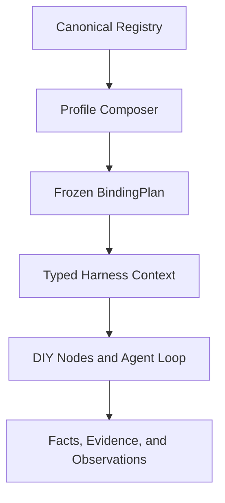

# Noe Universal Research Harness Design

> Status: design proposal for discussion; implementation is intentionally paused
>
> Date: 2026-09-09
>
> Scope: Noe platform, downstream method authoring, experiment execution, agent loops,
> model/environment integration, evidence, evaluation, and publication.

## 1. Executive summary

Noe should be the top-level **reproducible research harness** for the entire
agent-research platform. A downstream researcher should implement a method by
filling a small number of typed nodes and, when necessary, replacing the agent
loop. The platform should provide the rest of the path:

`method -> run -> assignment -> action -> measurement -> evaluation -> artifact`

The harness owns lifecycle, composition, validation, checkpointing, effect
safety, evidence, metrics, plotting integration, and finalization. The method
owns scientific semantics, hypotheses, policies, and method-local state.

The key architectural boundary is:

> Centralize the description and compilation of the system, but keep runtime
> calls typed, direct, scoped, and owned by the correct system.

Noe therefore must not become a global mutable plugin bus or a string-addressed
service locator. It should combine a canonical system registry, a typed
composition graph, a frozen binding plan, direct runtime ports, and separate
durable/observation planes.

## 2. Goals

The harness must make these workflows short and safe:

- create a new research method;
- select or replace model, environment, participant, tool, and evaluator providers;
- choose a standard or custom agent loop;
- define experiments, variants, assignments, and metrics;
- run locally, in Docker, or on a remote execution host;
- recover interrupted work without duplicating external effects;
- produce plots, tables, artifacts, and evidence automatically;
- reproduce a run from its recorded identities and digests;
- expose all downstream contracts from generated, inspectable schemas.

Performance is a first-class goal. Removing downstream ceremony must not mean
repeating qualification, graph resolution, schema generation, or architecture
checks on every decision cycle.

## 3. Non-goals

The harness is not intended to:

- make every scientific method look the same;
- replace domain-specific method logic with a universal workflow language;
- provide a global runtime dictionary of arbitrary services;
- collapse all state, effects, failures, and telemetry into one event log;
- allow an experiment to change its provider graph after execution begins;
- silently retry an external effect whose outcome is UNKNOWN;
- make the platform import downstream scientific types.

## 4. Design principles

1. One authority per durable state, external effect, artifact, and evidence domain.
2. The canonical registry owns topology and system ownership, not runtime behavior.
3. Composition roots choose providers and create typed ports.
4. Runtime consumers use direct immutable port references.
5. Every model-visible request is reconstructable from durable records.
6. Every external effect has intent, certainty, receipt, and reconciliation semantics.
7. Observation failure cannot mutate scientific truth.
8. A Study run freezes the binding plan and all identity-bearing configuration.
9. Workbench mode may be flexible before a run is admitted.
10. Downstream customization happens at declared nodes and typed extension points.
## 5. System model

Noe has several related but non-identical architectural partitions. They must
not be conflated.

### 5.1 Physical package groups

The repository groups implementation by semantic responsibility:

- foundation: kernel, governance, scope, and portfolio;
- infrastructure: lifecycle, resources, and reliability;
- capabilities: model, participant, and environment;
- research: execution and experimentation;
- evidence: data, artifact, and observability;
- product: operator and user-facing control contracts;
- components: reusable method mechanisms;
- orchestration: multi-agent topology and coordination.

These groups are dependency boundaries, not runtime registries.

### 5.2 Canonical system registry

The canonical registry is:

`noetrium_platform/foundation/governance/system_registry/catalog.json`

It currently describes the registered system tree, including 172 system
descriptors and 18 top-level roots. Each descriptor records identity,
parentage, package ownership, declared shape, requirements, provisions,
authority, and downstream surface.

The registry is the single declaration authority for:

- which systems exist;
- which system owns a package surface;
- which system owns a state/effect/artifact domain;
- which systems may depend on which capabilities;
- which public API surface is exposed downstream;
- the topology digest used by generated documentation and run evidence.

The registry is deliberately not a runtime service locator. Its runtime object
supports topology queries, generation, digesting, and observer notification.
It must not be used as `registry.get("model")` to discover a provider during
the hot path.

### 5.3 Three semantic record planes

Noe's record semantics are mechanically distinct:

1. **Durable fact plane**: authoritative facts for replay, reconstruction,
   scientific proof, effect state, checkpoints, and final evidence.
2. **Live interception plane**: current-execution hooks and policy decisions.
   They may influence the current call, but durable or model-visible changes
   require an explicit durable fact.
3. **Side-plane observation**: logs, metrics, traces, diagnostics, and
   projections. These are derived observations and cannot own primary truth.

The command/runtime plane invokes typed ports and causes facts. The durable
truth plane records the authoritative outcome. The observation plane receives
derived signals. A generic event bus must not replace this distinction.

### 5.4 Composition/runtime/event three-plane decision

The accepted composition decision has another three-part distinction:

1. typed capability composition graph for declaration and binding;
2. direct immutable port references for runtime calls;
3. a separate append-only event spine for observations and projections.

This is compatible with the three record planes, but it is not the same
classification. The first describes how systems are assembled; the second
describes what records mean.

## 6. Proposed top-level architecture



The top-level Harness consists of six cooperating layers:

1. **Registry layer**: canonical identities, ownership, topology, public surfaces.
2. **Profile layer**: selected systems, provider candidates, configuration, and
   method package metadata.
3. **Composition layer**: contract validation and frozen BindingPlan creation.
4. **Runtime layer**: direct typed ports, scopes, lifecycle, scheduling, and
   node execution.
5. **Research layer**: method nodes, agent loops, experiment definitions,
   assignments, evaluation, and plotting.
6. **Evidence layer**: durable facts, effect receipts, checkpoints, artifacts,
   manifests, projections, and publication gates.

The Harness facade is the downstream entry point. It is not a replacement for
the system-specific public facades; it composes them and exposes a smaller
scientific workflow surface.
## 7. Composition contracts

### 7.1 System contract

Every registered system continues to expose the standard shape:

`api + runtime + providers + composition`

The composition surface declares:

- stable system identity;
- owned capabilities and authorities;
- required capabilities;
- scope and lifecycle requirements;
- effect and durability behavior;
- contract and ABI digests;
- provider factory metadata;
- forbidden dependency edges.

The canonical registry remains the authority for system identity and ownership.
Provider selection belongs to the composition profile and BindingPlan.

### 7.2 Capability contract

A capability key is:

`namespace + name + major_version`

A requirement additionally declares:

- cardinality;
- optionality;
- required scope;
- required lifecycle phase;
- required interface/ABI digest;
- effect and failure semantics.

A provider offer declares its implementation identity, contract digest,
supported scopes, lifecycle, and evidence obligations.

The composer must fail closed on:

- unresolved required requirements;
- ambiguous providers without explicit profile selection;
- incompatible major versions or ABI/schema digests;
- invalid scope or lifecycle edges;
- forbidden parent/child or sibling dependencies;
- dependency cycles;
- secret values embedded in the plan.

### 7.3 BindingPlan

A BindingPlan is an immutable composition artifact containing:

- profile identity and configuration digest;
- registry topology digest;
- selected provider identities and revisions;
- capability edges;
- interface/ABI/schema digests;
- scope and lifecycle decisions;
- method package identity;
- agent loop identity;
- model/environment selection references;
- plan creation and compiler versions.

The plan is created once at a composition boundary. It is recorded in the
run manifest before model-visible work or external effects begin.

Runtime components receive the resulting typed ports directly. They do not
search the plan, registry, or provider table.

### 7.4 Direct runtime context

The runtime context is a typed, immutable bundle of already-bound ports:

- identity and scope ports;
- model request and prompt ports;
- participant and agent ports;
- environment/session ports;
- workflow and execution ports;
- data, artifact, evaluation, and plotting ports;
- effect, failure, checkpoint, and observability ports.

The context may expose narrow child facades for a node. A node receives only
the ports declared by its contract. A child composition cannot reach through
its facade to an unrelated grandchild implementation.

The context carries cancellation, run identity, trace identity, and immutable
configuration references. It does not expose a universal `Any` bag or a
string-keyed `require()` method.

## 7.5 Universal method runtime: maximum reuse with unrestricted semantics

The Harness must solve two seemingly conflicting requirements:

1. upstream implements almost all repeated engineering work;
2. downstream can express arbitrary agent research methods.

The solution is to separate **mechanism** from **scientific semantics**.

Noe owns the mechanisms: identity, scope, lifecycle, provider binding,
model/tool execution, memory, scheduling, checkpointing, effects, recovery,
evidence, evaluation, artifact handling, and observation.

The downstream method owns the semantics: state meaning, decision policy,
hypothesis, reward, agent interaction strategy, and domain-specific tools.

This produces the following four-layer model:

```text
Harness Kernel
  identity, scope, permissions, effects, checkpoints, recovery, evidence

Execution Fabric
  graph, actor, stream, matrix, external job, and human-loop execution

Research Packs
  single-agent, multi-agent, memory, tools, benchmark, training, and evaluation

Managed Method Program
  downstream scientific state, policy, custom nodes, or custom agent loop
```

### 7.5.1 Harness Kernel

The Kernel is closed and owned entirely by Noe. A method cannot bypass it.
It provides:

- identity and version binding;
- scope and lifecycle ownership;
- direct typed capability ports;
- model requests, prompt compilation, structured output, and function calling;
- tool registration, validation, concurrency, ordering, and error conversion;
- session, transcript, memory, and context transformation;
- checkpoint, replay, interruption, and resume;
- effect intent, receipt, certainty, reconciliation, and UNKNOWN handling;
- measurement, evaluation, artifact, and evidence closure;
- observation, logging, tracing, diagnostics, and status;
- resource allocation, process supervision, and environment sessions.

A custom method can change the algorithm above this boundary, but it cannot
replace the truth, effect, identity, or recovery authority below it.

### 7.5.2 Execution Fabric

The standard research phases are convenience syntax, not the complete semantic
model. The Execution Fabric must support multiple execution forms:

- graph/DAG for branches, loops, conditional transitions, and workflows;
- actor/mailbox for long-lived agents and asynchronous collaboration;
- event/stream for real-time environments and incremental observations;
- matrix/map-reduce for assignments, variants, ablations, and scale-out;
- external-job execution for training, simulation, remote work, and long tasks;
- human-gate execution for approvals, interventions, and interactive research;
- hierarchical execution for planners, workers, delegation, and debate.

Every execution form uses the same Kernel contracts for identity, state,
effects, checkpoints, recovery, and evidence. This prevents the default graph
runner from becoming an artificial limit on method semantics.

### 7.5.3 Research Packs

Research Packs are batteries-included compositions of registered Noe systems.
They are selected during composition and become direct typed bindings in the
compiled plan. They are not runtime service locators.

The initial Pack families are:

- SingleAgentPack;
- MultiAgentPack;
- PlanningPack;
- MemoryPack;
- ToolUsePack;
- InteractivePack;
- StreamingPack;
- RLPack;
- BenchmarkPack;
- TrainingPack;
- DistributedPack.

A Pack automatically assembles the relevant model, environment, participant,
execution, experimentation, data, artifact, observability, reliability,
resource, runtime, component, and orchestration systems. Downstream authors
select a Pack instead of manually wiring dozens of system facades.

A Pack may provide defaults for lifecycle, state persistence, tool execution,
evaluation, plotting, and publication. The downstream method overrides only
the semantic points it actually changes.

### 7.5.4 Managed Method Program

A Managed Method Program is the universal downstream execution boundary. It can
be declarative, callback-based, node-based, graph-based, actor-based, or a
fully custom agent loop.

The program may control:

- method state and state transitions;
- branching, looping, concurrency, and dynamic subtask creation;
- agent prompts, messages, tools, memory, and delegation;
- model-selection policy within the admitted contract;
- reward, evaluation, stopping, and reflection logic;
- child agents and custom execution topology.

The program receives a typed managed context and high-level operations. It
does not need to implement run management, durable writes, effect safety,
checkpoint serialization, or observation plumbing.

A custom loop is therefore free to implement any algorithm while the Kernel
automatically provides its surrounding runtime contract.

### 7.5.5 Progressive authoring levels

The downstream burden is reduced through progressive disclosure:

| Level | Downstream supplies | Noe supplies |
|---|---|---|
| 0 | configuration, prompt, schemas, and provider choices | complete standard loop and research lifecycle |
| 1 | one decision/policy function | state, context, tools, checkpoints, effects, metrics, and finalization |
| 2 | custom nodes, graph, state, and domain tools | execution runtime, scheduling, recovery, evidence, and publication |
| 3 | custom agent loop or execution model | managed Kernel boundary and all cross-cutting guarantees |

Level 0 and Level 1 should be the normal path for new methods. Level 2 and
Level 3 preserve unrestricted research expressiveness without forcing every
downstream project to rebuild platform mechanisms.

### 7.5.6 Universal method ABI

All four levels compile to a common Method ABI:

- method identity and revision;
- declared state schema;
- input and output schemas;
- required capabilities;
- control-flow/execution model;
- node or loop identity;
- effect and concurrency declarations;
- checkpoint and recovery declarations;
- metric and artifact declarations;
- evidence obligations.

Declarative methods compile to an internal research IR. Custom methods provide
the same ABI through a managed adapter. The IR is an optimization and
validation target, not a restriction that every method must expose its
internal algorithm as a fixed DAG.

The minimum method-specific semantic surface should be:

```text
MethodState
DecisionPolicy or MethodProgram
ToolDefinitions
EvaluationSpec
```

Everything else should be inherited from the selected Pack and Kernel.

### 7.5.7 What “arbitrary” means

Noe should be semantically universal for any method that declares its state,
capabilities, control flow, and effects. This includes ReAct, planning,
multi-agent, reflection, online learning, RL, streaming, human-in-the-loop,
long-running jobs, distributed execution, and custom state machines.

A method may contain arbitrary code, but only declared and mediated operations
can participate in Noe-certified evidence. Hidden global state, untracked
external effects, silent provider changes, and unrecoverable mutation are not
additional expressive features; they are outside the reproducible research
contract.

The target is therefore:

> Turing-complete method semantics with a finite, auditable, reproducible
> runtime boundary.

### 7.5.8 Automatic cross-cutting implementation

Noe should wrap every Managed Method Program with standard middleware for:

- run and assignment identity;
- scope creation and disposal;
- timing and resource accounting;
- state snapshots and checkpoint scheduling;
- model/tool request recording;
- effect intent and receipt recording;
- failure classification and recovery routing;
- metric collection and artifact registration;
- final evidence and manifest closure.

Middleware runs at declared lifecycle boundaries. It must not introduce a
global lookup on the hot path or require methods to call dozens of low-level
systems manually.


## 8. Harness modes

### 8.1 Workbench mode

Workbench is for method development:

- providers and nodes may be replaced before admission;
- profiles can be rebuilt quickly;
- local inspection and interactive experimentation are supported;
- validation is performed at profile compilation and run admission;
- no active Study may observe a mutable provider graph.

Workbench can support live UI/profile edits, but those edits create a new
candidate profile. They never mutate an already admitted run.

### 8.2 Study mode

Study is the reproducible execution mode:

- the BindingPlan is frozen;
- provider and method identities are immutable;
- model-visible prompt/tool schemas are versioned and recorded;
- run/session/assignment identities are explicit;
- checkpoints are bound to the plan and runtime identity;
- structural changes require a new run or new plan.

The Study boundary is where flexibility becomes scientific evidence.

### 8.3 Profile layering

Profiles may be assembled from:

1. platform defaults;
2. project defaults;
3. method package configuration;
4. experiment/variant configuration;
5. explicit CLI or API overrides.

The effective result is canonicalized before hashing. Equivalent declaration
orders must produce the same profile digest. Secret material is represented by
named references, never copied into the digest payload.
## 9. Downstream authoring model

A downstream method should primarily implement a small typed object:

- method metadata and identity;
- input/state/output schemas;
- method nodes;
- optional custom agent loop;
- metric/evaluation functions;
- optional plot/table renderers.

The platform supplies a standard lifecycle:

`declare -> compose -> admit -> execute -> checkpoint -> measure -> evaluate -> finalize`

A method may replace any node or the whole agent loop while retaining the
platform's evidence and effect contracts.

### 9.1 Node contract

Every node declares:

- stable node identity and revision;
- phase;
- typed input and output schemas;
- required ports;
- scope and concurrency requirements;
- idempotency key policy;
- checkpoint boundary;
- recovery policy;
- durable facts it may emit;
- observations it may publish.

A node returns a typed result or a typed failure outcome. It does not directly
write another system's durable state or bypass effect execution.

### 9.2 Standard research phases

The initial standard graph should provide these replaceable phases:

1. **Author**: define method, experiment, variants, and workload.
2. **Admission**: qualify model/environment/participant and freeze identities.
3. **Plan**: expand assignments and resolve run-scoped resources.
4. **Execute**: run the method or agent loop.
5. **Act**: route external effects through effect-safe execution.
6. **Measure**: collect task and system measurements.
7. **Evaluate**: compute metrics, uncertainty, comparisons, and regressions.
8. **Render**: produce plots, tables, reports, and machine-readable summaries.
9. **Finalize**: close artifact/evidence/hash relationships and publish manifest.

The method may skip irrelevant phases only through an explicit contract. The
omitted phase must still have an evidence policy.

### 9.3 AgentLoopPort

Agent loops are replaceable implementations of one typed port. A loop receives:

- the bound model-request port;
- prompt and context assembly ports;
- tool registry/pipeline port;
- durable transcript or method-state port;
- cancellation and scope;
- checkpoint/evidence writer;
- optional steering/follow-up source.

A loop may be ReAct, planning-based, Pi-style, DSH-style, finite-state, graph
based, or entirely custom. The loop must still preserve:

- reconstructable model requests;
- validated structured output/tool calls;
- durable accepted messages and tool results;
- explicit tool ordering/concurrency;
- cancellation and stop semantics;
- checkpoint and recovery boundaries;
- effect intent and reconciliation;
- final result/evidence closure.

This separates loop freedom from scientific and operational guarantees.

## 10. Agent and tool behavior

The standard agent implementation should offer:

- plain text and structured model output;
- JSON Schema and function/tool calling;
- model request reconstruction;
- context transformation and compaction;
- sequential or bounded parallel tool execution;
- pre-tool guards and post-tool policies;
- steering/follow-up queues;
- cancellation and idle barriers;
- explicit turn stopping policies;
- durable transcript/state adapters.

Structured output is a platform capability. Downstream methods should declare
schemas and consume typed results instead of rebuilding provider-specific
parsing, retry, and validation code.

Tools must declare:

- stable identity and schema;
- execution mode;
- effect classification;
- idempotency/reconciliation behavior;
- required capability scope;
- result/error schema.

A tool failure must become a typed failure/tool-result fact. It must not be
silently returned as successful text.
## 11. Runtime lifecycle

The Harness lifecycle is a rollback-aware state machine:

`declared -> composed -> validated -> admitted -> running -> finalizing -> completed`

Failure transitions are explicit:

`composed -> rejected`
`admitted -> failed`
`running -> interrupted -> resumable`
`finalizing -> evidence_incomplete`

### 11.1 Composition

The composition root:

1. loads the canonical registry and generated public interface metadata;
2. collects profile and method contracts;
3. indexes provider offers by capability and ABI;
4. resolves and validates the graph;
5. creates the immutable BindingPlan;
6. records the plan digest and provider identities.

No model request or external effect is admitted before this boundary.

### 11.2 Admission

Run admission performs the checks whose result must be stable for the run:

- model qualification closure;
- participant binding;
- workflow surface assembly;
- structural environment recovery capability;
- resource and runtime identity;
- evidence and artifact destinations;
- method/profile compatibility.

Successful admission is run-scoped and can be reused inside the run. A failed
proof is never cached as success.

### 11.3 Execution

Execution creates hierarchical scopes:

`Study -> Run -> Assignment -> DecisionCycle -> Effect`

The hot path uses direct ports and run-scoped pinned providers. Decision-cycle
scopes hold temporary registrations and leases only for that cycle.

### 11.4 Teardown and recovery

Every owned resource has an idempotent disposer. Disposal is quiescent and
converges when called repeatedly or concurrently.

A failed node must report whether it:

- produced no durable fact;
- committed a durable fact;
- dispatched an external effect;
- has an UNKNOWN external outcome;
- produced a resumable checkpoint.

Recovery uses the owning system's authority. It never guesses from logs.

## 12. Three planes in a single operation

For an environment action:

1. Command/runtime plane validates and invokes the typed environment/effect port.
2. Durable truth plane records intent, request digest, receipt, certainty,
   reconciliation, and commit consumption.
3. Observation plane publishes timing, traces, diagnostics, and projections.

The observation event may reference the durable fact, but it cannot become the
fact. If observation delivery fails, the action truth remains intact.

For a model request:

1. prompt/context/tool assembly builds the semantic request;
2. canonical request body, prompt, and tool schema are persisted before the
   provider call;
3. the request envelope records identities and content references;
4. the model port dispatches the exact reconstructed request;
5. stream and terminal observations remain separate from durable messages.

Invariant:

`actual model-visible bytes == durable reconstruction bytes`

## 13. Performance design

The harness removes ceremony by moving work to the correct frequency:

| Frequency | Required work |
|---|---|
| Release/source revision | source and architecture gates |
| Run admission | model qualification, participant binding, workflow assembly, structural environment proof |
| Assignment | fresh world/session and participant checkpoint |
| External action | exact request digest, effect intent, receipt, reconciliation, commit consumption |
| Finalization | measurement coverage, artifact/evidence/hash closure |
| Decision cycle | only direct port calls, local policy, scoped leases, and necessary checkpointing |

Performance rules:

- compile and freeze the graph once;
- index providers once, rather than rescanning all offers;
- compute ABI and tool-schema digests once per relevant revision;
- pin qualified providers per run, not globally;
- reuse run-scoped context and model clients;
- keep direct object references on the hot path;
- do not perform release verification inside every run;
- do not use a universal event bus for local calls;
- do not turn observability into synchronous runtime coordination.

A provider replacement or schema change invalidates the relevant plan and
starts a new run. It cannot silently alter a live run.

## 14. Failure, safety, and scientific firewalls

The following rules are mandatory:

- UNKNOWN effect outcomes are not blindly retried;
- post-policy rejection records that an effect may already have happened;
- J_audit and J_eval cannot write materialized method memory;
- observer failures cannot mutate durable truth;
- external effects require intent/certainty/reconciliation;
- checkpoints bind plan, provider, runtime, and schema identities;
- final artifacts require complete evidence/hash closure;
- no hidden import-order provider selection;
- no mutable global provider table after Study admission;
- no arbitrary universal context object;
- no platform imports of downstream scientific types;
- no method imports of concrete environment/server/process management.

## 15. Generated downstream interface

The current generated downstream systems catalog and interface schema are the
foundation for automation. The next Harness layer should add:

- a profile template schema;
- a method/node template;
- an AgentLoopPort template;
- generated typed context hints for each selected capability;
- generated run/evaluation/plotting entry points;
- contract linting before execution;
- a CLI/API that can create a valid method skeleton.

The downstream discovery API remains read-only metadata discovery. It must never
become runtime dependency resolution.

The desired authoring experience is conceptually:

`noe init method`
`noe compose`
`noe run`
`noe evaluate`
`noe render`

The CLI may produce a conventional Python package, but it must ultimately call
the same public contracts and composition root as SDK users.

## 16. DSH and Pi adoption boundary

### 16.1 Adopt from DSH

Adopt the following ideas:

- composition by named profiles;
- plugin/facet-like independent composition units;
- lifecycle ownership and reverse-order disposal;
- setup/activation separated from runtime execution;
- agent loop as a replaceable driver;
- session/transcript as reconstructable source material;
- scoped per-agent and per-run contributions;
- structured event and hook seams;
- bounded parallel tool execution and explicit barriers;
- rollback-aware creation and teardown.

### 16.2 Do not adopt from DSH

Do not adopt:

- a global mutable runtime service locator;
- unconstrained “everything is a plugin” semantics;
- one universal event log for all domain truth;
- runtime patching that changes scientific treatment identity;
- provider dynamism that invalidates a running study.

DSH's profile/lifecycle lessons are useful, but Noe's scientific reproducibility
and authority boundaries remain stronger constraints.

### 16.3 Adopt from Pi

Adopt:

- a small stable Agent contract;
- a separate low-level agent loop;
- context transformation and message conversion boundaries;
- tool execution policy hooks;
- steering/follow-up queues;
- explicit cancellation, idle, and stop barriers;
- support for custom message types with a model-facing conversion layer;
- keeping generic composition separate from the agent package.

### 16.4 Do not adopt from Pi

Pi deliberately leaves permissions, sandboxing, experiment evidence, and
scientific workflow semantics to extensions or applications. Noe must provide
those as platform contracts because they are necessary for research integrity.

Chord's useful lesson is the strongest one: plugin setup declares shape, the
host validates the complete graph, providers activate before consumers, and
resources dispose in reverse dependency order. Stable facades may survive
provider replacement in Workbench, but Study bindings remain frozen.

## 17. Migration from the current preliminary Harness draft

The existing uncommitted Harness draft is a prototype only. Before exposing it
as public API:

1. replace string-keyed runtime service lookup with composition-time typed binding;
2. separate profile metadata from instantiated runtime objects;
3. make the compiled plan immutable and evidence-bearing;
4. make node contracts declare ports, schemas, scope, and recovery;
5. route all durable facts/effects/checkpoints through existing Noe authorities;
6. reuse the existing graph/checkpointer substrate where semantics match;
7. expose the Harness through generated/public facades;
8. add contract, lifecycle, recovery, and performance tests;
9. keep SEM on its frozen branch and validate integration in an isolated fixture.

No preliminary API should be treated as stable until these boundaries are
implemented and registered in the canonical catalog.

## 18. Implementation phases

### Phase A: contract and registry

- register the Harness system and its public shape;
- define profile, capability, BindingPlan, node, and loop contracts;
- extend generated capability/interface schemas;
- add architecture and ownership checks.

### Phase B: composition and runtime

- implement typed profile compilation;
- validate provider graph, scopes, lifecycle, ABI, and forbidden edges;
- instantiate direct runtime ports;
- implement Workbench and Study lifecycle boundaries.

### Phase C: research graph

- standardize author/admission/execute/measure/evaluate/render/finalize nodes;
- connect graph checkpoints and run-scope pinning;
- support custom agent loops through AgentLoopPort;
- add structured output and tool-calling adapters.

### Phase D: automation and developer experience

- add method templates and `noe init`;
- generate selected capability context and schemas;
- add CLI/SDK commands for compose, run, evaluate, and render;
- provide one complete reference research method.

### Phase E: validation and cutover

- run contract and architecture checks;
- run focused unit and integration suites;
- run a non-SEM end-to-end fixture;
- perform SEM conformance only after its frozen experiment is complete;
- commit locally; push only in the final release batch.

## 19. Acceptance criteria

The design is ready for implementation only when:

- a new method can be created without importing concrete platform providers;
- a custom agent loop can run through the same evidence/effect contract;
- the same profile produces the same BindingPlan digest;
- a Study cannot mutate its provider graph after admission;
- runtime calls do not perform string service resolution;
- model-visible requests are reconstructable;
- tool calls and external actions have durable outcomes;
- interruption and resume preserve identity and do not duplicate effects;
- evaluation and rendering produce linked artifacts and evidence;
- observation failure cannot corrupt scientific truth;
- generated downstream schemas describe the public surface;
- performance tests show no per-cycle global graph scan or release gate.

## 20. Decisions for confirmation

Recommended defaults:

1. Plugins are dynamic only during composition/Workbench; Study is frozen.
2. Provide one high-level Harness facade plus system-specific escape-hatch
   facades for advanced users.
3. Standardize lifecycle, schemas, evidence, recovery, and effect semantics;
   leave method algorithms and agent-loop strategy fully DIY.
4. Treat the canonical registry as topology authority and BindingPlan as the
   run-specific provider authority.
5. Keep the event spine observational and keep durable truth domain-owned.

Once these defaults are confirmed, implementation should begin by replacing the
preliminary runtime draft with the typed composition model above.
